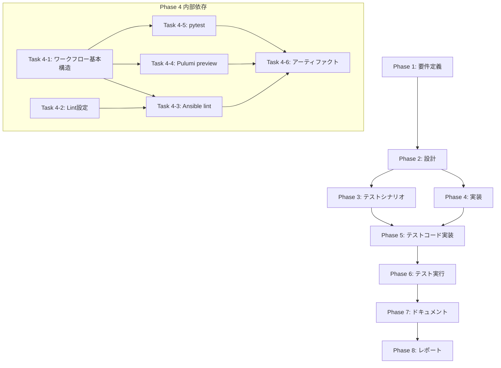

# プロジェクト計画書: Issue #520

## 概要

**Issue**: [Enhancement] CIでAnsible lint/Pulumi preview/pytestを並列実行しIaC変更を自動ゲートする

**URL**: https://github.com/tielec/infrastructure-as-code/issues/520

---

## 1. Issue分析

### 1.1 複雑度判定: **中程度**

#### 判定根拠

- **新規ファイル作成が中心**: `.github/workflows/iac-ci.yml`を新規作成
- **複数ツールの統合**: Ansible lint、yamllint、Pulumi preview、pytestの4つのツールを統合
- **既存コードへの影響は限定的**: 新規CIワークフローの追加であり、既存のAnsible/Pulumi/テストコードの変更は最小限
- **環境設定の考慮**: GitHub Actionsシークレット、S3バックエンド、キャッシュ設定が必要

### 1.2 見積もり工数: **12〜16時間**

| フェーズ | 見積もり |
|---------|---------|
| 要件定義 | 1〜2時間 |
| 設計 | 2〜3時間 |
| テストシナリオ | 1〜2時間 |
| 実装 | 4〜6時間 |
| テストコード実装 | 1〜2時間 |
| テスト実行・修正 | 1〜2時間 |
| ドキュメント | 1〜2時間 |
| レポート | 0.5〜1時間 |

### 1.3 リスク評価: **中**

- S3バックエンドとPulumiパスフレーズの設定がCI環境で正しく動作するか
- Pulumiプロジェクトが23個あり、全てをpreviewするか、変更検知して対象を絞るか
- GitHub Actionsのワークフロー制限（実行時間、同時実行数）

---

## 2. 実装戦略判断

### 実装戦略: **CREATE**

**判断根拠**:
- 現状、`.github/workflows/`ディレクトリが存在せず、GitHub Actionsは未使用
- 新規に`iac-ci.yml`ワークフローファイルを作成する必要がある
- Ansible lint設定ファイル（`.ansible-lint`、`.yamllint`）も新規作成が必要
- 既存コード（Ansible、Pulumi、pytest）の修正は不要、CIから呼び出すのみ

### テスト戦略: **INTEGRATION_ONLY**

**判断根拠**:
- CIワークフロー自体はGitHub Actions上で実行されるため、ローカルでのユニットテストは困難
- ワークフローの検証は実際のPR作成によるインテグレーションテストが最も効果的
- 既存のpytestテスト（`tests/integration/`）をCIで実行することで品質保証
- ワークフローYAMLの構文チェック（actionlint等）をローカルで実施可能

### テストコード戦略: **CREATE_TEST**

**判断根拠**:
- CIワークフローの検証用テストは新規作成が必要
- ワークフローYAMLの構文検証スクリプトを作成
- 既存の`tests/integration/`テストはそのまま活用（CI経由で実行）

---

## 3. 影響範囲分析

### 3.1 既存コードへの影響

| ファイル/ディレクトリ | 影響内容 | 影響度 |
|---------------------|---------|-------|
| `.github/workflows/` | 新規ディレクトリ・ファイル作成 | 新規 |
| `ansible/ansible.cfg` | 変更なし（参照のみ） | なし |
| `ansible/.ansible-lint` | 新規作成（lint設定） | 新規 |
| `ansible/.yamllint` | 新規作成（lint設定） | 新規 |
| `pulumi/*/package.json` | 変更なし（npm ci実行対象） | なし |
| `tests/integration/` | 変更なし（pytest実行対象） | なし |
| `README.md` | CIバッジ追加（任意） | 軽微 |

### 3.2 依存関係の変更

#### 新規依存（GitHub Actions）
- `actions/checkout@v4`
- `actions/setup-python@v5`
- `actions/setup-node@v4`
- `actions/upload-artifact@v4`
- `pulumi/actions@v6`（または手動セットアップ）

#### 必要なGitHub Actionsシークレット
- `AWS_ACCESS_KEY_ID`: AWSアクセスキー（Pulumi preview用）
- `AWS_SECRET_ACCESS_KEY`: AWSシークレットキー
- `PULUMI_CONFIG_PASSPHRASE`: Pulumiパスフレーズ
- `PULUMI_STATE_BUCKET`: S3バケット名（オプション、SSMから取得も可能）

### 3.3 マイグレーション要否

- **データベーススキーマ変更**: なし
- **設定ファイル変更**: `.ansible-lint`、`.yamllint`の新規作成
- **環境変数追加**: GitHub Actionsシークレットの設定（手動）

---

## 4. タスク分割

### Phase 1: 要件定義 (見積もり: 1~2h)

- [x] Task 1-1: 現状のCI/CD環境の詳細分析 (0.5h)
  - 既存のJenkinsパイプラインの確認
  - GitHub Actionsとの役割分担の明確化
- [x] Task 1-2: CIゲートの品質基準定義 (0.5h)
  - Ansible lint通過基準
  - Pulumi preview成功基準
  - pytest通過基準
- [x] Task 1-3: ワークフロートリガー条件の定義 (0.5h)
  - PRイベント（opened, synchronize）
  - 対象ファイルパターン（paths filter）
  - ブランチ制限

### Phase 2: 設計 (見積もり: 2~3h)

- [x] Task 2-1: ワークフローアーキテクチャ設計 (1h)
  - matrix戦略の設計（並列実行）
  - ジョブ依存関係の設計
  - キャッシュ戦略の設計
- [x] Task 2-2: Ansible lint設定設計 (0.5h)
  - `.ansible-lint`設定項目の決定
  - `.yamllint`設定項目の決定
  - 除外パターンの設計
- [x] Task 2-3: Pulumi preview設計 (1h)
  - 対象スタックの選定方針
  - S3バックエンドログイン方法
  - 変更検知と対象絞り込み戦略
- [x] Task 2-4: pytest実行設計 (0.5h)
  - テスト対象ディレクトリの確認
  - 環境変数モックの設計
  - テストレポート出力形式

### Phase 3: テストシナリオ (見積もり: 1~2h)

- [ ] Task 3-1: ワークフロー検証シナリオ作成 (0.5h)
  - 正常系シナリオ（全テスト通過）
  - 異常系シナリオ（各ツール失敗時）
- [ ] Task 3-2: 並列実行検証シナリオ作成 (0.5h)
  - 3ジョブ並列実行の確認
  - 個別ジョブ失敗時の全体挙動
- [ ] Task 3-3: キャッシュ効果検証シナリオ作成 (0.5h)
  - キャッシュヒット時の実行時間短縮
  - キャッシュミス時の挙動

### Phase 4: 実装 (見積もり: 4~6h)

- [ ] Task 4-1: .github/workflows/iac-ci.yml作成 (2h)
  - ワークフロー基本構造の作成
  - matrix設定（ansible-lint, pulumi-preview, pytest）
  - 環境変数・シークレット設定
- [ ] Task 4-2: Ansible lint設定ファイル作成 (1h)
  - `.ansible-lint`の作成
  - `.yamllint`の作成
  - ansible/ディレクトリへの配置
- [ ] Task 4-3: Ansible lintジョブ実装 (0.5h)
  - Python環境セットアップ
  - ansible-lint/yamllintインストール
  - lint実行とレポート出力
- [ ] Task 4-4: Pulumi previewジョブ実装 (1.5h)
  - Node.js環境セットアップ
  - AWS認証設定
  - Pulumiログイン（S3バックエンド）
  - 対象プロジェクトでのpreview実行
- [ ] Task 4-5: pytestジョブ実装 (0.5h)
  - Python環境セットアップ
  - pytest実行
  - テストレポートアーティファクト保存
- [ ] Task 4-6: アーティファクトアップロード設定 (0.5h)
  - ログファイルの保存
  - テストレポートの保存
  - 失敗時の詳細情報保存

### Phase 5: テストコード実装 (見積もり: 1~2h)

- [ ] Task 5-1: ワークフローYAML構文検証スクリプト作成 (0.5h)
  - actionlintによる構文チェック
  - ローカル実行可能なスクリプト
- [ ] Task 5-2: CI設定検証テスト作成 (1h)
  - ワークフローファイルの存在確認
  - 必須ジョブの定義確認
  - シークレット参照の確認

### Phase 6: テスト実行 (見積もり: 1~2h)

- [ ] Task 6-1: ローカル構文検証実行 (0.5h)
  - actionlintによるワークフロー構文チェック
  - yamllintによるYAML構文チェック
- [ ] Task 6-2: テストPRでの動作検証 (1h)
  - 実際のPR作成によるワークフロー実行
  - 各ジョブの成功/失敗確認
  - 実行時間の計測
- [ ] Task 6-3: エラーケースの検証 (0.5h)
  - 意図的なlintエラー導入
  - ワークフロー失敗時の通知確認

### Phase 7: ドキュメント (見積もり: 1~2h)

- [ ] Task 7-1: CI/CDドキュメント作成 (1h)
  - ワークフローの説明
  - トリガー条件の説明
  - シークレット設定手順
- [ ] Task 7-2: README.md更新 (0.5h)
  - CIバッジの追加
  - CI実行方法の記載
- [ ] Task 7-3: トラブルシューティングガイド追加 (0.5h)
  - よくあるエラーと対処法
  - ローカルでの事前検証方法

### Phase 8: レポート (見積もり: 0.5~1h)

- [ ] Task 8-1: 実装完了レポート作成 (0.5h)
  - 実装内容のサマリ
  - テスト結果のサマリ
  - 今後の改善提案

---

## 5. 依存関係



---

## 6. リスクと軽減策

### リスク1: Pulumiパスフレーズ・S3バックエンドのCI環境での動作

- **影響度**: 高
- **確率**: 中
- **軽減策**:
  - 事前にローカルでPulumi loginコマンドを検証
  - GitHub ActionsシークレットでPULUMI_CONFIG_PASSPHRASEを設定
  - pulumi login s3://bucket-name コマンドをワークフローに含める
  - 失敗時は詳細ログをアーティファクトとして保存

### リスク2: 23個のPulumiプロジェクト全てのpreviewによる実行時間超過

- **影響度**: 中
- **確率**: 高
- **軽減策**:
  - 変更ファイルに基づいて対象プロジェクトを動的に絞り込む
  - 最初は代表的なプロジェクト（jenkins-controller等）のみでPoCを実施
  - 並列実行（matrix）でプロジェクト毎にジョブを分散
  - GitHub Actionsのタイムアウト設定を適切に設定（30分等）

### リスク3: GitHub Actionsシークレットの設定漏れ

- **影響度**: 高
- **確率**: 中
- **軽減策**:
  - 必要なシークレット一覧をドキュメントに明記
  - シークレット未設定時のエラーメッセージを分かりやすくする
  - ワークフロー実行前のシークレット存在チェックを追加

### リスク4: Ansible lintルールとの既存コードの不整合

- **影響度**: 中
- **確率**: 中
- **軽減策**:
  - 最初は警告レベルで実行し、エラーのみをブロッカーにする
  - 段階的にルールを厳格化
  - 既存の問題箇所は`.ansible-lint`で一時的に除外

### リスク5: 既存Jenkinsパイプラインとの役割の混乱

- **影響度**: 低
- **確率**: 低
- **軽減策**:
  - GitHub ActionsはPRの品質ゲート、Jenkinsはデプロイメント実行と役割を明確化
  - ドキュメントで両者の役割分担を明記

---

## 7. 品質ゲート

### Phase 1: 要件定義
- [ ] CIゲートの品質基準が明確に定義されている
- [ ] トリガー条件が明確に定義されている
- [ ] 既存のJenkinsとの役割分担が明確化されている

### Phase 2: 設計
- [x] 実装戦略の判断根拠が明記されている（CREATE）
- [x] テスト戦略の判断根拠が明記されている（INTEGRATION_ONLY）
- [x] ワークフローアーキテクチャが図示されている
- [x] キャッシュ戦略が定義されている
- [x] Pulumiプロジェクト選定方針が決定されている

### Phase 3: テストシナリオ
- [ ] 正常系・異常系のシナリオが定義されている
- [ ] 並列実行の検証シナリオが定義されている
- [ ] 実行時間の目標値が設定されている

### Phase 4: 実装
- [ ] `.github/workflows/iac-ci.yml`が作成されている
- [ ] Ansible lint設定ファイルが作成されている
- [ ] 3つのジョブ（ansible-lint, pulumi-preview, pytest）が実装されている
- [ ] アーティファクトアップロードが設定されている

### Phase 5: テストコード実装
- [ ] ワークフローYAML構文検証スクリプトが作成されている
- [ ] CI設定検証テストが作成されている

### Phase 6: テスト実行
- [ ] ローカル構文検証が成功している
- [ ] テストPRでのワークフロー実行が成功している
- [ ] 各ジョブの実行時間が許容範囲内である

### Phase 7: ドキュメント
- [ ] CI/CDドキュメントが作成されている
- [ ] README.mdが更新されている
- [ ] シークレット設定手順が記載されている
- [ ] トラブルシューティングガイドが追加されている

### Phase 8: レポート
- [ ] 実装完了レポートが作成されている
- [ ] 今後の改善提案が記載されている

---

## 8. 技術的詳細

### 8.1 ワークフロー構成案

```yaml
name: IaC CI

on:
  pull_request:
    branches: [main, develop]
    paths:
      - 'ansible/**'
      - 'pulumi/**'
      - 'tests/**'
      - 'jenkins/**'

jobs:
  ansible-lint:
    runs-on: ubuntu-latest
    steps:
      - uses: actions/checkout@v4
      - uses: actions/setup-python@v5
        with:
          python-version: '3.11'
          cache: 'pip'
      - run: pip install ansible-lint yamllint
      - run: ansible-lint ansible/
      - run: yamllint ansible/

  pulumi-preview:
    runs-on: ubuntu-latest
    env:
      PULUMI_CONFIG_PASSPHRASE: ${{ secrets.PULUMI_CONFIG_PASSPHRASE }}
      AWS_REGION: ap-northeast-1
    steps:
      - uses: actions/checkout@v4
      - uses: actions/setup-node@v4
        with:
          node-version: '20'
          cache: 'npm'
          cache-dependency-path: 'pulumi/jenkins-controller/package-lock.json'
      - run: npm ci
        working-directory: pulumi/jenkins-controller
      - run: pulumi login s3://${{ secrets.PULUMI_STATE_BUCKET }}
      - run: pulumi preview --stack dev --non-interactive
        working-directory: pulumi/jenkins-controller

  pytest:
    runs-on: ubuntu-latest
    env:
      AWS_REGION: ap-northeast-1
    steps:
      - uses: actions/checkout@v4
      - uses: actions/setup-python@v5
        with:
          python-version: '3.11'
          cache: 'pip'
      - run: pip install pytest pyyaml
      - run: pytest tests/integration -v
      - uses: actions/upload-artifact@v4
        if: failure()
        with:
          name: test-results
          path: tests/
```

### 8.2 Ansible lint設定案

```yaml
# .ansible-lint
profile: production
exclude_paths:
  - .cache/
  - fact_cache/
  - ansible.log
skip_list:
  - yaml[line-length]  # 長い行は許容
warn_list:
  - no-changed-when
  - command-instead-of-module
```

### 8.3 対象Pulumiプロジェクト（初期）

初期実装では以下の代表的なプロジェクトでPoCを実施：

1. `pulumi/jenkins-controller` - メインコンポーネント
2. `pulumi/jenkins-network` - ネットワーク基盤
3. `pulumi/jenkins-security` - セキュリティ設定

全23プロジェクトのpreviewは、段階的に追加する方針とする。

---

## 9. 成功基準

### 9.1 必須達成項目
- [ ] GitHub ActionsワークフローがPRイベントで自動実行される
- [ ] Ansible lint/yamllintが正常に実行され、エラーがPRに通知される
- [ ] Pulumi previewが最低1つのスタックで成功する
- [ ] 既存のpytestが全て通過する
- [ ] 失敗時にログがアーティファクトとして保存される

### 9.2 推奨達成項目
- [ ] 3つのジョブが並列実行され、合計実行時間が15分以内
- [ ] キャッシュによる2回目以降の実行時間短縮（30%以上）
- [ ] 変更ファイルに基づくPulumiプロジェクトの動的選択

---

## 10. 備考

### 既存環境の特徴
- GitHub Actionsは未使用（Jenkinsが中心）
- Ansible lint設定（`.ansible-lint`、`.yamllint`）が未作成
- pytest.iniは`jenkins/jobs/pipeline/infrastructure/pulumi-stack-action/`に存在
- Pulumiプロジェクトは23個（Jenkins: 12個、Lambda: 11個）
- 既存テストは`tests/integration/`にPython/Shellで実装済み

### 将来の拡張
- Jenkinsへのワークフロー移植（Issue提案に記載）
- 全Pulumiプロジェクトへの段階的拡大
- Terraform/CloudFormationへの対応（必要時）
