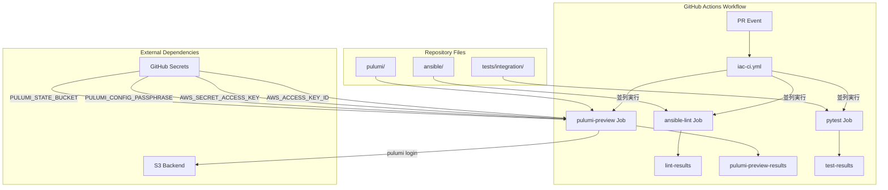
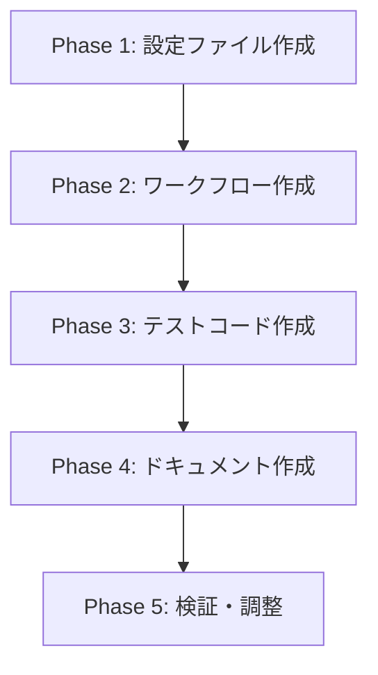

# 詳細設計書: Issue #520

## IaC CI/CD パイプライン - Ansible lint / Pulumi preview / pytest 並列実行

---

## 0. Planning Document確認

本設計書は、Planning Phase（`.ai-workflow/issue-520/00_planning/output/planning.md`）および要件定義書（`.ai-workflow/issue-520/01_requirements/output/requirements.md`）に基づいて作成されています。

### 開発計画サマリ

- **複雑度**: 中程度
- **見積もり工数**: 12〜16時間
- **リスク評価**: 中（S3バックエンド、パスフレーズ設定、23個のPulumiプロジェクト管理）

---

## 1. 実装戦略判断

### 実装戦略: CREATE（新規作成）

**判断根拠**:
1. **GitHub Actionsワークフローが未存在**: `.github/workflows/` ディレクトリが存在せず、完全に新規作成が必要
2. **lint設定ファイルが未存在**: `.ansible-lint`、`.yamllint` が存在しないため新規作成が必要
3. **既存コードへの影響が最小限**: 既存のAnsible/Pulumi/テストコードの修正は不要であり、CIから呼び出すのみ
4. **独立したコンポーネント**: 新規CIワークフローは既存のJenkinsパイプラインと独立して動作

---

## 2. テスト戦略判断

### テスト戦略: INTEGRATION_ONLY

**判断根拠**:
1. **GitHub Actionsワークフローの特性**: CIワークフロー自体はGitHub Actions上で実行されるため、ローカルでのユニットテストは困難
2. **既存テスト資産の活用**: `tests/integration/` に既存のpytestテストが存在し、これらをCI経由で実行することで品質保証を実現
3. **実環境での検証が最適**: ワークフローの動作確認は実際のPR作成によるインテグレーションテストが最も効果的
4. **構文チェックの自動化**: actionlint等によるワークフローYAMLの構文チェックをローカルで実施可能

---

## 3. テストコード戦略判断

### テストコード戦略: CREATE_TEST

**判断根拠**:
1. **ワークフロー検証用テストが未存在**: CIワークフローの検証用テストは新規作成が必要
2. **既存テストとの独立性**: 新規CIワークフローのテストは既存の `tests/integration/` テストとは別の目的を持つ
3. **CI設定検証の必要性**: ワークフローファイルの存在確認、必須ジョブの定義確認、シークレット参照の確認が必要

---

## 4. アーキテクチャ設計

### 4.1 システム全体図

```
┌─────────────────────────────────────────────────────────────────┐
│                     GitHub Pull Request                          │
│  (main/develop ブランチへのPR、対象パス変更時にトリガー)              │
└──────────────────────────┬──────────────────────────────────────┘
                           │
                           ▼
┌─────────────────────────────────────────────────────────────────┐
│                  GitHub Actions Workflow                         │
│                    .github/workflows/iac-ci.yml                  │
│                                                                   │
│  ┌────────────────┐  ┌────────────────┐  ┌────────────────┐     │
│  │  ansible-lint  │  │ pulumi-preview │  │     pytest     │     │
│  │     Job        │  │      Job       │  │      Job       │     │
│  │                │  │                │  │                │     │
│  │ • yamllint     │  │ • npm ci       │  │ • pip install  │     │
│  │ • ansible-lint │  │ • pulumi login │  │ • pytest       │     │
│  │ • レポート出力 │  │ • preview      │  │ • レポート保存 │     │
│  └───────┬────────┘  └───────┬────────┘  └───────┬────────┘     │
│          │                   │                   │               │
│          ▼                   ▼                   ▼               │
│  ┌─────────────────────────────────────────────────────────┐    │
│  │              actions/upload-artifact@v4                  │    │
│  │              (失敗時のログ・レポート保存)                  │    │
│  └─────────────────────────────────────────────────────────┘    │
└─────────────────────────────────────────────────────────────────┘
                           │
                           ▼
┌─────────────────────────────────────────────────────────────────┐
│                    PR Status Check                               │
│              (全ジョブ成功時のみマージ可能)                        │
└─────────────────────────────────────────────────────────────────┘
```

### 4.2 コンポーネント間の関係



### 4.3 データフロー

```
1. PRイベント発生
   │
   ├─→ paths フィルタ判定
   │   └─ ansible/**, pulumi/**, tests/**, jenkins/** 変更時のみ実行
   │
   ▼
2. 3つのジョブが並列起動
   │
   ├─→ ansible-lint Job
   │   ├─ actions/checkout@v4
   │   ├─ actions/setup-python@v5 (cache: pip)
   │   ├─ pip install ansible-lint yamllint
   │   ├─ yamllint ansible/
   │   ├─ ansible-lint ansible/
   │   └─ 失敗時: artifact保存
   │
   ├─→ pulumi-preview Job
   │   ├─ actions/checkout@v4
   │   ├─ actions/setup-node@v4 (cache: npm)
   │   ├─ AWS認証設定 (secrets)
   │   ├─ pulumi login s3://...
   │   ├─ npm ci (jenkins-controller)
   │   ├─ pulumi preview --non-interactive
   │   └─ 失敗時: artifact保存
   │
   └─→ pytest Job
       ├─ actions/checkout@v4
       ├─ actions/setup-python@v5 (cache: pip)
       ├─ pip install pytest pyyaml
       ├─ pytest tests/integration/ -v
       └─ 失敗時: artifact保存
```

---

## 5. 影響範囲分析

### 5.1 既存コードへの影響

| ファイル/ディレクトリ | 影響内容 | 影響度 |
|---------------------|---------|-------|
| `.github/workflows/` | 新規ディレクトリ・ファイル作成 | **新規** |
| `ansible/.ansible-lint` | 新規作成（lint設定） | **新規** |
| `ansible/.yamllint` | 新規作成（lint設定） | **新規** |
| `ansible/ansible.cfg` | 変更なし（参照のみ） | なし |
| `pulumi/*/package.json` | 変更なし（npm ci実行対象） | なし |
| `tests/integration/` | 変更なし（pytest実行対象） | なし |
| `README.md` | CIバッジ追加（任意） | 軽微 |
| `docs/CI.md` | CI/CDドキュメント新規作成 | **新規** |

### 5.2 依存関係の変更

#### 新規依存（GitHub Actions）

| Action | バージョン | 用途 |
|--------|----------|------|
| `actions/checkout` | v4 | ソースコードチェックアウト |
| `actions/setup-python` | v5 | Python環境セットアップ + キャッシュ |
| `actions/setup-node` | v4 | Node.js環境セットアップ + キャッシュ |
| `actions/upload-artifact` | v4 | アーティファクトアップロード |

#### 必要なGitHub Actionsシークレット

| シークレット名 | 説明 | 必須 |
|---------------|------|------|
| `AWS_ACCESS_KEY_ID` | AWSアクセスキーID（Pulumi preview用） | **必須** |
| `AWS_SECRET_ACCESS_KEY` | AWSシークレットアクセスキー | **必須** |
| `PULUMI_CONFIG_PASSPHRASE` | Pulumi暗号化パスフレーズ | **必須** |
| `PULUMI_STATE_BUCKET` | S3バケット名 | **必須** |

### 5.3 マイグレーション要否

- **データベーススキーマ変更**: なし
- **設定ファイル変更**: `.ansible-lint`、`.yamllint`の新規作成
- **環境変数追加**: GitHub Actionsシークレットの設定（手動）

---

## 6. 変更・追加ファイルリスト

### 6.1 新規作成ファイル

| 相対パス | 説明 |
|---------|------|
| `.github/workflows/iac-ci.yml` | メインCIワークフローファイル |
| `ansible/.ansible-lint` | Ansible lint設定ファイル |
| `ansible/.yamllint` | YAML lint設定ファイル |
| `docs/CI.md` | CI/CDドキュメント |
| `tests/ci/test_workflow_validation.py` | ワークフロー検証テスト |

### 6.2 修正が必要な既存ファイル

| 相対パス | 修正内容 |
|---------|---------|
| `README.md` | CIバッジの追加（任意） |

### 6.3 削除が必要なファイル

なし

---

## 7. 詳細設計

### 7.1 ワークフロー設計（`.github/workflows/iac-ci.yml`）

```yaml
name: IaC CI

on:
  pull_request:
    branches: [main, develop]
    paths:
      - 'ansible/**'
      - 'pulumi/**'
      - 'tests/**'
      - 'jenkins/**'

env:
  AWS_REGION: ap-northeast-1
  PYTHON_VERSION: '3.11'
  NODE_VERSION: '20'

jobs:
  ansible-lint:
    name: Ansible Lint
    runs-on: ubuntu-latest
    steps:
      - name: Checkout code
        uses: actions/checkout@v4

      - name: Setup Python
        uses: actions/setup-python@v5
        with:
          python-version: ${{ env.PYTHON_VERSION }}
          cache: 'pip'

      - name: Install dependencies
        run: |
          pip install ansible-lint yamllint

      - name: Run yamllint
        run: |
          yamllint -c ansible/.yamllint ansible/
        continue-on-error: false

      - name: Run ansible-lint
        run: |
          ansible-lint -c ansible/.ansible-lint ansible/
        continue-on-error: false

      - name: Upload lint results
        if: failure()
        uses: actions/upload-artifact@v4
        with:
          name: ansible-lint-results
          path: |
            ansible/.ansible-lint
            ansible/.yamllint

  pulumi-preview:
    name: Pulumi Preview
    runs-on: ubuntu-latest
    env:
      PULUMI_CONFIG_PASSPHRASE: ${{ secrets.PULUMI_CONFIG_PASSPHRASE }}
    steps:
      - name: Checkout code
        uses: actions/checkout@v4

      - name: Setup Node.js
        uses: actions/setup-node@v4
        with:
          node-version: ${{ env.NODE_VERSION }}
          cache: 'npm'
          cache-dependency-path: 'pulumi/jenkins-controller/package-lock.json'

      - name: Configure AWS credentials
        uses: aws-actions/configure-aws-credentials@v4
        with:
          aws-access-key-id: ${{ secrets.AWS_ACCESS_KEY_ID }}
          aws-secret-access-key: ${{ secrets.AWS_SECRET_ACCESS_KEY }}
          aws-region: ${{ env.AWS_REGION }}

      - name: Install Pulumi CLI
        uses: pulumi/actions@v6
        with:
          pulumi-version: latest

      - name: Login to S3 backend
        run: |
          pulumi login s3://${{ secrets.PULUMI_STATE_BUCKET }}

      - name: Install dependencies (jenkins-controller)
        working-directory: pulumi/jenkins-controller
        run: npm ci

      - name: Pulumi preview (jenkins-controller)
        working-directory: pulumi/jenkins-controller
        run: pulumi preview --stack dev --non-interactive

      - name: Upload preview results
        if: failure()
        uses: actions/upload-artifact@v4
        with:
          name: pulumi-preview-results
          path: pulumi/jenkins-controller/

  pytest:
    name: Pytest Integration Tests
    runs-on: ubuntu-latest
    env:
      AWS_REGION: ${{ env.AWS_REGION }}
    steps:
      - name: Checkout code
        uses: actions/checkout@v4

      - name: Setup Python
        uses: actions/setup-python@v5
        with:
          python-version: ${{ env.PYTHON_VERSION }}
          cache: 'pip'

      - name: Install dependencies
        run: |
          pip install pytest pyyaml

      - name: Run pytest
        run: |
          pytest tests/integration/ -v --tb=short --junitxml=test-results.xml

      - name: Upload test results
        if: always()
        uses: actions/upload-artifact@v4
        with:
          name: test-results
          path: |
            test-results.xml
            tests/
```

### 7.2 Ansible lint設定（`ansible/.ansible-lint`）

```yaml
---
# ansible-lint 設定ファイル
# https://ansible.readthedocs.io/projects/lint/configuring/

profile: production

# 除外パス
exclude_paths:
  - .cache/
  - fact_cache/
  - ansible.log
  - '*.retry'

# スキップするルール
skip_list:
  - yaml[line-length]  # 長い行は許容（可読性重視）

# 警告として扱うルール
warn_list:
  - no-changed-when     # changed_when未指定は警告
  - command-instead-of-module  # コマンドモジュール使用は警告

# 有効化するルール（デフォルト + 追加）
enable_list:
  - no-same-owner       # 所有者の変更を検出
  - yaml                # YAML構文チェック

# タグ設定
use_default_rules: true
parseable: true
quiet: false
verbosity: 1

# オフラインモード（外部へのアクセスを禁止）
offline: false
```

### 7.3 YAML lint設定（`ansible/.yamllint`）

```yaml
---
# yamllint 設定ファイル
# https://yamllint.readthedocs.io/en/stable/

extends: default

rules:
  # 行の長さ制限
  line-length:
    max: 200
    level: warning
    allow-non-breakable-words: true
    allow-non-breakable-inline-mappings: true

  # インデント設定（2スペース）
  indentation:
    spaces: 2
    indent-sequences: true
    check-multi-line-strings: false

  # 末尾の空白
  trailing-spaces: enable

  # ファイル末尾の改行
  new-line-at-end-of-file: enable

  # ドキュメント開始マーカー
  document-start:
    present: true

  # コメント設定
  comments:
    require-starting-space: true
    ignore-shebangs: true
    min-spaces-from-content: 1

  # 真偽値の表記
  truthy:
    allowed-values: ['true', 'false', 'yes', 'no']
    check-keys: false
    level: warning

  # 括弧内のスペース
  brackets:
    min-spaces-inside: 0
    max-spaces-inside: 1

  # 波括弧内のスペース
  braces:
    min-spaces-inside: 0
    max-spaces-inside: 1

  # コロン後のスペース
  colons:
    max-spaces-before: 0
    max-spaces-after: 1

  # カンマ後のスペース
  commas:
    max-spaces-before: 0
    min-spaces-after: 1
    max-spaces-after: 1

# 無視するファイルパターン
ignore: |
  .cache/
  fact_cache/
  *.retry
```

### 7.4 ワークフロー検証テスト（`tests/ci/test_workflow_validation.py`）

```python
"""CIワークフロー設定の検証テスト."""

import unittest
from pathlib import Path
from typing import Any, Dict

import yaml


class WorkflowValidationTests(unittest.TestCase):
    """GitHub Actions ワークフローの検証テスト."""

    @classmethod
    def setUpClass(cls):
        """テストクラスの初期化."""
        cls.root = Path(__file__).resolve().parents[2]
        cls.workflow_path = cls.root / ".github" / "workflows" / "iac-ci.yml"

    def test_workflow_file_exists(self):
        """ワークフローファイルが存在することを確認."""
        self.assertTrue(
            self.workflow_path.exists(),
            f"Workflow file must exist at {self.workflow_path}"
        )

    def test_workflow_yaml_is_valid(self):
        """ワークフローYAMLが有効であることを確認."""
        if not self.workflow_path.exists():
            self.skipTest("Workflow file does not exist")

        with open(self.workflow_path, 'r') as f:
            try:
                workflow = yaml.safe_load(f)
            except yaml.YAMLError as e:
                self.fail(f"Workflow YAML is invalid: {e}")

        self.assertIsInstance(workflow, dict)

    def test_required_jobs_defined(self):
        """必須ジョブが定義されていることを確認."""
        if not self.workflow_path.exists():
            self.skipTest("Workflow file does not exist")

        with open(self.workflow_path, 'r') as f:
            workflow = yaml.safe_load(f)

        jobs = workflow.get('jobs', {})
        required_jobs = ['ansible-lint', 'pulumi-preview', 'pytest']

        for job_name in required_jobs:
            self.assertIn(
                job_name, jobs,
                f"Required job '{job_name}' must be defined"
            )

    def test_pr_trigger_configured(self):
        """PRトリガーが設定されていることを確認."""
        if not self.workflow_path.exists():
            self.skipTest("Workflow file does not exist")

        with open(self.workflow_path, 'r') as f:
            workflow = yaml.safe_load(f)

        on_config = workflow.get('on', {})
        self.assertIn('pull_request', on_config)

    def test_paths_filter_configured(self):
        """パスフィルタが設定されていることを確認."""
        if not self.workflow_path.exists():
            self.skipTest("Workflow file does not exist")

        with open(self.workflow_path, 'r') as f:
            workflow = yaml.safe_load(f)

        pr_config = workflow.get('on', {}).get('pull_request', {})
        paths = pr_config.get('paths', [])

        expected_paths = ['ansible/**', 'pulumi/**', 'tests/**', 'jenkins/**']
        for path in expected_paths:
            self.assertIn(
                path, paths,
                f"Path filter '{path}' must be configured"
            )

    def test_secrets_referenced(self):
        """必要なシークレットが参照されていることを確認."""
        if not self.workflow_path.exists():
            self.skipTest("Workflow file does not exist")

        content = self.workflow_path.read_text()
        required_secrets = [
            'secrets.AWS_ACCESS_KEY_ID',
            'secrets.AWS_SECRET_ACCESS_KEY',
            'secrets.PULUMI_CONFIG_PASSPHRASE',
            'secrets.PULUMI_STATE_BUCKET'
        ]

        for secret in required_secrets:
            self.assertIn(
                secret, content,
                f"Secret '{secret}' must be referenced in workflow"
            )


class AnsibleLintConfigTests(unittest.TestCase):
    """Ansible lint設定の検証テスト."""

    @classmethod
    def setUpClass(cls):
        """テストクラスの初期化."""
        cls.root = Path(__file__).resolve().parents[2]
        cls.ansible_lint_path = cls.root / "ansible" / ".ansible-lint"
        cls.yamllint_path = cls.root / "ansible" / ".yamllint"

    def test_ansible_lint_config_exists(self):
        """.ansible-lint設定ファイルが存在することを確認."""
        self.assertTrue(
            self.ansible_lint_path.exists(),
            f".ansible-lint must exist at {self.ansible_lint_path}"
        )

    def test_yamllint_config_exists(self):
        """.yamllint設定ファイルが存在することを確認."""
        self.assertTrue(
            self.yamllint_path.exists(),
            f".yamllint must exist at {self.yamllint_path}"
        )

    def test_ansible_lint_config_is_valid(self):
        """Ansible lint設定が有効であることを確認."""
        if not self.ansible_lint_path.exists():
            self.skipTest(".ansible-lint does not exist")

        with open(self.ansible_lint_path, 'r') as f:
            try:
                config = yaml.safe_load(f)
            except yaml.YAMLError as e:
                self.fail(f".ansible-lint YAML is invalid: {e}")

        self.assertIsInstance(config, dict)

    def test_yamllint_config_is_valid(self):
        """YAML lint設定が有効であることを確認."""
        if not self.yamllint_path.exists():
            self.skipTest(".yamllint does not exist")

        with open(self.yamllint_path, 'r') as f:
            try:
                config = yaml.safe_load(f)
            except yaml.YAMLError as e:
                self.fail(f".yamllint YAML is invalid: {e}")

        self.assertIsInstance(config, dict)


if __name__ == "__main__":
    unittest.main()
```

### 7.5 CI/CDドキュメント（`docs/CI.md`）

```markdown
# CI/CD ドキュメント

## 概要

このドキュメントでは、GitHub Actionsを使用したIaC CI/CDパイプラインについて説明します。

## ワークフロー

### IaC CI (`iac-ci.yml`)

PRイベントで自動実行される品質ゲートワークフローです。

#### トリガー条件

- **イベント**: Pull Request (opened, synchronize)
- **対象ブランチ**: `main`, `develop`
- **対象パス**: `ansible/**`, `pulumi/**`, `tests/**`, `jenkins/**`

#### ジョブ構成

| ジョブ名 | 説明 | 実行時間目安 |
|---------|------|-------------|
| `ansible-lint` | Ansible/YAMLの静的解析 | 1-2分 |
| `pulumi-preview` | Pulumiプレビュー実行 | 3-5分 |
| `pytest` | 統合テスト実行 | 1-2分 |

### 必要なシークレット

| シークレット名 | 説明 |
|---------------|------|
| `AWS_ACCESS_KEY_ID` | AWSアクセスキーID |
| `AWS_SECRET_ACCESS_KEY` | AWSシークレットアクセスキー |
| `PULUMI_CONFIG_PASSPHRASE` | Pulumi暗号化パスフレーズ |
| `PULUMI_STATE_BUCKET` | S3バケット名 |

### シークレット設定手順

1. GitHubリポジトリの Settings > Secrets and variables > Actions に移動
2. "New repository secret" をクリック
3. 各シークレットを設定

## トラブルシューティング

### ansible-lintエラー

```bash
# ローカルでの検証
cd ansible
pip install ansible-lint yamllint
yamllint -c .yamllint .
ansible-lint -c .ansible-lint .
```

### Pulumi previewエラー

```bash
# ローカルでの検証
export PULUMI_CONFIG_PASSPHRASE="your-passphrase"
pulumi login s3://your-bucket
cd pulumi/jenkins-controller
npm ci
pulumi preview --stack dev
```

### pytestエラー

```bash
# ローカルでの検証
pip install pytest pyyaml
pytest tests/integration/ -v
```
```

---

## 8. セキュリティ考慮事項

### 8.1 認証・認可

| 項目 | 対策 |
|------|------|
| AWS認証情報 | GitHub Secretsで管理、ワークフロー外には露出しない |
| Pulumiパスフレーズ | SecureStringタイプでGitHub Secretsに保存 |
| ログマスキング | GitHub Actionsがシークレット値を自動マスク |

### 8.2 データ保護

| 項目 | 対策 |
|------|------|
| S3バックエンド | 暗号化有効、IAMポリシーで最小権限 |
| アーティファクト | 失敗時のみ保存、保存期間制限 |
| ログ出力 | 機密情報は出力しない設計 |

### 8.3 セキュリティリスクと対策

| リスク | 影響度 | 対策 |
|-------|--------|------|
| シークレット漏洩 | 高 | GitHub Secretsで厳密管理、フォークからのPRでは使用不可 |
| 不正なPR | 中 | PRレビュー必須、ブランチ保護ルール |
| 依存関係脆弱性 | 中 | 定期的なアップデート、Dependabot活用 |

---

## 9. 非機能要件への対応

### 9.1 パフォーマンス

| 要件 | 目標 | 対策 |
|------|------|------|
| 全体実行時間 | 15分以内 | 3ジョブ並列実行 |
| キャッシュ効果 | 30%以上短縮 | pip/npmキャッシュ活用 |
| 個別ジョブ時間 | 各10分以内 | タイムアウト設定 |

### 9.2 スケーラビリティ

| 要件 | 対策 |
|------|------|
| Pulumiスタック追加 | matrixジョブで対象スタックを容易に追加可能 |
| テスト追加 | pytest設定で自動検出 |
| 新規lintルール | 設定ファイルで段階的に追加 |

### 9.3 保守性

| 要件 | 対策 |
|------|------|
| モジュラー設計 | 各ジョブが独立、個別メンテナンス可能 |
| ドキュメント | CI.mdで設定・トラブルシューティングを文書化 |
| バージョン管理 | Actions/依存関係のバージョンを明示 |

---

## 10. 実装の順序

### 10.1 推奨実装順序



### 10.2 詳細実装順序

| 順序 | 実装内容 | 依存関係 | 推定時間 |
|-----|---------|---------|---------|
| 1 | `ansible/.ansible-lint` 作成 | なし | 0.5h |
| 2 | `ansible/.yamllint` 作成 | なし | 0.5h |
| 3 | `.github/workflows/iac-ci.yml` 作成 | 1, 2 | 2h |
| 4 | `tests/ci/test_workflow_validation.py` 作成 | 3 | 1h |
| 5 | `docs/CI.md` 作成 | 1-4 | 1h |
| 6 | `README.md` CIバッジ追加 | 3 | 0.5h |
| 7 | ローカル検証（actionlint等） | 1-3 | 0.5h |
| 8 | テストPRでの動作検証 | 1-6 | 1h |

### 10.3 依存関係の考慮

1. **lint設定ファイル（1, 2）**: ワークフローから参照されるため、先に作成
2. **ワークフローファイル（3）**: lint設定に依存
3. **テストコード（4）**: ワークフローファイルの存在を検証するため、後から作成
4. **ドキュメント（5）**: 全体像が確定してから作成

---

## 11. 品質ゲートチェックリスト

### Phase 2: 設計フェーズ

- [x] **実装戦略の判断根拠が明記されている** - CREATE戦略を選択、4つの理由を明記
- [x] **テスト戦略の判断根拠が明記されている** - INTEGRATION_ONLY戦略を選択、4つの理由を明記
- [x] **既存コードへの影響範囲が分析されている** - セクション5で詳細分析
- [x] **変更が必要なファイルがリストアップされている** - セクション6で新規作成・修正ファイルを明示
- [x] **設計が実装可能である** - 各ファイルの詳細設計を含め、実装手順を明示

---

## 12. 改訂履歴

| バージョン | 日付 | 変更内容 | 作成者 |
|-----------|------|---------|--------|
| 1.0 | 2025-01-XX | 初版作成 | AI Workflow |
