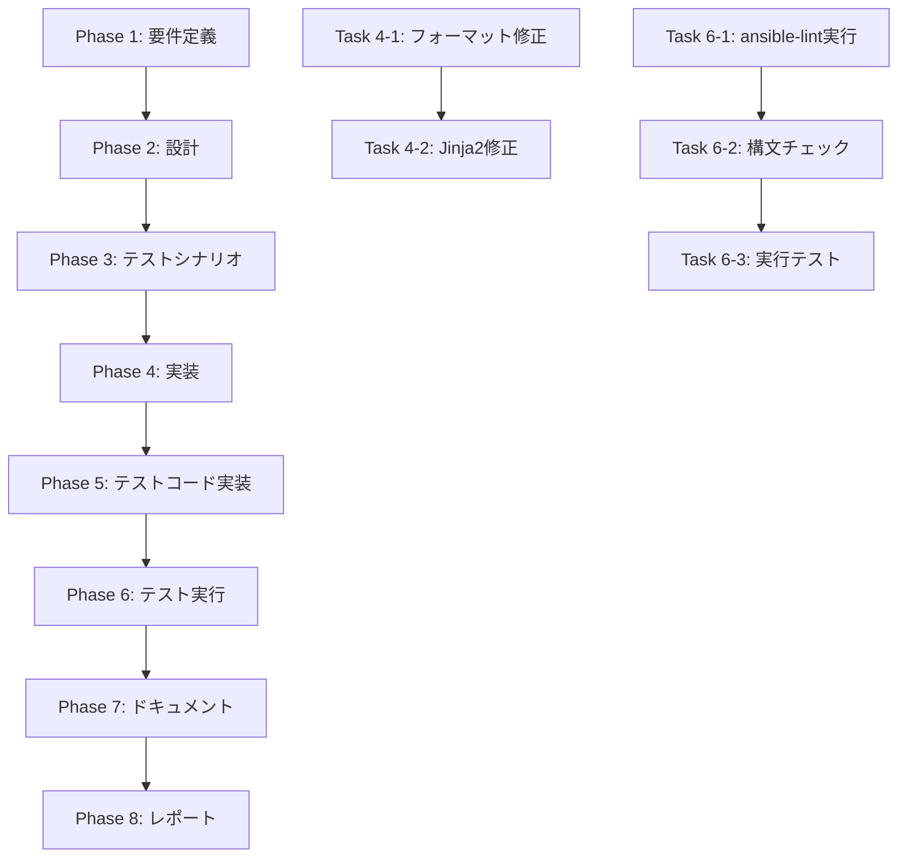

# プロジェクト計画書: ansible-lint スタイル違反の修正 (#524)

## 1. Issue分析

### Issue概要
- **Issue番号**: #524
- **タイトル**: [Task] ansible-lint スタイル違反の修正
- **関連Issue**: #522 (ansible-lint CI導入)
- **修正対象**: 20個のスタイル違反エラー

### 複雑度判定: **簡単**

**判定根拠**:
- 主にフォーマット・スタイル関連の修正で動作に影響しない
- 対象ファイル数が限定的（6ファイル程度）
- 既存ロジックの変更は一切不要
- 単純な文字列置換やフォーマット修正が中心

### 見積もり工数: **2時間**

**工数の根拠**:
- フォーマット関連修正: 0.5時間（自動化可能）
- Jinja2スペーシング修正: 0.5時間（手作業）
- テスト・検証: 0.5時間
- ドキュメント・レポート: 0.5時間

### リスク評価: **低**

**理由**:
- 動作に影響しないスタイル修正のみ
- 修正箇所が明確に特定されている
- Ansible playbook の構文は変更しない
- ロールバックが容易

## 2. 実装戦略判断

### 実装戦略: **REFACTOR**

**判断根拠**:
既存のAnsibleコードベースのフォーマットとスタイルを改善し、ansible-lint標準に準拠させるリファクタリング作業。新規機能追加や既存機能拡張ではなく、コード品質の向上が目的。具体的には：
- 既存ファイルのフォーマット修正
- コーディングスタイルの統一
- Lintツール準拠への改善

### テスト戦略: **INTEGRATION_ONLY**

**判断根拠**:
フォーマット・スタイル修正では、実際のAnsible playbook実行による統合テストのみが有効。修正対象がすべて既存のAnsible実行環境との互換性確認であり：
- ユニットテスト: Ansibleのフォーマット修正には不適切
- BDDテスト: エンドユーザーストーリーに影響しない内部品質改善
- インテグレーション: Ansibleコマンド実行による構文・動作確認が最適

### テストコード戦略: **EXTEND_TEST**

**判断根拠**:
既存のCI環境にansible-lintが既に導入されており、修正後の品質確認は既存のCIテストにansible-lint実行を追加するのみ。新規テストファイル作成は不要：
- 既存CIパイプラインでansible-lint実行
- 既存のplaybook実行テストで動作確認
- 新規テストファイル作成は過剰

## 3. 影響範囲分析

### 既存コードへの影響

**直接影響があるファイル**:
1. `ansible/playbooks/bootstrap-setup.yml` - 10個のフォーマット修正
2. `ansible/inventory/group_vars/all.yml` - 1個のフォーマット修正
3. `ansible/roles/jenkins_cleanup_agent_amis/tasks/process_ami_retention.yml` - 3個のJinja2修正
4. `ansible/roles/jenkins_cleanup_agent_amis/tasks/process_pipeline_outputs.yml` - 1個のJinja2修正
5. `ansible/roles/jenkins_cleanup_agent_amis/tasks/process_image_versions.yml` - 2個のJinja2修正
6. `ansible/roles/jenkins_cleanup_agent_amis/tasks/delete_snapshots.yml` - 2個のJinja2修正
7. `ansible/roles/jenkins_agent_ami/tasks/cleanup_amis.yml` - 2個のJinja2修正

**間接影響**: なし（フォーマットのみの変更）

### 依存関係の変更
- **新規依存**: なし
- **既存依存の変更**: なし
- **削除される依存**: なし

### マイグレーション要否
- **データベーススキーマ変更**: なし
- **設定ファイル変更**: なし
- **環境変数変更**: なし

## 4. タスク分割

### Phase 1: 要件定義 (見積もり: 0.5h)

- [ ] Task 1-1: エラー詳細確認とカテゴライズ (0.2h)
  - ansible-lint実行ログの詳細分析
  - 各エラーの修正方法の特定
  - フォーマット系とJinja2系の分類

- [ ] Task 1-2: 修正対象ファイルのバックアップ作成 (0.1h)
  - 対象7ファイルのコピー作成
  - Git commitによる変更履歴保存

- [ ] Task 1-3: 受け入れ基準の明確化 (0.2h)
  - ansible-lint実行時の成功条件確認
  - 既存playbook動作に影響しないことの確認方法

### Phase 2: 設計 (見積もり: 0.3h)

- [ ] Task 2-1: フォーマット修正パターンの設計 (0.2h)
  - 末尾空白削除の自動化手順
  - truthy値修正パターンの定義
  - ドキュメント開始マーカー追加位置の特定

- [ ] Task 2-2: Jinja2スペーシング修正パターンの設計 (0.1h)
  - ブラケット内スペース追加のルール確認
  - ansible-lint推奨スタイルの確認

### Phase 3: テストシナリオ (見積もり: 0.2h)

- [ ] Task 3-1: テストシナリオ策定 (0.2h)
  - ansible-lint実行による検証手順
  - ansible-playbook構文チェック手順
  - 既存playbookサンプル実行による動作確認手順

### Phase 4: 実装 (見積もり: 0.7h)

- [ ] Task 4-1: フォーマット関連修正の実装 (0.3h)
  - bootstrap-setup.yml の末尾空白削除（5箇所）
  - truthy値修正（yes→true、True→true等、3箇所）
  - ドキュメント開始マーカー追加（1箇所）
  - all.yml のファイル末尾改行追加（1箇所）

- [ ] Task 4-2: Jinja2スペーシング修正の実装 (0.4h)
  - process_ami_retention.yml の3箇所修正
  - process_pipeline_outputs.yml の1箇所修正
  - process_image_versions.yml の2箇所修正
  - delete_snapshots.yml の2箇所修正
  - cleanup_amis.yml の2箇所修正

### Phase 5: テストコード実装 (見積もり: 0.1h)

- [ ] Task 5-1: CI環境でのansible-lint実行確認 (0.1h)
  - 既存GitHub Actions等でansible-lint実行が含まれることの確認
  - 必要に応じてlintチェックの追加

### Phase 6: テスト実行 (見積もり: 0.5h)

- [ ] Task 6-1: ローカルansible-lint実行テスト (0.2h)
  - 修正後の全ファイルでansible-lint実行
  - エラー・警告の解消確認

- [ ] Task 6-2: Ansible構文チェック実行 (0.1h)
  - ansible-playbook --syntax-check による構文確認
  - 修正による構文エラーがないことの確認

- [ ] Task 6-3: サンプルplaybook実行テスト (0.2h)
  - 修正対象playbookの実際の実行テスト（ドライラン）
  - 動作に影響しないことの確認

### Phase 7: ドキュメント (見積もり: 0.3h)

- [ ] Task 7-1: 修正内容のドキュメント作成 (0.2h)
  - 修正箇所の一覧化
  - 修正パターンの記録

- [ ] Task 7-2: ansible-lint導入ガイドライン追加 (0.1h)
  - 今後のコーディング規約への反映検討
  - 開発者向けlint実行手順の記載

### Phase 8: レポート (見積もり: 0.4h)

- [ ] Task 8-1: 修正結果の総括レポート作成 (0.2h)
  - 修正前後のansible-lint結果比較
  - 修正箇所と修正内容の詳細一覧

- [ ] Task 8-2: 品質改善効果の測定 (0.1h)
  - ansible-lintスコアの改善値
  - コード品質向上の定量評価

- [ ] Task 8-3: Issue完了報告とクローズ (0.1h)
  - Pull Request作成
  - Issue #524の完了報告

## 5. 依存関係

## 6. リスクと軽減策

### リスク1: 修正箇所の見落とし
- **影響度**: 中
- **確率**: 低
- **軽減策**:
  - ansible-lint実行による網羅的チェック
  - 修正前後の差分レビュー実施

### リスク2: Jinja2修正による構文エラー
- **影響度**: 中
- **確率**: 低
- **軽減策**:
  - 修正後の構文チェック実施
  - サンプル実行による動作確認

### リスク3: CI環境でのansible-lint導入不備
- **影響度**: 低
- **確率**: 中
- **軽減策**:
  - 既存CIの設定確認
  - ローカルでのansible-lint実行による事前確認

### リスク4: 大量ファイルでの同様問題の潜在
- **影響度**: 中
- **確率**: 中
- **軽減策**:
  - 全Ansibleファイルでのansible-lint実行
  - 今後の開発ガイドラインへの反映

## 7. 品質ゲート

### Phase 1: 要件定義
- [ ] 修正対象の20個のエラーがすべて特定されている
- [ ] 各エラーの修正方法が明確に定義されている
- [ ] 受け入れ基準（ansible-lint成功）が明確になっている

### Phase 2: 設計
- [ ] フォーマット修正の自動化手順が設計されている
- [ ] Jinja2スペーシング修正パターンが定義されている
- [ ] 修正作業の効率的な順序が決定されている

### Phase 3: テストシナリオ
- [ ] ansible-lint実行による検証手順が策定されている
- [ ] 既存playbook動作に影響しないことの確認方法が定義されている
- [ ] 回帰テストシナリオが準備されている

### Phase 4: 実装
- [ ] フォーマット関連の10個のエラーが修正されている
- [ ] Jinja2スペーシングの10個のエラーが修正されている
- [ ] 修正により新たな構文エラーが発生していない

### Phase 5: テストコード実装
- [ ] CI環境でansible-lint実行が設定されている
- [ ] 継続的な品質チェック体制が構築されている

### Phase 6: テスト実行
- [ ] ansible-lint実行でエラー・警告が解消されている
- [ ] ansible-playbook構文チェックが成功している
- [ ] 修正対象playbookの動作確認が完了している

### Phase 7: ドキュメント
- [ ] 修正内容の詳細ドキュメントが作成されている
- [ ] 今後の開発ガイドラインが更新されている
- [ ] 他の開発者が参照可能な形式で文書化されている

### Phase 8: レポート
- [ ] 修正前後の比較結果が定量的に示されている
- [ ] Issue #524の完了報告がされている
- [ ] Pull Requestが適切に作成されている

## まとめ

本プロジェクトは、ansible-lint CI導入に伴い検出された20個のスタイル違反を修正する比較的単純なリファクタリング作業です。動作に影響しないフォーマット修正が中心であるため、リスクは低く、見積もり工数も2時間と短時間で完了できる見込みです。

修正により、コードベース全体の品質向上とansible-lint準拠の確立が期待され、今後の継続的インテグレーションの基盤が整備されます。