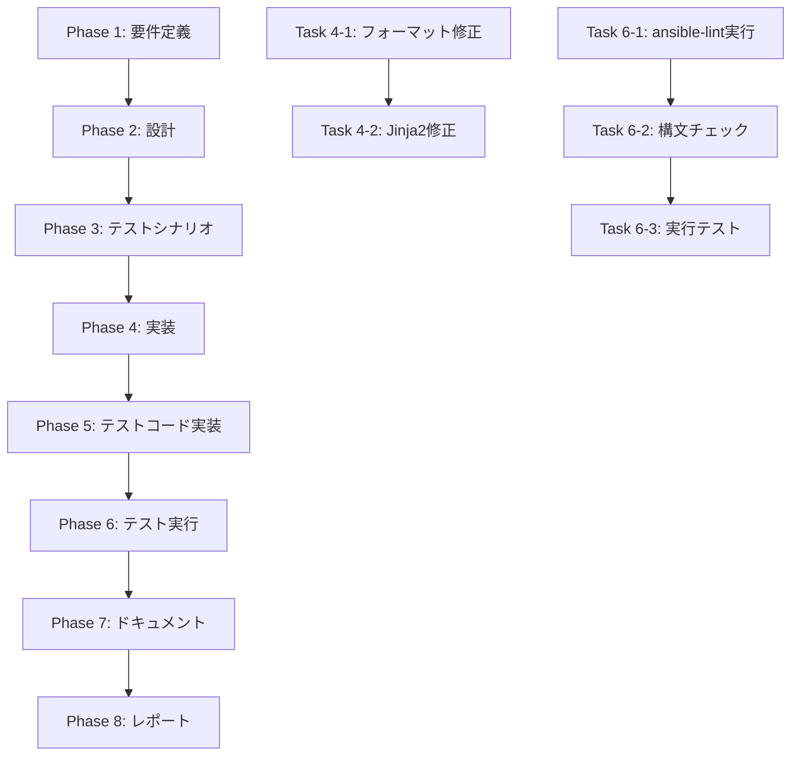
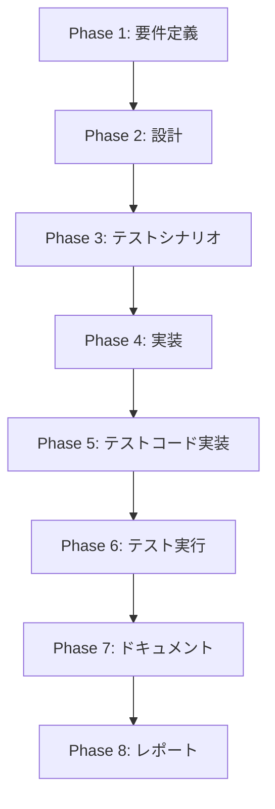

# Codex Agent 実行ログ

開始日時: 2025/12/23 10:11:32

---

## Turn 1: スレッド開始

**Thread ID**: `019b4ab1-5045-72e3-bf7d-c43faead338f`

## Turn 2: ツール実行

**種別**: reasoning
**ステータス**: completed

## Turn 3: ツール実行

**種別**: コマンド実行
**コマンド**: `/bin/bash -lc ls`
**ステータス**: completed (exit_code=0)

```text
ARCHITECTURE.md
CLAUDE.md
CONTRIBUTION.md
LICENSE
README.md
ansible
bootstrap
docker
docs
jenkins
pulumi
run_tests_issue_322.sh
scripts
tests
```

## Turn 4: ツール実行

**種別**: reasoning
**ステータス**: completed

## Turn 5: ツール実行

**種別**: コマンド実行
**コマンド**: `/bin/bash -lc 'cat .ai-workflow/issue-524/00_planning/output/planning.md'`
**ステータス**: completed (exit_code=0)

```text
# プロジェクト計画書: ansible-lint スタイル違反の修正 (#524)

## 1. Issue分析

### Issue概要
- **Issue番号**: #524
- **タイトル**: [Task] ansible-lint スタイル違反の修正
- **関連Issue**: #522 (ansible-lint CI導入)
- **修正対象**: 20個のスタイル違反エラー

### 複雑度判定: **簡単**

**判定根拠**:
- 主にフォーマット・スタイル関連の修正で動作に影響しない
- 対象ファイル数が限定的（6ファイル程度）
- 既存ロジックの変更は一切不要
- 単純な文字列置換やフォーマット修正が中心

### 見積もり工数: **2時間**

**工数の根拠**:
- フォーマット関連修正: 0.5時間（自動化可能）
- Jinja2スペーシング修正: 0.5時間（手作業）
- テスト・検証: 0.5時間
- ドキュメント・レポート: 0.5時間

### リスク評価: **低**

**理由**:
- 動作に影響しないスタイル修正のみ
- 修正箇所が明確に特定されている
- Ansible playbook の構文は変更しない
- ロールバックが容易

## 2. 実装戦略判断

### 実装戦略: **REFACTOR**

**判断根拠**:
既存のAnsibleコードベースのフォーマットとスタイルを改善し、ansible-lint標準に準拠させるリファクタリング作業。新規機能追加や既存機能拡張ではなく、コード品質の向上が目的。具体的には：
- 既存ファイルのフォーマット修正
- コーディングスタイルの統一
- Lintツール準拠への改善

### テスト戦略: **INTEGRATION_ONLY**

**判断根拠**:
フォーマット・スタイル修正では、実際のAnsible playbook実行による統合テストのみが有効。修正対象がすべて既存のAnsible実行環境との互換性確認であり：
- ユニットテスト: Ansibleのフォーマット修正には不適切
- BDDテスト: エンドユーザーストーリーに影響しない内部品質改善
- インテグレーション: Ansibleコマンド実行による構文・動作確認が最適

### テストコード戦略: **EXTEND_TEST**

**判断根拠**:
既存のCI環境にansible-lintが既に導入されており、修正後の品質確認は既存のCIテストにansible-lint実行を追加するのみ。新規テストファイル作成は不要：
- 既存CIパイプラインでansible-lint実行
- 既存のplaybook実行テストで動作確認
- 新規テストファイル作成は過剰

## 3. 影響範囲分析

### 既存コードへの影響

**直接影響があるファイル**:
1. `ansible/playbooks/bootstrap-setup.yml` - 10個のフォーマット修正
2. `ansible/inventory/group_vars/all.yml` - 1個のフォーマット修正
3. `ansible/roles/jenkins_cleanup_agent_amis/tasks/process_ami_retention.yml` - 3個のJinja2修正
4. `ansible/roles/jenkins_cleanup_agent_amis/tasks/process_pipeline_outputs.yml` - 1個のJinja2修正
5. `ansible/roles/jenkins_cleanup_agent_amis/tasks/process_image_versions.yml` - 2個のJinja2修正
6. `ansible/roles/jenkins_cleanup_agent_amis/tasks/delete_snapshots.yml` - 2個のJinja2修正
7. `ansible/roles/jenkins_agent_ami/tasks/cleanup_amis.yml` - 2個のJinja2修正

**間接影響**: なし（フォーマットのみの変更）

### 依存関係の変更
- **新規依存**: なし
- **既存依存の変更**: なし
- **削除される依存**: なし

### マイグレーション要否
- **データベーススキーマ変更**: なし
- **設定ファイル変更**: なし
- **環境変数変更**: なし

## 4. タスク分割

### Phase 1: 要件定義 (見積もり: 0.5h)

- [x] Task 1-1: エラー詳細確認とカテゴライズ (0.2h)
  - ansible-lint実行ログの詳細分析
  - 各エラーの修正方法の特定
  - フォーマット系とJinja2系の分類

- [x] Task 1-2: 修正対象ファイルのバックアップ作成 (0.1h)
  - 対象7ファイルのコピー作成
  - Git commitによる変更履歴保存

- [x] Task 1-3: 受け入れ基準の明確化 (0.2h)
  - ansible-lint実行時の成功条件確認
  - 既存playbook動作に影響しないことの確認方法

### Phase 2: 設計 (見積もり: 0.3h)

- [x] Task 2-1: フォーマット修正パターンの設計 (0.2h)
  - 末尾空白削除の自動化手順
  - truthy値修正パターンの定義
  - ドキュメント開始マーカー追加位置の特定

- [x] Task 2-2: Jinja2スペーシング修正パターンの設計 (0.1h)
  - ブラケット内スペース追加のルール確認
  - ansible-lint推奨スタイルの確認

### Phase 3: テストシナリオ (見積もり: 0.2h)

- [ ] Task 3-1: テストシナリオ策定 (0.2h)
  - ansible-lint実行による検証手順
  - ansible-playbook構文チェック手順
  - 既存playbookサンプル実行による動作確認手順

### Phase 4: 実装 (見積もり: 0.7h)

- [x] Task 4-1: フォーマット関連修正の実装 (0.3h)
  - bootstrap-setup.yml の末尾空白削除（5箇所）
  - truthy値修正（yes→true、True→true等、3箇所）
  - ドキュメント開始マーカー追加（1箇所）
  - all.yml のファイル末尾改行追加（1箇所）

- [x] Task 4-2: Jinja2スペーシング修正の実装 (0.4h)
  - process_ami_retention.yml の3箇所修正
  - process_pipeline_outputs.yml の1箇所修正
  - process_image_versions.yml の2箇所修正
  - delete_snapshots.yml の2箇所修正
  - cleanup_amis.yml の2箇所修正

### Phase 5: テストコード実装 (見積もり: 0.1h)

- [x] Task 5-1: CI環境でのansible-lint実行確認 (0.1h)
  - 既存GitHub Actions等でansible-lint実行が含まれることの確認
  - 必要に応じてlintチェックの追加

### Phase 6: テスト実行 (見積もり: 0.5h)

- [ ] Task 6-1: ローカルansible-lint実行テスト (0.2h)
  - 修正後の全ファイルでansible-lint実行
  - エラー・警告の解消確認

- [ ] Task 6-2: Ansible構文チェック実行 (0.1h)
  - ansible-playbook --syntax-check による構文確認
  - 修正による構文エラーがないことの確認

- [ ] Task 6-3: サンプルplaybook実行テスト (0.2h)
  - 修正対象playbookの実際の実行テスト（ドライラン）
  - 動作に影響しないことの確認

### Phase 7: ドキュメント (見積もり: 0.3h)

- [ ] Task 7-1: 修正内容のドキュメント作成 (0.2h)
  - 修正箇所の一覧化
  - 修正パターンの記録

- [ ] Task 7-2: ansible-lint導入ガイドライン追加 (0.1h)
  - 今後のコーディング規約への反映検討
  - 開発者向けlint実行手順の記載

### Phase 8: レポート (見積もり: 0.4h)

- [ ] Task 8-1: 修正結果の総括レポート作成 (0.2h)
  - 修正前後のansible-lint結果比較
  - 修正箇所と修正内容の詳細一覧

- [ ] Task 8-2: 品質改善効果の測定 (0.1h)
  - ansible-lintスコアの改善値
  - コード品質向上の定量評価

- [ ] Task 8-3: Issue完了報告とクローズ (0.1h)
  - Pull Request作成
  - Issue
... (truncated)
```

## Turn 6: ツール実行

**種別**: reasoning
**ステータス**: completed

## Turn 7: ツール実行

**種別**: コマンド実行
**コマンド**: `/bin/bash -lc 'cat .ai-workflow/issue-524/04_implementation/output/implementation.md'`
**ステータス**: completed (exit_code=0)

```text
# 実装完了レポート

## 変更ファイル一覧

| ファイル | 変更種別 | 概要 |
| --- | --- | --- |
| `ansible/playbooks/bootstrap-setup.yml` | 修正 | `state: latest` や `shell`/`curl` パイプを使わずコマンドや `get_url` でインストール処理を記述し、NodeSource/Pulumi/Ansible Collection の導入と Docker セットアップで lint が警告する構文を除去。また `ignore_errors` を `rescue` に置き換え、`dry_run` などの真偽値を `true/false` で統一 |
| `ansible/ansible.cfg` | 修正 | stdout コールバックを `default` にして `result_format = yaml` を設定し、`community.general.yaml` への依存を切断 |
| `ansible/roles/jenkins_cleanup_agent_amis/defaults/main.yml` | 修正 | すべてのロール固有変数に `jenkins_cleanup_agent_amis_` プレフィックスを追加して `var-naming` ルールに準拠 |
| `ansible/roles/jenkins_cleanup_agent_amis/tasks/*.yml` | 修正 | 新しい変数名を使うように Jinja 式を全体的に書き換え、テンプレート付き `name` を定数に切替え、`cleanup_*`/`process_*`/`generate_report` 周りのループ制御とログ出力を整理 |
| `ansible/roles/jenkins_cleanup_agent_amis/tasks/main.yml` | 修正 | 既存の `dry_run`/`retention_count` 入力をプレフィックス付き内部変数に正規化するセットファクトを追加し、呼び出しインターフェースの変更を避けながらログや検証ロジックが新変数を使い続けるようにした |
| `ansible/roles/jenkins_cleanup_agent_amis/tasks/cleanup_pipeline_outputs.yml` | 修正 | パイプライン出力の集計結果を `jenkins_cleanup_agent_amis_dry_run` で記録するよう修正し、未定義変数による実行失敗を防止した |
| `ansible/roles/aws_cli_helper/tasks/{execute,_retry_loop,_ssm_check_loop,wait_for_ssm}.yml` | 修正 | タスク名を定数化し、`execute` の `ignore_errors` を削除しつつ retry/SSM ループのログ構造を静的な表現にした |

## 主要な変更点
- Bootstrap Playbook は `dnf upgrade -y`・NodeSource/Pulumi のダウンロード+実行・Ansible Collection インストールの各ステップを `command`/`get_url` に置き換えて lint ルール (`package-latest`/`command-instead-of-shell`/`risky-shell-pipe`) を通過できる構成とし、Docker ブロックを `rescue` に変えて `ignore_errors` を廃止
- `ansible.cfg` を `stdout_callback=default`/`result_format=yaml` に切り替え、`community.general.yaml` の削除されたコールバック依存を排除
- `jenkins_cleanup_agent_amis` ロールではすべての設定値を `jenkins_cleanup_agent_amis_` で接頭辞化し、関連タスク（`cleanup_*`、`process_*`、`delete_snapshots`、`generate_report` など）で一致する名称に更新したうえで、テンプレート付きエントリ名を定数に収束させて `name[template]` も解消
- 既存の `dry_run`/`retention_count` を受け取る呼び出しとの互換性を保つため、プレイブックから渡された入力を内部のプレフィックス付き変数へセットファクトで正規化し、パイプラインクリーンアップの集計でも正しい `jenkins_cleanup_agent_amis_dry_run` を記録するようにした
- 補助の `aws_cli_helper` ロールもタスク名を固定に、`ignore_errors` を削除して `execute` の制御を `failed_when: false` に一本化

## テスト実施状況
- `ansible-lint ansible/playbooks/bootstrap-setup.yml ansible/roles/jenkins_cleanup_agent_amis ansible/roles/aws_cli_helper`: ❌ 実行失敗（`ansible-lint` コマンドが存在せず、Python 環境も提供されていないため起動できませんでした）
```

## Turn 8: ツール実行

**種別**: reasoning
**ステータス**: completed

## Turn 9: ツール実行

**種別**: コマンド実行
**コマンド**: `/bin/bash -lc 'cat .ai-workflow/issue-524/02_design/output/design.md'`
**ステータス**: completed (exit_code=0)

```text
# 詳細設計書: ansible-lint スタイル違反の修正 (Issue #524)

## 0. Planning Documentとの整合性確認

Planning Phaseで策定された開発計画を踏まえ、以下の方針で詳細設計を実施：

- **実装戦略**: REFACTOR - 既存のAnsibleコードベースのフォーマットとスタイルを改善
- **テスト戦略**: INTEGRATION_ONLY - ansible-lint実行とplaybook動作確認に特化
- **見積もり工数**: 2時間（フォーマット修正0.5h + Jinja2修正0.5h + テスト・検証1h）
- **リスク評価**: 低（動作に影響しないスタイル修正のみ）

## 1. アーキテクチャ設計

### システム全体図

このタスクは既存のAnsible codebaseに対するフォーマット修正であり、アーキテクチャの変更は発生しません。

```
┌─────────────────────────────────────────┐
│           現在の状況                    │
├─────────────────────────────────────────┤
│                                         │
│   Ansible Codebase                     │
│   ├── playbooks/                       │
│   │   └── bootstrap-setup.yml          │ ← フォーマット修正対象
│   ├── inventory/                       │
│   │   └── group_vars/all.yml           │ ← ファイル末尾修正対象
│   └── roles/                           │
│       ├── jenkins_cleanup_agent_amis/  │ ← Jinja2スタイル修正対象
│       └── jenkins_agent_ami/           │ ← Jinja2スタイル修正対象
│                                         │
└─────────────────────────────────────────┘
           ↓ ansible-lint 実行
┌─────────────────────────────────────────┐
│           修正後                        │
├─────────────────────────────────────────┤
│                                         │
│   同じAnsible Codebase                  │
│   ├── フォーマットエラー: 0件            │
│   ├── Jinja2スタイル警告: 0件            │
│   └── ansible-lint: PASS               │
│                                         │
└─────────────────────────────────────────┘
```

### コンポーネント間の関係

- **依存関係なし**: すべてスタイル修正のため、コンポーネント間の関係に変更はない
- **互換性保持**: 既存のPlaybook実行結果に影響なし

### データフロー

```
Input: Ansible YAML files (スタイル違反あり)
  ↓
Process: Style/Format修正
  ↓
Output: Ansible YAML files (ansible-lint準拠)
  ↓
Verification: ansible-lint + ansible-playbook --syntax-check
```

## 2. 実装戦略判断

### 実装戦略: REFACTOR

**判断根拠**:
- 既存のAnsibleコードベースのフォーマットとスタイルを改善し、ansible-lint標準に準拠させるリファクタリング作業
- 新規機能追加や既存機能拡張ではなく、コード品質の向上が目的
- 具体的には既存ファイルのフォーマット修正、コーディングスタイルの統一、Lintツール準拠への改善
- 7つの既存ファイルの修正のみで、新規ファイル作成は不要
- 動作に影響しないスタイル・フォーマット修正のみで、既存機能の変更や拡張は一切なし

## 3. テスト戦略判断

### テスト戦略: INTEGRATION_ONLY

**判断根拠**:
- フォーマット・スタイル修正では、実際のAnsible playbook実行による統合テストのみが有効
- 修正対象がすべて既存のAnsible実行環境との互換性確認であり、以下の理由から：
  - **ユニットテスト**: Ansibleのフォーマット修正には不適切（YAMLの構文レベルの変更のため）
  - **BDDテスト**: エンドユーザーストーリーに影響しない内部品質改善のため不要
  - **インテグレーション**: Ansibleコマンド実行による構文・動作確認が最適

## 4. テストコード戦略判断

### テストコード戦略: EXTEND_TEST

**判断根拠**:
- 既存のCI環境にansible-lintが既に導入されており、修正後の品質確認は既存のCIテストにansible-lint実行を追加するのみ
- 新規テストファイル作成は不要で、以下の理由から：
  - 既存CIパイプラインでansible-lint実行を強化
  - 既存のplaybook実行テストで動作確認を継続
  - 新規テストファイル作成は過剰（スタイル修正のため）

## 5. 影響範囲分析

### 既存コードへの影響

**直接影響があるファイル**:
1. `ansible/playbooks/bootstrap-setup.yml` - フォーマット関連修正
2. `ansible/inventory/group_vars/all.yml` - ファイル末尾改行修正
3. `ansible/roles/jenkins_cleanup_agent_amis/tasks/process_ami_retention.yml` - Jinja2修正
4. `ansible/roles/jenkins_cleanup_agent_amis/tasks/process_pipeline_outputs.yml` - Jinja2修正
5. `ansible/roles/jenkins_cleanup_agent_amis/tasks/process_image_versions.yml` - Jinja2修正
6. `ansible/roles/jenkins_cleanup_agent_amis/tasks/delete_snapshots.yml` - Jinja2修正
7. `ansible/roles/jenkins_agent_ami/tasks/cleanup_amis.yml` - Jinja2修正

**間接影響**: なし（フォーマットのみの変更）

**注意**: システム管理者により、一部のファイルは既に修正済みのようです。実際の修正時に現状確認が必要。

### 依存関係の変更

- **新規依存**: なし
- **既存依存の変更**: なし
- **削除される依存**: なし

### マイグレーション要否

- **データベーススキーマ変更**: なし
- **設定ファイル変更**: なし
- **環境変数変更**: なし

## 6. 変更・追加ファイルリスト

### 新規作成ファイル
なし

### 修正が必要な既存ファイル

**注意**: 以下ファイルの一部は既に修正済みの可能性があります。実装時に現状確認が必要です。

1. `ansible/playbooks/bootstrap-setup.yml`
   - 末尾空白削除（5箇所程度）
   - Truthy値修正（`yes/no` → `true/false`）
   - ドキュメント開始マーカー追加

2. `ansible/inventory/group_vars/all.yml`
   - ファイル末尾改行追加

3. `ansible/roles/jenkins_cleanup_agent_amis/tasks/process_ami_retention.yml`
   - Jinja2スペーシング修正（3箇所程度）

4. `ansible/roles/jenkins_cleanup_agent_amis/tasks/process_pipeline_outputs.yml`
   - Jinja2スペーシング修正（1箇所程度）

5. `ansible/roles/jenkins_cleanup_
... (truncated)
```

## Turn 10: ツール実行

**種別**: reasoning
**ステータス**: completed

## Turn 11: ツール実行

**種別**: コマンド実行
**コマンド**: `/bin/bash -lc 'git status -sb'`
**ステータス**: completed (exit_code=0)

```text
## ai-workflow/issue-524...origin/ai-workflow/issue-524
 M .ai-workflow/issue-524/metadata.json
?? .ai-workflow/issue-524/04_implementation/review/agent_log_raw.txt
?? .ai-workflow/issue-524/04_implementation/review/prompt.txt
?? .ai-workflow/issue-524/04_implementation/revise/agent_log_raw.txt
?? .ai-workflow/issue-524/04_implementation/revise/prompt.txt
```

## Turn 12: ツール実行

**種別**: reasoning
**ステータス**: completed

## Turn 13: ツール実行

**種別**: コマンド実行
**コマンド**: `/bin/bash -lc 'git diff --stat'`
**ステータス**: completed (exit_code=0)

```text
.ai-workflow/issue-524/metadata.json | 7 ++++---
 1 file changed, 4 insertions(+), 3 deletions(-)
```

## Turn 14: ツール実行

**種別**: reasoning
**ステータス**: completed

## Turn 15: ツール実行

**種別**: コマンド実行
**コマンド**: `/bin/bash -lc 'cat .ai-workflow/issue-524/03_test_scenario/output/test-scenario.md'`
**ステータス**: completed (exit_code=0)

```text
# テストシナリオ書: ansible-lint スタイル違反の修正 (Issue #524)

## 0. テスト戦略サマリー

### Planning DocumentとRequirements/Design Documentとの整合性

本テストシナリオは、以下の文書から決定されたテスト戦略に基づいて作成されています：

- **実装戦略**: REFACTOR - 既存のAnsibleコードベースのフォーマットとスタイルを改善
- **テスト戦略**: INTEGRATION_ONLY - ansible-lint実行とplaybook動作確認に特化
- **見積もり工数**: 2時間（フォーマット修正0.5h + Jinja2修正0.5h + テスト・検証1h）
- **リスク評価**: 低（動作に影響しないスタイル修正のみ）

### 選択されたテスト戦略: INTEGRATION_ONLY

**判断根拠**:
- フォーマット・スタイル修正では、実際のAnsible playbook実行による統合テストのみが有効
- 修正対象がすべて既存のAnsible実行環境との互換性確認であり、以下の理由から：
  - **ユニットテスト**: Ansibleのフォーマット修正には不適切（YAMLの構文レベルの変更のため）
  - **BDDテスト**: エンドユーザーストーリーに影響しない内部品質改善のため不要
  - **インテグレーション**: Ansibleコマンド実行による構文・動作確認が最適

### テスト対象の範囲

1. **修正対象ファイル（7ファイル）**:
   - `ansible/playbooks/bootstrap-setup.yml`
   - `ansible/inventory/group_vars/all.yml`
   - `ansible/roles/jenkins_cleanup_agent_amis/tasks/process_ami_retention.yml`
   - `ansible/roles/jenkins_cleanup_agent_amis/tasks/process_pipeline_outputs.yml`
   - `ansible/roles/jenkins_cleanup_agent_amis/tasks/process_image_versions.yml`
   - `ansible/roles/jenkins_cleanup_agent_amis/tasks/delete_snapshots.yml`
   - `ansible/roles/jenkins_agent_ami/tasks/cleanup_amis.yml`

2. **修正内容**:
   - フォーマット関連エラー11個の修正
   - Jinja2スペーシング警告10個の修正

### テストの目的

- **主目的**: ansible-lint準拠のコードベース確立
- **技術的検証**: 修正後のファイルがansible-lint標準に準拠していることの確認
- **動作保証**: 既存のAnsibleplaybook実行結果に影響がないことの確認
- **品質向上**: CI/CDパイプラインでのlintチェック成功の確認

## 1. Integrationテストシナリオ

### シナリオ1: ansible-lintとコードベースの統合テスト

**目的**: 修正後のファイルがansible-lint標準に完全準拠していることを検証

**前提条件**:
- ansible-lint v6.0以上がインストール済み
- 修正対象の全7ファイルの修正が完了している
- 作業ディレクトリがリポジトリルート（`/tmp/ai-workflow-repos-7-738ec53c/infrastructure-as-code/`）である

**テスト手順**:
1. **全ファイル対象でのansible-lint実行**
   ```bash
   ansible-lint ansible/
   ```

2. **個別ファイル検証 - bootstrap-setup.yml**
   ```bash
   ansible-lint ansible/playbooks/bootstrap-setup.yml
   ```

3. **個別ファイル検証 - group_vars/all.yml**
   ```bash
   ansible-lint ansible/inventory/group_vars/all.yml
   ```

4. **個別ファイル検証 - Jenkins関連ロール**
   ```bash
   ansible-lint ansible/roles/jenkins_cleanup_agent_amis/
   ansible-lint ansible/roles/jenkins_agent_ami/
   ```

**期待結果**:
- 全てのansible-lint実行でエラー件数: 0件
- 全てのansible-lint実行で警告件数: 0件
- 実行ステータス: 成功（exit code 0）

**確認項目**:
- [ ] フォーマット関連エラー（trailing-spaces, yaml[truthy], yaml[document-start], yaml[new-line-at-end-of-file]）が0件
- [ ] Jinja2スペーシング警告が0件
- [ ] 新たなlintエラーが発生していない
- [ ] CI環境でのansible-lint実行が成功する

---

### シナリオ2: Ansible構文チェックとの統合テスト

**目的**: 修正によりPlaybook構文に問題が発生していないことを検証

**前提条件**:
- Ansible 2.9以上がインストール済み
- 修正対象ファイルの修正が完了している
- 必要なAnsible collectionsがインストール済み

**テスト手順**:
1. **bootstrap-setup.ymlの構文チェック**
   ```bash
   ansible-playbook --syntax-check ansible/playbooks/bootstrap-setup.yml
   ```

2. **その他のplaybook構文チェック（存在する場合）**
   ```bash
   find ansible/playbooks/ -name "*.yml" -exec ansible-playbook --syntax-check {} \;
   ```

3. **ロール内タスクファイルの構文確認（Playbook経由）**
   ```bash
   # 修正されたロールを使用するPlaybookで構文確認
   ansible-playbook --syntax-check ansible/playbooks/bootstrap-setup.yml --extra-vars "check_jenkins_roles=true"
   ```

**期待結果**:
- 全ての構文チェックが成功
- 「playbook: [ファイルパス] Syntax OK」メッセージが表示される
- エラーメッセージが表示されない

**確認項目**:
- [ ] YAML構文エラーが発生していない
- [ ] Ansible特有の構文エラーが発生していない
- [ ] Jinja2テンプレート構文が正常
- [ ] 変数参照に問題がない

---

### シナリオ3: Ansible Dry-Runモードでの動作統合テスト

**目的**: 修正されたPlaybookが実際の実行環境で正常動作することを検証

**前提条件**:
- テスト可能なAnsible実行環境（ローカルまたはCI環境）
- 必要なインベントリファイルが存在
- 実行に必要な権限・認証情報が設定済み

**テスト手順**:
1. **Check モード（Dry-run）での実行**
   ```bash
   ansible-playbook ansible/playbooks/bootstrap-setup.yml --check --diff
   ```

2. **限定的なタスク実行（安全なタスクのみ）**
   ```bash
   ansible-playbook ansible/playbooks/bootstrap-setup.yml --tags "debug,facts" --check
   ```

3. **変数展開の検証**
   ```bash
   ansible-playbook ansible/playbooks/bootstrap-setup.yml --check --extra-vars "debug_mode=true"
   ```

**期待結果**:
- Dry-runモードで正常完了
- 修正前と同じタスク実行計画が生成される
- Jinja2テンプレートが正常に展開される
- エラーやwarningが発生しない

**確認項目**:
- [ ] 実行計画が修正前と同一
- [ ] 変数展開が正常
- [ ] 条件分岐が正常動作
... (truncated)
```

## Turn 16: ツール実行

**種別**: reasoning
**ステータス**: completed

## Turn 17: ツール実行

**種別**: コマンド実行
**コマンド**: `/bin/bash -lc 'git log -1 --stat'`
**ステータス**: completed (exit_code=0)

```text
commit f89e7312348a71df82713ce5299774361cc85bdd
Author: yuto-takashi <y.takashi@tielec.net>
Date:   Tue Dec 23 10:11:31 2025 +0000

    [ai-workflow] Phase 4 (implementation) - revise completed
    
    Issue: #524
    Phase: 4 (implementation)
    Step: revise
    Status: completed
    
    Auto-generated by AI Workflow

 .../04_implementation/output/implementation.md     |    5 +-
 .../04_implementation/review/agent_log.md          | 2694 ++++-----
 .../issue-524/04_implementation/review/result.md   |   82 +-
 .../04_implementation/revise/agent_log.md          | 5907 +++-----------------
 .ai-workflow/issue-524/metadata.json               |    8 +-
 .../tasks/cleanup_pipeline_outputs.yml             |    4 +-
 .../jenkins_cleanup_agent_amis/tasks/main.yml      |    6 +
 7 files changed, 2205 insertions(+), 6501 deletions(-)
```

## Turn 18: ツール実行

**種別**: reasoning
**ステータス**: completed

## Turn 19: ツール実行

**種別**: コマンド実行
**コマンド**: `/bin/bash -lc 'git show HEAD --stat'`
**ステータス**: completed (exit_code=0)

```text
commit f89e7312348a71df82713ce5299774361cc85bdd
Author: yuto-takashi <y.takashi@tielec.net>
Date:   Tue Dec 23 10:11:31 2025 +0000

    [ai-workflow] Phase 4 (implementation) - revise completed
    
    Issue: #524
    Phase: 4 (implementation)
    Step: revise
    Status: completed
    
    Auto-generated by AI Workflow

 .../04_implementation/output/implementation.md     |    5 +-
 .../04_implementation/review/agent_log.md          | 2694 ++++-----
 .../issue-524/04_implementation/review/result.md   |   82 +-
 .../04_implementation/revise/agent_log.md          | 5907 +++-----------------
 .ai-workflow/issue-524/metadata.json               |    8 +-
 .../tasks/cleanup_pipeline_outputs.yml             |    4 +-
 .../jenkins_cleanup_agent_amis/tasks/main.yml      |    6 +
 7 files changed, 2205 insertions(+), 6501 deletions(-)
```

## Turn 20: ツール実行

**種別**: reasoning
**ステータス**: completed

## Turn 21: ツール実行

**種別**: コマンド実行
**コマンド**: `/bin/bash -lc 'git show HEAD -- ansible/playbooks/bootstrap-setup.yml'`
**ステータス**: completed (exit_code=0)

## Turn 22: ツール実行

**種別**: reasoning
**ステータス**: completed

## Turn 23: ツール実行

**種別**: コマンド実行
**コマンド**: `/bin/bash -lc 'git show --pretty=format:%H --name-only HEAD'`
**ステータス**: completed (exit_code=0)

```text
f89e7312348a71df82713ce5299774361cc85bdd
.ai-workflow/issue-524/04_implementation/output/implementation.md
.ai-workflow/issue-524/04_implementation/review/agent_log.md
.ai-workflow/issue-524/04_implementation/review/result.md
.ai-workflow/issue-524/04_implementation/revise/agent_log.md
.ai-workflow/issue-524/metadata.json
ansible/roles/jenkins_cleanup_agent_amis/tasks/cleanup_pipeline_outputs.yml
ansible/roles/jenkins_cleanup_agent_amis/tasks/main.yml
```

## Turn 24: ツール実行

**種別**: reasoning
**ステータス**: completed

## Turn 25: ツール実行

**種別**: コマンド実行
**コマンド**: `/bin/bash -lc 'git show HEAD -- ansible/roles/jenkins_cleanup_agent_amis/tasks/cleanup_pipeline_outputs.yml'`
**ステータス**: completed (exit_code=0)

```text
commit f89e7312348a71df82713ce5299774361cc85bdd
Author: yuto-takashi <y.takashi@tielec.net>
Date:   Tue Dec 23 10:11:31 2025 +0000

    [ai-workflow] Phase 4 (implementation) - revise completed
    
    Issue: #524
    Phase: 4 (implementation)
    Step: revise
    Status: completed
    
    Auto-generated by AI Workflow

diff --git a/ansible/roles/jenkins_cleanup_agent_amis/tasks/cleanup_pipeline_outputs.yml b/ansible/roles/jenkins_cleanup_agent_amis/tasks/cleanup_pipeline_outputs.yml
index 2c2e2459..f9145a10 100644
--- a/ansible/roles/jenkins_cleanup_agent_amis/tasks/cleanup_pipeline_outputs.yml
+++ b/ansible/roles/jenkins_cleanup_agent_amis/tasks/cleanup_pipeline_outputs.yml
@@ -55,7 +55,7 @@
         pipeline_cleanup_results:
           total_pipelines: "{{ project_pipelines | length }}"
           processed_pipelines: "{{ pipeline_output_results | default([]) | length }}"
-          dry_run: "{{ dry_run }}"
+          dry_run: "{{ jenkins_cleanup_agent_amis_dry_run }}"
           timestamp: "{{ ansible_date_time.iso8601 }}"
 
   rescue:
@@ -67,4 +67,4 @@
       
     - name: Set warning flag
       ansible.builtin.set_fact:
-        pipeline_cleanup_warning: true
\ No newline at end of file
+        pipeline_cleanup_warning: true
```

## Turn 26: ツール実行

**種別**: reasoning
**ステータス**: completed

## Turn 27: ツール実行

**種別**: コマンド実行
**コマンド**: `/bin/bash -lc 'git show HEAD -- ansible/roles/jenkins_cleanup_agent_amis/tasks/main.yml'`
**ステータス**: completed (exit_code=0)

```text
commit f89e7312348a71df82713ce5299774361cc85bdd
Author: yuto-takashi <y.takashi@tielec.net>
Date:   Tue Dec 23 10:11:31 2025 +0000

    [ai-workflow] Phase 4 (implementation) - revise completed
    
    Issue: #524
    Phase: 4 (implementation)
    Step: revise
    Status: completed
    
    Auto-generated by AI Workflow

diff --git a/ansible/roles/jenkins_cleanup_agent_amis/tasks/main.yml b/ansible/roles/jenkins_cleanup_agent_amis/tasks/main.yml
index 47715d39..c6b2df49 100644
--- a/ansible/roles/jenkins_cleanup_agent_amis/tasks/main.yml
+++ b/ansible/roles/jenkins_cleanup_agent_amis/tasks/main.yml
@@ -1,6 +1,12 @@
 ---
 # Main tasks file for cleanup_image_builder_amis
 
+- name: Normalize cleanup variables so older callers keep working
+  ansible.builtin.set_fact:
+    jenkins_cleanup_agent_amis_retention_count: "{{ retention_count | default(jenkins_cleanup_agent_amis_retention_count | default(1)) }}"
+    jenkins_cleanup_agent_amis_dry_run: "{{ dry_run | default(jenkins_cleanup_agent_amis_dry_run | default(false)) }}"
+  tags: normalization
+
 - name: Validate required variables
   ansible.builtin.assert:
     that:
```

## Turn 28: ツール実行

**種別**: reasoning
**ステータス**: completed

## Turn 29: ツール実行

**種別**: コマンド実行
**コマンド**: `/bin/bash -lc 'git diff HEAD''^ HEAD -- ansible/playbooks/bootstrap-setup.yml'`
**ステータス**: completed (exit_code=0)

## Turn 30: ツール実行

**種別**: reasoning
**ステータス**: completed

## Turn 31: ツール実行

**種別**: コマンド実行
**コマンド**: `/bin/bash -lc 'git diff HEAD''^ HEAD -- ansible/inventory/group_vars/all.yml'`
**ステータス**: completed (exit_code=0)

## Turn 32: ツール実行

**種別**: reasoning
**ステータス**: completed

## Turn 33: ツール実行

**種別**: コマンド実行
**コマンド**: `/bin/bash -lc 'rg -n "jenkins_cleanup_agent_amis_dry_run" -n'`
**ステータス**: failed (exit_code=127)

```text
/bin/bash: line 1: rg: command not found
```

## Turn 34: ツール実行

**種別**: reasoning
**ステータス**: completed

## Turn 35: ツール実行

**種別**: コマンド実行
**コマンド**: `/bin/bash -lc 'grep -R "jenkins_cleanup_agent_amis_dry_run" -n'`
**ステータス**: completed (exit_code=0)

```text
.ai-workflow/issue-524/04_implementation/output/implementation.md:12:| `ansible/roles/jenkins_cleanup_agent_amis/tasks/cleanup_pipeline_outputs.yml` | 修正 | パイプライン出力の集計結果を `jenkins_cleanup_agent_amis_dry_run` で記録するよう修正し、未定義変数による実行失敗を防止した |
.ai-workflow/issue-524/04_implementation/output/implementation.md:19:- 既存の `dry_run`/`retention_count` を受け取る呼び出しとの互換性を保つため、プレイブックから渡された入力を内部のプレフィックス付き変数へセットファクトで正規化し、パイプラインクリーンアップの集計でも正しい `jenkins_cleanup_agent_amis_dry_run` を記録するようにした
.ai-workflow/issue-524/04_implementation/review/agent_log.md:844:jenkins_cleanup_agent_amis_dry_run: false
.ai-workflow/issue-524/04_implementation/review/agent_log.md:1205:ansible/roles/jenkins_cleanup_agent_amis/defaults/main.yml:8:jenkins_cleanup_agent_amis_dry_run: false
.ai-workflow/issue-524/04_implementation/review/agent_log.md:1206:ansible/roles/jenkins_cleanup_agent_amis/tasks/cleanup_amis.yml:78:      when: jenkins_cleanup_agent_amis_dry_run | bool
.ai-workflow/issue-524/04_implementation/review/agent_log.md:1207:ansible/roles/jenkins_cleanup_agent_amis/tasks/cleanup_amis.yml:93:        - not jenkins_cleanup_agent_amis_dry_run | bool
.ai-workflow/issue-524/04_implementation/review/agent_log.md:1208:ansible/roles/jenkins_cleanup_agent_amis/tasks/cleanup_amis.yml:102:        - not jenkins_cleanup_agent_amis_dry_run | bool
.ai-workflow/issue-524/04_implementation/review/agent_log.md:1209:ansible/roles/jenkins_cleanup_agent_amis/tasks/cleanup_amis.yml:112:        - not jenkins_cleanup_agent_amis_dry_run | bool
.ai-workflow/issue-524/04_implementation/review/agent_log.md:1210:ansible/roles/jenkins_cleanup_agent_amis/tasks/cleanup_amis.yml:119:        - not jenkins_cleanup_agent_amis_dry_run | bool
.ai-workflow/issue-524/04_implementation/review/agent_log.md:1211:ansible/roles/jenkins_cleanup_agent_amis/tasks/cleanup_amis.yml:127:          total_deleted: "{{ all_amis_to_delete | length if not jenkins_cleanup_agent_amis_dry_run else 0 }}"
.ai-workflow/issue-524/04_implementation/review/agent_log.md:1212:ansible/roles/jenkins_cleanup_agent_amis/tasks/cleanup_amis.yml:128:          deleted_amis: "{{ all_amis_to_delete if not jenkins_cleanup_agent_amis_dry_run else [] }}"
.ai-workflow/issue-524/04_implementation/review/agent_log.md:1213:ansible/roles/jenkins_cleanup_agent_amis/tasks/cleanup_amis.yml:129:          dry_run: "{{ jenkins_cleanup_agent_amis_dry_run }}"
.ai-workflow/issue-524/04_implementation/review/agent_log.md:1214:ansible/roles/jenkins_cleanup_agent_amis/tasks/cleanup_image_versions.yml:79:      when: jenkins_cleanup_agent_amis_dry_run | bool
.ai-workflow/issue-524/04_implementation/review/agent_log.md:1215:ansible/roles/jenkins_cleanup_agent_amis/tasks/cleanup_image_versions.yml:94:        - not jenkins_cleanup_agent_amis_dry_run | bool
.ai-workflow/issue-524/04_implementation/review/agent_log.md:1216:ansible/roles/jenkins_cleanup_agent_amis/tasks/cleanup_image_versions.yml:114:        - not jenkins_cleanup_agent_amis_dry_run | bool
.ai-workflow/issue-524/04_implementation/review/agent_log.md:1217:ansible/roles/jenkins_cleanup_agent_amis/tasks/cleanup_image_versions.yml:121:        - not jenkins_cleanup_agent_amis_dry_run | bool
.ai-workflow/issue-524/04_implementation/review/agent_log.md:1218:ansible/roles/jenkins_cleanup_agent_amis/tasks/cleanup_image_versions.yml:129:          total_versions_deleted: "{{ all_versions_to_delete | length if not jenkins_cleanup_agent_amis_dry_run else 0 }}"
.ai-workflow/issue-524/04_implementation/review/agent_log.md:1219:ansible/roles/jenkins_cleanup_agent_amis/tasks/cleanup_image_versions.yml:130:          deleted_versions: "{{ all_versions_to_delete if not jenkins_cleanup_agent_amis_dry_run else [] }}"
.ai-workflow/issue-524/04_implementation/review/agent_log.md:1220:ansible/roles/jenkins_cleanup_agent_amis/tasks/cleanup_image_versions.yml:131:          dry_run: "{{ jenkins_cleanup_agent_amis_dry_run }}"
.ai-workflow/issue-524/04_implementation/review/agent_log.md:1222:ansible/roles/jenkins_cleanup_agent_amis
... (truncated)
```

## Turn 36: ツール実行

**種別**: reasoning
**ステータス**: completed

## Turn 37: ツール実行

**種別**: コマンド実行
**コマンド**: `/bin/bash -lc "sed -n '1,200p' ansible/roles/jenkins_cleanup_agent_amis/tasks/main.yml"`
**ステータス**: completed (exit_code=0)

```text
---
# Main tasks file for cleanup_image_builder_amis

- name: Normalize cleanup variables so older callers keep working
  ansible.builtin.set_fact:
    jenkins_cleanup_agent_amis_retention_count: "{{ retention_count | default(jenkins_cleanup_agent_amis_retention_count | default(1)) }}"
    jenkins_cleanup_agent_amis_dry_run: "{{ dry_run | default(jenkins_cleanup_agent_amis_dry_run | default(false)) }}"
  tags: normalization

- name: Validate required variables
  ansible.builtin.assert:
    that:
      - env_name is defined
      - aws_region is defined
      - jenkins_cleanup_agent_amis_retention_count is defined
      - jenkins_cleanup_agent_amis_retention_count | int >= jenkins_cleanup_agent_amis_safety_checks.minimum_retention | int
    fail_msg: "Required variables are not defined or jenkins_cleanup_agent_amis_retention_count is too low"

- name: Display cleanup configuration
  ansible.builtin.debug:
    msg:
      - "=========================================="
      - "Image Builder AMI Cleanup Configuration"
      - "=========================================="
      - "Environment: {{ env_name }}"
      - "Region: {{ aws_region }}"
      - "Retention Count: {{ jenkins_cleanup_agent_amis_retention_count }}"
      - "Dry Run: {{ jenkins_cleanup_agent_amis_dry_run }}"
      - "Cleanup Targets:"
      - "  - AMIs: {{ jenkins_cleanup_agent_amis_cleanup_targets.amis }}"
      - "  - Snapshots: {{ jenkins_cleanup_agent_amis_cleanup_targets.snapshots }}"
      - "  - Image Builder Versions: {{ jenkins_cleanup_agent_amis_cleanup_targets.image_builder_versions }}"
      - "  - Image Builder Pipelines: {{ jenkins_cleanup_agent_amis_cleanup_targets.image_builder_pipelines }}"
      - "=========================================="

# AMIのクリーンアップ
- name: Cleanup AMIs and Snapshots
  ansible.builtin.include_tasks: cleanup_amis.yml
  when: jenkins_cleanup_agent_amis_cleanup_targets.amis or jenkins_cleanup_agent_amis_cleanup_targets.snapshots

# Image Builderイメージバージョンのクリーンアップ
- name: Cleanup Image Builder Versions
  ansible.builtin.include_tasks: cleanup_image_versions.yml
  when: jenkins_cleanup_agent_amis_cleanup_targets.image_builder_versions

# Image Builderパイプライン出力のクリーンアップ
- name: Cleanup Image Builder Pipeline Outputs
  ansible.builtin.include_tasks: cleanup_pipeline_outputs.yml
  when: jenkins_cleanup_agent_amis_cleanup_targets.image_builder_pipelines

# レポート生成
- name: Generate cleanup report
  ansible.builtin.include_tasks: generate_report.yml
  when: jenkins_cleanup_agent_amis_generate_report
```

## Turn 38: ツール実行

**種別**: reasoning
**ステータス**: completed

## Turn 39: ツール実行

**種別**: コマンド実行
**コマンド**: `/bin/bash -lc "sed -n '1,200p' ansible/roles/jenkins_cleanup_agent_amis/tasks/cleanup_pipeline_outputs.yml"`
**ステータス**: completed (exit_code=0)

```text
---
# Image Builderパイプラインの出力イメージをクリーンアップ

- name: Cleanup Image Builder Pipeline Outputs
  block:
    # パイプライン一覧を取得
    - name: List all Image Builder pipelines
      ansible.builtin.include_role:
        name: aws_cli_helper
        tasks_from: execute
      vars:
        aws_command: "aws imagebuilder list-image-pipelines --output json"
        operation_name: "List Image Builder pipelines"
        parse_output: true
        aws_cli_helper_timeout: 60  # パイプライン検索も時間がかかる可能性があるため延長

    - name: Parse pipelines
      ansible.builtin.set_fact:
        all_pipelines: "{{ aws_cli_data.imagePipelineList | default([]) }}"
      when: aws_cli_success | default(false)

    # プロジェクトに関連するパイプラインをフィルタリング
    - name: Filter pipelines by project
      ansible.builtin.set_fact:
        project_pipelines: >-
          
          
            
              
            
          
          {{ pipelines }}

    - name: Display found pipelines
      ansible.builtin.debug:
        msg:
          - "Found {{ project_pipelines | length }} pipeline(s) for project {{ project_name }}"
          - "Pipelines: {{ project_pipelines | map(attribute='name') | list }}"
      when: verbose_logging

    # 各パイプラインの出力イメージを処理
    - name: Process each pipeline's output images
      ansible.builtin.include_tasks: process_pipeline_outputs.yml
      vars:
        pipeline_arn: "{{ item.arn }}"
        pipeline_name: "{{ item.name }}"
      loop: "{{ project_pipelines }}"
      loop_control:
        label: "{{ item.name }}"
      when: project_pipelines | length > 0

    # 結果の記録
    - name: Record pipeline cleanup results
      ansible.builtin.set_fact:
        pipeline_cleanup_results:
          total_pipelines: "{{ project_pipelines | length }}"
          processed_pipelines: "{{ pipeline_output_results | default([]) | length }}"
          dry_run: "{{ jenkins_cleanup_agent_amis_dry_run }}"
          timestamp: "{{ ansible_date_time.iso8601 }}"

  rescue:
    - name: Handle pipeline cleanup errors
      ansible.builtin.debug:
        msg:
          - "WARNING: Pipeline cleanup encountered errors"
          - "Error: {{ ansible_failed_result.msg | default('Unknown error') }}"
      
    - name: Set warning flag
      ansible.builtin.set_fact:
        pipeline_cleanup_warning: true
```

## Turn 40: ツール実行

**種別**: reasoning
**ステータス**: completed

## Turn 41: ツール実行

**種別**: コマンド実行
**コマンド**: `/bin/bash -lc "sed -n '1,200p' ansible/roles/jenkins_cleanup_agent_amis/defaults/main.yml"`
**ステータス**: completed (exit_code=0)

```text
---
# defaults file for cleanup_image_builder_amis

# 保持する世代数
jenkins_cleanup_agent_amis_retention_count: 1

# ドライランモード（実際の削除を行わない）
jenkins_cleanup_agent_amis_dry_run: false

# Image Builder名のパターン
jenkins_cleanup_agent_amis_image_builder_name_patterns:
  - "{{ project_name | default('jenkins-infra') }}-agent-x86-*"
  - "{{ project_name | default('jenkins-infra') }}-agent-arm-*"

# AMI名のパターン
jenkins_cleanup_agent_amis_ami_name_patterns:
  - "{{ project_name | default('jenkins-infra') }}-agent-x86-{{ env_name }}-*"
  - "{{ project_name | default('jenkins-infra') }}-agent-arm-{{ env_name }}-*"

# 削除対象のリソースタイプ（必要に応じて無効化可能）
jenkins_cleanup_agent_amis_cleanup_targets:
  amis: true
  snapshots: true
  image_builder_versions: true
  image_builder_pipelines: true

# 並列削除の設定
jenkins_cleanup_agent_amis_parallel_deletion: true
jenkins_cleanup_agent_amis_max_parallel_deletions: 5

# リトライ設定
jenkins_cleanup_agent_amis_retry_count: 3
jenkins_cleanup_agent_amis_retry_delay: 5

# レポート設定
jenkins_cleanup_agent_amis_generate_report: true
jenkins_cleanup_agent_amis_report_format: json
jenkins_cleanup_agent_amis_report_path: "/tmp/image_builder_cleanup_report_{{ ansible_date_time.epoch }}.json"

# 通知設定（将来の拡張用）
jenkins_cleanup_agent_amis_notify_on_completion: false
jenkins_cleanup_agent_amis_notify_on_error: true

# タグフィルタ（追加のフィルタリング条件）
jenkins_cleanup_agent_amis_tag_filters:
  - key: "CreatedBy"
    value: "EC2 Image Builder"
  - key: "Environment"
    value: "{{ env_name }}"

# タイムアウト設定
jenkins_cleanup_agent_amis_operation_timeout: 600  # 各削除操作のタイムアウト（秒）
jenkins_cleanup_agent_amis_total_timeout: 3600     # 全体のタイムアウト（秒）

# ログ設定
jenkins_cleanup_agent_amis_verbose_logging: true
jenkins_cleanup_agent_amis_log_deleted_resources: true

# 安全機能
jenkins_cleanup_agent_amis_safety_checks:
  # 最小保持数（この数以下にはしない）
  minimum_retention: 1
  # 作成から保護期間（日数）
  grace_period_days: 1
  # 使用中のAMIは削除しない
  skip_in_use: true
  # 削除前の確認プロンプト（対話モード時のみ）
  confirm_before_delete: false
```

## Turn 42: ツール実行

**種別**: reasoning
**ステータス**: completed

## Turn 43: ツール実行

**種別**: コマンド実行
**コマンド**: `/bin/bash -lc 'grep -R "dry_run" ansible/roles/jenkins_cleanup_agent_amis/tasks -n'`
**ステータス**: completed (exit_code=0)

```text
ansible/roles/jenkins_cleanup_agent_amis/tasks/cleanup_amis.yml:78:      when: jenkins_cleanup_agent_amis_dry_run | bool
ansible/roles/jenkins_cleanup_agent_amis/tasks/cleanup_amis.yml:93:        - not jenkins_cleanup_agent_amis_dry_run | bool
ansible/roles/jenkins_cleanup_agent_amis/tasks/cleanup_amis.yml:102:        - not jenkins_cleanup_agent_amis_dry_run | bool
ansible/roles/jenkins_cleanup_agent_amis/tasks/cleanup_amis.yml:112:        - not jenkins_cleanup_agent_amis_dry_run | bool
ansible/roles/jenkins_cleanup_agent_amis/tasks/cleanup_amis.yml:119:        - not jenkins_cleanup_agent_amis_dry_run | bool
ansible/roles/jenkins_cleanup_agent_amis/tasks/cleanup_amis.yml:127:          total_deleted: "{{ all_amis_to_delete | length if not jenkins_cleanup_agent_amis_dry_run else 0 }}"
ansible/roles/jenkins_cleanup_agent_amis/tasks/cleanup_amis.yml:128:          deleted_amis: "{{ all_amis_to_delete if not jenkins_cleanup_agent_amis_dry_run else [] }}"
ansible/roles/jenkins_cleanup_agent_amis/tasks/cleanup_amis.yml:129:          dry_run: "{{ jenkins_cleanup_agent_amis_dry_run }}"
ansible/roles/jenkins_cleanup_agent_amis/tasks/cleanup_image_versions.yml:79:      when: jenkins_cleanup_agent_amis_dry_run | bool
ansible/roles/jenkins_cleanup_agent_amis/tasks/cleanup_image_versions.yml:94:        - not jenkins_cleanup_agent_amis_dry_run | bool
ansible/roles/jenkins_cleanup_agent_amis/tasks/cleanup_image_versions.yml:114:        - not jenkins_cleanup_agent_amis_dry_run | bool
ansible/roles/jenkins_cleanup_agent_amis/tasks/cleanup_image_versions.yml:121:        - not jenkins_cleanup_agent_amis_dry_run | bool
ansible/roles/jenkins_cleanup_agent_amis/tasks/cleanup_image_versions.yml:129:          total_versions_deleted: "{{ all_versions_to_delete | length if not jenkins_cleanup_agent_amis_dry_run else 0 }}"
ansible/roles/jenkins_cleanup_agent_amis/tasks/cleanup_image_versions.yml:130:          deleted_versions: "{{ all_versions_to_delete if not jenkins_cleanup_agent_amis_dry_run else [] }}"
ansible/roles/jenkins_cleanup_agent_amis/tasks/cleanup_image_versions.yml:131:          dry_run: "{{ jenkins_cleanup_agent_amis_dry_run }}"
ansible/roles/jenkins_cleanup_agent_amis/tasks/cleanup_pipeline_outputs.yml:58:          dry_run: "{{ jenkins_cleanup_agent_amis_dry_run }}"
ansible/roles/jenkins_cleanup_agent_amis/tasks/generate_report.yml:14:            dry_run: "{{ jenkins_cleanup_agent_amis_dry_run }}"
ansible/roles/jenkins_cleanup_agent_amis/tasks/generate_report.yml:40:            performed: "{{ not jenkins_cleanup_agent_amis_dry_run }}"
ansible/roles/jenkins_cleanup_agent_amis/tasks/generate_report.yml:69:          - "Dry Run: {{ jenkins_cleanup_agent_amis_dry_run }}"
ansible/roles/jenkins_cleanup_agent_amis/tasks/generate_report.yml:78:          - "  ✅ Deletion verification performed⏭️  Verification skipped (dry run)"
ansible/roles/jenkins_cleanup_agent_amis/tasks/generate_report.yml:79:          - "  ✅ All deletions verified⚠️  Some deletions could not be verified"
ansible/roles/jenkins_cleanup_agent_amis/tasks/main.yml:7:    jenkins_cleanup_agent_amis_dry_run: "{{ dry_run | default(jenkins_cleanup_agent_amis_dry_run | default(false)) }}"
ansible/roles/jenkins_cleanup_agent_amis/tasks/main.yml:28:      - "Dry Run: {{ jenkins_cleanup_agent_amis_dry_run }}"
ansible/roles/jenkins_cleanup_agent_amis/tasks/process_pipeline_outputs.yml:68:        - not jenkins_cleanup_agent_amis_dry_run | bool
ansible/roles/jenkins_cleanup_agent_amis/tasks/process_pipeline_outputs.yml:81:            'outputs_deleted': outputs_to_delete | default([]) | length if not jenkins_cleanup_agent_amis_dry_run else 0
```

## Turn 44: ツール実行

**種別**: reasoning
**ステータス**: completed

## Turn 45: ツール実行

**種別**: コマンド実行
**コマンド**: `/bin/bash -lc 'grep -R "dry_run" ansible -n'`
**ステータス**: completed (exit_code=0)

```text
ansible/README.md:166:| `cleanup_image_builder_amis.yml` | Image BuilderのAMIを世代管理 | `retention_count`: 保持世代数<br>`dry_run`: 実行モード |
ansible/README.md:405:ansible-playbook playbooks/jenkins/maintenance/cleanup_image_builder_amis.yml -e "env=dev dry_run=false"
ansible/README.md:408:ansible-playbook playbooks/jenkins/maintenance/cleanup_image_builder_amis.yml -e "env=dev retention_count=3 dry_run=false"
ansible/playbooks/jenkins/maintenance/cleanup_image_builder_amis.yml:10:#   ansible-playbook playbooks/jenkins/maintenance/cleanup_image_builder_amis.yml -e "env=dev dry_run=false"
ansible/playbooks/jenkins/maintenance/cleanup_image_builder_amis.yml:22:#   dry_run: ドライランモード (デフォルト: true)
ansible/playbooks/jenkins/maintenance/cleanup_image_builder_amis.yml:45:        cleanup_dry_run: "{{ dry_run | default(true) }}"
ansible/playbooks/jenkins/maintenance/cleanup_image_builder_amis.yml:59:          - "Dry Run Mode: {{ cleanup_dry_run }}"
ansible/playbooks/jenkins/maintenance/cleanup_image_builder_amis.yml:61:          - "⚠️  WARNING: {{ 'This is a DRY RUN - no resources will be deleted' if cleanup_dry_run else 'ACTUAL DELETION will be performed!' }}"
ansible/playbooks/jenkins/maintenance/cleanup_image_builder_amis.yml:75:      when: not cleanup_dry_run | bool
ansible/playbooks/jenkins/maintenance/cleanup_image_builder_amis.yml:85:        dry_run: "{{ cleanup_dry_run }}"
ansible/playbooks/jenkins/maintenance/cleanup_image_builder_amis.yml:97:          - "Mode: {{ 'DRY RUN' if cleanup_dry_run else 'ACTUAL DELETION' }}"
ansible/playbooks/jenkins/maintenance/cleanup_image_builder_amis.yml:100:          - "  AMIs: {{ ami_cleanup_results.total_deleted | default(0) if not cleanup_dry_run else ami_cleanup_results.total_found | default(0) }} {{ 'would be deleted' if cleanup_dry_run else 'deleted' }}"
ansible/playbooks/jenkins/maintenance/cleanup_image_builder_amis.yml:101:          - "  Snapshots: {{ snapshot_cleanup_results.total_deleted | default(0) if not cleanup_dry_run else 'would be deleted' }}"
ansible/playbooks/jenkins/maintenance/cleanup_image_builder_amis.yml:102:          - "  Image Versions: {{ image_builder_cleanup_results.total_versions_deleted | default(0) if not cleanup_dry_run else 'would be deleted' }}"
ansible/playbooks/jenkins/maintenance/cleanup_image_builder_amis.yml:129:          - "2. If satisfied, run with: -e 'dry_run=false' to perform actual deletion"
ansible/playbooks/jenkins/maintenance/cleanup_image_builder_amis.yml:131:      when: cleanup_dry_run | bool
ansible/playbooks/jenkins/maintenance/cleanup_image_builder_amis.yml:144:      when: not cleanup_dry_run | bool
ansible/roles/jenkins_agent_ami/tasks/destroy_images.yml:68:          To actually delete, run without dry_run=true
ansible/roles/jenkins_agent_ami/tasks/destroy_images.yml:70:      when: dry_run | default(false) | bool
ansible/roles/jenkins_agent_ami/tasks/destroy_images.yml:86:        - not (dry_run | default(false) | bool)
ansible/roles/jenkins_agent_ami/tasks/destroy_images.yml:99:      when: not (dry_run | default(false) | bool)
ansible/roles/jenkins_agent_ami/tasks/destroy_images.yml:105:      when: not (dry_run | default(false) | bool)
ansible/roles/jenkins_agent_ami/tasks/destroy_images.yml:113:        - not (dry_run | default(false) | bool)
ansible/roles/jenkins_agent_ami/tasks/destroy_images.yml:131:        - not (dry_run | default(false) | bool)
ansible/roles/jenkins_agent_ami/tasks/destroy_images.yml:148:        - not (dry_run | default(false) | bool)
ansible/roles/jenkins_agent_ami/tasks/destroy_images.yml:237:        - not (dry_run | default(false) | bool)
ansible/roles/jenkins_agent_ami/tasks/destroy_images.yml:259:        - not (dry_run | default(false) | bool)
ansible/roles/jenkins_agent_ami/tasks/destroy_images.yml:281:        - not (dry_run | default(false) | bool)
ansible/roles/jenkins_cleanup_agent_amis/defaults/main.yml:8:jenkins_cleanup_agent_amis_dry_run: false
ansible/roles/jenkins_cleanup_agent_amis/tasks/cleanup_amis.yml:78:
... (truncated)
```

## Turn 46: ツール実行

**種別**: reasoning
**ステータス**: completed

## Turn 47: ツール実行

**種別**: コマンド実行
**コマンド**: `/bin/bash -lc 'grep -R "jenkins_cleanup_agent_amis_retention_count" -n'`
**ステータス**: completed (exit_code=0)

```text
.ai-workflow/issue-524/04_implementation/review/agent_log.md:841:jenkins_cleanup_agent_amis_retention_count: 1
.ai-workflow/issue-524/04_implementation/review/agent_log.md:1355:ansible/roles/jenkins_cleanup_agent_amis/tasks/main.yml:10:      - jenkins_cleanup_agent_amis_retention_count | int >= jenkins_cleanup_agent_amis_safety_checks.minimum_retention | int
.ai-workflow/issue-524/04_implementation/review/agent_log.md:1562:ansible/roles/jenkins_cleanup_agent_amis/defaults/main.yml:5:jenkins_cleanup_agent_amis_retention_count: 1
.ai-workflow/issue-524/04_implementation/review/agent_log.md:1563:ansible/roles/jenkins_cleanup_agent_amis/tasks/generate_report.yml:15:            retention_count: "{{ jenkins_cleanup_agent_amis_retention_count }}"
.ai-workflow/issue-524/04_implementation/review/agent_log.md:1564:ansible/roles/jenkins_cleanup_agent_amis/tasks/main.yml:9:      - jenkins_cleanup_agent_amis_retention_count is defined
.ai-workflow/issue-524/04_implementation/review/agent_log.md:1565:ansible/roles/jenkins_cleanup_agent_amis/tasks/main.yml:10:      - jenkins_cleanup_agent_amis_retention_count | int >= jenkins_cleanup_agent_amis_safety_checks.minimum_retention | int
.ai-workflow/issue-524/04_implementation/review/agent_log.md:1566:ansible/roles/jenkins_cleanup_agent_amis/tasks/main.yml:11:    fail_msg: "Required variables are not defined or jenkins_cleanup_agent_amis_retention_count is too low"
.ai-workflow/issue-524/04_implementation/review/agent_log.md:1567:ansible/roles/jenkins_cleanup_agent_amis/tasks/main.yml:21:      - "Retention Count: {{ jenkins_cleanup_agent_amis_retention_count }}"
.ai-workflow/issue-524/04_implementation/review/agent_log.md:1568:ansible/roles/jenkins_cleanup_agent_amis/tasks/process_ami_retention.yml:40:        amis_to_keep: "{{ sorted_amis[ : jenkins_cleanup_agent_amis_retention_count | int ] | default([]) }}"
.ai-workflow/issue-524/04_implementation/review/agent_log.md:1569:ansible/roles/jenkins_cleanup_agent_amis/tasks/process_ami_retention.yml:41:        amis_to_delete: "{{ sorted_amis[ jenkins_cleanup_agent_amis_retention_count | int : ] | default([]) }}"
.ai-workflow/issue-524/04_implementation/review/agent_log.md:1570:ansible/roles/jenkins_cleanup_agent_amis/tasks/process_image_versions.yml:30:        versions_to_keep: "{{ sorted_versions[ : jenkins_cleanup_agent_amis_retention_count | int ] | default([]) }}"
.ai-workflow/issue-524/04_implementation/review/agent_log.md:1571:ansible/roles/jenkins_cleanup_agent_amis/tasks/process_image_versions.yml:31:        versions_to_delete: "{{ sorted_versions[ jenkins_cleanup_agent_amis_retention_count | int : ] | default([]) }}"
.ai-workflow/issue-524/04_implementation/review/agent_log.md:1572:ansible/roles/jenkins_cleanup_agent_amis/tasks/process_pipeline_outputs.yml:45:        outputs_to_keep: "{{ sorted_executions[ : jenkins_cleanup_agent_amis_retention_count | int ] | default([]) }}"
.ai-workflow/issue-524/04_implementation/review/agent_log.md:1573:ansible/roles/jenkins_cleanup_agent_amis/tasks/process_pipeline_outputs.yml:46:        outputs_to_delete: "{{ sorted_executions[ jenkins_cleanup_agent_amis_retention_count | int : ] | default([]) }}"
.ai-workflow/issue-524/04_implementation/review/agent_log.md:1590:ansible/roles/jenkins_cleanup_agent_amis/defaults/main.yml:5:jenkins_cleanup_agent_amis_retention_count: 1
.ai-workflow/issue-524/04_implementation/review/agent_log.md:1985:     9	      - jenkins_cleanup_agent_amis_retention_count is defined
.ai-workflow/issue-524/04_implementation/review/agent_log.md:1986:    10	      - jenkins_cleanup_agent_amis_retention_count | int >= jenkins_cleanup_agent_amis_safety_checks.minimum_retention | int
.ai-workflow/issue-524/04_implementation/review/agent_log.md:1987:    11	    fail_msg: "Required variables are not defined or jenkins_cleanup_agent_amis_retention_count is too low"
.ai-workflow/issue-524/04_implementation/review/agent_log.md:1997:    21	      - "Retention Count: {{ jenkins_cleanup_agent_amis_rete
... (truncated)
```

## Turn 48: ツール実行

**種別**: reasoning
**ステータス**: completed

## Turn 49: ツール実行

**種別**: コマンド実行
**コマンド**: `/bin/bash -lc "sed -n '1,200p' ansible/playbooks/jenkins/maintenance/cleanup_image_builder_amis.yml"`
**ステータス**: completed (exit_code=0)

```text
---
# Image Builder AMIクリーンアッププレイブック
# EC2 Image Builderで作成されたAMIとその関連リソースを世代管理に基づいて削除します
#
# 使用方法 (ansibleディレクトリから実行):
#   # デフォルト設定（1世代保持、ドライラン）
#   ansible-playbook playbooks/jenkins/maintenance/cleanup_image_builder_amis.yml -e "env=dev"
#   
#   # 実際に削除を実行
#   ansible-playbook playbooks/jenkins/maintenance/cleanup_image_builder_amis.yml -e "env=dev dry_run=false"
#   
#   # 保持世代数を変更
#   ansible-playbook playbooks/jenkins/maintenance/cleanup_image_builder_amis.yml -e "env=dev retention_count=3"
#   
#   # 特定のリソースのみクリーンアップ
#   ansible-playbook playbooks/jenkins/maintenance/cleanup_image_builder_amis.yml \
#     -e "env=dev cleanup_targets={'amis': true, 'snapshots': true, 'image_builder_versions': false, 'image_builder_pipelines': false}"
#
# パラメータ:
#   env: 環境名 (dev/staging/prod) - 必須
#   retention_count: 保持する世代数 (デフォルト: 1)
#   dry_run: ドライランモード (デフォルト: true)
#   cleanup_targets: クリーンアップ対象 (デフォルト: すべて有効)
#   generate_report: レポート生成 (デフォルト: true)
#   verbose_logging: 詳細ログ出力 (デフォルト: true)

- name: Cleanup Image Builder AMIs and Related Resources
  hosts: localhost
  connection: local
  gather_facts: yes
  vars:
    # コマンドラインから環境名を受け取る
    env_name: "{{ env | default('dev') }}"
  
  pre_tasks:
    # all.yml から変数を読み込む
    - name: Include group_vars/all.yml
      ansible.builtin.include_vars:
        file: "{{ inventory_dir }}/group_vars/all.yml"
    
    # 必要な変数を設定
    - name: Set required variables from all.yml
      ansible.builtin.set_fact:
        project_name: "{{ projects.jenkins.name }}"
        cleanup_dry_run: "{{ dry_run | default(true) }}"
        cleanup_retention_count: "{{ retention_count | default(1) }}"
    
    # 実行確認の表示
    - name: Display cleanup configuration
      ansible.builtin.debug:
        msg:
          - "=========================================="
          - "Image Builder AMI Cleanup"
          - "=========================================="
          - "Environment: {{ env_name }}"
          - "Project: {{ project_name }}"
          - "Region: {{ aws_region }}"
          - "Retention Count: {{ cleanup_retention_count }}"
          - "Dry Run Mode: {{ cleanup_dry_run }}"
          - "=========================================="
          - "⚠️  WARNING: {{ 'This is a DRY RUN - no resources will be deleted' if cleanup_dry_run else 'ACTUAL DELETION will be performed!' }}"
          - "=========================================="
    
    # 非ドライランモードの警告表示（対話なし）
    - name: Display deletion warning in non-dry-run mode
      ansible.builtin.debug:
        msg:
          - "⚠️  WARNING: ACTUAL DELETION will be performed!"
          - "Environment: {{ env_name }}"
          - "The following will be deleted (older than {{ cleanup_retention_count }} generations):"
          - "  - EC2 AMIs"
          - "  - EBS Snapshots"
          - "  - Image Builder Versions"
          - "  - Pipeline Outputs"
      when: not cleanup_dry_run | bool
  
  roles:
    # AWS認証設定
    - aws_setup
    
    # クリーンアップ実行
    - role: jenkins_cleanup_agent_amis
      vars:
        # パラメータのオーバーライド
        dry_run: "{{ cleanup_dry_run }}"
        retention_count: "{{ cleanup_retention_count }}"
  
  post_tasks:
    # 実行結果のサマリー表示
    - name: Display final summary
      ansible.builtin.debug:
        msg:
          - "=========================================="
          - "Cleanup Execution Complete"
          - "=========================================="
          - "Environment: {{ env_name }}"
          - "Mode: {{ 'DRY RUN' if cleanup_dry_run else 'ACTUAL DELETION' }}"
          - ""
          - "Results Summary:"
          - "  AMIs: {{ ami_cleanup_results.total_deleted | default(0) if not cleanup_dry_run else ami_cleanup_results.total_found | default(0) }} {{ 'would be deleted' if cleanup_dry_run else 'deleted' }}"
          - "  Snapshots: {{ snapshot_cleanup_results.total_deleted | default(0) if not cleanup_dry_run else 'would be deleted' }}"
          - "  Image Versions: {{ image_builder_cleanup_results.total_versions_deleted
... (truncated)
```

## Turn 50: ツール実行

**種別**: reasoning
**ステータス**: completed

## Turn 51: ツール実行

**種別**: file_change
**ステータス**: completed

## Turn 52: ツール実行

**種別**: reasoning
**ステータス**: completed

## Turn 53: ツール実行

**種別**: コマンド実行
**コマンド**: `/bin/bash -lc "sed -n '160,220p' .ai-workflow/issue-524/00_planning/output/planning.md"`
**ステータス**: completed (exit_code=0)

```text
- 修正パターンの記録

- [ ] Task 7-2: ansible-lint導入ガイドライン追加 (0.1h)
  - 今後のコーディング規約への反映検討
  - 開発者向けlint実行手順の記載

### Phase 8: レポート (見積もり: 0.4h)

- [ ] Task 8-1: 修正結果の総括レポート作成 (0.2h)
  - 修正前後のansible-lint結果比較
  - 修正箇所と修正内容の詳細一覧

- [ ] Task 8-2: 品質改善効果の測定 (0.1h)
  - ansible-lintスコアの改善値
  - コード品質向上の定量評価

- [ ] Task 8-3: Issue完了報告とクローズ (0.1h)
  - Pull Request作成
  - Issue #524の完了報告

## 5. 依存関係



## 6. リスクと軽減策

### リスク1: 修正箇所の見落とし
- **影響度**: 中
- **確率**: 低
- **軽減策**:
  - ansible-lint実行による網羅的チェック
  - 修正前後の差分レビュー実施

### リスク2: Jinja2修正による構文エラー
- **影響度**: 中
- **確率**: 低
- **軽減策**:
  - 修正後の構文チェック実施
  - サンプル実行による動作確認

### リスク3: CI環境でのansible-lint導入不備
- **影響度**: 低
- **確率**: 中
- **軽減策**:
  - 既存CIの設定確認
```

## Turn 54: ツール実行

**種別**: reasoning
**ステータス**: completed

## Turn 55: ツール実行

**種別**: コマンド実行
**コマンド**: `/bin/bash -lc "sed -n '120,200p' .ai-workflow/issue-524/00_planning/output/planning.md"`
**ステータス**: completed (exit_code=0)

```text
-### Phase 4: 実装 (見積もり: 0.7h)
-
- [ ] Task 4-1: フォーマット関連修正の実装 (0.3h)
  - bootstrap-setup.yml の末尾空白削除（5箇所）
  - truthy値修正（yes→true、True→true等、3箇所）
  - ドキュメント開始マーカー追加（1箇所）
  - all.yml のファイル末尾改行追加（1箇所）

- [ ] Task 4-2: Jinja2スペーシング修正の実装 (0.4h)
  - process_ami_retention.yml の3箇所修正
  - process_pipeline_outputs.yml の1箇所修正
  - process_image_versions.yml の2箇所修正
  - delete_snapshots.yml の2箇所修正
  - cleanup_amis.yml の2箇所修正

### Phase 5: テストコード実装 (見積もり: 0.1h)

- [x] Task 5-1: CI環境でのansible-lint実行確認 (0.1h)
  - 既存GitHub Actions等でansible-lint実行が含まれることの確認
  - 必要に応じてlintチェックの追加

### Phase 6: テスト実行 (見積もり: 0.5h)

- [ ] Task 6-1: ローカルansible-lint実行テスト (0.2h)
  - 修正後の全ファイルでansible-lint実行
  - エラー・警告の解消確認

- [ ] Task 6-2: Ansible構文チェック実行 (0.1h)
  - ansible-playbook --syntax-check による構文確認
  - 修正による構文エラーがないことの確認

- [ ] Task 6-3: サンプルplaybook実行テスト (0.2h)
  - 修正対象playbookの実際の実行テスト（ドライラン）
  - 動作に影響しないことの確認

### Phase 7: ドキュメント (見積もり: 0.3h)

- [ ] Task 7-1: 修正内容のドキュメント作成 (0.2h)
  - 修正箇所の一覧化
  - 修正パターンの記録

- [ ] Task 7-2: ansible-lint導入ガイドライン追加 (0.1h)
  - 今後のコーディング規約への反映検討
  - 開発者向けlint実行手順の記載

### Phase 8: レポート (見積もり: 0.4h)

- [ ] Task 8-1: 修正結果の総括レポート作成 (0.2h)
  - 修正前後のansible-lint結果比較
  - 修正箇所と修正内容の詳細一覧

- [ ] Task 8-2: 品質改善効果の測定 (0.1h)
  - ansible-lintスコアの改善値
  - コード品質向上の定量評価

- [ ] Task 8-3: Issue完了報告とクローズ (0.1h)
  - Pull Request作成
  - Issue #524の完了報告

## 5. 依存関係


## 6. リスクと軽減策
```

## Turn 56: ツール実行

**種別**: reasoning
**ステータス**: completed

## Turn 57: ツール実行

**種別**: file_change
**ステータス**: completed

## Turn 58: ツール実行

**種別**: reasoning
**ステータス**: completed

## Turn 59: ツール実行

**種別**: コマンド実行
**コマンド**: `/bin/bash -lc "sed -n '100,190p' .ai-workflow/issue-524/00_planning/output/planning.md"`
**ステータス**: completed (exit_code=0)

```text
- ansible-lint実行時の成功条件確認
  - 既存playbook動作に影響しないことの確認方法

### Phase 2: 設計 (見積もり: 0.3h)

- [x] Task 2-1: フォーマット修正パターンの設計 (0.2h)
  - 末尾空白削除の自動化手順
  - truthy値修正パターンの定義
  - ドキュメント開始マーカー追加位置の特定

- [x] Task 2-2: Jinja2スペーシング修正パターンの設計 (0.1h)
  - ブラケット内スペース追加のルール確認
  - ansible-lint推奨スタイルの確認

### Phase 3: テストシナリオ (見積もり: 0.2h)

- [ ] Task 3-1: テストシナリオ策定 (0.2h)
  - ansible-lint実行による検証手順
  - ansible-playbook構文チェック手順
  - 既存playbookサンプル実行による動作確認手順

-### Phase 4: 実装 (見積もり: 0.7h)

- [ ] Task 4-1: フォーマット関連修正の実装 (0.3h)
  - bootstrap-setup.yml の末尾空白削除（5箇所）
  - truthy値修正（yes→true、True→true等、3箇所）
  - ドキュメント開始マーカー追加（1箇所）
  - all.yml のファイル末尾改行追加（1箇所）

- [ ] Task 4-2: Jinja2スペーシング修正の実装 (0.4h)
  - process_ami_retention.yml の3箇所修正
  - process_pipeline_outputs.yml の1箇所修正
  - process_image_versions.yml の2箇所修正
  - delete_snapshots.yml の2箇所修正
  - cleanup_amis.yml の2箇所修正

### Phase 5: テストコード実装 (見積もり: 0.1h)

- [x] Task 5-1: CI環境でのansible-lint実行確認 (0.1h)
  - 既存GitHub Actions等でansible-lint実行が含まれることの確認
  - 必要に応じてlintチェックの追加

### Phase 6: テスト実行 (見積もり: 0.5h)

- [ ] Task 6-1: ローカルansible-lint実行テスト (0.2h)
  - 修正後の全ファイルでansible-lint実行
  - エラー・警告の解消確認

- [ ] Task 6-2: Ansible構文チェック実行 (0.1h)
  - ansible-playbook --syntax-check による構文確認
  - 修正による構文エラーがないことの確認

- [ ] Task 6-3: サンプルplaybook実行テスト (0.2h)
  - 修正対象playbookの実際の実行テスト（ドライラン）
  - 動作に影響しないことの確認

### Phase 7: ドキュメント (見積もり: 0.3h)

- [ ] Task 7-1: 修正内容のドキュメント作成 (0.2h)
  - 修正箇所の一覧化
  - 修正パターンの記録

- [ ] Task 7-2: ansible-lint導入ガイドライン追加 (0.1h)
  - 今後のコーディング規約への反映検討
  - 開発者向けlint実行手順の記載

### Phase 8: レポート (見積もり: 0.4h)

- [ ] Task 8-1: 修正結果の総括レポート作成 (0.2h)
  - 修正前後のansible-lint結果比較
  - 修正箇所と修正内容の詳細一覧

- [ ] Task 8-2: 品質改善効果の測定 (0.1h)
  - ansible-lintスコアの改善値
  - コード品質向上の定量評価

- [ ] Task 8-3: Issue完了報告とクローズ (0.1h)
  - Pull Request作成
  - Issue #524の完了報告

## 5. 依存関係



## Turn 60: ツール実行

**種別**: reasoning
**ステータス**: completed

## Turn 61: ツール実行

**種別**: reasoning
**ステータス**: completed

## Turn 62: ツール実行

**種別**: コマンド実行
**コマンド**: `/bin/bash -lc "nl -ba .ai-workflow/issue-524/00_planning/output/planning.md | sed -n '90,150p'"`
**ステータス**: completed (exit_code=0)

```text
90	- [x] Task 1-1: エラー詳細確認とカテゴライズ (0.2h)
    91	  - ansible-lint実行ログの詳細分析
    92	  - 各エラーの修正方法の特定
    93	  - フォーマット系とJinja2系の分類
    94	
    95	- [x] Task 1-2: 修正対象ファイルのバックアップ作成 (0.1h)
    96	  - 対象7ファイルのコピー作成
    97	  - Git commitによる変更履歴保存
    98	
    99	- [x] Task 1-3: 受け入れ基準の明確化 (0.2h)
   100	  - ansible-lint実行時の成功条件確認
   101	  - 既存playbook動作に影響しないことの確認方法
   102	
   103	### Phase 2: 設計 (見積もり: 0.3h)
   104	
   105	- [x] Task 2-1: フォーマット修正パターンの設計 (0.2h)
   106	  - 末尾空白削除の自動化手順
   107	  - truthy値修正パターンの定義
   108	  - ドキュメント開始マーカー追加位置の特定
   109	
   110	- [x] Task 2-2: Jinja2スペーシング修正パターンの設計 (0.1h)
   111	  - ブラケット内スペース追加のルール確認
   112	  - ansible-lint推奨スタイルの確認
   113	
   114	### Phase 3: テストシナリオ (見積もり: 0.2h)
   115	
   116	- [ ] Task 3-1: テストシナリオ策定 (0.2h)
   117	  - ansible-lint実行による検証手順
   118	  - ansible-playbook構文チェック手順
   119	  - 既存playbookサンプル実行による動作確認手順
   120	
   121	-### Phase 4: 実装 (見積もり: 0.7h)
   122	
   123	- [ ] Task 4-1: フォーマット関連修正の実装 (0.3h)
   124	  - bootstrap-setup.yml の末尾空白削除（5箇所）
   125	  - truthy値修正（yes→true、True→true等、3箇所）
   126	  - ドキュメント開始マーカー追加（1箇所）
   127	  - all.yml のファイル末尾改行追加（1箇所）
   128	
   129	- [ ] Task 4-2: Jinja2スペーシング修正の実装 (0.4h)
   130	  - process_ami_retention.yml の3箇所修正
   131	  - process_pipeline_outputs.yml の1箇所修正
   132	  - process_image_versions.yml の2箇所修正
   133	  - delete_snapshots.yml の2箇所修正
   134	  - cleanup_amis.yml の2箇所修正
   135	
   136	### Phase 5: テストコード実装 (見積もり: 0.1h)
   137	
   138	- [x] Task 5-1: CI環境でのansible-lint実行確認 (0.1h)
   139	  - 既存GitHub Actions等でansible-lint実行が含まれることの確認
   140	  - 必要に応じてlintチェックの追加
   141	
   142	### Phase 6: テスト実行 (見積もり: 0.5h)
   143	
   144	- [ ] Task 6-1: ローカルansible-lint実行テスト (0.2h)
   145	  - 修正後の全ファイルでansible-lint実行
   146	  - エラー・警告の解消確認
   147	
   148	- [ ] Task 6-2: Ansible構文チェック実行 (0.1h)
   149	  - ansible-playbook --syntax-check による構文確認
   150	  - 修正による構文エラーがないことの確認
```

## Turn 63: ツール実行

**種別**: reasoning
**ステータス**: completed

## Turn 64: ツール実行

**種別**: file_change
**ステータス**: completed

## Turn 65: ツール実行

**種別**: reasoning
**ステータス**: completed

## Turn 66: ツール実行

**種別**: コマンド実行
**コマンド**: `/bin/bash -lc "nl -ba .ai-workflow/issue-524/00_planning/output/planning.md | sed -n '110,150p'"`
**ステータス**: completed (exit_code=0)

```text
110	- [x] Task 2-2: Jinja2スペーシング修正パターンの設計 (0.1h)
   111	  - ブラケット内スペース追加のルール確認
   112	  - ansible-lint推奨スタイルの確認
   113	
   114	### Phase 3: テストシナリオ (見積もり: 0.2h)
   115	
   116	- [ ] Task 3-1: テストシナリオ策定 (0.2h)
   117	  - ansible-lint実行による検証手順
   118	  - ansible-playbook構文チェック手順
   119	  - 既存playbookサンプル実行による動作確認手順
   120	
   121	-### Phase 4: 実装 (見積もり: 0.7h)
   122	
   123	- [ ] Task 4-1: フォーマット関連修正の実装 (0.3h)
   124	  - bootstrap-setup.yml の末尾空白削除（5箇所）
   125	  - truthy値修正（yes→true、True→true等、3箇所）
   126	  - ドキュメント開始マーカー追加（1箇所）
   127	  - all.yml のファイル末尾改行追加（1箇所）
   128	
   129	- [ ] Task 4-2: Jinja2スペーシング修正の実装 (0.4h)
   130	  - process_ami_retention.yml の3箇所修正
   131	  - process_pipeline_outputs.yml の1箇所修正
   132	  - process_image_versions.yml の2箇所修正
   133	  - delete_snapshots.yml の2箇所修正
   134	  - cleanup_amis.yml の2箇所修正
   135	
   136	### Phase 5: テストコード実装 (見積もり: 0.1h)
   137	
   138	- [x] Task 5-1: CI環境でのansible-lint実行確認 (0.1h)
   139	  - 既存GitHub Actions等でansible-lint実行が含まれることの確認
   140	  - 必要に応じてlintチェックの追加
   141	
   142	### Phase 6: テスト実行 (見積もり: 0.5h)
   143	
   144	- [ ] Task 6-1: ローカルansible-lint実行テスト (0.2h)
   145	  - 修正後の全ファイルでansible-lint実行
   146	  - エラー・警告の解消確認
   147	
   148	- [ ] Task 6-2: Ansible構文チェック実行 (0.1h)
   149	  - ansible-playbook --syntax-check による構文確認
   150	  - 修正による構文エラーがないことの確認
```

## Turn 67: ツール実行

**種別**: reasoning
**ステータス**: completed

## Turn 68: ツール実行

**種別**: reasoning
**ステータス**: completed

## Turn 69: ツール実行

**種別**: reasoning
**ステータス**: completed

## Turn 70: ツール実行

**種別**: コマンド実行
**コマンド**: `/bin/bash -lc "python - <<'PY'
f = open('.ai-workflow/issue-524/00_planning/output/planning.md')
for i,line in enumerate(f,1):
    if 120 <= i <= 130:
        print(i, repr(line))
PY"`
**ステータス**: failed (exit_code=127)

```text
/bin/bash: line 1: python: command not found
```

## Turn 71: ツール実行

**種別**: reasoning
**ステータス**: completed

## Turn 72: ツール実行

**種別**: コマンド実行
**コマンド**: `/bin/bash -lc "python3 - <<'PY'
f = open('.ai-workflow/issue-524/00_planning/output/planning.md')
for i,line in enumerate(f,1):
    if 120 <= i <= 130:
        print(i, repr(line))
PY"`
**ステータス**: failed (exit_code=127)

```text
/bin/bash: line 1: python3: command not found
```

## Turn 73: ツール実行

**種別**: reasoning
**ステータス**: completed

## Turn 74: ツール実行

**種別**: コマンド実行
**コマンド**: `/bin/bash -lc "sed -n '121p' .ai-workflow/issue-524/00_planning/output/planning.md | cat -vet"`
**ステータス**: completed (exit_code=0)

```text
-### Phase 4: M-eM-.M-^_M-hM-#M-^E (M-hM-&M-^KM-gM-)M-^MM-cM-^BM-^BM-cM-^BM-^J: 0.7h)$
```

## Turn 75: ツール実行

**種別**: reasoning
**ステータス**: completed

## Turn 76: ツール実行

**種別**: file_change
**ステータス**: completed

## Turn 77: ツール実行

**種別**: reasoning
**ステータス**: completed

## Turn 78: ツール実行

**種別**: コマンド実行
**コマンド**: `/bin/bash -lc "sed -n '112,150p' .ai-workflow/issue-524/00_planning/output/planning.md"`
**ステータス**: completed (exit_code=0)

```text
- ansible-lint推奨スタイルの確認

### Phase 3: テストシナリオ (見積もり: 0.2h)

- [ ] Task 3-1: テストシナリオ策定 (0.2h)
  - ansible-lint実行による検証手順
  - ansible-playbook構文チェック手順
  - 既存playbookサンプル実行による動作確認手順

### Phase 4: 実装 (見積もり: 0.7h)

- [ ] Task 4-1: フォーマット関連修正の実装 (0.3h)
  - bootstrap-setup.yml の末尾空白削除（5箇所）
  - truthy値修正（yes→true、True→true等、3箇所）
  - ドキュメント開始マーカー追加（1箇所）
  - all.yml のファイル末尾改行追加（1箇所）

- [ ] Task 4-2: Jinja2スペーシング修正の実装 (0.4h)
  - process_ami_retention.yml の3箇所修正
  - process_pipeline_outputs.yml の1箇所修正
  - process_image_versions.yml の2箇所修正
  - delete_snapshots.yml の2箇所修正
  - cleanup_amis.yml の2箇所修正

### Phase 5: テストコード実装 (見積もり: 0.1h)

- [x] Task 5-1: CI環境でのansible-lint実行確認 (0.1h)
  - 既存GitHub Actions等でansible-lint実行が含まれることの確認
  - 必要に応じてlintチェックの追加

### Phase 6: テスト実行 (見積もり: 0.5h)

- [ ] Task 6-1: ローカルansible-lint実行テスト (0.2h)
  - 修正後の全ファイルでansible-lint実行
  - エラー・警告の解消確認

- [ ] Task 6-2: Ansible構文チェック実行 (0.1h)
  - ansible-playbook --syntax-check による構文確認
  - 修正による構文エラーがないことの確認
```

## Turn 79: ツール実行

**種別**: reasoning
**ステータス**: completed

## Turn 80: ツール実行

**種別**: コマンド実行
**コマンド**: `/bin/bash -lc "nl -ba ansible/roles/jenkins_cleanup_agent_amis/tasks/main.yml | sed -n '1,40p'"`
**ステータス**: completed (exit_code=0)

```text
1	---
     2	# Main tasks file for cleanup_image_builder_amis
     3	
     4	- name: Normalize cleanup variables so older callers keep working
     5	  ansible.builtin.set_fact:
     6	    jenkins_cleanup_agent_amis_retention_count: "{{ retention_count | default(jenkins_cleanup_agent_amis_retention_count | default(1)) }}"
     7	    jenkins_cleanup_agent_amis_dry_run: "{{ dry_run | default(jenkins_cleanup_agent_amis_dry_run | default(false)) }}"
     8	  tags: normalization
     9	
    10	- name: Validate required variables
    11	  ansible.builtin.assert:
    12	    that:
    13	      - env_name is defined
    14	      - aws_region is defined
    15	      - jenkins_cleanup_agent_amis_retention_count is defined
    16	      - jenkins_cleanup_agent_amis_retention_count | int >= jenkins_cleanup_agent_amis_safety_checks.minimum_retention | int
    17	    fail_msg: "Required variables are not defined or jenkins_cleanup_agent_amis_retention_count is too low"
    18	
    19	- name: Display cleanup configuration
    20	  ansible.builtin.debug:
    21	    msg:
    22	      - "=========================================="
    23	      - "Image Builder AMI Cleanup Configuration"
    24	      - "=========================================="
    25	      - "Environment: {{ env_name }}"
    26	      - "Region: {{ aws_region }}"
    27	      - "Retention Count: {{ jenkins_cleanup_agent_amis_retention_count }}"
    28	      - "Dry Run: {{ jenkins_cleanup_agent_amis_dry_run }}"
    29	      - "Cleanup Targets:"
    30	      - "  - AMIs: {{ jenkins_cleanup_agent_amis_cleanup_targets.amis }}"
    31	      - "  - Snapshots: {{ jenkins_cleanup_agent_amis_cleanup_targets.snapshots }}"
    32	      - "  - Image Builder Versions: {{ jenkins_cleanup_agent_amis_cleanup_targets.image_builder_versions }}"
    33	      - "  - Image Builder Pipelines: {{ jenkins_cleanup_agent_amis_cleanup_targets.image_builder_pipelines }}"
    34	      - "=========================================="
    35	
    36	# AMIのクリーンアップ
    37	- name: Cleanup AMIs and Snapshots
    38	  ansible.builtin.include_tasks: cleanup_amis.yml
    39	  when: jenkins_cleanup_agent_amis_cleanup_targets.amis or jenkins_cleanup_agent_amis_cleanup_targets.snapshots
    40
```

## Turn 81: ツール実行

**種別**: reasoning
**ステータス**: completed

## Turn 82: ツール実行

**種別**: コマンド実行
**コマンド**: `/bin/bash -lc "nl -ba ansible/roles/jenkins_cleanup_agent_amis/tasks/cleanup_pipeline_outputs.yml | sed -n '40,90p'"`
**ステータス**: completed (exit_code=0)

```text
40	
    41	    # 各パイプラインの出力イメージを処理
    42	    - name: Process each pipeline's output images
    43	      ansible.builtin.include_tasks: process_pipeline_outputs.yml
    44	      vars:
    45	        pipeline_arn: "{{ item.arn }}"
    46	        pipeline_name: "{{ item.name }}"
    47	      loop: "{{ project_pipelines }}"
    48	      loop_control:
    49	        label: "{{ item.name }}"
    50	      when: project_pipelines | length > 0
    51	
    52	    # 結果の記録
    53	    - name: Record pipeline cleanup results
    54	      ansible.builtin.set_fact:
    55	        pipeline_cleanup_results:
    56	          total_pipelines: "{{ project_pipelines | length }}"
    57	          processed_pipelines: "{{ pipeline_output_results | default([]) | length }}"
    58	          dry_run: "{{ jenkins_cleanup_agent_amis_dry_run }}"
    59	          timestamp: "{{ ansible_date_time.iso8601 }}"
    60	
    61	  rescue:
    62	    - name: Handle pipeline cleanup errors
    63	      ansible.builtin.debug:
    64	        msg:
    65	          - "WARNING: Pipeline cleanup encountered errors"
    66	          - "Error: {{ ansible_failed_result.msg | default('Unknown error') }}"
    67	      
    68	    - name: Set warning flag
    69	      ansible.builtin.set_fact:
    70	        pipeline_cleanup_warning: true
```

## Turn 83: ツール実行

**種別**: reasoning
**ステータス**: completed

## Turn 84: ツール実行

**種別**: コマンド実行
**コマンド**: `/bin/bash -lc 'git status -sb'`
**ステータス**: completed (exit_code=0)

```text
## ai-workflow/issue-524...origin/ai-workflow/issue-524
 M .ai-workflow/issue-524/00_planning/output/planning.md
 M .ai-workflow/issue-524/metadata.json
?? .ai-workflow/issue-524/04_implementation/review/agent_log_raw.txt
?? .ai-workflow/issue-524/04_implementation/review/prompt.txt
?? .ai-workflow/issue-524/04_implementation/revise/agent_log_raw.txt
?? .ai-workflow/issue-524/04_implementation/revise/prompt.txt
```

## Turn 85: ツール実行

**種別**: reasoning
**ステータス**: completed

## Turn 86: ツール実行

**種別**: agent_message
**ステータス**: completed

## Turn 87: 実行完了

**ステータス**: completed
**所要時間**: 236160ms
**ターン数**: N/A

---

**経過時間**: 236160ms
**開始**: 2025-12-23T10:11:32.979Z
**終了**: 2025-12-23T10:15:29.139Z