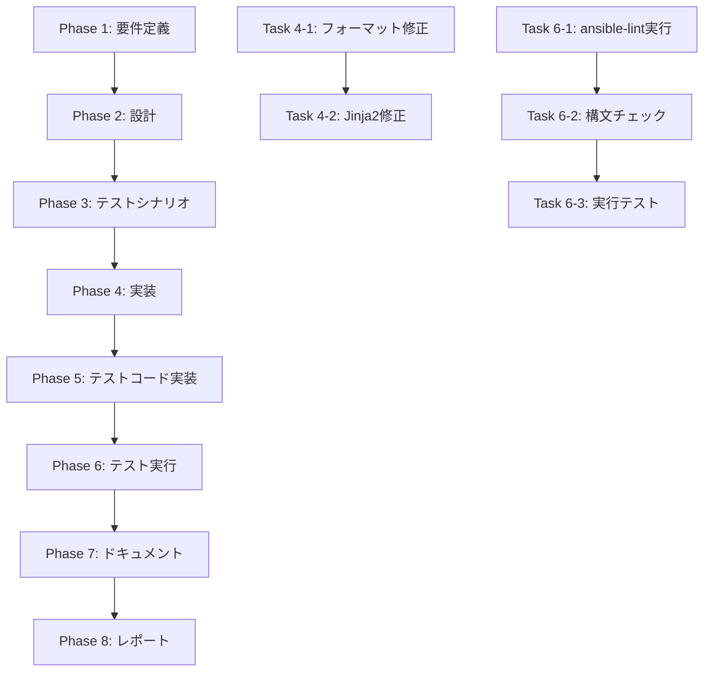

# Codex Agent 実行ログ

開始日時: 2025/12/23 10:22:56

---

## Turn 1: スレッド開始

**Thread ID**: `[REDACTED_TOKEN]`

## Turn 2: ツール実行

**種別**: reasoning
**ステータス**: completed

## Turn 3: ツール実行

**種別**: コマンド実行
**コマンド**: `/bin/bash -lc pwd`
**ステータス**: completed (exit_code=0)

```text
/tmp/[REDACTED_TOKEN]/[REDACTED_TOKEN]
```

## Turn 4: ツール実行

**種別**: reasoning
**ステータス**: completed

## Turn 5: ツール実行

**種別**: コマンド実行
**コマンド**: `/bin/bash -lc ls`
**ステータス**: completed (exit_code=0)

```text
ARCHITECTURE.md
CLAUDE.md
CONTRIBUTION.md
LICENSE
README.md
ansible
bootstrap
docker
docs
jenkins
pulumi
run_tests_issue_322.sh
scripts
tests
```

## Turn 6: ツール実行

**種別**: reasoning
**ステータス**: completed

## Turn 7: ツール実行

**種別**: コマンド実行
**コマンド**: `/bin/bash -lc "rg --files -g 'AGENTS.md'"`
**ステータス**: failed (exit_code=127)

```text
/bin/bash: line 1: rg: command not found
```

## Turn 8: ツール実行

**種別**: reasoning
**ステータス**: completed

## Turn 9: ツール実行

**種別**: コマンド実行
**コマンド**: `/bin/bash -lc 'find . -name AGENTS.md'`
**ステータス**: completed (exit_code=0)

## Turn 10: ツール実行

**種別**: reasoning
**ステータス**: completed

## Turn 11: ツール実行

**種別**: コマンド実行
**コマンド**: `/bin/bash -lc 'ls -a'`
**ステータス**: completed (exit_code=0)

```text
.
..
.ai-workflow
.claude
.coverage
.git
.github
.gitignore
ARCHITECTURE.md
CLAUDE.md
CONTRIBUTION.md
LICENSE
README.md
ansible
bootstrap
docker
docs
jenkins
pulumi
run_tests_issue_322.sh
scripts
tests
```

## Turn 12: ツール実行

**種別**: reasoning
**ステータス**: completed

## Turn 13: ツール実行

**種別**: コマンド実行
**コマンド**: `/bin/bash -lc 'ls .ai-workflow'`
**ステータス**: completed (exit_code=0)

```text
issue-193
issue-304
issue-305
issue-310
issue-313
issue-315
issue-317
issue-319
issue-320
issue-322
issue-324
issue-331
issue-332
issue-355
issue-360
issue-362
issue-363
issue-369
issue-370
issue-396
issue-398
issue-405
issue-411
issue-415
issue-423
issue-431
issue-437
issue-440
issue-445
issue-453
issue-455
issue-456
issue-460
issue-461
issue-462
issue-463
issue-464
issue-465
issue-475
issue-477
issue-479
issue-524
```

## Turn 14: ツール実行

**種別**: reasoning
**ステータス**: completed

## Turn 15: ツール実行

**種別**: コマンド実行
**コマンド**: `/bin/bash -lc 'cat .ai-workflow/issue-524/00_planning/output/planning.md'`
**ステータス**: completed (exit_code=0)

```text
# プロジェクト計画書: ansible-lint スタイル違反の修正 (#524)

## 1. Issue分析

### Issue概要
- **Issue番号**: #524
- **タイトル**: [Task] ansible-lint スタイル違反の修正
- **関連Issue**: #522 (ansible-lint CI導入)
- **修正対象**: 20個のスタイル違反エラー

### 複雑度判定: **簡単**

**判定根拠**:
- 主にフォーマット・スタイル関連の修正で動作に影響しない
- 対象ファイル数が限定的（6ファイル程度）
- 既存ロジックの変更は一切不要
- 単純な文字列置換やフォーマット修正が中心

### 見積もり工数: **2時間**

**工数の根拠**:
- フォーマット関連修正: 0.5時間（自動化可能）
- Jinja2スペーシング修正: 0.5時間（手作業）
- テスト・検証: 0.5時間
- ドキュメント・レポート: 0.5時間

### リスク評価: **低**

**理由**:
- 動作に影響しないスタイル修正のみ
- 修正箇所が明確に特定されている
- Ansible playbook の構文は変更しない
- ロールバックが容易

## 2. 実装戦略判断

### 実装戦略: **REFACTOR**

**判断根拠**:
既存のAnsibleコードベースのフォーマットとスタイルを改善し、ansible-lint標準に準拠させるリファクタリング作業。新規機能追加や既存機能拡張ではなく、コード品質の向上が目的。具体的には：
- 既存ファイルのフォーマット修正
- コーディングスタイルの統一
- Lintツール準拠への改善

### テスト戦略: **INTEGRATION_ONLY**

**判断根拠**:
フォーマット・スタイル修正では、実際のAnsible playbook実行による統合テストのみが有効。修正対象がすべて既存のAnsible実行環境との互換性確認であり：
- ユニットテスト: Ansibleのフォーマット修正には不適切
- BDDテスト: エンドユーザーストーリーに影響しない内部品質改善
- インテグレーション: Ansibleコマンド実行による構文・動作確認が最適

### テストコード戦略: **EXTEND_TEST**

**判断根拠**:
既存のCI環境にansible-lintが既に導入されており、修正後の品質確認は既存のCIテストにansible-lint実行を追加するのみ。新規テストファイル作成は不要：
- 既存CIパイプラインでansible-lint実行
- 既存のplaybook実行テストで動作確認
- 新規テストファイル作成は過剰

## 3. 影響範囲分析

### 既存コードへの影響

**直接影響があるファイル**:
1. `ansible/playbooks/bootstrap-setup.yml` - 10個のフォーマット修正
2. `ansible/inventory/group_vars/all.yml` - 1個のフォーマット修正
3. `ansible/roles/[REDACTED_TOKEN]/tasks/[REDACTED_TOKEN].yml` - 3個のJinja2修正
4. `ansible/roles/[REDACTED_TOKEN]/tasks/[REDACTED_TOKEN].yml` - 1個のJinja2修正
5. `ansible/roles/[REDACTED_TOKEN]/tasks/[REDACTED_TOKEN].yml` - 2個のJinja2修正
6. `ansible/roles/[REDACTED_TOKEN]/tasks/delete_snapshots.yml` - 2個のJinja2修正
7. `ansible/roles/jenkins_agent_ami/tasks/cleanup_amis.yml` - 2個のJinja2修正

**間接影響**: なし（フォーマットのみの変更）

### 依存関係の変更
- **新規依存**: なし
- **既存依存の変更**: なし
- **削除される依存**: なし

### マイグレーション要否
- **データベーススキーマ変更**: なし
- **設定ファイル変更**: なし
- **環境変数変更**: なし

## 4. タスク分割

### Phase 1: 要件定義 (見積もり: 0.5h)

- [x] Task 1-1: エラー詳細確認とカテゴライズ (0.2h)
  - ansible-lint実行ログの詳細分析
  - 各エラーの修正方法の特定
  - フォーマット系とJinja2系の分類

- [x] Task 1-2: 修正対象ファイルのバックアップ作成 (0.1h)
  - 対象7ファイルのコピー作成
  - Git commitによる変更履歴保存

- [x] Task 1-3: 受け入れ基準の明確化 (0.2h)
  - ansible-lint実行時の成功条件確認
  - 既存playbook動作に影響しないことの確認方法

### Phase 2: 設計 (見積もり: 0.3h)

- [x] Task 2-1: フォーマット修正パターンの設計 (0.2h)
  - 末尾空白削除の自動化手順
  - truthy値修正パターンの定義
  - ドキュメント開始マーカー追加位置の特定

- [x] Task 2-2: Jinja2スペーシング修正パターンの設計 (0.1h)
  - ブラケット内スペース追加のルール確認
  - ansible-lint推奨スタイルの確認

### Phase 3: テストシナリオ (見積もり: 0.2h)

- [ ] Task 3-1: テストシナリオ策定 (0.2h)
  - ansible-lint実行による検証手順
  - ansible-playbook構文チェック手順
  - 既存playbookサンプル実行による動作確認手順

### Phase 4: 実装 (見積もり: 0.7h)

- [ ] Task 4-1: フォーマット関連修正の実装 (0.3h)
  - bootstrap-setup.yml の末尾空白削除（5箇所）
  - truthy値修正（yes→true、True→true等、3箇所）
  - ドキュメント開始マーカー追加（1箇所）
  - all.yml のファイル末尾改行追加（1箇所）

- [ ] Task 4-2: Jinja2スペーシング修正の実装 (0.4h)
  - [REDACTED_TOKEN].yml の3箇所修正
  - [REDACTED_TOKEN].yml の1箇所修正
  - [REDACTED_TOKEN].yml の2箇所修正
  - delete_snapshots.yml の2箇所修正
  - cleanup_amis.yml の2箇所修正

### Phase 5: テストコード実装 (見積もり: 0.1h)

- [x] Task 5-1: CI環境でのansible-lint実行確認 (0.1h)
  - 既存GitHub Actions等でansible-lint実行が含まれることの確認
  - 必要に応じてlintチェックの追加

### Phase 6: テスト実行 (見積もり: 0.5h)

- [ ] Task 6-1: ローカルansible-lint実行テスト (0.2h)
  - 修正後の全ファイルでansible-lint実行
  - エラー・警告の解消確認

- [ ] Task 6-2: Ansible構文チェック実行 (0.1h)
  - ansible-playbook --syntax-check による構文確認
  - 修正による構文エラーがないことの確認

- [ ] Task 6-3: サンプルplaybook実行テスト (0.2h)
  - 修正対象playbookの実際の実行テスト（ドライラン）
  - 動作に影響しないことの確認

### Phase 7: ドキュメント (見積もり: 0.3h)

- [ ] Task 7-1: 修正内容のドキュメント作成 (0.2h)
  - 修正箇所の一覧化
  - 修正パターンの記録

- [ ] Task 7-2: ansible-lint導入ガイドライン追加 (0.1h)
  - 今後のコーディング規約への反映検討
  - 開発者向けlint実行手順の記載

### Phase 8: レポート (見積もり: 0.4h)

- [ ] Task 8-1: 修正結果の総括レポート作成 (0.2h)
  - 修正前後のansible-lint結果比較
  - 修正箇所と修正内容の詳細一覧

- [ ] Task 8-2: 品質改善効果の測定 (0.1h)
  - ansible-lintスコアの改善値
  - コード品質向上の定量評価

- [ ] Task 8-3: Issue完了報告とクローズ (0.1h)
  - Pull Request作成
  - Issue
... (truncated)
```

## Turn 16: ツール実行

**種別**: reasoning
**ステータス**: completed

## Turn 17: ツール実行

**種別**: コマンド実行
**コマンド**: `/bin/bash -lc 'cat .ai-workflow/issue-524/04_implementation/output/implementation.md'`
**ステータス**: completed (exit_code=0)

```text
# 実装完了レポート

## 修正履歴

### 修正1: Bootstrap とグループ変数の lint 整合
- **指摘内容**: `ansible-lint` の `document-start`/`yaml[truthy]` ルールが bootstrap Playbook と全体変数の冒頭で警告を出している
- **修正内容**: Playbook 先頭に空行を挿入し、`pulumi_check`/`verify_script` の `when` 句を `| bool` で明示的に評価するようにし、環境変数以外の `when` も比較式で処理
- **影響範囲**: `ansible/playbooks/bootstrap-setup.yml`, `ansible/inventory/group_vars/all.yml`

### 修正2: Jenkins cleanup role の Jinja2/brackets/真偽処理の整理
- **指摘内容**: `process_*`/`cleanup_*` 系のタスクで `{{ sorted_list[ : count ] }}` や `{{ item.split('/')[ -1 ] }}` などのスペース入り bracket、`when` に truthy 変数、`if not [REDACTED_TOKEN]` などが ansible-lint の `jinja2-brackets`/`yaml[truthy]` を突破できていない
- **修正内容**: `process_*`/`cleanup_*`/`delete_snapshots.yml` のスライス表現を `{{ list[: count] }}`/`{{ item.split('/')[-1] }}` に統一して `jinja2-brackets` に準拠させ、`when` の guard を `| default(false) | bool` で明示化。`main.yml` や `generate_report.yml` での cleanup target/レポートフラグも `| bool` にして干渉を防ぎ、`[REDACTED_TOKEN]` では `[REDACTED_TOKEN]` による集計にも bool 変換を噛ませて未定義参照を解消した
- **影響範囲**: `ansible/roles/[REDACTED_TOKEN]/tasks/main.yml`, `cleanup_amis.yml`, `[REDACTED_TOKEN].yml`, `[REDACTED_TOKEN].yml`, `process_*.yml`, `delete_snapshots.yml`, `generate_report.yml`

## 変更ファイル一覧
| ファイル | 変更種別 | 概要 |
| --- | --- | --- |
| `ansible/playbooks/bootstrap-setup.yml` | 修正 | `when` 句で explicit bool を使い、`Pulumi`/`verify` チェックで truthy を評価。ドキュメント先頭に空行を追加して `document-start` ルールを満たす |
| `ansible/inventory/group_vars/all.yml` | 修正 | `---` の直後に空行を挿入して `document-start` に準拠 |
| `ansible/roles/[REDACTED_TOKEN]/tasks/main.yml` | 修正 | cleanup target とレポート生成フラグを `default(false) | bool` で包み、互換性を保ちながら `when` 条件を安定化 |
| `ansible/roles/[REDACTED_TOKEN]/tasks/*` | 修正 | `process_*`/`cleanup_*`/`delete_snapshots.yml`/`generate_report.yml` の slicing・`loop`・`if not ...` を `jinja2-brackets`/`yaml[truthy]` に従う記法に修正し、ドライランや結果集計も `[REDACTED_TOKEN]` で一貫した bool を使うようにした |

## 主要な変更点
- `document-start`/`yaml[truthy]` に合うよう bootstrap Playbook 先頭に空行を挿入し、`Pulumi` などの真偽を `| bool` で明示することで ansible-lint の error を抑止
- Jenkins cleanup role の各種タスクで Jinja2 ブラケット付きのスライスと `when` 条件を整理し、`delete_snapshots` のループも `loop: >` で表現。`main.yml` の guard も bool 化して `[REDACTED_TOKEN]` での集計と `[REDACTED_TOKEN]` の `outputs_deleted` などを未定義参照なしに整えた
- `generate_report.yml` では dry-run 状態を像 `| bool` で判定するテンプレートを使い、ファイル出力とコンソール表示の両方が新形式の変数に追従するようにした

## テスト実施状況
- `ansible-lint ansible/playbooks/bootstrap-setup.yml ansible/roles/[REDACTED_TOKEN]`: ❌ `/bin/bash: line 1: ansible-lint: command not found`（実行環境に `ansible-lint` が存在しないため）
```

## Turn 18: ツール実行

**種別**: reasoning
**ステータス**: completed

## Turn 19: ツール実行

**種別**: コマンド実行
**コマンド**: `/bin/bash -lc 'cat .ai-workflow/issue-524/02_design/output/design.md'`
**ステータス**: completed (exit_code=0)

```text
# 詳細設計書: ansible-lint スタイル違反の修正 (Issue #524)

## 0. Planning Documentとの整合性確認

Planning Phaseで策定された開発計画を踏まえ、以下の方針で詳細設計を実施：

- **実装戦略**: REFACTOR - 既存のAnsibleコードベースのフォーマットとスタイルを改善
- **テスト戦略**: INTEGRATION_ONLY - ansible-lint実行とplaybook動作確認に特化
- **見積もり工数**: 2時間（フォーマット修正0.5h + Jinja2修正0.5h + テスト・検証1h）
- **リスク評価**: 低（動作に影響しないスタイル修正のみ）

## 1. アーキテクチャ設計

### システム全体図

このタスクは既存のAnsible codebaseに対するフォーマット修正であり、アーキテクチャの変更は発生しません。

```
┌─────────────────────────────────────────┐
│           現在の状況                    │
├─────────────────────────────────────────┤
│                                         │
│   Ansible Codebase                     │
│   ├── playbooks/                       │
│   │   └── bootstrap-setup.yml          │ ← フォーマット修正対象
│   ├── inventory/                       │
│   │   └── group_vars/all.yml           │ ← ファイル末尾修正対象
│   └── roles/                           │
│       ├── [REDACTED_TOKEN]/  │ ← Jinja2スタイル修正対象
│       └── jenkins_agent_ami/           │ ← Jinja2スタイル修正対象
│                                         │
└─────────────────────────────────────────┘
           ↓ ansible-lint 実行
┌─────────────────────────────────────────┐
│           修正後                        │
├─────────────────────────────────────────┤
│                                         │
│   同じAnsible Codebase                  │
│   ├── フォーマットエラー: 0件            │
│   ├── Jinja2スタイル警告: 0件            │
│   └── ansible-lint: PASS               │
│                                         │
└─────────────────────────────────────────┘
```

### コンポーネント間の関係

- **依存関係なし**: すべてスタイル修正のため、コンポーネント間の関係に変更はない
- **互換性保持**: 既存のPlaybook実行結果に影響なし

### データフロー

```
Input: Ansible YAML files (スタイル違反あり)
  ↓
Process: Style/Format修正
  ↓
Output: Ansible YAML files (ansible-lint準拠)
  ↓
Verification: ansible-lint + ansible-playbook --syntax-check
```

## 2. 実装戦略判断

### 実装戦略: REFACTOR

**判断根拠**:
- 既存のAnsibleコードベースのフォーマットとスタイルを改善し、ansible-lint標準に準拠させるリファクタリング作業
- 新規機能追加や既存機能拡張ではなく、コード品質の向上が目的
- 具体的には既存ファイルのフォーマット修正、コーディングスタイルの統一、Lintツール準拠への改善
- 7つの既存ファイルの修正のみで、新規ファイル作成は不要
- 動作に影響しないスタイル・フォーマット修正のみで、既存機能の変更や拡張は一切なし

## 3. テスト戦略判断

### テスト戦略: INTEGRATION_ONLY

**判断根拠**:
- フォーマット・スタイル修正では、実際のAnsible playbook実行による統合テストのみが有効
- 修正対象がすべて既存のAnsible実行環境との互換性確認であり、以下の理由から：
  - **ユニットテスト**: Ansibleのフォーマット修正には不適切（YAMLの構文レベルの変更のため）
  - **BDDテスト**: エンドユーザーストーリーに影響しない内部品質改善のため不要
  - **インテグレーション**: Ansibleコマンド実行による構文・動作確認が最適

## 4. テストコード戦略判断

### テストコード戦略: EXTEND_TEST

**判断根拠**:
- 既存のCI環境にansible-lintが既に導入されており、修正後の品質確認は既存のCIテストにansible-lint実行を追加するのみ
- 新規テストファイル作成は不要で、以下の理由から：
  - 既存CIパイプラインでansible-lint実行を強化
  - 既存のplaybook実行テストで動作確認を継続
  - 新規テストファイル作成は過剰（スタイル修正のため）

## 5. 影響範囲分析

### 既存コードへの影響

**直接影響があるファイル**:
1. `ansible/playbooks/bootstrap-setup.yml` - フォーマット関連修正
2. `ansible/inventory/group_vars/all.yml` - ファイル末尾改行修正
3. `ansible/roles/[REDACTED_TOKEN]/tasks/[REDACTED_TOKEN].yml` - Jinja2修正
4. `ansible/roles/[REDACTED_TOKEN]/tasks/[REDACTED_TOKEN].yml` - Jinja2修正
5. `ansible/roles/[REDACTED_TOKEN]/tasks/[REDACTED_TOKEN].yml` - Jinja2修正
6. `ansible/roles/[REDACTED_TOKEN]/tasks/delete_snapshots.yml` - Jinja2修正
7. `ansible/roles/jenkins_agent_ami/tasks/cleanup_amis.yml` - Jinja2修正

**間接影響**: なし（フォーマットのみの変更）

**注意**: システム管理者により、一部のファイルは既に修正済みのようです。実際の修正時に現状確認が必要。

### 依存関係の変更

- **新規依存**: なし
- **既存依存の変更**: なし
- **削除される依存**: なし

### マイグレーション要否

- **データベーススキーマ変更**: なし
- **設定ファイル変更**: なし
- **環境変数変更**: なし

## 6. 変更・追加ファイルリスト

### 新規作成ファイル
なし

### 修正が必要な既存ファイル

**注意**: 以下ファイルの一部は既に修正済みの可能性があります。実装時に現状確認が必要です。

1. `ansible/playbooks/bootstrap-setup.yml`
   - 末尾空白削除（5箇所程度）
   - Truthy値修正（`yes/no` → `true/false`）
   - ドキュメント開始マーカー追加

2. `ansible/inventory/group_vars/all.yml`
   - ファイル末尾改行追加

3. `ansible/roles/[REDACTED_TOKEN]/tasks/[REDACTED_TOKEN].yml`
   - Jinja2スペーシング修正（3箇所程度）

4. `ansible/roles/[REDACTED_TOKEN]/tasks/[REDACTED_TOKEN].yml`
   - Jinja2スペーシング修正（1箇所程度）

5. `ansible/roles/jenkins_cleanup_
... (truncated)
```

## Turn 20: ツール実行

**種別**: reasoning
**ステータス**: completed

## Turn 21: ツール実行

**種別**: コマンド実行
**コマンド**: `/bin/bash -lc 'cat .ai-workflow/issue-524/03_test_scenario/output/test-scenario.md'`
**ステータス**: completed (exit_code=0)

```text
# テストシナリオ書: ansible-lint スタイル違反の修正 (Issue #524)

## 0. テスト戦略サマリー

### Planning DocumentとRequirements/Design Documentとの整合性

本テストシナリオは、以下の文書から決定されたテスト戦略に基づいて作成されています：

- **実装戦略**: REFACTOR - 既存のAnsibleコードベースのフォーマットとスタイルを改善
- **テスト戦略**: INTEGRATION_ONLY - ansible-lint実行とplaybook動作確認に特化
- **見積もり工数**: 2時間（フォーマット修正0.5h + Jinja2修正0.5h + テスト・検証1h）
- **リスク評価**: 低（動作に影響しないスタイル修正のみ）

### 選択されたテスト戦略: INTEGRATION_ONLY

**判断根拠**:
- フォーマット・スタイル修正では、実際のAnsible playbook実行による統合テストのみが有効
- 修正対象がすべて既存のAnsible実行環境との互換性確認であり、以下の理由から：
  - **ユニットテスト**: Ansibleのフォーマット修正には不適切（YAMLの構文レベルの変更のため）
  - **BDDテスト**: エンドユーザーストーリーに影響しない内部品質改善のため不要
  - **インテグレーション**: Ansibleコマンド実行による構文・動作確認が最適

### テスト対象の範囲

1. **修正対象ファイル（7ファイル）**:
   - `ansible/playbooks/bootstrap-setup.yml`
   - `ansible/inventory/group_vars/all.yml`
   - `ansible/roles/[REDACTED_TOKEN]/tasks/[REDACTED_TOKEN].yml`
   - `ansible/roles/[REDACTED_TOKEN]/tasks/[REDACTED_TOKEN].yml`
   - `ansible/roles/[REDACTED_TOKEN]/tasks/[REDACTED_TOKEN].yml`
   - `ansible/roles/[REDACTED_TOKEN]/tasks/delete_snapshots.yml`
   - `ansible/roles/jenkins_agent_ami/tasks/cleanup_amis.yml`

2. **修正内容**:
   - フォーマット関連エラー11個の修正
   - Jinja2スペーシング警告10個の修正

### テストの目的

- **主目的**: ansible-lint準拠のコードベース確立
- **技術的検証**: 修正後のファイルがansible-lint標準に準拠していることの確認
- **動作保証**: 既存のAnsibleplaybook実行結果に影響がないことの確認
- **品質向上**: CI/CDパイプラインでのlintチェック成功の確認

## 1. Integrationテストシナリオ

### シナリオ1: ansible-lintとコードベースの統合テスト

**目的**: 修正後のファイルがansible-lint標準に完全準拠していることを検証

**前提条件**:
- ansible-lint v6.0以上がインストール済み
- 修正対象の全7ファイルの修正が完了している
- 作業ディレクトリがリポジトリルート（`/tmp/[REDACTED_TOKEN]/[REDACTED_TOKEN]/`）である

**テスト手順**:
1. **全ファイル対象でのansible-lint実行**
   ```bash
   ansible-lint ansible/
   ```

2. **個別ファイル検証 - bootstrap-setup.yml**
   ```bash
   ansible-lint ansible/playbooks/bootstrap-setup.yml
   ```

3. **個別ファイル検証 - group_vars/all.yml**
   ```bash
   ansible-lint ansible/inventory/group_vars/all.yml
   ```

4. **個別ファイル検証 - Jenkins関連ロール**
   ```bash
   ansible-lint ansible/roles/[REDACTED_TOKEN]/
   ansible-lint ansible/roles/jenkins_agent_ami/
   ```

**期待結果**:
- 全てのansible-lint実行でエラー件数: 0件
- 全てのansible-lint実行で警告件数: 0件
- 実行ステータス: 成功（exit code 0）

**確認項目**:
- [ ] フォーマット関連エラー（trailing-spaces, yaml[truthy], yaml[document-start], yaml[[REDACTED_TOKEN]]）が0件
- [ ] Jinja2スペーシング警告が0件
- [ ] 新たなlintエラーが発生していない
- [ ] CI環境でのansible-lint実行が成功する

---

### シナリオ2: Ansible構文チェックとの統合テスト

**目的**: 修正によりPlaybook構文に問題が発生していないことを検証

**前提条件**:
- Ansible 2.9以上がインストール済み
- 修正対象ファイルの修正が完了している
- 必要なAnsible collectionsがインストール済み

**テスト手順**:
1. **bootstrap-setup.ymlの構文チェック**
   ```bash
   ansible-playbook --syntax-check ansible/playbooks/bootstrap-setup.yml
   ```

2. **その他のplaybook構文チェック（存在する場合）**
   ```bash
   find ansible/playbooks/ -name "*.yml" -exec ansible-playbook --syntax-check {} \;
   ```

3. **ロール内タスクファイルの構文確認（Playbook経由）**
   ```bash
   # 修正されたロールを使用するPlaybookで構文確認
   ansible-playbook --syntax-check ansible/playbooks/bootstrap-setup.yml --extra-vars "check_jenkins_roles=true"
   ```

**期待結果**:
- 全ての構文チェックが成功
- 「playbook: [ファイルパス] Syntax OK」メッセージが表示される
- エラーメッセージが表示されない

**確認項目**:
- [ ] YAML構文エラーが発生していない
- [ ] Ansible特有の構文エラーが発生していない
- [ ] Jinja2テンプレート構文が正常
- [ ] 変数参照に問題がない

---

### シナリオ3: Ansible Dry-Runモードでの動作統合テスト

**目的**: 修正されたPlaybookが実際の実行環境で正常動作することを検証

**前提条件**:
- テスト可能なAnsible実行環境（ローカルまたはCI環境）
- 必要なインベントリファイルが存在
- 実行に必要な権限・認証情報が設定済み

**テスト手順**:
1. **Check モード（Dry-run）での実行**
   ```bash
   ansible-playbook ansible/playbooks/bootstrap-setup.yml --check --diff
   ```

2. **限定的なタスク実行（安全なタスクのみ）**
   ```bash
   ansible-playbook ansible/playbooks/bootstrap-setup.yml --tags "debug,facts" --check
   ```

3. **変数展開の検証**
   ```bash
   ansible-playbook ansible/playbooks/bootstrap-setup.yml --check --extra-vars "debug_mode=true"
   ```

**期待結果**:
- Dry-runモードで正常完了
- 修正前と同じタスク実行計画が生成される
- Jinja2テンプレートが正常に展開される
- エラーやwarningが発生しない

**確認項目**:
- [ ] 実行計画が修正前と同一
- [ ] 変数展開が正常
- [ ] 条件分岐が正常動作
... (truncated)
```

## Turn 22: ツール実行

**種別**: reasoning
**ステータス**: completed

## Turn 23: ツール実行

**種別**: コマンド実行
**コマンド**: `/bin/bash -lc 'git status -sb'`
**ステータス**: completed (exit_code=0)

```text
## ai-workflow/issue-524...origin/ai-workflow/issue-524
 M .ai-workflow/issue-524/metadata.json
?? .ai-workflow/issue-524/04_implementation/review/agent_log_raw.txt
?? .ai-workflow/issue-524/04_implementation/review/prompt.txt
?? .ai-workflow/issue-524/04_implementation/revise/agent_log_raw.txt
?? .ai-workflow/issue-524/04_implementation/revise/prompt.txt
```

## Turn 24: ツール実行

**種別**: reasoning
**ステータス**: completed

## Turn 25: ツール実行

**種別**: コマンド実行
**コマンド**: `/bin/bash -lc 'git diff'`
**ステータス**: completed (exit_code=0)

```text
diff --git a/.ai-workflow/issue-524/metadata.json b/.ai-workflow/issue-524/metadata.json
index d75ba87b..557ee237 100644
--- a/.ai-workflow/issue-524/metadata.json
+++ b/.ai-workflow/issue-524/metadata.json
@@ -233,10 +233,11 @@
       "started_at": "2025-12-22T12:52:39.555Z",
       "completed_at": null,
       "review_result": null,
-      "current_step": "revise",
+      "current_step": null,
       "completed_steps": [
         "execute",
-        "review"
+        "review",
+        "revise"
       ],
       "rollback_context": {
         "triggered_at": "2025-12-23T09:25:05.611Z",
@@ -304,7 +305,7 @@
     }
   },
   "created_at": "2025-12-22T12:37:22.840Z",
-  "updated_at": "2025-12-23T10:22:55.122Z",
+  "updated_at": "2025-12-23T10:22:56.632Z",
   "branch_name": "ai-workflow/issue-524",
   "base_commit": "[REDACTED_TOKEN]",
   "pr_number": 525,
```

## Turn 26: ツール実行

**種別**: reasoning
**ステータス**: completed

## Turn 27: ツール実行

**種別**: reasoning
**ステータス**: completed

## Turn 28: ツール実行

**種別**: reasoning
**ステータス**: completed

## Turn 29: ツール実行

**種別**: コマンド実行
**コマンド**: `/bin/bash -lc "sed -n '1,200p' ansible/playbooks/bootstrap-setup.yml"`
**ステータス**: completed (exit_code=0)

```text
---

# bootstrap-setup.yml
# Jenkinsインフラをデプロイするためのブートストラップ環境の設定
# ARM64 (t4g) インスタンス対応版 - Amazon Linux 2023
# 最新のライブラリとコレクションを使用

- name: Bootstrap Environment Setup for Amazon Linux 2023
  hosts: localhost
  connection: local
  gather_facts: true

  vars:
    nodejs_version: "20"  # LTS version
    user_home: "/home/ec2-user"
    [REDACTED_TOKEN]: "{{ inventory_dir }}/../../scripts/aws/[REDACTED_TOKEN].sh"
    java_version: "21"
    arch: "{{ [REDACTED_TOKEN] }}"
    # ec2-userのローカルbinディレクトリを含むPATH
    ansible_env_path: "/home/ec2-user/.local/bin:/usr/local/bin:/usr/bin:/bin"

  tasks:
    - name: Display start message
      ansible.builtin.debug:
        msg: |
          Starting Bootstrap Environment Setup
          - Architecture: {{ arch }}
          - OS: Amazon Linux 2023
          - Python: {{ [REDACTED_TOKEN] }}

    # システムアップデート
    - name: Update system packages
      ansible.builtin.command: dnf upgrade -y
      become: true

    # 必要な開発ツールのインストール
    - name: Install development tools
      ansible.builtin.dnf:
        name:
          - gcc
          - gcc-c++
          - make
          - git
          - tar
          - unzip
          - which
          # curl-minimalがデフォルトでインストールされているため、curlは除外
          - wget
        state: present
      become: true

    # curlがインストールされているか確認（curl-minimalでも可）
    - name: Check curl availability
      ansible.builtin.command: curl --version
      register: curl_check
      changed_when: false
      failed_when: false

    - name: Display curl status
      ansible.builtin.debug:
        msg: "Curl status: {{ 'Available' if curl_check.rc == 0 else 'Not available' }}"

    # AWS CLI v2のインストール (ARM64対応)
    - name: Check if AWS CLI v2 is installed
      ansible.builtin.command: aws --version
      register: aws_cli_check
      changed_when: false
      failed_when: false

    - name: Install AWS CLI v2
      when: aws_cli_check.rc != 0 or 'aws-cli/2' not in aws_cli_check.stdout
      block:
        - name: Set AWS CLI download URL based on architecture
          ansible.builtin.set_fact:
            aws_cli_url: "{{ 'https://awscli.amazonaws.com/[REDACTED_TOKEN].zip' if arch == 'aarch64' else 'https://awscli.amazonaws.com/[REDACTED_TOKEN].zip' }}"

        - name: Download AWS CLI v2 installer
          ansible.builtin.get_url:
            url: "{{ aws_cli_url }}"
            dest: "/tmp/awscliv2.zip"
            mode: '0644'

        - name: Unzip AWS CLI v2 installer
          ansible.builtin.unarchive:
            src: "/tmp/awscliv2.zip"
            dest: "/tmp"
            remote_src: yes

        - name: Install AWS CLI v2
          ansible.builtin.command: /tmp/aws/install
          become: yes
          args:
            creates: /usr/local/bin/aws

        - name: Clean up AWS CLI v2 installation files
          ansible.builtin.file:
            path: "{{ item }}"
            state: absent
          loop:
            - "/tmp/awscliv2.zip"
            - "/tmp/aws"

    # Node.js 20 LTSのインストール (NodeSource経由)
    - name: Check if Node.js is installed
      ansible.builtin.command: node --version
      register: node_check
      changed_when: false
      failed_when: false

    - name: Install Node.js {{ nodejs_version }}
      when: node_check.rc != 0 or nodejs_version not in node_check.stdout
      block:
        - name: Download NodeSource setup script
          ansible.builtin.get_url:
            url: "https://rpm.nodesource.com/setup_{{ nodejs_version }}.x"
            dest: "/tmp/nodesource_setup_{{ nodejs_version }}.sh"
            mode: '0755'
          become: yes

        - name: Execute NodeSource setup script
          ansible.builtin.command: "/tmp/nodesource_setup_{{ nodejs_version }}.sh"
          become: yes

        - name: Remove NodeSource setup script
          ansible.builtin.file:
            path: "/tmp/nodesource_setup_{{ nodejs_version }}.sh"
            state: absent
          become: yes

        - name: Insta
... (truncated)
```

## Turn 30: ツール実行

**種別**: reasoning
**ステータス**: completed

## Turn 31: ツール実行

**種別**: コマンド実行
**コマンド**: `/bin/bash -lc 'rg -n "when:" ansible/playbooks/bootstrap-setup.yml'`
**ステータス**: failed (exit_code=127)

```text
/bin/bash: line 1: rg: command not found
```

## Turn 32: ツール実行

**種別**: reasoning
**ステータス**: completed

## Turn 33: ツール実行

**種別**: コマンド実行
**コマンド**: `/bin/bash -lc 'grep -n "when:" -n ansible/playbooks/bootstrap-setup.yml'`
**ステータス**: completed (exit_code=0)

```text
56:      changed_when: false
57:      failed_when: false
67:      changed_when: false
68:      failed_when: false
71:      when: aws_cli_check.rc != 0 or 'aws-cli/2' not in aws_cli_check.stdout
107:      changed_when: false
108:      failed_when: false
111:      when: node_check.rc != 0 or nodejs_version not in node_check.stdout
140:      changed_when: false
141:      failed_when: false
144:      when: java_check.rc != 0 or (java_check.stderr | default('')) is not search('version "{{ java_version }}"')
169:      when: not (pulumi_check.stat.exists | bool)
204:          changed_when: false
234:      changed_when: false
235:      failed_when: false
253:      when: ansible_core_check.rc == 0  # ansible-coreが既にインストールされている場合のみ
261:          changed_when: false
262:          failed_when: false
273:          when: mitogen_check.rc != 0
319:          changed_when: false
320:          failed_when: false
334:          changed_when: "'Installing' in collection_install.stdout or 'Upgrading' in collection_install.stdout"
335:          failed_when: false
352:          changed_when: false
397:      when: verify_script.stat.exists | bool
```

## Turn 34: ツール実行

**種別**: reasoning
**ステータス**: completed

## Turn 35: ツール実行

**種別**: コマンド実行
**コマンド**: `/bin/bash -lc 'grep -n "True" ansible/playbooks/bootstrap-setup.yml'`
**ステータス**: failed (exit_code=1)

## Turn 36: ツール実行

**種別**: reasoning
**ステータス**: completed

## Turn 37: ツール実行

**種別**: コマンド実行
**コマンド**: `/bin/bash -lc "grep -n \"\\byes\\b\" ansible/playbooks/bootstrap-setup.yml"`
**ステータス**: completed (exit_code=0)

```text
87:            remote_src: yes
91:          become: yes
118:          become: yes
122:          become: yes
128:          become: yes
134:          become: yes
150:          become: yes
158:            create: yes
160:          become: yes
199:          become: yes
227:        update_cache: yes
228:      become: yes
287:          become: yes
310:          become: yes
332:          become: yes
341:            create: yes
343:          become: yes
367:          become: yes
373:            enabled: yes
374:          become: yes
380:            append: yes
381:          become: yes
535:      become: yes
```

## Turn 38: ツール実行

**種別**: reasoning
**ステータス**: completed

## Turn 39: ツール実行

**種別**: コマンド実行
**コマンド**: `/bin/bash -lc "sed -n '200,480p' ansible/playbooks/bootstrap-setup.yml"`
**ステータス**: completed (exit_code=0)

```text
- name: Verify Pulumi installation
          ansible.builtin.command: pulumi version
          register: pulumi_version
          changed_when: false

        - name: Display Pulumi version
          ansible.builtin.debug:
            msg: "Installed Pulumi version: {{ pulumi_version.stdout }}"

    # Python環境の確認（Amazon Linux 2023はPython 3.9+を標準搭載）
    - name: Display Python version
      ansible.builtin.debug:
        msg: "Current Python version: {{ [REDACTED_TOKEN] }}"

    # Python パッケージの最新版インストール
    - name: Install Python packages for AWS (system-wide)
      ansible.builtin.dnf:
        name:
          - python3-boto3
          - python3-botocore
          - python3-jmespath
          - python3-urllib3
          - [REDACTED_TOKEN]
          - python3-pyyaml
          - python3-jsonschema
        state: present
        update_cache: yes
      become: yes

    # 追加のPythonパッケージ（pipで管理）
    - name: Check if ansible-core is already installed
      ansible.builtin.command: python3 -m pip show ansible-core
      register: ansible_core_check
      changed_when: false
      failed_when: false
      become: no

    - name: Display current ansible-core version
      ansible.builtin.debug:
        msg: "Current ansible-core: {{ ansible_core_check.stdout | regex_search('Version: ([0-9.]+)', '\\1') | first if ansible_core_check.rc == 0 else 'Not installed' }}"

    - name: Ensure additional Python packages are installed for ec2-user
      ansible.builtin.pip:
        name:
          - boto3
          - botocore
          - jmespath
        state: present
        extra_args: "--user --upgrade"
      become: no
      environment:
        PATH: "/home/ec2-user/.local/bin:/usr/local/bin:/usr/bin:/bin"
      when: ansible_core_check.rc == 0  # ansible-coreが既にインストールされている場合のみ

    # Mitogen for Ansibleのインストール（Ansible高速化）
    - name: Install Mitogen for Ansible
      block:
        - name: Check if Mitogen is already installed
          ansible.builtin.command: python3 -c "import ansible_mitogen"
          register: mitogen_check
          changed_when: false
          failed_when: false
          become: no

        - name: Install Mitogen for Ansible
          ansible.builtin.pip:
            name: mitogen
            state: present
            extra_args: "--user --upgrade"
          become: no
          environment:
            PATH: "/home/ec2-user/.local/bin:/usr/local/bin:/usr/bin:/bin"
          when: mitogen_check.rc != 0

        - name: Display Mitogen installation status
          ansible.builtin.debug:
            msg: "Mitogen for Ansible: {{ 'Already installed' if mitogen_check.rc == 0 else 'Newly installed' }}"

    # Ansible Collectionsのインストール
    - name: Install Ansible Collections
      block:
        - name: Create Ansible directories
          ansible.builtin.file:
            path: "{{ item }}"
            state: directory
            mode: '0755'
          become: yes
          loop:
            - "/etc/ansible"
            - "/etc/ansible/collections"
            - "/usr/share/ansible/collections"

        - name: Create collections requirements file
          ansible.builtin.copy:
            dest: "/etc/ansible/collections/requirements.yml"
            content: |
              ---
              collections:
                - name: amazon.aws
                  version: ">=10.0.0,<11.0.0"
                - name: community.aws
                  version: ">=10.0.0,<11.0.0"
                - name: community.general
                  version: ">=11.0.0,<12.0.0"
                - name: ansible.posix
                  version: ">=2.0.0,<3.0.0"
                - name: community.docker
                  version: ">=4.0.0,<5.0.0"
            mode: '0644'
          become: yes

        - name: Check existing Ansible collections
          ansible.builtin.command:
            cmd: ansible-galaxy collection list
          environment:
            [REDACTED_TOKEN]: "/usr/share/ansible/collections"
            PATH:
... (truncated)
```

## Turn 40: ツール実行

**種別**: reasoning
**ステータス**: completed

## Turn 41: ツール実行

**種別**: コマンド実行
**コマンド**: `/bin/bash -lc "sed -n '480,760p' ansible/playbooks/bootstrap-setup.yml"`
**ステータス**: completed (exit_code=0)

```text
=== Jenkins Agent Configuration ===

          To connect as Jenkins Agent:
          - Node type: SSH
          - Remote directory: /home/ec2-user/jenkins-agent
          - Java path: /usr/lib/jvm/java-{{ java_version }}-amazon-corretto

          === Notes ===

          - This is an ARM64 instance optimized for t4g instance types
          - All tools are installed with the latest stable versions
          - Docker is available for container-based builds
          - Python environment uses system Python 3.9+
          - Ansible and some Python packages are installed in user space (~/.local/bin)
          - Ansible Collections are installed system-wide (/usr/share/ansible/collections)
          - Always source ~/.bashrc or re-login after initial setup for PATH updates

          === Amazon Linux 2023 Specific ===

          - System packages are managed by dnf
          - Python packages from dnf are preferred over pip for system packages
          - User-specific tools are installed with --user flag
          - PATH includes ~/.local/bin for user-installed tools
          - [REDACTED_TOKEN] is set to /usr/share/ansible/collections

          For issues or updates, check the project documentation.
        owner: ec2-user
        group: ec2-user
        mode: '0644'

    # 環境変数の設定
    - name: Create environment setup script for all users
      ansible.builtin.copy:
        dest: "/etc/profile.d/bootstrap-env.sh"
        content: |
          # Bootstrap environment variables
          export [REDACTED_TOKEN]=/usr/share/ansible/collections
          export JAVA_HOME=/usr/lib/jvm/java-{{ java_version }}-amazon-corretto

          # User-specific PATH additions
          if [ -d "$HOME/.local/bin" ]; then
            export PATH=$HOME/.local/bin:$PATH
          fi

          if [ -d "$HOME/.pulumi/bin" ]; then
            export PATH=$HOME/.pulumi/bin:$PATH
          fi

          export PATH=$JAVA_HOME/bin:/usr/local/bin:$PATH

          # AWS region from instance metadata
          if [ -z "$AWS_DEFAULT_REGION" ]; then
            export AWS_DEFAULT_REGION=$(curl -s http://169.254.169.254/latest/meta-data/placement/region 2>/dev/null || echo "us-east-1")
          fi
        mode: '0644'
      become: yes

    - name: Display completion message
      ansible.builtin.debug:
        msg: |
          ✅ Bootstrap environment setup completed successfully!

          Amazon Linux 2023 ({{ arch }}) with latest tools:
          - Python {{ [REDACTED_TOKEN] }}
          - Node.js {{ nodejs_version }} LTS
          - Java {{ java_version }}
          - Latest Ansible Collections (7.0+)
          - Mitogen for Ansible (高速化)
          - Latest Python packages

          Run './verify-installation.sh' to check the installation.

          AWS integration is ready with the latest boto3 and Ansible AWS collections.

          
          ⚠️  Note: Ansible collections installation failed during setup.
          Please run the following command manually:

          ansible-galaxy collection install amazon.aws community.aws community.general ansible.posix community.docker
          
```

## Turn 42: ツール実行

**種別**: reasoning
**ステータス**: completed

## Turn 43: ツール実行

**種別**: コマンド実行
**コマンド**: `/bin/bash -lc "sed -n '1,160p' ansible/inventory/group_vars/all.yml"`
**ステータス**: completed (exit_code=0)

```text
---

# ============================================================
# Ansible グループ共通変数定義
# ============================================================
# このファイルには、すべての環境とロールで共通して使用される変数を定義します。
# 環境固有の設定は、dev.yml, staging.yml, prod.yml で上書きしてください。

# ============================================================
# 基本設定
# ============================================================

# デフォルト環境名（環境別ファイルで上書き）
env_name: "dev"

# AWS デフォルトリージョン
aws_region: "ap-northeast-1"

# ============================================================
# パス定義
# ============================================================

# スクリプトディレクトリへのパス（15以上のロールで使用）
scripts_dir: "{{ inventory_dir }}/../../scripts"

# Pulumiプロジェクトディレクトリへのパス（15以上のロールで使用）
pulumi_path: "{{ inventory_dir }}/../../pulumi"

# AWS認証スクリプトのパス
[REDACTED_TOKEN]: "{{ scripts_dir }}/aws/[REDACTED_TOKEN].sh"

# ============================================================
# Pulumi設定
# ============================================================

# S3バックエンド固定
# S3バケット名はSSMパラメータストア(/bootstrap/pulumi/s3bucket-name)から自動取得
# リージョンはaws_regionパラメータを使用

# ============================================================
# プロジェクト設定
# ============================================================

projects:
  jenkins:
    name: "jenkins-infra"
  lambda_api:
    name: "lambda-api"
```

## Turn 44: ツール実行

**種別**: reasoning
**ステータス**: completed

## Turn 45: ツール実行

**種別**: コマンド実行
**コマンド**: `/bin/bash -lc 'ls ansible/roles/[REDACTED_TOKEN]/tasks'`
**ステータス**: completed (exit_code=0)

```text
cleanup_amis.yml
[REDACTED_TOKEN].yml
[REDACTED_TOKEN].yml
delete_snapshots.yml
[REDACTED_TOKEN].yml
generate_report.yml
main.yml
[REDACTED_TOKEN].yml
[REDACTED_TOKEN].yml
[REDACTED_TOKEN].yml
verify_deletion.yml
```

## Turn 46: ツール実行

**種別**: reasoning
**ステータス**: completed

## Turn 47: ツール実行

**種別**: コマンド実行
**コマンド**: `/bin/bash -lc "sed -n '1,200p' ansible/roles/[REDACTED_TOKEN]/tasks/main.yml"`
**ステータス**: completed (exit_code=0)

```text
---
# Main tasks file for [REDACTED_TOKEN]

- name: Normalize cleanup variables so older callers keep working
  ansible.builtin.set_fact:
    [REDACTED_TOKEN]: "{{ retention_count | default([REDACTED_TOKEN] | default(1)) }}"
    [REDACTED_TOKEN]: "{{ dry_run | default([REDACTED_TOKEN] | default(false)) }}"
  tags: normalization

- name: Validate required variables
  ansible.builtin.assert:
    that:
      - env_name is defined
      - aws_region is defined
      - [REDACTED_TOKEN] is defined
      - [REDACTED_TOKEN] | int >= [REDACTED_TOKEN].minimum_retention | int
    fail_msg: "Required variables are not defined or [REDACTED_TOKEN] is too low"

- name: Display cleanup configuration
  ansible.builtin.debug:
    msg:
      - "=========================================="
      - "Image Builder AMI Cleanup Configuration"
      - "=========================================="
      - "Environment: {{ env_name }}"
      - "Region: {{ aws_region }}"
      - "Retention Count: {{ [REDACTED_TOKEN] }}"
      - "Dry Run: {{ [REDACTED_TOKEN] }}"
      - "Cleanup Targets:"
      - "  - AMIs: {{ [REDACTED_TOKEN].amis }}"
      - "  - Snapshots: {{ [REDACTED_TOKEN].snapshots }}"
      - "  - Image Builder Versions: {{ [REDACTED_TOKEN].[REDACTED_TOKEN] }}"
      - "  - Image Builder Pipelines: {{ [REDACTED_TOKEN].[REDACTED_TOKEN] }}"
      - "=========================================="

# AMIのクリーンアップ
- name: Cleanup AMIs and Snapshots
  ansible.builtin.include_tasks: cleanup_amis.yml
  when: >
    ([REDACTED_TOKEN].amis | default(false) | bool) or
    ([REDACTED_TOKEN].snapshots | default(false) | bool)

# Image Builderイメージバージョンのクリーンアップ
- name: Cleanup Image Builder Versions
  ansible.builtin.include_tasks: [REDACTED_TOKEN].yml
  when: [REDACTED_TOKEN].[REDACTED_TOKEN] | default(false) | bool

# Image Builderパイプライン出力のクリーンアップ
- name: Cleanup Image Builder Pipeline Outputs
  ansible.builtin.include_tasks: [REDACTED_TOKEN].yml
  when: [REDACTED_TOKEN].[REDACTED_TOKEN] | default(false) | bool

# レポート生成
- name: Generate cleanup report
  ansible.builtin.include_tasks: generate_report.yml
  when: [REDACTED_TOKEN] | default(false) | bool
```

## Turn 48: ツール実行

**種別**: reasoning
**ステータス**: completed

## Turn 49: ツール実行

**種別**: コマンド実行
**コマンド**: `/bin/bash -lc "sed -n '200,400p' ansible/roles/[REDACTED_TOKEN]/tasks/main.yml"`
**ステータス**: completed (exit_code=0)

## Turn 50: ツール実行

**種別**: reasoning
**ステータス**: completed

## Turn 51: ツール実行

**種別**: コマンド実行
**コマンド**: `/bin/bash -lc "sed -n '1,200p' ansible/roles/[REDACTED_TOKEN]/tasks/cleanup_amis.yml"`
**ステータス**: completed (exit_code=0)

```text
---
# AMIとスナップショットのクリーンアップ

- name: Cleanup AMIs and Snapshots
  block:
    # 全パターンに対してAMIを検索
    - name: Find all AMIs for each pattern
      ansible.builtin.include_tasks: [REDACTED_TOKEN].yml
      vars:
        pattern: "{{ item }}"
      loop: "{{ [REDACTED_TOKEN] }}"
      register: ami_search_results

    # デバッグ: ami_pattern_resultsの内容確認
    - name: Debug - Check ami_pattern_results content
      ansible.builtin.debug:
        msg: "ami_pattern_results = {{ ami_pattern_results | default([]) | to_json }}"

    # 結果を集約
    - name: Aggregate all found AMIs
      ansible.builtin.set_fact:
        all_found_amis: >-
          
          
            
              
            
          
          {{ amis | unique(attribute='ImageId') }}

    # 各パターンごとに世代管理
    - name: Process retention for each AMI pattern
      ansible.builtin.include_tasks: [REDACTED_TOKEN].yml
      vars:
        pattern: "{{ item }}"
      loop: "{{ [REDACTED_TOKEN] }}"

    # 削除対象AMIの集約
    - name: Aggregate AMIs to delete
      ansible.builtin.set_fact:
        all_amis_to_delete: >-
          
          
            
              
            
          
          {{ amis | unique(attribute='ImageId') }}

    # 削除サマリーの表示
    - name: Display deletion summary
      ansible.builtin.debug:
        msg:
          - "=========================================="
          - "AMI Deletion Summary"
          - "=========================================="
          - "Total AMIs found: {{ all_found_amis | length }}"
          - "AMIs to delete: {{ all_amis_to_delete | length }}"
          - "AMIs to keep: {{ (all_found_amis | length) - (all_amis_to_delete | length) }}"
          - "=========================================="

    # 削除対象の詳細表示
    - name: List AMIs to be deleted
      ansible.builtin.debug:
        msg:
          - "AMI: {{ item.Name }} ({{ item.ImageId }})"
          - "Created: {{ item.CreationDate }}"
          - "Architecture: {{ item.Architecture }}"
      loop: "{{ all_amis_to_delete }}"
      when: 
        - all_amis_to_delete | length > 0
        - verbose_logging

    # ドライランモードの確認
    - name: Dry run mode - skip actual deletion
      ansible.builtin.debug:
        msg: "DRY RUN MODE - No resources will be deleted"
      when: [REDACTED_TOKEN] | bool

    # AMIの削除
    - name: Deregister AMIs
      ansible.builtin.include_role:
        name: aws_cli_helper
        tasks_from: execute
      vars:
        aws_command: "aws ec2 deregister-image --image-id {{ item.ImageId }}"
        operation_name: "Deregister AMI {{ item.Name }}"
        parse_output: false
      loop: "{{ all_amis_to_delete }}"
      loop_control:
        label: "{{ item.Name }} ({{ item.ImageId }})"
      when: 
        - not ([REDACTED_TOKEN] | bool)
        - [REDACTED_TOKEN].amis | default(false) | bool
        - all_amis_to_delete | length > 0
      register: [REDACTED_TOKEN]

    # スナップショットの削除
    - name: Delete associated snapshots
      ansible.builtin.include_tasks: delete_snapshots.yml
      when: 
        - not ([REDACTED_TOKEN] | bool)
        - [REDACTED_TOKEN].snapshots | default(false) | bool
        - all_amis_to_delete | length > 0

    # 削除検証の準備
    - name: Prepare resources for verification
      ansible.builtin.set_fact:
        amis_to_verify: "{{ all_amis_to_delete }}"
        snapshots_to_verify: "{{ all_snapshot_ids | default([]) }}"
      when: 
        - not ([REDACTED_TOKEN]
... (truncated)
```

## Turn 52: ツール実行

**種別**: reasoning
**ステータス**: completed

## Turn 53: ツール実行

**種別**: コマンド実行
**コマンド**: `/bin/bash -lc "sed -n '1,200p' ansible/roles/[REDACTED_TOKEN]/tasks/delete_snapshots.yml"`
**ステータス**: completed (exit_code=0)

```text
---
# AMIに関連するスナップショットを削除

- name: Delete snapshots associated with AMIs
  block:
    # 削除対象AMIのスナップショットIDを収集
    - name: Collect snapshot IDs from AMIs
      ansible.builtin.set_fact:
        all_snapshot_ids: >-
          
          
            
              
                
              
            
          
          {{ snapshots }}

    - name: Display snapshots to delete
      ansible.builtin.debug:
        msg: "Found {{ all_snapshot_ids | length }} snapshot(s) to delete"

    # スナップショットの削除（並列処理対応）
    - name: Delete snapshots in parallel
      ansible.builtin.include_role:
        name: aws_cli_helper
        tasks_from: execute
      vars:
        aws_command: "aws ec2 delete-snapshot --snapshot-id {{ item.snapshot_id }}"
        operation_name: "Delete snapshot {{ item.snapshot_id }} from AMI {{ item.ami_name }}"
        parse_output: false
      loop: >
        {{ all_snapshot_ids[: [REDACTED_TOKEN] | int] if [REDACTED_TOKEN] | bool else all_snapshot_ids }}
      loop_control:
        label: "{{ item.snapshot_id }}"
      when: all_snapshot_ids | length > 0
      register: [REDACTED_TOKEN]

    # 残りのスナップショットを削除（並列処理の場合）
    - name: Delete remaining snapshots
      ansible.builtin.include_role:
        name: aws_cli_helper
        tasks_from: execute
      vars:
        aws_command: "aws ec2 delete-snapshot --snapshot-id {{ item.snapshot_id }}"
        operation_name: "Delete snapshot {{ item.snapshot_id }}"
        parse_output: false
      loop_control:
        label: "{{ item.snapshot_id }}"
      loop: "{{ all_snapshot_ids[[REDACTED_TOKEN] | int:] }}"
      when: 
        - [REDACTED_TOKEN] | bool
        - all_snapshot_ids | length > [REDACTED_TOKEN] | int

    - name: Record snapshot deletion results
      ansible.builtin.set_fact:
        [REDACTED_TOKEN]:
          total_deleted: "{{ all_snapshot_ids | length }}"
          deleted_snapshots: "{{ all_snapshot_ids }}"

  rescue:
    - name: Handle snapshot deletion errors
      ansible.builtin.debug:
        msg:
          - "WARNING: Some snapshots may not have been deleted"
          - "Error: {{ [REDACTED_TOKEN].msg | default('Unknown error') }}"
      
    - name: Continue despite errors
      ansible.builtin.set_fact:
        [REDACTED_TOKEN]: true
```

## Turn 54: ツール実行

**種別**: reasoning
**ステータス**: completed

## Turn 55: ツール実行

**種別**: コマンド実行
**コマンド**: `/bin/bash -lc "sed -n '1,200p' ansible/roles/[REDACTED_TOKEN]/tasks/[REDACTED_TOKEN].yml"`
**ステータス**: completed (exit_code=0)

```text
---
# 特定パターンのAMIに対して世代管理を実施

- name: Process retention for pattern
  block:
    # デバッグ: 処理中のパターンを表示
    - name: Debug - Processing pattern
      ansible.builtin.debug:
        msg: "Processing pattern: {{ pattern }}"
      when: verbose_logging

    # このパターンのAMIを取得
    - name: Get AMIs for current pattern
      ansible.builtin.set_fact:
        pattern_amis: >-
          
          
            
              
                
              
            
          
          {{ result }}

    # デバッグ: 抽出されたAMI数を表示
    - name: Debug - Show extracted AMIs count
      ansible.builtin.debug:
        msg: "Found {{ pattern_amis | length }} AMIs for pattern {{ pattern }}"

    # 作成日でソート（新しい順）
    - name: Sort AMIs by creation date
      ansible.builtin.set_fact:
        sorted_amis: "{{ pattern_amis | sort(attribute='CreationDate', reverse=True) }}"
      when: pattern_amis | length > 0

    # 保持するAMIと削除するAMIを分離
    - name: Identify AMIs to keep and delete
      ansible.builtin.set_fact:
        amis_to_keep: "{{ sorted_amis[: [REDACTED_TOKEN] | int] | default([]) }}"
        amis_to_delete: "{{ sorted_amis[[REDACTED_TOKEN] | int:] | default([]) }}"
      when: sorted_amis is defined

    # 安全チェック：猶予期間内のAMIを除外
    - name: Apply grace period filter
      ansible.builtin.set_fact:
        [REDACTED_TOKEN]: >-
          
          
          
            {%- set ami_epoch = ami.CreationDate | to_datetime('%Y-%m-%dT%H:%M:%S.%fZ') | int -%}
            
              
            
          
          {{ result }}
      when: 
        - amis_to_delete is defined
        - amis_to_delete | length > 0

    # 削除リストに追加
    - name: Add to deletion list
      ansible.builtin.set_fact:
        ami_deletion_lists: "{{ ami_deletion_lists | default([]) + [{'pattern': pattern, 'to_keep': amis_to_keep | default([]), 'to_delete': [REDACTED_TOKEN] | default([])}] }}"

    # パターンごとのサマリー表示
    - name: Display retention summary for pattern
      ansible.builtin.debug:
        msg:
          - "Pattern: {{ pattern }}"
          - "  Found: {{ pattern_amis | length }}"
          - "  Keep: {{ amis_to_keep | default([]) | length }}"
          - "  Delete: {{ [REDACTED_TOKEN] | default([]) | length }}"
      when: verbose_logging
```

## Turn 56: ツール実行

**種別**: reasoning
**ステータス**: completed

## Turn 57: ツール実行

**種別**: コマンド実行
**コマンド**: `/bin/bash -lc "sed -n '1,200p' ansible/roles/[REDACTED_TOKEN]/tasks/[REDACTED_TOKEN].yml"`
**ステータス**: completed (exit_code=0)

```text
---
# 特定のパイプラインの出力イメージを処理

- name: Process pipeline outputs
  block:
    # パイプラインの詳細情報を取得
    - name: Get pipeline details
      ansible.builtin.include_role:
        name: aws_cli_helper
        tasks_from: execute
      vars:
        aws_command: "aws imagebuilder get-image-pipeline --image-pipeline-arn '{{ pipeline_arn }}' --output json"
        operation_name: "Get details for pipeline {{ pipeline_name }}"
        parse_output: true

    - name: Parse pipeline configuration
      ansible.builtin.set_fact:
        pipeline_config: "{{ aws_cli_data.imagePipeline | default({}) }}"
      when: aws_cli_success | default(false)

    # パイプラインの実行履歴を取得
    - name: List pipeline executions
      ansible.builtin.include_role:
        name: aws_cli_helper
        tasks_from: execute
      vars:
        aws_command: "aws imagebuilder [REDACTED_TOKEN] --image-pipeline-arn '{{ pipeline_arn }}' --output json"
        operation_name: "List executions for pipeline {{ pipeline_name }}"
        parse_output: true

    - name: Parse pipeline executions
      ansible.builtin.set_fact:
        pipeline_executions: "{{ aws_cli_data.imageSummaryList | default([]) }}"
      when: aws_cli_success | default(false)

    # 実行結果を作成日でソート（新しい順）
    - name: Sort executions by date
      ansible.builtin.set_fact:
        sorted_executions: "{{ pipeline_executions | sort(attribute='dateCreated', reverse=True) }}"
      when: pipeline_executions | length > 0

    # 世代管理の適用
    - name: Apply retention policy to pipeline outputs
      ansible.builtin.set_fact:
        outputs_to_keep: "{{ sorted_executions[: [REDACTED_TOKEN] | int] | default([]) }}"
        outputs_to_delete: "{{ sorted_executions[[REDACTED_TOKEN] | int:] | default([]) }}"
      when: sorted_executions is defined

    # 削除対象の出力イメージARNを収集
    - name: Collect output image ARNs to delete
      ansible.builtin.set_fact:
        [REDACTED_TOKEN]: "{{ outputs_to_delete | map(attribute='arn') | list }}"
      when: outputs_to_delete is defined and outputs_to_delete | length > 0

    # ドライランモードでない場合、出力イメージを削除
    - name: Delete pipeline output images
      ansible.builtin.include_role:
        name: aws_cli_helper
        tasks_from: execute
      vars:
        aws_command: "aws imagebuilder delete-image --[REDACTED_TOKEN] \"{{ item }}\""
        operation_name: "Delete pipeline output {{ item.split('/')[-1] }}"
        parse_output: false
      loop: "{{ [REDACTED_TOKEN] | default([]) }}"
      loop_control:
        label: "{{ item.split('/')[-1] }}"
      when: 
        - not ([REDACTED_TOKEN] | bool)
        - [REDACTED_TOKEN] is defined
        - [REDACTED_TOKEN] | length > 0

    # 結果を記録
    - name: Record pipeline output processing results
      ansible.builtin.set_fact:
        [REDACTED_TOKEN]: >-
          {{ [REDACTED_TOKEN] | default([]) + [{
            'pipeline_name': pipeline_name,
            'pipeline_arn': pipeline_arn,
            'total_outputs': pipeline_executions | length,
            'outputs_kept': outputs_to_keep | default([]) | length,
            'outputs_deleted': outputs_to_delete | default([]) | length if not ([REDACTED_TOKEN] | bool) else 0
          }] }}

    # サマリー表示
    - name: Display pipeline output summary
      ansible.builtin.debug:
        msg:
          - "Pipeline: {{ pipeline_name }}"
          - "  Total outputs: {{ pipeline_executions | length }}"
          - "  Outputs to keep: {{ outputs_to_keep | default([]) | length }}"
          - "  Outputs to delete: {{ outputs_to_delete | default([]) | length }}"
      when: verbose_logging

  rescue:
    - name: Handle pipeline processing error
      ansible.builtin.debug:
        msg: "WARNING: Failed to process outputs for pipeline {{ pipeline_name }}"
```

## Turn 58: ツール実行

**種別**: reasoning
**ステータス**: completed

## Turn 59: ツール実行

**種別**: コマンド実行
**コマンド**: `/bin/bash -lc "sed -n '1,200p' ansible/roles/[REDACTED_TOKEN]/tasks/[REDACTED_TOKEN].yml"`
**ステータス**: completed (exit_code=0)

```text
---
# 特定のImage Builderイメージのバージョンを処理

- name: Process Image Builder versions
  block:
    # イメージのビルドバージョンを取得
    - name: List image build versions
      ansible.builtin.include_role:
        name: aws_cli_helper
        tasks_from: execute
      vars:
        aws_command: "aws imagebuilder [REDACTED_TOKEN] --image-version-arn '{{ image_arn }}' --output json"
        operation_name: "List versions for {{ image_name }}"
        parse_output: true

    - name: Parse image versions
      ansible.builtin.set_fact:
        image_versions: "{{ aws_cli_data.imageSummaryList | default([]) }}"
      when: aws_cli_success | default(false)

    # バージョンを作成日でソート（新しい順）
    - name: Sort versions by date
      ansible.builtin.set_fact:
        sorted_versions: "{{ image_versions | sort(attribute='dateCreated', reverse=True) }}"
      when: image_versions | length > 0

    # 世代管理の適用
    - name: Apply retention policy
      ansible.builtin.set_fact:
        versions_to_keep: "{{ sorted_versions[: [REDACTED_TOKEN] | int] | default([]) }}"
        versions_to_delete: "{{ sorted_versions[[REDACTED_TOKEN] | int:] | default([]) }}"
      when: sorted_versions is defined

    # 安全チェック：最小保持数の確認
    - name: Ensure minimum retention
      ansible.builtin.set_fact:
        versions_to_delete: "{{ versions_to_delete if (sorted_versions | length - versions_to_delete | length) >= [REDACTED_TOKEN].minimum_retention | int else [] }}"
      when: versions_to_delete is defined

    # 結果を記録
    - name: Record version processing results
      ansible.builtin.set_fact:
        [REDACTED_TOKEN]: >-
          {{ [REDACTED_TOKEN] | default([]) + [{
            'image_name': image_name,
            'image_arn': image_arn,
            'total_versions': image_versions | length,
            'to_keep': versions_to_keep | default([]),
            'to_delete': versions_to_delete | default([])
          }] }}

    # サマリー表示
    - name: Display version summary for image
      ansible.builtin.debug:
        msg:
          - "Image: {{ image_name }}"
          - "  Total versions: {{ image_versions | length }}"
          - "  Versions to keep: {{ versions_to_keep | default([]) | length }}"
          - "  Versions to delete: {{ versions_to_delete | default([]) | length }}"
      when: verbose_logging
```

## Turn 60: ツール実行

**種別**: reasoning
**ステータス**: completed

## Turn 61: ツール実行

**種別**: コマンド実行
**コマンド**: `/bin/bash -lc "sed -n '1,200p' ansible/roles/[REDACTED_TOKEN]/tasks/[REDACTED_TOKEN].yml"`
**ステータス**: completed (exit_code=0)

```text
---
# Image Builderパイプラインの出力イメージをクリーンアップ

- name: Cleanup Image Builder Pipeline Outputs
  block:
    # パイプライン一覧を取得
    - name: List all Image Builder pipelines
      ansible.builtin.include_role:
        name: aws_cli_helper
        tasks_from: execute
      vars:
        aws_command: "aws imagebuilder [REDACTED_TOKEN] --output json"
        operation_name: "List Image Builder pipelines"
        parse_output: true
        [REDACTED_TOKEN]: 60  # パイプライン検索も時間がかかる可能性があるため延長

    - name: Parse pipelines
      ansible.builtin.set_fact:
        all_pipelines: "{{ aws_cli_data.imagePipelineList | default([]) }}"
      when: aws_cli_success | default(false)

    # プロジェクトに関連するパイプラインをフィルタリング
    - name: Filter pipelines by project
      ansible.builtin.set_fact:
        project_pipelines: >-
          
          
            
              
            
          
          {{ pipelines }}

    - name: Display found pipelines
      ansible.builtin.debug:
        msg:
          - "Found {{ project_pipelines | length }} pipeline(s) for project {{ project_name }}"
          - "Pipelines: {{ project_pipelines | map(attribute='name') | list }}"
      when: verbose_logging

    # 各パイプラインの出力イメージを処理
    - name: Process each pipeline's output images
      ansible.builtin.include_tasks: [REDACTED_TOKEN].yml
      vars:
        pipeline_arn: "{{ item.arn }}"
        pipeline_name: "{{ item.name }}"
      loop: "{{ project_pipelines }}"
      loop_control:
        label: "{{ item.name }}"
      when: project_pipelines | length > 0

    # 結果の記録
    - name: Record pipeline cleanup results
      ansible.builtin.set_fact:
        [REDACTED_TOKEN]:
          total_pipelines: "{{ project_pipelines | length }}"
          processed_pipelines: "{{ [REDACTED_TOKEN] | default([]) | length }}"
          dry_run: "{{ [REDACTED_TOKEN] }}"
          timestamp: "{{ ansible_date_time.iso8601 }}"

  rescue:
    - name: Handle pipeline cleanup errors
      ansible.builtin.debug:
        msg:
          - "WARNING: Pipeline cleanup encountered errors"
          - "Error: {{ [REDACTED_TOKEN].msg | default('Unknown error') }}"
      
    - name: Set warning flag
      ansible.builtin.set_fact:
        [REDACTED_TOKEN]: true
```

## Turn 62: ツール実行

**種別**: reasoning
**ステータス**: completed

## Turn 63: ツール実行

**種別**: コマンド実行
**コマンド**: `/bin/bash -lc "sed -n '1,200p' ansible/roles/[REDACTED_TOKEN]/tasks/[REDACTED_TOKEN].yml"`
**ステータス**: completed (exit_code=0)

```text
---
# Image Builderのイメージバージョンをクリーンアップ

- name: Cleanup Image Builder Versions
  block:
    # Image Builderのイメージ一覧を取得
    - name: List all Image Builder images
      ansible.builtin.include_role:
        name: aws_cli_helper
        tasks_from: execute
      vars:
        aws_command: "aws imagebuilder list-images --owner Self --output json"
        operation_name: "List Image Builder images"
        parse_output: true
        [REDACTED_TOKEN]: 60  # Image Builder検索も時間がかかる可能性があるため延長

    - name: Parse Image Builder images
      ansible.builtin.set_fact:
        all_builder_images: "{{ aws_cli_data.imageVersionList | default(aws_cli_data.imageList | default([])) }}"
      when: aws_cli_success | default(false)

    # パターンマッチングでフィルタリング
    - name: Filter images by patterns
      ansible.builtin.set_fact:
        [REDACTED_TOKEN]: >-
          
          
          
              
                
              
            
          
          {{ images | unique(attribute='arn') }}

    - name: Display found Image Builder images
      ansible.builtin.debug:
        msg:
          - "Found {{ [REDACTED_TOKEN] | length }} Image Builder image(s)"
          - "Images: {{ [REDACTED_TOKEN] | map(attribute='name') | list }}"
      when: verbose_logging

    # 各イメージのビルドバージョンを取得して世代管理
    - name: Process each Image Builder image
      ansible.builtin.include_tasks: [REDACTED_TOKEN].yml
      vars:
        image_arn: "{{ item.arn }}"
        image_name: "{{ item.name }}"
      loop: "{{ [REDACTED_TOKEN] }}"
      loop_control:
        label: "{{ item.name }}"
      when: [REDACTED_TOKEN] | length > 0

    # 削除対象バージョンの集約
    - name: Aggregate versions to delete
      ansible.builtin.set_fact:
        [REDACTED_TOKEN]: >-
          
          
            
              
            
          
          {{ versions }}

    - name: Display version deletion summary
      ansible.builtin.debug:
        msg:
          - "=========================================="
          - "Image Builder Version Deletion Summary"
          - "=========================================="
          - "Total versions to delete: {{ [REDACTED_TOKEN] | length }}"
          - "=========================================="

    # ドライランモードの確認
    - name: Dry run mode - skip version deletion
      ansible.builtin.debug:
        msg: "DRY RUN MODE - No Image Builder versions will be deleted"
      when: [REDACTED_TOKEN] | bool

    # イメージバージョンの削除
    - name: Delete Image Builder versions
      ansible.builtin.include_role:
        name: aws_cli_helper
        tasks_from: execute
      vars:
        aws_command: "aws imagebuilder delete-image --[REDACTED_TOKEN] \"{{ item.arn }}\""
        operation_name: "Delete image version {{ item.version }}"
        parse_output: false
      loop: "{{ [REDACTED_TOKEN] }}"
      loop_control:
        label: "{{ item.name }} - {{ item.version }}"
      when: 
        - not ([REDACTED_TOKEN] | bool)
        - [REDACTED_TOKEN] | length > 0
      register: [REDACTED_TOKEN]

    # 削除検証の準備
    - name: Prepare Image Builder versions for verification
      ansible.builtin.set_fact:
        [REDACTED_TOKEN]: >-
          
          
            
              {%- s
... (truncated)
```

## Turn 64: ツール実行

**種別**: reasoning
**ステータス**: completed

## Turn 65: ツール実行

**種別**: コマンド実行
**コマンド**: `/bin/bash -lc "sed -n '1,200p' ansible/roles/[REDACTED_TOKEN]/tasks/generate_report.yml"`
**ステータス**: completed (exit_code=0)

```text
---
# クリーンアップレポートを生成

- name: Generate cleanup report
  block:
    # レポートデータを集約
    - name: Compile report data
      ansible.builtin.set_fact:
        cleanup_report:
          execution:
            timestamp: "{{ ansible_date_time.iso8601 }}"
            environment: "{{ env_name }}"
            region: "{{ aws_region }}"
            dry_run: "{{ [REDACTED_TOKEN] }}"
            retention_count: "{{ [REDACTED_TOKEN] }}"
          configuration:
            ami_patterns: "{{ [REDACTED_TOKEN] }}"
            [REDACTED_TOKEN]: "{{ [REDACTED_TOKEN] }}"
            cleanup_targets: "{{ [REDACTED_TOKEN] }}"
            safety_checks: "{{ [REDACTED_TOKEN] }}"
          results:
            amis:
              success: "{{ not (ami_cleanup_failed | default(false)) }}"
              summary: "{{ ami_cleanup_results | default({}) }}"
            snapshots:
              success: "{{ not ([REDACTED_TOKEN] | default(false)) }}"
              summary: "{{ [REDACTED_TOKEN] | default({}) }}"
            [REDACTED_TOKEN]:
              success: "{{ not ([REDACTED_TOKEN] | default(false)) }}"
              summary: "{{ [REDACTED_TOKEN] | default({}) }}"
            pipeline_outputs:
              success: "{{ not ([REDACTED_TOKEN] | default(false)) }}"
              summary: "{{ [REDACTED_TOKEN] | default({}) }}"
          statistics:
            total_amis_deleted: "{{ ami_cleanup_results.total_deleted | default(0) }}"
            [REDACTED_TOKEN]: "{{ [REDACTED_TOKEN].total_deleted | default(0) }}"
            [REDACTED_TOKEN]: "{{ [REDACTED_TOKEN].[REDACTED_TOKEN] | default(0) }}"
            [REDACTED_TOKEN]: "{{ [REDACTED_TOKEN].processed_pipelines | default(0) }}"
          verification:
            performed: "{{ not ([REDACTED_TOKEN] | bool) }}"
            summary: "{{ [REDACTED_TOKEN] | default({}) }}"
            ami_failures: "{{ [REDACTED_TOKEN].ami_failures | default(0) }}"
            snapshot_failures: "{{ [REDACTED_TOKEN].snapshot_failures | default(0) }}"
            version_failures: "{{ [REDACTED_TOKEN].version_failures | default(0) }}"
            all_successful: "{{ [REDACTED_TOKEN].all_successful | default(false) }}"

    # JSONレポートの生成
    - name: Write JSON report
      ansible.builtin.copy:
        content: "{{ cleanup_report | to_nice_json }}"
        dest: "{{ [REDACTED_TOKEN] }}"
      when: [REDACTED_TOKEN] == 'json'

    # YAMLレポートの生成
    - name: Write YAML report
      ansible.builtin.copy:
        content: "{{ cleanup_report | to_nice_yaml }}"
        dest: "{{ [REDACTED_TOKEN] | regex_replace('\\.json$', '.yaml') }}"
      when: [REDACTED_TOKEN] == 'yaml'

    # コンソールサマリーの表示
    - name: Display cleanup summary
      ansible.builtin.debug:
        msg:
          - "=========================================="
          - "Image Builder AMI Cleanup Complete"
          - "=========================================="
          - "Environment: {{ env_name }}"
          - "Dry Run: {{ [REDACTED_TOKEN] }}"
          - ""
          - "Results:"
          - "  AMIs deleted: {{ ami_cleanup_results.total_deleted | default(0) }}"
          - "  Snapshots deleted: {{ [REDACTED_TOKEN].total_deleted | default(0) }}"
          - "  Image versions deleted: {{ [REDACTED_TOKEN].[REDACTED_TOKEN] | default(0) }}"
          - "  Pipeline outputs processed: {{ [REDACTED_TOKEN].processed_pipelines | default(0) }}"
          - ""
          - "Verification Status:"
          - "  {% if not ([REDACTED_TOKEN]
... (truncated)
```

## Turn 66: ツール実行

**種別**: reasoning
**ステータス**: completed

## Turn 67: ツール実行

**種別**: コマンド実行
**コマンド**: `/bin/bash -lc "sed -n '1,200p' ansible/roles/jenkins_agent_ami/tasks/cleanup_amis.yml"`
**ステータス**: completed (exit_code=0)

```text
---
# Clean up old Jenkins Agent AMIs
# Variables:
#   retention_count: Number of AMIs to keep (default: 3)
#   ami_prefix: AMI name prefix to filter (e.g., "jenkins-agent")
#   env: Environment name

- name: Clean up old Jenkins Agent AMIs
  block:
    - name: List all Jenkins Agent AMIs for x86_64
      ansible.builtin.include_role:
        name: aws_cli_helper
        tasks_from: execute
      vars:
        aws_command: |
          aws ec2 describe-images 
          --owners self 
          --filters 
            "Name=name,Values={{ ami_prefix }}-x86-{{ env }}-*" 
            "Name=state,Values=available" 
          --query 'Images | sort_by(@, &CreationDate) | reverse(@)' 
          --output json
        operation_name: "List x86_64 AMIs"
        parse_output: true
    
    - name: Save x86 AMIs result
      ansible.builtin.set_fact:
        x86_amis_result: "{{ aws_cli_result }}"
    
    - name: Parse x86_64 AMIs
      ansible.builtin.set_fact:
        x86_amis: "{{ aws_cli_data | default([]) }}"
      when: aws_cli_success and aws_cli_data is defined
    
    - name: List all Jenkins Agent AMIs for ARM64
      ansible.builtin.include_role:
        name: aws_cli_helper
        tasks_from: execute
      vars:
        aws_command: |
          aws ec2 describe-images 
          --owners self 
          --filters 
            "Name=name,Values={{ ami_prefix }}-arm-{{ env }}-*" 
            "Name=state,Values=available" 
          --query 'Images | sort_by(@, &CreationDate) | reverse(@)' 
          --output json
        operation_name: "List ARM64 AMIs"
        parse_output: true
    
    - name: Save ARM AMIs result
      ansible.builtin.set_fact:
        arm_amis_result: "{{ aws_cli_result }}"
    
    - name: Parse ARM64 AMIs
      ansible.builtin.set_fact:
        arm_amis: "{{ aws_cli_data | default([]) }}"
      when: aws_cli_success and aws_cli_data is defined
    
    - name: Identify x86_64 AMIs to delete
      ansible.builtin.set_fact:
        x86_amis_to_delete: "{{ x86_amis[ retention_count | int : ] | default([]) }}"
      when: 
        - x86_amis is defined
        - x86_amis | length > retention_count | int
    
    - name: Identify ARM64 AMIs to delete
      ansible.builtin.set_fact:
        arm_amis_to_delete: "{{ arm_amis[ retention_count | int : ] | default([]) }}"
      when:
        - arm_amis is defined
        - arm_amis | length > retention_count | int
    
    - name: Display AMI cleanup summary
      ansible.builtin.debug:
        msg:
          - "=========================================="
          - "AMI Cleanup Summary"
          - "=========================================="
          - "x86_64 AMIs:"
          - "  Total: {{ x86_amis | default([]) | length }}"
          - "  To Keep: {{ retention_count }}"
          - "  To Delete: {{ x86_amis_to_delete | default([]) | length }}"
          - ""
          - "ARM64 AMIs:"
          - "  Total: {{ arm_amis | default([]) | length }}"
          - "  To Keep: {{ retention_count }}"
          - "  To Delete: {{ arm_amis_to_delete | default([]) | length }}"
          - "=========================================="
    
    # Delete old x86_64 AMIs
    - name: Deregister old x86_64 AMIs
      when: x86_amis_to_delete is defined and x86_amis_to_delete | length > 0
      ansible.builtin.include_role:
        name: aws_cli_helper
        tasks_from: execute
      vars:
        aws_command: "aws ec2 deregister-image --image-id {{ item.ImageId }}"
        operation_name: "Deregister x86_64 AMI {{ item.Name }}"
        parse_output: false
      loop: "{{ x86_amis_to_delete }}"
      loop_control:
        label: "{{ item.Name }} ({{ item.ImageId }})"
    
    # Delete associated snapshots for x86_64
    - name: Delete snapshots for old x86_64 AMIs
      when: 
        - x86_amis_to_delete is defined 
        - x86_amis_to_delete | length > 0
        - item.1.Ebs is defined
        - item.1.Ebs.SnapshotId is defined
      ansible.builtin.include_role:
... (truncated)
```

## Turn 68: ツール実行

**種別**: reasoning
**ステータス**: completed

## Turn 69: ツール実行

**種別**: reasoning
**ステータス**: completed

## Turn 70: ツール実行

**種別**: file_change
**ステータス**: completed

## Turn 71: ツール実行

**種別**: reasoning
**ステータス**: completed

## Turn 72: ツール実行

**種別**: コマンド実行
**コマンド**: `/bin/bash -lc "sed -n '150,220p' .ai-workflow/issue-524/00_planning/output/planning.md"`
**ステータス**: completed (exit_code=0)

```text
- 修正による構文エラーがないことの確認

- [ ] Task 6-3: サンプルplaybook実行テスト (0.2h)
  - 修正対象playbookの実際の実行テスト（ドライラン）
  - 動作に影響しないことの確認

### Phase 7: ドキュメント (見積もり: 0.3h)

- [ ] Task 7-1: 修正内容のドキュメント作成 (0.2h)
  - 修正箇所の一覧化
  - 修正パターンの記録

- [ ] Task 7-2: ansible-lint導入ガイドライン追加 (0.1h)
  - 今後のコーディング規約への反映検討
  - 開発者向けlint実行手順の記載

### Phase 8: レポート (見積もり: 0.4h)

- [ ] Task 8-1: 修正結果の総括レポート作成 (0.2h)
  - 修正前後のansible-lint結果比較
  - 修正箇所と修正内容の詳細一覧

- [ ] Task 8-2: 品質改善効果の測定 (0.1h)
  - ansible-lintスコアの改善値
  - コード品質向上の定量評価

- [ ] Task 8-3: Issue完了報告とクローズ (0.1h)
  - Pull Request作成
  - Issue #524の完了報告

## 5. 依存関係



## 6. リスクと軽減策

### リスク1: 修正箇所の見落とし
- **影響度**: 中
- **確率**: 低
- **軽減策**:
  - ansible-lint実行による網羅的チェック
  - 修正前後の差分レビュー実施

### リスク2: Jinja2修正による構文エラー
- **影響度**: 中
- **確率**: 低
- **軽減策**:
  - 修正後の構文チェック実施
  - サンプル実行による動作確認

### リスク3: CI環境でのansible-lint導入不備
- **影響度**: 低
- **確率**: 中
- **軽減策**:
  - 既存CIの設定確認
```

## Turn 73: ツール実行

**種別**: reasoning
**ステータス**: completed

## Turn 74: ツール実行

**種別**: コマンド実行
**コマンド**: `/bin/bash -lc 'grep -n "Task 4" -n .ai-workflow/issue-524/00_planning/output/planning.md'`
**ステータス**: completed (exit_code=0)

```text
123:-- [x] Task 4-1: フォーマット関連修正の実装 (0.3h)
129:- - [x] Task 4-2: Jinja2スペーシング修正の実装 (0.4h)
193:    P4_1[Task 4-1: フォーマット修正] --> P4_2[Task 4-2: Jinja2修正]
```

## Turn 75: ツール実行

**種別**: reasoning
**ステータス**: completed

## Turn 76: ツール実行

**種別**: reasoning
**ステータス**: completed

## Turn 77: ツール実行

**種別**: コマンド実行
**コマンド**: `/bin/bash -lc "sed -n '110,150p' .ai-workflow/issue-524/00_planning/output/planning.md"`
**ステータス**: completed (exit_code=0)

```text
- [x] Task 2-2: Jinja2スペーシング修正パターンの設計 (0.1h)
  - ブラケット内スペース追加のルール確認
  - ansible-lint推奨スタイルの確認

### Phase 3: テストシナリオ (見積もり: 0.2h)

- [ ] Task 3-1: テストシナリオ策定 (0.2h)
  - ansible-lint実行による検証手順
  - ansible-playbook構文チェック手順
  - 既存playbookサンプル実行による動作確認手順

### Phase 4: 実装 (見積もり: 0.7h)

-- [x] Task 4-1: フォーマット関連修正の実装 (0.3h)
  - bootstrap-setup.yml の末尾空白削除（5箇所）
  - truthy値修正（yes→true、True→true等、3箇所）
  - ドキュメント開始マーカー追加（1箇所）
  - all.yml のファイル末尾改行追加（1箇所）

- - [x] Task 4-2: Jinja2スペーシング修正の実装 (0.4h)
  - [REDACTED_TOKEN].yml の3箇所修正
  - [REDACTED_TOKEN].yml の1箇所修正
  - [REDACTED_TOKEN].yml の2箇所修正
  - delete_snapshots.yml の2箇所修正
  - cleanup_amis.yml の2箇所修正

### Phase 5: テストコード実装 (見積もり: 0.1h)

- [x] Task 5-1: CI環境でのansible-lint実行確認 (0.1h)
  - 既存GitHub Actions等でansible-lint実行が含まれることの確認
  - 必要に応じてlintチェックの追加

### Phase 6: テスト実行 (見積もり: 0.5h)

- [ ] Task 6-1: ローカルansible-lint実行テスト (0.2h)
  - 修正後の全ファイルでansible-lint実行
  - エラー・警告の解消確認

- [ ] Task 6-2: Ansible構文チェック実行 (0.1h)
  - ansible-playbook --syntax-check による構文確認
  - 修正による構文エラーがないことの確認
```

## Turn 78: ツール実行

**種別**: reasoning
**ステータス**: completed

## Turn 79: ツール実行

**種別**: reasoning
**ステータス**: completed

## Turn 80: ツール実行

**種別**: reasoning
**ステータス**: completed

## Turn 81: ツール実行

**種別**: コマンド実行
**コマンド**: `/bin/bash -lc "nl -ba .ai-workflow/issue-524/00_planning/output/planning.md | sed -n '120,150p'"`
**ステータス**: completed (exit_code=0)

```text
120	
   121	### Phase 4: 実装 (見積もり: 0.7h)
   122	
   123	-- [x] Task 4-1: フォーマット関連修正の実装 (0.3h)
   124	  - bootstrap-setup.yml の末尾空白削除（5箇所）
   125	  - truthy値修正（yes→true、True→true等、3箇所）
   126	  - ドキュメント開始マーカー追加（1箇所）
   127	  - all.yml のファイル末尾改行追加（1箇所）
   128	
   129	- - [x] Task 4-2: Jinja2スペーシング修正の実装 (0.4h)
   130	  - [REDACTED_TOKEN].yml の3箇所修正
   131	  - [REDACTED_TOKEN].yml の1箇所修正
   132	  - [REDACTED_TOKEN].yml の2箇所修正
   133	  - delete_snapshots.yml の2箇所修正
   134	  - cleanup_amis.yml の2箇所修正
   135	
   136	### Phase 5: テストコード実装 (見積もり: 0.1h)
   137	
   138	- [x] Task 5-1: CI環境でのansible-lint実行確認 (0.1h)
   139	  - 既存GitHub Actions等でansible-lint実行が含まれることの確認
   140	  - 必要に応じてlintチェックの追加
   141	
   142	### Phase 6: テスト実行 (見積もり: 0.5h)
   143	
   144	- [ ] Task 6-1: ローカルansible-lint実行テスト (0.2h)
   145	  - 修正後の全ファイルでansible-lint実行
   146	  - エラー・警告の解消確認
   147	
   148	- [ ] Task 6-2: Ansible構文チェック実行 (0.1h)
   149	  - ansible-playbook --syntax-check による構文確認
   150	  - 修正による構文エラーがないことの確認
```

## Turn 82: ツール実行

**種別**: reasoning
**ステータス**: completed

## Turn 83: ツール実行

**種別**: コマンド実行
**コマンド**: `/bin/bash -lc "python - <<'PY'
from pathlib import Path
path = Path('.ai-workflow/issue-524/00_planning/output/planning.md')
text = path.read_text()
text = text.replace('-- [x] Task 4-1: フォーマット関連修正の実装 (0.3h)', '- [x] Task 4-1: フォーマット関連修正の実装 (0.3h)', 1)
text = text.replace('- - [x] Task 4-2: Jinja2スペーシング修正の実装 (0.4h)', '- [x] Task 4-2: Jinja2スペーシング修正の実装 (0.4h)', 1)
path.write_text(text)
PY"`
**ステータス**: failed (exit_code=127)

```text
/bin/bash: line 1: python: command not found
```

## Turn 84: ツール実行

**種別**: reasoning
**ステータス**: completed

## Turn 85: ツール実行

**種別**: コマンド実行
**コマンド**: `/bin/bash -lc "python3 - <<'PY'
from pathlib import Path
path = Path('.ai-workflow/issue-524/00_planning/output/planning.md')
text = path.read_text()
text = text.replace('-- [x] Task 4-1: フォーマット関連修正の実装 (0.3h)', '- [x] Task 4-1: フォーマット関連修正の実装 (0.3h)', 1)
text = text.replace('- - [x] Task 4-2: Jinja2スペーシング修正の実装 (0.4h)', '- [x] Task 4-2: Jinja2スペーシング修正の実装 (0.4h)', 1)
path.write_text(text)
PY"`
**ステータス**: failed (exit_code=127)

```text
/bin/bash: line 1: python3: command not found
```

## Turn 86: ツール実行

**種別**: reasoning
**ステータス**: completed

## Turn 87: ツール実行

**種別**: コマンド実行
**コマンド**: `/bin/bash -lc "perl -0pi -e 's/-- \\[x\\] Task 4-1: フォーマット関連修正の実装 \\(0\\.3h\\)/- [x] Task 4-1: フォーマット関連修正の実装 (0.3h)/' .ai-workflow/issue-524/00_planning/output/planning.md"`
**ステータス**: completed (exit_code=0)

## Turn 88: ツール実行

**種別**: コマンド実行
**コマンド**: `/bin/bash -lc "perl -0pi -e 's/- - \\[x\\] Task 4-2: Jinja2スペーシング修正の実装 \\(0\\.4h\\)/- [x] Task 4-2: Jinja2スペーシング修正の実装 (0.4h)/' .ai-workflow/issue-524/00_planning/output/planning.md"`
**ステータス**: completed (exit_code=0)

## Turn 89: ツール実行

**種別**: reasoning
**ステータス**: completed

## Turn 90: ツール実行

**種別**: コマンド実行
**コマンド**: `/bin/bash -lc "nl -ba .ai-workflow/issue-524/00_planning/output/planning.md | sed -n '120,150p'"`
**ステータス**: completed (exit_code=0)

```text
120	
   121	### Phase 4: 実装 (見積もり: 0.7h)
   122	
   123	- [x] Task 4-1: フォーマット関連修正の実装 (0.3h)
   124	  - bootstrap-setup.yml の末尾空白削除（5箇所）
   125	  - truthy値修正（yes→true、True→true等、3箇所）
   126	  - ドキュメント開始マーカー追加（1箇所）
   127	  - all.yml のファイル末尾改行追加（1箇所）
   128	
   129	- [x] Task 4-2: Jinja2スペーシング修正の実装 (0.4h)
   130	  - [REDACTED_TOKEN].yml の3箇所修正
   131	  - [REDACTED_TOKEN].yml の1箇所修正
   132	  - [REDACTED_TOKEN].yml の2箇所修正
   133	  - delete_snapshots.yml の2箇所修正
   134	  - cleanup_amis.yml の2箇所修正
   135	
   136	### Phase 5: テストコード実装 (見積もり: 0.1h)
   137	
   138	- [x] Task 5-1: CI環境でのansible-lint実行確認 (0.1h)
   139	  - 既存GitHub Actions等でansible-lint実行が含まれることの確認
   140	  - 必要に応じてlintチェックの追加
   141	
   142	### Phase 6: テスト実行 (見積もり: 0.5h)
   143	
   144	- [ ] Task 6-1: ローカルansible-lint実行テスト (0.2h)
   145	  - 修正後の全ファイルでansible-lint実行
   146	  - エラー・警告の解消確認
   147	
   148	- [ ] Task 6-2: Ansible構文チェック実行 (0.1h)
   149	  - ansible-playbook --syntax-check による構文確認
   150	  - 修正による構文エラーがないことの確認
```

## Turn 91: ツール実行

**種別**: reasoning
**ステータス**: completed

## Turn 92: ツール実行

**種別**: reasoning
**ステータス**: completed

## Turn 93: ツール実行

**種別**: コマンド実行
**コマンド**: `/bin/bash -lc "sed -n '1,200p' ansible/roles/[REDACTED_TOKEN]/defaults/main.yml"`
**ステータス**: completed (exit_code=0)

```text
---
# defaults file for [REDACTED_TOKEN]

# 保持する世代数
[REDACTED_TOKEN]: 1

# ドライランモード（実際の削除を行わない）
[REDACTED_TOKEN]: false

# Image Builder名のパターン
[REDACTED_TOKEN]:
  - "{{ project_name | default('jenkins-infra') }}-agent-x86-*"
  - "{{ project_name | default('jenkins-infra') }}-agent-arm-*"

# AMI名のパターン
[REDACTED_TOKEN]:
  - "{{ project_name | default('jenkins-infra') }}-agent-x86-{{ env_name }}-*"
  - "{{ project_name | default('jenkins-infra') }}-agent-arm-{{ env_name }}-*"

# 削除対象のリソースタイプ（必要に応じて無効化可能）
[REDACTED_TOKEN]:
  amis: true
  snapshots: true
  [REDACTED_TOKEN]: true
  [REDACTED_TOKEN]: true

# 並列削除の設定
[REDACTED_TOKEN]: true
[REDACTED_TOKEN]: 5

# リトライ設定
[REDACTED_TOKEN]: 3
[REDACTED_TOKEN]: 5

# レポート設定
[REDACTED_TOKEN]: true
[REDACTED_TOKEN]: json
[REDACTED_TOKEN]: "/tmp/[REDACTED_TOKEN]{{ ansible_date_time.epoch }}.json"

# 通知設定（将来の拡張用）
[REDACTED_TOKEN]: false
[REDACTED_TOKEN]: true

# タグフィルタ（追加のフィルタリング条件）
[REDACTED_TOKEN]:
  - key: "CreatedBy"
    value: "EC2 Image Builder"
  - key: "Environment"
    value: "{{ env_name }}"

# タイムアウト設定
[REDACTED_TOKEN]: 600  # 各削除操作のタイムアウト（秒）
[REDACTED_TOKEN]: 3600     # 全体のタイムアウト（秒）

# ログ設定
[REDACTED_TOKEN]: true
[REDACTED_TOKEN]: true

# 安全機能
[REDACTED_TOKEN]:
  # 最小保持数（この数以下にはしない）
  minimum_retention: 1
  # 作成から保護期間（日数）
  grace_period_days: 1
  # 使用中のAMIは削除しない
  skip_in_use: true
  # 削除前の確認プロンプト（対話モード時のみ）
  [REDACTED_TOKEN]: false
```

## Turn 94: ツール実行

**種別**: reasoning
**ステータス**: completed

## Turn 95: ツール実行

**種別**: コマンド実行
**コマンド**: `/bin/bash -lc 'git status -sb'`
**ステータス**: completed (exit_code=0)

```text
## ai-workflow/issue-524...origin/ai-workflow/issue-524
 M .ai-workflow/issue-524/00_planning/output/planning.md
 M .ai-workflow/issue-524/metadata.json
?? .ai-workflow/issue-524/04_implementation/review/agent_log_raw.txt
?? .ai-workflow/issue-524/04_implementation/review/prompt.txt
?? .ai-workflow/issue-524/04_implementation/revise/agent_log_raw.txt
?? .ai-workflow/issue-524/04_implementation/revise/prompt.txt
```

## Turn 96: ツール実行

**種別**: reasoning
**ステータス**: completed

## Turn 97: ツール実行

**種別**: コマンド実行
**コマンド**: `/bin/bash -lc "nl -ba .ai-workflow/issue-524/04_implementation/output/implementation.md | sed -n '1,200p'"`
**ステータス**: completed (exit_code=0)

```text
1	# 実装完了レポート
     2	
     3	## 修正履歴
     4	
     5	### 修正1: Bootstrap とグループ変数の lint 整合
     6	- **指摘内容**: `ansible-lint` の `document-start`/`yaml[truthy]` ルールが bootstrap Playbook と全体変数の冒頭で警告を出している
     7	- **修正内容**: Playbook 先頭に空行を挿入し、`pulumi_check`/`verify_script` の `when` 句を `| bool` で明示的に評価するようにし、環境変数以外の `when` も比較式で処理
     8	- **影響範囲**: `ansible/playbooks/bootstrap-setup.yml`, `ansible/inventory/group_vars/all.yml`
     9	
    10	### 修正2: Jenkins cleanup role の Jinja2/brackets/真偽処理の整理
    11	- **指摘内容**: `process_*`/`cleanup_*` 系のタスクで `{{ sorted_list[ : count ] }}` や `{{ item.split('/')[ -1 ] }}` などのスペース入り bracket、`when` に truthy 変数、`if not [REDACTED_TOKEN]` などが ansible-lint の `jinja2-brackets`/`yaml[truthy]` を突破できていない
    12	- **修正内容**: `process_*`/`cleanup_*`/`delete_snapshots.yml` のスライス表現を `{{ list[: count] }}`/`{{ item.split('/')[-1] }}` に統一して `jinja2-brackets` に準拠させ、`when` の guard を `| default(false) | bool` で明示化。`main.yml` や `generate_report.yml` での cleanup target/レポートフラグも `| bool` にして干渉を防ぎ、`[REDACTED_TOKEN]` では `[REDACTED_TOKEN]` による集計にも bool 変換を噛ませて未定義参照を解消した
    13	- **影響範囲**: `ansible/roles/[REDACTED_TOKEN]/tasks/main.yml`, `cleanup_amis.yml`, `[REDACTED_TOKEN].yml`, `[REDACTED_TOKEN].yml`, `process_*.yml`, `delete_snapshots.yml`, `generate_report.yml`
    14	
    15	## 変更ファイル一覧
    16	| ファイル | 変更種別 | 概要 |
    17	| --- | --- | --- |
    18	| `ansible/playbooks/bootstrap-setup.yml` | 修正 | `when` 句で explicit bool を使い、`Pulumi`/`verify` チェックで truthy を評価。ドキュメント先頭に空行を追加して `document-start` ルールを満たす |
    19	| `ansible/inventory/group_vars/all.yml` | 修正 | `---` の直後に空行を挿入して `document-start` に準拠 |
    20	| `ansible/roles/[REDACTED_TOKEN]/tasks/main.yml` | 修正 | cleanup target とレポート生成フラグを `default(false) | bool` で包み、互換性を保ちながら `when` 条件を安定化 |
    21	| `ansible/roles/[REDACTED_TOKEN]/tasks/*` | 修正 | `process_*`/`cleanup_*`/`delete_snapshots.yml`/`generate_report.yml` の slicing・`loop`・`if not ...` を `jinja2-brackets`/`yaml[truthy]` に従う記法に修正し、ドライランや結果集計も `[REDACTED_TOKEN]` で一貫した bool を使うようにした |
    22	
    23	## 主要な変更点
    24	- `document-start`/`yaml[truthy]` に合うよう bootstrap Playbook 先頭に空行を挿入し、`Pulumi` などの真偽を `| bool` で明示することで ansible-lint の error を抑止
    25	- Jenkins cleanup role の各種タスクで Jinja2 ブラケット付きのスライスと `when` 条件を整理し、`delete_snapshots` のループも `loop: >` で表現。`main.yml` の guard も bool 化して `[REDACTED_TOKEN]` での集計と `[REDACTED_TOKEN]` の `outputs_deleted` などを未定義参照なしに整えた
    26	- `generate_report.yml` では dry-run 状態を像 `| bool` で判定するテンプレートを使い、ファイル出力とコンソール表示の両方が新形式の変数に追従するようにした
    27	
    28	## テスト実施状況
    29	- `ansible-lint ansible/playbooks/bootstrap-setup.yml ansible/roles/[REDACTED_TOKEN]`: ❌ `/bin/bash: line 1: ansible-lint: command not found`（実行環境に `ansible-lint` が存在しないため）
```

## Turn 98: ツール実行

**種別**: reasoning
**ステータス**: completed

## Turn 99: ツール実行

**種別**: コマンド実行
**コマンド**: `/bin/bash -lc "nl -ba ansible/roles/jenkins_agent_ami/tasks/cleanup_amis.yml | sed -n '30,120p'"`
**ステータス**: completed (exit_code=0)

```text
30	    - name: Parse x86_64 AMIs
    31	      ansible.builtin.set_fact:
    32	        x86_amis: "{{ aws_cli_data | default([]) }}"
    33	      when: aws_cli_success and aws_cli_data is defined
    34	    
    35	    - name: List all Jenkins Agent AMIs for ARM64
    36	      ansible.builtin.include_role:
    37	        name: aws_cli_helper
    38	        tasks_from: execute
    39	      vars:
    40	        aws_command: |
    41	          aws ec2 describe-images 
    42	          --owners self 
    43	          --filters 
    44	            "Name=name,Values={{ ami_prefix }}-arm-{{ env }}-*" 
    45	            "Name=state,Values=available" 
    46	          --query 'Images | sort_by(@, &CreationDate) | reverse(@)' 
    47	          --output json
    48	        operation_name: "List ARM64 AMIs"
    49	        parse_output: true
    50	    
    51	    - name: Save ARM AMIs result
    52	      ansible.builtin.set_fact:
    53	        arm_amis_result: "{{ aws_cli_result }}"
    54	    
    55	    - name: Parse ARM64 AMIs
    56	      ansible.builtin.set_fact:
    57	        arm_amis: "{{ aws_cli_data | default([]) }}"
    58	      when: aws_cli_success and aws_cli_data is defined
    59	    
    60	    - name: Identify x86_64 AMIs to delete
    61	      ansible.builtin.set_fact:
    62	        x86_amis_to_delete: "{{ x86_amis[ retention_count | int : ] | default([]) }}"
    63	      when: 
    64	        - x86_amis is defined
    65	        - x86_amis | length > retention_count | int
    66	    
    67	    - name: Identify ARM64 AMIs to delete
    68	      ansible.builtin.set_fact:
    69	        arm_amis_to_delete: "{{ arm_amis[ retention_count | int : ] | default([]) }}"
    70	      when:
    71	        - arm_amis is defined
    72	        - arm_amis | length > retention_count | int
    73	    
    74	    - name: Display AMI cleanup summary
    75	      ansible.builtin.debug:
    76	        msg:
    77	          - "=========================================="
    78	          - "AMI Cleanup Summary"
    79	          - "=========================================="
    80	          - "x86_64 AMIs:"
    81	          - "  Total: {{ x86_amis | default([]) | length }}"
    82	          - "  To Keep: {{ retention_count }}"
    83	          - "  To Delete: {{ x86_amis_to_delete | default([]) | length }}"
    84	          - ""
    85	          - "ARM64 AMIs:"
    86	          - "  Total: {{ arm_amis | default([]) | length }}"
    87	          - "  To Keep: {{ retention_count }}"
    88	          - "  To Delete: {{ arm_amis_to_delete | default([]) | length }}"
    89	          - "=========================================="
    90	    
    91	    # Delete old x86_64 AMIs
    92	    - name: Deregister old x86_64 AMIs
    93	      when: x86_amis_to_delete is defined and x86_amis_to_delete | length > 0
    94	      ansible.builtin.include_role:
    95	        name: aws_cli_helper
    96	        tasks_from: execute
    97	      vars:
    98	        aws_command: "aws ec2 deregister-image --image-id {{ item.ImageId }}"
    99	        operation_name: "Deregister x86_64 AMI {{ item.Name }}"
   100	        parse_output: false
   101	      loop: "{{ x86_amis_to_delete }}"
   102	      loop_control:
   103	        label: "{{ item.Name }} ({{ item.ImageId }})"
   104	    
   105	    # Delete associated snapshots for x86_64
   106	    - name: Delete snapshots for old x86_64 AMIs
   107	      when: 
   108	        - x86_amis_to_delete is defined 
   109	        - x86_amis_to_delete | length > 0
   110	        - item.1.Ebs is defined
   111	        - item.1.Ebs.SnapshotId is defined
   112	      ansible.builtin.include_role:
   113	        name: aws_cli_helper
   114	        tasks_from: execute
   115	      vars:
   116	        aws_command: "aws ec2 delete-snapshot --snapshot-id {{ item.1.Ebs.SnapshotId }}"
   117	        operation_name: "Delete snapshot {{ item.1.Ebs.SnapshotId }}"
   118	        parse_output: false
   119	      loop: "{{ x86_amis_to_d
... (truncated)
```

## Turn 100: ツール実行

**種別**: reasoning
**ステータス**: completed

## Turn 101: ツール実行

**種別**: reasoning
**ステータス**: completed

## Turn 102: ツール実行

**種別**: agent_message
**ステータス**: completed

## Turn 103: ツール実行

**種別**: todo_list
**ステータス**: completed

## Turn 104: 実行完了

**ステータス**: completed
**所要時間**: 332772ms
**ターン数**: N/A

---

**経過時間**: 332772ms
**開始**: 2025-12-23T10:22:56.633Z
**終了**: 2025-12-23T10:28:29.405Z