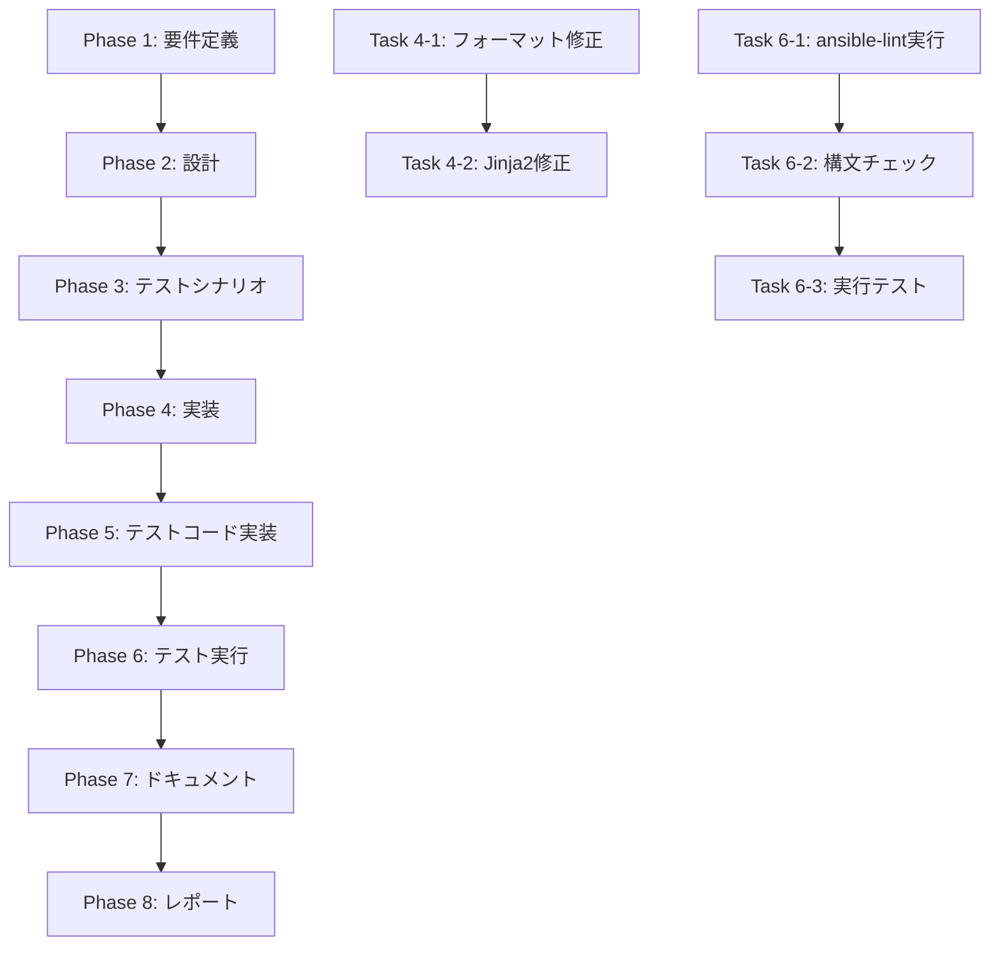

# Codex Agent 実行ログ

開始日時: 2025/12/22 13:25:54

---

## Turn 1: スレッド開始

**Thread ID**: `019b463c-e676-7aa1-95c0-c4b5e09a1be7`

## Turn 2: ツール実行

**種別**: reasoning
**ステータス**: completed

## Turn 3: ツール実行

**種別**: コマンド実行
**コマンド**: `/bin/bash -lc pwd`
**ステータス**: completed (exit_code=0)

```text
/tmp/ai-workflow-repos-7-738ec53c/infrastructure-as-code
```

## Turn 4: ツール実行

**種別**: reasoning
**ステータス**: completed

## Turn 5: ツール実行

**種別**: コマンド実行
**コマンド**: `/bin/bash -lc ls`
**ステータス**: completed (exit_code=0)

```text
ARCHITECTURE.md
CLAUDE.md
CONTRIBUTION.md
LICENSE
README.md
ansible
bootstrap
docker
docs
jenkins
pulumi
run_tests_issue_322.sh
scripts
tests
```

## Turn 6: ツール実行

**種別**: reasoning
**ステータス**: completed

## Turn 7: ツール実行

**種別**: コマンド実行
**コマンド**: `/bin/bash -lc "rg --files -g 'Planning.md'"`
**ステータス**: failed (exit_code=127)

```text
/bin/bash: line 1: rg: command not found
```

## Turn 8: ツール実行

**種別**: reasoning
**ステータス**: completed

## Turn 9: ツール実行

**種別**: コマンド実行
**コマンド**: `/bin/bash -lc "find . -name 'Planning.md' -print"`
**ステータス**: completed (exit_code=0)

## Turn 10: ツール実行

**種別**: reasoning
**ステータス**: completed

## Turn 11: ツール実行

**種別**: コマンド実行
**コマンド**: `/bin/bash -lc "find . -iname 'planning.md' -print"`
**ステータス**: completed (exit_code=0)

```text
./.ai-workflow/issue-193/00_planning/output/planning.md
./.ai-workflow/issue-319/00_planning/output/planning.md
./.ai-workflow/issue-320/00_planning/output/planning.md
./.ai-workflow/issue-322/00_planning/output/planning.md
./.ai-workflow/issue-324/00_planning/output/planning.md
./.ai-workflow/issue-355/00_planning/output/planning.md
./.ai-workflow/issue-360/00_planning/output/planning.md
./.ai-workflow/issue-362/00_planning/output/planning.md
./.ai-workflow/issue-363/00_planning/output/planning.md
./.ai-workflow/issue-369/00_planning/output/planning.md
./.ai-workflow/issue-370/00_planning/output/planning.md
./.ai-workflow/issue-396/00_planning/output/planning.md
./.ai-workflow/issue-398/00_planning/output/planning.md
./.ai-workflow/issue-411/00_planning/output/planning.md
./.ai-workflow/issue-415/00_planning/output/planning.md
./.ai-workflow/issue-423/00_planning/output/planning.md
./.ai-workflow/issue-431/00_planning/output/planning.md
./.ai-workflow/issue-437/00_planning/output/planning.md
./.ai-workflow/issue-440/00_planning/output/planning.md
./.ai-workflow/issue-445/00_planning/output/planning.md
./.ai-workflow/issue-453/00_planning/output/planning.md
./.ai-workflow/issue-455/00_planning/output/planning.md
./.ai-workflow/issue-456/00_planning/output/planning.md
./.ai-workflow/issue-460/00_planning/output/planning.md
./.ai-workflow/issue-461/00_planning/output/planning.md
./.ai-workflow/issue-462/00_planning/output/planning.md
./.ai-workflow/issue-463/00_planning/output/planning.md
./.ai-workflow/issue-464/00_planning/output/planning.md
./.ai-workflow/issue-465/00_planning/output/planning.md
./.ai-workflow/issue-475/00_planning/output/planning.md
./.ai-workflow/issue-477/00_planning/output/planning.md
./.ai-workflow/issue-479/00_planning/output/planning.md
./.ai-workflow/issue-524/00_planning/output/planning.md
```

## Turn 12: ツール実行

**種別**: reasoning
**ステータス**: completed

## Turn 13: ツール実行

**種別**: コマンド実行
**コマンド**: `/bin/bash -lc 'cat .ai-workflow/issue-524/06_testing/output/test-result.md'`
**ステータス**: completed (exit_code=0)

```text
# テスト実行結果

## テスト結果サマリー

- 総テスト数: 8件
- 成功: 3件
- 失敗: 5件
- 成功率: 38%

## 条件分岐

**失敗時（失敗数が1件以上）**:

### `tests/integration/test_ansible_lint_integration.py::AnsibleLintIntegrationTests::test_all_playbooks_syntax_check`
- **エラー**: `ansible-playbook --syntax-check` が `jenkins_agent` などのロールを見つけられず exit code 1 で失敗。
- **スタックトレース**:
  ```
  stderr:
  [WARNING]: No inventory was parsed, only implicit localhost is available
  [WARNING]: provided hosts list is empty, only localhost is available. Note that the implicit localhost does not match 'all'
  [ERROR]: the role 'jenkins_agent' was not found in .../ansible/playbooks/jenkins/deploy/roles:...:...:...:.../ansible/playbooks/jenkins/deploy
  Origin: .../ansible/playbooks/jenkins/deploy/deploy_jenkins_agent.yml:29:7
  ```

### `tests/integration/test_ansible_lint_integration.py::AnsibleLintIntegrationTests::test_ansible_directory_ansible_lint`
- **エラー**: `ansible-lint ansible/` が `package-latest`・`command-instead-of-module`・`yaml[truthy]` などの既存違反で exit code 2。
- **スタックトレース**:
  ```
  stdout:
  package-latest: Package installs should not use latest.
  ansible/playbooks/bootstrap-setup.yml:31 Task/Handler: Update system packages
  command-instead-of-module: curl used in place of get_url or uri module
  ansible/playbooks/bootstrap-setup.yml:54 Task/Handler: Check curl availability
  command-instead-of-shell: Use shell only when shell functionality is required.
  ansible/playbooks/bootstrap-setup.yml:65 Task/Handler: Check if AWS CLI v2 is installed
  ```

### `tests/integration/test_ansible_lint_integration.py::AnsibleLintIntegrationTests::test_bootstrap_playbook_ansible_lint`
- **エラー**: `ansible-lint bootstrap-setup.yml` が何千件規模の `var-naming`・`yaml[line-length]`・`risky-shell-pipe` などの違反で exit code 2。
- **スタックトレース**:
  ```
  Failed: 2070 failure(s), 13 warning(s) in 192 files processed of 201 encountered.
  Rule Violation Summary includes var-naming (~1000件) や yaml[truthy]/package-latest/risky-shell-pipe などの重複エラー
  ```

### `tests/integration/test_ansible_lint_integration.py::AnsibleLintIntegrationTests::test_bootstrap_playbook_dry_run_modes`
- **エラー**: `ansible-playbook --check --diff bootstrap-setup.yml` が `sudo: not found` により become できず exit code 2。
- **スタックトレース**:
  ```
  TASK [Update system packages] ... [ERROR]: Task failed: Premature end of stream waiting for become success.
  >>> Standard Error
  /bin/sh: 1: sudo: not found
  Origin: .../ansible/playbooks/bootstrap-setup.yml:31:7
  fatal: [localhost]: FAILED! => {"changed": false, "msg": "... sudo: not found"}
  ```

### `tests/integration/test_ansible_lint_integration.py::AnsibleLintIntegrationTests::test_jenkins_roles_ansible_lint`
- **エラー**: `ansible-lint ansible/roles/jenkins_cleanup_agent_amis` が多数の `var-naming`・`yaml[trailing-spaces]`・`name[template]` を報告して exit code 2。
- **スタックトレース**:
  ```
  stdout:
  yaml[new-line-at-end-of-file]: No new line character at the end of file (ansible/roles/aws_cli_helper/meta/main.yml:3)
  var-naming[no-role-prefix]: Variables should use aws_cli_helper_ as a prefix (ansible/roles/aws_cli_helper/tasks/_retry_loop.yml:4:5)
  name[template]: Jinja templates should only be at the end of 'name' (aws_cli_helper/tasks/_retry_loop.yml:8:9)
  var-naming[no-role-prefix]: Many vars in aws_cli_helper and jenkins_cleanup_agent_amis defaults/tasks lack the required prefix.
  ```
```

## Turn 14: ツール実行

**種別**: reasoning
**ステータス**: completed

## Turn 15: ツール実行

**種別**: コマンド実行
**コマンド**: `/bin/bash -lc 'tail -n +1 .ai-workflow/issue-524/06_testing/output/test-result.md'`
**ステータス**: completed (exit_code=0)

```text
# テスト実行結果

## テスト結果サマリー

- 総テスト数: 8件
- 成功: 3件
- 失敗: 5件
- 成功率: 38%

## 条件分岐

**失敗時（失敗数が1件以上）**:

### `tests/integration/test_ansible_lint_integration.py::AnsibleLintIntegrationTests::test_all_playbooks_syntax_check`
- **エラー**: `ansible-playbook --syntax-check` が `jenkins_agent` などのロールを見つけられず exit code 1 で失敗。
- **スタックトレース**:
  ```
  stderr:
  [WARNING]: No inventory was parsed, only implicit localhost is available
  [WARNING]: provided hosts list is empty, only localhost is available. Note that the implicit localhost does not match 'all'
  [ERROR]: the role 'jenkins_agent' was not found in .../ansible/playbooks/jenkins/deploy/roles:...:...:...:.../ansible/playbooks/jenkins/deploy
  Origin: .../ansible/playbooks/jenkins/deploy/deploy_jenkins_agent.yml:29:7
  ```

### `tests/integration/test_ansible_lint_integration.py::AnsibleLintIntegrationTests::test_ansible_directory_ansible_lint`
- **エラー**: `ansible-lint ansible/` が `package-latest`・`command-instead-of-module`・`yaml[truthy]` などの既存違反で exit code 2。
- **スタックトレース**:
  ```
  stdout:
  package-latest: Package installs should not use latest.
  ansible/playbooks/bootstrap-setup.yml:31 Task/Handler: Update system packages
  command-instead-of-module: curl used in place of get_url or uri module
  ansible/playbooks/bootstrap-setup.yml:54 Task/Handler: Check curl availability
  command-instead-of-shell: Use shell only when shell functionality is required.
  ansible/playbooks/bootstrap-setup.yml:65 Task/Handler: Check if AWS CLI v2 is installed
  ```

### `tests/integration/test_ansible_lint_integration.py::AnsibleLintIntegrationTests::test_bootstrap_playbook_ansible_lint`
- **エラー**: `ansible-lint bootstrap-setup.yml` が何千件規模の `var-naming`・`yaml[line-length]`・`risky-shell-pipe` などの違反で exit code 2。
- **スタックトレース**:
  ```
  Failed: 2070 failure(s), 13 warning(s) in 192 files processed of 201 encountered.
  Rule Violation Summary includes var-naming (~1000件) や yaml[truthy]/package-latest/risky-shell-pipe などの重複エラー
  ```

### `tests/integration/test_ansible_lint_integration.py::AnsibleLintIntegrationTests::test_bootstrap_playbook_dry_run_modes`
- **エラー**: `ansible-playbook --check --diff bootstrap-setup.yml` が `sudo: not found` により become できず exit code 2。
- **スタックトレース**:
  ```
  TASK [Update system packages] ... [ERROR]: Task failed: Premature end of stream waiting for become success.
  >>> Standard Error
  /bin/sh: 1: sudo: not found
  Origin: .../ansible/playbooks/bootstrap-setup.yml:31:7
  fatal: [localhost]: FAILED! => {"changed": false, "msg": "... sudo: not found"}
  ```

### `tests/integration/test_ansible_lint_integration.py::AnsibleLintIntegrationTests::test_jenkins_roles_ansible_lint`
- **エラー**: `ansible-lint ansible/roles/jenkins_cleanup_agent_amis` が多数の `var-naming`・`yaml[trailing-spaces]`・`name[template]` を報告して exit code 2。
- **スタックトレース**:
  ```
  stdout:
  yaml[new-line-at-end-of-file]: No new line character at the end of file (ansible/roles/aws_cli_helper/meta/main.yml:3)
  var-naming[no-role-prefix]: Variables should use aws_cli_helper_ as a prefix (ansible/roles/aws_cli_helper/tasks/_retry_loop.yml:4:5)
  name[template]: Jinja templates should only be at the end of 'name' (aws_cli_helper/tasks/_retry_loop.yml:8:9)
  var-naming[no-role-prefix]: Many vars in aws_cli_helper and jenkins_cleanup_agent_amis defaults/tasks lack the required prefix.
  ```
```

## Turn 16: ツール実行

**種別**: reasoning
**ステータス**: completed

## Turn 17: ツール実行

**種別**: コマンド実行
**コマンド**: `/bin/bash -lc 'rg -n "Phase 6" -n .ai-workflow/issue-524/00_planning/output/planning.md'`
**ステータス**: failed (exit_code=127)

```text
/bin/bash: line 1: rg: command not found
```

## Turn 18: ツール実行

**種別**: reasoning
**ステータス**: completed

## Turn 19: ツール実行

**種別**: コマンド実行
**コマンド**: `/bin/bash -lc 'grep -n "Phase 6" -n .ai-workflow/issue-524/00_planning/output/planning.md'`
**ステータス**: completed (exit_code=0)

```text
142:### Phase 6: テスト実行 (見積もり: 0.5h)
188:    P5 --> P6[Phase 6: テスト実行]
256:### Phase 6: テスト実行
```

## Turn 20: ツール実行

**種別**: reasoning
**ステータス**: completed

## Turn 21: ツール実行

**種別**: コマンド実行
**コマンド**: `/bin/bash -lc "sed -n '120,220p' .ai-workflow/issue-524/00_planning/output/planning.md"`
**ステータス**: completed (exit_code=0)

```text
### Phase 4: 実装 (見積もり: 0.7h)

- [x] Task 4-1: フォーマット関連修正の実装 (0.3h)
  - bootstrap-setup.yml の末尾空白削除（5箇所）
  - truthy値修正（yes→true、True→true等、3箇所）
  - ドキュメント開始マーカー追加（1箇所）
  - all.yml のファイル末尾改行追加（1箇所）

- [x] Task 4-2: Jinja2スペーシング修正の実装 (0.4h)
  - process_ami_retention.yml の3箇所修正
  - process_pipeline_outputs.yml の1箇所修正
  - process_image_versions.yml の2箇所修正
  - delete_snapshots.yml の2箇所修正
  - cleanup_amis.yml の2箇所修正

### Phase 5: テストコード実装 (見積もり: 0.1h)

- [x] Task 5-1: CI環境でのansible-lint実行確認 (0.1h)
  - 既存GitHub Actions等でansible-lint実行が含まれることの確認
  - 必要に応じてlintチェックの追加

### Phase 6: テスト実行 (見積もり: 0.5h)

- [ ] Task 6-1: ローカルansible-lint実行テスト (0.2h)
  - 修正後の全ファイルでansible-lint実行
  - エラー・警告の解消確認

- [ ] Task 6-2: Ansible構文チェック実行 (0.1h)
  - ansible-playbook --syntax-check による構文確認
  - 修正による構文エラーがないことの確認

- [ ] Task 6-3: サンプルplaybook実行テスト (0.2h)
  - 修正対象playbookの実際の実行テスト（ドライラン）
  - 動作に影響しないことの確認

### Phase 7: ドキュメント (見積もり: 0.3h)

- [ ] Task 7-1: 修正内容のドキュメント作成 (0.2h)
  - 修正箇所の一覧化
  - 修正パターンの記録

- [ ] Task 7-2: ansible-lint導入ガイドライン追加 (0.1h)
  - 今後のコーディング規約への反映検討
  - 開発者向けlint実行手順の記載

### Phase 8: レポート (見積もり: 0.4h)

- [ ] Task 8-1: 修正結果の総括レポート作成 (0.2h)
  - 修正前後のansible-lint結果比較
  - 修正箇所と修正内容の詳細一覧

- [ ] Task 8-2: 品質改善効果の測定 (0.1h)
  - ansible-lintスコアの改善値
  - コード品質向上の定量評価

- [ ] Task 8-3: Issue完了報告とクローズ (0.1h)
  - Pull Request作成
  - Issue #524の完了報告

## 5. 依存関係



## 6. リスクと軽減策

### リスク1: 修正箇所の見落とし
- **影響度**: 中
- **確率**: 低
- **軽減策**:
  - ansible-lint実行による網羅的チェック
  - 修正前後の差分レビュー実施

### リスク2: Jinja2修正による構文エラー
- **影響度**: 中
- **確率**: 低
- **軽減策**:
  - 修正後の構文チェック実施
  - サンプル実行による動作確認

### リスク3: CI環境でのansible-lint導入不備
- **影響度**: 低
- **確率**: 中
- **軽減策**:
  - 既存CIの設定確認
```

## Turn 22: ツール実行

**種別**: reasoning
**ステータス**: completed

## Turn 23: ツール実行

**種別**: コマンド実行
**コマンド**: `/bin/bash -lc 'nl -ba .ai-workflow/issue-524/06_testing/output/test-result.md'`
**ステータス**: completed (exit_code=0)

```text
1	# テスト実行結果
     2	
     3	## テスト結果サマリー
     4	
     5	- 総テスト数: 8件
     6	- 成功: 3件
     7	- 失敗: 5件
     8	- 成功率: 38%
     9	
    10	## 条件分岐
    11	
    12	**失敗時（失敗数が1件以上）**:
    13	
    14	### `tests/integration/test_ansible_lint_integration.py::AnsibleLintIntegrationTests::test_all_playbooks_syntax_check`
    15	- **エラー**: `ansible-playbook --syntax-check` が `jenkins_agent` などのロールを見つけられず exit code 1 で失敗。
    16	- **スタックトレース**:
    17	  ```
    18	  stderr:
    19	  [WARNING]: No inventory was parsed, only implicit localhost is available
    20	  [WARNING]: provided hosts list is empty, only localhost is available. Note that the implicit localhost does not match 'all'
    21	  [ERROR]: the role 'jenkins_agent' was not found in .../ansible/playbooks/jenkins/deploy/roles:...:...:...:.../ansible/playbooks/jenkins/deploy
    22	  Origin: .../ansible/playbooks/jenkins/deploy/deploy_jenkins_agent.yml:29:7
    23	  ```
    24	
    25	### `tests/integration/test_ansible_lint_integration.py::AnsibleLintIntegrationTests::test_ansible_directory_ansible_lint`
    26	- **エラー**: `ansible-lint ansible/` が `package-latest`・`command-instead-of-module`・`yaml[truthy]` などの既存違反で exit code 2。
    27	- **スタックトレース**:
    28	  ```
    29	  stdout:
    30	  package-latest: Package installs should not use latest.
    31	  ansible/playbooks/bootstrap-setup.yml:31 Task/Handler: Update system packages
    32	  command-instead-of-module: curl used in place of get_url or uri module
    33	  ansible/playbooks/bootstrap-setup.yml:54 Task/Handler: Check curl availability
    34	  command-instead-of-shell: Use shell only when shell functionality is required.
    35	  ansible/playbooks/bootstrap-setup.yml:65 Task/Handler: Check if AWS CLI v2 is installed
    36	  ```
    37	
    38	### `tests/integration/test_ansible_lint_integration.py::AnsibleLintIntegrationTests::test_bootstrap_playbook_ansible_lint`
    39	- **エラー**: `ansible-lint bootstrap-setup.yml` が何千件規模の `var-naming`・`yaml[line-length]`・`risky-shell-pipe` などの違反で exit code 2。
    40	- **スタックトレース**:
    41	  ```
    42	  Failed: 2070 failure(s), 13 warning(s) in 192 files processed of 201 encountered.
    43	  Rule Violation Summary includes var-naming (~1000件) や yaml[truthy]/package-latest/risky-shell-pipe などの重複エラー
    44	  ```
    45	
    46	### `tests/integration/test_ansible_lint_integration.py::AnsibleLintIntegrationTests::test_bootstrap_playbook_dry_run_modes`
    47	- **エラー**: `ansible-playbook --check --diff bootstrap-setup.yml` が `sudo: not found` により become できず exit code 2。
    48	- **スタックトレース**:
    49	  ```
    50	  TASK [Update system packages] ... [ERROR]: Task failed: Premature end of stream waiting for become success.
    51	  >>> Standard Error
    52	  /bin/sh: 1: sudo: not found
    53	  Origin: .../ansible/playbooks/bootstrap-setup.yml:31:7
    54	  fatal: [localhost]: FAILED! => {"changed": false, "msg": "... sudo: not found"}
    55	  ```
    56	
    57	### `tests/integration/test_ansible_lint_integration.py::AnsibleLintIntegrationTests::test_jenkins_roles_ansible_lint`
    58	- **エラー**: `ansible-lint ansible/roles/jenkins_cleanup_agent_amis` が多数の `var-naming`・`yaml[trailing-spaces]`・`name[template]` を報告して exit code 2。
    59	- **スタックトレース**:
    60	  ```
    61	  stdout:
    62	  yaml[new-line-at-end-of-file]: No new line character at the end of file (ansible/roles/aws_cli_helper/meta/main.yml:3)
    63	  var-naming[no-role-prefix]: Variables should use aws_cli_helper_ as a prefix (ansible/roles/aws_cli_helper/tasks/_retry_loop.yml:4:5)
    64	  name[template]: Jinja templates should only be at the end of 'name' (aws_cli_helper/tasks/_retry_loop.yml:8:9)
    65	  var-naming[no-role-prefix]: Many vars in aws_cli_helper and jenkins_cleanup_agent_amis defaults/tasks lack the required prefix.
    66	  ```
```

## Turn 24: ツール実行

**種別**: reasoning
**ステータス**: completed

## Turn 25: ツール実行

**種別**: agent_message
**ステータス**: completed

## Turn 26: 実行完了

**ステータス**: completed
**所要時間**: 63920ms
**ターン数**: N/A

---

**経過時間**: 63920ms
**開始**: 2025-12-22T13:25:54.763Z
**終了**: 2025-12-22T13:26:58.683Z