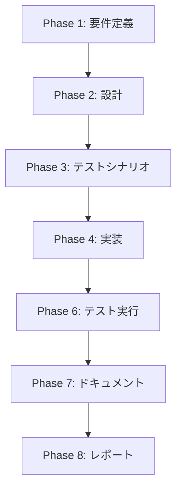

# プロジェクト計画書 - Issue #526

## タスク概要
環境停止スケジューラージョブの無効化

## 📋 Issue分析

### 複雑度: 簡単
- **対象**: 単一ファイル（DSLファイル）の1行修正
- **変更範囲**: `disabled`設定の変更のみ
- **影響**: ジョブの有効/無効状態変更（リソースレベルの変更なし）

### 見積もり工数: 2~3時間
**根拠**:
- ファイル修正: 5分
- シードジョブ実行: 5分
- 動作確認: 10分
- ドキュメント更新: 30分
- テストシナリオ作成: 30分
- プロジェクト管理作業: 1時間

### リスク評価: 低
- 既存のジョブ設定を変更するのみ
- 停止機能ではなく、停止のスケジュール機能のON/OFF
- ロールバックが容易（`disabled(false)`に戻すのみ）

## 🏗️ 実装戦略判断

### 実装戦略: EXTEND
**判断根拠**:
既存の `infrastructure_shutdown_scheduler_job.groovy` ファイルの設定を拡張（`disabled` プロパティを追加）するため。新規ファイル作成ではなく、既存ファイルの機能拡張にあたる。

### テスト戦略: INTEGRATION_ONLY
**判断根拠**:
Jenkins DSLの変更であり、単体テストよりもJenkins環境での統合テストが重要。シードジョブ実行→ジョブ作成→スケジュール無効化確認という一連の流れを検証する必要がある。ビジネスロジックがなく、BDDは不要。

### テストコード戦略: CREATE_TEST
**判断根拠**:
Jenkins DSLの設定変更に対するテストは、既存のテストファイルに追加するのではなく、この変更に特化したテストシナリオを作成する方が適切。Jenkins UI確認とコマンドベースの確認を含む新規テストを作成する。

## 🔍 影響範囲分析

### 既存コードへの影響
- **変更対象ファイル**: `jenkins/jobs/dsl/infrastructure-management/infrastructure_shutdown_scheduler_job.groovy`
- **変更内容**: `disabled(true)`プロパティの追加
- **影響範囲**: 該当ジョブのスケジュール実行のみ（他のジョブには影響なし）

### 依存関係の変更
- **新規依存**: なし
- **既存依存の変更**: なし
- **注意点**: シードジョブ（job-creator）の実行が必要

### マイグレーション要否
- **データベーススキーマ変更**: なし
- **設定ファイル変更**: Jenkins DSLファイルの変更のみ
- **バックアップ**: Git履歴による自動バックアップ

## 📈 タスク分割

### Phase 1: 要件定義 (見積もり: 0.5h)

- [x] Task 1-1: 要件の詳細分析 (15分)
  - スケジューラージョブ無効化の要件確認
  - 対象環境（dev）の確認
  - 影響範囲の特定
- [x] Task 1-2: 受け入れ基準の定義 (15分)
  - ジョブ無効化の確認方法
  - スケジュール停止の確認方法
  - ロールバック手順の確認

### Phase 2: 設計 (見積もり: 0.5h)

- [x] Task 2-1: DSL変更設計 (15分)
  - `disabled(true)`の追加場所特定
  - 設定構文の確認
- [x] Task 2-2: シードジョブ実行計画 (15分)
  - job-creatorの実行手順確認
  - 実行タイミングの計画

### Phase 3: テストシナリオ (見積もり: 0.5h)

- [x] Task 3-1: 統合テストシナリオ作成 (30分)
  - DSL修正→シードジョブ実行→無効化確認の流れ
  - Jenkins UI確認手順
  - CLI確認手順（jenkins-cli.jarまたはAPI）

### Phase 4: 実装 (見積もり: 0.25h)

- [x] Task 4-1: DSLファイル修正 (15分)
  - `infrastructure_shutdown_scheduler_job.groovy`に`disabled(true)`を追加
  - Git差分確認とコミット

### Phase 5: テストコード実装 (見積もり: なし)

- [x] Task 5-1: 統合テスト手順書作成 (0分)
  - この変更では自動化されたテストコードではなく、手動確認手順を作成

### Phase 6: テスト実行 (見積もり: 0.5h)

- [x] Task 6-1: シードジョブ実行 (10分)
  - Jenkins UIから job-creator を手動実行
  - 実行ログの確認
- [x] Task 6-2: ジョブ無効化確認 (10分)
  - Jenkins UIでの無効状態確認
  - スケジュール設定の確認
- [x] Task 6-3: 回帰テスト (10分)
  - 他のインフラ管理ジョブへの影響確認
  - 手動停止ジョブが正常動作することの確認

### Phase 7: ドキュメント (見積もり: 0.5h)

- [x] Task 7-1: README.md更新 (15分)
  - 自動停止機能の無効化について記載
  - 手動停止の手順を明記
- [x] Task 7-2: Jenkins設定ドキュメント更新 (15分)
  - jenkins/README.mdの更新（必要に応じて）
  - 運用手順の変更点反映

### Phase 8: レポート (見積もり: 0.25h)

- [ ] Task 8-1: 実装完了レポート作成 (15分)
  - 変更内容の要約
  - 動作確認結果
  - 今後の運用について

## 📊 依存関係

注意: Phase 5（テストコード実装）はJenkins DSLの変更のため、自動化テストではなく手動確認手順書として Phase 3 に含まれます。

## ⚠️ リスクと軽減策

### リスク1: シードジョブ実行失敗
- **影響度**: 中
- **確率**: 低
- **軽減策**:
  - 事前にjob-creatorの正常動作を確認
  - Jenkins管理者権限でのアクセス確保
  - ロールバック用のGit revert準備

### リスク2: 既存ジョブへの意図しない影響
- **影響度**: 低
- **確率**: 低
- **軽減策**:
  - DSLファイルの変更範囲を最小限に限定
  - 他のインフラ管理ジョブの動作確認を実施
  - 変更前の設定をGitで記録

### リスク3: スケジュール無効化の確認漏れ
- **影響度**: 中
- **確率**: 低
- **軽減策**:
  - Jenkins UIとAPIの両方で確認
  - 次回スケジュール時刻の確認
  - 1週間後の動作確認

### リスク4: ドキュメント更新漏れ
- **影響度**: 低
- **確率**: 中
- **軽減策**:
  - 関連ドキュメントのリストアップ
  - 変更点を明確に記載
  - レビューフェーズでの確認

## 🎯 品質ゲート

### Phase 1: 要件定義
- [x] スケジューラージョブの無効化要件が明確に記載されている
- [x] 対象環境（dev）が特定されている
- [x] 受け入れ基準（ジョブ無効化、スケジュール停止）が定義されている
- [x] 手動停止の代替手順が確認されている

### Phase 2: 設計
- [x] 実装戦略（EXTEND）の判断根拠が明記されている
- [x] テスト戦略（INTEGRATION_ONLY）の判断根拠が明記されている
- [x] テストコード戦略（CREATE_TEST）の判断根拠が明記されている
- [x] DSL変更箇所が特定されている
- [x] シードジョブ実行手順が計画されている

### Phase 3: テストシナリオ
- [x] 統合テストシナリオが作成されている
- [x] Jenkins UI確認手順が記載されている
- [x] CLI/API確認手順が記載されている
- [x] 回帰テストの範囲が定義されている

### Phase 4: 実装
- [x] `disabled(true)`がDSLファイルに追加されている
- [x] 構文エラーがない
- [x] Git コミットが適切に行われている

### Phase 6: テスト実行
- [x] シードジョブが正常実行されている
- [x] ジョブが無効状態になっている
- [x] スケジュール実行が停止している
- [x] 他のインフラ管理ジョブへの影響がない

### Phase 7: ドキュメント
- [x] README.mdが更新されている
- [x] 自動停止無効化が記載されている
- [x] 手動停止手順が明記されている
- [x] 将来的な再有効化手順が記載されている

### Phase 8: レポート
- [ ] 変更内容が要約されている
- [ ] 動作確認結果が記載されている
- [ ] 今後の運用指針が明記されている

## 📝 注意事項

### 1. Jenkins DSLの特性
- シードジョブ実行により設定が反映される
- DSL構文エラーがあると全体のジョブ作成が失敗する可能性
- 変更前にDSL構文の確認を推奨

### 2. 運用への影響
- 自動停止が無効になるため、手動停止の運用ルール確認が重要
- 開発チームへの周知が必要
- コスト管理の観点での代替策検討

### 3. 将来的な対応
- 自動停止の再開が必要な場合は `disabled(false)` に変更
- スケジュール時刻の変更も同じ手順で対応可能

### 4. バックアップ・ロールバック
- Git履歴により任意時点へのロールバックが可能
- 緊急時は `git revert` でリアルタイム復旧可能

## 📈 成功基準

このプロジェクトは以下の条件を満たした時点で成功とみなします：

1. **機能要件**
   - スケジューラージョブが無効状態になっている
   - 自動停止のスケジュール実行が停止している
   - 手動停止ジョブは正常に動作している

2. **品質要件**
   - 他のJenkinsジョブへの影響がない
   - DSL構文エラーがない
   - ロールバック手順が確立されている

3. **ドキュメント要件**
   - README.mdが適切に更新されている
   - 今後の運用手順が明記されている
   - 変更内容が記録されている

4. **運用要件**
   - Jenkins管理者による動作確認が完了している
   - 開発チームへの変更通知が行われている
   - 次回スケジュール時刻での非実行が確認されている

これらすべての条件を満たし、品質ゲートをすべて通過した時点で、Issue #526 は完了とします。
