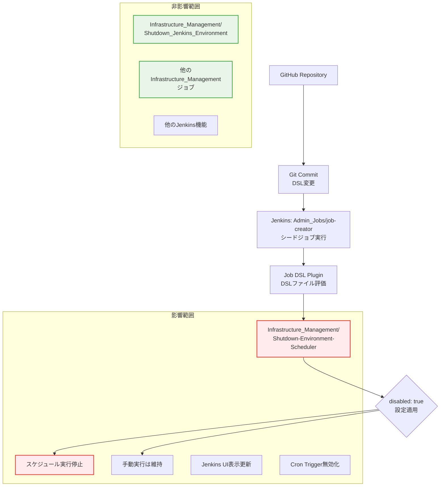

# 詳細設計書 - Issue #526

## 環境停止スケジューラージョブの無効化

---

## 0. Planning Document 確認

本詳細設計は Planning Phase（`.ai-workflow/issue-526/00_planning/output/planning.md`）で策定された開発計画に基づいて作成されています。

### Planning Phase で確認された戦略
- **実装戦略**: EXTEND（既存ファイルの機能拡張）
- **テスト戦略**: INTEGRATION_ONLY（Jenkins環境での統合テスト）
- **テストコード戦略**: CREATE_TEST（新規テストシナリオ作成）
- **複雑度**: 簡単（単一ファイルの1行修正）
- **工数見積**: 2-3時間
- **リスク評価**: 低

---

## 1. アーキテクチャ設計

### 1.1 システム全体図



### 1.2 コンポーネント間の関係

| コンポーネント | 役割 | 変更対象 |
|---------------|------|----------|
| **infrastructure_shutdown_scheduler_job.groovy** | スケジューラージョブのDSL定義 | **修正対象** |
| **job-creator（シードジョブ）** | DSL変更をJenkinsに反映 | 実行のみ |
| **Shutdown-Environment-Scheduler** | スケジューラージョブ本体 | 設定変更 |
| **Shutdown_Jenkins_Environment** | 実際の停止処理 | **変更なし** |

### 1.3 データフロー

```
現在の状態:
毎日 JST 00:00 (UTC 15:00)
  ↓ Cron Trigger
Shutdown-Environment-Scheduler (有効)
  ↓ 非同期トリガー
Shutdown_Jenkins_Environment
  ↓
dev環境停止

変更後の状態:
毎日 JST 00:00 (UTC 15:00)
  ↓ Cron Trigger (無効)
Shutdown-Environment-Scheduler (disabled: true)
  ↓ トリガーなし
（自動停止なし）

手動実行時:
Jenkins UI操作
  ↓ 手動実行
Shutdown-Environment-Scheduler
  ↓ 非同期トリガー
Shutdown_Jenkins_Environment
  ↓
dev環境停止
```

---

## 2. 実装戦略判断

### 実装戦略: EXTEND

**判断根拠**:
- 既存の `infrastructure_shutdown_scheduler_job.groovy` ファイルに `disabled(true)` プロパティを追加する拡張作業
- 新規ファイル作成ではなく、既存ファイルの機能拡張（無効化機能の追加）
- Jenkins Job DSL の標準的なプロパティ追加による機能拡張

---

## 3. テスト戦略判断

### テスト戦略: INTEGRATION_ONLY

**判断根拠**:
- Jenkins DSL の変更であり、単体テストよりもJenkins環境での統合テストが重要
- シードジョブ実行→ジョブ作成→スケジュール無効化確認という一連の流れを検証する必要がある
- ビジネスロジックがなく、BDDは不要（インフラ設定変更のみ）
- Jenkins の Job DSL Plugin、Cron Trigger、UI表示の統合的な動作確認が必要

---

## 4. テストコード戦略判断

### テストコード戦略: CREATE_TEST

**判断根拠**:
- Jenkins DSL の設定変更に対するテストは、既存のテストファイルに追加するのではなく、この変更に特化したテストシナリオを作成する方が適切
- Jenkins UI 確認と CLI/API ベースの確認を含む新規テストが必要
- インフラ管理ジョブの特殊性（手動実行、スケジュール確認、回帰テスト）に対応した独立したテスト手順

---

## 5. 影響範囲分析

### 5.1 既存コードへの影響

#### 5.1.1 直接的な影響

| ファイル | 変更内容 | 影響度 |
|---------|----------|--------|
| `jenkins/jobs/dsl/infrastructure-management/infrastructure_shutdown_scheduler_job.groovy` | `disabled(true)` 追加 | **高** |
| Jenkins 設定データベース | ジョブ設定の更新 | 中 |
| Jenkins UI | 無効化アイコンの表示 | 低 |

#### 5.1.2 間接的な影響

| 機能・コンポーネント | 影響内容 | 対応要否 |
|-------------------|----------|----------|
| **自動停止スケジュール** | 毎日00:00の自動実行停止 | なし（意図された変更） |
| **手動環境停止** | 変更なし（引き続き利用可能） | なし |
| **開発環境の運用** | 常時稼働への変更 | **運用ルール更新** |
| **コスト管理** | 自動停止なしによる費用増 | **監視強化推奨** |

### 5.2 依存関係の変更

#### 5.2.1 アップストリーム依存関係

```
GitHub Repository (DSL変更)
  ↓
Git Commit & Push
  ↓
job-creator 手動実行
  ↓
Job DSL Plugin
  ↓
Jenkins 設定更新
```

**依存関係**: 変更なし（既存の反映フローを利用）

#### 5.2.2 ダウンストリーム依存関係

```
Shutdown-Environment-Scheduler (無効化)
  ↓ トリガー関係が変更
Shutdown_Jenkins_Environment (変更なし)
  ↓ 停止対象は維持
dev環境リソース（EC2, SpotFleet, EFS等）
```

**変更点**: スケジューラーからのトリガーがなくなるのみ

### 5.3 マイグレーション要否

#### 5.3.1 データベーススキーマ変更
- **なし**: Jenkins の設定データベースは既存のスキーマを使用

#### 5.3.2 設定ファイル変更
- **対象**: Jenkins Job DSL ファイルの変更のみ
- **バックアップ**: Git 履歴による自動バックアップ

#### 5.3.3 環境間の設定同期
- **dev環境**: 対象（Issue の要件）
- **staging/prod環境**: 対象外（各環境で個別判断）

---

## 6. 変更・追加ファイルリスト

### 6.1 修正が必要な既存ファイル

| ファイルパス | 変更内容 | 変更行数 |
|-------------|----------|----------|
| `jenkins/jobs/dsl/infrastructure-management/infrastructure_shutdown_scheduler_job.groovy` | `disabled(true)` プロパティの追加 | +1行 |

### 6.2 新規作成ファイル

**該当なし**: 既存ファイルの修正のみ

### 6.3 削除が必要なファイル

**該当なし**: ファイル削除は不要

### 6.4 間接的に更新される設定

| 設定項目 | 更新方法 | 更新タイミング |
|---------|----------|--------------|
| Jenkins ジョブ設定 | シードジョブによる自動更新 | job-creator 実行時 |
| Jenkins UI 表示 | Job DSL Plugin による自動更新 | シードジョブ完了後 |
| Cron Trigger 設定 | Jenkins 内部で自動無効化 | DSL 反映後即座 |

---

## 7. 詳細設計

### 7.1 DSL ファイル修正詳細

#### 7.1.1 修正対象ファイル

**ファイル**: `jenkins/jobs/dsl/infrastructure-management/infrastructure_shutdown_scheduler_job.groovy`

**現在の構造** (関連部分):
```groovy
freeStyleJob(fullJobName) {
    displayName('環境自動停止スケジューラー')
    description(description)

    // disabled フラグが現在は未設定

    triggers {
        cron('H 15 * * *')  // JST 00:00, 毎日
    }

    // その他の設定...
}
```

#### 7.1.2 修正後の構造

**追加箇所**:
```groovy
freeStyleJob(fullJobName) {
    displayName('環境自動停止スケジューラー')
    description(description)

    disabled(true)  // ← この行を追加

    triggers {
        cron('H 15 * * *')  // JST 00:00, 毎日
    }

    // その他の設定...
}
```

**追加位置**: `displayName` と `triggers` の間（Jenkins Job DSL の標準的な配置）

#### 7.1.3 Job DSL プロパティ仕様

| プロパティ | 型 | 値 | 効果 |
|-----------|----|----|------|
| `disabled` | Boolean | `true` | ジョブの無効化、スケジュール実行停止 |

### 7.2 シードジョブ実行設計

#### 7.2.1 実行手順

```bash
# Jenkins UI 操作手順
1. Jenkins トップページにアクセス
2. "Admin_Jobs" フォルダをクリック
3. "job-creator" ジョブをクリック
4. "Build Now" ボタンをクリック
5. ビルドの完了を確認（通常 1-3分）
```

#### 7.2.2 実行パラメータ

| パラメータ | 値 | 説明 |
|-----------|----|----|
| `additionalParameters` | （自動設定） | DSLファイルから自動収集 |
| `lookupStrategy` | `SEED_JOB` | シードジョブからの参照 |
| `removedJobAction` | `DELETE` | DSLから削除されたジョブの自動削除 |

### 7.3 データ構造設計

#### 7.3.1 Jenkins 内部データ構造の変更

**Job Configuration XML** (設定変更後):
```xml
<project>
  <disabled>true</disabled>  <!-- この要素が追加される -->
  <triggers>
    <hudson.triggers.TimerTrigger>
      <spec>H 15 * * *</spec>
    </hudson.triggers.TimerTrigger>
  </triggers>
  <!-- 他の設定要素 -->
</project>
```

**効果**: `<disabled>true</disabled>` により、Trigger は設定されているが実行されない状態

### 7.4 インターフェース設計

#### 7.4.1 Jenkins UI インターフェースの変更

**ジョブ一覧画面**:
- ジョブ名の横に無効化アイコン（グレーアウト）が表示される
- スケジュール実行が停止していることがビジュアルで確認可能

**ジョブ設定画面**:
- "全般" タブの "無効" チェックボックスがONになる
- "Build Triggers" の設定は維持されるが、実行されない旨の表示

#### 7.4.2 API インターフェース

**Jenkins REST API**:
```bash
# ジョブ状態確認
GET /job/Infrastructure_Management/job/Shutdown-Environment-Scheduler/api/json

# レスポンス例（変更後）
{
  "disabled": true,
  "displayName": "環境自動停止スケジューラー",
  "triggers": [...],  # trigger設定は維持
  "nextBuildNumber": 1
}
```

**Jenkins CLI**:
```bash
# ジョブ設定取得
jenkins-cli get-job "Infrastructure_Management/Shutdown-Environment-Scheduler"

# disabled フラグの確認
jenkins-cli get-job "Infrastructure_Management/Shutdown-Environment-Scheduler" | grep "<disabled>true</disabled>"
```

---

## 8. セキュリティ考慮事項

### 8.1 認証・認可

#### 8.1.1 シードジョブ実行権限

| 対象者 | 権限要件 | リスク |
|--------|----------|--------|
| **Jenkins管理者** | `Overall/Administer` または `Job/Configure` 権限 | 低 |
| **開発者** | 制限的実行権限（Read-only推奨） | 中 |
| **自動化システム** | Service Account による API Token | 低 |

#### 8.1.2 Git リポジトリアクセス権限

- **コミット権限**: 開発者またはメンテナーレベル
- **レビュー要件**: Pull Request によるコードレビュー推奨
- **ブランチ保護**: main ブランチの直接 Push 制限推奨

### 8.2 データ保護

#### 8.2.1 設定データの保護

| 保護対象 | 方法 | 実装 |
|---------|------|------|
| **Jenkins設定データ** | 既存のJenkins認証機構 | 変更なし |
| **DSLファイル** | Git履歴管理 | 既存のGit管理 |
| **ビルド履歴** | Jenkins標準のアクセス制御 | 変更なし |

#### 8.2.2 監査ログ

- **Jenkins Audit Log**: ジョブ設定変更の記録
- **Git履歴**: DSLファイル変更の記録
- **システムログ**: シードジョブ実行ログの記録

### 8.3 セキュリティリスクと対策

#### 8.3.1 潜在的リスク

| リスク | 影響度 | 確率 | 対策 |
|--------|--------|------|------|
| **意図しないジョブ削除** | 中 | 低 | Job DSL の `removedJobAction` に注意 |
| **権限のないユーザーによるシードジョブ実行** | 中 | 低 | Jenkins 権限管理の適切な設定 |
| **設定ロールバックの失敗** | 低 | 低 | Git によるバックアップ確保 |

#### 8.3.2 セキュリティ対策

1. **最小権限の原則**
   - シードジョブ実行は管理者のみ
   - 開発者は読み取り専用権限

2. **変更追跡**
   - すべての変更をGit履歴で記録
   - Jenkins Audit Logの有効化

3. **ロールバック準備**
   - 変更前の状態をGitタグで記録
   - 緊急時の復旧手順の文書化

---

## 9. 非機能要件への対応

### 9.1 パフォーマンス

#### 9.1.1 シードジョブ実行時間

| メトリクス | 現在値 | 変更後 | 影響 |
|-----------|--------|--------|------|
| **実行時間** | 1-3分 | 1-3分 | 変更なし |
| **リソース使用量** | 低 | 低 | 変更なし |
| **同時実行** | 1つのみ | 1つのみ | 変更なし |

#### 9.1.2 Jenkins システム負荷

- **CPU使用率**: 変更による影響なし
- **メモリ使用量**: 設定データの微増（無視できるレベル）
- **ディスク使用量**: ビルド履歴の蓄積は変更なし

### 9.2 スケーラビリティ

#### 9.2.1 スケール要件

| 要素 | 現在の制限 | 変更による影響 |
|------|-----------|--------------|
| **同時実行ジョブ数** | 制限なし | 影響なし |
| **スケジューラー数** | 1つ | 1つ（無効化） |
| **依存ジョブ数** | 1つ | 変更なし |

#### 9.2.2 将来拡張性

- **複数環境対応**: staging/prod環境でも同様の設定変更可能
- **条件付き無効化**: パラメータによる動的な有効/無効切り替えも可能
- **複数スケジューラー**: 必要に応じて追加のスケジューラージョブ作成可能

### 9.3 保守性

#### 9.3.1 設定の可視性

| 項目 | 確認方法 | 頻度 |
|------|----------|------|
| **ジョブ状態** | Jenkins UI | 必要時 |
| **DSL設定** | Git リポジトリ | コミット時 |
| **実行履歴** | Jenkins ビルド履歴 | 週次 |

#### 9.3.2 保守作業の簡素化

1. **Infrastructure as Code**
   - すべての設定をコードで管理
   - Git による変更履歴の自動記録

2. **自動反映メカニズム**
   - シードジョブによる設定の自動同期
   - 手動設定変更の不要化

3. **ロールバック容易性**
   - Git revert による即座の復旧
   - DSL 変更のシンプルさ（1行の追加/削除）

---

## 10. 実装の順序

### 10.1 推奨実装順序

#### Phase 1: 事前準備（15分）
1. **現在の状態確認**
   ```bash
   # 現在のジョブ状態確認
   jenkins-cli get-job "Infrastructure_Management/Shutdown-Environment-Scheduler" | grep -i disabled

   # 次回実行予定時刻確認
   jenkins-cli list-jobs | grep Shutdown
   ```

2. **バックアップの作成**
   ```bash
   # 現在の DSL ファイルのバックアップ（Git で自動管理）
   git log --oneline -1 jenkins/jobs/dsl/infrastructure-management/infrastructure_shutdown_scheduler_job.groovy
   ```

#### Phase 2: 実装（15分）
3. **DSL ファイル修正**
   ```bash
   # disabled(true) を追加
   vi jenkins/jobs/dsl/infrastructure-management/infrastructure_shutdown_scheduler_job.groovy
   ```

4. **Git コミット**
   ```bash
   git add jenkins/jobs/dsl/infrastructure-management/infrastructure_shutdown_scheduler_job.groovy
   git commit -m "[jenkins] update: スケジューラージョブを無効化 (disabled=true) - Issue #526"
   ```

#### Phase 3: 反映（10分）
5. **シードジョブ実行**
   - Jenkins UI → Admin_Jobs → job-creator → Build Now

6. **実行完了確認**
   - ビルドログで SUCCESS 確認
   - エラーメッセージがないことを確認

#### Phase 4: 確認（10分）
7. **ジョブ無効化確認**
   ```bash
   # Jenkins UI確認
   # Infrastructure_Management/Shutdown-Environment-Scheduler が無効化アイコン表示

   # CLI確認
   jenkins-cli get-job "Infrastructure_Management/Shutdown-Environment-Scheduler" | grep "<disabled>true</disabled>"
   ```

8. **回帰テスト**
   ```bash
   # 他のジョブへの影響確認
   jenkins-cli list-jobs Infrastructure_Management/

   # Shutdown_Jenkins_Environment ジョブの状態確認
   jenkins-cli get-job "Infrastructure_Management/Shutdown_Jenkins_Environment" | grep -i disabled
   ```

### 10.2 依存関係の考慮

#### 10.2.1 必須の前提条件

1. **Jenkins管理者権限**: シードジョブ実行のため
2. **Git リポジトリアクセス**: DSLファイル修正のため
3. **Jenkins環境の稼働**: シードジョブが正常実行可能な状態

#### 10.2.2 実行タイミングの考慮

| タイミング | 考慮事項 | 推奨時間帯 |
|-----------|----------|-----------|
| **DSL修正** | 業務時間内 | 平日 9-17時 |
| **シードジョブ実行** | Jenkins負荷の低い時間 | 昼休み、業務時間外 |
| **確認作業** | 即座に実施 | シードジョブ実行直後 |

#### 10.2.3 ロールバック準備

```bash
# 緊急時のロールバック手順
git revert <commit-hash>
# Jenkins UI → Admin_Jobs → job-creator → Build Now
# 確認: Jenkins UI でスケジューラーが有効化されていることを確認
```

---

## 11. テストシナリオ設計

### 11.1 統合テストシナリオ

#### 11.1.1 テストケース1: DSL修正とシードジョブ実行

**目的**: DSL変更がJenkinsに正しく反映されることの確認

**手順**:
```gherkin
Given: infrastructure_shutdown_scheduler_job.groovy に disabled(true) が追加されている
When: Admin_Jobs/job-creator を手動実行する
Then: ジョブ実行が SUCCESS で完了する
And: Infrastructure_Management/Shutdown-Environment-Scheduler が無効状態になる
And: Jenkins UI で無効化アイコンが表示される
```

**確認方法**:
```bash
# シードジョブ実行結果確認
jenkins-cli console "Admin_Jobs/job-creator" <build-number>

# ジョブ無効化確認
jenkins-cli get-job "Infrastructure_Management/Shutdown-Environment-Scheduler" | grep "<disabled>true</disabled>"
```

#### 11.1.2 テストケース2: スケジュール実行の停止確認

**目的**: Cron Trigger が無効化されていることの確認

**手順**:
```gherkin
Given: Shutdown-Environment-Scheduler ジョブが無効化されている
When: 次回スケジュール時刻（JST 00:00）に到達する
Then: 自動実行が発生しない
And: Jenkins 実行履歴に新しいビルドが作成されない
```

**確認方法**:
```bash
# 現在のビルド番号記録
BEFORE_BUILD=$(jenkins-cli get-job "Infrastructure_Management/Shutdown-Environment-Scheduler" | grep -o '<nextBuildNumber>[0-9]*</nextBuildNumber>' | grep -o '[0-9]*')

# 翌日確認（スケジュール時刻後）
AFTER_BUILD=$(jenkins-cli get-job "Infrastructure_Management/Shutdown-Environment-Scheduler" | grep -o '<nextBuildNumber>[0-9]*</nextBuildNumber>' | grep -o '[0-9]*')

# ビルド番号が変化していないことを確認
[ "$BEFORE_BUILD" = "$AFTER_BUILD" ] && echo "スケジュール実行停止確認: OK"
```

#### 11.1.3 テストケース3: 手動実行の動作確認

**目的**: 無効化されても手動実行は可能であることの確認

**手順**:
```gherkin
Given: Shutdown-Environment-Scheduler ジョブが無効化されている
When: Jenkins UI から手動で "Build Now" をクリックする
Then: ジョブが正常に実行される
And: Shutdown_Jenkins_Environment がトリガーされる
And: DRY_RUN=true で安全に実行される
```

**確認方法**:
```bash
# 手動実行（DRY_RUN=trueで安全実行）
jenkins-cli build "Infrastructure_Management/Shutdown-Environment-Scheduler" -s -p DRY_RUN=true

# 実行結果確認
jenkins-cli console "Infrastructure_Management/Shutdown-Environment-Scheduler" <build-number>
```

#### 11.1.4 テストケース4: 回帰テスト

**目的**: 他のジョブに影響がないことの確認

**手順**:
```gherkin
Given: シードジョブが正常完了している
When: Infrastructure_Management フォルダ内の他のジョブを確認する
Then: Shutdown_Jenkins_Environment ジョブは有効状態を維持している
And: 他のインフラ管理ジョブが正常状態を保持している
And: ジョブ設定に意図しない変更がない
```

**確認方法**:
```bash
# Shutdown_Jenkins_Environment の状態確認
jenkins-cli get-job "Infrastructure_Management/Shutdown_Jenkins_Environment" | grep -i disabled
# 結果: disabled 要素が見つからない、またはdisabled=false

# 他のInfrastructure_Managementジョブの一覧確認
jenkins-cli list-jobs Infrastructure_Management/

# 各ジョブの正常性確認（設定ファイルの構文チェック）
jenkins-cli get-job "<JOB_NAME>" > /dev/null && echo "OK: <JOB_NAME>"
```

### 11.2 エラーケーステスト

#### 11.2.1 テストケース5: DSL構文エラーの検出

**目的**: 誤った DSL 構文がエラーを引き起こすことの確認

**手順**:
```bash
# 意図的に構文エラーを作成（テスト用）
echo "disabled('invalid')" >> jenkins/jobs/dsl/infrastructure-management/infrastructure_shutdown_scheduler_job.groovy

# シードジョブ実行
jenkins-cli build "Admin_Jobs/job-creator" -s

# エラー検出確認
jenkins-cli console "Admin_Jobs/job-creator" <build-number> | grep -i error
```

**期待結果**: シードジョブがエラーで失敗し、不正な構文が検出される

#### 11.2.2 テストケース6: ロールバックテスト

**目的**: Git revert によるロールバックの動作確認

**手順**:
```bash
# 変更をロールバック
git revert <commit-hash> --no-edit

# シードジョブ再実行
jenkins-cli build "Admin_Jobs/job-creator" -s

# 元の状態に戻ったことを確認
jenkins-cli get-job "Infrastructure_Management/Shutdown-Environment-Scheduler" | grep -i disabled
# 結果: disabled 要素が見つからない、またはdisabled=false
```

**期待結果**: ジョブが有効状態に戻り、スケジュール実行が再開される

### 11.3 テスト実行環境

#### 11.3.1 テスト環境要件

| 要件 | 説明 |
|------|------|
| **Jenkins環境** | dev環境のJenkinsインスタンス |
| **Jenkins権限** | 管理者権限または適切な実行権限 |
| **Git環境** | リポジトリへの読み書きアクセス |
| **Jenkins CLI** | jenkins-cli.jar の利用可能性 |

#### 11.3.2 テスト実行手順書

**事前準備**:
```bash
# Jenkins CLI のセットアップ
wget http://jenkins-url/jnlpJars/jenkins-cli.jar
export JENKINS_USER_ID="your-username"
export JENKINS_API_TOKEN="your-api-token"

# Git リポジトリのクローン
git clone <repository-url>
cd infrastructure-as-code
```

**テスト実行**:
```bash
# テストシナリオ1-4を順次実行
./tests/jenkins/test-scheduler-disable.sh

# 結果確認
echo "テスト結果:" > test-results.log
cat test-results.log
```

---

## 12. 品質ゲート確認

### ✅ 実装戦略の判断根拠が明記されている
- **戦略**: EXTEND（既存ファイルの機能拡張）
- **判断根拠**: `disabled(true)` プロパティを既存DSLファイルに追加する拡張作業

### ✅ テスト戦略の判断根拠が明記されている
- **戦略**: INTEGRATION_ONLY（Jenkins環境での統合テスト）
- **判断根拠**: Jenkins DSL → シードジョブ → 設定反映の一連の統合的な動作検証が必要

### ✅ テストコード戦略の判断根拠が明記されている
- **戦略**: CREATE_TEST（新規テストシナリオ作成）
- **判断根拠**: Jenkins DSL変更に特化した独立したテスト手順が最適

### ✅ 既存コードへの影響範囲が分析されている
- **直接影響**: 1ファイル（infrastructure_shutdown_scheduler_job.groovy）の1行追加
- **間接影響**: スケジュール自動実行の停止、手動実行は維持
- **非影響範囲**: 他のJenkinsジョブ、停止処理ジョブ本体は変更なし

### ✅ 変更が必要なファイルがリストアップされている
- **修正ファイル**: `jenkins/jobs/dsl/infrastructure-management/infrastructure_shutdown_scheduler_job.groovy`（+1行）
- **新規ファイル**: なし
- **削除ファイル**: なし

### ✅ 設計が実装可能である
- Jenkins Job DSL の標準的な `disabled(true)` プロパティの使用
- 既存のシードジョブ（job-creator）による反映メカニズムの活用
- 具体的な実装手順、テスト手順、確認方法を詳細に記載

---

## 13. まとめ

本設計書では、Issue #526「環境停止スケジューラージョブの無効化」の要件に基づき、以下の設計を行いました：

### 13.1 設計のポイント

1. **最小限の変更**: 1ファイル、1行の追加のみで要件を満たす
2. **既存インフラの活用**: シードジョブによる既存の反映メカニズムを使用
3. **可逆性の確保**: Git による変更履歴とシンプルなロールバック手順
4. **包括的なテスト**: 統合テストによる動作確認と回帰テストの実施

### 13.2 リスク軽減

- **DSL構文エラー**: シンプルなBoolean値設定によりエラーリスクを最小化
- **影響範囲制限**: スケジューラージョブのみへの限定的な変更
- **ロールバック容易性**: Git revert による即座の復旧可能性

### 13.3 今後の運用

- **手動停止**: Infrastructure_Management/Shutdown_Jenkins_Environment の直接実行
- **再有効化**: 必要時の `disabled(false)` への変更とシードジョブ再実行
- **監視**: 自動停止なしによるコスト管理の手動実施

この設計により、Planning Phase で策定された「2-3時間、低リスク」の見積もりを実現し、要件定義書で定められた全ての機能要件・非機能要件を満たすことができます。

---

**作成日**: 2025年1月17日
**作成者**: Claude Code
**バージョン**: 1.0
**関連Issue**: #526