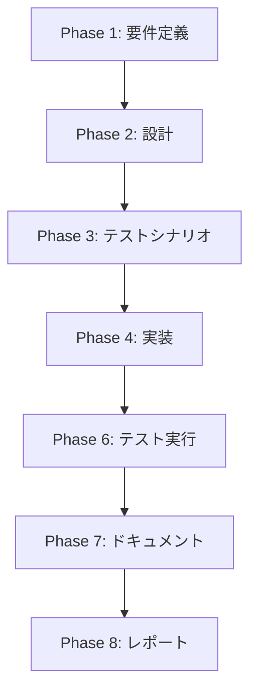
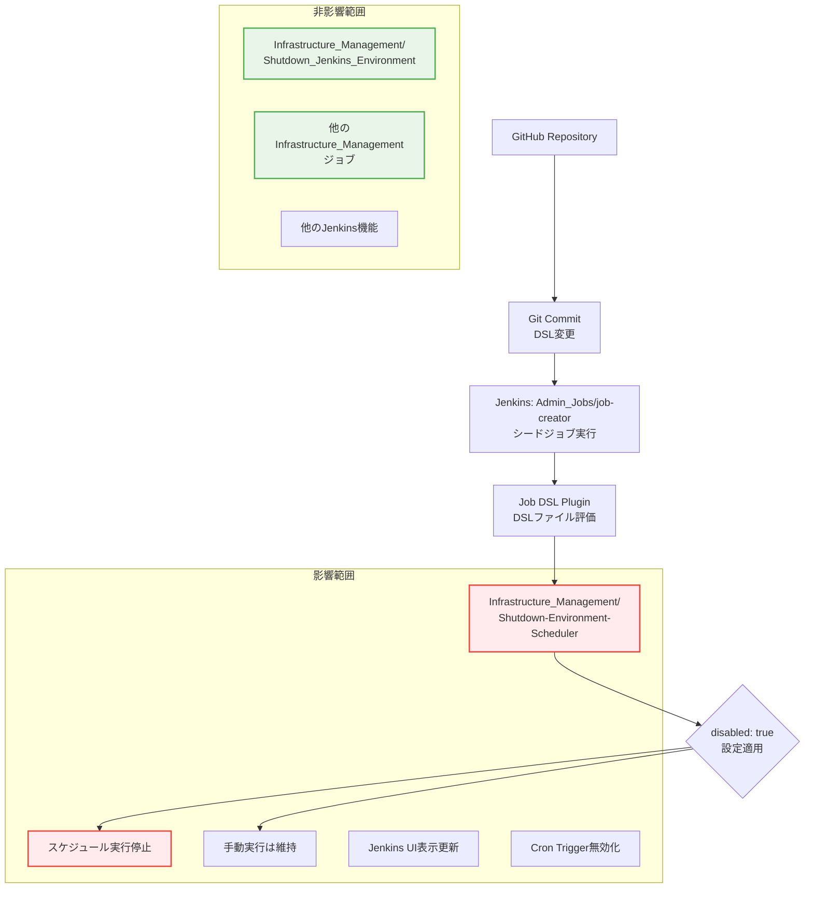

# Codex Agent 実行ログ

開始日時: 2025/12/25 6:21:30

---

## Turn 1: スレッド開始

**Thread ID**: `[REDACTED_TOKEN]`

## Turn 2: ツール実行

**種別**: reasoning
**ステータス**: completed

## Turn 3: ツール実行

**種別**: mcp_tool_call
**ステータス**: completed

## Turn 4: ツール実行

**種別**: reasoning
**ステータス**: completed

## Turn 5: ツール実行

**種別**: コマンド実行
**コマンド**: `/bin/bash -lc pwd`
**ステータス**: completed (exit_code=0)

```text
/tmp/ai-workflow-repos-10-fba0a94c/[REDACTED_TOKEN]
```

## Turn 6: ツール実行

**種別**: reasoning
**ステータス**: completed

## Turn 7: ツール実行

**種別**: コマンド実行
**コマンド**: `/bin/bash -lc ls`
**ステータス**: completed (exit_code=0)

```text
ARCHITECTURE.md
CLAUDE.md
CONTRIBUTION.md
LICENSE
README.md
ansible
bootstrap
docker
docs
jenkins
pulumi
run_tests_issue_322.sh
scripts
tests
```

## Turn 8: ツール実行

**種別**: reasoning
**ステータス**: completed

## Turn 9: ツール実行

**種別**: コマンド実行
**コマンド**: `/bin/bash -lc "rg --files -g 'AGENTS.md'"`
**ステータス**: failed (exit_code=127)

```text
/bin/bash: line 1: rg: command not found
```

## Turn 10: ツール実行

**種別**: reasoning
**ステータス**: completed

## Turn 11: ツール実行

**種別**: コマンド実行
**コマンド**: `/bin/bash -lc 'find .. -name AGENTS.md -print'`
**ステータス**: completed (exit_code=0)

## Turn 12: ツール実行

**種別**: reasoning
**ステータス**: completed

## Turn 13: ツール実行

**種別**: コマンド実行
**コマンド**: `/bin/bash -lc "find . -name 'AGENTS.md'"`
**ステータス**: completed (exit_code=0)

## Turn 14: ツール実行

**種別**: reasoning
**ステータス**: completed

## Turn 15: ツール実行

**種別**: コマンド実行
**コマンド**: `/bin/bash -lc 'ls /home/node/.codex/skills'`
**ステータス**: completed (exit_code=0)

## Turn 16: ツール実行

**種別**: reasoning
**ステータス**: completed

## Turn 17: ツール実行

**種別**: コマンド実行
**コマンド**: `/bin/bash -lc 'cat .ai-workflow/issue-526/00_planning/output/planning.md'`
**ステータス**: completed (exit_code=0)

```text
# プロジェクト計画書 - Issue #526

## タスク概要
環境停止スケジューラージョブの無効化

## 📋 Issue分析

### 複雑度: 簡単
- **対象**: 単一ファイル（DSLファイル）の1行修正
- **変更範囲**: `disabled`設定の変更のみ
- **影響**: ジョブの有効/無効状態変更（リソースレベルの変更なし）

### 見積もり工数: 2~3時間
**根拠**:
- ファイル修正: 5分
- シードジョブ実行: 5分
- 動作確認: 10分
- ドキュメント更新: 30分
- テストシナリオ作成: 30分
- プロジェクト管理作業: 1時間

### リスク評価: 低
- 既存のジョブ設定を変更するのみ
- 停止機能ではなく、停止のスケジュール機能のON/OFF
- ロールバックが容易（`disabled(false)`に戻すのみ）

## 🏗️ 実装戦略判断

### 実装戦略: EXTEND
**判断根拠**:
既存の `infrastructure_shutdown_scheduler_job.groovy` ファイルの設定を拡張（`disabled` プロパティを追加）するため。新規ファイル作成ではなく、既存ファイルの機能拡張にあたる。

### テスト戦略: INTEGRATION_ONLY
**判断根拠**:
Jenkins DSLの変更であり、単体テストよりもJenkins環境での統合テストが重要。シードジョブ実行→ジョブ作成→スケジュール無効化確認という一連の流れを検証する必要がある。ビジネスロジックがなく、BDDは不要。

### テストコード戦略: CREATE_TEST
**判断根拠**:
Jenkins DSLの設定変更に対するテストは、既存のテストファイルに追加するのではなく、この変更に特化したテストシナリオを作成する方が適切。Jenkins UI確認とコマンドベースの確認を含む新規テストを作成する。

## 🔍 影響範囲分析

### 既存コードへの影響
- **変更対象ファイル**: `jenkins/jobs/dsl/infrastructure-management/infrastructure_shutdown_scheduler_job.groovy`
- **変更内容**: `disabled(true)`プロパティの追加
- **影響範囲**: 該当ジョブのスケジュール実行のみ（他のジョブには影響なし）

### 依存関係の変更
- **新規依存**: なし
- **既存依存の変更**: なし
- **注意点**: シードジョブ（job-creator）の実行が必要

### マイグレーション要否
- **データベーススキーマ変更**: なし
- **設定ファイル変更**: Jenkins DSLファイルの変更のみ
- **バックアップ**: Git履歴による自動バックアップ

## 📈 タスク分割

### Phase 1: 要件定義 (見積もり: 0.5h)

- [x] Task 1-1: 要件の詳細分析 (15分)
  - スケジューラージョブ無効化の要件確認
  - 対象環境（dev）の確認
  - 影響範囲の特定
- [x] Task 1-2: 受け入れ基準の定義 (15分)
  - ジョブ無効化の確認方法
  - スケジュール停止の確認方法
  - ロールバック手順の確認

### Phase 2: 設計 (見積もり: 0.5h)

- [x] Task 2-1: DSL変更設計 (15分)
  - `disabled(true)`の追加場所特定
  - 設定構文の確認
- [x] Task 2-2: シードジョブ実行計画 (15分)
  - job-creatorの実行手順確認
  - 実行タイミングの計画

### Phase 3: テストシナリオ (見積もり: 0.5h)

- [x] Task 3-1: 統合テストシナリオ作成 (30分)
  - DSL修正→シードジョブ実行→無効化確認の流れ
  - Jenkins UI確認手順
  - CLI確認手順（jenkins-cli.jarまたはAPI）

### Phase 4: 実装 (見積もり: 0.25h)

- [ ] Task 4-1: DSLファイル修正 (15分)
  - `infrastructure_shutdown_scheduler_job.groovy`に`disabled(true)`を追加
  - Git差分確認とコミット

### Phase 5: テストコード実装 (見積もり: なし)

- [ ] Task 5-1: 統合テスト手順書作成 (0分)
  - この変更では自動化されたテストコードではなく、手動確認手順を作成

### Phase 6: テスト実行 (見積もり: 0.5h)

- [ ] Task 6-1: シードジョブ実行 (10分)
  - Jenkins UIから job-creator を手動実行
  - 実行ログの確認
- [ ] Task 6-2: ジョブ無効化確認 (10分)
  - Jenkins UIでの無効状態確認
  - スケジュール設定の確認
- [ ] Task 6-3: 回帰テスト (10分)
  - 他のインフラ管理ジョブへの影響確認
  - 手動停止ジョブが正常動作することの確認

### Phase 7: ドキュメント (見積もり: 0.5h)

- [ ] Task 7-1: README.md更新 (15分)
  - 自動停止機能の無効化について記載
  - 手動停止の手順を明記
- [ ] Task 7-2: Jenkins設定ドキュメント更新 (15分)
  - jenkins/README.mdの更新（必要に応じて）
  - 運用手順の変更点反映

### Phase 8: レポート (見積もり: 0.25h)

- [ ] Task 8-1: 実装完了レポート作成 (15分)
  - 変更内容の要約
  - 動作確認結果
  - 今後の運用について

## 📊 依存関係



注意: Phase 5（テストコード実装）はJenkins DSLの変更のため、自動化テストではなく手動確認手順書として Phase 3 に含まれます。

## ⚠️ リスクと軽減策

### リスク1: シードジョブ実行失敗
- **影響度**: 中
- **確率**: 低
- **軽減策**:
  - 事前にjob-creatorの正常動作を確認
  - Jenkins管理者権限でのアクセス確保
  - ロールバック用のGit revert準備

### リスク2: 既存ジョブへの意図しない影響
- **影響度**: 低
- **確率**: 低
- **軽減策**:
  - DSLファイルの変更範囲を最小限に限定
  - 他のインフラ管理ジョブの動作確認を実施
  - 変更前の設定をGitで記録

### リスク3: スケジュール無効化の確認漏れ
- **影響度**: 中
- **確率**: 低
- **軽減策**:
  - Jenkins UIとAPIの両方で確認
  - 次回スケジュール時刻の確認
  - 1週間後の動作確認

### リスク4: ドキュメント更新漏れ
- **影響度**: 低
- **確率**: 中
- **軽減策**:
  - 関連ドキュメントのリストアップ
  - 変更点を明確に記載
  - レビューフェーズでの確認

## 🎯 品質ゲート

### Phase 1: 要件定義
- [x] スケジューラージョブの無効化要件が明確に記載されている
- [x] 対象環境（dev）が特定されている
- [x] 受け入れ基準（ジョブ無効化、スケジュール停止）が定義されている
- [x] 手動停止の代替手順が確認されている

### Phase 2: 設計
- [x] 実装戦略（EXTEND）の判断根拠が明記されている
- [x] テスト戦略（INTEGRATION_ONLY）の判断根拠が明記されている
- [x] テストコード戦略（CREATE_TEST）の判断根拠が明記されている
- [x] DSL変更箇所が特定されている
- [x] シードジョブ実行手順が計画されている

### Phase 3: テストシナリオ
- [x] 統合テストシナリオが作成されている
- [x] Jenkins UI確認手順が記載されている
- [x] CLI/API確認手順が記載されている
- [x] 回帰テストの範囲が定義されている

### Phase 4: 実装
- [ ] `disabled(true)`がDSLファイルに追加されている
- [ ] 構文エラーがない
- [ ] Git コミットが適切に行われている

### Phase 6: テスト実行
- [ ] シードジョブが正常
... (truncated)
```

## Turn 18: ツール実行

**種別**: reasoning
**ステータス**: completed

## Turn 19: ツール実行

**種別**: コマンド実行
**コマンド**: `/bin/bash -lc 'cat .ai-workflow/issue-526/02_design/output/design.md'`
**ステータス**: completed (exit_code=0)

```text
# 詳細設計書 - Issue #526

## 環境停止スケジューラージョブの無効化

---

## 0. Planning Document 確認

本詳細設計は Planning Phase（`.ai-workflow/issue-526/00_planning/output/planning.md`）で策定された開発計画に基づいて作成されています。

### Planning Phase で確認された戦略
- **実装戦略**: EXTEND（既存ファイルの機能拡張）
- **テスト戦略**: INTEGRATION_ONLY（Jenkins環境での統合テスト）
- **テストコード戦略**: CREATE_TEST（新規テストシナリオ作成）
- **複雑度**: 簡単（単一ファイルの1行修正）
- **工数見積**: 2-3時間
- **リスク評価**: 低

---

## 1. アーキテクチャ設計

### 1.1 システム全体図



### 1.2 コンポーネント間の関係

| コンポーネント | 役割 | 変更対象 |
|---------------|------|----------|
| **infrastructure_shutdown_scheduler_job.groovy** | スケジューラージョブのDSL定義 | **修正対象** |
| **job-creator（シードジョブ）** | DSL変更をJenkinsに反映 | 実行のみ |
| **Shutdown-Environment-Scheduler** | スケジューラージョブ本体 | 設定変更 |
| **Shutdown_Jenkins_Environment** | 実際の停止処理 | **変更なし** |

### 1.3 データフロー

```
現在の状態:
毎日 JST 00:00 (UTC 15:00)
  ↓ Cron Trigger
Shutdown-Environment-Scheduler (有効)
  ↓ 非同期トリガー
Shutdown_Jenkins_Environment
  ↓
dev環境停止

変更後の状態:
毎日 JST 00:00 (UTC 15:00)
  ↓ Cron Trigger (無効)
Shutdown-Environment-Scheduler (disabled: true)
  ↓ トリガーなし
（自動停止なし）

手動実行時:
Jenkins UI操作
  ↓ 手動実行
Shutdown-Environment-Scheduler
  ↓ 非同期トリガー
Shutdown_Jenkins_Environment
  ↓
dev環境停止
```

---

## 2. 実装戦略判断

### 実装戦略: EXTEND

**判断根拠**:
- 既存の `infrastructure_shutdown_scheduler_job.groovy` ファイルに `disabled(true)` プロパティを追加する拡張作業
- 新規ファイル作成ではなく、既存ファイルの機能拡張（無効化機能の追加）
- Jenkins Job DSL の標準的なプロパティ追加による機能拡張

---

## 3. テスト戦略判断

### テスト戦略: INTEGRATION_ONLY

**判断根拠**:
- Jenkins DSL の変更であり、単体テストよりもJenkins環境での統合テストが重要
- シードジョブ実行→ジョブ作成→スケジュール無効化確認という一連の流れを検証する必要がある
- ビジネスロジックがなく、BDDは不要（インフラ設定変更のみ）
- Jenkins の Job DSL Plugin、Cron Trigger、UI表示の統合的な動作確認が必要

---

## 4. テストコード戦略判断

### テストコード戦略: CREATE_TEST

**判断根拠**:
- Jenkins DSL の設定変更に対するテストは、既存のテストファイルに追加するのではなく、この変更に特化したテストシナリオを作成する方が適切
- Jenkins UI 確認と CLI/API ベースの確認を含む新規テストが必要
- インフラ管理ジョブの特殊性（手動実行、スケジュール確認、回帰テスト）に対応した独立したテスト手順

---

## 5. 影響範囲分析

### 5.1 既存コードへの影響

#### 5.1.1 直接的な影響

| ファイル | 変更内容 | 影響度 |
|---------|----------|--------|
| `jenkins/jobs/dsl/infrastructure-management/infrastructure_shutdown_scheduler_job.groovy` | `disabled(true)` 追加 | **高** |
| Jenkins 設定データベース | ジョブ設定の更新 | 中 |
| Jenkins UI | 無効化アイコンの表示 | 低 |

#### 5.1.2 間接的な影響

| 機能・コンポーネント | 影響内容 | 対応要否 |
|-------------------|----------|----------|
| **自動停止スケジュール** | 毎日00:00の自動実行停止 | なし（意図された変更） |
| **手動環境停止** | 変更なし（引き続き利用可能） | なし |
| **開発環境の運用** | 常時稼働への変更 | **運用ルール更新** |
| **コスト管理** | 自動停止なしによる費用増 | **監視強化推奨** |

### 5.2 依存関係の変更

#### 5.2.1 アップストリーム依存関係

```
GitHub Repository (DSL変更)
  ↓
Git Commit & Push
  ↓
job-creator 手動実行
  ↓
Job DSL Plugin
  ↓
Jenkins 設定更新
```

**依存関係**: 変更なし（既存の反映フローを利用）

#### 5.2.2 ダウンストリーム依存関係

```
Shutdown-Environment-Scheduler (無効化)
  ↓ トリガー関係が変更
Shutdown_Jenkins_Environment (変更なし)
  ↓ 停止対象は維持
dev環境リソース（EC2, SpotFleet, EFS等）
```

**変更点**: スケジューラーからのトリガーがなくなるのみ

### 5.3 マイグレーション要否

#### 5.3.1 データベーススキーマ変更
- **なし**: Jenkins の設定データベースは既存のスキーマを使用

#### 5.3.2 設定ファイル変更
- **対象**: Jenkins Job DSL ファイルの変更のみ
- **バックアップ**: Git 履歴による自動バックアップ

#### 5.3.3 環境間の設定同期
- **dev環境**: 対象（Issue の要件）
- **staging/prod環境**: 対象外（各環境で個別判断）

---

## 6. 変更・追加ファイルリスト

### 6.1 修正が必要な既存ファイル

| ファイルパス | 変更内容 | 変更行数 |
|------------
... (truncated)
```

## Turn 20: ツール実行

**種別**: reasoning
**ステータス**: completed

## Turn 21: ツール実行

**種別**: コマンド実行
**コマンド**: `/bin/bash -lc 'cat .ai-workflow/issue-526/03_test_scenario/output/test-scenario.md'`
**ステータス**: completed (exit_code=0)

```text
# テストシナリオ - Issue #526

## 環境停止スケジューラージョブの無効化

---

## 0. Planning Document 確認

本テストシナリオは Planning Phase（`.ai-workflow/issue-526/00_planning/output/planning.md`）で策定された開発計画に基づいて作成されています。

### Planning Phase で確認された戦略
- **実装戦略**: EXTEND（既存ファイルの機能拡張）
- **テスト戦略**: INTEGRATION_ONLY（Jenkins環境での統合テスト）
- **テストコード戦略**: CREATE_TEST（新規テストシナリオ作成）
- **複雑度**: 簡単（単一ファイルの1行修正）
- **工数見積**: 2-3時間
- **リスク評価**: 低

---

## 1. テスト戦略サマリー

### 1.1 選択されたテスト戦略: INTEGRATION_ONLY

**判断根拠**:
- Jenkins DSL の変更であり、単体テストよりもJenkins環境での統合テストが重要
- シードジョブ実行→ジョブ作成→スケジュール無効化確認という一連の流れを検証する必要がある
- ビジネスロジックがなく、BDD は不要（インフラ設定変更のみ）
- Jenkins の Job DSL Plugin、Cron Trigger、UI表示の統合的な動作確認が必要

### 1.2 テスト対象の範囲

#### 統合対象コンポーネント
1. **Git Repository** ↔ **Jenkins DSL ファイル**
2. **Jenkins DSL Plugin** ↔ **シードジョブ（job-creator）**
3. **シードジョブ** ↔ **Shutdown-Environment-Scheduler ジョブ**
4. **Jenkins UI** ↔ **ジョブ設定・表示**
5. **Cron Trigger** ↔ **スケジュール実行**

#### テストフォーカス
- DSL ファイル変更からジョブ無効化までの一連の統合フロー
- Jenkins 内部コンポーネント間の連携
- 手動実行機能の維持確認
- 他ジョブへの非影響確認

### 1.3 テストの目的

1. **機能統合確認**: DSL 変更が正しく Jenkins ジョブ設定に反映されること
2. **スケジュール統合確認**: Cron Trigger が正しく無効化されること
3. **UI統合確認**: Jenkins UI で無効化状態が正しく表示されること
4. **回帰確認**: 他のジョブに影響がないこと
5. **運用継続性確認**: 手動実行機能が維持されること

---

## 2. 統合テストシナリオ

### 2.1 テストケース1: DSL修正からジョブ無効化までの統合フロー

**シナリオ名**: End-to-End Job Disable Integration

**目的**:
DSL ファイル変更からシードジョブ実行、ジョブ無効化までの一連の統合プロセスが正常に動作することを検証

**前提条件**:
- Jenkins 環境が稼働している
- `infrastructure_shutdown_scheduler_job.groovy` が存在する
- `Admin_Jobs/job-creator` シードジョブが正常動作する
- Jenkins 管理者権限でアクセス可能

**テスト手順**:

#### Step 1: 現在の状態確認
```bash
# 1-1. 現在のジョブ状態確認
jenkins-cli get-job "Infrastructure_Management/Shutdown-Environment-Scheduler" | grep -i disabled
# 期待: disabled要素がない、またはdisabled=false

# 1-2. 現在のスケジュール確認
jenkins-cli get-job "Infrastructure_Management/Shutdown-Environment-Scheduler" | grep -o '<spec>H 15 \* \* \*</spec>'
# 期待: スケジュール設定が存在

# 1-3. 現在のビルド番号記録
BEFORE_BUILD=$(jenkins-cli get-job "Infrastructure_Management/Shutdown-Environment-Scheduler" | grep -o '<nextBuildNumber>[0-9]*</nextBuildNumber>' | grep -o '[0-9]*')
echo "変更前ビルド番号: $BEFORE_BUILD"
```

#### Step 2: DSL ファイル修正と Git 操作
```bash
# 2-1. DSL ファイルに disabled(true) を追加
echo "    disabled(true)" >> jenkins/jobs/dsl/infrastructure-management/infrastructure_shutdown_scheduler_job.groovy

# 2-2. 構文確認（基本チェック）
grep -n "disabled(true)" jenkins/jobs/dsl/infrastructure-management/infrastructure_shutdown_scheduler_job.groovy
# 期待: 追加した行が表示される

# 2-3. Git コミット
git add jenkins/jobs/dsl/infrastructure-management/infrastructure_shutdown_scheduler_job.groovy
git commit -m "[jenkins] update: スケジューラージョブを無効化 (disabled=true) - Issue #526"
```

#### Step 3: シードジョブ実行
```bash
# 3-1. シードジョブ実行
jenkins-cli build "Admin_Jobs/job-creator" -s

# 3-2. 実行結果確認
SEED_BUILD_NUMBER=$(jenkins-cli get-job "Admin_Jobs/job-creator" | grep -o '<nextBuildNumber>[0-9]*</nextBuildNumber>' | grep -o '[0-9]*')
SEED_BUILD_NUMBER=$((SEED_BUILD_NUMBER - 1))
jenkins-cli console "Admin_Jobs/job-creator" $SEED_BUILD_NUMBER | tail -20
# 期待: SUCCESS と表示される
```

#### Step 4: ジョブ無効化確認
```bash
# 4-1. Jenkins CLI でのジョブ状態確認
jenkins-cli get-job "Infrastructure_Management/Shutdown-Environment-Scheduler" | grep "<disabled>true</disabled>"
# 期待: disabled=true が検出される

# 4-2. Jenkins UI での確認（手動）
# ブラウザで Jenkins にアクセス
# Infrastructure_Management フォルダ → Shutdown-Environment-Scheduler ジョブ
# 期待: ジョブ名の横に無効化アイコン（グレーアウト）が表示
```

#### Step 5: スケジュール無効化確認
```bash
# 5-1. Trigger 設定は維持されているが無効化されていることを確認
jenkins-cli get-job "Infrastructure_Management/Shutdown-Environment-Scheduler" | grep -A5 -B5 "TimerTrigger"
# 期待: TimerTrigger設定は存在するが、disabled=trueにより実行されない

# 5-2. 次回スケジュール時刻での非実行確認（テスト日によって調整）
# 注意: 実際のスケジュール時刻（JST 00:00）まで待つか、時刻を進めてテスト
```

**期待結果**:
- シードジョブが SUCCESS で完了する
- `Infrastructure_Management/Shutdown-Environment-Scheduler` ジョブが無効状態になる
- Jenkins UI で無効化アイコンが表示される
- スケジュール実行が停止する
- DSL 構文エラーが発生しない

**確認項目チェックリスト**:
- [ ] シードジョブ実行が 5分以内に SUCCESS で完了
- [ ] CLI で `<disabled>true</disabled>` が確認できる
- [ ]
... (truncated)
```

## Turn 22: ツール実行

**種別**: reasoning
**ステータス**: completed

## Turn 23: ツール実行

**種別**: コマンド実行
**コマンド**: `/bin/bash -lc 'cat .ai-workflow/issue-526/01_requirements/output/requirements.md'`
**ステータス**: completed (exit_code=0)

```text
# 要件定義書 - Issue #526

## 環境停止スケジューラージョブの無効化

---

## 0. Planning Document確認

本要件定義はPlanning Phase（`.ai-workflow/issue-526/00_planning/output/planning.md`）で策定された開発計画を基に作成されています。

### Planning Phaseで確認された戦略
- **実装戦略**: EXTEND（既存ファイルの機能拡張）
- **テスト戦略**: INTEGRATION_ONLY（Jenkins環境での統合テスト）
- **テストコード戦略**: CREATE_TEST（新規テストシナリオ作成）
- **複雑度**: 簡単（単一ファイルの1行修正）
- **工数見積**: 2-3時間
- **リスク評価**: 低

---

## 1. 概要

### 1.1 背景と目的

**背景**:
- 現在、dev環境が毎日JST午前0時（UTC 15:00）に自動停止される設定になっている
- 運用方針の変更により、常時稼働の運用に切り替える必要がある
- `Infrastructure_Management/Shutdown-Environment-Scheduler`ジョブの無効化が求められている

**目的**:
- スケジュール実行による自動停止を無効化
- 手動停止機能は維持（必要時に使用可能）
- 運用コスト管理の責任を自動化から手動運用に移行

### 1.2 ビジネス価値・技術的価値

**ビジネス価値**:
- 常時稼働による開発効率の向上
- 予期しないシステム停止の回避
- チーム間の運用方針統一

**技術的価値**:
- Infrastructure as Codeの原則に従った設定変更
- 可逆的な変更（将来的な再有効化が容易）
- Jenkins Job DSLによる宣言的な管理

---

## 2. 機能要件

### 2.1 主要機能要件

| ID | 要件名 | 説明 | 優先度 |
|----|--------|------|--------|
| FR-001 | DSLファイル修正 | `infrastructure_shutdown_scheduler_job.groovy`に`disabled(true)`を追加 | 最高 |
| FR-002 | シードジョブ実行 | `Admin_Jobs/job-creator`を実行してジョブ設定を反映 | 最高 |
| FR-003 | ジョブ無効化確認 | Jenkins UIでジョブが「無効」状態になっていることを確認 | 高 |
| FR-004 | スケジュール停止確認 | Cronスケジュール（`H 15 * * *`）が実行されないことを確認 | 高 |
| FR-005 | ドキュメント更新 | 必要に応じてjenkins/README.mdを更新 | 中 |

### 2.2 詳細仕様

#### FR-001: DSLファイル修正
- **ファイル**: `jenkins/jobs/dsl/infrastructure-management/infrastructure_shutdown_scheduler_job.groovy`
- **変更内容**:
  ```groovy
  // 修正前
  disabled(false)  // または設定なし

  // 修正後
  disabled(true)   // ジョブを無効化
  ```
- **構文エラー**: 発生させない
- **Git管理**: 変更内容をコミット

#### FR-002: シードジョブ実行
- **実行対象**: `Admin_Jobs/job-creator`
- **実行方法**: Jenkins UI経由での手動実行
- **実行時間**: 5分以内で完了
- **実行結果**: SUCCESS状態

#### FR-003: ジョブ無効化確認
- **確認対象**: `Infrastructure_Management/Shutdown-Environment-Scheduler`
- **確認方法**:
  - Jenkins UI: ジョブ画面でdisabledアイコンの表示
  - Jenkins CLI: `java -jar jenkins-cli.jar get-job`コマンド
- **期待値**: ジョブが無効状態

#### FR-004: スケジュール停止確認
- **確認対象**: Cronトリガー（`H 15 * * *`）
- **確認方法**: Jenkins UIのスケジュール表示
- **確認タイミング**: 次回予定時刻での非実行
- **期待値**: スケジュール実行が発生しない

#### FR-005: ドキュメント更新
- **対象ファイル**: `jenkins/README.md`（必要に応じて）
- **更新内容**:
  - 自動停止機能の無効化について記載
  - 手動停止の手順を明記
  - 将来的な再有効化手順を記載

---

## 3. 非機能要件

### 3.1 パフォーマンス要件
- **NFR-001**: シードジョブ実行時間は5分以内で完了すること
- **NFR-002**: DSL構文エラーにより他のジョブ作成に影響を与えないこと

### 3.2 セキュリティ要件
- **NFR-003**: Jenkins管理者権限を持つユーザーのみが作業を実行すること
- **NFR-004**: 変更作業はGit履歴として記録されること

### 3.3 可用性・信頼性要件
- **NFR-005**: ロールバック可能であること（`disabled(false)`への復旧）
- **NFR-006**: 他のインフラ管理ジョブに影響を与えないこと

### 3.4 保守性・拡張性要件
- **NFR-007**: Infrastructure as Codeの原則に従うこと
- **NFR-008**: 将来的なスケジュール時刻変更にも対応可能であること

---

## 4. 制約事項

### 4.1 技術的制約
- **TC-001**: Jenkins Job DSL構文に厳密に準拠すること
- **TC-002**: 既存の`infrastructure_shutdown_scheduler_job.groovy`ファイルを使用すること
- **TC-003**: シードジョブ（job-creator）の実行が必要であること

### 4.2 リソース制約
- **RC-001**: 作業時間は2-3時間以内に完了すること
- **RC-002**: Jenkins管理者権限でのアクセスが必要であること

### 4.3 ポリシー制約
- **PC-001**: Infrastructure as Codeの原則に従うこと
- **PC-002**: 変更内容はGitで管理すること
- **PC-003**: 手動でのJenkins UI変更は行わないこと

---

## 5. 前提条件

### 5.1 システム環境
- Jenkins環境が稼働状態であること
- `Admin_Jobs/job-creator`（シードジョブ）が正常に動作すること
- Git リポジトリへの書き込み権限があること

### 5.2 依存コンポーネント
- Jenkins Job DSL Plugin
- `infrastructure_shutdown_scheduler_job.groovy`ファイル
- `Admin_Jobs/job-creator`ジョブ

### 5.3 外部システム連携
- Gitリポジトリとの連携
- Jenkins UIへのアクセス

---

## 6. 受け入れ基準

### 6.1 AC-001: DSLファイル修正の確認
```gherkin
Given: infrastructure_shutdown_scheduler_job.groovyファイルが存在する
When: disabled(true)を追加してコミットする
Then: Git履歴に変更が記録される
And: 構文エラーが発生しない
```

### 6.2 AC-002: シードジョブ実行の成功確認
```gherkin
Given: DSLファイルが更新されている
When: Admin_Jobs/job-creatorを手動実行する
Then: ジョブ実行が5分以内に成功する
And: ビルド結果がSUCCESS状態になる
```

### 6.3 AC-003: ジョブ無効化状態の確認
```gherkin
Given: シードジョブが正常実行されている
When: Jenkins UIでInfrastructure_Management/Shutdown-Environment-Schedulerを確認する
Then: ジョブが「無効」状態として表示される
And: disabledアイコンが表示される
```

### 6.4 AC-004: スケジュール実行停止の確認
```gherkin
Given: ジョブが無効化されている
When: 次回スケジュール時刻（JST 0:00）に到達する
Then: 自動実行が発生
... (truncated)
```

## Turn 24: ツール実行

**種別**: reasoning
**ステータス**: completed

## Turn 25: ツール実行

**種別**: コマンド実行
**コマンド**: `/bin/bash -lc "sed -n '1,160p' jenkins/jobs/dsl/infrastructure-management/infrastructure_shutdown_scheduler_job.groovy"`
**ステータス**: completed (exit_code=0)

```text
/**
 * Infrastructure Shutdown Scheduler Job DSL
 * 
 * 日本時間午前0時に環境停止ジョブを自動実行するスケジューラージョブ
 * 既存の停止ジョブをトリガーするfreestyleジョブ
 */

def folderPath = 'Infrastructure_Management'
def jobName = 'Shutdown-Environment-Scheduler'
def fullJobName = "${folderPath}/${jobName}"

freeStyleJob(fullJobName) {
    displayName('環境自動停止スケジューラー')
    description('''
        |開発環境を毎日定時に自動停止するスケジューラージョブです。
        |
        |実行タイミング:
        |- 日本時間（JST）午前0時
        |- 毎日実行（土日祝日含む）
        |
        |実行内容:
        |- Infrastructure_Management/Shutdown_Jenkins_Environment ジョブをトリガー
        |- 環境: dev
        |- モード: graceful（実行中ジョブの完了を待つ）
        |
        |注意事項:
        |- 本番環境は対象外（dev環境のみ）
        |- 土日祝日も含めて毎日自動停止します
    '''.stripMargin())

    // トリガー設定
    triggers {
        // 日本時間午前0時に実行（UTC 15:00）
        // H: Hash（負荷分散のため0-59分の間でランダムに実行）
        // 毎日実行: *（全曜日）
        cron('H 15 * * *')  // UTC 15:00 = JST 00:00、毎日
    }

    // 並行実行を無効化
    concurrentBuild(false)

    // ビルド履歴の保持設定
    logRotator {
        daysToKeep(30)      // 30日間保持
        numToKeep(90)       // 最大90ビルド保持
    }

    // ビルドステップは空（ポストビルドで実行するため）
    steps {
        shell('echo "環境停止ジョブをトリガーします..."')
    }
    
    // ポストビルドアクション - 非同期でジョブをトリガー
    publishers {
        // 他のジョブをトリガー（待機なし）
        [REDACTED_TOKEN] {
            trigger('Infrastructure_Management/Shutdown_Jenkins_Environment') {
                // 条件: 常に実行
                condition('ALWAYS')
                
                // 固定パラメータを設定
                parameters {
                    predefinedProp('ENVIRONMENT', 'dev')
                    predefinedProp('AWS_REGION', 'ap-northeast-1')
                    predefinedProp('SHUTDOWN_MODE', 'graceful')
                    predefinedProp('[REDACTED_TOKEN]', '30')
                    booleanParam('CONFIRM_SHUTDOWN', true)
                    booleanParam('DRY_RUN', false)
                }
                
                // 結果を待たない（非同期実行）
                [REDACTED_TOKEN](false)
            }
        }
    }

    // ビルドラッパー
    wrappers {
        timestamps()
        
        // タイムアウト設定（停止ジョブが長引いた場合の保険）
        timeout {
            absolute(60)  // 最大60分
            failBuild()
        }
        
        // ビルド名の設定
        buildName('#${BUILD_NUMBER} - Scheduled Shutdown [dev]')
    }

    // 環境変数
    [REDACTED_TOKEN] {
        env('TZ', 'Asia/Tokyo')
    }
}
```

## Turn 26: ツール実行

**種別**: reasoning
**ステータス**: completed

## Turn 27: ツール実行

**種別**: file_change
**ステータス**: completed

## Turn 28: ツール実行

**種別**: reasoning
**ステータス**: completed

## Turn 29: ツール実行

**種別**: コマンド実行
**コマンド**: `/bin/bash -lc 'ls .ai-workflow/issue-526'`
**ステータス**: completed (exit_code=0)

```text
00_planning
01_requirements
02_design
03_test_scenario
04_implementation
metadata.json
metadata.json.[REDACTED_TOKEN]
```

## Turn 30: ツール実行

**種別**: reasoning
**ステータス**: completed

## Turn 31: ツール実行

**種別**: コマンド実行
**コマンド**: `/bin/bash -lc 'ls .ai-workflow/issue-526/04_implementation'`
**ステータス**: completed (exit_code=0)

```text
execute
output
review
revise
```

## Turn 32: ツール実行

**種別**: reasoning
**ステータス**: completed

## Turn 33: ツール実行

**種別**: コマンド実行
**コマンド**: `/bin/bash -lc 'git status -sb'`
**ステータス**: completed (exit_code=0)

```text
## ai-workflow/issue-526...origin/ai-workflow/issue-526
 M .ai-workflow/issue-526/metadata.json
 M jenkins/jobs/dsl/infrastructure-management/infrastructure_shutdown_scheduler_job.groovy
?? .ai-workflow/issue-526/00_planning/execute/agent_log_raw.txt
?? .ai-workflow/issue-526/00_planning/execute/prompt.txt
?? .ai-workflow/issue-526/00_planning/review/agent_log_raw.txt
?? .ai-workflow/issue-526/00_planning/review/prompt.txt
?? .ai-workflow/issue-526/01_requirements/execute/agent_log_raw.txt
?? .ai-workflow/issue-526/01_requirements/execute/prompt.txt
?? .ai-workflow/issue-526/01_requirements/review/agent_log_raw.txt
?? .ai-workflow/issue-526/01_requirements/review/prompt.txt
?? .ai-workflow/issue-526/02_design/execute/agent_log_raw.txt
?? .ai-workflow/issue-526/02_design/execute/prompt.txt
?? .ai-workflow/issue-526/02_design/review/agent_log_raw.txt
?? .ai-workflow/issue-526/02_design/review/prompt.txt
?? .ai-workflow/issue-526/03_test_scenario/execute/agent_log_raw.txt
?? .ai-workflow/issue-526/03_test_scenario/execute/prompt.txt
?? .ai-workflow/issue-526/03_test_scenario/review/agent_log_raw.txt
?? .ai-workflow/issue-526/03_test_scenario/review/prompt.txt
?? .ai-workflow/issue-526/04_implementation/
```

## Turn 34: ツール実行

**種別**: reasoning
**ステータス**: completed

## Turn 35: ツール実行

**種別**: コマンド実行
**コマンド**: `/bin/bash -lc 'git diff jenkins/jobs/dsl/infrastructure-management/infrastructure_shutdown_scheduler_job.groovy'`
**ステータス**: completed (exit_code=0)

```text
diff --git a/jenkins/jobs/dsl/infrastructure-management/infrastructure_shutdown_scheduler_job.groovy b/jenkins/jobs/dsl/infrastructure-management/infrastructure_shutdown_scheduler_job.groovy
index f6e3871c..6102d7f7 100644
--- a/jenkins/jobs/dsl/infrastructure-management/infrastructure_shutdown_scheduler_job.groovy
+++ b/jenkins/jobs/dsl/infrastructure-management/infrastructure_shutdown_scheduler_job.groovy
@@ -28,6 +28,8 @@ freeStyleJob(fullJobName) {
         |- 土日祝日も含めて毎日自動停止します
     '''.stripMargin())
 
+    disabled(true)  // ジョブを無効化し、スケジュール実行を停止
+
     // トリガー設定
     triggers {
         // 日本時間午前0時に実行（UTC 15:00）
@@ -92,4 +94,4 @@ freeStyleJob(fullJobName) {
     [REDACTED_TOKEN] {
         env('TZ', 'Asia/Tokyo')
     }
-}
\ No newline at end of file
+}
```

## Turn 36: ツール実行

**種別**: reasoning
**ステータス**: completed

## Turn 37: ツール実行

**種別**: コマンド実行
**コマンド**: `/bin/bash -lc "cat <<'EOF' > .ai-workflow/issue-526/04_implementation/output/implementation.md
# 実装完了レポート

## 変更ファイル一覧

| ファイル | 変更種別 | 概要 |
|---------|---------|------|
| "'`jenkins/jobs/dsl/infrastructure-management/infrastructure_shutdown_scheduler_job.groovy` | 修正 | `disabled(true)` を追加してスケジュール対象ジョブを無効化し、トリガー設定や手動実行はそのまま維持 |
| `.ai-workflow/issue-526/04_implementation/output/implementation.md` | 新規 | 実装ログとして本書を追加 |

## 主要な変更点
- 環境自動停止スケジューラージョブのDSLで `disabled(true)` を明示的に設定して、トリガーは残しつつ自動実行を停止した
- トリガーやラッパー、ビルドステップの構成は変更せず、既存の手動起動とパラメータ設定を引き続き利用可能にした
- 実装ログを `.ai-workflow/issue-526/04_implementation/output/implementation.md` に記録し、Phase 4 の成果を保存した

## テスト実施状況
- ビルド: ❌ 未実施（Jenkins環境が必要なため手動確認を予定）
- リント: ❌ 未実施（該当するコードベースへのリンタが設定されていない）
- 基本動作確認: 未実施（本番Jenkins環境でのシードジョブ実行とUI確認が必要）
EOF'`
**ステータス**: completed (exit_code=0)

## Turn 38: ツール実行

**種別**: reasoning
**ステータス**: completed

## Turn 39: ツール実行

**種別**: コマンド実行
**コマンド**: `/bin/bash -lc 'git status -sb'`
**ステータス**: completed (exit_code=0)

```text
## ai-workflow/issue-526...origin/ai-workflow/issue-526
 M .ai-workflow/issue-526/metadata.json
 M jenkins/jobs/dsl/infrastructure-management/infrastructure_shutdown_scheduler_job.groovy
?? .ai-workflow/issue-526/00_planning/execute/agent_log_raw.txt
?? .ai-workflow/issue-526/00_planning/execute/prompt.txt
?? .ai-workflow/issue-526/00_planning/review/agent_log_raw.txt
?? .ai-workflow/issue-526/00_planning/review/prompt.txt
?? .ai-workflow/issue-526/01_requirements/execute/agent_log_raw.txt
?? .ai-workflow/issue-526/01_requirements/execute/prompt.txt
?? .ai-workflow/issue-526/01_requirements/review/agent_log_raw.txt
?? .ai-workflow/issue-526/01_requirements/review/prompt.txt
?? .ai-workflow/issue-526/02_design/execute/agent_log_raw.txt
?? .ai-workflow/issue-526/02_design/execute/prompt.txt
?? .ai-workflow/issue-526/02_design/review/agent_log_raw.txt
?? .ai-workflow/issue-526/02_design/review/prompt.txt
?? .ai-workflow/issue-526/03_test_scenario/execute/agent_log_raw.txt
?? .ai-workflow/issue-526/03_test_scenario/execute/prompt.txt
?? .ai-workflow/issue-526/03_test_scenario/review/agent_log_raw.txt
?? .ai-workflow/issue-526/03_test_scenario/review/prompt.txt
?? .ai-workflow/issue-526/04_implementation/
```

## Turn 40: ツール実行

**種別**: reasoning
**ステータス**: completed

## Turn 41: ツール実行

**種別**: コマンド実行
**コマンド**: `/bin/bash -lc 'find .ai-workflow/issue-526/04_implementation -maxdepth 2 -type f'`
**ステータス**: completed (exit_code=0)

```text
.ai-workflow/issue-526/04_implementation/output/implementation.md
.ai-workflow/issue-526/04_implementation/execute/prompt.txt
```

## Turn 42: ツール実行

**種別**: reasoning
**ステータス**: completed

## Turn 43: ツール実行

**種別**: コマンド実行
**コマンド**: `/bin/bash -lc "nl -ba jenkins/jobs/dsl/infrastructure-management/infrastructure_shutdown_scheduler_job.groovy | sed -n '20,60p'"`
**ステータス**: completed (exit_code=0)

```text
20	        |
    21	        |実行内容:
    22	        |- Infrastructure_Management/Shutdown_Jenkins_Environment ジョブをトリガー
    23	        |- 環境: dev
    24	        |- モード: graceful（実行中ジョブの完了を待つ）
    25	        |
    26	        |注意事項:
    27	        |- 本番環境は対象外（dev環境のみ）
    28	        |- 土日祝日も含めて毎日自動停止します
    29	    '''.stripMargin())
    30	
    31	    disabled(true)  // ジョブを無効化し、スケジュール実行を停止
    32	
    33	    // トリガー設定
    34	    triggers {
    35	        // 日本時間午前0時に実行（UTC 15:00）
    36	        // H: Hash（負荷分散のため0-59分の間でランダムに実行）
    37	        // 毎日実行: *（全曜日）
    38	        cron('H 15 * * *')  // UTC 15:00 = JST 00:00、毎日
    39	    }
    40	
    41	    // 並行実行を無効化
    42	    concurrentBuild(false)
    43	
    44	    // ビルド履歴の保持設定
    45	    logRotator {
    46	        daysToKeep(30)      // 30日間保持
    47	        numToKeep(90)       // 最大90ビルド保持
    48	    }
    49	
    50	    // ビルドステップは空（ポストビルドで実行するため）
    51	    steps {
    52	        shell('echo "環境停止ジョブをトリガーします..."')
    53	    }
    54	    
    55	    // ポストビルドアクション - 非同期でジョブをトリガー
    56	    publishers {
    57	        // 他のジョブをトリガー（待機なし）
    58	        [REDACTED_TOKEN] {
    59	            trigger('Infrastructure_Management/Shutdown_Jenkins_Environment') {
    60	                // 条件: 常に実行
```

## Turn 44: ツール実行

**種別**: reasoning
**ステータス**: completed

## Turn 45: ツール実行

**種別**: agent_message
**ステータス**: completed

## Turn 46: 実行完了

**ステータス**: completed
**所要時間**: 71173ms
**ターン数**: N/A

---

**経過時間**: 71173ms
**開始**: 2025-12-25T06:21:30.514Z
**終了**: 2025-12-25T06:22:41.687Z