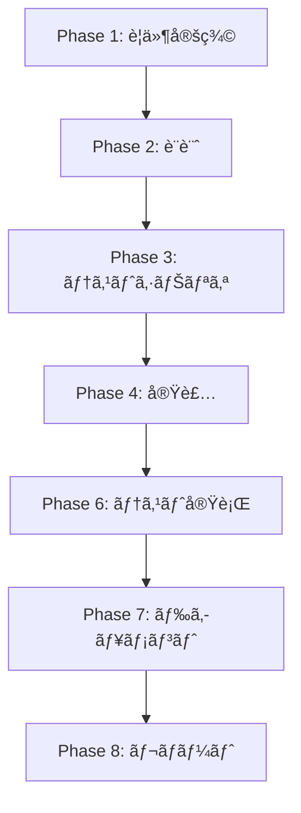
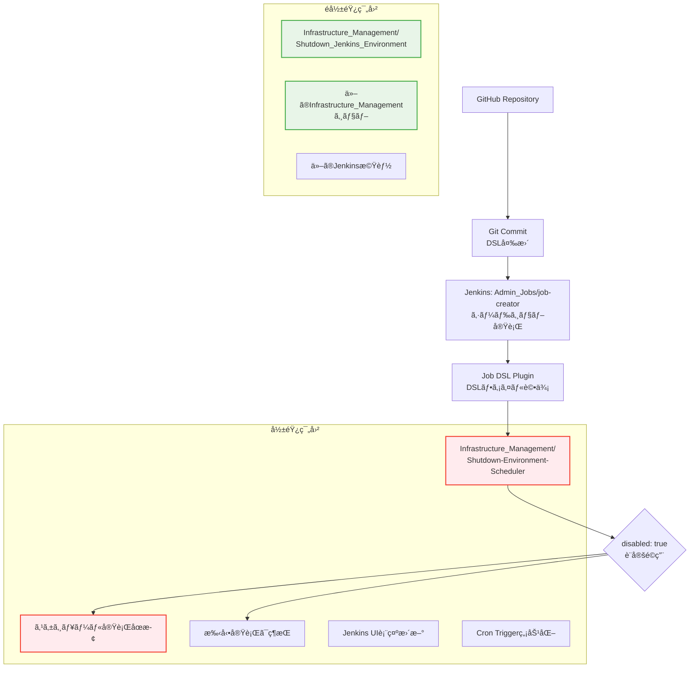

# Codex Agent 実行ログ

開始日時: 2025/12/25 6:22:44

---

## Turn 1: スレッド開始

**Thread ID**: `[REDACTED_TOKEN]`

## Turn 2: ツール実行

**種別**: reasoning
**ステータス**: completed

## Turn 3: ツール実行

**種別**: コãƒãƒ³ãƒ‰å®Ÿè¡Œ
**コãƒãƒ³ãƒ‰**: `/bin/bash -lc pwd`
**ステータス**: completed (exit_code=0)

```text
/tmp/ai-workflow-repos-10-fba0a94c/[REDACTED_TOKEN]
```

## Turn 4: ツール実行

**種別**: reasoning
**ステータス**: completed

## Turn 5: ツール実行

**種別**: コãƒãƒ³ãƒ‰å®Ÿè¡Œ
**コãƒãƒ³ãƒ‰**: `/bin/bash -lc ls`
**ステータス**: completed (exit_code=0)

```text
ARCHITECTURE.md
CLAUDE.md
CONTRIBUTION.md
LICENSE
README.md
ansible
bootstrap
docker
docs
jenkins
pulumi
run_tests_issue_322.sh
scripts
tests
```

## Turn 6: ツール実行

**種別**: reasoning
**ステータス**: completed

## Turn 7: ツール実行

**種別**: コãƒãƒ³ãƒ‰å®Ÿè¡Œ
**コãƒãƒ³ãƒ‰**: `/bin/bash -lc 'ls -a'`
**ステータス**: completed (exit_code=0)

```text
.
..
.ai-workflow
.claude
.coverage
.git
.github
.gitignore
ARCHITECTURE.md
CLAUDE.md
CONTRIBUTION.md
LICENSE
README.md
ansible
bootstrap
docker
docs
jenkins
pulumi
run_tests_issue_322.sh
scripts
tests
```

## Turn 8: ツール実行

**種別**: reasoning
**ステータス**: completed

## Turn 9: ツール実行

**種別**: コãƒãƒ³ãƒ‰å®Ÿè¡Œ
**コãƒãƒ³ãƒ‰**: `/bin/bash -lc 'ls .ai-workflow'`
**ステータス**: completed (exit_code=0)

```text
issue-193
issue-304
issue-305
issue-310
issue-313
issue-315
issue-317
issue-319
issue-320
issue-322
issue-324
issue-331
issue-332
issue-355
issue-360
issue-362
issue-363
issue-369
issue-370
issue-396
issue-398
issue-405
issue-411
issue-415
issue-423
issue-431
issue-437
issue-440
issue-445
issue-453
issue-455
issue-456
issue-460
issue-461
issue-462
issue-463
issue-464
issue-465
issue-475
issue-477
issue-479
issue-526
```

## Turn 10: ツール実行

**種別**: reasoning
**ステータス**: completed

## Turn 11: ツール実行

**種別**: コãƒãƒ³ãƒ‰å®Ÿè¡Œ
**コãƒãƒ³ãƒ‰**: `/bin/bash -lc 'ls .ai-workflow/issue-526'`
**ステータス**: completed (exit_code=0)

```text
00_planning
01_requirements
02_design
03_test_scenario
04_implementation
metadata.json
metadata.json.[REDACTED_TOKEN]
```

## Turn 12: ツール実行

**種別**: reasoning
**ステータス**: completed

## Turn 13: ツール実行

**種別**: コãƒãƒ³ãƒ‰å®Ÿè¡Œ
**コãƒãƒ³ãƒ‰**: `/bin/bash -lc 'cat .ai-workflow/issue-526/00_planning/output/planning.md'`
**ステータス**: completed (exit_code=0)

```text
# プロジェクト計画書 - Issue #526

## タスク概è¦
環境åœæ­¢ã‚¹ã‚±ã‚¸ãƒ¥ãƒ¼ãƒ©ãƒ¼ã‚¸ãƒ§ãƒ–ã®ç„¡åŠ¹åŒ–

## 📋 Issue分æ

### 複雑度: ç°¡å˜
- **対象**: å˜ä¸€ãƒ•ã‚¡ã‚¤ãƒ«ï¼ˆDSLファイル）ã®1行修正
- **変更範囲**: `disabled`設定ã®å¤‰æ›´ã®ã¿
- **影響**: ジョブã®æœ‰åŠ¹/無効状態変更（リソースレベルã®å¤‰æ›´ãªã—）

### 見ç©ã‚‚り工数: 2~3時間
**根拠**:
- ファイル修正: 5分
- シードジョブ実行: 5分
- 動作確èª: 10分
- ドキュメント更新: 30分
- テストシナリオ作æˆ: 30分
- プロジェクト管ç†ä½œæ¥­: 1時間

### リスク評価: ä½
- 既存ã®ã‚¸ãƒ§ãƒ–設定を変更ã™ã‚‹ã®ã¿
- åœæ­¢æ©Ÿèƒ½ã§ã¯ãªãã€åœæ­¢ã®ã‚¹ã‚±ã‚¸ãƒ¥ãƒ¼ãƒ«æ©Ÿèƒ½ã®ON/OFF
- ロールãƒãƒƒã‚¯ãŒå®¹æ˜“（`disabled(false)`ã«æˆ»ã™ã®ã¿ï¼‰

## ğŸ—ï¸ å®Ÿè£…æˆ¦ç•¥åˆ¤æ–­

### 実装戦略: EXTEND
**判断根拠**:
既存㮠`[REDACTED_TOKEN].groovy` ファイルã®è¨­å®šã‚’拡張（`disabled` プロパティを追加）ã™ã‚‹ãŸã‚。新è¦ãƒ•ã‚¡ã‚¤ãƒ«ä½œæˆã§ã¯ãªãã€æ—¢å­˜ãƒ•ã‚¡ã‚¤ãƒ«ã®æ©Ÿèƒ½æ‹¡å¼µã«ã‚ãŸã‚‹ã€‚

### テスト戦略: INTEGRATION_ONLY
**判断根拠**:
Jenkins DSLã®å¤‰æ›´ã§ã‚ã‚Šã€å˜ä½“テストよりもJenkins環境ã§ã®çµ±åˆãƒ†ã‚¹ãƒˆãŒé‡è¦ã€‚シードジョブ実行→ジョブ作æˆâ†’スケジュール無効化確èªã¨ã„ã†ä¸€é€£ã®æµã‚Œã‚’検証ã™ã‚‹å¿…è¦ãŒã‚る。ビジãƒã‚¹ãƒ­ã‚¸ãƒƒã‚¯ãŒãªãã€BDDã¯ä¸è¦ã€‚

### テストコード戦略: CREATE_TEST
**判断根拠**:
Jenkins DSLã®è¨­å®šå¤‰æ›´ã«å¯¾ã™ã‚‹ãƒ†ã‚¹ãƒˆã¯ã€æ—¢å­˜ã®ãƒ†ã‚¹ãƒˆãƒ•ã‚¡ã‚¤ãƒ«ã«è¿½åŠ ã™ã‚‹ã®ã§ã¯ãªãã€ã“ã®å¤‰æ›´ã«ç‰¹åŒ–ã—ãŸãƒ†ã‚¹ãƒˆã‚·ãƒŠãƒªã‚ªã‚’作æˆã™ã‚‹æ–¹ãŒé©åˆ‡ã€‚Jenkins UI確èªã¨ã‚³ãƒãƒ³ãƒ‰ãƒ™ãƒ¼ã‚¹ã®ç¢ºèªã‚’å«ã‚€æ–°è¦ãƒ†ã‚¹ãƒˆã‚’作æˆã™ã‚‹ã€‚

## 🔠影響範囲分æ

### 既存コードã¸ã®å½±éŸ¿
- **変更対象ファイル**: `jenkins/jobs/dsl/infrastructure-management/[REDACTED_TOKEN].groovy`
- **変更内容**: `disabled(true)`プロパティã®è¿½åŠ 
- **影響範囲**: 該当ジョブã®ã‚¹ã‚±ã‚¸ãƒ¥ãƒ¼ãƒ«å®Ÿè¡Œã®ã¿ï¼ˆä»–ã®ã‚¸ãƒ§ãƒ–ã«ã¯å½±éŸ¿ãªã—）

### ä¾å­˜é–¢ä¿‚ã®å¤‰æ›´
- **æ–°è¦ä¾å­˜**: ãªã—
- **既存ä¾å­˜ã®å¤‰æ›´**: ãªã—
- **注æ„点**: シードジョブ（job-creator）ã®å®Ÿè¡ŒãŒå¿…è¦

### ãƒã‚¤ã‚°ãƒ¬ãƒ¼ã‚·ãƒ§ãƒ³è¦å¦
- **データベーススキーãƒå¤‰æ›´**: ãªã—
- **設定ファイル変更**: Jenkins DSLファイルã®å¤‰æ›´ã®ã¿
- **ãƒãƒƒã‚¯ã‚¢ãƒƒãƒ—**: Git履歴ã«ã‚ˆã‚‹è‡ªå‹•ãƒãƒƒã‚¯ã‚¢ãƒƒãƒ—

## 📈 タスク分割

### Phase 1: è¦ä»¶å®šç¾© (見ç©ã‚‚ã‚Š: 0.5h)

- [x] Task 1-1: è¦ä»¶ã®è©³ç´°åˆ†æ (15分)
  - スケジューラージョブ無効化ã®è¦ä»¶ç¢ºèª
  - 対象環境（dev）ã®ç¢ºèª
  - 影響範囲ã®ç‰¹å®š
- [x] Task 1-2: å—ã‘入れ基準ã®å®šç¾© (15分)
  - ジョブ無効化ã®ç¢ºèªæ–¹æ³•
  - スケジュールåœæ­¢ã®ç¢ºèªæ–¹æ³•
  - ロールãƒãƒƒã‚¯æ‰‹é †ã®ç¢ºèª

### Phase 2: 設計 (見ç©ã‚‚ã‚Š: 0.5h)

- [x] Task 2-1: DSL変更設計 (15分)
  - `disabled(true)`ã®è¿½åŠ å ´æ‰€ç‰¹å®š
  - 設定構文ã®ç¢ºèª
- [x] Task 2-2: シードジョブ実行計画 (15分)
  - job-creatorã®å®Ÿè¡Œæ‰‹é †ç¢ºèª
  - 実行タイミングã®è¨ˆç”»

### Phase 3: テストシナリオ (見ç©ã‚‚ã‚Š: 0.5h)

- [x] Task 3-1: çµ±åˆãƒ†ã‚¹ãƒˆã‚·ãƒŠãƒªã‚ªä½œæˆ (30分)
  - DSL修正→シードジョブ実行→無効化確èªã®æµã‚Œ
  - Jenkins UI確èªæ‰‹é †
  - CLI確èªæ‰‹é †ï¼ˆjenkins-cli.jarã¾ãŸã¯API）

### Phase 4: 実装 (見ç©ã‚‚ã‚Š: 0.25h)

- [ ] Task 4-1: DSLファイル修正 (15分)
  - `[REDACTED_TOKEN].groovy`ã«`disabled(true)`を追加
  - Git差分確èªã¨ã‚³ãƒŸãƒƒãƒˆ

### Phase 5: テストコード実装 (見ç©ã‚‚ã‚Š: ãªã—)

- [ ] Task 5-1: çµ±åˆãƒ†ã‚¹ãƒˆæ‰‹é †æ›¸ä½œæˆ (0分)
  - ã“ã®å¤‰æ›´ã§ã¯è‡ªå‹•åŒ–ã•ã‚ŒãŸãƒ†ã‚¹ãƒˆã‚³ãƒ¼ãƒ‰ã§ã¯ãªãã€æ‰‹å‹•ç¢ºèªæ‰‹é †ã‚’作æˆ

### Phase 6: テスト実行 (見ç©ã‚‚ã‚Š: 0.5h)

- [ ] Task 6-1: シードジョブ実行 (10分)
  - Jenkins UIã‹ã‚‰ job-creator を手動実行
  - 実行ログã®ç¢ºèª
- [ ] Task 6-2: ã‚¸ãƒ§ãƒ–ç„¡åŠ¹åŒ–ç¢ºèª (10分)
  - Jenkins UIã§ã®ç„¡åŠ¹çŠ¶æ…‹ç¢ºèª
  - スケジュール設定ã®ç¢ºèª
- [ ] Task 6-3: å›å¸°ãƒ†ã‚¹ãƒˆ (10分)
  - ä»–ã®ã‚¤ãƒ³ãƒ•ãƒ©ç®¡ç†ã‚¸ãƒ§ãƒ–ã¸ã®å½±éŸ¿ç¢ºèª
  - 手動åœæ­¢ã‚¸ãƒ§ãƒ–ãŒæ­£å¸¸å‹•ä½œã™ã‚‹ã“ã¨ã®ç¢ºèª

### Phase 7: ドキュメント (見ç©ã‚‚ã‚Š: 0.5h)

- [ ] Task 7-1: README.md更新 (15分)
  - 自動åœæ­¢æ©Ÿèƒ½ã®ç„¡åŠ¹åŒ–ã«ã¤ã„ã¦è¨˜è¼‰
  - 手動åœæ­¢ã®æ‰‹é †ã‚’æ˜è¨˜
- [ ] Task 7-2: Jenkins設定ドキュメント更新 (15分)
  - jenkins/README.mdã®æ›´æ–°ï¼ˆå¿…è¦ã«å¿œã˜ã¦ï¼‰
  - é‹ç”¨æ‰‹é †ã®å¤‰æ›´ç‚¹å映

### Phase 8: レãƒãƒ¼ãƒˆ (見ç©ã‚‚ã‚Š: 0.25h)

- [ ] Task 8-1: 実装完了レãƒãƒ¼ãƒˆä½œæˆ (15分)
  - 変更内容ã®è¦ç´„
  - 動作確èªçµæœ
  - 今後ã®é‹ç”¨ã«ã¤ã„ã¦

## 📊 ä¾å­˜é–¢ä¿‚



注æ„: Phase 5（テストコード実装）ã¯Jenkins DSLã®å¤‰æ›´ã®ãŸã‚ã€è‡ªå‹•åŒ–テストã§ã¯ãªã手動確èªæ‰‹é †æ›¸ã¨ã—㦠Phase 3 ã«å«ã¾ã‚Œã¾ã™ã€‚

## âš ï¸ ãƒªã‚¹ã‚¯ã¨è»½æ¸›ç­–

### リスク1: シードジョブ実行失敗
- **影響度**: 中
- **確ç‡**: ä½
- **軽減策**:
  - 事å‰ã«job-creatorã®æ­£å¸¸å‹•ä½œã‚’確èª
  - Jenkins管ç†è€…権é™ã§ã®ã‚¢ã‚¯ã‚»ã‚¹ç¢ºä¿
  - ロールãƒãƒƒã‚¯ç”¨ã®Git revert準備

### リスク2: 既存ジョブã¸ã®æ„図ã—ãªã„影響
- **影響度**: ä½
- **確ç‡**: ä½
- **軽減策**:
  - DSLファイルã®å¤‰æ›´ç¯„囲を最å°é™ã«é™å®š
  - ä»–ã®ã‚¤ãƒ³ãƒ•ãƒ©ç®¡ç†ã‚¸ãƒ§ãƒ–ã®å‹•ä½œç¢ºèªã‚’実施
  - 変更å‰ã®è¨­å®šã‚’Gitã§è¨˜éŒ²

### リスク3: スケジュール無効化ã®ç¢ºèªæ¼ã‚Œ
- **影響度**: 中
- **確ç‡**: ä½
- **軽減策**:
  - Jenkins UIã¨APIã®ä¸¡æ–¹ã§ç¢ºèª
  - 次å›ã‚¹ã‚±ã‚¸ãƒ¥ãƒ¼ãƒ«æ™‚刻ã®ç¢ºèª
  - 1週間後ã®å‹•ä½œç¢ºèª

### リスク4: ドキュメント更新æ¼ã‚Œ
- **影響度**: ä½
- **確ç‡**: 中
- **軽減策**:
  - 関連ドキュメントã®ãƒªã‚¹ãƒˆã‚¢ãƒƒãƒ—
  - 変更点をæ˜ç¢ºã«è¨˜è¼‰
  - レビューフェーズã§ã®ç¢ºèª

## 🯠å“質ゲート

### Phase 1: è¦ä»¶å®šç¾©
- [x] スケジューラージョブã®ç„¡åŠ¹åŒ–è¦ä»¶ãŒæ˜ç¢ºã«è¨˜è¼‰ã•ã‚Œã¦ã„ã‚‹
- [x] 対象環境（dev）ãŒç‰¹å®šã•ã‚Œã¦ã„ã‚‹
- [x] å—ã‘入れ基準（ジョブ無効化ã€ã‚¹ã‚±ã‚¸ãƒ¥ãƒ¼ãƒ«åœæ­¢ï¼‰ãŒå®šç¾©ã•ã‚Œã¦ã„ã‚‹
- [x] 手動åœæ­¢ã®ä»£æ›¿æ‰‹é †ãŒç¢ºèªã•ã‚Œã¦ã„ã‚‹

### Phase 2: 設計
- [x] 実装戦略（EXTEND）ã®åˆ¤æ–­æ ¹æ‹ ãŒæ˜è¨˜ã•ã‚Œã¦ã„ã‚‹
- [x] テスト戦略（INTEGRATION_ONLY）ã®åˆ¤æ–­æ ¹æ‹ ãŒæ˜è¨˜ã•ã‚Œã¦ã„ã‚‹
- [x] テストコード戦略（CREATE_TEST）ã®åˆ¤æ–­æ ¹æ‹ ãŒæ˜è¨˜ã•ã‚Œã¦ã„ã‚‹
- [x] DSL変更箇所ãŒç‰¹å®šã•ã‚Œã¦ã„ã‚‹
- [x] シードジョブ実行手順ãŒè¨ˆç”»ã•ã‚Œã¦ã„ã‚‹

### Phase 3: テストシナリオ
- [x] çµ±åˆãƒ†ã‚¹ãƒˆã‚·ãƒŠãƒªã‚ªãŒä½œæˆã•ã‚Œã¦ã„ã‚‹
- [x] Jenkins UI確èªæ‰‹é †ãŒè¨˜è¼‰ã•ã‚Œã¦ã„ã‚‹
- [x] CLI/API確èªæ‰‹é †ãŒè¨˜è¼‰ã•ã‚Œã¦ã„ã‚‹
- [x] å›å¸°ãƒ†ã‚¹ãƒˆã®ç¯„囲ãŒå®šç¾©ã•ã‚Œã¦ã„ã‚‹

### Phase 4: 実装
- [ ] `disabled(true)`ãŒDSLファイルã«è¿½åŠ ã•ã‚Œã¦ã„ã‚‹
- [ ] 構文エラーãŒãªã„
- [ ] Git コミットãŒé©åˆ‡ã«è¡Œã‚ã‚Œã¦ã„ã‚‹

### Phase 6: テスト実行
- [ ] シードジョブãŒæ­£å¸¸
... (truncated)
```

## Turn 14: ツール実行

**種別**: reasoning
**ステータス**: completed

## Turn 15: ツール実行

**種別**: コãƒãƒ³ãƒ‰å®Ÿè¡Œ
**コãƒãƒ³ãƒ‰**: `/bin/bash -lc 'cat .ai-workflow/issue-526/04_implementation/output/implementation.md'`
**ステータス**: completed (exit_code=0)

```text
# 実装完了レãƒãƒ¼ãƒˆ

## 変更ファイル一覧

| ファイル | 変更種別 | æ¦‚è¦ |
|---------|---------|------|
| `jenkins/jobs/dsl/infrastructure-management/[REDACTED_TOKEN].groovy` | 修正 | `disabled(true)` を追加ã—ã¦ã‚¹ã‚±ã‚¸ãƒ¥ãƒ¼ãƒ«å¯¾è±¡ã‚¸ãƒ§ãƒ–を無効化ã—ã€ãƒˆãƒªã‚¬ãƒ¼è¨­å®šã‚„手動実行ã¯ãã®ã¾ã¾ç¶­æŒ |
| `.ai-workflow/issue-526/04_implementation/output/implementation.md` | æ–°è¦ | 実装ログã¨ã—ã¦æœ¬æ›¸ã‚’追加 |

## 主è¦ãªå¤‰æ›´ç‚¹
- 環境自動åœæ­¢ã‚¹ã‚±ã‚¸ãƒ¥ãƒ¼ãƒ©ãƒ¼ã‚¸ãƒ§ãƒ–ã®DSL㧠`disabled(true)` ã‚’æ˜ç¤ºçš„ã«è¨­å®šã—ã¦ã€ãƒˆãƒªã‚¬ãƒ¼ã¯æ®‹ã—ã¤ã¤è‡ªå‹•å®Ÿè¡Œã‚’åœæ­¢ã—ãŸ
- トリガーやラッパーã€ãƒ“ルドステップã®æ§‹æˆã¯å¤‰æ›´ã›ãšã€æ—¢å­˜ã®æ‰‹å‹•èµ·å‹•ã¨ãƒ‘ラメータ設定を引ã続ã利用å¯èƒ½ã«ã—ãŸ
- 実装ログを `.ai-workflow/issue-526/04_implementation/output/implementation.md` ã«è¨˜éŒ²ã—ã€Phase 4 ã®æˆæœã‚’ä¿å­˜ã—ãŸ

## テスト実施状æ³
- ビルド: ⌠未実施（Jenkins環境ãŒå¿…è¦ãªãŸã‚手動確èªã‚’予定）
- リント: ⌠未実施（該当ã™ã‚‹ã‚³ãƒ¼ãƒ‰ãƒ™ãƒ¼ã‚¹ã¸ã®ãƒªãƒ³ã‚¿ãŒè¨­å®šã•ã‚Œã¦ã„ãªã„）
- 基本動作確èª: 未実施（本番Jenkins環境ã§ã®ã‚·ãƒ¼ãƒ‰ã‚¸ãƒ§ãƒ–実行ã¨UI確èªãŒå¿…è¦ï¼‰
```

## Turn 16: ツール実行

**種別**: reasoning
**ステータス**: completed

## Turn 17: ツール実行

**種別**: コãƒãƒ³ãƒ‰å®Ÿè¡Œ
**コãƒãƒ³ãƒ‰**: `/bin/bash -lc "sed -n '1,200p' jenkins/jobs/dsl/infrastructure-management/[REDACTED_TOKEN].groovy"`
**ステータス**: completed (exit_code=0)

```text
/**
 * Infrastructure Shutdown Scheduler Job DSL
 * 
 * 日本時間åˆå‰0時ã«ç’°å¢ƒåœæ­¢ã‚¸ãƒ§ãƒ–を自動実行ã™ã‚‹ã‚¹ã‚±ã‚¸ãƒ¥ãƒ¼ãƒ©ãƒ¼ã‚¸ãƒ§ãƒ–
 * 既存ã®åœæ­¢ã‚¸ãƒ§ãƒ–をトリガーã™ã‚‹freestyleジョブ
 */

def folderPath = 'Infrastructure_Management'
def jobName = 'Shutdown-Environment-Scheduler'
def fullJobName = "${folderPath}/${jobName}"

freeStyleJob(fullJobName) {
    displayName('環境自動åœæ­¢ã‚¹ã‚±ã‚¸ãƒ¥ãƒ¼ãƒ©ãƒ¼')
    description('''
        |開発環境をæ¯æ—¥å®šæ™‚ã«è‡ªå‹•åœæ­¢ã™ã‚‹ã‚¹ã‚±ã‚¸ãƒ¥ãƒ¼ãƒ©ãƒ¼ã‚¸ãƒ§ãƒ–ã§ã™ã€‚
        |
        |実行タイミング:
        |- 日本時間（JST）åˆå‰0時
        |- æ¯æ—¥å®Ÿè¡Œï¼ˆåœŸæ—¥ç¥æ—¥å«ã‚€ï¼‰
        |
        |実行内容:
        |- Infrastructure_Management/Shutdown_Jenkins_Environment ジョブをトリガー
        |- 環境: dev
        |- モード: graceful（実行中ジョブã®å®Œäº†ã‚’å¾…ã¤ï¼‰
        |
        |注æ„事項:
        |- 本番環境ã¯å¯¾è±¡å¤–（dev環境ã®ã¿ï¼‰
        |- 土日ç¥æ—¥ã‚‚å«ã‚ã¦æ¯æ—¥è‡ªå‹•åœæ­¢ã—ã¾ã™
    '''.stripMargin())

    disabled(true)  // ジョブを無効化ã—ã€ã‚¹ã‚±ã‚¸ãƒ¥ãƒ¼ãƒ«å®Ÿè¡Œã‚’åœæ­¢

    // トリガー設定
    triggers {
        // 日本時間åˆå‰0時ã«å®Ÿè¡Œï¼ˆUTC 15:00）
        // H: Hash（負è·åˆ†æ•£ã®ãŸã‚0-59分ã®é–“ã§ãƒ©ãƒ³ãƒ€ãƒ ã«å®Ÿè¡Œï¼‰
        // æ¯æ—¥å®Ÿè¡Œ: *（全曜日）
        cron('H 15 * * *')  // UTC 15:00 = JST 00:00ã€æ¯æ—¥
    }

    // 並行実行を無効化
    concurrentBuild(false)

    // ビルド履歴ã®ä¿æŒè¨­å®š
    logRotator {
        daysToKeep(30)      // 30日間ä¿æŒ
        numToKeep(90)       // 最大90ビルドä¿æŒ
    }

    // ビルドステップã¯ç©ºï¼ˆãƒã‚¹ãƒˆãƒ“ルドã§å®Ÿè¡Œã™ã‚‹ãŸã‚）
    steps {
        shell('echo "環境åœæ­¢ã‚¸ãƒ§ãƒ–をトリガーã—ã¾ã™..."')
    }
    
    // ãƒã‚¹ãƒˆãƒ“ルドアクション - éåŒæœŸã§ã‚¸ãƒ§ãƒ–をトリガー
    publishers {
        // ä»–ã®ã‚¸ãƒ§ãƒ–をトリガー（待機ãªã—）
        [REDACTED_TOKEN] {
            trigger('Infrastructure_Management/Shutdown_Jenkins_Environment') {
                // æ¡ä»¶: 常ã«å®Ÿè¡Œ
                condition('ALWAYS')
                
                // 固定パラメータを設定
                parameters {
                    predefinedProp('ENVIRONMENT', 'dev')
                    predefinedProp('AWS_REGION', 'ap-northeast-1')
                    predefinedProp('SHUTDOWN_MODE', 'graceful')
                    predefinedProp('[REDACTED_TOKEN]', '30')
                    booleanParam('CONFIRM_SHUTDOWN', true)
                    booleanParam('DRY_RUN', false)
                }
                
                // çµæœã‚’å¾…ãŸãªã„（éåŒæœŸå®Ÿè¡Œï¼‰
                [REDACTED_TOKEN](false)
            }
        }
    }

    // ビルドラッパー
    wrappers {
        timestamps()
        
        // タイムアウト設定（åœæ­¢ã‚¸ãƒ§ãƒ–ãŒé•·å¼•ã„ãŸå ´åˆã®ä¿é™ºï¼‰
        timeout {
            absolute(60)  // 最大60分
            failBuild()
        }
        
        // ビルドåã®è¨­å®š
        buildName('#${BUILD_NUMBER} - Scheduled Shutdown [dev]')
    }

    // 環境変数
    [REDACTED_TOKEN] {
        env('TZ', 'Asia/Tokyo')
    }
}
```

## Turn 18: ツール実行

**種別**: reasoning
**ステータス**: completed

## Turn 19: ツール実行

**種別**: コãƒãƒ³ãƒ‰å®Ÿè¡Œ
**コãƒãƒ³ãƒ‰**: `/bin/bash -lc 'cat .ai-workflow/issue-526/02_design/output/design.md'`
**ステータス**: completed (exit_code=0)

```text
# 詳細設計書 - Issue #526

## 環境åœæ­¢ã‚¹ã‚±ã‚¸ãƒ¥ãƒ¼ãƒ©ãƒ¼ã‚¸ãƒ§ãƒ–ã®ç„¡åŠ¹åŒ–

---

## 0. Planning Document 確èª

本詳細設計㯠Planning Phase（`.ai-workflow/issue-526/00_planning/output/planning.md`）ã§ç­–定ã•ã‚ŒãŸé–‹ç™ºè¨ˆç”»ã«åŸºã¥ã„ã¦ä½œæˆã•ã‚Œã¦ã„ã¾ã™ã€‚

### Planning Phase ã§ç¢ºèªã•ã‚ŒãŸæˆ¦ç•¥
- **実装戦略**: EXTEND（既存ファイルã®æ©Ÿèƒ½æ‹¡å¼µï¼‰
- **テスト戦略**: INTEGRATION_ONLY（Jenkins環境ã§ã®çµ±åˆãƒ†ã‚¹ãƒˆï¼‰
- **テストコード戦略**: CREATE_TEST（新è¦ãƒ†ã‚¹ãƒˆã‚·ãƒŠãƒªã‚ªä½œæˆï¼‰
- **複雑度**: ç°¡å˜ï¼ˆå˜ä¸€ãƒ•ã‚¡ã‚¤ãƒ«ã®1行修正）
- **工数見ç©**: 2-3時間
- **リスク評価**: ä½

---

## 1. アーキテクãƒãƒ£è¨­è¨ˆ

### 1.1 システム全体図



### 1.2 コンãƒãƒ¼ãƒãƒ³ãƒˆé–“ã®é–¢ä¿‚

| コンãƒãƒ¼ãƒãƒ³ãƒˆ | 役割 | 変更対象 |
|---------------|------|----------|
| **[REDACTED_TOKEN].groovy** | スケジューラージョブã®DSL定義 | **修正対象** |
| **job-creator（シードジョブ）** | DSL変更をJenkinsã«å映 | 実行ã®ã¿ |
| **Shutdown-Environment-Scheduler** | スケジューラージョブ本体 | 設定変更 |
| **Shutdown_Jenkins_Environment** | 実際ã®åœæ­¢å‡¦ç† | **変更ãªã—** |

### 1.3 データフロー

```
ç¾åœ¨ã®çŠ¶æ…‹:
æ¯æ—¥ JST 00:00 (UTC 15:00)
  ↓ Cron Trigger
Shutdown-Environment-Scheduler (有効)
  ↓ éåŒæœŸãƒˆãƒªã‚¬ãƒ¼
Shutdown_Jenkins_Environment
  ↓
dev環境åœæ­¢

変更後ã®çŠ¶æ…‹:
æ¯æ—¥ JST 00:00 (UTC 15:00)
  ↓ Cron Trigger (無効)
Shutdown-Environment-Scheduler (disabled: true)
  ↓ トリガーãªã—
（自動åœæ­¢ãªã—）

手動実行時:
Jenkins UIæ“作
  ↓ 手動実行
Shutdown-Environment-Scheduler
  ↓ éåŒæœŸãƒˆãƒªã‚¬ãƒ¼
Shutdown_Jenkins_Environment
  ↓
dev環境åœæ­¢
```

---

## 2. 実装戦略判断

### 実装戦略: EXTEND

**判断根拠**:
- 既存㮠`[REDACTED_TOKEN].groovy` ファイル㫠`disabled(true)` プロパティを追加ã™ã‚‹æ‹¡å¼µä½œæ¥­
- æ–°è¦ãƒ•ã‚¡ã‚¤ãƒ«ä½œæˆã§ã¯ãªãã€æ—¢å­˜ãƒ•ã‚¡ã‚¤ãƒ«ã®æ©Ÿèƒ½æ‹¡å¼µï¼ˆç„¡åŠ¹åŒ–機能ã®è¿½åŠ ï¼‰
- Jenkins Job DSL ã®æ¨™æº–çš„ãªãƒ—ロパティ追加ã«ã‚ˆã‚‹æ©Ÿèƒ½æ‹¡å¼µ

---

## 3. テスト戦略判断

### テスト戦略: INTEGRATION_ONLY

**判断根拠**:
- Jenkins DSL ã®å¤‰æ›´ã§ã‚ã‚Šã€å˜ä½“テストよりもJenkins環境ã§ã®çµ±åˆãƒ†ã‚¹ãƒˆãŒé‡è¦
- シードジョブ実行→ジョブ作æˆâ†’スケジュール無効化確èªã¨ã„ã†ä¸€é€£ã®æµã‚Œã‚’検証ã™ã‚‹å¿…è¦ãŒã‚ã‚‹
- ビジãƒã‚¹ãƒ­ã‚¸ãƒƒã‚¯ãŒãªãã€BDDã¯ä¸è¦ï¼ˆã‚¤ãƒ³ãƒ•ãƒ©è¨­å®šå¤‰æ›´ã®ã¿ï¼‰
- Jenkins ã® Job DSL Pluginã€Cron Triggerã€UI表示ã®çµ±åˆçš„ãªå‹•ä½œç¢ºèªãŒå¿…è¦

---

## 4. テストコード戦略判断

### テストコード戦略: CREATE_TEST

**判断根拠**:
- Jenkins DSL ã®è¨­å®šå¤‰æ›´ã«å¯¾ã™ã‚‹ãƒ†ã‚¹ãƒˆã¯ã€æ—¢å­˜ã®ãƒ†ã‚¹ãƒˆãƒ•ã‚¡ã‚¤ãƒ«ã«è¿½åŠ ã™ã‚‹ã®ã§ã¯ãªãã€ã“ã®å¤‰æ›´ã«ç‰¹åŒ–ã—ãŸãƒ†ã‚¹ãƒˆã‚·ãƒŠãƒªã‚ªã‚’作æˆã™ã‚‹æ–¹ãŒé©åˆ‡
- Jenkins UI 確èªã¨ CLI/API ベースã®ç¢ºèªã‚’å«ã‚€æ–°è¦ãƒ†ã‚¹ãƒˆãŒå¿…è¦
- インフラ管ç†ã‚¸ãƒ§ãƒ–ã®ç‰¹æ®Šæ€§ï¼ˆæ‰‹å‹•å®Ÿè¡Œã€ã‚¹ã‚±ã‚¸ãƒ¥ãƒ¼ãƒ«ç¢ºèªã€å›å¸°ãƒ†ã‚¹ãƒˆï¼‰ã«å¯¾å¿œã—ãŸç‹¬ç«‹ã—ãŸãƒ†ã‚¹ãƒˆæ‰‹é †

---

## 5. 影響範囲分æ

### 5.1 既存コードã¸ã®å½±éŸ¿

#### 5.1.1 ç›´æ¥çš„ãªå½±éŸ¿

| ファイル | 変更内容 | 影響度 |
|---------|----------|--------|
| `jenkins/jobs/dsl/infrastructure-management/[REDACTED_TOKEN].groovy` | `disabled(true)` 追加 | **高** |
| Jenkins 設定データベース | ジョブ設定ã®æ›´æ–° | 中 |
| Jenkins UI | 無効化アイコンã®è¡¨ç¤º | ä½ |

#### 5.1.2 é–“æ¥çš„ãªå½±éŸ¿

| 機能・コンãƒãƒ¼ãƒãƒ³ãƒˆ | 影響内容 | 対応è¦å¦ |
|-------------------|----------|----------|
| **自動åœæ­¢ã‚¹ã‚±ã‚¸ãƒ¥ãƒ¼ãƒ«** | æ¯æ—¥00:00ã®è‡ªå‹•å®Ÿè¡Œåœæ­¢ | ãªã—（æ„図ã•ã‚ŒãŸå¤‰æ›´ï¼‰ |
| **手動環境åœæ­¢** | 変更ãªã—（引ã続ã利用å¯èƒ½ï¼‰ | ãªã— |
| **開発環境ã®é‹ç”¨** | 常時稼åƒã¸ã®å¤‰æ›´ | **é‹ç”¨ãƒ«ãƒ¼ãƒ«æ›´æ–°** |
| **コスト管ç†** | 自動åœæ­¢ãªã—ã«ã‚ˆã‚‹è²»ç”¨å¢— | **監視強化æ¨å¥¨** |

### 5.2 ä¾å­˜é–¢ä¿‚ã®å¤‰æ›´

#### 5.2.1 アップストリームä¾å­˜é–¢ä¿‚

```
GitHub Repository (DSL変更)
  ↓
Git Commit & Push
  ↓
job-creator 手動実行
  ↓
Job DSL Plugin
  ↓
Jenkins 設定更新
```

**ä¾å­˜é–¢ä¿‚**: 変更ãªã—（既存ã®å映フローを利用）

#### 5.2.2 ダウンストリームä¾å­˜é–¢ä¿‚

```
Shutdown-Environment-Scheduler (無効化)
  ↓ トリガー関係ãŒå¤‰æ›´
Shutdown_Jenkins_Environment (変更ãªã—)
  ↓ åœæ­¢å¯¾è±¡ã¯ç¶­æŒ
dev環境リソース（EC2, SpotFleet, EFS等）
```

**変更点**: スケジューラーã‹ã‚‰ã®ãƒˆãƒªã‚¬ãƒ¼ãŒãªããªã‚‹ã®ã¿

### 5.3 ãƒã‚¤ã‚°ãƒ¬ãƒ¼ã‚·ãƒ§ãƒ³è¦å¦

#### 5.3.1 データベーススキーãƒå¤‰æ›´
- **ãªã—**: Jenkins ã®è¨­å®šãƒ‡ãƒ¼ã‚¿ãƒ™ãƒ¼ã‚¹ã¯æ—¢å­˜ã®ã‚¹ã‚­ãƒ¼ãƒã‚’使用

#### 5.3.2 設定ファイル変更
- **対象**: Jenkins Job DSL ファイルã®å¤‰æ›´ã®ã¿
- **ãƒãƒƒã‚¯ã‚¢ãƒƒãƒ—**: Git 履歴ã«ã‚ˆã‚‹è‡ªå‹•ãƒãƒƒã‚¯ã‚¢ãƒƒãƒ—

#### 5.3.3 環境間ã®è¨­å®šåŒæœŸ
- **dev環境**: 対象（Issue ã®è¦ä»¶ï¼‰
- **staging/prod環境**: 対象外（å„環境ã§å€‹åˆ¥åˆ¤æ–­ï¼‰

---

## 6. 変更・追加ファイルリスト

### 6.1 修正ãŒå¿…è¦ãªæ—¢å­˜ãƒ•ã‚¡ã‚¤ãƒ«

| ファイルパス | 変更内容 | 変更行数 |
|------------
... (truncated)
```

## Turn 20: ツール実行

**種別**: reasoning
**ステータス**: completed

## Turn 21: ツール実行

**種別**: コãƒãƒ³ãƒ‰å®Ÿè¡Œ
**コãƒãƒ³ãƒ‰**: `/bin/bash -lc 'cat .ai-workflow/issue-526/03_test_scenario/output/test-scenario.md'`
**ステータス**: completed (exit_code=0)

```text
# テストシナリオ - Issue #526

## 環境åœæ­¢ã‚¹ã‚±ã‚¸ãƒ¥ãƒ¼ãƒ©ãƒ¼ã‚¸ãƒ§ãƒ–ã®ç„¡åŠ¹åŒ–

---

## 0. Planning Document 確èª

本テストシナリオ㯠Planning Phase（`.ai-workflow/issue-526/00_planning/output/planning.md`）ã§ç­–定ã•ã‚ŒãŸé–‹ç™ºè¨ˆç”»ã«åŸºã¥ã„ã¦ä½œæˆã•ã‚Œã¦ã„ã¾ã™ã€‚

### Planning Phase ã§ç¢ºèªã•ã‚ŒãŸæˆ¦ç•¥
- **実装戦略**: EXTEND（既存ファイルã®æ©Ÿèƒ½æ‹¡å¼µï¼‰
- **テスト戦略**: INTEGRATION_ONLY（Jenkins環境ã§ã®çµ±åˆãƒ†ã‚¹ãƒˆï¼‰
- **テストコード戦略**: CREATE_TEST（新è¦ãƒ†ã‚¹ãƒˆã‚·ãƒŠãƒªã‚ªä½œæˆï¼‰
- **複雑度**: ç°¡å˜ï¼ˆå˜ä¸€ãƒ•ã‚¡ã‚¤ãƒ«ã®1行修正）
- **工数見ç©**: 2-3時間
- **リスク評価**: ä½

---

## 1. テスト戦略サãƒãƒªãƒ¼

### 1.1 é¸æŠã•ã‚ŒãŸãƒ†ã‚¹ãƒˆæˆ¦ç•¥: INTEGRATION_ONLY

**判断根拠**:
- Jenkins DSL ã®å¤‰æ›´ã§ã‚ã‚Šã€å˜ä½“テストよりもJenkins環境ã§ã®çµ±åˆãƒ†ã‚¹ãƒˆãŒé‡è¦
- シードジョブ実行→ジョブ作æˆâ†’スケジュール無効化確èªã¨ã„ã†ä¸€é€£ã®æµã‚Œã‚’検証ã™ã‚‹å¿…è¦ãŒã‚ã‚‹
- ビジãƒã‚¹ãƒ­ã‚¸ãƒƒã‚¯ãŒãªãã€BDD ã¯ä¸è¦ï¼ˆã‚¤ãƒ³ãƒ•ãƒ©è¨­å®šå¤‰æ›´ã®ã¿ï¼‰
- Jenkins ã® Job DSL Pluginã€Cron Triggerã€UI表示ã®çµ±åˆçš„ãªå‹•ä½œç¢ºèªãŒå¿…è¦

### 1.2 テスト対象ã®ç¯„囲

#### çµ±åˆå¯¾è±¡ã‚³ãƒ³ãƒãƒ¼ãƒãƒ³ãƒˆ
1. **Git Repository** ↔ **Jenkins DSL ファイル**
2. **Jenkins DSL Plugin** ↔ **シードジョブ（job-creator）**
3. **シードジョブ** ↔ **Shutdown-Environment-Scheduler ジョブ**
4. **Jenkins UI** ↔ **ジョブ設定・表示**
5. **Cron Trigger** ↔ **スケジュール実行**

#### テストフォーカス
- DSL ファイル変更ã‹ã‚‰ã‚¸ãƒ§ãƒ–無効化ã¾ã§ã®ä¸€é€£ã®çµ±åˆãƒ•ãƒ­ãƒ¼
- Jenkins 内部コンãƒãƒ¼ãƒãƒ³ãƒˆé–“ã®é€£æº
- 手動実行機能ã®ç¶­æŒç¢ºèª
- 他ジョブã¸ã®é影響確èª

### 1.3 テストã®ç›®çš„

1. **機能統åˆç¢ºèª**: DSL 変更ãŒæ­£ã—ã Jenkins ジョブ設定ã«å映ã•ã‚Œã‚‹ã“ã¨
2. **スケジュール統åˆç¢ºèª**: Cron Trigger ãŒæ­£ã—ã無効化ã•ã‚Œã‚‹ã“ã¨
3. **UIçµ±åˆç¢ºèª**: Jenkins UI ã§ç„¡åŠ¹åŒ–状態ãŒæ­£ã—ã表示ã•ã‚Œã‚‹ã“ã¨
4. **å›å¸°ç¢ºèª**: ä»–ã®ã‚¸ãƒ§ãƒ–ã«å½±éŸ¿ãŒãªã„ã“ã¨
5. **é‹ç”¨ç¶™ç¶šæ€§ç¢ºèª**: 手動実行機能ãŒç¶­æŒã•ã‚Œã‚‹ã“ã¨

---

## 2. çµ±åˆãƒ†ã‚¹ãƒˆã‚·ãƒŠãƒªã‚ª

### 2.1 テストケース1: DSL修正ã‹ã‚‰ã‚¸ãƒ§ãƒ–無効化ã¾ã§ã®çµ±åˆãƒ•ãƒ­ãƒ¼

**シナリオå**: End-to-End Job Disable Integration

**目的**:
DSL ファイル変更ã‹ã‚‰ã‚·ãƒ¼ãƒ‰ã‚¸ãƒ§ãƒ–実行ã€ã‚¸ãƒ§ãƒ–無効化ã¾ã§ã®ä¸€é€£ã®çµ±åˆãƒ—ロセスãŒæ­£å¸¸ã«å‹•ä½œã™ã‚‹ã“ã¨ã‚’検証

**å‰ææ¡ä»¶**:
- Jenkins 環境ãŒç¨¼åƒã—ã¦ã„ã‚‹
- `[REDACTED_TOKEN].groovy` ãŒå­˜åœ¨ã™ã‚‹
- `Admin_Jobs/job-creator` シードジョブãŒæ­£å¸¸å‹•ä½œã™ã‚‹
- Jenkins 管ç†è€…権é™ã§ã‚¢ã‚¯ã‚»ã‚¹å¯èƒ½

**テスト手順**:

#### Step 1: ç¾åœ¨ã®çŠ¶æ…‹ç¢ºèª
```bash
# 1-1. ç¾åœ¨ã®ã‚¸ãƒ§ãƒ–状態確èª
jenkins-cli get-job "Infrastructure_Management/Shutdown-Environment-Scheduler" | grep -i disabled
# 期待: disabledè¦ç´ ãŒãªã„ã€ã¾ãŸã¯disabled=false

# 1-2. ç¾åœ¨ã®ã‚¹ã‚±ã‚¸ãƒ¥ãƒ¼ãƒ«ç¢ºèª
jenkins-cli get-job "Infrastructure_Management/Shutdown-Environment-Scheduler" | grep -o '<spec>H 15 \* \* \*</spec>'
# 期待: スケジュール設定ãŒå­˜åœ¨

# 1-3. ç¾åœ¨ã®ãƒ“ルド番å·è¨˜éŒ²
BEFORE_BUILD=$(jenkins-cli get-job "Infrastructure_Management/Shutdown-Environment-Scheduler" | grep -o '<nextBuildNumber>[0-9]*</nextBuildNumber>' | grep -o '[0-9]*')
echo "変更å‰ãƒ“ルド番å·: $BEFORE_BUILD"
```

#### Step 2: DSL ファイル修正㨠Git æ“作
```bash
# 2-1. DSL ファイル㫠disabled(true) を追加
echo "    disabled(true)" >> jenkins/jobs/dsl/infrastructure-management/[REDACTED_TOKEN].groovy

# 2-2. 構文確èªï¼ˆåŸºæœ¬ãƒã‚§ãƒƒã‚¯ï¼‰
grep -n "disabled(true)" jenkins/jobs/dsl/infrastructure-management/[REDACTED_TOKEN].groovy
# 期待: 追加ã—ãŸè¡ŒãŒè¡¨ç¤ºã•ã‚Œã‚‹

# 2-3. Git コミット
git add jenkins/jobs/dsl/infrastructure-management/[REDACTED_TOKEN].groovy
git commit -m "[jenkins] update: スケジューラージョブを無効化 (disabled=true) - Issue #526"
```

#### Step 3: シードジョブ実行
```bash
# 3-1. シードジョブ実行
jenkins-cli build "Admin_Jobs/job-creator" -s

# 3-2. 実行çµæœç¢ºèª
SEED_BUILD_NUMBER=$(jenkins-cli get-job "Admin_Jobs/job-creator" | grep -o '<nextBuildNumber>[0-9]*</nextBuildNumber>' | grep -o '[0-9]*')
SEED_BUILD_NUMBER=$((SEED_BUILD_NUMBER - 1))
jenkins-cli console "Admin_Jobs/job-creator" $SEED_BUILD_NUMBER | tail -20
# 期待: SUCCESS ã¨è¡¨ç¤ºã•ã‚Œã‚‹
```

#### Step 4: ジョブ無効化確èª
```bash
# 4-1. Jenkins CLI ã§ã®ã‚¸ãƒ§ãƒ–状態確èª
jenkins-cli get-job "Infrastructure_Management/Shutdown-Environment-Scheduler" | grep "<disabled>true</disabled>"
# 期待: disabled=true ãŒæ¤œå‡ºã•ã‚Œã‚‹

# 4-2. Jenkins UI ã§ã®ç¢ºèªï¼ˆæ‰‹å‹•ï¼‰
# ブラウザ㧠Jenkins ã«ã‚¢ã‚¯ã‚»ã‚¹
# Infrastructure_Management フォルダ → Shutdown-Environment-Scheduler ジョブ
# 期待: ジョブåã®æ¨ªã«ç„¡åŠ¹åŒ–アイコン（グレーアウト）ãŒè¡¨ç¤º
```

#### Step 5: スケジュール無効化確èª
```bash
# 5-1. Trigger 設定ã¯ç¶­æŒã•ã‚Œã¦ã„ã‚‹ãŒç„¡åŠ¹åŒ–ã•ã‚Œã¦ã„ã‚‹ã“ã¨ã‚’確èª
jenkins-cli get-job "Infrastructure_Management/Shutdown-Environment-Scheduler" | grep -A5 -B5 "TimerTrigger"
# 期待: TimerTrigger設定ã¯å­˜åœ¨ã™ã‚‹ãŒã€disabled=trueã«ã‚ˆã‚Šå®Ÿè¡Œã•ã‚Œãªã„

# 5-2. 次å›ã‚¹ã‚±ã‚¸ãƒ¥ãƒ¼ãƒ«æ™‚刻ã§ã®é実行確èªï¼ˆãƒ†ã‚¹ãƒˆæ—¥ã«ã‚ˆã£ã¦èª¿æ•´ï¼‰
# 注æ„: 実際ã®ã‚¹ã‚±ã‚¸ãƒ¥ãƒ¼ãƒ«æ™‚刻（JST 00:00）ã¾ã§å¾…ã¤ã‹ã€æ™‚刻を進ã‚ã¦ãƒ†ã‚¹ãƒˆ
```

**期待çµæœ**:
- シードジョブ㌠SUCCESS ã§å®Œäº†ã™ã‚‹
- `Infrastructure_Management/Shutdown-Environment-Scheduler` ジョブãŒç„¡åŠ¹çŠ¶æ…‹ã«ãªã‚‹
- Jenkins UI ã§ç„¡åŠ¹åŒ–アイコンãŒè¡¨ç¤ºã•ã‚Œã‚‹
- スケジュール実行ãŒåœæ­¢ã™ã‚‹
- DSL 構文エラーãŒç™ºç”Ÿã—ãªã„

**確èªé …ç›®ãƒã‚§ãƒƒã‚¯ãƒªã‚¹ãƒˆ**:
- [ ] シードジョブ実行㌠5分以内㫠SUCCESS ã§å®Œäº†
- [ ] CLI 㧠`<disabled>true</disabled>` ãŒç¢ºèªã§ãã‚‹
- [ ]
... (truncated)
```

## Turn 22: ツール実行

**種別**: reasoning
**ステータス**: completed

## Turn 23: ツール実行

**種別**: コãƒãƒ³ãƒ‰å®Ÿè¡Œ
**コãƒãƒ³ãƒ‰**: `/bin/bash -lc 'git status -sb'`
**ステータス**: completed (exit_code=0)

```text
## ai-workflow/issue-526...origin/ai-workflow/issue-526
 M .ai-workflow/issue-526/metadata.json
?? .ai-workflow/issue-526/00_planning/execute/agent_log_raw.txt
?? .ai-workflow/issue-526/00_planning/execute/prompt.txt
?? .ai-workflow/issue-526/00_planning/review/agent_log_raw.txt
?? .ai-workflow/issue-526/00_planning/review/prompt.txt
?? .ai-workflow/issue-526/01_requirements/execute/agent_log_raw.txt
?? .ai-workflow/issue-526/01_requirements/execute/prompt.txt
?? .ai-workflow/issue-526/01_requirements/review/agent_log_raw.txt
?? .ai-workflow/issue-526/01_requirements/review/prompt.txt
?? .ai-workflow/issue-526/02_design/execute/agent_log_raw.txt
?? .ai-workflow/issue-526/02_design/execute/prompt.txt
?? .ai-workflow/issue-526/02_design/review/agent_log_raw.txt
?? .ai-workflow/issue-526/02_design/review/prompt.txt
?? .ai-workflow/issue-526/03_test_scenario/execute/agent_log_raw.txt
?? .ai-workflow/issue-526/03_test_scenario/execute/prompt.txt
?? .ai-workflow/issue-526/03_test_scenario/review/agent_log_raw.txt
?? .ai-workflow/issue-526/03_test_scenario/review/prompt.txt
?? .ai-workflow/issue-526/04_implementation/execute/agent_log_raw.txt
?? .ai-workflow/issue-526/04_implementation/execute/prompt.txt
?? .ai-workflow/issue-526/04_implementation/review/
```

## Turn 24: ツール実行

**種別**: reasoning
**ステータス**: completed

## Turn 25: ツール実行

**種別**: コãƒãƒ³ãƒ‰å®Ÿè¡Œ
**コãƒãƒ³ãƒ‰**: `/bin/bash -lc 'git log -1 --stat'`
**ステータス**: completed (exit_code=0)

```text
commit [REDACTED_TOKEN]
Author: yuto-takashi <[REDACTED_EMAIL]>
Date:   Thu Dec 25 06:22:43 2025 +0000

    [ai-workflow] Phase 4 (implementation) - execute completed
    
    Issue: #526
    Phase: 4 (implementation)
    Step: execute
    Status: completed
    
    Auto-generated by AI Workflow

 .../04_implementation/execute/agent_log.md         | 1292 ++++++++++++++++++++
 .../04_implementation/output/implementation.md     |   18 +
 .ai-workflow/issue-526/metadata.json               |   23 +-
 .../[REDACTED_TOKEN].groovy   |    4 +-
 4 files changed, 1325 insertions(+), 12 deletions(-)
```

## Turn 26: ツール実行

**種別**: reasoning
**ステータス**: completed

## Turn 27: ツール実行

**種別**: コãƒãƒ³ãƒ‰å®Ÿè¡Œ
**コãƒãƒ³ãƒ‰**: `/bin/bash -lc 'rg -n "Phase 4" -n .ai-workflow/issue-526/00_planning/output/planning.md'`
**ステータス**: failed (exit_code=127)

```text
/bin/bash: line 1: rg: command not found
```

## Turn 28: ツール実行

**種別**: reasoning
**ステータス**: completed

## Turn 29: ツール実行

**種別**: コãƒãƒ³ãƒ‰å®Ÿè¡Œ
**コãƒãƒ³ãƒ‰**: `/bin/bash -lc 'grep -n "Phase 4" -n .ai-workflow/issue-526/00_planning/output/planning.md'`
**ステータス**: completed (exit_code=0)

```text
87:### Phase 4: 実装 (見ç©ã‚‚ã‚Š: 0.25h)
132:    P3 --> P4[Phase 4: 実装]
195:### Phase 4: 実装
```

## Turn 30: ツール実行

**種別**: reasoning
**ステータス**: completed

## Turn 31: ツール実行

**種別**: コãƒãƒ³ãƒ‰å®Ÿè¡Œ
**コãƒãƒ³ãƒ‰**: `/bin/bash -lc "sed -n '80,110p' .ai-workflow/issue-526/00_planning/output/planning.md"`
**ステータス**: completed (exit_code=0)

```text
### Phase 3: テストシナリオ (見ç©ã‚‚ã‚Š: 0.5h)

- [x] Task 3-1: çµ±åˆãƒ†ã‚¹ãƒˆã‚·ãƒŠãƒªã‚ªä½œæˆ (30分)
  - DSL修正→シードジョブ実行→無効化確èªã®æµã‚Œ
  - Jenkins UI確èªæ‰‹é †
  - CLI確èªæ‰‹é †ï¼ˆjenkins-cli.jarã¾ãŸã¯API）

### Phase 4: 実装 (見ç©ã‚‚ã‚Š: 0.25h)

- [ ] Task 4-1: DSLファイル修正 (15分)
  - `[REDACTED_TOKEN].groovy`ã«`disabled(true)`を追加
  - Git差分確èªã¨ã‚³ãƒŸãƒƒãƒˆ

### Phase 5: テストコード実装 (見ç©ã‚‚ã‚Š: ãªã—)

- [ ] Task 5-1: çµ±åˆãƒ†ã‚¹ãƒˆæ‰‹é †æ›¸ä½œæˆ (0分)
  - ã“ã®å¤‰æ›´ã§ã¯è‡ªå‹•åŒ–ã•ã‚ŒãŸãƒ†ã‚¹ãƒˆã‚³ãƒ¼ãƒ‰ã§ã¯ãªãã€æ‰‹å‹•ç¢ºèªæ‰‹é †ã‚’作æˆ

### Phase 6: テスト実行 (見ç©ã‚‚ã‚Š: 0.5h)

- [ ] Task 6-1: シードジョブ実行 (10分)
  - Jenkins UIã‹ã‚‰ job-creator を手動実行
  - 実行ログã®ç¢ºèª
- [ ] Task 6-2: ã‚¸ãƒ§ãƒ–ç„¡åŠ¹åŒ–ç¢ºèª (10分)
  - Jenkins UIã§ã®ç„¡åŠ¹çŠ¶æ…‹ç¢ºèª
  - スケジュール設定ã®ç¢ºèª
- [ ] Task 6-3: å›å¸°ãƒ†ã‚¹ãƒˆ (10分)
  - ä»–ã®ã‚¤ãƒ³ãƒ•ãƒ©ç®¡ç†ã‚¸ãƒ§ãƒ–ã¸ã®å½±éŸ¿ç¢ºèª
  - 手動åœæ­¢ã‚¸ãƒ§ãƒ–ãŒæ­£å¸¸å‹•ä½œã™ã‚‹ã“ã¨ã®ç¢ºèª

### Phase 7: ドキュメント (見ç©ã‚‚ã‚Š: 0.5h)
```

## Turn 32: ツール実行

**種別**: reasoning
**ステータス**: completed

## Turn 33: ツール実行

**種別**: コãƒãƒ³ãƒ‰å®Ÿè¡Œ
**コãƒãƒ³ãƒ‰**: `/bin/bash -lc "sed -n '180,220p' .ai-workflow/issue-526/00_planning/output/planning.md"`
**ステータス**: completed (exit_code=0)

```text
- [x] 手動åœæ­¢ã®ä»£æ›¿æ‰‹é †ãŒç¢ºèªã•ã‚Œã¦ã„ã‚‹

### Phase 2: 設計
- [x] 実装戦略（EXTEND）ã®åˆ¤æ–­æ ¹æ‹ ãŒæ˜è¨˜ã•ã‚Œã¦ã„ã‚‹
- [x] テスト戦略（INTEGRATION_ONLY）ã®åˆ¤æ–­æ ¹æ‹ ãŒæ˜è¨˜ã•ã‚Œã¦ã„ã‚‹
- [x] テストコード戦略（CREATE_TEST）ã®åˆ¤æ–­æ ¹æ‹ ãŒæ˜è¨˜ã•ã‚Œã¦ã„ã‚‹
- [x] DSL変更箇所ãŒç‰¹å®šã•ã‚Œã¦ã„ã‚‹
- [x] シードジョブ実行手順ãŒè¨ˆç”»ã•ã‚Œã¦ã„ã‚‹

### Phase 3: テストシナリオ
- [x] çµ±åˆãƒ†ã‚¹ãƒˆã‚·ãƒŠãƒªã‚ªãŒä½œæˆã•ã‚Œã¦ã„ã‚‹
- [x] Jenkins UI確èªæ‰‹é †ãŒè¨˜è¼‰ã•ã‚Œã¦ã„ã‚‹
- [x] CLI/API確èªæ‰‹é †ãŒè¨˜è¼‰ã•ã‚Œã¦ã„ã‚‹
- [x] å›å¸°ãƒ†ã‚¹ãƒˆã®ç¯„囲ãŒå®šç¾©ã•ã‚Œã¦ã„ã‚‹

### Phase 4: 実装
- [ ] `disabled(true)`ãŒDSLファイルã«è¿½åŠ ã•ã‚Œã¦ã„ã‚‹
- [ ] 構文エラーãŒãªã„
- [ ] Git コミットãŒé©åˆ‡ã«è¡Œã‚ã‚Œã¦ã„ã‚‹

### Phase 6: テスト実行
- [ ] シードジョブãŒæ­£å¸¸å®Ÿè¡Œã•ã‚Œã¦ã„ã‚‹
- [ ] ジョブãŒç„¡åŠ¹çŠ¶æ…‹ã«ãªã£ã¦ã„ã‚‹
- [ ] スケジュール実行ãŒåœæ­¢ã—ã¦ã„ã‚‹
- [ ] ä»–ã®ã‚¤ãƒ³ãƒ•ãƒ©ç®¡ç†ã‚¸ãƒ§ãƒ–ã¸ã®å½±éŸ¿ãŒãªã„

### Phase 7: ドキュメント
- [ ] README.mdãŒæ›´æ–°ã•ã‚Œã¦ã„ã‚‹
- [ ] 自動åœæ­¢ç„¡åŠ¹åŒ–ãŒè¨˜è¼‰ã•ã‚Œã¦ã„ã‚‹
- [ ] 手動åœæ­¢æ‰‹é †ãŒæ˜è¨˜ã•ã‚Œã¦ã„ã‚‹
- [ ] å°†æ¥çš„ãªå†æœ‰åŠ¹åŒ–手順ãŒè¨˜è¼‰ã•ã‚Œã¦ã„ã‚‹

### Phase 8: レãƒãƒ¼ãƒˆ
- [ ] 変更内容ãŒè¦ç´„ã•ã‚Œã¦ã„ã‚‹
- [ ] 動作確èªçµæœãŒè¨˜è¼‰ã•ã‚Œã¦ã„ã‚‹
- [ ] 今後ã®é‹ç”¨æŒ‡é‡ãŒæ˜è¨˜ã•ã‚Œã¦ã„ã‚‹

## 📠注æ„事項

### 1. Jenkins DSLã®ç‰¹æ€§
- シードジョブ実行ã«ã‚ˆã‚Šè¨­å®šãŒå映ã•ã‚Œã‚‹
```

## Turn 34: ツール実行

**種別**: reasoning
**ステータス**: completed

## Turn 35: ツール実行

**種別**: file_change
**ステータス**: completed

## Turn 36: ツール実行

**種別**: reasoning
**ステータス**: completed

## Turn 37: ツール実行

**種別**: file_change
**ステータス**: completed

## Turn 38: ツール実行

**種別**: reasoning
**ステータス**: completed

## Turn 39: ツール実行

**種別**: コãƒãƒ³ãƒ‰å®Ÿè¡Œ
**コãƒãƒ³ãƒ‰**: `/bin/bash -lc "nl -ba jenkins/jobs/dsl/infrastructure-management/[REDACTED_TOKEN].groovy | sed -n '1,80p'"`
**ステータス**: completed (exit_code=0)

```text
1	/**
     2	 * Infrastructure Shutdown Scheduler Job DSL
     3	 * 
     4	 * 日本時間åˆå‰0時ã«ç’°å¢ƒåœæ­¢ã‚¸ãƒ§ãƒ–を自動実行ã™ã‚‹ã‚¹ã‚±ã‚¸ãƒ¥ãƒ¼ãƒ©ãƒ¼ã‚¸ãƒ§ãƒ–
     5	 * 既存ã®åœæ­¢ã‚¸ãƒ§ãƒ–をトリガーã™ã‚‹freestyleジョブ
     6	 */
     7	
     8	def folderPath = 'Infrastructure_Management'
     9	def jobName = 'Shutdown-Environment-Scheduler'
    10	def fullJobName = "${folderPath}/${jobName}"
    11	
    12	freeStyleJob(fullJobName) {
    13	    displayName('環境自動åœæ­¢ã‚¹ã‚±ã‚¸ãƒ¥ãƒ¼ãƒ©ãƒ¼')
    14	    description('''
    15	        |開発環境をæ¯æ—¥å®šæ™‚ã«è‡ªå‹•åœæ­¢ã™ã‚‹ã‚¹ã‚±ã‚¸ãƒ¥ãƒ¼ãƒ©ãƒ¼ã‚¸ãƒ§ãƒ–ã§ã™ã€‚
    16	        |
    17	        |実行タイミング:
    18	        |- 日本時間（JST）åˆå‰0時
    19	        |- æ¯æ—¥å®Ÿè¡Œï¼ˆåœŸæ—¥ç¥æ—¥å«ã‚€ï¼‰
    20	        |
    21	        |実行内容:
    22	        |- Infrastructure_Management/Shutdown_Jenkins_Environment ジョブをトリガー
    23	        |- 環境: dev
    24	        |- モード: graceful（実行中ジョブã®å®Œäº†ã‚’å¾…ã¤ï¼‰
    25	        |
    26	        |注æ„事項:
    27	        |- 本番環境ã¯å¯¾è±¡å¤–（dev環境ã®ã¿ï¼‰
    28	        |- 土日ç¥æ—¥ã‚‚å«ã‚ã¦æ¯æ—¥è‡ªå‹•åœæ­¢ã—ã¾ã™
    29	    '''.stripMargin())
    30	
    31	    disabled(true)  // ジョブを無効化ã—ã€ã‚¹ã‚±ã‚¸ãƒ¥ãƒ¼ãƒ«å®Ÿè¡Œã‚’åœæ­¢
    32	
    33	    // トリガー設定
    34	    triggers {
    35	        // 日本時間åˆå‰0時ã«å®Ÿè¡Œï¼ˆUTC 15:00）
    36	        // H: Hash（負è·åˆ†æ•£ã®ãŸã‚0-59分ã®é–“ã§ãƒ©ãƒ³ãƒ€ãƒ ã«å®Ÿè¡Œï¼‰
    37	        // æ¯æ—¥å®Ÿè¡Œ: *（全曜日）
    38	        cron('H 15 * * *')  // UTC 15:00 = JST 00:00ã€æ¯æ—¥
    39	    }
    40	
    41	    // 並行実行を無効化
    42	    concurrentBuild(false)
    43	
    44	    // ビルド履歴ã®ä¿æŒè¨­å®š
    45	    logRotator {
    46	        daysToKeep(30)      // 30日間ä¿æŒ
    47	        numToKeep(90)       // 最大90ビルドä¿æŒ
    48	    }
    49	
    50	    // ビルドステップã¯ç©ºï¼ˆãƒã‚¹ãƒˆãƒ“ルドã§å®Ÿè¡Œã™ã‚‹ãŸã‚）
    51	    steps {
    52	        shell('echo "環境åœæ­¢ã‚¸ãƒ§ãƒ–をトリガーã—ã¾ã™..."')
    53	    }
    54	    
    55	    // ãƒã‚¹ãƒˆãƒ“ルドアクション - éåŒæœŸã§ã‚¸ãƒ§ãƒ–をトリガー
    56	    publishers {
    57	        // ä»–ã®ã‚¸ãƒ§ãƒ–をトリガー（待機ãªã—）
    58	        [REDACTED_TOKEN] {
    59	            trigger('Infrastructure_Management/Shutdown_Jenkins_Environment') {
    60	                // æ¡ä»¶: 常ã«å®Ÿè¡Œ
    61	                condition('ALWAYS')
    62	                
    63	                // 固定パラメータを設定
    64	                parameters {
    65	                    predefinedProp('ENVIRONMENT', 'dev')
    66	                    predefinedProp('AWS_REGION', 'ap-northeast-1')
    67	                    predefinedProp('SHUTDOWN_MODE', 'graceful')
    68	                    predefinedProp('[REDACTED_TOKEN]', '30')
    69	                    booleanParam('CONFIRM_SHUTDOWN', true)
    70	                    booleanParam('DRY_RUN', false)
    71	                }
    72	                
    73	                // çµæœã‚’å¾…ãŸãªã„（éåŒæœŸå®Ÿè¡Œï¼‰
    74	                [REDACTED_TOKEN](false)
    75	            }
    76	        }
    77	    }
    78	
    79	    // ビルドラッパー
    80	    wrappers {
```

## Turn 40: ツール実行

**種別**: reasoning
**ステータス**: completed

## Turn 41: ツール実行

**種別**: コãƒãƒ³ãƒ‰å®Ÿè¡Œ
**コãƒãƒ³ãƒ‰**: `/bin/bash -lc 'nl -ba .ai-workflow/issue-526/04_implementation/output/implementation.md'`
**ステータス**: completed (exit_code=0)

```text
1	# 実装完了レãƒãƒ¼ãƒˆ
     2	
     3	## 変更ファイル一覧
     4	
     5	| ファイル | 変更種別 | æ¦‚è¦ |
     6	|---------|---------|------|
     7	| `jenkins/jobs/dsl/infrastructure-management/[REDACTED_TOKEN].groovy` | 修正 | `disabled(true)` を追加ã—ã¦ã‚¹ã‚±ã‚¸ãƒ¥ãƒ¼ãƒ«å¯¾è±¡ã‚¸ãƒ§ãƒ–を無効化ã—ã€ãƒˆãƒªã‚¬ãƒ¼è¨­å®šã‚„手動実行ã¯ãã®ã¾ã¾ç¶­æŒ |
     8	| `.ai-workflow/issue-526/04_implementation/output/implementation.md` | æ–°è¦ | 実装ログã¨ã—ã¦æœ¬æ›¸ã‚’追加 |
     9	
    10	## 主è¦ãªå¤‰æ›´ç‚¹
    11	- 環境自動åœæ­¢ã‚¹ã‚±ã‚¸ãƒ¥ãƒ¼ãƒ©ãƒ¼ã‚¸ãƒ§ãƒ–ã®DSL㧠`disabled(true)` ã‚’æ˜ç¤ºçš„ã«è¨­å®šã—ã¦ã€ãƒˆãƒªã‚¬ãƒ¼ã¯æ®‹ã—ã¤ã¤è‡ªå‹•å®Ÿè¡Œã‚’åœæ­¢ã—ãŸ
    12	- トリガーやラッパーã€ãƒ“ルドステップã®æ§‹æˆã¯å¤‰æ›´ã›ãšã€æ—¢å­˜ã®æ‰‹å‹•èµ·å‹•ã¨ãƒ‘ラメータ設定を引ã続ã利用å¯èƒ½ã«ã—ãŸ
    13	- 実装ログを `.ai-workflow/issue-526/04_implementation/output/implementation.md` ã«è¨˜éŒ²ã—ã€Phase 4 ã®æˆæœã‚’ä¿å­˜ã—ãŸ
    14	
    15	## テスト実施状æ³
    16	- ビルド: ⌠未実施（Jenkins環境ãŒå¿…è¦ãªãŸã‚手動確èªã‚’予定）
    17	- リント: ⌠未実施（該当ã™ã‚‹ã‚³ãƒ¼ãƒ‰ãƒ™ãƒ¼ã‚¹ã¸ã®ãƒªãƒ³ã‚¿ãŒè¨­å®šã•ã‚Œã¦ã„ãªã„）
    18	- 基本動作確èª: 未実施（本番Jenkins環境ã§ã®ã‚·ãƒ¼ãƒ‰ã‚¸ãƒ§ãƒ–実行ã¨UI確èªãŒå¿…è¦ï¼‰
```

## Turn 42: ツール実行

**種別**: reasoning
**ステータス**: completed

## Turn 43: ツール実行

**種別**: コãƒãƒ³ãƒ‰å®Ÿè¡Œ
**コãƒãƒ³ãƒ‰**: `/bin/bash -lc 'git status -sb'`
**ステータス**: completed (exit_code=0)

```text
## ai-workflow/issue-526...origin/ai-workflow/issue-526
 M .ai-workflow/issue-526/00_planning/output/planning.md
 M .ai-workflow/issue-526/metadata.json
?? .ai-workflow/issue-526/00_planning/execute/agent_log_raw.txt
?? .ai-workflow/issue-526/00_planning/execute/prompt.txt
?? .ai-workflow/issue-526/00_planning/review/agent_log_raw.txt
?? .ai-workflow/issue-526/00_planning/review/prompt.txt
?? .ai-workflow/issue-526/01_requirements/execute/agent_log_raw.txt
?? .ai-workflow/issue-526/01_requirements/execute/prompt.txt
?? .ai-workflow/issue-526/01_requirements/review/agent_log_raw.txt
?? .ai-workflow/issue-526/01_requirements/review/prompt.txt
?? .ai-workflow/issue-526/02_design/execute/agent_log_raw.txt
?? .ai-workflow/issue-526/02_design/execute/prompt.txt
?? .ai-workflow/issue-526/02_design/review/agent_log_raw.txt
?? .ai-workflow/issue-526/02_design/review/prompt.txt
?? .ai-workflow/issue-526/03_test_scenario/execute/agent_log_raw.txt
?? .ai-workflow/issue-526/03_test_scenario/execute/prompt.txt
?? .ai-workflow/issue-526/03_test_scenario/review/agent_log_raw.txt
?? .ai-workflow/issue-526/03_test_scenario/review/prompt.txt
?? .ai-workflow/issue-526/04_implementation/execute/agent_log_raw.txt
?? .ai-workflow/issue-526/04_implementation/execute/prompt.txt
?? .ai-workflow/issue-526/04_implementation/review/
```

## Turn 44: ツール実行

**種別**: reasoning
**ステータス**: completed

## Turn 45: ツール実行

**種別**: agent_message
**ステータス**: completed

## Turn 46: 実行完了

**ステータス**: completed
**所è¦æ™‚é–“**: 108165ms
**ターン数**: N/A

---

**経é時間**: 108165ms
**開始**: 2025-12-25T06:22:44.027Z
**終了**: 2025-12-25T06:24:32.192Z