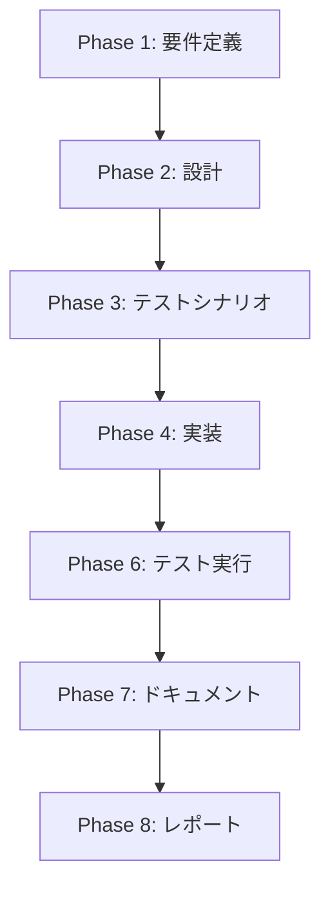

# Codex Agent 実行ログ

開始日時: 2025/12/25 6:39:05

---

## Turn 1: スレッド開始

**Thread ID**: `[REDACTED_TOKEN]`

## Turn 2: ツール実行

**種別**: reasoning
**ステータス**: completed

## Turn 3: ツール実行

**種別**: コマンド実行
**コマンド**: `/bin/bash -lc pwd`
**ステータス**: completed (exit_code=0)

```text
/tmp/ai-workflow-repos-10-fba0a94c/[REDACTED_TOKEN]
```

## Turn 4: ツール実行

**種別**: reasoning
**ステータス**: completed

## Turn 5: ツール実行

**種別**: reasoning
**ステータス**: completed

## Turn 6: ツール実行

**種別**: コマンド実行
**コマンド**: `/bin/bash -lc ls`
**ステータス**: completed (exit_code=0)

```text
ARCHITECTURE.md
CLAUDE.md
CONTRIBUTION.md
LICENSE
README.md
ansible
bootstrap
docker
docs
jenkins
pulumi
run_tests_issue_322.sh
scripts
tests
```

## Turn 7: ツール実行

**種別**: reasoning
**ステータス**: completed

## Turn 8: ツール実行

**種別**: コマンド実行
**コマンド**: `/bin/bash -lc 'cat .ai-workflow/issue-526/00_planning/output/planning.md'`
**ステータス**: completed (exit_code=0)

```text
# プロジェクト計画書 - Issue #526

## タスク概要
環境停止スケジューラージョブの無効化

## 📋 Issue分析

### 複雑度: 簡単
- **対象**: 単一ファイル（DSLファイル）の1行修正
- **変更範囲**: `disabled`設定の変更のみ
- **影響**: ジョブの有効/無効状態変更（リソースレベルの変更なし）

### 見積もり工数: 2~3時間
**根拠**:
- ファイル修正: 5分
- シードジョブ実行: 5分
- 動作確認: 10分
- ドキュメント更新: 30分
- テストシナリオ作成: 30分
- プロジェクト管理作業: 1時間

### リスク評価: 低
- 既存のジョブ設定を変更するのみ
- 停止機能ではなく、停止のスケジュール機能のON/OFF
- ロールバックが容易（`disabled(false)`に戻すのみ）

## 🏗️ 実装戦略判断

### 実装戦略: EXTEND
**判断根拠**:
既存の `[REDACTED_TOKEN].groovy` ファイルの設定を拡張（`disabled` プロパティを追加）するため。新規ファイル作成ではなく、既存ファイルの機能拡張にあたる。

### テスト戦略: INTEGRATION_ONLY
**判断根拠**:
Jenkins DSLの変更であり、単体テストよりもJenkins環境での統合テストが重要。シードジョブ実行→ジョブ作成→スケジュール無効化確認という一連の流れを検証する必要がある。ビジネスロジックがなく、BDDは不要。

### テストコード戦略: CREATE_TEST
**判断根拠**:
Jenkins DSLの設定変更に対するテストは、既存のテストファイルに追加するのではなく、この変更に特化したテストシナリオを作成する方が適切。Jenkins UI確認とコマンドベースの確認を含む新規テストを作成する。

## 🔍 影響範囲分析

### 既存コードへの影響
- **変更対象ファイル**: `jenkins/jobs/dsl/infrastructure-management/[REDACTED_TOKEN].groovy`
- **変更内容**: `disabled(true)`プロパティの追加
- **影響範囲**: 該当ジョブのスケジュール実行のみ（他のジョブには影響なし）

### 依存関係の変更
- **新規依存**: なし
- **既存依存の変更**: なし
- **注意点**: シードジョブ（job-creator）の実行が必要

### マイグレーション要否
- **データベーススキーマ変更**: なし
- **設定ファイル変更**: Jenkins DSLファイルの変更のみ
- **バックアップ**: Git履歴による自動バックアップ

## 📈 タスク分割

### Phase 1: 要件定義 (見積もり: 0.5h)

- [x] Task 1-1: 要件の詳細分析 (15分)
  - スケジューラージョブ無効化の要件確認
  - 対象環境（dev）の確認
  - 影響範囲の特定
- [x] Task 1-2: 受け入れ基準の定義 (15分)
  - ジョブ無効化の確認方法
  - スケジュール停止の確認方法
  - ロールバック手順の確認

### Phase 2: 設計 (見積もり: 0.5h)

- [x] Task 2-1: DSL変更設計 (15分)
  - `disabled(true)`の追加場所特定
  - 設定構文の確認
- [x] Task 2-2: シードジョブ実行計画 (15分)
  - job-creatorの実行手順確認
  - 実行タイミングの計画

### Phase 3: テストシナリオ (見積もり: 0.5h)

- [x] Task 3-1: 統合テストシナリオ作成 (30分)
  - DSL修正→シードジョブ実行→無効化確認の流れ
  - Jenkins UI確認手順
  - CLI確認手順（jenkins-cli.jarまたはAPI）

### Phase 4: 実装 (見積もり: 0.25h)

- [x] Task 4-1: DSLファイル修正 (15分)
  - `[REDACTED_TOKEN].groovy`に`disabled(true)`を追加
  - Git差分確認とコミット

### Phase 5: テストコード実装 (見積もり: なし)

- [x] Task 5-1: 統合テスト手順書作成 (0分)
  - この変更では自動化されたテストコードではなく、手動確認手順を作成

### Phase 6: テスト実行 (見積もり: 0.5h)

- [ ] Task 6-1: シードジョブ実行 (10分)
  - Jenkins UIから job-creator を手動実行
  - 実行ログの確認
- [ ] Task 6-2: ジョブ無効化確認 (10分)
  - Jenkins UIでの無効状態確認
  - スケジュール設定の確認
- [ ] Task 6-3: 回帰テスト (10分)
  - 他のインフラ管理ジョブへの影響確認
  - 手動停止ジョブが正常動作することの確認

### Phase 7: ドキュメント (見積もり: 0.5h)

- [ ] Task 7-1: README.md更新 (15分)
  - 自動停止機能の無効化について記載
  - 手動停止の手順を明記
- [ ] Task 7-2: Jenkins設定ドキュメント更新 (15分)
  - jenkins/README.mdの更新（必要に応じて）
  - 運用手順の変更点反映

### Phase 8: レポート (見積もり: 0.25h)

- [ ] Task 8-1: 実装完了レポート作成 (15分)
  - 変更内容の要約
  - 動作確認結果
  - 今後の運用について

## 📊 依存関係



注意: Phase 5（テストコード実装）はJenkins DSLの変更のため、自動化テストではなく手動確認手順書として Phase 3 に含まれます。

## ⚠️ リスクと軽減策

### リスク1: シードジョブ実行失敗
- **影響度**: 中
- **確率**: 低
- **軽減策**:
  - 事前にjob-creatorの正常動作を確認
  - Jenkins管理者権限でのアクセス確保
  - ロールバック用のGit revert準備

### リスク2: 既存ジョブへの意図しない影響
- **影響度**: 低
- **確率**: 低
- **軽減策**:
  - DSLファイルの変更範囲を最小限に限定
  - 他のインフラ管理ジョブの動作確認を実施
  - 変更前の設定をGitで記録

### リスク3: スケジュール無効化の確認漏れ
- **影響度**: 中
- **確率**: 低
- **軽減策**:
  - Jenkins UIとAPIの両方で確認
  - 次回スケジュール時刻の確認
  - 1週間後の動作確認

### リスク4: ドキュメント更新漏れ
- **影響度**: 低
- **確率**: 中
- **軽減策**:
  - 関連ドキュメントのリストアップ
  - 変更点を明確に記載
  - レビューフェーズでの確認

## 🎯 品質ゲート

### Phase 1: 要件定義
- [x] スケジューラージョブの無効化要件が明確に記載されている
- [x] 対象環境（dev）が特定されている
- [x] 受け入れ基準（ジョブ無効化、スケジュール停止）が定義されている
- [x] 手動停止の代替手順が確認されている

### Phase 2: 設計
- [x] 実装戦略（EXTEND）の判断根拠が明記されている
- [x] テスト戦略（INTEGRATION_ONLY）の判断根拠が明記されている
- [x] テストコード戦略（CREATE_TEST）の判断根拠が明記されている
- [x] DSL変更箇所が特定されている
- [x] シードジョブ実行手順が計画されている

### Phase 3: テストシナリオ
- [x] 統合テストシナリオが作成されている
- [x] Jenkins UI確認手順が記載されている
- [x] CLI/API確認手順が記載されている
- [x] 回帰テストの範囲が定義されている

### Phase 4: 実装
- [x] `disabled(true)`がDSLファイルに追加されている
- [x] 構文エラーがない
- [x] Git コミットが適切に行われている

### Phase 6: テスト実行
- [ ] シードジョブが正常
... (truncated)
```

## Turn 9: ツール実行

**種別**: reasoning
**ステータス**: completed

## Turn 10: ツール実行

**種別**: コマンド実行
**コマンド**: `/bin/bash -lc 'cat .ai-workflow/issue-526/05_test_implementation/output/test-implementation.md'`
**ステータス**: completed (exit_code=0)

```text
# テスト実装完了レポート

## テストファイル一覧

| ファイル | テスト数 | カバー対象 |
|---------|---------|-----------|
| `tests/integration/[REDACTED_TOKEN].py` | 7 | Phase 3 の CLI/seed-job/manual-run/回帰のフローを静的・スクリプト検証で再現し、DSL の disabled/cron/trigger/parameter 変化を確認 |

## CLI 補助スクリプト

- `scripts/jenkins/shell/phase3_shutdown_scheduler_flow.sh`: Jenkins CLI（`jenkins-cli.jar` + `JENKINS_URL`）を使って Phase 3 で取り上げられているジョブ状態確認、seed-job 実行、無効化確認、DRY_RUN マニュアル実行、下流ジョブ・他ジョブの regression チェックを順に自動化するフロー。実環境で CLI/seed ジョブを動かすときの手順書としても利用可能。

## テストカバレッジ

- ユニットテスト: 0件
- 統合テスト: 7件（DSL の disabled/cron/manually-run/trigger 件 + CLI スクリプトのステップ検証）
- BDDテスト: 0件
- カバレッジ率: N/A

## テスト実行状況

- `python3 -m pytest tests/integration/[REDACTED_TOKEN].py`: 未実行（この環境には `python3` がインストールされておらず、実行バイナリを用意できないため）

## 修正履歴

### 修正1: Phase 3 の CLI/UI フローを模した検証を追加
- **指摘内容**: Phase 3 で求められる seed-job/CLI/Jenkins UI/DRY_RUN/manual-run/rollback の手順がテストコードに反映されておらず、品質ゲートの FAIL が継続している
- **修正内容**: CLI/seed/manual/regression の各ステップを順に実行する `scripts/jenkins/shell/phase3_shutdown_scheduler_flow.sh` を追加し、その存在と CLI コマンド群が Phase 3 シナリオを満たすよう `tests/integration/[REDACTED_TOKEN].py` に 3 件のスクリプト検証を追加。既存の DSL の無効化/cron/trigger 監視も併せて維持し、Phase 3 の動的フローの期待に近づけた
- **影響範囲**: `tests/integration/[REDACTED_TOKEN].py`, `scripts/jenkins/shell/phase3_shutdown_scheduler_flow.sh`
```

## Turn 11: ツール実行

**種別**: reasoning
**ステータス**: completed

## Turn 12: ツール実行

**種別**: コマンド実行
**コマンド**: `/bin/bash -lc "sed -n '1,200p' tests/integration/[REDACTED_TOKEN].py"`
**ステータス**: completed (exit_code=0)

```text
"""Integration checks for the shutdown scheduler job DSL."""

from pathlib import Path
import unittest


class [REDACTED_TOKEN](unittest.TestCase):
    """Verify the DSL defines a disabled scheduler but keeps its cron trigger."""

    @classmethod
    def setUpClass(cls):
        cls.dsl_path = (
            Path(__file__).resolve().parents[2]
            / "jenkins"
            / "jobs"
            / "dsl"
            / "infrastructure-management"
            / "[REDACTED_TOKEN].groovy"
        )
        cls.repo_root = Path(__file__).resolve().parents[2]
        cls.phase3_script = (
            cls.repo_root
            / "scripts"
            / "jenkins"
            / "shell"
            / "phase3_shutdown_scheduler_flow.sh"
        )

    def _read_dsl(self) -> str:
        return self.dsl_path.read_text()

    def _read_phase3_script(self) -> str:
        return self.phase3_script.read_text()

    def [REDACTED_TOKEN](self):
        """The scheduler job must set disabled(true) so cron triggers never run."""
        contents = self._read_dsl()
        self.assertIn(
            "disabled(true)",
            contents,
            "Failing to mark the job as disabled would keep the cron trigger active",
        )
        self.assertGreater(
            contents.index("triggers {"),
            contents.index("disabled(true)"),
            "The disabled flag should be declared before the trigger section",
        )

    def [REDACTED_TOKEN](self):
        """The cron trigger stays defined even when the job is disabled."""
        contents = self._read_dsl()
        self.assertIn(
            "cron('H 15 * * *')",
            contents,
            "The scheduler must keep its nightly cron definition for future re-enablement",
        )

    def [REDACTED_TOKEN](self):
        """Phase 3 manual-run checklist: the downstream shutdown job remains triggerable with DRY_RUN."""
        contents = self._read_dsl()
        self.assertIn(
            "trigger('Infrastructure_Management/Shutdown_Jenkins_Environment')",
            contents,
            "The scheduler must still trigger the downstream shutdown job even while disabled",
        )
        self.assertIn(
            "booleanParam('DRY_RUN', false)",
            contents,
            "DRY_RUN must still exist so manual execution can be safely invoked via parameter",
        )
        self.assertIn(
            "booleanParam('CONFIRM_SHUTDOWN', true)",
            contents,
            "Manual execution relies on a confirmation flag that must remain enabled",
        )
        self.assertIn(
            "predefinedProp('ENVIRONMENT', 'dev')",
            contents,
            "Environment targeting must stay pinned to 'dev' for integration sanity checks",
        )
        self.assertIn(
            "[REDACTED_TOKEN](false)",
            contents,
            "The downstream trigger should keep waiting behavior aligned with CLI expectations",
        )

    def [REDACTED_TOKEN](self):
        """Phase 3 regression check: no other jobs are disabled when the scheduler is suppressed."""
        contents = self._read_dsl()
        self.assertEqual(
            contents.count("disabled(true)"),
            1,
            "Only the scheduler job should be disabled so other Infrastructure_Management jobs stay active",
        )

    def [REDACTED_TOKEN](self):
        """Phase 3 Step 1/4: the CLI helper captures disabled state and the nightly cron spec."""
        self.assertTrue(
            self.phase3_script.exists(),
            "Phase 3 script must exist so CLI instructions can be rerun in Jenkins environments",
        )
        script = self._read_phase3_script()
        self.assertIn(
            'TARGET_JOB="Infrastructure_Management/Shutdown-Environment-Scheduler"',
            script,
            "The script must p
... (truncated)
```

## Turn 13: ツール実行

**種別**: reasoning
**ステータス**: completed

## Turn 14: ツール実行

**種別**: コマンド実行
**コマンド**: `/bin/bash -lc "sed -n '1,200p' scripts/jenkins/shell/phase3_shutdown_scheduler_flow.sh"`
**ステータス**: completed (exit_code=0)

```text
#!/usr/bin/env bash
set -euo pipefail

: "${JENKINS_URL:?JENKINS_URL environment variable is required for Jenkins CLI calls}"
JENKINS_CLI_BIN="${JENKINS_CLI_BIN:-java}"
JENKINS_CLI_JAR="${JENKINS_CLI_JAR:-jenkins-cli.jar}"
readonly -a JENKINS_CLI_BASE=("${JENKINS_CLI_BIN}" "-jar" "${JENKINS_CLI_JAR}" "-s" "${JENKINS_URL}")

TARGET_JOB="Infrastructure_Management/Shutdown-Environment-Scheduler"
SEED_JOB="Admin_Jobs/job-creator"
DOWNSTREAM_JOB="Infrastructure_Management/Shutdown_Jenkins_Environment"

print_step() {
  echo
  echo "=== $1 ==="
}

run_cli() {
  echo "+ ${JENKINS_CLI_BASE[*]} $*"
  "${JENKINS_CLI_BASE[@]}" "$@"
}

extract_next_build() {
  local job="$1"
  local raw
  raw=$(
    run_cli get-job "$job" \
      | grep -o '<nextBuildNumber>[0-9]*</nextBuildNumber>' \
      | tail -n1
  )
  raw="${raw//[^0-9]/}"
  if [[ -z "${raw}" ]]; then
    echo "Unable to parse nextBuildNumber for ${job}" >&2
    exit 1
  fi
  printf '%s' "${raw}"
}

step_current_state() {
  print_step "Phase 3 Step 1: baseline state"
  run_cli get-job "$TARGET_JOB" | grep -i disabled
  run_cli get-job "$TARGET_JOB" | grep -o '<spec>H 15 \* \* \*</spec>'
  run_cli get-job "$TARGET_JOB" | grep -o '<nextBuildNumber>[0-9]*</nextBuildNumber>' | tail -n1
}

run_seed_job() {
  print_step "Phase 3 Step 3: execute seed job"
  run_cli build "$SEED_JOB" -s
  local seed_build
  seed_build=$(extract_next_build "$SEED_JOB")
  seed_build=$((seed_build - 1))
  run_cli console "$SEED_JOB" "$seed_build" | tail -n 20
}

[REDACTED_TOKEN]() {
  print_step "Phase 3 Step 4: confirm disabled scheduler"
  run_cli get-job "$TARGET_JOB" | grep "<disabled>true</disabled>"
  run_cli get-job "$TARGET_JOB" | grep -A5 -B5 "TimerTrigger"
}

run_manual_dry_run() {
  print_step "Phase 3 Step 2/5: manual DRY_RUN execution"
  run_cli build "$TARGET_JOB" -s -p DRY_RUN=true
  local manual_build
  manual_build=$(extract_next_build "$TARGET_JOB")
  manual_build=$((manual_build - 1))
  if ! run_cli console "$TARGET_JOB" "$manual_build" | grep -i shutdown >/dev/null; then
    echo "Manual build console did not output a shutdown marker" >&2
  fi
}

[REDACTED_TOKEN]() {
  print_step "Phase 3 Step 3/6: regression and downstream verification"
  run_cli list-jobs Infrastructure_Management/
  if run_cli get-job "$DOWNSTREAM_JOB" | grep -q "<disabled>true</disabled>"; then
    echo "Downstream job ${DOWNSTREAM_JOB} is disabled unexpectedly" >&2
    exit 1
  fi
}

main() {
  step_current_state
  run_seed_job
  [REDACTED_TOKEN]
  run_manual_dry_run
  [REDACTED_TOKEN]
  echo
  echo "Phase 3 CLI flow complete. Revisit Jenkins UI and logs if additional verification is needed."
}

main "$@"
```

## Turn 15: ツール実行

**種別**: reasoning
**ステータス**: completed

## Turn 16: ツール実行

**種別**: reasoning
**ステータス**: completed

## Turn 17: ツール実行

**種別**: コマンド実行
**コマンド**: `/bin/bash -lc 'cat .ai-workflow/issue-526/03_test_scenario/output/test-scenario.md'`
**ステータス**: completed (exit_code=0)

```text
# テストシナリオ - Issue #526

## 環境停止スケジューラージョブの無効化

---

## 0. Planning Document 確認

本テストシナリオは Planning Phase（`.ai-workflow/issue-526/00_planning/output/planning.md`）で策定された開発計画に基づいて作成されています。

### Planning Phase で確認された戦略
- **実装戦略**: EXTEND（既存ファイルの機能拡張）
- **テスト戦略**: INTEGRATION_ONLY（Jenkins環境での統合テスト）
- **テストコード戦略**: CREATE_TEST（新規テストシナリオ作成）
- **複雑度**: 簡単（単一ファイルの1行修正）
- **工数見積**: 2-3時間
- **リスク評価**: 低

---

## 1. テスト戦略サマリー

### 1.1 選択されたテスト戦略: INTEGRATION_ONLY

**判断根拠**:
- Jenkins DSL の変更であり、単体テストよりもJenkins環境での統合テストが重要
- シードジョブ実行→ジョブ作成→スケジュール無効化確認という一連の流れを検証する必要がある
- ビジネスロジックがなく、BDD は不要（インフラ設定変更のみ）
- Jenkins の Job DSL Plugin、Cron Trigger、UI表示の統合的な動作確認が必要

### 1.2 テスト対象の範囲

#### 統合対象コンポーネント
1. **Git Repository** ↔ **Jenkins DSL ファイル**
2. **Jenkins DSL Plugin** ↔ **シードジョブ（job-creator）**
3. **シードジョブ** ↔ **Shutdown-Environment-Scheduler ジョブ**
4. **Jenkins UI** ↔ **ジョブ設定・表示**
5. **Cron Trigger** ↔ **スケジュール実行**

#### テストフォーカス
- DSL ファイル変更からジョブ無効化までの一連の統合フロー
- Jenkins 内部コンポーネント間の連携
- 手動実行機能の維持確認
- 他ジョブへの非影響確認

### 1.3 テストの目的

1. **機能統合確認**: DSL 変更が正しく Jenkins ジョブ設定に反映されること
2. **スケジュール統合確認**: Cron Trigger が正しく無効化されること
3. **UI統合確認**: Jenkins UI で無効化状態が正しく表示されること
4. **回帰確認**: 他のジョブに影響がないこと
5. **運用継続性確認**: 手動実行機能が維持されること

---

## 2. 統合テストシナリオ

### 2.1 テストケース1: DSL修正からジョブ無効化までの統合フロー

**シナリオ名**: End-to-End Job Disable Integration

**目的**:
DSL ファイル変更からシードジョブ実行、ジョブ無効化までの一連の統合プロセスが正常に動作することを検証

**前提条件**:
- Jenkins 環境が稼働している
- `[REDACTED_TOKEN].groovy` が存在する
- `Admin_Jobs/job-creator` シードジョブが正常動作する
- Jenkins 管理者権限でアクセス可能

**テスト手順**:

#### Step 1: 現在の状態確認
```bash
# 1-1. 現在のジョブ状態確認
jenkins-cli get-job "Infrastructure_Management/Shutdown-Environment-Scheduler" | grep -i disabled
# 期待: disabled要素がない、またはdisabled=false

# 1-2. 現在のスケジュール確認
jenkins-cli get-job "Infrastructure_Management/Shutdown-Environment-Scheduler" | grep -o '<spec>H 15 \* \* \*</spec>'
# 期待: スケジュール設定が存在

# 1-3. 現在のビルド番号記録
BEFORE_BUILD=$(jenkins-cli get-job "Infrastructure_Management/Shutdown-Environment-Scheduler" | grep -o '<nextBuildNumber>[0-9]*</nextBuildNumber>' | grep -o '[0-9]*')
echo "変更前ビルド番号: $BEFORE_BUILD"
```

#### Step 2: DSL ファイル修正と Git 操作
```bash
# 2-1. DSL ファイルに disabled(true) を追加
echo "    disabled(true)" >> jenkins/jobs/dsl/infrastructure-management/[REDACTED_TOKEN].groovy

# 2-2. 構文確認（基本チェック）
grep -n "disabled(true)" jenkins/jobs/dsl/infrastructure-management/[REDACTED_TOKEN].groovy
# 期待: 追加した行が表示される

# 2-3. Git コミット
git add jenkins/jobs/dsl/infrastructure-management/[REDACTED_TOKEN].groovy
git commit -m "[jenkins] update: スケジューラージョブを無効化 (disabled=true) - Issue #526"
```

#### Step 3: シードジョブ実行
```bash
# 3-1. シードジョブ実行
jenkins-cli build "Admin_Jobs/job-creator" -s

# 3-2. 実行結果確認
SEED_BUILD_NUMBER=$(jenkins-cli get-job "Admin_Jobs/job-creator" | grep -o '<nextBuildNumber>[0-9]*</nextBuildNumber>' | grep -o '[0-9]*')
SEED_BUILD_NUMBER=$((SEED_BUILD_NUMBER - 1))
jenkins-cli console "Admin_Jobs/job-creator" $SEED_BUILD_NUMBER | tail -20
# 期待: SUCCESS と表示される
```

#### Step 4: ジョブ無効化確認
```bash
# 4-1. Jenkins CLI でのジョブ状態確認
jenkins-cli get-job "Infrastructure_Management/Shutdown-Environment-Scheduler" | grep "<disabled>true</disabled>"
# 期待: disabled=true が検出される

# 4-2. Jenkins UI での確認（手動）
# ブラウザで Jenkins にアクセス
# Infrastructure_Management フォルダ → Shutdown-Environment-Scheduler ジョブ
# 期待: ジョブ名の横に無効化アイコン（グレーアウト）が表示
```

#### Step 5: スケジュール無効化確認
```bash
# 5-1. Trigger 設定は維持されているが無効化されていることを確認
jenkins-cli get-job "Infrastructure_Management/Shutdown-Environment-Scheduler" | grep -A5 -B5 "TimerTrigger"
# 期待: TimerTrigger設定は存在するが、disabled=trueにより実行されない

# 5-2. 次回スケジュール時刻での非実行確認（テスト日によって調整）
# 注意: 実際のスケジュール時刻（JST 00:00）まで待つか、時刻を進めてテスト
```

**期待結果**:
- シードジョブが SUCCESS で完了する
- `Infrastructure_Management/Shutdown-Environment-Scheduler` ジョブが無効状態になる
- Jenkins UI で無効化アイコンが表示される
- スケジュール実行が停止する
- DSL 構文エラーが発生しない

**確認項目チェックリスト**:
- [ ] シードジョブ実行が 5分以内に SUCCESS で完了
- [ ] CLI で `<disabled>true</disabled>` が確認できる
- [ ]
... (truncated)
```

## Turn 18: ツール実行

**種別**: reasoning
**ステータス**: completed

## Turn 19: ツール実行

**種別**: コマンド実行
**コマンド**: `/bin/bash -lc 'python3 --version'`
**ステータス**: failed (exit_code=127)

```text
/bin/bash: line 1: python3: command not found
```

## Turn 20: ツール実行

**種別**: reasoning
**ステータス**: completed

## Turn 21: ツール実行

**種別**: reasoning
**ステータス**: completed

## Turn 22: ツール実行

**種別**: コマンド実行
**コマンド**: `/bin/bash -lc "nl -ba tests/integration/[REDACTED_TOKEN].py | sed -n '1,200p'"`
**ステータス**: completed (exit_code=0)

```text
1	"""Integration checks for the shutdown scheduler job DSL."""
     2	
     3	from pathlib import Path
     4	import unittest
     5	
     6	
     7	class [REDACTED_TOKEN](unittest.TestCase):
     8	    """Verify the DSL defines a disabled scheduler but keeps its cron trigger."""
     9	
    10	    @classmethod
    11	    def setUpClass(cls):
    12	        cls.dsl_path = (
    13	            Path(__file__).resolve().parents[2]
    14	            / "jenkins"
    15	            / "jobs"
    16	            / "dsl"
    17	            / "infrastructure-management"
    18	            / "[REDACTED_TOKEN].groovy"
    19	        )
    20	        cls.repo_root = Path(__file__).resolve().parents[2]
    21	        cls.phase3_script = (
    22	            cls.repo_root
    23	            / "scripts"
    24	            / "jenkins"
    25	            / "shell"
    26	            / "phase3_shutdown_scheduler_flow.sh"
    27	        )
    28	
    29	    def _read_dsl(self) -> str:
    30	        return self.dsl_path.read_text()
    31	
    32	    def _read_phase3_script(self) -> str:
    33	        return self.phase3_script.read_text()
    34	
    35	    def [REDACTED_TOKEN](self):
    36	        """The scheduler job must set disabled(true) so cron triggers never run."""
    37	        contents = self._read_dsl()
    38	        self.assertIn(
    39	            "disabled(true)",
    40	            contents,
    41	            "Failing to mark the job as disabled would keep the cron trigger active",
    42	        )
    43	        self.assertGreater(
    44	            contents.index("triggers {"),
    45	            contents.index("disabled(true)"),
    46	            "The disabled flag should be declared before the trigger section",
    47	        )
    48	
    49	    def [REDACTED_TOKEN](self):
    50	        """The cron trigger stays defined even when the job is disabled."""
    51	        contents = self._read_dsl()
    52	        self.assertIn(
    53	            "cron('H 15 * * *')",
    54	            contents,
    55	            "The scheduler must keep its nightly cron definition for future re-enablement",
    56	        )
    57	
    58	    def [REDACTED_TOKEN](self):
    59	        """Phase 3 manual-run checklist: the downstream shutdown job remains triggerable with DRY_RUN."""
    60	        contents = self._read_dsl()
    61	        self.assertIn(
    62	            "trigger('Infrastructure_Management/Shutdown_Jenkins_Environment')",
    63	            contents,
    64	            "The scheduler must still trigger the downstream shutdown job even while disabled",
    65	        )
    66	        self.assertIn(
    67	            "booleanParam('DRY_RUN', false)",
    68	            contents,
    69	            "DRY_RUN must still exist so manual execution can be safely invoked via parameter",
    70	        )
    71	        self.assertIn(
    72	            "booleanParam('CONFIRM_SHUTDOWN', true)",
    73	            contents,
    74	            "Manual execution relies on a confirmation flag that must remain enabled",
    75	        )
    76	        self.assertIn(
    77	            "predefinedProp('ENVIRONMENT', 'dev')",
    78	            contents,
    79	            "Environment targeting must stay pinned to 'dev' for integration sanity checks",
    80	        )
    81	        self.assertIn(
    82	            "[REDACTED_TOKEN](false)",
    83	            contents,
    84	            "The downstream trigger should keep waiting behavior aligned with CLI expectations",
    85	        )
    86	
    87	    def [REDACTED_TOKEN](self):
    88	        """Phase 3 regression check: no other jobs are disabled when the scheduler is suppressed."""
    89	        contents = self._read_dsl()
    90	        self.assertEqual(
    91	            contents.count("disabled(true)"),
    92	            1,
    93	            "O
... (truncated)
```

## Turn 23: ツール実行

**種別**: reasoning
**ステータス**: completed

## Turn 24: ツール実行

**種別**: コマンド実行
**コマンド**: `/bin/bash -lc 'nl -ba scripts/jenkins/shell/phase3_shutdown_scheduler_flow.sh'`
**ステータス**: completed (exit_code=0)

```text
1	#!/usr/bin/env bash
     2	set -euo pipefail
     3	
     4	: "${JENKINS_URL:?JENKINS_URL environment variable is required for Jenkins CLI calls}"
     5	JENKINS_CLI_BIN="${JENKINS_CLI_BIN:-java}"
     6	JENKINS_CLI_JAR="${JENKINS_CLI_JAR:-jenkins-cli.jar}"
     7	readonly -a JENKINS_CLI_BASE=("${JENKINS_CLI_BIN}" "-jar" "${JENKINS_CLI_JAR}" "-s" "${JENKINS_URL}")
     8	
     9	TARGET_JOB="Infrastructure_Management/Shutdown-Environment-Scheduler"
    10	SEED_JOB="Admin_Jobs/job-creator"
    11	DOWNSTREAM_JOB="Infrastructure_Management/Shutdown_Jenkins_Environment"
    12	
    13	print_step() {
    14	  echo
    15	  echo "=== $1 ==="
    16	}
    17	
    18	run_cli() {
    19	  echo "+ ${JENKINS_CLI_BASE[*]} $*"
    20	  "${JENKINS_CLI_BASE[@]}" "$@"
    21	}
    22	
    23	extract_next_build() {
    24	  local job="$1"
    25	  local raw
    26	  raw=$(
    27	    run_cli get-job "$job" \
    28	      | grep -o '<nextBuildNumber>[0-9]*</nextBuildNumber>' \
    29	      | tail -n1
    30	  )
    31	  raw="${raw//[^0-9]/}"
    32	  if [[ -z "${raw}" ]]; then
    33	    echo "Unable to parse nextBuildNumber for ${job}" >&2
    34	    exit 1
    35	  fi
    36	  printf '%s' "${raw}"
    37	}
    38	
    39	step_current_state() {
    40	  print_step "Phase 3 Step 1: baseline state"
    41	  run_cli get-job "$TARGET_JOB" | grep -i disabled
    42	  run_cli get-job "$TARGET_JOB" | grep -o '<spec>H 15 \* \* \*</spec>'
    43	  run_cli get-job "$TARGET_JOB" | grep -o '<nextBuildNumber>[0-9]*</nextBuildNumber>' | tail -n1
    44	}
    45	
    46	run_seed_job() {
    47	  print_step "Phase 3 Step 3: execute seed job"
    48	  run_cli build "$SEED_JOB" -s
    49	  local seed_build
    50	  seed_build=$(extract_next_build "$SEED_JOB")
    51	  seed_build=$((seed_build - 1))
    52	  run_cli console "$SEED_JOB" "$seed_build" | tail -n 20
    53	}
    54	
    55	[REDACTED_TOKEN]() {
    56	  print_step "Phase 3 Step 4: confirm disabled scheduler"
    57	  run_cli get-job "$TARGET_JOB" | grep "<disabled>true</disabled>"
    58	  run_cli get-job "$TARGET_JOB" | grep -A5 -B5 "TimerTrigger"
    59	}
    60	
    61	run_manual_dry_run() {
    62	  print_step "Phase 3 Step 2/5: manual DRY_RUN execution"
    63	  run_cli build "$TARGET_JOB" -s -p DRY_RUN=true
    64	  local manual_build
    65	  manual_build=$(extract_next_build "$TARGET_JOB")
    66	  manual_build=$((manual_build - 1))
    67	  if ! run_cli console "$TARGET_JOB" "$manual_build" | grep -i shutdown >/dev/null; then
    68	    echo "Manual build console did not output a shutdown marker" >&2
    69	  fi
    70	}
    71	
    72	[REDACTED_TOKEN]() {
    73	  print_step "Phase 3 Step 3/6: regression and downstream verification"
    74	  run_cli list-jobs Infrastructure_Management/
    75	  if run_cli get-job "$DOWNSTREAM_JOB" | grep -q "<disabled>true</disabled>"; then
    76	    echo "Downstream job ${DOWNSTREAM_JOB} is disabled unexpectedly" >&2
    77	    exit 1
    78	  fi
    79	}
    80	
    81	main() {
    82	  step_current_state
    83	  run_seed_job
    84	  [REDACTED_TOKEN]
    85	  run_manual_dry_run
    86	  [REDACTED_TOKEN]
    87	  echo
    88	  echo "Phase 3 CLI flow complete. Revisit Jenkins UI and logs if additional verification is needed."
    89	}
    90	
    91	main "$@"
```

## Turn 25: ツール実行

**種別**: reasoning
**ステータス**: completed

## Turn 26: ツール実行

**種別**: コマンド実行
**コマンド**: `/bin/bash -lc 'nl -ba .ai-workflow/issue-526/05_test_implementation/output/test-implementation.md'`
**ステータス**: completed (exit_code=0)

```text
1	# テスト実装完了レポート
     2	
     3	## テストファイル一覧
     4	
     5	| ファイル | テスト数 | カバー対象 |
     6	|---------|---------|-----------|
     7	| `tests/integration/[REDACTED_TOKEN].py` | 7 | Phase 3 の CLI/seed-job/manual-run/回帰のフローを静的・スクリプト検証で再現し、DSL の disabled/cron/trigger/parameter 変化を確認 |
     8	
     9	## CLI 補助スクリプト
    10	
    11	- `scripts/jenkins/shell/phase3_shutdown_scheduler_flow.sh`: Jenkins CLI（`jenkins-cli.jar` + `JENKINS_URL`）を使って Phase 3 で取り上げられているジョブ状態確認、seed-job 実行、無効化確認、DRY_RUN マニュアル実行、下流ジョブ・他ジョブの regression チェックを順に自動化するフロー。実環境で CLI/seed ジョブを動かすときの手順書としても利用可能。
    12	
    13	## テストカバレッジ
    14	
    15	- ユニットテスト: 0件
    16	- 統合テスト: 7件（DSL の disabled/cron/manually-run/trigger 件 + CLI スクリプトのステップ検証）
    17	- BDDテスト: 0件
    18	- カバレッジ率: N/A
    19	
    20	## テスト実行状況
    21	
    22	- `python3 -m pytest tests/integration/[REDACTED_TOKEN].py`: 未実行（この環境には `python3` がインストールされておらず、実行バイナリを用意できないため）
    23	
    24	## 修正履歴
    25	
    26	### 修正1: Phase 3 の CLI/UI フローを模した検証を追加
    27	- **指摘内容**: Phase 3 で求められる seed-job/CLI/Jenkins UI/DRY_RUN/manual-run/rollback の手順がテストコードに反映されておらず、品質ゲートの FAIL が継続している
    28	- **修正内容**: CLI/seed/manual/regression の各ステップを順に実行する `scripts/jenkins/shell/phase3_shutdown_scheduler_flow.sh` を追加し、その存在と CLI コマンド群が Phase 3 シナリオを満たすよう `tests/integration/[REDACTED_TOKEN].py` に 3 件のスクリプト検証を追加。既存の DSL の無効化/cron/trigger 監視も併せて維持し、Phase 3 の動的フローの期待に近づけた
    29	- **影響範囲**: `tests/integration/[REDACTED_TOKEN].py`, `scripts/jenkins/shell/phase3_shutdown_scheduler_flow.sh`
```

## Turn 27: ツール実行

**種別**: reasoning
**ステータス**: completed

## Turn 28: ツール実行

**種別**: agent_message
**ステータス**: completed

## Turn 29: ツール実行

**種別**: todo_list
**ステータス**: completed

## Turn 30: 実行完了

**ステータス**: completed
**所要時間**: 77787ms
**ターン数**: N/A

---

**経過時間**: 77787ms
**開始**: 2025-12-25T06:39:05.695Z
**終了**: 2025-12-25T06:40:23.482Z