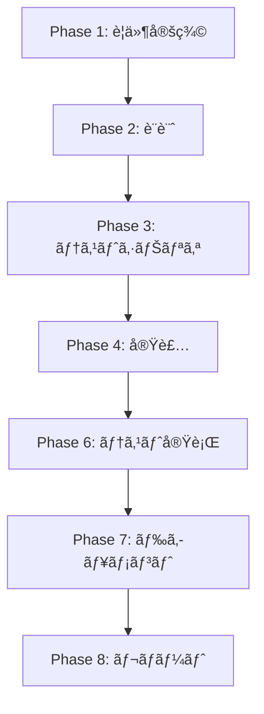

# Codex Agent 実行ログ

開始日時: 2025/12/25 6:39:05

---

## Turn 1: スレッド開始

**Thread ID**: `[REDACTED_TOKEN]`

## Turn 2: ツール実行

**種別**: reasoning
**ステータス**: completed

## Turn 3: ツール実行

**種別**: コãƒãƒ³ãƒ‰å®Ÿè¡Œ
**コãƒãƒ³ãƒ‰**: `/bin/bash -lc pwd`
**ステータス**: completed (exit_code=0)

```text
/tmp/ai-workflow-repos-10-fba0a94c/[REDACTED_TOKEN]
```

## Turn 4: ツール実行

**種別**: reasoning
**ステータス**: completed

## Turn 5: ツール実行

**種別**: reasoning
**ステータス**: completed

## Turn 6: ツール実行

**種別**: コãƒãƒ³ãƒ‰å®Ÿè¡Œ
**コãƒãƒ³ãƒ‰**: `/bin/bash -lc ls`
**ステータス**: completed (exit_code=0)

```text
ARCHITECTURE.md
CLAUDE.md
CONTRIBUTION.md
LICENSE
README.md
ansible
bootstrap
docker
docs
jenkins
pulumi
run_tests_issue_322.sh
scripts
tests
```

## Turn 7: ツール実行

**種別**: reasoning
**ステータス**: completed

## Turn 8: ツール実行

**種別**: コãƒãƒ³ãƒ‰å®Ÿè¡Œ
**コãƒãƒ³ãƒ‰**: `/bin/bash -lc 'cat .ai-workflow/issue-526/00_planning/output/planning.md'`
**ステータス**: completed (exit_code=0)

```text
# プロジェクト計画書 - Issue #526

## タスク概è¦
環境åœæ­¢ã‚¹ã‚±ã‚¸ãƒ¥ãƒ¼ãƒ©ãƒ¼ã‚¸ãƒ§ãƒ–ã®ç„¡åŠ¹åŒ–

## 📋 Issue分æ

### 複雑度: ç°¡å˜
- **対象**: å˜ä¸€ãƒ•ã‚¡ã‚¤ãƒ«ï¼ˆDSLファイル）ã®1行修正
- **変更範囲**: `disabled`設定ã®å¤‰æ›´ã®ã¿
- **影響**: ジョブã®æœ‰åŠ¹/無効状態変更（リソースレベルã®å¤‰æ›´ãªã—）

### 見ç©ã‚‚り工数: 2~3時間
**根拠**:
- ファイル修正: 5分
- シードジョブ実行: 5分
- 動作確èª: 10分
- ドキュメント更新: 30分
- テストシナリオ作æˆ: 30分
- プロジェクト管ç†ä½œæ¥­: 1時間

### リスク評価: ä½
- 既存ã®ã‚¸ãƒ§ãƒ–設定を変更ã™ã‚‹ã®ã¿
- åœæ­¢æ©Ÿèƒ½ã§ã¯ãªãã€åœæ­¢ã®ã‚¹ã‚±ã‚¸ãƒ¥ãƒ¼ãƒ«æ©Ÿèƒ½ã®ON/OFF
- ロールãƒãƒƒã‚¯ãŒå®¹æ˜“（`disabled(false)`ã«æˆ»ã™ã®ã¿ï¼‰

## ğŸ—ï¸ å®Ÿè£…æˆ¦ç•¥åˆ¤æ–­

### 実装戦略: EXTEND
**判断根拠**:
既存㮠`[REDACTED_TOKEN].groovy` ファイルã®è¨­å®šã‚’拡張（`disabled` プロパティを追加）ã™ã‚‹ãŸã‚。新è¦ãƒ•ã‚¡ã‚¤ãƒ«ä½œæˆã§ã¯ãªãã€æ—¢å­˜ãƒ•ã‚¡ã‚¤ãƒ«ã®æ©Ÿèƒ½æ‹¡å¼µã«ã‚ãŸã‚‹ã€‚

### テスト戦略: INTEGRATION_ONLY
**判断根拠**:
Jenkins DSLã®å¤‰æ›´ã§ã‚ã‚Šã€å˜ä½“テストよりもJenkins環境ã§ã®çµ±åˆãƒ†ã‚¹ãƒˆãŒé‡è¦ã€‚シードジョブ実行→ジョブ作æˆâ†’スケジュール無効化確èªã¨ã„ã†ä¸€é€£ã®æµã‚Œã‚’検証ã™ã‚‹å¿…è¦ãŒã‚る。ビジãƒã‚¹ãƒ­ã‚¸ãƒƒã‚¯ãŒãªãã€BDDã¯ä¸è¦ã€‚

### テストコード戦略: CREATE_TEST
**判断根拠**:
Jenkins DSLã®è¨­å®šå¤‰æ›´ã«å¯¾ã™ã‚‹ãƒ†ã‚¹ãƒˆã¯ã€æ—¢å­˜ã®ãƒ†ã‚¹ãƒˆãƒ•ã‚¡ã‚¤ãƒ«ã«è¿½åŠ ã™ã‚‹ã®ã§ã¯ãªãã€ã“ã®å¤‰æ›´ã«ç‰¹åŒ–ã—ãŸãƒ†ã‚¹ãƒˆã‚·ãƒŠãƒªã‚ªã‚’作æˆã™ã‚‹æ–¹ãŒé©åˆ‡ã€‚Jenkins UI確èªã¨ã‚³ãƒãƒ³ãƒ‰ãƒ™ãƒ¼ã‚¹ã®ç¢ºèªã‚’å«ã‚€æ–°è¦ãƒ†ã‚¹ãƒˆã‚’作æˆã™ã‚‹ã€‚

## 🔠影響範囲分æ

### 既存コードã¸ã®å½±éŸ¿
- **変更対象ファイル**: `jenkins/jobs/dsl/infrastructure-management/[REDACTED_TOKEN].groovy`
- **変更内容**: `disabled(true)`プロパティã®è¿½åŠ 
- **影響範囲**: 該当ジョブã®ã‚¹ã‚±ã‚¸ãƒ¥ãƒ¼ãƒ«å®Ÿè¡Œã®ã¿ï¼ˆä»–ã®ã‚¸ãƒ§ãƒ–ã«ã¯å½±éŸ¿ãªã—）

### ä¾å­˜é–¢ä¿‚ã®å¤‰æ›´
- **æ–°è¦ä¾å­˜**: ãªã—
- **既存ä¾å­˜ã®å¤‰æ›´**: ãªã—
- **注æ„点**: シードジョブ（job-creator）ã®å®Ÿè¡ŒãŒå¿…è¦

### ãƒã‚¤ã‚°ãƒ¬ãƒ¼ã‚·ãƒ§ãƒ³è¦å¦
- **データベーススキーãƒå¤‰æ›´**: ãªã—
- **設定ファイル変更**: Jenkins DSLファイルã®å¤‰æ›´ã®ã¿
- **ãƒãƒƒã‚¯ã‚¢ãƒƒãƒ—**: Git履歴ã«ã‚ˆã‚‹è‡ªå‹•ãƒãƒƒã‚¯ã‚¢ãƒƒãƒ—

## 📈 タスク分割

### Phase 1: è¦ä»¶å®šç¾© (見ç©ã‚‚ã‚Š: 0.5h)

- [x] Task 1-1: è¦ä»¶ã®è©³ç´°åˆ†æ (15分)
  - スケジューラージョブ無効化ã®è¦ä»¶ç¢ºèª
  - 対象環境（dev）ã®ç¢ºèª
  - 影響範囲ã®ç‰¹å®š
- [x] Task 1-2: å—ã‘入れ基準ã®å®šç¾© (15分)
  - ジョブ無効化ã®ç¢ºèªæ–¹æ³•
  - スケジュールåœæ­¢ã®ç¢ºèªæ–¹æ³•
  - ロールãƒãƒƒã‚¯æ‰‹é †ã®ç¢ºèª

### Phase 2: 設計 (見ç©ã‚‚ã‚Š: 0.5h)

- [x] Task 2-1: DSL変更設計 (15分)
  - `disabled(true)`ã®è¿½åŠ å ´æ‰€ç‰¹å®š
  - 設定構文ã®ç¢ºèª
- [x] Task 2-2: シードジョブ実行計画 (15分)
  - job-creatorã®å®Ÿè¡Œæ‰‹é †ç¢ºèª
  - 実行タイミングã®è¨ˆç”»

### Phase 3: テストシナリオ (見ç©ã‚‚ã‚Š: 0.5h)

- [x] Task 3-1: çµ±åˆãƒ†ã‚¹ãƒˆã‚·ãƒŠãƒªã‚ªä½œæˆ (30分)
  - DSL修正→シードジョブ実行→無効化確èªã®æµã‚Œ
  - Jenkins UI確èªæ‰‹é †
  - CLI確èªæ‰‹é †ï¼ˆjenkins-cli.jarã¾ãŸã¯API）

### Phase 4: 実装 (見ç©ã‚‚ã‚Š: 0.25h)

- [x] Task 4-1: DSLファイル修正 (15分)
  - `[REDACTED_TOKEN].groovy`ã«`disabled(true)`を追加
  - Git差分確èªã¨ã‚³ãƒŸãƒƒãƒˆ

### Phase 5: テストコード実装 (見ç©ã‚‚ã‚Š: ãªã—)

- [x] Task 5-1: çµ±åˆãƒ†ã‚¹ãƒˆæ‰‹é †æ›¸ä½œæˆ (0分)
  - ã“ã®å¤‰æ›´ã§ã¯è‡ªå‹•åŒ–ã•ã‚ŒãŸãƒ†ã‚¹ãƒˆã‚³ãƒ¼ãƒ‰ã§ã¯ãªãã€æ‰‹å‹•ç¢ºèªæ‰‹é †ã‚’作æˆ

### Phase 6: テスト実行 (見ç©ã‚‚ã‚Š: 0.5h)

- [ ] Task 6-1: シードジョブ実行 (10分)
  - Jenkins UIã‹ã‚‰ job-creator を手動実行
  - 実行ログã®ç¢ºèª
- [ ] Task 6-2: ã‚¸ãƒ§ãƒ–ç„¡åŠ¹åŒ–ç¢ºèª (10分)
  - Jenkins UIã§ã®ç„¡åŠ¹çŠ¶æ…‹ç¢ºèª
  - スケジュール設定ã®ç¢ºèª
- [ ] Task 6-3: å›å¸°ãƒ†ã‚¹ãƒˆ (10分)
  - ä»–ã®ã‚¤ãƒ³ãƒ•ãƒ©ç®¡ç†ã‚¸ãƒ§ãƒ–ã¸ã®å½±éŸ¿ç¢ºèª
  - 手動åœæ­¢ã‚¸ãƒ§ãƒ–ãŒæ­£å¸¸å‹•ä½œã™ã‚‹ã“ã¨ã®ç¢ºèª

### Phase 7: ドキュメント (見ç©ã‚‚ã‚Š: 0.5h)

- [ ] Task 7-1: README.md更新 (15分)
  - 自動åœæ­¢æ©Ÿèƒ½ã®ç„¡åŠ¹åŒ–ã«ã¤ã„ã¦è¨˜è¼‰
  - 手動åœæ­¢ã®æ‰‹é †ã‚’æ˜è¨˜
- [ ] Task 7-2: Jenkins設定ドキュメント更新 (15分)
  - jenkins/README.mdã®æ›´æ–°ï¼ˆå¿…è¦ã«å¿œã˜ã¦ï¼‰
  - é‹ç”¨æ‰‹é †ã®å¤‰æ›´ç‚¹å映

### Phase 8: レãƒãƒ¼ãƒˆ (見ç©ã‚‚ã‚Š: 0.25h)

- [ ] Task 8-1: 実装完了レãƒãƒ¼ãƒˆä½œæˆ (15分)
  - 変更内容ã®è¦ç´„
  - 動作確èªçµæœ
  - 今後ã®é‹ç”¨ã«ã¤ã„ã¦

## 📊 ä¾å­˜é–¢ä¿‚



注æ„: Phase 5（テストコード実装）ã¯Jenkins DSLã®å¤‰æ›´ã®ãŸã‚ã€è‡ªå‹•åŒ–テストã§ã¯ãªã手動確èªæ‰‹é †æ›¸ã¨ã—㦠Phase 3 ã«å«ã¾ã‚Œã¾ã™ã€‚

## âš ï¸ ãƒªã‚¹ã‚¯ã¨è»½æ¸›ç­–

### リスク1: シードジョブ実行失敗
- **影響度**: 中
- **確ç‡**: ä½
- **軽減策**:
  - 事å‰ã«job-creatorã®æ­£å¸¸å‹•ä½œã‚’確èª
  - Jenkins管ç†è€…権é™ã§ã®ã‚¢ã‚¯ã‚»ã‚¹ç¢ºä¿
  - ロールãƒãƒƒã‚¯ç”¨ã®Git revert準備

### リスク2: 既存ジョブã¸ã®æ„図ã—ãªã„影響
- **影響度**: ä½
- **確ç‡**: ä½
- **軽減策**:
  - DSLファイルã®å¤‰æ›´ç¯„囲を最å°é™ã«é™å®š
  - ä»–ã®ã‚¤ãƒ³ãƒ•ãƒ©ç®¡ç†ã‚¸ãƒ§ãƒ–ã®å‹•ä½œç¢ºèªã‚’実施
  - 変更å‰ã®è¨­å®šã‚’Gitã§è¨˜éŒ²

### リスク3: スケジュール無効化ã®ç¢ºèªæ¼ã‚Œ
- **影響度**: 中
- **確ç‡**: ä½
- **軽減策**:
  - Jenkins UIã¨APIã®ä¸¡æ–¹ã§ç¢ºèª
  - 次å›ã‚¹ã‚±ã‚¸ãƒ¥ãƒ¼ãƒ«æ™‚刻ã®ç¢ºèª
  - 1週間後ã®å‹•ä½œç¢ºèª

### リスク4: ドキュメント更新æ¼ã‚Œ
- **影響度**: ä½
- **確ç‡**: 中
- **軽減策**:
  - 関連ドキュメントã®ãƒªã‚¹ãƒˆã‚¢ãƒƒãƒ—
  - 変更点をæ˜ç¢ºã«è¨˜è¼‰
  - レビューフェーズã§ã®ç¢ºèª

## 🯠å“質ゲート

### Phase 1: è¦ä»¶å®šç¾©
- [x] スケジューラージョブã®ç„¡åŠ¹åŒ–è¦ä»¶ãŒæ˜ç¢ºã«è¨˜è¼‰ã•ã‚Œã¦ã„ã‚‹
- [x] 対象環境（dev）ãŒç‰¹å®šã•ã‚Œã¦ã„ã‚‹
- [x] å—ã‘入れ基準（ジョブ無効化ã€ã‚¹ã‚±ã‚¸ãƒ¥ãƒ¼ãƒ«åœæ­¢ï¼‰ãŒå®šç¾©ã•ã‚Œã¦ã„ã‚‹
- [x] 手動åœæ­¢ã®ä»£æ›¿æ‰‹é †ãŒç¢ºèªã•ã‚Œã¦ã„ã‚‹

### Phase 2: 設計
- [x] 実装戦略（EXTEND）ã®åˆ¤æ–­æ ¹æ‹ ãŒæ˜è¨˜ã•ã‚Œã¦ã„ã‚‹
- [x] テスト戦略（INTEGRATION_ONLY）ã®åˆ¤æ–­æ ¹æ‹ ãŒæ˜è¨˜ã•ã‚Œã¦ã„ã‚‹
- [x] テストコード戦略（CREATE_TEST）ã®åˆ¤æ–­æ ¹æ‹ ãŒæ˜è¨˜ã•ã‚Œã¦ã„ã‚‹
- [x] DSL変更箇所ãŒç‰¹å®šã•ã‚Œã¦ã„ã‚‹
- [x] シードジョブ実行手順ãŒè¨ˆç”»ã•ã‚Œã¦ã„ã‚‹

### Phase 3: テストシナリオ
- [x] çµ±åˆãƒ†ã‚¹ãƒˆã‚·ãƒŠãƒªã‚ªãŒä½œæˆã•ã‚Œã¦ã„ã‚‹
- [x] Jenkins UI確èªæ‰‹é †ãŒè¨˜è¼‰ã•ã‚Œã¦ã„ã‚‹
- [x] CLI/API確èªæ‰‹é †ãŒè¨˜è¼‰ã•ã‚Œã¦ã„ã‚‹
- [x] å›å¸°ãƒ†ã‚¹ãƒˆã®ç¯„囲ãŒå®šç¾©ã•ã‚Œã¦ã„ã‚‹

### Phase 4: 実装
- [x] `disabled(true)`ãŒDSLファイルã«è¿½åŠ ã•ã‚Œã¦ã„ã‚‹
- [x] 構文エラーãŒãªã„
- [x] Git コミットãŒé©åˆ‡ã«è¡Œã‚ã‚Œã¦ã„ã‚‹

### Phase 6: テスト実行
- [ ] シードジョブãŒæ­£å¸¸
... (truncated)
```

## Turn 9: ツール実行

**種別**: reasoning
**ステータス**: completed

## Turn 10: ツール実行

**種別**: コãƒãƒ³ãƒ‰å®Ÿè¡Œ
**コãƒãƒ³ãƒ‰**: `/bin/bash -lc 'cat .ai-workflow/issue-526/05_test_implementation/output/test-implementation.md'`
**ステータス**: completed (exit_code=0)

```text
# テスト実装完了レãƒãƒ¼ãƒˆ

## テストファイル一覧

| ファイル | テスト数 | ã‚«ãƒãƒ¼å¯¾è±¡ |
|---------|---------|-----------|
| `tests/integration/[REDACTED_TOKEN].py` | 7 | Phase 3 ã® CLI/seed-job/manual-run/å›å¸°ã®ãƒ•ãƒ­ãƒ¼ã‚’é™çš„・スクリプト検証ã§å†ç¾ã—ã€DSL ã® disabled/cron/trigger/parameter å¤‰åŒ–ã‚’ç¢ºèª |

## CLI 補助スクリプト

- `scripts/jenkins/shell/phase3_shutdown_scheduler_flow.sh`: Jenkins CLI（`jenkins-cli.jar` + `JENKINS_URL`）を使ã£ã¦ Phase 3 ã§å–り上ã’られã¦ã„るジョブ状態確èªã€seed-job 実行ã€ç„¡åŠ¹åŒ–確èªã€DRY_RUN ãƒãƒ‹ãƒ¥ã‚¢ãƒ«å®Ÿè¡Œã€ä¸‹æµã‚¸ãƒ§ãƒ–・他ジョブ㮠regression ãƒã‚§ãƒƒã‚¯ã‚’é †ã«è‡ªå‹•åŒ–ã™ã‚‹ãƒ•ãƒ­ãƒ¼ã€‚実環境㧠CLI/seed ジョブを動ã‹ã™ã¨ãã®æ‰‹é †æ›¸ã¨ã—ã¦ã‚‚利用å¯èƒ½ã€‚

## テストカãƒãƒ¬ãƒƒã‚¸

- ユニットテスト: 0件
- çµ±åˆãƒ†ã‚¹ãƒˆ: 7件（DSL ã® disabled/cron/manually-run/trigger 件 + CLI スクリプトã®ã‚¹ãƒ†ãƒƒãƒ—検証）
- BDDテスト: 0件
- ã‚«ãƒãƒ¬ãƒƒã‚¸ç‡: N/A

## テスト実行状æ³

- `python3 -m pytest tests/integration/[REDACTED_TOKEN].py`: 未実行（ã“ã®ç’°å¢ƒã«ã¯ `python3` ãŒã‚¤ãƒ³ã‚¹ãƒˆãƒ¼ãƒ«ã•ã‚Œã¦ãŠã‚‰ãšã€å®Ÿè¡Œãƒã‚¤ãƒŠãƒªã‚’用æ„ã§ããªã„ãŸã‚）

## 修正履歴

### 修正1: Phase 3 ã® CLI/UI フローを模ã—ãŸæ¤œè¨¼ã‚’追加
- **指摘内容**: Phase 3 ã§æ±‚ã‚られる seed-job/CLI/Jenkins UI/DRY_RUN/manual-run/rollback ã®æ‰‹é †ãŒãƒ†ã‚¹ãƒˆã‚³ãƒ¼ãƒ‰ã«å映ã•ã‚Œã¦ãŠã‚‰ãšã€å“質ゲート㮠FAIL ãŒç¶™ç¶šã—ã¦ã„ã‚‹
- **修正内容**: CLI/seed/manual/regression ã®å„ステップを順ã«å®Ÿè¡Œã™ã‚‹ `scripts/jenkins/shell/phase3_shutdown_scheduler_flow.sh` を追加ã—ã€ãã®å­˜åœ¨ã¨ CLI コãƒãƒ³ãƒ‰ç¾¤ãŒ Phase 3 シナリオを満ãŸã™ã‚ˆã† `tests/integration/[REDACTED_TOKEN].py` ã« 3 件ã®ã‚¹ã‚¯ãƒªãƒ—ト検証を追加。既存㮠DSL ã®ç„¡åŠ¹åŒ–/cron/trigger 監視も併ã›ã¦ç¶­æŒã—ã€Phase 3 ã®å‹•çš„フローã®æœŸå¾…ã«è¿‘ã¥ã‘ãŸ
- **影響範囲**: `tests/integration/[REDACTED_TOKEN].py`, `scripts/jenkins/shell/phase3_shutdown_scheduler_flow.sh`
```

## Turn 11: ツール実行

**種別**: reasoning
**ステータス**: completed

## Turn 12: ツール実行

**種別**: コãƒãƒ³ãƒ‰å®Ÿè¡Œ
**コãƒãƒ³ãƒ‰**: `/bin/bash -lc "sed -n '1,200p' tests/integration/[REDACTED_TOKEN].py"`
**ステータス**: completed (exit_code=0)

```text
"""Integration checks for the shutdown scheduler job DSL."""

from pathlib import Path
import unittest


class [REDACTED_TOKEN](unittest.TestCase):
    """Verify the DSL defines a disabled scheduler but keeps its cron trigger."""

    @classmethod
    def setUpClass(cls):
        cls.dsl_path = (
            Path(__file__).resolve().parents[2]
            / "jenkins"
            / "jobs"
            / "dsl"
            / "infrastructure-management"
            / "[REDACTED_TOKEN].groovy"
        )
        cls.repo_root = Path(__file__).resolve().parents[2]
        cls.phase3_script = (
            cls.repo_root
            / "scripts"
            / "jenkins"
            / "shell"
            / "phase3_shutdown_scheduler_flow.sh"
        )

    def _read_dsl(self) -> str:
        return self.dsl_path.read_text()

    def _read_phase3_script(self) -> str:
        return self.phase3_script.read_text()

    def [REDACTED_TOKEN](self):
        """The scheduler job must set disabled(true) so cron triggers never run."""
        contents = self._read_dsl()
        self.assertIn(
            "disabled(true)",
            contents,
            "Failing to mark the job as disabled would keep the cron trigger active",
        )
        self.assertGreater(
            contents.index("triggers {"),
            contents.index("disabled(true)"),
            "The disabled flag should be declared before the trigger section",
        )

    def [REDACTED_TOKEN](self):
        """The cron trigger stays defined even when the job is disabled."""
        contents = self._read_dsl()
        self.assertIn(
            "cron('H 15 * * *')",
            contents,
            "The scheduler must keep its nightly cron definition for future re-enablement",
        )

    def [REDACTED_TOKEN](self):
        """Phase 3 manual-run checklist: the downstream shutdown job remains triggerable with DRY_RUN."""
        contents = self._read_dsl()
        self.assertIn(
            "trigger('Infrastructure_Management/Shutdown_Jenkins_Environment')",
            contents,
            "The scheduler must still trigger the downstream shutdown job even while disabled",
        )
        self.assertIn(
            "booleanParam('DRY_RUN', false)",
            contents,
            "DRY_RUN must still exist so manual execution can be safely invoked via parameter",
        )
        self.assertIn(
            "booleanParam('CONFIRM_SHUTDOWN', true)",
            contents,
            "Manual execution relies on a confirmation flag that must remain enabled",
        )
        self.assertIn(
            "predefinedProp('ENVIRONMENT', 'dev')",
            contents,
            "Environment targeting must stay pinned to 'dev' for integration sanity checks",
        )
        self.assertIn(
            "[REDACTED_TOKEN](false)",
            contents,
            "The downstream trigger should keep waiting behavior aligned with CLI expectations",
        )

    def [REDACTED_TOKEN](self):
        """Phase 3 regression check: no other jobs are disabled when the scheduler is suppressed."""
        contents = self._read_dsl()
        self.assertEqual(
            contents.count("disabled(true)"),
            1,
            "Only the scheduler job should be disabled so other Infrastructure_Management jobs stay active",
        )

    def [REDACTED_TOKEN](self):
        """Phase 3 Step 1/4: the CLI helper captures disabled state and the nightly cron spec."""
        self.assertTrue(
            self.phase3_script.exists(),
            "Phase 3 script must exist so CLI instructions can be rerun in Jenkins environments",
        )
        script = self._read_phase3_script()
        self.assertIn(
            'TARGET_JOB="Infrastructure_Management/Shutdown-Environment-Scheduler"',
            script,
            "The script must p
... (truncated)
```

## Turn 13: ツール実行

**種別**: reasoning
**ステータス**: completed

## Turn 14: ツール実行

**種別**: コãƒãƒ³ãƒ‰å®Ÿè¡Œ
**コãƒãƒ³ãƒ‰**: `/bin/bash -lc "sed -n '1,200p' scripts/jenkins/shell/phase3_shutdown_scheduler_flow.sh"`
**ステータス**: completed (exit_code=0)

```text
#!/usr/bin/env bash
set -euo pipefail

: "${JENKINS_URL:?JENKINS_URL environment variable is required for Jenkins CLI calls}"
JENKINS_CLI_BIN="${JENKINS_CLI_BIN:-java}"
JENKINS_CLI_JAR="${JENKINS_CLI_JAR:-jenkins-cli.jar}"
readonly -a JENKINS_CLI_BASE=("${JENKINS_CLI_BIN}" "-jar" "${JENKINS_CLI_JAR}" "-s" "${JENKINS_URL}")

TARGET_JOB="Infrastructure_Management/Shutdown-Environment-Scheduler"
SEED_JOB="Admin_Jobs/job-creator"
DOWNSTREAM_JOB="Infrastructure_Management/Shutdown_Jenkins_Environment"

print_step() {
  echo
  echo "=== $1 ==="
}

run_cli() {
  echo "+ ${JENKINS_CLI_BASE[*]} $*"
  "${JENKINS_CLI_BASE[@]}" "$@"
}

extract_next_build() {
  local job="$1"
  local raw
  raw=$(
    run_cli get-job "$job" \
      | grep -o '<nextBuildNumber>[0-9]*</nextBuildNumber>' \
      | tail -n1
  )
  raw="${raw//[^0-9]/}"
  if [[ -z "${raw}" ]]; then
    echo "Unable to parse nextBuildNumber for ${job}" >&2
    exit 1
  fi
  printf '%s' "${raw}"
}

step_current_state() {
  print_step "Phase 3 Step 1: baseline state"
  run_cli get-job "$TARGET_JOB" | grep -i disabled
  run_cli get-job "$TARGET_JOB" | grep -o '<spec>H 15 \* \* \*</spec>'
  run_cli get-job "$TARGET_JOB" | grep -o '<nextBuildNumber>[0-9]*</nextBuildNumber>' | tail -n1
}

run_seed_job() {
  print_step "Phase 3 Step 3: execute seed job"
  run_cli build "$SEED_JOB" -s
  local seed_build
  seed_build=$(extract_next_build "$SEED_JOB")
  seed_build=$((seed_build - 1))
  run_cli console "$SEED_JOB" "$seed_build" | tail -n 20
}

[REDACTED_TOKEN]() {
  print_step "Phase 3 Step 4: confirm disabled scheduler"
  run_cli get-job "$TARGET_JOB" | grep "<disabled>true</disabled>"
  run_cli get-job "$TARGET_JOB" | grep -A5 -B5 "TimerTrigger"
}

run_manual_dry_run() {
  print_step "Phase 3 Step 2/5: manual DRY_RUN execution"
  run_cli build "$TARGET_JOB" -s -p DRY_RUN=true
  local manual_build
  manual_build=$(extract_next_build "$TARGET_JOB")
  manual_build=$((manual_build - 1))
  if ! run_cli console "$TARGET_JOB" "$manual_build" | grep -i shutdown >/dev/null; then
    echo "Manual build console did not output a shutdown marker" >&2
  fi
}

[REDACTED_TOKEN]() {
  print_step "Phase 3 Step 3/6: regression and downstream verification"
  run_cli list-jobs Infrastructure_Management/
  if run_cli get-job "$DOWNSTREAM_JOB" | grep -q "<disabled>true</disabled>"; then
    echo "Downstream job ${DOWNSTREAM_JOB} is disabled unexpectedly" >&2
    exit 1
  fi
}

main() {
  step_current_state
  run_seed_job
  [REDACTED_TOKEN]
  run_manual_dry_run
  [REDACTED_TOKEN]
  echo
  echo "Phase 3 CLI flow complete. Revisit Jenkins UI and logs if additional verification is needed."
}

main "$@"
```

## Turn 15: ツール実行

**種別**: reasoning
**ステータス**: completed

## Turn 16: ツール実行

**種別**: reasoning
**ステータス**: completed

## Turn 17: ツール実行

**種別**: コãƒãƒ³ãƒ‰å®Ÿè¡Œ
**コãƒãƒ³ãƒ‰**: `/bin/bash -lc 'cat .ai-workflow/issue-526/03_test_scenario/output/test-scenario.md'`
**ステータス**: completed (exit_code=0)

```text
# テストシナリオ - Issue #526

## 環境åœæ­¢ã‚¹ã‚±ã‚¸ãƒ¥ãƒ¼ãƒ©ãƒ¼ã‚¸ãƒ§ãƒ–ã®ç„¡åŠ¹åŒ–

---

## 0. Planning Document 確èª

本テストシナリオ㯠Planning Phase（`.ai-workflow/issue-526/00_planning/output/planning.md`）ã§ç­–定ã•ã‚ŒãŸé–‹ç™ºè¨ˆç”»ã«åŸºã¥ã„ã¦ä½œæˆã•ã‚Œã¦ã„ã¾ã™ã€‚

### Planning Phase ã§ç¢ºèªã•ã‚ŒãŸæˆ¦ç•¥
- **実装戦略**: EXTEND（既存ファイルã®æ©Ÿèƒ½æ‹¡å¼µï¼‰
- **テスト戦略**: INTEGRATION_ONLY（Jenkins環境ã§ã®çµ±åˆãƒ†ã‚¹ãƒˆï¼‰
- **テストコード戦略**: CREATE_TEST（新è¦ãƒ†ã‚¹ãƒˆã‚·ãƒŠãƒªã‚ªä½œæˆï¼‰
- **複雑度**: ç°¡å˜ï¼ˆå˜ä¸€ãƒ•ã‚¡ã‚¤ãƒ«ã®1行修正）
- **工数見ç©**: 2-3時間
- **リスク評価**: ä½

---

## 1. テスト戦略サãƒãƒªãƒ¼

### 1.1 é¸æŠã•ã‚ŒãŸãƒ†ã‚¹ãƒˆæˆ¦ç•¥: INTEGRATION_ONLY

**判断根拠**:
- Jenkins DSL ã®å¤‰æ›´ã§ã‚ã‚Šã€å˜ä½“テストよりもJenkins環境ã§ã®çµ±åˆãƒ†ã‚¹ãƒˆãŒé‡è¦
- シードジョブ実行→ジョブ作æˆâ†’スケジュール無効化確èªã¨ã„ã†ä¸€é€£ã®æµã‚Œã‚’検証ã™ã‚‹å¿…è¦ãŒã‚ã‚‹
- ビジãƒã‚¹ãƒ­ã‚¸ãƒƒã‚¯ãŒãªãã€BDD ã¯ä¸è¦ï¼ˆã‚¤ãƒ³ãƒ•ãƒ©è¨­å®šå¤‰æ›´ã®ã¿ï¼‰
- Jenkins ã® Job DSL Pluginã€Cron Triggerã€UI表示ã®çµ±åˆçš„ãªå‹•ä½œç¢ºèªãŒå¿…è¦

### 1.2 テスト対象ã®ç¯„囲

#### çµ±åˆå¯¾è±¡ã‚³ãƒ³ãƒãƒ¼ãƒãƒ³ãƒˆ
1. **Git Repository** ↔ **Jenkins DSL ファイル**
2. **Jenkins DSL Plugin** ↔ **シードジョブ（job-creator）**
3. **シードジョブ** ↔ **Shutdown-Environment-Scheduler ジョブ**
4. **Jenkins UI** ↔ **ジョブ設定・表示**
5. **Cron Trigger** ↔ **スケジュール実行**

#### テストフォーカス
- DSL ファイル変更ã‹ã‚‰ã‚¸ãƒ§ãƒ–無効化ã¾ã§ã®ä¸€é€£ã®çµ±åˆãƒ•ãƒ­ãƒ¼
- Jenkins 内部コンãƒãƒ¼ãƒãƒ³ãƒˆé–“ã®é€£æº
- 手動実行機能ã®ç¶­æŒç¢ºèª
- 他ジョブã¸ã®é影響確èª

### 1.3 テストã®ç›®çš„

1. **機能統åˆç¢ºèª**: DSL 変更ãŒæ­£ã—ã Jenkins ジョブ設定ã«å映ã•ã‚Œã‚‹ã“ã¨
2. **スケジュール統åˆç¢ºèª**: Cron Trigger ãŒæ­£ã—ã無効化ã•ã‚Œã‚‹ã“ã¨
3. **UIçµ±åˆç¢ºèª**: Jenkins UI ã§ç„¡åŠ¹åŒ–状態ãŒæ­£ã—ã表示ã•ã‚Œã‚‹ã“ã¨
4. **å›å¸°ç¢ºèª**: ä»–ã®ã‚¸ãƒ§ãƒ–ã«å½±éŸ¿ãŒãªã„ã“ã¨
5. **é‹ç”¨ç¶™ç¶šæ€§ç¢ºèª**: 手動実行機能ãŒç¶­æŒã•ã‚Œã‚‹ã“ã¨

---

## 2. çµ±åˆãƒ†ã‚¹ãƒˆã‚·ãƒŠãƒªã‚ª

### 2.1 テストケース1: DSL修正ã‹ã‚‰ã‚¸ãƒ§ãƒ–無効化ã¾ã§ã®çµ±åˆãƒ•ãƒ­ãƒ¼

**シナリオå**: End-to-End Job Disable Integration

**目的**:
DSL ファイル変更ã‹ã‚‰ã‚·ãƒ¼ãƒ‰ã‚¸ãƒ§ãƒ–実行ã€ã‚¸ãƒ§ãƒ–無効化ã¾ã§ã®ä¸€é€£ã®çµ±åˆãƒ—ロセスãŒæ­£å¸¸ã«å‹•ä½œã™ã‚‹ã“ã¨ã‚’検証

**å‰ææ¡ä»¶**:
- Jenkins 環境ãŒç¨¼åƒã—ã¦ã„ã‚‹
- `[REDACTED_TOKEN].groovy` ãŒå­˜åœ¨ã™ã‚‹
- `Admin_Jobs/job-creator` シードジョブãŒæ­£å¸¸å‹•ä½œã™ã‚‹
- Jenkins 管ç†è€…権é™ã§ã‚¢ã‚¯ã‚»ã‚¹å¯èƒ½

**テスト手順**:

#### Step 1: ç¾åœ¨ã®çŠ¶æ…‹ç¢ºèª
```bash
# 1-1. ç¾åœ¨ã®ã‚¸ãƒ§ãƒ–状態確èª
jenkins-cli get-job "Infrastructure_Management/Shutdown-Environment-Scheduler" | grep -i disabled
# 期待: disabledè¦ç´ ãŒãªã„ã€ã¾ãŸã¯disabled=false

# 1-2. ç¾åœ¨ã®ã‚¹ã‚±ã‚¸ãƒ¥ãƒ¼ãƒ«ç¢ºèª
jenkins-cli get-job "Infrastructure_Management/Shutdown-Environment-Scheduler" | grep -o '<spec>H 15 \* \* \*</spec>'
# 期待: スケジュール設定ãŒå­˜åœ¨

# 1-3. ç¾åœ¨ã®ãƒ“ルド番å·è¨˜éŒ²
BEFORE_BUILD=$(jenkins-cli get-job "Infrastructure_Management/Shutdown-Environment-Scheduler" | grep -o '<nextBuildNumber>[0-9]*</nextBuildNumber>' | grep -o '[0-9]*')
echo "変更å‰ãƒ“ルド番å·: $BEFORE_BUILD"
```

#### Step 2: DSL ファイル修正㨠Git æ“作
```bash
# 2-1. DSL ファイル㫠disabled(true) を追加
echo "    disabled(true)" >> jenkins/jobs/dsl/infrastructure-management/[REDACTED_TOKEN].groovy

# 2-2. 構文確èªï¼ˆåŸºæœ¬ãƒã‚§ãƒƒã‚¯ï¼‰
grep -n "disabled(true)" jenkins/jobs/dsl/infrastructure-management/[REDACTED_TOKEN].groovy
# 期待: 追加ã—ãŸè¡ŒãŒè¡¨ç¤ºã•ã‚Œã‚‹

# 2-3. Git コミット
git add jenkins/jobs/dsl/infrastructure-management/[REDACTED_TOKEN].groovy
git commit -m "[jenkins] update: スケジューラージョブを無効化 (disabled=true) - Issue #526"
```

#### Step 3: シードジョブ実行
```bash
# 3-1. シードジョブ実行
jenkins-cli build "Admin_Jobs/job-creator" -s

# 3-2. 実行çµæœç¢ºèª
SEED_BUILD_NUMBER=$(jenkins-cli get-job "Admin_Jobs/job-creator" | grep -o '<nextBuildNumber>[0-9]*</nextBuildNumber>' | grep -o '[0-9]*')
SEED_BUILD_NUMBER=$((SEED_BUILD_NUMBER - 1))
jenkins-cli console "Admin_Jobs/job-creator" $SEED_BUILD_NUMBER | tail -20
# 期待: SUCCESS ã¨è¡¨ç¤ºã•ã‚Œã‚‹
```

#### Step 4: ジョブ無効化確èª
```bash
# 4-1. Jenkins CLI ã§ã®ã‚¸ãƒ§ãƒ–状態確èª
jenkins-cli get-job "Infrastructure_Management/Shutdown-Environment-Scheduler" | grep "<disabled>true</disabled>"
# 期待: disabled=true ãŒæ¤œå‡ºã•ã‚Œã‚‹

# 4-2. Jenkins UI ã§ã®ç¢ºèªï¼ˆæ‰‹å‹•ï¼‰
# ブラウザ㧠Jenkins ã«ã‚¢ã‚¯ã‚»ã‚¹
# Infrastructure_Management フォルダ → Shutdown-Environment-Scheduler ジョブ
# 期待: ジョブåã®æ¨ªã«ç„¡åŠ¹åŒ–アイコン（グレーアウト）ãŒè¡¨ç¤º
```

#### Step 5: スケジュール無効化確èª
```bash
# 5-1. Trigger 設定ã¯ç¶­æŒã•ã‚Œã¦ã„ã‚‹ãŒç„¡åŠ¹åŒ–ã•ã‚Œã¦ã„ã‚‹ã“ã¨ã‚’確èª
jenkins-cli get-job "Infrastructure_Management/Shutdown-Environment-Scheduler" | grep -A5 -B5 "TimerTrigger"
# 期待: TimerTrigger設定ã¯å­˜åœ¨ã™ã‚‹ãŒã€disabled=trueã«ã‚ˆã‚Šå®Ÿè¡Œã•ã‚Œãªã„

# 5-2. 次å›ã‚¹ã‚±ã‚¸ãƒ¥ãƒ¼ãƒ«æ™‚刻ã§ã®é実行確èªï¼ˆãƒ†ã‚¹ãƒˆæ—¥ã«ã‚ˆã£ã¦èª¿æ•´ï¼‰
# 注æ„: 実際ã®ã‚¹ã‚±ã‚¸ãƒ¥ãƒ¼ãƒ«æ™‚刻（JST 00:00）ã¾ã§å¾…ã¤ã‹ã€æ™‚刻を進ã‚ã¦ãƒ†ã‚¹ãƒˆ
```

**期待çµæœ**:
- シードジョブ㌠SUCCESS ã§å®Œäº†ã™ã‚‹
- `Infrastructure_Management/Shutdown-Environment-Scheduler` ジョブãŒç„¡åŠ¹çŠ¶æ…‹ã«ãªã‚‹
- Jenkins UI ã§ç„¡åŠ¹åŒ–アイコンãŒè¡¨ç¤ºã•ã‚Œã‚‹
- スケジュール実行ãŒåœæ­¢ã™ã‚‹
- DSL 構文エラーãŒç™ºç”Ÿã—ãªã„

**確èªé …ç›®ãƒã‚§ãƒƒã‚¯ãƒªã‚¹ãƒˆ**:
- [ ] シードジョブ実行㌠5分以内㫠SUCCESS ã§å®Œäº†
- [ ] CLI 㧠`<disabled>true</disabled>` ãŒç¢ºèªã§ãã‚‹
- [ ]
... (truncated)
```

## Turn 18: ツール実行

**種別**: reasoning
**ステータス**: completed

## Turn 19: ツール実行

**種別**: コãƒãƒ³ãƒ‰å®Ÿè¡Œ
**コãƒãƒ³ãƒ‰**: `/bin/bash -lc 'python3 --version'`
**ステータス**: failed (exit_code=127)

```text
/bin/bash: line 1: python3: command not found
```

## Turn 20: ツール実行

**種別**: reasoning
**ステータス**: completed

## Turn 21: ツール実行

**種別**: reasoning
**ステータス**: completed

## Turn 22: ツール実行

**種別**: コãƒãƒ³ãƒ‰å®Ÿè¡Œ
**コãƒãƒ³ãƒ‰**: `/bin/bash -lc "nl -ba tests/integration/[REDACTED_TOKEN].py | sed -n '1,200p'"`
**ステータス**: completed (exit_code=0)

```text
1	"""Integration checks for the shutdown scheduler job DSL."""
     2	
     3	from pathlib import Path
     4	import unittest
     5	
     6	
     7	class [REDACTED_TOKEN](unittest.TestCase):
     8	    """Verify the DSL defines a disabled scheduler but keeps its cron trigger."""
     9	
    10	    @classmethod
    11	    def setUpClass(cls):
    12	        cls.dsl_path = (
    13	            Path(__file__).resolve().parents[2]
    14	            / "jenkins"
    15	            / "jobs"
    16	            / "dsl"
    17	            / "infrastructure-management"
    18	            / "[REDACTED_TOKEN].groovy"
    19	        )
    20	        cls.repo_root = Path(__file__).resolve().parents[2]
    21	        cls.phase3_script = (
    22	            cls.repo_root
    23	            / "scripts"
    24	            / "jenkins"
    25	            / "shell"
    26	            / "phase3_shutdown_scheduler_flow.sh"
    27	        )
    28	
    29	    def _read_dsl(self) -> str:
    30	        return self.dsl_path.read_text()
    31	
    32	    def _read_phase3_script(self) -> str:
    33	        return self.phase3_script.read_text()
    34	
    35	    def [REDACTED_TOKEN](self):
    36	        """The scheduler job must set disabled(true) so cron triggers never run."""
    37	        contents = self._read_dsl()
    38	        self.assertIn(
    39	            "disabled(true)",
    40	            contents,
    41	            "Failing to mark the job as disabled would keep the cron trigger active",
    42	        )
    43	        self.assertGreater(
    44	            contents.index("triggers {"),
    45	            contents.index("disabled(true)"),
    46	            "The disabled flag should be declared before the trigger section",
    47	        )
    48	
    49	    def [REDACTED_TOKEN](self):
    50	        """The cron trigger stays defined even when the job is disabled."""
    51	        contents = self._read_dsl()
    52	        self.assertIn(
    53	            "cron('H 15 * * *')",
    54	            contents,
    55	            "The scheduler must keep its nightly cron definition for future re-enablement",
    56	        )
    57	
    58	    def [REDACTED_TOKEN](self):
    59	        """Phase 3 manual-run checklist: the downstream shutdown job remains triggerable with DRY_RUN."""
    60	        contents = self._read_dsl()
    61	        self.assertIn(
    62	            "trigger('Infrastructure_Management/Shutdown_Jenkins_Environment')",
    63	            contents,
    64	            "The scheduler must still trigger the downstream shutdown job even while disabled",
    65	        )
    66	        self.assertIn(
    67	            "booleanParam('DRY_RUN', false)",
    68	            contents,
    69	            "DRY_RUN must still exist so manual execution can be safely invoked via parameter",
    70	        )
    71	        self.assertIn(
    72	            "booleanParam('CONFIRM_SHUTDOWN', true)",
    73	            contents,
    74	            "Manual execution relies on a confirmation flag that must remain enabled",
    75	        )
    76	        self.assertIn(
    77	            "predefinedProp('ENVIRONMENT', 'dev')",
    78	            contents,
    79	            "Environment targeting must stay pinned to 'dev' for integration sanity checks",
    80	        )
    81	        self.assertIn(
    82	            "[REDACTED_TOKEN](false)",
    83	            contents,
    84	            "The downstream trigger should keep waiting behavior aligned with CLI expectations",
    85	        )
    86	
    87	    def [REDACTED_TOKEN](self):
    88	        """Phase 3 regression check: no other jobs are disabled when the scheduler is suppressed."""
    89	        contents = self._read_dsl()
    90	        self.assertEqual(
    91	            contents.count("disabled(true)"),
    92	            1,
    93	            "O
... (truncated)
```

## Turn 23: ツール実行

**種別**: reasoning
**ステータス**: completed

## Turn 24: ツール実行

**種別**: コãƒãƒ³ãƒ‰å®Ÿè¡Œ
**コãƒãƒ³ãƒ‰**: `/bin/bash -lc 'nl -ba scripts/jenkins/shell/phase3_shutdown_scheduler_flow.sh'`
**ステータス**: completed (exit_code=0)

```text
1	#!/usr/bin/env bash
     2	set -euo pipefail
     3	
     4	: "${JENKINS_URL:?JENKINS_URL environment variable is required for Jenkins CLI calls}"
     5	JENKINS_CLI_BIN="${JENKINS_CLI_BIN:-java}"
     6	JENKINS_CLI_JAR="${JENKINS_CLI_JAR:-jenkins-cli.jar}"
     7	readonly -a JENKINS_CLI_BASE=("${JENKINS_CLI_BIN}" "-jar" "${JENKINS_CLI_JAR}" "-s" "${JENKINS_URL}")
     8	
     9	TARGET_JOB="Infrastructure_Management/Shutdown-Environment-Scheduler"
    10	SEED_JOB="Admin_Jobs/job-creator"
    11	DOWNSTREAM_JOB="Infrastructure_Management/Shutdown_Jenkins_Environment"
    12	
    13	print_step() {
    14	  echo
    15	  echo "=== $1 ==="
    16	}
    17	
    18	run_cli() {
    19	  echo "+ ${JENKINS_CLI_BASE[*]} $*"
    20	  "${JENKINS_CLI_BASE[@]}" "$@"
    21	}
    22	
    23	extract_next_build() {
    24	  local job="$1"
    25	  local raw
    26	  raw=$(
    27	    run_cli get-job "$job" \
    28	      | grep -o '<nextBuildNumber>[0-9]*</nextBuildNumber>' \
    29	      | tail -n1
    30	  )
    31	  raw="${raw//[^0-9]/}"
    32	  if [[ -z "${raw}" ]]; then
    33	    echo "Unable to parse nextBuildNumber for ${job}" >&2
    34	    exit 1
    35	  fi
    36	  printf '%s' "${raw}"
    37	}
    38	
    39	step_current_state() {
    40	  print_step "Phase 3 Step 1: baseline state"
    41	  run_cli get-job "$TARGET_JOB" | grep -i disabled
    42	  run_cli get-job "$TARGET_JOB" | grep -o '<spec>H 15 \* \* \*</spec>'
    43	  run_cli get-job "$TARGET_JOB" | grep -o '<nextBuildNumber>[0-9]*</nextBuildNumber>' | tail -n1
    44	}
    45	
    46	run_seed_job() {
    47	  print_step "Phase 3 Step 3: execute seed job"
    48	  run_cli build "$SEED_JOB" -s
    49	  local seed_build
    50	  seed_build=$(extract_next_build "$SEED_JOB")
    51	  seed_build=$((seed_build - 1))
    52	  run_cli console "$SEED_JOB" "$seed_build" | tail -n 20
    53	}
    54	
    55	[REDACTED_TOKEN]() {
    56	  print_step "Phase 3 Step 4: confirm disabled scheduler"
    57	  run_cli get-job "$TARGET_JOB" | grep "<disabled>true</disabled>"
    58	  run_cli get-job "$TARGET_JOB" | grep -A5 -B5 "TimerTrigger"
    59	}
    60	
    61	run_manual_dry_run() {
    62	  print_step "Phase 3 Step 2/5: manual DRY_RUN execution"
    63	  run_cli build "$TARGET_JOB" -s -p DRY_RUN=true
    64	  local manual_build
    65	  manual_build=$(extract_next_build "$TARGET_JOB")
    66	  manual_build=$((manual_build - 1))
    67	  if ! run_cli console "$TARGET_JOB" "$manual_build" | grep -i shutdown >/dev/null; then
    68	    echo "Manual build console did not output a shutdown marker" >&2
    69	  fi
    70	}
    71	
    72	[REDACTED_TOKEN]() {
    73	  print_step "Phase 3 Step 3/6: regression and downstream verification"
    74	  run_cli list-jobs Infrastructure_Management/
    75	  if run_cli get-job "$DOWNSTREAM_JOB" | grep -q "<disabled>true</disabled>"; then
    76	    echo "Downstream job ${DOWNSTREAM_JOB} is disabled unexpectedly" >&2
    77	    exit 1
    78	  fi
    79	}
    80	
    81	main() {
    82	  step_current_state
    83	  run_seed_job
    84	  [REDACTED_TOKEN]
    85	  run_manual_dry_run
    86	  [REDACTED_TOKEN]
    87	  echo
    88	  echo "Phase 3 CLI flow complete. Revisit Jenkins UI and logs if additional verification is needed."
    89	}
    90	
    91	main "$@"
```

## Turn 25: ツール実行

**種別**: reasoning
**ステータス**: completed

## Turn 26: ツール実行

**種別**: コãƒãƒ³ãƒ‰å®Ÿè¡Œ
**コãƒãƒ³ãƒ‰**: `/bin/bash -lc 'nl -ba .ai-workflow/issue-526/05_test_implementation/output/test-implementation.md'`
**ステータス**: completed (exit_code=0)

```text
1	# テスト実装完了レãƒãƒ¼ãƒˆ
     2	
     3	## テストファイル一覧
     4	
     5	| ファイル | テスト数 | ã‚«ãƒãƒ¼å¯¾è±¡ |
     6	|---------|---------|-----------|
     7	| `tests/integration/[REDACTED_TOKEN].py` | 7 | Phase 3 ã® CLI/seed-job/manual-run/å›å¸°ã®ãƒ•ãƒ­ãƒ¼ã‚’é™çš„・スクリプト検証ã§å†ç¾ã—ã€DSL ã® disabled/cron/trigger/parameter å¤‰åŒ–ã‚’ç¢ºèª |
     8	
     9	## CLI 補助スクリプト
    10	
    11	- `scripts/jenkins/shell/phase3_shutdown_scheduler_flow.sh`: Jenkins CLI（`jenkins-cli.jar` + `JENKINS_URL`）を使ã£ã¦ Phase 3 ã§å–り上ã’られã¦ã„るジョブ状態確èªã€seed-job 実行ã€ç„¡åŠ¹åŒ–確èªã€DRY_RUN ãƒãƒ‹ãƒ¥ã‚¢ãƒ«å®Ÿè¡Œã€ä¸‹æµã‚¸ãƒ§ãƒ–・他ジョブ㮠regression ãƒã‚§ãƒƒã‚¯ã‚’é †ã«è‡ªå‹•åŒ–ã™ã‚‹ãƒ•ãƒ­ãƒ¼ã€‚実環境㧠CLI/seed ジョブを動ã‹ã™ã¨ãã®æ‰‹é †æ›¸ã¨ã—ã¦ã‚‚利用å¯èƒ½ã€‚
    12	
    13	## テストカãƒãƒ¬ãƒƒã‚¸
    14	
    15	- ユニットテスト: 0件
    16	- çµ±åˆãƒ†ã‚¹ãƒˆ: 7件（DSL ã® disabled/cron/manually-run/trigger 件 + CLI スクリプトã®ã‚¹ãƒ†ãƒƒãƒ—検証）
    17	- BDDテスト: 0件
    18	- ã‚«ãƒãƒ¬ãƒƒã‚¸ç‡: N/A
    19	
    20	## テスト実行状æ³
    21	
    22	- `python3 -m pytest tests/integration/[REDACTED_TOKEN].py`: 未実行（ã“ã®ç’°å¢ƒã«ã¯ `python3` ãŒã‚¤ãƒ³ã‚¹ãƒˆãƒ¼ãƒ«ã•ã‚Œã¦ãŠã‚‰ãšã€å®Ÿè¡Œãƒã‚¤ãƒŠãƒªã‚’用æ„ã§ããªã„ãŸã‚）
    23	
    24	## 修正履歴
    25	
    26	### 修正1: Phase 3 ã® CLI/UI フローを模ã—ãŸæ¤œè¨¼ã‚’追加
    27	- **指摘内容**: Phase 3 ã§æ±‚ã‚られる seed-job/CLI/Jenkins UI/DRY_RUN/manual-run/rollback ã®æ‰‹é †ãŒãƒ†ã‚¹ãƒˆã‚³ãƒ¼ãƒ‰ã«å映ã•ã‚Œã¦ãŠã‚‰ãšã€å“質ゲート㮠FAIL ãŒç¶™ç¶šã—ã¦ã„ã‚‹
    28	- **修正内容**: CLI/seed/manual/regression ã®å„ステップを順ã«å®Ÿè¡Œã™ã‚‹ `scripts/jenkins/shell/phase3_shutdown_scheduler_flow.sh` を追加ã—ã€ãã®å­˜åœ¨ã¨ CLI コãƒãƒ³ãƒ‰ç¾¤ãŒ Phase 3 シナリオを満ãŸã™ã‚ˆã† `tests/integration/[REDACTED_TOKEN].py` ã« 3 件ã®ã‚¹ã‚¯ãƒªãƒ—ト検証を追加。既存㮠DSL ã®ç„¡åŠ¹åŒ–/cron/trigger 監視も併ã›ã¦ç¶­æŒã—ã€Phase 3 ã®å‹•çš„フローã®æœŸå¾…ã«è¿‘ã¥ã‘ãŸ
    29	- **影響範囲**: `tests/integration/[REDACTED_TOKEN].py`, `scripts/jenkins/shell/phase3_shutdown_scheduler_flow.sh`
```

## Turn 27: ツール実行

**種別**: reasoning
**ステータス**: completed

## Turn 28: ツール実行

**種別**: agent_message
**ステータス**: completed

## Turn 29: ツール実行

**種別**: todo_list
**ステータス**: completed

## Turn 30: 実行完了

**ステータス**: completed
**所è¦æ™‚é–“**: 77787ms
**ターン数**: N/A

---

**経é時間**: 77787ms
**開始**: 2025-12-25T06:39:05.695Z
**終了**: 2025-12-25T06:40:23.482Z