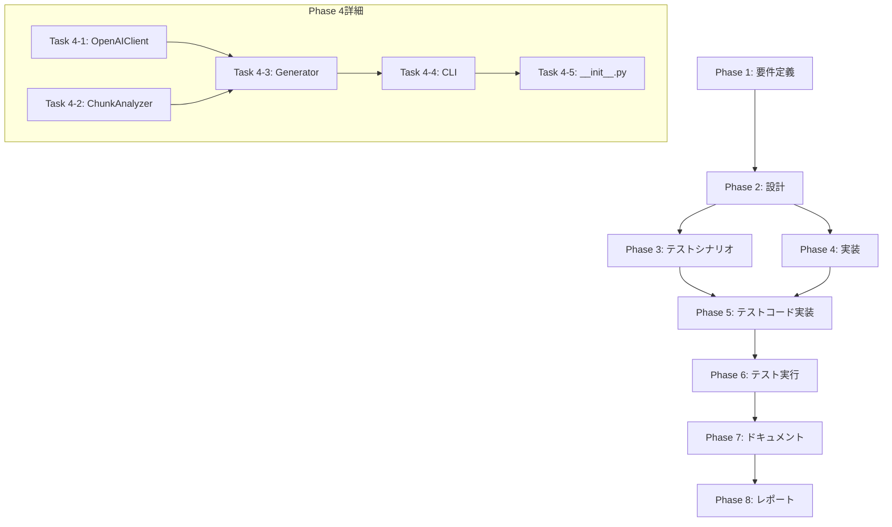

# プロジェクト計画書: Issue #528

## ファイルサイズの削減: pr_comment_generator.py

---

## 1. Issue分析

### 複雑度: **複雑**

**判定根拠**:
- 対象ファイルは1985行の大規模単一ファイル
- 解析ロジック、データモデル生成、OpenAI API連携、プロンプト構築、CLIエントリポイントの5つの責務が混在
- 既に一部モジュール化が進んでいる（`pr_comment_generator/`パッケージに`models.py`, `token_estimator.py`, `prompt_manager.py`, `statistics.py`, `formatter.py`が存在）が、メインファイルとの統合・移行が未完了
- 既存テスト（unit/integration/bdd）との互換性維持が必要
- 外部依存（OpenAI API, GitHub API）との連携部分の切り出しが必要

### 見積もり工数: **32〜48時間**

**内訳**:
- 現状分析と設計: 4〜6時間
- OpenAIクライアント分離: 6〜8時間
- 残りのロジック分離: 8〜12時間
- CLIエントリポイント分離: 2〜4時間
- テスト追加・修正: 8〜12時間
- 統合テスト・回帰確認: 4〜6時間

### リスク評価: **高**

**理由**:
- 既存の本番パイプラインで使用中のコード
- OpenAI API連携ロジックが複雑で、エラーハンドリング・リトライロジックが多数
- 外部インターフェース（CLI引数、出力JSON形式）を維持する必要がある

---

## 2. 実装戦略判断

### 実装戦略: **REFACTOR**

**判断根拠**:
- 新規機能の追加ではなく、既存コードの構造改善が目的
- 既に一部のモジュールが`pr_comment_generator/`パッケージに分離されている
- メインファイル`pr_comment_generator.py`から責務別に機能を抽出し、既存パッケージに統合する
- 外部インターフェース（CLI、出力形式）は変更しない

### テスト戦略: **UNIT_INTEGRATION**

**判断根拠**:
- 新規モジュール（`openai_client.py`, `cli.py`等）のユニットテストが必要
- 既存の統合テスト（`test_compatibility_layer.py`, `test_module_integration.py`）の維持・拡張が必要
- BDDテストは既存の`test_bdd_pr_comment_generation.py`で十分カバーされており、追加は不要
- OpenAI APIとの連携部分はモック化してユニットテストを実施

### テストコード戦略: **BOTH_TEST**

**判断根拠**:
- **CREATE_TEST**: 新規分離モジュール（`openai_client.py`, `cli.py`, `generator.py`）に対する新規テストファイル作成
- **EXTEND_TEST**: 既存の統合テスト・互換性レイヤーテストの拡張

---

## 3. 影響範囲分析

### 既存コードへの影響

| ファイル | 影響内容 |
|---------|---------|
| `src/pr_comment_generator.py` | 完全リファクタリング（1985行→複数モジュールに分割） |
| `src/pr_comment_generator/__init__.py` | 新モジュールのエクスポート追加 |
| `src/github_utils.py` | 変更なし（依存として維持） |
| `tests/unit/test_*.py` | 新規テスト追加、一部修正 |
| `tests/integration/test_*.py` | 互換性確認テストの拡張 |

### 新規作成ファイル（予定）

| ファイル | 責務 |
|---------|------|
| `src/pr_comment_generator/openai_client.py` | OpenAI API連携（リトライ、トークン管理） |
| `src/pr_comment_generator/generator.py` | PRコメント生成のコアロジック |
| `src/pr_comment_generator/cli.py` | CLIエントリポイント |
| `src/pr_comment_generator/chunk_analyzer.py` | チャンク分析ロジック |
| `tests/unit/test_openai_client.py` | OpenAIクライアントのユニットテスト |
| `tests/unit/test_generator.py` | ジェネレーターのユニットテスト |
| `tests/unit/test_cli.py` | CLIのユニットテスト |

### 依存関係の変更

- **新規依存の追加**: なし
- **既存依存の変更**:
  - `pr_comment_generator.py`のmain関数が`cli.py`に移動
  - `PRCommentGenerator`クラスが`generator.py`に移動
  - `OpenAIClient`クラスが`openai_client.py`に移動

### マイグレーション要否

- **データベーススキーマ変更**: なし
- **設定ファイル変更**: なし
- **環境変数変更**: なし
- **外部インターフェース変更**: なし（CLI引数、出力JSON形式は維持）

---

## 4. タスク分割

### Phase 1: 要件定義 (見積もり: 2〜3h)

- [x] Task 1-1: 現状コードの詳細分析 (1〜2h)
  - `pr_comment_generator.py`の責務を関数/クラス単位で分類
  - 既存`pr_comment_generator/`パッケージとの重複・差分を特定
  - 依存関係グラフの作成
- [x] Task 1-2: 分割方針の決定 (0.5〜1h)
  - モジュール境界の定義
  - 公開インターフェースの設計
  - 後方互換性維持方針の確定

### Phase 2: 設計 (見積もり: 3〜4h)

- [x] Task 2-1: モジュール設計書の作成 (2〜3h)
  - `openai_client.py`: OpenAI API連携クラスの詳細設計
  - `generator.py`: PRCommentGeneratorの詳細設計
  - `chunk_analyzer.py`: チャンク分析ロジックの詳細設計
  - `cli.py`: CLIエントリポイントの詳細設計
- [x] Task 2-2: インターフェース定義 (1h)
  - 各モジュール間のインターフェース定義
  - 型ヒントの設計
  - エラーハンドリング方針の統一

### Phase 3: テストシナリオ (見積もり: 2〜3h)

- [x] Task 3-1: ユニットテストシナリオ作成 (1〜2h)
  - `OpenAIClient`のテストケース設計（モック使用）
  - `PRCommentGenerator`のテストケース設計
  - `ChunkAnalyzer`のテストケース設計
  - CLIのテストケース設計
- [x] Task 3-2: 統合テストシナリオ作成 (1h)
  - 既存互換性レイヤーテストの拡張方針
  - エンドツーエンドテストシナリオ

### Phase 4: 実装 (見積もり: 16〜22h)

- [x] Task 4-1: OpenAIClientの分離 (5〜7h)
  - `openai_client.py`の作成
  - APIリクエスト、リトライロジック、トークン管理の移行
  - プロンプト保存機能の移行
  - 型ヒントの追加
- [x] Task 4-2: ChunkAnalyzerの分離 (3〜4h)
  - `chunk_analyzer.py`の作成
  - チャンク分割、最適化ロジックの移行
  - 入力サイズ管理ロジックの移行
- [x] Task 4-3: PRCommentGeneratorのリファクタリング (4〜6h)
  - `generator.py`の作成
  - 既存クラスからの責務分離
  - 新モジュールとの連携実装
- [x] Task 4-4: CLIエントリポイントの分離 (2〜3h)
  - `cli.py`の作成
  - main関数の移行
  - 引数パーサーの整理
- [x] Task 4-5: __init__.pyの更新 (1〜2h)
  - 新モジュールのエクスポート
  - 互換性レイヤーの維持
  - 非推奨警告の更新

### Phase 5: テストコード実装 (見積もり: 8〜12h)

- [x] Task 5-1: OpenAIClientのユニットテスト (3〜4h)
  - モック設定
  - 正常系テスト
  - エラーハンドリングテスト
  - リトライロジックテスト
- [x] Task 5-2: ChunkAnalyzerのユニットテスト (2〜3h)
  - チャンク分割テスト
  - 最適化ロジックテスト
- [x] Task 5-3: PRCommentGeneratorのユニットテスト (2〜3h)
  - コメント生成テスト
  - エラーハンドリングテスト
- [x] Task 5-4: CLIのユニットテスト (1〜2h)
  - 引数パーステスト
  - 出力フォーマットテスト

### Phase 6: テスト実行 (見積もり: 3〜4h)

- [x] Task 6-1: ユニットテストの実行と修正 (1〜2h)
  - 全ユニットテストの実行
  - 失敗テストの修正
  - カバレッジ確認
- [x] Task 6-2: 統合テストの実行と修正 (1〜2h)
  - 互換性レイヤーテストの実行
  - 回帰テストの確認
  - BDDテストの確認

### Phase 7: ドキュメント (見積もり: 2〜3h)

- [x] Task 7-1: コード内ドキュメントの整備 (1〜2h)
  - 各モジュールのdocstring
  - 型ヒントの確認
  - コメントの整理
- [x] Task 7-2: README/CONTRIBUTION.mdの更新 (1h)
  - 新モジュール構造の説明
  - インポートパスの変更案内

### Phase 8: レポート (見積もり: 1〜2h)

- [x] Task 8-1: リファクタリング完了レポート作成 (1〜2h)
  - 変更サマリー
  - 新モジュール構造の説明
  - 今後の改善提案

---

## 5. 依存関係



---

## 6. リスクと軽減策

### リスク1: 既存パイプラインの破損

- **影響度**: 高
- **確率**: 中
- **軽減策**:
  - 外部インターフェース（CLI引数、出力JSON形式）を変更しない
  - 既存の統合テスト・BDDテストで回帰確認
  - 段階的なリファクタリング（一度に全てを変更しない）
  - フィーチャーブランチでの開発、十分なテスト後にマージ

### リスク2: OpenAI API連携の複雑性

- **影響度**: 高
- **確率**: 中
- **軽減策**:
  - リトライロジック、エラーハンドリングの単体テストを充実させる
  - モックを活用したユニットテストで境界条件を網羅
  - 既存のログ出力を維持し、デバッグ容易性を確保

### リスク3: 互換性レイヤーの破損

- **影響度**: 中
- **確率**: 低
- **軽減策**:
  - 既存の`test_compatibility_layer.py`を拡張
  - 非推奨警告を適切に表示
  - 段階的な移行パスを提供

### リスク4: テストカバレッジの低下

- **影響度**: 中
- **確率**: 中
- **軽減策**:
  - リファクタリング前のカバレッジをベースラインとして記録
  - 新モジュールごとに80%以上のカバレッジを目標
  - 未カバー部分を明確にドキュメント化

---

## 7. 品質ゲート

### Phase 1: 要件定義

- [ ] 責務分類が明確に文書化されている
- [ ] モジュール境界が定義されている
- [ ] 依存関係グラフが作成されている

### Phase 2: 設計

- [ ] 実装戦略（REFACTOR）の判断根拠が明記されている
- [ ] テスト戦略（UNIT_INTEGRATION）の判断根拠が明記されている
- [ ] 各モジュールの公開インターフェースが定義されている
- [ ] 型ヒントが設計に含まれている

### Phase 3: テストシナリオ

- [x] 各モジュールに対するテストケースが設計されている
- [x] エッジケース・エラーケースが含まれている
- [x] 統合テストシナリオが定義されている

### Phase 4: 実装

- [ ] 各モジュールが独立してインポート可能
- [ ] 循環依存がない
- [ ] 既存の外部インターフェースが維持されている
- [ ] Linting/型チェックがパスする

### Phase 5: テストコード実装

- [ ] 各モジュールに対応するテストファイルが存在する
- [ ] モックが適切に使用されている
- [ ] テストが独立して実行可能

### Phase 6: テスト実行

- [ ] 全ユニットテストがパス
- [ ] 全統合テストがパス
- [ ] カバレッジが目標値（80%）以上
- [ ] 既存BDDテストがパス

### Phase 7: ドキュメント

- [ ] 全モジュールにdocstringが存在
- [ ] インポートパスの変更が文書化されている
- [ ] 移行ガイドが提供されている

### Phase 8: レポート

- [x] 変更サマリーが作成されている
- [x] 新モジュール構造が説明されている
- [x] 今後の改善提案が含まれている

---

## 付録: 現状のコード構造分析

### pr_comment_generator.py の主要コンポーネント

| 行範囲 | コンポーネント | 責務 | 移行先 |
|--------|---------------|------|--------|
| 1-21 | インポート | 依存関係定義 | 各モジュールに分散 |
| 22-71 | PRInfo, FileChange | データモデル | 既存 models.py (済) |
| 73-130 | PromptTemplateManager | プロンプト管理 | 既存 prompt_manager.py (済) |
| 132-171 | TokenEstimator | トークン推定 | 既存 token_estimator.py (済) |
| 174-1424 | OpenAIClient | OpenAI API連携 | 新規 openai_client.py |
| 1426-1907 | PRCommentGenerator | コメント生成 | 新規 generator.py |
| 1909-1985 | main() | CLIエントリポイント | 新規 cli.py |

### 既存パッケージ構造

```
src/pr_comment_generator/
├── __init__.py         # 互換性レイヤー（済）
├── models.py           # データモデル（済）
├── token_estimator.py  # トークン推定（済）
├── prompt_manager.py   # プロンプト管理（済）
├── statistics.py       # 統計処理（済）
├── formatter.py        # フォーマット処理（済）
├── openai_client.py    # 新規作成
├── generator.py        # 新規作成
├── chunk_analyzer.py   # 新規作成
└── cli.py              # 新規作成
```

---

## 承認

本計画書は、Issue #528 の実装に関する詳細な計画を提供します。
実装開始前に、ステークホルダーの承認を得てください。

**作成日**: 2025年
**作成者**: AI Workflow Planning Agent
