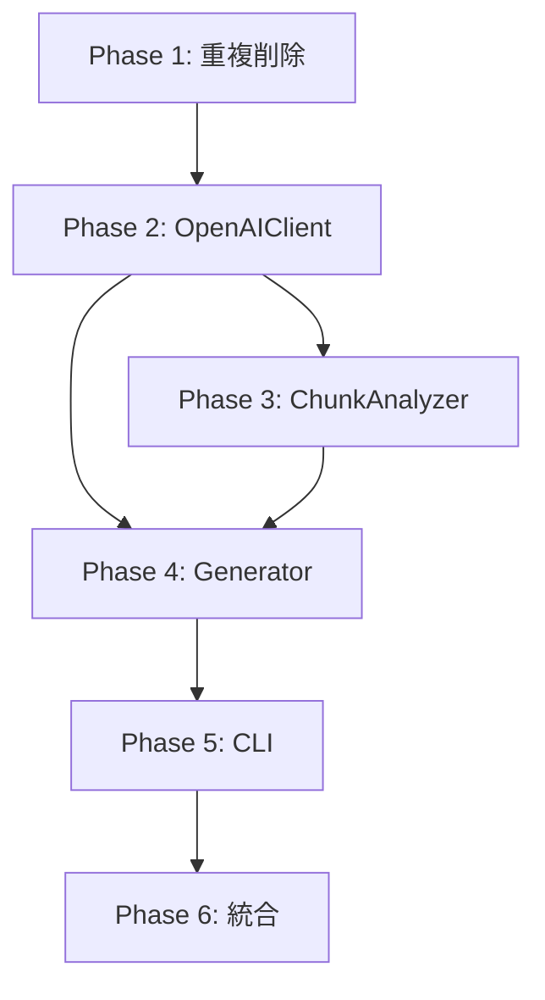

# 詳細設計書: Issue #528

## ファイルサイズの削減: pr_comment_generator.py

---

## 0. Planning/Requirements Documentの確認

本設計書は、以下のドキュメントに基づいて作成されています：

- **Planning Document**: `.ai-workflow/issue-528/00_planning/output/planning.md`
- **Requirements Document**: `.ai-workflow/issue-528/01_requirements/output/requirements.md`

### Planningドキュメントの要点

| 項目 | 決定事項 |
|------|----------|
| **複雑度** | 複雑（1985行の大規模単一ファイル） |
| **見積もり工数** | 32〜48時間 |
| **リスク評価** | 高（既存パイプライン使用中、外部API連携複雑） |
| **実装戦略** | REFACTOR（既存コードの構造改善） |
| **テスト戦略** | UNIT_INTEGRATION（新規ユニットテスト＋既存統合テスト拡張） |
| **テストコード戦略** | BOTH_TEST（新規作成＋既存拡張） |

---

## 1. 実装戦略判断

### 実装戦略: REFACTOR

**判断根拠**:
- 新規機能の追加ではなく、既存の1985行のモノリシックファイルを責務ごとに分割する構造改善が主目的
- 既に`pr_comment_generator/`パッケージに6つのモジュール（models.py, token_estimator.py, prompt_manager.py, statistics.py, formatter.py, __init__.py）が分離済み
- メインファイルには重複コード（PRInfo, FileChange, PromptTemplateManager, TokenEstimator）が残っており、これらを削除してパッケージからインポートする必要がある
- 外部インターフェース（CLI引数、出力JSON形式）は変更しない

---

## 2. テスト戦略判断

### テスト戦略: UNIT_INTEGRATION

**判断根拠**:
- **Unitテスト必要**: 新規分離モジュール（`openai_client.py`, `generator.py`, `cli.py`, `chunk_analyzer.py`）に対するユニットテストが必須
- **Integrationテスト必要**: 既存の統合テスト（`test_compatibility_layer.py`, `test_module_integration.py`）の維持・拡張が必要
- **BDDテスト不要**: 既存の`test_bdd_pr_comment_generation.py`でエンドツーエンドのシナリオが十分カバーされている
- OpenAI APIとの連携部分はモック化してユニットテストを実施

---

## 3. テストコード戦略判断

### テストコード戦略: BOTH_TEST

**判断根拠**:
- **CREATE_TEST**: 新規分離モジュール用に以下のテストファイルを新規作成
  - `tests/unit/test_openai_client.py`
  - `tests/unit/test_generator.py`
  - `tests/unit/test_cli.py`
  - `tests/unit/test_chunk_analyzer.py`
- **EXTEND_TEST**: 既存テストの拡張
  - `tests/integration/test_compatibility_layer.py`: 新モジュールの互換性確認追加
  - `tests/integration/test_module_integration.py`: 新モジュール間の連携テスト追加

---

## 4. アーキテクチャ設計

### 4.1 システム全体図

```
┌─────────────────────────────────────────────────────────────────┐
│                     pr_comment_generator.py                      │
│                        (メインエントリ)                           │
│  ┌──────────────────────────────────────────────────────────┐   │
│  │  main() - CLI引数処理、環境変数設定、エラーハンドリング    │   │
│  └──────────────────────────────────────────────────────────┘   │
│                              ↓                                   │
│  ┌──────────────────────────────────────────────────────────┐   │
│  │             PRCommentGenerator (ファサード)               │   │
│  │  - 依存コンポーネントの初期化・調整                        │   │
│  │  - ワークフローのオーケストレーション                      │   │
│  └──────────────────────────────────────────────────────────┘   │
└─────────────────────────────────────────────────────────────────┘
                              ↓ 使用
┌─────────────────────────────────────────────────────────────────┐
│                 pr_comment_generator/ パッケージ                 │
├─────────────────────────────────────────────────────────────────┤
│ 既存モジュール (分離済み)                                        │
│ ├── models.py          - PRInfo, FileChange データモデル        │
│ ├── token_estimator.py - トークン推定・テキスト切り詰め          │
│ ├── prompt_manager.py  - プロンプトテンプレート管理              │
│ ├── statistics.py      - 統計処理・チャンクサイズ計算            │
│ ├── formatter.py       - Markdownフォーマット・ファイルリスト    │
│ └── __init__.py        - パッケージファサード・互換性レイヤー    │
├─────────────────────────────────────────────────────────────────┤
│ 新規モジュール (本Issue で作成)                                  │
│ ├── openai_client.py   - OpenAI API通信・リトライ・トークン管理   │
│ ├── generator.py       - PRCommentGenerator コアロジック          │
│ ├── chunk_analyzer.py  - チャンク分割・分析調整                   │
│ └── cli.py             - CLIエントリポイント                      │
└─────────────────────────────────────────────────────────────────┘
                              ↓ 使用
┌─────────────────────────────────────────────────────────────────┐
│                      github_utils.py                             │
│  GitHubClient - GitHub API連携 (変更なし)                        │
└─────────────────────────────────────────────────────────────────┘
```

### 4.2 コンポーネント間の関係

```
                    ┌──────────────────┐
                    │     cli.py       │
                    │   (エントリ)     │
                    └────────┬─────────┘
                             │
                             ▼
                    ┌──────────────────┐
                    │  generator.py    │
                    │  (オーケストラ)  │
                    └────────┬─────────┘
                             │
         ┌───────────────────┼───────────────────┐
         │                   │                   │
         ▼                   ▼                   ▼
┌────────────────┐  ┌────────────────┐  ┌────────────────┐
│ openai_client  │  │ chunk_analyzer │  │  github_utils  │
│   .py          │  │    .py         │  │    .py         │
└────────┬───────┘  └────────┬───────┘  └────────────────┘
         │                   │
         │                   ▼
         │          ┌────────────────┐
         │          │  statistics.py │
         │          └────────────────┘
         │
         ▼
┌────────────────┐  ┌────────────────┐  ┌────────────────┐
│ prompt_manager │  │token_estimator │  │  formatter.py  │
│     .py        │  │     .py        │  │                │
└────────────────┘  └────────────────┘  └────────────────┘
         │
         ▼
┌────────────────┐
│   models.py    │
│ (PRInfo等)     │
└────────────────┘
```

### 4.3 データフロー

```
[CLI入力]
    │
    ▼
┌─────────────────────────────────────────────────────────────┐
│ 1. main() - 引数解析、環境変数設定                          │
│    - --pr-diff, --pr-info, --output 取得                   │
│    - ログレベル、並列処理オプション設定                     │
└─────────────────────────────────────────────────────────────┘
    │
    ▼
┌─────────────────────────────────────────────────────────────┐
│ 2. PRCommentGenerator.generate_comment()                    │
│    - PR情報とDiff読み込み (load_pr_data)                   │
│    - GitHubからファイル内容取得                             │
│    - 大きいファイルのフィルタリング                         │
└─────────────────────────────────────────────────────────────┘
    │
    ▼
┌─────────────────────────────────────────────────────────────┐
│ 3. ChunkAnalyzer.analyze_changes()                          │
│    - 最適チャンクサイズ計算                                 │
│    - ファイルをチャンクに分割                               │
│    - 各チャンクの分析実行                                   │
└─────────────────────────────────────────────────────────────┘
    │
    ▼
┌─────────────────────────────────────────────────────────────┐
│ 4. OpenAIClient._analyze_chunk() / _generate_final_summary()│
│    - 入力JSONの準備・最適化                                 │
│    - OpenAI API呼び出し（リトライ付き）                     │
│    - レスポンス処理・トークン使用量記録                     │
└─────────────────────────────────────────────────────────────┘
    │
    ▼
┌─────────────────────────────────────────────────────────────┐
│ 5. 結果の整形・出力                                         │
│    - ファイルセクションの重複修正                           │
│    - JSON出力ファイル作成                                   │
└─────────────────────────────────────────────────────────────┘
    │
    ▼
[JSON出力]
```

---

## 5. 影響範囲分析

### 5.1 既存コードへの影響

| ファイル | 影響内容 | 変更種別 |
|---------|---------|----------|
| `src/pr_comment_generator.py` | 完全リファクタリング（1985行→ファサードのみ約100行） | 大規模修正 |
| `src/pr_comment_generator/__init__.py` | 新モジュールのエクスポート追加 | 軽微な修正 |
| `src/github_utils.py` | 変更なし（依存として維持） | 変更なし |
| `tests/unit/test_*.py` | 新規テスト追加 | 新規作成 |
| `tests/integration/test_*.py` | 互換性確認テストの拡張 | 拡張 |

### 5.2 重複コードの削除

現在、`pr_comment_generator.py`に以下のクラスが重複定義されており、パッケージからインポートするように変更：

| クラス | メインファイル行 | パッケージモジュール | アクション |
|--------|-----------------|---------------------|-----------|
| PRInfo | 23-46行 | models.py | 削除→インポート |
| FileChange | 49-71行 | models.py | 削除→インポート |
| PromptTemplateManager | 73-131行 | prompt_manager.py | 削除→インポート |
| TokenEstimator | 132-173行 | token_estimator.py | 削除→インポート |

### 5.3 依存関係の変更

- **新規依存の追加**: なし
- **既存依存の変更**:
  - `pr_comment_generator.py`が`pr_comment_generator/`パッケージの新規モジュールをインポート
  - `__init__.py`が新規モジュール（`openai_client`, `generator`, `cli`, `chunk_analyzer`）をエクスポート

### 5.4 マイグレーション要否

| 項目 | 要否 |
|------|------|
| データベーススキーマ変更 | なし |
| 設定ファイル変更 | なし |
| 環境変数変更 | なし |
| 外部インターフェース変更 | なし（CLI引数、出力JSON形式は維持） |

---

## 6. 変更・追加ファイルリスト

### 6.1 新規作成ファイル

| ファイルパス（相対パス） | 責務 | 予想行数 |
|------------------------|------|---------|
| `jenkins/jobs/pipeline/docs-generator/pull-request-comment-builder/src/pr_comment_generator/openai_client.py` | OpenAI API連携（リトライ、トークン管理、プロンプト保存） | 450-550行 |
| `jenkins/jobs/pipeline/docs-generator/pull-request-comment-builder/src/pr_comment_generator/generator.py` | PRCommentGeneratorコアロジック | 350-400行 |
| `jenkins/jobs/pipeline/docs-generator/pull-request-comment-builder/src/pr_comment_generator/chunk_analyzer.py` | チャンク分割・分析調整ロジック | 200-250行 |
| `jenkins/jobs/pipeline/docs-generator/pull-request-comment-builder/src/pr_comment_generator/cli.py` | CLIエントリポイント | 80-100行 |
| `jenkins/jobs/pipeline/docs-generator/pull-request-comment-builder/tests/unit/test_openai_client.py` | OpenAIClientのユニットテスト | 300-400行 |
| `jenkins/jobs/pipeline/docs-generator/pull-request-comment-builder/tests/unit/test_generator.py` | PRCommentGeneratorのユニットテスト | 250-300行 |
| `jenkins/jobs/pipeline/docs-generator/pull-request-comment-builder/tests/unit/test_cli.py` | CLIのユニットテスト | 100-150行 |
| `jenkins/jobs/pipeline/docs-generator/pull-request-comment-builder/tests/unit/test_chunk_analyzer.py` | ChunkAnalyzerのユニットテスト | 150-200行 |

### 6.2 修正が必要な既存ファイル

| ファイルパス（相対パス） | 修正内容 |
|------------------------|---------|
| `jenkins/jobs/pipeline/docs-generator/pull-request-comment-builder/src/pr_comment_generator.py` | リファクタリング：重複クラス削除、パッケージからインポート、ファサードとして簡素化 |
| `jenkins/jobs/pipeline/docs-generator/pull-request-comment-builder/src/pr_comment_generator/__init__.py` | 新モジュールのエクスポート追加、`__all__`更新 |
| `jenkins/jobs/pipeline/docs-generator/pull-request-comment-builder/tests/integration/test_compatibility_layer.py` | 新モジュールの互換性テスト追加 |
| `jenkins/jobs/pipeline/docs-generator/pull-request-comment-builder/tests/integration/test_module_integration.py` | 新モジュール間の連携テスト追加 |

### 6.3 削除が必要なファイル

- なし（メインファイル内のコードは削除されるが、ファイル自体は残る）

---

## 7. 詳細設計

### 7.1 クラス設計

#### 7.1.1 OpenAIClient クラス（新規: openai_client.py）

```python
class OpenAIClient:
    """
    OpenAI APIとのインタラクションを管理するクラス

    責務:
    - OpenAI API呼び出し（リトライロジック含む）
    - トークン使用量の追跡
    - プロンプトと結果の保存（デバッグ用）
    - 入力サイズの最適化
    """

    # 定数
    DEFAULT_MAX_RETRIES = 5
    DEFAULT_INITIAL_BACKOFF = 1
    DEFAULT_MAX_BACKOFF = 60
    MAX_TOKENS_PER_REQUEST = 16000
    MAX_PATCH_TOKENS = 2000
    MAX_CONTENT_TOKENS = 3000

    def __init__(self,
                 prompt_manager: PromptTemplateManager,
                 retry_config: Optional[Dict] = None,
                 log_level: int = logging.INFO):
        """OpenAIクライアントを初期化"""
        pass

    # --- API通信メソッド ---
    def call_api(self, messages: List[Dict[str, str]],
                 max_tokens: int = 2000) -> str:
        """OpenAI APIを呼び出し（リトライロジック付き）"""
        pass

    def _make_api_request(self, messages: List[Dict],
                          max_tokens: int) -> Any:
        """実際のAPIリクエストを実行"""
        pass

    def _handle_retry(self, error: Exception,
                      retries: int, backoff: float) -> Tuple[bool, float]:
        """リトライ戦略を決定"""
        pass

    # --- 入力準備メソッド ---
    def prepare_input_json(self, pr_info: PRInfo,
                           changes: List[FileChange]) -> str:
        """API入力用のJSONを準備"""
        pass

    def manage_input_size(self, input_json: str,
                          max_tokens: int) -> str:
        """入力サイズを最適化"""
        pass

    # --- 分析メソッド ---
    def analyze_chunk(self, pr_info: PRInfo,
                      chunk: List[FileChange],
                      chunk_index: int) -> str:
        """単一チャンクを分析"""
        pass

    def generate_final_summary(self, pr_info: PRInfo,
                               chunk_analyses: List[str],
                               skipped_files: List[str] = None) -> str:
        """チャンク分析から最終サマリーを生成"""
        pass

    def generate_title(self, summary: str) -> str:
        """サマリーからタイトルを生成"""
        pass

    # --- ユーティリティ ---
    def get_usage_stats(self) -> Dict[str, int]:
        """トークン使用量統計を取得"""
        pass

    def save_prompt_and_result(self, prompt: str, result: str,
                               chunk_index: int = 0, phase: str = "chunk"):
        """プロンプトと結果をファイルに保存"""
        pass
```

#### 7.1.2 ChunkAnalyzer クラス（新規: chunk_analyzer.py）

```python
class ChunkAnalyzer:
    """
    PRファイル変更のチャンク分割と分析を調整するクラス

    責務:
    - 最適なチャンクサイズの計算
    - ファイル変更のチャンク分割
    - チャンク分析の調整
    """

    def __init__(self,
                 openai_client: OpenAIClient,
                 statistics: PRCommentStatistics,
                 log_level: int = logging.INFO):
        """ChunkAnalyzerを初期化"""
        pass

    def calculate_optimal_chunk_size(self,
                                     changes: List[FileChange]) -> int:
        """ファイル変更に基づいて最適なチャンクサイズを計算"""
        pass

    def split_into_chunks(self,
                          changes: List[FileChange],
                          chunk_size: int) -> List[List[FileChange]]:
        """ファイル変更をチャンクに分割"""
        pass

    def analyze_all_chunks(self,
                           pr_info: PRInfo,
                           chunks: List[List[FileChange]]) -> List[str]:
        """すべてのチャンクを分析"""
        pass

    def analyze_single_chunk(self,
                             pr_info: PRInfo,
                             chunk: List[FileChange],
                             chunk_index: int) -> str:
        """単一チャンクを分析"""
        pass
```

#### 7.1.3 PRCommentGenerator クラス（リファクタリング: generator.py）

```python
class PRCommentGenerator:
    """
    PRコメント生成のオーケストレーター

    責務:
    - 依存コンポーネントの初期化
    - PR情報とDiffの読み込み
    - GitHubからのファイル内容取得
    - 大きいファイルのフィルタリング
    - コメント生成ワークフローの調整
    """

    def __init__(self, log_level: int = logging.INFO):
        """依存コンポーネントを初期化"""
        pass

    # --- データ読み込み ---
    def load_pr_data(self,
                     pr_info_path: str,
                     pr_diff_path: str) -> Tuple[PRInfo, List[FileChange], List[str]]:
        """PR情報とDiffを読み込み"""
        pass

    def _filter_large_files(self,
                            changes: List[FileChange]) -> Tuple[List[FileChange], List[FileChange]]:
        """大きすぎるファイルをフィルタリング"""
        pass

    def _is_binary_file(self, filename: str) -> bool:
        """バイナリファイルかどうかを判定"""
        pass

    # --- ファイル内容取得 ---
    def _fetch_file_contents_sequential(self,
                                        pr_data: Dict,
                                        pr_info: PRInfo,
                                        changes: List[FileChange]) -> List[FileChange]:
        """ファイル内容を順次取得"""
        pass

    def _fetch_file_contents_parallel(self,
                                      pr_data: Dict,
                                      pr_info: PRInfo,
                                      changes: List[FileChange]) -> List[FileChange]:
        """ファイル内容を並列取得"""
        pass

    # --- コメント生成 ---
    def generate_comment(self,
                         pr_info_path: str,
                         pr_diff_path: str) -> Dict[str, Any]:
        """PRコメントを生成"""
        pass

    # --- ファイルパス正規化 ---
    def _rebuild_file_section(self,
                              comment: str,
                              original_file_paths: List[str]) -> str:
        """ファイルセクションを再構築して重複を排除"""
        pass
```

#### 7.1.4 CLI モジュール（新規: cli.py）

```python
def create_argument_parser() -> argparse.ArgumentParser:
    """コマンドライン引数パーサーを作成"""
    pass

def setup_environment_from_args(args: argparse.Namespace) -> None:
    """引数から環境変数を設定"""
    pass

def main() -> None:
    """CLIエントリポイント"""
    pass

if __name__ == '__main__':
    main()
```

### 7.2 インターフェース設計

#### 7.2.1 モジュール間インターフェース

```python
# openai_client.py が提供するインターフェース
class OpenAIClientInterface(Protocol):
    def call_api(self, messages: List[Dict[str, str]], max_tokens: int) -> str: ...
    def analyze_chunk(self, pr_info: PRInfo, chunk: List[FileChange], chunk_index: int) -> str: ...
    def generate_final_summary(self, pr_info: PRInfo, chunk_analyses: List[str], skipped_files: List[str]) -> str: ...
    def generate_title(self, summary: str) -> str: ...
    def get_usage_stats(self) -> Dict[str, int]: ...

# chunk_analyzer.py が提供するインターフェース
class ChunkAnalyzerInterface(Protocol):
    def calculate_optimal_chunk_size(self, changes: List[FileChange]) -> int: ...
    def split_into_chunks(self, changes: List[FileChange], chunk_size: int) -> List[List[FileChange]]: ...
    def analyze_all_chunks(self, pr_info: PRInfo, chunks: List[List[FileChange]]) -> List[str]: ...

# generator.py が提供するインターフェース
class PRCommentGeneratorInterface(Protocol):
    def load_pr_data(self, pr_info_path: str, pr_diff_path: str) -> Tuple[PRInfo, List[FileChange], List[str]]: ...
    def generate_comment(self, pr_info_path: str, pr_diff_path: str) -> Dict[str, Any]: ...
```

#### 7.2.2 型ヒント

すべての公開メソッドに型ヒントを付与：

```python
from typing import Any, Dict, List, Optional, Tuple, Protocol
from dataclasses import dataclass

# 既存の型を使用
from .models import PRInfo, FileChange
```

### 7.3 データ構造設計

#### 7.3.1 使用統計データ構造

```python
@dataclass
class UsageStats:
    """トークン使用量統計"""
    prompt_tokens: int = 0
    completion_tokens: int = 0
    retries: int = 0
    skipped_files: int = 0

    def to_dict(self) -> Dict[str, int]:
        return {
            'prompt_tokens': self.prompt_tokens,
            'completion_tokens': self.completion_tokens,
            'retries': self.retries,
            'skipped_files': self.skipped_files
        }
```

#### 7.3.2 生成結果データ構造

```python
@dataclass
class GenerationResult:
    """PRコメント生成結果"""
    comment: str
    suggested_title: str
    usage: Dict[str, int]
    pr_number: int
    file_count: int
    processed_file_count: int
    skipped_file_count: int
    skipped_files: List[str]
    total_changes: int = 0
    execution_time_seconds: float = 0.0
    error: Optional[str] = None
    traceback: Optional[str] = None

    def to_dict(self) -> Dict[str, Any]:
        """辞書形式に変換（JSON出力用）"""
        pass
```

### 7.4 エラーハンドリング設計

#### 7.4.1 カスタム例外クラス

```python
# openai_client.py
class OpenAIClientError(Exception):
    """OpenAIクライアントの基本例外"""
    pass

class APIRateLimitError(OpenAIClientError):
    """レート制限エラー"""
    def __init__(self, message: str, retry_after: Optional[float] = None):
        super().__init__(message)
        self.retry_after = retry_after

class APIMaxRetriesError(OpenAIClientError):
    """最大リトライ回数超過エラー"""
    pass

class TokenLimitExceededError(OpenAIClientError):
    """トークン制限超過エラー"""
    pass

# generator.py
class PRCommentGeneratorError(Exception):
    """PRコメント生成の基本例外"""
    pass

class PRDataLoadError(PRCommentGeneratorError):
    """PR情報読み込みエラー"""
    pass

class FileContentFetchError(PRCommentGeneratorError):
    """ファイル内容取得エラー"""
    pass
```

#### 7.4.2 エラーハンドリング方針

1. **API呼び出しエラー**: 指数バックオフでリトライ（最大5回）
2. **レート制限エラー**: エラーメッセージから待機時間を抽出して待機
3. **ファイル取得エラー**: ログ出力して部分的な情報で継続
4. **チャンク分析エラー**: エラーメッセージを記録して次のチャンクに進む
5. **致命的エラー**: エラー情報を含む結果辞書を返却

---

## 8. セキュリティ考慮事項

### 8.1 認証・認可

| 項目 | 対策 |
|------|------|
| OpenAI APIキー | 環境変数`OPENAI_API_KEY`から取得、コードにハードコードしない |
| GitHub認証 | GitHubClient経由でApp認証またはPAT認証を使用 |
| ログ出力 | APIキーやトークンをログに出力しない |

### 8.2 データ保護

| 項目 | 対策 |
|------|------|
| プロンプト保存 | `SAVE_PROMPTS`環境変数でオプトイン制御 |
| 出力ディレクトリ | `PROMPT_OUTPUT_DIR`で指定された安全なディレクトリに保存 |
| 機密情報 | ファイル内容にシークレットが含まれる可能性を考慮し、保存は明示的なオプトインのみ |

### 8.3 セキュリティリスクと対策

| リスク | 対策 |
|--------|------|
| APIキー漏洩 | 環境変数使用、ログマスキング |
| レート制限悪用 | 指数バックオフ、最大リトライ制限 |
| 大量データ処理 | ファイルサイズ制限、チャンク分割 |

---

## 9. 非機能要件への対応

### 9.1 パフォーマンス

| 要件 | 対応方針 |
|------|---------|
| 実行時間維持 | モジュール分割による追加オーバーヘッドを最小化 |
| 並列処理 | ファイル内容取得の並列化オプション維持 |
| API効率 | チャンク最適化、入力サイズ管理の維持 |

### 9.2 スケーラビリティ

| 要件 | 対応方針 |
|------|---------|
| 大規模PR対応 | チャンク分割による段階的処理 |
| ファイル数制限 | `MAX_FILES_TO_PROCESS`による制限維持 |
| ファイルサイズ制限 | `MAX_FILE_SIZE`による制限維持 |

### 9.3 保守性

| 要件 | 対応方針 |
|------|---------|
| 単一責務 | 各モジュールが1つの責務を担当 |
| テスト容易性 | 依存性注入によるモック化対応 |
| ドキュメント | 全モジュールにdocstring、型ヒント付与 |
| ログ出力 | 統一フォーマット、モジュール別ロガー |

---

## 10. 実装の順序

### 10.1 Phase 1: 重複コード削除（1〜2時間）

1. `pr_comment_generator.py`から重複クラス（PRInfo, FileChange, PromptTemplateManager, TokenEstimator）を削除
2. パッケージからインポートするように変更
3. 既存テストが通ることを確認

### 10.2 Phase 2: OpenAIClient抽出（5〜7時間）

1. `openai_client.py`を新規作成
2. API通信関連メソッドを移行
3. 入力準備・最適化メソッドを移行
4. プロンプト保存機能を移行
5. 型ヒントを追加
6. ユニットテスト（`test_openai_client.py`）を作成

### 10.3 Phase 3: ChunkAnalyzer抽出（3〜4時間）

1. `chunk_analyzer.py`を新規作成
2. チャンク分割ロジックを移行
3. 分析調整ロジックを移行
4. 型ヒントを追加
5. ユニットテスト（`test_chunk_analyzer.py`）を作成

### 10.4 Phase 4: PRCommentGeneratorリファクタリング（4〜6時間）

1. `generator.py`を新規作成
2. PRCommentGeneratorクラスを移行
3. 新モジュール（OpenAIClient, ChunkAnalyzer）を使用するように修正
4. 型ヒントを追加
5. ユニットテスト（`test_generator.py`）を作成

### 10.5 Phase 5: CLI分離（2〜3時間）

1. `cli.py`を新規作成
2. main()関数を移行
3. 引数パーサーを整理
4. ユニットテスト（`test_cli.py`）を作成

### 10.6 Phase 6: 統合・__init__.py更新（2〜3時間）

1. `__init__.py`に新モジュールのエクスポートを追加
2. `pr_comment_generator.py`をファサードとして簡素化
3. 既存の統合テスト・BDDテストが通ることを確認
4. 互換性レイヤーテストの拡張

### 10.7 依存関係図



---

## 11. テスト設計

### 11.1 ユニットテストケース

#### test_openai_client.py

| テストケース | 内容 |
|-------------|------|
| test_init_with_valid_api_key | 有効なAPIキーでの初期化 |
| test_init_missing_api_key | APIキー未設定時のエラー |
| test_call_api_success | API呼び出し成功 |
| test_call_api_with_retry | リトライロジック |
| test_call_api_rate_limit | レート制限エラー処理 |
| test_call_api_max_retries | 最大リトライ超過 |
| test_prepare_input_json | 入力JSON準備 |
| test_manage_input_size | 入力サイズ最適化 |
| test_analyze_chunk | チャンク分析 |
| test_generate_final_summary | サマリー生成 |
| test_generate_title | タイトル生成 |
| test_save_prompt_enabled | プロンプト保存（有効時） |
| test_save_prompt_disabled | プロンプト保存（無効時） |

#### test_chunk_analyzer.py

| テストケース | 内容 |
|-------------|------|
| test_calculate_optimal_chunk_size_small | 小規模変更でのチャンクサイズ |
| test_calculate_optimal_chunk_size_large | 大規模変更でのチャンクサイズ |
| test_split_into_chunks | チャンク分割 |
| test_split_single_file | 単一ファイル |
| test_analyze_all_chunks | 全チャンク分析 |
| test_analyze_chunk_error_handling | チャンク分析エラー処理 |

#### test_generator.py

| テストケース | 内容 |
|-------------|------|
| test_load_pr_data_success | PR情報読み込み成功 |
| test_load_pr_data_file_not_found | ファイル未存在時のエラー |
| test_filter_large_files | 大きいファイルのフィルタリング |
| test_is_binary_file | バイナリファイル判定 |
| test_generate_comment_success | コメント生成成功 |
| test_generate_comment_no_files | ファイルなしのハンドリング |
| test_rebuild_file_section | ファイルセクション再構築 |

#### test_cli.py

| テストケース | 内容 |
|-------------|------|
| test_create_argument_parser | 引数パーサー作成 |
| test_required_arguments | 必須引数チェック |
| test_optional_arguments | オプション引数処理 |
| test_environment_setup | 環境変数設定 |
| test_main_success | main()正常実行 |
| test_main_error_handling | main()エラー処理 |

### 11.2 統合テスト拡張

#### test_compatibility_layer.py（拡張）

| テストケース | 内容 |
|-------------|------|
| test_new_module_imports | 新モジュールのインポート確認 |
| test_openai_client_backward_compat | OpenAIClientの後方互換性 |
| test_generator_backward_compat | Generatorの後方互換性 |

#### test_module_integration.py（拡張）

| テストケース | 内容 |
|-------------|------|
| test_openai_client_with_chunk_analyzer | OpenAIClient + ChunkAnalyzer連携 |
| test_generator_full_workflow | Generator完全ワークフロー |
| test_cli_to_generator_integration | CLI → Generator連携 |

---

## 12. 品質ゲート確認

### 設計フェーズ品質ゲート

- [x] **実装戦略の判断根拠が明記されている**: REFACTOR戦略、判断根拠3点記載
- [x] **テスト戦略の判断根拠が明記されている**: UNIT_INTEGRATION戦略、判断根拠4点記載
- [x] **既存コードへの影響範囲が分析されている**: 影響範囲分析セクション（セクション5）で詳細記載
- [x] **変更が必要なファイルがリストアップされている**: セクション6で新規・修正・削除ファイルを明記
- [x] **設計が実装可能である**: 詳細なクラス設計、インターフェース定義、実装順序を提示

---

## 13. 変更履歴

| 日付 | バージョン | 変更内容 | 作成者 |
|------|-----------|----------|--------|
| 2025年 | 1.0.0 | 初版作成 | AI Workflow Design Agent |

---

## 14. 承認

本設計書は、Issue #528 の実装に関する詳細な設計を提供します。
実装フェーズ開始前に、ステークホルダーの承認を得てください。

**作成日**: 2025年
**作成者**: AI Workflow Design Agent
**関連Issue**: [#528](https://github.com/tielec/infrastructure-as-code/issues/528)
