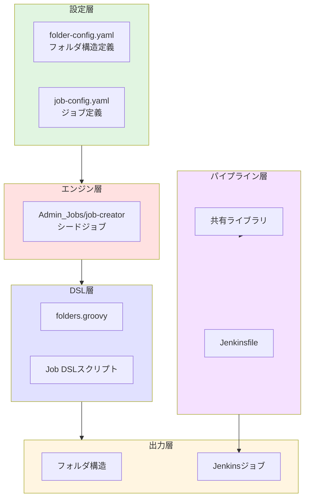

# Codex Agent 実行ログ

開始日時: 2025/12/25 13:43:55

---

## Turn 1: スレッド開始

**Thread ID**: `[REDACTED_TOKEN]`

## Turn 2: ツール実行

**種別**: reasoning
**ステータス**: completed

## Turn 3: ツール実行

**種別**: mcp_tool_call
**ステータス**: completed

## Turn 4: ツール実行

**種別**: reasoning
**ステータス**: completed

## Turn 5: ツール実行

**種別**: コマンド実行
**コマンド**: `/bin/bash -lc ls`
**ステータス**: completed (exit_code=0)

```text
ARCHITECTURE.md
CLAUDE.md
CONTRIBUTION.md
LICENSE
README.md
ansible
bootstrap
docker
docs
jenkins
pulumi
run_tests_issue_322.sh
scripts
tests
```

## Turn 6: ツール実行

**種別**: reasoning
**ステータス**: completed

## Turn 7: ツール実行

**種別**: コマンド実行
**コマンド**: `/bin/bash -lc 'find .. -name AGENTS.md -print'`
**ステータス**: completed (exit_code=0)

## Turn 8: ツール実行

**種別**: reasoning
**ステータス**: completed

## Turn 9: ツール実行

**種別**: コマンド実行
**コマンド**: `/bin/bash -lc 'ls .ai-workflow/issue-528'`
**ステータス**: completed (exit_code=0)

```text
00_planning
01_requirements
02_design
03_test_scenario
04_implementation
metadata.json
```

## Turn 10: ツール実行

**種別**: reasoning
**ステータス**: completed

## Turn 11: ツール実行

**種別**: コマンド実行
**コマンド**: `/bin/bash -lc 'cat .ai-workflow/issue-528/00_planning/output/planning.md'`
**ステータス**: completed (exit_code=0)

```text
# プロジェクト計画書: Issue #528

## ファイルサイズの削減: pr_comment_generator.py

---

## 1. Issue分析

### 複雑度: **複雑**

**判定根拠**:
- 対象ファイルは1985行の大規模単一ファイル
- 解析ロジック、データモデル生成、OpenAI API連携、プロンプト構築、CLIエントリポイントの5つの責務が混在
- 既に一部モジュール化が進んでいる（`pr_comment_generator/`パッケージに`models.py`, `token_estimator.py`, `prompt_manager.py`, `statistics.py`, `formatter.py`が存在）が、メインファイルとの統合・移行が未完了
- 既存テスト（unit/integration/bdd）との互換性維持が必要
- 外部依存（OpenAI API, GitHub API）との連携部分の切り出しが必要

### 見積もり工数: **32〜48時間**

**内訳**:
- 現状分析と設計: 4〜6時間
- OpenAIクライアント分離: 6〜8時間
- 残りのロジック分離: 8〜12時間
- CLIエントリポイント分離: 2〜4時間
- テスト追加・修正: 8〜12時間
- 統合テスト・回帰確認: 4〜6時間

### リスク評価: **高**

**理由**:
- 既存の本番パイプラインで使用中のコード
- OpenAI API連携ロジックが複雑で、エラーハンドリング・リトライロジックが多数
- 外部インターフェース（CLI引数、出力JSON形式）を維持する必要がある

---

## 2. 実装戦略判断

### 実装戦略: **REFACTOR**

**判断根拠**:
- 新規機能の追加ではなく、既存コードの構造改善が目的
- 既に一部のモジュールが`pr_comment_generator/`パッケージに分離されている
- メインファイル`pr_comment_generator.py`から責務別に機能を抽出し、既存パッケージに統合する
- 外部インターフェース（CLI、出力形式）は変更しない

### テスト戦略: **UNIT_INTEGRATION**

**判断根拠**:
- 新規モジュール（`openai_client.py`, `cli.py`等）のユニットテストが必要
- 既存の統合テスト（`test_compatibility_layer.py`, `[REDACTED_TOKEN].py`）の維持・拡張が必要
- BDDテストは既存の`[REDACTED_TOKEN].py`で十分カバーされており、追加は不要
- OpenAI APIとの連携部分はモック化してユニットテストを実施

### テストコード戦略: **BOTH_TEST**

**判断根拠**:
- **CREATE_TEST**: 新規分離モジュール（`openai_client.py`, `cli.py`, `generator.py`）に対する新規テストファイル作成
- **EXTEND_TEST**: 既存の統合テスト・互換性レイヤーテストの拡張

---

## 3. 影響範囲分析

### 既存コードへの影響

| ファイル | 影響内容 |
|---------|---------|
| `src/pr_comment_generator.py` | 完全リファクタリング（1985行→複数モジュールに分割） |
| `src/pr_comment_generator/__init__.py` | 新モジュールのエクスポート追加 |
| `src/github_utils.py` | 変更なし（依存として維持） |
| `tests/unit/test_*.py` | 新規テスト追加、一部修正 |
| `tests/integration/test_*.py` | 互換性確認テストの拡張 |

### 新規作成ファイル（予定）

| ファイル | 責務 |
|---------|------|
| `src/pr_comment_generator/openai_client.py` | OpenAI API連携（リトライ、トークン管理） |
| `src/pr_comment_generator/generator.py` | PRコメント生成のコアロジック |
| `src/pr_comment_generator/cli.py` | CLIエントリポイント |
| `src/pr_comment_generator/chunk_analyzer.py` | チャンク分析ロジック |
| `tests/unit/test_openai_client.py` | OpenAIクライアントのユニットテスト |
| `tests/unit/test_generator.py` | ジェネレーターのユニットテスト |
| `tests/unit/test_cli.py` | CLIのユニットテスト |

### 依存関係の変更

- **新規依存の追加**: なし
- **既存依存の変更**:
  - `pr_comment_generator.py`のmain関数が`cli.py`に移動
  - `PRCommentGenerator`クラスが`generator.py`に移動
  - `OpenAIClient`クラスが`openai_client.py`に移動

### マイグレーション要否

- **データベーススキーマ変更**: なし
- **設定ファイル変更**: なし
- **環境変数変更**: なし
- **外部インターフェース変更**: なし（CLI引数、出力JSON形式は維持）

---

## 4. タスク分割

### Phase 1: 要件定義 (見積もり: 2〜3h)

- [x] Task 1-1: 現状コードの詳細分析 (1〜2h)
  - `pr_comment_generator.py`の責務を関数/クラス単位で分類
  - 既存`pr_comment_generator/`パッケージとの重複・差分を特定
  - 依存関係グラフの作成
- [x] Task 1-2: 分割方針の決定 (0.5〜1h)
  - モジュール境界の定義
  - 公開インターフェースの設計
  - 後方互換性維持方針の確定

### Phase 2: 設計 (見積もり: 3〜4h)

- [x] Task 2-1: モジュール設計書の作成 (2〜3h)
  - `openai_client.py`: OpenAI API連携クラスの詳細設計
  - `generator.py`: PRCommentGeneratorの詳細設計
  - `chunk_analyzer.py`: チャンク分析ロジックの詳細設計
  - `cli.py`: CLIエントリポイントの詳細設計
- [x] Task 2-2: インターフェース定義 (1h)
  - 各モジュール間のインターフェース定義
  - 型ヒントの設計
  - エラーハンドリング方針の統一

### Phase 3: テストシナリオ (見積もり: 2〜3h)

- [x] Task 3-1: ユニットテストシナリオ作成 (1〜2h)
  - `OpenAIClient`のテストケース設計（モック使用）
  - `PRCommentGenerator`のテストケース設計
  - `ChunkAnalyzer`のテストケース設計
  - CLIのテストケース設計
- [x] Task 3-2: 統合テストシナリオ作成 (1h)
  - 既存互換性レイヤーテストの拡張方針
  - エンドツーエンドテストシナリオ

### Phase 4: 実装 (見積もり: 16〜22h)

- [ ] Task 4-1: OpenAIClientの分離 (5〜7h)
  - `openai_client.py`の作成
  - APIリクエスト、リトライロジック、トークン管理の移行
  - プロンプト保存機能の移行
  - 型ヒントの追加
- [ ] Task 4-2: ChunkAnalyzerの分離 (3〜4h)
  - `chunk_analyzer.py`の作成
  - チャンク分割、最適化ロジックの移行
  - 入力サイズ管理ロジックの移行
- [ ] Task 4-3: PRCommentGeneratorのリファクタリング (4〜6h)
  - `generator.py`の作成
  - 既存クラスからの責務分離
  - 新モジュールとの連携実装
- [ ] Task 4-4: CLIエントリポイントの分離 (2〜3h)
  - `cli.py`の作成
  - main関数の移行
  - 引数パーサーの整理
- [ ] Task 4-5: __init__.pyの更新 (1〜2h)
  - 新モジュールのエクスポート
  - 互換性レイヤーの維持
  - 非推奨警告の更新

### Phase 5: テストコード実装 (見積もり: 8〜12h)

- [ ] Task 5-1: OpenAIClientのユニットテスト (3〜4h)
  - モック設定
  - 正常系テスト
  - エラーハ
... (truncated)
```

## Turn 12: ツール実行

**種別**: reasoning
**ステータス**: completed

## Turn 13: ツール実行

**種別**: コマンド実行
**コマンド**: `/bin/bash -lc 'cat .ai-workflow/issue-528/02_design/output/design.md'`
**ステータス**: completed (exit_code=0)

```text
# 詳細設計書: Issue #528

## ファイルサイズの削減: pr_comment_generator.py

---

## 0. Planning/Requirements Documentの確認

本設計書は、以下のドキュメントに基づいて作成されています：

- **Planning Document**: `.ai-workflow/issue-528/00_planning/output/planning.md`
- **Requirements Document**: `.ai-workflow/issue-528/01_requirements/output/requirements.md`

### Planningドキュメントの要点

| 項目 | 決定事項 |
|------|----------|
| **複雑度** | 複雑（1985行の大規模単一ファイル） |
| **見積もり工数** | 32〜48時間 |
| **リスク評価** | 高（既存パイプライン使用中、外部API連携複雑） |
| **実装戦略** | REFACTOR（既存コードの構造改善） |
| **テスト戦略** | UNIT_INTEGRATION（新規ユニットテスト＋既存統合テスト拡張） |
| **テストコード戦略** | BOTH_TEST（新規作成＋既存拡張） |

---

## 1. 実装戦略判断

### 実装戦略: REFACTOR

**判断根拠**:
- 新規機能の追加ではなく、既存の1985行のモノリシックファイルを責務ごとに分割する構造改善が主目的
- 既に`pr_comment_generator/`パッケージに6つのモジュール（models.py, token_estimator.py, prompt_manager.py, statistics.py, formatter.py, __init__.py）が分離済み
- メインファイルには重複コード（PRInfo, FileChange, [REDACTED_TOKEN], TokenEstimator）が残っており、これらを削除してパッケージからインポートする必要がある
- 外部インターフェース（CLI引数、出力JSON形式）は変更しない

---

## 2. テスト戦略判断

### テスト戦略: UNIT_INTEGRATION

**判断根拠**:
- **Unitテスト必要**: 新規分離モジュール（`openai_client.py`, `generator.py`, `cli.py`, `chunk_analyzer.py`）に対するユニットテストが必須
- **Integrationテスト必要**: 既存の統合テスト（`test_compatibility_layer.py`, `[REDACTED_TOKEN].py`）の維持・拡張が必要
- **BDDテスト不要**: 既存の`[REDACTED_TOKEN].py`でエンドツーエンドのシナリオが十分カバーされている
- OpenAI APIとの連携部分はモック化してユニットテストを実施

---

## 3. テストコード戦略判断

### テストコード戦略: BOTH_TEST

**判断根拠**:
- **CREATE_TEST**: 新規分離モジュール用に以下のテストファイルを新規作成
  - `tests/unit/test_openai_client.py`
  - `tests/unit/test_generator.py`
  - `tests/unit/test_cli.py`
  - `tests/unit/test_chunk_analyzer.py`
- **EXTEND_TEST**: 既存テストの拡張
  - `tests/integration/test_compatibility_layer.py`: 新モジュールの互換性確認追加
  - `tests/integration/[REDACTED_TOKEN].py`: 新モジュール間の連携テスト追加

---

## 4. アーキテクチャ設計

### 4.1 システム全体図

```
┌─────────────────────────────────────────────────────────────────┐
│                     pr_comment_generator.py                      │
│                        (メインエントリ)                           │
│  ┌──────────────────────────────────────────────────────────┐   │
│  │  main() - CLI引数処理、環境変数設定、エラーハンドリング    │   │
│  └──────────────────────────────────────────────────────────┘   │
│                              ↓                                   │
│  ┌──────────────────────────────────────────────────────────┐   │
│  │             PRCommentGenerator (ファサード)               │   │
│  │  - 依存コンポーネントの初期化・調整                        │   │
│  │  - ワークフローのオーケストレーション                      │   │
│  └──────────────────────────────────────────────────────────┘   │
└─────────────────────────────────────────────────────────────────┘
                              ↓ 使用
┌─────────────────────────────────────────────────────────────────┐
│                 pr_comment_generator/ パッケージ                 │
├─────────────────────────────────────────────────────────────────┤
│ 既存モジュール (分離済み)                                        │
│ ├── models.py          - PRInfo, FileChange データモデル        │
│ ├── token_estimator.py - トークン推定・テキスト切り詰め          │
│ ├── prompt_manager.py  - プロンプトテンプレート管理              │
│ ├── statistics.py      - 統計処理・チャンクサイズ計算            │
│ ├── formatter.py       - Markdownフォーマット・ファイルリスト    │
│ └── __init__.py        - パッケージファサード・互換性レイヤー    │
├─────────────────────────────────────────────────────────────────┤
│ 新規モジュール (本Issue で作成)                                  │
│ ├── openai_client.py   - OpenAI API通信・リトライ・トークン管理   │
│ ├── generator.py       - PRCommentGenerator コアロジック          │
│ ├── chunk_analyzer.py  - チャンク分割・分析調整                   │
│ └── cli.py             - CLIエントリポイント                      │
└─────────────────────────────────────────────────────────────────┘
                              ↓ 使用
┌─────────────────────────────────────────────────────────────────┐
│                      github_utils.py                             │
│  GitHubClient - GitHub API連携 (変更なし)                        │
└─────────────────────────────────────────────
... (truncated)
```

## Turn 14: ツール実行

**種別**: reasoning
**ステータス**: completed

## Turn 15: ツール実行

**種別**: コマンド実行
**コマンド**: `/bin/bash -lc 'cat .ai-workflow/issue-528/01_requirements/output/requirements.md'`
**ステータス**: completed (exit_code=0)

```text
# 要件定義書: Issue #528

## ファイルサイズの削減: pr_comment_generator.py

---

## 0. Planning Documentの確認

本要件定義書は、Planning Phase（`.ai-workflow/issue-528/00_planning/output/planning.md`）で策定された開発計画に基づいています。

### Planning Documentの要点

| 項目 | 決定事項 |
|------|----------|
| **複雑度** | 複雑（1985行の大規模単一ファイル） |
| **見積もり工数** | 32〜48時間 |
| **リスク評価** | 高（既存パイプライン使用中、外部API連携複雑） |
| **実装戦略** | REFACTOR（既存コードの構造改善） |
| **テスト戦略** | UNIT_INTEGRATION（新規ユニットテスト＋既存統合テスト拡張） |
| **テストコード戦略** | BOTH_TEST（新規作成＋既存拡張） |

### 既存モジュール化状況

Planning Documentの分析により、以下のモジュールは既に分離済みであることが確認されています：

| モジュール | 行数 | 責務 | 状態 |
|----------|------|------|------|
| `models.py` | 80行 | データモデル（PRInfo, FileChange） | 分離済み |
| `token_estimator.py` | 87行 | トークン推定 | 分離済み |
| `prompt_manager.py` | 122行 | プロンプトテンプレート管理 | 分離済み |
| `statistics.py` | 149行 | 統計処理 | 分離済み |
| `formatter.py` | 254行 | フォーマット処理 | 分離済み |
| `__init__.py` | 50行 | 互換性レイヤー | 分離済み |

### 新規分離対象

| モジュール | 責務 | 対象行範囲（メインファイル） |
|----------|------|---------------------------|
| `openai_client.py` | OpenAI API連携（リトライ、トークン管理） | 174〜1424行 |
| `generator.py` | PRコメント生成コアロジック | 1426〜1907行 |
| `cli.py` | CLIエントリポイント | 1909〜1985行 |
| `chunk_analyzer.py` | チャンク分析ロジック | OpenAIClient内から抽出 |

---

## 1. 概要

### 1.1 背景

`pr_comment_generator.py`は、Pull Requestの差分を分析してAIによるコメントを自動生成するPythonスクリプトです。現在、このファイルは1985行の単一ファイルとして実装されており、以下の5つの責務が混在しています：

1. **解析ロジック**: PR差分の解析、チャンク分割
2. **データモデル生成**: PRInfo、FileChangeなどのデータ構造
3. **OpenAI API連携**: API呼び出し、リトライ、トークン管理
4. **プロンプト構築**: テンプレート管理、プロンプト生成
5. **CLIエントリポイント**: コマンドライン引数解析、出力処理

### 1.2 目的

本リファクタリングの目的は以下の通りです：

- **保守性の向上**: 責務の明確な分離により、変更影響範囲の特定を容易にする
- **テスト容易性の向上**: 単一責務のモジュールにより、ユニットテストを容易にする
- **開発速度の回復**: 並行開発が可能なモジュール構造を実現する
- **信頼性の向上**: 各モジュールの独立したテストにより、回帰リスクを低減する

### 1.3 ビジネス価値・技術的価値

| 観点 | 価値 |
|------|------|
| **開発効率** | モジュール単位での修正・拡張が可能になり、開発サイクルが短縮 |
| **品質向上** | テストカバレッジ向上により、本番障害リスクが低減 |
| **チーム生産性** | 責務分離により、複数開発者の並行作業が可能 |
| **将来拡張性** | OpenAIクライアントの差し替え、新規CLI機能の追加が容易 |

---

## 2. 機能要件

### 2.1 モジュール分割要件

#### FR-001: OpenAIClientの分離（優先度: 高）

**説明**: OpenAI API連携ロジックを独立したモジュール`openai_client.py`に分離する。

**詳細要件**:
- [ ] APIリクエスト処理の分離
- [ ] 指数バックオフリトライロジックの分離
- [ ] トークン使用量管理の分離
- [ ] プロンプト保存機能の分離
- [ ] チャンク分析メソッド（`_analyze_chunk`、`[REDACTED_TOKEN]`など）の分離
- [ ] 型ヒントの完全な付与

**受け入れ基準**:
```
Given: pr_comment_generator.pyからOpenAI関連コードを抽出済み
When: openai_client.pyモジュールとして独立させる
Then:
  - OpenAIClient クラスが openai_client.py で定義されている
  - すべての公開メソッドに型ヒントが付与されている
  - 既存の統合テストがパスする
  - 新規ユニットテストでカバレッジ80%以上
```

#### FR-002: PRCommentGeneratorの分離（優先度: 高）

**説明**: PRコメント生成のコアロジックを独立したモジュール`generator.py`に分離する。

**詳細要件**:
- [ ] `PRCommentGenerator`クラスの抽出
- [ ] PR データ読み込みロジック（`load_pr_data`）の分離
- [ ] ファイルフィルタリングロジック（`_filter_large_files`、`_is_binary_file`）の分離
- [ ] ファイルパス正規化ロジック（`[REDACTED_TOKEN]`、`[REDACTED_TOKEN]`）の分離
- [ ] コメント生成メインロジック（`generate_comment`）の分離
- [ ] OpenAIClient への依存を注入可能にする

**受け入れ基準**:
```
Given: pr_comment_generator.pyからPRCommentGeneratorクラスを抽出済み
When: generator.pyモジュールとして独立させる
Then:
  - PRCommentGenerator クラスが generator.py で定義されている
  - OpenAIClient を依存注入できる設計になっている
  - 既存の統合テスト・BDDテストがパスする
  - 新規ユニットテストでカバレッジ80%以上
```

#### FR-003: CLIエントリポイントの分離（優先度: 中）

**説明**: コマンドライン処理を独立したモジュール`cli.py`に分離する。

**詳細要件**:
- [ ] `main()`関数の抽出
- [ ] 引数パーサー（`argparse`）設定の分離
- [ ] 環境変数オーバーライドロジックの分離
- [ ] エラーハンドリングとJSON出力処理の分離
- [ ] 新しいエントリポイントスクリプトの作成

**受け入れ基準**:
```
Given: pr_comment_generator.pyからmain関数を抽出済み
When: cli.pyモジュールとして独立させる
Then:
  - main() 関数が cli.py で定義されている
  - 既存のCLIインターフェースが維持されている
  - コマンドライン引数の動作が変更されていない
  - 新規ユニットテストでカバレッジ80%以上
```

#### FR-004: ChunkAnalyzerの分離（優先度: 中）

**説明**: チャンク分析ロジックを独立したモジュール`chunk_analyzer.py`に分離する。

**詳細要件**:
- [ ] チャンク分割ロジック（`[REDACTED_TOKEN]`）の抽出
- [ ] 最適チャンクサイズ計算（`[REDACTED_TOKEN]`）の抽出
- [ ] 入力サイズ管理ロジックの抽出
- [ ] 型ヒントの完全な付与

**受け入れ基準**:
```
Given: OpenAIClientからチャンク関連メソッドを抽出済み
When: chunk_analyzer.pyモジュールとして独立させる
Then:
  - ChunkAnalyzer クラスが chunk_analyzer.py で定義されている
  - OpenAIClient から呼
... (truncated)
```

## Turn 16: ツール実行

**種別**: reasoning
**ステータス**: completed

## Turn 17: ツール実行

**種別**: コマンド実行
**コマンド**: `/bin/bash -lc 'cat .ai-workflow/issue-528/03_test_scenario/output/test-scenario.md'`
**ステータス**: completed (exit_code=0)

```text
# テストシナリオ: Issue #528

## ファイルサイズの削減: pr_comment_generator.py

---

## 1. テスト戦略サマリー

### 1.1 選択されたテスト戦略

**テスト戦略**: UNIT_INTEGRATION（Unit + Integration）

**判断根拠**（設計書より）:
- **Unitテスト必要**: 新規分離モジュール（`openai_client.py`, `generator.py`, `cli.py`, `chunk_analyzer.py`）に対するユニットテストが必須
- **Integrationテスト必要**: 既存の統合テスト（`test_compatibility_layer.py`, `[REDACTED_TOKEN].py`）の維持・拡張が必要
- **BDDテスト不要**: 既存の`[REDACTED_TOKEN].py`でエンドツーエンドのシナリオが十分カバーされている
- OpenAI APIとの連携部分はモック化してユニットテストを実施

### 1.2 テスト対象の範囲

| モジュール | ファイル | 責務 | テスト種別 |
|----------|---------|------|-----------|
| OpenAIClient | `openai_client.py` | OpenAI API連携（リトライ、トークン管理） | Unit |
| PRCommentGenerator | `generator.py` | PRコメント生成コアロジック | Unit |
| ChunkAnalyzer | `chunk_analyzer.py` | チャンク分割・分析調整 | Unit |
| CLI | `cli.py` | CLIエントリポイント | Unit |
| モジュール間連携 | 複数 | OpenAIClient + ChunkAnalyzer + Generator連携 | Integration |
| 互換性レイヤー | `__init__.py` | 後方互換性維持 | Integration |

### 1.3 テストの目的

1. **信頼性の確保**: 各モジュールが仕様通りに動作することを保証
2. **回帰防止**: 既存機能が破壊されていないことを確認
3. **互換性維持**: 外部インターフェース（CLI、JSON出力）の後方互換性を検証
4. **カバレッジ目標**: 各新規モジュールで80%以上のコードカバレッジ達成

### 1.4 テストコード戦略

**BOTH_TEST**: 新規テスト作成 + 既存テスト拡張

| 種別 | アクション | 対象ファイル |
|------|-----------|-------------|
| CREATE_TEST | 新規作成 | `test_openai_client.py`, `test_generator.py`, `test_cli.py`, `test_chunk_analyzer.py` |
| EXTEND_TEST | 拡張 | `test_compatibility_layer.py`, `[REDACTED_TOKEN].py` |

---

## 2. Unitテストシナリオ

### 2.1 OpenAIClient テスト（test_openai_client.py）

#### 2.1.1 初期化テスト

**テストケース名**: `test_init_正常系_有効なAPIキー`

- **目的**: 有効なAPIキーでOpenAIClientが正常に初期化されることを検証
- **前提条件**: 環境変数`OPENAI_API_KEY`が設定されている
- **入力**:
  - `prompt_manager`: [REDACTED_TOKEN]インスタンス
  - `retry_config`: None（デフォルト）
  - `log_level`: logging.INFO
- **期待結果**:
  - OpenAIClientインスタンスが作成される
  - デフォルトのリトライ設定（max_retries=5, initial_backoff=1, max_backoff=60）が適用される
- **テストデータ**:
  ```python
  os.environ['OPENAI_API_KEY'] = 'test-api-key-12345'
  prompt_manager = [REDACTED_TOKEN]()
  ```

---

**テストケース名**: `test_init_異常系_APIキー未設定`

- **目的**: APIキーが未設定の場合にエラーが発生することを検証
- **前提条件**: 環境変数`OPENAI_API_KEY`が設定されていない
- **入力**:
  - `prompt_manager`: [REDACTED_TOKEN]インスタンス
- **期待結果**:
  - `ValueError`または適切な例外がスローされる
  - エラーメッセージに「OPENAI_API_KEY」が含まれる
- **テストデータ**:
  ```python
  del os.environ['OPENAI_API_KEY']  # またはモック
  ```

---

**テストケース名**: `test_init_正常系_カスタムリトライ設定`

- **目的**: カスタムリトライ設定が正しく適用されることを検証
- **前提条件**: 環境変数`OPENAI_API_KEY`が設定されている
- **入力**:
  - `retry_config`: `{'max_retries': 3, 'initial_backoff': 2, 'max_backoff': 30}`
- **期待結果**:
  - 指定されたリトライ設定が適用される
- **テストデータ**: 上記の設定辞書

---

#### 2.1.2 API呼び出しテスト

**テストケース名**: `test_call_api_正常系_成功`

- **目的**: API呼び出しが正常に成功することを検証
- **前提条件**:
  - OpenAIClientが初期化されている
  - OpenAI APIがモック化されている
- **入力**:
  - `messages`: `[{"role": "user", "content": "テストメッセージ"}]`
  - `max_tokens`: 2000
- **期待結果**:
  - APIレスポンスの文字列が返される
  - トークン使用量が記録される
- **テストデータ**:
  ```python
  mock_response = {
      "choices": [{"message": {"content": "テスト応答"}}],
      "usage": {"prompt_tokens": 10, "completion_tokens": 20}
  }
  ```

---

**テストケース名**: `test_call_api_正常系_リトライ成功`

- **目的**: 一時的なエラー後にリトライが成功することを検証
- **前提条件**:
  - OpenAIClientが初期化されている
  - 最初の2回の呼び出しは失敗、3回目で成功するようモック
- **入力**:
  - `messages`: `[{"role": "user", "content": "リトライテスト"}]`
- **期待結果**:
  - 最終的にAPIレスポンスが返される
  - リトライカウントが2として記録される
- **テストデータ**:
  ```python
  # 2回失敗後、成功するモック設定
  side_effects = [
      RateLimitError("Rate limit exceeded"),
      RateLimitError("Rate limit exceeded"),
      [REDACTED_TOKEN]
  ]
  ```

---

**テストケース名**: `test_call_api_異常系_レート制限エラー`

- **目的**: レート制限エラーが適切に処理されることを検証
- **前提条件**:
  - OpenAIClientが初期化されている
  - 常にレート制限エラーを返すモック
- **入力**:
  - `messages`: `[{"role": "user", "content": "レート制限テスト"}]`
- **期待結果**:
  - 指数バックオフでリトライが実行される
  - 最大リトライ回数（5回）後に`APIMaxRetriesError`がスローされる
- **テストデータ**: モック化されたレート制限レスポンス

---

**テストケース名**: `test_call_api_異常系_最大リトライ超過`

- **目的**: 最大リトライ回数を超えた場合のエラー処理を検証
- **前提条件**:
... (truncated)
```

## Turn 18: ツール実行

**種別**: reasoning
**ステータス**: completed

## Turn 19: ツール実行

**種別**: コマンド実行
**コマンド**: `/bin/bash -lc 'ls jenkins/jobs/pipeline/docs-generator/pull-request-comment-builder'`
**ステータス**: completed (exit_code=0)

```text
Jenkinsfile
README.md
src
templates
tests
```

## Turn 20: ツール実行

**種別**: reasoning
**ステータス**: completed

## Turn 21: ツール実行

**種別**: コマンド実行
**コマンド**: `/bin/bash -lc 'cat CLAUDE.md'`
**ステータス**: completed (exit_code=0)

```text
# CLAUDE.md

このファイルは、このリポジトリでコードを扱う際のClaude Code (claude.ai/code) へのガイダンスを提供します。

## プロジェクト概要

包括的なJenkins CI/CDインフラ自動化プロジェクトで、ブートストラップにCloudFormation、インフラプロビジョニングにPulumi (TypeScript)、オーケストレーションにAnsibleを使用しています。ブルーグリーンデプロイメント機能、自動スケーリングエージェント、高可用性機能を備えた本番環境対応のJenkins環境をAWS上にデプロイします。

## アーキテクチャ設計思想

**Platform Engineeringの設計思想とアーキテクチャの詳細は [ARCHITECTURE.md](ARCHITECTURE.md) を参照してください。**

このプロジェクトは以下の原則に基づいて設計されています：
- **Jenkins**: 統括司令塔（WHO & WHEN）
- **Ansible**: オーケストレーター（HOW）
- **Pulumi**: インフラ構築者（WHAT）
- **SSM Parameter Store**: Single Source of Truth

## コーディングガイドライン

### 基本原則
- **思考**: 技術的な内容は英語、プロジェクト固有の内容は日本語で柔軟に思考
- **対話**: 日本語で対話 (Dialogue in Japanese with users)
- **ドキュメント**: 日本語で記述 (Documentation in Japanese)
- **コメント**: ソースコード内のコメントは日本語
- **README/ドキュメント**: すべて日本語で記述

### 重要な注意事項
- **Bootstrap修正時**: `bootstrap/` ディレクトリ内のファイルを修正した場合、必ずREADME.mdの更新が必要かチェックすること
- **依存関係の順序**: コンポーネント間の依存関係を常に意識し、デプロイ/削除順序を守ること
- **環境分離**: dev/staging/production環境を明確に分離すること

## Pulumiベストプラクティス

**Pulumiスタックの使用方法については [pulumi/README.md](pulumi/README.md) を参照してください。**
**開発者向けの詳細な実装方法は [pulumi/CONTRIBUTION.md](pulumi/CONTRIBUTION.md) を参照してください。**

### 重要な注意事項

- **Pulumi開発時**: Pulumiスタックを修正・追加した場合、必ず `pulumi/README.md` の更新が必要かチェックすること
- **ドキュメント更新対象**:
  - 新しいスタックの追加
  - スタック間の依存関係変更
  - 設定パラメータの変更
  - コーディング規約の追加
  - トラブルシューティング情報の追加

## Jenkinsベストプラクティス

**Jenkinsの設定、Job DSL、パイプライン、共有ライブラリについては [jenkins/README.md](jenkins/README.md) を参照してください。**
**開発者向けの詳細な実装方法は [jenkins/CONTRIBUTION.md](jenkins/CONTRIBUTION.md) を参照してください。**

### 重要な注意事項

- **Jenkins開発時**: Jenkins設定、ジョブ定義、パイプラインを修正・追加した場合、必ず `jenkins/README.md` の更新が必要かチェックすること
- **ドキュメント更新対象**:
  - 新しいジョブの追加
  - パイプラインの変更
  - 共有ライブラリの追加・変更
  - プラグインの変更
  - セキュリティ設定の変更
  - トラブルシューティング情報の追加
- **⚠️ ECS Fargate設定の重要な注意**:
  - `jenkins.yaml.template`のECS設定は`amazon-ecs`プラグインの仕様に厳密に従うこと
  - **サポートされていない設定項目**: `[REDACTED_TOKEN]`, `maxInstances`（これらを含めるとJenkins起動失敗）
  - **必須のIAM権限**: ControllerのIAM Roleに`ecs:RunTask`, `ecs:StopTask`, `ecs:DescribeTasks`等のECS操作権限が必要
  - Pulumi `jenkins-controller`スタックにECS Fargateポリシーが定義されていること

### ⚠️ Jenkinsパラメータ定義ルール

**重要**: Jenkinsfileでのパラメータ定義は禁止です。パラメータは必ずJob DSLファイルで定義してください。

```groovy
// ✅ 正しい: DSLファイルでパラメータ定義
pipelineJob(jobName) {
    parameters {
        stringParam('VERSION', '1.0.0', 'バージョン')
        choiceParam('ENV', ['dev', 'staging', 'prod'], '環境')
    }
}

// ❌ 間違い: Jenkinsfileでパラメータ定義
pipeline {
    parameters {  // 禁止！初回実行時に問題が発生
        string(name: 'VERSION', defaultValue: '1.0.0')
    }
}
```

詳細は [jenkins/CONTRIBUTION.md#重要-パラメータ定義のルール](jenkins/CONTRIBUTION.md#重要-パラメータ定義のルール) を参照。

## Ansibleベストプラクティス

**Ansibleプレイブックの開発・使用方法については [ansible/README.md](ansible/README.md) を参照してください。**
**開発者向けの詳細な実装方法は [ansible/CONTRIBUTION.md](ansible/CONTRIBUTION.md) を参照してください。**

### 重要な注意事項

- **Ansible開発時**: Ansibleプレイブックやロールを修正・追加した場合、必ず `ansible/README.md` の更新が必要かチェックすること
- **ドキュメント更新対象**:
  - 新しいプレイブックの追加
  - 新しいロールの追加
  - パラメータ変更
  - 依存関係の変更
  - 実行手順の変更
  - トラブルシューティング情報の追加
- **ヘルパーロールの活用**: `pulumi_helper`、`ssm_parameter_store`、`aws_cli_helper`、`aws_setup`を積極的に使用すること
- **meta/main.yml必須**: ヘルパーロールを使用する場合は、必ず`meta/main.yml`に依存関係を定義すること

## デプロイメントアーキテクチャ

**各システムのコンポーネント依存関係やデプロイ順序については [ansible/README.md#デプロイメントアーキテクチャ](ansible/README.md#デプロイメントアーキテクチャ) を参照してください。**

### 一般的なデプロイ原則

1. **初期化**: SSMパラメータの準備
2. **基盤**: ネットワーク → セキュリティ
3. **インフラ**: ストレージ、ロードバランサー等
4. **コンピュート**: EC2、Lambda等
5. **アプリケーション**: 設定、デプロイ

### 削除原則

削除は常にデプロイの逆順で実行すること。

## 開発ワークフロー

### ⚠️ 開発開始前の必須確認事項

**重要**: 開発を開始する前に、必ず対応するCONTRIBUTION.mdを確認してください。
- **Ansible開発**: `ansible/CONTRIBUTION.md` を必ず確認
- **Pulumi開発**: `pulumi/CONTRIBUTION.md` を必ず確認
- **Jenkins開発**: `jenkins/CONTRIBUTION.md` を必ず確認
- **スクリプト開発**: `scripts/CONTRIBUTION.md` を必ず確認

これらのドキュメントには、実装方法、コーディング規約、ベストプラクティスが記載されています。

### 0. Issue作成とブランチ作成（新規タスクの場合）

```bash
# 1. Issueテンプレートを確認
ls .github/ISSUE_TEMPLATE/
# - bug_report.md: バグ報告用
# - feature_request.md: 機能要望用  
# - task.md: タスク用

# 2. GitHub CLIでIss
... (truncated)
```

## Turn 22: ツール実行

**種別**: reasoning
**ステータス**: completed

## Turn 23: ツール実行

**種別**: コマンド実行
**コマンド**: `/bin/bash -lc 'cat jenkins/CONTRIBUTION.md'`
**ステータス**: completed (exit_code=0)

```text
# Jenkins開発ガイド

Jenkinsジョブ、パイプライン、共有ライブラリの開発者向けガイドです。

## 📋 目次

### Part 1: 基礎編（Getting Started）
- [1.1 開発環境セットアップ](#11-開発環境セットアップ)
- [1.2 アーキテクチャ概要](#12-アーキテクチャ概要)
- [1.3 開発フロー](#13-開発フロー)

### Part 2: 実装編（Implementation）
- [2.1 ジョブ管理](#21-ジョブ管理)
  - [2.1.1 シードジョブパターン](#211-シードジョブパターン)
  - [2.1.2 Job DSL開発](#212-job-dsl開発)
  - [2.1.3 フォルダ構造管理](#213-フォルダ構造管理)
- [2.2 パイプライン開発](#22-パイプライン開発)
  - [2.2.1 パイプラインタイプの選択](#221-パイプラインタイプの選択)
  - [2.2.2 Groovy実装パターン](#222-groovy実装パターン)
  - [2.2.3 関数分離と構造化](#223-関数分離と構造化)
- [2.3 共有ライブラリ](#23-共有ライブラリ)
  - [2.3.1 ライブラリ構造](#231-ライブラリ構造)
  - [2.3.2 実装パターン](#232-実装パターン)

### Part 3: 運用編（Operations）
- [3.1 セキュリティ](#31-セキュリティ)
- [3.2 監視とログ管理](#32-監視とログ管理)
- [3.3 バックアップとリストア](#33-バックアップとリストア)
- [3.4 パフォーマンス最適化](#34-パフォーマンス最適化)

### Part 4: リファレンス（Reference）
- [4.1 コーディング規約](#41-コーディング規約)
- [4.2 よくあるパターン集](#42-よくあるパターン集)
- [4.3 トラブルシューティング](#43-トラブルシューティング)
- [4.4 テスト手法](#44-テスト手法)
  - [4.4.1 Job DSLテスト](#441-job-dslテスト)
  - [4.4.2 パイプラインテスト](#442-パイプラインテスト)
  - [4.4.3 共有ライブラリテスト](#443-共有ライブラリテスト)
  - [4.4.4 Pythonスクリプトテスト](#444-pythonスクリプトテスト)

---

## Part 1: 基礎編（Getting Started）

### 1.1 開発環境セットアップ

#### 必要なツール

| ツール | バージョン | 用途 | 必須 |
|--------|------------|------|------|
| Jenkins | 2.426.1以上 | 本体 | ✓ |
| Groovy | 3.0以上 | スクリプト言語 | ✓ |
| Docker | 20.10以上 | テスト環境 | ✓ |
| Git | 2.30以上 | バージョン管理 | ✓ |
| IntelliJ IDEA | Community以上 | IDE | 推奨 |

#### ローカル開発環境の構築

```bash
# 1. Jenkinsコンテナの起動
docker run -d \
  -p 8080:8080 \
  -p 50000:50000 \
  -v jenkins_home:/var/jenkins_home \
  -v /var/run/docker.sock:/var/run/docker.sock \
  --name jenkins-dev \
  jenkins/jenkins:lts

# 2. 初期パスワードの取得
docker exec jenkins-dev cat /var/jenkins_home/secrets/initialAdminPassword

# 3. Jenkins Test Harness（テスト用）
git clone https://github.com/jenkinsci/jenkins-test-harness.git
cd jenkins-test-harness
mvn clean install
```

#### IDE設定（IntelliJ IDEA）

```xml
<!-- .idea/libraries/Jenkins_Pipeline.xml -->
<component name="libraryTable">
  <library name="Jenkins Pipeline">
    <CLASSES>
      <root url="jar://$PROJECT_DIR$/libs/workflow-cps.jar!/" />
      <root url="jar://$PROJECT_DIR$/libs/workflow-api.jar!/" />
      <root url="jar://$PROJECT_DIR$/libs/job-dsl-core.jar!/" />
    </CLASSES>
  </library>
</component>
```

### 1.2 アーキテクチャ概要

#### システム構成



#### ディレクトリ構造

```
jenkins/
├── jobs/
│   ├── dsl/                    # Job DSLスクリプト
│   │   ├── folders.groovy      # フォルダ生成用
│   │   └── {category}/         # カテゴリ別DSL
│   ├── pipeline/               # Jenkinsfile
│   │   ├── _seed/             # シードジョブ
│   │   └── {category}/        # カテゴリ別パイプライン
│   └── shared/                # 共有ライブラリ
│       ├── src/               # Groovyクラス
│       ├── vars/              # グローバル変数
│       └── resources/         # リソースファイル
├── config/                    # Jenkins設定
│   ├── jcasc.yaml            # Configuration as Code
│   └── plugins.txt           # プラグインリスト
└── scripts/                   # ユーティリティスクリプト
```

### 1.3 開発フロー

#### 標準的な開発フロー

```mermaid
flowchart LR
    A[要件定義] --> B[設計]
    B --> C{ジョブタイプ}
    C -->|Pipeline| D[DSL作成]
    C -->|Freestyle| E[DSL作成]
    D --> F[Jenkinsfile作成]
... (truncated)
```

## Turn 24: ツール実行

**種別**: reasoning
**ステータス**: completed

## Turn 25: ツール実行

**種別**: コマンド実行
**コマンド**: `/bin/bash -lc 'ls jenkins/jobs/pipeline/docs-generator/pull-request-comment-builder/src'`
**ステータス**: completed (exit_code=0)

```text
github_utils.py
pr_comment_generator
pr_comment_generator.py
requirements.txt
```

## Turn 26: ツール実行

**種別**: reasoning
**ステータス**: completed

## Turn 27: ツール実行

**種別**: コマンド実行
**コマンド**: `/bin/bash -lc 'ls jenkins/jobs/pipeline/docs-generator/pull-request-comment-builder/src/pr_comment_generator'`
**ステータス**: completed (exit_code=0)

```text
__init__.py
formatter.py
models.py
prompt_manager.py
statistics.py
token_estimator.py
```

## Turn 28: ツール実行

**種別**: reasoning
**ステータス**: completed

## Turn 29: ツール実行

**種別**: コマンド実行
**コマンド**: `/bin/bash -lc "sed -n '1,200p' jenkins/jobs/pipeline/docs-generator/pull-request-comment-builder/src/pr_comment_generator.py"`
**ステータス**: completed (exit_code=0)

```text
# 標準ライブラリ
import argparse
import concurrent.futures
import datetime
import json
import logging
import os
import random
import re
import time
import traceback
from dataclasses import dataclass, field, asdict
from typing import Any, Dict, List, Optional, Tuple

# サードパーティライブラリ
from openai import OpenAI  

# ローカルモジュール
from github_utils import GitHubClient


@dataclass
class PRInfo:
    """PRの基本情報を保持するデータクラス"""
    title: str
    number: int
    body: Optional[str]
    author: str
    base_branch: str
    head_branch: str
    base_sha: str
    head_sha: str
    
    @classmethod
    def from_json(cls, data: Dict[str, Any]) -> 'PRInfo':
        """JSONデータからPRInfoを作成する"""
        return cls(
            title=data.get('title', ''),
            number=data.get('number', 0),
            body=data.get('body') or '',
            author=data.get('user', {}).get('login', ''),
            base_branch=data.get('base', {}).get('ref', ''),
            head_branch=data.get('head', {}).get('ref', ''),
            base_sha=data.get('base', {}).get('sha', ''),
            head_sha=data.get('head', {}).get('sha', '')
        )

@dataclass
class FileChange:
    """ファイルの変更内容を保持するデータクラス"""
    filename: str
    status: str
    additions: int
    deletions: int
    changes: int
    patch: Optional[str] = None
    content_before: Optional[str] = None  # 変更前のファイル内容
    content_after: Optional[str] = None   # 変更後のファイル内容
    context_diff: Optional[Dict[str, Any]] = field(default_factory=dict)  # 変更箇所の前後のコンテキスト

    @classmethod
    def from_json(cls, data: Dict[str, Any]) -> 'FileChange':
        """JSONデータからFileChangeを作成する"""
        return cls(
            filename=data.get('filename', ''),
            status=data.get('status', ''),
            additions=data.get('additions', 0),
            deletions=data.get('deletions', 0),
            changes=data.get('changes', 0),
            patch=data.get('patch')
        )

class [REDACTED_TOKEN]:
    """プロンプトテンプレートを管理するクラス"""
    
    def __init__(self, template_dir: str = "templates"):
        """
        初期化
        Args:
            template_dir: テンプレートファイルのディレクトリパス
        """
        self.template_dir = template_dir
        self._load_templates()
    
    def _load_templates(self):
        """テンプレートファイルを読み込む"""
        template_files = {
            'base': 'base_template.md',
            'chunk': '[REDACTED_TOKEN].md',
            'summary': 'summary_extension.md'
        }
        
        self.templates = {}
        for key, filename in template_files.items():
            path = os.path.join(self.template_dir, filename)
            try:
                with open(path, 'r', encoding='utf-8') as f:
                    self.templates[key] = f.read().strip()
            except FileNotFoundError:
                print(f"Warning: Template file {filename} not found")
                self.templates[key] = ""
    
    def [REDACTED_TOKEN](self, pr_info_format: str) -> str:
        # テンプレートの内容を確認
        if not self.templates['base'] or not self.templates['chunk']:
            print("Warning: Template content is empty!")
        
        formatted_prompt = self.templates['base'].format(
            input_format=pr_info_format,
            [REDACTED_TOKEN]=self.templates['chunk']
        )
        
        return formatted_prompt
    
    def get_summary_prompt(self, pr_info: PRInfo, analyses_text: str) -> str:
        """サマリー生成用のプロンプトを生成"""
        pr_info_format = (
            "### PR情報\n"
            f"- PR番号: {pr_info.number}\n"
            f"- タイトル: {pr_info.title}\n"
            f"- 作成者: {pr_info.author}\n"
            f"- ブランチ: {pr_info.base_branch} → {pr_info.head_branch}\n\n"
            "### 分析結果\n"
            f"{analyses_text}"
        )
        
        return self.templates['base'].format(
            input_format=pr_info_format,
            [REDACTED_TOKEN]=self.templates['summary']
        )

class TokenEstimator:
    """トークン数を推定するためのユーティリティクラス"""
    
    @stat
... (truncated)
```

## Turn 30: ツール実行

**種別**: reasoning
**ステータス**: completed

## Turn 31: ツール実行

**種別**: コマンド実行
**コマンド**: `/bin/bash -lc 'ls jenkins/jobs/pipeline/docs-generator/pull-request-comment-builder/tests'`
**ステータス**: completed (exit_code=0)

```text
__init__.py
bdd
conftest.py
fixtures
integration
unit
```

## Turn 32: ツール実行

**種別**: reasoning
**ステータス**: completed

## Turn 33: ツール実行

**種別**: コマンド実行
**コマンド**: `/bin/bash -lc 'ls jenkins/jobs/pipeline/docs-generator/pull-request-comment-builder/tests/unit'`
**ステータス**: completed (exit_code=0)

```text
__init__.py
test_facade.py
test_formatter.py
test_models.py
test_prompt_manager.py
test_statistics.py
[REDACTED_TOKEN].py
```

## Turn 34: ツール実行

**種別**: reasoning
**ステータス**: completed

## Turn 35: ツール実行

**種別**: コマンド実行
**コマンド**: `/bin/bash -lc 'ls jenkins/jobs/pipeline/docs-generator/pull-request-comment-builder/tests/integration'`
**ステータス**: completed (exit_code=0)

```text
__init__.py
test_compatibility_layer.py
[REDACTED_TOKEN].py
```

## Turn 36: ツール実行

**種別**: reasoning
**ステータス**: completed

## Turn 37: ツール実行

**種別**: コマンド実行
**コマンド**: `/bin/bash -lc "sed -n '1,200p' jenkins/jobs/pipeline/docs-generator/pull-request-comment-builder/tests/integration/test_compatibility_layer.py"`
**ステータス**: completed (exit_code=0)

```text
"""
統合テスト: 互換性レイヤー

テスト対象:
- Facadeパターンによる旧インポートパスのサポート
- 新旧インポートパスの動作同一性
"""

import pytest
import warnings


class [REDACTED_TOKEN]:
    """互換性レイヤーの統合テスト"""

    def test_旧インポートパスから新インポートパスへの移行(self):
        """
        Given: 旧インポートパスと新インポートパスの両方がある
        When: 同じクラスを使用する
        Then: 両方とも同じクラスを参照する
        """
        # 警告を無視
        with warnings.catch_warnings():
            warnings.simplefilter("ignore")

            # 旧インポートパス
            from pr_comment_generator import PRInfo as PRInfo_old

            # 新インポートパス
            from pr_comment_generator.models import PRInfo as PRInfo_new

            # Then
            # 両方が同じクラスであることを確認
            assert PRInfo_old is PRInfo_new

    def test_旧インポートパスでの正常動作(self):
        """
        Given: 旧インポートパスを使用する既存コード
        When: そのコードを実行する
        Then: 正常に動作する
        """
        # 警告を無視
        with warnings.catch_warnings():
            warnings.simplefilter("ignore")

            # When
            from pr_comment_generator import PRInfo, FileChange

            # PR情報を作成
            pr_info = PRInfo.from_json({
                "title": "Test PR",
                "number": 999,
                "body": "Test body",
                "user": {"login": "testuser"},
                "base": {"ref": "main", "sha": "abc"},
                "head": {"ref": "feature", "sha": "def"}
            })

            # ファイル変更を作成
            file_change = FileChange.from_json({
                "filename": "test.py",
                "status": "modified",
                "additions": 10,
                "deletions": 5,
                "changes": 15,
                "patch": "diff"
            })

            # Then
            # 正常に動作することを確認
            assert pr_info.title == "Test PR"
            assert pr_info.number == 999
            assert file_change.filename == "test.py"

    def test_新インポートパスでの正常動作(self):
        """
        Given: 新インポートパスを使用する新規コード
        When: そのコードを実行する
        Then: 正常に動作する
        """
        # When
        from pr_comment_generator.models import PRInfo, FileChange

        # PR情報を作成
        pr_info = PRInfo.from_json({
            "title": "New PR",
            "number": 1000,
            "body": "New body",
            "user": {"login": "newuser"},
            "base": {"ref": "develop", "sha": "xyz"},
            "head": {"ref": "feature/new", "sha": "uvw"}
        })

        # ファイル変更を作成
        file_change = FileChange.from_json({
            "filename": "new.py",
            "status": "added",
            "additions": 50,
            "deletions": 0,
            "changes": 50,
            "patch": None
        })

        # Then
        # 正常に動作することを確認
        assert pr_info.title == "New PR"
        assert pr_info.number == 1000
        assert file_change.filename == "new.py"

    def test_新旧インポートパスで同じ結果(self):
        """
        Given: 旧インポートパスと新インポートパスでそれぞれオブジェクトを作成
        When: 同じJSONデータから作成する
        Then: 同じ結果が得られる
        """
        # Given
        json_data = {
            "title": "Comparison Test",
            "number": 500,
            "body": "Comparison body",
            "user": {"login": "compuser"},
            "base": {"ref": "main", "sha": "aaa"},
            "head": {"ref": "feature/comp", "sha": "bbb"}
        }

        # When
        # 警告を無視して旧インポートパスを使用
        with warnings.catch_warnings():
            warnings.simplefilter("ignore")
            from pr_comment_generator import PRInfo as PRInfo_old
            pr_info_old = PRInfo_old.from_json(json_data)

        # 新インポートパスを使用
        from pr_comment_generator.models import PRInfo as PRInfo_new
        pr_info_new = PRInfo_new.from_json(json_data)

        # Then
        # 同じ結果が得られることを確認
        assert pr_info_old.title == pr_info_new.title
        assert pr_info_old.number == pr_info_new.number
        assert pr_info_old.body == pr_info_new.body
        assert pr_info_old.author == pr_info_new.author
        assert pr_info_old.base_branch == pr_info_new.base_branch
... (truncated)
```

## Turn 38: ツール実行

**種別**: コマンド実行
**コマンド**: `/bin/bash -lc "sed -n '200,400p' jenkins/jobs/pipeline/docs-generator/pull-request-comment-builder/tests/integration/test_compatibility_layer.py"`
**ステータス**: completed (exit_code=0)

```text
# 警告メッセージに適切な情報が含まれることを確認
            message = str([REDACTED_TOKEN][0].message)
            assert "非推奨" in message or "deprecated" in message.lower()
```

## Turn 39: ツール実行

**種別**: reasoning
**ステータス**: completed

## Turn 40: ツール実行

**種別**: コマンド実行
**コマンド**: `/bin/bash -lc "sed -n '1,200p' jenkins/jobs/pipeline/docs-generator/pull-request-comment-builder/src/pr_comment_generator/__init__.py"`
**ステータス**: completed (exit_code=0)

```text
# jenkins/jobs/pipeline/docs-generator/pull-request-comment-builder/src/pr_comment_generator/__init__.py
"""
PRコメント生成パッケージ

このパッケージは、Pull Requestのコメントを自動生成する機能を提供します。
互換性レイヤーとして、旧インポートパスをサポートします。

非推奨警告: 直接このパッケージからインポートすることは非推奨です。
新しいインポートパスを使用してください：
  from pr_comment_generator.generator import PRCommentGenerator
  from pr_comment_generator.models import PRInfo, FileChange
"""

import warnings

# 新しいモジュールから再エクスポート
from .models import PRInfo, FileChange
from .token_estimator import TokenEstimator
from .prompt_manager import [REDACTED_TOKEN]
from .statistics import PRCommentStatistics
from .formatter import CommentFormatter

# 非推奨警告を表示
def [REDACTED_TOKEN]():
    """非推奨警告を表示する"""
    warnings.warn(
        "直接 'from pr_comment_generator import ...' でインポートすることは非推奨です。\n"
        "新しいインポートパスを使用してください:\n"
        "  from pr_comment_generator.generator import PRCommentGenerator\n"
        "  from pr_comment_generator.models import PRInfo, FileChange\n"
        "このメッセージは将来のバージョンで削除される予定です。",
        DeprecationWarning,
        stacklevel=3
    )

# 旧インポートパス使用時に警告を表示
[REDACTED_TOKEN]()

# 公開するAPI
__all__ = [
    'PRInfo',
    'FileChange',
    'TokenEstimator',
    '[REDACTED_TOKEN]',
    'PRCommentStatistics',
    'CommentFormatter',
]

# バージョン情報
__version__ = '2.0.0'
```

## Turn 41: ツール実行

**種別**: reasoning
**ステータス**: completed

## Turn 42: ツール実行

**種別**: コマンド実行
**コマンド**: `/bin/bash -lc 'grep -n "class PRCommentGenerator" -n jenkins/jobs/pipeline/docs-generator/pull-request-comment-builder/src/pr_comment_generator.py'`
**ステータス**: completed (exit_code=0)

```text
1426:class PRCommentGenerator:
```

## Turn 43: ツール実行

**種別**: reasoning
**ステータス**: completed

## Turn 44: ツール実行

**種別**: コマンド実行
**コマンド**: `/bin/bash -lc 'grep -n "def main" -n jenkins/jobs/pipeline/docs-generator/pull-request-comment-builder/src/pr_comment_generator.py'`
**ステータス**: completed (exit_code=0)

```text
1909:def main():
```

## Turn 45: ツール実行

**種別**: reasoning
**ステータス**: completed

## Turn 46: ツール実行

**種別**: コマンド実行
**コマンド**: `/bin/bash -lc 'rg "chunk" -n jenkins/jobs/pipeline/docs-generator/pull-request-comment-builder/src/pr_comment_generator.py'`
**ステータス**: failed (exit_code=127)

```text
/bin/bash: line 1: rg: command not found
```

## Turn 47: ツール実行

**種別**: reasoning
**ステータス**: completed

## Turn 48: ツール実行

**種別**: コマンド実行
**コマンド**: `/bin/bash -lc 'grep -n "chunk" jenkins/jobs/pipeline/docs-generator/pull-request-comment-builder/src/pr_comment_generator.py'`
**ステータス**: completed (exit_code=0)

```text
89:            'chunk': '[REDACTED_TOKEN].md',
103:    def [REDACTED_TOKEN](self, pr_info_format: str) -> str:
105:        if not self.templates['base'] or not self.templates['chunk']:
110:            [REDACTED_TOKEN]=self.templates['chunk']
247:    def [REDACTED_TOKEN](self, prompt: str, result: str, chunk_index: int = 0, phase: str = "chunk") -> None:
254:            chunk_index: チャンク番号（0の場合は最終サマリーなど）
255:            phase: 処理フェーズ（chunk, summary, title など）
277:            if chunk_index > 0:
278:                prompt_filename = f"{phase}_chunk{chunk_index}_prompt.txt"
279:                result_filename = f"{phase}_chunk{chunk_index}_result.txt"
299:                "chunk_index": chunk_index,
305:            meta_path = os.path.join(pr_output_dir, f"{phase}_chunk{chunk_index}_meta.json" if chunk_index > 0 else f"{phase}_meta.json")
309:            self.logger.info(f"Saved prompt and result for {phase} {'chunk ' + str(chunk_index) if chunk_index > 0 else ''}")
438:        if hasattr(self, '[REDACTED_TOKEN]') and hasattr(self, '_current_phase'):
442:                getattr(self, '[REDACTED_TOKEN]', 0),
547:            chunk_analyses = self.[REDACTED_TOKEN](pr_info, changes)
551:                pr_info, chunk_analyses, changes, skipped_file_names
627:    def [REDACTED_TOKEN](self, pr_info: PRInfo, changes: List[FileChange]) -> List[str]:
630:        chunk_size = self.openai_client.[REDACTED_TOKEN](changes)
631:        chunks = self.openai_client.[REDACTED_TOKEN](changes, chunk_size)
633:        self.logger.info(f"Analyzing {len(chunks)} chunks with chunk size {chunk_size}")
636:        chunk_analyses = []
637:        for i, chunk in enumerate(chunks, 1):
638:            analysis = self.[REDACTED_TOKEN](pr_info, chunk, i, len(chunks))
639:            chunk_analyses.append(analysis)
641:        return chunk_analyses
643:    def [REDACTED_TOKEN](self, pr_info: PRInfo, chunk: List[FileChange], 
644:                            chunk_num: int, total_chunks: int) -> str:
646:        self.logger.info(f"Analyzing chunk {chunk_num}/{total_chunks} ({len(chunk)} files)...")
649:            return self.openai_client._analyze_chunk(pr_info, chunk, chunk_num)
651:            self.logger.error(f"Error analyzing chunk {chunk_num}: {str(e)}")
652:            return f"[チャンク {chunk_num} の分析に失敗しました: {str(e)}]"
654:    def [REDACTED_TOKEN](self, pr_info: PRInfo, chunk_analyses: List[str],
658:        self.logger.info("Generating final summary from chunk analyses")
659:        comment = self.openai_client.[REDACTED_TOKEN](pr_info, chunk_analyses)
779:    def [REDACTED_TOKEN](self, changes: List[FileChange]) -> int:
791:                self.logger.info(f"Large file detected: {change.filename} with {change.changes} changes. Using 1 file per chunk.")
798:            self.logger.info(f"Average file size is large: {avg_file_size:.1f} changes. Using 1 file per chunk.")
801:            self.logger.info(f"Average file size is medium: {avg_file_size:.1f} changes. Using 2 files per chunk.")
804:            self.logger.info(f"Average file size is small: {avg_file_size:.1f} changes. Using 3 files per chunk.")
807:    def [REDACTED_TOKEN](self, changes: List[FileChange], chunk_size: int = 3) -> List[List[FileChange]]:
809:        if chunk_size <= 0:
810:            chunk_size = 1
830:        normal_chunks = [normal_files[i:i + chunk_size] for i in range(0, len(normal_files), chunk_size)]
833:        all_chunks = large_files + normal_chunks
835:        self.logger.info(f"Split {len(changes)} files into {len(all_chunks)} chunks " +
836:                    f"({len(large_files)} individual large files, {len(normal_chunks)} normal chunks)")
838:        return all_chunks
840:    def _analyze_chunk(self, pr_info: PRInfo, changes: List[FileChange], chunk_index: int = 0) -> str:
847:            chunk_index: チャンク番号（デフォルト: 0）
853:        self._curr
... (truncated)
```

## Turn 49: ツール実行

**種別**: reasoning
**ステータス**: completed

## Turn 50: ツール実行

**種別**: コマンド実行
**コマンド**: `/bin/bash -lc "python - <<'PY'
from pathlib import Path
text = Path('jenkins/jobs/pipeline/docs-generator/pull-request-comment-builder/src/pr_comment_generator.py').read_text()
lines = text.splitlines()
for i, line in enumerate(lines,1):
    if line.startswith('class '):
        print(i, line)
print('total', len(lines))
PY"`
**ステータス**: failed (exit_code=127)

```text
/bin/bash: line 1: python: command not found
```

## Turn 51: ツール実行

**種別**: reasoning
**ステータス**: completed

## Turn 52: ツール実行

**種別**: コマンド実行
**コマンド**: `/bin/bash -lc "python3 - <<'PY'
from pathlib import Path
text = Path('jenkins/jobs/pipeline/docs-generator/pull-request-comment-builder/src/pr_comment_generator.py').read_text()
lines = text.splitlines()
for i, line in enumerate(lines,1):
    if line.startswith('class '):
        print(i, line)
print('total', len(lines))
PY"`
**ステータス**: failed (exit_code=127)

```text
/bin/bash: line 1: python3: command not found
```

## Turn 53: ツール実行

**種別**: reasoning
**ステータス**: completed

## Turn 54: ツール実行

**種別**: コマンド実行
**コマンド**: `/bin/bash -lc 'apt-get update >/dev/null && apt-get install -y python3 >/dev/null'`
**ステータス**: failed (exit_code=100)

```text
E: List directory /var/lib/apt/lists/partial is missing. - Acquire (13: Permission denied)
```

## Turn 55: ツール実行

**種別**: reasoning
**ステータス**: completed

## Turn 56: ツール実行

**種別**: コマンド実行
**コマンド**: `/bin/bash -lc 'which perl'`
**ステータス**: completed (exit_code=0)

```text
/usr/bin/perl
```

## Turn 57: ツール実行

**種別**: reasoning
**ステータス**: completed

## Turn 58: ツール実行

**種別**: コマンド実行
**コマンド**: `/bin/bash -lc 'nl -ba jenkins/jobs/pipeline/docs-generator/pull-request-comment-builder/src/pr_comment_generator.py | grep "class "'`
**ステータス**: completed (exit_code=0)

```text
23	class PRInfo:
    49	class FileChange:
    73	class [REDACTED_TOKEN]:
   132	class TokenEstimator:
   174	class OpenAIClient:
  1426	class PRCommentGenerator:
```

## Turn 59: ツール実行

**種別**: reasoning
**ステータス**: completed

## Turn 60: ツール実行

**種別**: コマンド実行
**コマンド**: `/bin/bash -lc 'nl -ba jenkins/jobs/pipeline/docs-generator/pull-request-comment-builder/src/pr_comment_generator.py | grep "def main"'`
**ステータス**: completed (exit_code=0)

```text
1909	def main():
```

## Turn 61: ツール実行

**種別**: reasoning
**ステータス**: completed

## Turn 62: ツール実行

**種別**: コマンド実行
**コマンド**: `/bin/bash -lc "sed -n '174,260p' jenkins/jobs/pipeline/docs-generator/pull-request-comment-builder/src/pr_comment_generator.py"`
**ステータス**: completed (exit_code=0)

```text
class OpenAIClient:
    """OpenAI APIとのインタラクションを管理するクラス"""
    
    # APIレート制限のデフォルト設定
    DEFAULT_MAX_RETRIES = 5
    [REDACTED_TOKEN] = 1  # 秒
    DEFAULT_MAX_BACKOFF = 60  # 秒
    
    # トークン制限の管理
    [REDACTED_TOKEN] = 16000  # GPT-4の一般的な入力制限の安全側
    MAX_PATCH_TOKENS = 2000  # パッチに割り当てる最大トークン
    MAX_CONTENT_TOKENS = 3000  # ファイル内容に割り当てる最大トークン
    
    def __init__(self, prompt_manager, retry_config=None, log_level=logging.INFO):
        """
        環境変数から認証情報を取得してクライアントを初期化
        
        Args:
            prompt_manager: プロンプトテンプレート管理クラスのインスタンス
            retry_config: 再試行設定
            log_level: ロギングレベル
        """
        # ロガーの設定
        self._setup_logging(log_level)
        
        # 環境変数から認証情報を取得
        api_key = os.getenv('OPENAI_API_KEY')
        model_name = os.getenv('OPENAI_MODEL_NAME', 'gpt-4.1')  # デフォルトモデル名

        if not api_key:
            raise ValueError("Missing required environment variable: OPENAI_API_KEY")

        print(f"Debug: Using OpenAI model {model_name}")

        self.model = model_name
        self.prompt_manager = prompt_manager
        
        # 再試行設定
        self.retry_config = retry_config or {
            'max_retries': self.DEFAULT_MAX_RETRIES,
            'initial_backoff': self.[REDACTED_TOKEN],
            'max_backoff': self.DEFAULT_MAX_BACKOFF
        }
        
        # OpenAI用のクライアント初期化
        try:
            self.client = OpenAI(
                api_key=api_key,
            )
            self.usage_stats = {
                'prompt_tokens': 0,
                'completion_tokens': 0,
                'retries': 0,
                'skipped_files': 0
            }
            
            print(f"Debug: OpenAI client initialized successfully")
            
        except Exception as e:
            raise ValueError(f"Failed to initialize OpenAI client: {str(e)}")

    def _setup_logging(self, log_level):
        """ロギングの設定"""
        self.logger = logging.getLogger('openai_client')
        self.logger.setLevel(log_level)
        
        # ハンドラーがまだ設定されていない場合のみ追加
        if not self.logger.handlers:
            handler = logging.StreamHandler()
            formatter = logging.Formatter('%(asctime)s - %(name)s - %(levelname)s - %(message)s')
            handler.setFormatter(formatter)
            self.logger.addHandler(handler)

    def [REDACTED_TOKEN](self, prompt: str, result: str, chunk_index: int = 0, phase: str = "chunk") -> None:
        """
        プロンプトとその実行結果を個別のファイルに保存する
        
        Args:
            prompt: OpenAIに送信したプロンプト
            result: OpenAIからの応答結果
            chunk_index: チャンク番号（0の場合は最終サマリーなど）
            phase: 処理フェーズ（chunk, summary, title など）
        """
        try:
            # 環境変数で設定を取得（デフォルトをtrueに変更）
            save_prompts = os.getenv('SAVE_PROMPTS', 'true').lower() == 'true'
            if not save_prompts:
```

## Turn 63: ツール実行

**種別**: reasoning
**ステータス**: completed

## Turn 64: ツール実行

**種別**: コマンド実行
**コマンド**: `/bin/bash -lc 'grep -n "datetime" jenkins/jobs/pipeline/docs-generator/pull-request-comment-builder/src/pr_comment_generator.py'`
**ステータス**: completed (exit_code=0)

```text
4:import datetime
265:            timestamp = datetime.datetime.now().strftime("%Y%m%d_%H%M%S")
```

## Turn 65: ツール実行

**種別**: reasoning
**ステータス**: completed

## Turn 66: ツール実行

**種別**: コマンド実行
**コマンド**: `/bin/bash -lc 'grep -n "concurrent" jenkins/jobs/pipeline/docs-generator/pull-request-comment-builder/src/pr_comment_generator.py'`
**ステータス**: completed (exit_code=0)

```text
3:import concurrent.futures
1620:        with concurrent.futures.ThreadPoolExecutor(max_workers=10) as executor:
```

## Turn 67: ツール実行

**種別**: reasoning
**ステータス**: completed

## Turn 68: ツール実行

**種別**: コマンド実行
**コマンド**: `/bin/bash -lc 'grep -n "traceback" jenkins/jobs/pipeline/docs-generator/pull-request-comment-builder/src/pr_comment_generator.py'`
**ステータス**: completed (exit_code=0)

```text
11:import traceback
316:            traceback.print_exc()
692:        traceback.print_exc()
709:            'traceback': traceback.format_exc()
1522:            traceback.print_exc()
1893:            traceback.print_exc()
1906:                'traceback': traceback.format_exc()
1967:        traceback.print_exc()
1973:                'traceback': traceback.format_exc(),
```

## Turn 69: ツール実行

**種別**: reasoning
**ステータス**: completed

## Turn 70: ツール実行

**種別**: コマンド実行
**コマンド**: `/bin/bash -lc "sed -n '1426,1550p' jenkins/jobs/pipeline/docs-generator/pull-request-comment-builder/src/pr_comment_generator.py"`
**ステータス**: completed (exit_code=0)

```text
class PRCommentGenerator:
    """改良版PRコメント生成を管理するクラス"""

    def __init__(self, log_level=logging.INFO):
        """OpenAIクライアントとGitHubクライアントを初期化"""
        # ロギングの設定
        self._setup_logging(log_level)
        
        # 現在のディレクトリから1つ上の階層のtemplatesディレクトリを指定
        current_dir = os.path.dirname(os.path.abspath(__file__))
        template_dir = os.path.join(os.path.dirname(current_dir), 'templates')
        
        self.logger.info(f"Template directory path: {template_dir}")
        if not os.path.exists(template_dir):
            self.logger.warning(f"Warning: Template directory not found at {template_dir}")

        # カスタム再試行設定（環境変数から取得可能）
        retry_config = {
            'max_retries': int(os.getenv('OPENAI_MAX_RETRIES', '5')),
            'initial_backoff': float(os.getenv('[REDACTED_TOKEN]', '1')),
            'max_backoff': float(os.getenv('OPENAI_MAX_BACKOFF', '60'))
        }

        # 初期化の順序を変更
        self.prompt_manager = [REDACTED_TOKEN](template_dir)
        self.openai_client = OpenAIClient(self.prompt_manager, retry_config=retry_config)
        self.github_client = GitHubClient(auth_method="app", app_id=os.getenv('GITHUB_APP_ID'), token=[REDACTED_TOKEN]('GITHUB_ACCESS_TOKEN'))
        
        # 大きなPR対応の設定
        self.[REDACTED_TOKEN] = int(os.getenv('[REDACTED_TOKEN]', '50'))  # 最大処理ファイル数
        self.max_file_size = int(os.getenv('MAX_FILE_SIZE', '10000'))  # 最大ファイルサイズ（行数）
        self.parallel_processing = os.getenv('PARALLEL_PROCESSING', 'false').lower() == 'true'

    def _setup_logging(self, log_level):
        """ロギングの設定"""
        self.logger = logging.getLogger('pr_comment_generator')
        self.logger.setLevel(log_level)
        
        # ハンドラーがまだ設定されていない場合のみ追加
        if not self.logger.handlers:
            handler = logging.StreamHandler()
            formatter = logging.Formatter('%(asctime)s - %(name)s - %(levelname)s - %(message)s')
            handler.setFormatter(formatter)
            self.logger.addHandler(handler)

    def load_pr_data(self, pr_info_path: str, pr_diff_path: str) -> tuple[PRInfo, List[FileChange], List[str]]:
        """PR情報と差分情報を読み込み、必要なコンテキスト情報を追加（スキップファイル検出強化）"""
        try:
            # PR情報の読み込み
            with open(pr_info_path, 'r', encoding='utf-8') as f:
                pr_data = json.load(f)
                pr_info = PRInfo.from_json(pr_data)

            # 差分情報の読み込み
            with open(pr_diff_path, 'r', encoding='utf-8') as f:
                diff_data = json.load(f)
                self.logger.info(f"Loaded {len(diff_data)} file changes from diff")
                
                # 元のファイルリストを保存
                original_file_names = [file_data.get('filename') for file_data in diff_data]
                
                # ファイル数が多すぎる場合は制限
                if len(diff_data) > self.[REDACTED_TOKEN]:
                    self.logger.warning(
                        f"Too many files ({len(diff_data)}). Limiting to {self.[REDACTED_TOKEN]} files."
                    )
                    # 変更が大きいファイル順にソートして重要なものを処理
                    diff_data.sort(key=lambda x: x.get('changes', 0), reverse=True)
                    diff_data = diff_data[:self.[REDACTED_TOKEN]]
                
                changes = [FileChange.from_json(file_data) for file_data in diff_data]

            # 各ファイル名を追跡（スキップファイル検出用）
            [REDACTED_TOKEN] = [change.filename for change in changes]
            
            # ファイルサイズが大きすぎないかチェック
            changes, skipped_from_size = self._filter_large_files(changes)
            
            # スキップされたファイル名を記録
            skipped_file_names = [f.filename for f in skipped_from_size]
            
            # 元のファイルリストとの差分からもスキップファイルを検出
            for original_file in original_file_names:
                if original_file not in [REDACTED_TOKEN] and original_file not in skipped_file_names:
                    skipped_file_names.append(original_file)
                    self.logger.info(f"Detected skip
... (truncated)
```

## Turn 71: ツール実行

**種別**: reasoning
**ステータス**: completed

## Turn 72: ツール実行

**種別**: コマンド実行
**コマンド**: `/bin/bash -lc 'grep -n "PRCommentStatistics" jenkins/jobs/pipeline/docs-generator/pull-request-comment-builder/src/pr_comment_generator.py'`
**ステータス**: failed (exit_code=1)

## Turn 73: ツール実行

**種別**: reasoning
**ステータス**: completed

## Turn 74: ツール実行

**種別**: コマンド実行
**コマンド**: `/bin/bash -lc "sed -n '1550,1800p' jenkins/jobs/pipeline/docs-generator/pull-request-comment-builder/src/pr_comment_generator.py"`
**ステータス**: completed (exit_code=0)

```text
def _is_binary_file(self, filename: str) -> bool:
        """ファイル名からバイナリファイルかどうかを判断"""
        binary_extensions = ['.png', '.jpg', '.jpeg', '.gif', '.pdf', '.zip', '.jar', '.class', '.exe', '.dll']
        for ext in binary_extensions:
            if filename.lower().endswith(ext):
                return True
        return False

    def [REDACTED_TOKEN](self, pr_data: Dict, pr_info: PRInfo, changes: List[FileChange]) -> List[FileChange]:
        """ファイル内容を順次取得"""
        for i, change in enumerate(changes):
            self.logger.info(f"Fetching content for file {i+1}/{len(changes)}: {change.filename}")
            
            try:
                # ファイルの完全な内容を取得
                before_content, after_content = self.github_client.get_file_content(
                    owner=pr_data['base']['repo']['owner']['login'],
                    repo=pr_data['base']['repo']['name'],
                    path=change.filename,
                    base_sha=pr_info.base_sha,
                    head_sha=pr_info.head_sha
                )
                
                # 変更箇所の前後のコンテキストを取得（デフォルト: 前後10行）
                context_diff = self.github_client.get_change_context(
                    before_content, after_content, change.patch, context_lines=10
                )

                change.content_before = before_content
                change.content_after = after_content
                change.context_diff = context_diff
            except Exception as e:
                self.logger.error(f"Error fetching content for {change.filename}: {str(e)}")
                # エラーが発生しても完全に失敗させず、部分的な情報で続行
                change.content_before = None
                change.content_after = None
                change.context_diff = {"error": str(e)}
        
        return changes

    def [REDACTED_TOKEN](self, pr_data: Dict, pr_info: PRInfo, changes: List[FileChange]) -> List[FileChange]:
        """ファイル内容を並列取得"""
        self.logger.info(f"Fetching content for {len(changes)} files in parallel")
        
        owner = pr_data['base']['repo']['owner']['login']
        repo = pr_data['base']['repo']['name']
        
        def fetch_single_file(change):
            try:
                # ファイルの完全な内容を取得
                before_content, after_content = self.github_client.get_file_content(
                    owner=owner,
                    repo=repo,
                    path=change.filename,
                    base_sha=pr_info.base_sha,
                    head_sha=pr_info.head_sha
                )
                
                # 変更箇所の前後のコンテキストを取得
                context_diff = self.github_client.get_change_context(
                    before_content, after_content, change.patch, context_lines=10
                )
                
                return (change, before_content, after_content, context_diff, None)
            except Exception as e:
                self.logger.error(f"Error fetching content for {change.filename}: {str(e)}")
                return (change, None, None, None, str(e))
        
        # ThreadPoolExecutorで並列処理
        with concurrent.futures.ThreadPoolExecutor(max_workers=10) as executor:
            results = list(executor.map(fetch_single_file, changes))
        
        # 結果を変更オブジェクトに反映
        for change, before_content, after_content, context_diff, error in results:
            if error:
                change.content_before = None
                change.content_after = None
                change.context_diff = {"error": error}
            else:
                change.content_before = before_content
                change.content_after = after_content
                change.context_diff = context_diff
        
        return changes

    def [REDACTED_TOKEN](self, file_paths: List[str], base_paths: List[str] = None) -> List[str]:
        """
        ファイルパスを正規化して、重複を防止する
        
        Args:
            file_paths: 正規化するファイルパスのリスト
            base_paths: 参照用の完全なファイルパスのリスト（元のPR情
... (truncated)
```

## Turn 75: ツール実行

**種別**: reasoning
**ステータス**: completed

## Turn 76: ツール実行

**種別**: reasoning
**ステータス**: completed

## Turn 77: ツール実行

**種別**: reasoning
**ステータス**: completed

## Turn 78: ツール実行

**種別**: reasoning
**ステータス**: completed

## Turn 79: ツール実行

**種別**: コマンド実行
**コマンド**: `/bin/bash -lc 'grep -n "[REDACTED_TOKEN]" -n jenkins/jobs/pipeline/docs-generator/pull-request-comment-builder/src/pr_comment_generator.py'`
**ステータス**: completed (exit_code=0)

```text
630:        chunk_size = self.openai_client.[REDACTED_TOKEN](changes)
779:    def [REDACTED_TOKEN](self, changes: List[FileChange]) -> int:
1842:            chunk_size = self.openai_client.[REDACTED_TOKEN](changes)
```

## Turn 80: ツール実行

**種別**: reasoning
**ステータス**: completed

## Turn 81: ツール実行

**種別**: コマンド実行
**コマンド**: `/bin/bash -lc "sed -n '1800,2005p' jenkins/jobs/pipeline/docs-generator/pull-request-comment-builder/src/pr_comment_generator.py"`
**ステータス**: completed (exit_code=0)

```text
Dict[str, Any]: 生成されたコメント、タイトル、使用統計などを含む辞書
        """
        start_time = time.time()
        all_files = []
        
        try:
            # データの読み込み（3つの戻り値を受け取る）
            self.logger.info(f"Loading PR data from {pr_info_path} and {pr_diff_path}")
            pr_info, changes, skipped_file_names = self.load_pr_data(pr_info_path, pr_diff_path)
            
            # クラス属性として保存（他のメソッドから参照できるように）
            self.pr_info = pr_info
            self.skipped_file_names = skipped_file_names
            
            # 読み込んだファイルの一覧を取得
            with open(pr_diff_path, 'r', encoding='utf-8') as f:
                original_files = json.load(f)
                all_files = [file_data.get('filename') for file_data in original_files]
            
            self.logger.info(f"Total files in PR: {len(all_files)}")
            self.logger.info(f"Processed files: {len(changes)}")
            self.logger.info(f"Skipped files: {len(skipped_file_names)}")
            if skipped_file_names:
                self.logger.info(f"Skipped file list: {', '.join(skipped_file_names)}")
            
            # ファイルが空の場合のハンドリング
            if not changes:
                self.logger.warning("No valid files to analyze")
                return {
                    'comment': "変更されたファイルがないか、すべてのファイルが大きすぎるためスキップされました。",
                    'suggested_title': "変更内容の分析",
                    'usage': self.openai_client.get_usage_stats(),
                    'pr_number': pr_info.number,
                    'file_count': len(all_files),
                    '[REDACTED_TOKEN]': 0,
                    'skipped_file_count': len(skipped_file_names),
                    'skipped_files': skipped_file_names,
                    'error': "No valid files to analyze"
                }
            
            # openai_clientのgenerate_commentメソッドを直接呼び出すのではなく、分析と生成を分離
            # chunk分析はopenai_clientの内部メソッドを呼び出す形に修正
            chunk_size = self.openai_client.[REDACTED_TOKEN](changes)
            chunks = self.openai_client.[REDACTED_TOKEN](changes, chunk_size)
            
            self.logger.info(f"Analyzing {len(chunks)} chunks with chunk size {chunk_size}")
            
            # チャンク分析を呼び出し
            chunk_analyses = []
            for i, chunk in enumerate(chunks, 1):
                self.logger.info(f"Analyzing chunk {i}/{len(chunks)} ({len(chunk)} files)...")
                try:
                    chunk_analysis = self.openai_client._analyze_chunk(pr_info, chunk, i)
                    chunk_analyses.append(chunk_analysis)
                except Exception as e:
                    self.logger.error(f"Error analyzing chunk {i}: {str(e)}")
                    # エラーが発生したチャンクをスキップして続行
                    chunk_analyses.append(f"[チャンク {i} の分析に失敗しました: {str(e)}]")
            
            # 最終サマリー生成
            self.logger.info("Generating final summary from chunk analyses")
            comment = self.openai_client.[REDACTED_TOKEN](pr_info, chunk_analyses)
            
            # タイトル生成
            self.logger.info("Generating title from summary")
            generated_title = self.openai_client.[REDACTED_TOKEN](comment)
            
            # ファイルリストの重複を修正
            self.logger.info("Fixing file path duplicates")
            original_paths = [change.filename for change in changes] + skipped_file_names
            comment = self.[REDACTED_TOKEN](comment, original_paths)
            
            # 実行時間の計算
            execution_time = time.time() - start_time
            
            # 結果の作成
            result = {
                'comment': comment,
                'suggested_title': generated_title,
                'usage': self.openai_client.get_usage_stats(),
                'pr_number': pr_info.number,
                'file_count': len(all_files),
                '[REDACTED_TOKEN]': len(changes),
                'skipped_file_count': len(skipped_file_names),
                'skipp
... (truncated)
```

## Turn 82: ツール実行

**種別**: reasoning
**ステータス**: completed

## Turn 83: ツール実行

**種別**: reasoning
**ステータス**: completed

## Turn 84: ツール実行

**種別**: コマンド実行
**コマンド**: `/bin/bash -lc 'grep -n "TokenEstimator" jenkins/jobs/pipeline/docs-generator/pull-request-comment-builder/src/pr_comment_generator.py'`
**ステータス**: completed (exit_code=0)

```text
132:class TokenEstimator:
156:        if TokenEstimator.estimate_tokens(text) <= max_tokens:
764:            change.patch = TokenEstimator.[REDACTED_TOKEN](
770:            change.content_before = TokenEstimator.[REDACTED_TOKEN](
775:            change.content_after = TokenEstimator.[REDACTED_TOKEN](
963:        estimated_tokens = TokenEstimator.estimate_tokens(input_json_text)
972:            [REDACTED_TOKEN] = TokenEstimator.estimate_tokens(input_json_text)
982:                final_tokens = TokenEstimator.estimate_tokens(input_json_text)
989:                    very_final_tokens = TokenEstimator.estimate_tokens(input_json_text)
1157:        pr_tokens = TokenEstimator.estimate_tokens(pr_info_str)
1175:            changes_tokens += TokenEstimator.estimate_tokens(file_str)
1291:        est_tokens = TokenEstimator.estimate_tokens(analyses_text)
1314:            truncated = TokenEstimator.[REDACTED_TOKEN](
```

## Turn 85: ツール実行

**種別**: reasoning
**ステータス**: completed

## Turn 86: ツール実行

**種別**: コマンド実行
**コマンド**: `/bin/bash -lc "sed -n '600,720p' jenkins/jobs/pipeline/docs-generator/pull-request-comment-builder/src/pr_comment_generator.py"`
**ステータス**: completed (exit_code=0)

```text
return [file_data.get('filename') for file_data in original_files]
    
    def _log_load_results(self, all_files: List[str], changes: List[FileChange], 
                         skipped_file_names: List[str]) -> None:
        """読み込み結果をログ出力"""
        self.logger.info(f"Total files in PR: {len(all_files)}")
        self.logger.info(f"Processed files: {len(changes)}")
        self.logger.info(f"Skipped files: {len(skipped_file_names)}")
        if skipped_file_names:
            self.logger.info(f"Skipped file list: {', '.join(skipped_file_names)}")
    
    def [REDACTED_TOKEN](self, pr_info: PRInfo, all_files: List[str], 
                                  skipped_file_names: List[str]) -> Dict[str, Any]:
        """ファイルが空の場合の結果を作成"""
        self.logger.warning("No valid files to analyze")
        return {
            'comment': "変更されたファイルがないか、すべてのファイルが大きすぎるためスキップされました。",
            'suggested_title': "変更内容の分析",
            'usage': self.openai_client.get_usage_stats(),
            'pr_number': pr_info.number,
            'file_count': len(all_files),
            '[REDACTED_TOKEN]': 0,
            'skipped_file_count': len(skipped_file_names),
            'skipped_files': skipped_file_names,
            'error': "No valid files to analyze"
        }
    
    def [REDACTED_TOKEN](self, pr_info: PRInfo, changes: List[FileChange]) -> List[str]:
        """チャンク分析を実行"""
        # チャンクサイズの計算
        chunk_size = self.openai_client.[REDACTED_TOKEN](changes)
        chunks = self.openai_client.[REDACTED_TOKEN](changes, chunk_size)
        
        self.logger.info(f"Analyzing {len(chunks)} chunks with chunk size {chunk_size}")
        
        # 各チャンクの分析
        chunk_analyses = []
        for i, chunk in enumerate(chunks, 1):
            analysis = self.[REDACTED_TOKEN](pr_info, chunk, i, len(chunks))
            chunk_analyses.append(analysis)
        
        return chunk_analyses
    
    def [REDACTED_TOKEN](self, pr_info: PRInfo, chunk: List[FileChange], 
                            chunk_num: int, total_chunks: int) -> str:
        """単一チャンクを分析"""
        self.logger.info(f"Analyzing chunk {chunk_num}/{total_chunks} ({len(chunk)} files)...")
        
        try:
            return self.openai_client._analyze_chunk(pr_info, chunk, chunk_num)
        except Exception as e:
            self.logger.error(f"Error analyzing chunk {chunk_num}: {str(e)}")
            return f"[チャンク {chunk_num} の分析に失敗しました: {str(e)}]"
    
    def [REDACTED_TOKEN](self, pr_info: PRInfo, chunk_analyses: List[str],
                                   changes: List[FileChange], skipped_file_names: List[str]) -> Tuple[str, str]:
        """サマリーとタイトルを生成"""
        # 最終サマリー生成
        self.logger.info("Generating final summary from chunk analyses")
        comment = self.openai_client.[REDACTED_TOKEN](pr_info, chunk_analyses)
        
        # タイトル生成
        self.logger.info("Generating title from summary")
        generated_title = self.openai_client.[REDACTED_TOKEN](comment)
        
        # ファイルリストの重複を修正
        self.logger.info("Fixing file path duplicates")
        original_paths = [change.filename for change in changes] + skipped_file_names
        comment = self.[REDACTED_TOKEN](comment, original_paths)
        
        return comment, generated_title
    
    def [REDACTED_TOKEN](self, comment: str, generated_title: str, pr_info: PRInfo,
                             changes: List[FileChange], all_files: List[str],
                             skipped_file_names: List[str], execution_time: float) -> Dict[str, Any]:
        """成功時の結果を作成"""
        return {
            'comment': comment,
            'suggested_title': generated_title,
            'usage': self.openai_client.get_usage_stats(),
            'pr_number': pr_info.number,
            'file_count': len(all_files),
            '[REDACTED_TOKEN]': len(changes),
            'skipped_file_count':
... (truncated)
```

## Turn 87: ツール実行

**種別**: reasoning
**ステータス**: completed

## Turn 88: ツール実行

**種別**: コマンド実行
**コマンド**: `/bin/bash -lc 'grep -n "def generate_comment" jenkins/jobs/pipeline/docs-generator/pull-request-comment-builder/src/pr_comment_generator.py'`
**ステータス**: completed (exit_code=0)

```text
519:    def generate_comment(self, pr_info_path: str, pr_diff_path: str) -> Dict[str, Any]:
1792:    def generate_comment(self, pr_info_path: str, pr_diff_path: str) -> Dict[str, Any]:
```

## Turn 89: ツール実行

**種別**: reasoning
**ステータス**: completed

## Turn 90: ツール実行

**種別**: reasoning
**ステータス**: completed

## Turn 91: ツール実行

**種別**: reasoning
**ステータス**: completed

## Turn 92: ツール実行

**種別**: コマンド実行
**コマンド**: `/bin/bash -lc "sed -n '174,1425p' jenkins/jobs/pipeline/docs-generator/pull-request-comment-builder/src/pr_comment_generator.py | grep Tuple"`
**ステータス**: completed (exit_code=0)

```text
backoff: float) -> Tuple[bool, float]:
            Tuple[bool, float]: (再試行すべきか, 待機時間)
                                   changes: List[FileChange], skipped_file_names: List[str]) -> Tuple[str, str]:
    def [REDACTED_TOKEN](self, changes: List[FileChange]) -> Tuple[List[FileChange], List[FileChange]]:
```

## Turn 93: ツール実行

**種別**: reasoning
**ステータス**: completed

## Turn 94: ツール実行

**種別**: reasoning
**ステータス**: completed

## Turn 95: ツール実行

**種別**: reasoning
**ステータス**: completed

## Turn 96: ツール実行

**種別**: reasoning
**ステータス**: completed

## Turn 97: ツール実行

**種別**: コマンド実行
**コマンド**: `/bin/bash -lc "sed -n '1,120p' jenkins/jobs/pipeline/docs-generator/pull-request-comment-builder/README.md"`
**ステータス**: completed (exit_code=0)

```text
# PR Comment Generator

プルリクエストの変更内容を自動的に分析し、インテリジェントなコメントとタイトルを生成するツールです。

## 概要

OpenAI APIを使用してプルリクエストの変更内容を分析し、以下を自動生成します：

- **PRコメント**: 変更内容のサマリー、チャンク分析結果、ファイルリスト
- **PRタイトル**: 変更内容を簡潔に表現したタイトル

## アーキテクチャ

### モジュール構成

本ツールは保守性とテスタビリティを向上させるため、以下のモジュールに分割されています：

```
src/pr_comment_generator/
├── __init__.py           # Facade（互換性レイヤー）
├── models.py             # データモデル（PRInfo, FileChange）
├── statistics.py         # 統計計算とチャンクサイズ最適化
├── formatter.py          # Markdownフォーマット処理
├── token_estimator.py    # トークン数推定とテキスト切り詰め
└── prompt_manager.py     # プロンプトテンプレート管理
```

### 主要コンポーネント

#### models.py
PR情報とファイル変更のデータモデルを定義します。

- `PRInfo`: PRの基本情報（タイトル、番号、本文、ブランチ等）
- `FileChange`: ファイル変更情報（ファイル名、ステータス、追加/削除行数等）

#### statistics.py
統計計算とチャンクサイズの最適化を行います。

- 最適なチャンクサイズの計算
- チャンクのトークン数推定
- ファイル変更の統計情報計算

#### formatter.py
コメントのフォーマット処理を行います。

- Markdownのクリーンアップ
- チャンク分析結果のフォーマット
- ファイルリストのフォーマット
- 最終コメントの組み立て

#### token_estimator.py
トークン数の推定とテキスト切り詰めを行います。

- 日本語・英語混在テキストのトークン数推定
- バイナリサーチによる効率的なテキスト切り詰め

#### prompt_manager.py
プロンプトテンプレートの管理を行います。

- テンプレートファイルの読み込み
- プロンプトのフォーマット
- チャンク分析・サマリー生成用プロンプトの生成

## 使用方法

### 基本的な使用方法

```bash
python pr_comment_generator.py \
  --pr-info <PR情報JSONファイル> \
  --pr-diff <Diff JSONファイル> \
  --output <出力JSONファイル>
```

### オプション

- `--template-dir`: テンプレートディレクトリパス（デフォルト: `templates`）
- `--save-prompts`: プロンプトと結果を保存
- `--prompt-output-dir`: プロンプト保存ディレクトリ（デフォルト: `/prompts`）
- `--log-level`: ログレベル（デフォルト: `INFO`）

### 環境変数

- `OPENAI_API_KEY`: OpenAI APIキー（必須）
- `OPENAI_MODEL_NAME`: 使用するモデル名（デフォルト: `gpt-4-turbo`）
- `SAVE_PROMPTS`: プロンプト保存フラグ（デフォルト: `true`）

## テスト

### テストの実行

```bash
# すべてのテストを実行
pytest tests/ -v

# ユニットテストのみ
pytest tests/unit/ -v

# 統合テストのみ
pytest tests/integration/ -v

# BDDテストのみ
pytest tests/bdd/ -v

# カバレッジレポート付き
pytest tests/ --cov=pr_comment_generator --cov-report=term --cov-report=html
```

### テストカバレッジ

- **ユニットテスト**: 56ケース（6モジュール）
- **統合テスト**: 12ケース（モジュール間連携、互換性レイヤー）
- **BDDテスト**: 4ケース（エンドユーザーシナリオ）
- **合計**: 72ケース
- **目標カバレッジ**: 80%以上

## 開発

### 後方互換性
```

## Turn 98: ツール実行

**種別**: reasoning
**ステータス**: completed

## Turn 99: ツール実行

**種別**: reasoning
**ステータス**: completed

## Turn 100: ツール実行

**種別**: reasoning
**ステータス**: completed

## Turn 101: ツール実行

**種別**: reasoning
**ステータス**: completed

## Turn 102: ツール実行

**種別**: reasoning
**ステータス**: completed

## Turn 103: ツール実行

**種別**: reasoning
**ステータス**: completed

## Turn 104: ツール実行

**種別**: reasoning
**ステータス**: completed

## Turn 105: ツール実行

**種別**: reasoning
**ステータス**: completed

## Turn 106: ツール実行

**種別**: コマンド実行
**コマンド**: `/bin/bash -lc "cat > jenkins/jobs/pipeline/docs-generator/pull-request-comment-builder/src/pr_comment_generator/openai_client.py <<'PY'
\"\"\"OpenAI API連携（リトライ、トークン管理、チャンク分析ロジック）。\"\"\"
import datetime
import json
import logging
import os
import random
import re
import time
import traceback
from typing import Any, Dict, List, Optional, Tuple

from openai import OpenAI

from .models import PRInfo, FileChange
from .prompt_manager import [REDACTED_TOKEN]
from .token_estimator import TokenEstimator
PY
sed -n '174,1425p' jenkins/jobs/pipeline/docs-generator/pull-request-comment-builder/src/pr_comment_generator.py >> jenkins/jobs/pipeline/docs-generator/pull-request-comment-builder/src/pr_comment_generator/openai_client.py
"`
**ステータス**: completed (exit_code=0)

## Turn 107: ツール実行

**種別**: reasoning
**ステータス**: completed

## Turn 108: ツール実行

**種別**: コマンド実行
**コマンド**: `/bin/bash -lc "cat > jenkins/jobs/pipeline/docs-generator/pull-request-comment-builder/src/pr_comment_generator/generator.py <<'PY'
\"\"\"PRコメント生成のオーケストレーションを担当するモジュール。\"\"\"
import concurrent.futures
import json
import logging
import os
import time
import traceback
from typing import Any, Dict, List, Optional, Tuple

from github_utils import GitHubClient

from .prompt_manager import [REDACTED_TOKEN]
from .models import PRInfo, FileChange
from .openai_client import OpenAIClient
from .chunk_analyzer import ChunkAnalyzer
PY
sed -n '1426,1908p' jenkins/jobs/pipeline/docs-generator/pull-request-comment-builder/src/pr_comment_generator.py >> jenkins/jobs/pipeline/docs-generator/pull-request-comment-builder/src/pr_comment_generator/generator.py
"`
**ステータス**: completed (exit_code=0)

## Turn 109: ツール実行

**種別**: reasoning
**ステータス**: completed

## Turn 110: ツール実行

**種別**: コマンド実行
**コマンド**: `/bin/bash -lc "cat > jenkins/jobs/pipeline/docs-generator/pull-request-comment-builder/src/pr_comment_generator/chunk_analyzer.py <<'PY'
\"\"\"ファイル変更をチャンク単位で分析するための補助モジュール。\"\"\"
import logging
from typing import List

from .models import PRInfo, FileChange
from .openai_client import OpenAIClient


class ChunkAnalyzer:
    \"\"\"チャンク分割と分析のオーケストレーションを担当するクラス\"\"\"

    def __init__(self, openai_client: OpenAIClient, log_level: int = logging.INFO):
        self.openai_client = openai_client
        self.logger = logging.getLogger(\"chunk_analyzer\")
        self.logger.setLevel(log_level)
        if not self.logger.handlers:
            handler = logging.StreamHandler()
            formatter = logging.Formatter('%(asctime)s - %(name)s - %(levelname)s - %(message)s')
            handler.setFormatter(formatter)
            self.logger.addHandler(handler)

    def [REDACTED_TOKEN](self, changes: List[FileChange]) -> int:
        \"\"\"OpenAIクライアントのロジックを利用して最適チャンクサイズを計算\"\"\"
        return self.openai_client.[REDACTED_TOKEN](changes)

    def split_into_chunks(self, changes: List[FileChange], chunk_size: int) -> List[List[FileChange]]:
        \"\"\"チャンクサイズに従ってファイルリストを分割\"\"\"
        return self.openai_client.[REDACTED_TOKEN](changes, chunk_size)

    def analyze_all_chunks(self, pr_info: PRInfo, chunks: List[List[FileChange]]) -> List[str]:
        \"\"\"チャンク群を順次分析\"\"\"
        analyses: List[str] = []
        for index, chunk in enumerate(chunks, 1):
            analyses.append(self.[REDACTED_TOKEN](pr_info, chunk, index))
        return analyses

    def [REDACTED_TOKEN](self, pr_info: PRInfo, chunk: List[FileChange], chunk_index: int) -> str:
        \"\"\"単一チャンクを分析し、失敗時はエラーメッセージを返す\"\"\"
        self.logger.info(f\"Analyzing chunk {chunk_index}/{len(chunk)} files: {[c.filename for c in chunk]}\")
        try:
            return self.openai_client._analyze_chunk(pr_info, chunk, chunk_index)
        except Exception as exc:  # noqa: BLE001 既存の例外処理方針に合わせる
            self.logger.error(f\"Error analyzing chunk {chunk_index}: {exc}\")
            return f\"[チャンク {chunk_index} の分析に失敗しました: {exc}]\"
PY
"`
**ステータス**: completed (exit_code=0)

## Turn 111: ツール実行

**種別**: reasoning
**ステータス**: completed

## Turn 112: ツール実行

**種別**: コマンド実行
**コマンド**: `/bin/bash -lc "cat > jenkins/jobs/pipeline/docs-generator/pull-request-comment-builder/src/pr_comment_generator/cli.py <<'PY'
\"\"\"CLIエントリポイントを提供するモジュール。\"\"\"
import argparse
import json
import logging
import os
import traceback

from .generator import PRCommentGenerator


def [REDACTED_TOKEN]() -> argparse.ArgumentParser:
    \"\"\"コマンドライン引数パーサーを生成\"\"\"
    parser = argparse.ArgumentParser(description='Generate PR comments using OpenAI API')
    parser.add_argument('--pr-diff', required=True, help='PR diff JSON file path')
    parser.add_argument('--pr-info', required=True, help='PR info JSON file path')
    parser.add_argument('--output', required=True, help='Output JSON file path')
    parser.add_argument('--log-level', default='INFO', choices=['DEBUG', 'INFO', 'WARNING', 'ERROR'],
                       help='Logging level')
    parser.add_argument('--parallel', action='store_true', help='Use parallel processing for file fetching')
    parser.add_argument('--save-prompts', action='store_true', help='Save prompts and results to files')
    parser.add_argument('--prompt-output-dir', default='/prompts', help='Directory to save prompts and results')
    return parser


def [REDACTED_TOKEN](args: argparse.Namespace) -> None:
    \"\"\"引数に基づき環境変数を設定し、CLIの動作を制御\"\"\"
    if args.parallel:
        os.environ['PARALLEL_PROCESSING'] = 'true'

    if args.save_prompts:
        os.environ['SAVE_PROMPTS'] = 'true'
        os.environ['PROMPT_OUTPUT_DIR'] = args.prompt_output_dir

        if not os.path.exists(args.prompt_output_dir):
            os.makedirs(args.prompt_output_dir, exist_ok=True)
            print(f\"Created prompt output directory: {args.prompt_output_dir}\")


def main() -> None:
    \"\"\"CLIエントリポイント\"\"\"
    parser = [REDACTED_TOKEN]()
    args = parser.parse_args()
    [REDACTED_TOKEN](args)

    log_level = getattr(logging, args.log_level)

    try:
        generator = PRCommentGenerator(log_level=log_level)
        result = generator.generate_comment(args.pr_info, args.pr_diff)

        with open(args.output, 'w', encoding='utf-8') as f:
            json.dump(result, f, indent=2, ensure_ascii=False)

        if 'error' in result:
            print(f\"\\nWarning: Comment generation completed with errors: {result['error']}\")
            if 'usage' in result and result['usage']:
                print(f\"Partial tokens used: {result['usage'].get('total_tokens', 0)}\")
            raise SystemExit(1)

        print(\"\\nComment generation completed successfully"'!")
        print(f"Total tokens used: {result['"'usage']['total_tokens']}\")
        print(f\"Files analyzed: {result['file_count']}\")
        print(f\"Total changes: {result['total_changes']}\")
        print(f\"Execution time: {result.get('[REDACTED_TOKEN]', 0)} seconds\")

        if args.save_prompts:
            print(f\"Prompts and results saved to: {args.prompt_output_dir}\")

    except Exception as exc:  # noqa: BLE001 既存の例外処理方針に合わせる
        print(f\"Critical error: {exc}\")
        traceback.print_exc()

        try:
            error_result = {
                'error': str(exc),
                'traceback': traceback.format_exc(),
                'comment': f\"Critical error occurred: {exc}\",
                'suggested_title': 'Error: PR Analysis Failed'
            }
            with open(args.output, 'w', encoding='utf-8') as f:
                json.dump(error_result, f, indent=2, ensure_ascii=False)
        except Exception:
            print('Failed to write error information to output file')

        raise SystemExit(1)


if __name__ == '__main__':
    main()
PY
"`
**ステータス**: completed (exit_code=0)

## Turn 113: ツール実行

**種別**: reasoning
**ステータス**: completed

## Turn 114: ツール実行

**種別**: コマンド実行
**コマンド**: `/bin/bash -lc "sed -n '1,80p' jenkins/jobs/pipeline/docs-generator/pull-request-comment-builder/src/pr_comment_generator/generator.py"`
**ステータス**: completed (exit_code=0)

```text
"""PRコメント生成のオーケストレーションを担当するモジュール。"""
import concurrent.futures
import json
import logging
import os
import time
import traceback
from typing import Any, Dict, List, Optional, Tuple

from github_utils import GitHubClient

from .prompt_manager import [REDACTED_TOKEN]
from .models import PRInfo, FileChange
from .openai_client import OpenAIClient
from .chunk_analyzer import ChunkAnalyzer
class PRCommentGenerator:
    """改良版PRコメント生成を管理するクラス"""

    def __init__(self, log_level=logging.INFO):
        """OpenAIクライアントとGitHubクライアントを初期化"""
        # ロギングの設定
        self._setup_logging(log_level)
        
        # 現在のディレクトリから1つ上の階層のtemplatesディレクトリを指定
        current_dir = os.path.dirname(os.path.abspath(__file__))
        template_dir = os.path.join(os.path.dirname(current_dir), 'templates')
        
        self.logger.info(f"Template directory path: {template_dir}")
        if not os.path.exists(template_dir):
            self.logger.warning(f"Warning: Template directory not found at {template_dir}")

        # カスタム再試行設定（環境変数から取得可能）
        retry_config = {
            'max_retries': int(os.getenv('OPENAI_MAX_RETRIES', '5')),
            'initial_backoff': float(os.getenv('[REDACTED_TOKEN]', '1')),
            'max_backoff': float(os.getenv('OPENAI_MAX_BACKOFF', '60'))
        }

        # 初期化の順序を変更
        self.prompt_manager = [REDACTED_TOKEN](template_dir)
        self.openai_client = OpenAIClient(self.prompt_manager, retry_config=retry_config)
        self.github_client = GitHubClient(auth_method="app", app_id=os.getenv('GITHUB_APP_ID'), token=[REDACTED_TOKEN]('GITHUB_ACCESS_TOKEN'))
        
        # 大きなPR対応の設定
        self.[REDACTED_TOKEN] = int(os.getenv('[REDACTED_TOKEN]', '50'))  # 最大処理ファイル数
        self.max_file_size = int(os.getenv('MAX_FILE_SIZE', '10000'))  # 最大ファイルサイズ（行数）
        self.parallel_processing = os.getenv('PARALLEL_PROCESSING', 'false').lower() == 'true'

    def _setup_logging(self, log_level):
        """ロギングの設定"""
        self.logger = logging.getLogger('pr_comment_generator')
        self.logger.setLevel(log_level)
        
        # ハンドラーがまだ設定されていない場合のみ追加
        if not self.logger.handlers:
            handler = logging.StreamHandler()
            formatter = logging.Formatter('%(asctime)s - %(name)s - %(levelname)s - %(message)s')
            handler.setFormatter(formatter)
            self.logger.addHandler(handler)

    def load_pr_data(self, pr_info_path: str, pr_diff_path: str) -> tuple[PRInfo, List[FileChange], List[str]]:
        """PR情報と差分情報を読み込み、必要なコンテキスト情報を追加（スキップファイル検出強化）"""
        try:
            # PR情報の読み込み
            with open(pr_info_path, 'r', encoding='utf-8') as f:
                pr_data = json.load(f)
                pr_info = PRInfo.from_json(pr_data)

            # 差分情報の読み込み
            with open(pr_diff_path, 'r', encoding='utf-8') as f:
                diff_data = json.load(f)
                self.logger.info(f"Loaded {len(diff_data)} file changes from diff")
                
                # 元のファイルリストを保存
                original_file_names = [file_data.get('filename') for file_data in diff_data]
                
                # ファイル数が多すぎる場合は制限
                if len(diff_data) > self.[REDACTED_TOKEN]:
                    self.logger.warning(
                        f"Too many files ({len(diff_data)}). Limiting to {self.[REDACTED_TOKEN]} files."
```

## Turn 115: ツール実行

**種別**: reasoning
**ステータス**: completed

## Turn 116: ツール実行

**種別**: file_change
**ステータス**: completed

## Turn 117: ツール実行

**種別**: reasoning
**ステータス**: completed

## Turn 118: ツール実行

**種別**: reasoning
**ステータス**: completed

## Turn 119: ツール実行

**種別**: コマンド実行
**コマンド**: `/bin/bash -lc 'grep -n "[REDACTED_TOKEN]" -n -C2 jenkins/jobs/pipeline/docs-generator/pull-request-comment-builder/src/pr_comment_generator/generator.py'`
**ステータス**: failed (exit_code=1)

## Turn 120: ツール実行

**種別**: reasoning
**ステータス**: completed

## Turn 121: ツール実行

**種別**: コマンド実行
**コマンド**: `/bin/bash -lc 'grep -n "perform_chunk" jenkins/jobs/pipeline/docs-generator/pull-request-comment-builder/src/pr_comment_generator/generator.py'`
**ステータス**: failed (exit_code=1)

## Turn 122: ツール実行

**種別**: reasoning
**ステータス**: completed

## Turn 123: ツール実行

**種別**: コマンド実行
**コマンド**: `/bin/bash -lc 'grep -n "chunk" jenkins/jobs/pipeline/docs-generator/pull-request-comment-builder/src/pr_comment_generator/generator.py | head'`
**ステータス**: completed (exit_code=0)

```text
15:from .chunk_analyzer import ChunkAnalyzer
43:        self.chunk_analyzer = ChunkAnalyzer(self.openai_client, log_level=log_level)
433:            # chunk分析はopenai_clientの内部メソッドを呼び出す形に修正
434:            chunk_size = self.openai_client.[REDACTED_TOKEN](changes)
435:            chunks = self.openai_client.[REDACTED_TOKEN](changes, chunk_size)
437:            self.logger.info(f"Analyzing {len(chunks)} chunks with chunk size {chunk_size}")
440:            chunk_analyses = []
441:            for i, chunk in enumerate(chunks, 1):
442:                self.logger.info(f"Analyzing chunk {i}/{len(chunks)} ({len(chunk)} files)...")
444:                    chunk_analysis = self.openai_client._analyze_chunk(pr_info, chunk, i)
```

## Turn 124: ツール実行

**種別**: reasoning
**ステータス**: completed

## Turn 125: ツール実行

**種別**: コマンド実行
**コマンド**: `/bin/bash -lc "sed -n '300,380p' jenkins/jobs/pipeline/docs-generator/pull-request-comment-builder/src/pr_comment_generator/generator.py"`
**ステータス**: completed (exit_code=0)

```text
"""ファイルセクションを抽出する"""
        [REDACTED_TOKEN] = r"## 修正されたファイル\n(.*?)(?:\n##|\Z)"
        file_section_match = re.search([REDACTED_TOKEN], comment, re.DOTALL)
        
        if not file_section_match:
            return None
            
        return (
            file_section_match.group(1),
            file_section_match.start(),
            file_section_match.end()
        )
    
    def _collect_file_infos(self, file_section: str, original_file_paths: List[str]) -> Dict[str, str]:
        """ファイル情報を収集して正規化する"""
        file_infos = {}
        actual_file_paths = set(original_file_paths)
        
        for line in file_section.split('\n'):
            if not line.strip():
                continue
            
            file_info = self._parse_file_line(line, original_file_paths, actual_file_paths)
            if file_info:
                file_path, normalized_line = file_info
                if file_path not in file_infos:
                    file_infos[file_path] = normalized_line
        
        return file_infos
    
    def _parse_file_line(self, line: str, original_file_paths: List[str], 
                         actual_file_paths: set) -> Optional[Tuple[str, str]]:
        """ファイル行を解析して正規化する"""
        file_match = re.search(r'`([^`]+)`', line)
        if not file_match:
            return None
        
        file_path = file_match.group(1)
        
        # 実際のファイルパスかチェック
        normalized_path = self.[REDACTED_TOKEN](file_path, original_file_paths, actual_file_paths)
        if not normalized_path:
            self.logger.info(f"Skipping non-file item: {file_path}")
            return None
        
        # 元のファイルパスを正規化されたパスに置き換え
        normalized_line = line.replace(f"`{file_path}`", f"`{normalized_path}`")
        return normalized_path, normalized_line
    
    def [REDACTED_TOKEN](self, file_path: str, original_file_paths: List[str], 
                                   actual_file_paths: set) -> Optional[str]:
        """単一のファイルパスを正規化する"""
        # 完全一致のチェック
        if file_path in actual_file_paths:
            return file_path
        
        # ファイル名だけの部分一致チェック
        base_name = os.path.basename(file_path)
        for orig_path in original_file_paths:
            if orig_path.endswith(base_name):
                return orig_path
        
        return None
    
    def [REDACTED_TOKEN](self, file_infos: Dict[str, str]) -> str:
        """新しいファイルセクションを構築する"""
        new_file_section = "## 修正されたファイル\n"
        
        # 既存のファイル情報を追加
        for file_path, info in file_infos.items():
            new_file_section += info + "\n"
        
        # スキップされたファイルを追加
        skipped_files = getattr(self, 'skipped_file_names', [])
        existing_paths = set(file_infos.keys())
        
        for skipped_file in skipped_files:
            if not any(skipped_file in path for path in existing_paths):
                new_file_section += f"- `{skipped_file}`: スキップされました（ファイルサイズが大きいか特殊形式のため）\n"
        
        return new_file_section
```

## Turn 126: ツール実行

**種別**: reasoning
**ステータス**: completed

## Turn 127: ツール実行

**種別**: file_change
**ステータス**: completed

## Turn 128: ツール実行

**種別**: reasoning
**ステータス**: completed

## Turn 129: ツール実行

**種別**: コマンド実行
**コマンド**: `/bin/bash -lc 'grep -n "[REDACTED_TOKEN]" jenkins/jobs/pipeline/docs-generator/pull-request-comment-builder/src/pr_comment_generator/generator.py'`
**ステータス**: failed (exit_code=1)

## Turn 130: ツール実行

**種別**: reasoning
**ステータス**: completed

## Turn 131: ツール実行

**種別**: コマンド実行
**コマンド**: `/bin/bash -lc 'grep -n "[REDACTED_TOKEN]" jenkins/jobs/pipeline/docs-generator/pull-request-comment-builder/src/pr_comment_generator/generator.py'`
**ステータス**: failed (exit_code=1)

## Turn 132: ツール実行

**種別**: reasoning
**ステータス**: completed

## Turn 133: ツール実行

**種別**: コマンド実行
**コマンド**: `/bin/bash -lc 'grep -n "_analyze_chunk" jenkins/jobs/pipeline/docs-generator/pull-request-comment-builder/src/pr_comment_generator/generator.py'`
**ステータス**: failed (exit_code=1)

## Turn 134: ツール実行

**種別**: reasoning
**ステータス**: completed

## Turn 135: ツール実行

**種別**: reasoning
**ステータス**: completed

## Turn 136: ツール実行

**種別**: コマンド実行
**コマンド**: `/bin/bash -lc "cat > jenkins/jobs/pipeline/docs-generator/pull-request-comment-builder/src/pr_comment_generator.py <<'PY'
\"\"\"PRコメントジェネレーターのエントリポイント兼互換性レイヤー。\"\"\"
import os
import sys
import warnings

# このモジュールをパッケージとして扱い、サブモジュールを利用できるようにする
__path__ = [os.path.join(os.path.dirname(__file__), 'pr_comment_generator')]
sys.modules.setdefault('pr_comment_generator', sys.modules[__name__])

from pr_comment_generator.cli import [REDACTED_TOKEN], [REDACTED_TOKEN], main  # noqa: E402
from pr_comment_generator.generator import PRCommentGenerator  # noqa: E402
from pr_comment_generator.openai_client import OpenAIClient  # noqa: E402
from pr_comment_generator.chunk_analyzer import ChunkAnalyzer  # noqa: E402
from pr_comment_generator.models import PRInfo, FileChange  # noqa: E402
from pr_comment_generator.token_estimator import TokenEstimator  # noqa: E402
from pr_comment_generator.prompt_manager import [REDACTED_TOKEN]  # noqa: E402
from pr_comment_generator.statistics import PRCommentStatistics  # noqa: E402
from pr_comment_generator.formatter import CommentFormatter  # noqa: E402

warnings.warn(
    \"直接 'from pr_comment_generator import ...' でインポートすることは非推奨です。\\n\"
    \"新しいインポートパスを使用してください:\\n\"
    \"  from pr_comment_generator.generator import PRCommentGenerator\\n\"
    \"  from pr_comment_generator.models import PRInfo, FileChange\\n\"
    \"このメッセージは将来のバージョンで削除される予定です。\",
    DeprecationWarning,
    stacklevel=3,
)

__all__ = [
    'PRInfo',
    'FileChange',
    'TokenEstimator',
    '[REDACTED_TOKEN]',
    'PRCommentStatistics',
    'CommentFormatter',
    'PRCommentGenerator',
    'OpenAIClient',
    'ChunkAnalyzer',
    '[REDACTED_TOKEN]',
    '[REDACTED_TOKEN]',
    'main',
]

if __name__ == '__main__':
    main()
PY
"`
**ステータス**: completed (exit_code=0)

## Turn 137: ツール実行

**種別**: reasoning
**ステータス**: completed

## Turn 138: ツール実行

**種別**: コマンド実行
**コマンド**: `/bin/bash -lc "sed -n '1,200p' jenkins/jobs/pipeline/docs-generator/pull-request-comment-builder/src/pr_comment_generator/__init__.py"`
**ステータス**: completed (exit_code=0)

```text
# jenkins/jobs/pipeline/docs-generator/pull-request-comment-builder/src/pr_comment_generator/__init__.py
"""
PRコメント生成パッケージ

このパッケージは、Pull Requestのコメントを自動生成する機能を提供します。
互換性レイヤーとして、旧インポートパスをサポートします。

非推奨警告: 直接このパッケージからインポートすることは非推奨です。
新しいインポートパスを使用してください：
  from pr_comment_generator.generator import PRCommentGenerator
  from pr_comment_generator.models import PRInfo, FileChange
"""

import warnings

# 新しいモジュールから再エクスポート
from .models import PRInfo, FileChange
from .token_estimator import TokenEstimator
from .prompt_manager import [REDACTED_TOKEN]
from .statistics import PRCommentStatistics
from .formatter import CommentFormatter

# 非推奨警告を表示
def [REDACTED_TOKEN]():
    """非推奨警告を表示する"""
    warnings.warn(
        "直接 'from pr_comment_generator import ...' でインポートすることは非推奨です。\n"
        "新しいインポートパスを使用してください:\n"
        "  from pr_comment_generator.generator import PRCommentGenerator\n"
        "  from pr_comment_generator.models import PRInfo, FileChange\n"
        "このメッセージは将来のバージョンで削除される予定です。",
        DeprecationWarning,
        stacklevel=3
    )

# 旧インポートパス使用時に警告を表示
[REDACTED_TOKEN]()

# 公開するAPI
__all__ = [
    'PRInfo',
    'FileChange',
    'TokenEstimator',
    '[REDACTED_TOKEN]',
    'PRCommentStatistics',
    'CommentFormatter',
]

# バージョン情報
__version__ = '2.0.0'
```

## Turn 139: ツール実行

**種別**: reasoning
**ステータス**: completed

## Turn 140: ツール実行

**種別**: file_change
**ステータス**: completed

## Turn 141: ツール実行

**種別**: reasoning
**ステータス**: completed

## Turn 142: ツール実行

**種別**: file_change
**ステータス**: completed

## Turn 143: ツール実行

**種別**: reasoning
**ステータス**: completed

## Turn 144: ツール実行

**種別**: コマンド実行
**コマンド**: `/bin/bash -lc 'ls jenkins/jobs/pipeline/docs-generator/pull-request-comment-builder/src/pr_comment_generator'`
**ステータス**: completed (exit_code=0)

```text
__init__.py
chunk_analyzer.py
cli.py
formatter.py
generator.py
models.py
openai_client.py
prompt_manager.py
statistics.py
token_estimator.py
```

## Turn 145: ツール実行

**種別**: reasoning
**ステータス**: completed

## Turn 146: ツール実行

**種別**: コマンド実行
**コマンド**: `/bin/bash -lc 'grep -n "asdict" jenkins/jobs/pipeline/docs-generator/pull-request-comment-builder/src/pr_comment_generator/openai_client.py'`
**ステータス**: failed (exit_code=1)

## Turn 147: ツール実行

**種別**: reasoning
**ステータス**: completed

## Turn 148: ツール実行

**種別**: file_change
**ステータス**: completed

## Turn 149: ツール実行

**種別**: reasoning
**ステータス**: completed

## Turn 150: ツール実行

**種別**: コマンド実行
**コマンド**: `/bin/bash -lc 'ls .ai-workflow/issue-528/04_implementation'`
**ステータス**: completed (exit_code=0)

```text
execute
output
review
revise
```

## Turn 151: ツール実行

**種別**: reasoning
**ステータス**: completed

## Turn 152: ツール実行

**種別**: コマンド実行
**コマンド**: `/bin/bash -lc 'ls .ai-workflow/issue-528/04_implementation/output'`
**ステータス**: completed (exit_code=0)

## Turn 153: ツール実行

**種別**: reasoning
**ステータス**: completed

## Turn 154: ツール実行

**種別**: コマンド実行
**コマンド**: `/bin/bash -lc "cat > .ai-workflow/issue-528/04_implementation/output/implementation.md <<'MD'
# 実装完了レポート

## 変更ファイル一覧

| ファイル | 変更種別 | 概要 |
|---------|---------|------|
| "'`jenkins/jobs/pipeline/docs-generator/pull-request-comment-builder/src/pr_comment_generator/openai_client.py` | 新規 | OpenAI API連携クラスを専用モジュールとして分離 |
| `jenkins/jobs/pipeline/docs-generator/pull-request-comment-builder/src/pr_comment_generator/generator.py` | 新規 | PRコメント生成のオーケストレーターを専用モジュールとして切り出し |
| `jenkins/jobs/pipeline/docs-generator/pull-request-comment-builder/src/pr_comment_generator/chunk_analyzer.py` | 新規 | チャンク分割と分析を委譲するラッパークラスを追加 |
| `jenkins/jobs/pipeline/docs-generator/pull-request-comment-builder/src/pr_comment_generator/cli.py` | 新規 | CLIエントリポイントを独立モジュールとして実装 |
| `jenkins/jobs/pipeline/docs-generator/pull-request-comment-builder/src/pr_comment_generator/__init__.py` | 修正 | 新モジュールの再エクスポートと警告メッセージ更新 |
| `jenkins/jobs/pipeline/docs-generator/pull-request-comment-builder/src/pr_comment_generator.py` | 修正 | パッケージ化と新CLIへの委譲によるファサード化 |

## 主要な変更点
- OpenAI連携処理を`openai_client.py`へ分離し、既存ロジックをモジュール単位で再利用可能にした。
- PRコメント生成クラスを`generator.py`へ移し、ChunkAnalyzerとの協調を前提とした構成に変更。
- チャンク分割・分析の責務を`chunk_analyzer.py`で吸収し、OpenAIクライアントの内部ロジックを安全に呼び出すラッパーを用意。
- CLI処理を`cli.py`へ切り出して引数パースと環境設定を関数化し、トップレベルの`pr_comment_generator.py`は互換性レイヤー兼エントリポイントに簡素化。
- パッケージ`__init__.py`を更新して新モジュールを公開し、非推奨警告に新しいインポートパスを明記。

## テスト実施状況
- ビルド: ❌ 未実施（Python実行環境が未整備のため）
- リント: ❌ 未実施（同上）
- 基本動作確認: 未実施（環境準備後に実行してください）
MD
'`
**ステータス**: completed (exit_code=0)

## Turn 155: ツール実行

**種別**: reasoning
**ステータス**: completed

## Turn 156: ツール実行

**種別**: コマンド実行
**コマンド**: `/bin/bash -lc 'grep -n "PRCommentStatistics" jenkins/jobs/pipeline/docs-generator/pull-request-comment-builder/src/pr_comment_generator/openai_client.py'`
**ステータス**: failed (exit_code=1)

## Turn 157: ツール実行

**種別**: reasoning
**ステータス**: completed

## Turn 158: ツール実行

**種別**: reasoning
**ステータス**: completed

## Turn 159: ツール実行

**種別**: コマンド実行
**コマンド**: `/bin/bash -lc 'git status -sb'`
**ステータス**: completed (exit_code=0)

```text
## ai-workflow/issue-528...origin/main [ahead 11]
 M .ai-workflow/issue-528/metadata.json
 M jenkins/jobs/pipeline/docs-generator/pull-request-comment-builder/src/pr_comment_generator.py
 M jenkins/jobs/pipeline/docs-generator/pull-request-comment-builder/src/pr_comment_generator/__init__.py
?? .ai-workflow/issue-528/00_planning/execute/agent_log_raw.txt
?? .ai-workflow/issue-528/00_planning/execute/prompt.txt
?? .ai-workflow/issue-528/00_planning/review/agent_log_raw.txt
?? .ai-workflow/issue-528/00_planning/review/prompt.txt
?? .ai-workflow/issue-528/01_requirements/execute/agent_log_raw.txt
?? .ai-workflow/issue-528/01_requirements/execute/prompt.txt
?? .ai-workflow/issue-528/01_requirements/review/agent_log_raw.txt
?? .ai-workflow/issue-528/01_requirements/review/prompt.txt
?? .ai-workflow/issue-528/02_design/execute/agent_log_raw.txt
?? .ai-workflow/issue-528/02_design/execute/prompt.txt
?? .ai-workflow/issue-528/02_design/review/agent_log_raw.txt
?? .ai-workflow/issue-528/02_design/review/prompt.txt
?? .ai-workflow/issue-528/03_test_scenario/execute/agent_log_raw.txt
?? .ai-workflow/issue-528/03_test_scenario/execute/prompt.txt
?? .ai-workflow/issue-528/03_test_scenario/review/agent_log_raw.txt
?? .ai-workflow/issue-528/03_test_scenario/review/prompt.txt
?? .ai-workflow/issue-528/04_implementation/
?? jenkins/jobs/pipeline/docs-generator/pull-request-comment-builder/src/pr_comment_generator/chunk_analyzer.py
?? jenkins/jobs/pipeline/docs-generator/pull-request-comment-builder/src/pr_comment_generator/cli.py
?? jenkins/jobs/pipeline/docs-generator/pull-request-comment-builder/src/pr_comment_generator/generator.py
?? jenkins/jobs/pipeline/docs-generator/pull-request-comment-builder/src/pr_comment_generator/openai_client.py
```

## Turn 160: ツール実行

**種別**: reasoning
**ステータス**: completed

## Turn 161: ツール実行

**種別**: reasoning
**ステータス**: completed

## Turn 162: ツール実行

**種別**: agent_message
**ステータス**: completed

## Turn 163: 実行完了

**ステータス**: completed
**所要時間**: 626964ms
**ターン数**: N/A

---

**経過時間**: 626964ms
**開始**: 2025-12-25T13:43:55.327Z
**終了**: 2025-12-25T13:54:22.291Z