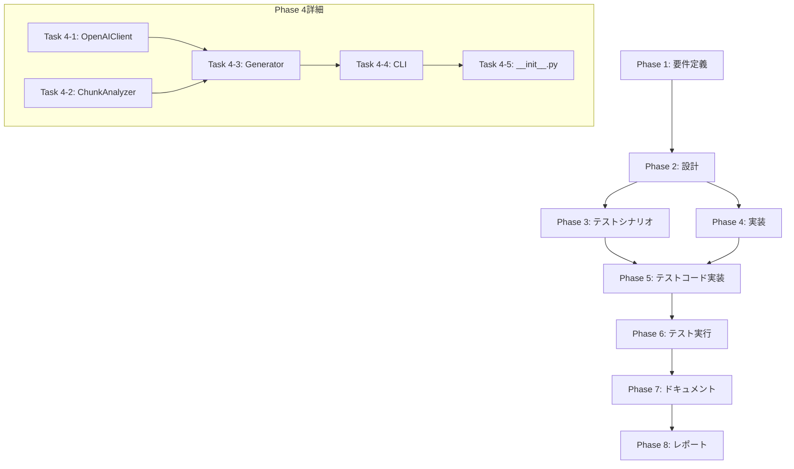

# Codex Agent 実行ログ

開始日時: 2025/12/25 14:42:54

---

## Turn 1: スレッド開始

**Thread ID**: `[REDACTED_TOKEN]`

## Turn 2: ツール実行

**種別**: reasoning
**ステータス**: completed

## Turn 3: ツール実行

**種別**: コマンド実行
**コマンド**: `/bin/bash -lc pwd`
**ステータス**: completed (exit_code=0)

```text
/tmp/ai-workflow-repos-9-4357d776/[REDACTED_TOKEN]
```

## Turn 4: ツール実行

**種別**: reasoning
**ステータス**: completed

## Turn 5: ツール実行

**種別**: コマンド実行
**コマンド**: `/bin/bash -lc ls`
**ステータス**: completed (exit_code=0)

```text
ARCHITECTURE.md
CLAUDE.md
CONTRIBUTION.md
LICENSE
README.md
ansible
bootstrap
docker
docs
jenkins
pulumi
run_tests_issue_322.sh
scripts
tests
```

## Turn 6: ツール実行

**種別**: reasoning
**ステータス**: completed

## Turn 7: ツール実行

**種別**: コマンド実行
**コマンド**: `/bin/bash -lc "rg --files -g 'Planning.md'"`
**ステータス**: failed (exit_code=127)

```text
/bin/bash: line 1: rg: command not found
```

## Turn 8: ツール実行

**種別**: reasoning
**ステータス**: completed

## Turn 9: ツール実行

**種別**: コマンド実行
**コマンド**: `/bin/bash -lc 'find .. -name Planning.md'`
**ステータス**: completed (exit_code=0)

## Turn 10: ツール実行

**種別**: reasoning
**ステータス**: completed

## Turn 11: ツール実行

**種別**: コマンド実行
**コマンド**: `/bin/bash -lc 'ls -a'`
**ステータス**: completed (exit_code=0)

```text
.
..
.ai-workflow
.claude
.coverage
.git
.github
.gitignore
.pytest_cache
.python
ARCHITECTURE.md
CLAUDE.md
CONTRIBUTION.md
LICENSE
README.md
ansible
bootstrap
docker
docs
jenkins
pulumi
run_tests_issue_322.sh
scripts
tests
```

## Turn 12: ツール実行

**種別**: reasoning
**ステータス**: completed

## Turn 13: ツール実行

**種別**: コマンド実行
**コマンド**: `/bin/bash -lc 'ls .ai-workflow'`
**ステータス**: completed (exit_code=0)

```text
issue-193
issue-304
issue-305
issue-310
issue-313
issue-315
issue-317
issue-319
issue-320
issue-322
issue-324
issue-331
issue-332
issue-355
issue-360
issue-362
issue-363
issue-369
issue-370
issue-396
issue-398
issue-405
issue-411
issue-415
issue-423
issue-431
issue-437
issue-440
issue-445
issue-453
issue-455
issue-456
issue-460
issue-461
issue-462
issue-463
issue-464
issue-465
issue-475
issue-477
issue-479
issue-528
```

## Turn 14: ツール実行

**種別**: reasoning
**ステータス**: completed

## Turn 15: ツール実行

**種別**: コマンド実行
**コマンド**: `/bin/bash -lc 'ls .ai-workflow/issue-528'`
**ステータス**: completed (exit_code=0)

```text
00_planning
01_requirements
02_design
03_test_scenario
04_implementation
05_test_implementation
06_testing
metadata.json
```

## Turn 16: ツール実行

**種別**: reasoning
**ステータス**: completed

## Turn 17: ツール実行

**種別**: コマンド実行
**コマンド**: `/bin/bash -lc 'ls .ai-workflow/issue-528/00_planning'`
**ステータス**: completed (exit_code=0)

```text
execute
output
review
revise
```

## Turn 18: ツール実行

**種別**: reasoning
**ステータス**: completed

## Turn 19: ツール実行

**種別**: コマンド実行
**コマンド**: `/bin/bash -lc 'find .ai-workflow/issue-528 -name Planning.md'`
**ステータス**: completed (exit_code=0)

## Turn 20: ツール実行

**種別**: reasoning
**ステータス**: completed

## Turn 21: ツール実行

**種別**: コマンド実行
**コマンド**: `/bin/bash -lc "find . -name 'Planning.md'"`
**ステータス**: completed (exit_code=0)

## Turn 22: ツール実行

**種別**: reasoning
**ステータス**: completed

## Turn 23: ツール実行

**種別**: コマンド実行
**コマンド**: `/bin/bash -lc 'ls .ai-workflow/issue-528/00_planning/execute'`
**ステータス**: completed (exit_code=0)

```text
agent_log.md
agent_log_raw.txt
prompt.txt
```

## Turn 24: ツール実行

**種別**: reasoning
**ステータス**: completed

## Turn 25: ツール実行

**種別**: コマンド実行
**コマンド**: `/bin/bash -lc 'rg -n "Phase 6"'`
**ステータス**: failed (exit_code=127)

```text
/bin/bash: line 1: rg: command not found
```

## Turn 26: ツール実行

**種別**: reasoning
**ステータス**: completed

## Turn 27: ツール実行

**種別**: コマンド実行
**コマンド**: `/bin/bash -lc 'grep -R "Phase 6" -n'`
**ステータス**: failed (exit_code=124)

```text
.git/logs/refs/heads/ai-workflow/issue-528:20:[REDACTED_TOKEN] [REDACTED_TOKEN] yuto-takashi <[REDACTED_EMAIL]> 1766673773 +0000	commit: [ai-workflow] Phase 6 (testing) - execute completed
.git/logs/HEAD:22:[REDACTED_TOKEN] [REDACTED_TOKEN] yuto-takashi <[REDACTED_EMAIL]> 1766673773 +0000	commit: [ai-workflow] Phase 6 (testing) - execute completed
.git/COMMIT_EDITMSG:1:[ai-workflow] Phase 6 (testing) - execute completed
.ai-workflow/issue-193/00_planning/output/planning.md:129:### Phase 6: テスト実行 (見積もり: 0.25h)
.ai-workflow/issue-193/00_planning/output/planning.md:164:    P5 --> P6[Phase 6: テスト実行]
.ai-workflow/issue-193/00_planning/output/planning.md:187:  - Phase 6でチェックリストによる検証を実施
.ai-workflow/issue-193/00_planning/output/planning.md:201:  - Phase 6で整合性を確認
.ai-workflow/issue-193/00_planning/output/planning.md:238:### Phase 6: テスト実行
.ai-workflow/issue-193/02_design/output/design.md:367:| ドキュメント記載ミスによる誤操作 | 中 | **対策**: レビュープロセスでパラメータ名と実行例を確認<br>**Phase 6**: 実装との整合性チェック |
.ai-workflow/issue-193/02_design/output/design.md:422:### Phase 6（Testing）での推奨テスト順序
.ai-workflow/issue-193/02_design/output/design.md:473:| FR-004 | ドキュメント間の整合性確保 | Section 10（Phase 6テスト） | ✅ |
.ai-workflow/issue-193/03_test_scenario/output/test-scenario.md:487:### Phase 6で実施すべきテスト（優先順位順）
.ai-workflow/issue-193/03_test_scenario/output/test-scenario.md:572:| Phase 6: テスト実行 (0.25h) | 優先順位付けされたテストチェックリストを作成 | ✅ |
.ai-workflow/issue-193/03_test_scenario/output/test-scenario.md:596:| 10: 実装の順序（Phase 6テスト順序） | Section 5（テスト実施チェックリスト）で対応 | ✅ |
.ai-workflow/issue-193/04_implementation/output/implementation.md:197:### Phase 6（testing）
.ai-workflow/issue-193/04_implementation/output/implementation.md:259:Phase 5（test_implementation）では、テストコード実装は不要のため、直接Phase 6（testing）に進みます。Phase 6では、テストシナリオに定義された17個のユニットテスト（ドキュメント検証）を実施します。
.ai-workflow/issue-193/04_implementation/output/implementation.md:265:**レビュー待ち**: Phase 6（Testing）での検証が必要
.ai-workflow/issue-193/05_test_implementation/output/test-implementation.md:58:**Phase 6（Testing）は実施が必要です**が、実行するのは「実装テスト」ではなく、「ドキュメント検証テスト」です。
.ai-workflow/issue-193/05_test_implementation/output/test-implementation.md:60:### Phase 6で実施すべき内容
.ai-workflow/issue-193/05_test_implementation/output/test-implementation.md:92:### Phase 6での実施方法
.ai-workflow/issue-193/05_test_implementation/output/test-implementation.md:97:### Phase 6で実施すべきテスト（優先順位順）
.ai-workflow/issue-193/05_test_implementation/output/test-implementation.md:131:| 既存のドキュメントレビュープロセスに統合 | Phase 6でマニュアル検証 | ✅ |
.ai-workflow/issue-193/05_test_implementation/output/test-implementation.md:146:### 次フェーズ（Phase 6: Testing）
.ai-workflow/issue-193/05_test_implementation/output/test-implementation.md:147:Phase 6では、Test Scenarioに定義された17個のユニットテスト（ドキュメント検証）をマニュアルレビューとして実施します。
.ai-workflow/issue-193/05_test_implementation/output/test-implementation.md:149:**Phase 6をスキップすることは推奨しません**。ドキュメントの正確性を保証するため、高優先度のドキュメント検証テスト（UT-015, UT-004, UT-008, UT-001, UT-012）は必ず実施してください。
.ai-workflow/issue-193/05_test_implementation/output/test-implementation.md:156:**判定**: テストコード実装スキップ（Phase 6でマニュアル検証を実施）
.ai-workflow/issue-193/06_testing/output/test-result.md:33:> **Phase 6をスキップすることは推奨しません**。ドキュメントの正確性を保証するため、高優先度のドキュメント検証テスト（UT-015, UT-004, UT-008, UT-001, UT-012）は必ず実施してください。
.ai-workflow/issue-193/06_testing/output/test-result.md:35:したがって、このPhase 6では**自動テスト実行ではなく、ドキュメント検証テスト（マニュアルレビュー）**を実施しました。
.ai-workflow/issue-193/06_testing/output/test-result.md:505:**品質ゲート（Phase 6）チェック**:
.ai-workflow/issue-193/06_testing/output/test-result.md:554:| Phase 6見積もり工数: 0.25h | マニュアルレビューで実施（約20分） | ✅ 見積もり内 |
.ai-workflow/issue-193/06_testing/output/test-result.md:572:Issue #193のPhase 6（Testing）が正常に完了しました。
.ai-workflow/issue-193/07_documentation/output/[REDACTED_TOKEN].md:137:### 3ファイル間の整合性（Phase 6テスト結果より）
.ai-workflow/issue-193/07_documentation/output/[REDACTED_TOKEN].md:139:Phase 6（Testing）で実施されたドキュメント検証テスト（UT-001～UT-01
... (truncated)
```

## Turn 28: ツール実行

**種別**: reasoning
**ステータス**: completed

## Turn 29: ツール実行

**種別**: コマンド実行
**コマンド**: `/bin/bash -lc 'ls .ai-workflow/issue-528/00_planning/output'`
**ステータス**: completed (exit_code=0)

```text
planning.md
```

## Turn 30: ツール実行

**種別**: reasoning
**ステータス**: completed

## Turn 31: ツール実行

**種別**: コマンド実行
**コマンド**: `/bin/bash -lc 'grep -n "Phase 6" -n .ai-workflow/issue-528/00_planning/output/planning.md'`
**ステータス**: completed (exit_code=0)

```text
181:### Phase 6: テスト実行 (見積もり: 3〜4h)
220:    P5 --> P6[Phase 6: テスト実行]
309:### Phase 6: テスト実行
```

## Turn 32: ツール実行

**種別**: reasoning
**ステータス**: completed

## Turn 33: ツール実行

**種別**: コマンド実行
**コマンド**: `/bin/bash -lc "sed -n '170,260p' .ai-workflow/issue-528/00_planning/output/planning.md"`
**ステータス**: completed (exit_code=0)

```text
- リトライロジックテスト
- [x] Task 5-2: ChunkAnalyzerのユニットテスト (2〜3h)
  - チャンク分割テスト
  - 最適化ロジックテスト
- [x] Task 5-3: PRCommentGeneratorのユニットテスト (2〜3h)
  - コメント生成テスト
  - エラーハンドリングテスト
- [x] Task 5-4: CLIのユニットテスト (1〜2h)
  - 引数パーステスト
  - 出力フォーマットテスト

### Phase 6: テスト実行 (見積もり: 3〜4h)

- [ ] Task 6-1: ユニットテストの実行と修正 (1〜2h)
  - 全ユニットテストの実行
  - 失敗テストの修正
  - カバレッジ確認
- [ ] Task 6-2: 統合テストの実行と修正 (1〜2h)
  - 互換性レイヤーテストの実行
  - 回帰テストの確認
  - BDDテストの確認

### Phase 7: ドキュメント (見積もり: 2〜3h)

- [ ] Task 7-1: コード内ドキュメントの整備 (1〜2h)
  - 各モジュールのdocstring
  - 型ヒントの確認
  - コメントの整理
- [ ] Task 7-2: README/CONTRIBUTION.mdの更新 (1h)
  - 新モジュール構造の説明
  - インポートパスの変更案内

### Phase 8: レポート (見積もり: 1〜2h)

- [ ] Task 8-1: リファクタリング完了レポート作成 (1〜2h)
  - 変更サマリー
  - 新モジュール構造の説明
  - 今後の改善提案

---

## 5. 依存関係



---

## 6. リスクと軽減策

### リスク1: 既存パイプラインの破損

- **影響度**: 高
- **確率**: 中
- **軽減策**:
  - 外部インターフェース（CLI引数、出力JSON形式）を変更しない
  - 既存の統合テスト・BDDテストで回帰確認
  - 段階的なリファクタリング（一度に全てを変更しない）
  - フィーチャーブランチでの開発、十分なテスト後にマージ

### リスク2: OpenAI API連携の複雑性

- **影響度**: 高
- **確率**: 中
- **軽減策**:
  - リトライロジック、エラーハンドリングの単体テストを充実させる
  - モックを活用したユニットテストで境界条件を網羅
  - 既存のログ出力を維持し、デバッグ容易性を確保

### リスク3: 互換性レイヤーの破損

- **影響度**: 中
- **確率**: 低
- **軽減策**:
  - 既存の`[REDACTED_TOKEN].py`を拡張
```

## Turn 34: ツール実行

**種別**: reasoning
**ステータス**: completed

## Turn 35: ツール実行

**種別**: コマンド実行
**コマンド**: `/bin/bash -lc "sed -n '1,200p' .ai-workflow/issue-528/06_testing/output/test-result.md"`
**ステータス**: completed (exit_code=0)

```text
# テスト実行結果

## テスト結果サマリー
- 総テスト数: 104件
- 成功: 103件
- 失敗: 1件
- 成功率: 99%

### `jenkins/jobs/pipeline/docs-generator/pull-request-comment-builder/tests/bdd/test_bdd_pr_comment_generation.py`
- **エラー**: SyntaxError: expected '('（テスト名に半角スペースが含まれており関数名として無効）
- **スタックトレース**:
  ```
  File "jenkins/jobs/pipeline/docs-generator/pull-request-comment-builder/tests/bdd/test_bdd_pr_comment_generation.py", line 245
    def test_scenario_互換性レイヤーを使用したPR コメント生成(self, logger, temp_template_dir):
                                       ^^^^^^
  SyntaxError: expected '('
  ```
```

## Turn 36: ツール実行

**種別**: reasoning
**ステータス**: completed

## Turn 37: ツール実行

**種別**: コマンド実行
**コマンド**: `/bin/bash -lc "sed -n '200,400p' .ai-workflow/issue-528/06_testing/output/test-result.md"`
**ステータス**: completed (exit_code=0)

## Turn 38: ツール実行

**種別**: reasoning
**ステータス**: completed

## Turn 39: ツール実行

**種別**: コマンド実行
**コマンド**: `/bin/bash -lc 'wc -l .ai-workflow/issue-528/06_testing/output/test-result.md'`
**ステータス**: completed (exit_code=0)

```text
17 .ai-workflow/issue-528/06_testing/output/test-result.md
```

## Turn 40: ツール実行

**種別**: reasoning
**ステータス**: completed

## Turn 41: ツール実行

**種別**: コマンド実行
**コマンド**: `/bin/bash -lc 'cat .ai-workflow/issue-528/06_testing/output/test-result.md'`
**ステータス**: completed (exit_code=0)

```text
# テスト実行結果

## テスト結果サマリー
- 総テスト数: 104件
- 成功: 103件
- 失敗: 1件
- 成功率: 99%

### `jenkins/jobs/pipeline/docs-generator/pull-request-comment-builder/tests/bdd/test_bdd_pr_comment_generation.py`
- **エラー**: SyntaxError: expected '('（テスト名に半角スペースが含まれており関数名として無効）
- **スタックトレース**:
  ```
  File "jenkins/jobs/pipeline/docs-generator/pull-request-comment-builder/tests/bdd/test_bdd_pr_comment_generation.py", line 245
    def test_scenario_互換性レイヤーを使用したPR コメント生成(self, logger, temp_template_dir):
                                       ^^^^^^
  SyntaxError: expected '('
  ```
```

## Turn 42: ツール実行

**種別**: reasoning
**ステータス**: completed

## Turn 43: ツール実行

**種別**: コマンド実行
**コマンド**: `/bin/bash -lc 'ls .ai-workflow/issue-528/06_testing'`
**ステータス**: completed (exit_code=0)

```text
execute
output
review
revise
```

## Turn 44: ツール実行

**種別**: reasoning
**ステータス**: completed

## Turn 45: ツール実行

**種別**: reasoning
**ステータス**: completed

## Turn 46: ツール実行

**種別**: コマンド実行
**コマンド**: `/bin/bash -lc 'nl -ba .ai-workflow/issue-528/06_testing/output/test-result.md'`
**ステータス**: completed (exit_code=0)

```text
1	# テスト実行結果
     2	
     3	## テスト結果サマリー
     4	- 総テスト数: 104件
     5	- 成功: 103件
     6	- 失敗: 1件
     7	- 成功率: 99%
     8	
     9	### `jenkins/jobs/pipeline/docs-generator/pull-request-comment-builder/tests/bdd/test_bdd_pr_comment_generation.py`
    10	- **エラー**: SyntaxError: expected '('（テスト名に半角スペースが含まれており関数名として無効）
    11	- **スタックトレース**:
    12	  ```
    13	  File "jenkins/jobs/pipeline/docs-generator/pull-request-comment-builder/tests/bdd/test_bdd_pr_comment_generation.py", line 245
    14	    def test_scenario_互換性レイヤーを使用したPR コメント生成(self, logger, temp_template_dir):
    15	                                       ^^^^^^
    16	  SyntaxError: expected '('
    17	  ```
```

## Turn 47: ツール実行

**種別**: reasoning
**ステータス**: completed

## Turn 48: ツール実行

**種別**: コマンド実行
**コマンド**: `/bin/bash -lc 'grep -n "BDD" .ai-workflow/issue-528/03_test_scenario/output/test-scenario.md'`
**ステータス**: completed (exit_code=0)

```text
16:- **BDDテスト不要**: 既存の`test_bdd_pr_comment_generation.py`でエンドツーエンドのシナリオが十分カバーされている
1271:  - BDDテスト: 既存テストで十分（追加不要）
```

## Turn 49: ツール実行

**種別**: reasoning
**ステータス**: completed

## Turn 50: ツール実行

**種別**: コマンド実行
**コマンド**: `/bin/bash -lc "nl -ba .ai-workflow/issue-528/00_planning/output/planning.md | sed -n '180,210p'"`
**ステータス**: completed (exit_code=0)

```text
180	
   181	### Phase 6: テスト実行 (見積もり: 3〜4h)
   182	
   183	- [ ] Task 6-1: ユニットテストの実行と修正 (1〜2h)
   184	  - 全ユニットテストの実行
   185	  - 失敗テストの修正
   186	  - カバレッジ確認
   187	- [ ] Task 6-2: 統合テストの実行と修正 (1〜2h)
   188	  - 互換性レイヤーテストの実行
   189	  - 回帰テストの確認
   190	  - BDDテストの確認
   191	
   192	### Phase 7: ドキュメント (見積もり: 2〜3h)
   193	
   194	- [ ] Task 7-1: コード内ドキュメントの整備 (1〜2h)
   195	  - 各モジュールのdocstring
   196	  - 型ヒントの確認
   197	  - コメントの整理
   198	- [ ] Task 7-2: README/CONTRIBUTION.mdの更新 (1h)
   199	  - 新モジュール構造の説明
   200	  - インポートパスの変更案内
   201	
   202	### Phase 8: レポート (見積もり: 1〜2h)
   203	
   204	- [ ] Task 8-1: リファクタリング完了レポート作成 (1〜2h)
   205	  - 変更サマリー
   206	  - 新モジュール構造の説明
   207	  - 今後の改善提案
   208	
   209	---
   210
```

## Turn 51: ツール実行

**種別**: reasoning
**ステータス**: completed

## Turn 52: ツール実行

**種別**: reasoning
**ステータス**: completed

## Turn 53: ツール実行

**種別**: agent_message
**ステータス**: completed

## Turn 54: 実行完了

**ステータス**: completed
**所要時間**: 121815ms
**ターン数**: N/A

---

**経過時間**: 121815ms
**開始**: 2025-12-25T14:42:54.438Z
**終了**: 2025-12-25T14:44:56.253Z