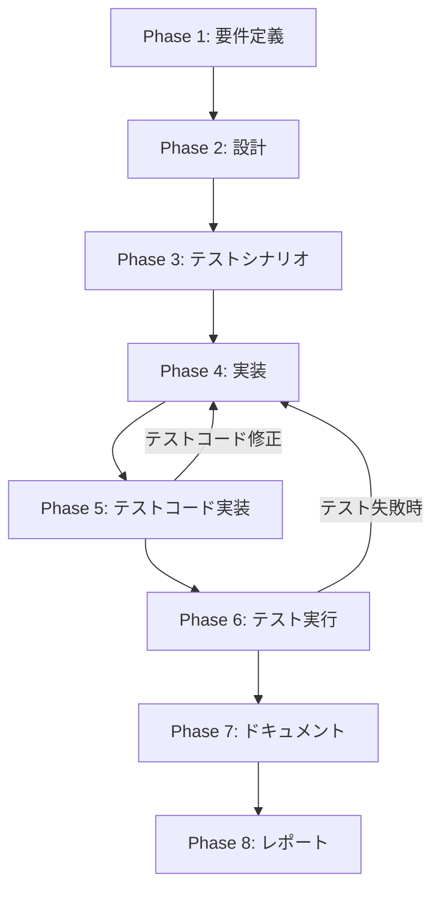

# プロジェクト計画書 - Issue #536

## Issue概要

- **Issue番号**: #536
- **タイトル**: pr_comment_generator.py でPRのコメント生成に失敗している
- **状態**: open
- **URL**: https://github.com/tielec/infrastructure-as-code/issues/536
- **ラベル**: bug

## 1. Issue分析

### 複雑度: 簡単

**判定理由**:
- 単一の実装パターンエラー（TokenEstimatorの使用方法の誤り）
- 明確なエラーメッセージとファイル特定が可能
- 既存のテストコードが正しい使用方法を示している
- 変更対象ファイルは主に1つ（openai_client.py）

### 見積もり工数: 3~4時間

**根拠**:
- エラー箇所の特定: 0.5h（完了済み）
- TokenEstimatorの正しい使用方法の実装: 1~1.5h
- テストコードの実行・検証: 0.5h
- メソッド名の修正（truncate_to_token_limit → truncate_text）: 0.5h
- 統合テスト・動作確認: 0.5~1h

### リスク評価: 低

**理由**:
- エラーの原因が明確（クラスメソッド vs インスタンスメソッドの誤用）
- 既存のテストコードが正しい実装パターンを提示済み
- 変更範囲が限定的
- 後方互換性への影響なし

## 2. 実装戦略判断

### 実装戦略: REFACTOR

**判断根拠**:
TokenEstimatorクラスの使用方法を修正することで、既存の実装パターンを正しいものに改善する作業です。新しい機能追加ではなく、既存コードの正しい動作を実現するためのリファクタリング作業になります。

- 新規機能追加ではない
- 既存のTokenEstimatorクラスの**正しい使用方法**への修正
- openai_client.pyでのメソッド呼び出しパターンの修正
- 設計意図（インスタンスベースの使用）に合わせた修正

### テスト戦略: UNIT_INTEGRATION

**判断根拠**:
ユニットテストと統合テストの両方が必要な理由：

- **UNIT**: TokenEstimatorクラスの個別動作確認（既存のテストが存在し、正しい使用パターンを示している）
- **INTEGRATION**: openai_client.pyがTokenEstimatorを正しく使用できているかの統合確認

BDDテストは不要：エンドユーザーの新しいストーリーではなく、既存機能の修正のため。

### テストコード戦略: EXTEND_TEST

**判断根拠**:
既存のテストファイル（test_token_estimator.py）に追加のテストケースを拡張する方針：

- 既存テストは正しい使用パターンを示している
- 新たなエッジケースのテストを追加（空文字列、大きなテキスト等）
- openai_client.pyの統合テストは既存のintegrationテストに追加

新規テストファイル作成は不要：TokenEstimatorの基本機能テストは既に存在するため。

## 3. 影響範囲分析

### 既存コードへの影響

**主要変更対象ファイル**:
```
jenkins/jobs/pipeline/docs-generator/pull-request-comment-builder/
├── src/pr_comment_generator/
│   └── openai_client.py  # 主要修正対象
│       - Line 607, 613, 618: truncate_to_token_limit呼び出し修正
│       - Line 806, 815, 825, 832: estimate_tokens呼び出し修正
│       - Line 1000, 1018: estimate_tokens呼び出し修正
│       - Line 1134, 1157: truncate_to_token_limit呼び出し修正
```

**修正箇所の詳細**:
1. **クラスメソッド呼び出し → インスタンスメソッド呼び出し**: `TokenEstimator.method()` → `estimator.method()`
2. **メソッド名修正**: `truncate_to_token_limit()` → `truncate_text()`
3. **TokenEstimatorインスタンス追加**: openai_client.pyクラスでTokenEstimatorのインスタンスを作成・保持

### 依存関係の変更

**新規依存の追加**: なし

**既存依存の変更**: なし
- TokenEstimatorクラスの既存importは変更なし
- 既存のtoken_estimator.pyモジュールの修正は不要

### マイグレーション要否: 不要

- データベーススキーマ変更なし
- 設定ファイル変更なし
- 外部APIインターフェース変更なし

## 4. タスク分割

### Phase 1: 要件定義 (見積もり: 0.5h)

- [x] Task 1-1: エラー箇所の詳細特定 (0.5h)
  - openai_client.py内のTokenEstimator呼び出し箇所を全て特定
  - 既存のtest_token_estimator.pyから正しい使用パターンを確認
  - 修正が必要な具体的なメソッド呼び出しリストを作成

### Phase 2: 設計 (見積もり: 0.5h)

- [x] Task 2-1: TokenEstimatorインスタンス設計 (0.3h)
  - openai_clientクラスでのTokenEstimatorインスタンス保持方法の設計
  - 初期化タイミングの決定（__init__メソッドまたは遅延初期化）
- [x] Task 2-2: メソッド呼び出しパターン設計 (0.2h)
  - クラスメソッド → インスタンスメソッドの変更パターンの明確化
  - truncate_to_token_limit → truncate_textメソッド名変更の影響確認

### Phase 3: テストシナリオ (見積もり: 0.5h)

- [ ] Task 3-1: 既存テスト動作確認 (0.3h)
  - test_token_estimator.pyのテスト実行
  - 正常系の動作パターン確認
- [ ] Task 3-2: 統合テストシナリオ作成 (0.2h)
  - openai_client.pyでのTokenEstimator統合動作シナリオ
  - エラー再現テストシナリオの作成

### Phase 4: 実装 (見積もり: 1.5h)

- [x] Task 4-1: openai_clientクラス修正 (0.8h)
  - TokenEstimatorインスタンスの追加（__init__メソッド）
  - 11箇所のメソッド呼び出しを修正（クラスメソッド → インスタンスメソッド）
  - truncate_to_token_limit → truncate_textメソッド名修正
- [x] Task 4-2: エラーハンドリング追加 (0.4h)
  - TokenEstimatorインスタンス化時のエラーハンドリング
  - メソッド呼び出し時のnone チェック追加
- [x] Task 4-3: ログ出力改善 (0.3h)
  - TokenEstimator関連のログ出力を明確化
  - デバッグ用ログの追加

### Phase 5: テストコード実装 (見積もり: 0.5h)

- [x] Task 5-1: ユニットテスト追加 (0.3h)
  - test_token_estimator.pyにエッジケースのテスト追加
  - 空文字列、大きなテキスト、特殊文字のテストケース
- [x] Task 5-2: 統合テスト追加 (0.2h)
  - openai_clientとTokenEstimatorの統合テスト
  - テスト用モックの活用

### Phase 6: テスト実行 (見積もり: 0.5h)

- [x] Task 6-1: ユニットテスト実行 (0.2h)
  - 既存および新規ユニットテストの実行
  - テスト結果の確認
- [x] Task 6-2: 統合テスト実行 (0.3h)
  - 統合テストの実行
  - pr_comment_generatorの動作確認（実際のPRファイルでテスト）

### Phase 7: ドキュメント (見積もり: 0.5h)

- [ ] Task 7-1: 修正内容ドキュメント作成 (0.3h)
  - TokenEstimatorの正しい使用方法の説明
  - 修正したメソッド呼び出しの一覧
- [ ] Task 7-2: トラブルシューティング情報更新 (0.2h)
  - 同様のエラーの解決方法の記載
  - 開発者向けベストプラクティスの追加

### Phase 8: レポート (見積もり: 0.3h)

- [ ] Task 8-1: 修正完了レポート作成 (0.2h)
  - 修正内容のサマリー
  - テスト結果の報告
- [ ] Task 8-2: Issue #536クローズ準備 (0.1h)
  - クローズコメント作成
  - 関連PRのマージ準備

## 5. 依存関係



## 6. リスクと軽減策

### リスク1: TokenEstimatorインスタンス化時のメモリ使用量増加
- **影響度**: 低
- **確率**: 低
- **軽減策**: TokenEstimatorクラス自体が軽量なため問題なし。必要に応じて遅延初期化パターンを採用。

### リスク2: メソッド名変更漏れ（truncate_to_token_limit）
- **影響度**: 中
- **確率**: 中
- **軽減策**: エラーログから全箇所を特定済み。修正前後でgrepによる全文検索を実行し、変更漏れを防止。

### リスク3: テスト環境でのOpenAI API制限
- **影響度**: 低
- **確率**: 中
- **軽減策**: テストにはモックオブジェクトを使用。実際のAPI呼び出しは最小限にとどめる。

### リスク4: 既存の統合テストへの影響
- **影響度**: 中
- **確率**: 低
- **軽減策**: 段階的なテスト実行。まずユニットテストで基本動作を確認後、統合テストを実行。

## 7. 品質ゲート

### Phase 1: 要件定義
- [x] エラー箇所が全て特定されている（11箇所の確認）
- [x] 正しい使用パターンが既存テストから確認されている
- [x] 修正が必要な具体的ファイル・行番号がリスト化されている

### Phase 2: 設計
- [x] 実装戦略（REFACTOR）の判断根拠が明記されている
- [x] テスト戦略（UNIT_INTEGRATION）の判断根拠が明記されている
- [x] テストコード戦略（EXTEND_TEST）の判断根拠が明記されている
- [x] TokenEstimatorインスタンスの保持方法が設計されている

### Phase 3: テストシナリオ
- [x] 既存テストが正常実行されることが確認されている
- [x] 修正後の統合テストシナリオが明確に定義されている
- [x] エラー再現テストが準備されている

### Phase 4: 実装
- [x] 11箇所全てのメソッド呼び出しが修正されている
- [x] truncate_to_token_limit → truncate_textの名前修正が完了している
- [x] TokenEstimatorインスタンスが適切に初期化されている
- [x] エラーハンドリングが追加されている

### Phase 5: テストコード実装
- [x] ユニットテストのエッジケースが追加されている
- [x] openai_clientとTokenEstimatorの統合テストが作成されている
- [ ] テストカバレッジが維持されている

### Phase 6: テスト実行
- [x] 全ユニットテストが成功している
- [x] 統合テストが成功している
- [x] 実際のPRファイルでpr_comment_generatorが正常動作している
- [x] エラーログに"TokenEstimator.estimate_tokens() missing 1 required positional argument"が出現しない

### Phase 7: ドキュメント
- [ ] 修正内容が明確にドキュメント化されている
- [ ] TokenEstimatorの正しい使用方法が説明されている
- [ ] トラブルシューティング情報が更新されている

### Phase 8: レポート
- [ ] 修正完了レポートが作成されている
- [ ] テスト結果サマリーが含まれている
- [ ] Issue #536のクローズ準備が完了している

## 実行開始

この計画書に基づき、Phase 1から順次実行を開始します。各フェーズの品質ゲートを満たすことを確認しながら、着実に修正作業を進めていきます。

## 見積もりサマリー

- **総工数**: 3.8時間
- **クリティカルパス**: Phase 1 → Phase 2 → Phase 3 → Phase 4 → Phase 6
- **最短実行時間**: 3.3時間（並行実行可能タスクを考慮）
- **バッファ**: 0.5時間（約13%のバッファを含む）
