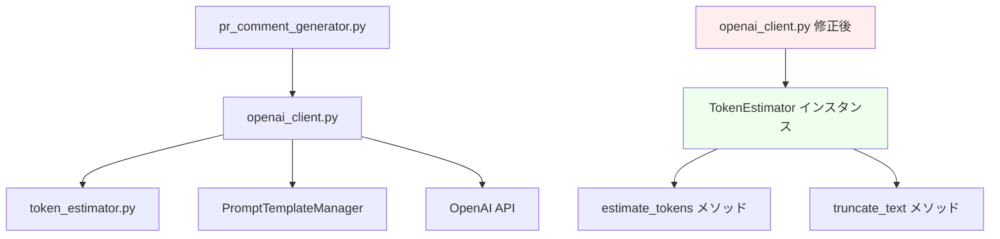

# 詳細設計書 - Issue #536

## 概要

pr_comment_generator.pyでTokenEstimatorクラスの使用方法が間違っているため、`TokenEstimator.estimate_tokens() missing 1 required positional argument: 'text'`エラーが発生している問題を修正する詳細設計書です。

## 1. アーキテクチャ設計

### システム全体図

```
┌─────────────────────────────────────────────────────────────────┐
│                    PR Comment Generator                         │
├─────────────────────────────────────────────────────────────────┤
│  1. pr_comment_generator.py (メインエントリポイント)                │
│     ↓ 使用                                                      │
│  2. openai_client.py (修正対象)                                 │
│     ├─ TokenEstimator.estimate_tokens() → estimator.estimate_tokens() │
│     ├─ TokenEstimator.truncate_to_token_limit() → estimator.truncate_text() │
│     └─ TokenEstimatorインスタンス追加                            │
│     ↓ インポート                                                  │
│  3. token_estimator.py (修正不要)                               │
│     ├─ TokenEstimator.__init__(logger)                          │
│     ├─ estimate_tokens(text) : int                              │
│     └─ truncate_text(text, max_tokens) : str                    │
└─────────────────────────────────────────────────────────────────┘
```

### コンポーネント間の関係



### データフロー

```
Input: PR差分データ
  ↓
1. openai_client.py __init__()
  ├─ TokenEstimatorインスタンス作成
  └─ self.token_estimator = TokenEstimator(logger)
  ↓
2. ファイル内容処理時
  ├─ self.token_estimator.estimate_tokens(text)
  └─ self.token_estimator.truncate_text(text, max_tokens)
  ↓
Output: 正常なトークン推定・テキスト切り詰め
```

## 2. 実装戦略判断

### 実装戦略: REFACTOR

**判断根拠**:
- 新機能追加ではない（既存の機能を修正）
- 既存のTokenEstimatorクラスの**正しい使用方法**への修正
- openai_client.pyでのメソッド呼び出しパターンの修正（クラスメソッド→インスタンスメソッド）
- 設計意図（インスタンスベースの使用）に合わせた修正
- Planning documentの戦略判断と一致

## 3. テスト戦略判断

### テスト戦略: UNIT_INTEGRATION

**判断根拠**:
- **UNIT**: TokenEstimatorクラスの個別動作確認（既存のテストが存在し、正しい使用パターンを示している）
- **INTEGRATION**: openai_client.pyがTokenEstimatorを正しく使用できているかの統合確認
- BDDテストは不要：エンドユーザーの新しいストーリーではなく、既存機能の修正のため
- Planning documentの戦略判断と一致

## 4. テストコード戦略判断

### テストコード戦略: EXTEND_TEST

**判断根拠**:
- 既存のテストファイル（test_token_estimator.py）に追加のテストケースを拡張する方針
- 既存テストは正しい使用パターンを示している
- 新たなエッジケースのテストを追加（空文字列、大きなテキスト等）
- openai_client.pyの統合テストは既存のintegrationテストに追加
- 新規テストファイル作成は不要：TokenEstimatorの基本機能テストは既に存在するため
- Planning documentの戦略判断と一致

## 5. 影響範囲分析

### 既存コードへの影響

**主要修正対象ファイル**:
```
jenkins/jobs/pipeline/docs-generator/pull-request-comment-builder/
├── src/pr_comment_generator/
│   └── openai_client.py  # 主要修正対象（11箇所の呼び出し修正）
└── tests/unit/
    └── test_token_estimator.py  # テスト拡張
```

**修正箇所の詳細**:
1. **Line 607, 613, 618**: `truncate_to_token_limit`呼び出し修正
2. **Line 806, 815, 825, 832**: `estimate_tokens`呼び出し修正
3. **Line 1000, 1018**: `estimate_tokens`呼び出し修正
4. **Line 1134, 1157**: `truncate_to_token_limit`呼び出し修正

### 依存関係の変更

**新規依存の追加**: なし

**既存依存の変更**: なし
- TokenEstimatorクラスの既存importは変更なし
- 既存のtoken_estimator.pyモジュールの修正は不要

### マイグレーション要否

**不要** - 以下の理由により:
- データベーススキーマ変更なし
- 設定ファイル変更なし
- 外部APIインターフェース変更なし
- internal APIの修正のため

## 6. 変更・追加ファイルリスト

### 修正が必要な既存ファイル
- `jenkins/jobs/pipeline/docs-generator/pull-request-comment-builder/src/pr_comment_generator/openai_client.py`
- `jenkins/jobs/pipeline/docs-generator/pull-request-comment-builder/tests/unit/test_token_estimator.py` (テスト拡張)

### 新規作成ファイル
なし

### 削除が必要なファイル
なし

## 7. 詳細設計

### 7.1 クラス設計

#### OpenAIClient クラス修正設計

```python
class OpenAIClient:
    """OpenAI APIとのインタラクションを管理するクラス"""

    def __init__(self, prompt_manager, retry_config=None, log_level=logging.INFO):
        """
        初期化処理

        修正内容:
        1. TokenEstimatorインスタンスの追加
        2. 適切なエラーハンドリングの追加
        """
        # 既存の初期化処理...

        # 【追加】TokenEstimatorインスタンスの作成
        try:
            self.token_estimator = TokenEstimator(logger=self.logger)
            self.logger.info("TokenEstimator initialized successfully")
        except Exception as e:
            self.logger.error(f"Failed to initialize TokenEstimator: {str(e)}")
            raise ValueError(f"TokenEstimator initialization failed: {str(e)}")
```

### 7.2 関数設計（主要な修正関数のみ）

#### 修正対象メソッド一覧

| 行番号 | 現在のコード | 修正後のコード | 備考 |
|--------|-------------|---------------|------|
| 607 | `TokenEstimator.truncate_to_token_limit(change.patch, self.MAX_PATCH_TOKENS)` | `self.token_estimator.truncate_text(change.patch, self.MAX_PATCH_TOKENS)` | メソッド名変更も含む |
| 613 | `TokenEstimator.truncate_to_token_limit(change.content_before, self.MAX_CONTENT_TOKENS)` | `self.token_estimator.truncate_text(change.content_before, self.MAX_CONTENT_TOKENS)` | メソッド名変更も含む |
| 618 | `TokenEstimator.truncate_to_token_limit(change.content_after, self.MAX_CONTENT_TOKENS)` | `self.token_estimator.truncate_text(change.content_after, self.MAX_CONTENT_TOKENS)` | メソッド名変更も含む |
| 806 | `TokenEstimator.estimate_tokens(input_json_text)` | `self.token_estimator.estimate_tokens(input_json_text)` | - |
| 815 | `TokenEstimator.estimate_tokens(input_json_text)` | `self.token_estimator.estimate_tokens(input_json_text)` | - |
| 825 | `TokenEstimator.estimate_tokens(input_json_text)` | `self.token_estimator.estimate_tokens(input_json_text)` | - |
| 832 | `TokenEstimator.estimate_tokens(input_json_text)` | `self.token_estimator.estimate_tokens(input_json_text)` | - |
| 1000 | `TokenEstimator.estimate_tokens(pr_info_str)` | `self.token_estimator.estimate_tokens(pr_info_str)` | - |
| 1018 | `TokenEstimator.estimate_tokens(file_str)` | `self.token_estimator.estimate_tokens(file_str)` | - |
| 1134 | `TokenEstimator.estimate_tokens(analyses_text)` | `self.token_estimator.estimate_tokens(analyses_text)` | - |
| 1157 | `TokenEstimator.truncate_to_token_limit(analysis, int(max_tokens_per_chunk))` | `self.token_estimator.truncate_text(analysis, int(max_tokens_per_chunk))` | メソッド名変更も含む |

### 7.3 データ構造設計

既存のデータ構造に変更はありません。TokenEstimatorクラス自体は修正不要です。

### 7.4 インターフェース設計

**修正前のエラーパターン**:
```python
# エラー: クラスメソッドとして呼び出し
TokenEstimator.estimate_tokens(text)  # ❌ missing positional argument 'text'
TokenEstimator.truncate_to_token_limit(text, max_tokens)  # ❌ メソッド名も間違い
```

**修正後の正しいパターン**:
```python
# 正しい: インスタンスメソッドとして呼び出し
self.token_estimator.estimate_tokens(text)  # ✅
self.token_estimator.truncate_text(text, max_tokens)  # ✅
```

## 8. セキュリティ考慮事項

### 認証・認可
影響なし - 内部APIの修正のため、外部向けセキュリティ境界には変更なし

### データ保護
影響なし - TokenEstimatorはテキストのトークン数推定のみを行い、機密データは扱わない

### セキュリティリスクと対策
- **リスク**: なし
- **対策**: 不要

## 9. 非機能要件への対応

### パフォーマンス
- **影響**: TokenEstimatorインスタンス化による軽微なメモリ使用量増加
- **評価**: TokenEstimatorクラス自体が軽量なため問題なし
- **対策**: 必要に応じて遅延初期化パターンを採用可能

### スケーラビリティ
- **影響**: なし
- **既存の処理性能を維持**: インスタンス化のオーバーヘッドは無視できる程度

### 保守性
- **向上**: 設計意図通りのインスタンスベース使用により、将来の拡張性を確保
- **一貫性**: 既存のユニットテストパターンと整合性を保つ

## 10. 実装の順序

### Phase 1: コード修正
1. openai_client.py の __init__ メソッドにTokenEstimatorインスタンス追加
2. 11箇所のメソッド呼び出しを順次修正
   - クラスメソッド → インスタンスメソッド
   - `truncate_to_token_limit` → `truncate_text`

### Phase 2: エラーハンドリング強化
1. TokenEstimatorインスタンス化時のエラーハンドリング追加
2. メソッド呼び出し時のnoneチェック追加

### Phase 3: テスト拡張
1. test_token_estimator.py にエッジケースのテスト追加
2. openai_clientとTokenEstimatorの統合テスト追加

### Phase 4: 検証とテスト
1. 既存のユニットテスト実行
2. 統合テスト実行
3. 実際のPRファイルでの動作確認

## 品質ゲート（Phase 2）確認

- ✅ **実装戦略の判断根拠が明記されている**: REFACTOR戦略を選択、根拠を明記
- ✅ **テスト戦略の判断根拠が明記されている**: UNIT_INTEGRATION戦略を選択、根拠を明記
- ✅ **テストコード戦略の判断根拠が明記されている**: EXTEND_TEST戦略を選択、根拠を明記
- ✅ **既存コードへの影響範囲が分析されている**: 主要修正ファイル、依存関係変更、マイグレーション要否を分析
- ✅ **変更が必要なファイルがリストアップされている**: openai_client.py（11箇所の修正）とtest_token_estimator.py（テスト拡張）を特定
- ✅ **設計が実装可能である**: 具体的な修正内容、実装順序、検証方法を明記

## トレーサビリティマトリックス

| 要件ID | 要件名 | 設計対応 |
|--------|--------|----------|
| FR001 | TokenEstimatorインスタンス化の修正 | 7.1 OpenAIClient クラス修正設計 |
| FR002 | メソッド呼び出しパターンの修正 | 7.2 修正対象メソッド一覧 |
| FR003 | メソッド名の修正 | 7.2 修正対象メソッド一覧（メソッド名変更も含む） |
| FR004 | エラーハンドリング強化 | 10. 実装の順序 Phase 2 |
| FR005 | ログ出力改善 | 7.1 OpenAIClient クラス修正設計 |

## まとめ

本設計書は、TokenEstimatorクラスの正しいインスタンスベース使用への修正を通じて、PRコメント生成機能の復旧を実現します。Planning documentで策定された戦略（REFACTOR, UNIT_INTEGRATION, EXTEND_TEST）に基づく詳細設計により、安全かつ効率的な修正が可能です。

修正範囲は限定的（主に1ファイルの11箇所）であり、既存テストパターンとの整合性を保ちながら、設計意図通りの実装に修正できます。