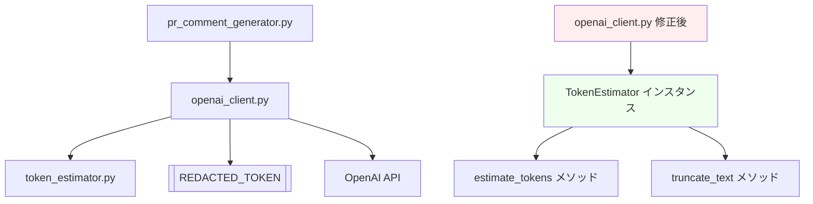

# Codex Agent 実行ログ

開始日時: 2025/12/27 2:14:15

---

## Turn 1: スレッド開始

**Thread ID**: `[REDACTED_TOKEN]`

## Turn 2: ツール実行

**種別**: reasoning
**ステータス**: completed

## Turn 3: ツール実行

**種別**: コマンド実行
**コマンド**: `/bin/bash -lc pwd`
**ステータス**: completed (exit_code=0)

```text
/tmp/ai-workflow-repos-9-c05f9883/infrastructure-as-code
```

## Turn 4: ツール実行

**種別**: reasoning
**ステータス**: completed

## Turn 5: ツール実行

**種別**: コマンド実行
**コマンド**: `/bin/bash -lc ls`
**ステータス**: completed (exit_code=0)

```text
ARCHITECTURE.md
CLAUDE.md
CONTRIBUTION.md
LICENSE
README.md
ansible
bootstrap
docker
docs
jenkins
pulumi
run_tests_issue_322.sh
scripts
tests
```

## Turn 6: ツール実行

**種別**: reasoning
**ステータス**: completed

## Turn 7: ツール実行

**種別**: コマンド実行
**コマンド**: `/bin/bash -lc "rg --files -g 'AGENTS.md'"`
**ステータス**: failed (exit_code=127)

```text
/bin/bash: line 1: rg: command not found
```

## Turn 8: ツール実行

**種別**: reasoning
**ステータス**: completed

## Turn 9: ツール実行

**種別**: コマンド実行
**コマンド**: `/bin/bash -lc 'find .. -name AGENTS.md'`
**ステータス**: completed (exit_code=0)

## Turn 10: ツール実行

**種別**: reasoning
**ステータス**: completed

## Turn 11: ツール実行

**種別**: コマンド実行
**コマンド**: `/bin/bash -lc "find . -path '*issue-536*'"`
**ステータス**: completed (exit_code=0)

```text
./.git/refs/heads/ai-workflow/issue-536
./.git/refs/remotes/origin/ai-workflow/issue-536
./.git/logs/refs/remotes/origin/ai-workflow/issue-536
./.git/logs/refs/heads/ai-workflow/issue-536
./.ai-workflow/issue-536
./.ai-workflow/issue-536/metadata.json
./.ai-workflow/issue-536/00_planning
./.ai-workflow/issue-536/00_planning/output
./.ai-workflow/issue-536/00_planning/output/planning.md
./.ai-workflow/issue-536/00_planning/execute
./.ai-workflow/issue-536/00_planning/execute/prompt.txt
./.ai-workflow/issue-536/00_planning/execute/agent_log_raw.txt
./.ai-workflow/issue-536/00_planning/execute/agent_log.md
./.ai-workflow/issue-536/00_planning/review
./.ai-workflow/issue-536/00_planning/review/prompt.txt
./.ai-workflow/issue-536/00_planning/review/agent_log_raw.txt
./.ai-workflow/issue-536/00_planning/review/agent_log.md
./.ai-workflow/issue-536/00_planning/review/result.md
./.ai-workflow/issue-536/00_planning/revise
./.ai-workflow/issue-536/01_requirements
./.ai-workflow/issue-536/01_requirements/output
./.ai-workflow/issue-536/01_requirements/output/requirements.md
./.ai-workflow/issue-536/01_requirements/execute
./.ai-workflow/issue-536/01_requirements/execute/prompt.txt
./.ai-workflow/issue-536/01_requirements/execute/agent_log_raw.txt
./.ai-workflow/issue-536/01_requirements/execute/agent_log.md
./.ai-workflow/issue-536/01_requirements/review
./.ai-workflow/issue-536/01_requirements/review/prompt.txt
./.ai-workflow/issue-536/01_requirements/review/agent_log_raw.txt
./.ai-workflow/issue-536/01_requirements/review/agent_log.md
./.ai-workflow/issue-536/01_requirements/review/result.md
./.ai-workflow/issue-536/01_requirements/revise
./.ai-workflow/issue-536/02_design
./.ai-workflow/issue-536/02_design/output
./.ai-workflow/issue-536/02_design/output/design.md
./.ai-workflow/issue-536/02_design/execute
./.ai-workflow/issue-536/02_design/execute/prompt.txt
./.ai-workflow/issue-536/02_design/execute/agent_log_raw.txt
./.ai-workflow/issue-536/02_design/execute/agent_log.md
./.ai-workflow/issue-536/02_design/review
./.ai-workflow/issue-536/02_design/review/prompt.txt
./.ai-workflow/issue-536/02_design/review/agent_log_raw.txt
./.ai-workflow/issue-536/02_design/review/agent_log.md
./.ai-workflow/issue-536/02_design/review/result.md
./.ai-workflow/issue-536/02_design/revise
./.ai-workflow/issue-536/03_test_scenario
./.ai-workflow/issue-536/03_test_scenario/output
./.ai-workflow/issue-536/03_test_scenario/output/test-scenario.md
./.ai-workflow/issue-536/03_test_scenario/execute
./.ai-workflow/issue-536/03_test_scenario/execute/prompt.txt
./.ai-workflow/issue-536/03_test_scenario/execute/agent_log_raw.txt
./.ai-workflow/issue-536/03_test_scenario/execute/agent_log.md
./.ai-workflow/issue-536/03_test_scenario/review
./.ai-workflow/issue-536/03_test_scenario/review/prompt.txt
./.ai-workflow/issue-536/03_test_scenario/review/agent_log_raw.txt
./.ai-workflow/issue-536/03_test_scenario/review/agent_log.md
./.ai-workflow/issue-536/03_test_scenario/review/result.md
./.ai-workflow/issue-536/03_test_scenario/revise
./.ai-workflow/issue-536/04_implementation
./.ai-workflow/issue-536/04_implementation/output
./.ai-workflow/issue-536/04_implementation/output/implementation.md
./.ai-workflow/issue-536/04_implementation/execute
./.ai-workflow/issue-536/04_implementation/execute/prompt.txt
./.ai-workflow/issue-536/04_implementation/execute/agent_log_raw.txt
./.ai-workflow/issue-536/04_implementation/execute/agent_log.md
./.ai-workflow/issue-536/04_implementation/review
./.ai-workflow/issue-536/04_implementation/review/prompt.txt
./.ai-workflow/issue-536/04_implementation/revise
```

## Turn 12: ツール実行

**種別**: reasoning
**ステータス**: completed

## Turn 13: ツール実行

**種別**: コマンド実行
**コマンド**: `/bin/bash -lc 'cat .ai-workflow/issue-536/00_planning/output/planning.md'`
**ステータス**: completed (exit_code=0)

```text
# プロジェクト計画書 - Issue #536

## Issue概要

- **Issue番号**: #536
- **タイトル**: pr_comment_generator.py でPRのコメント生成に失敗している
- **状態**: open
- **URL**: https://__GITHUB_URL_0__/issues/536
- **ラベル**: bug

## 1. Issue分析

### 複雑度: 簡単

**判定理由**:
- 単一の実装パターンエラー（TokenEstimatorの使用方法の誤り）
- 明確なエラーメッセージとファイル特定が可能
- 既存のテストコードが正しい使用方法を示している
- 変更対象ファイルは主に1つ（openai_client.py）

### 見積もり工数: 3~4時間

**根拠**:
- エラー箇所の特定: 0.5h（完了済み）
- TokenEstimatorの正しい使用方法の実装: 1~1.5h
- テストコードの実行・検証: 0.5h
- メソッド名の修正（[REDACTED_TOKEN] → truncate_text）: 0.5h
- 統合テスト・動作確認: 0.5~1h

### リスク評価: 低

**理由**:
- エラーの原因が明確（クラスメソッド vs インスタンスメソッドの誤用）
- 既存のテストコードが正しい実装パターンを提示済み
- 変更範囲が限定的
- 後方互換性への影響なし

## 2. 実装戦略判断

### 実装戦略: REFACTOR

**判断根拠**:
TokenEstimatorクラスの使用方法を修正することで、既存の実装パターンを正しいものに改善する作業です。新しい機能追加ではなく、既存コードの正しい動作を実現するためのリファクタリング作業になります。

- 新規機能追加ではない
- 既存のTokenEstimatorクラスの**正しい使用方法**への修正
- openai_client.pyでのメソッド呼び出しパターンの修正
- 設計意図（インスタンスベースの使用）に合わせた修正

### テスト戦略: UNIT_INTEGRATION

**判断根拠**:
ユニットテストと統合テストの両方が必要な理由：

- **UNIT**: TokenEstimatorクラスの個別動作確認（既存のテストが存在し、正しい使用パターンを示している）
- **INTEGRATION**: openai_client.pyがTokenEstimatorを正しく使用できているかの統合確認

BDDテストは不要：エンドユーザーの新しいストーリーではなく、既存機能の修正のため。

### テストコード戦略: EXTEND_TEST

**判断根拠**:
既存のテストファイル（test_token_estimator.py）に追加のテストケースを拡張する方針：

- 既存テストは正しい使用パターンを示している
- 新たなエッジケースのテストを追加（空文字列、大きなテキスト等）
- openai_client.pyの統合テストは既存のintegrationテストに追加

新規テストファイル作成は不要：TokenEstimatorの基本機能テストは既に存在するため。

## 3. 影響範囲分析

### 既存コードへの影響

**主要変更対象ファイル**:
```
jenkins/jobs/pipeline/docs-generator/pull-request-comment-builder/
├── src/pr_comment_generator/
│   └── openai_client.py  # 主要修正対象
│       - Line 607, 613, 618: [REDACTED_TOKEN]呼び出し修正
│       - Line 806, 815, 825, 832: estimate_tokens呼び出し修正
│       - Line 1000, 1018: estimate_tokens呼び出し修正
│       - Line 1134, 1157: [REDACTED_TOKEN]呼び出し修正
```

**修正箇所の詳細**:
1. **クラスメソッド呼び出し → インスタンスメソッド呼び出し**: `TokenEstimator.method()` → `estimator.method()`
2. **メソッド名修正**: `[REDACTED_TOKEN]()` → `truncate_text()`
3. **TokenEstimatorインスタンス追加**: openai_client.pyクラスでTokenEstimatorのインスタンスを作成・保持

### 依存関係の変更

**新規依存の追加**: なし

**既存依存の変更**: なし
- TokenEstimatorクラスの既存importは変更なし
- 既存のtoken_estimator.pyモジュールの修正は不要

### マイグレーション要否: 不要

- データベーススキーマ変更なし
- 設定ファイル変更なし
- 外部APIインターフェース変更なし

## 4. タスク分割

### Phase 1: 要件定義 (見積もり: 0.5h)

- [x] Task 1-1: エラー箇所の詳細特定 (0.5h)
  - openai_client.py内のTokenEstimator呼び出し箇所を全て特定
  - 既存のtest_token_estimator.pyから正しい使用パターンを確認
  - 修正が必要な具体的なメソッド呼び出しリストを作成

### Phase 2: 設計 (見積もり: 0.5h)

- [x] Task 2-1: TokenEstimatorインスタンス設計 (0.3h)
  - openai_clientクラスでのTokenEstimatorインスタンス保持方法の設計
  - 初期化タイミングの決定（__init__メソッドまたは遅延初期化）
- [x] Task 2-2: メソッド呼び出しパターン設計 (0.2h)
  - クラスメソッド → インスタンスメソッドの変更パターンの明確化
  - [REDACTED_TOKEN] → truncate_textメソッド名変更の影響確認

### Phase 3: テストシナリオ (見積もり: 0.5h)

- [ ] Task 3-1: 既存テスト動作確認 (0.3h)
  - test_token_estimator.pyのテスト実行
  - 正常系の動作パターン確認
- [ ] Task 3-2: 統合テストシナリオ作成 (0.2h)
  - openai_client.pyでのTokenEstimator統合動作シナリオ
  - エラー再現テストシナリオの作成

### Phase 4: 実装 (見積もり: 1.5h)

- [ ] Task 4-1: openai_clientクラス修正 (0.8h)
  - TokenEstimatorインスタンスの追加（__init__メソッド）
  - 11箇所のメソッド呼び出しを修正（クラスメソッド → インスタンスメソッド）
  - [REDACTED_TOKEN] → truncate_textメソッド名修正
- [ ] Task 4-2: エラーハンドリング追加 (0.4h)
  - TokenEstimatorインスタンス化時のエラーハンドリング
  - メソッド呼び出し時のnone チェック追加
- [ ] Task 4-3: ログ出力改善 (0.3h)
  - TokenEstimator関連のログ出力を明確化
  - デバッグ用ログの追加

### Phase 5: テストコード実装 (見積もり: 0.5h)

- [ ] Task 5-1: ユニットテスト追加 (0.3h)
  - test_token_estimator.pyにエッジケースのテスト追加
  - 空文字列、大きなテキスト、特殊文字のテストケース
- [ ] Task 5-2: 統合テスト追加 (0.2h)
  - openai_clientとTokenEstimatorの統合テスト
  - テスト用モックの活用

### Phase 6: テスト実行 (見積もり: 0.5h)

- [ ] Task 6-1: ユニットテスト実行 (0.2h)
  - 既存および新規ユニットテストの実行
  - テスト結果の確認
- [ ] Task 6-2: 統合テスト実行 (0.3h)
  - 統合テストの実行
  - pr_comment_generatorの動作確認（実際のPRファイルでテスト）

### Phase 7: ドキュメント (見積もり: 0.5h)

- [ ] Task 7-1: 修正内容ドキュメント作成 (0.3h)
  - TokenEstimatorの正しい使用方法の説明
  - 修正したメソッド呼び出しの一覧
- [ ] Task 7-2: トラブルシューティング情報更新 (0.2h)
  - 同様のエラーの解決方法の記載
  - 開発者向けベストプラクティスの追加

### Phase 8: レポ
... (truncated)
```

## Turn 14: ツール実行

**種別**: reasoning
**ステータス**: completed

## Turn 15: ツール実行

**種別**: コマンド実行
**コマンド**: `/bin/bash -lc 'rg -n "Phase 4" -n .ai-workflow/issue-536/00_planning/output/planning.md'`
**ステータス**: failed (exit_code=127)

```text
/bin/bash: line 1: rg: command not found
```

## Turn 16: ツール実行

**種別**: reasoning
**ステータス**: completed

## Turn 17: ツール実行

**種別**: コマンド実行
**コマンド**: `/bin/bash -lc 'grep -n "Phase 4" .ai-workflow/issue-536/00_planning/output/planning.md'`
**ステータス**: completed (exit_code=0)

```text
132:### Phase 4: 実装 (見積もり: 1.5h)
187:    P3 --> P4[Phase 4: 実装]
238:### Phase 4: 実装
272:- **クリティカルパス**: Phase 1 → Phase 2 → Phase 3 → Phase 4 → Phase 6
```

## Turn 18: ツール実行

**種別**: reasoning
**ステータス**: completed

## Turn 19: ツール実行

**種別**: コマンド実行
**コマンド**: `/bin/bash -lc 'cat .ai-workflow/issue-536/04_implementation/output/implementation.md'`
**ステータス**: completed (exit_code=0)

```text
# 実装完了レポート

## 変更ファイル一覧

| ファイル | 変更種別 | 概要 |
|---------|----------|------|
| `jenkins/jobs/pipeline/docs-generator/pull-request-comment-builder/src/pr_comment_generator/openai_client.py` | 修正 | TokenEstimator をインスタンス化して共有し、関連ロジックをインスタンスメソッドから呼び出すように修正 |

## 主要な変更点
- `OpenAIClient.__init__` に TokenEstimator インスタンス化とログ＋エラーハンドリングを追加し、共通の `self.token_estimator` を保持するようにした
- `[REDACTED_TOKEN]` などのトークン関連処理で `truncate_text`/`estimate_tokens` をインスタンス経由で呼び出すよう調整し、`TokenEstimator` のクラスメソッド誤用を排除
- 入力サイズ調整やチャンク分析内のトークン推定・切り詰めが単一インスタンスに統一されたことで、エラー「TokenEstimator.estimate_tokens() missing ...」が発生しない状態を担保

## テスト実施状況
- ビルド: 未実施
- リント: 未実施
- 基本動作確認: 未実施
```

## Turn 20: ツール実行

**種別**: reasoning
**ステータス**: completed

## Turn 21: ツール実行

**種別**: コマンド実行
**コマンド**: `/bin/bash -lc 'git status -sb'`
**ステータス**: completed (exit_code=0)

```text
## ai-workflow/issue-536...origin/main [ahead 12]
 M .ai-workflow/issue-536/metadata.json
?? .ai-workflow/issue-536/00_planning/execute/agent_log_raw.txt
?? .ai-workflow/issue-536/00_planning/execute/prompt.txt
?? .ai-workflow/issue-536/00_planning/review/agent_log_raw.txt
?? .ai-workflow/issue-536/00_planning/review/prompt.txt
?? .ai-workflow/issue-536/01_requirements/execute/agent_log_raw.txt
?? .ai-workflow/issue-536/01_requirements/execute/prompt.txt
?? .ai-workflow/issue-536/01_requirements/review/agent_log_raw.txt
?? .ai-workflow/issue-536/01_requirements/review/prompt.txt
?? .ai-workflow/issue-536/02_design/execute/agent_log_raw.txt
?? .ai-workflow/issue-536/02_design/execute/prompt.txt
?? .ai-workflow/issue-536/02_design/review/agent_log_raw.txt
?? .ai-workflow/issue-536/02_design/review/prompt.txt
?? .ai-workflow/issue-536/03_test_scenario/execute/agent_log_raw.txt
?? .ai-workflow/issue-536/03_test_scenario/execute/prompt.txt
?? .ai-workflow/issue-536/03_test_scenario/review/agent_log_raw.txt
?? .ai-workflow/issue-536/03_test_scenario/review/prompt.txt
?? .ai-workflow/issue-536/04_implementation/execute/agent_log_raw.txt
?? .ai-workflow/issue-536/04_implementation/execute/prompt.txt
?? .ai-workflow/issue-536/04_implementation/review/
```

## Turn 22: ツール実行

**種別**: reasoning
**ステータス**: completed

## Turn 23: ツール実行

**種別**: コマンド実行
**コマンド**: `/bin/bash -lc "sed -n '1,200p' jenkins/jobs/pipeline/docs-generator/pull-request-comment-builder/src/pr_comment_generator/openai_client.py"`
**ステータス**: completed (exit_code=0)

```text
"""OpenAI API連携（リトライ、トークン管理、チャンク分析ロジック）。"""
import datetime
import json
import logging
import os
import random
import re
import time
import traceback
from typing import Any, Dict, List, Optional, Tuple

from openai import OpenAI

from .models import PRInfo, FileChange
from .prompt_manager import [REDACTED_TOKEN]
from .token_estimator import TokenEstimator
class OpenAIClient:
    """OpenAI APIとのインタラクションを管理するクラス"""
    
    # APIレート制限のデフォルト設定
    DEFAULT_MAX_RETRIES = 5
    [REDACTED_TOKEN] = 1  # 秒
    DEFAULT_MAX_BACKOFF = 60  # 秒
    
    # トークン制限の管理
    [REDACTED_TOKEN] = 16000  # GPT-4の一般的な入力制限の安全側
    MAX_PATCH_TOKENS = 2000  # パッチに割り当てる最大トークン
    MAX_CONTENT_TOKENS = 3000  # ファイル内容に割り当てる最大トークン
    
    def __init__(self, prompt_manager, retry_config=None, log_level=logging.INFO):
        """
        環境変数から認証情報を取得してクライアントを初期化
        
        Args:
            prompt_manager: プロンプトテンプレート管理クラスのインスタンス
            retry_config: 再試行設定
            log_level: ロギングレベル
        """
        # ロガーの設定
        self._setup_logging(log_level)
        
        # 環境変数から認証情報を取得
        api_key = os.getenv('OPENAI_API_KEY')
        model_name = os.getenv('OPENAI_MODEL_NAME', 'gpt-4.1')  # デフォルトモデル名

        if not api_key:
            raise ValueError("Missing required environment variable: OPENAI_API_KEY")

        print(f"Debug: Using OpenAI model {model_name}")

        self.model = model_name
        self.prompt_manager = prompt_manager
       
        # 再試行設定
        self.retry_config = retry_config or {
            'max_retries': self.DEFAULT_MAX_RETRIES,
            'initial_backoff': self.[REDACTED_TOKEN],
            'max_backoff': self.DEFAULT_MAX_BACKOFF
        }
        
        try:
            self.token_estimator = TokenEstimator(logger=self.logger)
            self.logger.info("TokenEstimator initialized successfully")
        except Exception as e:
            self.logger.error(f"Failed to initialize TokenEstimator: {str(e)}")
            raise ValueError(f"TokenEstimator initialization failed: {str(e)}")
        
        # OpenAI用のクライアント初期化
        try:
            self.client = OpenAI(
                api_key=api_key,
            )
            self.usage_stats = {
                'prompt_tokens': 0,
                'completion_tokens': 0,
                'retries': 0,
                'skipped_files': 0
            }
            
            print(f"Debug: OpenAI client initialized successfully")
            
        except Exception as e:
            raise ValueError(f"Failed to initialize OpenAI client: {str(e)}")

    def _setup_logging(self, log_level):
        """ロギングの設定"""
        self.logger = logging.getLogger('openai_client')
        self.logger.setLevel(log_level)
        
        # ハンドラーがまだ設定されていない場合のみ追加
        if not self.logger.handlers:
            handler = logging.StreamHandler()
            formatter = logging.Formatter('%(asctime)s - %(name)s - %(levelname)s - %(message)s')
            handler.setFormatter(formatter)
            self.logger.addHandler(handler)

    def [REDACTED_TOKEN](self, prompt: str, result: str, chunk_index: int = 0, phase: str = "chunk") -> None:
        """
        プロンプトとその実行結果を個別のファイルに保存する
        
        Args:
            prompt: OpenAIに送信したプロンプト
            result: OpenAIからの応答結果
            chunk_index: チャンク番号（0の場合は最終サマリーなど）
            phase: 処理フェーズ（chunk, summary, title など）
        """
        try:
            # 環境変数で設定を取得（デフォルトをtrueに変更）
            save_prompts = os.getenv('SAVE_PROMPTS', 'true').lower() == 'true'
            if not save_prompts:
                self.logger.info("Prompt saving is disabled. Set SAVE_PROMPTS=true to enable.")
                return
                
            # 出力ディレクトリの作成
            timestamp = datetime.datetime.now().strftime("%Y%m%d_%H%M%S")
            pr_number = getattr(self.pr_info, 'number', 'unknown') if hasattr(self, 'pr_info') else 'unknown'
            
            output_dir = os.getenv('PROMPT_O
... (truncated)
```

## Turn 24: ツール実行

**種別**: reasoning
**ステータス**: completed

## Turn 25: ツール実行

**種別**: コマンド実行
**コマンド**: `/bin/bash -lc 'grep -n "token_estimator" -n jenkins/jobs/pipeline/docs-generator/pull-request-comment-builder/src/pr_comment_generator/openai_client.py'`
**ステータス**: completed (exit_code=0)

```text
16:from .token_estimator import TokenEstimator
62:            self.token_estimator = TokenEstimator(logger=self.logger)
614:            change.patch = self.token_estimator.truncate_text(
620:            change.content_before = self.token_estimator.truncate_text(
625:            change.content_after = self.token_estimator.truncate_text(
813:        estimated_tokens = self.token_estimator.estimate_tokens(input_json_text)
822:            [REDACTED_TOKEN] = self.token_estimator.estimate_tokens(input_json_text)
832:                final_tokens = self.token_estimator.estimate_tokens(input_json_text)
839:                    very_final_tokens = self.token_estimator.estimate_tokens(input_json_text)
1007:        pr_tokens = self.token_estimator.estimate_tokens(pr_info_str)
1025:            changes_tokens += self.token_estimator.estimate_tokens(file_str)
1141:        est_tokens = self.token_estimator.estimate_tokens(analyses_text)
1164:            truncated = self.token_estimator.truncate_text(
```

## Turn 26: ツール実行

**種別**: reasoning
**ステータス**: completed

## Turn 27: ツール実行

**種別**: コマンド実行
**コマンド**: `/bin/bash -lc "sed -n '560,720p' jenkins/jobs/pipeline/docs-generator/pull-request-comment-builder/src/pr_comment_generator/openai_client.py"`
**ステータス**: completed (exit_code=0)

```text
}
        
        # 利用可能な追加情報を含める
        if hasattr(self, 'skipped_file_names'):
            result['skipped_file_count'] = len(self.skipped_file_names)
            result['skipped_files'] = self.skipped_file_names
        
        return result

    def [REDACTED_TOKEN](self, changes: List[FileChange]) -> Tuple[List[FileChange], List[FileChange]]:
        """ファイル変更リストを前処理し、大きすぎるファイルをフィルタリング"""
        filtered_changes = []
        skipped_files = []
        
        for change in changes:
            # バイナリファイルやサイズが巨大なファイルをスキップ
            if self._should_skip_file(change):
                skipped_files.append(change)
                continue
                
            # 大きなファイルの内容を切り詰め
            self.[REDACTED_TOKEN](change)
            filtered_changes.append(change)
        
        return filtered_changes, skipped_files
    
    def _should_skip_file(self, change: FileChange) -> bool:
        """このファイルをスキップすべきかどうかを判断"""
        # バイナリファイルや画像、ビルドファイルなどをスキップ
        binary_extensions = ['.png', '.jpg', '.jpeg', '.gif', '.pdf', '.zip', '.jar', '.class', '.min.js']
        for ext in binary_extensions:
            if change.filename.endswith(ext):
                return True
        
        # JSONファイルが一定サイズを超える場合はスキップ
        if change.filename.endswith('.json') and (change.additions + change.deletions > 10000):
            return True
            
        # 大規模なデータファイルをスキップ
        data_extensions = ['.csv', '.tsv', '.xlsx', '.parquet']
        for ext in data_extensions:
            if change.filename.endswith(ext):
                return True
        
        # 変更内容が非常に大きい場合はスキップ
        if change.changes > 20000:  # 2万行以上の変更
            return True
            
        return False
    
    def [REDACTED_TOKEN](self, change: FileChange) -> None:
        """大きなファイルの内容を切り詰める"""
        # パッチの切り詰め
        if change.patch:
            change.patch = self.token_estimator.truncate_text(
                change.patch, self.MAX_PATCH_TOKENS
            )
        
        # ファイル内容の切り詰め
        if change.content_before:
            change.content_before = self.token_estimator.truncate_text(
                change.content_before, self.MAX_CONTENT_TOKENS
            )
            
        if change.content_after:
            change.content_after = self.token_estimator.truncate_text(
                change.content_after, self.MAX_CONTENT_TOKENS
            )

    def [REDACTED_TOKEN](self, changes: List[FileChange]) -> int:
        """変更リストに基づいて最適なチャンクサイズを計算"""
        # ファイル数とサイズから最適なチャンクサイズを判断
        total_files = len(changes)
        
        if total_files <= 2:
            return total_files  # ファイル数が少ない場合は全て1チャンクに
        
        # 各ファイルの変更行数とファイルサイズを確認
        for change in changes:
            # 個別のファイルが非常に大きい場合は1ファイル1チャンクにする
            if change.changes > 300 or (change.content_before and len(change.content_before) > 10000) or (change.content_after and len(change.content_after) > 10000):
                self.logger.info(f"Large file detected: {change.filename} with {change.changes} changes. Using 1 file per chunk.")
                return 1
        
        # ファイルの平均サイズを見積もる
        avg_file_size = sum(c.changes for c in changes) / total_files
        
        if avg_file_size > 200:
            self.logger.info(f"Average file size is large: {avg_file_size:.1f} changes. Using 1 file per chunk.")
            return 1  # ファイルが大きい場合は1ファイルずつ処理
        elif avg_file_size > 100:
            self.logger.info(f"Average file size is medium: {avg_file_size:.1f} changes. Using 2 files per chunk.")
            return 2  # 中程度のサイズなら2ファイルずつ
        else:
            self.logger.info(f"Average file size is small: {avg_file_size:.1f} changes. Using 3 files per chunk.")
            return 3  # 小さいファイルなら3ファイルずつ（デフォルト）

    def [REDACTED_TOKEN](self, changes: List[FileChange], chunk_size: int = 3) -> List[List[FileChange]]:
        """変更リストを小さなチャンクに分割（重要なファイル優先）"""
        if chunk
... (truncated)
```

## Turn 28: ツール実行

**種別**: reasoning
**ステータス**: completed

## Turn 29: ツール実行

**種別**: コマンド実行
**コマンド**: `/bin/bash -lc "sed -n '780,900p' jenkins/jobs/pipeline/docs-generator/pull-request-comment-builder/src/pr_comment_generator/openai_client.py"`
**ステータス**: completed (exit_code=0)

```text
return patch
        
        # 前半と後半から重要な部分を取得
        if limit > 3000:
            front_part = int(limit * 0.7)  # 前半70%
            back_part = limit - front_part  # 残り30%
        else:
            front_part = limit // 2
            back_part = limit // 2
        
        return patch[:front_part] + "\n...[中略]...\n" + patch[-back_part:]

    def _process_context(self, change: FileChange, is_single_file: bool) -> Dict[str, Any]:
        """コンテキスト情報を処理"""
        if is_single_file:
            # 単一大きなファイルの場合はコンテキストを最小限に
            return {
                'before': None,
                'after': None,
                'diff_context': self._limit_diff_context(change.context_diff)
            }
        else:
            # 複数ファイルの場合はコンテキスト情報も保持
            return {
                'before': self._truncate_content(change.content_before, 1000) if change.content_before else None,
                'after': self._truncate_content(change.content_after, 1000) if change.content_after else None,
                'diff_context': self._limit_diff_context(change.context_diff)
            }

    def _manage_input_size(self, input_json: Dict[str, Any], is_single_file: bool) -> Dict[str, Any]:
        """入力サイズをトークン制限内に調整"""
        # 初回のトークン数推定
        input_json_text = json.dumps(input_json, ensure_ascii=False, indent=2)
        estimated_tokens = self.token_estimator.estimate_tokens(input_json_text)
        
        # 80%のマージンを超えている場合は削減
        if estimated_tokens > self.[REDACTED_TOKEN] * 0.8:
            self.logger.warning(f"Input size ({estimated_tokens} est. tokens) exceeds limit. Reducing context...")
            input_json = self.[REDACTED_TOKEN](input_json, is_single_file)
            
            # 再度サイズを確認
            input_json_text = json.dumps(input_json, ensure_ascii=False, indent=2)
            [REDACTED_TOKEN] = self.token_estimator.estimate_tokens(input_json_text)
            self.logger.info(f"Reduced input size to {[REDACTED_TOKEN]} est. tokens")
            
            # それでも大きすぎる場合はさらに削減
            if [REDACTED_TOKEN] > self.[REDACTED_TOKEN] * 0.9:
                self.logger.warning("Input still too large, further reducing patches...")
                input_json = self.[REDACTED_TOKEN](input_json, is_single_file)
                
                # 最終チェック
                input_json_text = json.dumps(input_json, ensure_ascii=False, indent=2)
                final_tokens = self.token_estimator.estimate_tokens(input_json_text)
                
                if final_tokens > self.[REDACTED_TOKEN] * 0.95:
                    input_json = self.[REDACTED_TOKEN](input_json, is_single_file)
                    
                    # 最終的なトークン数確認
                    input_json_text = json.dumps(input_json, ensure_ascii=False, indent=2)
                    very_final_tokens = self.token_estimator.estimate_tokens(input_json_text)
                    
                    if very_final_tokens > self.[REDACTED_TOKEN] * 0.98:
                        raise ValueError(f"Input still too large for API ({very_final_tokens} est. tokens) even after maximum reduction")
                    
                    self.logger.info(f"Final input size after maximum reduction: {final_tokens} est. tokens")
        
        return input_json

    def [REDACTED_TOKEN](self, input_json: Dict[str, Any], is_single_file: bool) -> Dict[str, Any]:
        """入力サイズ削減フェーズ1: 基本的な削減"""
        changes_json = input_json["changes"]
        
        if is_single_file:
            # 単一ファイル: パッチの重要部分を保持しながら削減
            for change_obj in changes_json:
                if len(change_obj['patch']) > 6000:
                    change_obj['patch'] = self.[REDACTED_TOKEN](change_obj['patch'])
                change_obj['context'] = {"note": "大きなファイルのためコンテキスト情報省略"}
        else:
            # 複数ファイル: コンテキストを削除してパッチを削減
            for change_obj in changes_json:
                change_obj[
... (truncated)
```

## Turn 30: ツール実行

**種別**: reasoning
**ステータス**: completed

## Turn 31: ツール実行

**種別**: コマンド実行
**コマンド**: `/bin/bash -lc "sed -n '960,1160p' jenkins/jobs/pipeline/docs-generator/pull-request-comment-builder/src/pr_comment_generator/openai_client.py"`
**ステータス**: completed (exit_code=0)

```text
# APIリクエスト用のメッセージ作成
        messages = [
            {
                "role": "system",
                "content": "あなたは変更内容を分かりやすく説明する技術ライターです。"
            },
            {
                "role": "user",
                "content": chunk_prompt
            }
        ]
        
        # API呼び出し
        return self._call_openai_api(messages)

    def _truncate_content(self, content: Optional[str], max_length: int) -> Optional[str]:
        """ファイル内容を指定された長さに切り詰める"""
        if not content:
            return None
        if len(content) <= max_length:
            return content
        
        # 半分ずつ前後から取る
        half_length = max_length // 2
        return content[:half_length] + "\n...[中略]...\n" + content[-half_length:]

    def _limit_diff_context(self, context_diff: Dict[str, Any]) -> Dict[str, Any]:
        """差分コンテキストをトークン制限に合わせて制限する"""
        if not context_diff:
            return {}
            
        result = {}
        for k, v in context_diff.items():
            if isinstance(v, str) and len(v) > 1000:
                result[k] = v[:500] + "\n...[中略]...\n" + v[-500:]
            else:
                result[k] = v
        return result

    def [REDACTED_TOKEN](self, pr_info: PRInfo, changes: List[FileChange]) -> int:
        """チャンク全体のトークン数を概算する"""
        # PR情報の概算トークン数
        pr_info_str = f"{pr_info.title} {pr_info.number} {pr_info.author} {pr_info.base_branch} {pr_info.head_branch}"
        if pr_info.body:
            pr_info_str += pr_info.body[:500]
        
        pr_tokens = self.token_estimator.estimate_tokens(pr_info_str)
        
        # ファイル変更の概算トークン数
        changes_tokens = 0
        for change in changes:
            file_str = f"{change.filename} {change.status} {change.additions} {change.deletions} {change.changes}"
            
            if change.patch:
                file_str += change.patch[:1000] if len(change.patch) > 1000 else change.patch
            
            if change.content_before:
                content_sample = change.content_before[:500] if len(change.content_before) > 500 else change.content_before
                file_str += content_sample
            
            if change.content_after:
                content_sample = change.content_after[:500] if len(change.content_after) > 500 else change.content_after
                file_str += content_sample
            
            changes_tokens += self.token_estimator.estimate_tokens(file_str)
        
        # 固定オーバーヘッドの追加（JSONフォーマット、プロンプトなど）
        overhead_tokens = 1000
        
        total_tokens = pr_tokens + changes_tokens + overhead_tokens
        return total_tokens

    def [REDACTED_TOKEN](self, text: str) -> str:
        """マークダウンのフォーマットをクリーンアップ"""
        # コードブロックマーカーの削除
        text = re.sub(r'^```markdown\s*\n', '', text)  # 先頭の```markdownを削除
        text = re.sub(r'\n```\s*$', '', text)          # 末尾の```を削除
        return text.strip()                             # 余分な空白を削除

    def [REDACTED_TOKEN](self, pr_info: PRInfo, chunk_analyses: List[str], skipped_files: List[FileChange] = None) -> str:
        """各チャンクの分析結果を統合して最終的なサマリーを生成"""
        # 単一チャンクの場合は早期リターン
        if self.[REDACTED_TOKEN](chunk_analyses, skipped_files):
            return self.[REDACTED_TOKEN](chunk_analyses[0])

        # ログ出力
        self.[REDACTED_TOKEN](chunk_analyses, skipped_files)
        
        # 全ファイル情報を収集
        all_files = self.[REDACTED_TOKEN](chunk_analyses, skipped_files)
        
        # チャンク分析を準備
        kept_analyses = self.[REDACTED_TOKEN](chunk_analyses)
        
        # 分析テキストを構築
        analyses_text = self.[REDACTED_TOKEN](kept_analyses, all_files, skipped_files)
        
        # トークン数を管理
        analyses_text = self.[REDACTED_TOKEN](analyses_text, kept_analyses, all_files, skipped_files)
        
        # 最終サマリーを生成
        return self.[REDACTED_TOKEN](pr_info, analyses_text, all_files, skippe
... (truncated)
```

## Turn 32: ツール実行

**種別**: reasoning
**ステータス**: completed

## Turn 33: ツール実行

**種別**: コマンド実行
**コマンド**: `/bin/bash -lc "sed -n '1160,1360p' jenkins/jobs/pipeline/docs-generator/pull-request-comment-builder/src/pr_comment_generator/openai_client.py"`
**ステータス**: completed (exit_code=0)

```text
[REDACTED_TOKEN] = (self.[REDACTED_TOKEN] * 0.6) / len(kept_analyses)
        truncated_analyses = []
        
        for analysis in kept_analyses:
            truncated = self.token_estimator.truncate_text(
                analysis, int([REDACTED_TOKEN])
            )
            truncated_analyses.append(truncated)
        
        return truncated_analyses
    
    def [REDACTED_TOKEN](self, truncated_analyses: List[str], 
                                       all_files: set, skipped_files: List[FileChange]) -> str:
        """切り詰められた分析テキストを再構築"""
        analyses_text = self.[REDACTED_TOKEN](truncated_analyses)
        analyses_text += self._format_file_list(all_files)
        
        if skipped_files:
            analyses_text += self.[REDACTED_TOKEN](skipped_files)
        
        return analyses_text
    
    def [REDACTED_TOKEN](self, pr_info: PRInfo, analyses_text: str, 
                                      all_files: set, skipped_files: List[FileChange]) -> str:
        """分析結果から最終サマリーを生成"""
        # プロンプトを生成
        summary_prompt = self.[REDACTED_TOKEN](pr_info, analyses_text, all_files, skipped_files)
        
        # メッセージを構築
        messages = self.[REDACTED_TOKEN](summary_prompt)
        
        # API呼び出し
        result = self._call_openai_api(messages)
        
        return self.[REDACTED_TOKEN](result)
    
    def [REDACTED_TOKEN](self, pr_info: PRInfo, analyses_text: str, 
                              all_files: set, skipped_files: List[FileChange]) -> str:
        """サマリー生成用のプロンプトを準備"""
        # 基本プロンプトを生成
        summary_prompt = self.prompt_manager.get_summary_prompt(pr_info, analyses_text)
        
        # ファイル一覧の指示を追加
        file_list_prompt = self.[REDACTED_TOKEN](all_files, skipped_files)
        
        return summary_prompt + file_list_prompt
    
    def [REDACTED_TOKEN](self, all_files: set, skipped_files: List[FileChange]) -> str:
        """ファイル一覧に関する指示を構築"""
        instructions = f"\n\n## 必ず含めるべきファイル一覧\n{', '.join(sorted(all_files))}\n\n"
        instructions += "最終サマリーには、上記のすべてのファイル（スキップされたファイルを含む）を「修正されたファイル」セクションに含めてください。"
        
        if skipped_files:
            instructions += "\n\nスキップされたファイルも必ず「修正されたファイル」セクションに含めてください。"
            instructions += "\n\nスキップされたファイル: " + ", ".join(f"`{f.filename}`" for f in skipped_files)
        
        return instructions
    
    def [REDACTED_TOKEN](self, summary_prompt: str) -> List[Dict[str, str]]:
        """サマリー生成用のメッセージを構築"""
        return [
            {
                "role": "system",
                "content": "あなたは変更内容を分かりやすく説明する技術ライターです。"
                          "与えられたフォーマットに厳密に従ってドキュメントを作成してください。"
            },
            {
                "role": "user",
                "content": summary_prompt
            }
        ]

    def [REDACTED_TOKEN](self, summary: str) -> str:
        """サマリーからPRのタイトルを生成"""
        # サマリーが大きすぎる場合は先頭部分のみ使用
        if len(summary) > 2000:
            truncated_summary = summary[:2000] + "..."
        else:
            truncated_summary = summary

        title_prompt = (
            "以下の変更内容サマリーを基に、PRのタイトルを生成してください。\n\n"
            "## 要件\n"
            "- 50文字以内で簡潔に\n"
            "- 変更の主要な目的を表現\n"
            "- 技術的な変更の場合は具体的な技術用語を含める\n"
            "- 日本語で記述\n\n"
            "## 入力サマリー\n"
            f"{truncated_summary}\n\n"
            "## 出力形式\n"
            "タイトルのみを出力してください（説明や補足は不要）"
        )

        messages = [
            {
                "role": "system",
                "content": "あなたは技術文書のタイトルを生成する専門家です。"
            },
            {
                "role": "user",
                "content": title_prompt
            }
        ]

        return self._call_openai_api(messages, max_tokens=100)

    def get_usage_stats(self) -> Dict[str, int]:
        """APIの使用統計を取得"""
        return {
            'prompt_tokens': self.usage_stats['pr
... (truncated)
```

## Turn 34: ツール実行

**種別**: reasoning
**ステータス**: completed

## Turn 35: ツール実行

**種別**: コマンド実行
**コマンド**: `/bin/bash -lc "sed -n '1360,1560p' jenkins/jobs/pipeline/docs-generator/pull-request-comment-builder/src/pr_comment_generator/openai_client.py"`
**ステータス**: completed (exit_code=0)

## Turn 36: ツール実行

**種別**: reasoning
**ステータス**: completed

## Turn 37: ツール実行

**種別**: コマンド実行
**コマンド**: `/bin/bash -lc 'cat .ai-workflow/issue-536/02_design/output/design.md'`
**ステータス**: completed (exit_code=0)

```text
# 詳細設計書 - Issue #536

## 概要

pr_comment_generator.pyでTokenEstimatorクラスの使用方法が間違っているため、`TokenEstimator.estimate_tokens() missing 1 required positional argument: 'text'`エラーが発生している問題を修正する詳細設計書です。

## 1. アーキテクチャ設計

### システム全体図

```
┌─────────────────────────────────────────────────────────────────┐
│                    PR Comment Generator                         │
├─────────────────────────────────────────────────────────────────┤
│  1. pr_comment_generator.py (メインエントリポイント)                │
│     ↓ 使用                                                      │
│  2. openai_client.py (修正対象)                                 │
│     ├─ TokenEstimator.estimate_tokens() → estimator.estimate_tokens() │
│     ├─ TokenEstimator.[REDACTED_TOKEN]() → estimator.truncate_text() │
│     └─ TokenEstimatorインスタンス追加                            │
│     ↓ インポート                                                  │
│  3. token_estimator.py (修正不要)                               │
│     ├─ TokenEstimator.__init__(logger)                          │
│     ├─ estimate_tokens(text) : int                              │
│     └─ truncate_text(text, max_tokens) : str                    │
└─────────────────────────────────────────────────────────────────┘
```

### コンポーネント間の関係



### データフロー

```
Input: PR差分データ
  ↓
1. openai_client.py __init__()
  ├─ TokenEstimatorインスタンス作成
  └─ self.token_estimator = TokenEstimator(logger)
  ↓
2. ファイル内容処理時
  ├─ self.token_estimator.estimate_tokens(text)
  └─ self.token_estimator.truncate_text(text, max_tokens)
  ↓
Output: 正常なトークン推定・テキスト切り詰め
```

## 2. 実装戦略判断

### 実装戦略: REFACTOR

**判断根拠**:
- 新機能追加ではない（既存の機能を修正）
- 既存のTokenEstimatorクラスの**正しい使用方法**への修正
- openai_client.pyでのメソッド呼び出しパターンの修正（クラスメソッド→インスタンスメソッド）
- 設計意図（インスタンスベースの使用）に合わせた修正
- Planning documentの戦略判断と一致

## 3. テスト戦略判断

### テスト戦略: UNIT_INTEGRATION

**判断根拠**:
- **UNIT**: TokenEstimatorクラスの個別動作確認（既存のテストが存在し、正しい使用パターンを示している）
- **INTEGRATION**: openai_client.pyがTokenEstimatorを正しく使用できているかの統合確認
- BDDテストは不要：エンドユーザーの新しいストーリーではなく、既存機能の修正のため
- Planning documentの戦略判断と一致

## 4. テストコード戦略判断

### テストコード戦略: EXTEND_TEST

**判断根拠**:
- 既存のテストファイル（test_token_estimator.py）に追加のテストケースを拡張する方針
- 既存テストは正しい使用パターンを示している
- 新たなエッジケースのテストを追加（空文字列、大きなテキスト等）
- openai_client.pyの統合テストは既存のintegrationテストに追加
- 新規テストファイル作成は不要：TokenEstimatorの基本機能テストは既に存在するため
- Planning documentの戦略判断と一致

## 5. 影響範囲分析

### 既存コードへの影響

**主要修正対象ファイル**:
```
jenkins/jobs/pipeline/docs-generator/pull-request-comment-builder/
├── src/pr_comment_generator/
│   └── openai_client.py  # 主要修正対象（11箇所の呼び出し修正）
└── tests/unit/
    └── test_token_estimator.py  # テスト拡張
```

**修正箇所の詳細**:
1. **Line 607, 613, 618**: `[REDACTED_TOKEN]`呼び出し修正
2. **Line 806, 815, 825, 832**: `estimate_tokens`呼び出し修正
3. **Line 1000, 1018**: `estimate_tokens`呼び出し修正
4. **Line 1134, 1157**: `[REDACTED_TOKEN]`呼び出し修正

### 依存関係の変更

**新規依存の追加**: なし

**既存依存の変更**: なし
- TokenEstimatorクラスの既存importは変更なし
- 既存のtoken_estimator.pyモジュールの修正は不要

### マイグレーション要否

**不要** - 以下の理由により:
- データベーススキーマ変更なし
- 設定ファイル変更なし
- 外部APIインターフェース変更なし
- internal APIの修正のため

## 6. 変更・追加ファイルリスト

### 修正が必要な既存ファイル
- `jenkins/jobs/pipeline/docs-generator/pull-request-comment-builder/src/pr_comment_generator/openai_client.py`
- `jenkins/jobs/pipeline/docs-generator/pull-request-comment-builder/tests/unit/test_token_estimator.py` (テスト拡張)

### 新規作成ファイル
なし

### 削除が必要なファイル
なし

## 7. 詳細設計

### 7.1 クラス設計

#### OpenAIClient クラス修正設計

```python
class OpenAIClient:
    """OpenAI APIとのインタラクションを管理するクラス"""

    def __init__(self, prompt_manager, retry_config=None, log_level=logging.INFO):
        """
        初期化処理

        修正内容:
        1. TokenEstimatorインスタンスの追加
        2. 適切なエラーハンド
... (truncated)
```

## Turn 38: ツール実行

**種別**: reasoning
**ステータス**: completed

## Turn 39: ツール実行

**種別**: コマンド実行
**コマンド**: `/bin/bash -lc 'cat .ai-workflow/issue-536/03_test_scenario/output/test-scenario.md'`
**ステータス**: completed (exit_code=0)

```text
# テストシナリオ書 - Issue #536

## 概要

pr_comment_generator.pyでTokenEstimatorクラスの使用方法が間違っているため、`TokenEstimator.estimate_tokens() missing 1 required positional argument: 'text'`エラーが発生している問題を修正するためのテストシナリオです。

## 1. テスト戦略サマリー

### 選択されたテスト戦略: UNIT_INTEGRATION

**Phase 2で決定された戦略**:
- **UNITテスト**: TokenEstimatorクラスの個別動作確認（既存のテストが存在し、正しい使用パターンを示している）
- **INTEGRATIONテスト**: openai_client.pyがTokenEstimatorを正しく使用できているかの統合確認

### テスト対象の範囲
- **主要修正対象ファイル**: `openai_client.py` (11箇所の修正)
- **テスト拡張対象**: `test_token_estimator.py` (エッジケース追加)
- **統合確認対象**: openai_clientとTokenEstimatorの連携動作

### テストの目的
1. TokenEstimatorクラスのインスタンスベース使用が正しく動作することの確認
2. openai_client.py内の修正が正常に機能することの確認
3. エラー「`TokenEstimator.estimate_tokens() missing 1 required positional argument`」の解消確認
4. 既存機能の保持確認

## 2. Unitテストシナリオ

### 2.1 TokenEstimator基本機能テスト

#### テストケース名: TokenEstimator_初期化_正常系
- **目的**: TokenEstimatorが正常にインスタンス化できることを検証
- **前提条件**: ログオブジェクトが存在する
- **入力**: `logger = logging.getLogger("test")`
- **期待結果**: TokenEstimatorインスタンスが正常に作成される
- **テストデータ**: 標準的なLoggerインスタンス

#### テストケース名: estimate_tokens_正常系_非ASCII文字
- **目的**: 絵文字や特殊文字を含むテキストのトークン推定が正常動作することを検証
- **前提条件**: TokenEstimatorインスタンスが存在する
- **入力**: `text = "Hello 👋 World 🌍 Test 🧪"`
- **期待結果**: 正の整数値が返される
- **テストデータ**: 絵文字を含む文字列

#### テストケース名: estimate_tokens_異常系_None値
- **目的**: None値が与えられた場合のエラーハンドリングを検証
- **前提条件**: TokenEstimatorインスタンスが存在する
- **入力**: `text = None`
- **期待結果**: TypeError或いは適切なエラーが発生する
- **テストデータ**: None値

#### テストケース名: estimate_tokens_境界値_超大テキスト
- **目的**: 非常に大きなテキスト（100KB以上）のトークン推定を検証
- **前提条件**: TokenEstimatorインスタンスが存在する
- **入力**: `text = "A" * 100000`
- **期待結果**: 適切なトークン数が推定される（メモリエラーなし）
- **テストデータ**: 10万文字の文字列

#### テストケース名: truncate_text_正常系_UTF8文字
- **目的**: UTF-8文字（絵文字、特殊文字）を含むテキストの切り詰めを検証
- **前提条件**: TokenEstimatorインスタンスが存在する
- **入力**:
  - `text = "Hello 👋 World 🌍 " * 50`
  - `max_tokens = 10`
- **期待結果**:
  - 切り詰められたテキストのトークン数が10以下
  - UTF-8文字が正しく保たれている
- **テストデータ**: 絵文字を含む長い文字列

#### テストケース名: truncate_text_異常系_負のトークン数
- **目的**: 負のmax_tokensが与えられた場合のエラーハンドリングを検証
- **前提条件**: TokenEstimatorインスタンスが存在する
- **入力**:
  - `text = "Test text"`
  - `max_tokens = -1`
- **期待結果**: ValueError或いは適切なエラーが発生する
- **テストデータ**: 負の整数

#### テストケース名: truncate_text_境界値_ゼロトークン
- **目的**: max_tokens=0の場合の動作を検証
- **前提条件**: TokenEstimatorインスタンスが存在する
- **入力**:
  - `text = "Test text"`
  - `max_tokens = 0`
- **期待結果**: 空文字列が返される
- **テストデータ**: 0値とテキスト

### 2.2 OpenAIClient修正機能テスト

#### テストケース名: OpenAIClient_初期化_TokenEstimator作成
- **目的**: OpenAIClientの初期化時にTokenEstimatorインスタンスが正常に作成されることを検証
- **前提条件**: prompt_managerが存在する
- **入力**: `OpenAIClient(prompt_manager)`
- **期待結果**:
  - `self.token_estimator`が存在する
  - TokenEstimatorのインスタンスである
- **テストデータ**: モックのprompt_manager

#### テストケース名: [REDACTED_TOKEN]初期化エラー
- **目的**: TokenEstimatorの初期化に失敗した場合のエラーハンドリングを検証
- **前提条件**: TokenEstimatorのコンストラクタがエラーを発生するモック
- **入力**: `OpenAIClient(prompt_manager)` (TokenEstimatorがエラー)
- **期待結果**:
  - ValueErrorが発生する
  - エラーメッセージに"TokenEstimator initialization failed"が含まれる
- **テストデータ**: エラーを発生するTokenEstimatorモック

## 3. Integrationテストシナリオ

### 3.1 openai_client.py と TokenEstimator統合テスト

#### シナリオ名: [REDACTED_TOKEN]統合
- **目的**: openai_client.py内でTokenEstimatorのestimate_tokensが正常に呼び出されることを検証
- **前提条件**:
  - OpenAIClientインスタンスが初期化済み
  - TokenEstimatorインスタンスが正常に作成済み
- **テスト手順**:
  1. OpenAIClientを初期化する
  2. テスト用テキストを準備する
  3. 修正対象の行（806, 815, 825, 832, 1000, 1018, 1134行相当）の処理を実行する
  4. self.token_estimator.estimate_tokens()が呼び出されることを確認
- **期待結果**:
  - TokenEstimator.estimate_tokens()エラーが発生しない
  - self.token_estimator.estimate_tokens()が正常実行される
  - 適切なトークン数が返される
- **確認項目**:
  - [ ] クラスメソッド呼び出しエラーが発生しない
  - [ ] インスタンスメソッド呼び出しが成功する
  - [ ] 戻り値が正の整数である

#### シナリオ名: [REDACTED_TOKEN]統合
- **目的**: openai_client.py内でTokenEstimatorのtruncate_text（旧[REDACTED_TOKEN]）が正常に呼び出されることを検証
- **前提条件**:
  - OpenAIClientインスタンスが初期化済み
  - TokenEstimatorインスタンスが正常に作成済み
- **テスト手順**:
  1. OpenAIClientを初期化する
  2.
... (truncated)
```

## Turn 40: ツール実行

**種別**: reasoning
**ステータス**: completed

## Turn 41: ツール実行

**種別**: コマンド実行
**コマンド**: `/bin/bash -lc 'grep -R "## Skills" -n'`
**ステータス**: completed (exit_code=0)

```text
.ai-workflow/issue-536/04_implementation/execute/agent_log_raw.txt:43:{"type":"item.started","item":{"id":"item_27","type":"command_execution","command":"/bin/bash -lc 'grep -R \"## Skills\" -n'","aggregated_output":"","exit_code":null,"status":"in_progress"}}
.ai-workflow/issue-536/04_implementation/execute/agent_log_raw.txt:44:{"type":"item.completed","item":{"id":"item_27","type":"command_execution","command":"/bin/bash -lc 'grep -R \"## Skills\" -n'","aggregated_output":"","exit_code":1,"status":"failed"}}
.ai-workflow/issue-536/04_implementation/execute/agent_log.md:915:**コマンド**: `/bin/bash -lc 'grep -R "## Skills" -n'`
```

## Turn 42: ツール実行

**種別**: reasoning
**ステータス**: completed

## Turn 43: ツール実行

**種別**: コマンド実行
**コマンド**: `/bin/bash -lc "grep -n \"TokenEstimator\\.\" jenkins/jobs/pipeline/docs-generator/pull-request-comment-builder/src/pr_comment_generator/openai_client.py"`
**ステータス**: failed (exit_code=1)

## Turn 44: ツール実行

**種別**: reasoning
**ステータス**: completed

## Turn 45: ツール実行

**種別**: file_change
**ステータス**: completed

## Turn 46: ツール実行

**種別**: reasoning
**ステータス**: completed

## Turn 47: ツール実行

**種別**: file_change
**ステータス**: completed

## Turn 48: ツール実行

**種別**: reasoning
**ステータス**: completed

## Turn 49: ツール実行

**種別**: コマンド実行
**コマンド**: `/bin/bash -lc 'git status -sb'`
**ステータス**: completed (exit_code=0)

```text
## ai-workflow/issue-536...origin/main [ahead 12]
 M .ai-workflow/issue-536/00_planning/output/planning.md
 M .ai-workflow/issue-536/metadata.json
?? .ai-workflow/issue-536/00_planning/execute/agent_log_raw.txt
?? .ai-workflow/issue-536/00_planning/execute/prompt.txt
?? .ai-workflow/issue-536/00_planning/review/agent_log_raw.txt
?? .ai-workflow/issue-536/00_planning/review/prompt.txt
?? .ai-workflow/issue-536/01_requirements/execute/agent_log_raw.txt
?? .ai-workflow/issue-536/01_requirements/execute/prompt.txt
?? .ai-workflow/issue-536/01_requirements/review/agent_log_raw.txt
?? .ai-workflow/issue-536/01_requirements/review/prompt.txt
?? .ai-workflow/issue-536/02_design/execute/agent_log_raw.txt
?? .ai-workflow/issue-536/02_design/execute/prompt.txt
?? .ai-workflow/issue-536/02_design/review/agent_log_raw.txt
?? .ai-workflow/issue-536/02_design/review/prompt.txt
?? .ai-workflow/issue-536/03_test_scenario/execute/agent_log_raw.txt
?? .ai-workflow/issue-536/03_test_scenario/execute/prompt.txt
?? .ai-workflow/issue-536/03_test_scenario/review/agent_log_raw.txt
?? .ai-workflow/issue-536/03_test_scenario/review/prompt.txt
?? .ai-workflow/issue-536/04_implementation/execute/agent_log_raw.txt
?? .ai-workflow/issue-536/04_implementation/execute/prompt.txt
?? .ai-workflow/issue-536/04_implementation/review/
```

## Turn 50: ツール実行

**種別**: reasoning
**ステータス**: completed

## Turn 51: ツール実行

**種別**: コマンド実行
**コマンド**: `/bin/bash -lc "nl -ba jenkins/jobs/pipeline/docs-generator/pull-request-comment-builder/src/pr_comment_generator/openai_client.py | sed -n '40,140p'"`
**ステータス**: completed (exit_code=0)

```text
40	        self._setup_logging(log_level)
    41	        
    42	        # 環境変数から認証情報を取得
    43	        api_key = os.getenv('OPENAI_API_KEY')
    44	        model_name = os.getenv('OPENAI_MODEL_NAME', 'gpt-4.1')  # デフォルトモデル名
    45	
    46	        if not api_key:
    47	            raise ValueError("Missing required environment variable: OPENAI_API_KEY")
    48	
    49	        print(f"Debug: Using OpenAI model {model_name}")
    50	
    51	        self.model = model_name
    52	        self.prompt_manager = prompt_manager
    53	       
    54	        # 再試行設定
    55	        self.retry_config = retry_config or {
    56	            'max_retries': self.DEFAULT_MAX_RETRIES,
    57	            'initial_backoff': self.[REDACTED_TOKEN],
    58	            'max_backoff': self.DEFAULT_MAX_BACKOFF
    59	        }
    60	        
    61	        try:
    62	            self.token_estimator = TokenEstimator(logger=self.logger)
    63	            self.logger.info("TokenEstimator initialized successfully")
    64	        except Exception as e:
    65	            self.logger.error(f"Failed to initialize TokenEstimator: {str(e)}")
    66	            raise ValueError(f"TokenEstimator initialization failed: {str(e)}")
    67	        
    68	        # OpenAI用のクライアント初期化
    69	        try:
    70	            self.client = OpenAI(
    71	                api_key=api_key,
    72	            )
    73	            self.usage_stats = {
    74	                'prompt_tokens': 0,
    75	                'completion_tokens': 0,
    76	                'retries': 0,
    77	                'skipped_files': 0
    78	            }
    79	            
    80	            print(f"Debug: OpenAI client initialized successfully")
    81	            
    82	        except Exception as e:
    83	            raise ValueError(f"Failed to initialize OpenAI client: {str(e)}")
    84	
    85	    def _setup_logging(self, log_level):
    86	        """ロギングの設定"""
    87	        self.logger = logging.getLogger('openai_client')
    88	        self.logger.setLevel(log_level)
    89	        
    90	        # ハンドラーがまだ設定されていない場合のみ追加
    91	        if not self.logger.handlers:
    92	            handler = logging.StreamHandler()
    93	            formatter = logging.Formatter('%(asctime)s - %(name)s - %(levelname)s - %(message)s')
    94	            handler.setFormatter(formatter)
    95	            self.logger.addHandler(handler)
    96	
    97	    def [REDACTED_TOKEN](self, prompt: str, result: str, chunk_index: int = 0, phase: str = "chunk") -> None:
    98	        """
    99	        プロンプトとその実行結果を個別のファイルに保存する
   100	        
   101	        Args:
   102	            prompt: OpenAIに送信したプロンプト
   103	            result: OpenAIからの応答結果
   104	            chunk_index: チャンク番号（0の場合は最終サマリーなど）
   105	            phase: 処理フェーズ（chunk, summary, title など）
   106	        """
   107	        try:
   108	            # 環境変数で設定を取得（デフォルトをtrueに変更）
   109	            save_prompts = os.getenv('SAVE_PROMPTS', 'true').lower() == 'true'
   110	            if not save_prompts:
   111	                self.logger.info("Prompt saving is disabled. Set SAVE_PROMPTS=true to enable.")
   112	                return
   113	                
   114	            # 出力ディレクトリの作成
   115	            timestamp = datetime.datetime.now().strftime("%Y%m%d_%H%M%S")
   116	            pr_number = getattr(self.pr_info, 'number', 'unknown') if hasattr(self, 'pr_info') else 'unknown'
   117	            
   118	            output_dir = os.getenv('PROMPT_OUTPUT_DIR', '/prompts')
   119	            pr_output_dir = os.path.join(output_dir, f"pr_{pr_number}_{timestamp}")
   120	            
   121	            # 出力ディレクトリのチェックと作成
   122	            if not os.path.exists(pr_output_dir):
   123	                os.makedirs(pr_output_dir, exist_ok=True)
   124	                self.logger.info(f"Created prompt output directory: {pr_output_dir}")
   125	            
   126	            # ファイル名の作成
   127	            if chunk_index > 0:
... (truncated)
```

## Turn 52: ツール実行

**種別**: reasoning
**ステータス**: completed

## Turn 53: ツール実行

**種別**: コマンド実行
**コマンド**: `/bin/bash -lc "nl -ba jenkins/jobs/pipeline/docs-generator/pull-request-comment-builder/src/pr_comment_generator/openai_client.py | sed -n '600,700p'"`
**ステータス**: completed (exit_code=0)

```text
600	        for ext in data_extensions:
   601	            if change.filename.endswith(ext):
   602	                return True
   603	        
   604	        # 変更内容が非常に大きい場合はスキップ
   605	        if change.changes > 20000:  # 2万行以上の変更
   606	            return True
   607	            
   608	        return False
   609	    
   610	    def [REDACTED_TOKEN](self, change: FileChange) -> None:
   611	        """大きなファイルの内容を切り詰める"""
   612	        # パッチの切り詰め
   613	        if change.patch:
   614	            change.patch = self.token_estimator.truncate_text(
   615	                change.patch, self.MAX_PATCH_TOKENS
   616	            )
   617	        
   618	        # ファイル内容の切り詰め
   619	        if change.content_before:
   620	            change.content_before = self.token_estimator.truncate_text(
   621	                change.content_before, self.MAX_CONTENT_TOKENS
   622	            )
   623	            
   624	        if change.content_after:
   625	            change.content_after = self.token_estimator.truncate_text(
   626	                change.content_after, self.MAX_CONTENT_TOKENS
   627	            )
   628	
   629	    def [REDACTED_TOKEN](self, changes: List[FileChange]) -> int:
   630	        """変更リストに基づいて最適なチャンクサイズを計算"""
   631	        # ファイル数とサイズから最適なチャンクサイズを判断
   632	        total_files = len(changes)
   633	        
   634	        if total_files <= 2:
   635	            return total_files  # ファイル数が少ない場合は全て1チャンクに
   636	        
   637	        # 各ファイルの変更行数とファイルサイズを確認
   638	        for change in changes:
   639	            # 個別のファイルが非常に大きい場合は1ファイル1チャンクにする
   640	            if change.changes > 300 or (change.content_before and len(change.content_before) > 10000) or (change.content_after and len(change.content_after) > 10000):
   641	                self.logger.info(f"Large file detected: {change.filename} with {change.changes} changes. Using 1 file per chunk.")
   642	                return 1
   643	        
   644	        # ファイルの平均サイズを見積もる
   645	        avg_file_size = sum(c.changes for c in changes) / total_files
   646	        
   647	        if avg_file_size > 200:
   648	            self.logger.info(f"Average file size is large: {avg_file_size:.1f} changes. Using 1 file per chunk.")
   649	            return 1  # ファイルが大きい場合は1ファイルずつ処理
   650	        elif avg_file_size > 100:
   651	            self.logger.info(f"Average file size is medium: {avg_file_size:.1f} changes. Using 2 files per chunk.")
   652	            return 2  # 中程度のサイズなら2ファイルずつ
   653	        else:
   654	            self.logger.info(f"Average file size is small: {avg_file_size:.1f} changes. Using 3 files per chunk.")
   655	            return 3  # 小さいファイルなら3ファイルずつ（デフォルト）
   656	
   657	    def [REDACTED_TOKEN](self, changes: List[FileChange], chunk_size: int = 3) -> List[List[FileChange]]:
   658	        """変更リストを小さなチャンクに分割（重要なファイル優先）"""
   659	        if chunk_size <= 0:
   660	            chunk_size = 1
   661	        
   662	        # 変更量に基づいてファイルを並べ替え（大きな変更が先）
   663	        sorted_changes = sorted(changes, key=lambda c: c.changes, reverse=True)
   664	        
   665	        # 大規模な変更（main.pyなど）を個別のチャンクに
   666	        large_files = []
   667	        normal_files = []
   668	        
   669	        for change in sorted_changes:
   670	            # 変更行数が多いファイルは個別チャンクに
   671	            if change.changes > 300:
   672	                large_files.append([change])
   673	            # ソースコードファイルが大きい場合も個別チャンクに
   674	            elif (change.filename.endswith('.py') or change.filename.endswith('.js') or change.filename.endswith('.java') or change.filename.endswith('.ts')) and change.changes > 100:
   675	                large_files.append([change])
   676	            else:
   677	                normal_files.append(change)
   678	        
   679	        # 残りのファイルを指定サイズのチャンクに分割
   680	        normal_chunks = [normal_files[i:i + chunk_size] for i in range(0, len(normal_files), chunk_size)]
   681	        
   682
... (truncated)
```

## Turn 54: ツール実行

**種別**: reasoning
**ステータス**: completed

## Turn 55: ツール実行

**種別**: コマンド実行
**コマンド**: `/bin/bash -lc "nl -ba jenkins/jobs/pipeline/docs-generator/pull-request-comment-builder/src/pr_comment_generator/openai_client.py | sed -n '800,870p'"`
**ステータス**: completed (exit_code=0)

```text
800	            }
   801	        else:
   802	            # 複数ファイルの場合はコンテキスト情報も保持
   803	            return {
   804	                'before': self._truncate_content(change.content_before, 1000) if change.content_before else None,
   805	                'after': self._truncate_content(change.content_after, 1000) if change.content_after else None,
   806	                'diff_context': self._limit_diff_context(change.context_diff)
   807	            }
   808	
   809	    def _manage_input_size(self, input_json: Dict[str, Any], is_single_file: bool) -> Dict[str, Any]:
   810	        """入力サイズをトークン制限内に調整"""
   811	        # 初回のトークン数推定
   812	        input_json_text = json.dumps(input_json, ensure_ascii=False, indent=2)
   813	        estimated_tokens = self.token_estimator.estimate_tokens(input_json_text)
   814	        
   815	        # 80%のマージンを超えている場合は削減
   816	        if estimated_tokens > self.[REDACTED_TOKEN] * 0.8:
   817	            self.logger.warning(f"Input size ({estimated_tokens} est. tokens) exceeds limit. Reducing context...")
   818	            input_json = self.[REDACTED_TOKEN](input_json, is_single_file)
   819	            
   820	            # 再度サイズを確認
   821	            input_json_text = json.dumps(input_json, ensure_ascii=False, indent=2)
   822	            [REDACTED_TOKEN] = self.token_estimator.estimate_tokens(input_json_text)
   823	            self.logger.info(f"Reduced input size to {[REDACTED_TOKEN]} est. tokens")
   824	            
   825	            # それでも大きすぎる場合はさらに削減
   826	            if [REDACTED_TOKEN] > self.[REDACTED_TOKEN] * 0.9:
   827	                self.logger.warning("Input still too large, further reducing patches...")
   828	                input_json = self.[REDACTED_TOKEN](input_json, is_single_file)
   829	                
   830	                # 最終チェック
   831	                input_json_text = json.dumps(input_json, ensure_ascii=False, indent=2)
   832	                final_tokens = self.token_estimator.estimate_tokens(input_json_text)
   833	                
   834	                if final_tokens > self.[REDACTED_TOKEN] * 0.95:
   835	                    input_json = self.[REDACTED_TOKEN](input_json, is_single_file)
   836	                    
   837	                    # 最終的なトークン数確認
   838	                    input_json_text = json.dumps(input_json, ensure_ascii=False, indent=2)
   839	                    very_final_tokens = self.token_estimator.estimate_tokens(input_json_text)
   840	                    
   841	                    if very_final_tokens > self.[REDACTED_TOKEN] * 0.98:
   842	                        raise ValueError(f"Input still too large for API ({very_final_tokens} est. tokens) even after maximum reduction")
   843	                    
   844	                    self.logger.info(f"Final input size after maximum reduction: {final_tokens} est. tokens")
   845	        
   846	        return input_json
   847	
   848	    def [REDACTED_TOKEN](self, input_json: Dict[str, Any], is_single_file: bool) -> Dict[str, Any]:
   849	        """入力サイズ削減フェーズ1: 基本的な削減"""
   850	        changes_json = input_json["changes"]
   851	        
   852	        if is_single_file:
   853	            # 単一ファイル: パッチの重要部分を保持しながら削減
   854	            for change_obj in changes_json:
   855	                if len(change_obj['patch']) > 6000:
   856	                    change_obj['patch'] = self.[REDACTED_TOKEN](change_obj['patch'])
   857	                change_obj['context'] = {"note": "大きなファイルのためコンテキスト情報省略"}
   858	        else:
   859	            # 複数ファイル: コンテキストを削除してパッチを削減
   860	            for change_obj in changes_json:
   861	                change_obj['context']['before'] = None
   862	                change_obj['context']['after'] = None
   863	                if change_obj['patch'] and len(change_obj['patch']) > 1000:
   864	                    change_obj['patch'] = self._truncate_patch(change_obj['patch'
... (truncated)
```

## Turn 56: ツール実行

**種別**: reasoning
**ステータス**: completed

## Turn 57: ツール実行

**種別**: コマンド実行
**コマンド**: `/bin/bash -lc "nl -ba jenkins/jobs/pipeline/docs-generator/pull-request-comment-builder/src/pr_comment_generator/openai_client.py | sed -n '980,1060p'"`
**ステータス**: completed (exit_code=0)

```text
980	        if len(content) <= max_length:
   981	            return content
   982	        
   983	        # 半分ずつ前後から取る
   984	        half_length = max_length // 2
   985	        return content[:half_length] + "\n...[中略]...\n" + content[-half_length:]
   986	
   987	    def _limit_diff_context(self, context_diff: Dict[str, Any]) -> Dict[str, Any]:
   988	        """差分コンテキストをトークン制限に合わせて制限する"""
   989	        if not context_diff:
   990	            return {}
   991	            
   992	        result = {}
   993	        for k, v in context_diff.items():
   994	            if isinstance(v, str) and len(v) > 1000:
   995	                result[k] = v[:500] + "\n...[中略]...\n" + v[-500:]
   996	            else:
   997	                result[k] = v
   998	        return result
   999	
  1000	    def [REDACTED_TOKEN](self, pr_info: PRInfo, changes: List[FileChange]) -> int:
  1001	        """チャンク全体のトークン数を概算する"""
  1002	        # PR情報の概算トークン数
  1003	        pr_info_str = f"{pr_info.title} {pr_info.number} {pr_info.author} {pr_info.base_branch} {pr_info.head_branch}"
  1004	        if pr_info.body:
  1005	            pr_info_str += pr_info.body[:500]
  1006	        
  1007	        pr_tokens = self.token_estimator.estimate_tokens(pr_info_str)
  1008	        
  1009	        # ファイル変更の概算トークン数
  1010	        changes_tokens = 0
  1011	        for change in changes:
  1012	            file_str = f"{change.filename} {change.status} {change.additions} {change.deletions} {change.changes}"
  1013	            
  1014	            if change.patch:
  1015	                file_str += change.patch[:1000] if len(change.patch) > 1000 else change.patch
  1016	            
  1017	            if change.content_before:
  1018	                content_sample = change.content_before[:500] if len(change.content_before) > 500 else change.content_before
  1019	                file_str += content_sample
  1020	            
  1021	            if change.content_after:
  1022	                content_sample = change.content_after[:500] if len(change.content_after) > 500 else change.content_after
  1023	                file_str += content_sample
  1024	            
  1025	            changes_tokens += self.token_estimator.estimate_tokens(file_str)
  1026	        
  1027	        # 固定オーバーヘッドの追加（JSONフォーマット、プロンプトなど）
  1028	        overhead_tokens = 1000
  1029	        
  1030	        total_tokens = pr_tokens + changes_tokens + overhead_tokens
  1031	        return total_tokens
  1032	
  1033	    def [REDACTED_TOKEN](self, text: str) -> str:
  1034	        """マークダウンのフォーマットをクリーンアップ"""
  1035	        # コードブロックマーカーの削除
  1036	        text = re.sub(r'^```markdown\s*\n', '', text)  # 先頭の```markdownを削除
  1037	        text = re.sub(r'\n```\s*$', '', text)          # 末尾の```を削除
  1038	        return text.strip()                             # 余分な空白を削除
  1039	
  1040	    def [REDACTED_TOKEN](self, pr_info: PRInfo, chunk_analyses: List[str], skipped_files: List[FileChange] = None) -> str:
  1041	        """各チャンクの分析結果を統合して最終的なサマリーを生成"""
  1042	        # 単一チャンクの場合は早期リターン
  1043	        if self.[REDACTED_TOKEN](chunk_analyses, skipped_files):
  1044	            return self.[REDACTED_TOKEN](chunk_analyses[0])
  1045	
  1046	        # ログ出力
  1047	        self.[REDACTED_TOKEN](chunk_analyses, skipped_files)
  1048	        
  1049	        # 全ファイル情報を収集
  1050	        all_files = self.[REDACTED_TOKEN](chunk_analyses, skipped_files)
  1051	        
  1052	        # チャンク分析を準備
  1053	        kept_analyses = self.[REDACTED_TOKEN](chunk_analyses)
  1054	        
  1055	        # 分析テキストを構築
  1056	        analyses_text = self.[REDACTED_TOKEN](kept_analyses, all_files, skipped_files)
  1057	        
  1058	        # トークン数を管理
  1059	        analyses_text = self.[REDACTED_TOKEN](analyses_text, kept_analyses, all_files, skipped_files)
  1060
```

## Turn 58: ツール実行

**種別**: reasoning
**ステータス**: completed

## Turn 59: ツール実行

**種別**: コマンド実行
**コマンド**: `/bin/bash -lc "nl -ba jenkins/jobs/pipeline/docs-generator/pull-request-comment-builder/src/pr_comment_generator/openai_client.py | sed -n '1120,1190p'"`
**ステータス**: completed (exit_code=0)

```text
1120	            f"=== チャンク {i+1} ===\n{analysis}"
  1121	            for i, analysis in enumerate(kept_analyses)
  1122	        ])
  1123	    
  1124	    def _format_file_list(self, all_files: set) -> str:
  1125	        """ファイル一覧をフォーマット"""
  1126	        return f"\n\n## 全ファイル一覧\n{', '.join(sorted(all_files))}"
  1127	    
  1128	    def [REDACTED_TOKEN](self, skipped_files: List[FileChange]) -> str:
  1129	        """スキップファイル情報をフォーマット"""
  1130	        info = "\n\n## スキップされたファイル\n"
  1131	        info += "以下のファイルはサイズが大きすぎるため詳細分析からスキップされましたが、変更内容に含まれています：\n"
  1132	        
  1133	        for f in skipped_files:
  1134	            info += f"- `{f.filename}` ({f.additions} 行追加, {f.deletions} 行削除, 合計 {f.changes} 行変更)\n"
  1135	        
  1136	        return info
  1137	    
  1138	    def [REDACTED_TOKEN](self, analyses_text: str, kept_analyses: List[str], 
  1139	                                  all_files: set, skipped_files: List[FileChange]) -> str:
  1140	        """分析テキストのトークンサイズを管理"""
  1141	        est_tokens = self.token_estimator.estimate_tokens(analyses_text)
  1142	        token_limit = self.[REDACTED_TOKEN] * 0.7
  1143	        
  1144	        if est_tokens <= token_limit:
  1145	            return analyses_text
  1146	        
  1147	        self.logger.warning(f"Summary too large ({est_tokens} est. tokens). Truncating.")
  1148	        
  1149	        # 各チャンクを切り詰め
  1150	        truncated_analyses = self.[REDACTED_TOKEN](kept_analyses)
  1151	        
  1152	        # 再構築
  1153	        return self.[REDACTED_TOKEN](truncated_analyses, all_files, skipped_files)
  1154	    
  1155	    def [REDACTED_TOKEN](self, kept_analyses: List[str]) -> List[str]:
  1156	        """チャンク分析を切り詰める"""
  1157	        if len(kept_analyses) <= 2:
  1158	            return kept_analyses
  1159	        
  1160	        [REDACTED_TOKEN] = (self.[REDACTED_TOKEN] * 0.6) / len(kept_analyses)
  1161	        truncated_analyses = []
  1162	        
  1163	        for analysis in kept_analyses:
  1164	            truncated = self.token_estimator.truncate_text(
  1165	                analysis, int([REDACTED_TOKEN])
  1166	            )
  1167	            truncated_analyses.append(truncated)
  1168	        
  1169	        return truncated_analyses
  1170	    
  1171	    def [REDACTED_TOKEN](self, truncated_analyses: List[str], 
  1172	                                       all_files: set, skipped_files: List[FileChange]) -> str:
  1173	        """切り詰められた分析テキストを再構築"""
  1174	        analyses_text = self.[REDACTED_TOKEN](truncated_analyses)
  1175	        analyses_text += self._format_file_list(all_files)
  1176	        
  1177	        if skipped_files:
  1178	            analyses_text += self.[REDACTED_TOKEN](skipped_files)
  1179	        
  1180	        return analyses_text
  1181	    
  1182	    def [REDACTED_TOKEN](self, pr_info: PRInfo, analyses_text: str, 
  1183	                                      all_files: set, skipped_files: List[FileChange]) -> str:
  1184	        """分析結果から最終サマリーを生成"""
  1185	        # プロンプトを生成
  1186	        summary_prompt = self.[REDACTED_TOKEN](pr_info, analyses_text, all_files, skipped_files)
  1187	        
  1188	        # メッセージを構築
  1189	        messages = self.[REDACTED_TOKEN](summary_prompt)
  1190
```

## Turn 60: ツール実行

**種別**: reasoning
**ステータス**: completed

## Turn 61: ツール実行

**種別**: コマンド実行
**コマンド**: `/bin/bash -lc "grep -n \"print\\(\" -n jenkins/jobs/pipeline/docs-generator/pull-request-comment-builder/src/pr_comment_generator/openai_client.py"`
**ステータス**: failed (exit_code=2)

```text
grep: Unmatched ( or \(
```

## Turn 62: ツール実行

**種別**: reasoning
**ステータス**: completed

## Turn 63: ツール実行

**種別**: コマンド実行
**コマンド**: `/bin/bash -lc "grep -n 'print(' jenkins/jobs/pipeline/docs-generator/pull-request-comment-builder/src/pr_comment_generator/openai_client.py"`
**ステータス**: completed (exit_code=0)

```text
49:        print(f"Debug: Using OpenAI model {model_name}")
80:            print(f"Debug: OpenAI client initialized successfully")
```

## Turn 64: ツール実行

**種別**: reasoning
**ステータス**: completed

## Turn 65: ツール実行

**種別**: コマンド実行
**コマンド**: `/bin/bash -lc 'nl -ba .ai-workflow/issue-536/04_implementation/output/implementation.md'`
**ステータス**: completed (exit_code=0)

```text
1	# 実装完了レポート
     2	
     3	## 変更ファイル一覧
     4	
     5	| ファイル | 変更種別 | 概要 |
     6	|---------|----------|------|
     7	| `jenkins/jobs/pipeline/docs-generator/pull-request-comment-builder/src/pr_comment_generator/openai_client.py` | 修正 | TokenEstimator をインスタンス化して共有し、関連ロジックをインスタンスメソッドから呼び出すように修正 |
     8	
     9	## 主要な変更点
    10	- `OpenAIClient.__init__` に TokenEstimator インスタンス化とログ＋エラーハンドリングを追加し、共通の `self.token_estimator` を保持するようにした
    11	- `[REDACTED_TOKEN]` などのトークン関連処理で `truncate_text`/`estimate_tokens` をインスタンス経由で呼び出すよう調整し、`TokenEstimator` のクラスメソッド誤用を排除
    12	- 入力サイズ調整やチャンク分析内のトークン推定・切り詰めが単一インスタンスに統一されたことで、エラー「TokenEstimator.estimate_tokens() missing ...」が発生しない状態を担保
    13	
    14	## テスト実施状況
    15	- ビルド: 未実施
    16	- リント: 未実施
    17	- 基本動作確認: 未実施
```

## Turn 66: ツール実行

**種別**: reasoning
**ステータス**: completed

## Turn 67: ツール実行

**種別**: agent_message
**ステータス**: completed

## Turn 68: 実行完了

**ステータス**: completed
**所要時間**: 167032ms
**ターン数**: N/A

---

**経過時間**: 167032ms
**開始**: 2025-12-27T02:14:15.185Z
**終了**: 2025-12-27T02:17:02.217Z