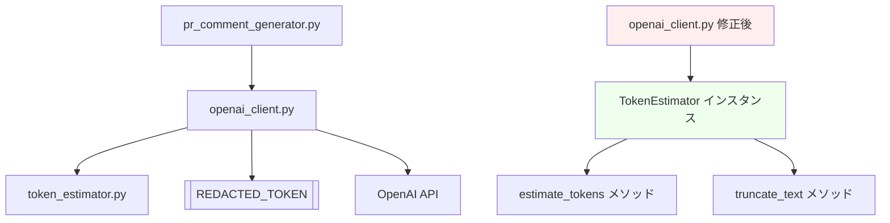

# Codex Agent 実行ログ

開始日時: 2025/12/27 2:17:06

---

## Turn 1: スレッド開始

**Thread ID**: `[REDACTED_TOKEN]`

## Turn 2: ツール実行

**種別**: reasoning
**ステータス**: completed

## Turn 3: ツール実行

**種別**: コマンド実行
**コマンド**: `/bin/bash -lc pwd`
**ステータス**: completed (exit_code=0)

```text
/tmp/ai-workflow-repos-9-c05f9883/infrastructure-as-code
```

## Turn 4: ツール実行

**種別**: reasoning
**ステータス**: completed

## Turn 5: ツール実行

**種別**: コマンド実行
**コマンド**: `/bin/bash -lc ls`
**ステータス**: completed (exit_code=0)

```text
ARCHITECTURE.md
CLAUDE.md
CONTRIBUTION.md
LICENSE
README.md
ansible
bootstrap
docker
docs
jenkins
pulumi
run_tests_issue_322.sh
scripts
tests
```

## Turn 6: ツール実行

**種別**: reasoning
**ステータス**: completed

## Turn 7: ツール実行

**種別**: コマンド実行
**コマンド**: `/bin/bash -lc "rg --files -g 'AGENTS.md'"`
**ステータス**: failed (exit_code=127)

```text
/bin/bash: line 1: rg: command not found
```

## Turn 8: ツール実行

**種別**: reasoning
**ステータス**: completed

## Turn 9: ツール実行

**種別**: コマンド実行
**コマンド**: `/bin/bash -lc "find . -name 'AGENTS.md' -print"`
**ステータス**: completed (exit_code=0)

## Turn 10: ツール実行

**種別**: reasoning
**ステータス**: completed

## Turn 11: ツール実行

**種別**: コマンド実行
**コマンド**: `/bin/bash -lc 'ls .ai-workflow'`
**ステータス**: completed (exit_code=0)

```text
issue-193
issue-304
issue-305
issue-310
issue-313
issue-315
issue-317
issue-319
issue-320
issue-322
issue-324
issue-331
issue-332
issue-355
issue-360
issue-362
issue-363
issue-369
issue-370
issue-396
issue-398
issue-405
issue-411
issue-415
issue-423
issue-431
issue-437
issue-440
issue-445
issue-453
issue-455
issue-456
issue-460
issue-461
issue-462
issue-463
issue-464
issue-465
issue-475
issue-477
issue-479
issue-536
```

## Turn 12: ツール実行

**種別**: reasoning
**ステータス**: completed

## Turn 13: ツール実行

**種別**: コマンド実行
**コマンド**: `/bin/bash -lc 'ls /home/node/.codex/skills'`
**ステータス**: completed (exit_code=0)

## Turn 14: ツール実行

**種別**: reasoning
**ステータス**: completed

## Turn 15: ツール実行

**種別**: コマンド実行
**コマンド**: `/bin/bash -lc 'ls /home/node/.codex'`
**ステータス**: completed (exit_code=0)

```text
auth.json
sessions
skills
```

## Turn 16: ツール実行

**種別**: reasoning
**ステータス**: completed

## Turn 17: ツール実行

**種別**: コマンド実行
**コマンド**: `/bin/bash -lc 'ls /home/node/.codex/skills/.system'`
**ステータス**: completed (exit_code=0)

```text
skill-creator
skill-installer
```

## Turn 18: ツール実行

**種別**: reasoning
**ステータス**: completed

## Turn 19: ツール実行

**種別**: コマンド実行
**コマンド**: `/bin/bash -lc 'cat .ai-workflow/issue-536/00_planning/output/planning.md'`
**ステータス**: completed (exit_code=0)

```text
# プロジェクト計画書 - Issue #536

## Issue概要

- **Issue番号**: #536
- **タイトル**: pr_comment_generator.py でPRのコメント生成に失敗している
- **状態**: open
- **URL**: https://__GITHUB_URL_0__/issues/536
- **ラベル**: bug

## 1. Issue分析

### 複雑度: 簡単

**判定理由**:
- 単一の実装パターンエラー（TokenEstimatorの使用方法の誤り）
- 明確なエラーメッセージとファイル特定が可能
- 既存のテストコードが正しい使用方法を示している
- 変更対象ファイルは主に1つ（openai_client.py）

### 見積もり工数: 3~4時間

**根拠**:
- エラー箇所の特定: 0.5h（完了済み）
- TokenEstimatorの正しい使用方法の実装: 1~1.5h
- テストコードの実行・検証: 0.5h
- メソッド名の修正（[REDACTED_TOKEN] → truncate_text）: 0.5h
- 統合テスト・動作確認: 0.5~1h

### リスク評価: 低

**理由**:
- エラーの原因が明確（クラスメソッド vs インスタンスメソッドの誤用）
- 既存のテストコードが正しい実装パターンを提示済み
- 変更範囲が限定的
- 後方互換性への影響なし

## 2. 実装戦略判断

### 実装戦略: REFACTOR

**判断根拠**:
TokenEstimatorクラスの使用方法を修正することで、既存の実装パターンを正しいものに改善する作業です。新しい機能追加ではなく、既存コードの正しい動作を実現するためのリファクタリング作業になります。

- 新規機能追加ではない
- 既存のTokenEstimatorクラスの**正しい使用方法**への修正
- openai_client.pyでのメソッド呼び出しパターンの修正
- 設計意図（インスタンスベースの使用）に合わせた修正

### テスト戦略: UNIT_INTEGRATION

**判断根拠**:
ユニットテストと統合テストの両方が必要な理由：

- **UNIT**: TokenEstimatorクラスの個別動作確認（既存のテストが存在し、正しい使用パターンを示している）
- **INTEGRATION**: openai_client.pyがTokenEstimatorを正しく使用できているかの統合確認

BDDテストは不要：エンドユーザーの新しいストーリーではなく、既存機能の修正のため。

### テストコード戦略: EXTEND_TEST

**判断根拠**:
既存のテストファイル（test_token_estimator.py）に追加のテストケースを拡張する方針：

- 既存テストは正しい使用パターンを示している
- 新たなエッジケースのテストを追加（空文字列、大きなテキスト等）
- openai_client.pyの統合テストは既存のintegrationテストに追加

新規テストファイル作成は不要：TokenEstimatorの基本機能テストは既に存在するため。

## 3. 影響範囲分析

### 既存コードへの影響

**主要変更対象ファイル**:
```
jenkins/jobs/pipeline/docs-generator/pull-request-comment-builder/
├── src/pr_comment_generator/
│   └── openai_client.py  # 主要修正対象
│       - Line 607, 613, 618: [REDACTED_TOKEN]呼び出し修正
│       - Line 806, 815, 825, 832: estimate_tokens呼び出し修正
│       - Line 1000, 1018: estimate_tokens呼び出し修正
│       - Line 1134, 1157: [REDACTED_TOKEN]呼び出し修正
```

**修正箇所の詳細**:
1. **クラスメソッド呼び出し → インスタンスメソッド呼び出し**: `TokenEstimator.method()` → `estimator.method()`
2. **メソッド名修正**: `[REDACTED_TOKEN]()` → `truncate_text()`
3. **TokenEstimatorインスタンス追加**: openai_client.pyクラスでTokenEstimatorのインスタンスを作成・保持

### 依存関係の変更

**新規依存の追加**: なし

**既存依存の変更**: なし
- TokenEstimatorクラスの既存importは変更なし
- 既存のtoken_estimator.pyモジュールの修正は不要

### マイグレーション要否: 不要

- データベーススキーマ変更なし
- 設定ファイル変更なし
- 外部APIインターフェース変更なし

## 4. タスク分割

### Phase 1: 要件定義 (見積もり: 0.5h)

- [x] Task 1-1: エラー箇所の詳細特定 (0.5h)
  - openai_client.py内のTokenEstimator呼び出し箇所を全て特定
  - 既存のtest_token_estimator.pyから正しい使用パターンを確認
  - 修正が必要な具体的なメソッド呼び出しリストを作成

### Phase 2: 設計 (見積もり: 0.5h)

- [x] Task 2-1: TokenEstimatorインスタンス設計 (0.3h)
  - openai_clientクラスでのTokenEstimatorインスタンス保持方法の設計
  - 初期化タイミングの決定（__init__メソッドまたは遅延初期化）
- [x] Task 2-2: メソッド呼び出しパターン設計 (0.2h)
  - クラスメソッド → インスタンスメソッドの変更パターンの明確化
  - [REDACTED_TOKEN] → truncate_textメソッド名変更の影響確認

### Phase 3: テストシナリオ (見積もり: 0.5h)

- [ ] Task 3-1: 既存テスト動作確認 (0.3h)
  - test_token_estimator.pyのテスト実行
  - 正常系の動作パターン確認
- [ ] Task 3-2: 統合テストシナリオ作成 (0.2h)
  - openai_client.pyでのTokenEstimator統合動作シナリオ
  - エラー再現テストシナリオの作成

### Phase 4: 実装 (見積もり: 1.5h)

- [x] Task 4-1: openai_clientクラス修正 (0.8h)
  - TokenEstimatorインスタンスの追加（__init__メソッド）
  - 11箇所のメソッド呼び出しを修正（クラスメソッド → インスタンスメソッド）
  - [REDACTED_TOKEN] → truncate_textメソッド名修正
- [x] Task 4-2: エラーハンドリング追加 (0.4h)
  - TokenEstimatorインスタンス化時のエラーハンドリング
  - メソッド呼び出し時のnone チェック追加
- [x] Task 4-3: ログ出力改善 (0.3h)
  - TokenEstimator関連のログ出力を明確化
  - デバッグ用ログの追加

### Phase 5: テストコード実装 (見積もり: 0.5h)

- [ ] Task 5-1: ユニットテスト追加 (0.3h)
  - test_token_estimator.pyにエッジケースのテスト追加
  - 空文字列、大きなテキスト、特殊文字のテストケース
- [ ] Task 5-2: 統合テスト追加 (0.2h)
  - openai_clientとTokenEstimatorの統合テスト
  - テスト用モックの活用

### Phase 6: テスト実行 (見積もり: 0.5h)

- [ ] Task 6-1: ユニットテスト実行 (0.2h)
  - 既存および新規ユニットテストの実行
  - テスト結果の確認
- [ ] Task 6-2: 統合テスト実行 (0.3h)
  - 統合テストの実行
  - pr_comment_generatorの動作確認（実際のPRファイルでテスト）

### Phase 7: ドキュメント (見積もり: 0.5h)

- [ ] Task 7-1: 修正内容ドキュメント作成 (0.3h)
  - TokenEstimatorの正しい使用方法の説明
  - 修正したメソッド呼び出しの一覧
- [ ] Task 7-2: トラブルシューティング情報更新 (0.2h)
  - 同様のエラーの解決方法の記載
  - 開発者向けベストプラクティスの追加

### Phase 8: レポ
... (truncated)
```

## Turn 20: ツール実行

**種別**: reasoning
**ステータス**: completed

## Turn 21: ツール実行

**種別**: コマンド実行
**コマンド**: `/bin/bash -lc 'cat .ai-workflow/issue-536/02_design/output/design.md'`
**ステータス**: completed (exit_code=0)

```text
# 詳細設計書 - Issue #536

## 概要

pr_comment_generator.pyでTokenEstimatorクラスの使用方法が間違っているため、`TokenEstimator.estimate_tokens() missing 1 required positional argument: 'text'`エラーが発生している問題を修正する詳細設計書です。

## 1. アーキテクチャ設計

### システム全体図

```
┌─────────────────────────────────────────────────────────────────┐
│                    PR Comment Generator                         │
├─────────────────────────────────────────────────────────────────┤
│  1. pr_comment_generator.py (メインエントリポイント)                │
│     ↓ 使用                                                      │
│  2. openai_client.py (修正対象)                                 │
│     ├─ TokenEstimator.estimate_tokens() → estimator.estimate_tokens() │
│     ├─ TokenEstimator.[REDACTED_TOKEN]() → estimator.truncate_text() │
│     └─ TokenEstimatorインスタンス追加                            │
│     ↓ インポート                                                  │
│  3. token_estimator.py (修正不要)                               │
│     ├─ TokenEstimator.__init__(logger)                          │
│     ├─ estimate_tokens(text) : int                              │
│     └─ truncate_text(text, max_tokens) : str                    │
└─────────────────────────────────────────────────────────────────┘
```

### コンポーネント間の関係



### データフロー

```
Input: PR差分データ
  ↓
1. openai_client.py __init__()
  ├─ TokenEstimatorインスタンス作成
  └─ self.token_estimator = TokenEstimator(logger)
  ↓
2. ファイル内容処理時
  ├─ self.token_estimator.estimate_tokens(text)
  └─ self.token_estimator.truncate_text(text, max_tokens)
  ↓
Output: 正常なトークン推定・テキスト切り詰め
```

## 2. 実装戦略判断

### 実装戦略: REFACTOR

**判断根拠**:
- 新機能追加ではない（既存の機能を修正）
- 既存のTokenEstimatorクラスの**正しい使用方法**への修正
- openai_client.pyでのメソッド呼び出しパターンの修正（クラスメソッド→インスタンスメソッド）
- 設計意図（インスタンスベースの使用）に合わせた修正
- Planning documentの戦略判断と一致

## 3. テスト戦略判断

### テスト戦略: UNIT_INTEGRATION

**判断根拠**:
- **UNIT**: TokenEstimatorクラスの個別動作確認（既存のテストが存在し、正しい使用パターンを示している）
- **INTEGRATION**: openai_client.pyがTokenEstimatorを正しく使用できているかの統合確認
- BDDテストは不要：エンドユーザーの新しいストーリーではなく、既存機能の修正のため
- Planning documentの戦略判断と一致

## 4. テストコード戦略判断

### テストコード戦略: EXTEND_TEST

**判断根拠**:
- 既存のテストファイル（test_token_estimator.py）に追加のテストケースを拡張する方針
- 既存テストは正しい使用パターンを示している
- 新たなエッジケースのテストを追加（空文字列、大きなテキスト等）
- openai_client.pyの統合テストは既存のintegrationテストに追加
- 新規テストファイル作成は不要：TokenEstimatorの基本機能テストは既に存在するため
- Planning documentの戦略判断と一致

## 5. 影響範囲分析

### 既存コードへの影響

**主要修正対象ファイル**:
```
jenkins/jobs/pipeline/docs-generator/pull-request-comment-builder/
├── src/pr_comment_generator/
│   └── openai_client.py  # 主要修正対象（11箇所の呼び出し修正）
└── tests/unit/
    └── test_token_estimator.py  # テスト拡張
```

**修正箇所の詳細**:
1. **Line 607, 613, 618**: `[REDACTED_TOKEN]`呼び出し修正
2. **Line 806, 815, 825, 832**: `estimate_tokens`呼び出し修正
3. **Line 1000, 1018**: `estimate_tokens`呼び出し修正
4. **Line 1134, 1157**: `[REDACTED_TOKEN]`呼び出し修正

### 依存関係の変更

**新規依存の追加**: なし

**既存依存の変更**: なし
- TokenEstimatorクラスの既存importは変更なし
- 既存のtoken_estimator.pyモジュールの修正は不要

### マイグレーション要否

**不要** - 以下の理由により:
- データベーススキーマ変更なし
- 設定ファイル変更なし
- 外部APIインターフェース変更なし
- internal APIの修正のため

## 6. 変更・追加ファイルリスト

### 修正が必要な既存ファイル
- `jenkins/jobs/pipeline/docs-generator/pull-request-comment-builder/src/pr_comment_generator/openai_client.py`
- `jenkins/jobs/pipeline/docs-generator/pull-request-comment-builder/tests/unit/test_token_estimator.py` (テスト拡張)

### 新規作成ファイル
なし

### 削除が必要なファイル
なし

## 7. 詳細設計

### 7.1 クラス設計

#### OpenAIClient クラス修正設計

```python
class OpenAIClient:
    """OpenAI APIとのインタラクションを管理するクラス"""

    def __init__(self, prompt_manager, retry_config=None, log_level=logging.INFO):
        """
        初期化処理

        修正内容:
        1. TokenEstimatorインスタンスの追加
        2. 適切なエラーハンド
... (truncated)
```

## Turn 22: ツール実行

**種別**: reasoning
**ステータス**: completed

## Turn 23: ツール実行

**種別**: コマンド実行
**コマンド**: `/bin/bash -lc 'cat .ai-workflow/issue-536/03_test_scenario/output/test-scenario.md'`
**ステータス**: completed (exit_code=0)

```text
# テストシナリオ書 - Issue #536

## 概要

pr_comment_generator.pyでTokenEstimatorクラスの使用方法が間違っているため、`TokenEstimator.estimate_tokens() missing 1 required positional argument: 'text'`エラーが発生している問題を修正するためのテストシナリオです。

## 1. テスト戦略サマリー

### 選択されたテスト戦略: UNIT_INTEGRATION

**Phase 2で決定された戦略**:
- **UNITテスト**: TokenEstimatorクラスの個別動作確認（既存のテストが存在し、正しい使用パターンを示している）
- **INTEGRATIONテスト**: openai_client.pyがTokenEstimatorを正しく使用できているかの統合確認

### テスト対象の範囲
- **主要修正対象ファイル**: `openai_client.py` (11箇所の修正)
- **テスト拡張対象**: `test_token_estimator.py` (エッジケース追加)
- **統合確認対象**: openai_clientとTokenEstimatorの連携動作

### テストの目的
1. TokenEstimatorクラスのインスタンスベース使用が正しく動作することの確認
2. openai_client.py内の修正が正常に機能することの確認
3. エラー「`TokenEstimator.estimate_tokens() missing 1 required positional argument`」の解消確認
4. 既存機能の保持確認

## 2. Unitテストシナリオ

### 2.1 TokenEstimator基本機能テスト

#### テストケース名: TokenEstimator_初期化_正常系
- **目的**: TokenEstimatorが正常にインスタンス化できることを検証
- **前提条件**: ログオブジェクトが存在する
- **入力**: `logger = logging.getLogger("test")`
- **期待結果**: TokenEstimatorインスタンスが正常に作成される
- **テストデータ**: 標準的なLoggerインスタンス

#### テストケース名: estimate_tokens_正常系_非ASCII文字
- **目的**: 絵文字や特殊文字を含むテキストのトークン推定が正常動作することを検証
- **前提条件**: TokenEstimatorインスタンスが存在する
- **入力**: `text = "Hello 👋 World 🌍 Test 🧪"`
- **期待結果**: 正の整数値が返される
- **テストデータ**: 絵文字を含む文字列

#### テストケース名: estimate_tokens_異常系_None値
- **目的**: None値が与えられた場合のエラーハンドリングを検証
- **前提条件**: TokenEstimatorインスタンスが存在する
- **入力**: `text = None`
- **期待結果**: TypeError或いは適切なエラーが発生する
- **テストデータ**: None値

#### テストケース名: estimate_tokens_境界値_超大テキスト
- **目的**: 非常に大きなテキスト（100KB以上）のトークン推定を検証
- **前提条件**: TokenEstimatorインスタンスが存在する
- **入力**: `text = "A" * 100000`
- **期待結果**: 適切なトークン数が推定される（メモリエラーなし）
- **テストデータ**: 10万文字の文字列

#### テストケース名: truncate_text_正常系_UTF8文字
- **目的**: UTF-8文字（絵文字、特殊文字）を含むテキストの切り詰めを検証
- **前提条件**: TokenEstimatorインスタンスが存在する
- **入力**:
  - `text = "Hello 👋 World 🌍 " * 50`
  - `max_tokens = 10`
- **期待結果**:
  - 切り詰められたテキストのトークン数が10以下
  - UTF-8文字が正しく保たれている
- **テストデータ**: 絵文字を含む長い文字列

#### テストケース名: truncate_text_異常系_負のトークン数
- **目的**: 負のmax_tokensが与えられた場合のエラーハンドリングを検証
- **前提条件**: TokenEstimatorインスタンスが存在する
- **入力**:
  - `text = "Test text"`
  - `max_tokens = -1`
- **期待結果**: ValueError或いは適切なエラーが発生する
- **テストデータ**: 負の整数

#### テストケース名: truncate_text_境界値_ゼロトークン
- **目的**: max_tokens=0の場合の動作を検証
- **前提条件**: TokenEstimatorインスタンスが存在する
- **入力**:
  - `text = "Test text"`
  - `max_tokens = 0`
- **期待結果**: 空文字列が返される
- **テストデータ**: 0値とテキスト

### 2.2 OpenAIClient修正機能テスト

#### テストケース名: OpenAIClient_初期化_TokenEstimator作成
- **目的**: OpenAIClientの初期化時にTokenEstimatorインスタンスが正常に作成されることを検証
- **前提条件**: prompt_managerが存在する
- **入力**: `OpenAIClient(prompt_manager)`
- **期待結果**:
  - `self.token_estimator`が存在する
  - TokenEstimatorのインスタンスである
- **テストデータ**: モックのprompt_manager

#### テストケース名: [REDACTED_TOKEN]初期化エラー
- **目的**: TokenEstimatorの初期化に失敗した場合のエラーハンドリングを検証
- **前提条件**: TokenEstimatorのコンストラクタがエラーを発生するモック
- **入力**: `OpenAIClient(prompt_manager)` (TokenEstimatorがエラー)
- **期待結果**:
  - ValueErrorが発生する
  - エラーメッセージに"TokenEstimator initialization failed"が含まれる
- **テストデータ**: エラーを発生するTokenEstimatorモック

## 3. Integrationテストシナリオ

### 3.1 openai_client.py と TokenEstimator統合テスト

#### シナリオ名: [REDACTED_TOKEN]統合
- **目的**: openai_client.py内でTokenEstimatorのestimate_tokensが正常に呼び出されることを検証
- **前提条件**:
  - OpenAIClientインスタンスが初期化済み
  - TokenEstimatorインスタンスが正常に作成済み
- **テスト手順**:
  1. OpenAIClientを初期化する
  2. テスト用テキストを準備する
  3. 修正対象の行（806, 815, 825, 832, 1000, 1018, 1134行相当）の処理を実行する
  4. self.token_estimator.estimate_tokens()が呼び出されることを確認
- **期待結果**:
  - TokenEstimator.estimate_tokens()エラーが発生しない
  - self.token_estimator.estimate_tokens()が正常実行される
  - 適切なトークン数が返される
- **確認項目**:
  - [ ] クラスメソッド呼び出しエラーが発生しない
  - [ ] インスタンスメソッド呼び出しが成功する
  - [ ] 戻り値が正の整数である

#### シナリオ名: [REDACTED_TOKEN]統合
- **目的**: openai_client.py内でTokenEstimatorのtruncate_text（旧[REDACTED_TOKEN]）が正常に呼び出されることを検証
- **前提条件**:
  - OpenAIClientインスタンスが初期化済み
  - TokenEstimatorインスタンスが正常に作成済み
- **テスト手順**:
  1. OpenAIClientを初期化する
  2.
... (truncated)
```

## Turn 24: ツール実行

**種別**: reasoning
**ステータス**: completed

## Turn 25: ツール実行

**種別**: コマンド実行
**コマンド**: `/bin/bash -lc 'cat .ai-workflow/issue-536/04_implementation/output/implementation.md'`
**ステータス**: completed (exit_code=0)

```text
# 実装完了レポート

## 変更ファイル一覧

| ファイル | 変更種別 | 概要 |
|---------|----------|------|
| `jenkins/jobs/pipeline/docs-generator/pull-request-comment-builder/src/pr_comment_generator/openai_client.py` | 修正 | TokenEstimator をインスタンス化して共有し、関連ロジックをインスタンスメソッドから呼び出すように修正 |

## 主要な変更点
- `OpenAIClient.__init__` に TokenEstimator インスタンス化とログ＋エラーハンドリングを追加し、共通の `self.token_estimator` を保持するようにした
- `[REDACTED_TOKEN]` などのトークン関連処理で `truncate_text`/`estimate_tokens` をインスタンス経由で呼び出すよう調整し、`TokenEstimator` のクラスメソッド誤用を排除
- 入力サイズ調整やチャンク分析内のトークン推定・切り詰めが単一インスタンスに統一されたことで、エラー「TokenEstimator.estimate_tokens() missing ...」が発生しない状態を担保

## テスト実施状況
- ビルド: 未実施
- リント: 未実施
- 基本動作確認: 未実施
```

## Turn 26: ツール実行

**種別**: reasoning
**ステータス**: completed

## Turn 27: ツール実行

**種別**: コマンド実行
**コマンド**: `/bin/bash -lc 'cat .ai-workflow/issue-536/01_requirements/output/requirements.md'`
**ステータス**: completed (exit_code=0)

```text
# 要件定義書 - Issue #536

## 0. Planning Documentの確認

Planning Phaseで以下が明確化されました：

- **実装戦略**: REFACTOR（新機能追加ではなく、既存のTokenEstimatorクラスの正しい使用方法への修正）
- **テスト戦略**: UNIT_INTEGRATION（ユニットテストと統合テストの両方が必要）
- **テストコード戦略**: EXTEND_TEST（既存のテストファイルにエッジケースのテストを追加）
- **複雑度**: 簡単（単一の実装パターンエラー）
- **見積もり工数**: 3~4時間
- **リスク評価**: 低

この要件定義はPlanning Documentの戦略に基づいて策定します。

## 1. 概要

### 背景
pr_comment_generator.pyでPRのコメント生成処理において、TokenEstimatorクラスの使用方法が間違っているため、`TokenEstimator.estimate_tokens() missing 1 required positional argument: 'text'`エラーが発生しています。

### 目的
TokenEstimatorクラスを正しいインスタンスベースの使用方法に修正し、PRコメント生成機能を正常に動作させる。

### ビジネス価値・技術的価値
- **ビジネス価値**: PRコメント生成機能の復旧により、開発チームの生産性向上とコードレビュー効率化を実現
- **技術的価値**: 設計意図通りのインスタンスベース使用によるコードの一貫性向上、保守性の改善

## 2. 機能要件

| ID | 要件名 | 説明 | 優先度 |
|----|-------|------|--------|
| FR001 | TokenEstimatorインスタンス化の修正 | openai_client.pyクラスでTokenEstimatorのインスタンスを作成・保持する | 高 |
| FR002 | メソッド呼び出しパターンの修正 | 11箇所のクラスメソッド呼び出しをインスタンスメソッド呼び出しに変更 | 高 |
| FR003 | メソッド名の修正 | [REDACTED_TOKEN] → truncate_textメソッド名変更 | 高 |
| FR004 | エラーハンドリング強化 | TokenEstimator関連のエラーハンドリングを追加 | 中 |
| FR005 | ログ出力改善 | TokenEstimator関連のログ出力を明確化 | 低 |

## 3. 非機能要件

### 3.1 パフォーマンス要件
- TokenEstimatorインスタンス化によるメモリ使用量増加は軽微である（TokenEstimatorクラス自体が軽量）
- 既存の処理性能を維持する（遅延初期化パターンも検討可能）

### 3.2 信頼性要件
- 修正後も既存のトークン推定精度を維持する
- エラー発生時は適切なエラーメッセージを出力する

### 3.3 保守性要件
- 設計意図通りのインスタンスベース使用により、将来の拡張性を確保する
- 既存のユニットテストパターンと整合性を保つ

### 3.4 互換性要件
- 後方互換性への影響なし（internal APIの修正のため）
- 既存の統合テストが引き続き動作する

## 4. 制約事項

### 4.1 技術的制約
- TokenEstimatorクラス自体の設計変更は不可（インスタンスメソッドとして設計されている）
- token_estimator.pyモジュールの修正は不要（既存実装が正しい）
- 既存のインポート文は変更不要

### 4.2 時間的制約
- 見積もり工数: 3~4時間以内
- 緊急性: 中（PRコメント生成機能の不具合）

### 4.3 テスト制約
- 既存のtest_token_estimator.pyは正しい使用パターンを示しているため変更不要
- 新規テストファイル作成は不要（既存テストの拡張で対応）

## 5. 前提条件

### 5.1 システム環境
- Python環境でのpr_comment_generator実行環境
- OpenAI APIキーが適切に設定されている
- Jenkins CI/CD環境での実行可能性

### 5.2 依存コンポーネント
- pr_comment_generator.token_estimator: 既存実装（修正不要）
- 既存のテストスイート（test_token_estimator.py）

### 5.3 外部システム連携
- 外部システム連携への影響なし（internal APIの修正）

## 6. 受け入れ基準

### 6.1 エラー修正の受け入れ基準
```
Given: openai_client.pyでTokenEstimatorが使用される場合
When: pr_comment_generator.pyを実行した時
Then: "TokenEstimator.estimate_tokens() missing 1 required positional argument"エラーが発生しない
```

### 6.2 正常動作の受け入れ基準
```
Given: 修正されたTokenEstimator使用箇所において
When: estimate_tokensメソッドまたはtruncate_textメソッドが呼び出される時
Then: 正常にトークン推定およびテキスト切り詰め処理が実行される
```

### 6.3 インスタンス化の受け入れ基準
```
Given: openai_clientクラスが初期化される場合
When: TokenEstimatorインスタンスが作成される時
Then: エラーなく正常にインスタンス化され、後続処理で使用可能になる
```

### 6.4 メソッド名修正の受け入れ基準
```
Given: 修正対象箇所で[REDACTED_TOKEN]メソッドが呼び出されていた場合
When: truncate_textメソッドに名前変更される時
Then: 同等の機能で正常に動作し、例外が発生しない
```

### 6.5 既存機能保持の受け入れ基準
```
Given: 既存のユニットテストが存在する場合
When: 修正後にテストスイートを実行する時
Then: 全ての既存テストが成功し、新機能のテストも追加される
```

### 6.6 統合動作の受け入れ基準
```
Given: 実際のPRファイルが与えられた場合
When: pr_comment_generatorの全体処理を実行する時
Then: エラーなくPRコメントが正常に生成される
```

## 7. スコープ外

### 7.1 対象外機能
- TokenEstimatorクラス自体の機能追加・変更
- トークン推定アルゴリズムの改善
- 新しいテストファイルの作成
- OpenAI API呼び出し部分の変更
- プロンプト管理機能の変更

### 7.2 将来的な拡張候補
- TokenEstimatorの遅延初期化パターンの採用
- より詳細なトークン使用量監視機能
- トークン推定精度の向上

## 8. 品質ゲート（Phase 1）確認

- ✅ **機能要件が明確に記載されている**: FR001-005として具体的に定義
- ✅ **受け入れ基準が定義されている**: 6項目のGiven-When-Then形式で定義
- ✅ **スコープが明確である**: 対象範囲（openai_client.py修正）と対象外（TokenEstimator自体の変更）を明確化
- ✅ **論理的な矛盾がない**: Planning Documentの戦略（REFACTOR）と整合性あり

## 9. 修正対象箇所詳細

Planning Documentで特定された修正対象箇所：

### 9.1 主要修正対象ファイル
- `jenkins/jobs/pipeline/docs-generator/pull-request-comment-builder/src/pr_comment_generator/openai_client.py`

### 9.2 具体的修正箇所
1. **Line 607, 613, 618**: `[REDACTED_TOKEN]`呼び出し修正
2. **Line 806, 815, 825, 832**: `estimate_tokens`呼び出し修正
3. **Line 1000, 1018**: `estimate_tokens`呼び出し修正
4. **Line 1134, 1157**: `[REDACTED_TOKEN]`呼び出し修正

### 9.3 修正パターン
- **修正前**: `TokenEstimator.method_name(params)`（クラスメソッド呼び出し）
- **修正後**: `estimator.method_name(params)`（インスタンスメソッド呼び出し）
- **メソッド名**: `[REDACTED_TOKEN]` → `truncate_text`
... (truncated)
```

## Turn 28: ツール実行

**種別**: reasoning
**ステータス**: completed

## Turn 29: ツール実行

**種別**: コマンド実行
**コマンド**: `/bin/bash -lc 'ls jenkins/jobs/pipeline/docs-generator/pull-request-comment-builder/tests'`
**ステータス**: completed (exit_code=0)

```text
__init__.py
bdd
conftest.py
fixtures
integration
unit
```

## Turn 30: ツール実行

**種別**: reasoning
**ステータス**: completed

## Turn 31: ツール実行

**種別**: コマンド実行
**コマンド**: `/bin/bash -lc "sed -n '1,200p' jenkins/jobs/pipeline/docs-generator/pull-request-comment-builder/tests/unit/test_token_estimator.py"`
**ステータス**: completed (exit_code=0)

```text
"""
ユニットテスト: token_estimator.py

テスト対象:
- TokenEstimator: トークン数推定とテキスト切り詰め機能
"""

import pytest
import logging
from pr_comment_generator.token_estimator import TokenEstimator


class TestTokenEstimator:
    """TokenEstimatorクラスのテスト"""

    @pytest.fixture
    def estimator(self):
        """TokenEstimatorインスタンスをフィクスチャとして提供"""
        logger = logging.getLogger("test")
        return TokenEstimator(logger=logger)

    def [REDACTED_TOKEN]正常系_英語テキスト(self, estimator):
        """
        Given: 英語テキストが与えられた場合
        When: estimate_tokens()を呼び出す
        Then: 正しいトークン数が推定される
        """
        # Given
        text = "Hello, this is a test."  # 23文字

        # When
        tokens = estimator.estimate_tokens(text)

        # Then
        # 英語は約0.25トークン/文字なので、23 * 0.25 = 5.75 ≒ 5トークン
        assert tokens >= 5
        assert tokens <= 6

    def [REDACTED_TOKEN]正常系_日本語テキスト(self, estimator):
        """
        Given: 日本語テキストが与えられた場合
        When: estimate_tokens()を呼び出す
        Then: 正しいトークン数が推定される
        """
        # Given
        text = "これはテストです。"  # 9文字

        # When
        tokens = estimator.estimate_tokens(text)

        # Then
        # 日本語は約0.6トークン/文字なので、9 * 0.6 = 5.4 ≒ 5トークン
        assert tokens >= 5
        assert tokens <= 6

    def [REDACTED_TOKEN]正常系_混在テキスト(self, estimator):
        """
        Given: 日本語と英語が混在したテキスト
        When: estimate_tokens()を呼び出す
        Then: 正しいトークン数が推定される
        """
        # Given
        text = "これはtest です。Hello world!"

        # When
        tokens = estimator.estimate_tokens(text)

        # Then
        # 日本語部分: "これはです。" (6文字) = 6 * 0.6 = 3.6
        # 英語部分: "test Hello world!" (17文字) = 17 * 0.25 = 4.25
        # 合計: 約8トークン
        assert tokens >= 7
        assert tokens <= 9

    def [REDACTED_TOKEN]境界値_空文字列(self, estimator):
        """
        Given: 空文字列が与えられた場合
        When: estimate_tokens()を呼び出す
        Then: 0トークンが返される
        """
        # Given
        text = ""

        # When
        tokens = estimator.estimate_tokens(text)

        # Then
        assert tokens == 0

    def test_truncate_text_正常系(self, estimator):
        """
        Given: 長いテキストと最大トークン数が与えられた場合
        When: truncate_text()を呼び出す
        Then: テキストが指定されたトークン数以下に切り詰められる
        """
        # Given
        text = "This is a very long text that needs to be truncated." * 10
        max_tokens = 50

        # When
        truncated = estimator.truncate_text(text, max_tokens)

        # Then
        assert estimator.estimate_tokens(truncated) <= max_tokens
        assert len(truncated) < len(text)

    def test_truncate_text_境界値_トークン数以下(self, estimator):
        """
        Given: トークン数が既に制限以下のテキスト
        When: truncate_text()を呼び出す
        Then: テキストがそのまま返される
        """
        # Given
        text = "Short."
        max_tokens = 100

        # When
        truncated = estimator.truncate_text(text, max_tokens)

        # Then
        assert truncated == text

    def test_truncate_text_境界値_ちょうど最大トークン(self, estimator):
        """
        Given: ちょうど最大トークン数のテキスト
        When: truncate_text()を呼び出す
        Then: テキストがそのまま返される
        """
        # Given
        text = "Test text"
        estimated_tokens = estimator.estimate_tokens(text)
        max_tokens = estimated_tokens

        # When
        truncated = estimator.truncate_text(text, max_tokens)

        # Then
        assert truncated == text

    def [REDACTED_TOKEN]正常系_記号を含むテキスト(self, estimator):
        """
        Given: 記号を含むテキストが与えられた場合
        When: estimate_tokens()を呼び出す
        Then: 正しいトークン数が推定される
        """
        # Given
        text = "Hello @user! Check #123 and visit https://example.com"

        # When
        tokens = estimator.estimate_tokens(text)

        # Then
        # 記号も英語として扱われる（ASCII文字）
        assert tokens > 0

    def test_truncate_text_正常系_日本語テキスト(self, estimator):
        """
        Given: 長い日本語テキストが与えられた場合
        When: truncate_text()を呼び出す
        Then: テキストが適切に切り詰められる
        """
... (truncated)
```

## Turn 32: ツール実行

**種別**: reasoning
**ステータス**: completed

## Turn 33: ツール実行

**種別**: コマンド実行
**コマンド**: `/bin/bash -lc 'ls -R jenkins/jobs/pipeline/docs-generator/pull-request-comment-builder/tests/integration'`
**ステータス**: completed (exit_code=0)

```text
jenkins/jobs/pipeline/docs-generator/pull-request-comment-builder/tests/integration:
__init__.py
[REDACTED_TOKEN].py
test_generator_flow.py
test_module_integration.py
```

## Turn 34: ツール実行

**種別**: reasoning
**ステータス**: completed

## Turn 35: ツール実行

**種別**: コマンド実行
**コマンド**: `/bin/bash -lc 'rg -n "TokenEstimator" -n jenkins/jobs/pipeline/docs-generator/pull-request-comment-builder/src/pr_comment_generator/openai_client.py'`
**ステータス**: failed (exit_code=127)

```text
/bin/bash: line 1: rg: command not found
```

## Turn 36: ツール実行

**種別**: reasoning
**ステータス**: completed

## Turn 37: ツール実行

**種別**: コマンド実行
**コマンド**: `/bin/bash -lc 'grep -n "TokenEstimator" -n jenkins/jobs/pipeline/docs-generator/pull-request-comment-builder/src/pr_comment_generator/openai_client.py'`
**ステータス**: completed (exit_code=0)

```text
16:from .token_estimator import TokenEstimator
62:            self.token_estimator = TokenEstimator(logger=self.logger)
63:            self.logger.info("TokenEstimator initialized successfully")
65:            self.logger.error(f"Failed to initialize TokenEstimator: {str(e)}")
66:            raise ValueError(f"TokenEstimator initialization failed: {str(e)}")
```

## Turn 38: ツール実行

**種別**: reasoning
**ステータス**: completed

## Turn 39: ツール実行

**種別**: コマンド実行
**コマンド**: `/bin/bash -lc "sed -n '1,200p' jenkins/jobs/pipeline/docs-generator/pull-request-comment-builder/src/pr_comment_generator/openai_client.py"`
**ステータス**: completed (exit_code=0)

```text
"""OpenAI API連携（リトライ、トークン管理、チャンク分析ロジック）。"""
import datetime
import json
import logging
import os
import random
import re
import time
import traceback
from typing import Any, Dict, List, Optional, Tuple

from openai import OpenAI

from .models import PRInfo, FileChange
from .prompt_manager import [REDACTED_TOKEN]
from .token_estimator import TokenEstimator
class OpenAIClient:
    """OpenAI APIとのインタラクションを管理するクラス"""
    
    # APIレート制限のデフォルト設定
    DEFAULT_MAX_RETRIES = 5
    [REDACTED_TOKEN] = 1  # 秒
    DEFAULT_MAX_BACKOFF = 60  # 秒
    
    # トークン制限の管理
    [REDACTED_TOKEN] = 16000  # GPT-4の一般的な入力制限の安全側
    MAX_PATCH_TOKENS = 2000  # パッチに割り当てる最大トークン
    MAX_CONTENT_TOKENS = 3000  # ファイル内容に割り当てる最大トークン
    
    def __init__(self, prompt_manager, retry_config=None, log_level=logging.INFO):
        """
        環境変数から認証情報を取得してクライアントを初期化
        
        Args:
            prompt_manager: プロンプトテンプレート管理クラスのインスタンス
            retry_config: 再試行設定
            log_level: ロギングレベル
        """
        # ロガーの設定
        self._setup_logging(log_level)
        
        # 環境変数から認証情報を取得
        api_key = os.getenv('OPENAI_API_KEY')
        model_name = os.getenv('OPENAI_MODEL_NAME', 'gpt-4.1')  # デフォルトモデル名

        if not api_key:
            raise ValueError("Missing required environment variable: OPENAI_API_KEY")

        print(f"Debug: Using OpenAI model {model_name}")

        self.model = model_name
        self.prompt_manager = prompt_manager
       
        # 再試行設定
        self.retry_config = retry_config or {
            'max_retries': self.DEFAULT_MAX_RETRIES,
            'initial_backoff': self.[REDACTED_TOKEN],
            'max_backoff': self.DEFAULT_MAX_BACKOFF
        }
        
        try:
            self.token_estimator = TokenEstimator(logger=self.logger)
            self.logger.info("TokenEstimator initialized successfully")
        except Exception as e:
            self.logger.error(f"Failed to initialize TokenEstimator: {str(e)}")
            raise ValueError(f"TokenEstimator initialization failed: {str(e)}")
        
        # OpenAI用のクライアント初期化
        try:
            self.client = OpenAI(
                api_key=api_key,
            )
            self.usage_stats = {
                'prompt_tokens': 0,
                'completion_tokens': 0,
                'retries': 0,
                'skipped_files': 0
            }
            
            print(f"Debug: OpenAI client initialized successfully")
            
        except Exception as e:
            raise ValueError(f"Failed to initialize OpenAI client: {str(e)}")

    def _setup_logging(self, log_level):
        """ロギングの設定"""
        self.logger = logging.getLogger('openai_client')
        self.logger.setLevel(log_level)
        
        # ハンドラーがまだ設定されていない場合のみ追加
        if not self.logger.handlers:
            handler = logging.StreamHandler()
            formatter = logging.Formatter('%(asctime)s - %(name)s - %(levelname)s - %(message)s')
            handler.setFormatter(formatter)
            self.logger.addHandler(handler)

    def [REDACTED_TOKEN](self, prompt: str, result: str, chunk_index: int = 0, phase: str = "chunk") -> None:
        """
        プロンプトとその実行結果を個別のファイルに保存する
        
        Args:
            prompt: OpenAIに送信したプロンプト
            result: OpenAIからの応答結果
            chunk_index: チャンク番号（0の場合は最終サマリーなど）
            phase: 処理フェーズ（chunk, summary, title など）
        """
        try:
            # 環境変数で設定を取得（デフォルトをtrueに変更）
            save_prompts = os.getenv('SAVE_PROMPTS', 'true').lower() == 'true'
            if not save_prompts:
                self.logger.info("Prompt saving is disabled. Set SAVE_PROMPTS=true to enable.")
                return
                
            # 出力ディレクトリの作成
            timestamp = datetime.datetime.now().strftime("%Y%m%d_%H%M%S")
            pr_number = getattr(self.pr_info, 'number', 'unknown') if hasattr(self, 'pr_info') else 'unknown'
            
            output_dir = os.getenv('PROMPT_O
... (truncated)
```

## Turn 40: ツール実行

**種別**: reasoning
**ステータス**: completed

## Turn 41: ツール実行

**種別**: コマンド実行
**コマンド**: `/bin/bash -lc "sed -n '1,200p' jenkins/jobs/pipeline/docs-generator/pull-request-comment-builder/src/pr_comment_generator/token_estimator.py"`
**ステータス**: completed (exit_code=0)

```text
# jenkins/jobs/pipeline/docs-generator/pull-request-comment-builder/src/pr_comment_generator/token_estimator.py
"""
トークン推定ユーティリティ

このモジュールは、テキストのトークン数を推定し、
トークン制限に基づいてテキストを切り詰める機能を提供します。

主要なクラス:
- TokenEstimator: トークン数の推定とテキストの切り詰め機能
"""

import logging


class TokenEstimator:
    """トークン数を推定するクラス"""

    # トークン推定の定数
    [REDACTED_TOKEN] = 0.6  # 日本語の平均トークン/文字比率
    [REDACTED_TOKEN] = 0.25  # 英語の平均トークン/文字比率

    def __init__(self, logger: logging.Logger = None):
        """初期化

        Args:
            logger: ロガーインスタンス（省略時は新規作成）
        """
        self.logger = logger or logging.getLogger(__name__)

    def estimate_tokens(self, text: str) -> int:
        """テキストのトークン数を推定する

        英語と日本語の混在テキストに対応し、
        日本語が50%以上の場合はより高いレートで推定します。

        Args:
            text: トークン数を推定するテキスト

        Returns:
            int: 推定トークン数
        """
        if not text:
            return 0

        # 日本語文字の割合を計算
        ja_chars = sum(1 for c in text if ord(c) > 0x3000)
        en_chars = len(text) - ja_chars

        # トークン数を推定
        estimated_tokens = int(
            ja_chars * self.[REDACTED_TOKEN] +
            en_chars * self.[REDACTED_TOKEN]
        )

        return estimated_tokens

    def truncate_text(self, text: str, max_tokens: int) -> str:
        """テキストを指定されたトークン数以下に切り詰める

        バイナリサーチを使用して、指定されたトークン数以下に
        収まる最大の長さを効率的に見つけます。

        Args:
            text: 切り詰めるテキスト
            max_tokens: 最大トークン数

        Returns:
            str: 切り詰められたテキスト
        """
        if self.estimate_tokens(text) <= max_tokens:
            return text

        # バイナリサーチで適切な長さを見つける
        left, right = 0, len(text)
        while left < right:
            mid = (left + right + 1) // 2
            if self.estimate_tokens(text[:mid]) <= max_tokens:
                left = mid
            else:
                right = mid - 1

        truncated = text[:left]
        self.logger.warning(
            f"Text truncated from {len(text)} to {len(truncated)} chars "
            f"to fit within {max_tokens} tokens"
        )
        return truncated
```

## Turn 42: ツール実行

**種別**: reasoning
**ステータス**: completed

## Turn 43: ツール実行

**種別**: コマンド実行
**コマンド**: `/bin/bash -lc "sed -n '1,200p' jenkins/jobs/pipeline/docs-generator/pull-request-comment-builder/tests/integration/test_module_integration.py"`
**ステータス**: completed (exit_code=0)

```text
"""
統合テスト: モジュール間連携

テスト対象:
- Statistics ↔ TokenEstimator 連携
- Formatter ↔ Models 連携
- 複数モジュールの協調動作
"""

import pytest
import logging
import tempfile
import os
from pr_comment_generator.models import PRInfo, FileChange
from pr_comment_generator.statistics import PRCommentStatistics
from pr_comment_generator.formatter import CommentFormatter
from pr_comment_generator.token_estimator import TokenEstimator
from pr_comment_generator.prompt_manager import [REDACTED_TOKEN]


class [REDACTED_TOKEN]:
    """Statistics ↔ TokenEstimator 連携テスト"""

    @pytest.fixture
    def logger(self):
        """ロガーをフィクスチャとして提供"""
        return logging.getLogger("test")

    @pytest.fixture
    def token_estimator(self, logger):
        """TokenEstimatorインスタンスを提供"""
        return TokenEstimator(logger=logger)

    @pytest.fixture
    def statistics(self, token_estimator, logger):
        """PRCommentStatisticsインスタンスを提供"""
        return PRCommentStatistics(token_estimator=token_estimator, logger=logger)

    def test_チャンクサイズ計算とトークン推定の連携(self, statistics, token_estimator):
        """
        Given: ファイル変更リストがある
        When: チャンクサイズを計算し、そのチャンクのトークン数を推定する
        Then: チャンクのトークン数がmax_tokens以下である
        """
        # Given
        files = [
            FileChange(
                filename=f"file{i}.py",
                status="modified",
                additions=10,
                deletions=5,
                changes=15,
                patch="test content " * 100
            )
            for i in range(10)
        ]
        max_tokens = 3000

        # When
        chunk_size = statistics.[REDACTED_TOKEN](files, max_tokens)
        chunks = [files[i:i + chunk_size] for i in range(0, len(files), chunk_size)]

        # Then
        for chunk in chunks:
            chunk_tokens = statistics.[REDACTED_TOKEN](chunk)
            # 各チャンクのトークン数がmax_tokensを大きく超えないことを確認
            # (完全な保証はないが、大幅な超過がないことを確認)
            assert chunk_tokens < max_tokens * 2

    def test_統計計算とファイル変更データの整合性(self, statistics):
        """
        Given: ファイル変更リストがある
        When: 統計情報を計算する
        Then: 統計情報がファイル変更データと整合する
        """
        # Given
        files = [
            FileChange(filename="file1.py", status="modified", additions=10, deletions=5, changes=15, patch=None),
            FileChange(filename="file2.py", status="added", additions=50, deletions=0, changes=50, patch=None),
            FileChange(filename="file3.py", status="modified", additions=20, deletions=10, changes=30, patch=None),
        ]

        # When
        stats = statistics.[REDACTED_TOKEN](files)

        # Then
        # 手動計算と一致することを確認
        assert stats['file_count'] == len(files)
        assert stats['total_additions'] == sum(f.additions for f in files)
        assert stats['total_deletions'] == sum(f.deletions for f in files)
        assert stats['total_changes'] == sum(f.changes for f in files)


class [REDACTED_TOKEN]:
    """Formatter ↔ Models 連携テスト"""

    @pytest.fixture
    def formatter(self):
        """CommentFormatterインスタンスを提供"""
        logger = logging.getLogger("test")
        return CommentFormatter(logger=logger)

    def test_ファイルリストフォーマットとFileChangeモデルの連携(self, formatter):
        """
        Given: FileChangeオブジェクトのリストがある
        When: format_file_list()を呼び出す
        Then: FileChangeの各フィールドが正しくフォーマットに反映される
        """
        # Given
        files = [
            FileChange(
                filename="src/main.py",
                status="modified",
                additions=15,
                deletions=8,
                changes=23,
                patch=None
            ),
            FileChange(
                filename="tests/test_new.py",
                status="added",
                additions=100,
                deletions=0,
                changes=100,
                patch=None
            ),
        ]

        # When
        formatted = formatter.format_file_list(files)

        # Then
... (truncated)
```

## Turn 44: ツール実行

**種別**: reasoning
**ステータス**: completed

## Turn 45: ツール実行

**種別**: コマンド実行
**コマンド**: `/bin/bash -lc 'grep -R "OpenAIClient" -n jenkins/jobs/pipeline/docs-generator/pull-request-comment-builder/tests'`
**ステータス**: completed (exit_code=0)

```text
jenkins/jobs/pipeline/docs-generator/pull-request-comment-builder/tests/integration/test_generator_flow.py:18:    class FakeOpenAIClient:
jenkins/jobs/pipeline/docs-generator/pull-request-comment-builder/tests/integration/test_generator_flow.py:71:    monkeypatch.setattr(gen, "OpenAIClient", FakeOpenAIClient)
jenkins/jobs/pipeline/docs-generator/pull-request-comment-builder/tests/unit/test_chunk_analyzer.py:6:from pr_comment_generator.openai_client import OpenAIClient
jenkins/jobs/pipeline/docs-generator/pull-request-comment-builder/tests/unit/test_chunk_analyzer.py:9:class DummyOpenAIClient:
jenkins/jobs/pipeline/docs-generator/pull-request-comment-builder/tests/unit/test_chunk_analyzer.py:49:    client.[REDACTED_TOKEN] = OpenAIClient.[REDACTED_TOKEN].__get__(client, OpenAIClient)
jenkins/jobs/pipeline/docs-generator/pull-request-comment-builder/tests/unit/test_chunk_analyzer.py:50:    client.[REDACTED_TOKEN] = OpenAIClient.[REDACTED_TOKEN].__get__(client, OpenAIClient)
jenkins/jobs/pipeline/docs-generator/pull-request-comment-builder/tests/unit/test_chunk_analyzer.py:60:    client = DummyOpenAIClient()
jenkins/jobs/pipeline/docs-generator/pull-request-comment-builder/tests/unit/test_chunk_analyzer.py:74:    class ExplodingClient(DummyOpenAIClient):
jenkins/jobs/pipeline/docs-generator/pull-request-comment-builder/tests/unit/test_chunk_analyzer.py:127:    client = DummyOpenAIClient()
jenkins/jobs/pipeline/docs-generator/pull-request-comment-builder/tests/unit/test_chunk_analyzer.py:139:    class FlakyClient(DummyOpenAIClient):
jenkins/jobs/pipeline/docs-generator/pull-request-comment-builder/tests/unit/test_generator.py:147:    class StubOpenAIClient:
jenkins/jobs/pipeline/docs-generator/pull-request-comment-builder/tests/unit/test_generator.py:158:    gen.openai_client = StubOpenAIClient()
jenkins/jobs/pipeline/docs-generator/pull-request-comment-builder/tests/unit/test_generator.py:204:    class StubOpenAIClient:
jenkins/jobs/pipeline/docs-generator/pull-request-comment-builder/tests/unit/test_generator.py:215:    gen.openai_client = StubOpenAIClient()
jenkins/jobs/pipeline/docs-generator/pull-request-comment-builder/tests/unit/test_generator.py:253:    class StubOpenAIClient:
jenkins/jobs/pipeline/docs-generator/pull-request-comment-builder/tests/unit/test_generator.py:258:    gen.openai_client = StubOpenAIClient()
jenkins/jobs/pipeline/docs-generator/pull-request-comment-builder/tests/unit/test_openai_client.py:47:    """Helper to build OpenAIClient with a stubbed openai module."""
jenkins/jobs/pipeline/docs-generator/pull-request-comment-builder/tests/unit/test_openai_client.py:50:    client = oc.OpenAIClient(prompt_manager, retry_config=retry_config)
jenkins/jobs/pipeline/docs-generator/pull-request-comment-builder/tests/unit/test_openai_client.py:59:        oc.OpenAIClient(prompt_manager)
jenkins/jobs/pipeline/docs-generator/pull-request-comment-builder/tests/unit/test_openai_client.py:67:    client = oc.OpenAIClient(prompt_manager, retry_config=retry_config)
jenkins/jobs/pipeline/docs-generator/pull-request-comment-builder/tests/unit/test_openai_client.py:77:    client = oc.OpenAIClient(prompt_manager)
jenkins/jobs/pipeline/docs-generator/pull-request-comment-builder/tests/unit/test_openai_client.py:88:    client = oc.OpenAIClient(prompt_manager)
```

## Turn 46: ツール実行

**種別**: reasoning
**ステータス**: completed

## Turn 47: ツール実行

**種別**: コマンド実行
**コマンド**: `/bin/bash -lc "sed -n '1,220p' jenkins/jobs/pipeline/docs-generator/pull-request-comment-builder/tests/unit/test_openai_client.py"`
**ステータス**: completed (exit_code=0)

```text
import importlib
import json
import sys
import types

import pytest

from pr_comment_generator.models import FileChange, PRInfo
from pr_comment_generator.prompt_manager import [REDACTED_TOKEN]


def [REDACTED_TOKEN](monkeypatch, tmp_path):
    """Stub openai module and reload client for isolated tests."""
    dummy_module = types.ModuleType("openai")

    class DummyChat:
        def __init__(self):
            self.completions = self

        def create(self, **kwargs):
            return types.SimpleNamespace(
                choices=[types.SimpleNamespace(message=types.SimpleNamespace(content="ok"))],
                usage=types.SimpleNamespace(prompt_tokens=5, completion_tokens=5, total_tokens=10),
            )

    class DummyOpenAI:
        def __init__(self, api_key=None):
            self.chat = DummyChat()

    dummy_module.OpenAI = DummyOpenAI
    monkeypatch.setitem(sys.modules, "openai", dummy_module)

    import pr_comment_generator.openai_client as oc

    oc = importlib.reload(oc)

    template_dir = tmp_path / "templates"
    template_dir.mkdir()
    (template_dir / "base_template.md").write_text("Base {input_format} {[REDACTED_TOKEN]}", encoding="utf-8")
    (template_dir / "[REDACTED_TOKEN].md").write_text("chunk extra", encoding="utf-8")
    (template_dir / "summary_extension.md").write_text("summary extra", encoding="utf-8")
    prompt_manager = [REDACTED_TOKEN](str(template_dir))
    return oc, prompt_manager


def [REDACTED_TOKEN](monkeypatch, tmp_path, retry_config=None):
    """Helper to build OpenAIClient with a stubbed openai module."""
    oc, prompt_manager = [REDACTED_TOKEN](monkeypatch, tmp_path)
    monkeypatch.setenv("OPENAI_API_KEY", "test-key")
    client = oc.OpenAIClient(prompt_manager, retry_config=retry_config)
    return oc, client


def [REDACTED_TOKEN](monkeypatch, tmp_path):
    oc, prompt_manager = [REDACTED_TOKEN](monkeypatch, tmp_path)
    monkeypatch.delenv("OPENAI_API_KEY", raising=False)

    with pytest.raises(ValueError):
        oc.OpenAIClient(prompt_manager)


def [REDACTED_TOKEN](monkeypatch, tmp_path):
    oc, prompt_manager = [REDACTED_TOKEN](monkeypatch, tmp_path)
    monkeypatch.setenv("OPENAI_API_KEY", "test-key")
    retry_config = {"max_retries": 3, "initial_backoff": 2, "max_backoff": 30}

    client = oc.OpenAIClient(prompt_manager, retry_config=retry_config)

    assert client.retry_config == retry_config
    assert client.usage_stats["retries"] == 0


def [REDACTED_TOKEN](monkeypatch, tmp_path):
    oc, prompt_manager = [REDACTED_TOKEN](monkeypatch, tmp_path)
    monkeypatch.setenv("OPENAI_API_KEY", "test-key")
    monkeypatch.setattr(oc.TokenEstimator, "estimate_tokens", staticmethod(lambda text: 10))
    client = oc.OpenAIClient(prompt_manager)

    payload = {"pr_info": {"title": "t"}, "changes": []}
    managed = client._manage_input_size(payload, is_single_file=False)

    assert managed == payload


def [REDACTED_TOKEN](monkeypatch, tmp_path):
    oc, prompt_manager = [REDACTED_TOKEN](monkeypatch, tmp_path)
    monkeypatch.setenv("OPENAI_API_KEY", "test-key")
    client = oc.OpenAIClient(prompt_manager)

    changes = [FileChange(filename="big.py", status="modified", additions=0, deletions=0, changes=400)]

    assert client.[REDACTED_TOKEN](changes) == 1


def [REDACTED_TOKEN](monkeypatch, tmp_path):
    oc, client = [REDACTED_TOKEN](monkeypatch, tmp_path)
    monkeypatch.setattr(client, "[REDACTED_TOKEN]", lambda *_, **__: None)

    result = client._call_openai_api([{"role": "user", "content": "hello"}], max_tokens=50)

    assert result == "ok"
    assert client.usage_stats["prompt_tokens"] == 5
    assert client.usage_stats["completion_tokens"] == 5
    assert client.usage_stats["retries"] == 0


def [REDACTED_TOKEN]
... (truncated)
```

## Turn 48: ツール実行

**種別**: reasoning
**ステータス**: completed

## Turn 49: ツール実行

**種別**: コマンド実行
**コマンド**: `/bin/bash -lc "sed -n '220,440p' jenkins/jobs/pipeline/docs-generator/pull-request-comment-builder/tests/unit/test_openai_client.py"`
**ステータス**: completed (exit_code=0)

```text
client.usage_stats["completion_tokens"] = 7

    client.[REDACTED_TOKEN]("prompt text", "result text", chunk_index=2, phase="summary")

    pr_dirs = list(output_dir.iterdir())
    assert len(pr_dirs) == 1
    pr_dir = pr_dirs[0]
    assert pr_dir.name.startswith("pr_42_")
    assert (pr_dir / "[REDACTED_TOKEN].txt").read_text(encoding="utf-8") == "prompt text"
    assert (pr_dir / "[REDACTED_TOKEN].txt").read_text(encoding="utf-8") == "result text"
    meta = json.loads((pr_dir / "summary_chunk2_meta.json").read_text(encoding="utf-8"))
    assert meta["pr_number"] == 42
    assert meta["chunk_index"] == 2
    assert meta["phase"] == "summary"
    assert meta["usage_stats"]["prompt_tokens"] == 3
    assert meta["usage_stats"]["completion_tokens"] == 7


def [REDACTED_TOKEN](monkeypatch, tmp_path):
    _, client = [REDACTED_TOKEN](monkeypatch, tmp_path)
    monkeypatch.setenv("SAVE_PROMPTS", "false")
    output_dir = tmp_path / "no_write"
    monkeypatch.setenv("PROMPT_OUTPUT_DIR", str(output_dir))
    client.pr_info = PRInfo(
        title="t",
        number=99,
        body="b",
        author="dev",
        base_branch="main",
        head_branch="feature",
        base_sha="1",
        head_sha="2",
    )

    client.[REDACTED_TOKEN]("prompt text", "result text", chunk_index=0, phase="chunk")

    assert not output_dir.exists()
```

## Turn 50: ツール実行

**種別**: reasoning
**ステータス**: completed

## Turn 51: ツール実行

**種別**: コマンド実行
**コマンド**: `/bin/bash -lc 'grep -n "token_estimator" jenkins/jobs/pipeline/docs-generator/pull-request-comment-builder/src/pr_comment_generator/openai_client.py'`
**ステータス**: completed (exit_code=0)

```text
16:from .token_estimator import TokenEstimator
62:            self.token_estimator = TokenEstimator(logger=self.logger)
614:            change.patch = self.token_estimator.truncate_text(
620:            change.content_before = self.token_estimator.truncate_text(
625:            change.content_after = self.token_estimator.truncate_text(
813:        estimated_tokens = self.token_estimator.estimate_tokens(input_json_text)
822:            [REDACTED_TOKEN] = self.token_estimator.estimate_tokens(input_json_text)
832:                final_tokens = self.token_estimator.estimate_tokens(input_json_text)
839:                    very_final_tokens = self.token_estimator.estimate_tokens(input_json_text)
1007:        pr_tokens = self.token_estimator.estimate_tokens(pr_info_str)
1025:            changes_tokens += self.token_estimator.estimate_tokens(file_str)
1141:        est_tokens = self.token_estimator.estimate_tokens(analyses_text)
1164:            truncated = self.token_estimator.truncate_text(
```

## Turn 52: ツール実行

**種別**: reasoning
**ステータス**: completed

## Turn 53: ツール実行

**種別**: コマンド実行
**コマンド**: `/bin/bash -lc "sed -n '560,720p' jenkins/jobs/pipeline/docs-generator/pull-request-comment-builder/src/pr_comment_generator/openai_client.py"`
**ステータス**: completed (exit_code=0)

```text
}
        
        # 利用可能な追加情報を含める
        if hasattr(self, 'skipped_file_names'):
            result['skipped_file_count'] = len(self.skipped_file_names)
            result['skipped_files'] = self.skipped_file_names
        
        return result

    def [REDACTED_TOKEN](self, changes: List[FileChange]) -> Tuple[List[FileChange], List[FileChange]]:
        """ファイル変更リストを前処理し、大きすぎるファイルをフィルタリング"""
        filtered_changes = []
        skipped_files = []
        
        for change in changes:
            # バイナリファイルやサイズが巨大なファイルをスキップ
            if self._should_skip_file(change):
                skipped_files.append(change)
                continue
                
            # 大きなファイルの内容を切り詰め
            self.[REDACTED_TOKEN](change)
            filtered_changes.append(change)
        
        return filtered_changes, skipped_files
    
    def _should_skip_file(self, change: FileChange) -> bool:
        """このファイルをスキップすべきかどうかを判断"""
        # バイナリファイルや画像、ビルドファイルなどをスキップ
        binary_extensions = ['.png', '.jpg', '.jpeg', '.gif', '.pdf', '.zip', '.jar', '.class', '.min.js']
        for ext in binary_extensions:
            if change.filename.endswith(ext):
                return True
        
        # JSONファイルが一定サイズを超える場合はスキップ
        if change.filename.endswith('.json') and (change.additions + change.deletions > 10000):
            return True
            
        # 大規模なデータファイルをスキップ
        data_extensions = ['.csv', '.tsv', '.xlsx', '.parquet']
        for ext in data_extensions:
            if change.filename.endswith(ext):
                return True
        
        # 変更内容が非常に大きい場合はスキップ
        if change.changes > 20000:  # 2万行以上の変更
            return True
            
        return False
    
    def [REDACTED_TOKEN](self, change: FileChange) -> None:
        """大きなファイルの内容を切り詰める"""
        # パッチの切り詰め
        if change.patch:
            change.patch = self.token_estimator.truncate_text(
                change.patch, self.MAX_PATCH_TOKENS
            )
        
        # ファイル内容の切り詰め
        if change.content_before:
            change.content_before = self.token_estimator.truncate_text(
                change.content_before, self.MAX_CONTENT_TOKENS
            )
            
        if change.content_after:
            change.content_after = self.token_estimator.truncate_text(
                change.content_after, self.MAX_CONTENT_TOKENS
            )

    def [REDACTED_TOKEN](self, changes: List[FileChange]) -> int:
        """変更リストに基づいて最適なチャンクサイズを計算"""
        # ファイル数とサイズから最適なチャンクサイズを判断
        total_files = len(changes)
        
        if total_files <= 2:
            return total_files  # ファイル数が少ない場合は全て1チャンクに
        
        # 各ファイルの変更行数とファイルサイズを確認
        for change in changes:
            # 個別のファイルが非常に大きい場合は1ファイル1チャンクにする
            if change.changes > 300 or (change.content_before and len(change.content_before) > 10000) or (change.content_after and len(change.content_after) > 10000):
                self.logger.info(f"Large file detected: {change.filename} with {change.changes} changes. Using 1 file per chunk.")
                return 1
        
        # ファイルの平均サイズを見積もる
        avg_file_size = sum(c.changes for c in changes) / total_files
        
        if avg_file_size > 200:
            self.logger.info(f"Average file size is large: {avg_file_size:.1f} changes. Using 1 file per chunk.")
            return 1  # ファイルが大きい場合は1ファイルずつ処理
        elif avg_file_size > 100:
            self.logger.info(f"Average file size is medium: {avg_file_size:.1f} changes. Using 2 files per chunk.")
            return 2  # 中程度のサイズなら2ファイルずつ
        else:
            self.logger.info(f"Average file size is small: {avg_file_size:.1f} changes. Using 3 files per chunk.")
            return 3  # 小さいファイルなら3ファイルずつ（デフォルト）

    def [REDACTED_TOKEN](self, changes: List[FileChange], chunk_size: int = 3) -> List[List[FileChange]]:
        """変更リストを小さなチャンクに分割（重要なファイル優先）"""
        if chunk
... (truncated)
```

## Turn 54: ツール実行

**種別**: reasoning
**ステータス**: completed

## Turn 55: ツール実行

**種別**: コマンド実行
**コマンド**: `/bin/bash -lc "sed -n '760,950p' jenkins/jobs/pipeline/docs-generator/pull-request-comment-builder/src/pr_comment_generator/openai_client.py"`
**ステータス**: completed (exit_code=0)

```text
'context': context
        }

    def _process_patch(self, change: FileChange, is_single_file: bool) -> str:
        """パッチ情報を処理"""
        if not change.patch:
            return ''
        
        if is_single_file:
            # 単一ファイルの場合はより多くのパッチ情報を保持
            patch_limit = 8000 if change.changes > 400 else 5000
            return self._truncate_patch(change.patch, patch_limit)
        else:
            # 複数ファイルの場合は制限を厳しく
            max_patch_length = 3000
            return self._truncate_patch(change.patch, max_patch_length)

    def _truncate_patch(self, patch: str, limit: int) -> str:
        """パッチを指定された制限に切り詰める"""
        if len(patch) <= limit:
            return patch
        
        # 前半と後半から重要な部分を取得
        if limit > 3000:
            front_part = int(limit * 0.7)  # 前半70%
            back_part = limit - front_part  # 残り30%
        else:
            front_part = limit // 2
            back_part = limit // 2
        
        return patch[:front_part] + "\n...[中略]...\n" + patch[-back_part:]

    def _process_context(self, change: FileChange, is_single_file: bool) -> Dict[str, Any]:
        """コンテキスト情報を処理"""
        if is_single_file:
            # 単一大きなファイルの場合はコンテキストを最小限に
            return {
                'before': None,
                'after': None,
                'diff_context': self._limit_diff_context(change.context_diff)
            }
        else:
            # 複数ファイルの場合はコンテキスト情報も保持
            return {
                'before': self._truncate_content(change.content_before, 1000) if change.content_before else None,
                'after': self._truncate_content(change.content_after, 1000) if change.content_after else None,
                'diff_context': self._limit_diff_context(change.context_diff)
            }

    def _manage_input_size(self, input_json: Dict[str, Any], is_single_file: bool) -> Dict[str, Any]:
        """入力サイズをトークン制限内に調整"""
        # 初回のトークン数推定
        input_json_text = json.dumps(input_json, ensure_ascii=False, indent=2)
        estimated_tokens = self.token_estimator.estimate_tokens(input_json_text)
        
        # 80%のマージンを超えている場合は削減
        if estimated_tokens > self.[REDACTED_TOKEN] * 0.8:
            self.logger.warning(f"Input size ({estimated_tokens} est. tokens) exceeds limit. Reducing context...")
            input_json = self.[REDACTED_TOKEN](input_json, is_single_file)
            
            # 再度サイズを確認
            input_json_text = json.dumps(input_json, ensure_ascii=False, indent=2)
            [REDACTED_TOKEN] = self.token_estimator.estimate_tokens(input_json_text)
            self.logger.info(f"Reduced input size to {[REDACTED_TOKEN]} est. tokens")
            
            # それでも大きすぎる場合はさらに削減
            if [REDACTED_TOKEN] > self.[REDACTED_TOKEN] * 0.9:
                self.logger.warning("Input still too large, further reducing patches...")
                input_json = self.[REDACTED_TOKEN](input_json, is_single_file)
                
                # 最終チェック
                input_json_text = json.dumps(input_json, ensure_ascii=False, indent=2)
                final_tokens = self.token_estimator.estimate_tokens(input_json_text)
                
                if final_tokens > self.[REDACTED_TOKEN] * 0.95:
                    input_json = self.[REDACTED_TOKEN](input_json, is_single_file)
                    
                    # 最終的なトークン数確認
                    input_json_text = json.dumps(input_json, ensure_ascii=False, indent=2)
                    very_final_tokens = self.token_estimator.estimate_tokens(input_json_text)
                    
                    if very_final_tokens > self.[REDACTED_TOKEN] * 0.98:
                        raise ValueError(f"Input still too large for API ({very_final_tokens} est. tokens) even after maximum reduction")
                    
                    self.logger.info(f"Final input size after maximum reduction: {final_tokens} est. tokens")
... (truncated)
```

## Turn 56: ツール実行

**種別**: reasoning
**ステータス**: completed

## Turn 57: ツール実行

**種別**: コマンド実行
**コマンド**: `/bin/bash -lc "sed -n '1000,1180p' jenkins/jobs/pipeline/docs-generator/pull-request-comment-builder/src/pr_comment_generator/openai_client.py"`
**ステータス**: completed (exit_code=0)

```text
def [REDACTED_TOKEN](self, pr_info: PRInfo, changes: List[FileChange]) -> int:
        """チャンク全体のトークン数を概算する"""
        # PR情報の概算トークン数
        pr_info_str = f"{pr_info.title} {pr_info.number} {pr_info.author} {pr_info.base_branch} {pr_info.head_branch}"
        if pr_info.body:
            pr_info_str += pr_info.body[:500]
        
        pr_tokens = self.token_estimator.estimate_tokens(pr_info_str)
        
        # ファイル変更の概算トークン数
        changes_tokens = 0
        for change in changes:
            file_str = f"{change.filename} {change.status} {change.additions} {change.deletions} {change.changes}"
            
            if change.patch:
                file_str += change.patch[:1000] if len(change.patch) > 1000 else change.patch
            
            if change.content_before:
                content_sample = change.content_before[:500] if len(change.content_before) > 500 else change.content_before
                file_str += content_sample
            
            if change.content_after:
                content_sample = change.content_after[:500] if len(change.content_after) > 500 else change.content_after
                file_str += content_sample
            
            changes_tokens += self.token_estimator.estimate_tokens(file_str)
        
        # 固定オーバーヘッドの追加（JSONフォーマット、プロンプトなど）
        overhead_tokens = 1000
        
        total_tokens = pr_tokens + changes_tokens + overhead_tokens
        return total_tokens

    def [REDACTED_TOKEN](self, text: str) -> str:
        """マークダウンのフォーマットをクリーンアップ"""
        # コードブロックマーカーの削除
        text = re.sub(r'^```markdown\s*\n', '', text)  # 先頭の```markdownを削除
        text = re.sub(r'\n```\s*$', '', text)          # 末尾の```を削除
        return text.strip()                             # 余分な空白を削除

    def [REDACTED_TOKEN](self, pr_info: PRInfo, chunk_analyses: List[str], skipped_files: List[FileChange] = None) -> str:
        """各チャンクの分析結果を統合して最終的なサマリーを生成"""
        # 単一チャンクの場合は早期リターン
        if self.[REDACTED_TOKEN](chunk_analyses, skipped_files):
            return self.[REDACTED_TOKEN](chunk_analyses[0])

        # ログ出力
        self.[REDACTED_TOKEN](chunk_analyses, skipped_files)
        
        # 全ファイル情報を収集
        all_files = self.[REDACTED_TOKEN](chunk_analyses, skipped_files)
        
        # チャンク分析を準備
        kept_analyses = self.[REDACTED_TOKEN](chunk_analyses)
        
        # 分析テキストを構築
        analyses_text = self.[REDACTED_TOKEN](kept_analyses, all_files, skipped_files)
        
        # トークン数を管理
        analyses_text = self.[REDACTED_TOKEN](analyses_text, kept_analyses, all_files, skipped_files)
        
        # 最終サマリーを生成
        return self.[REDACTED_TOKEN](pr_info, analyses_text, all_files, skipped_files)
    
    def [REDACTED_TOKEN](self, chunk_analyses: List[str], skipped_files: List[FileChange]) -> bool:
        """単一チャンクでスキップファイルがない場合をチェック"""
        return len(chunk_analyses) == 1 and not skipped_files
    
    def [REDACTED_TOKEN](self, chunk_analyses: List[str], skipped_files: List[FileChange]) -> None:
        """サマリー生成の情報をログ出力"""
        self.logger.info("\nGenerating final summary")
        self.logger.info(f"Number of chunk analyses: {len(chunk_analyses)}")
        if skipped_files:
            self.logger.info(f"Number of skipped files: {len(skipped_files)}")
    
    def [REDACTED_TOKEN](self, chunk_analyses: List[str], skipped_files: List[FileChange]) -> set:
        """全てのファイル名を収集する"""
        all_files = set()
        
        # 分析結果からファイル名を抽出
        for analysis in chunk_analyses:
            file_matches = re.findall(r'`([^`]+\.[^`]+)`', analysis)
            all_files.update(file_matches)
        
        # スキップされたファイル名も追加
        if skipped_files:
            skipped_file_names = {f.filename for f in skipped_files}
            all_files.update(skipped_file_names)
        
        self.logger
... (truncated)
```

## Turn 58: ツール実行

**種別**: reasoning
**ステータス**: completed

## Turn 59: ツール実行

**種別**: reasoning
**ステータス**: completed

## Turn 60: ツール実行

**種別**: reasoning
**ステータス**: completed

## Turn 61: ツール実行

**種別**: reasoning
**ステータス**: completed

## Turn 62: ツール実行

**種別**: file_change
**ステータス**: completed

## Turn 63: ツール実行

**種別**: reasoning
**ステータス**: completed

## Turn 64: ツール実行

**種別**: reasoning
**ステータス**: completed

## Turn 65: ツール実行

**種別**: コマンド実行
**コマンド**: `/bin/bash -lc "sed -n '1,200p' jenkins/jobs/pipeline/docs-generator/pull-request-comment-builder/src/pr_comment_generator/models.py"`
**ステータス**: completed (exit_code=0)

```text
# jenkins/jobs/pipeline/docs-generator/pull-request-comment-builder/src/pr_comment_generator/models.py
"""
データモデル定義

このモジュールは、PRコメント生成に使用するデータクラスを定義します。

主要なクラス:
- PRInfo: PRの基本情報を保持するデータクラス
- FileChange: ファイルの変更内容を保持するデータクラス
"""

from dataclasses import dataclass, field
from typing import Any, Dict, Optional


@dataclass
class PRInfo:
    """PRの基本情報を保持するデータクラス"""
    title: str
    number: int
    body: Optional[str]
    author: str
    base_branch: str
    head_branch: str
    base_sha: str
    head_sha: str

    @classmethod
    def from_json(cls, data: Dict[str, Any]) -> 'PRInfo':
        """JSONデータからPRInfoを作成する

        Args:
            data: PR情報を含むJSON辞書

        Returns:
            PRInfo: 生成されたPRInfoインスタンス
        """
        return cls(
            title=data.get('title', ''),
            number=data.get('number', 0),
            body=data.get('body') or '',
            author=data.get('user', {}).get('login', ''),
            base_branch=data.get('base', {}).get('ref', ''),
            head_branch=data.get('head', {}).get('ref', ''),
            base_sha=data.get('base', {}).get('sha', ''),
            head_sha=data.get('head', {}).get('sha', '')
        )


@dataclass
class FileChange:
    """ファイルの変更内容を保持するデータクラス"""
    filename: str
    status: str
    additions: int
    deletions: int
    changes: int
    patch: Optional[str] = None
    content_before: Optional[str] = None  # 変更前のファイル内容
    content_after: Optional[str] = None   # 変更後のファイル内容
    context_diff: Optional[Dict[str, Any]] = field(default_factory=dict)  # 変更箇所の前後のコンテキスト

    @classmethod
    def from_json(cls, data: Dict[str, Any]) -> 'FileChange':
        """JSONデータからFileChangeを作成する

        Args:
            data: ファイル変更情報を含むJSON辞書

        Returns:
            FileChange: 生成されたFileChangeインスタンス
        """
        return cls(
            filename=data.get('filename', ''),
            status=data.get('status', ''),
            additions=data.get('additions', 0),
            deletions=data.get('deletions', 0),
            changes=data.get('changes', 0),
            patch=data.get('patch')
        )
```

## Turn 66: ツール実行

**種別**: reasoning
**ステータス**: completed

## Turn 67: ツール実行

**種別**: file_change
**ステータス**: completed

## Turn 68: ツール実行

**種別**: reasoning
**ステータス**: completed

## Turn 69: ツール実行

**種別**: reasoning
**ステータス**: completed

## Turn 70: ツール実行

**種別**: コマンド実行
**コマンド**: `/bin/bash -lc 'ls .ai-workflow/issue-536/[REDACTED_TOKEN]'`
**ステータス**: completed (exit_code=0)

```text
execute
output
review
revise
```

## Turn 71: ツール実行

**種別**: reasoning
**ステータス**: completed

## Turn 72: ツール実行

**種別**: file_change
**ステータス**: completed

## Turn 73: ツール実行

**種別**: reasoning
**ステータス**: completed

## Turn 74: ツール実行

**種別**: reasoning
**ステータス**: completed

## Turn 75: ツール実行

**種別**: コマンド実行
**コマンド**: `/bin/bash -lc 'pytest jenkins/jobs/pipeline/docs-generator/pull-request-comment-builder/tests/unit/test_token_estimator.py jenkins/jobs/pipeline/docs-generator/pull-request-comment-builder/tests/integration/test_openai_client_token_estimator.py'`
**ステータス**: failed (exit_code=127)

```text
/bin/bash: line 1: pytest: command not found
```

## Turn 76: ツール実行

**種別**: reasoning
**ステータス**: completed

## Turn 77: ツール実行

**種別**: reasoning
**ステータス**: completed

## Turn 78: ツール実行

**種別**: コマンド実行
**コマンド**: `/bin/bash -lc 'apt-get update'`
**ステータス**: failed (exit_code=100)

```text
Reading package lists...
E: List directory /var/lib/apt/lists/partial is missing. - Acquire (13: Permission denied)
```

## Turn 79: ツール実行

**種別**: reasoning
**ステータス**: completed

## Turn 80: ツール実行

**種別**: コマンド実行
**コマンド**: `/bin/bash -lc 'python3 -m pip install --user pytest'`
**ステータス**: failed (exit_code=127)

```text
/bin/bash: line 1: python3: command not found
```

## Turn 81: ツール実行

**種別**: reasoning
**ステータス**: completed

## Turn 82: ツール実行

**種別**: コマンド実行
**コマンド**: `/bin/bash -lc 'which python'`
**ステータス**: failed (exit_code=1)

## Turn 83: ツール実行

**種別**: reasoning
**ステータス**: completed

## Turn 84: ツール実行

**種別**: コマンド実行
**コマンド**: `/bin/bash -lc 'which python2'`
**ステータス**: failed (exit_code=1)

## Turn 85: ツール実行

**種別**: reasoning
**ステータス**: completed

## Turn 86: ツール実行

**種別**: コマンド実行
**コマンド**: `/bin/bash -lc 'which pip3'`
**ステータス**: failed (exit_code=1)

## Turn 87: ツール実行

**種別**: reasoning
**ステータス**: completed

## Turn 88: ツール実行

**種別**: コマンド実行
**コマンド**: `/bin/bash -lc 'which py'`
**ステータス**: failed (exit_code=1)

## Turn 89: ツール実行

**種別**: reasoning
**ステータス**: completed

## Turn 90: ツール実行

**種別**: コマンド実行
**コマンド**: `/bin/bash -lc 'git status -sb'`
**ステータス**: completed (exit_code=0)

```text
## ai-workflow/issue-536...origin/main [ahead 13]
 M .ai-workflow/issue-536/04_implementation/execute/agent_log.md
 M .ai-workflow/issue-536/metadata.json
 M jenkins/jobs/pipeline/docs-generator/pull-request-comment-builder/tests/unit/test_token_estimator.py
?? .ai-workflow/issue-536/00_planning/execute/agent_log_raw.txt
?? .ai-workflow/issue-536/00_planning/execute/prompt.txt
?? .ai-workflow/issue-536/00_planning/review/agent_log_raw.txt
?? .ai-workflow/issue-536/00_planning/review/prompt.txt
?? .ai-workflow/issue-536/01_requirements/execute/agent_log_raw.txt
?? .ai-workflow/issue-536/01_requirements/execute/prompt.txt
?? .ai-workflow/issue-536/01_requirements/review/agent_log_raw.txt
?? .ai-workflow/issue-536/01_requirements/review/prompt.txt
?? .ai-workflow/issue-536/02_design/execute/agent_log_raw.txt
?? .ai-workflow/issue-536/02_design/execute/prompt.txt
?? .ai-workflow/issue-536/02_design/review/agent_log_raw.txt
?? .ai-workflow/issue-536/02_design/review/prompt.txt
?? .ai-workflow/issue-536/03_test_scenario/execute/agent_log_raw.txt
?? .ai-workflow/issue-536/03_test_scenario/execute/prompt.txt
?? .ai-workflow/issue-536/03_test_scenario/review/agent_log_raw.txt
?? .ai-workflow/issue-536/03_test_scenario/review/prompt.txt
?? .ai-workflow/issue-536/04_implementation/execute/agent_log_raw.txt
?? .ai-workflow/issue-536/04_implementation/execute/prompt.txt
?? .ai-workflow/issue-536/04_implementation/review/agent_log_raw.txt
?? .ai-workflow/issue-536/04_implementation/review/prompt.txt
?? .ai-workflow/issue-536/[REDACTED_TOKEN]/
?? jenkins/jobs/pipeline/docs-generator/pull-request-comment-builder/tests/integration/test_openai_client_token_estimator.py
```

## Turn 91: ツール実行

**種別**: reasoning
**ステータス**: completed

## Turn 92: ツール実行

**種別**: コマンド実行
**コマンド**: `/bin/bash -lc 'nl -ba jenkins/jobs/pipeline/docs-generator/pull-request-comment-builder/tests/unit/test_token_estimator.py | tail -n 200'`
**ステータス**: completed (exit_code=0)

```text
52	        # 日本語は約0.6トークン/文字なので、9 * 0.6 = 5.4 ≒ 5トークン
    53	        assert tokens >= 5
    54	        assert tokens <= 6
    55	
    56	    def [REDACTED_TOKEN]正常系_混在テキスト(self, estimator):
    57	        """
    58	        Given: 日本語と英語が混在したテキスト
    59	        When: estimate_tokens()を呼び出す
    60	        Then: 正しいトークン数が推定される
    61	        """
    62	        # Given
    63	        text = "これはtest です。Hello world!"
    64	
    65	        # When
    66	        tokens = estimator.estimate_tokens(text)
    67	
    68	        # Then
    69	        # 日本語部分: "これはです。" (6文字) = 6 * 0.6 = 3.6
    70	        # 英語部分: "test Hello world!" (17文字) = 17 * 0.25 = 4.25
    71	        # 合計: 約8トークン
    72	        assert tokens >= 7
    73	        assert tokens <= 9
    74	
    75	    def [REDACTED_TOKEN]境界値_空文字列(self, estimator):
    76	        """
    77	        Given: 空文字列が与えられた場合
    78	        When: estimate_tokens()を呼び出す
    79	        Then: 0トークンが返される
    80	        """
    81	        # Given
    82	        text = ""
    83	
    84	        # When
    85	        tokens = estimator.estimate_tokens(text)
    86	
    87	        # Then
    88	        assert tokens == 0
    89	
    90	    def test_truncate_text_正常系(self, estimator):
    91	        """
    92	        Given: 長いテキストと最大トークン数が与えられた場合
    93	        When: truncate_text()を呼び出す
    94	        Then: テキストが指定されたトークン数以下に切り詰められる
    95	        """
    96	        # Given
    97	        text = "This is a very long text that needs to be truncated." * 10
    98	        max_tokens = 50
    99	
   100	        # When
   101	        truncated = estimator.truncate_text(text, max_tokens)
   102	
   103	        # Then
   104	        assert estimator.estimate_tokens(truncated) <= max_tokens
   105	        assert len(truncated) < len(text)
   106	
   107	    def test_truncate_text_境界値_トークン数以下(self, estimator):
   108	        """
   109	        Given: トークン数が既に制限以下のテキスト
   110	        When: truncate_text()を呼び出す
   111	        Then: テキストがそのまま返される
   112	        """
   113	        # Given
   114	        text = "Short."
   115	        max_tokens = 100
   116	
   117	        # When
   118	        truncated = estimator.truncate_text(text, max_tokens)
   119	
   120	        # Then
   121	        assert truncated == text
   122	
   123	    def test_truncate_text_境界値_ちょうど最大トークン(self, estimator):
   124	        """
   125	        Given: ちょうど最大トークン数のテキスト
   126	        When: truncate_text()を呼び出す
   127	        Then: テキストがそのまま返される
   128	        """
   129	        # Given
   130	        text = "Test text"
   131	        estimated_tokens = estimator.estimate_tokens(text)
   132	        max_tokens = estimated_tokens
   133	
   134	        # When
   135	        truncated = estimator.truncate_text(text, max_tokens)
   136	
   137	        # Then
   138	        assert truncated == text
   139	
   140	    def [REDACTED_TOKEN]正常系_記号を含むテキスト(self, estimator):
   141	        """
   142	        Given: 記号を含むテキストが与えられた場合
   143	        When: estimate_tokens()を呼び出す
   144	        Then: 正しいトークン数が推定される
   145	        """
   146	        # Given
   147	        text = "Hello @user! Check #123 and visit https://example.com"
   148	
   149	        # When
   150	        tokens = estimator.estimate_tokens(text)
   151	
   152	        # Then
   153	        # 記号も英語として扱われる（ASCII文字）
   154	        assert tokens > 0
   155	
   156	    def test_truncate_text_正常系_日本語テキスト(self, estimator):
   157	        """
   158	        Given: 長い日本語テキストが与えられた場合
   159	        When: truncate_text()を呼び出す
   160	        Then: テキストが適切に切り詰められる
   161	        """
   162	        # Given
   163	        text = "これは非常に長いテキストで、切り詰める必要があります。" * 10
   164	        max_tokens = 30
   165	
   166	        # When
   167	        truncated = estimator.truncate_text(text, max_tokens)
   168	
   169	        # Then
   170	        assert estimator.estimate_tokens(truncated) <= max_tokens
   171	        assert len(truncated) < len(text)
   172	
   173	    def test_estimator_初
... (truncated)
```

## Turn 93: ツール実行

**種別**: reasoning
**ステータス**: completed

## Turn 94: ツール実行

**種別**: コマンド実行
**コマンド**: `/bin/bash -lc 'nl -ba jenkins/jobs/pipeline/docs-generator/pull-request-comment-builder/tests/integration/test_openai_client_token_estimator.py'`
**ステータス**: completed (exit_code=0)

```text
1	"""
     2	Integration tests for OpenAIClient ↔ TokenEstimator interactions.
     3	"""
     4	
     5	import importlib
     6	import sys
     7	import types
     8	
     9	import pytest
    10	
    11	from pr_comment_generator.models import FileChange, PRInfo
    12	from pr_comment_generator.prompt_manager import [REDACTED_TOKEN]
    13	
    14	
    15	def [REDACTED_TOKEN](monkeypatch, tmp_path):
    16	    """OpenAIClient を安全に初期化するためのヘルパー"""
    17	    dummy_module = types.ModuleType("openai")
    18	
    19	    class DummyChat:
    20	        def __init__(self):
    21	            self.completions = self
    22	
    23	        def create(self, **kwargs):
    24	            return types.SimpleNamespace(
    25	                choices=[types.SimpleNamespace(message=types.SimpleNamespace(content="ok"))],
    26	                usage=types.SimpleNamespace(prompt_tokens=1, completion_tokens=1, total_tokens=2),
    27	            )
    28	
    29	    class DummyOpenAI:
    30	        def __init__(self, api_key=None):
    31	            self.chat = DummyChat()
    32	
    33	    dummy_module.OpenAI = DummyOpenAI
    34	    monkeypatch.setitem(sys.modules, "openai", dummy_module)
    35	
    36	    import pr_comment_generator.openai_client as oc  # pylint: disable=[REDACTED_TOKEN]
    37	    oc = importlib.reload(oc)
    38	
    39	    template_dir = tmp_path / "templates"
    40	    template_dir.mkdir()
    41	    (template_dir / "base_template.md").write_text("Base {input_format} {[REDACTED_TOKEN]}", encoding="utf-8")
    42	    (template_dir / "[REDACTED_TOKEN].md").write_text("chunk extra", encoding="utf-8")
    43	    (template_dir / "summary_extension.md").write_text("summary extra", encoding="utf-8")
    44	
    45	    prompt_manager = [REDACTED_TOKEN](str(template_dir))
    46	    monkeypatch.setenv("OPENAI_API_KEY", "test-key")
    47	    return oc.OpenAIClient(prompt_manager)
    48	
    49	
    50	def [REDACTED_TOKEN](monkeypatch, tmp_path):
    51	    """
    52	    Given: OpenAIClient と TokenEstimator が初期化済み
    53	    When: [REDACTED_TOKEN]() を呼び出す
    54	    Then: TokenEstimator.estimate_tokens() が PR情報と変更ごとに呼ばれる
    55	    """
    56	    client = [REDACTED_TOKEN](monkeypatch, tmp_path)
    57	    captured_calls = []
    58	
    59	    def fake_estimate(text):
    60	        captured_calls.append(text)
    61	        return 7
    62	
    63	    client.token_estimator.estimate_tokens = fake_estimate
    64	
    65	    pr_info = PRInfo(
    66	        title="Fix TokenEstimator",
    67	        number=1,
    68	        body="Impactful change",
    69	        author="dev",
    70	        base_branch="main",
    71	        head_branch="feature",
    72	        base_sha="000",
    73	        head_sha="111",
    74	    )
    75	    changes = [
    76	        FileChange(
    77	            filename="file.py",
    78	            status="modified",
    79	            additions=10,
    80	            deletions=5,
    81	            changes=15,
    82	            patch="+ change\n" * 10,
    83	        )
    84	    ]
    85	
    86	    total = client.[REDACTED_TOKEN](pr_info, changes)
    87	
    88	    assert total == 7 + 7 + 1000
    89	    assert len(captured_calls) == 2
    90	    assert "Fix TokenEstimator" in captured_calls[0]
    91	    assert "file.py" in captured_calls[1]
    92	
    93	
    94	def [REDACTED_TOKEN](monkeypatch, tmp_path):
    95	    """
    96	    Given: OpenAIClient と複数チャンク分析
    97	    When: [REDACTED_TOKEN]() を実行する
    98	    Then: TokenEstimator.truncate_text() がそれぞれのチャンクに対して呼ばれる
    99	    """
   100	    client = [REDACTED_TOKEN](monkeypatch, tmp_path)
   101	    recorded = []
   102	
   103	    def spy_truncate(text, max_tokens):
   104	        recorded.append((text, max_tokens))
   105	        return f"truncated:{int(ma
... (truncated)
```

## Turn 95: ツール実行

**種別**: reasoning
**ステータス**: completed

## Turn 96: ツール実行

**種別**: agent_message
**ステータス**: completed

## Turn 97: ツール実行

**種別**: todo_list
**ステータス**: completed

## Turn 98: 実行完了

**ステータス**: completed
**所要時間**: 245619ms
**ターン数**: N/A

---

**経過時間**: 245619ms
**開始**: 2025-12-27T02:17:06.810Z
**終了**: 2025-12-27T02:21:12.429Z