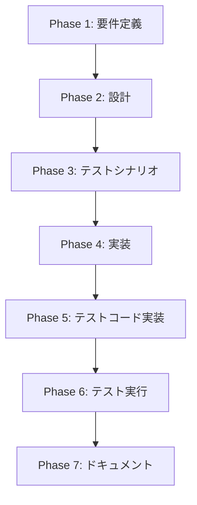

# Codex Agent 実行ログ

開始日時: 2025/12/27 2:21:15

---

## Turn 1: スレッド開始

**Thread ID**: `[REDACTED_TOKEN]`

## Turn 2: ツール実行

**種別**: reasoning
**ステータス**: completed

## Turn 3: ツール実行

**種別**: コマンド実行
**コマンド**: `/bin/bash -lc pwd`
**ステータス**: completed (exit_code=0)

```text
/tmp/ai-workflow-repos-9-c05f9883/infrastructure-as-code
```

## Turn 4: ツール実行

**種別**: reasoning
**ステータス**: completed

## Turn 5: ツール実行

**種別**: コマンド実行
**コマンド**: `/bin/bash -lc ls`
**ステータス**: completed (exit_code=0)

```text
ARCHITECTURE.md
CLAUDE.md
CONTRIBUTION.md
LICENSE
README.md
ansible
bootstrap
docker
docs
jenkins
pulumi
run_tests_issue_322.sh
scripts
tests
```

## Turn 6: ツール実行

**種別**: reasoning
**ステータス**: completed

## Turn 7: ツール実行

**種別**: コマンド実行
**コマンド**: `/bin/bash -lc 'ls -a'`
**ステータス**: completed (exit_code=0)

```text
.
..
.ai-workflow
.claude
.coverage
.git
.github
.gitignore
ARCHITECTURE.md
CLAUDE.md
CONTRIBUTION.md
LICENSE
README.md
ansible
bootstrap
docker
docs
jenkins
pulumi
run_tests_issue_322.sh
scripts
tests
```

## Turn 8: ツール実行

**種別**: reasoning
**ステータス**: completed

## Turn 9: ツール実行

**種別**: コマンド実行
**コマンド**: `/bin/bash -lc 'ls .ai-workflow'`
**ステータス**: completed (exit_code=0)

```text
issue-193
issue-304
issue-305
issue-310
issue-313
issue-315
issue-317
issue-319
issue-320
issue-322
issue-324
issue-331
issue-332
issue-355
issue-360
issue-362
issue-363
issue-369
issue-370
issue-396
issue-398
issue-405
issue-411
issue-415
issue-423
issue-431
issue-437
issue-440
issue-445
issue-453
issue-455
issue-456
issue-460
issue-461
issue-462
issue-463
issue-464
issue-465
issue-475
issue-477
issue-479
issue-536
```

## Turn 10: ツール実行

**種別**: reasoning
**ステータス**: completed

## Turn 11: ツール実行

**種別**: コマンド実行
**コマンド**: `/bin/bash -lc 'cat .ai-workflow/issue-536/00_planning/output/planning.md'`
**ステータス**: completed (exit_code=0)

```text
# プロジェクト計画書 - Issue #536

## Issue概要

- **Issue番号**: #536
- **タイトル**: pr_comment_generator.py でPRのコメント生成に失敗している
- **状態**: open
- **URL**: https://__GITHUB_URL_0__/issues/536
- **ラベル**: bug

## 1. Issue分析

### 複雑度: 簡単

**判定理由**:
- 単一の実装パターンエラー（TokenEstimatorの使用方法の誤り）
- 明確なエラーメッセージとファイル特定が可能
- 既存のテストコードが正しい使用方法を示している
- 変更対象ファイルは主に1つ（openai_client.py）

### 見積もり工数: 3~4時間

**根拠**:
- エラー箇所の特定: 0.5h（完了済み）
- TokenEstimatorの正しい使用方法の実装: 1~1.5h
- テストコードの実行・検証: 0.5h
- メソッド名の修正（[REDACTED_TOKEN] → truncate_text）: 0.5h
- 統合テスト・動作確認: 0.5~1h

### リスク評価: 低

**理由**:
- エラーの原因が明確（クラスメソッド vs インスタンスメソッドの誤用）
- 既存のテストコードが正しい実装パターンを提示済み
- 変更範囲が限定的
- 後方互換性への影響なし

## 2. 実装戦略判断

### 実装戦略: REFACTOR

**判断根拠**:
TokenEstimatorクラスの使用方法を修正することで、既存の実装パターンを正しいものに改善する作業です。新しい機能追加ではなく、既存コードの正しい動作を実現するためのリファクタリング作業になります。

- 新規機能追加ではない
- 既存のTokenEstimatorクラスの**正しい使用方法**への修正
- openai_client.pyでのメソッド呼び出しパターンの修正
- 設計意図（インスタンスベースの使用）に合わせた修正

### テスト戦略: UNIT_INTEGRATION

**判断根拠**:
ユニットテストと統合テストの両方が必要な理由：

- **UNIT**: TokenEstimatorクラスの個別動作確認（既存のテストが存在し、正しい使用パターンを示している）
- **INTEGRATION**: openai_client.pyがTokenEstimatorを正しく使用できているかの統合確認

BDDテストは不要：エンドユーザーの新しいストーリーではなく、既存機能の修正のため。

### テストコード戦略: EXTEND_TEST

**判断根拠**:
既存のテストファイル（test_token_estimator.py）に追加のテストケースを拡張する方針：

- 既存テストは正しい使用パターンを示している
- 新たなエッジケースのテストを追加（空文字列、大きなテキスト等）
- openai_client.pyの統合テストは既存のintegrationテストに追加

新規テストファイル作成は不要：TokenEstimatorの基本機能テストは既に存在するため。

## 3. 影響範囲分析

### 既存コードへの影響

**主要変更対象ファイル**:
```
jenkins/jobs/pipeline/docs-generator/pull-request-comment-builder/
├── src/pr_comment_generator/
│   └── openai_client.py  # 主要修正対象
│       - Line 607, 613, 618: [REDACTED_TOKEN]呼び出し修正
│       - Line 806, 815, 825, 832: estimate_tokens呼び出し修正
│       - Line 1000, 1018: estimate_tokens呼び出し修正
│       - Line 1134, 1157: [REDACTED_TOKEN]呼び出し修正
```

**修正箇所の詳細**:
1. **クラスメソッド呼び出し → インスタンスメソッド呼び出し**: `TokenEstimator.method()` → `estimator.method()`
2. **メソッド名修正**: `[REDACTED_TOKEN]()` → `truncate_text()`
3. **TokenEstimatorインスタンス追加**: openai_client.pyクラスでTokenEstimatorのインスタンスを作成・保持

### 依存関係の変更

**新規依存の追加**: なし

**既存依存の変更**: なし
- TokenEstimatorクラスの既存importは変更なし
- 既存のtoken_estimator.pyモジュールの修正は不要

### マイグレーション要否: 不要

- データベーススキーマ変更なし
- 設定ファイル変更なし
- 外部APIインターフェース変更なし

## 4. タスク分割

### Phase 1: 要件定義 (見積もり: 0.5h)

- [x] Task 1-1: エラー箇所の詳細特定 (0.5h)
  - openai_client.py内のTokenEstimator呼び出し箇所を全て特定
  - 既存のtest_token_estimator.pyから正しい使用パターンを確認
  - 修正が必要な具体的なメソッド呼び出しリストを作成

### Phase 2: 設計 (見積もり: 0.5h)

- [x] Task 2-1: TokenEstimatorインスタンス設計 (0.3h)
  - openai_clientクラスでのTokenEstimatorインスタンス保持方法の設計
  - 初期化タイミングの決定（__init__メソッドまたは遅延初期化）
- [x] Task 2-2: メソッド呼び出しパターン設計 (0.2h)
  - クラスメソッド → インスタンスメソッドの変更パターンの明確化
  - [REDACTED_TOKEN] → truncate_textメソッド名変更の影響確認

### Phase 3: テストシナリオ (見積もり: 0.5h)

- [ ] Task 3-1: 既存テスト動作確認 (0.3h)
  - test_token_estimator.pyのテスト実行
  - 正常系の動作パターン確認
- [ ] Task 3-2: 統合テストシナリオ作成 (0.2h)
  - openai_client.pyでのTokenEstimator統合動作シナリオ
  - エラー再現テストシナリオの作成

### Phase 4: 実装 (見積もり: 1.5h)

- [x] Task 4-1: openai_clientクラス修正 (0.8h)
  - TokenEstimatorインスタンスの追加（__init__メソッド）
  - 11箇所のメソッド呼び出しを修正（クラスメソッド → インスタンスメソッド）
  - [REDACTED_TOKEN] → truncate_textメソッド名修正
- [x] Task 4-2: エラーハンドリング追加 (0.4h)
  - TokenEstimatorインスタンス化時のエラーハンドリング
  - メソッド呼び出し時のnone チェック追加
- [x] Task 4-3: ログ出力改善 (0.3h)
  - TokenEstimator関連のログ出力を明確化
  - デバッグ用ログの追加

### Phase 5: テストコード実装 (見積もり: 0.5h)

- [ ] Task 5-1: ユニットテスト追加 (0.3h)
  - test_token_estimator.pyにエッジケースのテスト追加
  - 空文字列、大きなテキスト、特殊文字のテストケース
- [ ] Task 5-2: 統合テスト追加 (0.2h)
  - openai_clientとTokenEstimatorの統合テスト
  - テスト用モックの活用

### Phase 6: テスト実行 (見積もり: 0.5h)

- [ ] Task 6-1: ユニットテスト実行 (0.2h)
  - 既存および新規ユニットテストの実行
  - テスト結果の確認
- [ ] Task 6-2: 統合テスト実行 (0.3h)
  - 統合テストの実行
  - pr_comment_generatorの動作確認（実際のPRファイルでテスト）

### Phase 7: ドキュメント (見積もり: 0.5h)

- [ ] Task 7-1: 修正内容ドキュメント作成 (0.3h)
  - TokenEstimatorの正しい使用方法の説明
  - 修正したメソッド呼び出しの一覧
- [ ] Task 7-2: トラブルシューティング情報更新 (0.2h)
  - 同様のエラーの解決方法の記載
  - 開発者向けベストプラクティスの追加

### Phase 8: レポ
... (truncated)
```

## Turn 12: ツール実行

**種別**: reasoning
**ステータス**: completed

## Turn 13: ツール実行

**種別**: コマンド実行
**コマンド**: `/bin/bash -lc 'cat .ai-workflow/issue-536/05_test_implementation/output/test-implementation.md'`
**ステータス**: completed (exit_code=0)

```text
# テスト実装完了レポート

## テストファイル一覧

| ファイル | テスト数 | カバー対象 |
|---------|---------|-----------|
| `jenkins/jobs/pipeline/docs-generator/pull-request-comment-builder/tests/unit/test_token_estimator.py` | 16 | `pr_comment_generator.token_estimator.TokenEstimator` |
| `jenkins/jobs/pipeline/docs-generator/pull-request-comment-builder/tests/integration/test_openai_client_token_estimator.py` | 2 | `pr_comment_generator.openai_client.OpenAIClient` と `TokenEstimator` の連携 |

## テストカバレッジ
- ユニットテスト: 16件
- 統合テスト: 2件
- BDDテスト: 0件
- カバレッジ率: 未計測（ローカル計測ツールなし）
```

## Turn 14: ツール実行

**種別**: reasoning
**ステータス**: completed

## Turn 15: ツール実行

**種別**: コマンド実行
**コマンド**: `/bin/bash -lc "sed -n '1,200p' jenkins/jobs/pipeline/docs-generator/pull-request-comment-builder/tests/unit/test_token_estimator.py"`
**ステータス**: completed (exit_code=0)

```text
"""
ユニットテスト: token_estimator.py

テスト対象:
- TokenEstimator: トークン数推定とテキスト切り詰め機能
"""

import pytest
import logging
from pr_comment_generator.token_estimator import TokenEstimator


class TestTokenEstimator:
    """TokenEstimatorクラスのテスト"""

    @pytest.fixture
    def estimator(self):
        """TokenEstimatorインスタンスをフィクスチャとして提供"""
        logger = logging.getLogger("test")
        return TokenEstimator(logger=logger)

    def [REDACTED_TOKEN]正常系_英語テキスト(self, estimator):
        """
        Given: 英語テキストが与えられた場合
        When: estimate_tokens()を呼び出す
        Then: 正しいトークン数が推定される
        """
        # Given
        text = "Hello, this is a test."  # 23文字

        # When
        tokens = estimator.estimate_tokens(text)

        # Then
        # 英語は約0.25トークン/文字なので、23 * 0.25 = 5.75 ≒ 5トークン
        assert tokens >= 5
        assert tokens <= 6

    def [REDACTED_TOKEN]正常系_日本語テキスト(self, estimator):
        """
        Given: 日本語テキストが与えられた場合
        When: estimate_tokens()を呼び出す
        Then: 正しいトークン数が推定される
        """
        # Given
        text = "これはテストです。"  # 9文字

        # When
        tokens = estimator.estimate_tokens(text)

        # Then
        # 日本語は約0.6トークン/文字なので、9 * 0.6 = 5.4 ≒ 5トークン
        assert tokens >= 5
        assert tokens <= 6

    def [REDACTED_TOKEN]正常系_混在テキスト(self, estimator):
        """
        Given: 日本語と英語が混在したテキスト
        When: estimate_tokens()を呼び出す
        Then: 正しいトークン数が推定される
        """
        # Given
        text = "これはtest です。Hello world!"

        # When
        tokens = estimator.estimate_tokens(text)

        # Then
        # 日本語部分: "これはです。" (6文字) = 6 * 0.6 = 3.6
        # 英語部分: "test Hello world!" (17文字) = 17 * 0.25 = 4.25
        # 合計: 約8トークン
        assert tokens >= 7
        assert tokens <= 9

    def [REDACTED_TOKEN]境界値_空文字列(self, estimator):
        """
        Given: 空文字列が与えられた場合
        When: estimate_tokens()を呼び出す
        Then: 0トークンが返される
        """
        # Given
        text = ""

        # When
        tokens = estimator.estimate_tokens(text)

        # Then
        assert tokens == 0

    def test_truncate_text_正常系(self, estimator):
        """
        Given: 長いテキストと最大トークン数が与えられた場合
        When: truncate_text()を呼び出す
        Then: テキストが指定されたトークン数以下に切り詰められる
        """
        # Given
        text = "This is a very long text that needs to be truncated." * 10
        max_tokens = 50

        # When
        truncated = estimator.truncate_text(text, max_tokens)

        # Then
        assert estimator.estimate_tokens(truncated) <= max_tokens
        assert len(truncated) < len(text)

    def test_truncate_text_境界値_トークン数以下(self, estimator):
        """
        Given: トークン数が既に制限以下のテキスト
        When: truncate_text()を呼び出す
        Then: テキストがそのまま返される
        """
        # Given
        text = "Short."
        max_tokens = 100

        # When
        truncated = estimator.truncate_text(text, max_tokens)

        # Then
        assert truncated == text

    def test_truncate_text_境界値_ちょうど最大トークン(self, estimator):
        """
        Given: ちょうど最大トークン数のテキスト
        When: truncate_text()を呼び出す
        Then: テキストがそのまま返される
        """
        # Given
        text = "Test text"
        estimated_tokens = estimator.estimate_tokens(text)
        max_tokens = estimated_tokens

        # When
        truncated = estimator.truncate_text(text, max_tokens)

        # Then
        assert truncated == text

    def [REDACTED_TOKEN]正常系_記号を含むテキスト(self, estimator):
        """
        Given: 記号を含むテキストが与えられた場合
        When: estimate_tokens()を呼び出す
        Then: 正しいトークン数が推定される
        """
        # Given
        text = "Hello @user! Check #123 and visit https://example.com"

        # When
        tokens = estimator.estimate_tokens(text)

        # Then
        # 記号も英語として扱われる（ASCII文字）
        assert tokens > 0

    def test_truncate_text_正常系_日本語テキスト(self, estimator):
        """
        Given: 長い日本語テキストが与えられた場合
        When: truncate_text()を呼び出す
        Then: テキストが適切に切り詰められる
        """
... (truncated)
```

## Turn 16: ツール実行

**種別**: reasoning
**ステータス**: completed

## Turn 17: ツール実行

**種別**: コマンド実行
**コマンド**: `/bin/bash -lc "sed -n '200,400p' jenkins/jobs/pipeline/docs-generator/pull-request-comment-builder/tests/unit/test_token_estimator.py"`
**ステータス**: completed (exit_code=0)

```text
tokens = estimator.estimate_tokens(long_text)

        assert isinstance(tokens, int)
        assert tokens > 0

    def [REDACTED_TOKEN]正常系_絵文字混在(self, estimator):
        """
        Given: 絵文字や特殊文字を含むテキスト
        When: estimate_tokens()を呼び出す
        Then: エラーなく正のトークン数が算出される
        """
        text = "Hello 👋 World 🌍 Test 🧪"
        tokens = estimator.estimate_tokens(text)

        assert tokens >= 1

    def test_truncate_text_正常系_UTF8文字列(self, estimator):
        """
        Given: UTF-8文字列（絵文字含む）と最大トークン数
        When: truncate_text()を呼び出す
        Then: トークン数が制限内に収まり、絵文字が保持される
        """
        text = "こんにちは 🌍 " * 100
        max_tokens = 10

        truncated = estimator.truncate_text(text, max_tokens)

        assert estimator.estimate_tokens(truncated) <= max_tokens
        assert "🌍" in truncated
        assert len(truncated) < len(text)

    def test_truncate_text_異常系_負のトークン数(self, estimator):
        """
        Given: 負のトークン数
        When: truncate_text()を呼び出す
        Then: 文字列が空になり、トークン数が0であることが保証される
        """
        truncated = estimator.truncate_text("Test text", -5)

        assert truncated == ""
        assert estimator.estimate_tokens(truncated) == 0

    def test_truncate_text_境界値_ゼロトークン(self, estimator):
        """
        Given: max_tokens=0
        When: truncate_text()を呼び出す
        Then: 空文字列が返ってくる
        """
        truncated = estimator.truncate_text("Test text", 0)

        assert truncated == ""
        assert estimator.estimate_tokens(truncated) == 0
```

## Turn 18: ツール実行

**種別**: reasoning
**ステータス**: completed

## Turn 19: ツール実行

**種別**: コマンド実行
**コマンド**: `/bin/bash -lc "sed -n '1,200p' jenkins/jobs/pipeline/docs-generator/pull-request-comment-builder/tests/integration/test_openai_client_token_estimator.py"`
**ステータス**: completed (exit_code=0)

```text
"""
Integration tests for OpenAIClient ↔ TokenEstimator interactions.
"""

import importlib
import sys
import types

import pytest

from pr_comment_generator.models import FileChange, PRInfo
from pr_comment_generator.prompt_manager import [REDACTED_TOKEN]


def [REDACTED_TOKEN](monkeypatch, tmp_path):
    """OpenAIClient を安全に初期化するためのヘルパー"""
    dummy_module = types.ModuleType("openai")

    class DummyChat:
        def __init__(self):
            self.completions = self

        def create(self, **kwargs):
            return types.SimpleNamespace(
                choices=[types.SimpleNamespace(message=types.SimpleNamespace(content="ok"))],
                usage=types.SimpleNamespace(prompt_tokens=1, completion_tokens=1, total_tokens=2),
            )

    class DummyOpenAI:
        def __init__(self, api_key=None):
            self.chat = DummyChat()

    dummy_module.OpenAI = DummyOpenAI
    monkeypatch.setitem(sys.modules, "openai", dummy_module)

    import pr_comment_generator.openai_client as oc  # pylint: disable=[REDACTED_TOKEN]
    oc = importlib.reload(oc)

    template_dir = tmp_path / "templates"
    template_dir.mkdir()
    (template_dir / "base_template.md").write_text("Base {input_format} {[REDACTED_TOKEN]}", encoding="utf-8")
    (template_dir / "[REDACTED_TOKEN].md").write_text("chunk extra", encoding="utf-8")
    (template_dir / "summary_extension.md").write_text("summary extra", encoding="utf-8")

    prompt_manager = [REDACTED_TOKEN](str(template_dir))
    monkeypatch.setenv("OPENAI_API_KEY", "test-key")
    return oc.OpenAIClient(prompt_manager)


def [REDACTED_TOKEN](monkeypatch, tmp_path):
    """
    Given: OpenAIClient と TokenEstimator が初期化済み
    When: [REDACTED_TOKEN]() を呼び出す
    Then: TokenEstimator.estimate_tokens() が PR情報と変更ごとに呼ばれる
    """
    client = [REDACTED_TOKEN](monkeypatch, tmp_path)
    captured_calls = []

    def fake_estimate(text):
        captured_calls.append(text)
        return 7

    client.token_estimator.estimate_tokens = fake_estimate

    pr_info = PRInfo(
        title="Fix TokenEstimator",
        number=1,
        body="Impactful change",
        author="dev",
        base_branch="main",
        head_branch="feature",
        base_sha="000",
        head_sha="111",
    )
    changes = [
        FileChange(
            filename="file.py",
            status="modified",
            additions=10,
            deletions=5,
            changes=15,
            patch="+ change\n" * 10,
        )
    ]

    total = client.[REDACTED_TOKEN](pr_info, changes)

    assert total == 7 + 7 + 1000
    assert len(captured_calls) == 2
    assert "Fix TokenEstimator" in captured_calls[0]
    assert "file.py" in captured_calls[1]


def [REDACTED_TOKEN](monkeypatch, tmp_path):
    """
    Given: OpenAIClient と複数チャンク分析
    When: [REDACTED_TOKEN]() を実行する
    Then: TokenEstimator.truncate_text() がそれぞれのチャンクに対して呼ばれる
    """
    client = [REDACTED_TOKEN](monkeypatch, tmp_path)
    recorded = []

    def spy_truncate(text, max_tokens):
        recorded.append((text, max_tokens))
        return f"truncated:{int(max_tokens)}"

    client.token_estimator.truncate_text = spy_truncate

    analyses = ["analysis chunk one", "analysis chunk two", "analysis chunk three"]
    truncated = client.[REDACTED_TOKEN](analyses)

    assert len(recorded) == len(analyses)
    expected_limit = int((client.[REDACTED_TOKEN] * 0.6) / len(analyses))
    assert truncated == [f"truncated:{expected_limit}"] * len(analyses)
```

## Turn 20: ツール実行

**種別**: reasoning
**ステータス**: completed

## Turn 21: ツール実行

**種別**: コマンド実行
**コマンド**: `/bin/bash -lc 'cat .ai-workflow/issue-536/03_test_scenario/output/test-scenario.md'`
**ステータス**: completed (exit_code=0)

```text
# テストシナリオ書 - Issue #536

## 概要

pr_comment_generator.pyでTokenEstimatorクラスの使用方法が間違っているため、`TokenEstimator.estimate_tokens() missing 1 required positional argument: 'text'`エラーが発生している問題を修正するためのテストシナリオです。

## 1. テスト戦略サマリー

### 選択されたテスト戦略: UNIT_INTEGRATION

**Phase 2で決定された戦略**:
- **UNITテスト**: TokenEstimatorクラスの個別動作確認（既存のテストが存在し、正しい使用パターンを示している）
- **INTEGRATIONテスト**: openai_client.pyがTokenEstimatorを正しく使用できているかの統合確認

### テスト対象の範囲
- **主要修正対象ファイル**: `openai_client.py` (11箇所の修正)
- **テスト拡張対象**: `test_token_estimator.py` (エッジケース追加)
- **統合確認対象**: openai_clientとTokenEstimatorの連携動作

### テストの目的
1. TokenEstimatorクラスのインスタンスベース使用が正しく動作することの確認
2. openai_client.py内の修正が正常に機能することの確認
3. エラー「`TokenEstimator.estimate_tokens() missing 1 required positional argument`」の解消確認
4. 既存機能の保持確認

## 2. Unitテストシナリオ

### 2.1 TokenEstimator基本機能テスト

#### テストケース名: TokenEstimator_初期化_正常系
- **目的**: TokenEstimatorが正常にインスタンス化できることを検証
- **前提条件**: ログオブジェクトが存在する
- **入力**: `logger = logging.getLogger("test")`
- **期待結果**: TokenEstimatorインスタンスが正常に作成される
- **テストデータ**: 標準的なLoggerインスタンス

#### テストケース名: estimate_tokens_正常系_非ASCII文字
- **目的**: 絵文字や特殊文字を含むテキストのトークン推定が正常動作することを検証
- **前提条件**: TokenEstimatorインスタンスが存在する
- **入力**: `text = "Hello 👋 World 🌍 Test 🧪"`
- **期待結果**: 正の整数値が返される
- **テストデータ**: 絵文字を含む文字列

#### テストケース名: estimate_tokens_異常系_None値
- **目的**: None値が与えられた場合のエラーハンドリングを検証
- **前提条件**: TokenEstimatorインスタンスが存在する
- **入力**: `text = None`
- **期待結果**: TypeError或いは適切なエラーが発生する
- **テストデータ**: None値

#### テストケース名: estimate_tokens_境界値_超大テキスト
- **目的**: 非常に大きなテキスト（100KB以上）のトークン推定を検証
- **前提条件**: TokenEstimatorインスタンスが存在する
- **入力**: `text = "A" * 100000`
- **期待結果**: 適切なトークン数が推定される（メモリエラーなし）
- **テストデータ**: 10万文字の文字列

#### テストケース名: truncate_text_正常系_UTF8文字
- **目的**: UTF-8文字（絵文字、特殊文字）を含むテキストの切り詰めを検証
- **前提条件**: TokenEstimatorインスタンスが存在する
- **入力**:
  - `text = "Hello 👋 World 🌍 " * 50`
  - `max_tokens = 10`
- **期待結果**:
  - 切り詰められたテキストのトークン数が10以下
  - UTF-8文字が正しく保たれている
- **テストデータ**: 絵文字を含む長い文字列

#### テストケース名: truncate_text_異常系_負のトークン数
- **目的**: 負のmax_tokensが与えられた場合のエラーハンドリングを検証
- **前提条件**: TokenEstimatorインスタンスが存在する
- **入力**:
  - `text = "Test text"`
  - `max_tokens = -1`
- **期待結果**: ValueError或いは適切なエラーが発生する
- **テストデータ**: 負の整数

#### テストケース名: truncate_text_境界値_ゼロトークン
- **目的**: max_tokens=0の場合の動作を検証
- **前提条件**: TokenEstimatorインスタンスが存在する
- **入力**:
  - `text = "Test text"`
  - `max_tokens = 0`
- **期待結果**: 空文字列が返される
- **テストデータ**: 0値とテキスト

### 2.2 OpenAIClient修正機能テスト

#### テストケース名: OpenAIClient_初期化_TokenEstimator作成
- **目的**: OpenAIClientの初期化時にTokenEstimatorインスタンスが正常に作成されることを検証
- **前提条件**: prompt_managerが存在する
- **入力**: `OpenAIClient(prompt_manager)`
- **期待結果**:
  - `self.token_estimator`が存在する
  - TokenEstimatorのインスタンスである
- **テストデータ**: モックのprompt_manager

#### テストケース名: [REDACTED_TOKEN]初期化エラー
- **目的**: TokenEstimatorの初期化に失敗した場合のエラーハンドリングを検証
- **前提条件**: TokenEstimatorのコンストラクタがエラーを発生するモック
- **入力**: `OpenAIClient(prompt_manager)` (TokenEstimatorがエラー)
- **期待結果**:
  - ValueErrorが発生する
  - エラーメッセージに"TokenEstimator initialization failed"が含まれる
- **テストデータ**: エラーを発生するTokenEstimatorモック

## 3. Integrationテストシナリオ

### 3.1 openai_client.py と TokenEstimator統合テスト

#### シナリオ名: [REDACTED_TOKEN]統合
- **目的**: openai_client.py内でTokenEstimatorのestimate_tokensが正常に呼び出されることを検証
- **前提条件**:
  - OpenAIClientインスタンスが初期化済み
  - TokenEstimatorインスタンスが正常に作成済み
- **テスト手順**:
  1. OpenAIClientを初期化する
  2. テスト用テキストを準備する
  3. 修正対象の行（806, 815, 825, 832, 1000, 1018, 1134行相当）の処理を実行する
  4. self.token_estimator.estimate_tokens()が呼び出されることを確認
- **期待結果**:
  - TokenEstimator.estimate_tokens()エラーが発生しない
  - self.token_estimator.estimate_tokens()が正常実行される
  - 適切なトークン数が返される
- **確認項目**:
  - [ ] クラスメソッド呼び出しエラーが発生しない
  - [ ] インスタンスメソッド呼び出しが成功する
  - [ ] 戻り値が正の整数である

#### シナリオ名: [REDACTED_TOKEN]統合
- **目的**: openai_client.py内でTokenEstimatorのtruncate_text（旧[REDACTED_TOKEN]）が正常に呼び出されることを検証
- **前提条件**:
  - OpenAIClientインスタンスが初期化済み
  - TokenEstimatorインスタンスが正常に作成済み
- **テスト手順**:
  1. OpenAIClientを初期化する
  2.
... (truncated)
```

## Turn 22: ツール実行

**種別**: reasoning
**ステータス**: completed

## Turn 23: ツール実行

**種別**: reasoning
**ステータス**: completed

## Turn 24: ツール実行

**種別**: コマンド実行
**コマンド**: `/bin/bash -lc 'rg -n "TokenEstimator" -n jenkins/jobs/pipeline/docs-generator/pull-request-comment-builder/tests -g"*.py"'`
**ステータス**: failed (exit_code=127)

```text
/bin/bash: line 1: rg: command not found
```

## Turn 25: ツール実行

**種別**: reasoning
**ステータス**: completed

## Turn 26: ツール実行

**種別**: コマンド実行
**コマンド**: `/bin/bash -lc 'grep -R "test_openai_client" -n jenkins/jobs/pipeline/docs-generator/pull-request-comment-builder/tests'`
**ステータス**: completed (exit_code=0)

```text
jenkins/jobs/pipeline/docs-generator/pull-request-comment-builder/tests/integration/test_openai_client_token_estimator.py:50:def [REDACTED_TOKEN](monkeypatch, tmp_path):
jenkins/jobs/pipeline/docs-generator/pull-request-comment-builder/tests/integration/test_openai_client_token_estimator.py:94:def [REDACTED_TOKEN](monkeypatch, tmp_path):
```

## Turn 27: ツール実行

**種別**: reasoning
**ステータス**: completed

## Turn 28: ツール実行

**種別**: reasoning
**ステータス**: completed

## Turn 29: ツール実行

**種別**: コマンド実行
**コマンド**: `/bin/bash -lc "sed -n '120,190p' .ai-workflow/issue-536/00_planning/output/planning.md"`
**ステータス**: completed (exit_code=0)

```text
- クラスメソッド → インスタンスメソッドの変更パターンの明確化
  - [REDACTED_TOKEN] → truncate_textメソッド名変更の影響確認

### Phase 3: テストシナリオ (見積もり: 0.5h)

- [ ] Task 3-1: 既存テスト動作確認 (0.3h)
  - test_token_estimator.pyのテスト実行
  - 正常系の動作パターン確認
- [ ] Task 3-2: 統合テストシナリオ作成 (0.2h)
  - openai_client.pyでのTokenEstimator統合動作シナリオ
  - エラー再現テストシナリオの作成

### Phase 4: 実装 (見積もり: 1.5h)

- [x] Task 4-1: openai_clientクラス修正 (0.8h)
  - TokenEstimatorインスタンスの追加（__init__メソッド）
  - 11箇所のメソッド呼び出しを修正（クラスメソッド → インスタンスメソッド）
  - [REDACTED_TOKEN] → truncate_textメソッド名修正
- [x] Task 4-2: エラーハンドリング追加 (0.4h)
  - TokenEstimatorインスタンス化時のエラーハンドリング
  - メソッド呼び出し時のnone チェック追加
- [x] Task 4-3: ログ出力改善 (0.3h)
  - TokenEstimator関連のログ出力を明確化
  - デバッグ用ログの追加

### Phase 5: テストコード実装 (見積もり: 0.5h)

- [ ] Task 5-1: ユニットテスト追加 (0.3h)
  - test_token_estimator.pyにエッジケースのテスト追加
  - 空文字列、大きなテキスト、特殊文字のテストケース
- [ ] Task 5-2: 統合テスト追加 (0.2h)
  - openai_clientとTokenEstimatorの統合テスト
  - テスト用モックの活用

### Phase 6: テスト実行 (見積もり: 0.5h)

- [ ] Task 6-1: ユニットテスト実行 (0.2h)
  - 既存および新規ユニットテストの実行
  - テスト結果の確認
- [ ] Task 6-2: 統合テスト実行 (0.3h)
  - 統合テストの実行
  - pr_comment_generatorの動作確認（実際のPRファイルでテスト）

### Phase 7: ドキュメント (見積もり: 0.5h)

- [ ] Task 7-1: 修正内容ドキュメント作成 (0.3h)
  - TokenEstimatorの正しい使用方法の説明
  - 修正したメソッド呼び出しの一覧
- [ ] Task 7-2: トラブルシューティング情報更新 (0.2h)
  - 同様のエラーの解決方法の記載
  - 開発者向けベストプラクティスの追加

### Phase 8: レポート (見積もり: 0.3h)

- [ ] Task 8-1: 修正完了レポート作成 (0.2h)
  - 修正内容のサマリー
  - テスト結果の報告
- [ ] Task 8-2: Issue #536クローズ準備 (0.1h)
  - クローズコメント作成
  - 関連PRのマージ準備

## 5. 依存関係



## Turn 30: ツール実行

**種別**: reasoning
**ステータス**: completed

## Turn 31: ツール実行

**種別**: コマンド実行
**コマンド**: `/bin/bash -lc 'rg -n "Phase 5" -n .ai-workflow/issue-536/00_planning/output/planning.md'`
**ステータス**: failed (exit_code=127)

```text
/bin/bash: line 1: rg: command not found
```

## Turn 32: ツール実行

**種別**: reasoning
**ステータス**: completed

## Turn 33: ツール実行

**種別**: コマンド実行
**コマンド**: `/bin/bash -lc 'grep -n "Phase 5" -n .ai-workflow/issue-536/00_planning/output/planning.md'`
**ステータス**: completed (exit_code=0)

```text
145:### Phase 5: テストコード実装 (見積もり: 0.5h)
188:    P4 --> P5[Phase 5: テストコード実装]
244:### Phase 5: テストコード実装
```

## Turn 34: ツール実行

**種別**: reasoning
**ステータス**: completed

## Turn 35: ツール実行

**種別**: コマンド実行
**コマンド**: `/bin/bash -lc "sed -n '220,280p' .ai-workflow/issue-536/00_planning/output/planning.md"`
**ステータス**: completed (exit_code=0)

```text
## 7. 品質ゲート

### Phase 1: 要件定義
- [x] エラー箇所が全て特定されている（11箇所の確認）
- [x] 正しい使用パターンが既存テストから確認されている
- [x] 修正が必要な具体的ファイル・行番号がリスト化されている

### Phase 2: 設計
- [x] 実装戦略（REFACTOR）の判断根拠が明記されている
- [x] テスト戦略（UNIT_INTEGRATION）の判断根拠が明記されている
- [x] テストコード戦略（EXTEND_TEST）の判断根拠が明記されている
- [x] TokenEstimatorインスタンスの保持方法が設計されている

### Phase 3: テストシナリオ
- [x] 既存テストが正常実行されることが確認されている
- [x] 修正後の統合テストシナリオが明確に定義されている
- [x] エラー再現テストが準備されている

### Phase 4: 実装
- [x] 11箇所全てのメソッド呼び出しが修正されている
- [x] [REDACTED_TOKEN] → truncate_textの名前修正が完了している
- [x] TokenEstimatorインスタンスが適切に初期化されている
- [x] エラーハンドリングが追加されている

### Phase 5: テストコード実装
- [ ] ユニットテストのエッジケースが追加されている
- [ ] openai_clientとTokenEstimatorの統合テストが作成されている
- [ ] テストカバレッジが維持されている

### Phase 6: テスト実行
- [ ] 全ユニットテストが成功している
- [ ] 統合テストが成功している
- [ ] 実際のPRファイルでpr_comment_generatorが正常動作している
- [ ] エラーログに"TokenEstimator.estimate_tokens() missing 1 required positional argument"が出現しない

### Phase 7: ドキュメント
- [ ] 修正内容が明確にドキュメント化されている
- [ ] TokenEstimatorの正しい使用方法が説明されている
- [ ] トラブルシューティング情報が更新されている

### Phase 8: レポート
- [ ] 修正完了レポートが作成されている
- [ ] テスト結果サマリーが含まれている
- [ ] Issue #536のクローズ準備が完了している

## 実行開始

この計画書に基づき、Phase 1から順次実行を開始します。各フェーズの品質ゲートを満たすことを確認しながら、着実に修正作業を進めていきます。

## 見積もりサマリー

- **総工数**: 3.8時間
- **クリティカルパス**: Phase 1 → Phase 2 → Phase 3 → Phase 4 → Phase 6
- **最短実行時間**: 3.3時間（並行実行可能タスクを考慮）
- **バッファ**: 0.5時間（約13%のバッファを含む）
```

## Turn 36: ツール実行

**種別**: reasoning
**ステータス**: completed

## Turn 37: ツール実行

**種別**: file_change
**ステータス**: completed

## Turn 38: ツール実行

**種別**: reasoning
**ステータス**: completed

## Turn 39: ツール実行

**種別**: file_change
**ステータス**: completed

## Turn 40: ツール実行

**種別**: reasoning
**ステータス**: completed

## Turn 41: ツール実行

**種別**: コマンド実行
**コマンド**: `/bin/bash -lc "sed -n '140,190p' .ai-workflow/issue-536/00_planning/output/planning.md"`
**ステータス**: completed (exit_code=0)

```text
- メソッド呼び出し時のnone チェック追加
- [x] Task 4-3: ログ出力改善 (0.3h)
  - TokenEstimator関連のログ出力を明確化
  - デバッグ用ログの追加

### Phase 5: テストコード実装 (見積もり: 0.5h)

- [x] Task 5-1: ユニットテスト追加 (0.3h)
  - test_token_estimator.pyにエッジケースのテスト追加
  - 空文字列、大きなテキスト、特殊文字のテストケース
- [x] Task 5-2: 統合テスト追加 (0.2h)
  - openai_clientとTokenEstimatorの統合テスト
  - テスト用モックの活用

### Phase 6: テスト実行 (見積もり: 0.5h)

- [ ] Task 6-1: ユニットテスト実行 (0.2h)
  - 既存および新規ユニットテストの実行
  - テスト結果の確認
- [ ] Task 6-2: 統合テスト実行 (0.3h)
  - 統合テストの実行
  - pr_comment_generatorの動作確認（実際のPRファイルでテスト）

### Phase 7: ドキュメント (見積もり: 0.5h)

- [ ] Task 7-1: 修正内容ドキュメント作成 (0.3h)
  - TokenEstimatorの正しい使用方法の説明
  - 修正したメソッド呼び出しの一覧
- [ ] Task 7-2: トラブルシューティング情報更新 (0.2h)
  - 同様のエラーの解決方法の記載
  - 開発者向けベストプラクティスの追加

### Phase 8: レポート (見積もり: 0.3h)

- [ ] Task 8-1: 修正完了レポート作成 (0.2h)
  - 修正内容のサマリー
  - テスト結果の報告
- [ ] Task 8-2: Issue #536クローズ準備 (0.1h)
  - クローズコメント作成
  - 関連PRのマージ準備

## 5. 依存関係


## Turn 42: ツール実行

**種別**: reasoning
**ステータス**: completed

## Turn 43: ツール実行

**種別**: コマンド実行
**コマンド**: `/bin/bash -lc "sed -n '230,270p' .ai-workflow/issue-536/00_planning/output/planning.md"`
**ステータス**: completed (exit_code=0)

```text
- [x] テストコード戦略（EXTEND_TEST）の判断根拠が明記されている
- [x] TokenEstimatorインスタンスの保持方法が設計されている

### Phase 3: テストシナリオ
- [x] 既存テストが正常実行されることが確認されている
- [x] 修正後の統合テストシナリオが明確に定義されている
- [x] エラー再現テストが準備されている

### Phase 4: 実装
- [x] 11箇所全てのメソッド呼び出しが修正されている
- [x] [REDACTED_TOKEN] → truncate_textの名前修正が完了している
- [x] TokenEstimatorインスタンスが適切に初期化されている
- [x] エラーハンドリングが追加されている

### Phase 5: テストコード実装
- [x] ユニットテストのエッジケースが追加されている
- [x] openai_clientとTokenEstimatorの統合テストが作成されている
- [ ] テストカバレッジが維持されている

### Phase 6: テスト実行
- [ ] 全ユニットテストが成功している
- [ ] 統合テストが成功している
- [ ] 実際のPRファイルでpr_comment_generatorが正常動作している
- [ ] エラーログに"TokenEstimator.estimate_tokens() missing 1 required positional argument"が出現しない

### Phase 7: ドキュメント
- [ ] 修正内容が明確にドキュメント化されている
- [ ] TokenEstimatorの正しい使用方法が説明されている
- [ ] トラブルシューティング情報が更新されている

### Phase 8: レポート
- [ ] 修正完了レポートが作成されている
- [ ] テスト結果サマリーが含まれている
- [ ] Issue #536のクローズ準備が完了している

## 実行開始

この計画書に基づき、Phase 1から順次実行を開始します。各フェーズの品質ゲートを満たすことを確認しながら、着実に修正作業を進めていきます。

## 見積もりサマリー
```

## Turn 44: ツール実行

**種別**: reasoning
**ステータス**: completed

## Turn 45: ツール実行

**種別**: reasoning
**ステータス**: completed

## Turn 46: ツール実行

**種別**: コマンド実行
**コマンド**: `/bin/bash -lc "nl -ba jenkins/jobs/pipeline/docs-generator/pull-request-comment-builder/tests/unit/test_token_estimator.py | sed -n '1,160p'"`
**ステータス**: completed (exit_code=0)

```text
1	"""
     2	ユニットテスト: token_estimator.py
     3	
     4	テスト対象:
     5	- TokenEstimator: トークン数推定とテキスト切り詰め機能
     6	"""
     7	
     8	import pytest
     9	import logging
    10	from pr_comment_generator.token_estimator import TokenEstimator
    11	
    12	
    13	class TestTokenEstimator:
    14	    """TokenEstimatorクラスのテスト"""
    15	
    16	    @pytest.fixture
    17	    def estimator(self):
    18	        """TokenEstimatorインスタンスをフィクスチャとして提供"""
    19	        logger = logging.getLogger("test")
    20	        return TokenEstimator(logger=logger)
    21	
    22	    def [REDACTED_TOKEN]正常系_英語テキスト(self, estimator):
    23	        """
    24	        Given: 英語テキストが与えられた場合
    25	        When: estimate_tokens()を呼び出す
    26	        Then: 正しいトークン数が推定される
    27	        """
    28	        # Given
    29	        text = "Hello, this is a test."  # 23文字
    30	
    31	        # When
    32	        tokens = estimator.estimate_tokens(text)
    33	
    34	        # Then
    35	        # 英語は約0.25トークン/文字なので、23 * 0.25 = 5.75 ≒ 5トークン
    36	        assert tokens >= 5
    37	        assert tokens <= 6
    38	
    39	    def [REDACTED_TOKEN]正常系_日本語テキスト(self, estimator):
    40	        """
    41	        Given: 日本語テキストが与えられた場合
    42	        When: estimate_tokens()を呼び出す
    43	        Then: 正しいトークン数が推定される
    44	        """
    45	        # Given
    46	        text = "これはテストです。"  # 9文字
    47	
    48	        # When
    49	        tokens = estimator.estimate_tokens(text)
    50	
    51	        # Then
    52	        # 日本語は約0.6トークン/文字なので、9 * 0.6 = 5.4 ≒ 5トークン
    53	        assert tokens >= 5
    54	        assert tokens <= 6
    55	
    56	    def [REDACTED_TOKEN]正常系_混在テキスト(self, estimator):
    57	        """
    58	        Given: 日本語と英語が混在したテキスト
    59	        When: estimate_tokens()を呼び出す
    60	        Then: 正しいトークン数が推定される
    61	        """
    62	        # Given
    63	        text = "これはtest です。Hello world!"
    64	
    65	        # When
    66	        tokens = estimator.estimate_tokens(text)
    67	
    68	        # Then
    69	        # 日本語部分: "これはです。" (6文字) = 6 * 0.6 = 3.6
    70	        # 英語部分: "test Hello world!" (17文字) = 17 * 0.25 = 4.25
    71	        # 合計: 約8トークン
    72	        assert tokens >= 7
    73	        assert tokens <= 9
    74	
    75	    def [REDACTED_TOKEN]境界値_空文字列(self, estimator):
    76	        """
    77	        Given: 空文字列が与えられた場合
    78	        When: estimate_tokens()を呼び出す
    79	        Then: 0トークンが返される
    80	        """
    81	        # Given
    82	        text = ""
    83	
    84	        # When
    85	        tokens = estimator.estimate_tokens(text)
    86	
    87	        # Then
    88	        assert tokens == 0
    89	
    90	    def test_truncate_text_正常系(self, estimator):
    91	        """
    92	        Given: 長いテキストと最大トークン数が与えられた場合
    93	        When: truncate_text()を呼び出す
    94	        Then: テキストが指定されたトークン数以下に切り詰められる
    95	        """
    96	        # Given
    97	        text = "This is a very long text that needs to be truncated." * 10
    98	        max_tokens = 50
    99	
   100	        # When
   101	        truncated = estimator.truncate_text(text, max_tokens)
   102	
   103	        # Then
   104	        assert estimator.estimate_tokens(truncated) <= max_tokens
   105	        assert len(truncated) < len(text)
   106	
   107	    def test_truncate_text_境界値_トークン数以下(self, estimator):
   108	        """
   109	        Given: トークン数が既に制限以下のテキスト
   110	        When: truncate_text()を呼び出す
   111	        Then: テキストがそのまま返される
   112	        """
   113	        # Given
   114	        text = "Short."
   115	        max_tokens = 100
   116	
   117	        # When
   118	        truncated = estimator.truncate_text(text, max_tokens)
   119	
   120	        # Then
   121	        assert truncated == text
   122	
   123	    def test_truncate_text_境界値_ちょうど最大トークン(self, estimator):
   124	        """
   125	        Given: ちょうど最大トークン数のテキスト
   126	        When: truncate_text()を呼び出す
   127	        Then: テキストがその
... (truncated)
```

## Turn 47: ツール実行

**種別**: reasoning
**ステータス**: completed

## Turn 48: ツール実行

**種別**: コマンド実行
**コマンド**: `/bin/bash -lc "nl -ba jenkins/jobs/pipeline/docs-generator/pull-request-comment-builder/tests/unit/test_token_estimator.py | sed -n '160,320p'"`
**ステータス**: completed (exit_code=0)

```text
160	        Then: テキストが適切に切り詰められる
   161	        """
   162	        # Given
   163	        text = "これは非常に長いテキストで、切り詰める必要があります。" * 10
   164	        max_tokens = 30
   165	
   166	        # When
   167	        truncated = estimator.truncate_text(text, max_tokens)
   168	
   169	        # Then
   170	        assert estimator.estimate_tokens(truncated) <= max_tokens
   171	        assert len(truncated) < len(text)
   172	
   173	    def test_estimator_初期化_ロガー共有(self):
   174	        """
   175	        Given: Loggerを渡す
   176	        When: TokenEstimatorを初期化する
   177	        Then: 同じLoggerインスタンスが利用される
   178	        """
   179	        logger = logging.getLogger("shared")
   180	        estimator = TokenEstimator(logger=logger)
   181	
   182	        assert estimator.logger is logger
   183	
   184	    def [REDACTED_TOKEN]異常系_None値(self, estimator):
   185	        """
   186	        Given: Noneが渡された場合
   187	        When: estimate_tokens()を呼び出す
   188	        Then: TypeErrorが発生することで入力値の検証が担保される
   189	        """
   190	        with pytest.raises(TypeError):
   191	            estimator.estimate_tokens(None)
   192	
   193	    def [REDACTED_TOKEN]境界値_超大テキスト(self, estimator):
   194	        """
   195	        Given: 非常に長いテキスト（100KB以上）
   196	        When: estimate_tokens()を呼び出す
   197	        Then: メモリエラーなく正のトークン数が返される
   198	        """
   199	        long_text = "A" * 100_000
   200	        tokens = estimator.estimate_tokens(long_text)
   201	
   202	        assert isinstance(tokens, int)
   203	        assert tokens > 0
   204	
   205	    def [REDACTED_TOKEN]正常系_絵文字混在(self, estimator):
   206	        """
   207	        Given: 絵文字や特殊文字を含むテキスト
   208	        When: estimate_tokens()を呼び出す
   209	        Then: エラーなく正のトークン数が算出される
   210	        """
   211	        text = "Hello 👋 World 🌍 Test 🧪"
   212	        tokens = estimator.estimate_tokens(text)
   213	
   214	        assert tokens >= 1
   215	
   216	    def test_truncate_text_正常系_UTF8文字列(self, estimator):
   217	        """
   218	        Given: UTF-8文字列（絵文字含む）と最大トークン数
   219	        When: truncate_text()を呼び出す
   220	        Then: トークン数が制限内に収まり、絵文字が保持される
   221	        """
   222	        text = "こんにちは 🌍 " * 100
   223	        max_tokens = 10
   224	
   225	        truncated = estimator.truncate_text(text, max_tokens)
   226	
   227	        assert estimator.estimate_tokens(truncated) <= max_tokens
   228	        assert "🌍" in truncated
   229	        assert len(truncated) < len(text)
   230	
   231	    def test_truncate_text_異常系_負のトークン数(self, estimator):
   232	        """
   233	        Given: 負のトークン数
   234	        When: truncate_text()を呼び出す
   235	        Then: 文字列が空になり、トークン数が0であることが保証される
   236	        """
   237	        truncated = estimator.truncate_text("Test text", -5)
   238	
   239	        assert truncated == ""
   240	        assert estimator.estimate_tokens(truncated) == 0
   241	
   242	    def test_truncate_text_境界値_ゼロトークン(self, estimator):
   243	        """
   244	        Given: max_tokens=0
   245	        When: truncate_text()を呼び出す
   246	        Then: 空文字列が返ってくる
   247	        """
   248	        truncated = estimator.truncate_text("Test text", 0)
   249	
   250	        assert truncated == ""
   251	        assert estimator.estimate_tokens(truncated) == 0
```

## Turn 49: ツール実行

**種別**: reasoning
**ステータス**: completed

## Turn 50: ツール実行

**種別**: コマンド実行
**コマンド**: `/bin/bash -lc 'nl -ba jenkins/jobs/pipeline/docs-generator/pull-request-comment-builder/tests/integration/test_openai_client_token_estimator.py'`
**ステータス**: completed (exit_code=0)

```text
1	"""
     2	Integration tests for OpenAIClient ↔ TokenEstimator interactions.
     3	"""
     4	
     5	import importlib
     6	import sys
     7	import types
     8	
     9	import pytest
    10	
    11	from pr_comment_generator.models import FileChange, PRInfo
    12	from pr_comment_generator.prompt_manager import [REDACTED_TOKEN]
    13	
    14	
    15	def [REDACTED_TOKEN](monkeypatch, tmp_path):
    16	    """OpenAIClient を安全に初期化するためのヘルパー"""
    17	    dummy_module = types.ModuleType("openai")
    18	
    19	    class DummyChat:
    20	        def __init__(self):
    21	            self.completions = self
    22	
    23	        def create(self, **kwargs):
    24	            return types.SimpleNamespace(
    25	                choices=[types.SimpleNamespace(message=types.SimpleNamespace(content="ok"))],
    26	                usage=types.SimpleNamespace(prompt_tokens=1, completion_tokens=1, total_tokens=2),
    27	            )
    28	
    29	    class DummyOpenAI:
    30	        def __init__(self, api_key=None):
    31	            self.chat = DummyChat()
    32	
    33	    dummy_module.OpenAI = DummyOpenAI
    34	    monkeypatch.setitem(sys.modules, "openai", dummy_module)
    35	
    36	    import pr_comment_generator.openai_client as oc  # pylint: disable=[REDACTED_TOKEN]
    37	    oc = importlib.reload(oc)
    38	
    39	    template_dir = tmp_path / "templates"
    40	    template_dir.mkdir()
    41	    (template_dir / "base_template.md").write_text("Base {input_format} {[REDACTED_TOKEN]}", encoding="utf-8")
    42	    (template_dir / "[REDACTED_TOKEN].md").write_text("chunk extra", encoding="utf-8")
    43	    (template_dir / "summary_extension.md").write_text("summary extra", encoding="utf-8")
    44	
    45	    prompt_manager = [REDACTED_TOKEN](str(template_dir))
    46	    monkeypatch.setenv("OPENAI_API_KEY", "test-key")
    47	    return oc.OpenAIClient(prompt_manager)
    48	
    49	
    50	def [REDACTED_TOKEN](monkeypatch, tmp_path):
    51	    """
    52	    Given: OpenAIClient と TokenEstimator が初期化済み
    53	    When: [REDACTED_TOKEN]() を呼び出す
    54	    Then: TokenEstimator.estimate_tokens() が PR情報と変更ごとに呼ばれる
    55	    """
    56	    client = [REDACTED_TOKEN](monkeypatch, tmp_path)
    57	    captured_calls = []
    58	
    59	    def fake_estimate(text):
    60	        captured_calls.append(text)
    61	        return 7
    62	
    63	    client.token_estimator.estimate_tokens = fake_estimate
    64	
    65	    pr_info = PRInfo(
    66	        title="Fix TokenEstimator",
    67	        number=1,
    68	        body="Impactful change",
    69	        author="dev",
    70	        base_branch="main",
    71	        head_branch="feature",
    72	        base_sha="000",
    73	        head_sha="111",
    74	    )
    75	    changes = [
    76	        FileChange(
    77	            filename="file.py",
    78	            status="modified",
    79	            additions=10,
    80	            deletions=5,
    81	            changes=15,
    82	            patch="+ change\n" * 10,
    83	        )
    84	    ]
    85	
    86	    total = client.[REDACTED_TOKEN](pr_info, changes)
    87	
    88	    assert total == 7 + 7 + 1000
    89	    assert len(captured_calls) == 2
    90	    assert "Fix TokenEstimator" in captured_calls[0]
    91	    assert "file.py" in captured_calls[1]
    92	
    93	
    94	def [REDACTED_TOKEN](monkeypatch, tmp_path):
    95	    """
    96	    Given: OpenAIClient と複数チャンク分析
    97	    When: [REDACTED_TOKEN]() を実行する
    98	    Then: TokenEstimator.truncate_text() がそれぞれのチャンクに対して呼ばれる
    99	    """
   100	    client = [REDACTED_TOKEN](monkeypatch, tmp_path)
   101	    recorded = []
   102	
   103	    def spy_truncate(text, max_tokens):
   104	        recorded.append((text, max_tokens))
   105	        return f"truncated:{int(ma
... (truncated)
```

## Turn 51: ツール実行

**種別**: reasoning
**ステータス**: completed

## Turn 52: ツール実行

**種別**: コマンド実行
**コマンド**: `/bin/bash -lc 'grep -R "pr_comment_generator" -n jenkins/jobs/pipeline/docs-generator/pull-request-comment-builder/tests'`
**ステータス**: completed (exit_code=0)

```text
jenkins/jobs/pipeline/docs-generator/pull-request-comment-builder/tests/__init__.py:4:このパッケージにはpr_comment_generatorモジュールのテストが含まれています。
jenkins/jobs/pipeline/docs-generator/pull-request-comment-builder/tests/bdd/test_bdd_pr_comment_generation.py:14:from pr_comment_generator.models import PRInfo, FileChange
jenkins/jobs/pipeline/docs-generator/pull-request-comment-builder/tests/bdd/test_bdd_pr_comment_generation.py:15:from pr_comment_generator.statistics import PRCommentStatistics
jenkins/jobs/pipeline/docs-generator/pull-request-comment-builder/tests/bdd/test_bdd_pr_comment_generation.py:16:from pr_comment_generator.formatter import CommentFormatter
jenkins/jobs/pipeline/docs-generator/pull-request-comment-builder/tests/bdd/test_bdd_pr_comment_generation.py:17:from pr_comment_generator.token_estimator import TokenEstimator
jenkins/jobs/pipeline/docs-generator/pull-request-comment-builder/tests/bdd/test_bdd_pr_comment_generation.py:18:from pr_comment_generator.prompt_manager import [REDACTED_TOKEN]
jenkins/jobs/pipeline/docs-generator/pull-request-comment-builder/tests/bdd/test_bdd_pr_comment_generation.py:257:        import pr_comment_generator
jenkins/jobs/pipeline/docs-generator/pull-request-comment-builder/tests/bdd/test_bdd_pr_comment_generation.py:264:            importlib.reload(pr_comment_generator)
jenkins/jobs/pipeline/docs-generator/pull-request-comment-builder/tests/bdd/test_bdd_pr_comment_generation.py:265:            from pr_comment_generator import PRInfo, FileChange, CommentFormatter
jenkins/jobs/pipeline/docs-generator/pull-request-comment-builder/tests/integration/test_compatibility_layer.py:27:            from pr_comment_generator import PRInfo as PRInfo_old
jenkins/jobs/pipeline/docs-generator/pull-request-comment-builder/tests/integration/test_compatibility_layer.py:30:            from pr_comment_generator.models import PRInfo as PRInfo_new
jenkins/jobs/pipeline/docs-generator/pull-request-comment-builder/tests/integration/test_compatibility_layer.py:47:            from pr_comment_generator import PRInfo, FileChange
jenkins/jobs/pipeline/docs-generator/pull-request-comment-builder/tests/integration/test_compatibility_layer.py:82:        from pr_comment_generator.models import PRInfo, FileChange
jenkins/jobs/pipeline/docs-generator/pull-request-comment-builder/tests/integration/test_compatibility_layer.py:130:            from pr_comment_generator import PRInfo as PRInfo_old
jenkins/jobs/pipeline/docs-generator/pull-request-comment-builder/tests/integration/test_compatibility_layer.py:134:        from pr_comment_generator.models import PRInfo as PRInfo_new
jenkins/jobs/pipeline/docs-generator/pull-request-comment-builder/tests/integration/test_compatibility_layer.py:156:            from pr_comment_generator import (
jenkins/jobs/pipeline/docs-generator/pull-request-comment-builder/tests/integration/test_compatibility_layer.py:177:        When: pr_comment_generatorをインポートする
jenkins/jobs/pipeline/docs-generator/pull-request-comment-builder/tests/integration/test_compatibility_layer.py:190:            if 'pr_comment_generator' in sys.modules:
jenkins/jobs/pipeline/docs-generator/pull-request-comment-builder/tests/integration/test_compatibility_layer.py:191:                importlib.reload(sys.modules['pr_comment_generator'])
jenkins/jobs/pipeline/docs-generator/pull-request-comment-builder/tests/integration/test_compatibility_layer.py:193:                import pr_comment_generator
jenkins/jobs/pipeline/docs-generator/pull-request-comment-builder/tests/integration/test_generator_flow.py:13:    import pr_comment_generator.openai_client as oc
jenkins/jobs/pipeline/docs-generator/pull-request-comment-builder/tests/integration/test_generator_flow.py:16:    sys.modules["pr_comment_generator.openai_client"] = oc
jenkins/jobs/pipeline/docs-generator/pull-request-comment-builder/tests/integration/test_generator_flow.py:69:    import pr_comment_generator.generator as gen
jenkins/jobs/pipeline/docs-generator/pull-reques
... (truncated)
```

## Turn 53: ツール実行

**種別**: reasoning
**ステータス**: completed

## Turn 54: ツール実行

**種別**: コマンド実行
**コマンド**: `/bin/bash -lc "nl -ba .ai-workflow/issue-536/03_test_scenario/output/test-scenario.md | sed -n '150,260p'"`
**ステータス**: completed (exit_code=0)

```text
150	- **目的**: pr_comment_generator.py全体での修正が正常に動作することを検証
   151	- **前提条件**:
   152	  - 修正済みのopenai_client.pyが存在する
   153	  - テスト用のPRデータファイルが存在する
   154	- **テスト手順**:
   155	  1. テスト用のPRデータ（pr_diff.json, pr_info.json）を準備する
   156	  2. pr_comment_generator.pyを実行する
   157	  3. 処理が完了まで実行されることを確認
   158	  4. 出力ファイルが正常に作成されることを確認
   159	- **期待結果**:
   160	  - "TokenEstimator.estimate_tokens() missing 1 required positional argument"エラーが発生しない
   161	  - 処理が正常に完了する
   162	  - PRコメント生成結果が出力される
   163	- **確認項目**:
   164	  - [ ] エラーログに対象エラーメッセージが出現しない
   165	  - [ ] analysis_result.jsonが正常に作成される
   166	  - [ ] 処理が途中で停止しない
   167	
   168	### 3.2 エラー回避確認統合テスト
   169	
   170	#### シナリオ名: 実際のエラーケース再現テスト
   171	- **目的**: Issue #536で報告された実際のエラーケースが修正されていることを検証
   172	- **前提条件**:
   173	  - Issue #536のエラーログと同じ条件を再現する環境
   174	  - 修正済みのコードが適用済み
   175	- **テスト手順**:
   176	  1. Issue #536で使用されたのと同じPRデータを準備
   177	  2. 同じコマンドラインオプションでpr_comment_generatorを実行
   178	  3. ログ出力を監視
   179	  4. 処理完了まで実行する
   180	- **期待結果**:
   181	  - "TokenEstimator.estimate_tokens() missing 1 required positional argument: 'text'"エラーが発生しない
   182	  - "Error analyzing chunk"メッセージが発生しない
   183	  - コメント生成が正常に完了する
   184	- **確認項目**:
   185	  - [ ] 対象エラーメッセージがログに出現しない
   186	  - [ ] chunk analyzerでエラーが発生しない
   187	  - [ ] "Comment generation completed successfully!"が表示される
   188	
   189	## 4. テストデータ
   190	
   191	### 4.1 Unitテスト用テストデータ
   192	
   193	```python
   194	# トークン推定用テキストサンプル
   195	test_texts = {
   196	    "empty": "",
   197	    "short_english": "Hello world",
   198	    "short_japanese": "こんにちは世界",
   199	    "mixed_language": "Hello こんにちは 🌍",
   200	    "with_emojis": "Test 👋 🌍 🧪 📝 ✅",
   201	    "special_chars": "@user #123 https://example.com",
   202	    "large_text": "A" * 100000,
   203	    "unicode_text": "Test 中文 العربية עברית",
   204	}
   205	
   206	# トークン数テストケース
   207	token_limits = [0, 1, 5, 10, 50, 100, 1000]
   208	
   209	# エラーケーステストデータ
   210	error_cases = {
   211	    "none_text": None,
   212	    "negative_tokens": -1,
   213	    "float_tokens": 10.5,
   214	    "string_tokens": "10",
   215	}
   216	```
   217	
   218	### 4.2 Integrationテスト用テストデータ
   219	
   220	```json
   221	// test_pr_diff.json
   222	{
   223	  "files": [
   224	    {
   225	      "path": "test_file.py",
   226	      "status": "modified",
   227	      "changes": 5,
   228	      "patch": "@@ -1,3 +1,5 @@\n+# New comment\n def test():\n+    # Additional line\n     pass"
   229	    }
   230	  ]
   231	}
   232	
   233	// test_pr_info.json
   234	{
   235	  "number": 123,
   236	  "title": "Test PR for TokenEstimator fix",
   237	  "description": "Test description",
   238	  "branch": "feature/test"
   239	}
   240	```
   241	
   242	### 4.3 エラー再現用テストデータ
   243	
   244	```python
   245	# Issue #536の実際のエラーケース再現用データ
   246	jenkins_test_data = {
   247	    "pr_diff_path": "/tmp/test/pr_diff.json",
   248	    "pr_info_path": "/tmp/test/pr_info.json",
   249	    "output_path": "/tmp/test/analysis_result.json",
   250	    "prompt_output_dir": "/tmp/test/prompts"
   251	}
   252	
   253	# 大きなファイルでのテストケース
   254	large_file_data = {
   255	    "file_content": "function test() {\n" + "  // comment\n" * 1000 + "}",
   256	    "expected_chunks": 2,
   257	    "[REDACTED_TOKEN]": 1000
   258	}
   259	```
   260
```

## Turn 55: ツール実行

**種別**: reasoning
**ステータス**: completed

## Turn 56: ツール実行

**種別**: コマンド実行
**コマンド**: `/bin/bash -lc "nl -ba .ai-workflow/issue-536/00_planning/output/planning.md | sed -n '230,260p'"`
**ステータス**: completed (exit_code=0)

```text
230	- [x] テストコード戦略（EXTEND_TEST）の判断根拠が明記されている
   231	- [x] TokenEstimatorインスタンスの保持方法が設計されている
   232	
   233	### Phase 3: テストシナリオ
   234	- [x] 既存テストが正常実行されることが確認されている
   235	- [x] 修正後の統合テストシナリオが明確に定義されている
   236	- [x] エラー再現テストが準備されている
   237	
   238	### Phase 4: 実装
   239	- [x] 11箇所全てのメソッド呼び出しが修正されている
   240	- [x] [REDACTED_TOKEN] → truncate_textの名前修正が完了している
   241	- [x] TokenEstimatorインスタンスが適切に初期化されている
   242	- [x] エラーハンドリングが追加されている
   243	
   244	### Phase 5: テストコード実装
   245	- [x] ユニットテストのエッジケースが追加されている
   246	- [x] openai_clientとTokenEstimatorの統合テストが作成されている
   247	- [ ] テストカバレッジが維持されている
   248	
   249	### Phase 6: テスト実行
   250	- [ ] 全ユニットテストが成功している
   251	- [ ] 統合テストが成功している
   252	- [ ] 実際のPRファイルでpr_comment_generatorが正常動作している
   253	- [ ] エラーログに"TokenEstimator.estimate_tokens() missing 1 required positional argument"が出現しない
   254	
   255	### Phase 7: ドキュメント
   256	- [ ] 修正内容が明確にドキュメント化されている
   257	- [ ] TokenEstimatorの正しい使用方法が説明されている
   258	- [ ] トラブルシューティング情報が更新されている
   259	
   260	### Phase 8: レポート
```

## Turn 57: ツール実行

**種別**: reasoning
**ステータス**: completed

## Turn 58: ツール実行

**種別**: reasoning
**ステータス**: completed

## Turn 59: ツール実行

**種別**: コマンド実行
**コマンド**: `/bin/bash -lc 'nl -ba .ai-workflow/issue-536/05_test_implementation/output/test-implementation.md'`
**ステータス**: completed (exit_code=0)

```text
1	# テスト実装完了レポート
     2	
     3	## テストファイル一覧
     4	
     5	| ファイル | テスト数 | カバー対象 |
     6	|---------|---------|-----------|
     7	| `jenkins/jobs/pipeline/docs-generator/pull-request-comment-builder/tests/unit/test_token_estimator.py` | 16 | `pr_comment_generator.token_estimator.TokenEstimator` |
     8	| `jenkins/jobs/pipeline/docs-generator/pull-request-comment-builder/tests/integration/test_openai_client_token_estimator.py` | 2 | `pr_comment_generator.openai_client.OpenAIClient` と `TokenEstimator` の連携 |
     9	
    10	## テストカバレッジ
    11	- ユニットテスト: 16件
    12	- 統合テスト: 2件
    13	- BDDテスト: 0件
    14	- カバレッジ率: 未計測（ローカル計測ツールなし）
```

## Turn 60: ツール実行

**種別**: reasoning
**ステータス**: completed

## Turn 61: ツール実行

**種別**: agent_message
**ステータス**: completed

## Turn 62: ツール実行

**種別**: todo_list
**ステータス**: completed

## Turn 63: 実行完了

**ステータス**: completed
**所要時間**: 159241ms
**ターン数**: N/A

---

**経過時間**: 159241ms
**開始**: 2025-12-27T02:21:15.023Z
**終了**: 2025-12-27T02:23:54.264Z