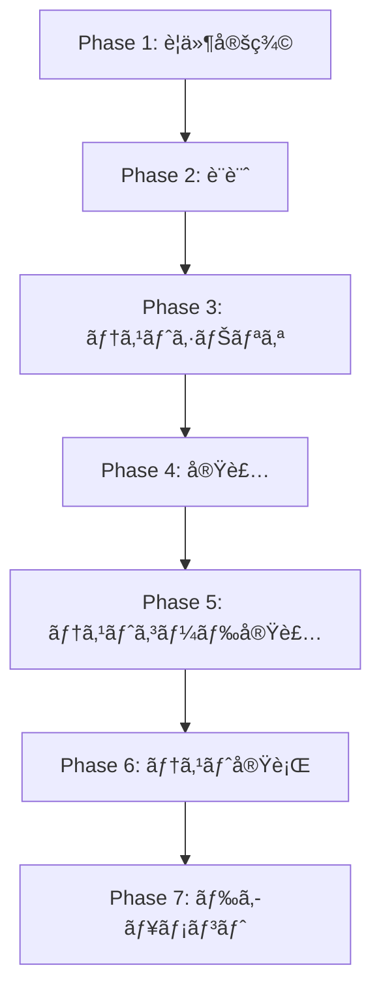

# Codex Agent 実行ログ

開始日時: 2025/12/27 2:21:15

---

## Turn 1: スレッド開始

**Thread ID**: `[REDACTED_TOKEN]`

## Turn 2: ツール実行

**種別**: reasoning
**ステータス**: completed

## Turn 3: ツール実行

**種別**: コãƒãƒ³ãƒ‰å®Ÿè¡Œ
**コãƒãƒ³ãƒ‰**: `/bin/bash -lc pwd`
**ステータス**: completed (exit_code=0)

```text
/tmp/ai-workflow-repos-9-c05f9883/infrastructure-as-code
```

## Turn 4: ツール実行

**種別**: reasoning
**ステータス**: completed

## Turn 5: ツール実行

**種別**: コãƒãƒ³ãƒ‰å®Ÿè¡Œ
**コãƒãƒ³ãƒ‰**: `/bin/bash -lc ls`
**ステータス**: completed (exit_code=0)

```text
ARCHITECTURE.md
CLAUDE.md
CONTRIBUTION.md
LICENSE
README.md
ansible
bootstrap
docker
docs
jenkins
pulumi
run_tests_issue_322.sh
scripts
tests
```

## Turn 6: ツール実行

**種別**: reasoning
**ステータス**: completed

## Turn 7: ツール実行

**種別**: コãƒãƒ³ãƒ‰å®Ÿè¡Œ
**コãƒãƒ³ãƒ‰**: `/bin/bash -lc 'ls -a'`
**ステータス**: completed (exit_code=0)

```text
.
..
.ai-workflow
.claude
.coverage
.git
.github
.gitignore
ARCHITECTURE.md
CLAUDE.md
CONTRIBUTION.md
LICENSE
README.md
ansible
bootstrap
docker
docs
jenkins
pulumi
run_tests_issue_322.sh
scripts
tests
```

## Turn 8: ツール実行

**種別**: reasoning
**ステータス**: completed

## Turn 9: ツール実行

**種別**: コãƒãƒ³ãƒ‰å®Ÿè¡Œ
**コãƒãƒ³ãƒ‰**: `/bin/bash -lc 'ls .ai-workflow'`
**ステータス**: completed (exit_code=0)

```text
issue-193
issue-304
issue-305
issue-310
issue-313
issue-315
issue-317
issue-319
issue-320
issue-322
issue-324
issue-331
issue-332
issue-355
issue-360
issue-362
issue-363
issue-369
issue-370
issue-396
issue-398
issue-405
issue-411
issue-415
issue-423
issue-431
issue-437
issue-440
issue-445
issue-453
issue-455
issue-456
issue-460
issue-461
issue-462
issue-463
issue-464
issue-465
issue-475
issue-477
issue-479
issue-536
```

## Turn 10: ツール実行

**種別**: reasoning
**ステータス**: completed

## Turn 11: ツール実行

**種別**: コãƒãƒ³ãƒ‰å®Ÿè¡Œ
**コãƒãƒ³ãƒ‰**: `/bin/bash -lc 'cat .ai-workflow/issue-536/00_planning/output/planning.md'`
**ステータス**: completed (exit_code=0)

```text
# プロジェクト計画書 - Issue #536

## Issue概è¦

- **Issue番å·**: #536
- **タイトル**: pr_comment_generator.py ã§PRã®ã‚³ãƒ¡ãƒ³ãƒˆç”Ÿæˆã«å¤±æ•—ã—ã¦ã„ã‚‹
- **状態**: open
- **URL**: https://__GITHUB_URL_0__/issues/536
- **ラベル**: bug

## 1. Issue分æ

### 複雑度: ç°¡å˜

**判定ç†ç”±**:
- å˜ä¸€ã®å®Ÿè£…パターンエラー（TokenEstimatorã®ä½¿ç”¨æ–¹æ³•ã®èª¤ã‚Šï¼‰
- æ˜ç¢ºãªã‚¨ãƒ©ãƒ¼ãƒ¡ãƒƒã‚»ãƒ¼ã‚¸ã¨ãƒ•ã‚¡ã‚¤ãƒ«ç‰¹å®šãŒå¯èƒ½
- 既存ã®ãƒ†ã‚¹ãƒˆã‚³ãƒ¼ãƒ‰ãŒæ­£ã—ã„使用方法を示ã—ã¦ã„ã‚‹
- 変更対象ファイルã¯ä¸»ã«1ã¤ï¼ˆopenai_client.py）

### 見ç©ã‚‚り工数: 3~4時間

**根拠**:
- エラー箇所ã®ç‰¹å®š: 0.5h（完了済ã¿ï¼‰
- TokenEstimatorã®æ­£ã—ã„使用方法ã®å®Ÿè£…: 1~1.5h
- テストコードã®å®Ÿè¡Œãƒ»æ¤œè¨¼: 0.5h
- メソッドåã®ä¿®æ­£ï¼ˆ[REDACTED_TOKEN] → truncate_text）: 0.5h
- çµ±åˆãƒ†ã‚¹ãƒˆãƒ»å‹•ä½œç¢ºèª: 0.5~1h

### リスク評価: ä½

**ç†ç”±**:
- エラーã®åŸå› ãŒæ˜ç¢ºï¼ˆã‚¯ãƒ©ã‚¹ãƒ¡ã‚½ãƒƒãƒ‰ vs インスタンスメソッドã®èª¤ç”¨ï¼‰
- 既存ã®ãƒ†ã‚¹ãƒˆã‚³ãƒ¼ãƒ‰ãŒæ­£ã—ã„実装パターンをæ示済ã¿
- 変更範囲ãŒé™å®šçš„
- 後方互æ›æ€§ã¸ã®å½±éŸ¿ãªã—

## 2. 実装戦略判断

### 実装戦略: REFACTOR

**判断根拠**:
TokenEstimatorクラスã®ä½¿ç”¨æ–¹æ³•ã‚’修正ã™ã‚‹ã“ã¨ã§ã€æ—¢å­˜ã®å®Ÿè£…パターンを正ã—ã„ã‚‚ã®ã«æ”¹å–„ã™ã‚‹ä½œæ¥­ã§ã™ã€‚æ–°ã—ã„機能追加ã§ã¯ãªãã€æ—¢å­˜ã‚³ãƒ¼ãƒ‰ã®æ­£ã—ã„動作を実ç¾ã™ã‚‹ãŸã‚ã®ãƒªãƒ•ã‚¡ã‚¯ã‚¿ãƒªãƒ³ã‚°ä½œæ¥­ã«ãªã‚Šã¾ã™ã€‚

- æ–°è¦æ©Ÿèƒ½è¿½åŠ ã§ã¯ãªã„
- 既存ã®TokenEstimatorクラスã®**æ­£ã—ã„使用方法**ã¸ã®ä¿®æ­£
- openai_client.pyã§ã®ãƒ¡ã‚½ãƒƒãƒ‰å‘¼ã³å‡ºã—パターンã®ä¿®æ­£
- 設計æ„図（インスタンスベースã®ä½¿ç”¨ï¼‰ã«åˆã‚ã›ãŸä¿®æ­£

### テスト戦略: UNIT_INTEGRATION

**判断根拠**:
ユニットテストã¨çµ±åˆãƒ†ã‚¹ãƒˆã®ä¸¡æ–¹ãŒå¿…è¦ãªç†ç”±ï¼š

- **UNIT**: TokenEstimatorクラスã®å€‹åˆ¥å‹•ä½œç¢ºèªï¼ˆæ—¢å­˜ã®ãƒ†ã‚¹ãƒˆãŒå­˜åœ¨ã—ã€æ­£ã—ã„使用パターンを示ã—ã¦ã„る）
- **INTEGRATION**: openai_client.pyãŒTokenEstimatorã‚’æ­£ã—ã使用ã§ãã¦ã„ã‚‹ã‹ã®çµ±åˆç¢ºèª

BDDテストã¯ä¸è¦ï¼šã‚¨ãƒ³ãƒ‰ãƒ¦ãƒ¼ã‚¶ãƒ¼ã®æ–°ã—ã„ストーリーã§ã¯ãªãã€æ—¢å­˜æ©Ÿèƒ½ã®ä¿®æ­£ã®ãŸã‚。

### テストコード戦略: EXTEND_TEST

**判断根拠**:
既存ã®ãƒ†ã‚¹ãƒˆãƒ•ã‚¡ã‚¤ãƒ«ï¼ˆtest_token_estimator.py）ã«è¿½åŠ ã®ãƒ†ã‚¹ãƒˆã‚±ãƒ¼ã‚¹ã‚’æ‹¡å¼µã™ã‚‹æ–¹é‡ï¼š

- 既存テストã¯æ­£ã—ã„使用パターンを示ã—ã¦ã„ã‚‹
- æ–°ãŸãªã‚¨ãƒƒã‚¸ã‚±ãƒ¼ã‚¹ã®ãƒ†ã‚¹ãƒˆã‚’追加（空文字列ã€å¤§ããªãƒ†ã‚­ã‚¹ãƒˆç­‰ï¼‰
- openai_client.pyã®çµ±åˆãƒ†ã‚¹ãƒˆã¯æ—¢å­˜ã®integrationテストã«è¿½åŠ 

æ–°è¦ãƒ†ã‚¹ãƒˆãƒ•ã‚¡ã‚¤ãƒ«ä½œæˆã¯ä¸è¦ï¼šTokenEstimatorã®åŸºæœ¬æ©Ÿèƒ½ãƒ†ã‚¹ãƒˆã¯æ—¢ã«å­˜åœ¨ã™ã‚‹ãŸã‚。

## 3. 影響範囲分æ

### 既存コードã¸ã®å½±éŸ¿

**主è¦å¤‰æ›´å¯¾è±¡ãƒ•ã‚¡ã‚¤ãƒ«**:
```
jenkins/jobs/pipeline/docs-generator/pull-request-comment-builder/
├── src/pr_comment_generator/
│   └── openai_client.py  # 主è¦ä¿®æ­£å¯¾è±¡
│       - Line 607, 613, 618: [REDACTED_TOKEN]呼ã³å‡ºã—修正
│       - Line 806, 815, 825, 832: estimate_tokens呼ã³å‡ºã—修正
│       - Line 1000, 1018: estimate_tokens呼ã³å‡ºã—修正
│       - Line 1134, 1157: [REDACTED_TOKEN]呼ã³å‡ºã—修正
```

**修正箇所ã®è©³ç´°**:
1. **クラスメソッド呼ã³å‡ºã— → インスタンスメソッド呼ã³å‡ºã—**: `TokenEstimator.method()` → `estimator.method()`
2. **メソッドå修正**: `[REDACTED_TOKEN]()` → `truncate_text()`
3. **TokenEstimatorインスタンス追加**: openai_client.pyクラスã§TokenEstimatorã®ã‚¤ãƒ³ã‚¹ã‚¿ãƒ³ã‚¹ã‚’作æˆãƒ»ä¿æŒ

### ä¾å­˜é–¢ä¿‚ã®å¤‰æ›´

**æ–°è¦ä¾å­˜ã®è¿½åŠ **: ãªã—

**既存ä¾å­˜ã®å¤‰æ›´**: ãªã—
- TokenEstimatorクラスã®æ—¢å­˜importã¯å¤‰æ›´ãªã—
- 既存ã®token_estimator.pyモジュールã®ä¿®æ­£ã¯ä¸è¦

### ãƒã‚¤ã‚°ãƒ¬ãƒ¼ã‚·ãƒ§ãƒ³è¦å¦: ä¸è¦

- データベーススキーãƒå¤‰æ›´ãªã—
- 設定ファイル変更ãªã—
- 外部APIインターフェース変更ãªã—

## 4. タスク分割

### Phase 1: è¦ä»¶å®šç¾© (見ç©ã‚‚ã‚Š: 0.5h)

- [x] Task 1-1: エラー箇所ã®è©³ç´°ç‰¹å®š (0.5h)
  - openai_client.py内ã®TokenEstimator呼ã³å‡ºã—箇所を全ã¦ç‰¹å®š
  - 既存ã®test_token_estimator.pyã‹ã‚‰æ­£ã—ã„使用パターンを確èª
  - 修正ãŒå¿…è¦ãªå…·ä½“çš„ãªãƒ¡ã‚½ãƒƒãƒ‰å‘¼ã³å‡ºã—リストを作æˆ

### Phase 2: 設計 (見ç©ã‚‚ã‚Š: 0.5h)

- [x] Task 2-1: TokenEstimatorインスタンス設計 (0.3h)
  - openai_clientクラスã§ã®TokenEstimatorインスタンスä¿æŒæ–¹æ³•ã®è¨­è¨ˆ
  - åˆæœŸåŒ–タイミングã®æ±ºå®šï¼ˆ__init__メソッドã¾ãŸã¯é…延åˆæœŸåŒ–）
- [x] Task 2-2: メソッド呼ã³å‡ºã—パターン設計 (0.2h)
  - クラスメソッド → インスタンスメソッドã®å¤‰æ›´ãƒ‘ターンã®æ˜ç¢ºåŒ–
  - [REDACTED_TOKEN] → truncate_textメソッドå変更ã®å½±éŸ¿ç¢ºèª

### Phase 3: テストシナリオ (見ç©ã‚‚ã‚Š: 0.5h)

- [ ] Task 3-1: æ—¢å­˜ãƒ†ã‚¹ãƒˆå‹•ä½œç¢ºèª (0.3h)
  - test_token_estimator.pyã®ãƒ†ã‚¹ãƒˆå®Ÿè¡Œ
  - 正常系ã®å‹•ä½œãƒ‘ターン確èª
- [ ] Task 3-2: çµ±åˆãƒ†ã‚¹ãƒˆã‚·ãƒŠãƒªã‚ªä½œæˆ (0.2h)
  - openai_client.pyã§ã®TokenEstimatorçµ±åˆå‹•ä½œã‚·ãƒŠãƒªã‚ª
  - エラーå†ç¾ãƒ†ã‚¹ãƒˆã‚·ãƒŠãƒªã‚ªã®ä½œæˆ

### Phase 4: 実装 (見ç©ã‚‚ã‚Š: 1.5h)

- [x] Task 4-1: openai_clientクラス修正 (0.8h)
  - TokenEstimatorインスタンスã®è¿½åŠ ï¼ˆ__init__メソッド）
  - 11箇所ã®ãƒ¡ã‚½ãƒƒãƒ‰å‘¼ã³å‡ºã—を修正（クラスメソッド → インスタンスメソッド）
  - [REDACTED_TOKEN] → truncate_textメソッドå修正
- [x] Task 4-2: エラーãƒãƒ³ãƒ‰ãƒªãƒ³ã‚°è¿½åŠ  (0.4h)
  - TokenEstimatorインスタンス化時ã®ã‚¨ãƒ©ãƒ¼ãƒãƒ³ãƒ‰ãƒªãƒ³ã‚°
  - メソッド呼ã³å‡ºã—時ã®none ãƒã‚§ãƒƒã‚¯è¿½åŠ 
- [x] Task 4-3: ログ出力改善 (0.3h)
  - TokenEstimator関連ã®ãƒ­ã‚°å‡ºåŠ›ã‚’æ˜ç¢ºåŒ–
  - デãƒãƒƒã‚°ç”¨ãƒ­ã‚°ã®è¿½åŠ 

### Phase 5: テストコード実装 (見ç©ã‚‚ã‚Š: 0.5h)

- [ ] Task 5-1: ユニットテスト追加 (0.3h)
  - test_token_estimator.pyã«ã‚¨ãƒƒã‚¸ã‚±ãƒ¼ã‚¹ã®ãƒ†ã‚¹ãƒˆè¿½åŠ 
  - 空文字列ã€å¤§ããªãƒ†ã‚­ã‚¹ãƒˆã€ç‰¹æ®Šæ–‡å­—ã®ãƒ†ã‚¹ãƒˆã‚±ãƒ¼ã‚¹
- [ ] Task 5-2: çµ±åˆãƒ†ã‚¹ãƒˆè¿½åŠ  (0.2h)
  - openai_clientã¨TokenEstimatorã®çµ±åˆãƒ†ã‚¹ãƒˆ
  - テスト用モックã®æ´»ç”¨

### Phase 6: テスト実行 (見ç©ã‚‚ã‚Š: 0.5h)

- [ ] Task 6-1: ユニットテスト実行 (0.2h)
  - 既存ãŠã‚ˆã³æ–°è¦ãƒ¦ãƒ‹ãƒƒãƒˆãƒ†ã‚¹ãƒˆã®å®Ÿè¡Œ
  - テストçµæœã®ç¢ºèª
- [ ] Task 6-2: çµ±åˆãƒ†ã‚¹ãƒˆå®Ÿè¡Œ (0.3h)
  - çµ±åˆãƒ†ã‚¹ãƒˆã®å®Ÿè¡Œ
  - pr_comment_generatorã®å‹•ä½œç¢ºèªï¼ˆå®Ÿéš›ã®PRファイルã§ãƒ†ã‚¹ãƒˆï¼‰

### Phase 7: ドキュメント (見ç©ã‚‚ã‚Š: 0.5h)

- [ ] Task 7-1: ä¿®æ­£å†…å®¹ãƒ‰ã‚­ãƒ¥ãƒ¡ãƒ³ãƒˆä½œæˆ (0.3h)
  - TokenEstimatorã®æ­£ã—ã„使用方法ã®èª¬æ˜
  - 修正ã—ãŸãƒ¡ã‚½ãƒƒãƒ‰å‘¼ã³å‡ºã—ã®ä¸€è¦§
- [ ] Task 7-2: トラブルシューティング情報更新 (0.2h)
  - åŒæ§˜ã®ã‚¨ãƒ©ãƒ¼ã®è§£æ±ºæ–¹æ³•ã®è¨˜è¼‰
  - 開発者å‘ã‘ベストプラクティスã®è¿½åŠ 

### Phase 8: レãƒ
... (truncated)
```

## Turn 12: ツール実行

**種別**: reasoning
**ステータス**: completed

## Turn 13: ツール実行

**種別**: コãƒãƒ³ãƒ‰å®Ÿè¡Œ
**コãƒãƒ³ãƒ‰**: `/bin/bash -lc 'cat .ai-workflow/issue-536/05_test_implementation/output/test-implementation.md'`
**ステータス**: completed (exit_code=0)

```text
# テスト実装完了レãƒãƒ¼ãƒˆ

## テストファイル一覧

| ファイル | テスト数 | ã‚«ãƒãƒ¼å¯¾è±¡ |
|---------|---------|-----------|
| `jenkins/jobs/pipeline/docs-generator/pull-request-comment-builder/tests/unit/test_token_estimator.py` | 16 | `pr_comment_generator.token_estimator.TokenEstimator` |
| `jenkins/jobs/pipeline/docs-generator/pull-request-comment-builder/tests/integration/test_openai_client_token_estimator.py` | 2 | `pr_comment_generator.openai_client.OpenAIClient` 㨠`TokenEstimator` ã®é€£æº |

## テストカãƒãƒ¬ãƒƒã‚¸
- ユニットテスト: 16件
- çµ±åˆãƒ†ã‚¹ãƒˆ: 2件
- BDDテスト: 0件
- ã‚«ãƒãƒ¬ãƒƒã‚¸ç‡: 未計測（ローカル計測ツールãªã—）
```

## Turn 14: ツール実行

**種別**: reasoning
**ステータス**: completed

## Turn 15: ツール実行

**種別**: コãƒãƒ³ãƒ‰å®Ÿè¡Œ
**コãƒãƒ³ãƒ‰**: `/bin/bash -lc "sed -n '1,200p' jenkins/jobs/pipeline/docs-generator/pull-request-comment-builder/tests/unit/test_token_estimator.py"`
**ステータス**: completed (exit_code=0)

```text
"""
ユニットテスト: token_estimator.py

テスト対象:
- TokenEstimator: トークン数æ¨å®šã¨ãƒ†ã‚­ã‚¹ãƒˆåˆ‡ã‚Šè©°ã‚機能
"""

import pytest
import logging
from pr_comment_generator.token_estimator import TokenEstimator


class TestTokenEstimator:
    """TokenEstimatorクラスã®ãƒ†ã‚¹ãƒˆ"""

    @pytest.fixture
    def estimator(self):
        """TokenEstimatorインスタンスをフィクスãƒãƒ£ã¨ã—ã¦æä¾›"""
        logger = logging.getLogger("test")
        return TokenEstimator(logger=logger)

    def [REDACTED_TOKEN]正常系_英èªãƒ†ã‚­ã‚¹ãƒˆ(self, estimator):
        """
        Given: 英èªãƒ†ã‚­ã‚¹ãƒˆãŒä¸ãˆã‚‰ã‚ŒãŸå ´åˆ
        When: estimate_tokens()を呼ã³å‡ºã™
        Then: æ­£ã—ã„トークン数ãŒæ¨å®šã•ã‚Œã‚‹
        """
        # Given
        text = "Hello, this is a test."  # 23文字

        # When
        tokens = estimator.estimate_tokens(text)

        # Then
        # 英èªã¯ç´„0.25トークン/文字ãªã®ã§ã€23 * 0.25 = 5.75 ≒ 5トークン
        assert tokens >= 5
        assert tokens <= 6

    def [REDACTED_TOKEN]正常系_日本èªãƒ†ã‚­ã‚¹ãƒˆ(self, estimator):
        """
        Given: 日本èªãƒ†ã‚­ã‚¹ãƒˆãŒä¸ãˆã‚‰ã‚ŒãŸå ´åˆ
        When: estimate_tokens()を呼ã³å‡ºã™
        Then: æ­£ã—ã„トークン数ãŒæ¨å®šã•ã‚Œã‚‹
        """
        # Given
        text = "ã“ã‚Œã¯ãƒ†ã‚¹ãƒˆã§ã™ã€‚"  # 9文字

        # When
        tokens = estimator.estimate_tokens(text)

        # Then
        # 日本èªã¯ç´„0.6トークン/文字ãªã®ã§ã€9 * 0.6 = 5.4 ≒ 5トークン
        assert tokens >= 5
        assert tokens <= 6

    def [REDACTED_TOKEN]正常系_混在テキスト(self, estimator):
        """
        Given: 日本èªã¨è‹±èªãŒæ··åœ¨ã—ãŸãƒ†ã‚­ã‚¹ãƒˆ
        When: estimate_tokens()を呼ã³å‡ºã™
        Then: æ­£ã—ã„トークン数ãŒæ¨å®šã•ã‚Œã‚‹
        """
        # Given
        text = "ã“ã‚Œã¯test ã§ã™ã€‚Hello world!"

        # When
        tokens = estimator.estimate_tokens(text)

        # Then
        # 日本èªéƒ¨åˆ†: "ã“ã‚Œã¯ã§ã™ã€‚" (6文字) = 6 * 0.6 = 3.6
        # 英èªéƒ¨åˆ†: "test Hello world!" (17文字) = 17 * 0.25 = 4.25
        # åˆè¨ˆ: ç´„8トークン
        assert tokens >= 7
        assert tokens <= 9

    def [REDACTED_TOKEN]境界値_空文字列(self, estimator):
        """
        Given: 空文字列ãŒä¸ãˆã‚‰ã‚ŒãŸå ´åˆ
        When: estimate_tokens()を呼ã³å‡ºã™
        Then: 0トークンãŒè¿”ã•ã‚Œã‚‹
        """
        # Given
        text = ""

        # When
        tokens = estimator.estimate_tokens(text)

        # Then
        assert tokens == 0

    def test_truncate_text_正常系(self, estimator):
        """
        Given: é•·ã„テキストã¨æœ€å¤§ãƒˆãƒ¼ã‚¯ãƒ³æ•°ãŒä¸ãˆã‚‰ã‚ŒãŸå ´åˆ
        When: truncate_text()を呼ã³å‡ºã™
        Then: テキストãŒæŒ‡å®šã•ã‚ŒãŸãƒˆãƒ¼ã‚¯ãƒ³æ•°ä»¥ä¸‹ã«åˆ‡ã‚Šè©°ã‚られる
        """
        # Given
        text = "This is a very long text that needs to be truncated." * 10
        max_tokens = 50

        # When
        truncated = estimator.truncate_text(text, max_tokens)

        # Then
        assert estimator.estimate_tokens(truncated) <= max_tokens
        assert len(truncated) < len(text)

    def test_truncate_text_境界値_トークン数以下(self, estimator):
        """
        Given: トークン数ãŒæ—¢ã«åˆ¶é™ä»¥ä¸‹ã®ãƒ†ã‚­ã‚¹ãƒˆ
        When: truncate_text()を呼ã³å‡ºã™
        Then: テキストãŒãã®ã¾ã¾è¿”ã•ã‚Œã‚‹
        """
        # Given
        text = "Short."
        max_tokens = 100

        # When
        truncated = estimator.truncate_text(text, max_tokens)

        # Then
        assert truncated == text

    def test_truncate_text_境界値_ã¡ã‚‡ã†ã©æœ€å¤§ãƒˆãƒ¼ã‚¯ãƒ³(self, estimator):
        """
        Given: ã¡ã‚‡ã†ã©æœ€å¤§ãƒˆãƒ¼ã‚¯ãƒ³æ•°ã®ãƒ†ã‚­ã‚¹ãƒˆ
        When: truncate_text()を呼ã³å‡ºã™
        Then: テキストãŒãã®ã¾ã¾è¿”ã•ã‚Œã‚‹
        """
        # Given
        text = "Test text"
        estimated_tokens = estimator.estimate_tokens(text)
        max_tokens = estimated_tokens

        # When
        truncated = estimator.truncate_text(text, max_tokens)

        # Then
        assert truncated == text

    def [REDACTED_TOKEN]正常系_記å·ã‚’å«ã‚€ãƒ†ã‚­ã‚¹ãƒˆ(self, estimator):
        """
        Given: 記å·ã‚’å«ã‚€ãƒ†ã‚­ã‚¹ãƒˆãŒä¸ãˆã‚‰ã‚ŒãŸå ´åˆ
        When: estimate_tokens()を呼ã³å‡ºã™
        Then: æ­£ã—ã„トークン数ãŒæ¨å®šã•ã‚Œã‚‹
        """
        # Given
        text = "Hello @user! Check #123 and visit https://example.com"

        # When
        tokens = estimator.estimate_tokens(text)

        # Then
        # 記å·ã‚‚英èªã¨ã—ã¦æ‰±ã‚れる（ASCII文字）
        assert tokens > 0

    def test_truncate_text_正常系_日本èªãƒ†ã‚­ã‚¹ãƒˆ(self, estimator):
        """
        Given: é•·ã„日本èªãƒ†ã‚­ã‚¹ãƒˆãŒä¸ãˆã‚‰ã‚ŒãŸå ´åˆ
        When: truncate_text()を呼ã³å‡ºã™
        Then: テキストãŒé©åˆ‡ã«åˆ‡ã‚Šè©°ã‚られる
        """
... (truncated)
```

## Turn 16: ツール実行

**種別**: reasoning
**ステータス**: completed

## Turn 17: ツール実行

**種別**: コãƒãƒ³ãƒ‰å®Ÿè¡Œ
**コãƒãƒ³ãƒ‰**: `/bin/bash -lc "sed -n '200,400p' jenkins/jobs/pipeline/docs-generator/pull-request-comment-builder/tests/unit/test_token_estimator.py"`
**ステータス**: completed (exit_code=0)

```text
tokens = estimator.estimate_tokens(long_text)

        assert isinstance(tokens, int)
        assert tokens > 0

    def [REDACTED_TOKEN]正常系_絵文字混在(self, estimator):
        """
        Given: 絵文字や特殊文字をå«ã‚€ãƒ†ã‚­ã‚¹ãƒˆ
        When: estimate_tokens()を呼ã³å‡ºã™
        Then: エラーãªãæ­£ã®ãƒˆãƒ¼ã‚¯ãƒ³æ•°ãŒç®—出ã•ã‚Œã‚‹
        """
        text = "Hello 👋 World 🌠Test 🧪"
        tokens = estimator.estimate_tokens(text)

        assert tokens >= 1

    def test_truncate_text_正常系_UTF8文字列(self, estimator):
        """
        Given: UTF-8文字列（絵文字å«ã‚€ï¼‰ã¨æœ€å¤§ãƒˆãƒ¼ã‚¯ãƒ³æ•°
        When: truncate_text()を呼ã³å‡ºã™
        Then: トークン数ãŒåˆ¶é™å†…ã«åã¾ã‚Šã€çµµæ–‡å­—ãŒä¿æŒã•ã‚Œã‚‹
        """
        text = "ã“ã‚“ã«ã¡ã¯ 🌠" * 100
        max_tokens = 10

        truncated = estimator.truncate_text(text, max_tokens)

        assert estimator.estimate_tokens(truncated) <= max_tokens
        assert "ğŸŒ" in truncated
        assert len(truncated) < len(text)

    def test_truncate_text_異常系_è² ã®ãƒˆãƒ¼ã‚¯ãƒ³æ•°(self, estimator):
        """
        Given: è² ã®ãƒˆãƒ¼ã‚¯ãƒ³æ•°
        When: truncate_text()を呼ã³å‡ºã™
        Then: 文字列ãŒç©ºã«ãªã‚Šã€ãƒˆãƒ¼ã‚¯ãƒ³æ•°ãŒ0ã§ã‚ã‚‹ã“ã¨ãŒä¿è¨¼ã•ã‚Œã‚‹
        """
        truncated = estimator.truncate_text("Test text", -5)

        assert truncated == ""
        assert estimator.estimate_tokens(truncated) == 0

    def test_truncate_text_境界値_ゼロトークン(self, estimator):
        """
        Given: max_tokens=0
        When: truncate_text()を呼ã³å‡ºã™
        Then: 空文字列ãŒè¿”ã£ã¦ãã‚‹
        """
        truncated = estimator.truncate_text("Test text", 0)

        assert truncated == ""
        assert estimator.estimate_tokens(truncated) == 0
```

## Turn 18: ツール実行

**種別**: reasoning
**ステータス**: completed

## Turn 19: ツール実行

**種別**: コãƒãƒ³ãƒ‰å®Ÿè¡Œ
**コãƒãƒ³ãƒ‰**: `/bin/bash -lc "sed -n '1,200p' jenkins/jobs/pipeline/docs-generator/pull-request-comment-builder/tests/integration/test_openai_client_token_estimator.py"`
**ステータス**: completed (exit_code=0)

```text
"""
Integration tests for OpenAIClient ↔ TokenEstimator interactions.
"""

import importlib
import sys
import types

import pytest

from pr_comment_generator.models import FileChange, PRInfo
from pr_comment_generator.prompt_manager import [REDACTED_TOKEN]


def [REDACTED_TOKEN](monkeypatch, tmp_path):
    """OpenAIClient を安全ã«åˆæœŸåŒ–ã™ã‚‹ãŸã‚ã®ãƒ˜ãƒ«ãƒ‘ー"""
    dummy_module = types.ModuleType("openai")

    class DummyChat:
        def __init__(self):
            self.completions = self

        def create(self, **kwargs):
            return types.SimpleNamespace(
                choices=[types.SimpleNamespace(message=types.SimpleNamespace(content="ok"))],
                usage=types.SimpleNamespace(prompt_tokens=1, completion_tokens=1, total_tokens=2),
            )

    class DummyOpenAI:
        def __init__(self, api_key=None):
            self.chat = DummyChat()

    dummy_module.OpenAI = DummyOpenAI
    monkeypatch.setitem(sys.modules, "openai", dummy_module)

    import pr_comment_generator.openai_client as oc  # pylint: disable=[REDACTED_TOKEN]
    oc = importlib.reload(oc)

    template_dir = tmp_path / "templates"
    template_dir.mkdir()
    (template_dir / "base_template.md").write_text("Base {input_format} {[REDACTED_TOKEN]}", encoding="utf-8")
    (template_dir / "[REDACTED_TOKEN].md").write_text("chunk extra", encoding="utf-8")
    (template_dir / "summary_extension.md").write_text("summary extra", encoding="utf-8")

    prompt_manager = [REDACTED_TOKEN](str(template_dir))
    monkeypatch.setenv("OPENAI_API_KEY", "test-key")
    return oc.OpenAIClient(prompt_manager)


def [REDACTED_TOKEN](monkeypatch, tmp_path):
    """
    Given: OpenAIClient 㨠TokenEstimator ãŒåˆæœŸåŒ–済ã¿
    When: [REDACTED_TOKEN]() を呼ã³å‡ºã™
    Then: TokenEstimator.estimate_tokens() ㌠PR情報ã¨å¤‰æ›´ã”ã¨ã«å‘¼ã°ã‚Œã‚‹
    """
    client = [REDACTED_TOKEN](monkeypatch, tmp_path)
    captured_calls = []

    def fake_estimate(text):
        captured_calls.append(text)
        return 7

    client.token_estimator.estimate_tokens = fake_estimate

    pr_info = PRInfo(
        title="Fix TokenEstimator",
        number=1,
        body="Impactful change",
        author="dev",
        base_branch="main",
        head_branch="feature",
        base_sha="000",
        head_sha="111",
    )
    changes = [
        FileChange(
            filename="file.py",
            status="modified",
            additions=10,
            deletions=5,
            changes=15,
            patch="+ change\n" * 10,
        )
    ]

    total = client.[REDACTED_TOKEN](pr_info, changes)

    assert total == 7 + 7 + 1000
    assert len(captured_calls) == 2
    assert "Fix TokenEstimator" in captured_calls[0]
    assert "file.py" in captured_calls[1]


def [REDACTED_TOKEN](monkeypatch, tmp_path):
    """
    Given: OpenAIClient ã¨è¤‡æ•°ãƒãƒ£ãƒ³ã‚¯åˆ†æ
    When: [REDACTED_TOKEN]() を実行ã™ã‚‹
    Then: TokenEstimator.truncate_text() ãŒãã‚Œãã‚Œã®ãƒãƒ£ãƒ³ã‚¯ã«å¯¾ã—ã¦å‘¼ã°ã‚Œã‚‹
    """
    client = [REDACTED_TOKEN](monkeypatch, tmp_path)
    recorded = []

    def spy_truncate(text, max_tokens):
        recorded.append((text, max_tokens))
        return f"truncated:{int(max_tokens)}"

    client.token_estimator.truncate_text = spy_truncate

    analyses = ["analysis chunk one", "analysis chunk two", "analysis chunk three"]
    truncated = client.[REDACTED_TOKEN](analyses)

    assert len(recorded) == len(analyses)
    expected_limit = int((client.[REDACTED_TOKEN] * 0.6) / len(analyses))
    assert truncated == [f"truncated:{expected_limit}"] * len(analyses)
```

## Turn 20: ツール実行

**種別**: reasoning
**ステータス**: completed

## Turn 21: ツール実行

**種別**: コãƒãƒ³ãƒ‰å®Ÿè¡Œ
**コãƒãƒ³ãƒ‰**: `/bin/bash -lc 'cat .ai-workflow/issue-536/03_test_scenario/output/test-scenario.md'`
**ステータス**: completed (exit_code=0)

```text
# テストシナリオ書 - Issue #536

## 概è¦

pr_comment_generator.pyã§TokenEstimatorクラスã®ä½¿ç”¨æ–¹æ³•ãŒé–“é•ã£ã¦ã„ã‚‹ãŸã‚ã€`TokenEstimator.estimate_tokens() missing 1 required positional argument: 'text'`エラーãŒç™ºç”Ÿã—ã¦ã„ã‚‹å•é¡Œã‚’修正ã™ã‚‹ãŸã‚ã®ãƒ†ã‚¹ãƒˆã‚·ãƒŠãƒªã‚ªã§ã™ã€‚

## 1. テスト戦略サãƒãƒªãƒ¼

### é¸æŠã•ã‚ŒãŸãƒ†ã‚¹ãƒˆæˆ¦ç•¥: UNIT_INTEGRATION

**Phase 2ã§æ±ºå®šã•ã‚ŒãŸæˆ¦ç•¥**:
- **UNITテスト**: TokenEstimatorクラスã®å€‹åˆ¥å‹•ä½œç¢ºèªï¼ˆæ—¢å­˜ã®ãƒ†ã‚¹ãƒˆãŒå­˜åœ¨ã—ã€æ­£ã—ã„使用パターンを示ã—ã¦ã„る）
- **INTEGRATIONテスト**: openai_client.pyãŒTokenEstimatorã‚’æ­£ã—ã使用ã§ãã¦ã„ã‚‹ã‹ã®çµ±åˆç¢ºèª

### テスト対象ã®ç¯„囲
- **主è¦ä¿®æ­£å¯¾è±¡ãƒ•ã‚¡ã‚¤ãƒ«**: `openai_client.py` (11箇所ã®ä¿®æ­£)
- **テスト拡張対象**: `test_token_estimator.py` (エッジケース追加)
- **çµ±åˆç¢ºèªå¯¾è±¡**: openai_clientã¨TokenEstimatorã®é€£æºå‹•ä½œ

### テストã®ç›®çš„
1. TokenEstimatorクラスã®ã‚¤ãƒ³ã‚¹ã‚¿ãƒ³ã‚¹ãƒ™ãƒ¼ã‚¹ä½¿ç”¨ãŒæ­£ã—ã動作ã™ã‚‹ã“ã¨ã®ç¢ºèª
2. openai_client.py内ã®ä¿®æ­£ãŒæ­£å¸¸ã«æ©Ÿèƒ½ã™ã‚‹ã“ã¨ã®ç¢ºèª
3. エラー「`TokenEstimator.estimate_tokens() missing 1 required positional argument`ã€ã®è§£æ¶ˆç¢ºèª
4. 既存機能ã®ä¿æŒç¢ºèª

## 2. Unitテストシナリオ

### 2.1 TokenEstimator基本機能テスト

#### テストケースå: TokenEstimator_åˆæœŸåŒ–_正常系
- **目的**: TokenEstimatorãŒæ­£å¸¸ã«ã‚¤ãƒ³ã‚¹ã‚¿ãƒ³ã‚¹åŒ–ã§ãã‚‹ã“ã¨ã‚’検証
- **å‰ææ¡ä»¶**: ログオブジェクトãŒå­˜åœ¨ã™ã‚‹
- **入力**: `logger = logging.getLogger("test")`
- **期待çµæœ**: TokenEstimatorインスタンスãŒæ­£å¸¸ã«ä½œæˆã•ã‚Œã‚‹
- **テストデータ**: 標準的ãªLoggerインスタンス

#### テストケースå: estimate_tokens_正常系_éASCII文字
- **目的**: 絵文字や特殊文字をå«ã‚€ãƒ†ã‚­ã‚¹ãƒˆã®ãƒˆãƒ¼ã‚¯ãƒ³æ¨å®šãŒæ­£å¸¸å‹•ä½œã™ã‚‹ã“ã¨ã‚’検証
- **å‰ææ¡ä»¶**: TokenEstimatorインスタンスãŒå­˜åœ¨ã™ã‚‹
- **入力**: `text = "Hello 👋 World 🌠Test 🧪"`
- **期待çµæœ**: æ­£ã®æ•´æ•°å€¤ãŒè¿”ã•ã‚Œã‚‹
- **テストデータ**: 絵文字をå«ã‚€æ–‡å­—列

#### テストケースå: estimate_tokens_異常系_None値
- **目的**: None値ãŒä¸ãˆã‚‰ã‚ŒãŸå ´åˆã®ã‚¨ãƒ©ãƒ¼ãƒãƒ³ãƒ‰ãƒªãƒ³ã‚°ã‚’検証
- **å‰ææ¡ä»¶**: TokenEstimatorインスタンスãŒå­˜åœ¨ã™ã‚‹
- **入力**: `text = None`
- **期待çµæœ**: TypeError或ã„ã¯é©åˆ‡ãªã‚¨ãƒ©ãƒ¼ãŒç™ºç”Ÿã™ã‚‹
- **テストデータ**: None値

#### テストケースå: estimate_tokens_境界値_超大テキスト
- **目的**: é常ã«å¤§ããªãƒ†ã‚­ã‚¹ãƒˆï¼ˆ100KB以上）ã®ãƒˆãƒ¼ã‚¯ãƒ³æ¨å®šã‚’検証
- **å‰ææ¡ä»¶**: TokenEstimatorインスタンスãŒå­˜åœ¨ã™ã‚‹
- **入力**: `text = "A" * 100000`
- **期待çµæœ**: é©åˆ‡ãªãƒˆãƒ¼ã‚¯ãƒ³æ•°ãŒæ¨å®šã•ã‚Œã‚‹ï¼ˆãƒ¡ãƒ¢ãƒªã‚¨ãƒ©ãƒ¼ãªã—）
- **テストデータ**: 10万文字ã®æ–‡å­—列

#### テストケースå: truncate_text_正常系_UTF8文字
- **目的**: UTF-8文字（絵文字ã€ç‰¹æ®Šæ–‡å­—）をå«ã‚€ãƒ†ã‚­ã‚¹ãƒˆã®åˆ‡ã‚Šè©°ã‚を検証
- **å‰ææ¡ä»¶**: TokenEstimatorインスタンスãŒå­˜åœ¨ã™ã‚‹
- **入力**:
  - `text = "Hello 👋 World 🌠" * 50`
  - `max_tokens = 10`
- **期待çµæœ**:
  - 切り詰ã‚られãŸãƒ†ã‚­ã‚¹ãƒˆã®ãƒˆãƒ¼ã‚¯ãƒ³æ•°ãŒ10以下
  - UTF-8文字ãŒæ­£ã—ãä¿ãŸã‚Œã¦ã„ã‚‹
- **テストデータ**: 絵文字をå«ã‚€é•·ã„文字列

#### テストケースå: truncate_text_異常系_è² ã®ãƒˆãƒ¼ã‚¯ãƒ³æ•°
- **目的**: è² ã®max_tokensãŒä¸ãˆã‚‰ã‚ŒãŸå ´åˆã®ã‚¨ãƒ©ãƒ¼ãƒãƒ³ãƒ‰ãƒªãƒ³ã‚°ã‚’検証
- **å‰ææ¡ä»¶**: TokenEstimatorインスタンスãŒå­˜åœ¨ã™ã‚‹
- **入力**:
  - `text = "Test text"`
  - `max_tokens = -1`
- **期待çµæœ**: ValueError或ã„ã¯é©åˆ‡ãªã‚¨ãƒ©ãƒ¼ãŒç™ºç”Ÿã™ã‚‹
- **テストデータ**: è² ã®æ•´æ•°

#### テストケースå: truncate_text_境界値_ゼロトークン
- **目的**: max_tokens=0ã®å ´åˆã®å‹•ä½œã‚’検証
- **å‰ææ¡ä»¶**: TokenEstimatorインスタンスãŒå­˜åœ¨ã™ã‚‹
- **入力**:
  - `text = "Test text"`
  - `max_tokens = 0`
- **期待çµæœ**: 空文字列ãŒè¿”ã•ã‚Œã‚‹
- **テストデータ**: 0値ã¨ãƒ†ã‚­ã‚¹ãƒˆ

### 2.2 OpenAIClient修正機能テスト

#### テストケースå: OpenAIClient_åˆæœŸåŒ–_TokenEstimator作æˆ
- **目的**: OpenAIClientã®åˆæœŸåŒ–時ã«TokenEstimatorインスタンスãŒæ­£å¸¸ã«ä½œæˆã•ã‚Œã‚‹ã“ã¨ã‚’検証
- **å‰ææ¡ä»¶**: prompt_managerãŒå­˜åœ¨ã™ã‚‹
- **入力**: `OpenAIClient(prompt_manager)`
- **期待çµæœ**:
  - `self.token_estimator`ãŒå­˜åœ¨ã™ã‚‹
  - TokenEstimatorã®ã‚¤ãƒ³ã‚¹ã‚¿ãƒ³ã‚¹ã§ã‚ã‚‹
- **テストデータ**: モックã®prompt_manager

#### テストケースå: [REDACTED_TOKEN]åˆæœŸåŒ–エラー
- **目的**: TokenEstimatorã®åˆæœŸåŒ–ã«å¤±æ•—ã—ãŸå ´åˆã®ã‚¨ãƒ©ãƒ¼ãƒãƒ³ãƒ‰ãƒªãƒ³ã‚°ã‚’検証
- **å‰ææ¡ä»¶**: TokenEstimatorã®ã‚³ãƒ³ã‚¹ãƒˆãƒ©ã‚¯ã‚¿ãŒã‚¨ãƒ©ãƒ¼ã‚’発生ã™ã‚‹ãƒ¢ãƒƒã‚¯
- **入力**: `OpenAIClient(prompt_manager)` (TokenEstimatorãŒã‚¨ãƒ©ãƒ¼)
- **期待çµæœ**:
  - ValueErrorãŒç™ºç”Ÿã™ã‚‹
  - エラーメッセージã«"TokenEstimator initialization failed"ãŒå«ã¾ã‚Œã‚‹
- **テストデータ**: エラーを発生ã™ã‚‹TokenEstimatorモック

## 3. Integrationテストシナリオ

### 3.1 openai_client.py 㨠TokenEstimatorçµ±åˆãƒ†ã‚¹ãƒˆ

#### シナリオå: [REDACTED_TOKEN]çµ±åˆ
- **目的**: openai_client.py内ã§TokenEstimatorã®estimate_tokensãŒæ­£å¸¸ã«å‘¼ã³å‡ºã•ã‚Œã‚‹ã“ã¨ã‚’検証
- **å‰ææ¡ä»¶**:
  - OpenAIClientインスタンスãŒåˆæœŸåŒ–済ã¿
  - TokenEstimatorインスタンスãŒæ­£å¸¸ã«ä½œæˆæ¸ˆã¿
- **テスト手順**:
  1. OpenAIClientã‚’åˆæœŸåŒ–ã™ã‚‹
  2. テスト用テキストを準備ã™ã‚‹
  3. 修正対象ã®è¡Œï¼ˆ806, 815, 825, 832, 1000, 1018, 1134行相当）ã®å‡¦ç†ã‚’実行ã™ã‚‹
  4. self.token_estimator.estimate_tokens()ãŒå‘¼ã³å‡ºã•ã‚Œã‚‹ã“ã¨ã‚’確èª
- **期待çµæœ**:
  - TokenEstimator.estimate_tokens()エラーãŒç™ºç”Ÿã—ãªã„
  - self.token_estimator.estimate_tokens()ãŒæ­£å¸¸å®Ÿè¡Œã•ã‚Œã‚‹
  - é©åˆ‡ãªãƒˆãƒ¼ã‚¯ãƒ³æ•°ãŒè¿”ã•ã‚Œã‚‹
- **確èªé …ç›®**:
  - [ ] クラスメソッド呼ã³å‡ºã—エラーãŒç™ºç”Ÿã—ãªã„
  - [ ] インスタンスメソッド呼ã³å‡ºã—ãŒæˆåŠŸã™ã‚‹
  - [ ] 戻り値ãŒæ­£ã®æ•´æ•°ã§ã‚ã‚‹

#### シナリオå: [REDACTED_TOKEN]çµ±åˆ
- **目的**: openai_client.py内ã§TokenEstimatorã®truncate_text（旧[REDACTED_TOKEN]）ãŒæ­£å¸¸ã«å‘¼ã³å‡ºã•ã‚Œã‚‹ã“ã¨ã‚’検証
- **å‰ææ¡ä»¶**:
  - OpenAIClientインスタンスãŒåˆæœŸåŒ–済ã¿
  - TokenEstimatorインスタンスãŒæ­£å¸¸ã«ä½œæˆæ¸ˆã¿
- **テスト手順**:
  1. OpenAIClientã‚’åˆæœŸåŒ–ã™ã‚‹
  2.
... (truncated)
```

## Turn 22: ツール実行

**種別**: reasoning
**ステータス**: completed

## Turn 23: ツール実行

**種別**: reasoning
**ステータス**: completed

## Turn 24: ツール実行

**種別**: コãƒãƒ³ãƒ‰å®Ÿè¡Œ
**コãƒãƒ³ãƒ‰**: `/bin/bash -lc 'rg -n "TokenEstimator" -n jenkins/jobs/pipeline/docs-generator/pull-request-comment-builder/tests -g"*.py"'`
**ステータス**: failed (exit_code=127)

```text
/bin/bash: line 1: rg: command not found
```

## Turn 25: ツール実行

**種別**: reasoning
**ステータス**: completed

## Turn 26: ツール実行

**種別**: コãƒãƒ³ãƒ‰å®Ÿè¡Œ
**コãƒãƒ³ãƒ‰**: `/bin/bash -lc 'grep -R "test_openai_client" -n jenkins/jobs/pipeline/docs-generator/pull-request-comment-builder/tests'`
**ステータス**: completed (exit_code=0)

```text
jenkins/jobs/pipeline/docs-generator/pull-request-comment-builder/tests/integration/test_openai_client_token_estimator.py:50:def [REDACTED_TOKEN](monkeypatch, tmp_path):
jenkins/jobs/pipeline/docs-generator/pull-request-comment-builder/tests/integration/test_openai_client_token_estimator.py:94:def [REDACTED_TOKEN](monkeypatch, tmp_path):
```

## Turn 27: ツール実行

**種別**: reasoning
**ステータス**: completed

## Turn 28: ツール実行

**種別**: reasoning
**ステータス**: completed

## Turn 29: ツール実行

**種別**: コãƒãƒ³ãƒ‰å®Ÿè¡Œ
**コãƒãƒ³ãƒ‰**: `/bin/bash -lc "sed -n '120,190p' .ai-workflow/issue-536/00_planning/output/planning.md"`
**ステータス**: completed (exit_code=0)

```text
- クラスメソッド → インスタンスメソッドã®å¤‰æ›´ãƒ‘ターンã®æ˜ç¢ºåŒ–
  - [REDACTED_TOKEN] → truncate_textメソッドå変更ã®å½±éŸ¿ç¢ºèª

### Phase 3: テストシナリオ (見ç©ã‚‚ã‚Š: 0.5h)

- [ ] Task 3-1: æ—¢å­˜ãƒ†ã‚¹ãƒˆå‹•ä½œç¢ºèª (0.3h)
  - test_token_estimator.pyã®ãƒ†ã‚¹ãƒˆå®Ÿè¡Œ
  - 正常系ã®å‹•ä½œãƒ‘ターン確èª
- [ ] Task 3-2: çµ±åˆãƒ†ã‚¹ãƒˆã‚·ãƒŠãƒªã‚ªä½œæˆ (0.2h)
  - openai_client.pyã§ã®TokenEstimatorçµ±åˆå‹•ä½œã‚·ãƒŠãƒªã‚ª
  - エラーå†ç¾ãƒ†ã‚¹ãƒˆã‚·ãƒŠãƒªã‚ªã®ä½œæˆ

### Phase 4: 実装 (見ç©ã‚‚ã‚Š: 1.5h)

- [x] Task 4-1: openai_clientクラス修正 (0.8h)
  - TokenEstimatorインスタンスã®è¿½åŠ ï¼ˆ__init__メソッド）
  - 11箇所ã®ãƒ¡ã‚½ãƒƒãƒ‰å‘¼ã³å‡ºã—を修正（クラスメソッド → インスタンスメソッド）
  - [REDACTED_TOKEN] → truncate_textメソッドå修正
- [x] Task 4-2: エラーãƒãƒ³ãƒ‰ãƒªãƒ³ã‚°è¿½åŠ  (0.4h)
  - TokenEstimatorインスタンス化時ã®ã‚¨ãƒ©ãƒ¼ãƒãƒ³ãƒ‰ãƒªãƒ³ã‚°
  - メソッド呼ã³å‡ºã—時ã®none ãƒã‚§ãƒƒã‚¯è¿½åŠ 
- [x] Task 4-3: ログ出力改善 (0.3h)
  - TokenEstimator関連ã®ãƒ­ã‚°å‡ºåŠ›ã‚’æ˜ç¢ºåŒ–
  - デãƒãƒƒã‚°ç”¨ãƒ­ã‚°ã®è¿½åŠ 

### Phase 5: テストコード実装 (見ç©ã‚‚ã‚Š: 0.5h)

- [ ] Task 5-1: ユニットテスト追加 (0.3h)
  - test_token_estimator.pyã«ã‚¨ãƒƒã‚¸ã‚±ãƒ¼ã‚¹ã®ãƒ†ã‚¹ãƒˆè¿½åŠ 
  - 空文字列ã€å¤§ããªãƒ†ã‚­ã‚¹ãƒˆã€ç‰¹æ®Šæ–‡å­—ã®ãƒ†ã‚¹ãƒˆã‚±ãƒ¼ã‚¹
- [ ] Task 5-2: çµ±åˆãƒ†ã‚¹ãƒˆè¿½åŠ  (0.2h)
  - openai_clientã¨TokenEstimatorã®çµ±åˆãƒ†ã‚¹ãƒˆ
  - テスト用モックã®æ´»ç”¨

### Phase 6: テスト実行 (見ç©ã‚‚ã‚Š: 0.5h)

- [ ] Task 6-1: ユニットテスト実行 (0.2h)
  - 既存ãŠã‚ˆã³æ–°è¦ãƒ¦ãƒ‹ãƒƒãƒˆãƒ†ã‚¹ãƒˆã®å®Ÿè¡Œ
  - テストçµæœã®ç¢ºèª
- [ ] Task 6-2: çµ±åˆãƒ†ã‚¹ãƒˆå®Ÿè¡Œ (0.3h)
  - çµ±åˆãƒ†ã‚¹ãƒˆã®å®Ÿè¡Œ
  - pr_comment_generatorã®å‹•ä½œç¢ºèªï¼ˆå®Ÿéš›ã®PRファイルã§ãƒ†ã‚¹ãƒˆï¼‰

### Phase 7: ドキュメント (見ç©ã‚‚ã‚Š: 0.5h)

- [ ] Task 7-1: ä¿®æ­£å†…å®¹ãƒ‰ã‚­ãƒ¥ãƒ¡ãƒ³ãƒˆä½œæˆ (0.3h)
  - TokenEstimatorã®æ­£ã—ã„使用方法ã®èª¬æ˜
  - 修正ã—ãŸãƒ¡ã‚½ãƒƒãƒ‰å‘¼ã³å‡ºã—ã®ä¸€è¦§
- [ ] Task 7-2: トラブルシューティング情報更新 (0.2h)
  - åŒæ§˜ã®ã‚¨ãƒ©ãƒ¼ã®è§£æ±ºæ–¹æ³•ã®è¨˜è¼‰
  - 開発者å‘ã‘ベストプラクティスã®è¿½åŠ 

### Phase 8: レãƒãƒ¼ãƒˆ (見ç©ã‚‚ã‚Š: 0.3h)

- [ ] Task 8-1: 修正完了レãƒãƒ¼ãƒˆä½œæˆ (0.2h)
  - 修正内容ã®ã‚µãƒãƒªãƒ¼
  - テストçµæœã®å ±å‘Š
- [ ] Task 8-2: Issue #536クローズ準備 (0.1h)
  - クローズコメント作æˆ
  - 関連PRã®ãƒãƒ¼ã‚¸æº–å‚™

## 5. ä¾å­˜é–¢ä¿‚



## Turn 30: ツール実行

**種別**: reasoning
**ステータス**: completed

## Turn 31: ツール実行

**種別**: コãƒãƒ³ãƒ‰å®Ÿè¡Œ
**コãƒãƒ³ãƒ‰**: `/bin/bash -lc 'rg -n "Phase 5" -n .ai-workflow/issue-536/00_planning/output/planning.md'`
**ステータス**: failed (exit_code=127)

```text
/bin/bash: line 1: rg: command not found
```

## Turn 32: ツール実行

**種別**: reasoning
**ステータス**: completed

## Turn 33: ツール実行

**種別**: コãƒãƒ³ãƒ‰å®Ÿè¡Œ
**コãƒãƒ³ãƒ‰**: `/bin/bash -lc 'grep -n "Phase 5" -n .ai-workflow/issue-536/00_planning/output/planning.md'`
**ステータス**: completed (exit_code=0)

```text
145:### Phase 5: テストコード実装 (見ç©ã‚‚ã‚Š: 0.5h)
188:    P4 --> P5[Phase 5: テストコード実装]
244:### Phase 5: テストコード実装
```

## Turn 34: ツール実行

**種別**: reasoning
**ステータス**: completed

## Turn 35: ツール実行

**種別**: コãƒãƒ³ãƒ‰å®Ÿè¡Œ
**コãƒãƒ³ãƒ‰**: `/bin/bash -lc "sed -n '220,280p' .ai-workflow/issue-536/00_planning/output/planning.md"`
**ステータス**: completed (exit_code=0)

```text
## 7. å“質ゲート

### Phase 1: è¦ä»¶å®šç¾©
- [x] エラー箇所ãŒå…¨ã¦ç‰¹å®šã•ã‚Œã¦ã„る（11箇所ã®ç¢ºèªï¼‰
- [x] æ­£ã—ã„使用パターンãŒæ—¢å­˜ãƒ†ã‚¹ãƒˆã‹ã‚‰ç¢ºèªã•ã‚Œã¦ã„ã‚‹
- [x] 修正ãŒå¿…è¦ãªå…·ä½“的ファイル・行番å·ãŒãƒªã‚¹ãƒˆåŒ–ã•ã‚Œã¦ã„ã‚‹

### Phase 2: 設計
- [x] 実装戦略（REFACTOR）ã®åˆ¤æ–­æ ¹æ‹ ãŒæ˜è¨˜ã•ã‚Œã¦ã„ã‚‹
- [x] テスト戦略（UNIT_INTEGRATION）ã®åˆ¤æ–­æ ¹æ‹ ãŒæ˜è¨˜ã•ã‚Œã¦ã„ã‚‹
- [x] テストコード戦略（EXTEND_TEST）ã®åˆ¤æ–­æ ¹æ‹ ãŒæ˜è¨˜ã•ã‚Œã¦ã„ã‚‹
- [x] TokenEstimatorインスタンスã®ä¿æŒæ–¹æ³•ãŒè¨­è¨ˆã•ã‚Œã¦ã„ã‚‹

### Phase 3: テストシナリオ
- [x] 既存テストãŒæ­£å¸¸å®Ÿè¡Œã•ã‚Œã‚‹ã“ã¨ãŒç¢ºèªã•ã‚Œã¦ã„ã‚‹
- [x] 修正後ã®çµ±åˆãƒ†ã‚¹ãƒˆã‚·ãƒŠãƒªã‚ªãŒæ˜ç¢ºã«å®šç¾©ã•ã‚Œã¦ã„ã‚‹
- [x] エラーå†ç¾ãƒ†ã‚¹ãƒˆãŒæº–å‚™ã•ã‚Œã¦ã„ã‚‹

### Phase 4: 実装
- [x] 11箇所全ã¦ã®ãƒ¡ã‚½ãƒƒãƒ‰å‘¼ã³å‡ºã—ãŒä¿®æ­£ã•ã‚Œã¦ã„ã‚‹
- [x] [REDACTED_TOKEN] → truncate_textã®åå‰ä¿®æ­£ãŒå®Œäº†ã—ã¦ã„ã‚‹
- [x] TokenEstimatorインスタンスãŒé©åˆ‡ã«åˆæœŸåŒ–ã•ã‚Œã¦ã„ã‚‹
- [x] エラーãƒãƒ³ãƒ‰ãƒªãƒ³ã‚°ãŒè¿½åŠ ã•ã‚Œã¦ã„ã‚‹

### Phase 5: テストコード実装
- [ ] ユニットテストã®ã‚¨ãƒƒã‚¸ã‚±ãƒ¼ã‚¹ãŒè¿½åŠ ã•ã‚Œã¦ã„ã‚‹
- [ ] openai_clientã¨TokenEstimatorã®çµ±åˆãƒ†ã‚¹ãƒˆãŒä½œæˆã•ã‚Œã¦ã„ã‚‹
- [ ] テストカãƒãƒ¬ãƒƒã‚¸ãŒç¶­æŒã•ã‚Œã¦ã„ã‚‹

### Phase 6: テスト実行
- [ ] 全ユニットテストãŒæˆåŠŸã—ã¦ã„ã‚‹
- [ ] çµ±åˆãƒ†ã‚¹ãƒˆãŒæˆåŠŸã—ã¦ã„ã‚‹
- [ ] 実際ã®PRファイルã§pr_comment_generatorãŒæ­£å¸¸å‹•ä½œã—ã¦ã„ã‚‹
- [ ] エラーログã«"TokenEstimator.estimate_tokens() missing 1 required positional argument"ãŒå‡ºç¾ã—ãªã„

### Phase 7: ドキュメント
- [ ] 修正内容ãŒæ˜ç¢ºã«ãƒ‰ã‚­ãƒ¥ãƒ¡ãƒ³ãƒˆåŒ–ã•ã‚Œã¦ã„ã‚‹
- [ ] TokenEstimatorã®æ­£ã—ã„使用方法ãŒèª¬æ˜ã•ã‚Œã¦ã„ã‚‹
- [ ] トラブルシューティング情報ãŒæ›´æ–°ã•ã‚Œã¦ã„ã‚‹

### Phase 8: レãƒãƒ¼ãƒˆ
- [ ] 修正完了レãƒãƒ¼ãƒˆãŒä½œæˆã•ã‚Œã¦ã„ã‚‹
- [ ] テストçµæœã‚µãƒãƒªãƒ¼ãŒå«ã¾ã‚Œã¦ã„ã‚‹
- [ ] Issue #536ã®ã‚¯ãƒ­ãƒ¼ã‚ºæº–å‚™ãŒå®Œäº†ã—ã¦ã„ã‚‹

## 実行開始

ã“ã®è¨ˆç”»æ›¸ã«åŸºã¥ãã€Phase 1ã‹ã‚‰é †æ¬¡å®Ÿè¡Œã‚’開始ã—ã¾ã™ã€‚å„フェーズã®å“質ゲートを満ãŸã™ã“ã¨ã‚’確èªã—ãªãŒã‚‰ã€ç€å®Ÿã«ä¿®æ­£ä½œæ¥­ã‚’進ã‚ã¦ã„ãã¾ã™ã€‚

## 見ç©ã‚‚りサãƒãƒªãƒ¼

- **ç·å·¥æ•°**: 3.8時間
- **クリティカルパス**: Phase 1 → Phase 2 → Phase 3 → Phase 4 → Phase 6
- **最短実行時間**: 3.3時間（並行実行å¯èƒ½ã‚¿ã‚¹ã‚¯ã‚’考慮）
- **ãƒãƒƒãƒ•ã‚¡**: 0.5時間（約13%ã®ãƒãƒƒãƒ•ã‚¡ã‚’å«ã‚€ï¼‰
```

## Turn 36: ツール実行

**種別**: reasoning
**ステータス**: completed

## Turn 37: ツール実行

**種別**: file_change
**ステータス**: completed

## Turn 38: ツール実行

**種別**: reasoning
**ステータス**: completed

## Turn 39: ツール実行

**種別**: file_change
**ステータス**: completed

## Turn 40: ツール実行

**種別**: reasoning
**ステータス**: completed

## Turn 41: ツール実行

**種別**: コãƒãƒ³ãƒ‰å®Ÿè¡Œ
**コãƒãƒ³ãƒ‰**: `/bin/bash -lc "sed -n '140,190p' .ai-workflow/issue-536/00_planning/output/planning.md"`
**ステータス**: completed (exit_code=0)

```text
- メソッド呼ã³å‡ºã—時ã®none ãƒã‚§ãƒƒã‚¯è¿½åŠ 
- [x] Task 4-3: ログ出力改善 (0.3h)
  - TokenEstimator関連ã®ãƒ­ã‚°å‡ºåŠ›ã‚’æ˜ç¢ºåŒ–
  - デãƒãƒƒã‚°ç”¨ãƒ­ã‚°ã®è¿½åŠ 

### Phase 5: テストコード実装 (見ç©ã‚‚ã‚Š: 0.5h)

- [x] Task 5-1: ユニットテスト追加 (0.3h)
  - test_token_estimator.pyã«ã‚¨ãƒƒã‚¸ã‚±ãƒ¼ã‚¹ã®ãƒ†ã‚¹ãƒˆè¿½åŠ 
  - 空文字列ã€å¤§ããªãƒ†ã‚­ã‚¹ãƒˆã€ç‰¹æ®Šæ–‡å­—ã®ãƒ†ã‚¹ãƒˆã‚±ãƒ¼ã‚¹
- [x] Task 5-2: çµ±åˆãƒ†ã‚¹ãƒˆè¿½åŠ  (0.2h)
  - openai_clientã¨TokenEstimatorã®çµ±åˆãƒ†ã‚¹ãƒˆ
  - テスト用モックã®æ´»ç”¨

### Phase 6: テスト実行 (見ç©ã‚‚ã‚Š: 0.5h)

- [ ] Task 6-1: ユニットテスト実行 (0.2h)
  - 既存ãŠã‚ˆã³æ–°è¦ãƒ¦ãƒ‹ãƒƒãƒˆãƒ†ã‚¹ãƒˆã®å®Ÿè¡Œ
  - テストçµæœã®ç¢ºèª
- [ ] Task 6-2: çµ±åˆãƒ†ã‚¹ãƒˆå®Ÿè¡Œ (0.3h)
  - çµ±åˆãƒ†ã‚¹ãƒˆã®å®Ÿè¡Œ
  - pr_comment_generatorã®å‹•ä½œç¢ºèªï¼ˆå®Ÿéš›ã®PRファイルã§ãƒ†ã‚¹ãƒˆï¼‰

### Phase 7: ドキュメント (見ç©ã‚‚ã‚Š: 0.5h)

- [ ] Task 7-1: ä¿®æ­£å†…å®¹ãƒ‰ã‚­ãƒ¥ãƒ¡ãƒ³ãƒˆä½œæˆ (0.3h)
  - TokenEstimatorã®æ­£ã—ã„使用方法ã®èª¬æ˜
  - 修正ã—ãŸãƒ¡ã‚½ãƒƒãƒ‰å‘¼ã³å‡ºã—ã®ä¸€è¦§
- [ ] Task 7-2: トラブルシューティング情報更新 (0.2h)
  - åŒæ§˜ã®ã‚¨ãƒ©ãƒ¼ã®è§£æ±ºæ–¹æ³•ã®è¨˜è¼‰
  - 開発者å‘ã‘ベストプラクティスã®è¿½åŠ 

### Phase 8: レãƒãƒ¼ãƒˆ (見ç©ã‚‚ã‚Š: 0.3h)

- [ ] Task 8-1: 修正完了レãƒãƒ¼ãƒˆä½œæˆ (0.2h)
  - 修正内容ã®ã‚µãƒãƒªãƒ¼
  - テストçµæœã®å ±å‘Š
- [ ] Task 8-2: Issue #536クローズ準備 (0.1h)
  - クローズコメント作æˆ
  - 関連PRã®ãƒãƒ¼ã‚¸æº–å‚™

## 5. ä¾å­˜é–¢ä¿‚


## Turn 42: ツール実行

**種別**: reasoning
**ステータス**: completed

## Turn 43: ツール実行

**種別**: コãƒãƒ³ãƒ‰å®Ÿè¡Œ
**コãƒãƒ³ãƒ‰**: `/bin/bash -lc "sed -n '230,270p' .ai-workflow/issue-536/00_planning/output/planning.md"`
**ステータス**: completed (exit_code=0)

```text
- [x] テストコード戦略（EXTEND_TEST）ã®åˆ¤æ–­æ ¹æ‹ ãŒæ˜è¨˜ã•ã‚Œã¦ã„ã‚‹
- [x] TokenEstimatorインスタンスã®ä¿æŒæ–¹æ³•ãŒè¨­è¨ˆã•ã‚Œã¦ã„ã‚‹

### Phase 3: テストシナリオ
- [x] 既存テストãŒæ­£å¸¸å®Ÿè¡Œã•ã‚Œã‚‹ã“ã¨ãŒç¢ºèªã•ã‚Œã¦ã„ã‚‹
- [x] 修正後ã®çµ±åˆãƒ†ã‚¹ãƒˆã‚·ãƒŠãƒªã‚ªãŒæ˜ç¢ºã«å®šç¾©ã•ã‚Œã¦ã„ã‚‹
- [x] エラーå†ç¾ãƒ†ã‚¹ãƒˆãŒæº–å‚™ã•ã‚Œã¦ã„ã‚‹

### Phase 4: 実装
- [x] 11箇所全ã¦ã®ãƒ¡ã‚½ãƒƒãƒ‰å‘¼ã³å‡ºã—ãŒä¿®æ­£ã•ã‚Œã¦ã„ã‚‹
- [x] [REDACTED_TOKEN] → truncate_textã®åå‰ä¿®æ­£ãŒå®Œäº†ã—ã¦ã„ã‚‹
- [x] TokenEstimatorインスタンスãŒé©åˆ‡ã«åˆæœŸåŒ–ã•ã‚Œã¦ã„ã‚‹
- [x] エラーãƒãƒ³ãƒ‰ãƒªãƒ³ã‚°ãŒè¿½åŠ ã•ã‚Œã¦ã„ã‚‹

### Phase 5: テストコード実装
- [x] ユニットテストã®ã‚¨ãƒƒã‚¸ã‚±ãƒ¼ã‚¹ãŒè¿½åŠ ã•ã‚Œã¦ã„ã‚‹
- [x] openai_clientã¨TokenEstimatorã®çµ±åˆãƒ†ã‚¹ãƒˆãŒä½œæˆã•ã‚Œã¦ã„ã‚‹
- [ ] テストカãƒãƒ¬ãƒƒã‚¸ãŒç¶­æŒã•ã‚Œã¦ã„ã‚‹

### Phase 6: テスト実行
- [ ] 全ユニットテストãŒæˆåŠŸã—ã¦ã„ã‚‹
- [ ] çµ±åˆãƒ†ã‚¹ãƒˆãŒæˆåŠŸã—ã¦ã„ã‚‹
- [ ] 実際ã®PRファイルã§pr_comment_generatorãŒæ­£å¸¸å‹•ä½œã—ã¦ã„ã‚‹
- [ ] エラーログã«"TokenEstimator.estimate_tokens() missing 1 required positional argument"ãŒå‡ºç¾ã—ãªã„

### Phase 7: ドキュメント
- [ ] 修正内容ãŒæ˜ç¢ºã«ãƒ‰ã‚­ãƒ¥ãƒ¡ãƒ³ãƒˆåŒ–ã•ã‚Œã¦ã„ã‚‹
- [ ] TokenEstimatorã®æ­£ã—ã„使用方法ãŒèª¬æ˜ã•ã‚Œã¦ã„ã‚‹
- [ ] トラブルシューティング情報ãŒæ›´æ–°ã•ã‚Œã¦ã„ã‚‹

### Phase 8: レãƒãƒ¼ãƒˆ
- [ ] 修正完了レãƒãƒ¼ãƒˆãŒä½œæˆã•ã‚Œã¦ã„ã‚‹
- [ ] テストçµæœã‚µãƒãƒªãƒ¼ãŒå«ã¾ã‚Œã¦ã„ã‚‹
- [ ] Issue #536ã®ã‚¯ãƒ­ãƒ¼ã‚ºæº–å‚™ãŒå®Œäº†ã—ã¦ã„ã‚‹

## 実行開始

ã“ã®è¨ˆç”»æ›¸ã«åŸºã¥ãã€Phase 1ã‹ã‚‰é †æ¬¡å®Ÿè¡Œã‚’開始ã—ã¾ã™ã€‚å„フェーズã®å“質ゲートを満ãŸã™ã“ã¨ã‚’確èªã—ãªãŒã‚‰ã€ç€å®Ÿã«ä¿®æ­£ä½œæ¥­ã‚’進ã‚ã¦ã„ãã¾ã™ã€‚

## 見ç©ã‚‚りサãƒãƒªãƒ¼
```

## Turn 44: ツール実行

**種別**: reasoning
**ステータス**: completed

## Turn 45: ツール実行

**種別**: reasoning
**ステータス**: completed

## Turn 46: ツール実行

**種別**: コãƒãƒ³ãƒ‰å®Ÿè¡Œ
**コãƒãƒ³ãƒ‰**: `/bin/bash -lc "nl -ba jenkins/jobs/pipeline/docs-generator/pull-request-comment-builder/tests/unit/test_token_estimator.py | sed -n '1,160p'"`
**ステータス**: completed (exit_code=0)

```text
1	"""
     2	ユニットテスト: token_estimator.py
     3	
     4	テスト対象:
     5	- TokenEstimator: トークン数æ¨å®šã¨ãƒ†ã‚­ã‚¹ãƒˆåˆ‡ã‚Šè©°ã‚機能
     6	"""
     7	
     8	import pytest
     9	import logging
    10	from pr_comment_generator.token_estimator import TokenEstimator
    11	
    12	
    13	class TestTokenEstimator:
    14	    """TokenEstimatorクラスã®ãƒ†ã‚¹ãƒˆ"""
    15	
    16	    @pytest.fixture
    17	    def estimator(self):
    18	        """TokenEstimatorインスタンスをフィクスãƒãƒ£ã¨ã—ã¦æä¾›"""
    19	        logger = logging.getLogger("test")
    20	        return TokenEstimator(logger=logger)
    21	
    22	    def [REDACTED_TOKEN]正常系_英èªãƒ†ã‚­ã‚¹ãƒˆ(self, estimator):
    23	        """
    24	        Given: 英èªãƒ†ã‚­ã‚¹ãƒˆãŒä¸ãˆã‚‰ã‚ŒãŸå ´åˆ
    25	        When: estimate_tokens()を呼ã³å‡ºã™
    26	        Then: æ­£ã—ã„トークン数ãŒæ¨å®šã•ã‚Œã‚‹
    27	        """
    28	        # Given
    29	        text = "Hello, this is a test."  # 23文字
    30	
    31	        # When
    32	        tokens = estimator.estimate_tokens(text)
    33	
    34	        # Then
    35	        # 英èªã¯ç´„0.25トークン/文字ãªã®ã§ã€23 * 0.25 = 5.75 ≒ 5トークン
    36	        assert tokens >= 5
    37	        assert tokens <= 6
    38	
    39	    def [REDACTED_TOKEN]正常系_日本èªãƒ†ã‚­ã‚¹ãƒˆ(self, estimator):
    40	        """
    41	        Given: 日本èªãƒ†ã‚­ã‚¹ãƒˆãŒä¸ãˆã‚‰ã‚ŒãŸå ´åˆ
    42	        When: estimate_tokens()を呼ã³å‡ºã™
    43	        Then: æ­£ã—ã„トークン数ãŒæ¨å®šã•ã‚Œã‚‹
    44	        """
    45	        # Given
    46	        text = "ã“ã‚Œã¯ãƒ†ã‚¹ãƒˆã§ã™ã€‚"  # 9文字
    47	
    48	        # When
    49	        tokens = estimator.estimate_tokens(text)
    50	
    51	        # Then
    52	        # 日本èªã¯ç´„0.6トークン/文字ãªã®ã§ã€9 * 0.6 = 5.4 ≒ 5トークン
    53	        assert tokens >= 5
    54	        assert tokens <= 6
    55	
    56	    def [REDACTED_TOKEN]正常系_混在テキスト(self, estimator):
    57	        """
    58	        Given: 日本èªã¨è‹±èªãŒæ··åœ¨ã—ãŸãƒ†ã‚­ã‚¹ãƒˆ
    59	        When: estimate_tokens()を呼ã³å‡ºã™
    60	        Then: æ­£ã—ã„トークン数ãŒæ¨å®šã•ã‚Œã‚‹
    61	        """
    62	        # Given
    63	        text = "ã“ã‚Œã¯test ã§ã™ã€‚Hello world!"
    64	
    65	        # When
    66	        tokens = estimator.estimate_tokens(text)
    67	
    68	        # Then
    69	        # 日本èªéƒ¨åˆ†: "ã“ã‚Œã¯ã§ã™ã€‚" (6文字) = 6 * 0.6 = 3.6
    70	        # 英èªéƒ¨åˆ†: "test Hello world!" (17文字) = 17 * 0.25 = 4.25
    71	        # åˆè¨ˆ: ç´„8トークン
    72	        assert tokens >= 7
    73	        assert tokens <= 9
    74	
    75	    def [REDACTED_TOKEN]境界値_空文字列(self, estimator):
    76	        """
    77	        Given: 空文字列ãŒä¸ãˆã‚‰ã‚ŒãŸå ´åˆ
    78	        When: estimate_tokens()を呼ã³å‡ºã™
    79	        Then: 0トークンãŒè¿”ã•ã‚Œã‚‹
    80	        """
    81	        # Given
    82	        text = ""
    83	
    84	        # When
    85	        tokens = estimator.estimate_tokens(text)
    86	
    87	        # Then
    88	        assert tokens == 0
    89	
    90	    def test_truncate_text_正常系(self, estimator):
    91	        """
    92	        Given: é•·ã„テキストã¨æœ€å¤§ãƒˆãƒ¼ã‚¯ãƒ³æ•°ãŒä¸ãˆã‚‰ã‚ŒãŸå ´åˆ
    93	        When: truncate_text()を呼ã³å‡ºã™
    94	        Then: テキストãŒæŒ‡å®šã•ã‚ŒãŸãƒˆãƒ¼ã‚¯ãƒ³æ•°ä»¥ä¸‹ã«åˆ‡ã‚Šè©°ã‚られる
    95	        """
    96	        # Given
    97	        text = "This is a very long text that needs to be truncated." * 10
    98	        max_tokens = 50
    99	
   100	        # When
   101	        truncated = estimator.truncate_text(text, max_tokens)
   102	
   103	        # Then
   104	        assert estimator.estimate_tokens(truncated) <= max_tokens
   105	        assert len(truncated) < len(text)
   106	
   107	    def test_truncate_text_境界値_トークン数以下(self, estimator):
   108	        """
   109	        Given: トークン数ãŒæ—¢ã«åˆ¶é™ä»¥ä¸‹ã®ãƒ†ã‚­ã‚¹ãƒˆ
   110	        When: truncate_text()を呼ã³å‡ºã™
   111	        Then: テキストãŒãã®ã¾ã¾è¿”ã•ã‚Œã‚‹
   112	        """
   113	        # Given
   114	        text = "Short."
   115	        max_tokens = 100
   116	
   117	        # When
   118	        truncated = estimator.truncate_text(text, max_tokens)
   119	
   120	        # Then
   121	        assert truncated == text
   122	
   123	    def test_truncate_text_境界値_ã¡ã‚‡ã†ã©æœ€å¤§ãƒˆãƒ¼ã‚¯ãƒ³(self, estimator):
   124	        """
   125	        Given: ã¡ã‚‡ã†ã©æœ€å¤§ãƒˆãƒ¼ã‚¯ãƒ³æ•°ã®ãƒ†ã‚­ã‚¹ãƒˆ
   126	        When: truncate_text()を呼ã³å‡ºã™
   127	        Then: テキストãŒãã®
... (truncated)
```

## Turn 47: ツール実行

**種別**: reasoning
**ステータス**: completed

## Turn 48: ツール実行

**種別**: コãƒãƒ³ãƒ‰å®Ÿè¡Œ
**コãƒãƒ³ãƒ‰**: `/bin/bash -lc "nl -ba jenkins/jobs/pipeline/docs-generator/pull-request-comment-builder/tests/unit/test_token_estimator.py | sed -n '160,320p'"`
**ステータス**: completed (exit_code=0)

```text
160	        Then: テキストãŒé©åˆ‡ã«åˆ‡ã‚Šè©°ã‚られる
   161	        """
   162	        # Given
   163	        text = "ã“ã‚Œã¯é常ã«é•·ã„テキストã§ã€åˆ‡ã‚Šè©°ã‚ã‚‹å¿…è¦ãŒã‚ã‚Šã¾ã™ã€‚" * 10
   164	        max_tokens = 30
   165	
   166	        # When
   167	        truncated = estimator.truncate_text(text, max_tokens)
   168	
   169	        # Then
   170	        assert estimator.estimate_tokens(truncated) <= max_tokens
   171	        assert len(truncated) < len(text)
   172	
   173	    def test_estimator_åˆæœŸåŒ–_ロガー共有(self):
   174	        """
   175	        Given: Loggerを渡ã™
   176	        When: TokenEstimatorã‚’åˆæœŸåŒ–ã™ã‚‹
   177	        Then: åŒã˜LoggerインスタンスãŒåˆ©ç”¨ã•ã‚Œã‚‹
   178	        """
   179	        logger = logging.getLogger("shared")
   180	        estimator = TokenEstimator(logger=logger)
   181	
   182	        assert estimator.logger is logger
   183	
   184	    def [REDACTED_TOKEN]異常系_None値(self, estimator):
   185	        """
   186	        Given: NoneãŒæ¸¡ã•ã‚ŒãŸå ´åˆ
   187	        When: estimate_tokens()を呼ã³å‡ºã™
   188	        Then: TypeErrorãŒç™ºç”Ÿã™ã‚‹ã“ã¨ã§å…¥åŠ›å€¤ã®æ¤œè¨¼ãŒæ‹…ä¿ã•ã‚Œã‚‹
   189	        """
   190	        with pytest.raises(TypeError):
   191	            estimator.estimate_tokens(None)
   192	
   193	    def [REDACTED_TOKEN]境界値_超大テキスト(self, estimator):
   194	        """
   195	        Given: é常ã«é•·ã„テキスト（100KB以上）
   196	        When: estimate_tokens()を呼ã³å‡ºã™
   197	        Then: メモリエラーãªãæ­£ã®ãƒˆãƒ¼ã‚¯ãƒ³æ•°ãŒè¿”ã•ã‚Œã‚‹
   198	        """
   199	        long_text = "A" * 100_000
   200	        tokens = estimator.estimate_tokens(long_text)
   201	
   202	        assert isinstance(tokens, int)
   203	        assert tokens > 0
   204	
   205	    def [REDACTED_TOKEN]正常系_絵文字混在(self, estimator):
   206	        """
   207	        Given: 絵文字や特殊文字をå«ã‚€ãƒ†ã‚­ã‚¹ãƒˆ
   208	        When: estimate_tokens()を呼ã³å‡ºã™
   209	        Then: エラーãªãæ­£ã®ãƒˆãƒ¼ã‚¯ãƒ³æ•°ãŒç®—出ã•ã‚Œã‚‹
   210	        """
   211	        text = "Hello 👋 World 🌠Test 🧪"
   212	        tokens = estimator.estimate_tokens(text)
   213	
   214	        assert tokens >= 1
   215	
   216	    def test_truncate_text_正常系_UTF8文字列(self, estimator):
   217	        """
   218	        Given: UTF-8文字列（絵文字å«ã‚€ï¼‰ã¨æœ€å¤§ãƒˆãƒ¼ã‚¯ãƒ³æ•°
   219	        When: truncate_text()を呼ã³å‡ºã™
   220	        Then: トークン数ãŒåˆ¶é™å†…ã«åã¾ã‚Šã€çµµæ–‡å­—ãŒä¿æŒã•ã‚Œã‚‹
   221	        """
   222	        text = "ã“ã‚“ã«ã¡ã¯ 🌠" * 100
   223	        max_tokens = 10
   224	
   225	        truncated = estimator.truncate_text(text, max_tokens)
   226	
   227	        assert estimator.estimate_tokens(truncated) <= max_tokens
   228	        assert "ğŸŒ" in truncated
   229	        assert len(truncated) < len(text)
   230	
   231	    def test_truncate_text_異常系_è² ã®ãƒˆãƒ¼ã‚¯ãƒ³æ•°(self, estimator):
   232	        """
   233	        Given: è² ã®ãƒˆãƒ¼ã‚¯ãƒ³æ•°
   234	        When: truncate_text()を呼ã³å‡ºã™
   235	        Then: 文字列ãŒç©ºã«ãªã‚Šã€ãƒˆãƒ¼ã‚¯ãƒ³æ•°ãŒ0ã§ã‚ã‚‹ã“ã¨ãŒä¿è¨¼ã•ã‚Œã‚‹
   236	        """
   237	        truncated = estimator.truncate_text("Test text", -5)
   238	
   239	        assert truncated == ""
   240	        assert estimator.estimate_tokens(truncated) == 0
   241	
   242	    def test_truncate_text_境界値_ゼロトークン(self, estimator):
   243	        """
   244	        Given: max_tokens=0
   245	        When: truncate_text()を呼ã³å‡ºã™
   246	        Then: 空文字列ãŒè¿”ã£ã¦ãã‚‹
   247	        """
   248	        truncated = estimator.truncate_text("Test text", 0)
   249	
   250	        assert truncated == ""
   251	        assert estimator.estimate_tokens(truncated) == 0
```

## Turn 49: ツール実行

**種別**: reasoning
**ステータス**: completed

## Turn 50: ツール実行

**種別**: コãƒãƒ³ãƒ‰å®Ÿè¡Œ
**コãƒãƒ³ãƒ‰**: `/bin/bash -lc 'nl -ba jenkins/jobs/pipeline/docs-generator/pull-request-comment-builder/tests/integration/test_openai_client_token_estimator.py'`
**ステータス**: completed (exit_code=0)

```text
1	"""
     2	Integration tests for OpenAIClient ↔ TokenEstimator interactions.
     3	"""
     4	
     5	import importlib
     6	import sys
     7	import types
     8	
     9	import pytest
    10	
    11	from pr_comment_generator.models import FileChange, PRInfo
    12	from pr_comment_generator.prompt_manager import [REDACTED_TOKEN]
    13	
    14	
    15	def [REDACTED_TOKEN](monkeypatch, tmp_path):
    16	    """OpenAIClient を安全ã«åˆæœŸåŒ–ã™ã‚‹ãŸã‚ã®ãƒ˜ãƒ«ãƒ‘ー"""
    17	    dummy_module = types.ModuleType("openai")
    18	
    19	    class DummyChat:
    20	        def __init__(self):
    21	            self.completions = self
    22	
    23	        def create(self, **kwargs):
    24	            return types.SimpleNamespace(
    25	                choices=[types.SimpleNamespace(message=types.SimpleNamespace(content="ok"))],
    26	                usage=types.SimpleNamespace(prompt_tokens=1, completion_tokens=1, total_tokens=2),
    27	            )
    28	
    29	    class DummyOpenAI:
    30	        def __init__(self, api_key=None):
    31	            self.chat = DummyChat()
    32	
    33	    dummy_module.OpenAI = DummyOpenAI
    34	    monkeypatch.setitem(sys.modules, "openai", dummy_module)
    35	
    36	    import pr_comment_generator.openai_client as oc  # pylint: disable=[REDACTED_TOKEN]
    37	    oc = importlib.reload(oc)
    38	
    39	    template_dir = tmp_path / "templates"
    40	    template_dir.mkdir()
    41	    (template_dir / "base_template.md").write_text("Base {input_format} {[REDACTED_TOKEN]}", encoding="utf-8")
    42	    (template_dir / "[REDACTED_TOKEN].md").write_text("chunk extra", encoding="utf-8")
    43	    (template_dir / "summary_extension.md").write_text("summary extra", encoding="utf-8")
    44	
    45	    prompt_manager = [REDACTED_TOKEN](str(template_dir))
    46	    monkeypatch.setenv("OPENAI_API_KEY", "test-key")
    47	    return oc.OpenAIClient(prompt_manager)
    48	
    49	
    50	def [REDACTED_TOKEN](monkeypatch, tmp_path):
    51	    """
    52	    Given: OpenAIClient 㨠TokenEstimator ãŒåˆæœŸåŒ–済ã¿
    53	    When: [REDACTED_TOKEN]() を呼ã³å‡ºã™
    54	    Then: TokenEstimator.estimate_tokens() ㌠PR情報ã¨å¤‰æ›´ã”ã¨ã«å‘¼ã°ã‚Œã‚‹
    55	    """
    56	    client = [REDACTED_TOKEN](monkeypatch, tmp_path)
    57	    captured_calls = []
    58	
    59	    def fake_estimate(text):
    60	        captured_calls.append(text)
    61	        return 7
    62	
    63	    client.token_estimator.estimate_tokens = fake_estimate
    64	
    65	    pr_info = PRInfo(
    66	        title="Fix TokenEstimator",
    67	        number=1,
    68	        body="Impactful change",
    69	        author="dev",
    70	        base_branch="main",
    71	        head_branch="feature",
    72	        base_sha="000",
    73	        head_sha="111",
    74	    )
    75	    changes = [
    76	        FileChange(
    77	            filename="file.py",
    78	            status="modified",
    79	            additions=10,
    80	            deletions=5,
    81	            changes=15,
    82	            patch="+ change\n" * 10,
    83	        )
    84	    ]
    85	
    86	    total = client.[REDACTED_TOKEN](pr_info, changes)
    87	
    88	    assert total == 7 + 7 + 1000
    89	    assert len(captured_calls) == 2
    90	    assert "Fix TokenEstimator" in captured_calls[0]
    91	    assert "file.py" in captured_calls[1]
    92	
    93	
    94	def [REDACTED_TOKEN](monkeypatch, tmp_path):
    95	    """
    96	    Given: OpenAIClient ã¨è¤‡æ•°ãƒãƒ£ãƒ³ã‚¯åˆ†æ
    97	    When: [REDACTED_TOKEN]() を実行ã™ã‚‹
    98	    Then: TokenEstimator.truncate_text() ãŒãã‚Œãã‚Œã®ãƒãƒ£ãƒ³ã‚¯ã«å¯¾ã—ã¦å‘¼ã°ã‚Œã‚‹
    99	    """
   100	    client = [REDACTED_TOKEN](monkeypatch, tmp_path)
   101	    recorded = []
   102	
   103	    def spy_truncate(text, max_tokens):
   104	        recorded.append((text, max_tokens))
   105	        return f"truncated:{int(ma
... (truncated)
```

## Turn 51: ツール実行

**種別**: reasoning
**ステータス**: completed

## Turn 52: ツール実行

**種別**: コãƒãƒ³ãƒ‰å®Ÿè¡Œ
**コãƒãƒ³ãƒ‰**: `/bin/bash -lc 'grep -R "pr_comment_generator" -n jenkins/jobs/pipeline/docs-generator/pull-request-comment-builder/tests'`
**ステータス**: completed (exit_code=0)

```text
jenkins/jobs/pipeline/docs-generator/pull-request-comment-builder/tests/__init__.py:4:ã“ã®ãƒ‘ッケージã«ã¯pr_comment_generatorモジュールã®ãƒ†ã‚¹ãƒˆãŒå«ã¾ã‚Œã¦ã„ã¾ã™ã€‚
jenkins/jobs/pipeline/docs-generator/pull-request-comment-builder/tests/bdd/test_bdd_pr_comment_generation.py:14:from pr_comment_generator.models import PRInfo, FileChange
jenkins/jobs/pipeline/docs-generator/pull-request-comment-builder/tests/bdd/test_bdd_pr_comment_generation.py:15:from pr_comment_generator.statistics import PRCommentStatistics
jenkins/jobs/pipeline/docs-generator/pull-request-comment-builder/tests/bdd/test_bdd_pr_comment_generation.py:16:from pr_comment_generator.formatter import CommentFormatter
jenkins/jobs/pipeline/docs-generator/pull-request-comment-builder/tests/bdd/test_bdd_pr_comment_generation.py:17:from pr_comment_generator.token_estimator import TokenEstimator
jenkins/jobs/pipeline/docs-generator/pull-request-comment-builder/tests/bdd/test_bdd_pr_comment_generation.py:18:from pr_comment_generator.prompt_manager import [REDACTED_TOKEN]
jenkins/jobs/pipeline/docs-generator/pull-request-comment-builder/tests/bdd/test_bdd_pr_comment_generation.py:257:        import pr_comment_generator
jenkins/jobs/pipeline/docs-generator/pull-request-comment-builder/tests/bdd/test_bdd_pr_comment_generation.py:264:            importlib.reload(pr_comment_generator)
jenkins/jobs/pipeline/docs-generator/pull-request-comment-builder/tests/bdd/test_bdd_pr_comment_generation.py:265:            from pr_comment_generator import PRInfo, FileChange, CommentFormatter
jenkins/jobs/pipeline/docs-generator/pull-request-comment-builder/tests/integration/test_compatibility_layer.py:27:            from pr_comment_generator import PRInfo as PRInfo_old
jenkins/jobs/pipeline/docs-generator/pull-request-comment-builder/tests/integration/test_compatibility_layer.py:30:            from pr_comment_generator.models import PRInfo as PRInfo_new
jenkins/jobs/pipeline/docs-generator/pull-request-comment-builder/tests/integration/test_compatibility_layer.py:47:            from pr_comment_generator import PRInfo, FileChange
jenkins/jobs/pipeline/docs-generator/pull-request-comment-builder/tests/integration/test_compatibility_layer.py:82:        from pr_comment_generator.models import PRInfo, FileChange
jenkins/jobs/pipeline/docs-generator/pull-request-comment-builder/tests/integration/test_compatibility_layer.py:130:            from pr_comment_generator import PRInfo as PRInfo_old
jenkins/jobs/pipeline/docs-generator/pull-request-comment-builder/tests/integration/test_compatibility_layer.py:134:        from pr_comment_generator.models import PRInfo as PRInfo_new
jenkins/jobs/pipeline/docs-generator/pull-request-comment-builder/tests/integration/test_compatibility_layer.py:156:            from pr_comment_generator import (
jenkins/jobs/pipeline/docs-generator/pull-request-comment-builder/tests/integration/test_compatibility_layer.py:177:        When: pr_comment_generatorをインãƒãƒ¼ãƒˆã™ã‚‹
jenkins/jobs/pipeline/docs-generator/pull-request-comment-builder/tests/integration/test_compatibility_layer.py:190:            if 'pr_comment_generator' in sys.modules:
jenkins/jobs/pipeline/docs-generator/pull-request-comment-builder/tests/integration/test_compatibility_layer.py:191:                importlib.reload(sys.modules['pr_comment_generator'])
jenkins/jobs/pipeline/docs-generator/pull-request-comment-builder/tests/integration/test_compatibility_layer.py:193:                import pr_comment_generator
jenkins/jobs/pipeline/docs-generator/pull-request-comment-builder/tests/integration/test_generator_flow.py:13:    import pr_comment_generator.openai_client as oc
jenkins/jobs/pipeline/docs-generator/pull-request-comment-builder/tests/integration/test_generator_flow.py:16:    sys.modules["pr_comment_generator.openai_client"] = oc
jenkins/jobs/pipeline/docs-generator/pull-request-comment-builder/tests/integration/test_generator_flow.py:69:    import pr_comment_generator.generator as gen
jenkins/jobs/pipeline/docs-generator/pull-reques
... (truncated)
```

## Turn 53: ツール実行

**種別**: reasoning
**ステータス**: completed

## Turn 54: ツール実行

**種別**: コãƒãƒ³ãƒ‰å®Ÿè¡Œ
**コãƒãƒ³ãƒ‰**: `/bin/bash -lc "nl -ba .ai-workflow/issue-536/03_test_scenario/output/test-scenario.md | sed -n '150,260p'"`
**ステータス**: completed (exit_code=0)

```text
150	- **目的**: pr_comment_generator.py全体ã§ã®ä¿®æ­£ãŒæ­£å¸¸ã«å‹•ä½œã™ã‚‹ã“ã¨ã‚’検証
   151	- **å‰ææ¡ä»¶**:
   152	  - 修正済ã¿ã®openai_client.pyãŒå­˜åœ¨ã™ã‚‹
   153	  - テスト用ã®PRデータファイルãŒå­˜åœ¨ã™ã‚‹
   154	- **テスト手順**:
   155	  1. テスト用ã®PRデータ（pr_diff.json, pr_info.json）を準備ã™ã‚‹
   156	  2. pr_comment_generator.pyを実行ã™ã‚‹
   157	  3. 処ç†ãŒå®Œäº†ã¾ã§å®Ÿè¡Œã•ã‚Œã‚‹ã“ã¨ã‚’確èª
   158	  4. 出力ファイルãŒæ­£å¸¸ã«ä½œæˆã•ã‚Œã‚‹ã“ã¨ã‚’確èª
   159	- **期待çµæœ**:
   160	  - "TokenEstimator.estimate_tokens() missing 1 required positional argument"エラーãŒç™ºç”Ÿã—ãªã„
   161	  - 処ç†ãŒæ­£å¸¸ã«å®Œäº†ã™ã‚‹
   162	  - PRコメント生æˆçµæœãŒå‡ºåŠ›ã•ã‚Œã‚‹
   163	- **確èªé …ç›®**:
   164	  - [ ] エラーログã«å¯¾è±¡ã‚¨ãƒ©ãƒ¼ãƒ¡ãƒƒã‚»ãƒ¼ã‚¸ãŒå‡ºç¾ã—ãªã„
   165	  - [ ] analysis_result.jsonãŒæ­£å¸¸ã«ä½œæˆã•ã‚Œã‚‹
   166	  - [ ] 処ç†ãŒé€”中ã§åœæ­¢ã—ãªã„
   167	
   168	### 3.2 エラーå›é¿ç¢ºèªçµ±åˆãƒ†ã‚¹ãƒˆ
   169	
   170	#### シナリオå: 実際ã®ã‚¨ãƒ©ãƒ¼ã‚±ãƒ¼ã‚¹å†ç¾ãƒ†ã‚¹ãƒˆ
   171	- **目的**: Issue #536ã§å ±å‘Šã•ã‚ŒãŸå®Ÿéš›ã®ã‚¨ãƒ©ãƒ¼ã‚±ãƒ¼ã‚¹ãŒä¿®æ­£ã•ã‚Œã¦ã„ã‚‹ã“ã¨ã‚’検証
   172	- **å‰ææ¡ä»¶**:
   173	  - Issue #536ã®ã‚¨ãƒ©ãƒ¼ãƒ­ã‚°ã¨åŒã˜æ¡ä»¶ã‚’å†ç¾ã™ã‚‹ç’°å¢ƒ
   174	  - 修正済ã¿ã®ã‚³ãƒ¼ãƒ‰ãŒé©ç”¨æ¸ˆã¿
   175	- **テスト手順**:
   176	  1. Issue #536ã§ä½¿ç”¨ã•ã‚ŒãŸã®ã¨åŒã˜PRデータを準備
   177	  2. åŒã˜ã‚³ãƒãƒ³ãƒ‰ãƒ©ã‚¤ãƒ³ã‚ªãƒ—ションã§pr_comment_generatorを実行
   178	  3. ログ出力を監視
   179	  4. 処ç†å®Œäº†ã¾ã§å®Ÿè¡Œã™ã‚‹
   180	- **期待çµæœ**:
   181	  - "TokenEstimator.estimate_tokens() missing 1 required positional argument: 'text'"エラーãŒç™ºç”Ÿã—ãªã„
   182	  - "Error analyzing chunk"メッセージãŒç™ºç”Ÿã—ãªã„
   183	  - コメント生æˆãŒæ­£å¸¸ã«å®Œäº†ã™ã‚‹
   184	- **確èªé …ç›®**:
   185	  - [ ] 対象エラーメッセージãŒãƒ­ã‚°ã«å‡ºç¾ã—ãªã„
   186	  - [ ] chunk analyzerã§ã‚¨ãƒ©ãƒ¼ãŒç™ºç”Ÿã—ãªã„
   187	  - [ ] "Comment generation completed successfully!"ãŒè¡¨ç¤ºã•ã‚Œã‚‹
   188	
   189	## 4. テストデータ
   190	
   191	### 4.1 Unitテスト用テストデータ
   192	
   193	```python
   194	# トークンæ¨å®šç”¨ãƒ†ã‚­ã‚¹ãƒˆã‚µãƒ³ãƒ—ル
   195	test_texts = {
   196	    "empty": "",
   197	    "short_english": "Hello world",
   198	    "short_japanese": "ã“ã‚“ã«ã¡ã¯ä¸–ç•Œ",
   199	    "mixed_language": "Hello ã“ã‚“ã«ã¡ã¯ ğŸŒ",
   200	    "with_emojis": "Test 👋 🌠🧪 📠✅",
   201	    "special_chars": "@user #123 https://example.com",
   202	    "large_text": "A" * 100000,
   203	    "unicode_text": "Test 中文 العربية עברית",
   204	}
   205	
   206	# トークン数テストケース
   207	token_limits = [0, 1, 5, 10, 50, 100, 1000]
   208	
   209	# エラーケーステストデータ
   210	error_cases = {
   211	    "none_text": None,
   212	    "negative_tokens": -1,
   213	    "float_tokens": 10.5,
   214	    "string_tokens": "10",
   215	}
   216	```
   217	
   218	### 4.2 Integrationテスト用テストデータ
   219	
   220	```json
   221	// test_pr_diff.json
   222	{
   223	  "files": [
   224	    {
   225	      "path": "test_file.py",
   226	      "status": "modified",
   227	      "changes": 5,
   228	      "patch": "@@ -1,3 +1,5 @@\n+# New comment\n def test():\n+    # Additional line\n     pass"
   229	    }
   230	  ]
   231	}
   232	
   233	// test_pr_info.json
   234	{
   235	  "number": 123,
   236	  "title": "Test PR for TokenEstimator fix",
   237	  "description": "Test description",
   238	  "branch": "feature/test"
   239	}
   240	```
   241	
   242	### 4.3 エラーå†ç¾ç”¨ãƒ†ã‚¹ãƒˆãƒ‡ãƒ¼ã‚¿
   243	
   244	```python
   245	# Issue #536ã®å®Ÿéš›ã®ã‚¨ãƒ©ãƒ¼ã‚±ãƒ¼ã‚¹å†ç¾ç”¨ãƒ‡ãƒ¼ã‚¿
   246	jenkins_test_data = {
   247	    "pr_diff_path": "/tmp/test/pr_diff.json",
   248	    "pr_info_path": "/tmp/test/pr_info.json",
   249	    "output_path": "/tmp/test/analysis_result.json",
   250	    "prompt_output_dir": "/tmp/test/prompts"
   251	}
   252	
   253	# 大ããªãƒ•ã‚¡ã‚¤ãƒ«ã§ã®ãƒ†ã‚¹ãƒˆã‚±ãƒ¼ã‚¹
   254	large_file_data = {
   255	    "file_content": "function test() {\n" + "  // comment\n" * 1000 + "}",
   256	    "expected_chunks": 2,
   257	    "[REDACTED_TOKEN]": 1000
   258	}
   259	```
   260
```

## Turn 55: ツール実行

**種別**: reasoning
**ステータス**: completed

## Turn 56: ツール実行

**種別**: コãƒãƒ³ãƒ‰å®Ÿè¡Œ
**コãƒãƒ³ãƒ‰**: `/bin/bash -lc "nl -ba .ai-workflow/issue-536/00_planning/output/planning.md | sed -n '230,260p'"`
**ステータス**: completed (exit_code=0)

```text
230	- [x] テストコード戦略（EXTEND_TEST）ã®åˆ¤æ–­æ ¹æ‹ ãŒæ˜è¨˜ã•ã‚Œã¦ã„ã‚‹
   231	- [x] TokenEstimatorインスタンスã®ä¿æŒæ–¹æ³•ãŒè¨­è¨ˆã•ã‚Œã¦ã„ã‚‹
   232	
   233	### Phase 3: テストシナリオ
   234	- [x] 既存テストãŒæ­£å¸¸å®Ÿè¡Œã•ã‚Œã‚‹ã“ã¨ãŒç¢ºèªã•ã‚Œã¦ã„ã‚‹
   235	- [x] 修正後ã®çµ±åˆãƒ†ã‚¹ãƒˆã‚·ãƒŠãƒªã‚ªãŒæ˜ç¢ºã«å®šç¾©ã•ã‚Œã¦ã„ã‚‹
   236	- [x] エラーå†ç¾ãƒ†ã‚¹ãƒˆãŒæº–å‚™ã•ã‚Œã¦ã„ã‚‹
   237	
   238	### Phase 4: 実装
   239	- [x] 11箇所全ã¦ã®ãƒ¡ã‚½ãƒƒãƒ‰å‘¼ã³å‡ºã—ãŒä¿®æ­£ã•ã‚Œã¦ã„ã‚‹
   240	- [x] [REDACTED_TOKEN] → truncate_textã®åå‰ä¿®æ­£ãŒå®Œäº†ã—ã¦ã„ã‚‹
   241	- [x] TokenEstimatorインスタンスãŒé©åˆ‡ã«åˆæœŸåŒ–ã•ã‚Œã¦ã„ã‚‹
   242	- [x] エラーãƒãƒ³ãƒ‰ãƒªãƒ³ã‚°ãŒè¿½åŠ ã•ã‚Œã¦ã„ã‚‹
   243	
   244	### Phase 5: テストコード実装
   245	- [x] ユニットテストã®ã‚¨ãƒƒã‚¸ã‚±ãƒ¼ã‚¹ãŒè¿½åŠ ã•ã‚Œã¦ã„ã‚‹
   246	- [x] openai_clientã¨TokenEstimatorã®çµ±åˆãƒ†ã‚¹ãƒˆãŒä½œæˆã•ã‚Œã¦ã„ã‚‹
   247	- [ ] テストカãƒãƒ¬ãƒƒã‚¸ãŒç¶­æŒã•ã‚Œã¦ã„ã‚‹
   248	
   249	### Phase 6: テスト実行
   250	- [ ] 全ユニットテストãŒæˆåŠŸã—ã¦ã„ã‚‹
   251	- [ ] çµ±åˆãƒ†ã‚¹ãƒˆãŒæˆåŠŸã—ã¦ã„ã‚‹
   252	- [ ] 実際ã®PRファイルã§pr_comment_generatorãŒæ­£å¸¸å‹•ä½œã—ã¦ã„ã‚‹
   253	- [ ] エラーログã«"TokenEstimator.estimate_tokens() missing 1 required positional argument"ãŒå‡ºç¾ã—ãªã„
   254	
   255	### Phase 7: ドキュメント
   256	- [ ] 修正内容ãŒæ˜ç¢ºã«ãƒ‰ã‚­ãƒ¥ãƒ¡ãƒ³ãƒˆåŒ–ã•ã‚Œã¦ã„ã‚‹
   257	- [ ] TokenEstimatorã®æ­£ã—ã„使用方法ãŒèª¬æ˜ã•ã‚Œã¦ã„ã‚‹
   258	- [ ] トラブルシューティング情報ãŒæ›´æ–°ã•ã‚Œã¦ã„ã‚‹
   259	
   260	### Phase 8: レãƒãƒ¼ãƒˆ
```

## Turn 57: ツール実行

**種別**: reasoning
**ステータス**: completed

## Turn 58: ツール実行

**種別**: reasoning
**ステータス**: completed

## Turn 59: ツール実行

**種別**: コãƒãƒ³ãƒ‰å®Ÿè¡Œ
**コãƒãƒ³ãƒ‰**: `/bin/bash -lc 'nl -ba .ai-workflow/issue-536/05_test_implementation/output/test-implementation.md'`
**ステータス**: completed (exit_code=0)

```text
1	# テスト実装完了レãƒãƒ¼ãƒˆ
     2	
     3	## テストファイル一覧
     4	
     5	| ファイル | テスト数 | ã‚«ãƒãƒ¼å¯¾è±¡ |
     6	|---------|---------|-----------|
     7	| `jenkins/jobs/pipeline/docs-generator/pull-request-comment-builder/tests/unit/test_token_estimator.py` | 16 | `pr_comment_generator.token_estimator.TokenEstimator` |
     8	| `jenkins/jobs/pipeline/docs-generator/pull-request-comment-builder/tests/integration/test_openai_client_token_estimator.py` | 2 | `pr_comment_generator.openai_client.OpenAIClient` 㨠`TokenEstimator` ã®é€£æº |
     9	
    10	## テストカãƒãƒ¬ãƒƒã‚¸
    11	- ユニットテスト: 16件
    12	- çµ±åˆãƒ†ã‚¹ãƒˆ: 2件
    13	- BDDテスト: 0件
    14	- ã‚«ãƒãƒ¬ãƒƒã‚¸ç‡: 未計測（ローカル計測ツールãªã—）
```

## Turn 60: ツール実行

**種別**: reasoning
**ステータス**: completed

## Turn 61: ツール実行

**種別**: agent_message
**ステータス**: completed

## Turn 62: ツール実行

**種別**: todo_list
**ステータス**: completed

## Turn 63: 実行完了

**ステータス**: completed
**所è¦æ™‚é–“**: 159241ms
**ターン数**: N/A

---

**経é時間**: 159241ms
**開始**: 2025-12-27T02:21:15.023Z
**終了**: 2025-12-27T02:23:54.264Z