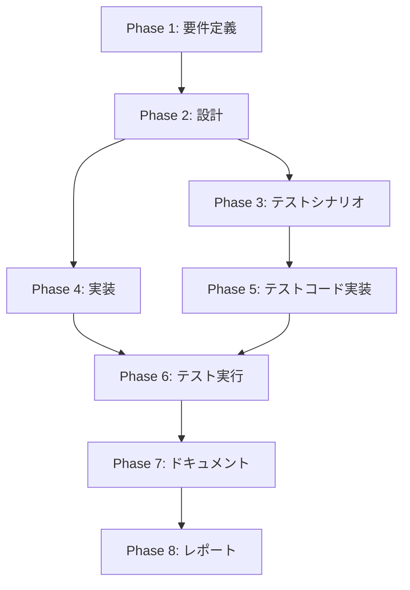
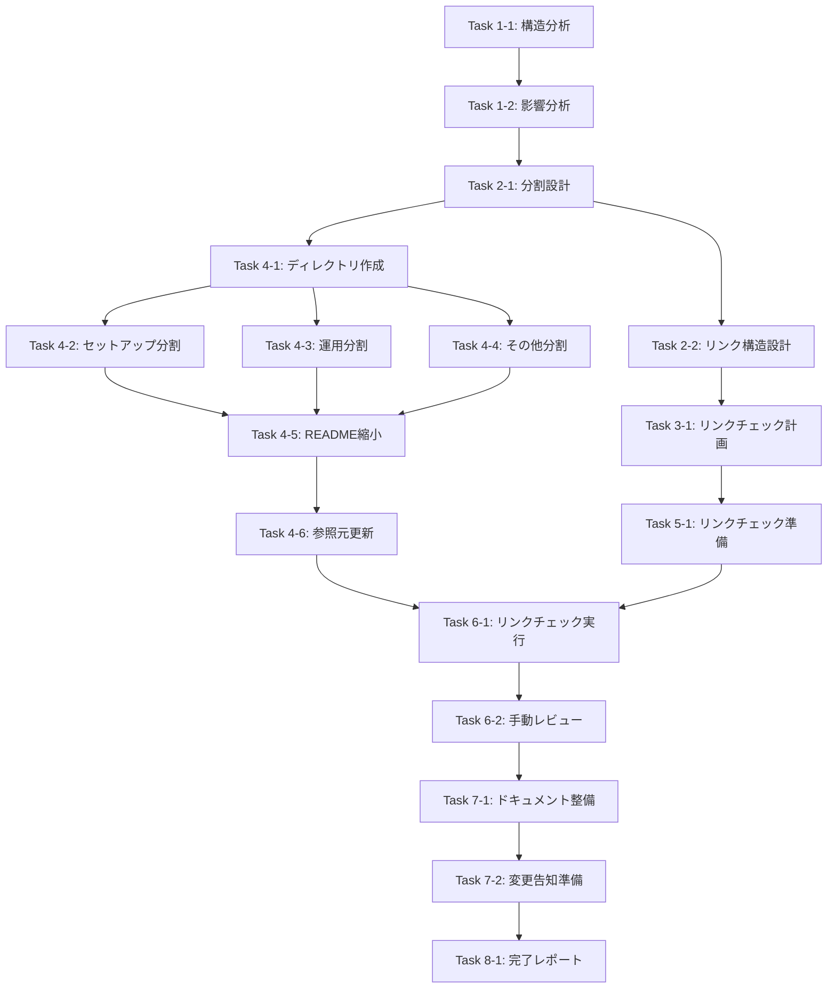

# プロジェクト計画書: Issue #538

## ファイルサイズの削減: README.md

**作成日**: 2025-12-27
**Issue**: [#538](https://github.com/tielec/infrastructure-as-code/issues/538)
**優先度**: medium

---

## 1. Issue分析

### 概要

README.mdが759行の単一ドキュメントに肥大化しており、以下の問題が発生している：
- セットアップ・ブートストラップ・AI Workflow移行履歴・運用手順が混在
- 役割別に必要情報へ辿り着きにくい
- 更新時に意図せぬ整合性崩壊や重複が生じやすい

### 現状分析結果

| 項目 | 現状 |
|------|------|
| README.md総行数 | 759行 |
| メインセクション数 | 11個（## レベル） |
| サブセクション数 | 30+個（### レベル） |
| docs/ディレクトリ | 1ファイルのみ（Issue分析用） |
| 内部リンク | 4-5個（ルート層ドキュメントへ） |

### セクション分類（分割対象）

| カテゴリ | 行番号範囲 | 推定行数 | 分割先 |
|----------|-----------|---------|--------|
| 変更履歴 | 11-30 | 20行 | docs/changelog.md |
| 前提条件 + EC2キーペア | 31-59 | 29行 | docs/setup/prerequisites.md |
| ブートストラップ構築 | 60-257 | 198行 | docs/setup/bootstrap.md |
| Pulumiバックエンド設定 | 258-311 | 54行 | docs/setup/pulumi-backend.md |
| Jenkinsインフラデプロイ | 312-430 | 119行 | docs/operations/jenkins-deploy.md |
| Jenkins環境運用管理 | 431-480 | 50行 | docs/operations/jenkins-management.md |
| ブートストラップ管理 | 481-519 | 39行 | docs/operations/bootstrap-management.md |
| インフラ削除 | 520-565 | 46行 | docs/operations/infrastructure-teardown.md |
| インフラ構成 | 566-672 | 107行 | docs/architecture/infrastructure.md |
| トラブルシューティング | 673-704 | 32行 | docs/troubleshooting.md |
| 共有パラメータ・注意事項 | 705-730 | 26行 | docs/operations/parameters.md |
| 拡張方法 | 731-759 | 29行 | docs/development/extension.md |

### 複雑度

**中程度**

理由：
- 複数ファイルの作成・修正が必要（10+ファイル）
- 既存ドキュメント構造への影響がある（CLAUDE.md等からの参照）
- リンク切れのリスクがある
- ただし、コードの変更ではなくドキュメント作業のため、テストは最小限

### 見積もり工数

**8-12時間**

| フェーズ | 見積もり |
|----------|---------|
| 要件定義 | 1h |
| 設計 | 1.5h |
| テストシナリオ（リンクチェック計画） | 0.5h |
| 実装（ドキュメント分割・作成） | 4-6h |
| テスト実行（リンクチェック） | 0.5h |
| ドキュメント（README更新、導線整備） | 1h |
| レポート | 0.5h |

### リスク評価

**中**

- リンク切れリスク（既存参照の破壊）
- 利用者の参照パス変更に伴う混乱
- CLAUDE.mdからの参照更新漏れ

---

## 2. 実装戦略判断

### 実装戦略: REFACTOR

**判断根拠**:
- 既存のREADME.md（759行）を複数のドキュメントに分割・再構成する作業
- 新規機能の追加ではなく、既存コンテンツの構造改善
- 情報アーキテクチャの再設計とドキュメント分割が中心
- 既存の文章内容はほぼそのまま維持し、配置場所を変更

### テスト戦略: INTEGRATION_ONLY

**判断根拠**:
- ドキュメントリファクタリングのため、コードのユニットテストは不要
- リンクチェック（内部・外部リンクの有効性確認）が主なテスト
- Markdown構文の検証
- CI/CDパイプラインでのリンクチェッカー実行に相当
- ユーザーストーリーやBDDテストは不要（ドキュメント作業のため）

### テストコード戦略: CREATE_TEST

**判断根拠**:
- 既存のテストファイルは存在しない（ドキュメントプロジェクト）
- リンクチェック用のスクリプト/設定を新規作成する可能性がある
- ただし、本質的には手動検証またはCIでのリンクチェッカー実行

---

## 3. 影響範囲分析

### 既存コードへの影響

| ファイル | 変更内容 | 影響度 |
|----------|---------|--------|
| README.md | 大幅縮小（759行 → 約100行） | 高 |
| CLAUDE.md | README.mdへの参照パス更新 | 中 |
| CONTRIBUTION.md | 影響なし（直接参照なし） | 低 |
| ARCHITECTURE.md | 影響なし（直接参照なし） | 低 |

### 新規作成ファイル

```
docs/
├── changelog.md                         # 変更履歴
├── troubleshooting.md                   # トラブルシューティング
├── setup/
│   ├── prerequisites.md                 # 前提条件
│   ├── bootstrap.md                     # ブートストラップ構築
│   └── pulumi-backend.md                # Pulumiバックエンド設定
├── operations/
│   ├── jenkins-deploy.md                # Jenkinsインフラデプロイ
│   ├── jenkins-management.md            # Jenkins環境運用管理
│   ├── bootstrap-management.md          # ブートストラップ管理
│   ├── infrastructure-teardown.md       # インフラ削除
│   └── parameters.md                    # 共有パラメータ・注意事項
├── architecture/
│   └── infrastructure.md                # インフラ構成
└── development/
    └── extension.md                     # 拡張方法
```

### 依存関係の変更

- **新規依存の追加**: なし
- **既存依存の変更**: なし
- **外部参照の変更**:
  - 社内WikiやCI/CDスクリプトがREADME.mdを参照している場合、リンク更新が必要
  - GitHub上での相対リンクが変更される

### マイグレーション要否

- **データベーススキーマ変更**: なし
- **設定ファイル変更**: なし
- **告知必要**: あり（利用者への参照パス変更の周知）

---

## 4. タスク分割

### Phase 1: 要件定義 (見積もり: 1h)

- [ ] Task 1-1: 現状ドキュメント構造の詳細分析 (0.5h)
  - README.mdの全セクションを役割別にタグ付け
  - 各セクションの依存関係を特定
  - 分割後のディレクトリ構造案を作成

- [ ] Task 1-2: 利害関係者への影響分析 (0.5h)
  - 既存の参照元ドキュメント（CLAUDE.md等）の影響確認
  - 外部参照（Wiki、CIスクリプト）の有無確認
  - 分割後のナビゲーション設計

### Phase 2: 設計 (見積もり: 1.5h)

- [ ] Task 2-1: ドキュメント分割設計 (1h)
  - 分割するセクションと分割先ファイルのマッピング表作成
  - ファイル命名規則の決定
  - ディレクトリ構造の最終決定

- [ ] Task 2-2: リンク構造設計 (0.5h)
  - README.mdからの目次・リンク構造設計
  - 各分割ドキュメント間の相互リンク設計
  - アンカーリンクの命名規則決定

### Phase 3: テストシナリオ (見積もり: 0.5h)

- [ ] Task 3-1: リンクチェック計画の作成 (0.5h)
  - 内部リンクのチェックリスト作成
  - 外部リンクのチェックリスト作成
  - Markdown構文検証項目の定義

### Phase 4: 実装 (見積もり: 4-6h)

- [x] Task 4-1: docs/ディレクトリ構造の作成 (0.5h)
  - docs/setup/, docs/operations/, docs/architecture/, docs/development/ の作成
  - 既存のdocs/issues/は維持

- [x] Task 4-2: セットアップ関連ドキュメントの分割 (1.5h)
  - docs/setup/prerequisites.md の作成（前提条件 + EC2キーペア）
  - docs/setup/bootstrap.md の作成（ブートストラップ構築手順）
  - docs/setup/pulumi-backend.md の作成（Pulumiバックエンド設定）

- [x] Task 4-3: 運用関連ドキュメントの分割 (1.5h)
  - docs/operations/jenkins-deploy.md の作成
  - docs/operations/jenkins-management.md の作成
  - docs/operations/bootstrap-management.md の作成
  - docs/operations/infrastructure-teardown.md の作成
  - docs/operations/parameters.md の作成

- [x] Task 4-4: その他ドキュメントの分割 (1h)
  - docs/changelog.md の作成（変更履歴）
  - docs/troubleshooting.md の作成
  - docs/architecture/infrastructure.md の作成
  - docs/development/extension.md の作成

- [x] Task 4-5: README.mdの縮小・再構成 (1h)
  - 概要セクションの維持
  - 目次（クイックナビゲーション）の作成
  - 各分割ドキュメントへのリンク追加
  - 重要なドキュメントセクションの更新

- [x] Task 4-6: 参照元ドキュメントの更新 (0.5h)
  - CLAUDE.mdのREADME.md参照箇所の確認・更新
  - 必要に応じて相対パスの修正

### Phase 5: テストコード実装 (見積もり: 0.5h)

- [x] Task 5-1: リンクチェックスクリプトの準備 (0.5h)
  - markdown-link-check または同等ツールの設定
  - チェック対象ファイルの指定

### Phase 6: テスト実行 (見積もり: 0.5h)

- [ ] Task 6-1: リンクチェックの実行 (0.25h)
  - 全Markdownファイルの内部リンク検証
  - 外部リンクの有効性確認

- [ ] Task 6-2: 手動レビュー (0.25h)
  - 分割後の各ドキュメントの可読性確認
  - ナビゲーションの使いやすさ確認

### Phase 7: ドキュメント (見積もり: 1h)

- [ ] Task 7-1: 分割後のドキュメント整備 (0.5h)
  - 各ドキュメントのヘッダー・フッター統一
  - 「親ドキュメントに戻る」リンクの追加

- [ ] Task 7-2: 変更告知の準備 (0.5h)
  - 変更内容のサマリー作成
  - 利用者向けの参照先変更ガイド作成

### Phase 8: レポート (見積もり: 0.5h)

- [ ] Task 8-1: 完了レポートの作成 (0.5h)
  - 実施内容のサマリー
  - 分割前後の比較
  - 今後の改善提案

---

## 5. 依存関係



### タスク間の詳細依存関係



---

## 6. リスクと軽減策

### リスク1: リンク切れの発生

- **影響度**: 高
- **確率**: 中
- **軽減策**:
  - 分割前に全リンクを洗い出しチェックリスト化
  - 分割後にmarkdown-link-checkを実行
  - 相対パスを統一的に管理（ルートからの相対パス使用）
  - アンカーリンクの命名規則を事前に決定

### リスク2: CLAUDE.mdからの参照破壊

- **影響度**: 高
- **確率**: 中
- **軽減策**:
  - CLAUDE.md内のREADME.md参照箇所を事前に全て特定
  - 分割時にCLAUDE.mdの更新を同時に実施
  - README.md内にリダイレクト的な注記を残す

### リスク3: 利用者の混乱

- **影響度**: 中
- **確率**: 中
- **軽減策**:
  - README.mdに明確な目次・ナビゲーションを設置
  - 「このドキュメントは移動しました」という注記を一時的に追加
  - 変更告知を事前に実施

### リスク4: 過度な分割による可読性低下

- **影響度**: 中
- **確率**: 低
- **軽減策**:
  - 1ドキュメントあたり100-200行を目安に分割
  - 論理的に関連するセクションは同一ファイルに維持
  - 各ドキュメントに「関連ドキュメント」セクションを追加

### リスク5: 外部参照（Wiki、CI）の破壊

- **影響度**: 中
- **確率**: 低（現状調査で明確な外部参照は未確認）
- **軽減策**:
  - 分割前にGitHub検索で外部参照を確認
  - 必要に応じて外部参照の更新依頼を発行
  - 重要なセクションへのアンカーリンクは維持

---

## 7. 品質ゲート

### Phase 1: 要件定義
- [x] README.mdの全セクションが役割別に分類されている
- [x] 分割後のディレクトリ構造案が作成されている
- [x] 参照元ドキュメント（CLAUDE.md等）への影響が特定されている

### Phase 2: 設計
- [x] 実装戦略（REFACTOR）の判断根拠が明記されている
- [x] テスト戦略（INTEGRATION_ONLY）の判断根拠が明記されている
- [x] 分割するセクションと分割先ファイルのマッピング表が完成している
- [x] リンク構造設計が完了している

### Phase 3: テストシナリオ
- [ ] 内部リンクのチェックリストが作成されている
- [ ] Markdown構文検証項目が定義されている

### Phase 4: 実装
- [ ] 全ての分割ドキュメントが作成されている
- [ ] README.mdが約100行以下に縮小されている
- [ ] 参照元ドキュメント（CLAUDE.md）が更新されている
- [ ] 各ドキュメントに適切なヘッダーが設定されている

### Phase 5: テストコード実装
- [ ] リンクチェックの実行方法が準備されている

### Phase 6: テスト実行
- [ ] 全ての内部リンクが有効であることが確認されている
- [ ] Markdown構文エラーがないことが確認されている
- [ ] ナビゲーションの使いやすさが確認されている

### Phase 7: ドキュメント
- [ ] 各ドキュメントのフォーマットが統一されている
- [ ] 「親ドキュメントに戻る」リンクが設置されている
- [ ] 変更告知内容が準備されている

### Phase 8: レポート
- [ ] 実施内容のサマリーが作成されている
- [ ] 分割前後の比較が記載されている

---

## 8. 成果物一覧

### 新規作成ファイル（12ファイル）

1. `docs/changelog.md`
2. `docs/troubleshooting.md`
3. `docs/setup/prerequisites.md`
4. `docs/setup/bootstrap.md`
5. `docs/setup/pulumi-backend.md`
6. `docs/operations/jenkins-deploy.md`
7. `docs/operations/jenkins-management.md`
8. `docs/operations/bootstrap-management.md`
9. `docs/operations/infrastructure-teardown.md`
10. `docs/operations/parameters.md`
11. `docs/architecture/infrastructure.md`
12. `docs/development/extension.md`

### 変更ファイル（2ファイル）

1. `README.md` - 大幅縮小（759行 → 約100行）
2. `CLAUDE.md` - 参照パス更新（必要に応じて）

### 確認ファイル（変更なし）

1. `CONTRIBUTION.md` - 影響なし確認
2. `ARCHITECTURE.md` - 影響なし確認

---

## 9. 備考

### 分割の優先順位

1. **最優先**: セットアップ関連（新規ユーザーが最初に参照）
2. **高優先**: 運用関連（日常的に参照される）
3. **中優先**: トラブルシューティング、インフラ構成
4. **低優先**: 変更履歴、拡張方法

### 命名規則

- ファイル名: kebab-case（例: `jenkins-deploy.md`）
- ディレクトリ名: lowercase単語（例: `setup/`, `operations/`）
- アンカー: kebab-case（例: `#ec2-key-pair-creation`）

### 将来の改善提案

- docs/内にINDEX.mdを作成し、全ドキュメントの索引を提供
- MkDocsやDocsifyなどの静的サイトジェネレーターの導入検討
- バージョン管理されたドキュメント（リリースごとのスナップショット）

---

**計画書作成完了**: 2025-12-27
**次のステップ**: Phase 1（要件定義）の実施
