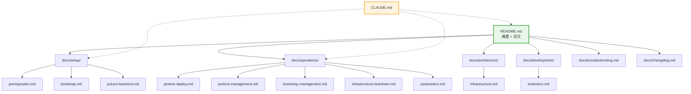
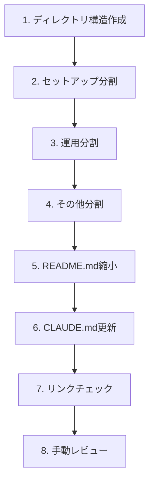

# 詳細設計書: Issue #538

## ファイルサイズの削減: README.md

**作成日**: 2025-12-27
**Issue**: [#538](https://github.com/tielec/infrastructure-as-code/issues/538)
**優先度**: medium
**分類**: refactor, code-quality

---

## 0. Planning Document確認

Planning Documentで策定された戦略を以下に確認・踏襲します。

| 項目 | 内容 |
|------|------|
| 実装戦略 | REFACTOR |
| テスト戦略 | INTEGRATION_ONLY |
| 見積もり工数 | 8-12時間 |
| 複雑度 | 中程度 |

---

## 1. アーキテクチャ設計

### 1.1 システム全体図

```
infrastructure-as-code/
├── README.md                    # 概要 + 目次（約100行に縮小）
├── ARCHITECTURE.md              # 既存（変更なし）
├── CLAUDE.md                    # 参照更新が必要
├── CONTRIBUTION.md              # 既存（変更なし）
│
└── docs/
    ├── issues/                  # 既存（維持）
    │   └── 497/
    │       └── current-analysis.md
    │
    ├── changelog.md             # 新規: 変更履歴
    ├── troubleshooting.md       # 新規: トラブルシューティング
    │
    ├── setup/                   # 新規: セットアップ関連
    │   ├── prerequisites.md     # 前提条件 + EC2キーペア
    │   ├── bootstrap.md         # ブートストラップ構築
    │   └── pulumi-backend.md    # Pulumiバックエンド設定
    │
    ├── operations/              # 新規: 運用関連
    │   ├── jenkins-deploy.md    # Jenkinsインフラデプロイ
    │   ├── jenkins-management.md # Jenkins環境運用管理
    │   ├── bootstrap-management.md # ブートストラップ管理
    │   ├── infrastructure-teardown.md # インフラ削除
    │   └── parameters.md        # 共有パラメータ・注意事項
    │
    ├── architecture/            # 新規: アーキテクチャ関連
    │   └── infrastructure.md    # インフラ構成
    │
    └── development/             # 新規: 開発関連
        └── extension.md         # 拡張方法
```

### 1.2 コンポーネント間の関係



### 1.3 データフロー（ナビゲーションフロー）

```
ユーザーエントリーポイント
         │
         ▼
    README.md（概要 + 目次）
         │
    ┌────┼────┬─────┬─────┬──────┐
    ▼    ▼    ▼     ▼     ▼      ▼
 Setup  Ops  Arch  Dev  Trouble Change
    │    │    │     │     │      │
    ▼    ▼    ▼     ▼     ▼      ▼
 詳細  詳細  詳細  詳細   詳細   詳細
ドキュメント群
         │
         ▼
   README.md へ戻る（各ドキュメントにリンク）
```

---

## 2. 戦略判断

### 2.1 実装戦略: REFACTOR

**判断根拠**:
- 既存のREADME.md（759行）を複数のドキュメントに分割・再構成する作業
- 新規機能の追加ではなく、既存コンテンツの構造改善が主目的
- 情報アーキテクチャの再設計とドキュメント分割が中心
- 既存の文章内容はほぼそのまま維持し、配置場所を変更
- コードの変更は伴わない

### 2.2 テスト戦略: INTEGRATION_ONLY

**判断根拠**:
- ドキュメントリファクタリングのため、コードのユニットテストは不要
- リンクチェック（内部・外部リンクの有効性確認）が主なテスト
- Markdown構文の検証
- 手動レビューによるナビゲーション確認
- ユーザーストーリーやBDDテストは不要（ドキュメント作業のため）

### 2.3 テストコード戦略: CREATE_TEST

**判断根拠**:
- 既存のテストファイルは存在しない（ドキュメントプロジェクト）
- リンクチェック用のスクリプト/設定を新規作成する可能性がある
- 本質的には手動検証またはCIでのリンクチェッカー実行
- 今回の実装では、チェックリストベースの手動テストを採用

---

## 3. 影響範囲分析

### 3.1 既存コードへの影響

| ファイル | 変更内容 | 影響度 | 理由 |
|----------|---------|--------|------|
| README.md | 大幅縮小（759行 → 約100行） | **高** | 主要な変更対象 |
| CLAUDE.md | README.mdへの参照パス更新 | **中** | 行29, 209, 213, 481等で参照 |
| CONTRIBUTION.md | 影響なし | **低** | README.mdへの直接参照なし |
| ARCHITECTURE.md | 影響なし | **低** | README.mdへの直接参照なし |

### 3.2 CLAUDE.mdの参照更新詳細

CLAUDE.mdには以下のREADME.md参照があり、更新が必要な可能性があります：

| 行番号 | 参照内容 | 更新要否 |
|--------|---------|---------|
| 29 | Bootstrap修正時のREADME.md更新チェック | 維持（README.mdは存在し続ける） |
| 209 | Bootstrap更新時のREADME.md更新確認 | 維持（README.mdは存在し続ける） |
| 213 | `vi README.md` 編集指示 | 必要に応じてdocs/への参照を追加 |
| 481 | ドキュメント責任分担の原則 | 維持（README.mdの役割は変わらない） |

**結論**: CLAUDE.mdの内容は基本的に維持可能。README.mdは概要+目次として残るため、既存の参照は有効。ただし、具体的な手順への参照が必要な場合はdocs/配下へのリンクを追加する可能性あり。

### 3.3 依存関係の変更

- **新規依存の追加**: なし
- **既存依存の変更**: なし
- **外部参照の変更**:
  - 社内WikiやCI/CDスクリプトがREADME.mdを参照している場合、リンク更新が必要
  - GitHub上での相対リンクが変更される

### 3.4 マイグレーション要否

| 項目 | 要否 | 詳細 |
|------|------|------|
| データベーススキーマ変更 | なし | - |
| 設定ファイル変更 | なし | - |
| 告知必要 | **あり** | 利用者への参照パス変更の周知 |

---

## 4. 変更・追加ファイルリスト

### 4.1 新規作成ファイル（12ファイル）

| # | ファイルパス | 内容 | 行数目安 |
|---|-------------|------|----------|
| 1 | `docs/changelog.md` | 変更履歴 | 20行 |
| 2 | `docs/troubleshooting.md` | トラブルシューティング | 32行 |
| 3 | `docs/setup/prerequisites.md` | 前提条件 + EC2キーペア | 29行 |
| 4 | `docs/setup/bootstrap.md` | ブートストラップ構築 | 198行 |
| 5 | `docs/setup/pulumi-backend.md` | Pulumiバックエンド設定 | 54行 |
| 6 | `docs/operations/jenkins-deploy.md` | Jenkinsインフラデプロイ | 119行 |
| 7 | `docs/operations/jenkins-management.md` | Jenkins環境運用管理 | 50行 |
| 8 | `docs/operations/bootstrap-management.md` | ブートストラップ管理 | 39行 |
| 9 | `docs/operations/infrastructure-teardown.md` | インフラ削除 | 46行 |
| 10 | `docs/operations/parameters.md` | 共有パラメータ・注意事項 | 26行 |
| 11 | `docs/architecture/infrastructure.md` | インフラ構成 | 107行 |
| 12 | `docs/development/extension.md` | 拡張方法 | 29行 |

### 4.2 修正が必要な既存ファイル（2ファイル）

| # | ファイルパス | 変更内容 |
|---|-------------|----------|
| 1 | `README.md` | 大幅縮小（759行 → 約100行）、目次構造への変換 |
| 2 | `CLAUDE.md` | 必要に応じてdocs/への参照を追加（軽微） |

### 4.3 削除が必要なファイル

なし（内容は移動のみ）

### 4.4 確認ファイル（変更なし）

| # | ファイルパス | 確認内容 |
|---|-------------|----------|
| 1 | `CONTRIBUTION.md` | 影響なし確認 |
| 2 | `ARCHITECTURE.md` | 影響なし確認 |

---

## 5. 詳細設計

### 5.1 README.mdの新構造設計

```markdown
# Jenkins CI/CD インフラストラクチャ構築

概要（2-3段落）

## 📚 重要なドキュメント

（既存のリンク維持）

## 📋 クイックナビゲーション

### セットアップ（初回構築）
- [前提条件](docs/setup/prerequisites.md)
- [ブートストラップ構築](docs/setup/bootstrap.md)
- [Pulumiバックエンド設定](docs/setup/pulumi-backend.md)

### 運用
- [Jenkinsインフラデプロイ](docs/operations/jenkins-deploy.md)
- [Jenkins環境運用管理](docs/operations/jenkins-management.md)
- [ブートストラップ管理](docs/operations/bootstrap-management.md)
- [インフラ削除](docs/operations/infrastructure-teardown.md)
- [共有パラメータ](docs/operations/parameters.md)

### リファレンス
- [インフラ構成](docs/architecture/infrastructure.md)
- [拡張方法](docs/development/extension.md)
- [トラブルシューティング](docs/troubleshooting.md)
- [変更履歴](docs/changelog.md)
```

### 5.2 分割ドキュメントの共通フォーマット

各分割ドキュメントは以下のフォーマットに統一します：

```markdown
# タイトル

> 📖 **親ドキュメント**: [README.md](../README.md) または [README.md](../../README.md)

## 概要

（セクションの目的を1-2文で説明）

---

（本文コンテンツ）

---

## 関連ドキュメント

- [関連ドキュメント1](リンク)
- [関連ドキュメント2](リンク)
```

### 5.3 セクション分割マッピング

| 現README行範囲 | 分割先 | セクション名 |
|---------------|--------|------------|
| 11-30 | `docs/changelog.md` | 変更履歴 |
| 31-59 | `docs/setup/prerequisites.md` | 前提条件 + EC2キーペア |
| 60-257 | `docs/setup/bootstrap.md` | ブートストラップ構築 |
| 258-311 | `docs/setup/pulumi-backend.md` | Pulumiバックエンド設定 |
| 312-430 | `docs/operations/jenkins-deploy.md` | Jenkinsインフラデプロイ |
| 431-480 | `docs/operations/jenkins-management.md` | Jenkins環境運用管理 |
| 481-519 | `docs/operations/bootstrap-management.md` | ブートストラップ管理 |
| 520-565 | `docs/operations/infrastructure-teardown.md` | インフラ削除 |
| 566-672 | `docs/architecture/infrastructure.md` | インフラ構成 |
| 673-704 | `docs/troubleshooting.md` | トラブルシューティング |
| 705-730 | `docs/operations/parameters.md` | 共有パラメータ・注意事項 |
| 731-759 | `docs/development/extension.md` | 拡張方法 |

### 5.4 リンク構造設計

#### 内部リンクパス規則

```
README.md から docs/ 内へ:
  docs/setup/prerequisites.md

docs/setup/ から README.md へ:
  ../../README.md

docs/setup/ から docs/operations/ へ:
  ../operations/jenkins-deploy.md

docs/ 直下から README.md へ:
  ../README.md
```

#### アンカー命名規則

- kebab-case を使用（例: `#ec2-key-pair-creation`）
- 日本語アンカーは避け、英語表記を使用
- 既存のアンカー形式を踏襲

---

## 6. セキュリティ考慮事項

### 6.1 認証・認可

- **該当なし**: ドキュメントのリファクタリングのため、認証・認可に関する変更はなし

### 6.2 データ保護

- **機密情報の確認**: 分割時に機密情報（APIキー、パスワードなど）がドキュメントに含まれていないことを確認
- **コマンド例の確認**: サンプルコマンドに実際の認証情報が含まれていないことを確認

### 6.3 セキュリティリスクと対策

| リスク | 対策 |
|--------|------|
| 機密情報の誤公開 | 分割時にセンシティブ情報をレビュー |
| 参照先の誤り | リンクチェックで検証 |

---

## 7. 非機能要件への対応

### 7.1 パフォーマンス

- **ページ読み込み**: 各ドキュメントを100-200行に制限することで、GitHub上での表示パフォーマンスを維持
- **検索性**: 目的別に分割することで、必要情報への到達時間を短縮

### 7.2 スケーラビリティ

- **拡張可能なディレクトリ構造**: 新規ドキュメントを追加しやすい構造
- **命名規則の一貫性**: 新規ファイル追加時のガイドラインを明確化

### 7.3 保守性

| 項目 | 対応 |
|------|------|
| ファイル命名規則 | kebab-case（例: `jenkins-deploy.md`） |
| ディレクトリ命名規則 | lowercase単語（例: `setup/`, `operations/`） |
| フォーマット統一 | 各ドキュメントに共通ヘッダー・フッター |
| 更新責任範囲 | 各ドキュメントの責任範囲を明確化 |

---

## 8. 実装の順序

### 8.1 推奨実装順序



### 8.2 詳細実装ステップ

| ステップ | 内容 | 見積もり時間 |
|----------|------|-------------|
| 1 | `docs/setup/`, `docs/operations/`, `docs/architecture/`, `docs/development/` ディレクトリ作成 | 0.5h |
| 2 | セットアップ関連ドキュメント分割（prerequisites, bootstrap, pulumi-backend） | 1.5h |
| 3 | 運用関連ドキュメント分割（jenkins-deploy, jenkins-management, bootstrap-management, infrastructure-teardown, parameters） | 1.5h |
| 4 | その他ドキュメント分割（changelog, troubleshooting, infrastructure, extension） | 1h |
| 5 | README.md縮小・再構成（目次作成、リンク追加） | 1h |
| 6 | CLAUDE.md参照更新（必要に応じて） | 0.5h |
| 7 | リンクチェック実行 | 0.5h |
| 8 | 手動レビュー・修正 | 0.5h |

**合計**: 約7時間（バッファ込みで8-10時間）

### 8.3 依存関係の考慮

- **Step 1 → Step 2-4**: ディレクトリが存在しないとファイル作成ができない
- **Step 2-4 → Step 5**: 分割ドキュメントが完成しないとREADME.mdのリンクが正しく設定できない
- **Step 5 → Step 6**: README.mdの構造確定後にCLAUDE.mdを更新
- **Step 2-6 → Step 7**: 全ファイル完成後にリンクチェック

---

## 9. テスト計画

### 9.1 リンクチェックリスト

#### 内部リンク

| 対象ファイル | チェック内容 |
|-------------|-------------|
| README.md | docs/配下の全12ファイルへのリンク |
| docs/changelog.md | README.mdへの戻りリンク |
| docs/troubleshooting.md | README.mdへの戻りリンク |
| docs/setup/*.md (3ファイル) | README.md、関連ドキュメントへのリンク |
| docs/operations/*.md (5ファイル) | README.md、関連ドキュメントへのリンク |
| docs/architecture/*.md (1ファイル) | README.md、関連ドキュメントへのリンク |
| docs/development/*.md (1ファイル) | README.md、関連ドキュメントへのリンク |
| CLAUDE.md | README.md参照の有効性 |

#### 外部リンク

| リンク | チェック内容 |
|--------|-------------|
| GitHub Issues | #411, #415 への参照 |
| OpenAI Platform | https://platform.openai.com/api-keys |
| GitHub Apps | https://github.com/settings/apps |

### 9.2 Markdown構文検証

- 見出しレベルの一貫性
- コードブロックの正しい構文ハイライト指定
- リストのフォーマット統一
- テーブルの列揃え

### 9.3 ナビゲーション確認

- README.mdから各分割ドキュメントへ2クリック以内でアクセス可能
- 各分割ドキュメントからREADME.mdへ1クリックで戻れる
- 関連ドキュメント間のクロスリンクが適切

---

## 10. 品質ゲート確認

### Phase 2: 設計の品質ゲート

- [x] **実装戦略の判断根拠が明記されている**: セクション2.1でREFACTORを選択し、4つの理由を明記
- [x] **テスト戦略の判断根拠が明記されている**: セクション2.2でINTEGRATION_ONLYを選択し、5つの理由を明記
- [x] **既存コードへの影響範囲が分析されている**: セクション3で詳細分析（CLAUDE.md参照更新含む）
- [x] **変更が必要なファイルがリストアップされている**: セクション4で新規12ファイル、変更2ファイルを明記
- [x] **設計が実装可能である**: セクション5で詳細設計、セクション8で具体的な実装順序を提示

---

## 11. リスクと軽減策

### 11.1 リンク切れの発生

- **影響度**: 高
- **確率**: 中
- **軽減策**:
  - 分割後にmarkdown-link-checkまたは手動チェックを実行
  - 相対パスを統一的に管理
  - 実装時にこまめにプレビュー確認

### 11.2 CLAUDE.mdからの参照不整合

- **影響度**: 高
- **確率**: 低
- **軽減策**:
  - CLAUDE.md内のREADME.md参照は基本的に維持可能と分析済み
  - 必要に応じてdocs/配下への追加参照を設置
  - 分割後にCLAUDE.mdを手動レビュー

### 11.3 利用者の混乱

- **影響度**: 中
- **確率**: 中
- **軽減策**:
  - README.mdに明確な目次・ナビゲーションを設置
  - 各分割ドキュメントに「親ドキュメントに戻る」リンクを追加
  - 変更告知を事前に実施

---

## 12. 成果物サマリー

| カテゴリ | ファイル数 | 詳細 |
|----------|-----------|------|
| 新規作成 | 12 | docs/配下の分割ドキュメント |
| 変更 | 2 | README.md, CLAUDE.md |
| 確認のみ | 2 | CONTRIBUTION.md, ARCHITECTURE.md |
| **合計** | **16** | |

---

**設計書作成完了**: 2025-12-27
**次のステップ**: Phase 3（テストシナリオ）またはPhase 4（実装）の実施
