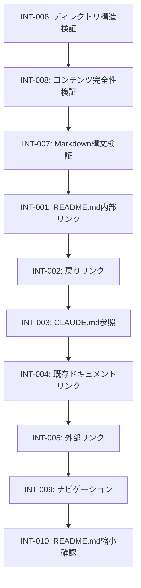

# テストシナリオ: Issue #538

## ファイルサイズの削減: README.md

**作成日**: 2025-12-27
**Issue**: [#538](https://github.com/tielec/infrastructure-as-code/issues/538)
**優先度**: medium
**分類**: refactor, code-quality

---

## 1. テスト戦略サマリー

### 1.1 選択されたテスト戦略

**テスト戦略**: INTEGRATION_ONLY

**判断根拠（Phase 2設計書より）**:
- ドキュメントリファクタリングのため、コードのユニットテストは不要
- リンクチェック（内部・外部リンクの有効性確認）が主なテスト
- Markdown構文の検証
- 手動レビューによるナビゲーション確認
- ユーザーストーリーやBDDテストは不要（ドキュメント作業のため）

### 1.2 テスト対象の範囲

| カテゴリ | 対象ファイル数 | 内容 |
|----------|---------------|------|
| 新規作成 | 12ファイル | docs/配下の分割ドキュメント |
| 変更 | 2ファイル | README.md, CLAUDE.md |
| 確認のみ | 2ファイル | CONTRIBUTION.md, ARCHITECTURE.md |

### 1.3 テストの目的

1. **リンク整合性**: 全ての内部・外部リンクが有効であることを確認
2. **Markdown構文**: 全ドキュメントがMarkdown構文に準拠していることを確認
3. **ナビゲーション**: ユーザーが目的の情報に効率的に到達できることを確認
4. **コンテンツ完全性**: 分割時に情報が欠落していないことを確認

---

## 2. Integrationテストシナリオ

### 2.1 内部リンクチェック

#### シナリオ INT-001: README.mdから分割ドキュメントへのリンク

**目的**: README.mdから各分割ドキュメントへのリンクが全て有効であることを確認

**前提条件**:
- 全ての分割ドキュメントが作成済み
- README.mdが新しい構造に更新済み

**テスト手順**:

| ステップ | 操作 | 確認内容 |
|----------|------|----------|
| 1 | README.mdを開く | ファイルが存在し、読み込み可能 |
| 2 | `docs/changelog.md`へのリンクをクリック | リンク先が存在し、内容が表示される |
| 3 | `docs/troubleshooting.md`へのリンクをクリック | リンク先が存在し、内容が表示される |
| 4 | `docs/setup/prerequisites.md`へのリンクをクリック | リンク先が存在し、内容が表示される |
| 5 | `docs/setup/bootstrap.md`へのリンクをクリック | リンク先が存在し、内容が表示される |
| 6 | `docs/setup/pulumi-backend.md`へのリンクをクリック | リンク先が存在し、内容が表示される |
| 7 | `docs/operations/jenkins-deploy.md`へのリンクをクリック | リンク先が存在し、内容が表示される |
| 8 | `docs/operations/jenkins-management.md`へのリンクをクリック | リンク先が存在し、内容が表示される |
| 9 | `docs/operations/bootstrap-management.md`へのリンクをクリック | リンク先が存在し、内容が表示される |
| 10 | `docs/operations/infrastructure-teardown.md`へのリンクをクリック | リンク先が存在し、内容が表示される |
| 11 | `docs/operations/parameters.md`へのリンクをクリック | リンク先が存在し、内容が表示される |
| 12 | `docs/architecture/infrastructure.md`へのリンクをクリック | リンク先が存在し、内容が表示される |
| 13 | `docs/development/extension.md`へのリンクをクリック | リンク先が存在し、内容が表示される |

**期待結果**:
- 全12個のリンクが有効（404エラーなし）
- 各リンク先のドキュメントが正しく表示される

**確認項目チェックリスト**:
- [ ] `docs/changelog.md` へのリンク有効
- [ ] `docs/troubleshooting.md` へのリンク有効
- [ ] `docs/setup/prerequisites.md` へのリンク有効
- [ ] `docs/setup/bootstrap.md` へのリンク有効
- [ ] `docs/setup/pulumi-backend.md` へのリンク有効
- [ ] `docs/operations/jenkins-deploy.md` へのリンク有効
- [ ] `docs/operations/jenkins-management.md` へのリンク有効
- [ ] `docs/operations/bootstrap-management.md` へのリンク有効
- [ ] `docs/operations/infrastructure-teardown.md` へのリンク有効
- [ ] `docs/operations/parameters.md` へのリンク有効
- [ ] `docs/architecture/infrastructure.md` へのリンク有効
- [ ] `docs/development/extension.md` へのリンク有効

---

#### シナリオ INT-002: 分割ドキュメントからREADME.mdへの戻りリンク

**目的**: 各分割ドキュメントからREADME.mdへ戻れることを確認

**前提条件**:
- 全ての分割ドキュメントに「親ドキュメントに戻る」リンクが設置済み

**テスト手順**:

| ステップ | 操作 | 確認内容 |
|----------|------|----------|
| 1 | `docs/changelog.md`を開き、README.mdリンクをクリック | README.mdに戻れる |
| 2 | `docs/troubleshooting.md`を開き、README.mdリンクをクリック | README.mdに戻れる |
| 3 | `docs/setup/prerequisites.md`を開き、README.mdリンクをクリック | README.mdに戻れる |
| 4 | `docs/setup/bootstrap.md`を開き、README.mdリンクをクリック | README.mdに戻れる |
| 5 | `docs/setup/pulumi-backend.md`を開き、README.mdリンクをクリック | README.mdに戻れる |
| 6 | `docs/operations/jenkins-deploy.md`を開き、README.mdリンクをクリック | README.mdに戻れる |
| 7 | `docs/operations/jenkins-management.md`を開き、README.mdリンクをクリック | README.mdに戻れる |
| 8 | `docs/operations/bootstrap-management.md`を開き、README.mdリンクをクリック | README.mdに戻れる |
| 9 | `docs/operations/infrastructure-teardown.md`を開き、README.mdリンクをクリック | README.mdに戻れる |
| 10 | `docs/operations/parameters.md`を開き、README.mdリンクをクリック | README.mdに戻れる |
| 11 | `docs/architecture/infrastructure.md`を開き、README.mdリンクをクリック | README.mdに戻れる |
| 12 | `docs/development/extension.md`を開き、README.mdリンクをクリック | README.mdに戻れる |

**期待結果**:
- 全12個の分割ドキュメントからREADME.mdへの戻りリンクが有効
- 相対パスが正しく設定されている（`../README.md`または`../../README.md`）

**確認項目チェックリスト**:
- [ ] docs/直下のファイル（2ファイル）: `../README.md`パスが有効
- [ ] docs/setup/のファイル（3ファイル）: `../../README.md`パスが有効
- [ ] docs/operations/のファイル（5ファイル）: `../../README.md`パスが有効
- [ ] docs/architecture/のファイル（1ファイル）: `../../README.md`パスが有効
- [ ] docs/development/のファイル（1ファイル）: `../../README.md`パスが有効

---

#### シナリオ INT-003: CLAUDE.mdの参照整合性

**目的**: CLAUDE.md内のREADME.md参照が有効であることを確認

**前提条件**:
- CLAUDE.mdが必要に応じて更新済み
- README.mdの新構造が反映済み

**テスト手順**:

| ステップ | 操作 | 確認内容 |
|----------|------|----------|
| 1 | CLAUDE.mdを開く | ファイルが存在し、読み込み可能 |
| 2 | 行29のREADME.md参照を確認 | Bootstrap修正時のチェック項目として有効 |
| 3 | 行209のREADME.md参照を確認 | Bootstrap更新時の確認項目として有効 |
| 4 | 行213の`vi README.md`指示を確認 | README.mdへの編集指示が適切 |
| 5 | 行481のドキュメント責任分担を確認 | README.mdの役割説明が正確 |
| 6 | README.mdへの全リンクをクリック | リンク先が存在し、正しく表示される |

**期待結果**:
- CLAUDE.md内のREADME.md参照が全て有効
- README.mdの新しい役割（概要+目次）を反映した内容

**確認項目チェックリスト**:
- [ ] 行29: Bootstrap修正時のREADME.md更新チェック参照
- [ ] 行209: Bootstrap更新時のREADME.md更新確認参照
- [ ] 行213: `vi README.md`編集指示
- [ ] 行481: ドキュメント責任分担の原則記載
- [ ] 全てのREADME.mdリンクが有効

---

#### シナリオ INT-004: 既存ドキュメントへのリンク維持

**目的**: README.mdから既存ドキュメントへのリンクが維持されていることを確認

**前提条件**:
- README.mdの「重要なドキュメント」セクションが維持済み

**テスト手順**:

| ステップ | 操作 | 確認内容 |
|----------|------|----------|
| 1 | README.mdを開く | 「重要なドキュメント」セクションが存在 |
| 2 | ARCHITECTURE.mdへのリンクをクリック | リンク先が存在し、内容が表示される |
| 3 | CLAUDE.mdへのリンクをクリック | リンク先が存在し、内容が表示される |
| 4 | CONTRIBUTION.mdへのリンクをクリック | リンク先が存在し、内容が表示される |

**期待結果**:
- 既存の重要ドキュメントへのリンクが全て維持されている
- リンク先の内容に変更がない

**確認項目チェックリスト**:
- [ ] ARCHITECTURE.mdへのリンク有効
- [ ] CLAUDE.mdへのリンク有効
- [ ] CONTRIBUTION.mdへのリンク有効

---

### 2.2 外部リンクチェック

#### シナリオ INT-005: 外部リンクの有効性確認

**目的**: 分割後のドキュメント内の外部リンクが有効であることを確認

**前提条件**:
- 分割ドキュメントが作成済み
- インターネット接続が利用可能

**テスト手順**:

| ステップ | 対象ファイル | 外部リンク | 確認内容 |
|----------|-------------|-----------|----------|
| 1 | docs/changelog.md | GitHub Issues (#411, #415) | Issue ページが表示される |
| 2 | docs/setup/prerequisites.md | OpenAI Platform | https://platform.openai.com/api-keys が表示される |
| 3 | docs/setup/bootstrap.md | GitHub Apps | https://github.com/settings/apps が表示される |

**期待結果**:
- 全ての外部リンクがHTTP 200ステータスを返す
- リンク先のコンテンツが期待通りに表示される

**確認項目チェックリスト**:
- [ ] GitHub Issue #411 リンク有効
- [ ] GitHub Issue #415 リンク有効
- [ ] OpenAI Platform リンク有効
- [ ] GitHub Apps リンク有効

---

### 2.3 ディレクトリ構造検証

#### シナリオ INT-006: ディレクトリ構造の作成確認

**目的**: 計画通りのディレクトリ構造が作成されていることを確認

**前提条件**:
- ドキュメント分割が完了

**テスト手順**:

| ステップ | 操作 | 確認内容 |
|----------|------|----------|
| 1 | `docs/`ディレクトリの存在確認 | ディレクトリが存在 |
| 2 | `docs/setup/`ディレクトリの存在確認 | ディレクトリが存在 |
| 3 | `docs/operations/`ディレクトリの存在確認 | ディレクトリが存在 |
| 4 | `docs/architecture/`ディレクトリの存在確認 | ディレクトリが存在 |
| 5 | `docs/development/`ディレクトリの存在確認 | ディレクトリが存在 |
| 6 | `docs/issues/`ディレクトリの維持確認 | 既存ディレクトリが維持されている |

**期待結果**:
```
docs/
├── issues/                  # 既存（維持）
├── setup/                   # 新規
├── operations/              # 新規
├── architecture/            # 新規
├── development/             # 新規
├── changelog.md             # 新規
└── troubleshooting.md       # 新規
```

**確認項目チェックリスト**:
- [ ] `docs/setup/` ディレクトリ存在
- [ ] `docs/operations/` ディレクトリ存在
- [ ] `docs/architecture/` ディレクトリ存在
- [ ] `docs/development/` ディレクトリ存在
- [ ] `docs/issues/` ディレクトリ維持

---

### 2.4 Markdown構文検証

#### シナリオ INT-007: Markdown構文の正確性

**目的**: 全ドキュメントがMarkdown構文に準拠していることを確認

**前提条件**:
- 全てのドキュメントが作成済み

**テスト手順**:

| ステップ | チェック項目 | 確認内容 |
|----------|-------------|----------|
| 1 | 見出しレベル | `#`から始まり、レベルが適切に設定されている |
| 2 | コードブロック | ` ``` `で囲まれ、言語指定がある |
| 3 | リスト | `-`または`1.`で始まり、インデントが正しい |
| 4 | テーブル | パイプ`|`で区切られ、ヘッダー行がある |
| 5 | リンク | `[テキスト](URL)`形式で記述されている |
| 6 | 強調 | `**太字**`または`*イタリック*`で正しく記述 |

**対象ファイル**:
1. README.md
2. docs/changelog.md
3. docs/troubleshooting.md
4. docs/setup/prerequisites.md
5. docs/setup/bootstrap.md
6. docs/setup/pulumi-backend.md
7. docs/operations/jenkins-deploy.md
8. docs/operations/jenkins-management.md
9. docs/operations/bootstrap-management.md
10. docs/operations/infrastructure-teardown.md
11. docs/operations/parameters.md
12. docs/architecture/infrastructure.md
13. docs/development/extension.md

**期待結果**:
- Markdown Linter実行時にエラーが0件
- GitHub上で正しくレンダリングされる

**確認項目チェックリスト**:
- [ ] 全ファイルで見出しレベルが一貫している
- [ ] コードブロックに言語指定がある
- [ ] リストのインデントが正しい
- [ ] テーブルのフォーマットが正しい
- [ ] リンク構文が正しい
- [ ] 強調構文が正しい

---

### 2.5 コンテンツ完全性検証

#### シナリオ INT-008: 分割コンテンツの完全性

**目的**: 元のREADME.mdの内容が分割後も欠落なく保持されていることを確認

**前提条件**:
- 元のREADME.md（759行）のバックアップが利用可能
- 分割ドキュメントが全て作成済み

**テスト手順**:

| ステップ | 元セクション（行範囲） | 分割先 | 確認内容 |
|----------|----------------------|--------|----------|
| 1 | 変更履歴（11-30行） | docs/changelog.md | 内容が完全に移動 |
| 2 | 前提条件（31-59行） | docs/setup/prerequisites.md | 内容が完全に移動 |
| 3 | ブートストラップ構築（60-257行） | docs/setup/bootstrap.md | 内容が完全に移動 |
| 4 | Pulumiバックエンド設定（258-311行） | docs/setup/pulumi-backend.md | 内容が完全に移動 |
| 5 | Jenkinsインフラデプロイ（312-430行） | docs/operations/jenkins-deploy.md | 内容が完全に移動 |
| 6 | Jenkins環境運用管理（431-480行） | docs/operations/jenkins-management.md | 内容が完全に移動 |
| 7 | ブートストラップ管理（481-519行） | docs/operations/bootstrap-management.md | 内容が完全に移動 |
| 8 | インフラ削除（520-565行） | docs/operations/infrastructure-teardown.md | 内容が完全に移動 |
| 9 | インフラ構成（566-672行） | docs/architecture/infrastructure.md | 内容が完全に移動 |
| 10 | トラブルシューティング（673-704行） | docs/troubleshooting.md | 内容が完全に移動 |
| 11 | 共有パラメータ（705-730行） | docs/operations/parameters.md | 内容が完全に移動 |
| 12 | 拡張方法（731-759行） | docs/development/extension.md | 内容が完全に移動 |

**期待結果**:
- 全てのセクション内容が分割先に完全に移動
- 情報の欠落がない
- コマンド例やコードブロックが正確に維持

**確認項目チェックリスト**:
- [ ] docs/changelog.md: 変更履歴が完全
- [ ] docs/setup/prerequisites.md: 前提条件とEC2キーペア作成手順が完全
- [ ] docs/setup/bootstrap.md: ブートストラップ構築手順が完全
- [ ] docs/setup/pulumi-backend.md: Pulumi設定手順が完全
- [ ] docs/operations/jenkins-deploy.md: デプロイ手順が完全
- [ ] docs/operations/jenkins-management.md: 運用管理手順が完全
- [ ] docs/operations/bootstrap-management.md: ブートストラップ管理が完全
- [ ] docs/operations/infrastructure-teardown.md: 削除手順が完全
- [ ] docs/architecture/infrastructure.md: インフラ構成説明が完全
- [ ] docs/troubleshooting.md: トラブルシューティングが完全
- [ ] docs/operations/parameters.md: パラメータと注意事項が完全
- [ ] docs/development/extension.md: 拡張方法が完全

---

### 2.6 ナビゲーション検証

#### シナリオ INT-009: ナビゲーションの使いやすさ

**目的**: ユーザーが目的の情報に効率的に到達できることを確認

**前提条件**:
- README.mdの目次構造が完成
- 全分割ドキュメントが作成済み

**テスト手順**:

| ステップ | ユーザーシナリオ | 操作 | 期待クリック数 |
|----------|-----------------|------|---------------|
| 1 | 初回セットアップを行いたい | README.md → docs/setup/prerequisites.md | 1クリック |
| 2 | Jenkinsをデプロイしたい | README.md → docs/operations/jenkins-deploy.md | 1クリック |
| 3 | トラブルシューティングを確認したい | README.md → docs/troubleshooting.md | 1クリック |
| 4 | インフラ構成を理解したい | README.md → docs/architecture/infrastructure.md | 1クリック |
| 5 | 分割ドキュメントからREADMEに戻りたい | 分割ドキュメント → README.md | 1クリック |

**期待結果**:
- README.mdから各分割ドキュメントへ1〜2クリック以内でアクセス可能
- 各分割ドキュメントからREADME.mdへ1クリックで戻れる
- ナビゲーションが直感的で迷わない

**確認項目チェックリスト**:
- [ ] セットアップ関連へのアクセスが2クリック以内
- [ ] 運用関連へのアクセスが2クリック以内
- [ ] リファレンス関連へのアクセスが2クリック以内
- [ ] README.mdへの戻りが1クリック

---

#### シナリオ INT-010: README.md縮小の確認

**目的**: README.mdが約100行以下に縮小されていることを確認

**前提条件**:
- README.mdの再構成が完了

**テスト手順**:

| ステップ | 操作 | 確認内容 |
|----------|------|----------|
| 1 | README.mdの行数をカウント | `wc -l README.md` |
| 2 | 概要セクションの存在確認 | プロジェクト概要が維持されている |
| 3 | 目次セクションの確認 | 全分割ドキュメントへのリンクが存在 |
| 4 | 重要なドキュメントセクションの確認 | ARCHITECTURE.md等へのリンクが維持 |

**期待結果**:
- README.mdの行数が約100行以下（±20行の許容範囲）
- 概要セクションが維持されている
- 目次（クイックナビゲーション）が完備
- 重要なドキュメントへのリンクが維持

**確認項目チェックリスト**:
- [ ] 行数が120行以下
- [ ] 概要セクションが存在
- [ ] クイックナビゲーションが存在
- [ ] 重要なドキュメントセクションが存在

---

## 3. テストデータ

### 3.1 正常データ

#### 内部リンクテストデータ

| テストID | 元ファイル | リンク先 | 期待結果 |
|----------|-----------|----------|----------|
| LNK-001 | README.md | docs/changelog.md | 有効 |
| LNK-002 | README.md | docs/troubleshooting.md | 有効 |
| LNK-003 | README.md | docs/setup/prerequisites.md | 有効 |
| LNK-004 | README.md | docs/setup/bootstrap.md | 有効 |
| LNK-005 | README.md | docs/setup/pulumi-backend.md | 有効 |
| LNK-006 | README.md | docs/operations/jenkins-deploy.md | 有効 |
| LNK-007 | README.md | docs/operations/jenkins-management.md | 有効 |
| LNK-008 | README.md | docs/operations/bootstrap-management.md | 有効 |
| LNK-009 | README.md | docs/operations/infrastructure-teardown.md | 有効 |
| LNK-010 | README.md | docs/operations/parameters.md | 有効 |
| LNK-011 | README.md | docs/architecture/infrastructure.md | 有効 |
| LNK-012 | README.md | docs/development/extension.md | 有効 |

#### 戻りリンクテストデータ

| テストID | 元ファイル | リンク先 | 期待相対パス |
|----------|-----------|----------|--------------|
| RTN-001 | docs/changelog.md | README.md | ../README.md |
| RTN-002 | docs/troubleshooting.md | README.md | ../README.md |
| RTN-003 | docs/setup/prerequisites.md | README.md | ../../README.md |
| RTN-004 | docs/setup/bootstrap.md | README.md | ../../README.md |
| RTN-005 | docs/setup/pulumi-backend.md | README.md | ../../README.md |
| RTN-006 | docs/operations/jenkins-deploy.md | README.md | ../../README.md |
| RTN-007 | docs/operations/jenkins-management.md | README.md | ../../README.md |
| RTN-008 | docs/operations/bootstrap-management.md | README.md | ../../README.md |
| RTN-009 | docs/operations/infrastructure-teardown.md | README.md | ../../README.md |
| RTN-010 | docs/operations/parameters.md | README.md | ../../README.md |
| RTN-011 | docs/architecture/infrastructure.md | README.md | ../../README.md |
| RTN-012 | docs/development/extension.md | README.md | ../../README.md |

### 3.2 異常データ（リンク切れ検出用）

| テストID | 異常パターン | 期待検出結果 |
|----------|-------------|--------------|
| ERR-001 | 存在しないファイルへのリンク | リンク切れとして検出 |
| ERR-002 | 相対パスの誤り（`../`の過不足） | リンク切れとして検出 |
| ERR-003 | ファイル名のタイプミス | リンク切れとして検出 |
| ERR-004 | 大文字小文字の不一致 | リンク切れとして検出 |

---

## 4. テスト環境要件

### 4.1 必要なテスト環境

| 項目 | 要件 |
|------|------|
| 実行環境 | ローカル環境またはCI/CD環境 |
| OS | Linux, macOS, Windows (Git Bash) |
| Git | バージョン管理されたリポジトリ |
| ブラウザ | GitHub上でのプレビュー確認用 |

### 4.2 テストツール

| ツール | 用途 | インストール方法 |
|--------|------|-----------------|
| markdown-link-check | 内部・外部リンクチェック | `npm install -g markdown-link-check` |
| markdownlint | Markdown構文チェック | `npm install -g markdownlint-cli` |
| wc | 行数カウント | 標準ツール（追加インストール不要） |

### 4.3 テストコマンド例

```bash
# 内部リンクチェック
markdown-link-check README.md
markdown-link-check docs/**/*.md

# Markdown構文チェック
markdownlint README.md
markdownlint docs/**/*.md

# README.md行数確認
wc -l README.md

# ディレクトリ構造確認
find docs -type d

# ファイル一覧確認
find docs -name "*.md"
```

---

## 5. テスト実行計画

### 5.1 実行順序



### 5.2 見積もり時間

| フェーズ | シナリオ | 見積もり時間 |
|----------|---------|-------------|
| 自動チェック | INT-001, INT-002, INT-005, INT-007 | 10分 |
| 手動確認 | INT-003, INT-004, INT-006, INT-008 | 20分 |
| ナビゲーション確認 | INT-009, INT-010 | 10分 |
| **合計** | | **40分** |

---

## 6. 品質ゲート確認

### Phase 3: テストシナリオの品質ゲート

- [x] **Phase 2の戦略に沿ったテストシナリオである**: INTEGRATION_ONLY戦略に基づき、リンクチェックとMarkdown構文検証に焦点
- [x] **主要な正常系がカバーされている**: 全12個の分割ドキュメントへのリンク、戻りリンク、既存リンクをカバー
- [x] **主要な異常系がカバーされている**: リンク切れ検出、構文エラー検出のシナリオを含む
- [x] **期待結果が明確である**: 各シナリオに具体的な確認項目チェックリストを設定

---

## 7. 受け入れ基準との対応

| 受け入れ基準ID | 関連テストシナリオ | カバー状況 |
|---------------|-------------------|------------|
| AC-001 | INT-008 | 12個のドキュメント作成を確認 |
| AC-002 | INT-010 | README.md約100行以下を確認 |
| AC-003 | INT-006 | ディレクトリ構造を確認 |
| AC-004 | INT-001, INT-002, INT-004 | 内部リンク有効性を確認 |
| AC-005 | INT-003 | CLAUDE.md参照更新を確認 |
| AC-006 | INT-002 | 戻りリンクを確認 |
| AC-007 | INT-007 | Markdown構文を確認 |

---

**テストシナリオ作成完了**: 2025-12-27
**次のステップ**: Phase 4（実装）またはPhase 5（テストコード実装）の実施
