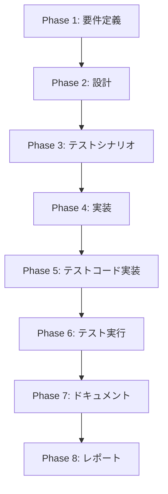

# プロジェクト計画書: Issue #540 - ドキュメントの追加: infrastructure.md

## Issue分析

### 複雑度
**中程度**

### 見積もり工数
**8~12時間**（根拠: 詳細な技術調査とドキュメント構造の大幅更新が必要）

**詳細な根拠**:
- **技術調査**: ECS Fargateおよび関連リソースの実装内容確認（2~3時間）
- **ドキュメント設計**: 新しい構成図およびセクション設計（2~3時間）
- **ドキュメント作成**: infrastructure.mdの大幅更新および図表作成（3~4時間）
- **レビューと修正**: 実装との整合性確認および調整（1~2時間）

### リスク評価
**低~中**

**リスク詳細**:
- **技術的な複雑性**: ECS/ECR/SpotFleetの複合構成の正確な把握が必要
- **文書の一貫性**: 他の関連ドキュメントとの整合性確保
- **実装の継続的変化**: 実装が変更される可能性

## 実装戦略判断

### 実装戦略: REFACTOR

**判断根拠**:
既存のdocs/architecture/infrastructure.mdを大幅に更新し、現在の実装状況（SpotFleet + ECS Fargate併存）に合致させる必要があります。新規ファイル作成ではなく、既存ドキュメントの構造改善とコンテンツ拡充が中心となるため、REFACTORが適切です。

### テスト戦略: INTEGRATION_ONLY

**判断根拠**:
ドキュメント更新のため、自動テストは不要ですが、記載内容が実装と一致するかの統合検証が必要です。具体的には：
- 実装ファイル（pulumi/jenkins-agent/index.ts）とドキュメントの整合性確認
- SSMパラメータ出力名とドキュメント記載内容の一致確認
- docker/jenkins-agent-ecsディレクトリの役割説明の妥当性検証

### テストコード戦略: EXTEND_TEST

**判断根拠**:
ドキュメント専用のテストは存在しないため、既存のドキュメント検証手順に新しい検証項目を追加します。具体的には、実装とドキュメントの整合性確認チェックリストを既存のレビュー手順に統合します。

## 影響範囲分析

### 既存コードへの影響
- **主要対象**: `docs/architecture/infrastructure.md`
- **副次的影響**: README.mdのクイックナビゲーションでの参照整合性

### 依存関係の変更
- **新規依存**: なし
- **既存依存の変更**: infrastructure.mdが参照するSSMパラメータ名の正確性

### マイグレーション要否
**不要** - ドキュメントのみの更新のため

## タスク分割

### Phase 1: 要件定義 (見積もり: 2~3h)

- [x] Task 1-1: 現在の実装状況の詳細調査 (1~1.5h)
  - pulumi/jenkins-agent/index.tsでのECS Fargate関連リソース定義の確認
  - SSM出力パラメータ名（ecs-cluster-arn、ecr-repository-url等）の整理
  - docker/jenkins-agent-ecsの構造および役割の確認
- [x] Task 1-2: 既存ドキュメントのギャップ分析 (0.5~1h)
  - 現在のinfrastructure.mdで欠落しているECS Fargate構成の項目洗い出し
  - SpotFleetとECS Fargateの併存関係の明確化
- [x] Task 1-3: ドキュメント更新要件の定義 (0.5h)
  - 追加すべきセクション構成の決定
  - 図表やアーキテクチャ図の更新範囲確定

### Phase 2: 設計 (見積もり: 2~3h)

- [ ] Task 2-1: 新しいドキュメント構造の設計 (1~1.5h)
  - ECS Fargateエージェントセクションの詳細設計
  - SpotFleetとECS Fargateの比較表設計
  - SSMパラメータ一覧の構造設計
- [ ] Task 2-2: 技術構成図の設計 (1~1.5h)
  - 現在のアーキテクチャ図の拡張設計
  - ECS/ECR/SpotFleet併存構成の図解設計

### Phase 3: テストシナリオ (見積もり: 1h)

- [ ] Task 3-1: 整合性検証手順の策定 (1h)
  - 実装ファイルとドキュメント内容の照合手順作成
  - SSMパラメータ名の正確性確認手順作成
  - ドキュメント内リンクの妥当性確認手順作成

### Phase 4: 実装 (見積もり: 3~4h)

- [ ] Task 4-1: infrastructure.mdの基本構造更新 (1~1.5h)
  - 概要セクションへのECS Fargateエージェント追記
  - ディレクトリ構造でのdocker/jenkins-agent-ecs説明追加
- [ ] Task 4-2: ECS Fargateエージェント専用セクション作成 (1.5~2h)
  - ECS Cluster、ECR Repository、Task Definition等の詳細説明
  - SpotFleetエージェントとの併存関係および使い分け指針
  - docker/jenkins-agent-ecsディレクトリの役割と利用手順
- [ ] Task 4-3: SSMパラメータ一覧の整備 (0.5~0.5h)
  - ECS関連SSM出力パラメータの一覧化
  - 既存SpotFleet関連パラメータとの整理統合

### Phase 5: テストコード実装 (見積もり: 0.5h)

- [ ] Task 5-1: ドキュメント検証チェックリストの作成 (0.5h)
  - 実装とドキュメントの整合性確認項目リストの作成
  - 今後のドキュメント更新時の検証手順の策定

### Phase 6: テスト実行 (見積もり: 1~1.5h)

- [ ] Task 6-1: 整合性検証の実施 (1~1.5h)
  - pulumi/jenkins-agent/index.tsとドキュメント内容の照合実施
  - SSMパラメータ出力名の正確性確認
  - ドキュメント内リンクと参照整合性の確認

### Phase 7: ドキュメント (見積もり: 0.5h)

- [ ] Task 7-1: 更新内容のドキュメント化 (0.5h)
  - 今回の変更内容をchangelog等に記録
  - 他の関連ドキュメントの整合性確認

### Phase 8: レポート (見積もり: 0.5h)

- [ ] Task 8-1: プロジェクト完了レポート作成 (0.5h)
  - 更新されたドキュメントの要点サマリー
  - 今後の継続的なドキュメント保守に関する提言

## 依存関係

## リスクと軽減策

### リスク1: 実装変更によるドキュメント陳腐化
- **影響度**: 中
- **確率**: 中
- **軽減策**:
  - 実装チームとの綿密な連携
  - ドキュメント更新の自動化手順検討
  - 定期的な整合性確認プロセスの確立

### リスク2: ECS Fargateの設定複雑性による理解不足
- **影響度**: 中
- **確率**: 低
- **軽減策**:
  - 実装者へのヒアリング実施
  - 詳細なコードレビューと動作確認
  - 段階的なドキュメント作成とレビューサイクル

### リスク3: ドキュメント内の情報不整合
- **影響度**: 高
- **確率**: 低
- **軽減策**:
  - 複数回の整合性確認レビュー実施
  - 自動的な整合性チェック手順の策定
  - 実装との照合確認の徹底

### リスク4: SpotFleetとECS Fargateの使い分け指針の曖昧性
- **影響度**: 中
- **確率**: 中
- **軽減策**:
  - 明確な使い分け基準の策定
  - 実用例および推奨パターンの明記
  - 意思決定フローチャートの作成

## 品質ゲート

### Phase 1: 要件定義
- [x] 現在の実装状況が正確に把握されている
- [x] ECS Fargate関連リソースが漏れなく特定されている
- [x] SSMパラメータ出力名が正確にリストアップされている
- [x] 既存ドキュメントのギャップが明確に特定されている

### Phase 2: 設計
- [ ] 実装戦略の判断根拠が明記されている（REFACTOR）
- [ ] テスト戦略の判断根拠が明記されている（INTEGRATION_ONLY）
- [ ] テストコード戦略の判断根拠が明記されている（EXTEND_TEST）
- [ ] 新しいドキュメント構造が論理的で理解しやすい
- [ ] 技術構成図が現在の実装を正確に反映している

### Phase 3: テストシナリオ
- [ ] 実装とドキュメントの整合性確認手順が具体的に策定されている
- [ ] 確認手順が実行可能で検証可能な内容になっている

### Phase 4: 実装
- [ ] ECS Fargate構成が正確かつ詳細に記載されている
- [ ] SpotFleetとECS Fargateの併存関係が明確に説明されている
- [ ] docker/jenkins-agent-ecsの役割と利用手順が具体的に記載されている
- [ ] SSMパラメータ一覧が実装と一致している

### Phase 5: テストコード実装
- [ ] ドキュメント検証チェックリストが実用的で具体的である
- [ ] 今後の継続的な検証手順が明確に定義されている

### Phase 6: テスト実行
- [ ] 整合性検証が実施され、すべての項目で一致が確認されている
- [ ] 発見された不整合がすべて修正されている

### Phase 7: ドキュメント
- [ ] 変更履歴が適切に記録されている
- [ ] 関連ドキュメントとの整合性が確保されている

### Phase 8: レポート
- [ ] 完了レポートが作成されている
- [ ] 今後の保守提言が具体的で実行可能である

## 成功判定基準

このプロジェクトは以下の条件をすべて満たした場合に成功とみなします：

1. **正確性**: docs/architecture/infrastructure.mdがECS Fargateエージェント構成を正確に反映している
2. **完全性**: SpotFleetとECS Fargateの併存関係およびSSMパラメータが漏れなく記載されている
3. **整合性**: 実装コードとドキュメント内容に矛盾がない
4. **実用性**: docker/jenkins-agent-ecsの利用手順が具体的で実行可能である
5. **保守性**: 今後の実装変更に対するドキュメント更新手順が確立されている

## 注意事項

1. **実装の継続的変化**: 開発が進行中のため、実装内容に変更が生じる可能性があります。Phase 1での調査時点での状況を基準とし、大きな変更が生じた場合は計画を見直します。

2. **ドキュメントの一貫性**: 他のドキュメント（README.md、ARCHITECTURE.md等）との整合性に注意し、矛盾のない説明を心がけます。

3. **技術的正確性**: ECS Fargate、ECR、SpotFleetの技術的な詳細について正確な理解を前提とします。不明な点があれば実装者との確認を優先します。

4. **ユーザビリティ**: エンドユーザー（インフラ運用者、開発者）の視点から分かりやすく、実用的なドキュメントを作成します。