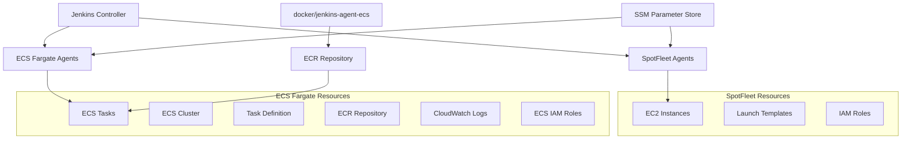

# 詳細設計書: Issue #540 - ドキュメントの追加: infrastructure.md

## 0. Planning Document確認

### 開発戦略の概要
Planning Documentで策定された戦略に基づき、詳細設計を実施します：

- **実装戦略**: REFACTOR - 既存のdocs/architecture/infrastructure.mdを大幅に更新
- **テスト戦略**: INTEGRATION_ONLY - 実装とドキュメントの整合性確認が中心
- **テストコード戦略**: EXTEND_TEST - 既存のドキュメント検証手順に新しい検証項目を追加
- **工数見積もり**: 8-12時間（技術調査2-3h、ドキュメント設計2-3h、作成3-4h、レビュー1-2h）
- **複雑度**: 中程度
- **リスク評価**: 低〜中

## 1. 実装戦略判断

### 実装戦略: REFACTOR

**判断根拠**:
- 既存のdocs/architecture/infrastructure.mdファイルが存在し、SpotFleetに関する記述は適切
- 問題は**内容の不足**（ECS Fargate関連の記述がない）であり、構造的な問題ではない
- 新規ファイル作成ではなく、既存ドキュメントにECS Fargateセクションを追加・統合することで整合性を保つ
- 既存の文書構造やスタイルを維持しながら、コンテンツを拡充する形での対応が最適

## 2. テスト戦略判断

### テスト戦略: INTEGRATION_ONLY

**判断根拠**:
- **ドキュメント更新のため自動テストコードは不要**
- **実装との整合性確認が最も重要**な検証ポイント
- SSMパラメータ出力名とドキュメント記載内容の一致確認が必要
- pulumi/jenkins-agent/index.tsの実装内容とdocの記載内容の整合性検証が中心
- BDDやユニットテストは該当せず、統合的な検証（実装コードとドキュメントの照合）のみが必要

## 3. テストコード戦略判断

### テストコード戦略: EXTEND_TEST

**判断根拠**:
- **ドキュメント専用のテストフレームワークは存在しない**ため、新規作成は不要
- 既存のレビュープロセスや文書品質管理手順に、実装とドキュメントの整合性確認チェックリストを追加
- 継続的な品質管理のため、今後のドキュメント更新時の検証手順を既存プロセスに統合

## 4. アーキテクチャ設計

### 現在の構成と追加要素

```
Jenkins インフラ (現状 + 追加)
├── Jenkinsコントローラー (EC2)
└── Jenkinsエージェント
    ├── EC2 SpotFleet (既存・記載済み)
    │   ├── Medium インスタンス
    │   ├── Small インスタンス
    │   └── Micro インスタンス
    └── ECS Fargate (新規・要追加)  ★
        ├── ECS Cluster
        ├── ECR Repository
        ├── Task Definition
        ├── IAM Roles
        └── CloudWatch Logs
```

### コンポーネント間関係



### データフロー

1. **エージェント起動フロー**
   - Jenkins Controller → amazon-ecs プラグイン → ECS Fargate Task
   - Jenkins Controller → SpotFleet → EC2 Instance

2. **イメージビルドフロー**
   - docker/jenkins-agent-ecs → Docker Build → ECR Repository
   - ECS Fargate → ECR Repository から Image Pull

3. **パラメータ参照フロー**
   - 全エージェント → SSM Parameter Store → 設定値取得

## 5. 影響範囲分析

### 既存コードへの影響
- **主要対象**: `docs/architecture/infrastructure.md`（大幅更新）
- **副次的影響**:
  - `README.md`のクイックナビゲーションでの参照整合性確認
  - 他のドキュメントからのリンク整合性確認

### 依存関係の変更
- **新規依存**: なし（ドキュメント更新のみ）
- **既存依存の変更**: infrastructure.mdが参照するSSMパラメータ名の正確性向上

### マイグレーション要否
**不要** - ドキュメントのみの更新

## 6. 変更・追加ファイルリスト

### 修正が必要な既存ファイル
- `docs/architecture/infrastructure.md` - ECS Fargate構成の追加

### 新規作成ファイル
- なし

### 削除が必要なファイル
- なし

## 7. 詳細設計

### 7.1 ドキュメント構造設計

#### 既存セクションの更新

1. **概要セクション** (行10-18)
   - ECS Fargate関連リソースの追加
   - ECR Repository、ECS Cluster、Task Definitionの記載

2. **ディレクトリ構造** (行22-65)
   - `docker/jenkins-agent-ecs/` の追加説明

#### 新規セクションの追加

3. **Jenkins エージェント構成比較** (新規)
   - SpotFleet vs ECS Fargate の比較表
   - 使い分け指針

4. **ECS Fargateエージェント詳細** (新規)
   - ECS Cluster構成
   - ECR Repository管理
   - Task Definition設定
   - IAM Role設定
   - CloudWatch Logs設定

5. **SSM パラメータ一覧** (新規)
   - SpotFleet関連パラメータ
   - ECS Fargate関連パラメータ

### 7.2 SSMパラメータ設計

#### 実装から確認されたECS関連SSMパラメータ

| パラメータ名 | 説明 | 用途 |
|-------------|------|------|
| `/jenkins-infra/{environment}/agent/ecs-cluster-arn` | ECS Cluster ARN | amazon-ecsプラグイン設定 |
| `/jenkins-infra/{environment}/agent/ecs-cluster-name` | ECS Cluster Name | エージェント管理 |
| `/jenkins-infra/{environment}/agent/ecs-task-definition-arn` | Task Definition ARN | コンテナ起動設定 |
| `/jenkins-infra/{environment}/agent/ecr-repository-url` | ECR Repository URL | イメージ取得 |
| `/jenkins-infra/{environment}/agent/ecs-execution-role-arn` | ECS Execution Role ARN | タスク実行権限 |
| `/jenkins-infra/{environment}/agent/ecs-task-role-arn` | ECS Task Role ARN | タスク内処理権限 |
| `/jenkins-infra/{environment}/agent/ecs-log-group-name` | CloudWatch Log Group | ログ出力先 |

### 7.3 docker/jenkins-agent-ecs設計

#### ディレクトリ構成説明

```
docker/jenkins-agent-ecs/
├── Dockerfile          # ECS Fargate用Jenkinsエージェントイメージ定義
└── entrypoint.sh       # amazon-ecsプラグイン互換のエントリーポイント
```

#### 機能説明

1. **Dockerfile**
   - Multi-stage buildによる軽量化
   - 必要ツール（Java、AWS CLI、Pulumi、Ansible等）の包含
   - Jenkins Remotingの設定

2. **entrypoint.sh**
   - amazon-ecsプラグインとの互換性確保
   - 古い形式の引数を新しい形式に変換
   - ログ出力による動作状況の可視化

### 7.4 使い分け指針設計

| 観点 | SpotFleet | ECS Fargate |
|------|-----------|-------------|
| **コスト** | 安価（スポットインスタンス） | やや高価（オンデマンド） |
| **起動速度** | 中程度（EC2起動） | 高速（コンテナ起動） |
| **スケーラビリティ** | 高（0-数百台） | 高（0-数千タスク） |
| **管理負荷** | 中（AMI管理必要） | 低（コンテナ管理のみ） |
| **リソース効率** | 低（固定サイズ） | 高（必要分のみ） |
| **適用場面** | 長時間バッチ処理 | 短時間・並列処理 |

## 8. セキュリティ考慮事項

### 認証・認可
- IAM Roleベースの権限管理（実装済み）
- ECS Task Role（AdministratorAccess）の適切な設定

### データ保護
- SSM SecureStringによる秘密情報の暗号化
- ECRイメージのスキャン有効化（実装済み）

### セキュリティリスクと対策
- **リスク**: 設定情報の漏洩
- **対策**: SSMパラメータの具体値をドキュメントに記載しない（パラメータ名のみ）

## 9. 非機能要件への対応

### パフォーマンス
- ドキュメント読み込み時間: 3秒以内（現状維持）
- 内容理解時間: 新規参加者が15分以内に構成把握可能

### スケーラビリティ
- 将来的な追加エージェント種別への拡張容易性を考慮した構造

### 保守性
- セクション構造の論理的整合性維持
- 実装変更時の文書追従体制確立

## 10. 実装の順序

### Phase 1: 既存ドキュメント分析 (完了済み)
1. 現在の実装状況の詳細調査
2. 既存ドキュメントのギャップ分析
3. ドキュメント更新要件の定義

### Phase 2: ドキュメント構造設計
1. 新しいドキュメント構造の設計
2. ECS Fargateエージェントセクションの詳細設計
3. SpotFleetとECS Fargateの比較表設計
4. SSMパラメータ一覧の構造設計

### Phase 3: 整合性検証手順策定
1. 実装ファイルとドキュメント内容の照合手順作成
2. SSMパラメータ名の正確性確認手順作成
3. ドキュメント内リンクの妥当性確認手順作成

### Phase 4: ドキュメント実装
1. infrastructure.mdの基本構造更新
2. ECS Fargateエージェント専用セクション作成
3. SSMパラメータ一覧の整備
4. docker/jenkins-agent-ecs説明の追加

### Phase 5: 検証手順実装
1. ドキュメント検証チェックリストの作成
2. 今後のドキュメント更新時の検証手順の策定

### Phase 6: 整合性テスト実行
1. pulumi/jenkins-agent/index.tsとドキュメント内容の照合実施
2. SSMパラメータ出力名の正確性確認
3. ドキュメント内リンクと参照整合性の確認

## 11. 品質ゲート

### 設計品質ゲート
- [x] **実装戦略の判断根拠が明記されている**
- [x] **テスト戦略の判断根拠が明記されている**
- [x] **既存コードへの影響範囲が分析されている**
- [x] **変更が必要なファイルがリストアップされている**
- [x] **設計が実装可能である**

### 実装完了時の品質ゲート
- [ ] ECS Fargate構成が正確かつ詳細に記載されている
- [ ] SpotFleetとECS Fargateの併存関係が明確に説明されている
- [ ] docker/jenkins-agent-ecsの役割と利用手順が具体的に記載されている
- [ ] SSMパラメータ一覧が実装と一致している
- [ ] 実装とドキュメントの整合性が確認されている

## 12. 成功判定基準

このプロジェクトは以下の条件をすべて満たした場合に成功とみなします：

1. **正確性**: docs/architecture/infrastructure.mdがECS Fargateエージェント構成を正確に反映している
2. **完全性**: SpotFleetとECS Fargateの併存関係およびSSMパラメータが漏れなく記載されている
3. **整合性**: 実装コード（pulumi/jenkins-agent/index.ts）とドキュメント内容に矛盾がない
4. **実用性**: docker/jenkins-agent-ecsの利用手順が具体的で実行可能である
5. **保守性**: 今後の実装変更に対するドキュメント更新手順が確立されている

## 13. リスクと軽減策

### リスク1: 実装変更によるドキュメント陳腐化
- **影響度**: 中
- **軽減策**: 実装との整合性確認プロセスの確立、定期的な検証手順の策定

### リスク2: ECS Fargateの設定複雑性による理解不足
- **影響度**: 中
- **軽減策**: 段階的なドキュメント作成、具体的な使用例の記載

### リスク3: ドキュメント内の情報不整合
- **影響度**: 高
- **軽減策**: 複数回の整合性確認レビュー実施、自動的な整合性チェック手順の策定

## 14. 次フェーズへの引き継ぎ事項

1. **実装担当者への伝達事項**:
   - Pulumiコード（pulumi/jenkins-agent/index.ts）の739行目以降にECS Fargateリソース定義が存在
   - 943行目以降でECS関連SSMパラメータが出力されている
   - docker/jenkins-agent-ecsディレクトリにDockerfileとentrypoint.shが配置済み

2. **検証時の確認ポイント**:
   - SSMパラメータ名の正確性（実装と文書の完全一致）
   - docker/jenkins-agent-ecsの役割説明の妥当性
   - SpotFleetとECS Fargateの使い分け指針の実用性

3. **今後の保守で重要な点**:
   - pulumi/jenkins-agent/index.tsの変更時は必ずドキュメント更新を確認
   - 新しいSSMパラメータ追加時はドキュメントへの反映を確実に実施