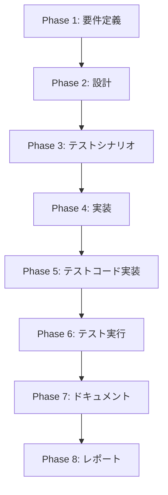
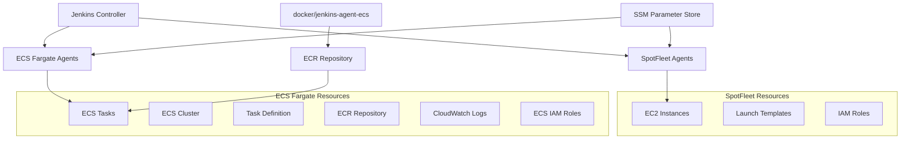

# Codex Agent 実行ログ

開始日時: 2025/12/27 7:44:06

---

## Turn 1: スレッド開始

**Thread ID**: `[REDACTED_TOKEN]`

## Turn 2: ツール実行

**種別**: reasoning
**ステータス**: completed

## Turn 3: ツール実行

**種別**: mcp_tool_call
**ステータス**: completed

## Turn 4: ツール実行

**種別**: reasoning
**ステータス**: completed

## Turn 5: ツール実行

**種別**: コマンド実行
**コマンド**: `/bin/bash -lc pwd`
**ステータス**: completed (exit_code=0)

```text
/tmp/ai-workflow-repos-7-9513efb4/[REDACTED_TOKEN]
```

## Turn 6: ツール実行

**種別**: reasoning
**ステータス**: completed

## Turn 7: ツール実行

**種別**: コマンド実行
**コマンド**: `/bin/bash -lc ls`
**ステータス**: completed (exit_code=0)

```text
ARCHITECTURE.md
CLAUDE.md
CONTRIBUTION.md
LICENSE
README.md
ansible
bootstrap
docker
docs
jenkins
pulumi
run_tests_issue_322.sh
scripts
tests
```

## Turn 8: ツール実行

**種別**: reasoning
**ステータス**: completed

## Turn 9: ツール実行

**種別**: コマンド実行
**コマンド**: `/bin/bash -lc 'ls -a'`
**ステータス**: completed (exit_code=0)

```text
.
..
.ai-workflow
.claude
.coverage
.git
.github
.gitignore
ARCHITECTURE.md
CLAUDE.md
CONTRIBUTION.md
LICENSE
README.md
ansible
bootstrap
docker
docs
jenkins
pulumi
run_tests_issue_322.sh
scripts
tests
```

## Turn 10: ツール実行

**種別**: reasoning
**ステータス**: completed

## Turn 11: ツール実行

**種別**: コマンド実行
**コマンド**: `/bin/bash -lc 'cat .ai-workflow/issue-540/00_planning/output/planning.md'`
**ステータス**: completed (exit_code=0)

```text
# プロジェクト計画書: Issue #540 - ドキュメントの追加: infrastructure.md

## Issue分析

### 複雑度
**中程度**

### 見積もり工数
**8~12時間**（根拠: 詳細な技術調査とドキュメント構造の大幅更新が必要）

**詳細な根拠**:
- **技術調査**: ECS Fargateおよび関連リソースの実装内容確認（2~3時間）
- **ドキュメント設計**: 新しい構成図およびセクション設計（2~3時間）
- **ドキュメント作成**: infrastructure.mdの大幅更新および図表作成（3~4時間）
- **レビューと修正**: 実装との整合性確認および調整（1~2時間）

### リスク評価
**低~中**

**リスク詳細**:
- **技術的な複雑性**: ECS/ECR/SpotFleetの複合構成の正確な把握が必要
- **文書の一貫性**: 他の関連ドキュメントとの整合性確保
- **実装の継続的変化**: 実装が変更される可能性

## 実装戦略判断

### 実装戦略: REFACTOR

**判断根拠**:
既存のdocs/architecture/infrastructure.mdを大幅に更新し、現在の実装状況（SpotFleet + ECS Fargate併存）に合致させる必要があります。新規ファイル作成ではなく、既存ドキュメントの構造改善とコンテンツ拡充が中心となるため、REFACTORが適切です。

### テスト戦略: INTEGRATION_ONLY

**判断根拠**:
ドキュメント更新のため、自動テストは不要ですが、記載内容が実装と一致するかの統合検証が必要です。具体的には：
- 実装ファイル（pulumi/jenkins-agent/index.ts）とドキュメントの整合性確認
- SSMパラメータ出力名とドキュメント記載内容の一致確認
- docker/jenkins-agent-ecsディレクトリの役割説明の妥当性検証

### テストコード戦略: EXTEND_TEST

**判断根拠**:
ドキュメント専用のテストは存在しないため、既存のドキュメント検証手順に新しい検証項目を追加します。具体的には、実装とドキュメントの整合性確認チェックリストを既存のレビュー手順に統合します。

## 影響範囲分析

### 既存コードへの影響
- **主要対象**: `docs/architecture/infrastructure.md`
- **副次的影響**: README.mdのクイックナビゲーションでの参照整合性

### 依存関係の変更
- **新規依存**: なし
- **既存依存の変更**: infrastructure.mdが参照するSSMパラメータ名の正確性

### マイグレーション要否
**不要** - ドキュメントのみの更新のため

## タスク分割

### Phase 1: 要件定義 (見積もり: 2~3h)

- [x] Task 1-1: 現在の実装状況の詳細調査 (1~1.5h)
  - pulumi/jenkins-agent/index.tsでのECS Fargate関連リソース定義の確認
  - SSM出力パラメータ名（ecs-cluster-arn、ecr-repository-url等）の整理
  - docker/jenkins-agent-ecsの構造および役割の確認
- [x] Task 1-2: 既存ドキュメントのギャップ分析 (0.5~1h)
  - 現在のinfrastructure.mdで欠落しているECS Fargate構成の項目洗い出し
  - SpotFleetとECS Fargateの併存関係の明確化
- [x] Task 1-3: ドキュメント更新要件の定義 (0.5h)
  - 追加すべきセクション構成の決定
  - 図表やアーキテクチャ図の更新範囲確定

### Phase 2: 設計 (見積もり: 2~3h)

- [x] Task 2-1: 新しいドキュメント構造の設計 (1~1.5h)
  - ECS Fargateエージェントセクションの詳細設計
  - SpotFleetとECS Fargateの比較表設計
  - SSMパラメータ一覧の構造設計
- [x] Task 2-2: 技術構成図の設計 (1~1.5h)
  - 現在のアーキテクチャ図の拡張設計
  - ECS/ECR/SpotFleet併存構成の図解設計

### Phase 3: テストシナリオ (見積もり: 1h)

- [ ] Task 3-1: 整合性検証手順の策定 (1h)
  - 実装ファイルとドキュメント内容の照合手順作成
  - SSMパラメータ名の正確性確認手順作成
  - ドキュメント内リンクの妥当性確認手順作成

### Phase 4: 実装 (見積もり: 3~4h)

- [ ] Task 4-1: infrastructure.mdの基本構造更新 (1~1.5h)
  - 概要セクションへのECS Fargateエージェント追記
  - ディレクトリ構造でのdocker/jenkins-agent-ecs説明追加
- [ ] Task 4-2: ECS Fargateエージェント専用セクション作成 (1.5~2h)
  - ECS Cluster、ECR Repository、Task Definition等の詳細説明
  - SpotFleetエージェントとの併存関係および使い分け指針
  - docker/jenkins-agent-ecsディレクトリの役割と利用手順
- [ ] Task 4-3: SSMパラメータ一覧の整備 (0.5~0.5h)
  - ECS関連SSM出力パラメータの一覧化
  - 既存SpotFleet関連パラメータとの整理統合

### Phase 5: テストコード実装 (見積もり: 0.5h)

- [ ] Task 5-1: ドキュメント検証チェックリストの作成 (0.5h)
  - 実装とドキュメントの整合性確認項目リストの作成
  - 今後のドキュメント更新時の検証手順の策定

### Phase 6: テスト実行 (見積もり: 1~1.5h)

- [ ] Task 6-1: 整合性検証の実施 (1~1.5h)
  - pulumi/jenkins-agent/index.tsとドキュメント内容の照合実施
  - SSMパラメータ出力名の正確性確認
  - ドキュメント内リンクと参照整合性の確認

### Phase 7: ドキュメント (見積もり: 0.5h)

- [ ] Task 7-1: 更新内容のドキュメント化 (0.5h)
  - 今回の変更内容をchangelog等に記録
  - 他の関連ドキュメントの整合性確認

### Phase 8: レポート (見積もり: 0.5h)

- [ ] Task 8-1: プロジェクト完了レポート作成 (0.5h)
  - 更新されたドキュメントの要点サマリー
  - 今後の継続的なドキュメント保守に関する提言

## 依存関係



## リスクと軽減策

### リスク1: 実装変更によるドキュメント陳腐化
- **影響度**: 中
- **確率**: 中
- **軽減策**:
  - 実装チームとの綿密な連携
  - ドキュメント更新の自動化手順検討
  - 定期的な整合性確認プロセスの確立

### リスク2: ECS Fargateの設定複雑性による理解不足
- **影響度**: 中
- **確率**: 低
- **軽減策**:
  - 実装者へのヒアリング実施
  - 詳細なコードレビューと動作確認
  - 段階的なドキュメント作成とレビューサイクル

### リスク3: ドキュメント内の情報不整合
- **影響度**: 高
- **確率**: 低
- **軽減策**:
  - 複数回の整合性確認レビュー実施
  - 自動的な整合性チェック手順の策定
  - 実装との照合確認の徹底

### リスク4: SpotFleetとECS Fargateの使い分け指針の曖昧性
- **影響度**: 中
- **確率**: 中
- **軽減策**:
  - 明確な使い分け基準の策定
  - 実用例および推奨パターンの明記
  - 意思決定フローチャートの作成

## 品質ゲート

### Phase 1: 要件定義
- [x] 現在の実装状況が正確に把握されている
- [x] ECS Fargate関連リソースが漏れなく特定されている
- [x] SSMパラメータ出力名が正確にリストアップされている
- [x] 既存ドキュメントのギャップが明確に特定されている

### Phase 2: 設計
- [
... (truncated)
```

## Turn 12: ツール実行

**種別**: reasoning
**ステータス**: completed

## Turn 13: ツール実行

**種別**: reasoning
**ステータス**: completed

## Turn 14: ツール実行

**種別**: reasoning
**ステータス**: completed

## Turn 15: ツール実行

**種別**: コマンド実行
**コマンド**: `/bin/bash -lc 'cat .ai-workflow/issue-540/04_implementation/output/implementation.md'`
**ステータス**: completed (exit_code=0)

```text
# 実装完了レポート

## 変更ファイル一覧

| ファイル | 変更種別 | 概要 |
|---------|---------|------|
| `docs/architecture/infrastructure.md` | 修正 | ECS Fargate エージェントと `docker/jenkins-agent-ecs` の構成・SSM パラメータを網羅する新セクションを追加 |
| `.ai-workflow/issue-540/04_implementation/output/implementation.md` | 新規 | 本実装のログを記録 |

## 主要な変更点

- 概要とディレクトリ構造で ECS Fargate リソースと `docker/jenkins-agent-ecs` 配下の説明を補強し、既存の SpotFleet 構成との整合性を確保
- Jenkins エージェント構成の比較、ECS Fargate のリソース詳細、IAM/CloudWatch の役割を明示して実装との整合性を担保
- `docker/jenkins-agent-ecs` の役割説明と ECS 用 SSM パラメータ一覧を表形式で整理し、Jenkins からの利用手順と運用ガイドを明示

## テスト実施状況
- ビルド: 未実施（ドキュメント更新のため不要）
- リント: 未実施（ドキュメント更新のため不要）
- 基本動作確認: ドキュメント更新のため対象無し
```

## Turn 16: ツール実行

**種別**: reasoning
**ステータス**: completed

## Turn 17: ツール実行

**種別**: コマンド実行
**コマンド**: `/bin/bash -lc 'rg -n "Fargate" -n docs/architecture/infrastructure.md'`
**ステータス**: failed (exit_code=127)

```text
/bin/bash: line 1: rg: command not found
```

## Turn 18: ツール実行

**種別**: reasoning
**ステータス**: completed

## Turn 19: ツール実行

**種別**: コマンド実行
**コマンド**: `/bin/bash -lc 'grep -n "Fargate" -n docs/architecture/infrastructure.md'`
**ステータス**: completed (exit_code=0)

```text
14:- Jenkinsエージェント用のECS Fargateクラスタ、ECRリポジトリ、Task Definition、CloudWatch Logs
66:│  └─ jenkins-agent-ecs/       # ECS Fargateエージェントイメージ
80:- **docker/**: ECS Fargateエージェントイメージの定義。`docker/jenkins-agent-ecs/`でDockerfile・entrypoint.shを管理
97:本番環境では、Jenkins コントローラーから接続するエージェントを SpotFleet（EC2）と ECS Fargate の双方で運用しています。SpotFleet は既存のバッチ/長時間ジョブに対して安定したキャパシティを提供し、ECS Fargate は短時間かつ高い並列性が求められるジョブを高速に処理します。どちらの構成も `pulumi/jenkins-agent/index.ts` 内で定義されたリソース群と SSM パラメータを通じて Jenkins に公開されます。
99:### SpotFleet vs ECS Fargate 比較
101:| 観点 | SpotFleet | ECS Fargate |
113:- 短時間かつスケールが必要なタスク、たとえば並列ビルド/テストは ECS Fargate エージェントへ切り替え
116:## ECS Fargateエージェント詳細
118:`pulumi/jenkins-agent/index.ts` の 739 行以降では、ECS Fargate エージェント用の Cluster、ECR、Task Definition、IAM Role、CloudWatch Logs が定義され、各リソースは SSM パラメータとして Jenkins に提供されます。
122:専用の ECS Cluster を作成し、Fargate タスクの実行環境を分離しています。クラスタ名・ARN は SSM パラメータ `/jenkins-infra/{environment}/agent/ecs-cluster-*` で公開され、amazon-ecs プラグインのクラスタ設定にそのまま流し込めるようにしています。
126:`docker/jenkins-agent-ecs` でビルドした Jenkins エージェントイメージは専用の ECR リポジトリに格納され、Fargate タスクはこのリポジトリからイメージを取得します。リポジトリ URL も SSM パラメータとして公開し、タスク定義の `image` フィールドへ埋め込みます。
134:Fargate タスクには Execution Role（ECR へのプル、CloudWatch へのログ送信）と Task Role（Jenkins 内での操作権限）の 2 つの IAM Role を割り当てています。Task Role は AdministratorAccess ポリシーを継承し、SpotFleet とは異なる最小権限の境界を維持しつつも必要なリソースへアクセスできるようにしています。
142:`docker/jenkins-agent-ecs` 以下には、ECS Fargate で動作する Jenkins エージェントコンテナの定義が集約されています。主なファイルは次の通りです：
```

## Turn 20: ツール実行

**種別**: reasoning
**ステータス**: completed

## Turn 21: ツール実行

**種別**: コマンド実行
**コマンド**: `/bin/bash -lc "sed -n '1,220p' docs/architecture/infrastructure.md"`
**ステータス**: completed (exit_code=0)

```text
# インフラストラクチャの構成

> 📖 **親ドキュメント**: [README.md](../../README.md)

## 概要

Jenkins基盤で利用するAWSリソース、リポジトリのディレクトリ構造、主要機能と管理ポイントをまとめています。

このリポジトリは以下のAWSリソースを設定します：

- VPC、サブネット、ルートテーブル、セキュリティグループなどのネットワークリソース
- Jenkinsコントローラー用のEC2インスタンス（ブルー/グリーン環境）
- Jenkinsエージェント用のEC2 SpotFleet（自動スケーリング対応）
- Jenkinsエージェント用のECS Fargateクラスタ、ECRリポジトリ、Task Definition、CloudWatch Logs
- Jenkinsエージェント用のカスタムAMI（EC2 Image Builder）
- Jenkinsデータ永続化のためのEFSファイルシステム
- ブルーグリーンデプロイ用のALB（Application Load Balancer）
- Jenkins関連リソースのIAMロールとポリシー
- アプリケーション設定管理用のSSMドキュメントとパラメータ

## ディレクトリ構造

```
[REDACTED_TOKEN]/
├─ ansible/                    # Ansible設定とプレイブック
│  ├─ inventory/              # インベントリと変数定義
│  ├─ playbooks/              # 各種プレイブック
│  │  ├─ jenkins/             # Jenkins関連プレイブック
│  │  │  ├─ deploy/          # デプロイ用
│  │  │  ├─ remove/          # 削除用
│  │  │  ├─ misc/            # その他（更新等）
│  │  │  ├─ [REDACTED_TOKEN].yml    # セットアップパイプライン
│  │  │  └─ [REDACTED_TOKEN].yml # 削除パイプライン
│  │  └─ lambda/              # Lambda関連プレイブック
│  └─ roles/                  # Ansibleロール
│      ├─ aws_setup/          # AWS環境設定
│      ├─ pulumi_helper/      # Pulumi操作ヘルパー
│      ├─ jenkins_*/          # Jenkins関連（network, controller, agent等）
│      └─ lambda_*/           # Lambda関連（IP管理、API Gateway等）
│
├─ bootstrap/                  # ブートストラップ環境構築
│  ├─ [REDACTED_TOKEN].yaml  # CloudFormationテンプレート
│  └─ setup-bootstrap.sh           # セットアップスクリプト
│
├─ jenkins/                    # Jenkins設定とジョブ定義
│  └─ jobs/                    # Jenkinsジョブ定義
│      ├─ dsl/                 # Job DSL定義（フォルダ構造等）
│      ├─ pipeline/            # パイプラインジョブ（Jenkinsfile）
│      └─ shared/              # 共有ライブラリ
│
├─ pulumi/                     # Pulumiインフラコード
│  ├─ jenkins-*/               # Jenkinsインフラスタック
│  │  ├─ jenkins-agent/        # Jenkins Agent SpotFleet
│  │  └─ jenkins-agent-ami/    # Jenkins Agent AMI Builder
│  └─ lambda-*/                # Lambdaインフラスタック
│
├─ scripts/                    # ユーティリティスクリプト
│  ├─ aws/                     # AWS操作スクリプト
│  └─ jenkins/                 # Jenkins設定スクリプト
│      ├─ casc/                # Configuration as Code設定
│      ├─ groovy/              # Groovy初期化スクリプト
│      ├─ jobs/                # ジョブXML定義
│      └─ shell/               # シェルスクリプト
│
├─ docker/                      # Jenkinsエージェントコンテナ定義
│  └─ jenkins-agent-ecs/       # ECS Fargateエージェントイメージ
│      ├─ Dockerfile           # ECS専用Jenkinsエージェントイメージ
│      └─ entrypoint.sh        # amazon-ecsプラグイン互換のエントリーポイント

└─ docs/                       # ドキュメント
```

## 主要ディレクトリの説明

- **ansible/**: Ansibleによる自動化設定。プレイブックでインフラの構築・削除・設定を管理
- **bootstrap/**: EC2踏み台サーバーの初期構築用CloudFormationとセットアップスクリプト
- **jenkins/**: Jenkinsジョブ定義とパイプライン。Job DSLとJenkinsfileによるジョブ管理
- **pulumi/**: インフラストラクチャのコード。各コンポーネントを独立したスタックとして管理
- **scripts/**: 各種ユーティリティスクリプト。AWS操作、Jenkins設定、初期化処理など
- **docker/**: ECS Fargateエージェントイメージの定義。`docker/jenkins-agent-ecs/`でDockerfile・entrypoint.shを管理

## 主な機能

- **段階的デプロイ**: Ansibleを使用して各コンポーネントを順番にデプロイ
- **段階的削除**: 依存関係を考慮した安全な削除処理
- **モジュール分割**: 各インフラコンポーネントを独立したPulumiスタックとして管理
- **ブルー/グリーンデプロイメント**: Jenkinsの更新を無停止で行えるデュアル環境
- **自動スケーリングエージェント**: EC2 SpotFleetによるコスト効率の高いJenkinsエージェント
- **リカバリーモード**: 管理者アカウントロックアウト時などの緊急アクセス用モード
- **データ永続性**: EFSによるJenkinsデータの永続化と高可用性の確保
- **アプリケーション設定管理**: Jenkinsバージョン更新、プラグイン管理、再起動処理の自動化
- **Jenkins CLIユーザー管理**: APIトークンを使用したCLIアクセスの自動設定
- **シードジョブによるジョブ管理**: Infrastructure as Codeによるジョブの自動作成・更新・削除

## Jenkinsエージェント構成

本番環境では、Jenkins コントローラーから接続するエージェントを SpotFleet（EC2）と ECS Fargate の双方で運用しています。SpotFleet は既存のバッチ/長時間ジョブに対して安定したキャパシティを提供し、ECS Fargate は短時間かつ高い並列性が求められるジョブを高速に処理します。どちらの構成も `pulumi/jenkins-agent/index.ts` 内で定義されたリソース群と SSM パラメータを通じて Jenkins に公開されます。

### SpotFleet vs ECS Fargate 比較

| 観点 | SpotFleet | ECS Fargate |
|------|-----------|-------------|
| コスト | スポットインスタンスによる低コスト | オンデマンド課金のためやや高価だが必要な分だけ課金 |
| 起動速度 | EC2 の起動を伴うため中程度 | コンテナ起動のため高速 |
| スケーラビリティ | 数百台まで拡張可能 | 数千タスクの並行実行が可能 |
| 管理負荷 | AMI と Launch Template の管理が必要 |
... (truncated)
```

## Turn 22: ツール実行

**種別**: reasoning
**ステータス**: completed

## Turn 23: ツール実行

**種別**: コマンド実行
**コマンド**: `/bin/bash -lc 'cat .ai-workflow/issue-540/02_design/output/design.md'`
**ステータス**: completed (exit_code=0)

```text
# 詳細設計書: Issue #540 - ドキュメントの追加: infrastructure.md

## 0. Planning Document確認

### 開発戦略の概要
Planning Documentで策定された戦略に基づき、詳細設計を実施します：

- **実装戦略**: REFACTOR - 既存のdocs/architecture/infrastructure.mdを大幅に更新
- **テスト戦略**: INTEGRATION_ONLY - 実装とドキュメントの整合性確認が中心
- **テストコード戦略**: EXTEND_TEST - 既存のドキュメント検証手順に新しい検証項目を追加
- **工数見積もり**: 8-12時間（技術調査2-3h、ドキュメント設計2-3h、作成3-4h、レビュー1-2h）
- **複雑度**: 中程度
- **リスク評価**: 低〜中

## 1. 実装戦略判断

### 実装戦略: REFACTOR

**判断根拠**:
- 既存のdocs/architecture/infrastructure.mdファイルが存在し、SpotFleetに関する記述は適切
- 問題は**内容の不足**（ECS Fargate関連の記述がない）であり、構造的な問題ではない
- 新規ファイル作成ではなく、既存ドキュメントにECS Fargateセクションを追加・統合することで整合性を保つ
- 既存の文書構造やスタイルを維持しながら、コンテンツを拡充する形での対応が最適

## 2. テスト戦略判断

### テスト戦略: INTEGRATION_ONLY

**判断根拠**:
- **ドキュメント更新のため自動テストコードは不要**
- **実装との整合性確認が最も重要**な検証ポイント
- SSMパラメータ出力名とドキュメント記載内容の一致確認が必要
- pulumi/jenkins-agent/index.tsの実装内容とdocの記載内容の整合性検証が中心
- BDDやユニットテストは該当せず、統合的な検証（実装コードとドキュメントの照合）のみが必要

## 3. テストコード戦略判断

### テストコード戦略: EXTEND_TEST

**判断根拠**:
- **ドキュメント専用のテストフレームワークは存在しない**ため、新規作成は不要
- 既存のレビュープロセスや文書品質管理手順に、実装とドキュメントの整合性確認チェックリストを追加
- 継続的な品質管理のため、今後のドキュメント更新時の検証手順を既存プロセスに統合

## 4. アーキテクチャ設計

### 現在の構成と追加要素

```
Jenkins インフラ (現状 + 追加)
├── Jenkinsコントローラー (EC2)
└── Jenkinsエージェント
    ├── EC2 SpotFleet (既存・記載済み)
    │   ├── Medium インスタンス
    │   ├── Small インスタンス
    │   └── Micro インスタンス
    └── ECS Fargate (新規・要追加)  ★
        ├── ECS Cluster
        ├── ECR Repository
        ├── Task Definition
        ├── IAM Roles
        └── CloudWatch Logs
```

### コンポーネント間関係



### データフロー

1. **エージェント起動フロー**
   - Jenkins Controller → amazon-ecs プラグイン → ECS Fargate Task
   - Jenkins Controller → SpotFleet → EC2 Instance

2. **イメージビルドフロー**
   - docker/jenkins-agent-ecs → Docker Build → ECR Repository
   - ECS Fargate → ECR Repository から Image Pull

3. **パラメータ参照フロー**
   - 全エージェント → SSM Parameter Store → 設定値取得

## 5. 影響範囲分析

### 既存コードへの影響
- **主要対象**: `docs/architecture/infrastructure.md`（大幅更新）
- **副次的影響**:
  - `README.md`のクイックナビゲーションでの参照整合性確認
  - 他のドキュメントからのリンク整合性確認

### 依存関係の変更
- **新規依存**: なし（ドキュメント更新のみ）
- **既存依存の変更**: infrastructure.mdが参照するSSMパラメータ名の正確性向上

### マイグレーション要否
**不要** - ドキュメントのみの更新

## 6. 変更・追加ファイルリスト

### 修正が必要な既存ファイル
- `docs/architecture/infrastructure.md` - ECS Fargate構成の追加

### 新規作成ファイル
- なし

### 削除が必要なファイル
- なし

## 7. 詳細設計

### 7.1 ドキュメント構造設計

#### 既存セクションの更新

1. **概要セクション** (行10-18)
   - ECS Fargate関連リソースの追加
   - ECR Repository、ECS Cluster、Task Definitionの記載

2. **ディレクトリ構造** (行22-65)
   - `docker/jenkins-agent-ecs/` の追加説明

#### 新規セクションの追加

3. **Jenkins エージェント構成比較** (新規)
   - SpotFleet vs ECS Fargate の比較表
   - 使い分け指針

4. **ECS Fargateエージェント詳細** (新規)
   - ECS Cluster構成
   - ECR Repository管理
   - Task Definition設定
   - IAM Role設定
   - CloudWatch Logs設定

5. **SSM パラメータ一覧** (新規)
   - SpotFleet関連パラメータ
   - ECS Fargate関連パラメータ

### 7.2 SSMパラメータ設計

#### 実装から確認されたECS関連SSMパラメータ

| パラメータ名 | 説明 | 用途 |
|-------------|------|------|
| `/jenkins-infra/{environment}/agent/ecs-cluster-arn` | ECS Cluster ARN | amazon-ecsプラグイン設定 |
| `/jenkins-infra/{environment}/agent/ecs-cluster-name` | ECS Cluster Name | エージェント管理 |
| `/jenkins-infra/{environment}/agent/ecs-task-definition-arn` | Task Definition ARN | コンテナ起動設定 |
| `/jenkins-infra/{environment}/agent/ecr-repository-url` | ECR Repository URL | イメージ取得 |
| `/jenkins-infra/{environment}/agent/ecs-execution-role-arn` | ECS Execution Role ARN | タスク実行権限 |
| `/jenkins-infra/{environment}/agent/ecs-task-role-arn` | ECS Task Role ARN | タスク内処理権限 |
| `/jen
... (truncated)
```

## Turn 24: ツール実行

**種別**: reasoning
**ステータス**: completed

## Turn 25: ツール実行

**種別**: コマンド実行
**コマンド**: `/bin/bash -lc 'cat .ai-workflow/issue-540/03_test_scenario/output/test-scenario.md'`
**ステータス**: completed (exit_code=0)

```text
# テストシナリオ書: Issue #540 - ドキュメントの追加: infrastructure.md

## 0. テスト戦略サマリー

### 選択されたテスト戦略（Phase 2から引用）
**テスト戦略: INTEGRATION_ONLY**

**判断根拠**:
- **ドキュメント更新のため自動テストコードは不要**
- **実装との整合性確認が最も重要**な検証ポイント
- SSMパラメータ出力名とドキュメント記載内容の一致確認が必要
- pulumi/jenkins-agent/index.tsの実装内容とdocの記載内容の整合性検証が中心
- BDDやユニットテストは該当せず、統合的な検証（実装コードとドキュメントの照合）のみが必要

### テスト対象の範囲
- `docs/architecture/infrastructure.md` と `pulumi/jenkins-agent/index.ts` の整合性
- SSMパラメータ出力名の正確性
- `docker/jenkins-agent-ecs` ディレクトリの役割説明の妥当性
- ドキュメント内リンクと参照整合性

### テストの目的
更新されたドキュメントが実装と完全に一致し、運用時に誤認や作業ミスを引き起こさない正確性を確保すること

## 1. Integrationテストシナリオ

### シナリオ1: ECS Fargateリソース定義の整合性確認

**シナリオ名**: infrastructure.md × pulumi/jenkins-agent/index.ts（ECS Fargate部分）

**目的**: ドキュメントに記載されるECS Fargateリソースが実装と一致することを検証

**前提条件**:
- pulumi/jenkins-agent/index.tsのECS Fargate関連リソース定義（739行目以降）が存在
- infrastructure.mdにECS Fargateセクションが追加済み

**テスト手順**:
1. pulumi/jenkins-agent/index.tsの739行目以降からECS Fargate関連リソースを抽出
2. 以下のリソース定義を特定:
   - ECS Cluster作成部分
   - ECR Repository作成部分
   - Task Definition作成部分
   - IAM Role作成部分
   - CloudWatch Logs Group作成部分
3. infrastructure.mdの「ECS Fargateエージェント詳細」セクションと照合
4. 各リソースの設定内容（名前、設定値、依存関係）が一致するか確認

**期待結果**:
- ECS Clusterの名前と設定がドキュメントと実装で一致
- ECR Repositoryの名前とポリシーが一致
- Task Definitionの設定項目（CPU、メモリ、実行ロール等）が一致
- IAM Roleの権限設定とポリシーが一致
- CloudWatch Logs Groupの設定が一致

**確認項目**:
- [ ] ECS Cluster名がpulumiコードとドキュメントで同一
- [ ] ECR Repository名とURIパターンが一致
- [ ] Task DefinitionのCPU/メモリ設定値が一致
- [ ] ECS Execution RoleのポリシーAttachmentが正確
- [ ] ECS Task RoleのAdministratorAccessが記載
- [ ] CloudWatch Logs Groupの名前とリテンション設定が一致

### シナリオ2: SSMパラメータ出力名の完全一致確認

**シナリオ名**: infrastructure.md × pulumi/jenkins-agent/index.ts（SSMパラメータ部分）

**目的**: ドキュメントに記載されるSSMパラメータ名が実装の出力と完全に一致することを検証

**前提条件**:
- pulumi/jenkins-agent/index.tsの943行目以降にECS関連SSMパラメータ出力が存在
- infrastructure.mdの「SSMパラメータ一覧」セクションが作成済み

**テスト手順**:
1. pulumi/jenkins-agent/index.tsの943行目以降からSSMパラメータ出力を抽出
2. 以下のパラメータを特定:
   - ECS Cluster ARN出力
   - ECS Cluster Name出力
   - ECS Task Definition ARN出力
   - ECR Repository URL出力
   - ECS Execution Role ARN出力
   - ECS Task Role ARN出力
   - ECS Log Group Name出力
3. infrastructure.mdの「SSMパラメータ一覧」テーブルと照合
4. パラメータ名のパス（`/jenkins-infra/{environment}/agent/...`）が完全一致するか確認

**期待結果**:
- 実装で出力される全てのECS関連SSMパラメータがドキュメントに記載されている
- パラメータ名のパスが実装とドキュメントで文字列として完全一致
- パラメータの説明と用途が実装の意図と合致

**確認項目**:
- [ ] `/jenkins-infra/{environment}/agent/ecs-cluster-arn` の記載
- [ ] `/jenkins-infra/{environment}/agent/ecs-cluster-name` の記載
- [ ] `/jenkins-infra/{environment}/agent/ecs-task-definition-arn` の記載
- [ ] `/jenkins-infra/{environment}/agent/ecr-repository-url` の記載
- [ ] `/jenkins-infra/{environment}/agent/ecs-execution-role-arn` の記載
- [ ] `/jenkins-infra/{environment}/agent/ecs-task-role-arn` の記載
- [ ] `/jenkins-infra/{environment}/agent/ecs-log-group-name` の記載
- [ ] パラメータ名のtypoや相違がない
- [ ] 説明文が実装の用途と合致

### シナリオ3: docker/jenkins-agent-ecsディレクトリの役割説明妥当性確認

**シナリオ名**: infrastructure.md × docker/jenkins-agent-ecs ディレクトリ構成

**目的**: ドキュメントに記載されるdocker/jenkins-agent-ecsの役割説明が実際のディレクトリ構成と一致することを検証

**前提条件**:
- docker/jenkins-agent-ecsディレクトリが存在
- infrastructure.mdにディレクトリ構造説明が追加済み

**テスト手順**:
1. docker/jenkins-agent-ecsディレクトリの実際の構成を確認
2. 以下のファイルの存在と内容を確認:
   - Dockerfile（ECS Fargate用イメージ定義）
   - entrypoint.sh（amazon-ecsプラグイン互換スクリプト）
3. infrastructure.mdの「docker/jenkins-agent-ecs設計」セクションと照合
4. ディレクトリ構成図とファイルの役割説明が実態と一致するか確認

**期待結果**:
- ディレクトリ構成図が実際のファイル構造と一致
- Dockerfileの役割説明が実装内容と合致
- entrypoint.shの機能説明が実装内容と合致

**確認項目**:
- [ ] ディレクトリ内のファイル一覧がドキュメントと一致
- [ ] Dockerfileの説明（Multi-stage build、含有ツール等）が実態と合致
- [ ] entrypoint.shの説明（amazon-ecsプラグイン互換性等）が実態と合致
- [ ] ファイルの役割と利用手順が具体的で実行可能

### シナリオ4: SpotFleetとECS Fargateの併存関係の技術的妥当性確認

**シナリオ名**: infrastructure.md × 実装全体（SpotFleet + ECS Fargate併存構成）

**目的**: ドキュメントに記載されるSpotFleetとECS Fargateの併存関係が実装の構成と合致することを検証

**前提条件**:
- pulumi/jenkins-agent/index.tsでSpotFleetとECS Fargate両方のリソースが定義済み
- infrastructure.mdに「Jenkins エージェント構成比較」セクションが追加済み

**テスト手順**:
1. pulumi/jenkins-agent/index.tsでSpo
... (truncated)
```

## Turn 26: ツール実行

**種別**: reasoning
**ステータス**: completed

## Turn 27: ツール実行

**種別**: コマンド実行
**コマンド**: `/bin/bash -lc 'grep -n "ecs" pulumi/jenkins-agent/index.ts'`
**ステータス**: completed (exit_code=0)

```text
740:const ecsCluster = new aws.ecs.Cluster(`agent-ecs-cluster`, {
741:    name: pulumi.interpolate`${projectName}-agent-ecs-${environment}`,
747:        Name: pulumi.interpolate`${projectName}-agent-ecs-cluster-${environment}`,
755:const ecrRepository = new aws.ecr.Repository(`agent-ecs-ecr`, {
756:    name: pulumi.interpolate`${projectName}-agent-ecs-${environment}`,
770:const ecrLifecyclePolicy = new aws.ecr.LifecyclePolicy(`[REDACTED_TOKEN]`, {
789:const ecsLogGroup = new aws.cloudwatch.LogGroup(`agent-ecs-logs`, {
790:    name: `/jenkins-infra/${environment}/ecs-agent`,
800:const ecsExecutionRole = new aws.iam.Role(`[REDACTED_TOKEN]`, {
801:    name: pulumi.interpolate`${projectName}-ecs-execution-role-${environment}`,
807:                Service: "ecs-tasks.amazonaws.com",
816:        Name: pulumi.interpolate`${projectName}-ecs-execution-role-${environment}`,
824:const ecsTaskRole = new aws.iam.Role(`agent-ecs-task-role`, {
825:    name: pulumi.interpolate`${projectName}-ecs-task-role-${environment}`,
831:                Service: "ecs-tasks.amazonaws.com",
840:        Name: pulumi.interpolate`${projectName}-ecs-task-role-${environment}`,
848:const taskDefinition = new aws.ecs.TaskDefinition(`agent-ecs-task-def`, {
849:    family: pulumi.interpolate`${projectName}-agent-ecs-${environment}`,
854:    executionRoleArn: ecsExecutionRole.arn,
855:    taskRoleArn: ecsTaskRole.arn,
856:    [REDACTED_TOKEN]: pulumi.all([ecrRepository.repositoryUrl, ecsLogGroup.name]).apply(
879:        Name: pulumi.interpolate`${projectName}-agent-ecs-task-def-${environment}`,
943:const ecsClusterArnParam = new aws.ssm.Parameter(`[REDACTED_TOKEN]`, {
944:    name: `${ssmPrefix}/agent/ecs-cluster-arn`,
946:    value: ecsCluster.arn,
956:const ecsClusterNameParam = new aws.ssm.Parameter(`[REDACTED_TOKEN]`, {
957:    name: `${ssmPrefix}/agent/ecs-cluster-name`,
959:    value: ecsCluster.name,
969:const [REDACTED_TOKEN] = new aws.ssm.Parameter(`[REDACTED_TOKEN]`, {
970:    name: `${ssmPrefix}/agent/ecs-task-definition-arn`,
982:const [REDACTED_TOKEN] = new aws.ssm.Parameter(`[REDACTED_TOKEN]`, {
983:    name: `${ssmPrefix}/agent/ecs-execution-role-arn`,
985:    value: ecsExecutionRole.arn,
995:const ecsTaskRoleArnParam = new aws.ssm.Parameter(`[REDACTED_TOKEN]`, {
996:    name: `${ssmPrefix}/agent/ecs-task-role-arn`,
998:    value: ecsTaskRole.arn,
1008:const [REDACTED_TOKEN] = new aws.ssm.Parameter(`[REDACTED_TOKEN]`, {
1009:    name: `${ssmPrefix}/agent/ecs-log-group-name`,
1011:    value: ecsLogGroup.name,
1152:export const ecsClusterArn = ecsCluster.arn;
1153:export const ecsClusterName = ecsCluster.name;
1154:export const [REDACTED_TOKEN] = taskDefinition.arn;
1155:export const ecsExecutionRoleArn = ecsExecutionRole.arn;
1156:export const ecsTaskRoleArn = ecsTaskRole.arn;
1157:export const ecsLogGroupName = ecsLogGroup.name;
```

## Turn 28: ツール実行

**種別**: reasoning
**ステータス**: completed

## Turn 29: ツール実行

**種別**: コマンド実行
**コマンド**: `/bin/bash -lc 'grep -n "ssmPrefix" -n pulumi/jenkins-agent/index.ts'`
**ステータス**: completed (exit_code=0)

```text
15:const ssmPrefix = `/jenkins-infra/${environment}`;
19:    name: `${ssmPrefix}/config/project-name`,
23:    name: `${ssmPrefix}/config/agent-max-capacity`,
26:    name: `${ssmPrefix}/config/agent-min-capacity`,
30:    name: `${ssmPrefix}/config/agent-spot-price`,
33:    name: `${ssmPrefix}/config/agent-instance-type`,
38:    name: `${ssmPrefix}/config/agent-spot-price-medium`,
41:    name: `${ssmPrefix}/config/agent-spot-price-small`,
44:    name: `${ssmPrefix}/config/agent-spot-price-micro`,
49:    name: `${ssmPrefix}/config/agent-medium-min-capacity`,
52:    name: `${ssmPrefix}/config/agent-medium-max-capacity`,
57:    name: `${ssmPrefix}/config/agent-small-min-capacity`,
60:    name: `${ssmPrefix}/config/agent-small-max-capacity`,
65:    name: `${ssmPrefix}/config/agent-micro-min-capacity`,
68:    name: `${ssmPrefix}/config/agent-micro-max-capacity`,
73:    name: `${ssmPrefix}/network/vpc-id`,
76:    name: `${ssmPrefix}/network/private-subnet-a-id`,
79:    name: `${ssmPrefix}/network/private-subnet-b-id`,
84:    name: `${ssmPrefix}/security/jenkins-agent-sg-id`,
140:    name: `${ssmPrefix}/agent/private-key`,
171:    name: `${ssmPrefix}/agent-ami/custom-ami-x86`,
175:    name: `${ssmPrefix}/agent-ami/custom-ami-arm`,
888:    name: `${ssmPrefix}/agent/spotFleetRequestId`,
902:    name: `${ssmPrefix}/agent/spotFleetRequestId-medium`,
916:    name: `${ssmPrefix}/agent/spotFleetRequestId-small`,
930:    name: `${ssmPrefix}/agent/spotFleetRequestId-micro`,
944:    name: `${ssmPrefix}/agent/ecs-cluster-arn`,
957:    name: `${ssmPrefix}/agent/ecs-cluster-name`,
970:    name: `${ssmPrefix}/agent/ecs-task-definition-arn`,
983:    name: `${ssmPrefix}/agent/ecs-execution-role-arn`,
996:    name: `${ssmPrefix}/agent/ecs-task-role-arn`,
1009:    name: `${ssmPrefix}/agent/ecs-log-group-name`,
1022:    name: `${ssmPrefix}/agent/ecr-repository-url`,
1036:    name: `${ssmPrefix}/agent/role-arn`,
1049:    name: `${ssmPrefix}/agent/profile-arn`,
1062:    name: `${ssmPrefix}/agent/launch-template-id`,
1075:    name: `${ssmPrefix}/agent/launch-template-arm-id`,
1088:    name: `${ssmPrefix}/agent/spotfleet-role-arn`,
1101:    name: `${ssmPrefix}/agent/notification-topic-arn`,
1114:    name: `${ssmPrefix}/agent/keypair-name`,
```

## Turn 30: ツール実行

**種別**: reasoning
**ステータス**: completed

## Turn 31: ツール実行

**種別**: reasoning
**ステータス**: completed

## Turn 32: ツール実行

**種別**: file_change
**ステータス**: completed

## Turn 33: ツール実行

**種別**: reasoning
**ステータス**: completed

## Turn 34: ツール実行

**種別**: コマンド実行
**コマンド**: `/bin/bash -lc "sed -n '1,200p' docker/jenkins-agent-ecs/entrypoint.sh"`
**ステータス**: completed (exit_code=0)

```text
#!/bin/bash
# Jenkins Agent JNLP Entrypoint for ECS Fargate
# amazon-ecsプラグインからコマンドライン引数を受け取る形式
# プラグインが渡す古い形式: -url <jenkins-url> <secret> <agent-name>
# 新しい形式に変換: -url <jenkins-url> -secret <secret> -name <agent-name>

set -e

log() {
    echo "[$(date '+%Y-%m-%d %H:%M:%S')] $*"
}

log "Starting Jenkins Agent..."

JENKINS_AGENT_HOME="${JENKINS_AGENT_HOME:-/home/jenkins}"
WORKDIR="${JENKINS_AGENT_HOME}/agent"
mkdir -p "${WORKDIR}"

log "Received arguments: $*"

# amazon-ecsプラグインが渡す引数形式を想定: -url <url> <secret> <name>
# $1 = -url
# $2 = <jenkins-url>
# $3 = <secret>
# $4 = <agent-name>

if [ "$1" = "-url" ] && [ $# -eq 4 ]; then
    JENKINS_URL="$2"
    SECRET="$3"
    AGENT_NAME="$4"

    log "Converted to new JNLP format:"
    log "  URL: ${JENKINS_URL}"
    log "  Agent Name: ${AGENT_NAME}"
    log "  Working directory: ${WORKDIR}"

    exec java \
        -Dhudson.remoting.Launcher.pingIntervalSec=10 \
        -jar "${JENKINS_AGENT_HOME}/agent.jar" \
        -url "${JENKINS_URL}" \
        -secret "${SECRET}" \
        -name "${AGENT_NAME}" \
        -workDir "${WORKDIR}"
else
    # 既に新しい形式の場合はそのまま渡す
    log "Using arguments as-is"
    log "Working directory: ${WORKDIR}"

    exec java \
        -Dhudson.remoting.Launcher.pingIntervalSec=10 \
        -jar "${JENKINS_AGENT_HOME}/agent.jar" \
        -workDir "${WORKDIR}" \
        "$@"
fi
```

## Turn 35: ツール実行

**種別**: reasoning
**ステータス**: completed

## Turn 36: ツール実行

**種別**: コマンド実行
**コマンド**: `/bin/bash -lc "nl -ba docs/architecture/infrastructure.md | sed -n '1,220p'"`
**ステータス**: completed (exit_code=0)

```text
1	# インフラストラクチャの構成
     2	
     3	> 📖 **親ドキュメント**: [README.md](../../README.md)
     4	
     5	## 概要
     6	
     7	Jenkins基盤で利用するAWSリソース、リポジトリのディレクトリ構造、主要機能と管理ポイントをまとめています。
     8	
     9	このリポジトリは以下のAWSリソースを設定します：
    10	
    11	- VPC、サブネット、ルートテーブル、セキュリティグループなどのネットワークリソース
    12	- Jenkinsコントローラー用のEC2インスタンス（ブルー/グリーン環境）
    13	- Jenkinsエージェント用のEC2 SpotFleet（自動スケーリング対応）
    14	- Jenkinsエージェント用のECS Fargateクラスタ、ECRリポジトリ、Task Definition、CloudWatch Logs
    15	- Jenkinsエージェント用のカスタムAMI（EC2 Image Builder）
    16	- Jenkinsデータ永続化のためのEFSファイルシステム
    17	- ブルーグリーンデプロイ用のALB（Application Load Balancer）
    18	- Jenkins関連リソースのIAMロールとポリシー
    19	- アプリケーション設定管理用のSSMドキュメントとパラメータ
    20	
    21	## ディレクトリ構造
    22	
    23	```
    24	[REDACTED_TOKEN]/
    25	├─ ansible/                    # Ansible設定とプレイブック
    26	│  ├─ inventory/              # インベントリと変数定義
    27	│  ├─ playbooks/              # 各種プレイブック
    28	│  │  ├─ jenkins/             # Jenkins関連プレイブック
    29	│  │  │  ├─ deploy/          # デプロイ用
    30	│  │  │  ├─ remove/          # 削除用
    31	│  │  │  ├─ misc/            # その他（更新等）
    32	│  │  │  ├─ [REDACTED_TOKEN].yml    # セットアップパイプライン
    33	│  │  │  └─ [REDACTED_TOKEN].yml # 削除パイプライン
    34	│  │  └─ lambda/              # Lambda関連プレイブック
    35	│  └─ roles/                  # Ansibleロール
    36	│      ├─ aws_setup/          # AWS環境設定
    37	│      ├─ pulumi_helper/      # Pulumi操作ヘルパー
    38	│      ├─ jenkins_*/          # Jenkins関連（network, controller, agent等）
    39	│      └─ lambda_*/           # Lambda関連（IP管理、API Gateway等）
    40	│
    41	├─ bootstrap/                  # ブートストラップ環境構築
    42	│  ├─ [REDACTED_TOKEN].yaml  # CloudFormationテンプレート
    43	│  └─ setup-bootstrap.sh           # セットアップスクリプト
    44	│
    45	├─ jenkins/                    # Jenkins設定とジョブ定義
    46	│  └─ jobs/                    # Jenkinsジョブ定義
    47	│      ├─ dsl/                 # Job DSL定義（フォルダ構造等）
    48	│      ├─ pipeline/            # パイプラインジョブ（Jenkinsfile）
    49	│      └─ shared/              # 共有ライブラリ
    50	│
    51	├─ pulumi/                     # Pulumiインフラコード
    52	│  ├─ jenkins-*/               # Jenkinsインフラスタック
    53	│  │  ├─ jenkins-agent/        # Jenkins Agent SpotFleet
    54	│  │  └─ jenkins-agent-ami/    # Jenkins Agent AMI Builder
    55	│  └─ lambda-*/                # Lambdaインフラスタック
    56	│
    57	├─ scripts/                    # ユーティリティスクリプト
    58	│  ├─ aws/                     # AWS操作スクリプト
    59	│  └─ jenkins/                 # Jenkins設定スクリプト
    60	│      ├─ casc/                # Configuration as Code設定
    61	│      ├─ groovy/              # Groovy初期化スクリプト
    62	│      ├─ jobs/                # ジョブXML定義
    63	│      └─ shell/               # シェルスクリプト
    64	│
    65	├─ docker/                      # Jenkinsエージェントコンテナ定義
    66	│  └─ jenkins-agent-ecs/       # ECS Fargateエージェントイメージ
    67	│      ├─ Dockerfile           # ECS専用Jenkinsエージェントイメージ
    68	│      └─ entrypoint.sh        # amazon-ecsプラグイン互換のエントリーポイント
    69	
    70	└─ docs/                       # ドキュメント
    71	```
    72	
    73	## 主要ディレクトリの説明
    74	
    75	- **ansible/**: Ansibleによる自動化設定。プレイブックでインフラの構築・削除・設定を管理
    76	- **bootstrap/**: EC2踏み台サーバーの初期構築用CloudFormationとセットアップスクリプト
    77	- **jenkins/**: Jenkinsジョブ定義とパイプライン。Job DSLとJenkinsfileによるジョブ管理
    78	- **pulumi/**: インフラストラクチャのコード。各コンポーネントを独立したスタックとして管理
    79	- **scripts/**: 各種ユーティリティスクリプト。AWS操作、Jenkins設定、初期化処理など
    80	- **docker/**: ECS Fargateエージェントイメージの定義。`docker/jenkins-agent-ecs/`でDockerfile・entrypoint.shを管理
    81	
    82	## 主な機能
    83	
    84	- **段階的デプロイ**: Ansibleを使用して各コンポーネントを順番にデプロイ
    85	- **段階的削除**: 依存関係を考慮した安全な削除処理
    86	- **モジュール分割**: 各インフラコンポーネントを独立したPulumiスタックとして管理
    87	- **ブルー/グリーンデプロイメント**: Jenkinsの更新を無停止で行えるデュアル環境
    88	- **自動スケーリングエージェント**: EC2 SpotFleetによるコスト効率の高いJenkinsエージェント
    89	- **リカバリーモード**: 管理者アカウントロックアウト時などの緊急アクセス用モード
    90	- **データ永続性**: EFSによるJenkinsデータの永続化と高可用性の確保
    91	- **アプリケーション設定管理**: Jenkinsバージョン更新、プラグイン管理、再起動処理の自動化
    92	- **Jenkins CLIユーザー管
... (truncated)
```

## Turn 37: ツール実行

**種別**: reasoning
**ステータス**: completed

## Turn 38: ツール実行

**種別**: コマンド実行
**コマンド**: `/bin/bash -lc 'nl -ba docker/jenkins-agent-ecs/entrypoint.sh'`
**ステータス**: completed (exit_code=0)

```text
1	#!/bin/bash
     2	# Jenkins Agent JNLP Entrypoint for ECS Fargate
     3	# amazon-ecsプラグインからコマンドライン引数を受け取る形式
     4	# プラグインが渡す古い形式: -url <jenkins-url> <secret> <agent-name>
     5	# 新しい形式に変換: -url <jenkins-url> -secret <secret> -name <agent-name>
     6	
     7	set -e
     8	
     9	log() {
    10	    echo "[$(date '+%Y-%m-%d %H:%M:%S')] $*"
    11	}
    12	
    13	log "Starting Jenkins Agent..."
    14	
    15	JENKINS_AGENT_HOME="${JENKINS_AGENT_HOME:-/home/jenkins}"
    16	WORKDIR="${JENKINS_AGENT_HOME}/agent"
    17	mkdir -p "${WORKDIR}"
    18	
    19	log "Received arguments: $*"
    20	
    21	# amazon-ecsプラグインが渡す引数形式を想定: -url <url> <secret> <name>
    22	# $1 = -url
    23	# $2 = <jenkins-url>
    24	# $3 = <secret>
    25	# $4 = <agent-name>
    26	
    27	if [ "$1" = "-url" ] && [ $# -eq 4 ]; then
    28	    JENKINS_URL="$2"
    29	    SECRET="$3"
    30	    AGENT_NAME="$4"
    31	
    32	    log "Converted to new JNLP format:"
    33	    log "  URL: ${JENKINS_URL}"
    34	    log "  Agent Name: ${AGENT_NAME}"
    35	    log "  Working directory: ${WORKDIR}"
    36	
    37	    exec java \
    38	        -Dhudson.remoting.Launcher.pingIntervalSec=10 \
    39	        -jar "${JENKINS_AGENT_HOME}/agent.jar" \
    40	        -url "${JENKINS_URL}" \
    41	        -secret "${SECRET}" \
    42	        -name "${AGENT_NAME}" \
    43	        -workDir "${WORKDIR}"
    44	else
    45	    # 既に新しい形式の場合はそのまま渡す
    46	    log "Using arguments as-is"
    47	    log "Working directory: ${WORKDIR}"
    48	
    49	    exec java \
    50	        -Dhudson.remoting.Launcher.pingIntervalSec=10 \
    51	        -jar "${JENKINS_AGENT_HOME}/agent.jar" \
    52	        -workDir "${WORKDIR}" \
    53	        "$@"
    54	fi
```

## Turn 39: ツール実行

**種別**: reasoning
**ステータス**: completed

## Turn 40: ツール実行

**種別**: reasoning
**ステータス**: completed

## Turn 41: ツール実行

**種別**: コマンド実行
**コマンド**: `/bin/bash -lc "nl -ba pulumi/jenkins-agent/index.ts | sed -n '720,1050p'"`
**ステータス**: completed (exit_code=0)

```text
720	        Name: `[REDACTED_TOKEN]-${environment}`,
   721	        Environment: environment,
   722	        InstanceSize: "micro",
   723	    },
   724	});
   725	
   726	// エージェントのステータスモニタリング用SNSトピック
   727	const [REDACTED_TOKEN] = new aws.sns.Topic(`[REDACTED_TOKEN]`, {
   728	    name: `[REDACTED_TOKEN]-${environment}`,
   729	    tags: {
   730	        Name: `[REDACTED_TOKEN]-${environment}`,
   731	        Environment: environment,
   732	    },
   733	});
   734	
   735	// ==============================
   736	// ECS Fargateリソース（新規追加）
   737	// ==============================
   738	
   739	// ECS Cluster（コンテナインサイト有効）
   740	const ecsCluster = new aws.ecs.Cluster(`agent-ecs-cluster`, {
   741	    name: pulumi.interpolate`${projectName}-agent-ecs-${environment}`,
   742	    settings: [{
   743	        name: "containerInsights",
   744	        value: "enabled",
   745	    }],
   746	    tags: {
   747	        Name: pulumi.interpolate`${projectName}-agent-ecs-cluster-${environment}`,
   748	        Environment: environment,
   749	        ManagedBy: "pulumi",
   750	        Component: "agent",
   751	    },
   752	});
   753	
   754	// ECRリポジトリ（スキャン有効 + ライフサイクルポリシー）
   755	const ecrRepository = new aws.ecr.Repository(`agent-ecs-ecr`, {
   756	    name: pulumi.interpolate`${projectName}-agent-ecs-${environment}`,
   757	    [REDACTED_TOKEN]: {
   758	        scanOnPush: true,
   759	    },
   760	    imageTagMutability: "MUTABLE",
   761	    forceDelete: environment === "dev",
   762	    tags: {
   763	        Name: pulumi.interpolate`${projectName}-agent-ecr-${environment}`,
   764	        Environment: environment,
   765	        ManagedBy: "pulumi",
   766	        Component: "agent",
   767	    },
   768	});
   769	
   770	const ecrLifecyclePolicy = new aws.ecr.LifecyclePolicy(`[REDACTED_TOKEN]`, {
   771	    repository: ecrRepository.name,
   772	    policy: JSON.stringify({
   773	        rules: [{
   774	            rulePriority: 1,
   775	            description: "Keep last 10 images",
   776	            selection: {
   777	                tagStatus: "any",
   778	                countType: "imageCountMoreThan",
   779	                countNumber: 10,
   780	            },
   781	            action: {
   782	                type: "expire",
   783	            },
   784	        }],
   785	    }),
   786	});
   787	
   788	// CloudWatch Logs (30日保持)
   789	const ecsLogGroup = new aws.cloudwatch.LogGroup(`agent-ecs-logs`, {
   790	    name: `/jenkins-infra/${environment}/ecs-agent`,
   791	    retentionInDays: 30,
   792	    tags: {
   793	        Environment: environment,
   794	        ManagedBy: "pulumi",
   795	        Component: "agent",
   796	    },
   797	});
   798	
   799	// ECS Task Execution Role
   800	const ecsExecutionRole = new aws.iam.Role(`[REDACTED_TOKEN]`, {
   801	    name: pulumi.interpolate`${projectName}-ecs-execution-role-${environment}`,
   802	    assumeRolePolicy: JSON.stringify({
   803	        Version: "2012-10-17",
   804	        Statement: [{
   805	            Effect: "Allow",
   806	            Principal: {
   807	                Service: "ecs-tasks.amazonaws.com",
   808	            },
   809	            Action: "sts:AssumeRole",
   810	        }],
   811	    }),
   812	    managedPolicyArns: [
   813	        "arn:aws:iam::aws:policy/service-role/[REDACTED_TOKEN]",
   814	    ],
   815	    tags: {
   816	        Name: pulumi.interpolate`${projectName}-ecs-execution-role-${environment}`,
   817	        Environment: environment,
   818	        ManagedBy: "pulumi",
   819	        Component: "agent",
   820	    },
   821	});
   822	
   823	// ECS Task Role（ビルド用途で広めの権限を許可）
   824	const ecsTaskRole = new aws.iam.Role(`agent-ecs-task-role`, {
   825	    name: pulumi.interpolate`${projectName}-ecs-task-role-${environment}`,
   826	    assumeRolePolicy: JSON.stringify({
   827
... (truncated)
```

## Turn 42: ツール実行

**種別**: reasoning
**ステータス**: completed

## Turn 43: ツール実行

**種別**: コマンド実行
**コマンド**: `/bin/bash -lc 'git status -sb'`
**ステータス**: completed (exit_code=0)

```text
## ai-workflow/issue-540...origin/main [ahead 12]
 M .ai-workflow/issue-540/00_planning/output/planning.md
 M .ai-workflow/issue-540/metadata.json
?? .ai-workflow/issue-540/00_planning/execute/agent_log_raw.txt
?? .ai-workflow/issue-540/00_planning/execute/prompt.txt
?? .ai-workflow/issue-540/00_planning/review/agent_log_raw.txt
?? .ai-workflow/issue-540/00_planning/review/prompt.txt
?? .ai-workflow/issue-540/01_requirements/execute/agent_log_raw.txt
?? .ai-workflow/issue-540/01_requirements/execute/prompt.txt
?? .ai-workflow/issue-540/01_requirements/review/agent_log_raw.txt
?? .ai-workflow/issue-540/01_requirements/review/prompt.txt
?? .ai-workflow/issue-540/02_design/execute/agent_log_raw.txt
?? .ai-workflow/issue-540/02_design/execute/prompt.txt
?? .ai-workflow/issue-540/02_design/review/agent_log_raw.txt
?? .ai-workflow/issue-540/02_design/review/prompt.txt
?? .ai-workflow/issue-540/03_test_scenario/execute/agent_log_raw.txt
?? .ai-workflow/issue-540/03_test_scenario/execute/prompt.txt
?? .ai-workflow/issue-540/03_test_scenario/review/agent_log_raw.txt
?? .ai-workflow/issue-540/03_test_scenario/review/prompt.txt
?? .ai-workflow/issue-540/04_implementation/execute/agent_log_raw.txt
?? .ai-workflow/issue-540/04_implementation/execute/prompt.txt
?? .ai-workflow/issue-540/04_implementation/review/
```

## Turn 44: ツール実行

**種別**: reasoning
**ステータス**: completed

## Turn 45: ツール実行

**種別**: agent_message
**ステータス**: completed

## Turn 46: ツール実行

**種別**: todo_list
**ステータス**: completed

## Turn 47: 実行完了

**ステータス**: completed
**所要時間**: 113079ms
**ターン数**: N/A

---

**経過時間**: 113079ms
**開始**: 2025-12-27T07:44:06.581Z
**終了**: 2025-12-27T07:45:59.660Z