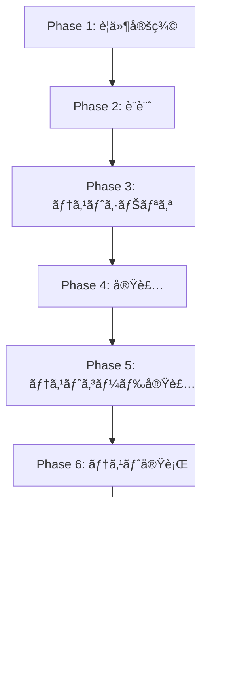

# Codex Agent 実行ログ

開始日時: 2025/12/27 7:44:06

---

## Turn 1: スレッド開始

**Thread ID**: `[REDACTED_TOKEN]`

## Turn 2: ツール実行

**種別**: reasoning
**ステータス**: completed

## Turn 3: ツール実行

**種別**: mcp_tool_call
**ステータス**: completed

## Turn 4: ツール実行

**種別**: reasoning
**ステータス**: completed

## Turn 5: ツール実行

**種別**: コãƒãƒ³ãƒ‰å®Ÿè¡Œ
**コãƒãƒ³ãƒ‰**: `/bin/bash -lc pwd`
**ステータス**: completed (exit_code=0)

```text
/tmp/ai-workflow-repos-7-9513efb4/[REDACTED_TOKEN]
```

## Turn 6: ツール実行

**種別**: reasoning
**ステータス**: completed

## Turn 7: ツール実行

**種別**: コãƒãƒ³ãƒ‰å®Ÿè¡Œ
**コãƒãƒ³ãƒ‰**: `/bin/bash -lc ls`
**ステータス**: completed (exit_code=0)

```text
ARCHITECTURE.md
CLAUDE.md
CONTRIBUTION.md
LICENSE
README.md
ansible
bootstrap
docker
docs
jenkins
pulumi
run_tests_issue_322.sh
scripts
tests
```

## Turn 8: ツール実行

**種別**: reasoning
**ステータス**: completed

## Turn 9: ツール実行

**種別**: コãƒãƒ³ãƒ‰å®Ÿè¡Œ
**コãƒãƒ³ãƒ‰**: `/bin/bash -lc 'ls -a'`
**ステータス**: completed (exit_code=0)

```text
.
..
.ai-workflow
.claude
.coverage
.git
.github
.gitignore
ARCHITECTURE.md
CLAUDE.md
CONTRIBUTION.md
LICENSE
README.md
ansible
bootstrap
docker
docs
jenkins
pulumi
run_tests_issue_322.sh
scripts
tests
```

## Turn 10: ツール実行

**種別**: reasoning
**ステータス**: completed

## Turn 11: ツール実行

**種別**: コãƒãƒ³ãƒ‰å®Ÿè¡Œ
**コãƒãƒ³ãƒ‰**: `/bin/bash -lc 'cat .ai-workflow/issue-540/00_planning/output/planning.md'`
**ステータス**: completed (exit_code=0)

```text
# プロジェクト計画書: Issue #540 - ドキュメントã®è¿½åŠ : infrastructure.md

## Issue分æ

### 複雑度
**中程度**

### 見ç©ã‚‚り工数
**8~12時間**（根拠: 詳細ãªæŠ€è¡“調査ã¨ãƒ‰ã‚­ãƒ¥ãƒ¡ãƒ³ãƒˆæ§‹é€ ã®å¤§å¹…æ›´æ–°ãŒå¿…è¦ï¼‰

**詳細ãªæ ¹æ‹ **:
- **技術調査**: ECS FargateãŠã‚ˆã³é–¢é€£ãƒªã‚½ãƒ¼ã‚¹ã®å®Ÿè£…内容確èªï¼ˆ2~3時間）
- **ドキュメント設計**: æ–°ã—ã„構æˆå›³ãŠã‚ˆã³ã‚»ã‚¯ã‚·ãƒ§ãƒ³è¨­è¨ˆï¼ˆ2~3時間）
- **ドキュメント作æˆ**: infrastructure.mdã®å¤§å¹…æ›´æ–°ãŠã‚ˆã³å›³è¡¨ä½œæˆï¼ˆ3~4時間）
- **レビューã¨ä¿®æ­£**: 実装ã¨ã®æ•´åˆæ€§ç¢ºèªãŠã‚ˆã³èª¿æ•´ï¼ˆ1~2時間）

### リスク評価
**ä½~中**

**リスク詳細**:
- **技術的ãªè¤‡é›‘性**: ECS/ECR/SpotFleetã®è¤‡åˆæ§‹æˆã®æ­£ç¢ºãªæŠŠæ¡ãŒå¿…è¦
- **文書ã®ä¸€è²«æ€§**: ä»–ã®é–¢é€£ãƒ‰ã‚­ãƒ¥ãƒ¡ãƒ³ãƒˆã¨ã®æ•´åˆæ€§ç¢ºä¿
- **実装ã®ç¶™ç¶šçš„変化**: 実装ãŒå¤‰æ›´ã•ã‚Œã‚‹å¯èƒ½æ€§

## 実装戦略判断

### 実装戦略: REFACTOR

**判断根拠**:
既存ã®docs/architecture/infrastructure.mdを大幅ã«æ›´æ–°ã—ã€ç¾åœ¨ã®å®Ÿè£…状æ³ï¼ˆSpotFleet + ECS Fargate併存）ã«åˆè‡´ã•ã›ã‚‹å¿…è¦ãŒã‚ã‚Šã¾ã™ã€‚æ–°è¦ãƒ•ã‚¡ã‚¤ãƒ«ä½œæˆã§ã¯ãªãã€æ—¢å­˜ãƒ‰ã‚­ãƒ¥ãƒ¡ãƒ³ãƒˆã®æ§‹é€ æ”¹å–„ã¨ã‚³ãƒ³ãƒ†ãƒ³ãƒ„æ‹¡å……ãŒä¸­å¿ƒã¨ãªã‚‹ãŸã‚ã€REFACTORãŒé©åˆ‡ã§ã™ã€‚

### テスト戦略: INTEGRATION_ONLY

**判断根拠**:
ドキュメント更新ã®ãŸã‚ã€è‡ªå‹•ãƒ†ã‚¹ãƒˆã¯ä¸è¦ã§ã™ãŒã€è¨˜è¼‰å†…容ãŒå®Ÿè£…ã¨ä¸€è‡´ã™ã‚‹ã‹ã®çµ±åˆæ¤œè¨¼ãŒå¿…è¦ã§ã™ã€‚具体的ã«ã¯ï¼š
- 実装ファイル（pulumi/jenkins-agent/index.ts）ã¨ãƒ‰ã‚­ãƒ¥ãƒ¡ãƒ³ãƒˆã®æ•´åˆæ€§ç¢ºèª
- SSMパラメータ出力åã¨ãƒ‰ã‚­ãƒ¥ãƒ¡ãƒ³ãƒˆè¨˜è¼‰å†…容ã®ä¸€è‡´ç¢ºèª
- docker/jenkins-agent-ecsディレクトリã®å½¹å‰²èª¬æ˜ã®å¦¥å½“性検証

### テストコード戦略: EXTEND_TEST

**判断根拠**:
ドキュメント専用ã®ãƒ†ã‚¹ãƒˆã¯å­˜åœ¨ã—ãªã„ãŸã‚ã€æ—¢å­˜ã®ãƒ‰ã‚­ãƒ¥ãƒ¡ãƒ³ãƒˆæ¤œè¨¼æ‰‹é †ã«æ–°ã—ã„検証項目を追加ã—ã¾ã™ã€‚具体的ã«ã¯ã€å®Ÿè£…ã¨ãƒ‰ã‚­ãƒ¥ãƒ¡ãƒ³ãƒˆã®æ•´åˆæ€§ç¢ºèªãƒã‚§ãƒƒã‚¯ãƒªã‚¹ãƒˆã‚’既存ã®ãƒ¬ãƒ“ュー手順ã«çµ±åˆã—ã¾ã™ã€‚

## 影響範囲分æ

### 既存コードã¸ã®å½±éŸ¿
- **主è¦å¯¾è±¡**: `docs/architecture/infrastructure.md`
- **副次的影響**: README.mdã®ã‚¯ã‚¤ãƒƒã‚¯ãƒŠãƒ“ゲーションã§ã®å‚照整åˆæ€§

### ä¾å­˜é–¢ä¿‚ã®å¤‰æ›´
- **æ–°è¦ä¾å­˜**: ãªã—
- **既存ä¾å­˜ã®å¤‰æ›´**: infrastructure.mdãŒå‚ç…§ã™ã‚‹SSMパラメータåã®æ­£ç¢ºæ€§

### ãƒã‚¤ã‚°ãƒ¬ãƒ¼ã‚·ãƒ§ãƒ³è¦å¦
**ä¸è¦** - ドキュメントã®ã¿ã®æ›´æ–°ã®ãŸã‚

## タスク分割

### Phase 1: è¦ä»¶å®šç¾© (見ç©ã‚‚ã‚Š: 2~3h)

- [x] Task 1-1: ç¾åœ¨ã®å®Ÿè£…状æ³ã®è©³ç´°èª¿æŸ» (1~1.5h)
  - pulumi/jenkins-agent/index.tsã§ã®ECS Fargate関連リソース定義ã®ç¢ºèª
  - SSM出力パラメータå（ecs-cluster-arnã€ecr-repository-url等）ã®æ•´ç†
  - docker/jenkins-agent-ecsã®æ§‹é€ ãŠã‚ˆã³å½¹å‰²ã®ç¢ºèª
- [x] Task 1-2: 既存ドキュメントã®ã‚®ãƒ£ãƒƒãƒ—分æ (0.5~1h)
  - ç¾åœ¨ã®infrastructure.mdã§æ¬ è½ã—ã¦ã„ã‚‹ECS Fargate構æˆã®é …目洗ã„出ã—
  - SpotFleetã¨ECS Fargateã®ä½µå­˜é–¢ä¿‚ã®æ˜ç¢ºåŒ–
- [x] Task 1-3: ドキュメント更新è¦ä»¶ã®å®šç¾© (0.5h)
  - 追加ã™ã¹ãセクション構æˆã®æ±ºå®š
  - 図表やアーキテクãƒãƒ£å›³ã®æ›´æ–°ç¯„囲確定

### Phase 2: 設計 (見ç©ã‚‚ã‚Š: 2~3h)

- [x] Task 2-1: æ–°ã—ã„ドキュメント構造ã®è¨­è¨ˆ (1~1.5h)
  - ECS Fargateエージェントセクションã®è©³ç´°è¨­è¨ˆ
  - SpotFleetã¨ECS Fargateã®æ¯”較表設計
  - SSMパラメータ一覧ã®æ§‹é€ è¨­è¨ˆ
- [x] Task 2-2: 技術構æˆå›³ã®è¨­è¨ˆ (1~1.5h)
  - ç¾åœ¨ã®ã‚¢ãƒ¼ã‚­ãƒ†ã‚¯ãƒãƒ£å›³ã®æ‹¡å¼µè¨­è¨ˆ
  - ECS/ECR/SpotFleet併存構æˆã®å›³è§£è¨­è¨ˆ

### Phase 3: テストシナリオ (見ç©ã‚‚ã‚Š: 1h)

- [ ] Task 3-1: æ•´åˆæ€§æ¤œè¨¼æ‰‹é †ã®ç­–定 (1h)
  - 実装ファイルã¨ãƒ‰ã‚­ãƒ¥ãƒ¡ãƒ³ãƒˆå†…容ã®ç…§åˆæ‰‹é †ä½œæˆ
  - SSMパラメータåã®æ­£ç¢ºæ€§ç¢ºèªæ‰‹é †ä½œæˆ
  - ドキュメント内リンクã®å¦¥å½“性確èªæ‰‹é †ä½œæˆ

### Phase 4: 実装 (見ç©ã‚‚ã‚Š: 3~4h)

- [ ] Task 4-1: infrastructure.mdã®åŸºæœ¬æ§‹é€ æ›´æ–° (1~1.5h)
  - 概è¦ã‚»ã‚¯ã‚·ãƒ§ãƒ³ã¸ã®ECS Fargateエージェント追記
  - ディレクトリ構造ã§ã®docker/jenkins-agent-ecs説æ˜è¿½åŠ 
- [ ] Task 4-2: ECS Fargateã‚¨ãƒ¼ã‚¸ã‚§ãƒ³ãƒˆå°‚ç”¨ã‚»ã‚¯ã‚·ãƒ§ãƒ³ä½œæˆ (1.5~2h)
  - ECS Clusterã€ECR Repositoryã€Task Definitionç­‰ã®è©³ç´°èª¬æ˜
  - SpotFleetエージェントã¨ã®ä½µå­˜é–¢ä¿‚ãŠã‚ˆã³ä½¿ã„分ã‘指é‡
  - docker/jenkins-agent-ecsディレクトリã®å½¹å‰²ã¨åˆ©ç”¨æ‰‹é †
- [ ] Task 4-3: SSMパラメータ一覧ã®æ•´å‚™ (0.5~0.5h)
  - ECS関連SSM出力パラメータã®ä¸€è¦§åŒ–
  - 既存SpotFleet関連パラメータã¨ã®æ•´ç†çµ±åˆ

### Phase 5: テストコード実装 (見ç©ã‚‚ã‚Š: 0.5h)

- [ ] Task 5-1: ドキュメント検証ãƒã‚§ãƒƒã‚¯ãƒªã‚¹ãƒˆã®ä½œæˆ (0.5h)
  - 実装ã¨ãƒ‰ã‚­ãƒ¥ãƒ¡ãƒ³ãƒˆã®æ•´åˆæ€§ç¢ºèªé …目リストã®ä½œæˆ
  - 今後ã®ãƒ‰ã‚­ãƒ¥ãƒ¡ãƒ³ãƒˆæ›´æ–°æ™‚ã®æ¤œè¨¼æ‰‹é †ã®ç­–定

### Phase 6: テスト実行 (見ç©ã‚‚ã‚Š: 1~1.5h)

- [ ] Task 6-1: æ•´åˆæ€§æ¤œè¨¼ã®å®Ÿæ–½ (1~1.5h)
  - pulumi/jenkins-agent/index.tsã¨ãƒ‰ã‚­ãƒ¥ãƒ¡ãƒ³ãƒˆå†…容ã®ç…§åˆå®Ÿæ–½
  - SSMパラメータ出力åã®æ­£ç¢ºæ€§ç¢ºèª
  - ドキュメント内リンクã¨å‚照整åˆæ€§ã®ç¢ºèª

### Phase 7: ドキュメント (見ç©ã‚‚ã‚Š: 0.5h)

- [ ] Task 7-1: 更新内容ã®ãƒ‰ã‚­ãƒ¥ãƒ¡ãƒ³ãƒˆåŒ– (0.5h)
  - 今å›ã®å¤‰æ›´å†…容をchangelogç­‰ã«è¨˜éŒ²
  - ä»–ã®é–¢é€£ãƒ‰ã‚­ãƒ¥ãƒ¡ãƒ³ãƒˆã®æ•´åˆæ€§ç¢ºèª

### Phase 8: レãƒãƒ¼ãƒˆ (見ç©ã‚‚ã‚Š: 0.5h)

- [ ] Task 8-1: プロジェクト完了レãƒãƒ¼ãƒˆä½œæˆ (0.5h)
  - æ›´æ–°ã•ã‚ŒãŸãƒ‰ã‚­ãƒ¥ãƒ¡ãƒ³ãƒˆã®è¦ç‚¹ã‚µãƒãƒªãƒ¼
  - 今後ã®ç¶™ç¶šçš„ãªãƒ‰ã‚­ãƒ¥ãƒ¡ãƒ³ãƒˆä¿å®ˆã«é–¢ã™ã‚‹æ言

## ä¾å­˜é–¢ä¿‚



## リスクã¨è»½æ¸›ç­–

### リスク1: 実装変更ã«ã‚ˆã‚‹ãƒ‰ã‚­ãƒ¥ãƒ¡ãƒ³ãƒˆé™³è…化
- **影響度**: 中
- **確ç‡**: 中
- **軽減策**:
  - 実装ãƒãƒ¼ãƒ ã¨ã®ç¶¿å¯†ãªé€£æº
  - ドキュメント更新ã®è‡ªå‹•åŒ–手順検è¨
  - 定期的ãªæ•´åˆæ€§ç¢ºèªãƒ—ロセスã®ç¢ºç«‹

### リスク2: ECS Fargateã®è¨­å®šè¤‡é›‘性ã«ã‚ˆã‚‹ç†è§£ä¸è¶³
- **影響度**: 中
- **確ç‡**: ä½
- **軽減策**:
  - 実装者ã¸ã®ãƒ’アリング実施
  - 詳細ãªã‚³ãƒ¼ãƒ‰ãƒ¬ãƒ“ューã¨å‹•ä½œç¢ºèª
  - 段éšçš„ãªãƒ‰ã‚­ãƒ¥ãƒ¡ãƒ³ãƒˆä½œæˆã¨ãƒ¬ãƒ“ューサイクル

### リスク3: ドキュメント内ã®æƒ…å ±ä¸æ•´åˆ
- **影響度**: 高
- **確ç‡**: ä½
- **軽減策**:
  - 複数å›ã®æ•´åˆæ€§ç¢ºèªãƒ¬ãƒ“ュー実施
  - 自動的ãªæ•´åˆæ€§ãƒã‚§ãƒƒã‚¯æ‰‹é †ã®ç­–定
  - 実装ã¨ã®ç…§åˆç¢ºèªã®å¾¹åº•

### リスク4: SpotFleetã¨ECS Fargateã®ä½¿ã„分ã‘指é‡ã®æ›–昧性
- **影響度**: 中
- **確ç‡**: 中
- **軽減策**:
  - æ˜ç¢ºãªä½¿ã„分ã‘基準ã®ç­–定
  - 実用例ãŠã‚ˆã³æ¨å¥¨ãƒ‘ターンã®æ˜è¨˜
  - æ„æ€æ±ºå®šãƒ•ãƒ­ãƒ¼ãƒãƒ£ãƒ¼ãƒˆã®ä½œæˆ

## å“質ゲート

### Phase 1: è¦ä»¶å®šç¾©
- [x] ç¾åœ¨ã®å®Ÿè£…状æ³ãŒæ­£ç¢ºã«æŠŠæ¡ã•ã‚Œã¦ã„ã‚‹
- [x] ECS Fargate関連リソースãŒæ¼ã‚Œãªã特定ã•ã‚Œã¦ã„ã‚‹
- [x] SSMパラメータ出力åãŒæ­£ç¢ºã«ãƒªã‚¹ãƒˆã‚¢ãƒƒãƒ—ã•ã‚Œã¦ã„ã‚‹
- [x] 既存ドキュメントã®ã‚®ãƒ£ãƒƒãƒ—ãŒæ˜ç¢ºã«ç‰¹å®šã•ã‚Œã¦ã„ã‚‹

### Phase 2: 設計
- [
... (truncated)
```

## Turn 12: ツール実行

**種別**: reasoning
**ステータス**: completed

## Turn 13: ツール実行

**種別**: reasoning
**ステータス**: completed

## Turn 14: ツール実行

**種別**: reasoning
**ステータス**: completed

## Turn 15: ツール実行

**種別**: コãƒãƒ³ãƒ‰å®Ÿè¡Œ
**コãƒãƒ³ãƒ‰**: `/bin/bash -lc 'cat .ai-workflow/issue-540/04_implementation/output/implementation.md'`
**ステータス**: completed (exit_code=0)

```text
# 実装完了レãƒãƒ¼ãƒˆ

## 変更ファイル一覧

| ファイル | 変更種別 | æ¦‚è¦ |
|---------|---------|------|
| `docs/architecture/infrastructure.md` | 修正 | ECS Fargate エージェント㨠`docker/jenkins-agent-ecs` ã®æ§‹æˆãƒ»SSM パラメータを網羅ã™ã‚‹æ–°ã‚»ã‚¯ã‚·ãƒ§ãƒ³ã‚’追加 |
| `.ai-workflow/issue-540/04_implementation/output/implementation.md` | æ–°è¦ | 本実装ã®ãƒ­ã‚°ã‚’記録 |

## 主è¦ãªå¤‰æ›´ç‚¹

- 概è¦ã¨ãƒ‡ã‚£ãƒ¬ã‚¯ãƒˆãƒªæ§‹é€ ã§ ECS Fargate リソース㨠`docker/jenkins-agent-ecs` é…下ã®èª¬æ˜ã‚’補強ã—ã€æ—¢å­˜ã® SpotFleet 構æˆã¨ã®æ•´åˆæ€§ã‚’確ä¿
- Jenkins エージェント構æˆã®æ¯”較ã€ECS Fargate ã®ãƒªã‚½ãƒ¼ã‚¹è©³ç´°ã€IAM/CloudWatch ã®å½¹å‰²ã‚’æ˜ç¤ºã—ã¦å®Ÿè£…ã¨ã®æ•´åˆæ€§ã‚’æ‹…ä¿
- `docker/jenkins-agent-ecs` ã®å½¹å‰²èª¬æ˜ã¨ ECS 用 SSM パラメータ一覧を表形å¼ã§æ•´ç†ã—ã€Jenkins ã‹ã‚‰ã®åˆ©ç”¨æ‰‹é †ã¨é‹ç”¨ã‚¬ã‚¤ãƒ‰ã‚’æ˜ç¤º

## テスト実施状æ³
- ビルド: 未実施（ドキュメント更新ã®ãŸã‚ä¸è¦ï¼‰
- リント: 未実施（ドキュメント更新ã®ãŸã‚ä¸è¦ï¼‰
- 基本動作確èª: ドキュメント更新ã®ãŸã‚対象無ã—
```

## Turn 16: ツール実行

**種別**: reasoning
**ステータス**: completed

## Turn 17: ツール実行

**種別**: コãƒãƒ³ãƒ‰å®Ÿè¡Œ
**コãƒãƒ³ãƒ‰**: `/bin/bash -lc 'rg -n "Fargate" -n docs/architecture/infrastructure.md'`
**ステータス**: failed (exit_code=127)

```text
/bin/bash: line 1: rg: command not found
```

## Turn 18: ツール実行

**種別**: reasoning
**ステータス**: completed

## Turn 19: ツール実行

**種別**: コãƒãƒ³ãƒ‰å®Ÿè¡Œ
**コãƒãƒ³ãƒ‰**: `/bin/bash -lc 'grep -n "Fargate" -n docs/architecture/infrastructure.md'`
**ステータス**: completed (exit_code=0)

```text
14:- Jenkinsエージェント用ã®ECS Fargateクラスタã€ECRリãƒã‚¸ãƒˆãƒªã€Task Definitionã€CloudWatch Logs
66:│  └─ jenkins-agent-ecs/       # ECS Fargateエージェントイメージ
80:- **docker/**: ECS Fargateエージェントイメージã®å®šç¾©ã€‚`docker/jenkins-agent-ecs/`ã§Dockerfile・entrypoint.shを管ç†
97:本番環境ã§ã¯ã€Jenkins コントローラーã‹ã‚‰æ¥ç¶šã™ã‚‹ã‚¨ãƒ¼ã‚¸ã‚§ãƒ³ãƒˆã‚’ SpotFleet（EC2）㨠ECS Fargate ã®åŒæ–¹ã§é‹ç”¨ã—ã¦ã„ã¾ã™ã€‚SpotFleet ã¯æ—¢å­˜ã®ãƒãƒƒãƒ/長時間ジョブã«å¯¾ã—ã¦å®‰å®šã—ãŸã‚­ãƒ£ãƒ‘シティをæä¾›ã—ã€ECS Fargate ã¯çŸ­æ™‚é–“ã‹ã¤é«˜ã„並列性ãŒæ±‚ã‚られるジョブを高速ã«å‡¦ç†ã—ã¾ã™ã€‚ã©ã¡ã‚‰ã®æ§‹æˆã‚‚ `pulumi/jenkins-agent/index.ts` 内ã§å®šç¾©ã•ã‚ŒãŸãƒªã‚½ãƒ¼ã‚¹ç¾¤ã¨ SSM パラメータを通ã˜ã¦ Jenkins ã«å…¬é–‹ã•ã‚Œã¾ã™ã€‚
99:### SpotFleet vs ECS Fargate 比較
101:| 観点 | SpotFleet | ECS Fargate |
113:- 短時間ã‹ã¤ã‚¹ã‚±ãƒ¼ãƒ«ãŒå¿…è¦ãªã‚¿ã‚¹ã‚¯ã€ãŸã¨ãˆã°ä¸¦åˆ—ビルド/テスト㯠ECS Fargate エージェントã¸åˆ‡ã‚Šæ›¿ãˆ
116:## ECS Fargateエージェント詳細
118:`pulumi/jenkins-agent/index.ts` ã® 739 行以é™ã§ã¯ã€ECS Fargate エージェント用㮠Clusterã€ECRã€Task Definitionã€IAM Roleã€CloudWatch Logs ãŒå®šç¾©ã•ã‚Œã€å„リソース㯠SSM パラメータã¨ã—㦠Jenkins ã«æä¾›ã•ã‚Œã¾ã™ã€‚
122:専用㮠ECS Cluster を作æˆã—ã€Fargate タスクã®å®Ÿè¡Œç’°å¢ƒã‚’分離ã—ã¦ã„ã¾ã™ã€‚クラスタå・ARN 㯠SSM パラメータ `/jenkins-infra/{environment}/agent/ecs-cluster-*` ã§å…¬é–‹ã•ã‚Œã€amazon-ecs プラグインã®ã‚¯ãƒ©ã‚¹ã‚¿è¨­å®šã«ãã®ã¾ã¾æµã—è¾¼ã‚るよã†ã«ã—ã¦ã„ã¾ã™ã€‚
126:`docker/jenkins-agent-ecs` ã§ãƒ“ルドã—㟠Jenkins エージェントイメージã¯å°‚用㮠ECR リãƒã‚¸ãƒˆãƒªã«æ ¼ç´ã•ã‚Œã€Fargate タスクã¯ã“ã®ãƒªãƒã‚¸ãƒˆãƒªã‹ã‚‰ã‚¤ãƒ¡ãƒ¼ã‚¸ã‚’å–å¾—ã—ã¾ã™ã€‚リãƒã‚¸ãƒˆãƒª URL ã‚‚ SSM パラメータã¨ã—ã¦å…¬é–‹ã—ã€ã‚¿ã‚¹ã‚¯å®šç¾©ã® `image` フィールドã¸åŸ‹ã‚è¾¼ã¿ã¾ã™ã€‚
134:Fargate タスクã«ã¯ Execution Role（ECR ã¸ã®ãƒ—ルã€CloudWatch ã¸ã®ãƒ­ã‚°é€ä¿¡ï¼‰ã¨ Task Role（Jenkins 内ã§ã®æ“作権é™ï¼‰ã® 2 ã¤ã® IAM Role を割り当ã¦ã¦ã„ã¾ã™ã€‚Task Role 㯠AdministratorAccess ãƒãƒªã‚·ãƒ¼ã‚’継承ã—ã€SpotFleet ã¨ã¯ç•°ãªã‚‹æœ€å°æ¨©é™ã®å¢ƒç•Œã‚’維æŒã—ã¤ã¤ã‚‚å¿…è¦ãªãƒªã‚½ãƒ¼ã‚¹ã¸ã‚¢ã‚¯ã‚»ã‚¹ã§ãるよã†ã«ã—ã¦ã„ã¾ã™ã€‚
142:`docker/jenkins-agent-ecs` 以下ã«ã¯ã€ECS Fargate ã§å‹•ä½œã™ã‚‹ Jenkins エージェントコンテナã®å®šç¾©ãŒé›†ç´„ã•ã‚Œã¦ã„ã¾ã™ã€‚主ãªãƒ•ã‚¡ã‚¤ãƒ«ã¯æ¬¡ã®é€šã‚Šã§ã™ï¼š
```

## Turn 20: ツール実行

**種別**: reasoning
**ステータス**: completed

## Turn 21: ツール実行

**種別**: コãƒãƒ³ãƒ‰å®Ÿè¡Œ
**コãƒãƒ³ãƒ‰**: `/bin/bash -lc "sed -n '1,220p' docs/architecture/infrastructure.md"`
**ステータス**: completed (exit_code=0)

```text
# インフラストラクãƒãƒ£ã®æ§‹æˆ

> 📖 **親ドキュメント**: [README.md](../../README.md)

## 概è¦

Jenkins基盤ã§åˆ©ç”¨ã™ã‚‹AWSリソースã€ãƒªãƒã‚¸ãƒˆãƒªã®ãƒ‡ã‚£ãƒ¬ã‚¯ãƒˆãƒªæ§‹é€ ã€ä¸»è¦æ©Ÿèƒ½ã¨ç®¡ç†ãƒã‚¤ãƒ³ãƒˆã‚’ã¾ã¨ã‚ã¦ã„ã¾ã™ã€‚

ã“ã®ãƒªãƒã‚¸ãƒˆãƒªã¯ä»¥ä¸‹ã®AWSリソースを設定ã—ã¾ã™ï¼š

- VPCã€ã‚µãƒ–ãƒãƒƒãƒˆã€ãƒ«ãƒ¼ãƒˆãƒ†ãƒ¼ãƒ–ルã€ã‚»ã‚­ãƒ¥ãƒªãƒ†ã‚£ã‚°ãƒ«ãƒ¼ãƒ—ãªã©ã®ãƒãƒƒãƒˆãƒ¯ãƒ¼ã‚¯ãƒªã‚½ãƒ¼ã‚¹
- Jenkinsコントローラー用ã®EC2インスタンス（ブルー/グリーン環境）
- Jenkinsエージェント用ã®EC2 SpotFleet（自動スケーリング対応）
- Jenkinsエージェント用ã®ECS Fargateクラスタã€ECRリãƒã‚¸ãƒˆãƒªã€Task Definitionã€CloudWatch Logs
- Jenkinsエージェント用ã®ã‚«ã‚¹ã‚¿ãƒ AMI（EC2 Image Builder）
- Jenkinsデータ永続化ã®ãŸã‚ã®EFSファイルシステム
- ブルーグリーンデプロイ用ã®ALB（Application Load Balancer）
- Jenkins関連リソースã®IAMロールã¨ãƒãƒªã‚·ãƒ¼
- アプリケーション設定管ç†ç”¨ã®SSMドキュメントã¨ãƒ‘ラメータ

## ディレクトリ構造

```
[REDACTED_TOKEN]/
├─ ansible/                    # Ansible設定ã¨ãƒ—レイブック
│  ├─ inventory/              # インベントリã¨å¤‰æ•°å®šç¾©
│  ├─ playbooks/              # å„種プレイブック
│  │  ├─ jenkins/             # Jenkins関連プレイブック
│  │  │  ├─ deploy/          # デプロイ用
│  │  │  ├─ remove/          # 削除用
│  │  │  ├─ misc/            # ãã®ä»–（更新等）
│  │  │  ├─ [REDACTED_TOKEN].yml    # セットアップパイプライン
│  │  │  └─ [REDACTED_TOKEN].yml # 削除パイプライン
│  │  └─ lambda/              # Lambda関連プレイブック
│  └─ roles/                  # Ansibleロール
│      ├─ aws_setup/          # AWS環境設定
│      ├─ pulumi_helper/      # Pulumiæ“作ヘルパー
│      ├─ jenkins_*/          # Jenkins関連（network, controller, agent等）
│      └─ lambda_*/           # Lambda関連（IP管ç†ã€API Gateway等）
│
├─ bootstrap/                  # ブートストラップ環境構築
│  ├─ [REDACTED_TOKEN].yaml  # CloudFormationテンプレート
│  └─ setup-bootstrap.sh           # セットアップスクリプト
│
├─ jenkins/                    # Jenkins設定ã¨ã‚¸ãƒ§ãƒ–定義
│  └─ jobs/                    # Jenkinsジョブ定義
│      ├─ dsl/                 # Job DSL定義（フォルダ構造等）
│      ├─ pipeline/            # パイプラインジョブ（Jenkinsfile）
│      └─ shared/              # 共有ライブラリ
│
├─ pulumi/                     # Pulumiインフラコード
│  ├─ jenkins-*/               # Jenkinsインフラスタック
│  │  ├─ jenkins-agent/        # Jenkins Agent SpotFleet
│  │  └─ jenkins-agent-ami/    # Jenkins Agent AMI Builder
│  └─ lambda-*/                # Lambdaインフラスタック
│
├─ scripts/                    # ユーティリティスクリプト
│  ├─ aws/                     # AWSæ“作スクリプト
│  └─ jenkins/                 # Jenkins設定スクリプト
│      ├─ casc/                # Configuration as Code設定
│      ├─ groovy/              # GroovyåˆæœŸåŒ–スクリプト
│      ├─ jobs/                # ジョブXML定義
│      └─ shell/               # シェルスクリプト
│
├─ docker/                      # Jenkinsエージェントコンテナ定義
│  └─ jenkins-agent-ecs/       # ECS Fargateエージェントイメージ
│      ├─ Dockerfile           # ECS専用Jenkinsエージェントイメージ
│      └─ entrypoint.sh        # amazon-ecsプラグイン互æ›ã®ã‚¨ãƒ³ãƒˆãƒªãƒ¼ãƒã‚¤ãƒ³ãƒˆ

└─ docs/                       # ドキュメント
```

## 主è¦ãƒ‡ã‚£ãƒ¬ã‚¯ãƒˆãƒªã®èª¬æ˜

- **ansible/**: Ansibleã«ã‚ˆã‚‹è‡ªå‹•åŒ–設定。プレイブックã§ã‚¤ãƒ³ãƒ•ãƒ©ã®æ§‹ç¯‰ãƒ»å‰Šé™¤ãƒ»è¨­å®šã‚’管ç†
- **bootstrap/**: EC2è¸ã¿å°ã‚µãƒ¼ãƒãƒ¼ã®åˆæœŸæ§‹ç¯‰ç”¨CloudFormationã¨ã‚»ãƒƒãƒˆã‚¢ãƒƒãƒ—スクリプト
- **jenkins/**: Jenkinsジョブ定義ã¨ãƒ‘イプライン。Job DSLã¨Jenkinsfileã«ã‚ˆã‚‹ã‚¸ãƒ§ãƒ–管ç†
- **pulumi/**: インフラストラクãƒãƒ£ã®ã‚³ãƒ¼ãƒ‰ã€‚å„コンãƒãƒ¼ãƒãƒ³ãƒˆã‚’独立ã—ãŸã‚¹ã‚¿ãƒƒã‚¯ã¨ã—ã¦ç®¡ç†
- **scripts/**: å„種ユーティリティスクリプト。AWSæ“作ã€Jenkins設定ã€åˆæœŸåŒ–処ç†ãªã©
- **docker/**: ECS Fargateエージェントイメージã®å®šç¾©ã€‚`docker/jenkins-agent-ecs/`ã§Dockerfile・entrypoint.shを管ç†

## 主ãªæ©Ÿèƒ½

- **段éšçš„デプロイ**: Ansibleを使用ã—ã¦å„コンãƒãƒ¼ãƒãƒ³ãƒˆã‚’順番ã«ãƒ‡ãƒ—ロイ
- **段éšçš„削除**: ä¾å­˜é–¢ä¿‚を考慮ã—ãŸå®‰å…¨ãªå‰Šé™¤å‡¦ç†
- **モジュール分割**: å„インフラコンãƒãƒ¼ãƒãƒ³ãƒˆã‚’独立ã—ãŸPulumiスタックã¨ã—ã¦ç®¡ç†
- **ブルー/グリーンデプロイメント**: Jenkinsã®æ›´æ–°ã‚’ç„¡åœæ­¢ã§è¡Œãˆã‚‹ãƒ‡ãƒ¥ã‚¢ãƒ«ç’°å¢ƒ
- **自動スケーリングエージェント**: EC2 SpotFleetã«ã‚ˆã‚‹ã‚³ã‚¹ãƒˆåŠ¹ç‡ã®é«˜ã„Jenkinsエージェント
- **リカãƒãƒªãƒ¼ãƒ¢ãƒ¼ãƒ‰**: 管ç†è€…アカウントロックアウト時ãªã©ã®ç·Šæ€¥ã‚¢ã‚¯ã‚»ã‚¹ç”¨ãƒ¢ãƒ¼ãƒ‰
- **データ永続性**: EFSã«ã‚ˆã‚‹Jenkinsデータã®æ°¸ç¶šåŒ–ã¨é«˜å¯ç”¨æ€§ã®ç¢ºä¿
- **アプリケーション設定管ç†**: Jenkinsãƒãƒ¼ã‚¸ãƒ§ãƒ³æ›´æ–°ã€ãƒ—ラグイン管ç†ã€å†èµ·å‹•å‡¦ç†ã®è‡ªå‹•åŒ–
- **Jenkins CLIユーザー管ç†**: APIトークンを使用ã—ãŸCLIアクセスã®è‡ªå‹•è¨­å®š
- **シードジョブã«ã‚ˆã‚‹ã‚¸ãƒ§ãƒ–管ç†**: Infrastructure as Codeã«ã‚ˆã‚‹ã‚¸ãƒ§ãƒ–ã®è‡ªå‹•ä½œæˆãƒ»æ›´æ–°ãƒ»å‰Šé™¤

## Jenkinsエージェント構æˆ

本番環境ã§ã¯ã€Jenkins コントローラーã‹ã‚‰æ¥ç¶šã™ã‚‹ã‚¨ãƒ¼ã‚¸ã‚§ãƒ³ãƒˆã‚’ SpotFleet（EC2）㨠ECS Fargate ã®åŒæ–¹ã§é‹ç”¨ã—ã¦ã„ã¾ã™ã€‚SpotFleet ã¯æ—¢å­˜ã®ãƒãƒƒãƒ/長時間ジョブã«å¯¾ã—ã¦å®‰å®šã—ãŸã‚­ãƒ£ãƒ‘シティをæä¾›ã—ã€ECS Fargate ã¯çŸ­æ™‚é–“ã‹ã¤é«˜ã„並列性ãŒæ±‚ã‚られるジョブを高速ã«å‡¦ç†ã—ã¾ã™ã€‚ã©ã¡ã‚‰ã®æ§‹æˆã‚‚ `pulumi/jenkins-agent/index.ts` 内ã§å®šç¾©ã•ã‚ŒãŸãƒªã‚½ãƒ¼ã‚¹ç¾¤ã¨ SSM パラメータを通ã˜ã¦ Jenkins ã«å…¬é–‹ã•ã‚Œã¾ã™ã€‚

### SpotFleet vs ECS Fargate 比較

| 観点 | SpotFleet | ECS Fargate |
|------|-----------|-------------|
| コスト | スãƒãƒƒãƒˆã‚¤ãƒ³ã‚¹ã‚¿ãƒ³ã‚¹ã«ã‚ˆã‚‹ä½ã‚³ã‚¹ãƒˆ | オンデãƒãƒ³ãƒ‰èª²é‡‘ã®ãŸã‚やや高価ã ãŒå¿…è¦ãªåˆ†ã ã‘課金 |
| 起動速度 | EC2 ã®èµ·å‹•ã‚’ä¼´ã†ãŸã‚中程度 | コンテナ起動ã®ãŸã‚高速 |
| スケーラビリティ | 数百å°ã¾ã§æ‹¡å¼µå¯èƒ½ | æ•°åƒã‚¿ã‚¹ã‚¯ã®ä¸¦è¡Œå®Ÿè¡ŒãŒå¯èƒ½ |
| 管ç†è² è· | AMI 㨠Launch Template ã®ç®¡ç†ãŒå¿…è¦ |
... (truncated)
```

## Turn 22: ツール実行

**種別**: reasoning
**ステータス**: completed

## Turn 23: ツール実行

**種別**: コãƒãƒ³ãƒ‰å®Ÿè¡Œ
**コãƒãƒ³ãƒ‰**: `/bin/bash -lc 'cat .ai-workflow/issue-540/02_design/output/design.md'`
**ステータス**: completed (exit_code=0)

```text
# 詳細設計書: Issue #540 - ドキュメントã®è¿½åŠ : infrastructure.md

## 0. Planning Document確èª

### 開発戦略ã®æ¦‚è¦
Planning Documentã§ç­–定ã•ã‚ŒãŸæˆ¦ç•¥ã«åŸºã¥ãã€è©³ç´°è¨­è¨ˆã‚’実施ã—ã¾ã™ï¼š

- **実装戦略**: REFACTOR - 既存ã®docs/architecture/infrastructure.mdを大幅ã«æ›´æ–°
- **テスト戦略**: INTEGRATION_ONLY - 実装ã¨ãƒ‰ã‚­ãƒ¥ãƒ¡ãƒ³ãƒˆã®æ•´åˆæ€§ç¢ºèªãŒä¸­å¿ƒ
- **テストコード戦略**: EXTEND_TEST - 既存ã®ãƒ‰ã‚­ãƒ¥ãƒ¡ãƒ³ãƒˆæ¤œè¨¼æ‰‹é †ã«æ–°ã—ã„検証項目を追加
- **工数見ç©ã‚‚ã‚Š**: 8-12時間（技術調査2-3hã€ãƒ‰ã‚­ãƒ¥ãƒ¡ãƒ³ãƒˆè¨­è¨ˆ2-3hã€ä½œæˆ3-4hã€ãƒ¬ãƒ“ュー1-2h）
- **複雑度**: 中程度
- **リスク評価**: ä½ã€œä¸­

## 1. 実装戦略判断

### 実装戦略: REFACTOR

**判断根拠**:
- 既存ã®docs/architecture/infrastructure.mdファイルãŒå­˜åœ¨ã—ã€SpotFleetã«é–¢ã™ã‚‹è¨˜è¿°ã¯é©åˆ‡
- å•é¡Œã¯**内容ã®ä¸è¶³**（ECS Fargate関連ã®è¨˜è¿°ãŒãªã„）ã§ã‚ã‚Šã€æ§‹é€ çš„ãªå•é¡Œã§ã¯ãªã„
- æ–°è¦ãƒ•ã‚¡ã‚¤ãƒ«ä½œæˆã§ã¯ãªãã€æ—¢å­˜ãƒ‰ã‚­ãƒ¥ãƒ¡ãƒ³ãƒˆã«ECS Fargateセクションを追加・統åˆã™ã‚‹ã“ã¨ã§æ•´åˆæ€§ã‚’ä¿ã¤
- 既存ã®æ–‡æ›¸æ§‹é€ ã‚„スタイルを維æŒã—ãªãŒã‚‰ã€ã‚³ãƒ³ãƒ†ãƒ³ãƒ„ã‚’æ‹¡å……ã™ã‚‹å½¢ã§ã®å¯¾å¿œãŒæœ€é©

## 2. テスト戦略判断

### テスト戦略: INTEGRATION_ONLY

**判断根拠**:
- **ドキュメント更新ã®ãŸã‚自動テストコードã¯ä¸è¦**
- **実装ã¨ã®æ•´åˆæ€§ç¢ºèªãŒæœ€ã‚‚é‡è¦**ãªæ¤œè¨¼ãƒã‚¤ãƒ³ãƒˆ
- SSMパラメータ出力åã¨ãƒ‰ã‚­ãƒ¥ãƒ¡ãƒ³ãƒˆè¨˜è¼‰å†…容ã®ä¸€è‡´ç¢ºèªãŒå¿…è¦
- pulumi/jenkins-agent/index.tsã®å®Ÿè£…内容ã¨docã®è¨˜è¼‰å†…容ã®æ•´åˆæ€§æ¤œè¨¼ãŒä¸­å¿ƒ
- BDDやユニットテストã¯è©²å½“ã›ãšã€çµ±åˆçš„ãªæ¤œè¨¼ï¼ˆå®Ÿè£…コードã¨ãƒ‰ã‚­ãƒ¥ãƒ¡ãƒ³ãƒˆã®ç…§åˆï¼‰ã®ã¿ãŒå¿…è¦

## 3. テストコード戦略判断

### テストコード戦略: EXTEND_TEST

**判断根拠**:
- **ドキュメント専用ã®ãƒ†ã‚¹ãƒˆãƒ•ãƒ¬ãƒ¼ãƒ ãƒ¯ãƒ¼ã‚¯ã¯å­˜åœ¨ã—ãªã„**ãŸã‚ã€æ–°è¦ä½œæˆã¯ä¸è¦
- 既存ã®ãƒ¬ãƒ“ュープロセスや文書å“質管ç†æ‰‹é †ã«ã€å®Ÿè£…ã¨ãƒ‰ã‚­ãƒ¥ãƒ¡ãƒ³ãƒˆã®æ•´åˆæ€§ç¢ºèªãƒã‚§ãƒƒã‚¯ãƒªã‚¹ãƒˆã‚’追加
- 継続的ãªå“質管ç†ã®ãŸã‚ã€ä»Šå¾Œã®ãƒ‰ã‚­ãƒ¥ãƒ¡ãƒ³ãƒˆæ›´æ–°æ™‚ã®æ¤œè¨¼æ‰‹é †ã‚’既存プロセスã«çµ±åˆ

## 4. アーキテクãƒãƒ£è¨­è¨ˆ

### ç¾åœ¨ã®æ§‹æˆã¨è¿½åŠ è¦ç´ 

```
Jenkins インフラ (ç¾çŠ¶ + 追加)
├── Jenkinsコントローラー (EC2)
└── Jenkinsエージェント
    ├── EC2 SpotFleet (既存・記載済ã¿)
    │   ├── Medium インスタンス
    │   ├── Small インスタンス
    │   └── Micro インスタンス
    └── ECS Fargate (æ–°è¦ãƒ»è¦è¿½åŠ )  ★
        ├── ECS Cluster
        ├── ECR Repository
        ├── Task Definition
        ├── IAM Roles
        └── CloudWatch Logs
```

### コンãƒãƒ¼ãƒãƒ³ãƒˆé–“関係


### データフロー

1. **エージェント起動フロー**
   - Jenkins Controller → amazon-ecs プラグイン → ECS Fargate Task
   - Jenkins Controller → SpotFleet → EC2 Instance

2. **イメージビルドフロー**
   - docker/jenkins-agent-ecs → Docker Build → ECR Repository
   - ECS Fargate → ECR Repository ã‹ã‚‰ Image Pull

3. **パラメータå‚照フロー**
   - 全エージェント → SSM Parameter Store → 設定値å–å¾—

## 5. 影響範囲分æ

### 既存コードã¸ã®å½±éŸ¿
- **主è¦å¯¾è±¡**: `docs/architecture/infrastructure.md`（大幅更新）
- **副次的影響**:
  - `README.md`ã®ã‚¯ã‚¤ãƒƒã‚¯ãƒŠãƒ“ゲーションã§ã®å‚照整åˆæ€§ç¢ºèª
  - ä»–ã®ãƒ‰ã‚­ãƒ¥ãƒ¡ãƒ³ãƒˆã‹ã‚‰ã®ãƒªãƒ³ã‚¯æ•´åˆæ€§ç¢ºèª

### ä¾å­˜é–¢ä¿‚ã®å¤‰æ›´
- **æ–°è¦ä¾å­˜**: ãªã—（ドキュメント更新ã®ã¿ï¼‰
- **既存ä¾å­˜ã®å¤‰æ›´**: infrastructure.mdãŒå‚ç…§ã™ã‚‹SSMパラメータåã®æ­£ç¢ºæ€§å‘上

### ãƒã‚¤ã‚°ãƒ¬ãƒ¼ã‚·ãƒ§ãƒ³è¦å¦
**ä¸è¦** - ドキュメントã®ã¿ã®æ›´æ–°

## 6. 変更・追加ファイルリスト

### 修正ãŒå¿…è¦ãªæ—¢å­˜ãƒ•ã‚¡ã‚¤ãƒ«
- `docs/architecture/infrastructure.md` - ECS Fargate構æˆã®è¿½åŠ 

### æ–°è¦ä½œæˆãƒ•ã‚¡ã‚¤ãƒ«
- ãªã—

### 削除ãŒå¿…è¦ãªãƒ•ã‚¡ã‚¤ãƒ«
- ãªã—

## 7. 詳細設計

### 7.1 ドキュメント構造設計

#### 既存セクションã®æ›´æ–°

1. **概è¦ã‚»ã‚¯ã‚·ãƒ§ãƒ³** (è¡Œ10-18)
   - ECS Fargate関連リソースã®è¿½åŠ 
   - ECR Repositoryã€ECS Clusterã€Task Definitionã®è¨˜è¼‰

2. **ディレクトリ構造** (行22-65)
   - `docker/jenkins-agent-ecs/` ã®è¿½åŠ èª¬æ˜

#### æ–°è¦ã‚»ã‚¯ã‚·ãƒ§ãƒ³ã®è¿½åŠ 

3. **Jenkins エージェント構æˆæ¯”較** (æ–°è¦)
   - SpotFleet vs ECS Fargate ã®æ¯”較表
   - 使ã„分ã‘指é‡

4. **ECS Fargateエージェント詳細** (æ–°è¦)
   - ECS Cluster構æˆ
   - ECR Repository管ç†
   - Task Definition設定
   - IAM Role設定
   - CloudWatch Logs設定

5. **SSM パラメータ一覧** (æ–°è¦)
   - SpotFleet関連パラメータ
   - ECS Fargate関連パラメータ

### 7.2 SSMパラメータ設計

#### 実装ã‹ã‚‰ç¢ºèªã•ã‚ŒãŸECS関連SSMパラメータ

| パラメータå | èª¬æ˜ | 用途 |
|-------------|------|------|
| `/jenkins-infra/{environment}/agent/ecs-cluster-arn` | ECS Cluster ARN | amazon-ecsプラグイン設定 |
| `/jenkins-infra/{environment}/agent/ecs-cluster-name` | ECS Cluster Name | ã‚¨ãƒ¼ã‚¸ã‚§ãƒ³ãƒˆç®¡ç† |
| `/jenkins-infra/{environment}/agent/ecs-task-definition-arn` | Task Definition ARN | コンテナ起動設定 |
| `/jenkins-infra/{environment}/agent/ecr-repository-url` | ECR Repository URL | イメージå–å¾— |
| `/jenkins-infra/{environment}/agent/ecs-execution-role-arn` | ECS Execution Role ARN | ã‚¿ã‚¹ã‚¯å®Ÿè¡Œæ¨©é™ |
| `/jenkins-infra/{environment}/agent/ecs-task-role-arn` | ECS Task Role ARN | タスク内処ç†æ¨©é™ |
| `/jen
... (truncated)
```

## Turn 24: ツール実行

**種別**: reasoning
**ステータス**: completed

## Turn 25: ツール実行

**種別**: コãƒãƒ³ãƒ‰å®Ÿè¡Œ
**コãƒãƒ³ãƒ‰**: `/bin/bash -lc 'cat .ai-workflow/issue-540/03_test_scenario/output/test-scenario.md'`
**ステータス**: completed (exit_code=0)

```text
# テストシナリオ書: Issue #540 - ドキュメントã®è¿½åŠ : infrastructure.md

## 0. テスト戦略サãƒãƒªãƒ¼

### é¸æŠã•ã‚ŒãŸãƒ†ã‚¹ãƒˆæˆ¦ç•¥ï¼ˆPhase 2ã‹ã‚‰å¼•ç”¨ï¼‰
**テスト戦略: INTEGRATION_ONLY**

**判断根拠**:
- **ドキュメント更新ã®ãŸã‚自動テストコードã¯ä¸è¦**
- **実装ã¨ã®æ•´åˆæ€§ç¢ºèªãŒæœ€ã‚‚é‡è¦**ãªæ¤œè¨¼ãƒã‚¤ãƒ³ãƒˆ
- SSMパラメータ出力åã¨ãƒ‰ã‚­ãƒ¥ãƒ¡ãƒ³ãƒˆè¨˜è¼‰å†…容ã®ä¸€è‡´ç¢ºèªãŒå¿…è¦
- pulumi/jenkins-agent/index.tsã®å®Ÿè£…内容ã¨docã®è¨˜è¼‰å†…容ã®æ•´åˆæ€§æ¤œè¨¼ãŒä¸­å¿ƒ
- BDDやユニットテストã¯è©²å½“ã›ãšã€çµ±åˆçš„ãªæ¤œè¨¼ï¼ˆå®Ÿè£…コードã¨ãƒ‰ã‚­ãƒ¥ãƒ¡ãƒ³ãƒˆã®ç…§åˆï¼‰ã®ã¿ãŒå¿…è¦

### テスト対象ã®ç¯„囲
- `docs/architecture/infrastructure.md` 㨠`pulumi/jenkins-agent/index.ts` ã®æ•´åˆæ€§
- SSMパラメータ出力åã®æ­£ç¢ºæ€§
- `docker/jenkins-agent-ecs` ディレクトリã®å½¹å‰²èª¬æ˜ã®å¦¥å½“性
- ドキュメント内リンクã¨å‚照整åˆæ€§

### テストã®ç›®çš„
æ›´æ–°ã•ã‚ŒãŸãƒ‰ã‚­ãƒ¥ãƒ¡ãƒ³ãƒˆãŒå®Ÿè£…ã¨å®Œå…¨ã«ä¸€è‡´ã—ã€é‹ç”¨æ™‚ã«èª¤èªã‚„作業ミスを引ãèµ·ã“ã•ãªã„正確性を確ä¿ã™ã‚‹ã“ã¨

## 1. Integrationテストシナリオ

### シナリオ1: ECS Fargateリソース定義ã®æ•´åˆæ€§ç¢ºèª

**シナリオå**: infrastructure.md × pulumi/jenkins-agent/index.ts（ECS Fargate部分）

**目的**: ドキュメントã«è¨˜è¼‰ã•ã‚Œã‚‹ECS FargateリソースãŒå®Ÿè£…ã¨ä¸€è‡´ã™ã‚‹ã“ã¨ã‚’検証

**å‰ææ¡ä»¶**:
- pulumi/jenkins-agent/index.tsã®ECS Fargate関連リソース定義（739行目以é™ï¼‰ãŒå­˜åœ¨
- infrastructure.mdã«ECS FargateセクションãŒè¿½åŠ æ¸ˆã¿

**テスト手順**:
1. pulumi/jenkins-agent/index.tsã®739行目以é™ã‹ã‚‰ECS Fargate関連リソースを抽出
2. 以下ã®ãƒªã‚½ãƒ¼ã‚¹å®šç¾©ã‚’特定:
   - ECS Cluster作æˆéƒ¨åˆ†
   - ECR Repository作æˆéƒ¨åˆ†
   - Task Definition作æˆéƒ¨åˆ†
   - IAM Role作æˆéƒ¨åˆ†
   - CloudWatch Logs Group作æˆéƒ¨åˆ†
3. infrastructure.mdã®ã€ŒECS Fargateエージェント詳細ã€ã‚»ã‚¯ã‚·ãƒ§ãƒ³ã¨ç…§åˆ
4. å„リソースã®è¨­å®šå†…容（åå‰ã€è¨­å®šå€¤ã€ä¾å­˜é–¢ä¿‚）ãŒä¸€è‡´ã™ã‚‹ã‹ç¢ºèª

**期待çµæœ**:
- ECS Clusterã®åå‰ã¨è¨­å®šãŒãƒ‰ã‚­ãƒ¥ãƒ¡ãƒ³ãƒˆã¨å®Ÿè£…ã§ä¸€è‡´
- ECR Repositoryã®åå‰ã¨ãƒãƒªã‚·ãƒ¼ãŒä¸€è‡´
- Task Definitionã®è¨­å®šé …目（CPUã€ãƒ¡ãƒ¢ãƒªã€å®Ÿè¡Œãƒ­ãƒ¼ãƒ«ç­‰ï¼‰ãŒä¸€è‡´
- IAM Roleã®æ¨©é™è¨­å®šã¨ãƒãƒªã‚·ãƒ¼ãŒä¸€è‡´
- CloudWatch Logs Groupã®è¨­å®šãŒä¸€è‡´

**確èªé …ç›®**:
- [ ] ECS ClusteråãŒpulumiコードã¨ãƒ‰ã‚­ãƒ¥ãƒ¡ãƒ³ãƒˆã§åŒä¸€
- [ ] ECR Repositoryåã¨URIパターンãŒä¸€è‡´
- [ ] Task Definitionã®CPU/メモリ設定値ãŒä¸€è‡´
- [ ] ECS Execution Roleã®ãƒãƒªã‚·ãƒ¼AttachmentãŒæ­£ç¢º
- [ ] ECS Task Roleã®AdministratorAccessãŒè¨˜è¼‰
- [ ] CloudWatch Logs Groupã®åå‰ã¨ãƒªãƒ†ãƒ³ã‚·ãƒ§ãƒ³è¨­å®šãŒä¸€è‡´

### シナリオ2: SSMパラメータ出力åã®å®Œå…¨ä¸€è‡´ç¢ºèª

**シナリオå**: infrastructure.md × pulumi/jenkins-agent/index.ts（SSMパラメータ部分）

**目的**: ドキュメントã«è¨˜è¼‰ã•ã‚Œã‚‹SSMパラメータåãŒå®Ÿè£…ã®å‡ºåŠ›ã¨å®Œå…¨ã«ä¸€è‡´ã™ã‚‹ã“ã¨ã‚’検証

**å‰ææ¡ä»¶**:
- pulumi/jenkins-agent/index.tsã®943行目以é™ã«ECS関連SSMパラメータ出力ãŒå­˜åœ¨
- infrastructure.mdã®ã€ŒSSMパラメータ一覧ã€ã‚»ã‚¯ã‚·ãƒ§ãƒ³ãŒä½œæˆæ¸ˆã¿

**テスト手順**:
1. pulumi/jenkins-agent/index.tsã®943行目以é™ã‹ã‚‰SSMパラメータ出力を抽出
2. 以下ã®ãƒ‘ラメータを特定:
   - ECS Cluster ARN出力
   - ECS Cluster Name出力
   - ECS Task Definition ARN出力
   - ECR Repository URL出力
   - ECS Execution Role ARN出力
   - ECS Task Role ARN出力
   - ECS Log Group Name出力
3. infrastructure.mdã®ã€ŒSSMパラメータ一覧ã€ãƒ†ãƒ¼ãƒ–ルã¨ç…§åˆ
4. パラメータåã®ãƒ‘ス（`/jenkins-infra/{environment}/agent/...`）ãŒå®Œå…¨ä¸€è‡´ã™ã‚‹ã‹ç¢ºèª

**期待çµæœ**:
- 実装ã§å‡ºåŠ›ã•ã‚Œã‚‹å…¨ã¦ã®ECS関連SSMパラメータãŒãƒ‰ã‚­ãƒ¥ãƒ¡ãƒ³ãƒˆã«è¨˜è¼‰ã•ã‚Œã¦ã„ã‚‹
- パラメータåã®ãƒ‘スãŒå®Ÿè£…ã¨ãƒ‰ã‚­ãƒ¥ãƒ¡ãƒ³ãƒˆã§æ–‡å­—列ã¨ã—ã¦å®Œå…¨ä¸€è‡´
- パラメータã®èª¬æ˜ã¨ç”¨é€”ãŒå®Ÿè£…ã®æ„図ã¨åˆè‡´

**確èªé …ç›®**:
- [ ] `/jenkins-infra/{environment}/agent/ecs-cluster-arn` ã®è¨˜è¼‰
- [ ] `/jenkins-infra/{environment}/agent/ecs-cluster-name` ã®è¨˜è¼‰
- [ ] `/jenkins-infra/{environment}/agent/ecs-task-definition-arn` ã®è¨˜è¼‰
- [ ] `/jenkins-infra/{environment}/agent/ecr-repository-url` ã®è¨˜è¼‰
- [ ] `/jenkins-infra/{environment}/agent/ecs-execution-role-arn` ã®è¨˜è¼‰
- [ ] `/jenkins-infra/{environment}/agent/ecs-task-role-arn` ã®è¨˜è¼‰
- [ ] `/jenkins-infra/{environment}/agent/ecs-log-group-name` ã®è¨˜è¼‰
- [ ] パラメータåã®typoや相é•ãŒãªã„
- [ ] 説æ˜æ–‡ãŒå®Ÿè£…ã®ç”¨é€”ã¨åˆè‡´

### シナリオ3: docker/jenkins-agent-ecsディレクトリã®å½¹å‰²èª¬æ˜å¦¥å½“性確èª

**シナリオå**: infrastructure.md × docker/jenkins-agent-ecs ディレクトリ構æˆ

**目的**: ドキュメントã«è¨˜è¼‰ã•ã‚Œã‚‹docker/jenkins-agent-ecsã®å½¹å‰²èª¬æ˜ãŒå®Ÿéš›ã®ãƒ‡ã‚£ãƒ¬ã‚¯ãƒˆãƒªæ§‹æˆã¨ä¸€è‡´ã™ã‚‹ã“ã¨ã‚’検証

**å‰ææ¡ä»¶**:
- docker/jenkins-agent-ecsディレクトリãŒå­˜åœ¨
- infrastructure.mdã«ãƒ‡ã‚£ãƒ¬ã‚¯ãƒˆãƒªæ§‹é€ èª¬æ˜ãŒè¿½åŠ æ¸ˆã¿

**テスト手順**:
1. docker/jenkins-agent-ecsディレクトリã®å®Ÿéš›ã®æ§‹æˆã‚’確èª
2. 以下ã®ãƒ•ã‚¡ã‚¤ãƒ«ã®å­˜åœ¨ã¨å†…容を確èª:
   - Dockerfile（ECS Fargate用イメージ定義）
   - entrypoint.sh（amazon-ecsプラグイン互æ›ã‚¹ã‚¯ãƒªãƒ—ト）
3. infrastructure.mdã®ã€Œdocker/jenkins-agent-ecs設計ã€ã‚»ã‚¯ã‚·ãƒ§ãƒ³ã¨ç…§åˆ
4. ディレクトリ構æˆå›³ã¨ãƒ•ã‚¡ã‚¤ãƒ«ã®å½¹å‰²èª¬æ˜ãŒå®Ÿæ…‹ã¨ä¸€è‡´ã™ã‚‹ã‹ç¢ºèª

**期待çµæœ**:
- ディレクトリ構æˆå›³ãŒå®Ÿéš›ã®ãƒ•ã‚¡ã‚¤ãƒ«æ§‹é€ ã¨ä¸€è‡´
- Dockerfileã®å½¹å‰²èª¬æ˜ãŒå®Ÿè£…内容ã¨åˆè‡´
- entrypoint.shã®æ©Ÿèƒ½èª¬æ˜ãŒå®Ÿè£…内容ã¨åˆè‡´

**確èªé …ç›®**:
- [ ] ディレクトリ内ã®ãƒ•ã‚¡ã‚¤ãƒ«ä¸€è¦§ãŒãƒ‰ã‚­ãƒ¥ãƒ¡ãƒ³ãƒˆã¨ä¸€è‡´
- [ ] Dockerfileã®èª¬æ˜ï¼ˆMulti-stage buildã€å«æœ‰ãƒ„ール等）ãŒå®Ÿæ…‹ã¨åˆè‡´
- [ ] entrypoint.shã®èª¬æ˜ï¼ˆamazon-ecsプラグイン互æ›æ€§ç­‰ï¼‰ãŒå®Ÿæ…‹ã¨åˆè‡´
- [ ] ファイルã®å½¹å‰²ã¨åˆ©ç”¨æ‰‹é †ãŒå…·ä½“çš„ã§å®Ÿè¡Œå¯èƒ½

### シナリオ4: SpotFleetã¨ECS Fargateã®ä½µå­˜é–¢ä¿‚ã®æŠ€è¡“的妥当性確èª

**シナリオå**: infrastructure.md × 実装全体（SpotFleet + ECS Fargate併存構æˆï¼‰

**目的**: ドキュメントã«è¨˜è¼‰ã•ã‚Œã‚‹SpotFleetã¨ECS Fargateã®ä½µå­˜é–¢ä¿‚ãŒå®Ÿè£…ã®æ§‹æˆã¨åˆè‡´ã™ã‚‹ã“ã¨ã‚’検証

**å‰ææ¡ä»¶**:
- pulumi/jenkins-agent/index.tsã§SpotFleetã¨ECS Fargate両方ã®ãƒªã‚½ãƒ¼ã‚¹ãŒå®šç¾©æ¸ˆã¿
- infrastructure.mdã«ã€ŒJenkins エージェント構æˆæ¯”較ã€ã‚»ã‚¯ã‚·ãƒ§ãƒ³ãŒè¿½åŠ æ¸ˆã¿

**テスト手順**:
1. pulumi/jenkins-agent/index.tsã§Spo
... (truncated)
```

## Turn 26: ツール実行

**種別**: reasoning
**ステータス**: completed

## Turn 27: ツール実行

**種別**: コãƒãƒ³ãƒ‰å®Ÿè¡Œ
**コãƒãƒ³ãƒ‰**: `/bin/bash -lc 'grep -n "ecs" pulumi/jenkins-agent/index.ts'`
**ステータス**: completed (exit_code=0)

```text
740:const ecsCluster = new aws.ecs.Cluster(`agent-ecs-cluster`, {
741:    name: pulumi.interpolate`${projectName}-agent-ecs-${environment}`,
747:        Name: pulumi.interpolate`${projectName}-agent-ecs-cluster-${environment}`,
755:const ecrRepository = new aws.ecr.Repository(`agent-ecs-ecr`, {
756:    name: pulumi.interpolate`${projectName}-agent-ecs-${environment}`,
770:const ecrLifecyclePolicy = new aws.ecr.LifecyclePolicy(`[REDACTED_TOKEN]`, {
789:const ecsLogGroup = new aws.cloudwatch.LogGroup(`agent-ecs-logs`, {
790:    name: `/jenkins-infra/${environment}/ecs-agent`,
800:const ecsExecutionRole = new aws.iam.Role(`[REDACTED_TOKEN]`, {
801:    name: pulumi.interpolate`${projectName}-ecs-execution-role-${environment}`,
807:                Service: "ecs-tasks.amazonaws.com",
816:        Name: pulumi.interpolate`${projectName}-ecs-execution-role-${environment}`,
824:const ecsTaskRole = new aws.iam.Role(`agent-ecs-task-role`, {
825:    name: pulumi.interpolate`${projectName}-ecs-task-role-${environment}`,
831:                Service: "ecs-tasks.amazonaws.com",
840:        Name: pulumi.interpolate`${projectName}-ecs-task-role-${environment}`,
848:const taskDefinition = new aws.ecs.TaskDefinition(`agent-ecs-task-def`, {
849:    family: pulumi.interpolate`${projectName}-agent-ecs-${environment}`,
854:    executionRoleArn: ecsExecutionRole.arn,
855:    taskRoleArn: ecsTaskRole.arn,
856:    [REDACTED_TOKEN]: pulumi.all([ecrRepository.repositoryUrl, ecsLogGroup.name]).apply(
879:        Name: pulumi.interpolate`${projectName}-agent-ecs-task-def-${environment}`,
943:const ecsClusterArnParam = new aws.ssm.Parameter(`[REDACTED_TOKEN]`, {
944:    name: `${ssmPrefix}/agent/ecs-cluster-arn`,
946:    value: ecsCluster.arn,
956:const ecsClusterNameParam = new aws.ssm.Parameter(`[REDACTED_TOKEN]`, {
957:    name: `${ssmPrefix}/agent/ecs-cluster-name`,
959:    value: ecsCluster.name,
969:const [REDACTED_TOKEN] = new aws.ssm.Parameter(`[REDACTED_TOKEN]`, {
970:    name: `${ssmPrefix}/agent/ecs-task-definition-arn`,
982:const [REDACTED_TOKEN] = new aws.ssm.Parameter(`[REDACTED_TOKEN]`, {
983:    name: `${ssmPrefix}/agent/ecs-execution-role-arn`,
985:    value: ecsExecutionRole.arn,
995:const ecsTaskRoleArnParam = new aws.ssm.Parameter(`[REDACTED_TOKEN]`, {
996:    name: `${ssmPrefix}/agent/ecs-task-role-arn`,
998:    value: ecsTaskRole.arn,
1008:const [REDACTED_TOKEN] = new aws.ssm.Parameter(`[REDACTED_TOKEN]`, {
1009:    name: `${ssmPrefix}/agent/ecs-log-group-name`,
1011:    value: ecsLogGroup.name,
1152:export const ecsClusterArn = ecsCluster.arn;
1153:export const ecsClusterName = ecsCluster.name;
1154:export const [REDACTED_TOKEN] = taskDefinition.arn;
1155:export const ecsExecutionRoleArn = ecsExecutionRole.arn;
1156:export const ecsTaskRoleArn = ecsTaskRole.arn;
1157:export const ecsLogGroupName = ecsLogGroup.name;
```

## Turn 28: ツール実行

**種別**: reasoning
**ステータス**: completed

## Turn 29: ツール実行

**種別**: コãƒãƒ³ãƒ‰å®Ÿè¡Œ
**コãƒãƒ³ãƒ‰**: `/bin/bash -lc 'grep -n "ssmPrefix" -n pulumi/jenkins-agent/index.ts'`
**ステータス**: completed (exit_code=0)

```text
15:const ssmPrefix = `/jenkins-infra/${environment}`;
19:    name: `${ssmPrefix}/config/project-name`,
23:    name: `${ssmPrefix}/config/agent-max-capacity`,
26:    name: `${ssmPrefix}/config/agent-min-capacity`,
30:    name: `${ssmPrefix}/config/agent-spot-price`,
33:    name: `${ssmPrefix}/config/agent-instance-type`,
38:    name: `${ssmPrefix}/config/agent-spot-price-medium`,
41:    name: `${ssmPrefix}/config/agent-spot-price-small`,
44:    name: `${ssmPrefix}/config/agent-spot-price-micro`,
49:    name: `${ssmPrefix}/config/agent-medium-min-capacity`,
52:    name: `${ssmPrefix}/config/agent-medium-max-capacity`,
57:    name: `${ssmPrefix}/config/agent-small-min-capacity`,
60:    name: `${ssmPrefix}/config/agent-small-max-capacity`,
65:    name: `${ssmPrefix}/config/agent-micro-min-capacity`,
68:    name: `${ssmPrefix}/config/agent-micro-max-capacity`,
73:    name: `${ssmPrefix}/network/vpc-id`,
76:    name: `${ssmPrefix}/network/private-subnet-a-id`,
79:    name: `${ssmPrefix}/network/private-subnet-b-id`,
84:    name: `${ssmPrefix}/security/jenkins-agent-sg-id`,
140:    name: `${ssmPrefix}/agent/private-key`,
171:    name: `${ssmPrefix}/agent-ami/custom-ami-x86`,
175:    name: `${ssmPrefix}/agent-ami/custom-ami-arm`,
888:    name: `${ssmPrefix}/agent/spotFleetRequestId`,
902:    name: `${ssmPrefix}/agent/spotFleetRequestId-medium`,
916:    name: `${ssmPrefix}/agent/spotFleetRequestId-small`,
930:    name: `${ssmPrefix}/agent/spotFleetRequestId-micro`,
944:    name: `${ssmPrefix}/agent/ecs-cluster-arn`,
957:    name: `${ssmPrefix}/agent/ecs-cluster-name`,
970:    name: `${ssmPrefix}/agent/ecs-task-definition-arn`,
983:    name: `${ssmPrefix}/agent/ecs-execution-role-arn`,
996:    name: `${ssmPrefix}/agent/ecs-task-role-arn`,
1009:    name: `${ssmPrefix}/agent/ecs-log-group-name`,
1022:    name: `${ssmPrefix}/agent/ecr-repository-url`,
1036:    name: `${ssmPrefix}/agent/role-arn`,
1049:    name: `${ssmPrefix}/agent/profile-arn`,
1062:    name: `${ssmPrefix}/agent/launch-template-id`,
1075:    name: `${ssmPrefix}/agent/launch-template-arm-id`,
1088:    name: `${ssmPrefix}/agent/spotfleet-role-arn`,
1101:    name: `${ssmPrefix}/agent/notification-topic-arn`,
1114:    name: `${ssmPrefix}/agent/keypair-name`,
```

## Turn 30: ツール実行

**種別**: reasoning
**ステータス**: completed

## Turn 31: ツール実行

**種別**: reasoning
**ステータス**: completed

## Turn 32: ツール実行

**種別**: file_change
**ステータス**: completed

## Turn 33: ツール実行

**種別**: reasoning
**ステータス**: completed

## Turn 34: ツール実行

**種別**: コãƒãƒ³ãƒ‰å®Ÿè¡Œ
**コãƒãƒ³ãƒ‰**: `/bin/bash -lc "sed -n '1,200p' docker/jenkins-agent-ecs/entrypoint.sh"`
**ステータス**: completed (exit_code=0)

```text
#!/bin/bash
# Jenkins Agent JNLP Entrypoint for ECS Fargate
# amazon-ecsプラグインã‹ã‚‰ã‚³ãƒãƒ³ãƒ‰ãƒ©ã‚¤ãƒ³å¼•æ•°ã‚’å—ã‘å–ã‚‹å½¢å¼
# プラグインãŒæ¸¡ã™å¤ã„å½¢å¼: -url <jenkins-url> <secret> <agent-name>
# æ–°ã—ã„å½¢å¼ã«å¤‰æ›: -url <jenkins-url> -secret <secret> -name <agent-name>

set -e

log() {
    echo "[$(date '+%Y-%m-%d %H:%M:%S')] $*"
}

log "Starting Jenkins Agent..."

JENKINS_AGENT_HOME="${JENKINS_AGENT_HOME:-/home/jenkins}"
WORKDIR="${JENKINS_AGENT_HOME}/agent"
mkdir -p "${WORKDIR}"

log "Received arguments: $*"

# amazon-ecsプラグインãŒæ¸¡ã™å¼•æ•°å½¢å¼ã‚’想定: -url <url> <secret> <name>
# $1 = -url
# $2 = <jenkins-url>
# $3 = <secret>
# $4 = <agent-name>

if [ "$1" = "-url" ] && [ $# -eq 4 ]; then
    JENKINS_URL="$2"
    SECRET="$3"
    AGENT_NAME="$4"

    log "Converted to new JNLP format:"
    log "  URL: ${JENKINS_URL}"
    log "  Agent Name: ${AGENT_NAME}"
    log "  Working directory: ${WORKDIR}"

    exec java \
        -Dhudson.remoting.Launcher.pingIntervalSec=10 \
        -jar "${JENKINS_AGENT_HOME}/agent.jar" \
        -url "${JENKINS_URL}" \
        -secret "${SECRET}" \
        -name "${AGENT_NAME}" \
        -workDir "${WORKDIR}"
else
    # æ—¢ã«æ–°ã—ã„å½¢å¼ã®å ´åˆã¯ãã®ã¾ã¾æ¸¡ã™
    log "Using arguments as-is"
    log "Working directory: ${WORKDIR}"

    exec java \
        -Dhudson.remoting.Launcher.pingIntervalSec=10 \
        -jar "${JENKINS_AGENT_HOME}/agent.jar" \
        -workDir "${WORKDIR}" \
        "$@"
fi
```

## Turn 35: ツール実行

**種別**: reasoning
**ステータス**: completed

## Turn 36: ツール実行

**種別**: コãƒãƒ³ãƒ‰å®Ÿè¡Œ
**コãƒãƒ³ãƒ‰**: `/bin/bash -lc "nl -ba docs/architecture/infrastructure.md | sed -n '1,220p'"`
**ステータス**: completed (exit_code=0)

```text
1	# インフラストラクãƒãƒ£ã®æ§‹æˆ
     2	
     3	> 📖 **親ドキュメント**: [README.md](../../README.md)
     4	
     5	## 概è¦
     6	
     7	Jenkins基盤ã§åˆ©ç”¨ã™ã‚‹AWSリソースã€ãƒªãƒã‚¸ãƒˆãƒªã®ãƒ‡ã‚£ãƒ¬ã‚¯ãƒˆãƒªæ§‹é€ ã€ä¸»è¦æ©Ÿèƒ½ã¨ç®¡ç†ãƒã‚¤ãƒ³ãƒˆã‚’ã¾ã¨ã‚ã¦ã„ã¾ã™ã€‚
     8	
     9	ã“ã®ãƒªãƒã‚¸ãƒˆãƒªã¯ä»¥ä¸‹ã®AWSリソースを設定ã—ã¾ã™ï¼š
    10	
    11	- VPCã€ã‚µãƒ–ãƒãƒƒãƒˆã€ãƒ«ãƒ¼ãƒˆãƒ†ãƒ¼ãƒ–ルã€ã‚»ã‚­ãƒ¥ãƒªãƒ†ã‚£ã‚°ãƒ«ãƒ¼ãƒ—ãªã©ã®ãƒãƒƒãƒˆãƒ¯ãƒ¼ã‚¯ãƒªã‚½ãƒ¼ã‚¹
    12	- Jenkinsコントローラー用ã®EC2インスタンス（ブルー/グリーン環境）
    13	- Jenkinsエージェント用ã®EC2 SpotFleet（自動スケーリング対応）
    14	- Jenkinsエージェント用ã®ECS Fargateクラスタã€ECRリãƒã‚¸ãƒˆãƒªã€Task Definitionã€CloudWatch Logs
    15	- Jenkinsエージェント用ã®ã‚«ã‚¹ã‚¿ãƒ AMI（EC2 Image Builder）
    16	- Jenkinsデータ永続化ã®ãŸã‚ã®EFSファイルシステム
    17	- ブルーグリーンデプロイ用ã®ALB（Application Load Balancer）
    18	- Jenkins関連リソースã®IAMロールã¨ãƒãƒªã‚·ãƒ¼
    19	- アプリケーション設定管ç†ç”¨ã®SSMドキュメントã¨ãƒ‘ラメータ
    20	
    21	## ディレクトリ構造
    22	
    23	```
    24	[REDACTED_TOKEN]/
    25	├─ ansible/                    # Ansible設定ã¨ãƒ—レイブック
    26	│  ├─ inventory/              # インベントリã¨å¤‰æ•°å®šç¾©
    27	│  ├─ playbooks/              # å„種プレイブック
    28	│  │  ├─ jenkins/             # Jenkins関連プレイブック
    29	│  │  │  ├─ deploy/          # デプロイ用
    30	│  │  │  ├─ remove/          # 削除用
    31	│  │  │  ├─ misc/            # ãã®ä»–（更新等）
    32	│  │  │  ├─ [REDACTED_TOKEN].yml    # セットアップパイプライン
    33	│  │  │  └─ [REDACTED_TOKEN].yml # 削除パイプライン
    34	│  │  └─ lambda/              # Lambda関連プレイブック
    35	│  └─ roles/                  # Ansibleロール
    36	│      ├─ aws_setup/          # AWS環境設定
    37	│      ├─ pulumi_helper/      # Pulumiæ“作ヘルパー
    38	│      ├─ jenkins_*/          # Jenkins関連（network, controller, agent等）
    39	│      └─ lambda_*/           # Lambda関連（IP管ç†ã€API Gateway等）
    40	│
    41	├─ bootstrap/                  # ブートストラップ環境構築
    42	│  ├─ [REDACTED_TOKEN].yaml  # CloudFormationテンプレート
    43	│  └─ setup-bootstrap.sh           # セットアップスクリプト
    44	│
    45	├─ jenkins/                    # Jenkins設定ã¨ã‚¸ãƒ§ãƒ–定義
    46	│  └─ jobs/                    # Jenkinsジョブ定義
    47	│      ├─ dsl/                 # Job DSL定義（フォルダ構造等）
    48	│      ├─ pipeline/            # パイプラインジョブ（Jenkinsfile）
    49	│      └─ shared/              # 共有ライブラリ
    50	│
    51	├─ pulumi/                     # Pulumiインフラコード
    52	│  ├─ jenkins-*/               # Jenkinsインフラスタック
    53	│  │  ├─ jenkins-agent/        # Jenkins Agent SpotFleet
    54	│  │  └─ jenkins-agent-ami/    # Jenkins Agent AMI Builder
    55	│  └─ lambda-*/                # Lambdaインフラスタック
    56	│
    57	├─ scripts/                    # ユーティリティスクリプト
    58	│  ├─ aws/                     # AWSæ“作スクリプト
    59	│  └─ jenkins/                 # Jenkins設定スクリプト
    60	│      ├─ casc/                # Configuration as Code設定
    61	│      ├─ groovy/              # GroovyåˆæœŸåŒ–スクリプト
    62	│      ├─ jobs/                # ジョブXML定義
    63	│      └─ shell/               # シェルスクリプト
    64	│
    65	├─ docker/                      # Jenkinsエージェントコンテナ定義
    66	│  └─ jenkins-agent-ecs/       # ECS Fargateエージェントイメージ
    67	│      ├─ Dockerfile           # ECS専用Jenkinsエージェントイメージ
    68	│      └─ entrypoint.sh        # amazon-ecsプラグイン互æ›ã®ã‚¨ãƒ³ãƒˆãƒªãƒ¼ãƒã‚¤ãƒ³ãƒˆ
    69	
    70	└─ docs/                       # ドキュメント
    71	```
    72	
    73	## 主è¦ãƒ‡ã‚£ãƒ¬ã‚¯ãƒˆãƒªã®èª¬æ˜
    74	
    75	- **ansible/**: Ansibleã«ã‚ˆã‚‹è‡ªå‹•åŒ–設定。プレイブックã§ã‚¤ãƒ³ãƒ•ãƒ©ã®æ§‹ç¯‰ãƒ»å‰Šé™¤ãƒ»è¨­å®šã‚’管ç†
    76	- **bootstrap/**: EC2è¸ã¿å°ã‚µãƒ¼ãƒãƒ¼ã®åˆæœŸæ§‹ç¯‰ç”¨CloudFormationã¨ã‚»ãƒƒãƒˆã‚¢ãƒƒãƒ—スクリプト
    77	- **jenkins/**: Jenkinsジョブ定義ã¨ãƒ‘イプライン。Job DSLã¨Jenkinsfileã«ã‚ˆã‚‹ã‚¸ãƒ§ãƒ–管ç†
    78	- **pulumi/**: インフラストラクãƒãƒ£ã®ã‚³ãƒ¼ãƒ‰ã€‚å„コンãƒãƒ¼ãƒãƒ³ãƒˆã‚’独立ã—ãŸã‚¹ã‚¿ãƒƒã‚¯ã¨ã—ã¦ç®¡ç†
    79	- **scripts/**: å„種ユーティリティスクリプト。AWSæ“作ã€Jenkins設定ã€åˆæœŸåŒ–処ç†ãªã©
    80	- **docker/**: ECS Fargateエージェントイメージã®å®šç¾©ã€‚`docker/jenkins-agent-ecs/`ã§Dockerfile・entrypoint.shを管ç†
    81	
    82	## 主ãªæ©Ÿèƒ½
    83	
    84	- **段éšçš„デプロイ**: Ansibleを使用ã—ã¦å„コンãƒãƒ¼ãƒãƒ³ãƒˆã‚’順番ã«ãƒ‡ãƒ—ロイ
    85	- **段éšçš„削除**: ä¾å­˜é–¢ä¿‚を考慮ã—ãŸå®‰å…¨ãªå‰Šé™¤å‡¦ç†
    86	- **モジュール分割**: å„インフラコンãƒãƒ¼ãƒãƒ³ãƒˆã‚’独立ã—ãŸPulumiスタックã¨ã—ã¦ç®¡ç†
    87	- **ブルー/グリーンデプロイメント**: Jenkinsã®æ›´æ–°ã‚’ç„¡åœæ­¢ã§è¡Œãˆã‚‹ãƒ‡ãƒ¥ã‚¢ãƒ«ç’°å¢ƒ
    88	- **自動スケーリングエージェント**: EC2 SpotFleetã«ã‚ˆã‚‹ã‚³ã‚¹ãƒˆåŠ¹ç‡ã®é«˜ã„Jenkinsエージェント
    89	- **リカãƒãƒªãƒ¼ãƒ¢ãƒ¼ãƒ‰**: 管ç†è€…アカウントロックアウト時ãªã©ã®ç·Šæ€¥ã‚¢ã‚¯ã‚»ã‚¹ç”¨ãƒ¢ãƒ¼ãƒ‰
    90	- **データ永続性**: EFSã«ã‚ˆã‚‹Jenkinsデータã®æ°¸ç¶šåŒ–ã¨é«˜å¯ç”¨æ€§ã®ç¢ºä¿
    91	- **アプリケーション設定管ç†**: Jenkinsãƒãƒ¼ã‚¸ãƒ§ãƒ³æ›´æ–°ã€ãƒ—ラグイン管ç†ã€å†èµ·å‹•å‡¦ç†ã®è‡ªå‹•åŒ–
    92	- **Jenkins CLIユーザー管
... (truncated)
```

## Turn 37: ツール実行

**種別**: reasoning
**ステータス**: completed

## Turn 38: ツール実行

**種別**: コãƒãƒ³ãƒ‰å®Ÿè¡Œ
**コãƒãƒ³ãƒ‰**: `/bin/bash -lc 'nl -ba docker/jenkins-agent-ecs/entrypoint.sh'`
**ステータス**: completed (exit_code=0)

```text
1	#!/bin/bash
     2	# Jenkins Agent JNLP Entrypoint for ECS Fargate
     3	# amazon-ecsプラグインã‹ã‚‰ã‚³ãƒãƒ³ãƒ‰ãƒ©ã‚¤ãƒ³å¼•æ•°ã‚’å—ã‘å–ã‚‹å½¢å¼
     4	# プラグインãŒæ¸¡ã™å¤ã„å½¢å¼: -url <jenkins-url> <secret> <agent-name>
     5	# æ–°ã—ã„å½¢å¼ã«å¤‰æ›: -url <jenkins-url> -secret <secret> -name <agent-name>
     6	
     7	set -e
     8	
     9	log() {
    10	    echo "[$(date '+%Y-%m-%d %H:%M:%S')] $*"
    11	}
    12	
    13	log "Starting Jenkins Agent..."
    14	
    15	JENKINS_AGENT_HOME="${JENKINS_AGENT_HOME:-/home/jenkins}"
    16	WORKDIR="${JENKINS_AGENT_HOME}/agent"
    17	mkdir -p "${WORKDIR}"
    18	
    19	log "Received arguments: $*"
    20	
    21	# amazon-ecsプラグインãŒæ¸¡ã™å¼•æ•°å½¢å¼ã‚’想定: -url <url> <secret> <name>
    22	# $1 = -url
    23	# $2 = <jenkins-url>
    24	# $3 = <secret>
    25	# $4 = <agent-name>
    26	
    27	if [ "$1" = "-url" ] && [ $# -eq 4 ]; then
    28	    JENKINS_URL="$2"
    29	    SECRET="$3"
    30	    AGENT_NAME="$4"
    31	
    32	    log "Converted to new JNLP format:"
    33	    log "  URL: ${JENKINS_URL}"
    34	    log "  Agent Name: ${AGENT_NAME}"
    35	    log "  Working directory: ${WORKDIR}"
    36	
    37	    exec java \
    38	        -Dhudson.remoting.Launcher.pingIntervalSec=10 \
    39	        -jar "${JENKINS_AGENT_HOME}/agent.jar" \
    40	        -url "${JENKINS_URL}" \
    41	        -secret "${SECRET}" \
    42	        -name "${AGENT_NAME}" \
    43	        -workDir "${WORKDIR}"
    44	else
    45	    # æ—¢ã«æ–°ã—ã„å½¢å¼ã®å ´åˆã¯ãã®ã¾ã¾æ¸¡ã™
    46	    log "Using arguments as-is"
    47	    log "Working directory: ${WORKDIR}"
    48	
    49	    exec java \
    50	        -Dhudson.remoting.Launcher.pingIntervalSec=10 \
    51	        -jar "${JENKINS_AGENT_HOME}/agent.jar" \
    52	        -workDir "${WORKDIR}" \
    53	        "$@"
    54	fi
```

## Turn 39: ツール実行

**種別**: reasoning
**ステータス**: completed

## Turn 40: ツール実行

**種別**: reasoning
**ステータス**: completed

## Turn 41: ツール実行

**種別**: コãƒãƒ³ãƒ‰å®Ÿè¡Œ
**コãƒãƒ³ãƒ‰**: `/bin/bash -lc "nl -ba pulumi/jenkins-agent/index.ts | sed -n '720,1050p'"`
**ステータス**: completed (exit_code=0)

```text
720	        Name: `[REDACTED_TOKEN]-${environment}`,
   721	        Environment: environment,
   722	        InstanceSize: "micro",
   723	    },
   724	});
   725	
   726	// エージェントã®ã‚¹ãƒ†ãƒ¼ã‚¿ã‚¹ãƒ¢ãƒ‹ã‚¿ãƒªãƒ³ã‚°ç”¨SNSトピック
   727	const [REDACTED_TOKEN] = new aws.sns.Topic(`[REDACTED_TOKEN]`, {
   728	    name: `[REDACTED_TOKEN]-${environment}`,
   729	    tags: {
   730	        Name: `[REDACTED_TOKEN]-${environment}`,
   731	        Environment: environment,
   732	    },
   733	});
   734	
   735	// ==============================
   736	// ECS Fargateリソース（新è¦è¿½åŠ ï¼‰
   737	// ==============================
   738	
   739	// ECS Cluster（コンテナインサイト有効）
   740	const ecsCluster = new aws.ecs.Cluster(`agent-ecs-cluster`, {
   741	    name: pulumi.interpolate`${projectName}-agent-ecs-${environment}`,
   742	    settings: [{
   743	        name: "containerInsights",
   744	        value: "enabled",
   745	    }],
   746	    tags: {
   747	        Name: pulumi.interpolate`${projectName}-agent-ecs-cluster-${environment}`,
   748	        Environment: environment,
   749	        ManagedBy: "pulumi",
   750	        Component: "agent",
   751	    },
   752	});
   753	
   754	// ECRリãƒã‚¸ãƒˆãƒªï¼ˆã‚¹ã‚­ãƒ£ãƒ³æœ‰åŠ¹ + ライフサイクルãƒãƒªã‚·ãƒ¼ï¼‰
   755	const ecrRepository = new aws.ecr.Repository(`agent-ecs-ecr`, {
   756	    name: pulumi.interpolate`${projectName}-agent-ecs-${environment}`,
   757	    [REDACTED_TOKEN]: {
   758	        scanOnPush: true,
   759	    },
   760	    imageTagMutability: "MUTABLE",
   761	    forceDelete: environment === "dev",
   762	    tags: {
   763	        Name: pulumi.interpolate`${projectName}-agent-ecr-${environment}`,
   764	        Environment: environment,
   765	        ManagedBy: "pulumi",
   766	        Component: "agent",
   767	    },
   768	});
   769	
   770	const ecrLifecyclePolicy = new aws.ecr.LifecyclePolicy(`[REDACTED_TOKEN]`, {
   771	    repository: ecrRepository.name,
   772	    policy: JSON.stringify({
   773	        rules: [{
   774	            rulePriority: 1,
   775	            description: "Keep last 10 images",
   776	            selection: {
   777	                tagStatus: "any",
   778	                countType: "imageCountMoreThan",
   779	                countNumber: 10,
   780	            },
   781	            action: {
   782	                type: "expire",
   783	            },
   784	        }],
   785	    }),
   786	});
   787	
   788	// CloudWatch Logs (30æ—¥ä¿æŒ)
   789	const ecsLogGroup = new aws.cloudwatch.LogGroup(`agent-ecs-logs`, {
   790	    name: `/jenkins-infra/${environment}/ecs-agent`,
   791	    retentionInDays: 30,
   792	    tags: {
   793	        Environment: environment,
   794	        ManagedBy: "pulumi",
   795	        Component: "agent",
   796	    },
   797	});
   798	
   799	// ECS Task Execution Role
   800	const ecsExecutionRole = new aws.iam.Role(`[REDACTED_TOKEN]`, {
   801	    name: pulumi.interpolate`${projectName}-ecs-execution-role-${environment}`,
   802	    assumeRolePolicy: JSON.stringify({
   803	        Version: "2012-10-17",
   804	        Statement: [{
   805	            Effect: "Allow",
   806	            Principal: {
   807	                Service: "ecs-tasks.amazonaws.com",
   808	            },
   809	            Action: "sts:AssumeRole",
   810	        }],
   811	    }),
   812	    managedPolicyArns: [
   813	        "arn:aws:iam::aws:policy/service-role/[REDACTED_TOKEN]",
   814	    ],
   815	    tags: {
   816	        Name: pulumi.interpolate`${projectName}-ecs-execution-role-${environment}`,
   817	        Environment: environment,
   818	        ManagedBy: "pulumi",
   819	        Component: "agent",
   820	    },
   821	});
   822	
   823	// ECS Task Role（ビルド用途ã§åºƒã‚ã®æ¨©é™ã‚’許å¯ï¼‰
   824	const ecsTaskRole = new aws.iam.Role(`agent-ecs-task-role`, {
   825	    name: pulumi.interpolate`${projectName}-ecs-task-role-${environment}`,
   826	    assumeRolePolicy: JSON.stringify({
   827
... (truncated)
```

## Turn 42: ツール実行

**種別**: reasoning
**ステータス**: completed

## Turn 43: ツール実行

**種別**: コãƒãƒ³ãƒ‰å®Ÿè¡Œ
**コãƒãƒ³ãƒ‰**: `/bin/bash -lc 'git status -sb'`
**ステータス**: completed (exit_code=0)

```text
## ai-workflow/issue-540...origin/main [ahead 12]
 M .ai-workflow/issue-540/00_planning/output/planning.md
 M .ai-workflow/issue-540/metadata.json
?? .ai-workflow/issue-540/00_planning/execute/agent_log_raw.txt
?? .ai-workflow/issue-540/00_planning/execute/prompt.txt
?? .ai-workflow/issue-540/00_planning/review/agent_log_raw.txt
?? .ai-workflow/issue-540/00_planning/review/prompt.txt
?? .ai-workflow/issue-540/01_requirements/execute/agent_log_raw.txt
?? .ai-workflow/issue-540/01_requirements/execute/prompt.txt
?? .ai-workflow/issue-540/01_requirements/review/agent_log_raw.txt
?? .ai-workflow/issue-540/01_requirements/review/prompt.txt
?? .ai-workflow/issue-540/02_design/execute/agent_log_raw.txt
?? .ai-workflow/issue-540/02_design/execute/prompt.txt
?? .ai-workflow/issue-540/02_design/review/agent_log_raw.txt
?? .ai-workflow/issue-540/02_design/review/prompt.txt
?? .ai-workflow/issue-540/03_test_scenario/execute/agent_log_raw.txt
?? .ai-workflow/issue-540/03_test_scenario/execute/prompt.txt
?? .ai-workflow/issue-540/03_test_scenario/review/agent_log_raw.txt
?? .ai-workflow/issue-540/03_test_scenario/review/prompt.txt
?? .ai-workflow/issue-540/04_implementation/execute/agent_log_raw.txt
?? .ai-workflow/issue-540/04_implementation/execute/prompt.txt
?? .ai-workflow/issue-540/04_implementation/review/
```

## Turn 44: ツール実行

**種別**: reasoning
**ステータス**: completed

## Turn 45: ツール実行

**種別**: agent_message
**ステータス**: completed

## Turn 46: ツール実行

**種別**: todo_list
**ステータス**: completed

## Turn 47: 実行完了

**ステータス**: completed
**所è¦æ™‚é–“**: 113079ms
**ターン数**: N/A

---

**経é時間**: 113079ms
**開始**: 2025-12-27T07:44:06.581Z
**終了**: 2025-12-27T07:45:59.660Z