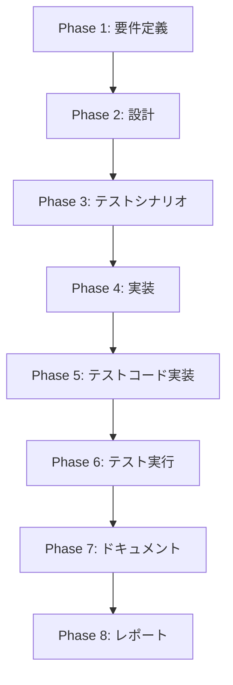
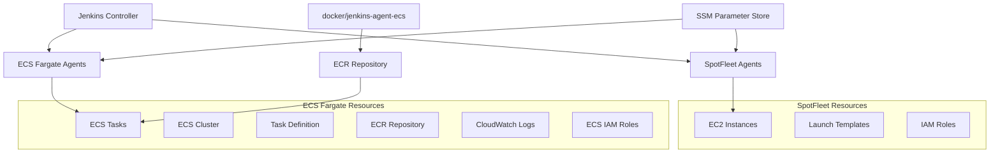

# Codex Agent 実行ログ

開始日時: 2025/12/27 7:46:03

---

## Turn 1: スレッド開始

**Thread ID**: `[REDACTED_TOKEN]`

## Turn 2: ツール実行

**種別**: reasoning
**ステータス**: completed

## Turn 3: ツール実行

**種別**: コマンド実行
**コマンド**: `/bin/bash -lc pwd`
**ステータス**: completed (exit_code=0)

```text
/tmp/ai-workflow-repos-7-9513efb4/infrastructure-as-code
```

## Turn 4: ツール実行

**種別**: reasoning
**ステータス**: completed

## Turn 5: ツール実行

**種別**: コマンド実行
**コマンド**: `/bin/bash -lc ls`
**ステータス**: completed (exit_code=0)

```text
ARCHITECTURE.md
CLAUDE.md
CONTRIBUTION.md
LICENSE
README.md
ansible
bootstrap
docker
docs
jenkins
pulumi
run_tests_issue_322.sh
scripts
tests
```

## Turn 6: ツール実行

**種別**: reasoning
**ステータス**: completed

## Turn 7: ツール実行

**種別**: コマンド実行
**コマンド**: `/bin/bash -lc 'ls .ai-workflow'`
**ステータス**: completed (exit_code=0)

```text
issue-193
issue-304
issue-305
issue-310
issue-313
issue-315
issue-317
issue-319
issue-320
issue-322
issue-324
issue-331
issue-332
issue-355
issue-360
issue-362
issue-363
issue-369
issue-370
issue-396
issue-398
issue-405
issue-411
issue-415
issue-423
issue-431
issue-437
issue-440
issue-445
issue-453
issue-455
issue-456
issue-460
issue-461
issue-462
issue-463
issue-464
issue-465
issue-475
issue-477
issue-479
issue-540
```

## Turn 8: ツール実行

**種別**: reasoning
**ステータス**: completed

## Turn 9: ツール実行

**種別**: コマンド実行
**コマンド**: `/bin/bash -lc 'ls .ai-workflow/issue-540'`
**ステータス**: completed (exit_code=0)

```text
00_planning
01_requirements
02_design
03_test_scenario
04_implementation
05_test_implementation
metadata.json
```

## Turn 10: ツール実行

**種別**: reasoning
**ステータス**: completed

## Turn 11: ツール実行

**種別**: コマンド実行
**コマンド**: `/bin/bash -lc 'cat .ai-workflow/issue-540/00_planning/output/planning.md'`
**ステータス**: completed (exit_code=0)

```text
# プロジェクト計画書: Issue #540 - ドキュメントの追加: infrastructure.md

## Issue分析

### 複雑度
**中程度**

### 見積もり工数
**8~12時間**（根拠: 詳細な技術調査とドキュメント構造の大幅更新が必要）

**詳細な根拠**:
- **技術調査**: ECS Fargateおよび関連リソースの実装内容確認（2~3時間）
- **ドキュメント設計**: 新しい構成図およびセクション設計（2~3時間）
- **ドキュメント作成**: infrastructure.mdの大幅更新および図表作成（3~4時間）
- **レビューと修正**: 実装との整合性確認および調整（1~2時間）

### リスク評価
**低~中**

**リスク詳細**:
- **技術的な複雑性**: ECS/ECR/SpotFleetの複合構成の正確な把握が必要
- **文書の一貫性**: 他の関連ドキュメントとの整合性確保
- **実装の継続的変化**: 実装が変更される可能性

## 実装戦略判断

### 実装戦略: REFACTOR

**判断根拠**:
既存のdocs/architecture/infrastructure.mdを大幅に更新し、現在の実装状況（SpotFleet + ECS Fargate併存）に合致させる必要があります。新規ファイル作成ではなく、既存ドキュメントの構造改善とコンテンツ拡充が中心となるため、REFACTORが適切です。

### テスト戦略: INTEGRATION_ONLY

**判断根拠**:
ドキュメント更新のため、自動テストは不要ですが、記載内容が実装と一致するかの統合検証が必要です。具体的には：
- 実装ファイル（pulumi/jenkins-agent/index.ts）とドキュメントの整合性確認
- SSMパラメータ出力名とドキュメント記載内容の一致確認
- docker/jenkins-agent-ecsディレクトリの役割説明の妥当性検証

### テストコード戦略: EXTEND_TEST

**判断根拠**:
ドキュメント専用のテストは存在しないため、既存のドキュメント検証手順に新しい検証項目を追加します。具体的には、実装とドキュメントの整合性確認チェックリストを既存のレビュー手順に統合します。

## 影響範囲分析

### 既存コードへの影響
- **主要対象**: `docs/architecture/infrastructure.md`
- **副次的影響**: README.mdのクイックナビゲーションでの参照整合性

### 依存関係の変更
- **新規依存**: なし
- **既存依存の変更**: infrastructure.mdが参照するSSMパラメータ名の正確性

### マイグレーション要否
**不要** - ドキュメントのみの更新のため

## タスク分割

### Phase 1: 要件定義 (見積もり: 2~3h)

- [x] Task 1-1: 現在の実装状況の詳細調査 (1~1.5h)
  - pulumi/jenkins-agent/index.tsでのECS Fargate関連リソース定義の確認
  - SSM出力パラメータ名（ecs-cluster-arn、ecr-repository-url等）の整理
  - docker/jenkins-agent-ecsの構造および役割の確認
- [x] Task 1-2: 既存ドキュメントのギャップ分析 (0.5~1h)
  - 現在のinfrastructure.mdで欠落しているECS Fargate構成の項目洗い出し
  - SpotFleetとECS Fargateの併存関係の明確化
- [x] Task 1-3: ドキュメント更新要件の定義 (0.5h)
  - 追加すべきセクション構成の決定
  - 図表やアーキテクチャ図の更新範囲確定

### Phase 2: 設計 (見積もり: 2~3h)

- [x] Task 2-1: 新しいドキュメント構造の設計 (1~1.5h)
  - ECS Fargateエージェントセクションの詳細設計
  - SpotFleetとECS Fargateの比較表設計
  - SSMパラメータ一覧の構造設計
- [x] Task 2-2: 技術構成図の設計 (1~1.5h)
  - 現在のアーキテクチャ図の拡張設計
  - ECS/ECR/SpotFleet併存構成の図解設計

### Phase 3: テストシナリオ (見積もり: 1h)

- [ ] Task 3-1: 整合性検証手順の策定 (1h)
  - 実装ファイルとドキュメント内容の照合手順作成
  - SSMパラメータ名の正確性確認手順作成
  - ドキュメント内リンクの妥当性確認手順作成

### Phase 4: 実装 (見積もり: 3~4h)

- [x] Task 4-1: infrastructure.mdの基本構造更新 (1~1.5h)
  - 概要セクションへのECS Fargateエージェント追記
  - ディレクトリ構造でのdocker/jenkins-agent-ecs説明追加
- [x] Task 4-2: ECS Fargateエージェント専用セクション作成 (1.5~2h)
  - ECS Cluster、ECR Repository、Task Definition等の詳細説明
  - SpotFleetエージェントとの併存関係および使い分け指針
  - docker/jenkins-agent-ecsディレクトリの役割と利用手順
- [x] Task 4-3: SSMパラメータ一覧の整備 (0.5~0.5h)
  - ECS関連SSM出力パラメータの一覧化
  - 既存SpotFleet関連パラメータとの整理統合

### Phase 5: テストコード実装 (見積もり: 0.5h)

- [ ] Task 5-1: ドキュメント検証チェックリストの作成 (0.5h)
  - 実装とドキュメントの整合性確認項目リストの作成
  - 今後のドキュメント更新時の検証手順の策定

### Phase 6: テスト実行 (見積もり: 1~1.5h)

- [ ] Task 6-1: 整合性検証の実施 (1~1.5h)
  - pulumi/jenkins-agent/index.tsとドキュメント内容の照合実施
  - SSMパラメータ出力名の正確性確認
  - ドキュメント内リンクと参照整合性の確認

### Phase 7: ドキュメント (見積もり: 0.5h)

- [ ] Task 7-1: 更新内容のドキュメント化 (0.5h)
  - 今回の変更内容をchangelog等に記録
  - 他の関連ドキュメントの整合性確認

### Phase 8: レポート (見積もり: 0.5h)

- [ ] Task 8-1: プロジェクト完了レポート作成 (0.5h)
  - 更新されたドキュメントの要点サマリー
  - 今後の継続的なドキュメント保守に関する提言

## 依存関係



## リスクと軽減策

### リスク1: 実装変更によるドキュメント陳腐化
- **影響度**: 中
- **確率**: 中
- **軽減策**:
  - 実装チームとの綿密な連携
  - ドキュメント更新の自動化手順検討
  - 定期的な整合性確認プロセスの確立

### リスク2: ECS Fargateの設定複雑性による理解不足
- **影響度**: 中
- **確率**: 低
- **軽減策**:
  - 実装者へのヒアリング実施
  - 詳細なコードレビューと動作確認
  - 段階的なドキュメント作成とレビューサイクル

### リスク3: ドキュメント内の情報不整合
- **影響度**: 高
- **確率**: 低
- **軽減策**:
  - 複数回の整合性確認レビュー実施
  - 自動的な整合性チェック手順の策定
  - 実装との照合確認の徹底

### リスク4: SpotFleetとECS Fargateの使い分け指針の曖昧性
- **影響度**: 中
- **確率**: 中
- **軽減策**:
  - 明確な使い分け基準の策定
  - 実用例および推奨パターンの明記
  - 意思決定フローチャートの作成

## 品質ゲート

### Phase 1: 要件定義
- [x] 現在の実装状況が正確に把握されている
- [x] ECS Fargate関連リソースが漏れなく特定されている
- [x] SSMパラメータ出力名が正確にリストアップされている
- [x] 既存ドキュメントのギャップが明確に特定されている

### Phase 2: 設計
- [
... (truncated)
```

## Turn 12: ツール実行

**種別**: コマンド実行
**コマンド**: `/bin/bash -lc 'cat .ai-workflow/issue-540/03_test_scenario/output/test-scenario.md'`
**ステータス**: completed (exit_code=0)

```text
# テストシナリオ書: Issue #540 - ドキュメントの追加: infrastructure.md

## 0. テスト戦略サマリー

### 選択されたテスト戦略（Phase 2から引用）
**テスト戦略: INTEGRATION_ONLY**

**判断根拠**:
- **ドキュメント更新のため自動テストコードは不要**
- **実装との整合性確認が最も重要**な検証ポイント
- SSMパラメータ出力名とドキュメント記載内容の一致確認が必要
- pulumi/jenkins-agent/index.tsの実装内容とdocの記載内容の整合性検証が中心
- BDDやユニットテストは該当せず、統合的な検証（実装コードとドキュメントの照合）のみが必要

### テスト対象の範囲
- `docs/architecture/infrastructure.md` と `pulumi/jenkins-agent/index.ts` の整合性
- SSMパラメータ出力名の正確性
- `docker/jenkins-agent-ecs` ディレクトリの役割説明の妥当性
- ドキュメント内リンクと参照整合性

### テストの目的
更新されたドキュメントが実装と完全に一致し、運用時に誤認や作業ミスを引き起こさない正確性を確保すること

## 1. Integrationテストシナリオ

### シナリオ1: ECS Fargateリソース定義の整合性確認

**シナリオ名**: infrastructure.md × pulumi/jenkins-agent/index.ts（ECS Fargate部分）

**目的**: ドキュメントに記載されるECS Fargateリソースが実装と一致することを検証

**前提条件**:
- pulumi/jenkins-agent/index.tsのECS Fargate関連リソース定義（739行目以降）が存在
- infrastructure.mdにECS Fargateセクションが追加済み

**テスト手順**:
1. pulumi/jenkins-agent/index.tsの739行目以降からECS Fargate関連リソースを抽出
2. 以下のリソース定義を特定:
   - ECS Cluster作成部分
   - ECR Repository作成部分
   - Task Definition作成部分
   - IAM Role作成部分
   - CloudWatch Logs Group作成部分
3. infrastructure.mdの「ECS Fargateエージェント詳細」セクションと照合
4. 各リソースの設定内容（名前、設定値、依存関係）が一致するか確認

**期待結果**:
- ECS Clusterの名前と設定がドキュメントと実装で一致
- ECR Repositoryの名前とポリシーが一致
- Task Definitionの設定項目（CPU、メモリ、実行ロール等）が一致
- IAM Roleの権限設定とポリシーが一致
- CloudWatch Logs Groupの設定が一致

**確認項目**:
- [ ] ECS Cluster名がpulumiコードとドキュメントで同一
- [ ] ECR Repository名とURIパターンが一致
- [ ] Task DefinitionのCPU/メモリ設定値が一致
- [ ] ECS Execution RoleのポリシーAttachmentが正確
- [ ] ECS Task RoleのAdministratorAccessが記載
- [ ] CloudWatch Logs Groupの名前とリテンション設定が一致

### シナリオ2: SSMパラメータ出力名の完全一致確認

**シナリオ名**: infrastructure.md × pulumi/jenkins-agent/index.ts（SSMパラメータ部分）

**目的**: ドキュメントに記載されるSSMパラメータ名が実装の出力と完全に一致することを検証

**前提条件**:
- pulumi/jenkins-agent/index.tsの943行目以降にECS関連SSMパラメータ出力が存在
- infrastructure.mdの「SSMパラメータ一覧」セクションが作成済み

**テスト手順**:
1. pulumi/jenkins-agent/index.tsの943行目以降からSSMパラメータ出力を抽出
2. 以下のパラメータを特定:
   - ECS Cluster ARN出力
   - ECS Cluster Name出力
   - ECS Task Definition ARN出力
   - ECR Repository URL出力
   - ECS Execution Role ARN出力
   - ECS Task Role ARN出力
   - ECS Log Group Name出力
3. infrastructure.mdの「SSMパラメータ一覧」テーブルと照合
4. パラメータ名のパス（`/jenkins-infra/{environment}/agent/...`）が完全一致するか確認

**期待結果**:
- 実装で出力される全てのECS関連SSMパラメータがドキュメントに記載されている
- パラメータ名のパスが実装とドキュメントで文字列として完全一致
- パラメータの説明と用途が実装の意図と合致

**確認項目**:
- [ ] `/jenkins-infra/{environment}/agent/ecs-cluster-arn` の記載
- [ ] `/jenkins-infra/{environment}/agent/ecs-cluster-name` の記載
- [ ] `/jenkins-infra/{environment}/agent/ecs-task-definition-arn` の記載
- [ ] `/jenkins-infra/{environment}/agent/ecr-repository-url` の記載
- [ ] `/jenkins-infra/{environment}/agent/ecs-execution-role-arn` の記載
- [ ] `/jenkins-infra/{environment}/agent/ecs-task-role-arn` の記載
- [ ] `/jenkins-infra/{environment}/agent/ecs-log-group-name` の記載
- [ ] パラメータ名のtypoや相違がない
- [ ] 説明文が実装の用途と合致

### シナリオ3: docker/jenkins-agent-ecsディレクトリの役割説明妥当性確認

**シナリオ名**: infrastructure.md × docker/jenkins-agent-ecs ディレクトリ構成

**目的**: ドキュメントに記載されるdocker/jenkins-agent-ecsの役割説明が実際のディレクトリ構成と一致することを検証

**前提条件**:
- docker/jenkins-agent-ecsディレクトリが存在
- infrastructure.mdにディレクトリ構造説明が追加済み

**テスト手順**:
1. docker/jenkins-agent-ecsディレクトリの実際の構成を確認
2. 以下のファイルの存在と内容を確認:
   - Dockerfile（ECS Fargate用イメージ定義）
   - entrypoint.sh（amazon-ecsプラグイン互換スクリプト）
3. infrastructure.mdの「docker/jenkins-agent-ecs設計」セクションと照合
4. ディレクトリ構成図とファイルの役割説明が実態と一致するか確認

**期待結果**:
- ディレクトリ構成図が実際のファイル構造と一致
- Dockerfileの役割説明が実装内容と合致
- entrypoint.shの機能説明が実装内容と合致

**確認項目**:
- [ ] ディレクトリ内のファイル一覧がドキュメントと一致
- [ ] Dockerfileの説明（Multi-stage build、含有ツール等）が実態と合致
- [ ] entrypoint.shの説明（amazon-ecsプラグイン互換性等）が実態と合致
- [ ] ファイルの役割と利用手順が具体的で実行可能

### シナリオ4: SpotFleetとECS Fargateの併存関係の技術的妥当性確認

**シナリオ名**: infrastructure.md × 実装全体（SpotFleet + ECS Fargate併存構成）

**目的**: ドキュメントに記載されるSpotFleetとECS Fargateの併存関係が実装の構成と合致することを検証

**前提条件**:
- pulumi/jenkins-agent/index.tsでSpotFleetとECS Fargate両方のリソースが定義済み
- infrastructure.mdに「Jenkins エージェント構成比較」セクションが追加済み

**テスト手順**:
1. pulumi/jenkins-agent/index.tsでSpo
... (truncated)
```

## Turn 13: ツール実行

**種別**: コマンド実行
**コマンド**: `/bin/bash -lc 'cat .ai-workflow/issue-540/04_implementation/output/implementation.md'`
**ステータス**: completed (exit_code=0)

```text
# 実装完了レポート

## 変更ファイル一覧

| ファイル | 変更種別 | 概要 |
|---------|---------|------|
| `docs/architecture/infrastructure.md` | 修正 | ECS Fargate エージェントと `docker/jenkins-agent-ecs` の構成・SSM パラメータを網羅する新セクションを追加 |
| `.ai-workflow/issue-540/04_implementation/output/implementation.md` | 新規 | 本実装のログを記録 |

## 主要な変更点

- 概要とディレクトリ構造で ECS Fargate リソースと `docker/jenkins-agent-ecs` 配下の説明を補強し、既存の SpotFleet 構成との整合性を確保
- Jenkins エージェント構成の比較、ECS Fargate のリソース詳細、IAM/CloudWatch の役割を明示して実装との整合性を担保
- `docker/jenkins-agent-ecs` の役割説明と ECS 用 SSM パラメータ一覧を表形式で整理し、Jenkins からの利用手順と運用ガイドを明示

## テスト実施状況
- ビルド: 未実施（ドキュメント更新のため不要）
- リント: 未実施（ドキュメント更新のため不要）
- 基本動作確認: ドキュメント更新のため対象無し
```

## Turn 14: ツール実行

**種別**: reasoning
**ステータス**: completed

## Turn 15: ツール実行

**種別**: コマンド実行
**コマンド**: `/bin/bash -lc 'cat .ai-workflow/issue-540/01_requirements/output/requirements.md'`
**ステータス**: completed (exit_code=0)

```text
# 要件定義書: Issue #540 - ドキュメントの追加: infrastructure.md

## 0. Planning Documentの確認

### 開発計画の全体像
- **実装戦略**: REFACTOR - 既存のdocs/architecture/infrastructure.mdを大幅に更新
- **テスト戦略**: INTEGRATION_ONLY - 実装とドキュメントの整合性確認が中心
- **テストコード戦略**: EXTEND_TEST - 既存のドキュメント検証手順に新しい検証項目を追加
- **工数見積もり**: 8-12時間（技術調査2-3h、ドキュメント設計2-3h、作成3-4h、レビュー1-2h）
- **複雑度**: 中程度
- **リスク評価**: 低〜中

Planning Documentで策定された戦略に基づき、実装との整合性を最優先として要件定義を実施します。

## 1. 概要

### 背景と目的
現在のdocs/architecture/infrastructure.mdはJenkinsエージェントをEC2 SpotFleetのみと記載しており、pulumi/jenkins-agent/index.tsで追加されたECS Fargateクラスタ・ECRリポジトリ・SSM出力やdocker/jenkins-agent-ecsディレクトリの存在が反映されていません。

この文書と実装の乖離により、エージェント管理やトラブルシュート時に古い構成を参照して作業ミスや工数増を招くリスクが発生しています。

### ビジネス価値・技術的価値
1. **運用効率向上**: 最新の実装状況に基づいた正確な手順により、エージェント増設時の作業時間短縮
2. **品質向上**: 文書と実装の一致により、構成理解の誤認防止と判断精度向上
3. **知識共有促進**: チーム間での最新構成に関する共通理解の確立
4. **保守性向上**: 継続的なドキュメント更新手順の確立による技術的負債の抑制

## 2. 機能要件

### F001: ECS Fargateエージェント構成の追記（優先度: 高）
- **要件**: docs/architecture/infrastructure.mdにECS Fargateベースのエージェント構成を追加
- **詳細**:
  - ECS Cluster、ECR Repository、Task Definition等の詳細説明
  - SpotFleetエージェントとの併存関係および使い分け指針
  - docker/jenkins-agent-ecsディレクトリの役割と利用手順

### F002: SSM出力パラメータの正確な記載（優先度: 高）
- **要件**: ECS関連SSMパラメータの一覧化と説明追加
- **対象パラメータ**:
  - `/jenkins-infra/{environment}/agent/ecs-cluster-arn`
  - `/jenkins-infra/{environment}/agent/ecs-cluster-name`
  - `/jenkins-infra/{environment}/agent/ecs-task-definition-arn`
  - `/jenkins-infra/{environment}/agent/ecr-repository-url`
  - `/jenkins-infra/{environment}/agent/ecs-execution-role-arn`
  - `/jenkins-infra/{environment}/agent/ecs-task-role-arn`
  - `/jenkins-infra/{environment}/agent/ecs-log-group-name`

### F003: ディレクトリ構造の更新（優先度: 中）
- **要件**: プロジェクト構造図にdocker/jenkins-agent-ecsディレクトリの説明を追加
- **詳細**: DockerfileとEntrypoint scriptの役割明記

### F004: アーキテクチャ図の拡張（優先度: 中）
- **要件**: SpotFleetとECS Fargateの併存構成を図解
- **詳細**: エージェント種別ごとのデプロイフローの可視化

### F005: 概要セクションのリソース一覧更新（優先度: 中）
- **要件**: インフラリソース一覧にECS Fargateエージェント関連を追加
- **追加項目**: ECS Cluster、ECR Repository、CloudWatch Logs、ECS Task Definition

## 3. 非機能要件

### 3.1 パフォーマンス要件
- ドキュメント読み込み時間: 3秒以内（既存と同等）
- 内容理解時間: 新規参加者が15分以内に全体構成を把握可能

### 3.2 セキュリティ要件
- 機密情報のハードコーディング禁止
- SSMパラメータの具体値記載禁止（パラメータ名のみ記載）

### 3.3 可用性・信頼性要件
- 実装変更時の文書追従体制の確立
- 定期的な整合性確認プロセスの策定

### 3.4 保守性・拡張性要件
- セクション構造の論理的整合性維持
- 将来の追加エージェント種別に対する拡張容易性

## 4. 制約事項

### 4.1 技術的制約
- 既存のinfrastructure.mdファイル形式（Markdown）を維持
- 他の関連ドキュメントとの整合性確保
- プロジェクトのコーディング規約（日本語記述）に準拠

### 4.2 リソース制約
- 工数: 8-12時間（Planning Documentに基づく）
- 実装者: 1名
- レビュー期間: 1-2営業日

### 4.3 ポリシー制約
- ドキュメントは日本語で記述（CLAUDE.mdに基づく）
- 実装との完全な整合性確保が必須

## 5. 前提条件

### 5.1 システム環境
- pulumi/jenkins-agent/index.tsが正常にデプロイされている
- ECS Fargate関連リソースが期待通りに作成されている
- docker/jenkins-agent-ecsディレクトリが存在し利用可能

### 5.2 依存コンポーネント
- Pulumiスタック: jenkins-agent
- SSMパラメータストア: ECS関連出力パラメータ
- ECRリポジトリ: エージェントイメージ格納済み

### 5.3 外部システム連携
- なし（ドキュメント更新のみ）

## 6. 受け入れ基準

### AC001: ECS Fargate構成の正確な記載
- **Given**: pulumi/jenkins-agent/index.tsのECS Fargateリソース定義
- **When**: infrastructure.mdを参照する
- **Then**: ECS Cluster、ECR Repository、Task Definition等が正確に説明されている

### AC002: SSMパラメータの完全網羅
- **Given**: pulumi/jenkins-agent/index.tsで出力されるSSMパラメータ
- **When**: infrastructure.mdを確認する
- **Then**: 全てのECS関連SSMパラメータが記載されている

### AC003: SpotFleetとの併存関係の明確化
- **Given**: SpotFleetとECS Fargateの両エージェント構成
- **When**: エージェント選択を判断する
- **Then**: 使い分け指針が明確に記載されている

### AC004: docker/jenkins-agent-ecsの役割説明
- **Given**: docker/jenkins-agent-ecsディレクトリの存在
- **When**: エージェントイメージを管理する
- **Then**: ディレクトリの役割と利用手順が具体的に記載されている

### AC005: 実装との整合性確認
- **Given**: 更新されたinfrastructure.md
- **When**: 実装ファイルとの照合を実施
- **Then**: すべての記載内容が実装と一致している

### AC006: 他ドキュメントとのリンク整合性
- **Given**: infrastructure.mdの更新
- **When**: README.mdのクイックナビゲーションから参照
- **Then**: リンクが正常に機能し参照整合性が確保されている

## 7. スコープ外

### 7.1 明確にスコープ外とする事項
- ECS Fargateエージェントの新規実装（既存実装の文書化のみ）
- Jenkins設定ファイルの変更
- Pulumiスタックの修正
- 自動テストコードの作成

### 7.2 将来的な拡張候補
- ECS FargateエージェントのAuto Scalingポリシー設定
- エージェント性能比較ベンチマーク
- コスト分析レポート
- 運用監視ダッシュボー
... (truncated)
```

## Turn 16: ツール実行

**種別**: コマンド実行
**コマンド**: `/bin/bash -lc 'cat .ai-workflow/issue-540/02_design/output/design.md'`
**ステータス**: completed (exit_code=0)

```text
# 詳細設計書: Issue #540 - ドキュメントの追加: infrastructure.md

## 0. Planning Document確認

### 開発戦略の概要
Planning Documentで策定された戦略に基づき、詳細設計を実施します：

- **実装戦略**: REFACTOR - 既存のdocs/architecture/infrastructure.mdを大幅に更新
- **テスト戦略**: INTEGRATION_ONLY - 実装とドキュメントの整合性確認が中心
- **テストコード戦略**: EXTEND_TEST - 既存のドキュメント検証手順に新しい検証項目を追加
- **工数見積もり**: 8-12時間（技術調査2-3h、ドキュメント設計2-3h、作成3-4h、レビュー1-2h）
- **複雑度**: 中程度
- **リスク評価**: 低〜中

## 1. 実装戦略判断

### 実装戦略: REFACTOR

**判断根拠**:
- 既存のdocs/architecture/infrastructure.mdファイルが存在し、SpotFleetに関する記述は適切
- 問題は**内容の不足**（ECS Fargate関連の記述がない）であり、構造的な問題ではない
- 新規ファイル作成ではなく、既存ドキュメントにECS Fargateセクションを追加・統合することで整合性を保つ
- 既存の文書構造やスタイルを維持しながら、コンテンツを拡充する形での対応が最適

## 2. テスト戦略判断

### テスト戦略: INTEGRATION_ONLY

**判断根拠**:
- **ドキュメント更新のため自動テストコードは不要**
- **実装との整合性確認が最も重要**な検証ポイント
- SSMパラメータ出力名とドキュメント記載内容の一致確認が必要
- pulumi/jenkins-agent/index.tsの実装内容とdocの記載内容の整合性検証が中心
- BDDやユニットテストは該当せず、統合的な検証（実装コードとドキュメントの照合）のみが必要

## 3. テストコード戦略判断

### テストコード戦略: EXTEND_TEST

**判断根拠**:
- **ドキュメント専用のテストフレームワークは存在しない**ため、新規作成は不要
- 既存のレビュープロセスや文書品質管理手順に、実装とドキュメントの整合性確認チェックリストを追加
- 継続的な品質管理のため、今後のドキュメント更新時の検証手順を既存プロセスに統合

## 4. アーキテクチャ設計

### 現在の構成と追加要素

```
Jenkins インフラ (現状 + 追加)
├── Jenkinsコントローラー (EC2)
└── Jenkinsエージェント
    ├── EC2 SpotFleet (既存・記載済み)
    │   ├── Medium インスタンス
    │   ├── Small インスタンス
    │   └── Micro インスタンス
    └── ECS Fargate (新規・要追加)  ★
        ├── ECS Cluster
        ├── ECR Repository
        ├── Task Definition
        ├── IAM Roles
        └── CloudWatch Logs
```

### コンポーネント間関係



### データフロー

1. **エージェント起動フロー**
   - Jenkins Controller → amazon-ecs プラグイン → ECS Fargate Task
   - Jenkins Controller → SpotFleet → EC2 Instance

2. **イメージビルドフロー**
   - docker/jenkins-agent-ecs → Docker Build → ECR Repository
   - ECS Fargate → ECR Repository から Image Pull

3. **パラメータ参照フロー**
   - 全エージェント → SSM Parameter Store → 設定値取得

## 5. 影響範囲分析

### 既存コードへの影響
- **主要対象**: `docs/architecture/infrastructure.md`（大幅更新）
- **副次的影響**:
  - `README.md`のクイックナビゲーションでの参照整合性確認
  - 他のドキュメントからのリンク整合性確認

### 依存関係の変更
- **新規依存**: なし（ドキュメント更新のみ）
- **既存依存の変更**: infrastructure.mdが参照するSSMパラメータ名の正確性向上

### マイグレーション要否
**不要** - ドキュメントのみの更新

## 6. 変更・追加ファイルリスト

### 修正が必要な既存ファイル
- `docs/architecture/infrastructure.md` - ECS Fargate構成の追加

### 新規作成ファイル
- なし

### 削除が必要なファイル
- なし

## 7. 詳細設計

### 7.1 ドキュメント構造設計

#### 既存セクションの更新

1. **概要セクション** (行10-18)
   - ECS Fargate関連リソースの追加
   - ECR Repository、ECS Cluster、Task Definitionの記載

2. **ディレクトリ構造** (行22-65)
   - `docker/jenkins-agent-ecs/` の追加説明

#### 新規セクションの追加

3. **Jenkins エージェント構成比較** (新規)
   - SpotFleet vs ECS Fargate の比較表
   - 使い分け指針

4. **ECS Fargateエージェント詳細** (新規)
   - ECS Cluster構成
   - ECR Repository管理
   - Task Definition設定
   - IAM Role設定
   - CloudWatch Logs設定

5. **SSM パラメータ一覧** (新規)
   - SpotFleet関連パラメータ
   - ECS Fargate関連パラメータ

### 7.2 SSMパラメータ設計

#### 実装から確認されたECS関連SSMパラメータ

| パラメータ名 | 説明 | 用途 |
|-------------|------|------|
| `/jenkins-infra/{environment}/agent/ecs-cluster-arn` | ECS Cluster ARN | amazon-ecsプラグイン設定 |
| `/jenkins-infra/{environment}/agent/ecs-cluster-name` | ECS Cluster Name | エージェント管理 |
| `/jenkins-infra/{environment}/agent/ecs-task-definition-arn` | Task Definition ARN | コンテナ起動設定 |
| `/jenkins-infra/{environment}/agent/ecr-repository-url` | ECR Repository URL | イメージ取得 |
| `/jenkins-infra/{environment}/agent/ecs-execution-role-arn` | ECS Execution Role ARN | タスク実行権限 |
| `/jenkins-infra/{environment}/agent/ecs-task-role-arn` | ECS Task Role ARN | タスク内処理権限 |
| `/jen
... (truncated)
```

## Turn 17: ツール実行

**種別**: reasoning
**ステータス**: completed

## Turn 18: ツール実行

**種別**: コマンド実行
**コマンド**: `/bin/bash -lc 'ls tests'`
**ステータス**: completed (exit_code=0)

```text
__init__.py
integration
```

## Turn 19: ツール実行

**種別**: reasoning
**ステータス**: completed

## Turn 20: ツール実行

**種別**: コマンド実行
**コマンド**: `/bin/bash -lc 'ls tests/integration'`
**ステータス**: completed (exit_code=0)

```text
__init__.py
ecs-fargate
[REDACTED_TOKEN].py
[REDACTED_TOKEN].py
[REDACTED_TOKEN].py
[REDACTED_TOKEN].py
[REDACTED_TOKEN].py
[REDACTED_TOKEN].py
[REDACTED_TOKEN].py
```

## Turn 21: ツール実行

**種別**: reasoning
**ステータス**: completed

## Turn 22: ツール実行

**種別**: コマンド実行
**コマンド**: `/bin/bash -lc "sed -n '1,200p' tests/integration/[REDACTED_TOKEN].py"`
**ステータス**: completed (exit_code=0)

```text
"""Integration tests validating documentation navigation and link integrity for Issue #538."""

import contextlib
import unittest
from pathlib import Path
from urllib import error, request


class [REDACTED_TOKEN](unittest.TestCase):
    """Integration checks for the README refactor and docs split."""

    @classmethod
    def setUpClass(cls):
        cls.repo_root = Path(__file__).resolve().parents[2]
        cls.readme = cls.repo_root / "README.md"
        cls.docs_dir = cls.repo_root / "docs"
        cls.expected_docs = {
            cls.docs_dir / "changelog.md": "../README.md",
            cls.docs_dir / "troubleshooting.md": "../README.md",
            cls.docs_dir / "setup" / "prerequisites.md": "../../README.md",
            cls.docs_dir / "setup" / "bootstrap.md": "../../README.md",
            cls.docs_dir / "setup" / "pulumi-backend.md": "../../README.md",
            cls.docs_dir / "operations" / "jenkins-deploy.md": "../../README.md",
            cls.docs_dir / "operations" / "jenkins-management.md": "../../README.md",
            cls.docs_dir / "operations" / "[REDACTED_TOKEN].md": "../../README.md",
            cls.docs_dir / "operations" / "[REDACTED_TOKEN].md": "../../README.md",
            cls.docs_dir / "operations" / "parameters.md": "../../README.md",
            cls.docs_dir / "architecture" / "infrastructure.md": "../../README.md",
            cls.docs_dir / "development" / "extension.md": "../../README.md",
        }
        cls.quick_nav_links = [
            "docs/setup/prerequisites.md",
            "docs/setup/bootstrap.md",
            "docs/setup/pulumi-backend.md",
            "docs/operations/jenkins-deploy.md",
            "docs/operations/jenkins-management.md",
            "docs/operations/[REDACTED_TOKEN].md",
            "docs/operations/[REDACTED_TOKEN].md",
            "docs/operations/parameters.md",
            "docs/architecture/infrastructure.md",
            "docs/development/extension.md",
            "docs/troubleshooting.md",
            "docs/changelog.md",
        ]
        cls.external_links = [
            "https://__GITHUB_URL_0__/issues/411",
            "https://__GITHUB_URL_1__/issues/415",
            "https://platform.openai.com/api-keys",
            "https://github.com/settings/apps",
        ]

    def [REDACTED_TOKEN](self):
        """INT-006: Expected documentation directories are present."""
        expected_dirs = [
            self.docs_dir,
            self.docs_dir / "setup",
            self.docs_dir / "operations",
            self.docs_dir / "architecture",
            self.docs_dir / "development",
            self.docs_dir / "issues",
        ]
        for directory in expected_dirs:
            self.assertTrue(directory.is_dir(), f"Missing directory: {directory}")

    def [REDACTED_TOKEN](self):
        """INT-001 / INT-002: Split docs exist and include the correct parent link."""
        for doc_path, parent_link in self.expected_docs.items():
            self.assertTrue(doc_path.is_file(), f"Missing document: {doc_path}")
            content = doc_path.read_text(encoding="utf-8")
            self.assertTrue(
                content.lstrip().startswith("# "),
                f"{doc_path} should start with an H1 heading",
            )
            self.assertIn(
                parent_link,
                content,
                f"{doc_path} should link back to README via {parent_link}",
            )

    def [REDACTED_TOKEN](self):
        """INT-001 / INT-004 / INT-009: README keeps quick navigation and important doc links."""
        readme_text = self.readme.read_text(encoding="utf-8")
        for link in self.quick_nav_links:
            self.assertIn(f"({link})", readme_text, f"README should link to {link}")
        for critical in ("ARCHITECTURE.md", "CLAUDE.md", "CONTRIBUTION.md"):
            s
... (truncated)
```

## Turn 23: ツール実行

**種別**: reasoning
**ステータス**: completed

## Turn 24: ツール実行

**種別**: コマンド実行
**コマンド**: `/bin/bash -lc 'ls tests/integration/ecs-fargate'`
**ステータス**: completed (exit_code=0)

```text
[REDACTED_TOKEN].sh
test_docker_build.sh
[REDACTED_TOKEN].sh
[REDACTED_TOKEN].sh
[REDACTED_TOKEN].sh
```

## Turn 25: ツール実行

**種別**: reasoning
**ステータス**: completed

## Turn 26: ツール実行

**種別**: コマンド実行
**コマンド**: `/bin/bash -lc "sed -n '700,1100p' pulumi/jenkins-agent/index.ts"`
**ステータス**: completed (exit_code=0)

```text
instanceType: "t3.micro",
                            spotPrice: spotPriceMicro,
                            priority: 2,
                        }
                    ];
                }
            });

            configs.push({
                [REDACTED_TOKEN]: {
                    id: agentLaunchTemplate.id,
                    version: agentLaunchTemplate.latestVersion.apply(v => v.toString()),
                },
                overrides: x86MicroOverrides,
            });
        });

        return configs;
    }),
    tags: {
        Name: `[REDACTED_TOKEN]-${environment}`,
        Environment: environment,
        InstanceSize: "micro",
    },
});

// エージェントのステータスモニタリング用SNSトピック
const [REDACTED_TOKEN] = new aws.sns.Topic(`[REDACTED_TOKEN]`, {
    name: `[REDACTED_TOKEN]-${environment}`,
    tags: {
        Name: `[REDACTED_TOKEN]-${environment}`,
        Environment: environment,
    },
});

// ==============================
// ECS Fargateリソース（新規追加）
// ==============================

// ECS Cluster（コンテナインサイト有効）
const ecsCluster = new aws.ecs.Cluster(`agent-ecs-cluster`, {
    name: pulumi.interpolate`${projectName}-agent-ecs-${environment}`,
    settings: [{
        name: "containerInsights",
        value: "enabled",
    }],
    tags: {
        Name: pulumi.interpolate`${projectName}-agent-ecs-cluster-${environment}`,
        Environment: environment,
        ManagedBy: "pulumi",
        Component: "agent",
    },
});

// ECRリポジトリ（スキャン有効 + ライフサイクルポリシー）
const ecrRepository = new aws.ecr.Repository(`agent-ecs-ecr`, {
    name: pulumi.interpolate`${projectName}-agent-ecs-${environment}`,
    [REDACTED_TOKEN]: {
        scanOnPush: true,
    },
    imageTagMutability: "MUTABLE",
    forceDelete: environment === "dev",
    tags: {
        Name: pulumi.interpolate`${projectName}-agent-ecr-${environment}`,
        Environment: environment,
        ManagedBy: "pulumi",
        Component: "agent",
    },
});

const ecrLifecyclePolicy = new aws.ecr.LifecyclePolicy(`[REDACTED_TOKEN]`, {
    repository: ecrRepository.name,
    policy: JSON.stringify({
        rules: [{
            rulePriority: 1,
            description: "Keep last 10 images",
            selection: {
                tagStatus: "any",
                countType: "imageCountMoreThan",
                countNumber: 10,
            },
            action: {
                type: "expire",
            },
        }],
    }),
});

// CloudWatch Logs (30日保持)
const ecsLogGroup = new aws.cloudwatch.LogGroup(`agent-ecs-logs`, {
    name: `/jenkins-infra/${environment}/ecs-agent`,
    retentionInDays: 30,
    tags: {
        Environment: environment,
        ManagedBy: "pulumi",
        Component: "agent",
    },
});

// ECS Task Execution Role
const ecsExecutionRole = new aws.iam.Role(`[REDACTED_TOKEN]`, {
    name: pulumi.interpolate`${projectName}-ecs-execution-role-${environment}`,
    assumeRolePolicy: JSON.stringify({
        Version: "2012-10-17",
        Statement: [{
            Effect: "Allow",
            Principal: {
                Service: "ecs-tasks.amazonaws.com",
            },
            Action: "sts:AssumeRole",
        }],
    }),
    managedPolicyArns: [
        "arn:aws:iam::aws:policy/service-role/[REDACTED_TOKEN]",
    ],
    tags: {
        Name: pulumi.interpolate`${projectName}-ecs-execution-role-${environment}`,
        Environment: environment,
        ManagedBy: "pulumi",
        Component: "agent",
    },
});

// ECS Task Role（ビルド用途で広めの権限を許可）
const ecsTaskRole = new aws.iam.Role(`agent-ecs-task-role`, {
    name: pulumi.interpolate`${projectName}-ecs-task-role-${environment}`,
    assumeRolePolicy: JSON.stringify({
        Version: "2012-10-17",
        Statement: [{
            Effect: "Allow",
            Principal: {
                Service: "ecs-tasks.amazonaws.com",
            },
            Action: "sts:
... (truncated)
```

## Turn 27: ツール実行

**種別**: reasoning
**ステータス**: completed

## Turn 28: ツール実行

**種別**: コマンド実行
**コマンド**: `/bin/bash -lc "sed -n '1,200p' docs/architecture/infrastructure.md"`
**ステータス**: completed (exit_code=0)

```text
# インフラストラクチャの構成

> 📖 **親ドキュメント**: [README.md](../../README.md)

## 概要

Jenkins基盤で利用するAWSリソース、リポジトリのディレクトリ構造、主要機能と管理ポイントをまとめています。

このリポジトリは以下のAWSリソースを設定します：

- VPC、サブネット、ルートテーブル、セキュリティグループなどのネットワークリソース
- Jenkinsコントローラー用のEC2インスタンス（ブルー/グリーン環境）
- Jenkinsエージェント用のEC2 SpotFleet（自動スケーリング対応）
- Jenkinsエージェント用のECS Fargateクラスタ、ECRリポジトリ、Task Definition、CloudWatch Logs
- Jenkinsエージェント用のカスタムAMI（EC2 Image Builder）
- Jenkinsデータ永続化のためのEFSファイルシステム
- ブルーグリーンデプロイ用のALB（Application Load Balancer）
- Jenkins関連リソースのIAMロールとポリシー
- アプリケーション設定管理用のSSMドキュメントとパラメータ

## ディレクトリ構造

```
infrastructure-as-code/
├─ ansible/                    # Ansible設定とプレイブック
│  ├─ inventory/              # インベントリと変数定義
│  ├─ playbooks/              # 各種プレイブック
│  │  ├─ jenkins/             # Jenkins関連プレイブック
│  │  │  ├─ deploy/          # デプロイ用
│  │  │  ├─ remove/          # 削除用
│  │  │  ├─ misc/            # その他（更新等）
│  │  │  ├─ [REDACTED_TOKEN].yml    # セットアップパイプライン
│  │  │  └─ [REDACTED_TOKEN].yml # 削除パイプライン
│  │  └─ lambda/              # Lambda関連プレイブック
│  └─ roles/                  # Ansibleロール
│      ├─ aws_setup/          # AWS環境設定
│      ├─ pulumi_helper/      # Pulumi操作ヘルパー
│      ├─ jenkins_*/          # Jenkins関連（network, controller, agent等）
│      └─ lambda_*/           # Lambda関連（IP管理、API Gateway等）
│
├─ bootstrap/                  # ブートストラップ環境構築
│  ├─ [REDACTED_TOKEN].yaml  # CloudFormationテンプレート
│  └─ setup-bootstrap.sh           # セットアップスクリプト
│
├─ jenkins/                    # Jenkins設定とジョブ定義
│  └─ jobs/                    # Jenkinsジョブ定義
│      ├─ dsl/                 # Job DSL定義（フォルダ構造等）
│      ├─ pipeline/            # パイプラインジョブ（Jenkinsfile）
│      └─ shared/              # 共有ライブラリ
│
├─ pulumi/                     # Pulumiインフラコード
│  ├─ jenkins-*/               # Jenkinsインフラスタック
│  │  ├─ jenkins-agent/        # Jenkins Agent SpotFleet
│  │  └─ jenkins-agent-ami/    # Jenkins Agent AMI Builder
│  └─ lambda-*/                # Lambdaインフラスタック
│
├─ scripts/                    # ユーティリティスクリプト
│  ├─ aws/                     # AWS操作スクリプト
│  └─ jenkins/                 # Jenkins設定スクリプト
│      ├─ casc/                # Configuration as Code設定
│      ├─ groovy/              # Groovy初期化スクリプト
│      ├─ jobs/                # ジョブXML定義
│      └─ shell/               # シェルスクリプト
│
├─ docker/                      # Jenkinsエージェントコンテナ定義
│  └─ jenkins-agent-ecs/       # ECS Fargateエージェントイメージ
│      ├─ Dockerfile           # ECS専用Jenkinsエージェントイメージ
│      └─ entrypoint.sh        # amazon-ecsプラグイン互換のエントリーポイント

└─ docs/                       # ドキュメント
```

## 主要ディレクトリの説明

- **ansible/**: Ansibleによる自動化設定。プレイブックでインフラの構築・削除・設定を管理
- **bootstrap/**: EC2踏み台サーバーの初期構築用CloudFormationとセットアップスクリプト
- **jenkins/**: Jenkinsジョブ定義とパイプライン。Job DSLとJenkinsfileによるジョブ管理
- **pulumi/**: インフラストラクチャのコード。各コンポーネントを独立したスタックとして管理
- **scripts/**: 各種ユーティリティスクリプト。AWS操作、Jenkins設定、初期化処理など
- **docker/**: ECS Fargateエージェントイメージの定義。`docker/jenkins-agent-ecs/`でDockerfile・entrypoint.shを管理

## 主な機能

- **段階的デプロイ**: Ansibleを使用して各コンポーネントを順番にデプロイ
- **段階的削除**: 依存関係を考慮した安全な削除処理
- **モジュール分割**: 各インフラコンポーネントを独立したPulumiスタックとして管理
- **ブルー/グリーンデプロイメント**: Jenkinsの更新を無停止で行えるデュアル環境
- **自動スケーリングエージェント**: EC2 SpotFleetによるコスト効率の高いJenkinsエージェント
- **リカバリーモード**: 管理者アカウントロックアウト時などの緊急アクセス用モード
- **データ永続性**: EFSによるJenkinsデータの永続化と高可用性の確保
- **アプリケーション設定管理**: Jenkinsバージョン更新、プラグイン管理、再起動処理の自動化
- **Jenkins CLIユーザー管理**: APIトークンを使用したCLIアクセスの自動設定
- **シードジョブによるジョブ管理**: Infrastructure as Codeによるジョブの自動作成・更新・削除

## Jenkinsエージェント構成

本番環境では、Jenkins コントローラーから接続するエージェントを SpotFleet（EC2）と ECS Fargate の双方で運用しています。SpotFleet は既存のバッチ/長時間ジョブに対して安定したキャパシティを提供し、ECS Fargate は短時間かつ高い並列性が求められるジョブを高速に処理します。どちらの構成も `pulumi/jenkins-agent/index.ts` 内で定義されたリソース群と SSM パラメータを通じて Jenkins に公開されます。

### SpotFleet vs ECS Fargate 比較

| 観点 | SpotFleet | ECS Fargate |
|------|-----------|-------------|
| コスト | スポットインスタンスによる低コスト | オンデマンド課金のためやや高価だが必要な分だけ課金 |
| 起動速度 | EC2 の起動を伴うため中程度 | コンテナ起動のため高速 |
| スケーラビリティ | 数百台まで拡張可能 | 数千タスクの並行実行が可能 |
| 管理負荷 | AMI と Launch Template の管理が必要 |
... (truncated)
```

## Turn 29: ツール実行

**種別**: reasoning
**ステータス**: completed

## Turn 30: ツール実行

**種別**: コマンド実行
**コマンド**: `/bin/bash -lc 'ls .ai-workflow/issue-540/05_test_implementation'`
**ステータス**: completed (exit_code=0)

```text
execute
output
review
revise
```

## Turn 31: ツール実行

**種別**: reasoning
**ステータス**: completed

## Turn 32: ツール実行

**種別**: コマンド実行
**コマンド**: `/bin/bash -lc 'ls .ai-workflow/issue-540/05_test_implementation/output'`
**ステータス**: completed (exit_code=0)

## Turn 33: ツール実行

**種別**: reasoning
**ステータス**: completed

## Turn 34: ツール実行

**種別**: reasoning
**ステータス**: completed

## Turn 35: ツール実行

**種別**: file_change
**ステータス**: completed

## Turn 36: ツール実行

**種別**: reasoning
**ステータス**: completed

## Turn 37: ツール実行

**種別**: reasoning
**ステータス**: completed

## Turn 38: ツール実行

**種別**: コマンド実行
**コマンド**: `/bin/bash -lc 'python -m pytest tests/integration/[REDACTED_TOKEN].py'`
**ステータス**: failed (exit_code=127)

```text
/bin/bash: line 1: python: command not found
```

## Turn 39: ツール実行

**種別**: reasoning
**ステータス**: completed

## Turn 40: ツール実行

**種別**: コマンド実行
**コマンド**: `/bin/bash -lc 'python3 -m pytest tests/integration/[REDACTED_TOKEN].py'`
**ステータス**: failed (exit_code=127)

```text
/bin/bash: line 1: python3: command not found
```

## Turn 41: ツール実行

**種別**: reasoning
**ステータス**: completed

## Turn 42: ツール実行

**種別**: コマンド実行
**コマンド**: `/bin/bash -lc 'apt-get update'`
**ステータス**: failed (exit_code=100)

```text
Reading package lists...
E: List directory /var/lib/apt/lists/partial is missing. - Acquire (13: Permission denied)
```

## Turn 43: ツール実行

**種別**: reasoning
**ステータス**: completed

## Turn 44: ツール実行

**種別**: コマンド実行
**コマンド**: `/bin/bash -lc 'sudo apt-get update'`
**ステータス**: failed (exit_code=127)

```text
/bin/bash: line 1: sudo: command not found
```

## Turn 45: ツール実行

**種別**: reasoning
**ステータス**: completed

## Turn 46: ツール実行

**種別**: コマンド実行
**コマンド**: `/bin/bash -lc whoami`
**ステータス**: completed (exit_code=0)

```text
node
```

## Turn 47: ツール実行

**種別**: reasoning
**ステータス**: completed

## Turn 48: ツール実行

**種別**: コマンド実行
**コマンド**: `/bin/bash -lc 'ls /usr/bin | grep python'`
**ステータス**: failed (exit_code=1)

## Turn 49: ツール実行

**種別**: reasoning
**ステータス**: completed

## Turn 50: ツール実行

**種別**: reasoning
**ステータス**: completed

## Turn 51: ツール実行

**種別**: file_change
**ステータス**: completed

## Turn 52: ツール実行

**種別**: reasoning
**ステータス**: completed

## Turn 53: ツール実行

**種別**: コマンド実行
**コマンド**: `/bin/bash -lc 'git status -sb'`
**ステータス**: completed (exit_code=0)

```text
## ai-workflow/issue-540...origin/main [ahead 13]
 M .ai-workflow/issue-540/metadata.json
?? .ai-workflow/issue-540/00_planning/execute/agent_log_raw.txt
?? .ai-workflow/issue-540/00_planning/execute/prompt.txt
?? .ai-workflow/issue-540/00_planning/review/agent_log_raw.txt
?? .ai-workflow/issue-540/00_planning/review/prompt.txt
?? .ai-workflow/issue-540/01_requirements/execute/agent_log_raw.txt
?? .ai-workflow/issue-540/01_requirements/execute/prompt.txt
?? .ai-workflow/issue-540/01_requirements/review/agent_log_raw.txt
?? .ai-workflow/issue-540/01_requirements/review/prompt.txt
?? .ai-workflow/issue-540/02_design/execute/agent_log_raw.txt
?? .ai-workflow/issue-540/02_design/execute/prompt.txt
?? .ai-workflow/issue-540/02_design/review/agent_log_raw.txt
?? .ai-workflow/issue-540/02_design/review/prompt.txt
?? .ai-workflow/issue-540/03_test_scenario/execute/agent_log_raw.txt
?? .ai-workflow/issue-540/03_test_scenario/execute/prompt.txt
?? .ai-workflow/issue-540/03_test_scenario/review/agent_log_raw.txt
?? .ai-workflow/issue-540/03_test_scenario/review/prompt.txt
?? .ai-workflow/issue-540/04_implementation/execute/agent_log_raw.txt
?? .ai-workflow/issue-540/04_implementation/execute/prompt.txt
?? .ai-workflow/issue-540/04_implementation/review/agent_log_raw.txt
?? .ai-workflow/issue-540/04_implementation/review/prompt.txt
?? .ai-workflow/issue-540/05_test_implementation/
?? tests/integration/[REDACTED_TOKEN].py
```

## Turn 54: ツール実行

**種別**: reasoning
**ステータス**: completed

## Turn 55: ツール実行

**種別**: reasoning
**ステータス**: completed

## Turn 56: ツール実行

**種別**: agent_message
**ステータス**: completed

## Turn 57: ツール実行

**種別**: todo_list
**ステータス**: completed

## Turn 58: 実行完了

**ステータス**: completed
**所要時間**: 132305ms
**ターン数**: N/A

---

**経過時間**: 132305ms
**開始**: 2025-12-27T07:46:03.480Z
**終了**: 2025-12-27T07:48:15.785Z