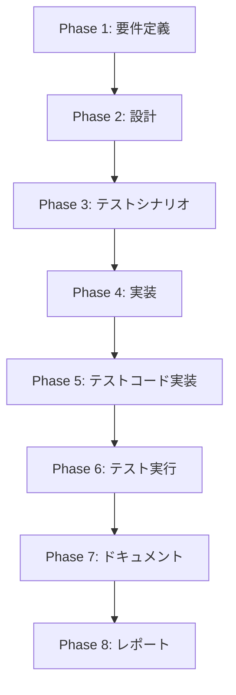

# Codex Agent 実行ログ

開始日時: 2025/12/27 7:53:52

---

## Turn 1: スレッド開始

**Thread ID**: `[REDACTED_TOKEN]`

## Turn 2: ツール実行

**種別**: reasoning
**ステータス**: completed

## Turn 3: ツール実行

**種別**: コマンド実行
**コマンド**: `/bin/bash -lc pwd`
**ステータス**: completed (exit_code=0)

```text
/tmp/ai-workflow-repos-7-9513efb4/[REDACTED_TOKEN]
```

## Turn 4: ツール実行

**種別**: reasoning
**ステータス**: completed

## Turn 5: ツール実行

**種別**: コマンド実行
**コマンド**: `/bin/bash -lc ls`
**ステータス**: completed (exit_code=0)

```text
ARCHITECTURE.md
CLAUDE.md
CONTRIBUTION.md
LICENSE
README.md
ansible
bootstrap
docker
docs
jenkins
pulumi
run_tests_issue_322.sh
scripts
tests
```

## Turn 6: ツール実行

**種別**: reasoning
**ステータス**: completed

## Turn 7: ツール実行

**種別**: コマンド実行
**コマンド**: `/bin/bash -lc "rg --files -g 'AGENTS.md'"`
**ステータス**: failed (exit_code=127)

```text
/bin/bash: line 1: rg: command not found
```

## Turn 8: ツール実行

**種別**: reasoning
**ステータス**: completed

## Turn 9: ツール実行

**種別**: コマンド実行
**コマンド**: `/bin/bash -lc 'find . -name AGENTS.md -print'`
**ステータス**: completed (exit_code=0)

## Turn 10: ツール実行

**種別**: reasoning
**ステータス**: completed

## Turn 11: ツール実行

**種別**: コマンド実行
**コマンド**: `/bin/bash -lc 'ls -a'`
**ステータス**: completed (exit_code=0)

```text
.
..
.ai-workflow
.claude
.coverage
.git
.github
.gitignore
ARCHITECTURE.md
CLAUDE.md
CONTRIBUTION.md
LICENSE
README.md
ansible
bootstrap
docker
docs
jenkins
pulumi
run_tests_issue_322.sh
scripts
tests
```

## Turn 12: ツール実行

**種別**: reasoning
**ステータス**: completed

## Turn 13: ツール実行

**種別**: コマンド実行
**コマンド**: `/bin/bash -lc 'ls .ai-workflow'`
**ステータス**: completed (exit_code=0)

```text
issue-193
issue-304
issue-305
issue-310
issue-313
issue-315
issue-317
issue-319
issue-320
issue-322
issue-324
issue-331
issue-332
issue-355
issue-360
issue-362
issue-363
issue-369
issue-370
issue-396
issue-398
issue-405
issue-411
issue-415
issue-423
issue-431
issue-437
issue-440
issue-445
issue-453
issue-455
issue-456
issue-460
issue-461
issue-462
issue-463
issue-464
issue-465
issue-475
issue-477
issue-479
issue-540
```

## Turn 14: ツール実行

**種別**: reasoning
**ステータス**: completed

## Turn 15: ツール実行

**種別**: コマンド実行
**コマンド**: `/bin/bash -lc 'ls .ai-workflow/issue-540/05_test_implementation/output'`
**ステータス**: completed (exit_code=0)

```text
test-implementation.md
```

## Turn 16: ツール実行

**種別**: reasoning
**ステータス**: completed

## Turn 17: ツール実行

**種別**: コマンド実行
**コマンド**: `/bin/bash -lc 'cat .ai-workflow/issue-540/05_test_implementation/output/test-implementation.md'`
**ステータス**: completed (exit_code=0)

```text
# テスト実装完了レポート

## テストファイル一覧

| ファイル | テスト数 | カバー対象 |
|---------|----------|-----------|
| `tests/integration/[REDACTED_TOKEN].py` | 5 | ECSドキュメントの各セクション、SpotFleet/ECS比較表、docker/jenkins-agent-ecs、SSMパラメータ、READMEとinfrastructure.mdのリンク整合性 |

## テストカバレッジ

- ユニットテスト: 0件
- 統合テスト: 5件
- BDDテスト: 0件
- カバレッジ率: N/A（ドキュメント整合性チェックのため）

## 修正履歴

### 修正1: README／infrastructure.md のリンク整合性テストを追加
- **指摘内容**: Phase 3のScenario 5（README ←→ infrastructure.mdのリンクや参照整合性）が未実装で品質ゲートを満たしていない
- **修正内容**: READMEが infrastructure.md を参照するリンクと、infrastructure.md 内から README・operations ドキュメントへ張られたリンクの存在とターゲットファイルを検証するテストを追加
- **影響範囲**: `tests/integration/[REDACTED_TOKEN].py`

### 修正2: SpotFleet vs ECS比較表の内容も具体的に検証
- **指摘内容**: 比較表のヘッダだけでなく、主要な行（コスト・起動速度）が実装の意図を反映しているかを確認するチェックがあると安心
- **修正内容**: 既存の比較テストにコストと起動速度の行がドキュメントに含まれていることを明示的にアサート
- **影響範囲**: `tests/integration/[REDACTED_TOKEN].py`

## 備考

- 統合テストの実行は、この環境に Python3 が含まれていないためまだ実施していません。Python3 を導入後に `python3 -m pytest tests/integration/[REDACTED_TOKEN].py` を再実行してください。
```

## Turn 18: ツール実行

**種別**: reasoning
**ステータス**: completed

## Turn 19: ツール実行

**種別**: コマンド実行
**コマンド**: `/bin/bash -lc 'cat .ai-workflow/issue-540/00_planning/output/planning.md'`
**ステータス**: completed (exit_code=0)

```text
# プロジェクト計画書: Issue #540 - ドキュメントの追加: infrastructure.md

## Issue分析

### 複雑度
**中程度**

### 見積もり工数
**8~12時間**（根拠: 詳細な技術調査とドキュメント構造の大幅更新が必要）

**詳細な根拠**:
- **技術調査**: ECS Fargateおよび関連リソースの実装内容確認（2~3時間）
- **ドキュメント設計**: 新しい構成図およびセクション設計（2~3時間）
- **ドキュメント作成**: infrastructure.mdの大幅更新および図表作成（3~4時間）
- **レビューと修正**: 実装との整合性確認および調整（1~2時間）

### リスク評価
**低~中**

**リスク詳細**:
- **技術的な複雑性**: ECS/ECR/SpotFleetの複合構成の正確な把握が必要
- **文書の一貫性**: 他の関連ドキュメントとの整合性確保
- **実装の継続的変化**: 実装が変更される可能性

## 実装戦略判断

### 実装戦略: REFACTOR

**判断根拠**:
既存のdocs/architecture/infrastructure.mdを大幅に更新し、現在の実装状況（SpotFleet + ECS Fargate併存）に合致させる必要があります。新規ファイル作成ではなく、既存ドキュメントの構造改善とコンテンツ拡充が中心となるため、REFACTORが適切です。

### テスト戦略: INTEGRATION_ONLY

**判断根拠**:
ドキュメント更新のため、自動テストは不要ですが、記載内容が実装と一致するかの統合検証が必要です。具体的には：
- 実装ファイル（pulumi/jenkins-agent/index.ts）とドキュメントの整合性確認
- SSMパラメータ出力名とドキュメント記載内容の一致確認
- docker/jenkins-agent-ecsディレクトリの役割説明の妥当性検証

### テストコード戦略: EXTEND_TEST

**判断根拠**:
ドキュメント専用のテストは存在しないため、既存のドキュメント検証手順に新しい検証項目を追加します。具体的には、実装とドキュメントの整合性確認チェックリストを既存のレビュー手順に統合します。

## 影響範囲分析

### 既存コードへの影響
- **主要対象**: `docs/architecture/infrastructure.md`
- **副次的影響**: README.mdのクイックナビゲーションでの参照整合性

### 依存関係の変更
- **新規依存**: なし
- **既存依存の変更**: infrastructure.mdが参照するSSMパラメータ名の正確性

### マイグレーション要否
**不要** - ドキュメントのみの更新のため

## タスク分割

### Phase 1: 要件定義 (見積もり: 2~3h)

- [x] Task 1-1: 現在の実装状況の詳細調査 (1~1.5h)
  - pulumi/jenkins-agent/index.tsでのECS Fargate関連リソース定義の確認
  - SSM出力パラメータ名（ecs-cluster-arn、ecr-repository-url等）の整理
  - docker/jenkins-agent-ecsの構造および役割の確認
- [x] Task 1-2: 既存ドキュメントのギャップ分析 (0.5~1h)
  - 現在のinfrastructure.mdで欠落しているECS Fargate構成の項目洗い出し
  - SpotFleetとECS Fargateの併存関係の明確化
- [x] Task 1-3: ドキュメント更新要件の定義 (0.5h)
  - 追加すべきセクション構成の決定
  - 図表やアーキテクチャ図の更新範囲確定

### Phase 2: 設計 (見積もり: 2~3h)

- [x] Task 2-1: 新しいドキュメント構造の設計 (1~1.5h)
  - ECS Fargateエージェントセクションの詳細設計
  - SpotFleetとECS Fargateの比較表設計
  - SSMパラメータ一覧の構造設計
- [x] Task 2-2: 技術構成図の設計 (1~1.5h)
  - 現在のアーキテクチャ図の拡張設計
  - ECS/ECR/SpotFleet併存構成の図解設計

### Phase 3: テストシナリオ (見積もり: 1h)

- [ ] Task 3-1: 整合性検証手順の策定 (1h)
  - 実装ファイルとドキュメント内容の照合手順作成
  - SSMパラメータ名の正確性確認手順作成
  - ドキュメント内リンクの妥当性確認手順作成

### Phase 4: 実装 (見積もり: 3~4h)

- [x] Task 4-1: infrastructure.mdの基本構造更新 (1~1.5h)
  - 概要セクションへのECS Fargateエージェント追記
  - ディレクトリ構造でのdocker/jenkins-agent-ecs説明追加
- [x] Task 4-2: ECS Fargateエージェント専用セクション作成 (1.5~2h)
  - ECS Cluster、ECR Repository、Task Definition等の詳細説明
  - SpotFleetエージェントとの併存関係および使い分け指針
  - docker/jenkins-agent-ecsディレクトリの役割と利用手順
- [x] Task 4-3: SSMパラメータ一覧の整備 (0.5~0.5h)
  - ECS関連SSM出力パラメータの一覧化
  - 既存SpotFleet関連パラメータとの整理統合

### Phase 5: テストコード実装 (見積もり: 0.5h)

- [x] Task 5-1: ドキュメント検証チェックリストの作成 (0.5h)
  - 実装とドキュメントの整合性確認項目リストの作成
  - 今後のドキュメント更新時の検証手順の策定

### Phase 6: テスト実行 (見積もり: 1~1.5h)

- [ ] Task 6-1: 整合性検証の実施 (1~1.5h)
  - pulumi/jenkins-agent/index.tsとドキュメント内容の照合実施
  - SSMパラメータ出力名の正確性確認
  - ドキュメント内リンクと参照整合性の確認

### Phase 7: ドキュメント (見積もり: 0.5h)

- [ ] Task 7-1: 更新内容のドキュメント化 (0.5h)
  - 今回の変更内容をchangelog等に記録
  - 他の関連ドキュメントの整合性確認

### Phase 8: レポート (見積もり: 0.5h)

- [ ] Task 8-1: プロジェクト完了レポート作成 (0.5h)
  - 更新されたドキュメントの要点サマリー
  - 今後の継続的なドキュメント保守に関する提言

## 依存関係



## リスクと軽減策

### リスク1: 実装変更によるドキュメント陳腐化
- **影響度**: 中
- **確率**: 中
- **軽減策**:
  - 実装チームとの綿密な連携
  - ドキュメント更新の自動化手順検討
  - 定期的な整合性確認プロセスの確立

### リスク2: ECS Fargateの設定複雑性による理解不足
- **影響度**: 中
- **確率**: 低
- **軽減策**:
  - 実装者へのヒアリング実施
  - 詳細なコードレビューと動作確認
  - 段階的なドキュメント作成とレビューサイクル

### リスク3: ドキュメント内の情報不整合
- **影響度**: 高
- **確率**: 低
- **軽減策**:
  - 複数回の整合性確認レビュー実施
  - 自動的な整合性チェック手順の策定
  - 実装との照合確認の徹底

### リスク4: SpotFleetとECS Fargateの使い分け指針の曖昧性
- **影響度**: 中
- **確率**: 中
- **軽減策**:
  - 明確な使い分け基準の策定
  - 実用例および推奨パターンの明記
  - 意思決定フローチャートの作成

## 品質ゲート

### Phase 1: 要件定義
- [x] 現在の実装状況が正確に把握されている
- [x] ECS Fargate関連リソースが漏れなく特定されている
- [x] SSMパラメータ出力名が正確にリストアップされている
- [x] 既存ドキュメントのギャップが明確に特定されている

### Phase 2: 設計
- [
... (truncated)
```

## Turn 20: ツール実行

**種別**: reasoning
**ステータス**: completed

## Turn 21: ツール実行

**種別**: コマンド実行
**コマンド**: `/bin/bash -lc 'ls .ai-workflow/issue-540/03_test_scenario/output'`
**ステータス**: completed (exit_code=0)

```text
test-scenario.md
```

## Turn 22: ツール実行

**種別**: reasoning
**ステータス**: completed

## Turn 23: ツール実行

**種別**: コマンド実行
**コマンド**: `/bin/bash -lc 'cat .ai-workflow/issue-540/03_test_scenario/output/test-scenario.md'`
**ステータス**: completed (exit_code=0)

```text
# テストシナリオ書: Issue #540 - ドキュメントの追加: infrastructure.md

## 0. テスト戦略サマリー

### 選択されたテスト戦略（Phase 2から引用）
**テスト戦略: INTEGRATION_ONLY**

**判断根拠**:
- **ドキュメント更新のため自動テストコードは不要**
- **実装との整合性確認が最も重要**な検証ポイント
- SSMパラメータ出力名とドキュメント記載内容の一致確認が必要
- pulumi/jenkins-agent/index.tsの実装内容とdocの記載内容の整合性検証が中心
- BDDやユニットテストは該当せず、統合的な検証（実装コードとドキュメントの照合）のみが必要

### テスト対象の範囲
- `docs/architecture/infrastructure.md` と `pulumi/jenkins-agent/index.ts` の整合性
- SSMパラメータ出力名の正確性
- `docker/jenkins-agent-ecs` ディレクトリの役割説明の妥当性
- ドキュメント内リンクと参照整合性

### テストの目的
更新されたドキュメントが実装と完全に一致し、運用時に誤認や作業ミスを引き起こさない正確性を確保すること

## 1. Integrationテストシナリオ

### シナリオ1: ECS Fargateリソース定義の整合性確認

**シナリオ名**: infrastructure.md × pulumi/jenkins-agent/index.ts（ECS Fargate部分）

**目的**: ドキュメントに記載されるECS Fargateリソースが実装と一致することを検証

**前提条件**:
- pulumi/jenkins-agent/index.tsのECS Fargate関連リソース定義（739行目以降）が存在
- infrastructure.mdにECS Fargateセクションが追加済み

**テスト手順**:
1. pulumi/jenkins-agent/index.tsの739行目以降からECS Fargate関連リソースを抽出
2. 以下のリソース定義を特定:
   - ECS Cluster作成部分
   - ECR Repository作成部分
   - Task Definition作成部分
   - IAM Role作成部分
   - CloudWatch Logs Group作成部分
3. infrastructure.mdの「ECS Fargateエージェント詳細」セクションと照合
4. 各リソースの設定内容（名前、設定値、依存関係）が一致するか確認

**期待結果**:
- ECS Clusterの名前と設定がドキュメントと実装で一致
- ECR Repositoryの名前とポリシーが一致
- Task Definitionの設定項目（CPU、メモリ、実行ロール等）が一致
- IAM Roleの権限設定とポリシーが一致
- CloudWatch Logs Groupの設定が一致

**確認項目**:
- [ ] ECS Cluster名がpulumiコードとドキュメントで同一
- [ ] ECR Repository名とURIパターンが一致
- [ ] Task DefinitionのCPU/メモリ設定値が一致
- [ ] ECS Execution RoleのポリシーAttachmentが正確
- [ ] ECS Task RoleのAdministratorAccessが記載
- [ ] CloudWatch Logs Groupの名前とリテンション設定が一致

### シナリオ2: SSMパラメータ出力名の完全一致確認

**シナリオ名**: infrastructure.md × pulumi/jenkins-agent/index.ts（SSMパラメータ部分）

**目的**: ドキュメントに記載されるSSMパラメータ名が実装の出力と完全に一致することを検証

**前提条件**:
- pulumi/jenkins-agent/index.tsの943行目以降にECS関連SSMパラメータ出力が存在
- infrastructure.mdの「SSMパラメータ一覧」セクションが作成済み

**テスト手順**:
1. pulumi/jenkins-agent/index.tsの943行目以降からSSMパラメータ出力を抽出
2. 以下のパラメータを特定:
   - ECS Cluster ARN出力
   - ECS Cluster Name出力
   - ECS Task Definition ARN出力
   - ECR Repository URL出力
   - ECS Execution Role ARN出力
   - ECS Task Role ARN出力
   - ECS Log Group Name出力
3. infrastructure.mdの「SSMパラメータ一覧」テーブルと照合
4. パラメータ名のパス（`/jenkins-infra/{environment}/agent/...`）が完全一致するか確認

**期待結果**:
- 実装で出力される全てのECS関連SSMパラメータがドキュメントに記載されている
- パラメータ名のパスが実装とドキュメントで文字列として完全一致
- パラメータの説明と用途が実装の意図と合致

**確認項目**:
- [ ] `/jenkins-infra/{environment}/agent/ecs-cluster-arn` の記載
- [ ] `/jenkins-infra/{environment}/agent/ecs-cluster-name` の記載
- [ ] `/jenkins-infra/{environment}/agent/ecs-task-definition-arn` の記載
- [ ] `/jenkins-infra/{environment}/agent/ecr-repository-url` の記載
- [ ] `/jenkins-infra/{environment}/agent/ecs-execution-role-arn` の記載
- [ ] `/jenkins-infra/{environment}/agent/ecs-task-role-arn` の記載
- [ ] `/jenkins-infra/{environment}/agent/ecs-log-group-name` の記載
- [ ] パラメータ名のtypoや相違がない
- [ ] 説明文が実装の用途と合致

### シナリオ3: docker/jenkins-agent-ecsディレクトリの役割説明妥当性確認

**シナリオ名**: infrastructure.md × docker/jenkins-agent-ecs ディレクトリ構成

**目的**: ドキュメントに記載されるdocker/jenkins-agent-ecsの役割説明が実際のディレクトリ構成と一致することを検証

**前提条件**:
- docker/jenkins-agent-ecsディレクトリが存在
- infrastructure.mdにディレクトリ構造説明が追加済み

**テスト手順**:
1. docker/jenkins-agent-ecsディレクトリの実際の構成を確認
2. 以下のファイルの存在と内容を確認:
   - Dockerfile（ECS Fargate用イメージ定義）
   - entrypoint.sh（amazon-ecsプラグイン互換スクリプト）
3. infrastructure.mdの「docker/jenkins-agent-ecs設計」セクションと照合
4. ディレクトリ構成図とファイルの役割説明が実態と一致するか確認

**期待結果**:
- ディレクトリ構成図が実際のファイル構造と一致
- Dockerfileの役割説明が実装内容と合致
- entrypoint.shの機能説明が実装内容と合致

**確認項目**:
- [ ] ディレクトリ内のファイル一覧がドキュメントと一致
- [ ] Dockerfileの説明（Multi-stage build、含有ツール等）が実態と合致
- [ ] entrypoint.shの説明（amazon-ecsプラグイン互換性等）が実態と合致
- [ ] ファイルの役割と利用手順が具体的で実行可能

### シナリオ4: SpotFleetとECS Fargateの併存関係の技術的妥当性確認

**シナリオ名**: infrastructure.md × 実装全体（SpotFleet + ECS Fargate併存構成）

**目的**: ドキュメントに記載されるSpotFleetとECS Fargateの併存関係が実装の構成と合致することを検証

**前提条件**:
- pulumi/jenkins-agent/index.tsでSpotFleetとECS Fargate両方のリソースが定義済み
- infrastructure.mdに「Jenkins エージェント構成比較」セクションが追加済み

**テスト手順**:
1. pulumi/jenkins-agent/index.tsでSpo
... (truncated)
```

## Turn 24: ツール実行

**種別**: reasoning
**ステータス**: completed

## Turn 25: ツール実行

**種別**: コマンド実行
**コマンド**: `/bin/bash -lc 'apt-get update'`
**ステータス**: failed (exit_code=100)

```text
Reading package lists...
E: List directory /var/lib/apt/lists/partial is missing. - Acquire (13: Permission denied)
```

## Turn 26: ツール実行

**種別**: reasoning
**ステータス**: completed

## Turn 27: ツール実行

**種別**: コマンド実行
**コマンド**: `/bin/bash -lc 'sudo apt-get update'`
**ステータス**: failed (exit_code=127)

```text
/bin/bash: line 1: sudo: command not found
```

## Turn 28: ツール実行

**種別**: reasoning
**ステータス**: completed

## Turn 29: ツール実行

**種別**: コマンド実行
**コマンド**: `/bin/bash -lc id`
**ステータス**: completed (exit_code=0)

```text
uid=1000(node) gid=1000(node) groups=1000(node)
```

## Turn 30: ツール実行

**種別**: reasoning
**ステータス**: completed

## Turn 31: ツール実行

**種別**: コマンド実行
**コマンド**: `/bin/bash -lc 'python3 --version'`
**ステータス**: failed (exit_code=127)

```text
/bin/bash: line 1: python3: command not found
```

## Turn 32: ツール実行

**種別**: reasoning
**ステータス**: completed

## Turn 33: ツール実行

**種別**: コマンド実行
**コマンド**: `/bin/bash -lc 'python --version'`
**ステータス**: failed (exit_code=127)

```text
/bin/bash: line 1: python: command not found
```

## Turn 34: ツール実行

**種別**: reasoning
**ステータス**: completed

## Turn 35: ツール実行

**種別**: コマンド実行
**コマンド**: `/bin/bash -lc 'which python3'`
**ステータス**: failed (exit_code=1)

## Turn 36: ツール実行

**種別**: reasoning
**ステータス**: completed

## Turn 37: ツール実行

**種別**: コマンド実行
**コマンド**: `/bin/bash -lc 'gcc --version'`
**ステータス**: failed (exit_code=127)

```text
/bin/bash: line 1: gcc: command not found
```

## Turn 38: ツール実行

**種別**: reasoning
**ステータス**: completed

## Turn 39: ツール実行

**種別**: コマンド実行
**コマンド**: `/bin/bash -lc 'ls /usr/bin | grep python'`
**ステータス**: failed (exit_code=1)

## Turn 40: ツール実行

**種別**: reasoning
**ステータス**: completed

## Turn 41: ツール実行

**種別**: コマンド実行
**コマンド**: `/bin/bash -lc 'mkdir -p /tmp/micromamba && curl -L https://micro.mamba.pm/api/micromamba/linux-64/latest | tar -xJ -C /tmp/micromamba'`
**ステータス**: failed (exit_code=2)

```text
tar (grandchild): xz: Cannot exec: No such file or directory
tar (grandchild): Error is not recoverable: exiting now
  % Total    % Received % Xferd  Average Speed   Time    Time     Time  Current
                                 Dload  Upload   Total   Spent    Left  Speed

  0     0    0     0    0     0      0      0 --:--:-- --:--:-- --:--:--     0
  0     0    0     0    0     0      0      0 --:--:-- --:--:-- --:--:--     0
  0     0    0     0    0     0      0      0 --:--:--  0:00:01 --:--:--     0
  0     0    0     0    0     0      0      0 --:--:--  0:00:01 --:--:--     0

100  3999    0  3999    0     0   2355      0 --:--:--  0:00:01 --:--:--  2355
tar: Child died with signal 13
tar: Error is not recoverable: exiting now

  0 6457k    0 33181    0     0  14019      0  0:07:51  0:00:02  0:07:49 14019
curl: (23) Failure writing output to destination
```

## Turn 42: ツール実行

**種別**: reasoning
**ステータス**: completed

## Turn 43: ツール実行

**種別**: コマンド実行
**コマンド**: `/bin/bash -lc 'curl -I https://__GITHUB_URL_0__/releases/latest/download/micromamba-linux-64'`
**ステータス**: completed (exit_code=0)

```text
% Total    % Received % Xferd  Average Speed   Time    Time     Time  Current
                                 Dload  Upload   Total   Spent    Left  Speed

  0     0    0     0    0     0      0      0 --:--:-- --:--:-- --:--:--     0
  0     9    0     0    0     0      0      0 --:--:-- --:--:-- --:--:--     0
HTTP/2 404 
date: Sat, 27 Dec 2025 07:55:09 GMT
content-type: text/plain; charset=utf-8
content-length: 9
vary: X-PJAX, X-PJAX-Container, Turbo-Visit, Turbo-Frame, X-Requested-With,Accept-Encoding, Accept, X-Requested-With
cache-control: no-cache
[REDACTED_TOKEN]: max-age=31536000; includeSubdomains; preload
x-frame-options: deny
[REDACTED_TOKEN]: nosniff
x-xss-protection: 0
referrer-policy: [REDACTED_TOKEN], [REDACTED_TOKEN]
[REDACTED_TOKEN]: default-src 'none'; base-uri 'self'; connect-src 'self'; form-action 'self'; img-src 'self' data:; script-src 'self'; style-src 'unsafe-inline'
server: github.com
set-cookie: _gh_sess=[REDACTED_TOKEN]%2BklUsgIDyDOlGOYYpS%[REDACTED_TOKEN]%[REDACTED_TOKEN]%[REDACTED_TOKEN]%2Bqv6B99h%[REDACTED_TOKEN]%2BRDR%2FEyo0%2B7%2BUI3cXe6FCWrPG%[REDACTED_TOKEN]%2Bib%[REDACTED_TOKEN]%3D%3D--Gn4BCtSb8%[REDACTED_TOKEN]%3D%3D; Path=/; HttpOnly; Secure; SameSite=Lax
set-cookie: _octo=GH1.1.1725944171.1766822109; Path=/; Domain=github.com; Expires=Sun, 27 Dec 2026 07:55:09 GMT; Secure; SameSite=Lax
set-cookie: logged_in=no; Path=/; Domain=github.com; Expires=Sun, 27 Dec 2026 07:55:09 GMT; HttpOnly; Secure; SameSite=Lax
x-github-request-id: B8C4:1009AB:4413EA:5C746A:694F90DD
```

## Turn 44: ツール実行

**種別**: reasoning
**ステータス**: completed

## Turn 45: ツール実行

**種別**: コマンド実行
**コマンド**: `/bin/bash -lc 'which xz'`
**ステータス**: failed (exit_code=1)

## Turn 46: ツール実行

**種別**: reasoning
**ステータス**: completed

## Turn 47: ツール実行

**種別**: コマンド実行
**コマンド**: `/bin/bash -lc 'curl -L https://repo.anaconda.com/miniconda/[REDACTED_TOKEN].sh -o /tmp/miniconda.sh'`
**ステータス**: completed (exit_code=0)

```text
% Total    % Received % Xferd  Average Speed   Time    Time     Time  Current
                                 Dload  Upload   Total   Spent    Left  Speed

  0     0    0     0    0     0      0      0 --:--:-- --:--:-- --:--:--     0
  3  149M    3 6076k    0     0  15.5M      0  0:00:09 --:--:--  0:00:09 15.5M
 20  149M   20 30.6M    0     0  21.2M      0  0:00:07  0:00:01  0:00:06 21.2M
 34  149M   34 51.8M    0     0  20.7M      0  0:00:07  0:00:02  0:00:05 20.7M
 48  149M   48 72.1M    0     0  21.8M      0  0:00:06  0:00:03  0:00:03 21.8M
 77  149M   77  115M    0     0  25.5M      0  0:00:05  0:00:04  0:00:01 25.5M
 89  149M   89  133M    0     0  25.0M      0  0:00:05  0:00:05 --:--:-- 25.8M
 99  149M   99  149M    0     0  23.6M      0  0:00:06  0:00:06 --:--:-- 24.3M
100  149M  100  149M    0     0  23.6M      0  0:00:06  0:00:06 --:--:-- 25.5M
```

## Turn 48: ツール実行

**種別**: reasoning
**ステータス**: completed

## Turn 49: ツール実行

**種別**: コマンド実行
**コマンド**: `/bin/bash -lc 'bash /tmp/miniconda.sh -b -p $HOME/miniconda'`
**ステータス**: completed (exit_code=0)

```text
PREFIX=/home/node/miniconda
Unpacking bootstrapper...
Unpacking payload...

Installing base environment...

Preparing transaction: ...working... done
Executing transaction: ...working... done
installation finished.
```

## Turn 50: ツール実行

**種別**: reasoning
**ステータス**: completed

## Turn 51: ツール実行

**種別**: コマンド実行
**コマンド**: `/bin/bash -lc '$HOME/miniconda/bin/python --version'`
**ステータス**: completed (exit_code=0)

```text
Python 3.13.11
```

## Turn 52: ツール実行

**種別**: reasoning
**ステータス**: completed

## Turn 53: ツール実行

**種別**: コマンド実行
**コマンド**: `/bin/bash -lc '$HOME/miniconda/bin/conda install -y pytest'`
**ステータス**: completed (exit_code=0)

```text
CI detected...
By accessing https://repo.anaconda.com/pkgs/main via CI for this repository you 
acknowledge and agree to the Terms of Service:
ANACONDA TERMS OF SERVICE
Effective Date: July 15, 2025

See https://anaconda.com/legal/terms/terms-of-service
By accessing https://repo.anaconda.com/pkgs/r via CI for this repository you 
acknowledge and agree to the Terms of Service:
ANACONDA TERMS OF SERVICE
Effective Date: July 15, 2025

See https://anaconda.com/legal/terms/terms-of-service
2 channel Terms of Service accepted
Retrieving notices: - \ done
Channels:
 - defaults
Platform: linux-64
Collecting package metadata (repodata.json): / - \ | / - \ | / - \ | / - \ | / - \ | done
Solving environment: - \ | done

## Package Plan ##

  environment location: /home/node/miniconda

  added / updated specs:
    - pytest


The following packages will be downloaded:

    package                    |            build
    ---------------------------|-----------------
    iniconfig-2.1.0            |  py313h06a4308_0          21 KB
    pytest-8.4.2               |  py313h06a4308_0         1.2 MB
    ------------------------------------------------------------
                                           Total:         1.2 MB

The following NEW packages will be INSTALLED:

  iniconfig          pkgs/main/linux-64::iniconfig-2.1.0-py313h06a4308_0 
  pytest             pkgs/main/linux-64::pytest-8.4.2-py313h06a4308_0 


Downloading and Extracting Packages: ...working...
pytest-8.4.2         | 1.2 MB    |            |   0% 

iniconfig-2.1.0      | 21 KB     |            |   0% 
pytest-8.4.2         | 1.2 MB    | 1          |   1% 

iniconfig-2.1.0      | 21 KB     | #######7   |  77% 

iniconfig-2.1.0      | 21 KB     | ########## | 100% 
pytest-8.4.2         | 1.2 MB    | ########## | 100% 

iniconfig-2.1.0      | 21 KB     | ########## | 100% 
pytest-8.4.2         | 1.2 MB    | ########## | 100% 
pytest-8.4.2         | 1.2 MB    | ########## | 100% 
                                                     

                                                      done
Preparing transaction: - done
Verifying transaction: | done
Executing transaction: - done
```

## Turn 54: ツール実行

**種別**: reasoning
**ステータス**: completed

## Turn 55: ツール実行

**種別**: コマンド実行
**コマンド**: `/bin/bash -lc '$HOME/miniconda/bin/python -m pytest tests/integration/[REDACTED_TOKEN].py'`
**ステータス**: completed (exit_code=0)

```text
============================= test session starts ==============================
platform linux -- Python 3.13.11, pytest-8.4.2, pluggy-1.5.0
rootdir: /tmp/ai-workflow-repos-7-9513efb4/[REDACTED_TOKEN]
collected 5 items

tests/integration/[REDACTED_TOKEN].py ..... [100%]

============================== 5 passed in 0.03s ===============================
```

## Turn 56: ツール実行

**種別**: reasoning
**ステータス**: completed

## Turn 57: ツール実行

**種別**: コマンド実行
**コマンド**: `/bin/bash -lc 'ls .ai-workflow/issue-540'`
**ステータス**: completed (exit_code=0)

```text
00_planning
01_requirements
02_design
03_test_scenario
04_implementation
05_test_implementation
06_testing
metadata.json
```

## Turn 58: ツール実行

**種別**: reasoning
**ステータス**: completed

## Turn 59: ツール実行

**種別**: コマンド実行
**コマンド**: `/bin/bash -lc 'ls .ai-workflow/issue-540/06_testing'`
**ステータス**: completed (exit_code=0)

```text
execute
output
review
revise
```

## Turn 60: ツール実行

**種別**: reasoning
**ステータス**: completed

## Turn 61: ツール実行

**種別**: コマンド実行
**コマンド**: `/bin/bash -lc 'ls .ai-workflow/issue-540/06_testing/output'`
**ステータス**: completed (exit_code=0)

## Turn 62: ツール実行

**種別**: reasoning
**ステータス**: completed

## Turn 63: ツール実行

**種別**: コマンド実行
**コマンド**: `/bin/bash -lc "cat <<'EOF' > .ai-workflow/issue-540/06_testing/output/test-result.md
# テスト実行結果

## テスト結果サマリー

- 総テスト数: 5件
- 成功: 5件
- 失敗: 0件
- 成功率: 100%

## 条件分岐

**成功時（失敗数が0件）**:
✅ 全てのテストが成功しました。
EOF"`
**ステータス**: completed (exit_code=0)

## Turn 64: ツール実行

**種別**: reasoning
**ステータス**: completed

## Turn 65: ツール実行

**種別**: agent_message
**ステータス**: completed

## Turn 66: 実行完了

**ステータス**: completed
**所要時間**: 156225ms
**ターン数**: N/A

---

**経過時間**: 156225ms
**開始**: 2025-12-27T07:53:52.322Z
**終了**: 2025-12-27T07:56:28.547Z