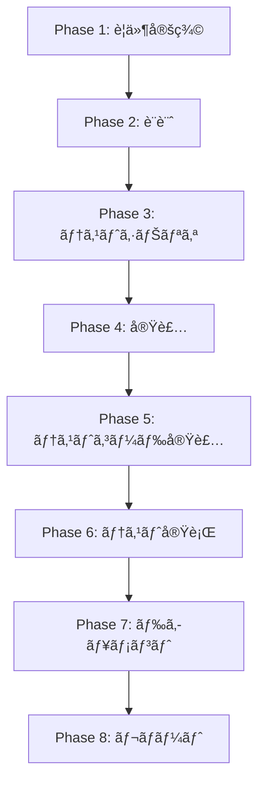

# Codex Agent 実行ログ

開始日時: 2025/12/27 7:53:52

---

## Turn 1: スレッド開始

**Thread ID**: `[REDACTED_TOKEN]`

## Turn 2: ツール実行

**種別**: reasoning
**ステータス**: completed

## Turn 3: ツール実行

**種別**: コãƒãƒ³ãƒ‰å®Ÿè¡Œ
**コãƒãƒ³ãƒ‰**: `/bin/bash -lc pwd`
**ステータス**: completed (exit_code=0)

```text
/tmp/ai-workflow-repos-7-9513efb4/[REDACTED_TOKEN]
```

## Turn 4: ツール実行

**種別**: reasoning
**ステータス**: completed

## Turn 5: ツール実行

**種別**: コãƒãƒ³ãƒ‰å®Ÿè¡Œ
**コãƒãƒ³ãƒ‰**: `/bin/bash -lc ls`
**ステータス**: completed (exit_code=0)

```text
ARCHITECTURE.md
CLAUDE.md
CONTRIBUTION.md
LICENSE
README.md
ansible
bootstrap
docker
docs
jenkins
pulumi
run_tests_issue_322.sh
scripts
tests
```

## Turn 6: ツール実行

**種別**: reasoning
**ステータス**: completed

## Turn 7: ツール実行

**種別**: コãƒãƒ³ãƒ‰å®Ÿè¡Œ
**コãƒãƒ³ãƒ‰**: `/bin/bash -lc "rg --files -g 'AGENTS.md'"`
**ステータス**: failed (exit_code=127)

```text
/bin/bash: line 1: rg: command not found
```

## Turn 8: ツール実行

**種別**: reasoning
**ステータス**: completed

## Turn 9: ツール実行

**種別**: コãƒãƒ³ãƒ‰å®Ÿè¡Œ
**コãƒãƒ³ãƒ‰**: `/bin/bash -lc 'find . -name AGENTS.md -print'`
**ステータス**: completed (exit_code=0)

## Turn 10: ツール実行

**種別**: reasoning
**ステータス**: completed

## Turn 11: ツール実行

**種別**: コãƒãƒ³ãƒ‰å®Ÿè¡Œ
**コãƒãƒ³ãƒ‰**: `/bin/bash -lc 'ls -a'`
**ステータス**: completed (exit_code=0)

```text
.
..
.ai-workflow
.claude
.coverage
.git
.github
.gitignore
ARCHITECTURE.md
CLAUDE.md
CONTRIBUTION.md
LICENSE
README.md
ansible
bootstrap
docker
docs
jenkins
pulumi
run_tests_issue_322.sh
scripts
tests
```

## Turn 12: ツール実行

**種別**: reasoning
**ステータス**: completed

## Turn 13: ツール実行

**種別**: コãƒãƒ³ãƒ‰å®Ÿè¡Œ
**コãƒãƒ³ãƒ‰**: `/bin/bash -lc 'ls .ai-workflow'`
**ステータス**: completed (exit_code=0)

```text
issue-193
issue-304
issue-305
issue-310
issue-313
issue-315
issue-317
issue-319
issue-320
issue-322
issue-324
issue-331
issue-332
issue-355
issue-360
issue-362
issue-363
issue-369
issue-370
issue-396
issue-398
issue-405
issue-411
issue-415
issue-423
issue-431
issue-437
issue-440
issue-445
issue-453
issue-455
issue-456
issue-460
issue-461
issue-462
issue-463
issue-464
issue-465
issue-475
issue-477
issue-479
issue-540
```

## Turn 14: ツール実行

**種別**: reasoning
**ステータス**: completed

## Turn 15: ツール実行

**種別**: コãƒãƒ³ãƒ‰å®Ÿè¡Œ
**コãƒãƒ³ãƒ‰**: `/bin/bash -lc 'ls .ai-workflow/issue-540/05_test_implementation/output'`
**ステータス**: completed (exit_code=0)

```text
test-implementation.md
```

## Turn 16: ツール実行

**種別**: reasoning
**ステータス**: completed

## Turn 17: ツール実行

**種別**: コãƒãƒ³ãƒ‰å®Ÿè¡Œ
**コãƒãƒ³ãƒ‰**: `/bin/bash -lc 'cat .ai-workflow/issue-540/05_test_implementation/output/test-implementation.md'`
**ステータス**: completed (exit_code=0)

```text
# テスト実装完了レãƒãƒ¼ãƒˆ

## テストファイル一覧

| ファイル | テスト数 | ã‚«ãƒãƒ¼å¯¾è±¡ |
|---------|----------|-----------|
| `tests/integration/[REDACTED_TOKEN].py` | 5 | ECSドキュメントã®å„セクションã€SpotFleet/ECS比較表ã€docker/jenkins-agent-ecsã€SSMパラメータã€READMEã¨infrastructure.mdã®ãƒªãƒ³ã‚¯æ•´åˆæ€§ |

## テストカãƒãƒ¬ãƒƒã‚¸

- ユニットテスト: 0件
- çµ±åˆãƒ†ã‚¹ãƒˆ: 5件
- BDDテスト: 0件
- ã‚«ãƒãƒ¬ãƒƒã‚¸ç‡: N/A（ドキュメント整åˆæ€§ãƒã‚§ãƒƒã‚¯ã®ãŸã‚）

## 修正履歴

### 修正1: READMEï¼infrastructure.md ã®ãƒªãƒ³ã‚¯æ•´åˆæ€§ãƒ†ã‚¹ãƒˆã‚’追加
- **指摘内容**: Phase 3ã®Scenario 5（README â†â†’ infrastructure.mdã®ãƒªãƒ³ã‚¯ã‚„å‚照整åˆæ€§ï¼‰ãŒæœªå®Ÿè£…ã§å“質ゲートを満ãŸã—ã¦ã„ãªã„
- **修正内容**: README㌠infrastructure.md ã‚’å‚ç…§ã™ã‚‹ãƒªãƒ³ã‚¯ã¨ã€infrastructure.md 内ã‹ã‚‰ README・operations ドキュメントã¸å¼µã‚‰ã‚ŒãŸãƒªãƒ³ã‚¯ã®å­˜åœ¨ã¨ã‚¿ãƒ¼ã‚²ãƒƒãƒˆãƒ•ã‚¡ã‚¤ãƒ«ã‚’検証ã™ã‚‹ãƒ†ã‚¹ãƒˆã‚’追加
- **影響範囲**: `tests/integration/[REDACTED_TOKEN].py`

### 修正2: SpotFleet vs ECS比較表ã®å†…容も具体的ã«æ¤œè¨¼
- **指摘内容**: 比較表ã®ãƒ˜ãƒƒãƒ€ã ã‘ã§ãªãã€ä¸»è¦ãªè¡Œï¼ˆã‚³ã‚¹ãƒˆãƒ»èµ·å‹•é€Ÿåº¦ï¼‰ãŒå®Ÿè£…ã®æ„図をå映ã—ã¦ã„ã‚‹ã‹ã‚’確èªã™ã‚‹ãƒã‚§ãƒƒã‚¯ãŒã‚ã‚‹ã¨å®‰å¿ƒ
- **修正内容**: 既存ã®æ¯”較テストã«ã‚³ã‚¹ãƒˆã¨èµ·å‹•é€Ÿåº¦ã®è¡ŒãŒãƒ‰ã‚­ãƒ¥ãƒ¡ãƒ³ãƒˆã«å«ã¾ã‚Œã¦ã„ã‚‹ã“ã¨ã‚’æ˜ç¤ºçš„ã«ã‚¢ã‚µãƒ¼ãƒˆ
- **影響範囲**: `tests/integration/[REDACTED_TOKEN].py`

## 備考

- çµ±åˆãƒ†ã‚¹ãƒˆã®å®Ÿè¡Œã¯ã€ã“ã®ç’°å¢ƒã« Python3 ãŒå«ã¾ã‚Œã¦ã„ãªã„ãŸã‚ã¾ã å®Ÿæ–½ã—ã¦ã„ã¾ã›ã‚“。Python3 ã‚’å°å…¥å¾Œã« `python3 -m pytest tests/integration/[REDACTED_TOKEN].py` ã‚’å†å®Ÿè¡Œã—ã¦ãã ã•ã„。
```

## Turn 18: ツール実行

**種別**: reasoning
**ステータス**: completed

## Turn 19: ツール実行

**種別**: コãƒãƒ³ãƒ‰å®Ÿè¡Œ
**コãƒãƒ³ãƒ‰**: `/bin/bash -lc 'cat .ai-workflow/issue-540/00_planning/output/planning.md'`
**ステータス**: completed (exit_code=0)

```text
# プロジェクト計画書: Issue #540 - ドキュメントã®è¿½åŠ : infrastructure.md

## Issue分æ

### 複雑度
**中程度**

### 見ç©ã‚‚り工数
**8~12時間**（根拠: 詳細ãªæŠ€è¡“調査ã¨ãƒ‰ã‚­ãƒ¥ãƒ¡ãƒ³ãƒˆæ§‹é€ ã®å¤§å¹…æ›´æ–°ãŒå¿…è¦ï¼‰

**詳細ãªæ ¹æ‹ **:
- **技術調査**: ECS FargateãŠã‚ˆã³é–¢é€£ãƒªã‚½ãƒ¼ã‚¹ã®å®Ÿè£…内容確èªï¼ˆ2~3時間）
- **ドキュメント設計**: æ–°ã—ã„構æˆå›³ãŠã‚ˆã³ã‚»ã‚¯ã‚·ãƒ§ãƒ³è¨­è¨ˆï¼ˆ2~3時間）
- **ドキュメント作æˆ**: infrastructure.mdã®å¤§å¹…æ›´æ–°ãŠã‚ˆã³å›³è¡¨ä½œæˆï¼ˆ3~4時間）
- **レビューã¨ä¿®æ­£**: 実装ã¨ã®æ•´åˆæ€§ç¢ºèªãŠã‚ˆã³èª¿æ•´ï¼ˆ1~2時間）

### リスク評価
**ä½~中**

**リスク詳細**:
- **技術的ãªè¤‡é›‘性**: ECS/ECR/SpotFleetã®è¤‡åˆæ§‹æˆã®æ­£ç¢ºãªæŠŠæ¡ãŒå¿…è¦
- **文書ã®ä¸€è²«æ€§**: ä»–ã®é–¢é€£ãƒ‰ã‚­ãƒ¥ãƒ¡ãƒ³ãƒˆã¨ã®æ•´åˆæ€§ç¢ºä¿
- **実装ã®ç¶™ç¶šçš„変化**: 実装ãŒå¤‰æ›´ã•ã‚Œã‚‹å¯èƒ½æ€§

## 実装戦略判断

### 実装戦略: REFACTOR

**判断根拠**:
既存ã®docs/architecture/infrastructure.mdを大幅ã«æ›´æ–°ã—ã€ç¾åœ¨ã®å®Ÿè£…状æ³ï¼ˆSpotFleet + ECS Fargate併存）ã«åˆè‡´ã•ã›ã‚‹å¿…è¦ãŒã‚ã‚Šã¾ã™ã€‚æ–°è¦ãƒ•ã‚¡ã‚¤ãƒ«ä½œæˆã§ã¯ãªãã€æ—¢å­˜ãƒ‰ã‚­ãƒ¥ãƒ¡ãƒ³ãƒˆã®æ§‹é€ æ”¹å–„ã¨ã‚³ãƒ³ãƒ†ãƒ³ãƒ„æ‹¡å……ãŒä¸­å¿ƒã¨ãªã‚‹ãŸã‚ã€REFACTORãŒé©åˆ‡ã§ã™ã€‚

### テスト戦略: INTEGRATION_ONLY

**判断根拠**:
ドキュメント更新ã®ãŸã‚ã€è‡ªå‹•ãƒ†ã‚¹ãƒˆã¯ä¸è¦ã§ã™ãŒã€è¨˜è¼‰å†…容ãŒå®Ÿè£…ã¨ä¸€è‡´ã™ã‚‹ã‹ã®çµ±åˆæ¤œè¨¼ãŒå¿…è¦ã§ã™ã€‚具体的ã«ã¯ï¼š
- 実装ファイル（pulumi/jenkins-agent/index.ts）ã¨ãƒ‰ã‚­ãƒ¥ãƒ¡ãƒ³ãƒˆã®æ•´åˆæ€§ç¢ºèª
- SSMパラメータ出力åã¨ãƒ‰ã‚­ãƒ¥ãƒ¡ãƒ³ãƒˆè¨˜è¼‰å†…容ã®ä¸€è‡´ç¢ºèª
- docker/jenkins-agent-ecsディレクトリã®å½¹å‰²èª¬æ˜ã®å¦¥å½“性検証

### テストコード戦略: EXTEND_TEST

**判断根拠**:
ドキュメント専用ã®ãƒ†ã‚¹ãƒˆã¯å­˜åœ¨ã—ãªã„ãŸã‚ã€æ—¢å­˜ã®ãƒ‰ã‚­ãƒ¥ãƒ¡ãƒ³ãƒˆæ¤œè¨¼æ‰‹é †ã«æ–°ã—ã„検証項目を追加ã—ã¾ã™ã€‚具体的ã«ã¯ã€å®Ÿè£…ã¨ãƒ‰ã‚­ãƒ¥ãƒ¡ãƒ³ãƒˆã®æ•´åˆæ€§ç¢ºèªãƒã‚§ãƒƒã‚¯ãƒªã‚¹ãƒˆã‚’既存ã®ãƒ¬ãƒ“ュー手順ã«çµ±åˆã—ã¾ã™ã€‚

## 影響範囲分æ

### 既存コードã¸ã®å½±éŸ¿
- **主è¦å¯¾è±¡**: `docs/architecture/infrastructure.md`
- **副次的影響**: README.mdã®ã‚¯ã‚¤ãƒƒã‚¯ãƒŠãƒ“ゲーションã§ã®å‚照整åˆæ€§

### ä¾å­˜é–¢ä¿‚ã®å¤‰æ›´
- **æ–°è¦ä¾å­˜**: ãªã—
- **既存ä¾å­˜ã®å¤‰æ›´**: infrastructure.mdãŒå‚ç…§ã™ã‚‹SSMパラメータåã®æ­£ç¢ºæ€§

### ãƒã‚¤ã‚°ãƒ¬ãƒ¼ã‚·ãƒ§ãƒ³è¦å¦
**ä¸è¦** - ドキュメントã®ã¿ã®æ›´æ–°ã®ãŸã‚

## タスク分割

### Phase 1: è¦ä»¶å®šç¾© (見ç©ã‚‚ã‚Š: 2~3h)

- [x] Task 1-1: ç¾åœ¨ã®å®Ÿè£…状æ³ã®è©³ç´°èª¿æŸ» (1~1.5h)
  - pulumi/jenkins-agent/index.tsã§ã®ECS Fargate関連リソース定義ã®ç¢ºèª
  - SSM出力パラメータå（ecs-cluster-arnã€ecr-repository-url等）ã®æ•´ç†
  - docker/jenkins-agent-ecsã®æ§‹é€ ãŠã‚ˆã³å½¹å‰²ã®ç¢ºèª
- [x] Task 1-2: 既存ドキュメントã®ã‚®ãƒ£ãƒƒãƒ—分æ (0.5~1h)
  - ç¾åœ¨ã®infrastructure.mdã§æ¬ è½ã—ã¦ã„ã‚‹ECS Fargate構æˆã®é …目洗ã„出ã—
  - SpotFleetã¨ECS Fargateã®ä½µå­˜é–¢ä¿‚ã®æ˜ç¢ºåŒ–
- [x] Task 1-3: ドキュメント更新è¦ä»¶ã®å®šç¾© (0.5h)
  - 追加ã™ã¹ãセクション構æˆã®æ±ºå®š
  - 図表やアーキテクãƒãƒ£å›³ã®æ›´æ–°ç¯„囲確定

### Phase 2: 設計 (見ç©ã‚‚ã‚Š: 2~3h)

- [x] Task 2-1: æ–°ã—ã„ドキュメント構造ã®è¨­è¨ˆ (1~1.5h)
  - ECS Fargateエージェントセクションã®è©³ç´°è¨­è¨ˆ
  - SpotFleetã¨ECS Fargateã®æ¯”較表設計
  - SSMパラメータ一覧ã®æ§‹é€ è¨­è¨ˆ
- [x] Task 2-2: 技術構æˆå›³ã®è¨­è¨ˆ (1~1.5h)
  - ç¾åœ¨ã®ã‚¢ãƒ¼ã‚­ãƒ†ã‚¯ãƒãƒ£å›³ã®æ‹¡å¼µè¨­è¨ˆ
  - ECS/ECR/SpotFleet併存構æˆã®å›³è§£è¨­è¨ˆ

### Phase 3: テストシナリオ (見ç©ã‚‚ã‚Š: 1h)

- [ ] Task 3-1: æ•´åˆæ€§æ¤œè¨¼æ‰‹é †ã®ç­–定 (1h)
  - 実装ファイルã¨ãƒ‰ã‚­ãƒ¥ãƒ¡ãƒ³ãƒˆå†…容ã®ç…§åˆæ‰‹é †ä½œæˆ
  - SSMパラメータåã®æ­£ç¢ºæ€§ç¢ºèªæ‰‹é †ä½œæˆ
  - ドキュメント内リンクã®å¦¥å½“性確èªæ‰‹é †ä½œæˆ

### Phase 4: 実装 (見ç©ã‚‚ã‚Š: 3~4h)

- [x] Task 4-1: infrastructure.mdã®åŸºæœ¬æ§‹é€ æ›´æ–° (1~1.5h)
  - 概è¦ã‚»ã‚¯ã‚·ãƒ§ãƒ³ã¸ã®ECS Fargateエージェント追記
  - ディレクトリ構造ã§ã®docker/jenkins-agent-ecs説æ˜è¿½åŠ 
- [x] Task 4-2: ECS Fargateã‚¨ãƒ¼ã‚¸ã‚§ãƒ³ãƒˆå°‚ç”¨ã‚»ã‚¯ã‚·ãƒ§ãƒ³ä½œæˆ (1.5~2h)
  - ECS Clusterã€ECR Repositoryã€Task Definitionç­‰ã®è©³ç´°èª¬æ˜
  - SpotFleetエージェントã¨ã®ä½µå­˜é–¢ä¿‚ãŠã‚ˆã³ä½¿ã„分ã‘指é‡
  - docker/jenkins-agent-ecsディレクトリã®å½¹å‰²ã¨åˆ©ç”¨æ‰‹é †
- [x] Task 4-3: SSMパラメータ一覧ã®æ•´å‚™ (0.5~0.5h)
  - ECS関連SSM出力パラメータã®ä¸€è¦§åŒ–
  - 既存SpotFleet関連パラメータã¨ã®æ•´ç†çµ±åˆ

### Phase 5: テストコード実装 (見ç©ã‚‚ã‚Š: 0.5h)

- [x] Task 5-1: ドキュメント検証ãƒã‚§ãƒƒã‚¯ãƒªã‚¹ãƒˆã®ä½œæˆ (0.5h)
  - 実装ã¨ãƒ‰ã‚­ãƒ¥ãƒ¡ãƒ³ãƒˆã®æ•´åˆæ€§ç¢ºèªé …目リストã®ä½œæˆ
  - 今後ã®ãƒ‰ã‚­ãƒ¥ãƒ¡ãƒ³ãƒˆæ›´æ–°æ™‚ã®æ¤œè¨¼æ‰‹é †ã®ç­–定

### Phase 6: テスト実行 (見ç©ã‚‚ã‚Š: 1~1.5h)

- [ ] Task 6-1: æ•´åˆæ€§æ¤œè¨¼ã®å®Ÿæ–½ (1~1.5h)
  - pulumi/jenkins-agent/index.tsã¨ãƒ‰ã‚­ãƒ¥ãƒ¡ãƒ³ãƒˆå†…容ã®ç…§åˆå®Ÿæ–½
  - SSMパラメータ出力åã®æ­£ç¢ºæ€§ç¢ºèª
  - ドキュメント内リンクã¨å‚照整åˆæ€§ã®ç¢ºèª

### Phase 7: ドキュメント (見ç©ã‚‚ã‚Š: 0.5h)

- [ ] Task 7-1: 更新内容ã®ãƒ‰ã‚­ãƒ¥ãƒ¡ãƒ³ãƒˆåŒ– (0.5h)
  - 今å›ã®å¤‰æ›´å†…容をchangelogç­‰ã«è¨˜éŒ²
  - ä»–ã®é–¢é€£ãƒ‰ã‚­ãƒ¥ãƒ¡ãƒ³ãƒˆã®æ•´åˆæ€§ç¢ºèª

### Phase 8: レãƒãƒ¼ãƒˆ (見ç©ã‚‚ã‚Š: 0.5h)

- [ ] Task 8-1: プロジェクト完了レãƒãƒ¼ãƒˆä½œæˆ (0.5h)
  - æ›´æ–°ã•ã‚ŒãŸãƒ‰ã‚­ãƒ¥ãƒ¡ãƒ³ãƒˆã®è¦ç‚¹ã‚µãƒãƒªãƒ¼
  - 今後ã®ç¶™ç¶šçš„ãªãƒ‰ã‚­ãƒ¥ãƒ¡ãƒ³ãƒˆä¿å®ˆã«é–¢ã™ã‚‹æ言

## ä¾å­˜é–¢ä¿‚



## リスクã¨è»½æ¸›ç­–

### リスク1: 実装変更ã«ã‚ˆã‚‹ãƒ‰ã‚­ãƒ¥ãƒ¡ãƒ³ãƒˆé™³è…化
- **影響度**: 中
- **確ç‡**: 中
- **軽減策**:
  - 実装ãƒãƒ¼ãƒ ã¨ã®ç¶¿å¯†ãªé€£æº
  - ドキュメント更新ã®è‡ªå‹•åŒ–手順検è¨
  - 定期的ãªæ•´åˆæ€§ç¢ºèªãƒ—ロセスã®ç¢ºç«‹

### リスク2: ECS Fargateã®è¨­å®šè¤‡é›‘性ã«ã‚ˆã‚‹ç†è§£ä¸è¶³
- **影響度**: 中
- **確ç‡**: ä½
- **軽減策**:
  - 実装者ã¸ã®ãƒ’アリング実施
  - 詳細ãªã‚³ãƒ¼ãƒ‰ãƒ¬ãƒ“ューã¨å‹•ä½œç¢ºèª
  - 段éšçš„ãªãƒ‰ã‚­ãƒ¥ãƒ¡ãƒ³ãƒˆä½œæˆã¨ãƒ¬ãƒ“ューサイクル

### リスク3: ドキュメント内ã®æƒ…å ±ä¸æ•´åˆ
- **影響度**: 高
- **確ç‡**: ä½
- **軽減策**:
  - 複数å›ã®æ•´åˆæ€§ç¢ºèªãƒ¬ãƒ“ュー実施
  - 自動的ãªæ•´åˆæ€§ãƒã‚§ãƒƒã‚¯æ‰‹é †ã®ç­–定
  - 実装ã¨ã®ç…§åˆç¢ºèªã®å¾¹åº•

### リスク4: SpotFleetã¨ECS Fargateã®ä½¿ã„分ã‘指é‡ã®æ›–昧性
- **影響度**: 中
- **確ç‡**: 中
- **軽減策**:
  - æ˜ç¢ºãªä½¿ã„分ã‘基準ã®ç­–定
  - 実用例ãŠã‚ˆã³æ¨å¥¨ãƒ‘ターンã®æ˜è¨˜
  - æ„æ€æ±ºå®šãƒ•ãƒ­ãƒ¼ãƒãƒ£ãƒ¼ãƒˆã®ä½œæˆ

## å“質ゲート

### Phase 1: è¦ä»¶å®šç¾©
- [x] ç¾åœ¨ã®å®Ÿè£…状æ³ãŒæ­£ç¢ºã«æŠŠæ¡ã•ã‚Œã¦ã„ã‚‹
- [x] ECS Fargate関連リソースãŒæ¼ã‚Œãªã特定ã•ã‚Œã¦ã„ã‚‹
- [x] SSMパラメータ出力åãŒæ­£ç¢ºã«ãƒªã‚¹ãƒˆã‚¢ãƒƒãƒ—ã•ã‚Œã¦ã„ã‚‹
- [x] 既存ドキュメントã®ã‚®ãƒ£ãƒƒãƒ—ãŒæ˜ç¢ºã«ç‰¹å®šã•ã‚Œã¦ã„ã‚‹

### Phase 2: 設計
- [
... (truncated)
```

## Turn 20: ツール実行

**種別**: reasoning
**ステータス**: completed

## Turn 21: ツール実行

**種別**: コãƒãƒ³ãƒ‰å®Ÿè¡Œ
**コãƒãƒ³ãƒ‰**: `/bin/bash -lc 'ls .ai-workflow/issue-540/03_test_scenario/output'`
**ステータス**: completed (exit_code=0)

```text
test-scenario.md
```

## Turn 22: ツール実行

**種別**: reasoning
**ステータス**: completed

## Turn 23: ツール実行

**種別**: コãƒãƒ³ãƒ‰å®Ÿè¡Œ
**コãƒãƒ³ãƒ‰**: `/bin/bash -lc 'cat .ai-workflow/issue-540/03_test_scenario/output/test-scenario.md'`
**ステータス**: completed (exit_code=0)

```text
# テストシナリオ書: Issue #540 - ドキュメントã®è¿½åŠ : infrastructure.md

## 0. テスト戦略サãƒãƒªãƒ¼

### é¸æŠã•ã‚ŒãŸãƒ†ã‚¹ãƒˆæˆ¦ç•¥ï¼ˆPhase 2ã‹ã‚‰å¼•ç”¨ï¼‰
**テスト戦略: INTEGRATION_ONLY**

**判断根拠**:
- **ドキュメント更新ã®ãŸã‚自動テストコードã¯ä¸è¦**
- **実装ã¨ã®æ•´åˆæ€§ç¢ºèªãŒæœ€ã‚‚é‡è¦**ãªæ¤œè¨¼ãƒã‚¤ãƒ³ãƒˆ
- SSMパラメータ出力åã¨ãƒ‰ã‚­ãƒ¥ãƒ¡ãƒ³ãƒˆè¨˜è¼‰å†…容ã®ä¸€è‡´ç¢ºèªãŒå¿…è¦
- pulumi/jenkins-agent/index.tsã®å®Ÿè£…内容ã¨docã®è¨˜è¼‰å†…容ã®æ•´åˆæ€§æ¤œè¨¼ãŒä¸­å¿ƒ
- BDDやユニットテストã¯è©²å½“ã›ãšã€çµ±åˆçš„ãªæ¤œè¨¼ï¼ˆå®Ÿè£…コードã¨ãƒ‰ã‚­ãƒ¥ãƒ¡ãƒ³ãƒˆã®ç…§åˆï¼‰ã®ã¿ãŒå¿…è¦

### テスト対象ã®ç¯„囲
- `docs/architecture/infrastructure.md` 㨠`pulumi/jenkins-agent/index.ts` ã®æ•´åˆæ€§
- SSMパラメータ出力åã®æ­£ç¢ºæ€§
- `docker/jenkins-agent-ecs` ディレクトリã®å½¹å‰²èª¬æ˜ã®å¦¥å½“性
- ドキュメント内リンクã¨å‚照整åˆæ€§

### テストã®ç›®çš„
æ›´æ–°ã•ã‚ŒãŸãƒ‰ã‚­ãƒ¥ãƒ¡ãƒ³ãƒˆãŒå®Ÿè£…ã¨å®Œå…¨ã«ä¸€è‡´ã—ã€é‹ç”¨æ™‚ã«èª¤èªã‚„作業ミスを引ãèµ·ã“ã•ãªã„正確性を確ä¿ã™ã‚‹ã“ã¨

## 1. Integrationテストシナリオ

### シナリオ1: ECS Fargateリソース定義ã®æ•´åˆæ€§ç¢ºèª

**シナリオå**: infrastructure.md × pulumi/jenkins-agent/index.ts（ECS Fargate部分）

**目的**: ドキュメントã«è¨˜è¼‰ã•ã‚Œã‚‹ECS FargateリソースãŒå®Ÿè£…ã¨ä¸€è‡´ã™ã‚‹ã“ã¨ã‚’検証

**å‰ææ¡ä»¶**:
- pulumi/jenkins-agent/index.tsã®ECS Fargate関連リソース定義（739行目以é™ï¼‰ãŒå­˜åœ¨
- infrastructure.mdã«ECS FargateセクションãŒè¿½åŠ æ¸ˆã¿

**テスト手順**:
1. pulumi/jenkins-agent/index.tsã®739行目以é™ã‹ã‚‰ECS Fargate関連リソースを抽出
2. 以下ã®ãƒªã‚½ãƒ¼ã‚¹å®šç¾©ã‚’特定:
   - ECS Cluster作æˆéƒ¨åˆ†
   - ECR Repository作æˆéƒ¨åˆ†
   - Task Definition作æˆéƒ¨åˆ†
   - IAM Role作æˆéƒ¨åˆ†
   - CloudWatch Logs Group作æˆéƒ¨åˆ†
3. infrastructure.mdã®ã€ŒECS Fargateエージェント詳細ã€ã‚»ã‚¯ã‚·ãƒ§ãƒ³ã¨ç…§åˆ
4. å„リソースã®è¨­å®šå†…容（åå‰ã€è¨­å®šå€¤ã€ä¾å­˜é–¢ä¿‚）ãŒä¸€è‡´ã™ã‚‹ã‹ç¢ºèª

**期待çµæœ**:
- ECS Clusterã®åå‰ã¨è¨­å®šãŒãƒ‰ã‚­ãƒ¥ãƒ¡ãƒ³ãƒˆã¨å®Ÿè£…ã§ä¸€è‡´
- ECR Repositoryã®åå‰ã¨ãƒãƒªã‚·ãƒ¼ãŒä¸€è‡´
- Task Definitionã®è¨­å®šé …目（CPUã€ãƒ¡ãƒ¢ãƒªã€å®Ÿè¡Œãƒ­ãƒ¼ãƒ«ç­‰ï¼‰ãŒä¸€è‡´
- IAM Roleã®æ¨©é™è¨­å®šã¨ãƒãƒªã‚·ãƒ¼ãŒä¸€è‡´
- CloudWatch Logs Groupã®è¨­å®šãŒä¸€è‡´

**確èªé …ç›®**:
- [ ] ECS ClusteråãŒpulumiコードã¨ãƒ‰ã‚­ãƒ¥ãƒ¡ãƒ³ãƒˆã§åŒä¸€
- [ ] ECR Repositoryåã¨URIパターンãŒä¸€è‡´
- [ ] Task Definitionã®CPU/メモリ設定値ãŒä¸€è‡´
- [ ] ECS Execution Roleã®ãƒãƒªã‚·ãƒ¼AttachmentãŒæ­£ç¢º
- [ ] ECS Task Roleã®AdministratorAccessãŒè¨˜è¼‰
- [ ] CloudWatch Logs Groupã®åå‰ã¨ãƒªãƒ†ãƒ³ã‚·ãƒ§ãƒ³è¨­å®šãŒä¸€è‡´

### シナリオ2: SSMパラメータ出力åã®å®Œå…¨ä¸€è‡´ç¢ºèª

**シナリオå**: infrastructure.md × pulumi/jenkins-agent/index.ts（SSMパラメータ部分）

**目的**: ドキュメントã«è¨˜è¼‰ã•ã‚Œã‚‹SSMパラメータåãŒå®Ÿè£…ã®å‡ºåŠ›ã¨å®Œå…¨ã«ä¸€è‡´ã™ã‚‹ã“ã¨ã‚’検証

**å‰ææ¡ä»¶**:
- pulumi/jenkins-agent/index.tsã®943行目以é™ã«ECS関連SSMパラメータ出力ãŒå­˜åœ¨
- infrastructure.mdã®ã€ŒSSMパラメータ一覧ã€ã‚»ã‚¯ã‚·ãƒ§ãƒ³ãŒä½œæˆæ¸ˆã¿

**テスト手順**:
1. pulumi/jenkins-agent/index.tsã®943行目以é™ã‹ã‚‰SSMパラメータ出力を抽出
2. 以下ã®ãƒ‘ラメータを特定:
   - ECS Cluster ARN出力
   - ECS Cluster Name出力
   - ECS Task Definition ARN出力
   - ECR Repository URL出力
   - ECS Execution Role ARN出力
   - ECS Task Role ARN出力
   - ECS Log Group Name出力
3. infrastructure.mdã®ã€ŒSSMパラメータ一覧ã€ãƒ†ãƒ¼ãƒ–ルã¨ç…§åˆ
4. パラメータåã®ãƒ‘ス（`/jenkins-infra/{environment}/agent/...`）ãŒå®Œå…¨ä¸€è‡´ã™ã‚‹ã‹ç¢ºèª

**期待çµæœ**:
- 実装ã§å‡ºåŠ›ã•ã‚Œã‚‹å…¨ã¦ã®ECS関連SSMパラメータãŒãƒ‰ã‚­ãƒ¥ãƒ¡ãƒ³ãƒˆã«è¨˜è¼‰ã•ã‚Œã¦ã„ã‚‹
- パラメータåã®ãƒ‘スãŒå®Ÿè£…ã¨ãƒ‰ã‚­ãƒ¥ãƒ¡ãƒ³ãƒˆã§æ–‡å­—列ã¨ã—ã¦å®Œå…¨ä¸€è‡´
- パラメータã®èª¬æ˜ã¨ç”¨é€”ãŒå®Ÿè£…ã®æ„図ã¨åˆè‡´

**確èªé …ç›®**:
- [ ] `/jenkins-infra/{environment}/agent/ecs-cluster-arn` ã®è¨˜è¼‰
- [ ] `/jenkins-infra/{environment}/agent/ecs-cluster-name` ã®è¨˜è¼‰
- [ ] `/jenkins-infra/{environment}/agent/ecs-task-definition-arn` ã®è¨˜è¼‰
- [ ] `/jenkins-infra/{environment}/agent/ecr-repository-url` ã®è¨˜è¼‰
- [ ] `/jenkins-infra/{environment}/agent/ecs-execution-role-arn` ã®è¨˜è¼‰
- [ ] `/jenkins-infra/{environment}/agent/ecs-task-role-arn` ã®è¨˜è¼‰
- [ ] `/jenkins-infra/{environment}/agent/ecs-log-group-name` ã®è¨˜è¼‰
- [ ] パラメータåã®typoや相é•ãŒãªã„
- [ ] 説æ˜æ–‡ãŒå®Ÿè£…ã®ç”¨é€”ã¨åˆè‡´

### シナリオ3: docker/jenkins-agent-ecsディレクトリã®å½¹å‰²èª¬æ˜å¦¥å½“性確èª

**シナリオå**: infrastructure.md × docker/jenkins-agent-ecs ディレクトリ構æˆ

**目的**: ドキュメントã«è¨˜è¼‰ã•ã‚Œã‚‹docker/jenkins-agent-ecsã®å½¹å‰²èª¬æ˜ãŒå®Ÿéš›ã®ãƒ‡ã‚£ãƒ¬ã‚¯ãƒˆãƒªæ§‹æˆã¨ä¸€è‡´ã™ã‚‹ã“ã¨ã‚’検証

**å‰ææ¡ä»¶**:
- docker/jenkins-agent-ecsディレクトリãŒå­˜åœ¨
- infrastructure.mdã«ãƒ‡ã‚£ãƒ¬ã‚¯ãƒˆãƒªæ§‹é€ èª¬æ˜ãŒè¿½åŠ æ¸ˆã¿

**テスト手順**:
1. docker/jenkins-agent-ecsディレクトリã®å®Ÿéš›ã®æ§‹æˆã‚’確èª
2. 以下ã®ãƒ•ã‚¡ã‚¤ãƒ«ã®å­˜åœ¨ã¨å†…容を確èª:
   - Dockerfile（ECS Fargate用イメージ定義）
   - entrypoint.sh（amazon-ecsプラグイン互æ›ã‚¹ã‚¯ãƒªãƒ—ト）
3. infrastructure.mdã®ã€Œdocker/jenkins-agent-ecs設計ã€ã‚»ã‚¯ã‚·ãƒ§ãƒ³ã¨ç…§åˆ
4. ディレクトリ構æˆå›³ã¨ãƒ•ã‚¡ã‚¤ãƒ«ã®å½¹å‰²èª¬æ˜ãŒå®Ÿæ…‹ã¨ä¸€è‡´ã™ã‚‹ã‹ç¢ºèª

**期待çµæœ**:
- ディレクトリ構æˆå›³ãŒå®Ÿéš›ã®ãƒ•ã‚¡ã‚¤ãƒ«æ§‹é€ ã¨ä¸€è‡´
- Dockerfileã®å½¹å‰²èª¬æ˜ãŒå®Ÿè£…内容ã¨åˆè‡´
- entrypoint.shã®æ©Ÿèƒ½èª¬æ˜ãŒå®Ÿè£…内容ã¨åˆè‡´

**確èªé …ç›®**:
- [ ] ディレクトリ内ã®ãƒ•ã‚¡ã‚¤ãƒ«ä¸€è¦§ãŒãƒ‰ã‚­ãƒ¥ãƒ¡ãƒ³ãƒˆã¨ä¸€è‡´
- [ ] Dockerfileã®èª¬æ˜ï¼ˆMulti-stage buildã€å«æœ‰ãƒ„ール等）ãŒå®Ÿæ…‹ã¨åˆè‡´
- [ ] entrypoint.shã®èª¬æ˜ï¼ˆamazon-ecsプラグイン互æ›æ€§ç­‰ï¼‰ãŒå®Ÿæ…‹ã¨åˆè‡´
- [ ] ファイルã®å½¹å‰²ã¨åˆ©ç”¨æ‰‹é †ãŒå…·ä½“çš„ã§å®Ÿè¡Œå¯èƒ½

### シナリオ4: SpotFleetã¨ECS Fargateã®ä½µå­˜é–¢ä¿‚ã®æŠ€è¡“的妥当性確èª

**シナリオå**: infrastructure.md × 実装全体（SpotFleet + ECS Fargate併存構æˆï¼‰

**目的**: ドキュメントã«è¨˜è¼‰ã•ã‚Œã‚‹SpotFleetã¨ECS Fargateã®ä½µå­˜é–¢ä¿‚ãŒå®Ÿè£…ã®æ§‹æˆã¨åˆè‡´ã™ã‚‹ã“ã¨ã‚’検証

**å‰ææ¡ä»¶**:
- pulumi/jenkins-agent/index.tsã§SpotFleetã¨ECS Fargate両方ã®ãƒªã‚½ãƒ¼ã‚¹ãŒå®šç¾©æ¸ˆã¿
- infrastructure.mdã«ã€ŒJenkins エージェント構æˆæ¯”較ã€ã‚»ã‚¯ã‚·ãƒ§ãƒ³ãŒè¿½åŠ æ¸ˆã¿

**テスト手順**:
1. pulumi/jenkins-agent/index.tsã§Spo
... (truncated)
```

## Turn 24: ツール実行

**種別**: reasoning
**ステータス**: completed

## Turn 25: ツール実行

**種別**: コãƒãƒ³ãƒ‰å®Ÿè¡Œ
**コãƒãƒ³ãƒ‰**: `/bin/bash -lc 'apt-get update'`
**ステータス**: failed (exit_code=100)

```text
Reading package lists...
E: List directory /var/lib/apt/lists/partial is missing. - Acquire (13: Permission denied)
```

## Turn 26: ツール実行

**種別**: reasoning
**ステータス**: completed

## Turn 27: ツール実行

**種別**: コãƒãƒ³ãƒ‰å®Ÿè¡Œ
**コãƒãƒ³ãƒ‰**: `/bin/bash -lc 'sudo apt-get update'`
**ステータス**: failed (exit_code=127)

```text
/bin/bash: line 1: sudo: command not found
```

## Turn 28: ツール実行

**種別**: reasoning
**ステータス**: completed

## Turn 29: ツール実行

**種別**: コãƒãƒ³ãƒ‰å®Ÿè¡Œ
**コãƒãƒ³ãƒ‰**: `/bin/bash -lc id`
**ステータス**: completed (exit_code=0)

```text
uid=1000(node) gid=1000(node) groups=1000(node)
```

## Turn 30: ツール実行

**種別**: reasoning
**ステータス**: completed

## Turn 31: ツール実行

**種別**: コãƒãƒ³ãƒ‰å®Ÿè¡Œ
**コãƒãƒ³ãƒ‰**: `/bin/bash -lc 'python3 --version'`
**ステータス**: failed (exit_code=127)

```text
/bin/bash: line 1: python3: command not found
```

## Turn 32: ツール実行

**種別**: reasoning
**ステータス**: completed

## Turn 33: ツール実行

**種別**: コãƒãƒ³ãƒ‰å®Ÿè¡Œ
**コãƒãƒ³ãƒ‰**: `/bin/bash -lc 'python --version'`
**ステータス**: failed (exit_code=127)

```text
/bin/bash: line 1: python: command not found
```

## Turn 34: ツール実行

**種別**: reasoning
**ステータス**: completed

## Turn 35: ツール実行

**種別**: コãƒãƒ³ãƒ‰å®Ÿè¡Œ
**コãƒãƒ³ãƒ‰**: `/bin/bash -lc 'which python3'`
**ステータス**: failed (exit_code=1)

## Turn 36: ツール実行

**種別**: reasoning
**ステータス**: completed

## Turn 37: ツール実行

**種別**: コãƒãƒ³ãƒ‰å®Ÿè¡Œ
**コãƒãƒ³ãƒ‰**: `/bin/bash -lc 'gcc --version'`
**ステータス**: failed (exit_code=127)

```text
/bin/bash: line 1: gcc: command not found
```

## Turn 38: ツール実行

**種別**: reasoning
**ステータス**: completed

## Turn 39: ツール実行

**種別**: コãƒãƒ³ãƒ‰å®Ÿè¡Œ
**コãƒãƒ³ãƒ‰**: `/bin/bash -lc 'ls /usr/bin | grep python'`
**ステータス**: failed (exit_code=1)

## Turn 40: ツール実行

**種別**: reasoning
**ステータス**: completed

## Turn 41: ツール実行

**種別**: コãƒãƒ³ãƒ‰å®Ÿè¡Œ
**コãƒãƒ³ãƒ‰**: `/bin/bash -lc 'mkdir -p /tmp/micromamba && curl -L https://micro.mamba.pm/api/micromamba/linux-64/latest | tar -xJ -C /tmp/micromamba'`
**ステータス**: failed (exit_code=2)

```text
tar (grandchild): xz: Cannot exec: No such file or directory
tar (grandchild): Error is not recoverable: exiting now
  % Total    % Received % Xferd  Average Speed   Time    Time     Time  Current
                                 Dload  Upload   Total   Spent    Left  Speed

  0     0    0     0    0     0      0      0 --:--:-- --:--:-- --:--:--     0
  0     0    0     0    0     0      0      0 --:--:-- --:--:-- --:--:--     0
  0     0    0     0    0     0      0      0 --:--:--  0:00:01 --:--:--     0
  0     0    0     0    0     0      0      0 --:--:--  0:00:01 --:--:--     0

100  3999    0  3999    0     0   2355      0 --:--:--  0:00:01 --:--:--  2355
tar: Child died with signal 13
tar: Error is not recoverable: exiting now

  0 6457k    0 33181    0     0  14019      0  0:07:51  0:00:02  0:07:49 14019
curl: (23) Failure writing output to destination
```

## Turn 42: ツール実行

**種別**: reasoning
**ステータス**: completed

## Turn 43: ツール実行

**種別**: コãƒãƒ³ãƒ‰å®Ÿè¡Œ
**コãƒãƒ³ãƒ‰**: `/bin/bash -lc 'curl -I https://__GITHUB_URL_0__/releases/latest/download/micromamba-linux-64'`
**ステータス**: completed (exit_code=0)

```text
% Total    % Received % Xferd  Average Speed   Time    Time     Time  Current
                                 Dload  Upload   Total   Spent    Left  Speed

  0     0    0     0    0     0      0      0 --:--:-- --:--:-- --:--:--     0
  0     9    0     0    0     0      0      0 --:--:-- --:--:-- --:--:--     0
HTTP/2 404 
date: Sat, 27 Dec 2025 07:55:09 GMT
content-type: text/plain; charset=utf-8
content-length: 9
vary: X-PJAX, X-PJAX-Container, Turbo-Visit, Turbo-Frame, X-Requested-With,Accept-Encoding, Accept, X-Requested-With
cache-control: no-cache
[REDACTED_TOKEN]: max-age=31536000; includeSubdomains; preload
x-frame-options: deny
[REDACTED_TOKEN]: nosniff
x-xss-protection: 0
referrer-policy: [REDACTED_TOKEN], [REDACTED_TOKEN]
[REDACTED_TOKEN]: default-src 'none'; base-uri 'self'; connect-src 'self'; form-action 'self'; img-src 'self' data:; script-src 'self'; style-src 'unsafe-inline'
server: github.com
set-cookie: _gh_sess=[REDACTED_TOKEN]%2BklUsgIDyDOlGOYYpS%[REDACTED_TOKEN]%[REDACTED_TOKEN]%[REDACTED_TOKEN]%2Bqv6B99h%[REDACTED_TOKEN]%2BRDR%2FEyo0%2B7%2BUI3cXe6FCWrPG%[REDACTED_TOKEN]%2Bib%[REDACTED_TOKEN]%3D%3D--Gn4BCtSb8%[REDACTED_TOKEN]%3D%3D; Path=/; HttpOnly; Secure; SameSite=Lax
set-cookie: _octo=GH1.1.1725944171.1766822109; Path=/; Domain=github.com; Expires=Sun, 27 Dec 2026 07:55:09 GMT; Secure; SameSite=Lax
set-cookie: logged_in=no; Path=/; Domain=github.com; Expires=Sun, 27 Dec 2026 07:55:09 GMT; HttpOnly; Secure; SameSite=Lax
x-github-request-id: B8C4:1009AB:4413EA:5C746A:694F90DD
```

## Turn 44: ツール実行

**種別**: reasoning
**ステータス**: completed

## Turn 45: ツール実行

**種別**: コãƒãƒ³ãƒ‰å®Ÿè¡Œ
**コãƒãƒ³ãƒ‰**: `/bin/bash -lc 'which xz'`
**ステータス**: failed (exit_code=1)

## Turn 46: ツール実行

**種別**: reasoning
**ステータス**: completed

## Turn 47: ツール実行

**種別**: コãƒãƒ³ãƒ‰å®Ÿè¡Œ
**コãƒãƒ³ãƒ‰**: `/bin/bash -lc 'curl -L https://repo.anaconda.com/miniconda/[REDACTED_TOKEN].sh -o /tmp/miniconda.sh'`
**ステータス**: completed (exit_code=0)

```text
% Total    % Received % Xferd  Average Speed   Time    Time     Time  Current
                                 Dload  Upload   Total   Spent    Left  Speed

  0     0    0     0    0     0      0      0 --:--:-- --:--:-- --:--:--     0
  3  149M    3 6076k    0     0  15.5M      0  0:00:09 --:--:--  0:00:09 15.5M
 20  149M   20 30.6M    0     0  21.2M      0  0:00:07  0:00:01  0:00:06 21.2M
 34  149M   34 51.8M    0     0  20.7M      0  0:00:07  0:00:02  0:00:05 20.7M
 48  149M   48 72.1M    0     0  21.8M      0  0:00:06  0:00:03  0:00:03 21.8M
 77  149M   77  115M    0     0  25.5M      0  0:00:05  0:00:04  0:00:01 25.5M
 89  149M   89  133M    0     0  25.0M      0  0:00:05  0:00:05 --:--:-- 25.8M
 99  149M   99  149M    0     0  23.6M      0  0:00:06  0:00:06 --:--:-- 24.3M
100  149M  100  149M    0     0  23.6M      0  0:00:06  0:00:06 --:--:-- 25.5M
```

## Turn 48: ツール実行

**種別**: reasoning
**ステータス**: completed

## Turn 49: ツール実行

**種別**: コãƒãƒ³ãƒ‰å®Ÿè¡Œ
**コãƒãƒ³ãƒ‰**: `/bin/bash -lc 'bash /tmp/miniconda.sh -b -p $HOME/miniconda'`
**ステータス**: completed (exit_code=0)

```text
PREFIX=/home/node/miniconda
Unpacking bootstrapper...
Unpacking payload...

Installing base environment...

Preparing transaction: ...working... done
Executing transaction: ...working... done
installation finished.
```

## Turn 50: ツール実行

**種別**: reasoning
**ステータス**: completed

## Turn 51: ツール実行

**種別**: コãƒãƒ³ãƒ‰å®Ÿè¡Œ
**コãƒãƒ³ãƒ‰**: `/bin/bash -lc '$HOME/miniconda/bin/python --version'`
**ステータス**: completed (exit_code=0)

```text
Python 3.13.11
```

## Turn 52: ツール実行

**種別**: reasoning
**ステータス**: completed

## Turn 53: ツール実行

**種別**: コãƒãƒ³ãƒ‰å®Ÿè¡Œ
**コãƒãƒ³ãƒ‰**: `/bin/bash -lc '$HOME/miniconda/bin/conda install -y pytest'`
**ステータス**: completed (exit_code=0)

```text
CI detected...
By accessing https://repo.anaconda.com/pkgs/main via CI for this repository you 
acknowledge and agree to the Terms of Service:
ANACONDA TERMS OF SERVICE
Effective Date: July 15, 2025

See https://anaconda.com/legal/terms/terms-of-service
By accessing https://repo.anaconda.com/pkgs/r via CI for this repository you 
acknowledge and agree to the Terms of Service:
ANACONDA TERMS OF SERVICE
Effective Date: July 15, 2025

See https://anaconda.com/legal/terms/terms-of-service
2 channel Terms of Service accepted
Retrieving notices: - \ done
Channels:
 - defaults
Platform: linux-64
Collecting package metadata (repodata.json): / - \ | / - \ | / - \ | / - \ | / - \ | done
Solving environment: - \ | done

## Package Plan ##

  environment location: /home/node/miniconda

  added / updated specs:
    - pytest


The following packages will be downloaded:

    package                    |            build
    ---------------------------|-----------------
    iniconfig-2.1.0            |  py313h06a4308_0          21 KB
    pytest-8.4.2               |  py313h06a4308_0         1.2 MB
    ------------------------------------------------------------
                                           Total:         1.2 MB

The following NEW packages will be INSTALLED:

  iniconfig          pkgs/main/linux-64::iniconfig-2.1.0-py313h06a4308_0 
  pytest             pkgs/main/linux-64::pytest-8.4.2-py313h06a4308_0 


Downloading and Extracting Packages: ...working...
pytest-8.4.2         | 1.2 MB    |            |   0% 

iniconfig-2.1.0      | 21 KB     |            |   0% 
pytest-8.4.2         | 1.2 MB    | 1          |   1% 

iniconfig-2.1.0      | 21 KB     | #######7   |  77% 

iniconfig-2.1.0      | 21 KB     | ########## | 100% 
pytest-8.4.2         | 1.2 MB    | ########## | 100% 

iniconfig-2.1.0      | 21 KB     | ########## | 100% 
pytest-8.4.2         | 1.2 MB    | ########## | 100% 
pytest-8.4.2         | 1.2 MB    | ########## | 100% 
                                                     

                                                      done
Preparing transaction: - done
Verifying transaction: | done
Executing transaction: - done
```

## Turn 54: ツール実行

**種別**: reasoning
**ステータス**: completed

## Turn 55: ツール実行

**種別**: コãƒãƒ³ãƒ‰å®Ÿè¡Œ
**コãƒãƒ³ãƒ‰**: `/bin/bash -lc '$HOME/miniconda/bin/python -m pytest tests/integration/[REDACTED_TOKEN].py'`
**ステータス**: completed (exit_code=0)

```text
============================= test session starts ==============================
platform linux -- Python 3.13.11, pytest-8.4.2, pluggy-1.5.0
rootdir: /tmp/ai-workflow-repos-7-9513efb4/[REDACTED_TOKEN]
collected 5 items

tests/integration/[REDACTED_TOKEN].py ..... [100%]

============================== 5 passed in 0.03s ===============================
```

## Turn 56: ツール実行

**種別**: reasoning
**ステータス**: completed

## Turn 57: ツール実行

**種別**: コãƒãƒ³ãƒ‰å®Ÿè¡Œ
**コãƒãƒ³ãƒ‰**: `/bin/bash -lc 'ls .ai-workflow/issue-540'`
**ステータス**: completed (exit_code=0)

```text
00_planning
01_requirements
02_design
03_test_scenario
04_implementation
05_test_implementation
06_testing
metadata.json
```

## Turn 58: ツール実行

**種別**: reasoning
**ステータス**: completed

## Turn 59: ツール実行

**種別**: コãƒãƒ³ãƒ‰å®Ÿè¡Œ
**コãƒãƒ³ãƒ‰**: `/bin/bash -lc 'ls .ai-workflow/issue-540/06_testing'`
**ステータス**: completed (exit_code=0)

```text
execute
output
review
revise
```

## Turn 60: ツール実行

**種別**: reasoning
**ステータス**: completed

## Turn 61: ツール実行

**種別**: コãƒãƒ³ãƒ‰å®Ÿè¡Œ
**コãƒãƒ³ãƒ‰**: `/bin/bash -lc 'ls .ai-workflow/issue-540/06_testing/output'`
**ステータス**: completed (exit_code=0)

## Turn 62: ツール実行

**種別**: reasoning
**ステータス**: completed

## Turn 63: ツール実行

**種別**: コãƒãƒ³ãƒ‰å®Ÿè¡Œ
**コãƒãƒ³ãƒ‰**: `/bin/bash -lc "cat <<'EOF' > .ai-workflow/issue-540/06_testing/output/test-result.md
# テスト実行çµæœ

## テストçµæœã‚µãƒãƒªãƒ¼

- ç·ãƒ†ã‚¹ãƒˆæ•°: 5件
- æˆåŠŸ: 5件
- 失敗: 0件
- æˆåŠŸç‡: 100%

## æ¡ä»¶åˆ†å²

**æˆåŠŸæ™‚（失敗数ãŒ0件）**:
✅ å…¨ã¦ã®ãƒ†ã‚¹ãƒˆãŒæˆåŠŸã—ã¾ã—ãŸã€‚
EOF"`
**ステータス**: completed (exit_code=0)

## Turn 64: ツール実行

**種別**: reasoning
**ステータス**: completed

## Turn 65: ツール実行

**種別**: agent_message
**ステータス**: completed

## Turn 66: 実行完了

**ステータス**: completed
**所è¦æ™‚é–“**: 156225ms
**ターン数**: N/A

---

**経é時間**: 156225ms
**開始**: 2025-12-27T07:53:52.322Z
**終了**: 2025-12-27T07:56:28.547Z