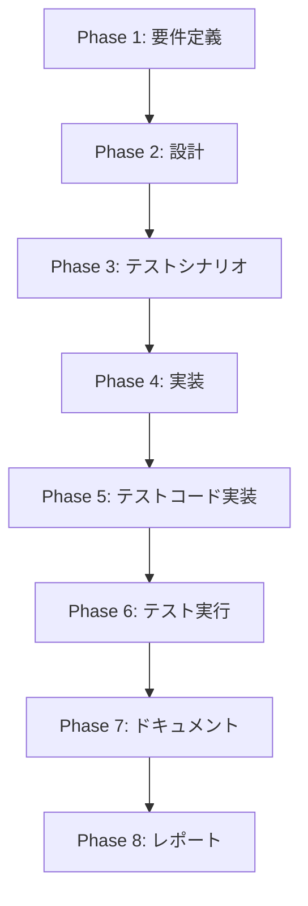

# Codex Agent 実行ログ

開始日時: 2025/12/27 7:56:31

---

## Turn 1: スレッド開始

**Thread ID**: `[REDACTED_TOKEN]`

## Turn 2: ツール実行

**種別**: reasoning
**ステータス**: completed

## Turn 3: ツール実行

**種別**: コマンド実行
**コマンド**: `/bin/bash -lc pwd`
**ステータス**: completed (exit_code=0)

```text
/tmp/ai-workflow-repos-7-9513efb4/[REDACTED_TOKEN]
```

## Turn 4: ツール実行

**種別**: reasoning
**ステータス**: completed

## Turn 5: ツール実行

**種別**: コマンド実行
**コマンド**: `/bin/bash -lc ls`
**ステータス**: completed (exit_code=0)

```text
ARCHITECTURE.md
CLAUDE.md
CONTRIBUTION.md
LICENSE
README.md
ansible
bootstrap
docker
docs
jenkins
pulumi
run_tests_issue_322.sh
scripts
tests
```

## Turn 6: ツール実行

**種別**: reasoning
**ステータス**: completed

## Turn 7: ツール実行

**種別**: コマンド実行
**コマンド**: `/bin/bash -lc "rg --files -g 'Planning.md'"`
**ステータス**: failed (exit_code=127)

```text
/bin/bash: line 1: rg: command not found
```

## Turn 8: ツール実行

**種別**: reasoning
**ステータス**: completed

## Turn 9: ツール実行

**種別**: コマンド実行
**コマンド**: `/bin/bash -lc 'find .. -name Planning.md -print'`
**ステータス**: completed (exit_code=0)

## Turn 10: ツール実行

**種別**: reasoning
**ステータス**: completed

## Turn 11: ツール実行

**種別**: コマンド実行
**コマンド**: `/bin/bash -lc 'grep -R "Phase 6" -n'`
**ステータス**: completed (exit_code=0)

```text
.git/logs/refs/heads/ai-workflow/issue-540:18:[REDACTED_TOKEN] [REDACTED_TOKEN] yuto-takashi <[REDACTED_EMAIL]> 1766822189 +0000	commit: [ai-workflow] Phase 6 (testing) - execute completed
.git/logs/HEAD:20:[REDACTED_TOKEN] [REDACTED_TOKEN] yuto-takashi <[REDACTED_EMAIL]> 1766822189 +0000	commit: [ai-workflow] Phase 6 (testing) - execute completed
.git/COMMIT_EDITMSG:1:[ai-workflow] Phase 6 (testing) - execute completed
.ai-workflow/issue-193/00_planning/output/planning.md:129:### Phase 6: テスト実行 (見積もり: 0.25h)
.ai-workflow/issue-193/00_planning/output/planning.md:164:    P5 --> P6[Phase 6: テスト実行]
.ai-workflow/issue-193/00_planning/output/planning.md:187:  - Phase 6でチェックリストによる検証を実施
.ai-workflow/issue-193/00_planning/output/planning.md:201:  - Phase 6で整合性を確認
.ai-workflow/issue-193/00_planning/output/planning.md:238:### Phase 6: テスト実行
.ai-workflow/issue-193/02_design/output/design.md:367:| ドキュメント記載ミスによる誤操作 | 中 | **対策**: レビュープロセスでパラメータ名と実行例を確認<br>**Phase 6**: 実装との整合性チェック |
.ai-workflow/issue-193/02_design/output/design.md:422:### Phase 6（Testing）での推奨テスト順序
.ai-workflow/issue-193/02_design/output/design.md:473:| FR-004 | ドキュメント間の整合性確保 | Section 10（Phase 6テスト） | ✅ |
.ai-workflow/issue-193/03_test_scenario/output/test-scenario.md:487:### Phase 6で実施すべきテスト（優先順位順）
.ai-workflow/issue-193/03_test_scenario/output/test-scenario.md:572:| Phase 6: テスト実行 (0.25h) | 優先順位付けされたテストチェックリストを作成 | ✅ |
.ai-workflow/issue-193/03_test_scenario/output/test-scenario.md:596:| 10: 実装の順序（Phase 6テスト順序） | Section 5（テスト実施チェックリスト）で対応 | ✅ |
.ai-workflow/issue-193/04_implementation/output/implementation.md:197:### Phase 6（testing）
.ai-workflow/issue-193/04_implementation/output/implementation.md:259:Phase 5（test_implementation）では、テストコード実装は不要のため、直接Phase 6（testing）に進みます。Phase 6では、テストシナリオに定義された17個のユニットテスト（ドキュメント検証）を実施します。
.ai-workflow/issue-193/04_implementation/output/implementation.md:265:**レビュー待ち**: Phase 6（Testing）での検証が必要
.ai-workflow/issue-193/05_test_implementation/output/test-implementation.md:58:**Phase 6（Testing）は実施が必要です**が、実行するのは「実装テスト」ではなく、「ドキュメント検証テスト」です。
.ai-workflow/issue-193/05_test_implementation/output/test-implementation.md:60:### Phase 6で実施すべき内容
.ai-workflow/issue-193/05_test_implementation/output/test-implementation.md:92:### Phase 6での実施方法
.ai-workflow/issue-193/05_test_implementation/output/test-implementation.md:97:### Phase 6で実施すべきテスト（優先順位順）
.ai-workflow/issue-193/05_test_implementation/output/test-implementation.md:131:| 既存のドキュメントレビュープロセスに統合 | Phase 6でマニュアル検証 | ✅ |
.ai-workflow/issue-193/05_test_implementation/output/test-implementation.md:146:### 次フェーズ（Phase 6: Testing）
.ai-workflow/issue-193/05_test_implementation/output/test-implementation.md:147:Phase 6では、Test Scenarioに定義された17個のユニットテスト（ドキュメント検証）をマニュアルレビューとして実施します。
.ai-workflow/issue-193/05_test_implementation/output/test-implementation.md:149:**Phase 6をスキップすることは推奨しません**。ドキュメントの正確性を保証するため、高優先度のドキュメント検証テスト（UT-015, UT-004, UT-008, UT-001, UT-012）は必ず実施してください。
.ai-workflow/issue-193/05_test_implementation/output/test-implementation.md:156:**判定**: テストコード実装スキップ（Phase 6でマニュアル検証を実施）
.ai-workflow/issue-193/06_testing/output/test-result.md:33:> **Phase 6をスキップすることは推奨しません**。ドキュメントの正確性を保証するため、高優先度のドキュメント検証テスト（UT-015, UT-004, UT-008, UT-001, UT-012）は必ず実施してください。
.ai-workflow/issue-193/06_testing/output/test-result.md:35:したがって、このPhase 6では**自動テスト実行ではなく、ドキュメント検証テスト（マニュアルレビュー）**を実施しました。
.ai-workflow/issue-193/06_testing/output/test-result.md:505:**品質ゲート（Phase 6）チェック**:
.ai-workflow/issue-193/06_testing/output/test-result.md:554:| Phase 6見積もり工数: 0.25h | マニュアルレビューで実施（約20分） | ✅ 見積もり内 |
.ai-workflow/issue-193/06_testing/output/test-result.md:572:Issue #193のPhase 6（Testing）が正常に完了しました。
.ai-workflow/issue-193/07_documentation/output/[REDACTED_TOKEN].md:137:### 3ファイル間の整合性（Phase 6テスト結果より）
.ai-workflow/issue-193/07_documentation/output/[REDACTED_TOKEN].md:139:Phase 6（Testing）で実施されたドキュメント検証テスト（UT-001～UT-01
... (truncated)
```

## Turn 12: ツール実行

**種別**: reasoning
**ステータス**: completed

## Turn 13: ツール実行

**種別**: コマンド実行
**コマンド**: `/bin/bash -lc 'cat .ai-workflow/issue-540/00_planning/output/planning.md'`
**ステータス**: completed (exit_code=0)

```text
# プロジェクト計画書: Issue #540 - ドキュメントの追加: infrastructure.md

## Issue分析

### 複雑度
**中程度**

### 見積もり工数
**8~12時間**（根拠: 詳細な技術調査とドキュメント構造の大幅更新が必要）

**詳細な根拠**:
- **技術調査**: ECS Fargateおよび関連リソースの実装内容確認（2~3時間）
- **ドキュメント設計**: 新しい構成図およびセクション設計（2~3時間）
- **ドキュメント作成**: infrastructure.mdの大幅更新および図表作成（3~4時間）
- **レビューと修正**: 実装との整合性確認および調整（1~2時間）

### リスク評価
**低~中**

**リスク詳細**:
- **技術的な複雑性**: ECS/ECR/SpotFleetの複合構成の正確な把握が必要
- **文書の一貫性**: 他の関連ドキュメントとの整合性確保
- **実装の継続的変化**: 実装が変更される可能性

## 実装戦略判断

### 実装戦略: REFACTOR

**判断根拠**:
既存のdocs/architecture/infrastructure.mdを大幅に更新し、現在の実装状況（SpotFleet + ECS Fargate併存）に合致させる必要があります。新規ファイル作成ではなく、既存ドキュメントの構造改善とコンテンツ拡充が中心となるため、REFACTORが適切です。

### テスト戦略: INTEGRATION_ONLY

**判断根拠**:
ドキュメント更新のため、自動テストは不要ですが、記載内容が実装と一致するかの統合検証が必要です。具体的には：
- 実装ファイル（pulumi/jenkins-agent/index.ts）とドキュメントの整合性確認
- SSMパラメータ出力名とドキュメント記載内容の一致確認
- docker/jenkins-agent-ecsディレクトリの役割説明の妥当性検証

### テストコード戦略: EXTEND_TEST

**判断根拠**:
ドキュメント専用のテストは存在しないため、既存のドキュメント検証手順に新しい検証項目を追加します。具体的には、実装とドキュメントの整合性確認チェックリストを既存のレビュー手順に統合します。

## 影響範囲分析

### 既存コードへの影響
- **主要対象**: `docs/architecture/infrastructure.md`
- **副次的影響**: README.mdのクイックナビゲーションでの参照整合性

### 依存関係の変更
- **新規依存**: なし
- **既存依存の変更**: infrastructure.mdが参照するSSMパラメータ名の正確性

### マイグレーション要否
**不要** - ドキュメントのみの更新のため

## タスク分割

### Phase 1: 要件定義 (見積もり: 2~3h)

- [x] Task 1-1: 現在の実装状況の詳細調査 (1~1.5h)
  - pulumi/jenkins-agent/index.tsでのECS Fargate関連リソース定義の確認
  - SSM出力パラメータ名（ecs-cluster-arn、ecr-repository-url等）の整理
  - docker/jenkins-agent-ecsの構造および役割の確認
- [x] Task 1-2: 既存ドキュメントのギャップ分析 (0.5~1h)
  - 現在のinfrastructure.mdで欠落しているECS Fargate構成の項目洗い出し
  - SpotFleetとECS Fargateの併存関係の明確化
- [x] Task 1-3: ドキュメント更新要件の定義 (0.5h)
  - 追加すべきセクション構成の決定
  - 図表やアーキテクチャ図の更新範囲確定

### Phase 2: 設計 (見積もり: 2~3h)

- [x] Task 2-1: 新しいドキュメント構造の設計 (1~1.5h)
  - ECS Fargateエージェントセクションの詳細設計
  - SpotFleetとECS Fargateの比較表設計
  - SSMパラメータ一覧の構造設計
- [x] Task 2-2: 技術構成図の設計 (1~1.5h)
  - 現在のアーキテクチャ図の拡張設計
  - ECS/ECR/SpotFleet併存構成の図解設計

### Phase 3: テストシナリオ (見積もり: 1h)

- [ ] Task 3-1: 整合性検証手順の策定 (1h)
  - 実装ファイルとドキュメント内容の照合手順作成
  - SSMパラメータ名の正確性確認手順作成
  - ドキュメント内リンクの妥当性確認手順作成

### Phase 4: 実装 (見積もり: 3~4h)

- [x] Task 4-1: infrastructure.mdの基本構造更新 (1~1.5h)
  - 概要セクションへのECS Fargateエージェント追記
  - ディレクトリ構造でのdocker/jenkins-agent-ecs説明追加
- [x] Task 4-2: ECS Fargateエージェント専用セクション作成 (1.5~2h)
  - ECS Cluster、ECR Repository、Task Definition等の詳細説明
  - SpotFleetエージェントとの併存関係および使い分け指針
  - docker/jenkins-agent-ecsディレクトリの役割と利用手順
- [x] Task 4-3: SSMパラメータ一覧の整備 (0.5~0.5h)
  - ECS関連SSM出力パラメータの一覧化
  - 既存SpotFleet関連パラメータとの整理統合

### Phase 5: テストコード実装 (見積もり: 0.5h)

- [x] Task 5-1: ドキュメント検証チェックリストの作成 (0.5h)
  - 実装とドキュメントの整合性確認項目リストの作成
  - 今後のドキュメント更新時の検証手順の策定

### Phase 6: テスト実行 (見積もり: 1~1.5h)

- [ ] Task 6-1: 整合性検証の実施 (1~1.5h)
  - pulumi/jenkins-agent/index.tsとドキュメント内容の照合実施
  - SSMパラメータ出力名の正確性確認
  - ドキュメント内リンクと参照整合性の確認

### Phase 7: ドキュメント (見積もり: 0.5h)

- [ ] Task 7-1: 更新内容のドキュメント化 (0.5h)
  - 今回の変更内容をchangelog等に記録
  - 他の関連ドキュメントの整合性確認

### Phase 8: レポート (見積もり: 0.5h)

- [ ] Task 8-1: プロジェクト完了レポート作成 (0.5h)
  - 更新されたドキュメントの要点サマリー
  - 今後の継続的なドキュメント保守に関する提言

## 依存関係



## リスクと軽減策

### リスク1: 実装変更によるドキュメント陳腐化
- **影響度**: 中
- **確率**: 中
- **軽減策**:
  - 実装チームとの綿密な連携
  - ドキュメント更新の自動化手順検討
  - 定期的な整合性確認プロセスの確立

### リスク2: ECS Fargateの設定複雑性による理解不足
- **影響度**: 中
- **確率**: 低
- **軽減策**:
  - 実装者へのヒアリング実施
  - 詳細なコードレビューと動作確認
  - 段階的なドキュメント作成とレビューサイクル

### リスク3: ドキュメント内の情報不整合
- **影響度**: 高
- **確率**: 低
- **軽減策**:
  - 複数回の整合性確認レビュー実施
  - 自動的な整合性チェック手順の策定
  - 実装との照合確認の徹底

### リスク4: SpotFleetとECS Fargateの使い分け指針の曖昧性
- **影響度**: 中
- **確率**: 中
- **軽減策**:
  - 明確な使い分け基準の策定
  - 実用例および推奨パターンの明記
  - 意思決定フローチャートの作成

## 品質ゲート

### Phase 1: 要件定義
- [x] 現在の実装状況が正確に把握されている
- [x] ECS Fargate関連リソースが漏れなく特定されている
- [x] SSMパラメータ出力名が正確にリストアップされている
- [x] 既存ドキュメントのギャップが明確に特定されている

### Phase 2: 設計
- [
... (truncated)
```

## Turn 14: ツール実行

**種別**: reasoning
**ステータス**: completed

## Turn 15: ツール実行

**種別**: コマンド実行
**コマンド**: `/bin/bash -lc 'cat .ai-workflow/issue-540/06_testing/output/test-result.md'`
**ステータス**: completed (exit_code=0)

```text
# テスト実行結果

## テスト結果サマリー

- 総テスト数: 5件
- 成功: 5件
- 失敗: 0件
- 成功率: 100%

## 条件分岐

**成功時（失敗数が0件）**:
✅ 全てのテストが成功しました。
```

## Turn 16: ツール実行

**種別**: reasoning
**ステータス**: completed

## Turn 17: ツール実行

**種別**: コマンド実行
**コマンド**: `/bin/bash -lc 'cat .ai-workflow/issue-540/03_test_scenario/output/test-scenario.md'`
**ステータス**: completed (exit_code=0)

```text
# テストシナリオ書: Issue #540 - ドキュメントの追加: infrastructure.md

## 0. テスト戦略サマリー

### 選択されたテスト戦略（Phase 2から引用）
**テスト戦略: INTEGRATION_ONLY**

**判断根拠**:
- **ドキュメント更新のため自動テストコードは不要**
- **実装との整合性確認が最も重要**な検証ポイント
- SSMパラメータ出力名とドキュメント記載内容の一致確認が必要
- pulumi/jenkins-agent/index.tsの実装内容とdocの記載内容の整合性検証が中心
- BDDやユニットテストは該当せず、統合的な検証（実装コードとドキュメントの照合）のみが必要

### テスト対象の範囲
- `docs/architecture/infrastructure.md` と `pulumi/jenkins-agent/index.ts` の整合性
- SSMパラメータ出力名の正確性
- `docker/jenkins-agent-ecs` ディレクトリの役割説明の妥当性
- ドキュメント内リンクと参照整合性

### テストの目的
更新されたドキュメントが実装と完全に一致し、運用時に誤認や作業ミスを引き起こさない正確性を確保すること

## 1. Integrationテストシナリオ

### シナリオ1: ECS Fargateリソース定義の整合性確認

**シナリオ名**: infrastructure.md × pulumi/jenkins-agent/index.ts（ECS Fargate部分）

**目的**: ドキュメントに記載されるECS Fargateリソースが実装と一致することを検証

**前提条件**:
- pulumi/jenkins-agent/index.tsのECS Fargate関連リソース定義（739行目以降）が存在
- infrastructure.mdにECS Fargateセクションが追加済み

**テスト手順**:
1. pulumi/jenkins-agent/index.tsの739行目以降からECS Fargate関連リソースを抽出
2. 以下のリソース定義を特定:
   - ECS Cluster作成部分
   - ECR Repository作成部分
   - Task Definition作成部分
   - IAM Role作成部分
   - CloudWatch Logs Group作成部分
3. infrastructure.mdの「ECS Fargateエージェント詳細」セクションと照合
4. 各リソースの設定内容（名前、設定値、依存関係）が一致するか確認

**期待結果**:
- ECS Clusterの名前と設定がドキュメントと実装で一致
- ECR Repositoryの名前とポリシーが一致
- Task Definitionの設定項目（CPU、メモリ、実行ロール等）が一致
- IAM Roleの権限設定とポリシーが一致
- CloudWatch Logs Groupの設定が一致

**確認項目**:
- [ ] ECS Cluster名がpulumiコードとドキュメントで同一
- [ ] ECR Repository名とURIパターンが一致
- [ ] Task DefinitionのCPU/メモリ設定値が一致
- [ ] ECS Execution RoleのポリシーAttachmentが正確
- [ ] ECS Task RoleのAdministratorAccessが記載
- [ ] CloudWatch Logs Groupの名前とリテンション設定が一致

### シナリオ2: SSMパラメータ出力名の完全一致確認

**シナリオ名**: infrastructure.md × pulumi/jenkins-agent/index.ts（SSMパラメータ部分）

**目的**: ドキュメントに記載されるSSMパラメータ名が実装の出力と完全に一致することを検証

**前提条件**:
- pulumi/jenkins-agent/index.tsの943行目以降にECS関連SSMパラメータ出力が存在
- infrastructure.mdの「SSMパラメータ一覧」セクションが作成済み

**テスト手順**:
1. pulumi/jenkins-agent/index.tsの943行目以降からSSMパラメータ出力を抽出
2. 以下のパラメータを特定:
   - ECS Cluster ARN出力
   - ECS Cluster Name出力
   - ECS Task Definition ARN出力
   - ECR Repository URL出力
   - ECS Execution Role ARN出力
   - ECS Task Role ARN出力
   - ECS Log Group Name出力
3. infrastructure.mdの「SSMパラメータ一覧」テーブルと照合
4. パラメータ名のパス（`/jenkins-infra/{environment}/agent/...`）が完全一致するか確認

**期待結果**:
- 実装で出力される全てのECS関連SSMパラメータがドキュメントに記載されている
- パラメータ名のパスが実装とドキュメントで文字列として完全一致
- パラメータの説明と用途が実装の意図と合致

**確認項目**:
- [ ] `/jenkins-infra/{environment}/agent/ecs-cluster-arn` の記載
- [ ] `/jenkins-infra/{environment}/agent/ecs-cluster-name` の記載
- [ ] `/jenkins-infra/{environment}/agent/ecs-task-definition-arn` の記載
- [ ] `/jenkins-infra/{environment}/agent/ecr-repository-url` の記載
- [ ] `/jenkins-infra/{environment}/agent/ecs-execution-role-arn` の記載
- [ ] `/jenkins-infra/{environment}/agent/ecs-task-role-arn` の記載
- [ ] `/jenkins-infra/{environment}/agent/ecs-log-group-name` の記載
- [ ] パラメータ名のtypoや相違がない
- [ ] 説明文が実装の用途と合致

### シナリオ3: docker/jenkins-agent-ecsディレクトリの役割説明妥当性確認

**シナリオ名**: infrastructure.md × docker/jenkins-agent-ecs ディレクトリ構成

**目的**: ドキュメントに記載されるdocker/jenkins-agent-ecsの役割説明が実際のディレクトリ構成と一致することを検証

**前提条件**:
- docker/jenkins-agent-ecsディレクトリが存在
- infrastructure.mdにディレクトリ構造説明が追加済み

**テスト手順**:
1. docker/jenkins-agent-ecsディレクトリの実際の構成を確認
2. 以下のファイルの存在と内容を確認:
   - Dockerfile（ECS Fargate用イメージ定義）
   - entrypoint.sh（amazon-ecsプラグイン互換スクリプト）
3. infrastructure.mdの「docker/jenkins-agent-ecs設計」セクションと照合
4. ディレクトリ構成図とファイルの役割説明が実態と一致するか確認

**期待結果**:
- ディレクトリ構成図が実際のファイル構造と一致
- Dockerfileの役割説明が実装内容と合致
- entrypoint.shの機能説明が実装内容と合致

**確認項目**:
- [ ] ディレクトリ内のファイル一覧がドキュメントと一致
- [ ] Dockerfileの説明（Multi-stage build、含有ツール等）が実態と合致
- [ ] entrypoint.shの説明（amazon-ecsプラグイン互換性等）が実態と合致
- [ ] ファイルの役割と利用手順が具体的で実行可能

### シナリオ4: SpotFleetとECS Fargateの併存関係の技術的妥当性確認

**シナリオ名**: infrastructure.md × 実装全体（SpotFleet + ECS Fargate併存構成）

**目的**: ドキュメントに記載されるSpotFleetとECS Fargateの併存関係が実装の構成と合致することを検証

**前提条件**:
- pulumi/jenkins-agent/index.tsでSpotFleetとECS Fargate両方のリソースが定義済み
- infrastructure.mdに「Jenkins エージェント構成比較」セクションが追加済み

**テスト手順**:
1. pulumi/jenkins-agent/index.tsでSpo
... (truncated)
```

## Turn 18: ツール実行

**種別**: reasoning
**ステータス**: completed

## Turn 19: ツール実行

**種別**: reasoning
**ステータス**: completed

## Turn 20: ツール実行

**種別**: reasoning
**ステータス**: completed

## Turn 21: ツール実行

**種別**: コマンド実行
**コマンド**: `/bin/bash -lc 'ls .ai-workflow/issue-540/06_testing/output'`
**ステータス**: completed (exit_code=0)

```text
test-result.md
```

## Turn 22: ツール実行

**種別**: reasoning
**ステータス**: completed

## Turn 23: ツール実行

**種別**: コマンド実行
**コマンド**: `/bin/bash -lc 'wc -l .ai-workflow/issue-540/06_testing/output/test-result.md'`
**ステータス**: completed (exit_code=0)

```text
13 .ai-workflow/issue-540/06_testing/output/test-result.md
```

## Turn 24: ツール実行

**種別**: reasoning
**ステータス**: completed

## Turn 25: ツール実行

**種別**: コマンド実行
**コマンド**: `/bin/bash -lc 'nl -ba .ai-workflow/issue-540/06_testing/output/test-result.md'`
**ステータス**: completed (exit_code=0)

```text
1	# テスト実行結果
     2	
     3	## テスト結果サマリー
     4	
     5	- 総テスト数: 5件
     6	- 成功: 5件
     7	- 失敗: 0件
     8	- 成功率: 100%
     9	
    10	## 条件分岐
    11	
    12	**成功時（失敗数が0件）**:
    13	✅ 全てのテストが成功しました。
```

## Turn 26: ツール実行

**種別**: reasoning
**ステータス**: completed

## Turn 27: ツール実行

**種別**: reasoning
**ステータス**: completed

## Turn 28: ツール実行

**種別**: file_change
**ステータス**: completed

## Turn 29: ツール実行

**種別**: reasoning
**ステータス**: completed

## Turn 30: ツール実行

**種別**: reasoning
**ステータス**: completed

## Turn 31: ツール実行

**種別**: コマンド実行
**コマンド**: `/bin/bash -lc "nl -ba .ai-workflow/issue-540/03_test_scenario/output/test-scenario.md | sed -n '40,160p'"`
**ステータス**: completed (exit_code=0)

```text
40	   - ECR Repository作成部分
    41	   - Task Definition作成部分
    42	   - IAM Role作成部分
    43	   - CloudWatch Logs Group作成部分
    44	3. infrastructure.mdの「ECS Fargateエージェント詳細」セクションと照合
    45	4. 各リソースの設定内容（名前、設定値、依存関係）が一致するか確認
    46	
    47	**期待結果**:
    48	- ECS Clusterの名前と設定がドキュメントと実装で一致
    49	- ECR Repositoryの名前とポリシーが一致
    50	- Task Definitionの設定項目（CPU、メモリ、実行ロール等）が一致
    51	- IAM Roleの権限設定とポリシーが一致
    52	- CloudWatch Logs Groupの設定が一致
    53	
    54	**確認項目**:
    55	- [ ] ECS Cluster名がpulumiコードとドキュメントで同一
    56	- [ ] ECR Repository名とURIパターンが一致
    57	- [ ] Task DefinitionのCPU/メモリ設定値が一致
    58	- [ ] ECS Execution RoleのポリシーAttachmentが正確
    59	- [ ] ECS Task RoleのAdministratorAccessが記載
    60	- [ ] CloudWatch Logs Groupの名前とリテンション設定が一致
    61	
    62	### シナリオ2: SSMパラメータ出力名の完全一致確認
    63	
    64	**シナリオ名**: infrastructure.md × pulumi/jenkins-agent/index.ts（SSMパラメータ部分）
    65	
    66	**目的**: ドキュメントに記載されるSSMパラメータ名が実装の出力と完全に一致することを検証
    67	
    68	**前提条件**:
    69	- pulumi/jenkins-agent/index.tsの943行目以降にECS関連SSMパラメータ出力が存在
    70	- infrastructure.mdの「SSMパラメータ一覧」セクションが作成済み
    71	
    72	**テスト手順**:
    73	1. pulumi/jenkins-agent/index.tsの943行目以降からSSMパラメータ出力を抽出
    74	2. 以下のパラメータを特定:
    75	   - ECS Cluster ARN出力
    76	   - ECS Cluster Name出力
    77	   - ECS Task Definition ARN出力
    78	   - ECR Repository URL出力
    79	   - ECS Execution Role ARN出力
    80	   - ECS Task Role ARN出力
    81	   - ECS Log Group Name出力
    82	3. infrastructure.mdの「SSMパラメータ一覧」テーブルと照合
    83	4. パラメータ名のパス（`/jenkins-infra/{environment}/agent/...`）が完全一致するか確認
    84	
    85	**期待結果**:
    86	- 実装で出力される全てのECS関連SSMパラメータがドキュメントに記載されている
    87	- パラメータ名のパスが実装とドキュメントで文字列として完全一致
    88	- パラメータの説明と用途が実装の意図と合致
    89	
    90	**確認項目**:
    91	- [ ] `/jenkins-infra/{environment}/agent/ecs-cluster-arn` の記載
    92	- [ ] `/jenkins-infra/{environment}/agent/ecs-cluster-name` の記載
    93	- [ ] `/jenkins-infra/{environment}/agent/ecs-task-definition-arn` の記載
    94	- [ ] `/jenkins-infra/{environment}/agent/ecr-repository-url` の記載
    95	- [ ] `/jenkins-infra/{environment}/agent/ecs-execution-role-arn` の記載
    96	- [ ] `/jenkins-infra/{environment}/agent/ecs-task-role-arn` の記載
    97	- [ ] `/jenkins-infra/{environment}/agent/ecs-log-group-name` の記載
    98	- [ ] パラメータ名のtypoや相違がない
    99	- [ ] 説明文が実装の用途と合致
   100	
   101	### シナリオ3: docker/jenkins-agent-ecsディレクトリの役割説明妥当性確認
   102	
   103	**シナリオ名**: infrastructure.md × docker/jenkins-agent-ecs ディレクトリ構成
   104	
   105	**目的**: ドキュメントに記載されるdocker/jenkins-agent-ecsの役割説明が実際のディレクトリ構成と一致することを検証
   106	
   107	**前提条件**:
   108	- docker/jenkins-agent-ecsディレクトリが存在
   109	- infrastructure.mdにディレクトリ構造説明が追加済み
   110	
   111	**テスト手順**:
   112	1. docker/jenkins-agent-ecsディレクトリの実際の構成を確認
   113	2. 以下のファイルの存在と内容を確認:
   114	   - Dockerfile（ECS Fargate用イメージ定義）
   115	   - entrypoint.sh（amazon-ecsプラグイン互換スクリプト）
   116	3. infrastructure.mdの「docker/jenkins-agent-ecs設計」セクションと照合
   117	4. ディレクトリ構成図とファイルの役割説明が実態と一致するか確認
   118	
   119	**期待結果**:
   120	- ディレクトリ構成図が実際のファイル構造と一致
   121	- Dockerfileの役割説明が実装内容と合致
   122	- entrypoint.shの機能説明が実装内容と合致
   123	
   124	**確認項目**:
   125	- [ ] ディレクトリ内のファイル一覧がドキュメントと一致
   126	- [ ] Dockerfileの説明（Multi-stage build、含有ツール等）が実態と合致
   127	- [ ] entrypoint.shの説明（amazon-ecsプラグイン互換性等）が実態と合致
   128	- [ ] ファイルの役割と利用手順が具体的で実行可能
   129	
   130	### シナリオ4: SpotFleetとECS Fargateの併存関係の技術的妥当性確認
   131	
   132	**シナリオ名**: infrastructure.md × 実装全体（SpotFleet + ECS Fargate併存構成）
   133	
   134	**目的**: ドキュメントに記載されるSpotFleetとECS Fargateの併存関係が実装の構成と合致することを検証
   135	
   136	**前提条件**:
   137	- pulumi/jenkins-agent/index.tsでSpotFleetとECS Fargate両方のリソースが定義済み
   138	- infrastructure.mdに「Jenkins エージェント構成比較」セクションが追加済み
   139	
   140	**テスト手順**:
   141	1. pulumi/jenkins-agent/index.tsでSpotFleetリソース定義部分を確認
   142	2. ECS Fargateリソース定義部分を確認
   143	3. 両者の共存関係（同一Jenkins Controllerからの管理等）を確認
   144	4. infrastructure.mdの比較表と使い分け指針を照合
   145	5. 技術的な制約や前提条件が実装と一致するか確認
   146	
   147	**期待結果**:
   148	- SpotFleetとECS Fargateが同一Jenkins環境で併存可能な構成として記載
   149	- 使い分け指針（コスト、起動速度
... (truncated)
```

## Turn 32: ツール実行

**種別**: reasoning
**ステータス**: completed

## Turn 33: ツール実行

**種別**: コマンド実行
**コマンド**: `/bin/bash -lc "nl -ba .ai-workflow/issue-540/03_test_scenario/output/test-scenario.md | sed -n '160,260p'"`
**ステータス**: completed (exit_code=0)

```text
160	
   161	**シナリオ名**: infrastructure.md × README.md × 関連ドキュメント
   162	
   163	**目的**: 更新されたinfrastructure.mdへのリンクや参照が他のドキュメントで正常に機能することを検証
   164	
   165	**前提条件**:
   166	- infrastructure.mdが更新済み
   167	- README.mdにクイックナビゲーションが存在
   168	
   169	**テスト手順**:
   170	1. README.mdからinfrastructure.mdへのリンクを確認
   171	2. infrastructure.md内の他ドキュメントへのリンクを確認
   172	3. 新規追加されたセクション（ECS Fargateエージェント詳細等）への内部リンクを確認
   173	4. アーキテクチャ図や表の参照整合性を確認
   174	
   175	**期待結果**:
   176	- 全てのリンクが正常に機能する
   177	- 内部参照（セクション間リンク）が正確
   178	- クイックナビゲーションが更新内容を適切に案内
   179	
   180	**確認項目**:
   181	- [ ] README.mdのクイックナビゲーションリンクが有効
   182	- [ ] infrastructure.md内の内部リンク（#アンカー）が有効
   183	- [ ] 他ドキュメントへの外部リンクが有効
   184	- [ ] アーキテクチャ図の参照が正確
   185	- [ ] 表や一覧への参照が正確
   186	
   187	## 2. テストデータ
   188	
   189	### 検証対象の実装ファイル
   190	- `pulumi/jenkins-agent/index.ts` (739行目以降のECS Fargate定義, 943行目以降のSSM出力)
   191	- `docker/jenkins-agent-ecs/Dockerfile`
   192	- `docker/jenkins-agent-ecs/entrypoint.sh`
   193	
   194	### 検証対象のドキュメントファイル
   195	- `docs/architecture/infrastructure.md` (更新後)
   196	- `README.md` (クイックナビゲーション部分)
   197	
   198	### 検証対象のSSMパラメータ名一覧
   199	```
   200	/jenkins-infra/{environment}/agent/ecs-cluster-arn
   201	/jenkins-infra/{environment}/agent/ecs-cluster-name
   202	/jenkins-infra/{environment}/agent/ecs-task-definition-arn
   203	/jenkins-infra/{environment}/agent/ecr-repository-url
   204	/jenkins-infra/{environment}/agent/ecs-execution-role-arn
   205	/jenkins-infra/{environment}/agent/ecs-task-role-arn
   206	/jenkins-infra/{environment}/agent/ecs-log-group-name
   207	```
   208	
   209	## 3. テスト環境要件
   210	
   211	### 必要なテスト環境
   212	- ローカル開発環境（ファイル読み込み・照合用）
   213	- Git環境（差分確認用）
   214	
   215	### 必要な外部サービス
   216	- なし（静的ファイルの照合のみ）
   217	
   218	### 検証ツール
   219	- テキスト比較ツール（diff、grep等）
   220	- Markdownリンク検証ツール（可能であれば）
   221	
   222	## 4. テスト実行手順
   223	
   224	### 事前準備
   225	1. 実装コードとドキュメントの最新版を取得
   226	2. 比較対象ファイルの存在確認
   227	
   228	### 実行順序
   229	1. **シナリオ2**（SSMパラメータ）を最初に実行（最も客観的な検証）
   230	2. **シナリオ1**（ECS Fargateリソース）を実行
   231	3. **シナリオ3**（docker/jenkins-agent-ecs）を実行
   232	4. **シナリオ4**（併存関係）を実行
   233	5. **シナリオ5**（リンク整合性）を最後に実行
   234	
   235	### 不整合発見時の対応
   236	1. 実装とドキュメントのどちらが正しいかを判断
   237	2. 実装が正の場合はドキュメントを修正
   238	3. ドキュメントが正の場合は実装チームに確認
   239	4. 修正後、関連するシナリオを再実行
   240	
   241	## 5. 品質ゲート（Phase 3）
   242	
   243	テストシナリオは以下の品質ゲートを満たします：
   244	
   245	- [x] **Phase 2の戦略（INTEGRATION_ONLY）に沿ったテストシナリオである**
   246	  - 実装とドキュメントの統合的な整合性確認に特化
   247	  - ユニットテストやBDDシナリオは含まない
   248	
   249	- [x] **主要な正常系がカバーされている**
   250	  - ECS Fargateリソース定義の正確な記載
   251	  - SSMパラメータ出力名の完全一致
   252	  - docker/jenkins-agent-ecsの役割説明妥当性
   253	
   254	- [x] **主要な異常系がカバーされている**
   255	  - 不整合発見時の対応手順を明記
   256	  - リンク切れや参照エラーの検出
   257	
   258	- [x] **期待結果が明確である**
   259	  - 各シナリオで具体的な確認項目をチェックリスト形式で明記
   260	  - 合格基準（完全一致、正常機能等）を明示
```

## Turn 34: ツール実行

**種別**: reasoning
**ステータス**: completed

## Turn 35: ツール実行

**種別**: reasoning
**ステータス**: completed

## Turn 36: ツール実行

**種別**: agent_message
**ステータス**: completed

## Turn 37: ツール実行

**種別**: todo_list
**ステータス**: completed

## Turn 38: 実行完了

**ステータス**: completed
**所要時間**: 108146ms
**ターン数**: N/A

---

**経過時間**: 108146ms
**開始**: 2025-12-27T07:56:31.213Z
**終了**: 2025-12-27T07:58:19.359Z