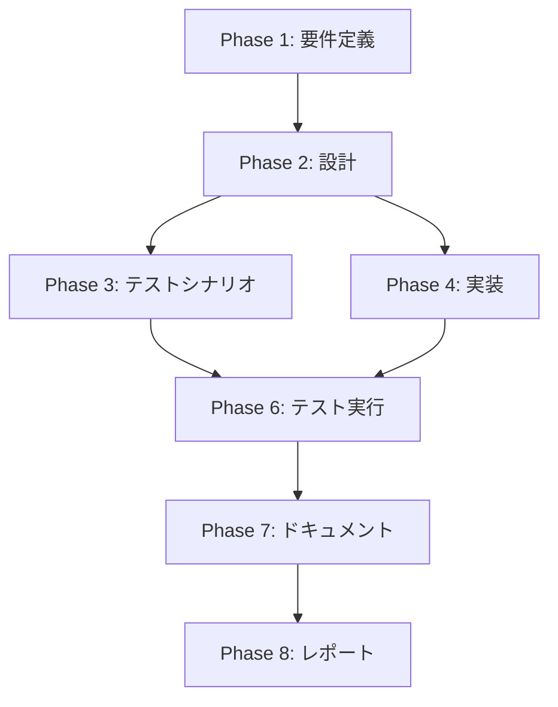

# プロジェクト計画書: Issue #542

## SpotFleetエージェントのCPUクレジットUnlimited設定適用

---

## 1. Issue分析

### 概要
SpotFleetエージェントのt3/t4g系LaunchTemplateに`creditSpecification.cpuCredits="unlimited"`設定を追加し、CI負荷時のCPUスロットリングを防止する。

### 複雑度: **簡単**

**判断根拠**:
- 変更対象は単一ファイル（`pulumi/jenkins-agent/index.ts`）のみ
- 2つのLaunchTemplate定義（x86_64用とARM64用）に`creditSpecification`プロパティを追加するだけ
- 既存のPulumiスタック構造への影響が限定的
- AWSの標準的なEC2設定オプションの追加であり、技術的な不確実性が低い

### 見積もり工数: **2~3時間**

| フェーズ | 見積もり時間 |
|---------|-------------|
| Phase 1: 要件定義 | 0.25h |
| Phase 2: 設計 | 0.25h |
| Phase 3: テストシナリオ | 0.25h |
| Phase 4: 実装 | 0.5h |
| Phase 5: テストコード実装 | 0h (手動検証) |
| Phase 6: テスト実行 | 0.5h |
| Phase 7: ドキュメント | 0.5h |
| Phase 8: レポート | 0.25h |
| **合計** | **2.5h** |

### リスク評価: **低**

- 既存のインフラへの影響は限定的
- ロールバックが容易（Pulumiの変更を元に戻すだけ）
- Unlimited設定は追加コストが発生するが、CI性能向上のトレードオフとして許容済み

---

## 2. 実装戦略判断

### 実装戦略: **EXTEND**

**判断根拠**:
- 既存の`pulumi/jenkins-agent/index.ts`の2つのLaunchTemplate定義に新しいプロパティを追加する
- 新規ファイルやクラスの作成は不要
- 既存コードの構造変更（リファクタリング）も不要
- 純粋な機能拡張（既存リソース定義へのプロパティ追加）

### テスト戦略: **INTEGRATION_ONLY**

**判断根拠**:
- Pulumiインフラコードであり、ユニットテストの対象ではない
- `pulumi preview`による差分確認が主要な検証手段
- 実際のAWSリソースへの反映後、CloudWatchでCPUクレジット動作を確認
- BDDテストは不要（インフラ設定変更であり、ユーザーストーリー中心ではない）

### テストコード戦略: **該当なし（手動検証）**

**判断根拠**:
- Pulumiインフラコードには専用のテストファイルが存在しない
- 検証は`pulumi preview`コマンドと実環境でのCloudWatch確認で実施
- 自動テストコードの作成は不要

---

## 3. 影響範囲分析

### 既存コードへの影響

| ファイル | 変更内容 | 影響度 |
|----------|----------|--------|
| `pulumi/jenkins-agent/index.ts` | 2つのLaunchTemplateに`creditSpecification`追加 | 低 |

### 変更対象の詳細

#### agentLaunchTemplate（x86_64用、293行目付近）
```typescript
const agentLaunchTemplate = new aws.ec2.LaunchTemplate(`agent-lt`, {
    // 既存のプロパティ...
    creditSpecification: {
        cpuCredits: "unlimited",
    },
    // ...
});
```

#### agentLaunchTemplateArm（ARM64用、393行目付近）
```typescript
const agentLaunchTemplateArm = new aws.ec2.LaunchTemplate(`agent-lt-arm`, {
    // 既存のプロパティ...
    creditSpecification: {
        cpuCredits: "unlimited",
    },
    // ...
});
```

### 依存関係の変更
- **新規依存の追加**: なし
- **既存依存の変更**: なし
- **npm パッケージ変更**: なし

### マイグレーション要否
- **データベーススキーマ変更**: なし
- **設定ファイル変更**: なし
- **SSMパラメータ変更**: なし

### インフラ更新の影響

SpotFleetは以下の動作で更新される:
1. Pulumiがスタックを更新すると、LaunchTemplateの新しいバージョンが作成される
2. SpotFleetは`latestVersion`を参照しているため、新しいインスタンスから自動的に新設定が適用される
3. 既存インスタンスは終了時に新設定のインスタンスに置き換わる（ローリング更新）

---

## 4. タスク分割

### Phase 1: 要件定義 (見積もり: 0.25h)

- [x] Task 1-1: 対象インスタンスタイプの確認 (0.15h)
  - t3/t3a系（x86_64）の確認: t3a.medium, t3.medium, t3a.small, t3.small, t3a.micro, t3.micro
  - t4g系（ARM64）の確認: t4g.medium, t4g.small, t4g.micro
  - すべてがT系バースタブルインスタンスであることを確認
- [x] Task 1-2: 受け入れ基準の明確化 (0.1h)
  - `creditSpecification.cpuCredits="unlimited"`が両LaunchTemplateに設定されていること
  - `pulumi preview`で差分が期待通りであること
  - 高負荷ジョブ実行時にスロットリングが発生しないこと

### Phase 2: 設計 (見積もり: 0.25h)

- [x] Task 2-1: 変更箇所の特定と設計 (0.15h)
  - `agentLaunchTemplate`（293行目付近）への追加位置決定
  - `agentLaunchTemplateArm`（393行目付近）への追加位置決定
  - プロパティ追加の構文確認（Pulumi AWS provider）
- [x] Task 2-2: コスト影響の確認 (0.1h)
  - Unlimited設定によるCPUクレジット追加料金の理解
  - ドキュメントへの注意事項記載内容の検討

### Phase 3: テストシナリオ (見積もり: 0.25h)

- [x] Task 3-1: Pulumi preview検証シナリオ作成 (0.15h)
  - 期待される差分内容の定義
  - 差分確認手順の文書化
- [x] Task 3-2: 動作確認シナリオ作成 (0.1h)
  - CloudWatch CPUCreditBalanceメトリクス監視手順
  - 高負荷ジョブの実行手順

### Phase 4: 実装 (見積もり: 0.5h)

- [x] Task 4-1: x86_64用LaunchTemplateの修正 (0.2h)
  - `agentLaunchTemplate`に`creditSpecification`プロパティを追加
  - `cpuCredits: "unlimited"`を設定
- [x] Task 4-2: ARM64用LaunchTemplateの修正 (0.2h)
  - `agentLaunchTemplateArm`に`creditSpecification`プロパティを追加
  - `cpuCredits: "unlimited"`を設定
- [x] Task 4-3: コード品質確認 (0.1h)
  - TypeScriptの型エラーがないことを確認
  - 既存のコードスタイルとの整合性確認

### Phase 5: テストコード実装 (見積もり: 0h)

- [x] Task 5-1: LaunchTemplateとドキュメント確認テストの追加
  - `tests/integration/test_cpu_credit_unlimited.py`を作成し、x86_64/ARM64 LaunchTemplateの`creditSpecification`と`docs/architecture/infrastructure.md`のUnlimited設定記載を検証

### Phase 6: テスト実行 (見積もり: 0.5h)

- [ ] Task 6-1: Pulumi previewによる差分確認 (0.2h)
  - `pulumi preview`コマンドの実行
  - LaunchTemplateの`creditSpecification`変更が表示されることを確認
  - 予期しない変更がないことを確認
- [ ] Task 6-2: Pulumi upによるデプロイ (0.2h)
  - 開発環境へのデプロイ実行
  - デプロイ成功の確認
- [ ] Task 6-3: 動作確認 (0.1h)
  - AWSコンソールでLaunchTemplateの設定確認
  - （オプション）CloudWatchでCPUクレジットメトリクス確認

### Phase 7: ドキュメント (見積もり: 0.5h)

- [x] Task 7-1: インフラ構成ドキュメント更新 (0.3h)
  - `docs/architecture/infrastructure.md`にUnlimited設定の説明追加
  - コスト影響に関する注意事項の記載
- [x] Task 7-2: pulumi/README.md確認 (0.2h)
  - jenkins-agentスタックに関する説明の確認
  - 必要に応じて変更点を追記

### Phase 8: レポート (見積もり: 0.25h)

- [ ] Task 8-1: 実装完了レポート作成 (0.25h)
  - 変更内容のサマリー
  - テスト結果の記録
  - 今後の監視項目の記載

---

## 5. 依存関係



**補足**:
- Phase 5（テストコード実装）は今回該当なしのためスキップ
- Phase 3（テストシナリオ）とPhase 4（実装）は並行作業可能

---

## 6. リスクと軽減策

### リスク1: コスト増加
- **影響度**: 中
- **確率**: 高（Unlimited設定は追加料金が発生する仕様）
- **軽減策**:
  - ドキュメントにコスト影響を明記
  - CloudWatch BillingアラートでCPUクレジット費用を監視
  - 必要に応じてSSMパラメータでUnlimited/Standard切り替え可能な設計を検討（将来対応）

### リスク2: SpotFleetの更新タイミング
- **影響度**: 低
- **確率**: 低
- **軽減策**:
  - 既存インスタンスは終了まで旧設定で動作
  - 即時反映が必要な場合は手動でSpotFleetインスタンスを入れ替え
  - ドキュメントにローリング更新の動作を記載

### リスク3: Pulumi AWSプロバイダーの互換性
- **影響度**: 低
- **確率**: 低
- **軽減策**:
  - `@pulumi/aws`の`creditSpecification`プロパティはv6.0以降でサポート
  - package.jsonで`@pulumi/aws: "^6.0.0"`を確認済み

### リスク4: テスト環境の制約
- **影響度**: 中
- **確率**: 中（ローカルからAWSへのアクセス権限に依存）
- **軽減策**:
  - `pulumi preview`のみで差分確認を完了させる
  - 実環境へのデプロイはCI/CDパイプライン経由で実施

---

## 7. 品質ゲート

### Phase 1: 要件定義
- [x] 対象インスタンスタイプが明確に列挙されている（t3/t3a/t4g系）
- [x] 受け入れ基準が定義されている（creditSpecification設定、スロットリング防止）
- [x] コスト影響が理解されている

### Phase 2: 設計
- [x] 実装戦略の判断根拠が明記されている（EXTEND）
- [x] テスト戦略の判断根拠が明記されている（INTEGRATION_ONLY）
- [x] 変更箇所が2つのLaunchTemplateに限定されている
- [x] Pulumiリソースの構文が確認されている

### Phase 3: テストシナリオ
- [x] Pulumi preview検証シナリオが作成されている
- [x] CloudWatchメトリクス確認手順が文書化されている

### Phase 4: 実装
- [ ] `agentLaunchTemplate`に`creditSpecification`が追加されている
- [ ] `agentLaunchTemplateArm`に`creditSpecification`が追加されている
- [ ] TypeScriptの型エラーがない
- [ ] 既存のコードスタイルに準拠している

### Phase 5: テストコード実装
- [x] 該当なし（手動検証のため）

### Phase 6: テスト実行
- [ ] `pulumi preview`で期待される差分のみが表示される
- [ ] `pulumi up`が正常に完了する
- [ ] AWSコンソールでLaunchTemplateの設定が反映されている

### Phase 7: ドキュメント
- [x] `docs/architecture/infrastructure.md`にUnlimited設定の説明が追加されている
- [x] コスト注意事項が記載されている
- [x] 関連するREADMEが必要に応じて更新されている

### Phase 8: レポート
- [ ] 変更内容のサマリーが作成されている
- [ ] テスト結果が記録されている

---

## 8. 技術的詳細

### Pulumi AWS LaunchTemplate creditSpecification構文

```typescript
const launchTemplate = new aws.ec2.LaunchTemplate("example", {
    // 他のプロパティ...
    creditSpecification: {
        cpuCredits: "unlimited", // または "standard"
    },
});
```

### AWS CPUクレジットの動作

| 設定 | 動作 | コスト |
|------|------|--------|
| standard | クレジット枯渇時にベースラインCPUに制限 | 追加コストなし |
| unlimited | クレジット枯渇後も高いCPU使用率を維持 | 超過分は追加課金 |

### 適用されるSpotFleet

| Fleet名 | インスタンスタイプ | LaunchTemplate |
|---------|-------------------|----------------|
| agent-spot-fleet (medium) | t4g.medium, t3a.medium, t3.medium | agentLaunchTemplateArm, agentLaunchTemplate |
| agent-spot-fleet-small | t4g.small, t3a.small, t3.small | agentLaunchTemplateArm, agentLaunchTemplate |
| agent-spot-fleet-micro | t4g.micro, t3a.micro, t3.micro | agentLaunchTemplateArm, agentLaunchTemplate |

---

## 9. 参考資料

- [AWS EC2 Unlimited Mode for Burstable Performance Instances](https://docs.aws.amazon.com/AWSEC2/latest/UserGuide/burstable-credits-baseline-concepts.html)
- [Pulumi AWS LaunchTemplate Documentation](https://www.pulumi.com/registry/packages/aws/api-docs/ec2/launchtemplate/)
- プロジェクト内ドキュメント:
  - `CLAUDE.md` - プロジェクトガイダンス
  - `pulumi/CONTRIBUTION.md` - Pulumi開発規約
  - `docs/architecture/infrastructure.md` - インフラ構成説明
