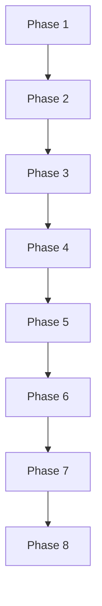

# Codex Agent 実行ログ

開始日時: 2025/12/27 22:32:48

---

## Turn 1: スレッド開始

**Thread ID**: `[REDACTED_TOKEN]`

## Turn 2: ツール実行

**種別**: reasoning
**ステータス**: completed

## Turn 3: ツール実行

**種別**: コマンド実行
**コマンド**: `/bin/bash -lc ls`
**ステータス**: completed (exit_code=0)

```text
ARCHITECTURE.md
CLAUDE.md
CONTRIBUTION.md
LICENSE
README.md
ansible
bootstrap
docker
docs
jenkins
pulumi
run_tests_issue_322.sh
scripts
tests
```

## Turn 4: ツール実行

**種別**: reasoning
**ステータス**: completed

## Turn 5: ツール実行

**種別**: コマンド実行
**コマンド**: `/bin/bash -lc 'ls .ai-workflow/issue-544/00_planning/output'`
**ステータス**: completed (exit_code=0)

```text
planning.md
```

## Turn 6: ツール実行

**種別**: reasoning
**ステータス**: completed

## Turn 7: ツール実行

**種別**: コマンド実行
**コマンド**: `/bin/bash -lc 'cat .ai-workflow/issue-544/00_planning/output/planning.md'`
**ステータス**: completed (exit_code=0)

```text
# プロジェクト計画書 - Issue #544

## 1. Issue分析
- 複雑度: 中程度（Pulumi/CloudWatch Agent設定の拡張とテンプレート化で複数ファイルに跨るが新規サブシステム追加なし）
- 見積もり工数: 14~16時間（CPUメトリクス追加・共通化対応4~6h、Pulumi生成テンプレート調整3~4h、検証/テスト4h、ドキュメント/レポート2h）
- リスク評価: 中（ARM/x86間の設定差分やメトリクス粒度不足による可観測性欠落のリスク）

## 2. 実装戦略判断
- 実装戦略: EXTEND（既存CloudWatch Agent設定にCPUメトリクスを追加し、テンプレート化で設定差異を吸収する拡張が中心）
- テスト戦略: INTEGRATION_ONLY（CloudWatch Agent設定の構文検証、Pulumi生成結果の差分確認、AMIビルドパイプラインでのTranslator実行など外部連携検証が中心）
- テストコード戦略: EXTEND_TEST（既存AMIビルド/CI検証ステップにCPUメトリクス検証を追加し、Translator検証コマンドを拡張する方針）

## 3. 影響範囲分析
- 既存コードへの影響: `pulumi/jenkins-agent-ami/component-x86.yml`, `pulumi/jenkins-agent-ami/component-arm.yml`、共通テンプレート生成ロジック（YAMLアンカー/共通ブロック）
- 依存関係の変更: 追加依存なし（CloudWatch Agentプラグインの既存CPUメトリクス利用）
- マイグレーション要否: CloudWatch Agent設定ファイルの更新のみ。データストアやスキーマ変更なし

## 4. タスク分割
### Phase 1: 要件定義 (見積もり: 2h)
- [ ] Task 1-1: CPUメトリクス要件精査 (1h)
  - 収集対象メトリクス（active/user/system/iowait）と収集間隔60秒を確認
  - [REDACTED_TOKEN]を[REDACTED_TOKEN]単一に固定する要件の確定
- [ ] Task 1-2: 対象範囲と除外条件の明確化 (1h)
  - ARM/x86双方の対象確認
  - CloudWatch料金影響の範囲と許容値を合意

### Phase 2: 設計 (見積もり: 3h)
- [ ] Task 2-1: 共通テンプレート設計 (2h)
  - CPU/メモリメトリクス共通ブロックの定義方式（YAMLアンカー/Here-doc等）を決定
  - ARM/x86生成パイプラインへの適用方針を策定
- [ ] Task 2-2: 検証手順設計 (1h)
  - `[REDACTED_TOKEN]`利用手順をARM/x86両方で定義
  - Pulumi preview/plan での差分確認項目を明文化

### Phase 3: テストシナリオ (見積もり: 2h)
- [ ] Task 3-1: 検証ケース作成 (2h)
  - CPUメトリクスが[REDACTED_TOKEN]単一ディメンションで出力されることを確認する手順
  - ARM/x86の生成ファイル差分がないことを確認する比較手順

### Phase 4: 実装 (見積もり: 4h)
- [ ] Task 4-1: CPUメトリクス追加とテンプレート化 (3h)
  - 共通ブロックにcpu_usage_active/user/system/iowaitを追加
  - ARM/x86コンポーネントへの適用と重複除去
- [ ] Task 4-2: Pulumi生成ロジック/スクリプト更新 (1h)
  - テンプレート利用部の整合性確認
  - 必要に応じた変数化やコメント整備

### Phase 5: テストコード実装 (見積もり: 2h)
- [ ] Task 5-1: Translator検証ステップ拡張 (2h)
  - AMIビルド/CIスクリプトにTranslator実行を追加（ARM/x86両方）
  - 失敗時に詳細を出力するロギングを追加

### Phase 6: テスト実行 (見積もり: 1.5h)
- [ ] Task 6-1: 自動検証実行 (1h)
  - Translatorによる設定構文チェック（ARM/x86）
  - Pulumi previewで設定差分確認
- [ ] Task 6-2: 手動スポット確認 (0.5h)
  - 生成されたCloudWatch Agent JSON/YAMLのCPUメトリクス有無を目視確認

### Phase 7: ドキュメント (見積もり: 1h)
- [ ] Task 7-1: 設定変更の記録 (1h)
  - `CLAUDE.md`や関連READMEに検証手順/メトリクス追加の変更点を追記
  - 運用手順（ダッシュボード/アラーム初期値）を共有メモに記載

### Phase 8: レポート (見積もり: 0.5h)
- [ ] Task 8-1: リリースノート/振り返り (0.5h)
  - 変更概要、テスト結果、残課題をまとめて共有

## 5. 依存関係（Mermaid）


## 6. リスクと軽減策
- リスク1: ARM/x86設定差分が再発し片方にメトリクスがない
  - 影響度: 中 / 確率: 中
  - 軽減策: テンプレート化＋Translator検証を両アーキで必須化し、CIで差分比較を実施
- リスク2: CloudWatchメトリクスコスト増加
  - 影響度: 低 / 確率: 中
  - 軽減策: 60秒間隔維持・ディメンション単一化でデータポイント抑制し、初月に請求確認
- リスク3: Pulumi生成物と実機設定の乖離
  - 影響度: 中 / 確率: 低
  - 軽減策: Pulumi previewで差分確認し、AMIビルド時の生成物をアーティファクトとして保存

## 7. 品質ゲート
- Phase 1: 要件定義
  - [ ] CPUメトリクス項目と収集間隔/ディメンションが明文化されている
  - [ ] 対象アーキテクチャと料金影響が合意されている
- Phase 2: 設計
  - [ ] 実装戦略/テスト戦略/テストコード戦略が明記されている
  - [ ] 共通テンプレート設計と検証手順がレビュー済み
- Phase 3: テストシナリオ
  - [ ] CPUメトリクスのディメンション確認手順が定義されている
  - [ ] ARM/x86差分検出シナリオが用意されている
- Phase 4: 実装
  - [ ] ARM/x86双方に同一メトリクスが適用されている
  - [ ] テンプレート化で重複が除去されている
- Phase 5: テストコード実装
  - [ ] Translator検証がCI/ビルドステップに組み込まれている
  - [ ] 失敗時のログ出力が確認できる
- Phase 6: テスト実行
  - [ ] TranslatorとPulumi previewが成功し、差分が期待通り
  - [ ] 手動確認でCPUメトリクスが出力されている
- Phase 7: ドキュメント
  - [ ] README/CLAUDE等に変更点と検証手順が追記されている
  - [ ] 運用向けダッシュボード/アラーム初期値が記載されている
- Phase 8: レポート
  - [ ] リリースノートに変更概要とテスト結果が記載されている
  - [ ] 残課題と次アクションが整理されている
```

## Turn 8: ツール実行

**種別**: reasoning
**ステータス**: completed

## Turn 9: ツール実行

**種別**: reasoning
**ステータス**: completed

## Turn 10: ツール実行

**種別**: コマンド実行
**コマンド**: `/bin/bash -lc 'ls .ai-workflow/issue-544/01_requirements/output'`
**ステータス**: completed (exit_code=0)

## Turn 11: ツール実行

**種別**: reasoning
**ステータス**: completed

## Turn 12: ツール実行

**種別**: file_change
**ステータス**: completed

## Turn 13: ツール実行

**種別**: reasoning
**ステータス**: completed

## Turn 14: ツール実行

**種別**: reasoning
**ステータス**: completed

## Turn 15: ツール実行

**種別**: reasoning
**ステータス**: completed

## Turn 16: ツール実行

**種別**: agent_message
**ステータス**: completed

## Turn 17: ツール実行

**種別**: todo_list
**ステータス**: completed

## Turn 18: 実行完了

**ステータス**: completed
**所要時間**: 85668ms
**ターン数**: N/A

---

**経過時間**: 85668ms
**開始**: 2025-12-27T22:32:48.366Z
**終了**: 2025-12-27T22:34:14.034Z