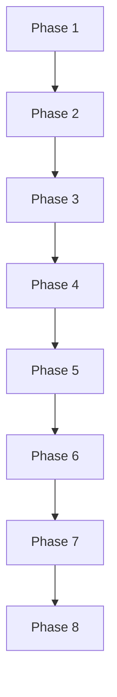

# Codex Agent 実行ログ

開始日時: 2025/12/27 22:34:15

---

## Turn 1: スレッド開始

**Thread ID**: `[REDACTED_TOKEN]`

## Turn 2: ツール実行

**種別**: reasoning
**ステータス**: completed

## Turn 3: ツール実行

**種別**: mcp_tool_call
**ステータス**: completed

## Turn 4: ツール実行

**種別**: reasoning
**ステータス**: completed

## Turn 5: ツール実行

**種別**: コマンド実行
**コマンド**: `/bin/bash -lc 'pwd && ls'`
**ステータス**: completed (exit_code=0)

```text
/tmp/ai-workflow-repos-11-00b73f07/[REDACTED_TOKEN]
ARCHITECTURE.md
CLAUDE.md
CONTRIBUTION.md
LICENSE
README.md
ansible
bootstrap
docker
docs
jenkins
pulumi
run_tests_issue_322.sh
scripts
tests
```

## Turn 6: ツール実行

**種別**: reasoning
**ステータス**: completed

## Turn 7: ツール実行

**種別**: コマンド実行
**コマンド**: `/bin/bash -lc 'ls -a'`
**ステータス**: completed (exit_code=0)

```text
.
..
.ai-workflow
.claude
.coverage
.git
.github
.gitignore
ARCHITECTURE.md
CLAUDE.md
CONTRIBUTION.md
LICENSE
README.md
ansible
bootstrap
docker
docs
jenkins
pulumi
run_tests_issue_322.sh
scripts
tests
```

## Turn 8: ツール実行

**種別**: reasoning
**ステータス**: completed

## Turn 9: ツール実行

**種別**: コマンド実行
**コマンド**: `/bin/bash -lc 'cat .ai-workflow/issue-544/00_planning/output/planning.md'`
**ステータス**: completed (exit_code=0)

```text
# プロジェクト計画書 - Issue #544

## 1. Issue分析
- 複雑度: 中程度（Pulumi/CloudWatch Agent設定の拡張とテンプレート化で複数ファイルに跨るが新規サブシステム追加なし）
- 見積もり工数: 14~16時間（CPUメトリクス追加・共通化対応4~6h、Pulumi生成テンプレート調整3~4h、検証/テスト4h、ドキュメント/レポート2h）
- リスク評価: 中（ARM/x86間の設定差分やメトリクス粒度不足による可観測性欠落のリスク）

## 2. 実装戦略判断
- 実装戦略: EXTEND（既存CloudWatch Agent設定にCPUメトリクスを追加し、テンプレート化で設定差異を吸収する拡張が中心）
- テスト戦略: INTEGRATION_ONLY（CloudWatch Agent設定の構文検証、Pulumi生成結果の差分確認、AMIビルドパイプラインでのTranslator実行など外部連携検証が中心）
- テストコード戦略: EXTEND_TEST（既存AMIビルド/CI検証ステップにCPUメトリクス検証を追加し、Translator検証コマンドを拡張する方針）

## 3. 影響範囲分析
- 既存コードへの影響: `pulumi/jenkins-agent-ami/component-x86.yml`, `pulumi/jenkins-agent-ami/component-arm.yml`、共通テンプレート生成ロジック（YAMLアンカー/共通ブロック）
- 依存関係の変更: 追加依存なし（CloudWatch Agentプラグインの既存CPUメトリクス利用）
- マイグレーション要否: CloudWatch Agent設定ファイルの更新のみ。データストアやスキーマ変更なし

## 4. タスク分割
### Phase 1: 要件定義 (見積もり: 2h)
- [ ] Task 1-1: CPUメトリクス要件精査 (1h)
  - 収集対象メトリクス（active/user/system/iowait）と収集間隔60秒を確認
  - [REDACTED_TOKEN]を[REDACTED_TOKEN]単一に固定する要件の確定
- [ ] Task 1-2: 対象範囲と除外条件の明確化 (1h)
  - ARM/x86双方の対象確認
  - CloudWatch料金影響の範囲と許容値を合意

### Phase 2: 設計 (見積もり: 3h)
- [ ] Task 2-1: 共通テンプレート設計 (2h)
  - CPU/メモリメトリクス共通ブロックの定義方式（YAMLアンカー/Here-doc等）を決定
  - ARM/x86生成パイプラインへの適用方針を策定
- [ ] Task 2-2: 検証手順設計 (1h)
  - `[REDACTED_TOKEN]`利用手順をARM/x86両方で定義
  - Pulumi preview/plan での差分確認項目を明文化

### Phase 3: テストシナリオ (見積もり: 2h)
- [ ] Task 3-1: 検証ケース作成 (2h)
  - CPUメトリクスが[REDACTED_TOKEN]単一ディメンションで出力されることを確認する手順
  - ARM/x86の生成ファイル差分がないことを確認する比較手順

### Phase 4: 実装 (見積もり: 4h)
- [ ] Task 4-1: CPUメトリクス追加とテンプレート化 (3h)
  - 共通ブロックにcpu_usage_active/user/system/iowaitを追加
  - ARM/x86コンポーネントへの適用と重複除去
- [ ] Task 4-2: Pulumi生成ロジック/スクリプト更新 (1h)
  - テンプレート利用部の整合性確認
  - 必要に応じた変数化やコメント整備

### Phase 5: テストコード実装 (見積もり: 2h)
- [ ] Task 5-1: Translator検証ステップ拡張 (2h)
  - AMIビルド/CIスクリプトにTranslator実行を追加（ARM/x86両方）
  - 失敗時に詳細を出力するロギングを追加

### Phase 6: テスト実行 (見積もり: 1.5h)
- [ ] Task 6-1: 自動検証実行 (1h)
  - Translatorによる設定構文チェック（ARM/x86）
  - Pulumi previewで設定差分確認
- [ ] Task 6-2: 手動スポット確認 (0.5h)
  - 生成されたCloudWatch Agent JSON/YAMLのCPUメトリクス有無を目視確認

### Phase 7: ドキュメント (見積もり: 1h)
- [ ] Task 7-1: 設定変更の記録 (1h)
  - `CLAUDE.md`や関連READMEに検証手順/メトリクス追加の変更点を追記
  - 運用手順（ダッシュボード/アラーム初期値）を共有メモに記載

### Phase 8: レポート (見積もり: 0.5h)
- [ ] Task 8-1: リリースノート/振り返り (0.5h)
  - 変更概要、テスト結果、残課題をまとめて共有

## 5. 依存関係（Mermaid）


## 6. リスクと軽減策
- リスク1: ARM/x86設定差分が再発し片方にメトリクスがない
  - 影響度: 中 / 確率: 中
  - 軽減策: テンプレート化＋Translator検証を両アーキで必須化し、CIで差分比較を実施
- リスク2: CloudWatchメトリクスコスト増加
  - 影響度: 低 / 確率: 中
  - 軽減策: 60秒間隔維持・ディメンション単一化でデータポイント抑制し、初月に請求確認
- リスク3: Pulumi生成物と実機設定の乖離
  - 影響度: 中 / 確率: 低
  - 軽減策: Pulumi previewで差分確認し、AMIビルド時の生成物をアーティファクトとして保存

## 7. 品質ゲート
- Phase 1: 要件定義
  - [ ] CPUメトリクス項目と収集間隔/ディメンションが明文化されている
  - [ ] 対象アーキテクチャと料金影響が合意されている
- Phase 2: 設計
  - [ ] 実装戦略/テスト戦略/テストコード戦略が明記されている
  - [ ] 共通テンプレート設計と検証手順がレビュー済み
- Phase 3: テストシナリオ
  - [ ] CPUメトリクスのディメンション確認手順が定義されている
  - [ ] ARM/x86差分検出シナリオが用意されている
- Phase 4: 実装
  - [ ] ARM/x86双方に同一メトリクスが適用されている
  - [ ] テンプレート化で重複が除去されている
- Phase 5: テストコード実装
  - [ ] Translator検証がCI/ビルドステップに組み込まれている
  - [ ] 失敗時のログ出力が確認できる
- Phase 6: テスト実行
  - [ ] TranslatorとPulumi previewが成功し、差分が期待通り
  - [ ] 手動確認でCPUメトリクスが出力されている
- Phase 7: ドキュメント
  - [ ] README/CLAUDE等に変更点と検証手順が追記されている
  - [ ] 運用向けダッシュボード/アラーム初期値が記載されている
- Phase 8: レポート
  - [ ] リリースノートに変更概要とテスト結果が記載されている
  - [ ] 残課題と次アクションが整理されている
```

## Turn 10: ツール実行

**種別**: reasoning
**ステータス**: completed

## Turn 11: ツール実行

**種別**: コマンド実行
**コマンド**: `/bin/bash -lc 'cat .ai-workflow/issue-544/01_requirements/output/requirements.md'`
**ステータス**: completed (exit_code=0)

```text
# 要件定義書 - Issue #544 CloudWatch Agent CPUメトリクス追加

## 0. Planning Documentの確認
- 参照: `.ai-workflow/issue-544/00_planning/output/planning.md`
- 方針: 既存設定を拡張するEXTEND戦略。ARM/x86両アーキで共通テンプレート化し、CloudWatch Agent設定の構文検証を組み込むINTEGRATION_ONLYテスト方針を踏襲。
- 留意: 収集メトリクス/間隔/ディメンションを明文化し、ARM/x86差分防止とコスト増抑制を重点リスクとして扱う。

## 1. 概要
- Jenkins Agent AMIのCloudWatch Agent設定にCPU使用率メトリクス（active/user/system/iowaitなど）を追加し、既存メモリ同様に[REDACTED_TOKEN]単一ディメンションで60秒収集する。
- ARM/x86で分かれている設定を共通テンプレート化し、設定差分をなくすことでASG単位のCPU負荷を可視化する。
- 期待価値: スケールアウト/イン判断や障害調査の精度向上、ビルド待ち時間の抑制、可観測性コストのコントロール。

## 2. 機能要件
- FR-1（高）: CloudWatch Agentの`metrics_collected.cpu`に`cpu_usage_active`, `cpu_usage_user`, `cpu_usage_system`, `cpu_usage_iowait`（必要に応じ`cpu_usage_idle`などデフォルト出力を含む）の収集を追加し、60秒間隔、`[REDACTED_TOKEN]: [[REDACTED_TOKEN]]`を適用する。
- FR-2（高）: ARM/x86コンポーネントでCPU/メモリメトリクス設定を共通テンプレート化し、生成される設定ファイルのメトリクスセット・ディメンション・収集間隔が一致するようにする。
- FR-3（中）: AMIビルド/CIパイプラインでARM/x86両方に`[REDACTED_TOKEN] -input`による構文検証ステップを追加し、失敗時に詳細ログを出力する。
- FR-4（中）: Pulumi生成物（component-x86.yml/component-arm.ymlの出力）がCPUメトリクス追加後も既存メモリ収集と整合し、ASG単一ディメンションで出力されることを確認できる比較手順を用意する。
- FR-5（低）: 初期運用向けにCPU高負荷（例: 80%以上継続）を検知するダッシュボード/アラームのたたき台を記述し、調整可能な状態で共有する。

## 3. 非機能要件
- パフォーマンス: 収集間隔は60秒固定。CloudWatch Agent追加オーバーヘッドによりCPU使用率が継続的に5%を超えないこと。データポイント増加は[REDACTED_TOKEN]単一ディメンションで抑制する。
- セキュリティ: 収集ディメンションは[REDACTED_TOKEN]のみで、ホスト名やジョブ名などの識別情報を追加しない。IAM権限は既存CloudWatch送信ロール範囲内で完結する。
- 可用性・信頼性: 設定検証（Translator）がビルド時に実行され、失敗時はビルドが失敗して不整合なAMIが配布されない。Pulumi previewで差分が検知できる状態を維持。
- 保守性・拡張性: ARM/x86で共通ブロックを再利用し、追加メトリクスが発生しても単一箇所で変更できる。設定ファイル間のメトリクス差分がゼロであることを比較手順で保証。

## 4. 制約事項
- 技術: AWS CloudWatch AgentのCPUプラグイン設定を使用し、既存メモリ収集方式と同一の[REDACTED_TOKEN]・intervalを継続する。Pulumi/YAMLテンプレートの既存構造を尊重する。
- リソース: 60秒収集によりメトリクスコストが増加するため、データポイントはASG単一ディメンションに限定し、必要最小限のメトリクスに留める。
- ポリシー/運用: Jenkins Agent AMIビルドパイプラインにTranslator検証を組み込む方針を必須とし、CIでの差分検出を許容する。コーディング規約/レビュー手順は既存プロジェクトガイドライン（CLAUDE.md等）に従う。

## 5. 前提条件
- Jenkins Agent AMIがARMおよびx86のAutoScalingGroupで稼働し、CloudWatch Agentが導入済みである。
- AWS IAMロールがCloudWatchメトリクス送信権限を保持し、[REDACTED_TOKEN]ディメンションが解決できる。
- Pulumiスタックからcomponent-x86.yml/component-arm.ymlが生成され、テンプレート共通化を適用できる状態である。
- CI/AMIビルド環境で`[REDACTED_TOKEN]`が実行可能（バイナリ配備または取得可能）である。

## 6. 受け入れ基準
- AC-1（FR-1/2）  
  - Given ARM/x86向けCloudWatch Agent設定を生成したとき  
  - When `metrics_collected.cpu`を確認する  
  - Then `cpu_usage_active`, `cpu_usage_user`, `cpu_usage_system`, `cpu_usage_iowait`が60秒間隔で定義され、`[REDACTED_TOKEN]`が`[[REDACTED_TOKEN]]`のみで両アーキ間で一致する。
- AC-2（FR-2）  
  - Given ARM/x86生成設定ファイルを比較したとき  
  - When メトリクスセット/収集間隔/ディメンションを差分比較する  
  - Then CPUおよびメモリメトリクスに関する差分が存在しない（テンプレート共通化が効いている）。
- AC-3（FR-3）  
  - Given AMIビルド/CIパイプラインが実行されたとき  
  - When `[REDACTED_TOKEN] -input`をARM/x86両方で走らせる  
  - Then 構文検証が成功する。失敗時はビルドが失敗し、Translatorのエラーメッセージがログに残る。
- AC-4（FR-4）  
  - Given Pulumi preview/planを実行したとき  
  - When Jenkins Agent AMI関連のCloudWatch Agent設定差分を確認する  
  - Then CPUメトリクス追加と[REDACTED_TOKEN]単一ディメンションが反映され、不要な他ディメンションや収集間隔変更がないことが確認できる。
- AC-5（FR-5）  
  - Given 運用向けドキュメント/メモを参照したとき  
  - When CPU高負荷（例: 80%以上継続N分）しきい値のダッシュボード/アラーム案を探す  
  - Then 調整可能な初期値案と適用手順が記載されている。

## 7. スコープ外
- 既存Auto Scalingポリシーやスケール閾値の変更、Jenkinsジョブ定義の調整は本タスク外。
- CloudWatchコスト最適化のためのメトリクス削減/別製品移行は検討対象外（コスト監視方針のみ言及）。
- 既存メトリクス以外の新規ダッシュボード全面刷新は対象外（CPU用の初期案提示のみ）。
```

## Turn 12: ツール実行

**種別**: reasoning
**ステータス**: completed

## Turn 13: ツール実行

**種別**: file_change
**ステータス**: completed

## Turn 14: ツール実行

**種別**: reasoning
**ステータス**: completed

## Turn 15: ツール実行

**種別**: コマンド実行
**コマンド**: `/bin/bash -lc "sed -n '1,80p' .ai-workflow/issue-544/00_planning/output/planning.md"`
**ステータス**: completed (exit_code=0)

```text
# プロジェクト計画書 - Issue #544

## 1. Issue分析
- 複雑度: 中程度（Pulumi/CloudWatch Agent設定の拡張とテンプレート化で複数ファイルに跨るが新規サブシステム追加なし）
- 見積もり工数: 14~16時間（CPUメトリクス追加・共通化対応4~6h、Pulumi生成テンプレート調整3~4h、検証/テスト4h、ドキュメント/レポート2h）
- リスク評価: 中（ARM/x86間の設定差分やメトリクス粒度不足による可観測性欠落のリスク）

## 2. 実装戦略判断
- 実装戦略: EXTEND（既存CloudWatch Agent設定にCPUメトリクスを追加し、テンプレート化で設定差異を吸収する拡張が中心）
- テスト戦略: INTEGRATION_ONLY（CloudWatch Agent設定の構文検証、Pulumi生成結果の差分確認、AMIビルドパイプラインでのTranslator実行など外部連携検証が中心）
- テストコード戦略: EXTEND_TEST（既存AMIビルド/CI検証ステップにCPUメトリクス検証を追加し、Translator検証コマンドを拡張する方針）

## 3. 影響範囲分析
- 既存コードへの影響: `pulumi/jenkins-agent-ami/component-x86.yml`, `pulumi/jenkins-agent-ami/component-arm.yml`、共通テンプレート生成ロジック（YAMLアンカー/共通ブロック）
- 依存関係の変更: 追加依存なし（CloudWatch Agentプラグインの既存CPUメトリクス利用）
- マイグレーション要否: CloudWatch Agent設定ファイルの更新のみ。データストアやスキーマ変更なし

## 4. タスク分割
- ### Phase 1: 要件定義 (見積もり: 2h)
- [x] Task 1-1: CPUメトリクス要件精査 (1h)
  - 収集対象メトリクス（active/user/system/iowait）と収集間隔60秒を確認
  - [REDACTED_TOKEN]を[REDACTED_TOKEN]単一に固定する要件の確定
  - [x] Task 1-2: 対象範囲と除外条件の明確化 (1h)
    - ARM/x86双方の対象確認
    - CloudWatch料金影響の範囲と許容値を合意

### Phase 2: 設計 (見積もり: 3h)
- [ ] Task 2-1: 共通テンプレート設計 (2h)
  - CPU/メモリメトリクス共通ブロックの定義方式（YAMLアンカー/Here-doc等）を決定
  - ARM/x86生成パイプラインへの適用方針を策定
- [ ] Task 2-2: 検証手順設計 (1h)
  - `[REDACTED_TOKEN]`利用手順をARM/x86両方で定義
  - Pulumi preview/plan での差分確認項目を明文化

### Phase 3: テストシナリオ (見積もり: 2h)
- [ ] Task 3-1: 検証ケース作成 (2h)
  - CPUメトリクスが[REDACTED_TOKEN]単一ディメンションで出力されることを確認する手順
  - ARM/x86の生成ファイル差分がないことを確認する比較手順

### Phase 4: 実装 (見積もり: 4h)
- [ ] Task 4-1: CPUメトリクス追加とテンプレート化 (3h)
  - 共通ブロックにcpu_usage_active/user/system/iowaitを追加
  - ARM/x86コンポーネントへの適用と重複除去
- [ ] Task 4-2: Pulumi生成ロジック/スクリプト更新 (1h)
  - テンプレート利用部の整合性確認
  - 必要に応じた変数化やコメント整備

### Phase 5: テストコード実装 (見積もり: 2h)
- [ ] Task 5-1: Translator検証ステップ拡張 (2h)
  - AMIビルド/CIスクリプトにTranslator実行を追加（ARM/x86両方）
  - 失敗時に詳細を出力するロギングを追加

### Phase 6: テスト実行 (見積もり: 1.5h)
- [ ] Task 6-1: 自動検証実行 (1h)
  - Translatorによる設定構文チェック（ARM/x86）
  - Pulumi previewで設定差分確認
- [ ] Task 6-2: 手動スポット確認 (0.5h)
  - 生成されたCloudWatch Agent JSON/YAMLのCPUメトリクス有無を目視確認

### Phase 7: ドキュメント (見積もり: 1h)
- [ ] Task 7-1: 設定変更の記録 (1h)
  - `CLAUDE.md`や関連READMEに検証手順/メトリクス追加の変更点を追記
  - 運用手順（ダッシュボード/アラーム初期値）を共有メモに記載

### Phase 8: レポート (見積もり: 0.5h)
- [ ] Task 8-1: リリースノート/振り返り (0.5h)
  - 変更概要、テスト結果、残課題をまとめて共有

## 5. 依存関係（Mermaid）

```

## Turn 16: ツール実行

**種別**: reasoning
**ステータス**: completed

## Turn 17: ツール実行

**種別**: reasoning
**ステータス**: completed

## Turn 18: ツール実行

**種別**: コマンド実行
**コマンド**: `/bin/bash -lc "nl -ba .ai-workflow/issue-544/00_planning/output/planning.md | sed -n '30,80p'"`
**ステータス**: completed (exit_code=0)

```text
30	  - ARM/x86生成パイプラインへの適用方針を策定
    31	- [ ] Task 2-2: 検証手順設計 (1h)
    32	  - `[REDACTED_TOKEN]`利用手順をARM/x86両方で定義
    33	  - Pulumi preview/plan での差分確認項目を明文化
    34	
    35	### Phase 3: テストシナリオ (見積もり: 2h)
    36	- [ ] Task 3-1: 検証ケース作成 (2h)
    37	  - CPUメトリクスが[REDACTED_TOKEN]単一ディメンションで出力されることを確認する手順
    38	  - ARM/x86の生成ファイル差分がないことを確認する比較手順
    39	
    40	### Phase 4: 実装 (見積もり: 4h)
    41	- [ ] Task 4-1: CPUメトリクス追加とテンプレート化 (3h)
    42	  - 共通ブロックにcpu_usage_active/user/system/iowaitを追加
    43	  - ARM/x86コンポーネントへの適用と重複除去
    44	- [ ] Task 4-2: Pulumi生成ロジック/スクリプト更新 (1h)
    45	  - テンプレート利用部の整合性確認
    46	  - 必要に応じた変数化やコメント整備
    47	
    48	### Phase 5: テストコード実装 (見積もり: 2h)
    49	- [ ] Task 5-1: Translator検証ステップ拡張 (2h)
    50	  - AMIビルド/CIスクリプトにTranslator実行を追加（ARM/x86両方）
    51	  - 失敗時に詳細を出力するロギングを追加
    52	
    53	### Phase 6: テスト実行 (見積もり: 1.5h)
    54	- [ ] Task 6-1: 自動検証実行 (1h)
    55	  - Translatorによる設定構文チェック（ARM/x86）
    56	  - Pulumi previewで設定差分確認
    57	- [ ] Task 6-2: 手動スポット確認 (0.5h)
    58	  - 生成されたCloudWatch Agent JSON/YAMLのCPUメトリクス有無を目視確認
    59	
    60	### Phase 7: ドキュメント (見積もり: 1h)
    61	- [ ] Task 7-1: 設定変更の記録 (1h)
    62	  - `CLAUDE.md`や関連READMEに検証手順/メトリクス追加の変更点を追記
    63	  - 運用手順（ダッシュボード/アラーム初期値）を共有メモに記載
    64	
    65	### Phase 8: レポート (見積もり: 0.5h)
    66	- [ ] Task 8-1: リリースノート/振り返り (0.5h)
    67	  - 変更概要、テスト結果、残課題をまとめて共有
    68	
    69	## 5. 依存関係（Mermaid）
    70	```mermaid
    71	graph TD
    72	    P1[Phase 1] --> P2[Phase 2]
    73	    P2 --> P3[Phase 3]
    74	    P3 --> P4[Phase 4]
    75	    P4 --> P5[Phase 5]
    76	    P5 --> P6[Phase 6]
    77	    P6 --> P7[Phase 7]
    78	    P7 --> P8[Phase 8]
    79	```
    80
```

## Turn 19: ツール実行

**種別**: reasoning
**ステータス**: completed

## Turn 20: ツール実行

**種別**: コマンド実行
**コマンド**: `/bin/bash -lc "nl -ba .ai-workflow/issue-544/00_planning/output/planning.md | sed -n '1,40p'"`
**ステータス**: completed (exit_code=0)

```text
1	# プロジェクト計画書 - Issue #544
     2	
     3	## 1. Issue分析
     4	- 複雑度: 中程度（Pulumi/CloudWatch Agent設定の拡張とテンプレート化で複数ファイルに跨るが新規サブシステム追加なし）
     5	- 見積もり工数: 14~16時間（CPUメトリクス追加・共通化対応4~6h、Pulumi生成テンプレート調整3~4h、検証/テスト4h、ドキュメント/レポート2h）
     6	- リスク評価: 中（ARM/x86間の設定差分やメトリクス粒度不足による可観測性欠落のリスク）
     7	
     8	## 2. 実装戦略判断
     9	- 実装戦略: EXTEND（既存CloudWatch Agent設定にCPUメトリクスを追加し、テンプレート化で設定差異を吸収する拡張が中心）
    10	- テスト戦略: INTEGRATION_ONLY（CloudWatch Agent設定の構文検証、Pulumi生成結果の差分確認、AMIビルドパイプラインでのTranslator実行など外部連携検証が中心）
    11	- テストコード戦略: EXTEND_TEST（既存AMIビルド/CI検証ステップにCPUメトリクス検証を追加し、Translator検証コマンドを拡張する方針）
    12	
    13	## 3. 影響範囲分析
    14	- 既存コードへの影響: `pulumi/jenkins-agent-ami/component-x86.yml`, `pulumi/jenkins-agent-ami/component-arm.yml`、共通テンプレート生成ロジック（YAMLアンカー/共通ブロック）
    15	- 依存関係の変更: 追加依存なし（CloudWatch Agentプラグインの既存CPUメトリクス利用）
    16	- マイグレーション要否: CloudWatch Agent設定ファイルの更新のみ。データストアやスキーマ変更なし
    17	
    18	## 4. タスク分割
    19	- ### Phase 1: 要件定義 (見積もり: 2h)
    20	- [x] Task 1-1: CPUメトリクス要件精査 (1h)
    21	  - 収集対象メトリクス（active/user/system/iowait）と収集間隔60秒を確認
    22	  - [REDACTED_TOKEN]を[REDACTED_TOKEN]単一に固定する要件の確定
    23	  - [x] Task 1-2: 対象範囲と除外条件の明確化 (1h)
    24	    - ARM/x86双方の対象確認
    25	    - CloudWatch料金影響の範囲と許容値を合意
    26	
    27	### Phase 2: 設計 (見積もり: 3h)
    28	- [ ] Task 2-1: 共通テンプレート設計 (2h)
    29	  - CPU/メモリメトリクス共通ブロックの定義方式（YAMLアンカー/Here-doc等）を決定
    30	  - ARM/x86生成パイプラインへの適用方針を策定
    31	- [ ] Task 2-2: 検証手順設計 (1h)
    32	  - `[REDACTED_TOKEN]`利用手順をARM/x86両方で定義
    33	  - Pulumi preview/plan での差分確認項目を明文化
    34	
    35	### Phase 3: テストシナリオ (見積もり: 2h)
    36	- [ ] Task 3-1: 検証ケース作成 (2h)
    37	  - CPUメトリクスが[REDACTED_TOKEN]単一ディメンションで出力されることを確認する手順
    38	  - ARM/x86の生成ファイル差分がないことを確認する比較手順
    39	
    40	### Phase 4: 実装 (見積もり: 4h)
```

## Turn 21: ツール実行

**種別**: reasoning
**ステータス**: completed

## Turn 22: ツール実行

**種別**: file_change
**ステータス**: completed

## Turn 23: ツール実行

**種別**: reasoning
**ステータス**: completed

## Turn 24: ツール実行

**種別**: コマンド実行
**コマンド**: `/bin/bash -lc "sed -n '14,40p' .ai-workflow/issue-544/00_planning/output/planning.md"`
**ステータス**: completed (exit_code=0)

```text
- 既存コードへの影響: `pulumi/jenkins-agent-ami/component-x86.yml`, `pulumi/jenkins-agent-ami/component-arm.yml`、共通テンプレート生成ロジック（YAMLアンカー/共通ブロック）
- 依存関係の変更: 追加依存なし（CloudWatch Agentプラグインの既存CPUメトリクス利用）
- マイグレーション要否: CloudWatch Agent設定ファイルの更新のみ。データストアやスキーマ変更なし

- ## 4. タスク分割
### Phase 1: 要件定義 (見積もり: 2h)
- [x] Task 1-1: CPUメトリクス要件精査 (1h)
  - 収集対象メトリクス（active/user/system/iowait）と収集間隔60秒を確認
-  - [REDACTED_TOKEN]を[REDACTED_TOKEN]単一に固定する要件の確定
- [x] Task 1-2: 対象範囲と除外条件の明確化 (1h)
    - ARM/x86双方の対象確認
    - CloudWatch料金影響の範囲と許容値を合意

### Phase 2: 設計 (見積もり: 3h)
- [ ] Task 2-1: 共通テンプレート設計 (2h)
  - CPU/メモリメトリクス共通ブロックの定義方式（YAMLアンカー/Here-doc等）を決定
  - ARM/x86生成パイプラインへの適用方針を策定
- [ ] Task 2-2: 検証手順設計 (1h)
  - `[REDACTED_TOKEN]`利用手順をARM/x86両方で定義
  - Pulumi preview/plan での差分確認項目を明文化

### Phase 3: テストシナリオ (見積もり: 2h)
- [ ] Task 3-1: 検証ケース作成 (2h)
  - CPUメトリクスが[REDACTED_TOKEN]単一ディメンションで出力されることを確認する手順
  - ARM/x86の生成ファイル差分がないことを確認する比較手順

### Phase 4: 実装 (見積もり: 4h)
```

## Turn 25: ツール実行

**種別**: reasoning
**ステータス**: completed

## Turn 26: ツール実行

**種別**: reasoning
**ステータス**: completed

## Turn 27: ツール実行

**種別**: reasoning
**ステータス**: completed

## Turn 28: ツール実行

**種別**: file_change
**ステータス**: completed

## Turn 29: ツール実行

**種別**: file_change
**ステータス**: completed

## Turn 30: ツール実行

**種別**: reasoning
**ステータス**: completed

## Turn 31: ツール実行

**種別**: コマンド実行
**コマンド**: `/bin/bash -lc "sed -n '14,30p' .ai-workflow/issue-544/00_planning/output/planning.md"`
**ステータス**: completed (exit_code=0)

```text
- 既存コードへの影響: `pulumi/jenkins-agent-ami/component-x86.yml`, `pulumi/jenkins-agent-ami/component-arm.yml`、共通テンプレート生成ロジック（YAMLアンカー/共通ブロック）
- 依存関係の変更: 追加依存なし（CloudWatch Agentプラグインの既存CPUメトリクス利用）
- マイグレーション要否: CloudWatch Agent設定ファイルの更新のみ。データストアやスキーマ変更なし

## 4. タスク分割
### Phase 1: 要件定義 (見積もり: 2h)
- [x] Task 1-1: CPUメトリクス要件精査 (1h)
  - 収集対象メトリクス（active/user/system/iowait）と収集間隔60秒を確認
  - [REDACTED_TOKEN]を[REDACTED_TOKEN]単一に固定する要件の確定
- [x] Task 1-2: 対象範囲と除外条件の明確化 (1h)
    - ARM/x86双方の対象確認
    - CloudWatch料金影響の範囲と許容値を合意

### Phase 2: 設計 (見積もり: 3h)
- [ ] Task 2-1: 共通テンプレート設計 (2h)
  - CPU/メモリメトリクス共通ブロックの定義方式（YAMLアンカー/Here-doc等）を決定
  - ARM/x86生成パイプラインへの適用方針を策定
```

## Turn 32: ツール実行

**種別**: reasoning
**ステータス**: completed

## Turn 33: ツール実行

**種別**: reasoning
**ステータス**: completed

## Turn 34: ツール実行

**種別**: コマンド実行
**コマンド**: `/bin/bash -lc "python - <<'PY'
with open('.ai-workflow/issue-544/00_planning/output/planning.md') as f:
    for i,line in enumerate(f,1):
        if 20 <= i <= 30:
            print(i, repr(line.rstrip('\\n')))
PY"`
**ステータス**: failed (exit_code=127)

```text
/bin/bash: line 1: python: command not found
```

## Turn 35: ツール実行

**種別**: reasoning
**ステータス**: completed

## Turn 36: ツール実行

**種別**: コマンド実行
**コマンド**: `/bin/bash -lc "python3 - <<'PY'
with open('.ai-workflow/issue-544/00_planning/output/planning.md') as f:
    for i,line in enumerate(f,1):
        if 18 <= i <= 30:
            print(i, repr(line.rstrip('\\n')))
PY"`
**ステータス**: failed (exit_code=127)

```text
/bin/bash: line 1: python3: command not found
```

## Turn 37: ツール実行

**種別**: reasoning
**ステータス**: completed

## Turn 38: ツール実行

**種別**: file_change
**ステータス**: completed

## Turn 39: ツール実行

**種別**: reasoning
**ステータス**: completed

## Turn 40: ツール実行

**種別**: コマンド実行
**コマンド**: `/bin/bash -lc "sed -n '16,32p' .ai-workflow/issue-544/00_planning/output/planning.md"`
**ステータス**: completed (exit_code=0)

```text
- マイグレーション要否: CloudWatch Agent設定ファイルの更新のみ。データストアやスキーマ変更なし

## 4. タスク分割
### Phase 1: 要件定義 (見積もり: 2h)
- [x] Task 1-1: CPUメトリクス要件精査 (1h)
  - 収集対象メトリクス（active/user/system/iowait）と収集間隔60秒を確認
  - [REDACTED_TOKEN]を[REDACTED_TOKEN]単一に固定する要件の確定
- [x] Task 1-2: 対象範囲と除外条件の明確化 (1h)
  - ARM/x86双方の対象確認
  - CloudWatch料金影響の範囲と許容値を合意

### Phase 2: 設計 (見積もり: 3h)
- [ ] Task 2-1: 共通テンプレート設計 (2h)
  - CPU/メモリメトリクス共通ブロックの定義方式（YAMLアンカー/Here-doc等）を決定
  - ARM/x86生成パイプラインへの適用方針を策定
- [ ] Task 2-2: 検証手順設計 (1h)
  - `[REDACTED_TOKEN]`利用手順をARM/x86両方で定義
```

## Turn 41: ツール実行

**種別**: reasoning
**ステータス**: completed

## Turn 42: ツール実行

**種別**: コマンド実行
**コマンド**: `/bin/bash -lc 'git status -sb'`
**ステータス**: completed (exit_code=0)

```text
## ai-workflow/issue-544...origin/main [ahead 6]
 M .ai-workflow/issue-544/00_planning/output/planning.md
 M .ai-workflow/issue-544/metadata.json
?? .ai-workflow/issue-544/00_planning/execute/agent_log_raw.txt
?? .ai-workflow/issue-544/00_planning/execute/prompt.txt
?? .ai-workflow/issue-544/00_planning/review/agent_log_raw.txt
?? .ai-workflow/issue-544/00_planning/review/prompt.txt
?? .ai-workflow/issue-544/01_requirements/execute/agent_log_raw.txt
?? .ai-workflow/issue-544/01_requirements/execute/prompt.txt
?? .ai-workflow/issue-544/01_requirements/review/
```

## Turn 43: ツール実行

**種別**: reasoning
**ステータス**: completed

## Turn 44: ツール実行

**種別**: コマンド実行
**コマンド**: `/bin/bash -lc 'nl -ba .ai-workflow/issue-544/01_requirements/output/requirements.md'`
**ステータス**: completed (exit_code=0)

```text
1	# 要件定義書 - Issue #544 CloudWatch Agent CPUメトリクス追加
     2	
     3	## 0. Planning Documentの確認
     4	- 参照: `.ai-workflow/issue-544/00_planning/output/planning.md`
     5	- 方針: 既存設定を拡張するEXTEND戦略。ARM/x86両アーキで共通テンプレート化し、CloudWatch Agent設定の構文検証を組み込むINTEGRATION_ONLYテスト方針を踏襲。
     6	- 留意: 収集メトリクス/間隔/ディメンションを明文化し、ARM/x86差分防止とコスト増抑制を重点リスクとして扱う。
     7	
     8	## 1. 概要
     9	- Jenkins Agent AMIのCloudWatch Agent設定にCPU使用率メトリクス（active/user/system/iowaitなど）を追加し、既存メモリ同様に[REDACTED_TOKEN]単一ディメンションで60秒収集する。
    10	- ARM/x86で分かれている設定を共通テンプレート化し、設定差分をなくすことでASG単位のCPU負荷を可視化する。
    11	- 期待価値: スケールアウト/イン判断や障害調査の精度向上、ビルド待ち時間の抑制、可観測性コストのコントロール。
    12	
    13	## 2. 機能要件
    14	- FR-1（高）: CloudWatch Agentの`metrics_collected.cpu`に`cpu_usage_active`, `cpu_usage_user`, `cpu_usage_system`, `cpu_usage_iowait`（必要に応じ`cpu_usage_idle`などデフォルト出力を含む）の収集を追加し、60秒間隔、`[REDACTED_TOKEN]: [[REDACTED_TOKEN]]`を適用する。
    15	- FR-2（高）: ARM/x86コンポーネントでCPU/メモリメトリクス設定を共通テンプレート化し、生成される設定ファイルのメトリクスセット・ディメンション・収集間隔が一致するようにする。
    16	- FR-3（中）: AMIビルド/CIパイプラインでARM/x86両方に`[REDACTED_TOKEN] -input`による構文検証ステップを追加し、失敗時に詳細ログを出力する。
    17	- FR-4（中）: Pulumi生成物（component-x86.yml/component-arm.ymlの出力）がCPUメトリクス追加後も既存メモリ収集と整合し、ASG単一ディメンションで出力されることを確認できる比較手順を用意する。
    18	- FR-5（低）: 初期運用向けにCPU高負荷（例: 80%以上継続）を検知するダッシュボード/アラームのたたき台を記述し、調整可能な状態で共有する。
    19	
    20	## 3. 非機能要件
    21	- パフォーマンス: 収集間隔は60秒固定。CloudWatch Agent追加オーバーヘッドによりCPU使用率が継続的に5%を超えないこと。データポイント増加は[REDACTED_TOKEN]単一ディメンションで抑制する。
    22	- セキュリティ: 収集ディメンションは[REDACTED_TOKEN]のみで、ホスト名やジョブ名などの識別情報を追加しない。IAM権限は既存CloudWatch送信ロール範囲内で完結する。
    23	- 可用性・信頼性: 設定検証（Translator）がビルド時に実行され、失敗時はビルドが失敗して不整合なAMIが配布されない。Pulumi previewで差分が検知できる状態を維持。
    24	- 保守性・拡張性: ARM/x86で共通ブロックを再利用し、追加メトリクスが発生しても単一箇所で変更できる。設定ファイル間のメトリクス差分がゼロであることを比較手順で保証。
    25	
    26	## 4. 制約事項
    27	- 技術: AWS CloudWatch AgentのCPUプラグイン設定を使用し、既存メモリ収集方式と同一の[REDACTED_TOKEN]・intervalを継続する。Pulumi/YAMLテンプレートの既存構造を尊重する。
    28	- リソース: 60秒収集によりメトリクスコストが増加するため、データポイントはASG単一ディメンションに限定し、必要最小限のメトリクスに留める。
    29	- ポリシー/運用: Jenkins Agent AMIビルドパイプラインにTranslator検証を組み込む方針を必須とし、CIでの差分検出を許容する。コーディング規約/レビュー手順は既存プロジェクトガイドライン（CLAUDE.md等）に従う。
    30	
    31	## 5. 前提条件
    32	- Jenkins Agent AMIがARMおよびx86のAutoScalingGroupで稼働し、CloudWatch Agentが導入済みである。
    33	- AWS IAMロールがCloudWatchメトリクス送信権限を保持し、[REDACTED_TOKEN]ディメンションが解決できる。
    34	- Pulumiスタックからcomponent-x86.yml/component-arm.ymlが生成され、テンプレート共通化を適用できる状態である。
    35	- CI/AMIビルド環境で`[REDACTED_TOKEN]`が実行可能（バイナリ配備または取得可能）である。
    36	
    37	## 6. 受け入れ基準
    38	- AC-1（FR-1/2）  
    39	  - Given ARM/x86向けCloudWatch Agent設定を生成したとき  
    40	  - When `metrics_collected.cpu`を確認する  
    41	  - Then `cpu_usage_active`, `cpu_usage_user`, `cpu_usage_system`, `cpu_usage_iowait`が60秒間隔で定義され、`[REDACTED_TOKEN]`が`[[REDACTED_TOKEN]]`のみで両アーキ間で一致する。
    42	- AC-2（FR-2）  
    43	  - Given ARM/x86生成設定ファイルを比較したとき  
    44	  - When メトリクスセット/収集間隔/ディメンションを差分比較する  
    45	  - Then CPUおよびメモリメトリクスに関する差分が存在しない（テンプレート共通化が効いている）。
    46	- AC-3（FR-3）  
    47	  - Given AMIビルド/CIパイプラインが実行されたとき  
    48	  - When `[REDACTED_TOKEN] -input`をARM/x86両方で走らせる  
    49	  - Then 構文検証が成功する。失敗時はビルドが失敗し、Translatorのエラーメッセージがログに残る。
    50	- AC-4（FR-4）  
    51	  - Given Pulumi preview/planを実行したとき  
    52	  - When Jenkins Agent AMI関連のCloudWatch Agent設定差分を確認する  
    53	  - Then CPUメトリクス追加と[REDACTED_TOKEN]単一ディメンションが反映され、不要な他ディメンションや収集間隔変更がないことが確認できる。
    54	- AC-5（FR-5）  
    55	  - Given 運用向けドキュメント/メモを参照したとき  
    56	  - When CPU高負荷（例: 80%以上継続N分）しきい値のダッシュボード/アラーム案を探す  
    57	  - Then 調整可能な初期値案と適用手順が記載されている。
    58	
    59	## 7. スコープ外
    60	- 既存Auto Scalingポリシーやスケール閾値の変更、Jenkinsジョブ定義の調整は本タスク外。
    61	- CloudWatchコスト最適化のためのメトリクス削減/別製品移行は検討対象外（コスト監視方針のみ言及）。
    62	- 既存メトリクス以外の新規ダッシュボード全面刷新は対象外（CPU用の初期案提示のみ）。
```

## Turn 45: ツール実行

**種別**: reasoning
**ステータス**: completed

## Turn 46: ツール実行

**種別**: agent_message
**ステータス**: completed

## Turn 47: 実行完了

**ステータス**: completed
**所要時間**: 115267ms
**ターン数**: N/A

---

**経過時間**: 115267ms
**開始**: 2025-12-27T22:34:15.805Z
**終了**: 2025-12-27T22:36:11.072Z