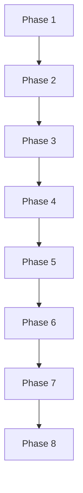

# Codex Agent 実行ログ

開始日時: 2025/12/27 22:36:14

---

## Turn 1: スレッド開始

**Thread ID**: `[REDACTED_TOKEN]`

## Turn 2: ツール実行

**種別**: reasoning
**ステータス**: completed

## Turn 3: ツール実行

**種別**: コマンド実行
**コマンド**: `/bin/bash -lc ls`
**ステータス**: completed (exit_code=0)

```text
ARCHITECTURE.md
CLAUDE.md
CONTRIBUTION.md
LICENSE
README.md
ansible
bootstrap
docker
docs
jenkins
pulumi
run_tests_issue_322.sh
scripts
tests
```

## Turn 4: ツール実行

**種別**: reasoning
**ステータス**: completed

## Turn 5: ツール実行

**種別**: コマンド実行
**コマンド**: `/bin/bash -lc 'cat .ai-workflow/issue-544/00_planning/output/planning.md'`
**ステータス**: completed (exit_code=0)

```text
# プロジェクト計画書 - Issue #544

## 1. Issue分析
- 複雑度: 中程度（Pulumi/CloudWatch Agent設定の拡張とテンプレート化で複数ファイルに跨るが新規サブシステム追加なし）
- 見積もり工数: 14~16時間（CPUメトリクス追加・共通化対応4~6h、Pulumi生成テンプレート調整3~4h、検証/テスト4h、ドキュメント/レポート2h）
- リスク評価: 中（ARM/x86間の設定差分やメトリクス粒度不足による可観測性欠落のリスク）

## 2. 実装戦略判断
- 実装戦略: EXTEND（既存CloudWatch Agent設定にCPUメトリクスを追加し、テンプレート化で設定差異を吸収する拡張が中心）
- テスト戦略: INTEGRATION_ONLY（CloudWatch Agent設定の構文検証、Pulumi生成結果の差分確認、AMIビルドパイプラインでのTranslator実行など外部連携検証が中心）
- テストコード戦略: EXTEND_TEST（既存AMIビルド/CI検証ステップにCPUメトリクス検証を追加し、Translator検証コマンドを拡張する方針）

## 3. 影響範囲分析
- 既存コードへの影響: `pulumi/jenkins-agent-ami/component-x86.yml`, `pulumi/jenkins-agent-ami/component-arm.yml`、共通テンプレート生成ロジック（YAMLアンカー/共通ブロック）
- 依存関係の変更: 追加依存なし（CloudWatch Agentプラグインの既存CPUメトリクス利用）
- マイグレーション要否: CloudWatch Agent設定ファイルの更新のみ。データストアやスキーマ変更なし

## 4. タスク分割
### Phase 1: 要件定義 (見積もり: 2h)
- [x] Task 1-1: CPUメトリクス要件精査 (1h)
  - 収集対象メトリクス（active/user/system/iowait）と収集間隔60秒を確認
  - [REDACTED_TOKEN]を[REDACTED_TOKEN]単一に固定する要件の確定
- [x] Task 1-2: 対象範囲と除外条件の明確化 (1h)
  - ARM/x86双方の対象確認
  - CloudWatch料金影響の範囲と許容値を合意

### Phase 2: 設計 (見積もり: 3h)
- [ ] Task 2-1: 共通テンプレート設計 (2h)
  - CPU/メモリメトリクス共通ブロックの定義方式（YAMLアンカー/Here-doc等）を決定
  - ARM/x86生成パイプラインへの適用方針を策定
- [ ] Task 2-2: 検証手順設計 (1h)
  - `amazon-cloudwatch-agent-config-translator`利用手順をARM/x86両方で定義
  - Pulumi preview/plan での差分確認項目を明文化

### Phase 3: テストシナリオ (見積もり: 2h)
- [ ] Task 3-1: 検証ケース作成 (2h)
  - CPUメトリクスが[REDACTED_TOKEN]単一ディメンションで出力されることを確認する手順
  - ARM/x86の生成ファイル差分がないことを確認する比較手順

### Phase 4: 実装 (見積もり: 4h)
- [ ] Task 4-1: CPUメトリクス追加とテンプレート化 (3h)
  - 共通ブロックにcpu_usage_active/user/system/iowaitを追加
  - ARM/x86コンポーネントへの適用と重複除去
- [ ] Task 4-2: Pulumi生成ロジック/スクリプト更新 (1h)
  - テンプレート利用部の整合性確認
  - 必要に応じた変数化やコメント整備

### Phase 5: テストコード実装 (見積もり: 2h)
- [ ] Task 5-1: Translator検証ステップ拡張 (2h)
  - AMIビルド/CIスクリプトにTranslator実行を追加（ARM/x86両方）
  - 失敗時に詳細を出力するロギングを追加

### Phase 6: テスト実行 (見積もり: 1.5h)
- [ ] Task 6-1: 自動検証実行 (1h)
  - Translatorによる設定構文チェック（ARM/x86）
  - Pulumi previewで設定差分確認
- [ ] Task 6-2: 手動スポット確認 (0.5h)
  - 生成されたCloudWatch Agent JSON/YAMLのCPUメトリクス有無を目視確認

### Phase 7: ドキュメント (見積もり: 1h)
- [ ] Task 7-1: 設定変更の記録 (1h)
  - `CLAUDE.md`や関連READMEに検証手順/メトリクス追加の変更点を追記
  - 運用手順（ダッシュボード/アラーム初期値）を共有メモに記載

### Phase 8: レポート (見積もり: 0.5h)
- [ ] Task 8-1: リリースノート/振り返り (0.5h)
  - 変更概要、テスト結果、残課題をまとめて共有

## 5. 依存関係（Mermaid）


## 6. リスクと軽減策
- リスク1: ARM/x86設定差分が再発し片方にメトリクスがない
  - 影響度: 中 / 確率: 中
  - 軽減策: テンプレート化＋Translator検証を両アーキで必須化し、CIで差分比較を実施
- リスク2: CloudWatchメトリクスコスト増加
  - 影響度: 低 / 確率: 中
  - 軽減策: 60秒間隔維持・ディメンション単一化でデータポイント抑制し、初月に請求確認
- リスク3: Pulumi生成物と実機設定の乖離
  - 影響度: 中 / 確率: 低
  - 軽減策: Pulumi previewで差分確認し、AMIビルド時の生成物をアーティファクトとして保存

## 7. 品質ゲート
- Phase 1: 要件定義
  - [ ] CPUメトリクス項目と収集間隔/ディメンションが明文化されている
  - [ ] 対象アーキテクチャと料金影響が合意されている
- Phase 2: 設計
  - [ ] 実装戦略/テスト戦略/テストコード戦略が明記されている
  - [ ] 共通テンプレート設計と検証手順がレビュー済み
- Phase 3: テストシナリオ
  - [ ] CPUメトリクスのディメンション確認手順が定義されている
  - [ ] ARM/x86差分検出シナリオが用意されている
- Phase 4: 実装
  - [ ] ARM/x86双方に同一メトリクスが適用されている
  - [ ] テンプレート化で重複が除去されている
- Phase 5: テストコード実装
  - [ ] Translator検証がCI/ビルドステップに組み込まれている
  - [ ] 失敗時のログ出力が確認できる
- Phase 6: テスト実行
  - [ ] TranslatorとPulumi previewが成功し、差分が期待通り
  - [ ] 手動確認でCPUメトリクスが出力されている
- Phase 7: ドキュメント
  - [ ] README/CLAUDE等に変更点と検証手順が追記されている
  - [ ] 運用向けダッシュボード/アラーム初期値が記載されている
- Phase 8: レポート
  - [ ] リリースノートに変更概要とテスト結果が記載されている
  - [ ] 残課題と次アクションが整理されている
```

## Turn 6: ツール実行

**種別**: reasoning
**ステータス**: completed

## Turn 7: ツール実行

**種別**: コマンド実行
**コマンド**: `/bin/bash -lc 'cat .ai-workflow/issue-544/01_requirements/output/requirements.md'`
**ステータス**: completed (exit_code=0)

```text
# 要件定義書 - Issue #544 CloudWatch Agent CPUメトリクス追加

## 0. Planning Documentの確認
- 参照: `.ai-workflow/issue-544/00_planning/output/planning.md`
- 方針: 既存設定を拡張するEXTEND戦略。ARM/x86両アーキで共通テンプレート化し、CloudWatch Agent設定の構文検証を組み込むINTEGRATION_ONLYテスト方針を踏襲。
- 留意: 収集メトリクス/間隔/ディメンションを明文化し、ARM/x86差分防止とコスト増抑制を重点リスクとして扱う。

## 1. 概要
- Jenkins Agent AMIのCloudWatch Agent設定にCPU使用率メトリクス（active/user/system/iowaitなど）を追加し、既存メモリ同様に[REDACTED_TOKEN]単一ディメンションで60秒収集する。
- ARM/x86で分かれている設定を共通テンプレート化し、設定差分をなくすことでASG単位のCPU負荷を可視化する。
- 期待価値: スケールアウト/イン判断や障害調査の精度向上、ビルド待ち時間の抑制、可観測性コストのコントロール。

## 2. 機能要件
- FR-1（高）: CloudWatch Agentの`metrics_collected.cpu`に`cpu_usage_active`, `cpu_usage_user`, `cpu_usage_system`, `cpu_usage_iowait`（必要に応じ`cpu_usage_idle`などデフォルト出力を含む）の収集を追加し、60秒間隔、`[REDACTED_TOKEN]: [[REDACTED_TOKEN]]`を適用する。
- FR-2（高）: ARM/x86コンポーネントでCPU/メモリメトリクス設定を共通テンプレート化し、生成される設定ファイルのメトリクスセット・ディメンション・収集間隔が一致するようにする。
- FR-3（中）: AMIビルド/CIパイプラインでARM/x86両方に`amazon-cloudwatch-agent-config-translator -input`による構文検証ステップを追加し、失敗時に詳細ログを出力する。
- FR-4（中）: Pulumi生成物（component-x86.yml/component-arm.ymlの出力）がCPUメトリクス追加後も既存メモリ収集と整合し、ASG単一ディメンションで出力されることを確認できる比較手順を用意する。
- FR-5（低）: 初期運用向けにCPU高負荷（例: 80%以上継続）を検知するダッシュボード/アラームのたたき台を記述し、調整可能な状態で共有する。

## 3. 非機能要件
- パフォーマンス: 収集間隔は60秒固定。CloudWatch Agent追加オーバーヘッドによりCPU使用率が継続的に5%を超えないこと。データポイント増加は[REDACTED_TOKEN]単一ディメンションで抑制する。
- セキュリティ: 収集ディメンションは[REDACTED_TOKEN]のみで、ホスト名やジョブ名などの識別情報を追加しない。IAM権限は既存CloudWatch送信ロール範囲内で完結する。
- 可用性・信頼性: 設定検証（Translator）がビルド時に実行され、失敗時はビルドが失敗して不整合なAMIが配布されない。Pulumi previewで差分が検知できる状態を維持。
- 保守性・拡張性: ARM/x86で共通ブロックを再利用し、追加メトリクスが発生しても単一箇所で変更できる。設定ファイル間のメトリクス差分がゼロであることを比較手順で保証。

## 4. 制約事項
- 技術: AWS CloudWatch AgentのCPUプラグイン設定を使用し、既存メモリ収集方式と同一の[REDACTED_TOKEN]・intervalを継続する。Pulumi/YAMLテンプレートの既存構造を尊重する。
- リソース: 60秒収集によりメトリクスコストが増加するため、データポイントはASG単一ディメンションに限定し、必要最小限のメトリクスに留める。
- ポリシー/運用: Jenkins Agent AMIビルドパイプラインにTranslator検証を組み込む方針を必須とし、CIでの差分検出を許容する。コーディング規約/レビュー手順は既存プロジェクトガイドライン（CLAUDE.md等）に従う。

## 5. 前提条件
- Jenkins Agent AMIがARMおよびx86のAutoScalingGroupで稼働し、CloudWatch Agentが導入済みである。
- AWS IAMロールがCloudWatchメトリクス送信権限を保持し、[REDACTED_TOKEN]ディメンションが解決できる。
- Pulumiスタックからcomponent-x86.yml/component-arm.ymlが生成され、テンプレート共通化を適用できる状態である。
- CI/AMIビルド環境で`amazon-cloudwatch-agent-config-translator`が実行可能（バイナリ配備または取得可能）である。

## 6. 受け入れ基準
- AC-1（FR-1/2）  
  - Given ARM/x86向けCloudWatch Agent設定を生成したとき  
  - When `metrics_collected.cpu`を確認する  
  - Then `cpu_usage_active`, `cpu_usage_user`, `cpu_usage_system`, `cpu_usage_iowait`が60秒間隔で定義され、`[REDACTED_TOKEN]`が`[[REDACTED_TOKEN]]`のみで両アーキ間で一致する。
- AC-2（FR-2）  
  - Given ARM/x86生成設定ファイルを比較したとき  
  - When メトリクスセット/収集間隔/ディメンションを差分比較する  
  - Then CPUおよびメモリメトリクスに関する差分が存在しない（テンプレート共通化が効いている）。
- AC-3（FR-3）  
  - Given AMIビルド/CIパイプラインが実行されたとき  
  - When `amazon-cloudwatch-agent-config-translator -input`をARM/x86両方で走らせる  
  - Then 構文検証が成功する。失敗時はビルドが失敗し、Translatorのエラーメッセージがログに残る。
- AC-4（FR-4）  
  - Given Pulumi preview/planを実行したとき  
  - When Jenkins Agent AMI関連のCloudWatch Agent設定差分を確認する  
  - Then CPUメトリクス追加と[REDACTED_TOKEN]単一ディメンションが反映され、不要な他ディメンションや収集間隔変更がないことが確認できる。
- AC-5（FR-5）  
  - Given 運用向けドキュメント/メモを参照したとき  
  - When CPU高負荷（例: 80%以上継続N分）しきい値のダッシュボード/アラーム案を探す  
  - Then 調整可能な初期値案と適用手順が記載されている。

## 7. スコープ外
- 既存Auto Scalingポリシーやスケール閾値の変更、Jenkinsジョブ定義の調整は本タスク外。
- CloudWatchコスト最適化のためのメトリクス削減/別製品移行は検討対象外（コスト監視方針のみ言及）。
- 既存メトリクス以外の新規ダッシュボード全面刷新は対象外（CPU用の初期案提示のみ）。
```

## Turn 8: ツール実行

**種別**: reasoning
**ステータス**: completed

## Turn 9: ツール実行

**種別**: コマンド実行
**コマンド**: `/bin/bash -lc "sed -n '1,200p' README.md"`
**ステータス**: completed (exit_code=0)

```text
# Jenkins CI/CD インフラストラクチャ構築

AWS上にJenkinsベースのCI/CD環境を段階的に構築・運用するためのリポジトリです。ブルーグリーンデプロイ、カスタムAMIによる高速エージェント、SSMを用いた設定管理など、運用効率を高める仕組みを揃えています。

## 📚 重要なドキュメント

- **[ARCHITECTURE.md](ARCHITECTURE.md)** - Platform Engineeringのアーキテクチャ設計思想
- **[CLAUDE.md](CLAUDE.md)** - Claude Code向けガイダンス
- **[CONTRIBUTION.md](CONTRIBUTION.md)** - 開発者向けコントリビューションガイド

## 📋 クイックナビゲーション

### セットアップ（初回構築）
- [前提条件](docs/setup/prerequisites.md)
- [ブートストラップ構築](docs/setup/bootstrap.md)
- [Pulumiバックエンド設定](docs/setup/pulumi-backend.md)

### 運用
- [Jenkinsインフラデプロイ](docs/operations/jenkins-deploy.md)
- [Jenkins環境運用管理](docs/operations/jenkins-management.md)
- [ブートストラップ管理](docs/operations/[REDACTED_TOKEN].md)
- [インフラ削除](docs/operations/[REDACTED_TOKEN].md)
- [共有パラメータ・注意事項](docs/operations/parameters.md)

### リファレンス
- [インフラ構成](docs/architecture/infrastructure.md)
- [拡張方法](docs/development/extension.md)
- [トラブルシューティング](docs/troubleshooting.md)
- [変更履歴](docs/changelog.md)

## 🧭 このREADMEについて

- 以前READMEに含まれていた詳細な手順・構成情報は、役割別に`docs/`配下へ整理しました。
- 目的に応じて上記クイックナビゲーションから該当ドキュメントを参照してください。
- 追加のFAQやリンクを見つけた場合は、対応する分割ドキュメントを更新してください。

## 🧪 まず試すこと

- ブートストラップを新規構築する場合は、[前提条件](docs/setup/prerequisites.md)と[ブートストラップ構築](docs/setup/bootstrap.md)の順に実施してください。
- 既存環境の更新やトラブル時は、[Jenkins環境運用管理](docs/operations/jenkins-management.md)および[トラブルシューティング](docs/troubleshooting.md)を参照してください。
```

## Turn 10: ツール実行

**種別**: reasoning
**ステータス**: completed

## Turn 11: ツール実行

**種別**: コマンド実行
**コマンド**: `/bin/bash -lc "sed -n '1,200p' ARCHITECTURE.md"`
**ステータス**: completed (exit_code=0)

```text
# Platform Engineering アーキテクチャ設計思想

このドキュメントは、本プロジェクトが目指すPlatform Engineeringの理想的な設計思想と実装アプローチを記載します。

> **📌 重要**: このドキュメントは「目指すべき姿」を示しています。現在、段階的に実装を進めており、すべての機能が完全に実現されているわけではありません。しかし、この設計思想に基づいて継続的に改善を行っています。

## 📋 目次

- [Platform Engineering とは](#[REDACTED_TOKEN]-とは)
- [アーキテクチャ全体像](#アーキテクチャ全体像)
- [各コンポーネントの責務](#各コンポーネントの責務)
- [ツール選定の理由](#ツール選定の理由)
- [設計原則](#設計原則)
- [実装のベストプラクティス](#実装のベストプラクティス)

## Platform Engineering とは

### 一言での定義
**「開発者が開発に専念できるように、インフラや運用を自動化・セルフサービス化する取り組み」**

### 従来の問題と解決
```
【従来】
開発者「サーバー欲しい」→ 運用チーム「3日後に用意します」→ 待機...
開発者「デプロイして」→ 運用チーム「手順書に従って...」→ ミス発生

【Platform Engineering】
開発者「サーバー欲しい」→ セルフサービスポータルでクリック → 5分で自動構築
開発者「デプロイして」→ git push → 自動デプロイ完了
```

### 3つの本質
1. **セルフサービス化**: 開発者が自分で必要なものを即座に用意できる
2. **自動化の徹底**: 手作業ゼロ、ミスが起きない仕組み
3. **標準化**: 誰でも同じ方法で同じ結果、属人性の排除

## アーキテクチャ全体像

### 階層構造と責務分担

```
┌─────────────────────────────────────────┐
│         Jenkins (統括司令塔)              │
│  ・WHO & WHEN (誰が・いつ)               │
│  ・実行トリガー                           │
│  ・ログ集約・可視化                       │
│  ・権限管理・承認フロー                   │
└──────────────┬──────────────────────────┘
               ↓ キック
┌─────────────────────────────────────────┐
│      Ansible (オーケストレーター)         │
│  ・HOW (どうやって)                      │
│  ・処理順序制御                           │
│  ・エラーハンドリング                     │
│  ・条件分岐・リトライ                     │
└──────────────┬──────────────────────────┘
               ↓ 実行指示
┌─────────────────────────────────────────┐
│       Pulumi (インフラ構築者)             │
│  ・WHAT (何を)                          │
│  ・リソースプロビジョニング               │
│  ・状態管理                               │
│  ・型安全な定義                           │
└─────────────────────────────────────────┘

    ↑↓ パラメータ参照 (全層から参照)
    
┌─────────────────────────────────────────┐
│   SSM Parameter Store (設定の中央管理)    │
│  ・Single Source of Truth               │
│  ・環境別パラメータ管理                   │
│  ・暗号化・監査ログ                       │
└─────────────────────────────────────────┘
```

## 各コンポーネントの責務

### Jenkins - 統括司令塔
**役割**: WHO & WHEN (誰が・いつ実行するか)

```groovy
// 実行権限の制御
pipeline {
    parameters {
        choice(name: 'ENVIRONMENT', choices: ['dev', 'staging', 'prod'])
    }
    stages {
        stage('Deploy') {
            steps {
                // Ansibleをキック
                ansiblePlaybook playbook: 'deploy.yml'
            }
        }
    }
}
```

**主要機能**:
- セルフサービスポータル（開発者向けUI）
- 実行ログの永続化と可視化
- 承認フロー・権限管理
- スケジュール実行・イベントトリガー

### Ansible - オーケストレーター
**役割**: HOW (どうやって実行するか)

```yaml
# 処理フローの制御
- name: デプロイメントフロー
  block:
    - include_role: pulumi_helper    # Pulumi実行
    - include_role: health_check     # ヘルスチェック
  rescue:
    - include_role: rollback         # エラー時ロールバック
  always:
    - include_role: notification     # 結果通知
```

**主要機能**:
- 複雑な処理フローの制御
- エラーハンドリング・リトライ
- 条件分岐・並列実行
- 冪等性の保証

### Pulumi - インフラ構築者
**役割**: WHAT (何を構築するか)

```typescript
// TypeScriptで型安全にインフラを定義
const instance = new aws.ec2.Instance("web-server", {
    instanceType: config.require("instanceType"),
    ami: aws.ec2.getAmi({
        mostRecent: true,
        filters: [{ name: "name", values: ["ubuntu/images/*"] }]
    }).then(ami => ami.id),
    tags: {
        Name: `${projectName}-${stack}`,
        Environment: stack
    }
});
```

**主要機能**:
- クラウドリソースのプロビジョニング
- インフラ状態の管理（State管理）
- 型安全な設定（TypeScript）
- マルチクラウド対応

### SSM Parameter Store - パラメータ中央管理
**役割**: Single Source of Truth

```
/jenkins-infra/
  ├── common/           # 共通設定
  │   ├── github/
  │   └── slack/
  ├── dev/             # 開発環境
  │   ├── jenkins/
  │   └── database/
  ├── staging/         # ステージング環境
  └── prod/            # 本番環境
```

**主要機能**:
- パラメータの一元管理（2重管理の排除）
- 環境別設定の管理
- SecureStringによる暗号化
- 変更履歴・監査ログ

## ツール選定の理由

### なぜ Jenkins？
- **既存資産の活用**: 多くの企業で既に導入済み
- **究極の柔軟性**: 2000以上のプラグイン、何でも連携可能
- **エンタープライズ対応**: オンプレミス、複雑な承認フロー、レガシーシステム連携
- **成熟度**: 10年以上の実績、膨大なナレッジベース

### なぜ Pulumi？
- **真のプログラミング言語**: TypeScript/Python/Go等で記述可能
- **型安全**: コンパイル時にエラー検出、IDE補完
- **テスト可能**: 通常のユニット
... (truncated)
```

## Turn 12: ツール実行

**種別**: reasoning
**ステータス**: completed

## Turn 13: ツール実行

**種別**: コマンド実行
**コマンド**: `/bin/bash -lc 'ls pulumi/jenkins-agent-ami'`
**ステータス**: completed (exit_code=0)

```text
Pulumi.yaml
component-arm.yml
component-x86.yml
index.ts
package.json
tsconfig.json
```

## Turn 14: ツール実行

**種別**: reasoning
**ステータス**: completed

## Turn 15: ツール実行

**種別**: コマンド実行
**コマンド**: `/bin/bash -lc "sed -n '1,200p' pulumi/jenkins-agent-ami/component-x86.yml"`
**ステータス**: completed (exit_code=0)

```text
name: [REDACTED_TOKEN]
description: Install and configure Jenkins Agent dependencies
schemaVersion: 1.0

phases:
  - name: build
    steps:
      - name: ExpandEBSVolume
        action: ExecuteBash
        inputs:
          commands:
            - echo "Expanding EBS volume to use full capacity..."
            - |
              # ルートデバイスの情報を取得
              ROOT_DEVICE=$(df / | tail -1 | awk '{print $1}')
              echo "Root device: $ROOT_DEVICE"
              
              # デバイス名からパーティション番号を取得
              if [[ "$ROOT_DEVICE" =~ nvme ]]; then
                  DEVICE_NAME=$(echo "$ROOT_DEVICE" | sed 's/p[0-9]*$//')
                  PARTITION_NUM=$(echo "$ROOT_DEVICE" | grep -o '[0-9]*$')
              else
                  DEVICE_NAME=$(echo "$ROOT_DEVICE" | sed 's/[0-9]*$//')
                  PARTITION_NUM=$(echo "$ROOT_DEVICE" | grep -o '[0-9]*$')
              fi
              
              # [REDACTED_TOKEN]のインストール
              dnf install -y [REDACTED_TOKEN] || yum install -y [REDACTED_TOKEN]
              
              # パーティションの拡張
              growpart "$DEVICE_NAME" "$PARTITION_NUM" || echo "Partition might already be expanded"
              
              # ファイルシステムの拡張
              FS_TYPE=$(blkid -o value -s TYPE "$ROOT_DEVICE")
              if [[ "$FS_TYPE" =~ ext[234] ]]; then
                  resize2fs "$ROOT_DEVICE"
              elif [[ "$FS_TYPE" == "xfs" ]]; then
                  xfs_growfs -d /
              fi
              
              echo "Disk usage after expansion:"
              df -h /

      - name: UpdateSystem
        action: ExecuteBash
        inputs:
          commands:
            - echo "Starting Jenkins Agent setup"
            - dnf update -y

      - name: [REDACTED_TOKEN]
        action: ExecuteBash
        inputs:
          commands:
            - dnf install -y git jq wget tar gzip unzip which
            - dnf install -y amazon-ssm-agent

      - name: InstallDocker
        action: ExecuteBash
        inputs:
          commands:
            - dnf install -y docker
            - systemctl enable docker
            - groupadd -f docker
            - chmod 666 /var/run/docker.sock || true

      - name: InstallJava
        action: ExecuteBash
        inputs:
          commands:
            - dnf install -y [REDACTED_TOKEN]
            - java -version

      - name: InstallBuildTools
        action: ExecuteBash
        inputs:
          commands:
            - dnf install -y gcc gcc-c++ make
            - dnf install -y python3 python3-pip
            - pip3 install --upgrade pip
            - pip3 install awscli

      - name: InstallNodeJS
        action: ExecuteBash
        inputs:
          commands:
            - curl -sL https://rpm.nodesource.com/setup_20.x | bash -
            - dnf install -y nodejs
            - node --version
            - npm --version
            - npm install -g npm@latest
            - npm install -g typescript
            - npm install -g ts-node

      - name: InstallPulumi
        action: ExecuteBash
        inputs:
          commands:
            - echo "Installing Pulumi..."
            - curl -fsSL https://get.pulumi.com | sh
            - echo "Finding pulumi binary..."
            - find / -name pulumi -type f 2>/dev/null | head -1 || true
            - |
              # Pulumiバイナリと言語プラグインをシステム全体で利用可能にする
              if [ -d "/.pulumi/bin" ]; then
                cp -r /.pulumi/bin/* /usr/local/bin/ || echo "Failed to copy from /.pulumi/bin"
              elif [ -d "/root/.pulumi/bin" ]; then
                cp -r /root/.pulumi/bin/* /usr/local/bin/ || echo "Failed to copy from /root/.pulumi/bin"
              elif [ -d "/home/ec2-user/.pulumi/bin" ]; then
                cp -r /home/ec2-user/.pulumi/bin/* /usr/local/bin/ || echo "Failed to copy from /home/ec2-user/.pulumi/bin"
              fi
            - chmod 755 /usr/local/bin/pulumi* || true
            - /usr/local/bin/pulumi version
... (truncated)
```

## Turn 16: ツール実行

**種別**: reasoning
**ステータス**: completed

## Turn 17: ツール実行

**種別**: コマンド実行
**コマンド**: `/bin/bash -lc 'rg "amazon-cloudwatch-agent-config-translator"'`
**ステータス**: failed (exit_code=127)

```text
/bin/bash: line 1: rg: command not found
```

## Turn 18: ツール実行

**種別**: reasoning
**ステータス**: completed

## Turn 19: ツール実行

**種別**: コマンド実行
**コマンド**: `/bin/bash -lc 'grep -R "amazon-cloudwatch-agent-config-translator" -n'`
**ステータス**: completed (exit_code=0)

```text
.ai-workflow/issue-544/00_planning/output/planning.md:32:  - `amazon-cloudwatch-agent-config-translator`利用手順をARM/x86両方で定義
.ai-workflow/issue-544/00_planning/execute/prompt.txt:42:CloudWatch Agent公式ドキュメントのCPUプラグイン設定を参照し、既存メモリ設定と同様の[REDACTED_TOKEN]を適用します。pulumi内でテンプレート（YAMLアンカーやhere-doc共通ブロック）を定義し、ARM/x86のconfig生成時に流用することで差異を防ぎます。cwagentの構文チェック（`/opt/aws/amazon-cloudwatch-agent/bin/amazon-cloudwatch-agent-config-translator -input`）を利用し、AMIビルド時に両アーキテクチャで検証する段階を追加すると安全です。ダッシュボードとアラームはCPU80%以上継続などのしきい値で初期値を用意し、運用で調整可能にします。
.ai-workflow/issue-544/01_requirements/output/requirements.md:16:- FR-3（中）: AMIビルド/CIパイプラインでARM/x86両方に`amazon-cloudwatch-agent-config-translator -input`による構文検証ステップを追加し、失敗時に詳細ログを出力する。
.ai-workflow/issue-544/01_requirements/output/requirements.md:35:- CI/AMIビルド環境で`amazon-cloudwatch-agent-config-translator`が実行可能（バイナリ配備または取得可能）である。
.ai-workflow/issue-544/01_requirements/output/requirements.md:48:  - When `amazon-cloudwatch-agent-config-translator -input`をARM/x86両方で走らせる  
.ai-workflow/issue-544/01_requirements/execute/prompt.txt:48:CloudWatch Agent公式ドキュメントのCPUプラグイン設定を参照し、既存メモリ設定と同様の[REDACTED_TOKEN]を適用します。pulumi内でテンプレート（YAMLアンカーやhere-doc共通ブロック）を定義し、ARM/x86のconfig生成時に流用することで差異を防ぎます。cwagentの構文チェック（`/opt/aws/amazon-cloudwatch-agent/bin/amazon-cloudwatch-agent-config-translator -input`）を利用し、AMIビルド時に両アーキテクチャで検証する段階を追加すると安全です。ダッシュボードとアラームはCPU80%以上継続などのしきい値で初期値を用意し、運用で調整可能にします。
.ai-workflow/issue-544/02_design/execute/prompt.txt:49:CloudWatch Agent公式ドキュメントのCPUプラグイン設定を参照し、既存メモリ設定と同様の[REDACTED_TOKEN]を適用します。pulumi内でテンプレート（YAMLアンカーやhere-doc共通ブロック）を定義し、ARM/x86のconfig生成時に流用することで差異を防ぎます。cwagentの構文チェック（`/opt/aws/amazon-cloudwatch-agent/bin/amazon-cloudwatch-agent-config-translator -input`）を利用し、AMIビルド時に両アーキテクチャで検証する段階を追加すると安全です。ダッシュボードとアラームはCPU80%以上継続などのしきい値で初期値を用意し、運用で調整可能にします。
```

## Turn 20: ツール実行

**種別**: reasoning
**ステータス**: completed

## Turn 21: ツール実行

**種別**: コマンド実行
**コマンド**: `/bin/bash -lc "sed -n '1,120p' CLAUDE.md"`
**ステータス**: completed (exit_code=0)

```text
# CLAUDE.md

このファイルは、このリポジトリでコードを扱う際のClaude Code (claude.ai/code) へのガイダンスを提供します。

## プロジェクト概要

包括的なJenkins CI/CDインフラ自動化プロジェクトで、ブートストラップにCloudFormation、インフラプロビジョニングにPulumi (TypeScript)、オーケストレーションにAnsibleを使用しています。ブルーグリーンデプロイメント機能、自動スケーリングエージェント、高可用性機能を備えた本番環境対応のJenkins環境をAWS上にデプロイします。

詳細なセットアップ・運用手順は`docs/`配下に分割されたドキュメント（READMEのクイックナビゲーション参照）を確認してください。

## アーキテクチャ設計思想

**Platform Engineeringの設計思想とアーキテクチャの詳細は [ARCHITECTURE.md](ARCHITECTURE.md) を参照してください。**

このプロジェクトは以下の原則に基づいて設計されています：
- **Jenkins**: 統括司令塔（WHO & WHEN）
- **Ansible**: オーケストレーター（HOW）
- **Pulumi**: インフラ構築者（WHAT）
- **SSM Parameter Store**: Single Source of Truth

## コーディングガイドライン

### 基本原則
- **思考**: 技術的な内容は英語、プロジェクト固有の内容は日本語で柔軟に思考
- **対話**: 日本語で対話 (Dialogue in Japanese with users)
- **ドキュメント**: 日本語で記述 (Documentation in Japanese)
- **コメント**: ソースコード内のコメントは日本語
- **README/ドキュメント**: すべて日本語で記述

### 重要な注意事項
- **Bootstrap修正時**: `bootstrap/` ディレクトリ内のファイルを修正した場合、必ずREADME.mdの更新が必要かチェックすること
- **依存関係の順序**: コンポーネント間の依存関係を常に意識し、デプロイ/削除順序を守ること
- **環境分離**: dev/staging/production環境を明確に分離すること

## Pulumiベストプラクティス

**Pulumiスタックの使用方法については [pulumi/README.md](pulumi/README.md) を参照してください。**
**開発者向けの詳細な実装方法は [pulumi/CONTRIBUTION.md](pulumi/CONTRIBUTION.md) を参照してください。**

### 重要な注意事項

- **Pulumi開発時**: Pulumiスタックを修正・追加した場合、必ず `pulumi/README.md` の更新が必要かチェックすること
- **ドキュメント更新対象**:
  - 新しいスタックの追加
  - スタック間の依存関係変更
  - 設定パラメータの変更
  - コーディング規約の追加
  - トラブルシューティング情報の追加

## Jenkinsベストプラクティス

**Jenkinsの設定、Job DSL、パイプライン、共有ライブラリについては [jenkins/README.md](jenkins/README.md) を参照してください。**
**開発者向けの詳細な実装方法は [jenkins/CONTRIBUTION.md](jenkins/CONTRIBUTION.md) を参照してください。**

### 重要な注意事項

- **Jenkins開発時**: Jenkins設定、ジョブ定義、パイプラインを修正・追加した場合、必ず `jenkins/README.md` の更新が必要かチェックすること
- **ドキュメント更新対象**:
  - 新しいジョブの追加
  - パイプラインの変更
  - 共有ライブラリの追加・変更
  - プラグインの変更
  - セキュリティ設定の変更
  - トラブルシューティング情報の追加
- **⚠️ ECS Fargate設定の重要な注意**:
  - `jenkins.yaml.template`のECS設定は`amazon-ecs`プラグインの仕様に厳密に従うこと
  - **サポートされていない設定項目**: `[REDACTED_TOKEN]`, `maxInstances`（これらを含めるとJenkins起動失敗）
  - **必須のIAM権限**: ControllerのIAM Roleに`ecs:RunTask`, `ecs:StopTask`, `ecs:DescribeTasks`等のECS操作権限が必要
  - Pulumi `jenkins-controller`スタックにECS Fargateポリシーが定義されていること

### ⚠️ Jenkinsパラメータ定義ルール

**重要**: Jenkinsfileでのパラメータ定義は禁止です。パラメータは必ずJob DSLファイルで定義してください。

```groovy
// ✅ 正しい: DSLファイルでパラメータ定義
pipelineJob(jobName) {
    parameters {
        stringParam('VERSION', '1.0.0', 'バージョン')
        choiceParam('ENV', ['dev', 'staging', 'prod'], '環境')
    }
}

// ❌ 間違い: Jenkinsfileでパラメータ定義
pipeline {
    parameters {  // 禁止！初回実行時に問題が発生
        string(name: 'VERSION', defaultValue: '1.0.0')
    }
}
```

詳細は [jenkins/CONTRIBUTION.md#重要-パラメータ定義のルール](jenkins/CONTRIBUTION.md#重要-パラメータ定義のルール) を参照。

## Ansibleベストプラクティス

**Ansibleプレイブックの開発・使用方法については [ansible/README.md](ansible/README.md) を参照してください。**
**開発者向けの詳細な実装方法は [ansible/CONTRIBUTION.md](ansible/CONTRIBUTION.md) を参照してください。**

### 重要な注意事項

- **Ansible開発時**: Ansibleプレイブックやロールを修正・追加した場合、必ず `ansible/README.md` の更新が必要かチェックすること
- **ドキュメント更新対象**:
  - 新しいプレイブックの追加
  - 新しいロールの追加
  - パラメータ変更
  - 依存関係の変更
  - 実行手順の変更
  - トラブルシューティング情報の追加
- **ヘルパーロールの活用**: `pulumi_helper`、`ssm_parameter_store`、`aws_cli_helper`、`aws_setup`を積極的に使用すること
- **meta/main.yml必須**: ヘルパーロールを使用する場合は、必ず`meta/main.yml`に依存関係を定義すること

## デプロイメントアーキテクチャ

**各システムのコンポーネント依存関係やデプロイ順序については [ansible/README.md#デプロイメントアーキテクチャ](ansible/README.md#デプロイメントアーキテクチャ) を参照してください。**

### 一般的なデプロイ原則

1. **初期化**: SSMパラメータの準備
2. **基盤**: ネットワーク → セキュリティ
3. **インフラ**: ストレージ、ロードバランサー等
```

## Turn 22: ツール実行

**種別**: reasoning
**ステータス**: completed

## Turn 23: ツール実行

**種別**: コマンド実行
**コマンド**: `/bin/bash -lc 'grep -n "cloudwatch" -n pulumi/jenkins-agent-ami/index.ts'`
**ステータス**: failed (exit_code=1)

## Turn 24: ツール実行

**種別**: コマンド実行
**コマンド**: `/bin/bash -lc "sed -n '1,200p' pulumi/jenkins-agent-ami/index.ts"`
**ステータス**: completed (exit_code=0)

```text
/**
 * pulumi/jenkins-agent-ami/index.ts
 * 
 * Jenkins Agent用のカスタムAMIをEC2 Image Builderで作成するPulumiスクリプト
 * 起動時間を短縮するため、必要なソフトウェアを事前インストール
 */
import * as pulumi from "@pulumi/pulumi";
import * as aws from "@pulumi/aws";
import * as fs from "fs";
import * as path from "path";

// 環境名をスタック名から取得
const environment = pulumi.getStack();
const ssmPrefix = `/jenkins-infra/${environment}`;

// SSMパラメータから設定を取得
const projectNameParam = aws.ssm.getParameter({
    name: `${ssmPrefix}/config/project-name`,
});

// 設定値を変数に設定
const projectName = pulumi.output(projectNameParam).apply(p => p.value);

// バージョン管理（自動インクリメント）
// Image Builderは X.Y.Z 形式のセマンティックバージョンのみ受け付ける
// 各セグメントは整数で、通常は 0-999999 の範囲を推奨
const now = new Date();

// 日付をマイナーバージョンに（YYMMDD形式）
const year = String(now.getFullYear()).slice(-2); // 年の下2桁
const month = String(now.getMonth() + 1).padStart(2, '0');
const day = String(now.getDate()).padStart(2, '0');
const dateStr = `${year}${month}${day}`; // 例: 250809

// 時刻を0-86399の範囲の数値に変換（1日の秒数）
// これにより、パッチバージョンが有効な範囲内に収まる
const hours = now.getHours();
const minutes = now.getMinutes();
const seconds = now.getSeconds();
const secondsOfDay = hours * 3600 + minutes * 60 + seconds; // 0-86399

// バージョンフォーマット: 1.YYMMDD.秒数 (X.Y.Z形式)
// 例: 1.250809.41809 (11:30:09の場合)
const config = new pulumi.Config();
const componentVersion = config.get("componentVersion") || `1.${dateStr}.${secondsOfDay}`;
const recipeVersion = config.get("recipeVersion") || `1.${dateStr}.${secondsOfDay}`;

// バージョン情報をログ出力
console.log(`[INFO] Component Version: ${componentVersion}`);
console.log(`[INFO] Recipe Version: ${recipeVersion}`);

// ネットワークリソースのSSMパラメータを取得
const vpcIdParam = aws.ssm.getParameter({
    name: `${ssmPrefix}/network/vpc-id`,
});
const [REDACTED_TOKEN] = aws.ssm.getParameter({
    name: `${ssmPrefix}/network/public-subnet-a-id`,
});
const [REDACTED_TOKEN] = aws.ssm.getParameter({
    name: `${ssmPrefix}/network/public-subnet-b-id`,
});

// セキュリティグループのSSMパラメータを取得
const [REDACTED_TOKEN] = aws.ssm.getParameter({
    name: `${ssmPrefix}/security/jenkins-agent-sg-id`,
});

// リソースIDを取得
const vpcId = pulumi.output(vpcIdParam).apply(p => p.value);
const publicSubnetAId = pulumi.output([REDACTED_TOKEN]).apply(p => p.value);
const publicSubnetBId = pulumi.output([REDACTED_TOKEN]).apply(p => p.value);
const publicSubnetIds = [publicSubnetAId, publicSubnetBId];
const [REDACTED_TOKEN] = pulumi.output([REDACTED_TOKEN]).apply(p => p.value);

// IAMロール（EC2 Image Builder用）
const imageBuilderRole = new aws.iam.Role(`imagebuilder-role`, {
    assumeRolePolicy: JSON.stringify({
        Version: "2012-10-17",
        Statement: [{
            Action: "sts:AssumeRole",
            Effect: "Allow",
            Principal: {
                Service: "ec2.amazonaws.com",
            },
        }],
    }),
    tags: {
        Name: pulumi.interpolate`${projectName}-imagebuilder-role-${environment}`,
        Environment: environment,
    },
});

// 必要なポリシーをアタッチ
const [REDACTED_TOKEN] = new aws.iam.[REDACTED_TOKEN](`[REDACTED_TOKEN]`, {
    role: imageBuilderRole.name,
    policyArn: "arn:aws:iam::aws:policy/EC2InstanceProfileForImageBuilder",
});

const ssmManagedPolicy = new aws.iam.[REDACTED_TOKEN](`[REDACTED_TOKEN]`, {
    role: imageBuilderRole.name,
    policyArn: "arn:aws:iam::aws:policy/AmazonSSMManagedInstanceCore",
});

// インスタンスプロファイル
const [REDACTED_TOKEN] = new aws.iam.InstanceProfile(`[REDACTED_TOKEN]`, {
    role: imageBuilderRole.name,
    tags: {
        Environment: environment,
    },
});

// コンポーネント定義YAMLファイルを読み込み
const componentX86Yaml = fs.readFileSync(path.join(__dirname, "component-x86.yml"), "utf8");
const componentArmYaml = fs.readFileSync(path.join(__dirname, "component-arm.yml"), "utf8");

// Jenkins Agent用コンポーネント（x86_64）
const [REDACTED_TOKEN] = new aws.imagebuilder.Component(`agent-component-x86`, {
    name: pulumi.interpolate`${projectNam
... (truncated)
```

## Turn 25: ツール実行

**種別**: reasoning
**ステータス**: completed

## Turn 26: ツール実行

**種別**: コマンド実行
**コマンド**: `/bin/bash -lc 'grep -n "[REDACTED_TOKEN]" -n -C 2 pulumi/jenkins-agent-ami/component-arm.yml'`
**ステータス**: completed (exit_code=0)

```text
142-            - rpm -q amazon-cloudwatch-agent
143-
144:      - name: [REDACTED_TOKEN]
145-        action: ExecuteBash
146-        inputs:
```

## Turn 27: ツール実行

**種別**: コマンド実行
**コマンド**: `/bin/bash -lc "sed -n '130,210p' pulumi/jenkins-agent-ami/component-arm.yml"`
**ステータス**: completed (exit_code=0)

```text
inputs:
          commands:
            - echo "Installing Mitogen for Ansible..."
            - pip3 install mitogen
            - python3 -c "import ansible_mitogen" && echo "Mitogen installed successfully"

      - name: [REDACTED_TOKEN]
        action: ExecuteBash
        inputs:
          commands:
            - echo "Installing CloudWatch Agent..."
            - dnf install -y amazon-cloudwatch-agent
            - rpm -q amazon-cloudwatch-agent

      - name: [REDACTED_TOKEN]
        action: ExecuteBash
        inputs:
          commands:
            - echo "Configuring CloudWatch Agent..."
            - mkdir -p /opt/aws/amazon-cloudwatch-agent/etc
            - |
              cat > /opt/aws/amazon-cloudwatch-agent/etc/amazon-cloudwatch-agent.json << 'EOF'
              {
                "metrics": {
                  "namespace": "CWAgent",
                  "metrics_collected": {
                    "mem": {
                      "measurement": [
                        {"name": "mem_used_percent"},
                        {"name": "mem_used"},
                        {"name": "mem_available"}
                      ],
                      "[REDACTED_TOKEN]": 60
                    }
                  },
                  "append_dimensions": {
                    "[REDACTED_TOKEN]": "${aws:[REDACTED_TOKEN]}"
                  },
                  "[REDACTED_TOKEN]": [
                    ["[REDACTED_TOKEN]"]
                  ]
                }
              }
              EOF
            - cat /opt/aws/amazon-cloudwatch-agent/etc/amazon-cloudwatch-agent.json

      - name: [REDACTED_TOKEN]
        action: ExecuteBash
        inputs:
          commands:
            - echo "Enabling CloudWatch Agent service..."
            - systemctl enable amazon-cloudwatch-agent
            - echo "CloudWatch Agent will start automatically on instance boot"

      - name: PullDockerImages
        action: ExecuteBash
        inputs:
          commands:
            - echo "===== Docker Image Pre-pulling for faster job startup ====="
            - echo "Starting Docker daemon..."
            - systemctl start docker
            - sleep 5
            - 'systemctl is-active docker || (echo "ERROR: Docker daemon is not running" && exit 1)'
            - echo "Docker daemon is running. Starting image pull..."
            - echo "Pulling Python images..."
            - 'docker pull python:3.11-slim || echo "WARNING: Failed to pull python:3.11-slim"'
            - echo "Pulling Node.js images..."
            - 'docker pull node:18-slim || echo "WARNING: Failed to pull node:18-slim"'
            - 'docker pull node:20-slim || echo "WARNING: Failed to pull node:20-slim"'
            - echo "Pulling Rust images..."
            - 'docker pull rust:1.76-slim || echo "WARNING: Failed to pull rust:1.76-slim"'
            - 'docker pull rust:slim || echo "WARNING: Failed to pull rust:slim"'
            - echo "Pulling AWS CLI image..."
            - 'docker pull amazon/aws-cli:latest || echo "WARNING: Failed to pull amazon/aws-cli:latest"'
            - echo "Pulling Pulumi image..."
            - 'docker pull pulumi/pulumi:latest || echo "WARNING: Failed to pull pulumi/pulumi:latest"'
            - echo "Pulling Ubuntu image..."
            - 'docker pull ubuntu:22.04 || echo "WARNING: Failed to pull ubuntu:22.04"'
            - echo "Pulling Python + Node.js combined image..."
            - 'docker pull nikolaik/python-nodejs:python3.11-nodejs20 || echo "WARNING: Failed to pull nikolaik/python-nodejs:python3.11-nodejs20"'
            - echo "===== Verifying pulled images ====="
```

## Turn 28: ツール実行

**種別**: reasoning
**ステータス**: completed

## Turn 29: ツール実行

**種別**: コマンド実行
**コマンド**: `/bin/bash -lc 'ls .ai-workflow/issue-544/02_design'`
**ステータス**: completed (exit_code=0)

```text
execute
output
review
revise
```

## Turn 30: ツール実行

**種別**: reasoning
**ステータス**: completed

## Turn 31: ツール実行

**種別**: コマンド実行
**コマンド**: `/bin/bash -lc 'ls .ai-workflow/issue-544/02_design/output'`
**ステータス**: completed (exit_code=0)

## Turn 32: ツール実行

**種別**: reasoning
**ステータス**: completed

## Turn 33: ツール実行

**種別**: コマンド実行
**コマンド**: `/bin/bash -lc 'ls tests'`
**ステータス**: completed (exit_code=0)

```text
__init__.py
integration
```

## Turn 34: ツール実行

**種別**: reasoning
**ステータス**: completed

## Turn 35: ツール実行

**種別**: コマンド実行
**コマンド**: `/bin/bash -lc 'ls tests/integration'`
**ステータス**: completed (exit_code=0)

```text
__init__.py
ecs-fargate
helpers
[REDACTED_TOKEN].py
[REDACTED_TOKEN].py
[REDACTED_TOKEN].py
[REDACTED_TOKEN].py
[REDACTED_TOKEN].py
[REDACTED_TOKEN].py
[REDACTED_TOKEN].py
[REDACTED_TOKEN].py
[REDACTED_TOKEN].py
```

## Turn 36: ツール実行

**種別**: reasoning
**ステータス**: completed

## Turn 37: ツール実行

**種別**: コマンド実行
**コマンド**: `/bin/bash -lc 'grep -R "amazon-cloudwatch-agent.json" -n pulumi'`
**ステータス**: completed (exit_code=0)

```text
pulumi/jenkins-agent-ami/component-arm.yml:151:              cat > /opt/aws/amazon-cloudwatch-agent/etc/amazon-cloudwatch-agent.json << 'EOF'
pulumi/jenkins-agent-ami/component-arm.yml:174:            - cat /opt/aws/amazon-cloudwatch-agent/etc/amazon-cloudwatch-agent.json
pulumi/jenkins-agent-ami/component-arm.yml:276:            - test -f /opt/aws/amazon-cloudwatch-agent/etc/amazon-cloudwatch-agent.json
pulumi/jenkins-agent-ami/component-arm.yml:278:            - cat /opt/aws/amazon-cloudwatch-agent/etc/amazon-cloudwatch-agent.json
pulumi/jenkins-agent-ami/component-x86.yml:151:              cat > /opt/aws/amazon-cloudwatch-agent/etc/amazon-cloudwatch-agent.json << 'EOF'
pulumi/jenkins-agent-ami/component-x86.yml:174:            - cat /opt/aws/amazon-cloudwatch-agent/etc/amazon-cloudwatch-agent.json
pulumi/jenkins-agent-ami/component-x86.yml:276:            - test -f /opt/aws/amazon-cloudwatch-agent/etc/amazon-cloudwatch-agent.json
pulumi/jenkins-agent-ami/component-x86.yml:278:            - cat /opt/aws/amazon-cloudwatch-agent/etc/amazon-cloudwatch-agent.json
```

## Turn 38: ツール実行

**種別**: reasoning
**ステータス**: completed

## Turn 39: ツール実行

**種別**: reasoning
**ステータス**: completed

## Turn 40: ツール実行

**種別**: reasoning
**ステータス**: completed

## Turn 41: ツール実行

**種別**: reasoning
**ステータス**: completed

## Turn 42: ツール実行

**種別**: reasoning
**ステータス**: completed

## Turn 43: ツール実行

**種別**: コマンド実行
**コマンド**: `/bin/bash -lc "sed -n '260,340p' pulumi/jenkins-agent-ami/component-x86.yml"`
**ステータス**: completed (exit_code=0)

```text
action: ExecuteBash
        inputs:
          commands:
            - java -version
            - docker --version
            - git --version
            - node --version
            - npm --version
            - python3 --version
            - aws --version
            - pulumi version
            - ansible --version
            - echo "Checking Mitogen installation..."
            - python3 -m ansible_mitogen || echo "Mitogen module check completed"
            - echo "Checking CloudWatch Agent installation..."
            - amazon-cloudwatch-agent-ctl --version
            - test -f /opt/aws/amazon-cloudwatch-agent/etc/amazon-cloudwatch-agent.json
            - echo "CloudWatch Agent configuration:"
            - cat /opt/aws/amazon-cloudwatch-agent/etc/amazon-cloudwatch-agent.json
            - systemctl is-enabled amazon-cloudwatch-agent
```

## Turn 44: ツール実行

**種別**: reasoning
**ステータス**: completed

## Turn 45: ツール実行

**種別**: reasoning
**ステータス**: completed

## Turn 46: ツール実行

**種別**: reasoning
**ステータス**: completed

## Turn 47: ツール実行

**種別**: reasoning
**ステータス**: completed

## Turn 48: ツール実行

**種別**: reasoning
**ステータス**: completed

## Turn 49: ツール実行

**種別**: reasoning
**ステータス**: completed

## Turn 50: ツール実行

**種別**: reasoning
**ステータス**: completed

## Turn 51: ツール実行

**種別**: reasoning
**ステータス**: completed

## Turn 52: ツール実行

**種別**: file_change
**ステータス**: completed

## Turn 53: ツール実行

**種別**: reasoning
**ステータス**: completed

## Turn 54: ツール実行

**種別**: agent_message
**ステータス**: completed

## Turn 55: 実行完了

**ステータス**: completed
**所要時間**: 219270ms
**ターン数**: N/A

---

**経過時間**: 219270ms
**開始**: 2025-12-27T22:36:14.690Z
**終了**: 2025-12-27T22:39:53.960Z