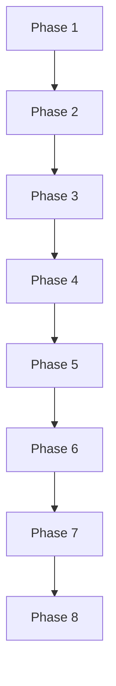

# Codex Agent 実行ログ

開始日時: 2025/12/27 22:39:55

---

## Turn 1: スレッド開始

**Thread ID**: `[REDACTED_TOKEN]`

## Turn 2: ツール実行

**種別**: reasoning
**ステータス**: completed

## Turn 3: ツール実行

**種別**: コマンド実行
**コマンド**: `/bin/bash -lc pwd`
**ステータス**: completed (exit_code=0)

```text
/tmp/ai-workflow-repos-11-00b73f07/[REDACTED_TOKEN]
```

## Turn 4: ツール実行

**種別**: reasoning
**ステータス**: completed

## Turn 5: ツール実行

**種別**: コマンド実行
**コマンド**: `/bin/bash -lc ls`
**ステータス**: completed (exit_code=0)

```text
ARCHITECTURE.md
CLAUDE.md
CONTRIBUTION.md
LICENSE
README.md
ansible
bootstrap
docker
docs
jenkins
pulumi
run_tests_issue_322.sh
scripts
tests
```

## Turn 6: ツール実行

**種別**: reasoning
**ステータス**: completed

## Turn 7: ツール実行

**種別**: コマンド実行
**コマンド**: `/bin/bash -lc 'rg --files | head'`
**ステータス**: completed (exit_code=0)

```text
/bin/bash: line 1: rg: command not found
```

## Turn 8: ツール実行

**種別**: reasoning
**ステータス**: completed

## Turn 9: ツール実行

**種別**: コマンド実行
**コマンド**: `/bin/bash -lc 'find . -maxdepth 4 -type f | head'`
**ステータス**: completed (exit_code=0)

```text
./.git/hooks/applypatch-msg.sample
./.git/hooks/commit-msg.sample
./.git/hooks/fsmonitor-watchman.sample
./.git/hooks/post-update.sample
./.git/hooks/pre-applypatch.sample
./.git/hooks/pre-commit.sample
./.git/hooks/pre-merge-commit.sample
./.git/hooks/pre-push.sample
./.git/hooks/pre-rebase.sample
./.git/hooks/pre-receive.sample
```

## Turn 10: ツール実行

**種別**: reasoning
**ステータス**: completed

## Turn 11: ツール実行

**種別**: コマンド実行
**コマンド**: `/bin/bash -lc "find . -path '*ai-workflow*issue-544*planning*'"`
**ステータス**: completed (exit_code=0)

```text
./.ai-workflow/issue-544/00_planning
./.ai-workflow/issue-544/00_planning/output
./.ai-workflow/issue-544/00_planning/output/planning.md
./.ai-workflow/issue-544/00_planning/execute
./.ai-workflow/issue-544/00_planning/execute/prompt.txt
./.ai-workflow/issue-544/00_planning/execute/agent_log_raw.txt
./.ai-workflow/issue-544/00_planning/execute/agent_log.md
./.ai-workflow/issue-544/00_planning/review
./.ai-workflow/issue-544/00_planning/review/prompt.txt
./.ai-workflow/issue-544/00_planning/review/agent_log_raw.txt
./.ai-workflow/issue-544/00_planning/review/agent_log.md
./.ai-workflow/issue-544/00_planning/review/result.md
./.ai-workflow/issue-544/00_planning/revise
```

## Turn 12: ツール実行

**種別**: reasoning
**ステータス**: completed

## Turn 13: ツール実行

**種別**: コマンド実行
**コマンド**: `/bin/bash -lc 'cat .ai-workflow/issue-544/00_planning/output/planning.md'`
**ステータス**: completed (exit_code=0)

```text
# プロジェクト計画書 - Issue #544

## 1. Issue分析
- 複雑度: 中程度（Pulumi/CloudWatch Agent設定の拡張とテンプレート化で複数ファイルに跨るが新規サブシステム追加なし）
- 見積もり工数: 14~16時間（CPUメトリクス追加・共通化対応4~6h、Pulumi生成テンプレート調整3~4h、検証/テスト4h、ドキュメント/レポート2h）
- リスク評価: 中（ARM/x86間の設定差分やメトリクス粒度不足による可観測性欠落のリスク）

## 2. 実装戦略判断
- 実装戦略: EXTEND（既存CloudWatch Agent設定にCPUメトリクスを追加し、テンプレート化で設定差異を吸収する拡張が中心）
- テスト戦略: INTEGRATION_ONLY（CloudWatch Agent設定の構文検証、Pulumi生成結果の差分確認、AMIビルドパイプラインでのTranslator実行など外部連携検証が中心）
- テストコード戦略: EXTEND_TEST（既存AMIビルド/CI検証ステップにCPUメトリクス検証を追加し、Translator検証コマンドを拡張する方針）

## 3. 影響範囲分析
- 既存コードへの影響: `pulumi/jenkins-agent-ami/component-x86.yml`, `pulumi/jenkins-agent-ami/component-arm.yml`、共通テンプレート生成ロジック（YAMLアンカー/共通ブロック）
- 依存関係の変更: 追加依存なし（CloudWatch Agentプラグインの既存CPUメトリクス利用）
- マイグレーション要否: CloudWatch Agent設定ファイルの更新のみ。データストアやスキーマ変更なし

## 4. タスク分割
### Phase 1: 要件定義 (見積もり: 2h)
- [x] Task 1-1: CPUメトリクス要件精査 (1h)
  - 収集対象メトリクス（active/user/system/iowait）と収集間隔60秒を確認
  - [REDACTED_TOKEN]を[REDACTED_TOKEN]単一に固定する要件の確定
- [x] Task 1-2: 対象範囲と除外条件の明確化 (1h)
  - ARM/x86双方の対象確認
  - CloudWatch料金影響の範囲と許容値を合意

### Phase 2: 設計 (見積もり: 3h)
- [ ] Task 2-1: 共通テンプレート設計 (2h)
  - CPU/メモリメトリクス共通ブロックの定義方式（YAMLアンカー/Here-doc等）を決定
  - ARM/x86生成パイプラインへの適用方針を策定
- [ ] Task 2-2: 検証手順設計 (1h)
  - `[REDACTED_TOKEN]`利用手順をARM/x86両方で定義
  - Pulumi preview/plan での差分確認項目を明文化

### Phase 3: テストシナリオ (見積もり: 2h)
- [ ] Task 3-1: 検証ケース作成 (2h)
  - CPUメトリクスが[REDACTED_TOKEN]単一ディメンションで出力されることを確認する手順
  - ARM/x86の生成ファイル差分がないことを確認する比較手順

### Phase 4: 実装 (見積もり: 4h)
- [ ] Task 4-1: CPUメトリクス追加とテンプレート化 (3h)
  - 共通ブロックにcpu_usage_active/user/system/iowaitを追加
  - ARM/x86コンポーネントへの適用と重複除去
- [ ] Task 4-2: Pulumi生成ロジック/スクリプト更新 (1h)
  - テンプレート利用部の整合性確認
  - 必要に応じた変数化やコメント整備

### Phase 5: テストコード実装 (見積もり: 2h)
- [ ] Task 5-1: Translator検証ステップ拡張 (2h)
  - AMIビルド/CIスクリプトにTranslator実行を追加（ARM/x86両方）
  - 失敗時に詳細を出力するロギングを追加

### Phase 6: テスト実行 (見積もり: 1.5h)
- [ ] Task 6-1: 自動検証実行 (1h)
  - Translatorによる設定構文チェック（ARM/x86）
  - Pulumi previewで設定差分確認
- [ ] Task 6-2: 手動スポット確認 (0.5h)
  - 生成されたCloudWatch Agent JSON/YAMLのCPUメトリクス有無を目視確認

### Phase 7: ドキュメント (見積もり: 1h)
- [ ] Task 7-1: 設定変更の記録 (1h)
  - `CLAUDE.md`や関連READMEに検証手順/メトリクス追加の変更点を追記
  - 運用手順（ダッシュボード/アラーム初期値）を共有メモに記載

### Phase 8: レポート (見積もり: 0.5h)
- [ ] Task 8-1: リリースノート/振り返り (0.5h)
  - 変更概要、テスト結果、残課題をまとめて共有

## 5. 依存関係（Mermaid）


## 6. リスクと軽減策
- リスク1: ARM/x86設定差分が再発し片方にメトリクスがない
  - 影響度: 中 / 確率: 中
  - 軽減策: テンプレート化＋Translator検証を両アーキで必須化し、CIで差分比較を実施
- リスク2: CloudWatchメトリクスコスト増加
  - 影響度: 低 / 確率: 中
  - 軽減策: 60秒間隔維持・ディメンション単一化でデータポイント抑制し、初月に請求確認
- リスク3: Pulumi生成物と実機設定の乖離
  - 影響度: 中 / 確率: 低
  - 軽減策: Pulumi previewで差分確認し、AMIビルド時の生成物をアーティファクトとして保存

## 7. 品質ゲート
- Phase 1: 要件定義
  - [ ] CPUメトリクス項目と収集間隔/ディメンションが明文化されている
  - [ ] 対象アーキテクチャと料金影響が合意されている
- Phase 2: 設計
  - [ ] 実装戦略/テスト戦略/テストコード戦略が明記されている
  - [ ] 共通テンプレート設計と検証手順がレビュー済み
- Phase 3: テストシナリオ
  - [ ] CPUメトリクスのディメンション確認手順が定義されている
  - [ ] ARM/x86差分検出シナリオが用意されている
- Phase 4: 実装
  - [ ] ARM/x86双方に同一メトリクスが適用されている
  - [ ] テンプレート化で重複が除去されている
- Phase 5: テストコード実装
  - [ ] Translator検証がCI/ビルドステップに組み込まれている
  - [ ] 失敗時のログ出力が確認できる
- Phase 6: テスト実行
  - [ ] TranslatorとPulumi previewが成功し、差分が期待通り
  - [ ] 手動確認でCPUメトリクスが出力されている
- Phase 7: ドキュメント
  - [ ] README/CLAUDE等に変更点と検証手順が追記されている
  - [ ] 運用向けダッシュボード/アラーム初期値が記載されている
- Phase 8: レポート
  - [ ] リリースノートに変更概要とテスト結果が記載されている
  - [ ] 残課題と次アクションが整理されている
```

## Turn 14: ツール実行

**種別**: reasoning
**ステータス**: completed

## Turn 15: ツール実行

**種別**: コマンド実行
**コマンド**: `/bin/bash -lc 'cat .ai-workflow/issue-544/02_design/output/design.md'`
**ステータス**: completed (exit_code=0)

```text
# 詳細設計書 - Issue #544 CloudWatch Agent CPUメトリクス追加

## アーキテクチャ設計
- **全体像**: Pulumi(TypeScript)でEC2 Image Builderコンポーネント(YAML)を生成 → x86/ARM別のレシピを作成 → Jenkins Agent ASGの起動時に組み込み → CloudWatch AgentがCPU/メモリメトリクスを収集し`[REDACTED_TOKEN]`単一ディメンションで60秒送信 → CloudWatchダッシュボード/アラームがASG単位の傾向を可視化。
- **コンポーネント関係**: Pulumi `index.ts`が共通CloudWatch Agent設定テンプレート(JSON)を読み込んで各`component-*.yml`へ埋め込み、Image BuilderがAMI生成時に適用。生成AMIを使用するJenkins Agent ASGからCloudWatchへメトリクスが流れ、運用ドキュメントでダッシュボード/アラーム初期値を参照。
- **データフロー(抜粋)**: テンプレートJSON → Pulumiで整形・インライン化 → Image Builder buildフェーズで`amazon-cloudwatch-agent.json`を書き込み → Translatorで構文検証 → CloudWatch Agentサービス起動 → CloudWatch(CWAgent名前空間)へ送信 → ダッシュボード/アラーム参照。

## 実装戦略: EXTEND

**判断根拠**:
- 既存の`component-arm.yml`/`component-x86.yml`にCPUメトリクス追加と共通化処理を挿入する拡張が中心で、新規サブシステムは不要。
- Pulumi `index.ts`の読み込みロジックを共通テンプレート対応に拡張し、既存AMIビルド/検証フローを活かすため。

## テスト戦略: INTEGRATION_ONLY

**判断根拠**:
- CloudWatch Agent設定は外部バイナリと連携するため、Translator実行やImage Builder出力検証など統合動作確認が主眼となり、単体テストの粒度では効果が薄い。
- Pulumi previewやTranslatorによる構文検証で設定の妥当性をエンドツーエンドに確認できるため、統合テスト重視とする。

## テストコード戦略: EXTEND_TEST

**判断根拠**:
- 既存のImage Builderコンポーネント内の検証ステップにTranslator実行とメトリクス確認を追加することで、追加テストを既存フローに組み込める。
- 新規フレームワーク導入より、既存のCI/AMIビルド検証を拡張する方がコストと整合性に優れる。

## 影響範囲分析
- **既存コード**: `pulumi/jenkins-agent-ami/component-arm.yml` / `component-x86.yml` のCloudWatch Agent設定書き込み・検証ステップ、`pulumi/jenkins-agent-ami/index.ts`のコンポーネント読み込み処理。
- **依存関係**: AWS CloudWatch Agent既存インストール手順、Image BuilderのYAML仕様。追加ライブラリやサービス依存はなし。
- **マイグレーション**: AMI再作成とASGローリングで新設定を適用。データストアやIAM変更は不要。

## 変更・追加ファイルリスト
- **新規作成**:
  - `pulumi/jenkins-agent-ami/templates/cloudwatch-agent-config.json`: CPU/メモリ共通メトリクス定義テンプレート。
- **既存修正**:
  - `pulumi/jenkins-agent-ami/component-arm.yml`: CloudWatch Agent設定生成をテンプレート埋め込み化、CPUメトリクス追加、Translator検証ステップ追加。
  - `pulumi/jenkins-agent-ami/component-x86.yml`: 同上。
  - `pulumi/jenkins-agent-ami/index.ts`: テンプレート読み込み・インライン展開、共通ブロック挿入ロジック追加。
- **削除**: なし。

## 詳細設計
### CloudWatch Agent設定テンプレート
- 形式: JSONファイル。`metrics_collected`に`cpu`と`mem`を定義し、`[REDACTED_TOKEN]: 60`を維持。
- CPUメジャーメント: `cpu_usage_active`, `cpu_usage_user`, `cpu_usage_system`, `cpu_usage_iowait`（必要に応じ`cpu_usage_idle`などデフォルト出力も許容）。
- 共通ディメンション: `append_dimensions`で`${aws:[REDACTED_TOKEN]}`を付与し、`[REDACTED_TOKEN]`は`["[REDACTED_TOKEN]"]`のみ。
- テンプレートはPulumiで読み込み、インデント調整後に各`component-*.yml`のheredocへ埋め込むため、文字列表現をそのまま利用できる構造にする。

### コンポーネント生成・共通化
- `component-arm.yml` / `component-x86.yml`でCloudWatch Agent設定を書き込むコマンドをプレースホルダ化（例: `__CWAGENT_CONFIG__`）し、Pulumi側でテンプレート文字列へ置換する方式に変更。アーキ固有の差分は従来通り各ファイルが保持し、メトリクス部分のみ共通化。
- CloudWatch Agentインストール後の検証ステップにTranslatorを追加し、設定ファイルを入力として構文検証・エラー出力を実行する。失敗時はコンポーネント実行を中断し、ログを標準出力へ表示。
- 既存の`cat`出力確認も維持し、Translator結果と合わせてデバッグ容易性を確保。

### Pulumi連携 (`index.ts`)
- 新規テンプレートファイルを`fs.readFileSync`で読み込み、共通整形関数でheredocに適したインデントへ変換。
- `component-*.yml`読み込み時に`replace("__CWAGENT_CONFIG__", renderedConfig)`を実行してデータ文字列を完成させ、Image Builderコンポーネントに渡す。
- 今後メトリクスを追加する際はテンプレートのみ変更すれば両アーキへ反映されるようにする。

### 構文検証・差分確認
- **Translator**: CloudWatch Agent設定ファイルに対し`/opt/aws/amazon-cloudwatch-agent/bin/[REDACTED_TOKEN] -input /opt/aws/amazon-cloudwatch-agent/etc/amazon-cloudwatch-agent.json -format json -output /tmp/cwagent.translated.json`を各アーキで実行。失敗時は標準エラーをログに残しステップ失敗とする。
- **差分確認**: テンプレート単一化に加え、CIで`component-arm.yml`と`component-x86.yml`のCloudWatch設定ブロックが一致することを簡易比較するスクリプト（例: `grep`+`diff`）を既存パイプラインに組み込む。Pulumi previewで追加リソース/ディメンションがないことを確認するチェックリストをdocsに追記。

### モニタリング運用
- ダッシュボード/アラーム初期値: CPU使用率80%超をN分継続でアラーム、[REDACTED_TOKEN]別ウィジェットを追加する手順を運用ドキュメントへ記述（調整可能値として記載）。
- CWAgent名前空間の新CPUメトリクスを利用し、メモリと並列で表示するレイアウトを推奨。

### トレーサビリティ（要件対応）
- FR-1/AC-1: テンプレートにCPUメトリクスと60秒間隔、ASG単一ディメンションを定義。
- FR-2/AC-2: Pulumiでテンプレートを両コンポーネントに共通挿入し、CI差分チェックで一致を保証。
- FR-3/AC-3: コンポーネント内にTranslator実行ステップを追加し、失敗時にビルド失敗＋エラーログ出力。
- FR-4/AC-4: Pulumi previewチェックリストとコンポーネント差分比較スクリプトでメトリクスセットの整合を検証。
- FR-5/AC-5: 運用ドキュメントにCPU高負荷アラーム/ダッシュボード案を記載。

## セキュリティ考慮事項
- 収集ディメンションは`AutoScal
... (truncated)
```

## Turn 16: ツール実行

**種別**: reasoning
**ステータス**: completed

## Turn 17: ツール実行

**種別**: reasoning
**ステータス**: completed

## Turn 18: ツール実行

**種別**: コマンド実行
**コマンド**: `/bin/bash -lc "sed -n '30,60p' .ai-workflow/issue-544/00_planning/output/planning.md"`
**ステータス**: completed (exit_code=0)

```text
- ARM/x86生成パイプラインへの適用方針を策定
- [ ] Task 2-2: 検証手順設計 (1h)
  - `[REDACTED_TOKEN]`利用手順をARM/x86両方で定義
  - Pulumi preview/plan での差分確認項目を明文化

### Phase 3: テストシナリオ (見積もり: 2h)
- [ ] Task 3-1: 検証ケース作成 (2h)
  - CPUメトリクスが[REDACTED_TOKEN]単一ディメンションで出力されることを確認する手順
  - ARM/x86の生成ファイル差分がないことを確認する比較手順

### Phase 4: 実装 (見積もり: 4h)
- [ ] Task 4-1: CPUメトリクス追加とテンプレート化 (3h)
  - 共通ブロックにcpu_usage_active/user/system/iowaitを追加
  - ARM/x86コンポーネントへの適用と重複除去
- [ ] Task 4-2: Pulumi生成ロジック/スクリプト更新 (1h)
  - テンプレート利用部の整合性確認
  - 必要に応じた変数化やコメント整備

### Phase 5: テストコード実装 (見積もり: 2h)
- [ ] Task 5-1: Translator検証ステップ拡張 (2h)
  - AMIビルド/CIスクリプトにTranslator実行を追加（ARM/x86両方）
  - 失敗時に詳細を出力するロギングを追加

### Phase 6: テスト実行 (見積もり: 1.5h)
- [ ] Task 6-1: 自動検証実行 (1h)
  - Translatorによる設定構文チェック（ARM/x86）
  - Pulumi previewで設定差分確認
- [ ] Task 6-2: 手動スポット確認 (0.5h)
  - 生成されたCloudWatch Agent JSON/YAMLのCPUメトリクス有無を目視確認

### Phase 7: ドキュメント (見積もり: 1h)
```

## Turn 19: ツール実行

**種別**: reasoning
**ステータス**: completed

## Turn 20: ツール実行

**種別**: コマンド実行
**コマンド**: `/bin/bash -lc 'rg -n "Task 2" -n .ai-workflow/issue-544/00_planning/output/planning.md'`
**ステータス**: failed (exit_code=127)

```text
/bin/bash: line 1: rg: command not found
```

## Turn 21: ツール実行

**種別**: reasoning
**ステータス**: completed

## Turn 22: ツール実行

**種別**: コマンド実行
**コマンド**: `/bin/bash -lc 'grep -n "Task 2" -n .ai-workflow/issue-544/00_planning/output/planning.md'`
**ステータス**: completed (exit_code=0)

```text
28:- [ ] Task 2-1: 共通テンプレート設計 (2h)
31:- [ ] Task 2-2: 検証手順設計 (1h)
```

## Turn 23: ツール実行

**種別**: reasoning
**ステータス**: completed

## Turn 24: ツール実行

**種別**: reasoning
**ステータス**: completed

## Turn 25: ツール実行

**種別**: コマンド実行
**コマンド**: `/bin/bash -lc "nl -ba .ai-workflow/issue-544/00_planning/output/planning.md | sed -n '20,40p'"`
**ステータス**: completed (exit_code=0)

```text
20	- [x] Task 1-1: CPUメトリクス要件精査 (1h)
    21	  - 収集対象メトリクス（active/user/system/iowait）と収集間隔60秒を確認
    22	  - [REDACTED_TOKEN]を[REDACTED_TOKEN]単一に固定する要件の確定
    23	- [x] Task 1-2: 対象範囲と除外条件の明確化 (1h)
    24	  - ARM/x86双方の対象確認
    25	  - CloudWatch料金影響の範囲と許容値を合意
    26	
    27	### Phase 2: 設計 (見積もり: 3h)
    28	- [ ] Task 2-1: 共通テンプレート設計 (2h)
    29	  - CPU/メモリメトリクス共通ブロックの定義方式（YAMLアンカー/Here-doc等）を決定
    30	  - ARM/x86生成パイプラインへの適用方針を策定
    31	- [ ] Task 2-2: 検証手順設計 (1h)
    32	  - `[REDACTED_TOKEN]`利用手順をARM/x86両方で定義
    33	  - Pulumi preview/plan での差分確認項目を明文化
    34	
    35	### Phase 3: テストシナリオ (見積もり: 2h)
    36	- [ ] Task 3-1: 検証ケース作成 (2h)
    37	  - CPUメトリクスが[REDACTED_TOKEN]単一ディメンションで出力されることを確認する手順
    38	  - ARM/x86の生成ファイル差分がないことを確認する比較手順
    39	
    40	### Phase 4: 実装 (見積もり: 4h)
```

## Turn 26: ツール実行

**種別**: reasoning
**ステータス**: completed

## Turn 27: ツール実行

**種別**: file_change
**ステータス**: completed

## Turn 28: ツール実行

**種別**: reasoning
**ステータス**: completed

## Turn 29: ツール実行

**種別**: コマンド実行
**コマンド**: `/bin/bash -lc "sed -n '20,40p' .ai-workflow/issue-544/00_planning/output/planning.md"`
**ステータス**: completed (exit_code=0)

```text
- [x] Task 1-1: CPUメトリクス要件精査 (1h)
  - 収集対象メトリクス（active/user/system/iowait）と収集間隔60秒を確認
  - [REDACTED_TOKEN]を[REDACTED_TOKEN]単一に固定する要件の確定
- [x] Task 1-2: 対象範囲と除外条件の明確化 (1h)
  - ARM/x86双方の対象確認
  - CloudWatch料金影響の範囲と許容値を合意

### Phase 2: 設計 (見積もり: 3h)
- [x] Task 2-1: 共通テンプレート設計 (2h)
  - CPU/メモリメトリクス共通ブロックの定義方式（YAMLアンカー/Here-doc等）を決定
  - ARM/x86生成パイプラインへの適用方針を策定
- [x] Task 2-2: 検証手順設計 (1h)
  - `[REDACTED_TOKEN]`利用手順をARM/x86両方で定義
  - Pulumi preview/plan での差分確認項目を明文化

### Phase 3: テストシナリオ (見積もり: 2h)
- [ ] Task 3-1: 検証ケース作成 (2h)
  - CPUメトリクスが[REDACTED_TOKEN]単一ディメンションで出力されることを確認する手順
  - ARM/x86の生成ファイル差分がないことを確認する比較手順

### Phase 4: 実装 (見積もり: 4h)
```

## Turn 30: ツール実行

**種別**: reasoning
**ステータス**: completed

## Turn 31: ツール実行

**種別**: コマンド実行
**コマンド**: `/bin/bash -lc "nl -ba .ai-workflow/issue-544/02_design/output/design.md | sed -n '1,200p'"`
**ステータス**: completed (exit_code=0)

```text
1	# 詳細設計書 - Issue #544 CloudWatch Agent CPUメトリクス追加
     2	
     3	## アーキテクチャ設計
     4	- **全体像**: Pulumi(TypeScript)でEC2 Image Builderコンポーネント(YAML)を生成 → x86/ARM別のレシピを作成 → Jenkins Agent ASGの起動時に組み込み → CloudWatch AgentがCPU/メモリメトリクスを収集し`[REDACTED_TOKEN]`単一ディメンションで60秒送信 → CloudWatchダッシュボード/アラームがASG単位の傾向を可視化。
     5	- **コンポーネント関係**: Pulumi `index.ts`が共通CloudWatch Agent設定テンプレート(JSON)を読み込んで各`component-*.yml`へ埋め込み、Image BuilderがAMI生成時に適用。生成AMIを使用するJenkins Agent ASGからCloudWatchへメトリクスが流れ、運用ドキュメントでダッシュボード/アラーム初期値を参照。
     6	- **データフロー(抜粋)**: テンプレートJSON → Pulumiで整形・インライン化 → Image Builder buildフェーズで`amazon-cloudwatch-agent.json`を書き込み → Translatorで構文検証 → CloudWatch Agentサービス起動 → CloudWatch(CWAgent名前空間)へ送信 → ダッシュボード/アラーム参照。
     7	
     8	## 実装戦略: EXTEND
     9	
    10	**判断根拠**:
    11	- 既存の`component-arm.yml`/`component-x86.yml`にCPUメトリクス追加と共通化処理を挿入する拡張が中心で、新規サブシステムは不要。
    12	- Pulumi `index.ts`の読み込みロジックを共通テンプレート対応に拡張し、既存AMIビルド/検証フローを活かすため。
    13	
    14	## テスト戦略: INTEGRATION_ONLY
    15	
    16	**判断根拠**:
    17	- CloudWatch Agent設定は外部バイナリと連携するため、Translator実行やImage Builder出力検証など統合動作確認が主眼となり、単体テストの粒度では効果が薄い。
    18	- Pulumi previewやTranslatorによる構文検証で設定の妥当性をエンドツーエンドに確認できるため、統合テスト重視とする。
    19	
    20	## テストコード戦略: EXTEND_TEST
    21	
    22	**判断根拠**:
    23	- 既存のImage Builderコンポーネント内の検証ステップにTranslator実行とメトリクス確認を追加することで、追加テストを既存フローに組み込める。
    24	- 新規フレームワーク導入より、既存のCI/AMIビルド検証を拡張する方がコストと整合性に優れる。
    25	
    26	## 影響範囲分析
    27	- **既存コード**: `pulumi/jenkins-agent-ami/component-arm.yml` / `component-x86.yml` のCloudWatch Agent設定書き込み・検証ステップ、`pulumi/jenkins-agent-ami/index.ts`のコンポーネント読み込み処理。
    28	- **依存関係**: AWS CloudWatch Agent既存インストール手順、Image BuilderのYAML仕様。追加ライブラリやサービス依存はなし。
    29	- **マイグレーション**: AMI再作成とASGローリングで新設定を適用。データストアやIAM変更は不要。
    30	
    31	## 変更・追加ファイルリスト
    32	- **新規作成**:
    33	  - `pulumi/jenkins-agent-ami/templates/cloudwatch-agent-config.json`: CPU/メモリ共通メトリクス定義テンプレート。
    34	- **既存修正**:
    35	  - `pulumi/jenkins-agent-ami/component-arm.yml`: CloudWatch Agent設定生成をテンプレート埋め込み化、CPUメトリクス追加、Translator検証ステップ追加。
    36	  - `pulumi/jenkins-agent-ami/component-x86.yml`: 同上。
    37	  - `pulumi/jenkins-agent-ami/index.ts`: テンプレート読み込み・インライン展開、共通ブロック挿入ロジック追加。
    38	- **削除**: なし。
    39	
    40	## 詳細設計
    41	### CloudWatch Agent設定テンプレート
    42	- 形式: JSONファイル。`metrics_collected`に`cpu`と`mem`を定義し、`[REDACTED_TOKEN]: 60`を維持。
    43	- CPUメジャーメント: `cpu_usage_active`, `cpu_usage_user`, `cpu_usage_system`, `cpu_usage_iowait`（必要に応じ`cpu_usage_idle`などデフォルト出力も許容）。
    44	- 共通ディメンション: `append_dimensions`で`${aws:[REDACTED_TOKEN]}`を付与し、`[REDACTED_TOKEN]`は`["[REDACTED_TOKEN]"]`のみ。
    45	- テンプレートはPulumiで読み込み、インデント調整後に各`component-*.yml`のheredocへ埋め込むため、文字列表現をそのまま利用できる構造にする。
    46	
    47	### コンポーネント生成・共通化
    48	- `component-arm.yml` / `component-x86.yml`でCloudWatch Agent設定を書き込むコマンドをプレースホルダ化（例: `__CWAGENT_CONFIG__`）し、Pulumi側でテンプレート文字列へ置換する方式に変更。アーキ固有の差分は従来通り各ファイルが保持し、メトリクス部分のみ共通化。
    49	- CloudWatch Agentインストール後の検証ステップにTranslatorを追加し、設定ファイルを入力として構文検証・エラー出力を実行する。失敗時はコンポーネント実行を中断し、ログを標準出力へ表示。
    50	- 既存の`cat`出力確認も維持し、Translator結果と合わせてデバッグ容易性を確保。
    51	
    52	### Pulumi連携 (`index.ts`)
    53	- 新規テンプレートファイルを`fs.readFileSync`で読み込み、共通整形関数でheredocに適したインデントへ変換。
    54	- `component-*.yml`読み込み時に`replace("__CWAGENT_CONFIG__", renderedConfig)`を実行してデータ文字列を完成させ、Image Builderコンポーネントに渡す。
    55	- 今後メトリクスを追加する際はテンプレートのみ変更すれば両アーキへ反映されるようにする。
    56	
    57	### 構文検証・差分確認
    58	- **Translator**: CloudWatch Agent設定ファイルに対し`/opt/aws/amazon-cloudwatch-agent/bin/[REDACTED_TOKEN] -input /opt/aws/amazon-cloudwatch-agent/etc/amazon-cloudwatch-agent.json -format json -output /tmp/cwagent.translated.json`を各アーキで実行。失敗時は標準エラーをログに残しステップ失敗とする。
    59	- **差分確認**: テンプレート単一化に加え、CIで`component-arm.yml`と`component-x86.yml`のCloudWatch設定ブロックが一致することを簡易比較するスクリプト（例: `grep`+`diff`）を既存パイプラインに組み込む。Pulumi previewで追加リソース/ディメンションがないことを確認するチェックリストをdocsに追記。
    60	
    61	### モニタリング運用
    62	- ダッシュボード/アラーム初期値: CPU使用率80%超をN分継続でアラーム、[REDACTED_TOKEN]別ウ
... (truncated)
```

## Turn 32: ツール実行

**種別**: reasoning
**ステータス**: completed

## Turn 33: ツール実行

**種別**: agent_message
**ステータス**: completed

## Turn 34: 実行完了

**ステータス**: completed
**所要時間**: 69191ms
**ターン数**: N/A

---

**経過時間**: 69191ms
**開始**: 2025-12-27T22:39:55.618Z
**終了**: 2025-12-27T22:41:04.809Z