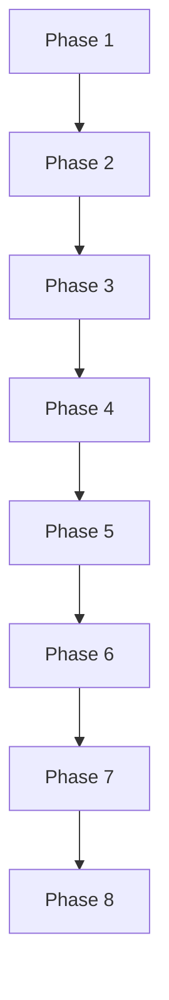

# Codex Agent 実行ログ

開始日時: 2025/12/27 22:44:02

---

## Turn 1: スレッド開始

**Thread ID**: `[REDACTED_TOKEN]`

## Turn 2: ツール実行

**種別**: reasoning
**ステータス**: completed

## Turn 3: ツール実行

**種別**: コマンド実行
**コマンド**: `/bin/bash -lc ls`
**ステータス**: completed (exit_code=0)

```text
ARCHITECTURE.md
CLAUDE.md
CONTRIBUTION.md
LICENSE
README.md
ansible
bootstrap
docker
docs
jenkins
pulumi
run_tests_issue_322.sh
scripts
tests
```

## Turn 4: ツール実行

**種別**: reasoning
**ステータス**: completed

## Turn 5: ツール実行

**種別**: コマンド実行
**コマンド**: `/bin/bash -lc 'cat .ai-workflow/issue-544/00_planning/output/planning.md'`
**ステータス**: completed (exit_code=0)

```text
# プロジェクト計画書 - Issue #544

## 1. Issue分析
- 複雑度: 中程度（Pulumi/CloudWatch Agent設定の拡張とテンプレート化で複数ファイルに跨るが新規サブシステム追加なし）
- 見積もり工数: 14~16時間（CPUメトリクス追加・共通化対応4~6h、Pulumi生成テンプレート調整3~4h、検証/テスト4h、ドキュメント/レポート2h）
- リスク評価: 中（ARM/x86間の設定差分やメトリクス粒度不足による可観測性欠落のリスク）

## 2. 実装戦略判断
- 実装戦略: EXTEND（既存CloudWatch Agent設定にCPUメトリクスを追加し、テンプレート化で設定差異を吸収する拡張が中心）
- テスト戦略: INTEGRATION_ONLY（CloudWatch Agent設定の構文検証、Pulumi生成結果の差分確認、AMIビルドパイプラインでのTranslator実行など外部連携検証が中心）
- テストコード戦略: EXTEND_TEST（既存AMIビルド/CI検証ステップにCPUメトリクス検証を追加し、Translator検証コマンドを拡張する方針）

## 3. 影響範囲分析
- 既存コードへの影響: `pulumi/jenkins-agent-ami/component-x86.yml`, `pulumi/jenkins-agent-ami/component-arm.yml`、共通テンプレート生成ロジック（YAMLアンカー/共通ブロック）
- 依存関係の変更: 追加依存なし（CloudWatch Agentプラグインの既存CPUメトリクス利用）
- マイグレーション要否: CloudWatch Agent設定ファイルの更新のみ。データストアやスキーマ変更なし

## 4. タスク分割
### Phase 1: 要件定義 (見積もり: 2h)
- [x] Task 1-1: CPUメトリクス要件精査 (1h)
  - 収集対象メトリクス（active/user/system/iowait）と収集間隔60秒を確認
  - [REDACTED_TOKEN]を[REDACTED_TOKEN]単一に固定する要件の確定
- [x] Task 1-2: 対象範囲と除外条件の明確化 (1h)
  - ARM/x86双方の対象確認
  - CloudWatch料金影響の範囲と許容値を合意

### Phase 2: 設計 (見積もり: 3h)
- [x] Task 2-1: 共通テンプレート設計 (2h)
  - CPU/メモリメトリクス共通ブロックの定義方式（YAMLアンカー/Here-doc等）を決定
  - ARM/x86生成パイプラインへの適用方針を策定
- [x] Task 2-2: 検証手順設計 (1h)
  - `[REDACTED_TOKEN]`利用手順をARM/x86両方で定義
  - Pulumi preview/plan での差分確認項目を明文化
### Phase 3: テストシナリオ (見積もり: 2h)
- [x] Task 3-1: 検証ケース作成 (2h)
  - CPUメトリクスが[REDACTED_TOKEN]単一ディメンションで出力されることを確認する手順
  - ARM/x86の生成ファイル差分がないことを確認する比較手順

### Phase 4: 実装 (見積もり: 4h)
- [ ] Task 4-1: CPUメトリクス追加とテンプレート化 (3h)
  - 共通ブロックにcpu_usage_active/user/system/iowaitを追加
  - ARM/x86コンポーネントへの適用と重複除去
- [ ] Task 4-2: Pulumi生成ロジック/スクリプト更新 (1h)
  - テンプレート利用部の整合性確認
  - 必要に応じた変数化やコメント整備

### Phase 5: テストコード実装 (見積もり: 2h)
- [ ] Task 5-1: Translator検証ステップ拡張 (2h)
  - AMIビルド/CIスクリプトにTranslator実行を追加（ARM/x86両方）
  - 失敗時に詳細を出力するロギングを追加

### Phase 6: テスト実行 (見積もり: 1.5h)
- [ ] Task 6-1: 自動検証実行 (1h)
  - Translatorによる設定構文チェック（ARM/x86）
  - Pulumi previewで設定差分確認
- [ ] Task 6-2: 手動スポット確認 (0.5h)
  - 生成されたCloudWatch Agent JSON/YAMLのCPUメトリクス有無を目視確認

### Phase 7: ドキュメント (見積もり: 1h)
- [ ] Task 7-1: 設定変更の記録 (1h)
  - `CLAUDE.md`や関連READMEに検証手順/メトリクス追加の変更点を追記
  - 運用手順（ダッシュボード/アラーム初期値）を共有メモに記載

### Phase 8: レポート (見積もり: 0.5h)
- [ ] Task 8-1: リリースノート/振り返り (0.5h)
  - 変更概要、テスト結果、残課題をまとめて共有

## 5. 依存関係（Mermaid）


## 6. リスクと軽減策
- リスク1: ARM/x86設定差分が再発し片方にメトリクスがない
  - 影響度: 中 / 確率: 中
  - 軽減策: テンプレート化＋Translator検証を両アーキで必須化し、CIで差分比較を実施
- リスク2: CloudWatchメトリクスコスト増加
  - 影響度: 低 / 確率: 中
  - 軽減策: 60秒間隔維持・ディメンション単一化でデータポイント抑制し、初月に請求確認
- リスク3: Pulumi生成物と実機設定の乖離
  - 影響度: 中 / 確率: 低
  - 軽減策: Pulumi previewで差分確認し、AMIビルド時の生成物をアーティファクトとして保存

## 7. 品質ゲート
- Phase 1: 要件定義
  - [ ] CPUメトリクス項目と収集間隔/ディメンションが明文化されている
  - [ ] 対象アーキテクチャと料金影響が合意されている
- Phase 2: 設計
  - [ ] 実装戦略/テスト戦略/テストコード戦略が明記されている
  - [ ] 共通テンプレート設計と検証手順がレビュー済み
- Phase 3: テストシナリオ
  - [ ] CPUメトリクスのディメンション確認手順が定義されている
  - [ ] ARM/x86差分検出シナリオが用意されている
- Phase 4: 実装
  - [ ] ARM/x86双方に同一メトリクスが適用されている
  - [ ] テンプレート化で重複が除去されている
- Phase 5: テストコード実装
  - [ ] Translator検証がCI/ビルドステップに組み込まれている
  - [ ] 失敗時のログ出力が確認できる
- Phase 6: テスト実行
  - [ ] TranslatorとPulumi previewが成功し、差分が期待通り
  - [ ] 手動確認でCPUメトリクスが出力されている
- Phase 7: ドキュメント
  - [ ] README/CLAUDE等に変更点と検証手順が追記されている
  - [ ] 運用向けダッシュボード/アラーム初期値が記載されている
- Phase 8: レポート
  - [ ] リリースノートに変更概要とテスト結果が記載されている
  - [ ] 残課題と次アクションが整理されている
```

## Turn 6: ツール実行

**種別**: reasoning
**ステータス**: completed

## Turn 7: ツール実行

**種別**: コマンド実行
**コマンド**: `/bin/bash -lc 'cat .ai-workflow/issue-544/02_design/output/design.md'`
**ステータス**: completed (exit_code=0)

```text
# 詳細設計書 - Issue #544 CloudWatch Agent CPUメトリクス追加

## アーキテクチャ設計
- **全体像**: Pulumi(TypeScript)でEC2 Image Builderコンポーネント(YAML)を生成 → x86/ARM別のレシピを作成 → Jenkins Agent ASGの起動時に組み込み → CloudWatch AgentがCPU/メモリメトリクスを収集し`[REDACTED_TOKEN]`単一ディメンションで60秒送信 → CloudWatchダッシュボード/アラームがASG単位の傾向を可視化。
- **コンポーネント関係**: Pulumi `index.ts`が共通CloudWatch Agent設定テンプレート(JSON)を読み込んで各`component-*.yml`へ埋め込み、Image BuilderがAMI生成時に適用。生成AMIを使用するJenkins Agent ASGからCloudWatchへメトリクスが流れ、運用ドキュメントでダッシュボード/アラーム初期値を参照。
- **データフロー(抜粋)**: テンプレートJSON → Pulumiで整形・インライン化 → Image Builder buildフェーズで`amazon-cloudwatch-agent.json`を書き込み → Translatorで構文検証 → CloudWatch Agentサービス起動 → CloudWatch(CWAgent名前空間)へ送信 → ダッシュボード/アラーム参照。

## 実装戦略: EXTEND

**判断根拠**:
- 既存の`component-arm.yml`/`component-x86.yml`にCPUメトリクス追加と共通化処理を挿入する拡張が中心で、新規サブシステムは不要。
- Pulumi `index.ts`の読み込みロジックを共通テンプレート対応に拡張し、既存AMIビルド/検証フローを活かすため。

## テスト戦略: INTEGRATION_ONLY

**判断根拠**:
- CloudWatch Agent設定は外部バイナリと連携するため、Translator実行やImage Builder出力検証など統合動作確認が主眼となり、単体テストの粒度では効果が薄い。
- Pulumi previewやTranslatorによる構文検証で設定の妥当性をエンドツーエンドに確認できるため、統合テスト重視とする。

## テストコード戦略: EXTEND_TEST

**判断根拠**:
- 既存のImage Builderコンポーネント内の検証ステップにTranslator実行とメトリクス確認を追加することで、追加テストを既存フローに組み込める。
- 新規フレームワーク導入より、既存のCI/AMIビルド検証を拡張する方がコストと整合性に優れる。

## 影響範囲分析
- **既存コード**: `pulumi/jenkins-agent-ami/component-arm.yml` / `component-x86.yml` のCloudWatch Agent設定書き込み・検証ステップ、`pulumi/jenkins-agent-ami/index.ts`のコンポーネント読み込み処理。
- **依存関係**: AWS CloudWatch Agent既存インストール手順、Image BuilderのYAML仕様。追加ライブラリやサービス依存はなし。
- **マイグレーション**: AMI再作成とASGローリングで新設定を適用。データストアやIAM変更は不要。

## 変更・追加ファイルリスト
- **新規作成**:
  - `pulumi/jenkins-agent-ami/templates/cloudwatch-agent-config.json`: CPU/メモリ共通メトリクス定義テンプレート。
- **既存修正**:
  - `pulumi/jenkins-agent-ami/component-arm.yml`: CloudWatch Agent設定生成をテンプレート埋め込み化、CPUメトリクス追加、Translator検証ステップ追加。
  - `pulumi/jenkins-agent-ami/component-x86.yml`: 同上。
  - `pulumi/jenkins-agent-ami/index.ts`: テンプレート読み込み・インライン展開、共通ブロック挿入ロジック追加。
- **削除**: なし。

## 詳細設計
### CloudWatch Agent設定テンプレート
- 形式: JSONファイル。`metrics_collected`に`cpu`と`mem`を定義し、`[REDACTED_TOKEN]: 60`を維持。
- CPUメジャーメント: `cpu_usage_active`, `cpu_usage_user`, `cpu_usage_system`, `cpu_usage_iowait`（必要に応じ`cpu_usage_idle`などデフォルト出力も許容）。
- 共通ディメンション: `append_dimensions`で`${aws:[REDACTED_TOKEN]}`を付与し、`[REDACTED_TOKEN]`は`["[REDACTED_TOKEN]"]`のみ。
- テンプレートはPulumiで読み込み、インデント調整後に各`component-*.yml`のheredocへ埋め込むため、文字列表現をそのまま利用できる構造にする。

### コンポーネント生成・共通化
- `component-arm.yml` / `component-x86.yml`でCloudWatch Agent設定を書き込むコマンドをプレースホルダ化（例: `__CWAGENT_CONFIG__`）し、Pulumi側でテンプレート文字列へ置換する方式に変更。アーキ固有の差分は従来通り各ファイルが保持し、メトリクス部分のみ共通化。
- CloudWatch Agentインストール後の検証ステップにTranslatorを追加し、設定ファイルを入力として構文検証・エラー出力を実行する。失敗時はコンポーネント実行を中断し、ログを標準出力へ表示。
- 既存の`cat`出力確認も維持し、Translator結果と合わせてデバッグ容易性を確保。

### Pulumi連携 (`index.ts`)
- 新規テンプレートファイルを`fs.readFileSync`で読み込み、共通整形関数でheredocに適したインデントへ変換。
- `component-*.yml`読み込み時に`replace("__CWAGENT_CONFIG__", renderedConfig)`を実行してデータ文字列を完成させ、Image Builderコンポーネントに渡す。
- 今後メトリクスを追加する際はテンプレートのみ変更すれば両アーキへ反映されるようにする。

### 構文検証・差分確認
- **Translator**: CloudWatch Agent設定ファイルに対し`/opt/aws/amazon-cloudwatch-agent/bin/[REDACTED_TOKEN] -input /opt/aws/amazon-cloudwatch-agent/etc/amazon-cloudwatch-agent.json -format json -output /tmp/cwagent.translated.json`を各アーキで実行。失敗時は標準エラーをログに残しステップ失敗とする。
- **差分確認**: テンプレート単一化に加え、CIで`component-arm.yml`と`component-x86.yml`のCloudWatch設定ブロックが一致することを簡易比較するスクリプト（例: `grep`+`diff`）を既存パイプラインに組み込む。Pulumi previewで追加リソース/ディメンションがないことを確認するチェックリストをdocsに追記。

### モニタリング運用
- ダッシュボード/アラーム初期値: CPU使用率80%超をN分継続でアラーム、[REDACTED_TOKEN]別ウィジェットを追加する手順を運用ドキュメントへ記述（調整可能値として記載）。
- CWAgent名前空間の新CPUメトリクスを利用し、メモリと並列で表示するレイアウトを推奨。

### トレーサビリティ（要件対応）
- FR-1/AC-1: テンプレートにCPUメトリクスと60秒間隔、ASG単一ディメンションを定義。
- FR-2/AC-2: Pulumiでテンプレートを両コンポーネントに共通挿入し、CI差分チェックで一致を保証。
- FR-3/AC-3: コンポーネント内にTranslator実行ステップを追加し、失敗時にビルド失敗＋エラーログ出力。
- FR-4/AC-4: Pulumi previewチェックリストとコンポーネント差分比較スクリプトでメトリクスセットの整合を検証。
- FR-5/AC-5: 運用ドキュメントにCPU高負荷アラーム/ダッシュボード案を記載。

## セキュリティ考慮事項
- 収集ディメンションは`AutoScal
... (truncated)
```

## Turn 8: ツール実行

**種別**: コマンド実行
**コマンド**: `/bin/bash -lc 'cat .ai-workflow/issue-544/01_requirements/output/requirements.md'`
**ステータス**: completed (exit_code=0)

```text
# 要件定義書 - Issue #544 CloudWatch Agent CPUメトリクス追加

## 0. Planning Documentの確認
- 参照: `.ai-workflow/issue-544/00_planning/output/planning.md`
- 方針: 既存設定を拡張するEXTEND戦略。ARM/x86両アーキで共通テンプレート化し、CloudWatch Agent設定の構文検証を組み込むINTEGRATION_ONLYテスト方針を踏襲。
- 留意: 収集メトリクス/間隔/ディメンションを明文化し、ARM/x86差分防止とコスト増抑制を重点リスクとして扱う。

## 1. 概要
- Jenkins Agent AMIのCloudWatch Agent設定にCPU使用率メトリクス（active/user/system/iowaitなど）を追加し、既存メモリ同様に[REDACTED_TOKEN]単一ディメンションで60秒収集する。
- ARM/x86で分かれている設定を共通テンプレート化し、設定差分をなくすことでASG単位のCPU負荷を可視化する。
- 期待価値: スケールアウト/イン判断や障害調査の精度向上、ビルド待ち時間の抑制、可観測性コストのコントロール。

## 2. 機能要件
- FR-1（高）: CloudWatch Agentの`metrics_collected.cpu`に`cpu_usage_active`, `cpu_usage_user`, `cpu_usage_system`, `cpu_usage_iowait`（必要に応じ`cpu_usage_idle`などデフォルト出力を含む）の収集を追加し、60秒間隔、`[REDACTED_TOKEN]: [[REDACTED_TOKEN]]`を適用する。
- FR-2（高）: ARM/x86コンポーネントでCPU/メモリメトリクス設定を共通テンプレート化し、生成される設定ファイルのメトリクスセット・ディメンション・収集間隔が一致するようにする。
- FR-3（中）: AMIビルド/CIパイプラインでARM/x86両方に`[REDACTED_TOKEN] -input`による構文検証ステップを追加し、失敗時に詳細ログを出力する。
- FR-4（中）: Pulumi生成物（component-x86.yml/component-arm.ymlの出力）がCPUメトリクス追加後も既存メモリ収集と整合し、ASG単一ディメンションで出力されることを確認できる比較手順を用意する。
- FR-5（低）: 初期運用向けにCPU高負荷（例: 80%以上継続）を検知するダッシュボード/アラームのたたき台を記述し、調整可能な状態で共有する。

## 3. 非機能要件
- パフォーマンス: 収集間隔は60秒固定。CloudWatch Agent追加オーバーヘッドによりCPU使用率が継続的に5%を超えないこと。データポイント増加は[REDACTED_TOKEN]単一ディメンションで抑制する。
- セキュリティ: 収集ディメンションは[REDACTED_TOKEN]のみで、ホスト名やジョブ名などの識別情報を追加しない。IAM権限は既存CloudWatch送信ロール範囲内で完結する。
- 可用性・信頼性: 設定検証（Translator）がビルド時に実行され、失敗時はビルドが失敗して不整合なAMIが配布されない。Pulumi previewで差分が検知できる状態を維持。
- 保守性・拡張性: ARM/x86で共通ブロックを再利用し、追加メトリクスが発生しても単一箇所で変更できる。設定ファイル間のメトリクス差分がゼロであることを比較手順で保証。

## 4. 制約事項
- 技術: AWS CloudWatch AgentのCPUプラグイン設定を使用し、既存メモリ収集方式と同一の[REDACTED_TOKEN]・intervalを継続する。Pulumi/YAMLテンプレートの既存構造を尊重する。
- リソース: 60秒収集によりメトリクスコストが増加するため、データポイントはASG単一ディメンションに限定し、必要最小限のメトリクスに留める。
- ポリシー/運用: Jenkins Agent AMIビルドパイプラインにTranslator検証を組み込む方針を必須とし、CIでの差分検出を許容する。コーディング規約/レビュー手順は既存プロジェクトガイドライン（CLAUDE.md等）に従う。

## 5. 前提条件
- Jenkins Agent AMIがARMおよびx86のAutoScalingGroupで稼働し、CloudWatch Agentが導入済みである。
- AWS IAMロールがCloudWatchメトリクス送信権限を保持し、[REDACTED_TOKEN]ディメンションが解決できる。
- Pulumiスタックからcomponent-x86.yml/component-arm.ymlが生成され、テンプレート共通化を適用できる状態である。
- CI/AMIビルド環境で`[REDACTED_TOKEN]`が実行可能（バイナリ配備または取得可能）である。

## 6. 受け入れ基準
- AC-1（FR-1/2）  
  - Given ARM/x86向けCloudWatch Agent設定を生成したとき  
  - When `metrics_collected.cpu`を確認する  
  - Then `cpu_usage_active`, `cpu_usage_user`, `cpu_usage_system`, `cpu_usage_iowait`が60秒間隔で定義され、`[REDACTED_TOKEN]`が`[[REDACTED_TOKEN]]`のみで両アーキ間で一致する。
- AC-2（FR-2）  
  - Given ARM/x86生成設定ファイルを比較したとき  
  - When メトリクスセット/収集間隔/ディメンションを差分比較する  
  - Then CPUおよびメモリメトリクスに関する差分が存在しない（テンプレート共通化が効いている）。
- AC-3（FR-3）  
  - Given AMIビルド/CIパイプラインが実行されたとき  
  - When `[REDACTED_TOKEN] -input`をARM/x86両方で走らせる  
  - Then 構文検証が成功する。失敗時はビルドが失敗し、Translatorのエラーメッセージがログに残る。
- AC-4（FR-4）  
  - Given Pulumi preview/planを実行したとき  
  - When Jenkins Agent AMI関連のCloudWatch Agent設定差分を確認する  
  - Then CPUメトリクス追加と[REDACTED_TOKEN]単一ディメンションが反映され、不要な他ディメンションや収集間隔変更がないことが確認できる。
- AC-5（FR-5）  
  - Given 運用向けドキュメント/メモを参照したとき  
  - When CPU高負荷（例: 80%以上継続N分）しきい値のダッシュボード/アラーム案を探す  
  - Then 調整可能な初期値案と適用手順が記載されている。

## 7. スコープ外
- 既存Auto Scalingポリシーやスケール閾値の変更、Jenkinsジョブ定義の調整は本タスク外。
- CloudWatchコスト最適化のためのメトリクス削減/別製品移行は検討対象外（コスト監視方針のみ言及）。
- 既存メトリクス以外の新規ダッシュボード全面刷新は対象外（CPU用の初期案提示のみ）。
```

## Turn 9: ツール実行

**種別**: reasoning
**ステータス**: completed

## Turn 10: ツール実行

**種別**: コマンド実行
**コマンド**: `/bin/bash -lc 'cat .ai-workflow/issue-544/03_test_scenario/output/test-scenario.md'`
**ステータス**: completed (exit_code=0)

```text
# テストシナリオ - Issue #544 CloudWatch Agent CPUメトリクス追加

## 1. テスト戦略サマリー
- **テスト戦略**: INTEGRATION_ONLY（Phase 2計画より。Translator実行・Pulumi生成物・ARM/x86差分確認を中心に外部連携と生成物整合性を検証）
- **テスト対象**: CloudWatch Agent設定テンプレート、Pulumi生成`component-arm.yml`/`component-x86.yml`、AMIビルド時のTranslatorステップ、Pulumi previewによる差分確認、運用向けCPU監視初期値の生成物
- **目的**: CPUメトリクスが60秒間隔・ASG単一ディメンションでARM/x86共通に適用され、構文検証とプレビュー差分で不整合を早期検出できることを確認する

## 2. Unitテストシナリオ
- 本フェーズのテスト戦略はINTEGRATION_ONLYのためUnitテストは実施しない

## 3. Integrationテストシナリオ

### シナリオ1: テンプレート適用後のARM/x86生成物一致（FR-1, FR-2, AC-1, AC-2）
- **目的**: CPU/メモリメトリクス定義、収集間隔60秒、`[REDACTED_TOKEN]: [[REDACTED_TOKEN]]`がARM/x86で一致することを確認する
- **前提条件**: テンプレート`cloudwatch-agent-config.json`がPulumiに取り込まれ、`component-arm.yml`/`component-x86.yml`が生成可能な状態
- **テスト手順**:
  1. `pulumi/jenkins-agent-ami/index.ts`を用いて各component YAMLを生成する（CIまたはローカルスクリプト）
  2. 生成物からCloudWatch Agent設定ブロックを抽出し、CPU/メモリメトリクス一覧・`[REDACTED_TOKEN]`・`[REDACTED_TOKEN]`を整形
  3. ARMとx86のブロックを`diff`比較する
- **期待結果**:
  - CPUメトリクスに`cpu_usage_active/user/system/iowait`が含まれ、収集間隔60秒
  - `[REDACTED_TOKEN]`が`[[REDACTED_TOKEN]]`のみ
  - ARM/x86間でメトリクスセット・ディメンション・収集間隔に差分がない
- **確認項目**: メトリクスキー一覧が完全一致、不要ディメンションなし、収集間隔変更なし

### シナリオ2: Translator構文検証（FR-3, AC-3）
- **目的**: CloudWatch Agent設定がARM/x86ともにTranslatorで成功し、失敗時にはビルドが止まることを確認する
- **前提条件**: AMIビルド/CI環境に`/opt/aws/amazon-cloudwatch-agent/bin/[REDACTED_TOKEN]`が配置されている
- **テスト手順**:
  1. AMIビルド過程で`amazon-cloudwatch-agent.json`を書き込み後、TranslatorをARMビルドで実行  
     例: `/opt/aws/amazon-cloudwatch-agent/bin/[REDACTED_TOKEN] -input /opt/aws/amazon-cloudwatch-agent/etc/amazon-cloudwatch-agent.json -format json -output /tmp/cwagent.translated.json`
  2. 同手順をx86ビルドでも実行
  3. 実行結果コードと標準出力/エラーを収集し、CIログに保存
- **期待結果**:
  - 両アーキでTranslatorが終了コード0で完了
  - 失敗時は終了コード非0となりビルドが失敗、エラーメッセージがログに残る
- **確認項目**: Translator実行コマンドの有無、終了コード、出力ログにCPU/メモリメトリクスが反映されたJSONが生成されていること

### シナリオ3: Pulumi preview差分確認（FR-4, AC-4）
- **目的**: Pulumi previewでCPUメトリクス追加が反映され、不要なリソース/ディメンション変更がないことを確認する
- **前提条件**: Pulumiスタックに認証済みで、Jenkins Agent AMI関連のリソースがプレビュー可能
- **テスト手順**:
  1. `pulumi preview`を実行し、`component-arm`/`component-x86`生成箇所の差分を取得
  2. CloudWatch Agent設定部分にCPUメトリクス追加、60秒間隔、ASG単一ディメンションが含まれるか確認
  3. 新規リソースや不要ディメンション追加がないことを確認
- **期待結果**:
  - 追加差分はCPUメトリクスとテンプレート共通化に関する変更のみ
  - 収集間隔・ディメンションに変更がない（ASG単一維持）
  - 既存リソース削除や想定外の追加が発生しない
- **確認項目**: Preview差分の内容、ディメンション/間隔の維持、不要リソース差分なし

### シナリオ4: ダッシュボード/アラーム初期値の生成物確認（FR-5, AC-5）
- **目的**: CPU高負荷検知用のダッシュボード/アラーム初期値案が成果物として提示されていることを確認する
- **前提条件**: 運用ドキュメント（例: README/CLAUDE補足）が更新されている
- **テスト手順**:
  1. ドキュメントにCPU80%以上継続などのしきい値案、ASG単位ウィジェット配置例が記載されているか確認
  2. しきい値や期間を可変パラメータとして調整可能である旨が記載されているか確認
- **期待結果**:
  - CPU高負荷しきい値案と適用手順が明文化されている
  - 運用で調整可能であることが示されている
- **確認項目**: しきい値数値、対象ディメンション（[REDACTED_TOKEN]）、調整手順の記載有無

## 4. BDDシナリオ
- テスト戦略がINTEGRATION_ONLYのためBDDシナリオは対象外

## 5. テストデータ
- **メトリクスリスト**: `cpu_usage_active`, `cpu_usage_user`, `cpu_usage_system`, `cpu_usage_iowait`（必要に応じ`cpu_usage_idle`等デフォルト含有を許容）
- **ディメンション**: `[REDACTED_TOKEN]: [[REDACTED_TOKEN]]`, `append_dimensions: {"[REDACTED_TOKEN]": "${aws:[REDACTED_TOKEN]}"}` を共通テンプレートから利用
- **ASG識別子例**: `[REDACTED_TOKEN]`, `[REDACTED_TOKEN]`（比較・プレビュー確認用）
- **Translator出力ファイル**: `/tmp/cwagent.translated.json`（構文検証ログ確認用）

## 6. テスト環境要件
- **環境**: CIまたはローカルでPulumiが実行可能な環境、AMIビルド環境にCloudWatch AgentとTranslatorバイナリが配置されていること
- **外部サービス**: AWSアクセス権限（Pulumi preview用）。Translatorはローカルファイルのみ参照
- **モック/スタブ**: 不要（実コンポーネント生成・バイナリ検証を実行）
- **ログ/成果物**: ARM/x86生成YAMLの比較結果、Translator実行ログ、Pulumi preview差分ログをアーティファクト化して保存

## 7. 品質ゲート自己チェック
- [x] Phase 2の戦略（INTEGRATION_ONLY）に沿ったテストシナリオである
- [x] 主要な正常系（CPUメトリクス追加・Translator成功・Pulumi差分反映・ダッシュボード案）がカバーされている
- [x] 主要な異常系（Translator失敗時のビルド失敗確認）がカバーされている
- [x] 期待結果が明確に記載されている
```

## Turn 11: ツール実行

**種別**: reasoning
**ステータス**: completed

## Turn 12: ツール実行

**種別**: コマンド実行
**コマンド**: `/bin/bash -lc 'ls pulumi/jenkins-agent-ami'`
**ステータス**: completed (exit_code=0)

```text
Pulumi.yaml
component-arm.yml
component-x86.yml
index.ts
package.json
tsconfig.json
```

## Turn 13: ツール実行

**種別**: reasoning
**ステータス**: completed

## Turn 14: ツール実行

**種別**: コマンド実行
**コマンド**: `/bin/bash -lc "sed -n '1,220p' pulumi/jenkins-agent-ami/component-arm.yml"`
**ステータス**: completed (exit_code=0)

```text
name: [REDACTED_TOKEN]
description: Install and configure Jenkins Agent dependencies for ARM64
schemaVersion: 1.0

phases:
  - name: build
    steps:
      - name: ExpandEBSVolume
        action: ExecuteBash
        inputs:
          commands:
            - echo "Expanding EBS volume to use full capacity..."
            - |
              # ルートデバイスの情報を取得
              ROOT_DEVICE=$(df / | tail -1 | awk '{print $1}')
              echo "Root device: $ROOT_DEVICE"
              
              # デバイス名からパーティション番号を取得
              if [[ "$ROOT_DEVICE" =~ nvme ]]; then
                  DEVICE_NAME=$(echo "$ROOT_DEVICE" | sed 's/p[0-9]*$//')
                  PARTITION_NUM=$(echo "$ROOT_DEVICE" | grep -o '[0-9]*$')
              else
                  DEVICE_NAME=$(echo "$ROOT_DEVICE" | sed 's/[0-9]*$//')
                  PARTITION_NUM=$(echo "$ROOT_DEVICE" | grep -o '[0-9]*$')
              fi
              
              # [REDACTED_TOKEN]のインストール
              dnf install -y [REDACTED_TOKEN] || yum install -y [REDACTED_TOKEN]
              
              # パーティションの拡張
              growpart "$DEVICE_NAME" "$PARTITION_NUM" || echo "Partition might already be expanded"
              
              # ファイルシステムの拡張
              FS_TYPE=$(blkid -o value -s TYPE "$ROOT_DEVICE")
              if [[ "$FS_TYPE" =~ ext[234] ]]; then
                  resize2fs "$ROOT_DEVICE"
              elif [[ "$FS_TYPE" == "xfs" ]]; then
                  xfs_growfs -d /
              fi
              
              echo "Disk usage after expansion:"
              df -h /

      - name: UpdateSystem
        action: ExecuteBash
        inputs:
          commands:
            - echo "Starting Jenkins Agent setup for ARM64"
            - dnf update -y

      - name: [REDACTED_TOKEN]
        action: ExecuteBash
        inputs:
          commands:
            - dnf install -y git jq wget tar gzip unzip which
            - dnf install -y amazon-ssm-agent

      - name: InstallDocker
        action: ExecuteBash
        inputs:
          commands:
            - dnf install -y docker
            - systemctl enable docker
            - groupadd -f docker
            - chmod 666 /var/run/docker.sock || true

      - name: InstallJava
        action: ExecuteBash
        inputs:
          commands:
            - dnf install -y [REDACTED_TOKEN]
            - java -version

      - name: InstallBuildTools
        action: ExecuteBash
        inputs:
          commands:
            - dnf install -y gcc gcc-c++ make
            - dnf install -y python3 python3-pip
            - pip3 install --upgrade pip
            - pip3 install awscli

      - name: InstallNodeJS
        action: ExecuteBash
        inputs:
          commands:
            - curl -sL https://rpm.nodesource.com/setup_20.x | bash -
            - dnf install -y nodejs
            - node --version
            - npm --version
            - npm install -g npm@latest
            - npm install -g typescript
            - npm install -g ts-node

      - name: InstallPulumi
        action: ExecuteBash
        inputs:
          commands:
            - echo "Installing Pulumi..."
            - curl -fsSL https://get.pulumi.com | sh
            - echo "Finding pulumi binary..."
            - find / -name pulumi -type f 2>/dev/null | head -1 || true
            - |
              # Pulumiバイナリと言語プラグインをシステム全体で利用可能にする
              if [ -d "/.pulumi/bin" ]; then
                cp -r /.pulumi/bin/* /usr/local/bin/ || echo "Failed to copy from /.pulumi/bin"
              elif [ -d "/root/.pulumi/bin" ]; then
                cp -r /root/.pulumi/bin/* /usr/local/bin/ || echo "Failed to copy from /root/.pulumi/bin"
              elif [ -d "/home/ec2-user/.pulumi/bin" ]; then
                cp -r /home/ec2-user/.pulumi/bin/* /usr/local/bin/ || echo "Failed to copy from /home/ec2-user/.pulumi/bin"
              fi
            - chmod 755 /usr/local/bin/pulumi* || true
            - /usr/local/bin/p
... (truncated)
```

## Turn 15: ツール実行

**種別**: コマンド実行
**コマンド**: `/bin/bash -lc "sed -n '220,440p' pulumi/jenkins-agent-ami/component-arm.yml"`
**ステータス**: completed (exit_code=0)

```text
- newgrp docker || true
            - mkdir -p /home/jenkins/agent
            - mkdir -p /home/jenkins/.docker
            - mkdir -p /home/jenkins/.pulumi/plugins
            - |
              # Pulumiプラグインをjenkinsユーザーにもコピー
              if [ -d "/usr/local/bin" ]; then
                cp /usr/local/bin/pulumi* /home/jenkins/.pulumi/plugins/ 2>/dev/null || true
              fi
              # Pulumiバイナリへのシンボリックリンク作成
              ln -sf /usr/local/bin/pulumi /home/jenkins/.pulumi/bin/pulumi 2>/dev/null || true
              mkdir -p /home/jenkins/.pulumi/bin
            - chown -R jenkins:jenkins /home/jenkins
            - echo '{"group":"docker"}' > /etc/docker/daemon.json || true
            - chmod 666 /var/run/docker.sock || true
            - |
              # jenkinsユーザーの環境変数設定
              echo 'export PATH="/usr/local/bin:$PATH"' >> /home/jenkins/.bashrc
              echo 'export [REDACTED_TOKEN]=true' >> /home/jenkins/.bashrc

      - name: SetupSwap
        action: ExecuteBash
        inputs:
          commands:
            - dd if=/dev/zero of=/swapfile bs=1M count=2048
            - chmod 600 /swapfile
            - mkswap /swapfile
            - echo '/swapfile none swap sw 0 0' >> /etc/fstab

      - name: CleanupCache
        action: ExecuteBash
        inputs:
          commands:
            - dnf clean all
            - rm -rf /var/cache/dnf
            - rm -rf /tmp/*

  - name: validate
    steps:
      - name: [REDACTED_TOKEN]
        action: ExecuteBash
        inputs:
          commands:
            - java -version
            - docker --version
            - git --version
            - node --version
            - npm --version
            - python3 --version
            - aws --version
            - pulumi version
            - ansible --version
            - echo "Checking Mitogen installation..."
            - python3 -m ansible_mitogen || echo "Mitogen module check completed"
            - echo "Checking CloudWatch Agent installation..."
            - amazon-cloudwatch-agent-ctl --version
            - test -f /opt/aws/amazon-cloudwatch-agent/etc/amazon-cloudwatch-agent.json
            - echo "CloudWatch Agent configuration:"
            - cat /opt/aws/amazon-cloudwatch-agent/etc/amazon-cloudwatch-agent.json
            - systemctl is-enabled amazon-cloudwatch-agent
```

## Turn 16: ツール実行

**種別**: reasoning
**ステータス**: completed

## Turn 17: ツール実行

**種別**: コマンド実行
**コマンド**: `/bin/bash -lc "sed -n '1,200p' pulumi/jenkins-agent-ami/component-x86.yml"`
**ステータス**: completed (exit_code=0)

```text
name: [REDACTED_TOKEN]
description: Install and configure Jenkins Agent dependencies
schemaVersion: 1.0

phases:
  - name: build
    steps:
      - name: ExpandEBSVolume
        action: ExecuteBash
        inputs:
          commands:
            - echo "Expanding EBS volume to use full capacity..."
            - |
              # ルートデバイスの情報を取得
              ROOT_DEVICE=$(df / | tail -1 | awk '{print $1}')
              echo "Root device: $ROOT_DEVICE"
              
              # デバイス名からパーティション番号を取得
              if [[ "$ROOT_DEVICE" =~ nvme ]]; then
                  DEVICE_NAME=$(echo "$ROOT_DEVICE" | sed 's/p[0-9]*$//')
                  PARTITION_NUM=$(echo "$ROOT_DEVICE" | grep -o '[0-9]*$')
              else
                  DEVICE_NAME=$(echo "$ROOT_DEVICE" | sed 's/[0-9]*$//')
                  PARTITION_NUM=$(echo "$ROOT_DEVICE" | grep -o '[0-9]*$')
              fi
              
              # [REDACTED_TOKEN]のインストール
              dnf install -y [REDACTED_TOKEN] || yum install -y [REDACTED_TOKEN]
              
              # パーティションの拡張
              growpart "$DEVICE_NAME" "$PARTITION_NUM" || echo "Partition might already be expanded"
              
              # ファイルシステムの拡張
              FS_TYPE=$(blkid -o value -s TYPE "$ROOT_DEVICE")
              if [[ "$FS_TYPE" =~ ext[234] ]]; then
                  resize2fs "$ROOT_DEVICE"
              elif [[ "$FS_TYPE" == "xfs" ]]; then
                  xfs_growfs -d /
              fi
              
              echo "Disk usage after expansion:"
              df -h /

      - name: UpdateSystem
        action: ExecuteBash
        inputs:
          commands:
            - echo "Starting Jenkins Agent setup"
            - dnf update -y

      - name: [REDACTED_TOKEN]
        action: ExecuteBash
        inputs:
          commands:
            - dnf install -y git jq wget tar gzip unzip which
            - dnf install -y amazon-ssm-agent

      - name: InstallDocker
        action: ExecuteBash
        inputs:
          commands:
            - dnf install -y docker
            - systemctl enable docker
            - groupadd -f docker
            - chmod 666 /var/run/docker.sock || true

      - name: InstallJava
        action: ExecuteBash
        inputs:
          commands:
            - dnf install -y [REDACTED_TOKEN]
            - java -version

      - name: InstallBuildTools
        action: ExecuteBash
        inputs:
          commands:
            - dnf install -y gcc gcc-c++ make
            - dnf install -y python3 python3-pip
            - pip3 install --upgrade pip
            - pip3 install awscli

      - name: InstallNodeJS
        action: ExecuteBash
        inputs:
          commands:
            - curl -sL https://rpm.nodesource.com/setup_20.x | bash -
            - dnf install -y nodejs
            - node --version
            - npm --version
            - npm install -g npm@latest
            - npm install -g typescript
            - npm install -g ts-node

      - name: InstallPulumi
        action: ExecuteBash
        inputs:
          commands:
            - echo "Installing Pulumi..."
            - curl -fsSL https://get.pulumi.com | sh
            - echo "Finding pulumi binary..."
            - find / -name pulumi -type f 2>/dev/null | head -1 || true
            - |
              # Pulumiバイナリと言語プラグインをシステム全体で利用可能にする
              if [ -d "/.pulumi/bin" ]; then
                cp -r /.pulumi/bin/* /usr/local/bin/ || echo "Failed to copy from /.pulumi/bin"
              elif [ -d "/root/.pulumi/bin" ]; then
                cp -r /root/.pulumi/bin/* /usr/local/bin/ || echo "Failed to copy from /root/.pulumi/bin"
              elif [ -d "/home/ec2-user/.pulumi/bin" ]; then
                cp -r /home/ec2-user/.pulumi/bin/* /usr/local/bin/ || echo "Failed to copy from /home/ec2-user/.pulumi/bin"
              fi
            - chmod 755 /usr/local/bin/pulumi* || true
            - /usr/local/bin/pulumi version
... (truncated)
```

## Turn 18: ツール実行

**種別**: コマンド実行
**コマンド**: `/bin/bash -lc "sed -n '200,420p' pulumi/jenkins-agent-ami/component-x86.yml"`
**ステータス**: completed (exit_code=0)

```text
- 'docker pull rust:1.76-slim || echo "WARNING: Failed to pull rust:1.76-slim"'
            - 'docker pull rust:slim || echo "WARNING: Failed to pull rust:slim"'
            - echo "Pulling AWS CLI image..."
            - 'docker pull amazon/aws-cli:latest || echo "WARNING: Failed to pull amazon/aws-cli:latest"'
            - echo "Pulling Pulumi image..."
            - 'docker pull pulumi/pulumi:latest || echo "WARNING: Failed to pull pulumi/pulumi:latest"'
            - echo "Pulling Ubuntu image..."
            - 'docker pull ubuntu:22.04 || echo "WARNING: Failed to pull ubuntu:22.04"'
            - echo "Pulling Python + Node.js combined image..."
            - 'docker pull nikolaik/python-nodejs:python3.11-nodejs20 || echo "WARNING: Failed to pull nikolaik/python-nodejs:python3.11-nodejs20"'
            - echo "===== Verifying pulled images ====="
            - docker images
            - echo "===== Docker image pre-pulling completed successfully ====="

      - name: CreateJenkinsUser
        action: ExecuteBash
        inputs:
          commands:
            - useradd -m -d /home/jenkins -s /bin/bash jenkins || true
            - usermod -aG docker jenkins
            - newgrp docker || true
            - mkdir -p /home/jenkins/agent
            - mkdir -p /home/jenkins/.docker
            - mkdir -p /home/jenkins/.pulumi/plugins
            - |
              # Pulumiプラグインをjenkinsユーザーにもコピー
              if [ -d "/usr/local/bin" ]; then
                cp /usr/local/bin/pulumi* /home/jenkins/.pulumi/plugins/ 2>/dev/null || true
              fi
              # Pulumiバイナリへのシンボリックリンク作成
              ln -sf /usr/local/bin/pulumi /home/jenkins/.pulumi/bin/pulumi 2>/dev/null || true
              mkdir -p /home/jenkins/.pulumi/bin
            - chown -R jenkins:jenkins /home/jenkins
            - echo '{"group":"docker"}' > /etc/docker/daemon.json || true
            - chmod 666 /var/run/docker.sock || true
            - |
              # jenkinsユーザーの環境変数設定
              echo 'export PATH="/usr/local/bin:$PATH"' >> /home/jenkins/.bashrc
              echo 'export [REDACTED_TOKEN]=true' >> /home/jenkins/.bashrc

      - name: SetupSwap
        action: ExecuteBash
        inputs:
          commands:
            - dd if=/dev/zero of=/swapfile bs=1M count=2048
            - chmod 600 /swapfile
            - mkswap /swapfile
            - echo '/swapfile none swap sw 0 0' >> /etc/fstab

      - name: CleanupCache
        action: ExecuteBash
        inputs:
          commands:
            - dnf clean all
            - rm -rf /var/cache/dnf
            - rm -rf /tmp/*

  - name: validate
    steps:
      - name: [REDACTED_TOKEN]
        action: ExecuteBash
        inputs:
          commands:
            - java -version
            - docker --version
            - git --version
            - node --version
            - npm --version
            - python3 --version
            - aws --version
            - pulumi version
            - ansible --version
            - echo "Checking Mitogen installation..."
            - python3 -m ansible_mitogen || echo "Mitogen module check completed"
            - echo "Checking CloudWatch Agent installation..."
            - amazon-cloudwatch-agent-ctl --version
            - test -f /opt/aws/amazon-cloudwatch-agent/etc/amazon-cloudwatch-agent.json
            - echo "CloudWatch Agent configuration:"
            - cat /opt/aws/amazon-cloudwatch-agent/etc/amazon-cloudwatch-agent.json
            - systemctl is-enabled amazon-cloudwatch-agent
```

## Turn 19: ツール実行

**種別**: reasoning
**ステータス**: completed

## Turn 20: ツール実行

**種別**: コマンド実行
**コマンド**: `/bin/bash -lc "sed -n '1,240p' pulumi/jenkins-agent-ami/index.ts"`
**ステータス**: completed (exit_code=0)

```text
/**
 * pulumi/jenkins-agent-ami/index.ts
 * 
 * Jenkins Agent用のカスタムAMIをEC2 Image Builderで作成するPulumiスクリプト
 * 起動時間を短縮するため、必要なソフトウェアを事前インストール
 */
import * as pulumi from "@pulumi/pulumi";
import * as aws from "@pulumi/aws";
import * as fs from "fs";
import * as path from "path";

// 環境名をスタック名から取得
const environment = pulumi.getStack();
const ssmPrefix = `/jenkins-infra/${environment}`;

// SSMパラメータから設定を取得
const projectNameParam = aws.ssm.getParameter({
    name: `${ssmPrefix}/config/project-name`,
});

// 設定値を変数に設定
const projectName = pulumi.output(projectNameParam).apply(p => p.value);

// バージョン管理（自動インクリメント）
// Image Builderは X.Y.Z 形式のセマンティックバージョンのみ受け付ける
// 各セグメントは整数で、通常は 0-999999 の範囲を推奨
const now = new Date();

// 日付をマイナーバージョンに（YYMMDD形式）
const year = String(now.getFullYear()).slice(-2); // 年の下2桁
const month = String(now.getMonth() + 1).padStart(2, '0');
const day = String(now.getDate()).padStart(2, '0');
const dateStr = `${year}${month}${day}`; // 例: 250809

// 時刻を0-86399の範囲の数値に変換（1日の秒数）
// これにより、パッチバージョンが有効な範囲内に収まる
const hours = now.getHours();
const minutes = now.getMinutes();
const seconds = now.getSeconds();
const secondsOfDay = hours * 3600 + minutes * 60 + seconds; // 0-86399

// バージョンフォーマット: 1.YYMMDD.秒数 (X.Y.Z形式)
// 例: 1.250809.41809 (11:30:09の場合)
const config = new pulumi.Config();
const componentVersion = config.get("componentVersion") || `1.${dateStr}.${secondsOfDay}`;
const recipeVersion = config.get("recipeVersion") || `1.${dateStr}.${secondsOfDay}`;

// バージョン情報をログ出力
console.log(`[INFO] Component Version: ${componentVersion}`);
console.log(`[INFO] Recipe Version: ${recipeVersion}`);

// ネットワークリソースのSSMパラメータを取得
const vpcIdParam = aws.ssm.getParameter({
    name: `${ssmPrefix}/network/vpc-id`,
});
const [REDACTED_TOKEN] = aws.ssm.getParameter({
    name: `${ssmPrefix}/network/public-subnet-a-id`,
});
const [REDACTED_TOKEN] = aws.ssm.getParameter({
    name: `${ssmPrefix}/network/public-subnet-b-id`,
});

// セキュリティグループのSSMパラメータを取得
const [REDACTED_TOKEN] = aws.ssm.getParameter({
    name: `${ssmPrefix}/security/jenkins-agent-sg-id`,
});

// リソースIDを取得
const vpcId = pulumi.output(vpcIdParam).apply(p => p.value);
const publicSubnetAId = pulumi.output([REDACTED_TOKEN]).apply(p => p.value);
const publicSubnetBId = pulumi.output([REDACTED_TOKEN]).apply(p => p.value);
const publicSubnetIds = [publicSubnetAId, publicSubnetBId];
const [REDACTED_TOKEN] = pulumi.output([REDACTED_TOKEN]).apply(p => p.value);

// IAMロール（EC2 Image Builder用）
const imageBuilderRole = new aws.iam.Role(`imagebuilder-role`, {
    assumeRolePolicy: JSON.stringify({
        Version: "2012-10-17",
        Statement: [{
            Action: "sts:AssumeRole",
            Effect: "Allow",
            Principal: {
                Service: "ec2.amazonaws.com",
            },
        }],
    }),
    tags: {
        Name: pulumi.interpolate`${projectName}-imagebuilder-role-${environment}`,
        Environment: environment,
    },
});

// 必要なポリシーをアタッチ
const [REDACTED_TOKEN] = new aws.iam.[REDACTED_TOKEN](`[REDACTED_TOKEN]`, {
    role: imageBuilderRole.name,
    policyArn: "arn:aws:iam::aws:policy/EC2InstanceProfileForImageBuilder",
});

const ssmManagedPolicy = new aws.iam.[REDACTED_TOKEN](`[REDACTED_TOKEN]`, {
    role: imageBuilderRole.name,
    policyArn: "arn:aws:iam::aws:policy/AmazonSSMManagedInstanceCore",
});

// インスタンスプロファイル
const [REDACTED_TOKEN] = new aws.iam.InstanceProfile(`[REDACTED_TOKEN]`, {
    role: imageBuilderRole.name,
    tags: {
        Environment: environment,
    },
});

// コンポーネント定義YAMLファイルを読み込み
const componentX86Yaml = fs.readFileSync(path.join(__dirname, "component-x86.yml"), "utf8");
const componentArmYaml = fs.readFileSync(path.join(__dirname, "component-arm.yml"), "utf8");

// Jenkins Agent用コンポーネント（x86_64）
const [REDACTED_TOKEN] = new aws.imagebuilder.Component(`agent-component-x86`, {
    name: pulumi.interpolate`${projectNam
... (truncated)
```

## Turn 21: ツール実行

**種別**: reasoning
**ステータス**: completed

## Turn 22: ツール実行

**種別**: コマンド実行
**コマンド**: `/bin/bash -lc "sed -n '240,480p' pulumi/jenkins-agent-ami/index.ts"`
**ステータス**: completed (exit_code=0)

```text
instanceTypes: ["t4g.medium"],
    subnetId: publicSubnetAId,
    securityGroupIds: [[REDACTED_TOKEN]],
    [REDACTED_TOKEN]: true,
    tags: {
        Name: pulumi.interpolate`${projectName}-agent-infra-arm-${environment}`,
        Environment: environment,
        Architecture: "arm64",
    },
});

// Distribution Configuration（x86_64）
const distConfigX86 = new aws.imagebuilder.[REDACTED_TOKEN](`agent-dist-x86`, {
    name: pulumi.interpolate`${projectName}-agent-dist-x86-${environment}`,
    description: "Distribution configuration for Jenkins Agent x86_64",
    distributions: [{
        region: aws.getRegion().then(r => r.name),
        [REDACTED_TOKEN]: {
            name: pulumi.interpolate`${projectName}-agent-x86-${environment}-{{imagebuilder:buildDate}}`,
            description: "Jenkins Agent AMI for x86_64",
            amiTags: {
                Name: pulumi.interpolate`${projectName}-agent-x86-${environment}`,
                Environment: environment,
                Architecture: "x86_64",
                BuildDate: "{{imagebuilder:buildDate}}",
                BuildVersion: "{{imagebuilder:buildVersion}}",
            },
        },
    }],
    tags: {
        Name: pulumi.interpolate`${projectName}-agent-dist-x86-${environment}`,
        Environment: environment,
    },
});

// Distribution Configuration（ARM64）
const distConfigArm = new aws.imagebuilder.[REDACTED_TOKEN](`agent-dist-arm`, {
    name: pulumi.interpolate`${projectName}-agent-dist-arm-${environment}`,
    description: "Distribution configuration for Jenkins Agent ARM64",
    distributions: [{
        region: aws.getRegion().then(r => r.name),
        [REDACTED_TOKEN]: {
            name: pulumi.interpolate`${projectName}-agent-arm-${environment}-{{imagebuilder:buildDate}}`,
            description: "Jenkins Agent AMI for ARM64",
            amiTags: {
                Name: pulumi.interpolate`${projectName}-agent-arm-${environment}`,
                Environment: environment,
                Architecture: "arm64",
                BuildDate: "{{imagebuilder:buildDate}}",
                BuildVersion: "{{imagebuilder:buildVersion}}",
            },
        },
    }],
    tags: {
        Name: pulumi.interpolate`${projectName}-agent-dist-arm-${environment}`,
        Environment: environment,
    },
});

// Image Pipeline（x86_64）- スケジュール実行なし
const imagePipelineX86 = new aws.imagebuilder.ImagePipeline(`agent-pipeline-x86`, {
    name: pulumi.interpolate`${projectName}-agent-pipeline-x86-${environment}`,
    description: "Pipeline to build Jenkins Agent AMI for x86_64",
    imageRecipeArn: [REDACTED_TOKEN].arn,
    [REDACTED_TOKEN]: infraConfigX86.arn,
    [REDACTED_TOKEN]: distConfigX86.arn,
    status: "ENABLED",
    [REDACTED_TOKEN]: {
        imageTestsEnabled: true,
        timeoutMinutes: 60,
    },
    tags: {
        Name: pulumi.interpolate`${projectName}-agent-pipeline-x86-${environment}`,
        Environment: environment,
        Architecture: "x86_64",
    },
}, {
    // レシピが変更される場合は、パイプラインを置き換える
    replaceOnChanges: ["imageRecipeArn"],
    deleteBeforeReplace: true,
});

// Image Pipeline（ARM64）- スケジュール実行なし
const imagePipelineArm = new aws.imagebuilder.ImagePipeline(`agent-pipeline-arm`, {
    name: pulumi.interpolate`${projectName}-agent-pipeline-arm-${environment}`,
    description: "Pipeline to build Jenkins Agent AMI for ARM64",
    imageRecipeArn: [REDACTED_TOKEN].arn,
    [REDACTED_TOKEN]: infraConfigArm.arn,
    [REDACTED_TOKEN]: distConfigArm.arn,
    status: "ENABLED",
    [REDACTED_TOKEN]: {
        imageTestsEnabled: true,
        timeoutMinutes: 60,
    },
    tags: {
        Name: pulumi.interpolate`${projectName}-agent-pipeline-arm-${environment}`,
        Environment: environment,
        Architecture: "arm64",
    },
}, {
    // レシピが変更される場合は、パイプラインを置き換える
    replaceOnChanges: ["imageRecipeA
... (truncated)
```

## Turn 23: ツール実行

**種別**: reasoning
**ステータス**: completed

## Turn 24: ツール実行

**種別**: コマンド実行
**コマンド**: `/bin/bash -lc 'ls .ai-workflow/issue-544/04_implementation/output'`
**ステータス**: completed (exit_code=0)

## Turn 25: ツール実行

**種別**: reasoning
**ステータス**: completed

## Turn 26: ツール実行

**種別**: コマンド実行
**コマンド**: `/bin/bash -lc 'ls pulumi/jenkins-agent-ami/templates'`
**ステータス**: failed (exit_code=2)

```text
ls: cannot access 'pulumi/jenkins-agent-ami/templates': No such file or directory
```

## Turn 27: ツール実行

**種別**: reasoning
**ステータス**: completed

## Turn 28: ツール実行

**種別**: コマンド実行
**コマンド**: `/bin/bash -lc 'head -n 80 CLAUDE.md'`
**ステータス**: completed (exit_code=0)

```text
# CLAUDE.md

このファイルは、このリポジトリでコードを扱う際のClaude Code (claude.ai/code) へのガイダンスを提供します。

## プロジェクト概要

包括的なJenkins CI/CDインフラ自動化プロジェクトで、ブートストラップにCloudFormation、インフラプロビジョニングにPulumi (TypeScript)、オーケストレーションにAnsibleを使用しています。ブルーグリーンデプロイメント機能、自動スケーリングエージェント、高可用性機能を備えた本番環境対応のJenkins環境をAWS上にデプロイします。

詳細なセットアップ・運用手順は`docs/`配下に分割されたドキュメント（READMEのクイックナビゲーション参照）を確認してください。

## アーキテクチャ設計思想

**Platform Engineeringの設計思想とアーキテクチャの詳細は [ARCHITECTURE.md](ARCHITECTURE.md) を参照してください。**

このプロジェクトは以下の原則に基づいて設計されています：
- **Jenkins**: 統括司令塔（WHO & WHEN）
- **Ansible**: オーケストレーター（HOW）
- **Pulumi**: インフラ構築者（WHAT）
- **SSM Parameter Store**: Single Source of Truth

## コーディングガイドライン

### 基本原則
- **思考**: 技術的な内容は英語、プロジェクト固有の内容は日本語で柔軟に思考
- **対話**: 日本語で対話 (Dialogue in Japanese with users)
- **ドキュメント**: 日本語で記述 (Documentation in Japanese)
- **コメント**: ソースコード内のコメントは日本語
- **README/ドキュメント**: すべて日本語で記述

### 重要な注意事項
- **Bootstrap修正時**: `bootstrap/` ディレクトリ内のファイルを修正した場合、必ずREADME.mdの更新が必要かチェックすること
- **依存関係の順序**: コンポーネント間の依存関係を常に意識し、デプロイ/削除順序を守ること
- **環境分離**: dev/staging/production環境を明確に分離すること

## Pulumiベストプラクティス

**Pulumiスタックの使用方法については [pulumi/README.md](pulumi/README.md) を参照してください。**
**開発者向けの詳細な実装方法は [pulumi/CONTRIBUTION.md](pulumi/CONTRIBUTION.md) を参照してください。**

### 重要な注意事項

- **Pulumi開発時**: Pulumiスタックを修正・追加した場合、必ず `pulumi/README.md` の更新が必要かチェックすること
- **ドキュメント更新対象**:
  - 新しいスタックの追加
  - スタック間の依存関係変更
  - 設定パラメータの変更
  - コーディング規約の追加
  - トラブルシューティング情報の追加

## Jenkinsベストプラクティス

**Jenkinsの設定、Job DSL、パイプライン、共有ライブラリについては [jenkins/README.md](jenkins/README.md) を参照してください。**
**開発者向けの詳細な実装方法は [jenkins/CONTRIBUTION.md](jenkins/CONTRIBUTION.md) を参照してください。**

### 重要な注意事項

- **Jenkins開発時**: Jenkins設定、ジョブ定義、パイプラインを修正・追加した場合、必ず `jenkins/README.md` の更新が必要かチェックすること
- **ドキュメント更新対象**:
  - 新しいジョブの追加
  - パイプラインの変更
  - 共有ライブラリの追加・変更
  - プラグインの変更
  - セキュリティ設定の変更
  - トラブルシューティング情報の追加
- **⚠️ ECS Fargate設定の重要な注意**:
  - `jenkins.yaml.template`のECS設定は`amazon-ecs`プラグインの仕様に厳密に従うこと
  - **サポートされていない設定項目**: `[REDACTED_TOKEN]`, `maxInstances`（これらを含めるとJenkins起動失敗）
  - **必須のIAM権限**: ControllerのIAM Roleに`ecs:RunTask`, `ecs:StopTask`, `ecs:DescribeTasks`等のECS操作権限が必要
  - Pulumi `jenkins-controller`スタックにECS Fargateポリシーが定義されていること

### ⚠️ Jenkinsパラメータ定義ルール

**重要**: Jenkinsfileでのパラメータ定義は禁止です。パラメータは必ずJob DSLファイルで定義してください。

```groovy
// ✅ 正しい: DSLファイルでパラメータ定義
pipelineJob(jobName) {
    parameters {
        stringParam('VERSION', '1.0.0', 'バージョン')
        choiceParam('ENV', ['dev', 'staging', 'prod'], '環境')
```

## Turn 29: ツール実行

**種別**: reasoning
**ステータス**: completed

## Turn 30: ツール実行

**種別**: reasoning
**ステータス**: completed

## Turn 31: ツール実行

**種別**: reasoning
**ステータス**: completed

## Turn 32: ツール実行

**種別**: file_change
**ステータス**: completed

## Turn 33: ツール実行

**種別**: reasoning
**ステータス**: completed

## Turn 34: ツール実行

**種別**: file_change
**ステータス**: completed

## Turn 35: ツール実行

**種別**: reasoning
**ステータス**: completed

## Turn 36: ツール実行

**種別**: file_change
**ステータス**: completed

## Turn 37: ツール実行

**種別**: reasoning
**ステータス**: completed

## Turn 38: ツール実行

**種別**: reasoning
**ステータス**: completed

## Turn 39: ツール実行

**種別**: reasoning
**ステータス**: completed

## Turn 40: ツール実行

**種別**: reasoning
**ステータス**: completed

## Turn 41: ツール実行

**種別**: file_change
**ステータス**: completed

## Turn 42: ツール実行

**種別**: reasoning
**ステータス**: completed

## Turn 43: ツール実行

**種別**: reasoning
**ステータス**: completed

## Turn 44: ツール実行

**種別**: コマンド実行
**コマンド**: `/bin/bash -lc 'git diff --stat'`
**ステータス**: completed (exit_code=0)

```text
.ai-workflow/issue-544/metadata.json       | 22 ++++++++--------
 pulumi/jenkins-agent-ami/component-arm.yml | 41 ++++++++++++++----------------
 pulumi/jenkins-agent-ami/component-x86.yml | 41 ++++++++++++++----------------
 pulumi/jenkins-agent-ami/index.ts          | 24 ++++++++++++++---
 4 files changed, 71 insertions(+), 57 deletions(-)
```

## Turn 45: ツール実行

**種別**: reasoning
**ステータス**: completed

## Turn 46: ツール実行

**種別**: コマンド実行
**コマンド**: `/bin/bash -lc 'git status -sb'`
**ステータス**: completed (exit_code=0)

```text
## ai-workflow/issue-544...origin/main [ahead 11]
 M .ai-workflow/issue-544/metadata.json
 M pulumi/jenkins-agent-ami/component-arm.yml
 M pulumi/jenkins-agent-ami/component-x86.yml
 M pulumi/jenkins-agent-ami/index.ts
?? .ai-workflow/issue-544/00_planning/execute/agent_log_raw.txt
?? .ai-workflow/issue-544/00_planning/execute/prompt.txt
?? .ai-workflow/issue-544/00_planning/review/agent_log_raw.txt
?? .ai-workflow/issue-544/00_planning/review/prompt.txt
?? .ai-workflow/issue-544/01_requirements/execute/agent_log_raw.txt
?? .ai-workflow/issue-544/01_requirements/execute/prompt.txt
?? .ai-workflow/issue-544/01_requirements/review/agent_log_raw.txt
?? .ai-workflow/issue-544/01_requirements/review/prompt.txt
?? .ai-workflow/issue-544/02_design/execute/agent_log_raw.txt
?? .ai-workflow/issue-544/02_design/execute/prompt.txt
?? .ai-workflow/issue-544/02_design/review/agent_log_raw.txt
?? .ai-workflow/issue-544/02_design/review/prompt.txt
?? .ai-workflow/issue-544/03_test_scenario/execute/agent_log_raw.txt
?? .ai-workflow/issue-544/03_test_scenario/execute/prompt.txt
?? .ai-workflow/issue-544/03_test_scenario/review/agent_log_raw.txt
?? .ai-workflow/issue-544/03_test_scenario/review/prompt.txt
?? .ai-workflow/issue-544/04_implementation/
?? pulumi/jenkins-agent-ami/templates/
```

## Turn 47: ツール実行

**種別**: reasoning
**ステータス**: completed

## Turn 48: ツール実行

**種別**: コマンド実行
**コマンド**: `/bin/bash -lc 'mkdir -p .ai-workflow/issue-544/04_implementation/output'`
**ステータス**: completed (exit_code=0)

## Turn 49: ツール実行

**種別**: reasoning
**ステータス**: completed

## Turn 50: ツール実行

**種別**: file_change
**ステータス**: completed

## Turn 51: ツール実行

**種別**: reasoning
**ステータス**: completed

## Turn 52: ツール実行

**種別**: reasoning
**ステータス**: completed

## Turn 53: ツール実行

**種別**: reasoning
**ステータス**: completed

## Turn 54: ツール実行

**種別**: agent_message
**ステータス**: completed

## Turn 55: ツール実行

**種別**: todo_list
**ステータス**: completed

## Turn 56: 実行完了

**ステータス**: completed
**所要時間**: 208408ms
**ターン数**: N/A

---

**経過時間**: 208408ms
**開始**: 2025-12-27T22:44:02.693Z
**終了**: 2025-12-27T22:47:31.101Z