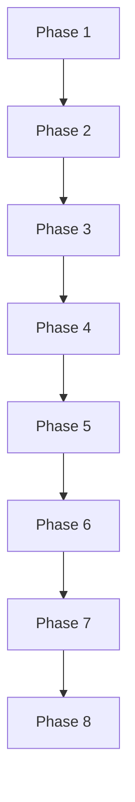

# Codex Agent 実行ログ

開始日時: 2025/12/27 22:47:32

---

## Turn 1: スレッド開始

**Thread ID**: `[REDACTED_TOKEN]`

## Turn 2: ツール実行

**種別**: reasoning
**ステータス**: completed

## Turn 3: ツール実行

**種別**: コマンド実行
**コマンド**: `/bin/bash -lc pwd`
**ステータス**: completed (exit_code=0)

```text
/tmp/ai-workflow-repos-11-00b73f07/[REDACTED_TOKEN]
```

## Turn 4: ツール実行

**種別**: reasoning
**ステータス**: completed

## Turn 5: ツール実行

**種別**: コマンド実行
**コマンド**: `/bin/bash -lc 'cat .ai-workflow/issue-544/00_planning/output/planning.md'`
**ステータス**: completed (exit_code=0)

```text
# プロジェクト計画書 - Issue #544

## 1. Issue分析
- 複雑度: 中程度（Pulumi/CloudWatch Agent設定の拡張とテンプレート化で複数ファイルに跨るが新規サブシステム追加なし）
- 見積もり工数: 14~16時間（CPUメトリクス追加・共通化対応4~6h、Pulumi生成テンプレート調整3~4h、検証/テスト4h、ドキュメント/レポート2h）
- リスク評価: 中（ARM/x86間の設定差分やメトリクス粒度不足による可観測性欠落のリスク）

## 2. 実装戦略判断
- 実装戦略: EXTEND（既存CloudWatch Agent設定にCPUメトリクスを追加し、テンプレート化で設定差異を吸収する拡張が中心）
- テスト戦略: INTEGRATION_ONLY（CloudWatch Agent設定の構文検証、Pulumi生成結果の差分確認、AMIビルドパイプラインでのTranslator実行など外部連携検証が中心）
- テストコード戦略: EXTEND_TEST（既存AMIビルド/CI検証ステップにCPUメトリクス検証を追加し、Translator検証コマンドを拡張する方針）

## 3. 影響範囲分析
- 既存コードへの影響: `pulumi/jenkins-agent-ami/component-x86.yml`, `pulumi/jenkins-agent-ami/component-arm.yml`、共通テンプレート生成ロジック（YAMLアンカー/共通ブロック）
- 依存関係の変更: 追加依存なし（CloudWatch Agentプラグインの既存CPUメトリクス利用）
- マイグレーション要否: CloudWatch Agent設定ファイルの更新のみ。データストアやスキーマ変更なし

## 4. タスク分割
### Phase 1: 要件定義 (見積もり: 2h)
- [x] Task 1-1: CPUメトリクス要件精査 (1h)
  - 収集対象メトリクス（active/user/system/iowait）と収集間隔60秒を確認
  - [REDACTED_TOKEN]を[REDACTED_TOKEN]単一に固定する要件の確定
- [x] Task 1-2: 対象範囲と除外条件の明確化 (1h)
  - ARM/x86双方の対象確認
  - CloudWatch料金影響の範囲と許容値を合意

### Phase 2: 設計 (見積もり: 3h)
- [x] Task 2-1: 共通テンプレート設計 (2h)
  - CPU/メモリメトリクス共通ブロックの定義方式（YAMLアンカー/Here-doc等）を決定
  - ARM/x86生成パイプラインへの適用方針を策定
- [x] Task 2-2: 検証手順設計 (1h)
  - `[REDACTED_TOKEN]`利用手順をARM/x86両方で定義
  - Pulumi preview/plan での差分確認項目を明文化
### Phase 3: テストシナリオ (見積もり: 2h)
- [x] Task 3-1: 検証ケース作成 (2h)
  - CPUメトリクスが[REDACTED_TOKEN]単一ディメンションで出力されることを確認する手順
  - ARM/x86の生成ファイル差分がないことを確認する比較手順

### Phase 4: 実装 (見積もり: 4h)
- [ ] Task 4-1: CPUメトリクス追加とテンプレート化 (3h)
  - 共通ブロックにcpu_usage_active/user/system/iowaitを追加
  - ARM/x86コンポーネントへの適用と重複除去
- [ ] Task 4-2: Pulumi生成ロジック/スクリプト更新 (1h)
  - テンプレート利用部の整合性確認
  - 必要に応じた変数化やコメント整備

### Phase 5: テストコード実装 (見積もり: 2h)
- [ ] Task 5-1: Translator検証ステップ拡張 (2h)
  - AMIビルド/CIスクリプトにTranslator実行を追加（ARM/x86両方）
  - 失敗時に詳細を出力するロギングを追加

### Phase 6: テスト実行 (見積もり: 1.5h)
- [ ] Task 6-1: 自動検証実行 (1h)
  - Translatorによる設定構文チェック（ARM/x86）
  - Pulumi previewで設定差分確認
- [ ] Task 6-2: 手動スポット確認 (0.5h)
  - 生成されたCloudWatch Agent JSON/YAMLのCPUメトリクス有無を目視確認

### Phase 7: ドキュメント (見積もり: 1h)
- [ ] Task 7-1: 設定変更の記録 (1h)
  - `CLAUDE.md`や関連READMEに検証手順/メトリクス追加の変更点を追記
  - 運用手順（ダッシュボード/アラーム初期値）を共有メモに記載

### Phase 8: レポート (見積もり: 0.5h)
- [ ] Task 8-1: リリースノート/振り返り (0.5h)
  - 変更概要、テスト結果、残課題をまとめて共有

## 5. 依存関係（Mermaid）


## 6. リスクと軽減策
- リスク1: ARM/x86設定差分が再発し片方にメトリクスがない
  - 影響度: 中 / 確率: 中
  - 軽減策: テンプレート化＋Translator検証を両アーキで必須化し、CIで差分比較を実施
- リスク2: CloudWatchメトリクスコスト増加
  - 影響度: 低 / 確率: 中
  - 軽減策: 60秒間隔維持・ディメンション単一化でデータポイント抑制し、初月に請求確認
- リスク3: Pulumi生成物と実機設定の乖離
  - 影響度: 中 / 確率: 低
  - 軽減策: Pulumi previewで差分確認し、AMIビルド時の生成物をアーティファクトとして保存

## 7. 品質ゲート
- Phase 1: 要件定義
  - [ ] CPUメトリクス項目と収集間隔/ディメンションが明文化されている
  - [ ] 対象アーキテクチャと料金影響が合意されている
- Phase 2: 設計
  - [ ] 実装戦略/テスト戦略/テストコード戦略が明記されている
  - [ ] 共通テンプレート設計と検証手順がレビュー済み
- Phase 3: テストシナリオ
  - [ ] CPUメトリクスのディメンション確認手順が定義されている
  - [ ] ARM/x86差分検出シナリオが用意されている
- Phase 4: 実装
  - [ ] ARM/x86双方に同一メトリクスが適用されている
  - [ ] テンプレート化で重複が除去されている
- Phase 5: テストコード実装
  - [ ] Translator検証がCI/ビルドステップに組み込まれている
  - [ ] 失敗時のログ出力が確認できる
- Phase 6: テスト実行
  - [ ] TranslatorとPulumi previewが成功し、差分が期待通り
  - [ ] 手動確認でCPUメトリクスが出力されている
- Phase 7: ドキュメント
  - [ ] README/CLAUDE等に変更点と検証手順が追記されている
  - [ ] 運用向けダッシュボード/アラーム初期値が記載されている
- Phase 8: レポート
  - [ ] リリースノートに変更概要とテスト結果が記載されている
  - [ ] 残課題と次アクションが整理されている
```

## Turn 6: ツール実行

**種別**: reasoning
**ステータス**: completed

## Turn 7: ツール実行

**種別**: コマンド実行
**コマンド**: `/bin/bash -lc 'cat .ai-workflow/issue-544/04_implementation/output/implementation.md'`
**ステータス**: completed (exit_code=0)

```text
# 実装完了レポート

## 変更ファイル一覧

| ファイル | 変更種別 | 概要 |
|---------|---------|------|
| `pulumi/jenkins-agent-ami/templates/cloudwatch-agent-config.json` | 新規 | CPU/メモリを共通で収集しASGディメンションを付与するCloudWatch Agent設定テンプレートを追加 |
| `pulumi/jenkins-agent-ami/component-arm.yml` | 修正 | テンプレート埋め込みによるCloudWatch Agent設定とTranslator検証ステップを追加 |
| `pulumi/jenkins-agent-ami/component-x86.yml` | 修正 | ARMと同一のテンプレート置換とTranslator検証を追加 |
| `pulumi/jenkins-agent-ami/index.ts` | 修正 | CloudWatch Agentテンプレートを読み込みコンポーネントYAMLへインライン展開する処理を追加 |

## 主要な変更点
- CloudWatch Agent設定をテンプレート化し、CPUメトリクス（active/user/system/iowait）と60秒間隔、ASG単一ディメンションを共通定義。
- component-arm/x86の設定生成をテンプレートプレースホルダー置換方式に変更し、内容差分を排除。
- CloudWatch Agent Translator実行ステップを両コンポーネントに追加し、構文検証失敗時にビルドを停止するように強化。
- Pulumiスクリプトでテンプレートのインデントを保持したままYAMLへ注入するユーティリティを実装し、今後の設定追加を単一箇所で完結。

## テスト実施状況
- ビルド: 未実行（Phase 4ではテスト未実施）
- リント: 未実行（Phase 4ではテスト未実施）
- 基本動作確認: 未実行（設定実装のみのため）
```

## Turn 8: ツール実行

**種別**: reasoning
**ステータス**: completed

## Turn 9: ツール実行

**種別**: コマンド実行
**コマンド**: `/bin/bash -lc 'cat .ai-workflow/issue-544/02_design/output/design.md'`
**ステータス**: completed (exit_code=0)

```text
# 詳細設計書 - Issue #544 CloudWatch Agent CPUメトリクス追加

## アーキテクチャ設計
- **全体像**: Pulumi(TypeScript)でEC2 Image Builderコンポーネント(YAML)を生成 → x86/ARM別のレシピを作成 → Jenkins Agent ASGの起動時に組み込み → CloudWatch AgentがCPU/メモリメトリクスを収集し`[REDACTED_TOKEN]`単一ディメンションで60秒送信 → CloudWatchダッシュボード/アラームがASG単位の傾向を可視化。
- **コンポーネント関係**: Pulumi `index.ts`が共通CloudWatch Agent設定テンプレート(JSON)を読み込んで各`component-*.yml`へ埋め込み、Image BuilderがAMI生成時に適用。生成AMIを使用するJenkins Agent ASGからCloudWatchへメトリクスが流れ、運用ドキュメントでダッシュボード/アラーム初期値を参照。
- **データフロー(抜粋)**: テンプレートJSON → Pulumiで整形・インライン化 → Image Builder buildフェーズで`amazon-cloudwatch-agent.json`を書き込み → Translatorで構文検証 → CloudWatch Agentサービス起動 → CloudWatch(CWAgent名前空間)へ送信 → ダッシュボード/アラーム参照。

## 実装戦略: EXTEND

**判断根拠**:
- 既存の`component-arm.yml`/`component-x86.yml`にCPUメトリクス追加と共通化処理を挿入する拡張が中心で、新規サブシステムは不要。
- Pulumi `index.ts`の読み込みロジックを共通テンプレート対応に拡張し、既存AMIビルド/検証フローを活かすため。

## テスト戦略: INTEGRATION_ONLY

**判断根拠**:
- CloudWatch Agent設定は外部バイナリと連携するため、Translator実行やImage Builder出力検証など統合動作確認が主眼となり、単体テストの粒度では効果が薄い。
- Pulumi previewやTranslatorによる構文検証で設定の妥当性をエンドツーエンドに確認できるため、統合テスト重視とする。

## テストコード戦略: EXTEND_TEST

**判断根拠**:
- 既存のImage Builderコンポーネント内の検証ステップにTranslator実行とメトリクス確認を追加することで、追加テストを既存フローに組み込める。
- 新規フレームワーク導入より、既存のCI/AMIビルド検証を拡張する方がコストと整合性に優れる。

## 影響範囲分析
- **既存コード**: `pulumi/jenkins-agent-ami/component-arm.yml` / `component-x86.yml` のCloudWatch Agent設定書き込み・検証ステップ、`pulumi/jenkins-agent-ami/index.ts`のコンポーネント読み込み処理。
- **依存関係**: AWS CloudWatch Agent既存インストール手順、Image BuilderのYAML仕様。追加ライブラリやサービス依存はなし。
- **マイグレーション**: AMI再作成とASGローリングで新設定を適用。データストアやIAM変更は不要。

## 変更・追加ファイルリスト
- **新規作成**:
  - `pulumi/jenkins-agent-ami/templates/cloudwatch-agent-config.json`: CPU/メモリ共通メトリクス定義テンプレート。
- **既存修正**:
  - `pulumi/jenkins-agent-ami/component-arm.yml`: CloudWatch Agent設定生成をテンプレート埋め込み化、CPUメトリクス追加、Translator検証ステップ追加。
  - `pulumi/jenkins-agent-ami/component-x86.yml`: 同上。
  - `pulumi/jenkins-agent-ami/index.ts`: テンプレート読み込み・インライン展開、共通ブロック挿入ロジック追加。
- **削除**: なし。

## 詳細設計
### CloudWatch Agent設定テンプレート
- 形式: JSONファイル。`metrics_collected`に`cpu`と`mem`を定義し、`[REDACTED_TOKEN]: 60`を維持。
- CPUメジャーメント: `cpu_usage_active`, `cpu_usage_user`, `cpu_usage_system`, `cpu_usage_iowait`（必要に応じ`cpu_usage_idle`などデフォルト出力も許容）。
- 共通ディメンション: `append_dimensions`で`${aws:[REDACTED_TOKEN]}`を付与し、`[REDACTED_TOKEN]`は`["[REDACTED_TOKEN]"]`のみ。
- テンプレートはPulumiで読み込み、インデント調整後に各`component-*.yml`のheredocへ埋め込むため、文字列表現をそのまま利用できる構造にする。

### コンポーネント生成・共通化
- `component-arm.yml` / `component-x86.yml`でCloudWatch Agent設定を書き込むコマンドをプレースホルダ化（例: `__CWAGENT_CONFIG__`）し、Pulumi側でテンプレート文字列へ置換する方式に変更。アーキ固有の差分は従来通り各ファイルが保持し、メトリクス部分のみ共通化。
- CloudWatch Agentインストール後の検証ステップにTranslatorを追加し、設定ファイルを入力として構文検証・エラー出力を実行する。失敗時はコンポーネント実行を中断し、ログを標準出力へ表示。
- 既存の`cat`出力確認も維持し、Translator結果と合わせてデバッグ容易性を確保。

### Pulumi連携 (`index.ts`)
- 新規テンプレートファイルを`fs.readFileSync`で読み込み、共通整形関数でheredocに適したインデントへ変換。
- `component-*.yml`読み込み時に`replace("__CWAGENT_CONFIG__", renderedConfig)`を実行してデータ文字列を完成させ、Image Builderコンポーネントに渡す。
- 今後メトリクスを追加する際はテンプレートのみ変更すれば両アーキへ反映されるようにする。

### 構文検証・差分確認
- **Translator**: CloudWatch Agent設定ファイルに対し`/opt/aws/amazon-cloudwatch-agent/bin/[REDACTED_TOKEN] -input /opt/aws/amazon-cloudwatch-agent/etc/amazon-cloudwatch-agent.json -format json -output /tmp/cwagent.translated.json`を各アーキで実行。失敗時は標準エラーをログに残しステップ失敗とする。
- **差分確認**: テンプレート単一化に加え、CIで`component-arm.yml`と`component-x86.yml`のCloudWatch設定ブロックが一致することを簡易比較するスクリプト（例: `grep`+`diff`）を既存パイプラインに組み込む。Pulumi previewで追加リソース/ディメンションがないことを確認するチェックリストをdocsに追記。

### モニタリング運用
- ダッシュボード/アラーム初期値: CPU使用率80%超をN分継続でアラーム、[REDACTED_TOKEN]別ウィジェットを追加する手順を運用ドキュメントへ記述（調整可能値として記載）。
- CWAgent名前空間の新CPUメトリクスを利用し、メモリと並列で表示するレイアウトを推奨。

### トレーサビリティ（要件対応）
- FR-1/AC-1: テンプレートにCPUメトリクスと60秒間隔、ASG単一ディメンションを定義。
- FR-2/AC-2: Pulumiでテンプレートを両コンポーネントに共通挿入し、CI差分チェックで一致を保証。
- FR-3/AC-3: コンポーネント内にTranslator実行ステップを追加し、失敗時にビルド失敗＋エラーログ出力。
- FR-4/AC-4: Pulumi previewチェックリストとコンポーネント差分比較スクリプトでメトリクスセットの整合を検証。
- FR-5/AC-5: 運用ドキュメントにCPU高負荷アラーム/ダッシュボード案を記載。

## セキュリティ考慮事項
- 収集ディメンションは`AutoScal
... (truncated)
```

## Turn 10: ツール実行

**種別**: reasoning
**ステータス**: completed

## Turn 11: ツール実行

**種別**: コマンド実行
**コマンド**: `/bin/bash -lc 'cat pulumi/jenkins-agent-ami/templates/cloudwatch-agent-config.json'`
**ステータス**: completed (exit_code=0)

```text
{
  "metrics": {
    "namespace": "CWAgent",
    "metrics_collected": {
      "cpu": {
        "resources": [
          "*"
        ],
        "measurement": [
          {"name": "cpu_usage_active"},
          {"name": "cpu_usage_user"},
          {"name": "cpu_usage_system"},
          {"name": "cpu_usage_iowait"}
        ],
        "[REDACTED_TOKEN]": 60
      },
      "mem": {
        "measurement": [
          {"name": "mem_used_percent"},
          {"name": "mem_used"},
          {"name": "mem_available"}
        ],
        "[REDACTED_TOKEN]": 60
      }
    },
    "append_dimensions": {
      "[REDACTED_TOKEN]": "${aws:[REDACTED_TOKEN]}"
    },
    "[REDACTED_TOKEN]": [
      ["[REDACTED_TOKEN]"]
    ]
  }
}
```

## Turn 12: ツール実行

**種別**: reasoning
**ステータス**: completed

## Turn 13: ツール実行

**種別**: コマンド実行
**コマンド**: `/bin/bash -lc "sed -n '1,200p' pulumi/jenkins-agent-ami/component-arm.yml"`
**ステータス**: completed (exit_code=0)

```text
name: [REDACTED_TOKEN]
description: Install and configure Jenkins Agent dependencies for ARM64
schemaVersion: 1.0

phases:
  - name: build
    steps:
      - name: ExpandEBSVolume
        action: ExecuteBash
        inputs:
          commands:
            - echo "Expanding EBS volume to use full capacity..."
            - |
              # ルートデバイスの情報を取得
              ROOT_DEVICE=$(df / | tail -1 | awk '{print $1}')
              echo "Root device: $ROOT_DEVICE"
              
              # デバイス名からパーティション番号を取得
              if [[ "$ROOT_DEVICE" =~ nvme ]]; then
                  DEVICE_NAME=$(echo "$ROOT_DEVICE" | sed 's/p[0-9]*$//')
                  PARTITION_NUM=$(echo "$ROOT_DEVICE" | grep -o '[0-9]*$')
              else
                  DEVICE_NAME=$(echo "$ROOT_DEVICE" | sed 's/[0-9]*$//')
                  PARTITION_NUM=$(echo "$ROOT_DEVICE" | grep -o '[0-9]*$')
              fi
              
              # [REDACTED_TOKEN]のインストール
              dnf install -y [REDACTED_TOKEN] || yum install -y [REDACTED_TOKEN]
              
              # パーティションの拡張
              growpart "$DEVICE_NAME" "$PARTITION_NUM" || echo "Partition might already be expanded"
              
              # ファイルシステムの拡張
              FS_TYPE=$(blkid -o value -s TYPE "$ROOT_DEVICE")
              if [[ "$FS_TYPE" =~ ext[234] ]]; then
                  resize2fs "$ROOT_DEVICE"
              elif [[ "$FS_TYPE" == "xfs" ]]; then
                  xfs_growfs -d /
              fi
              
              echo "Disk usage after expansion:"
              df -h /

      - name: UpdateSystem
        action: ExecuteBash
        inputs:
          commands:
            - echo "Starting Jenkins Agent setup for ARM64"
            - dnf update -y

      - name: [REDACTED_TOKEN]
        action: ExecuteBash
        inputs:
          commands:
            - dnf install -y git jq wget tar gzip unzip which
            - dnf install -y amazon-ssm-agent

      - name: InstallDocker
        action: ExecuteBash
        inputs:
          commands:
            - dnf install -y docker
            - systemctl enable docker
            - groupadd -f docker
            - chmod 666 /var/run/docker.sock || true

      - name: InstallJava
        action: ExecuteBash
        inputs:
          commands:
            - dnf install -y [REDACTED_TOKEN]
            - java -version

      - name: InstallBuildTools
        action: ExecuteBash
        inputs:
          commands:
            - dnf install -y gcc gcc-c++ make
            - dnf install -y python3 python3-pip
            - pip3 install --upgrade pip
            - pip3 install awscli

      - name: InstallNodeJS
        action: ExecuteBash
        inputs:
          commands:
            - curl -sL https://rpm.nodesource.com/setup_20.x | bash -
            - dnf install -y nodejs
            - node --version
            - npm --version
            - npm install -g npm@latest
            - npm install -g typescript
            - npm install -g ts-node

      - name: InstallPulumi
        action: ExecuteBash
        inputs:
          commands:
            - echo "Installing Pulumi..."
            - curl -fsSL https://get.pulumi.com | sh
            - echo "Finding pulumi binary..."
            - find / -name pulumi -type f 2>/dev/null | head -1 || true
            - |
              # Pulumiバイナリと言語プラグインをシステム全体で利用可能にする
              if [ -d "/.pulumi/bin" ]; then
                cp -r /.pulumi/bin/* /usr/local/bin/ || echo "Failed to copy from /.pulumi/bin"
              elif [ -d "/root/.pulumi/bin" ]; then
                cp -r /root/.pulumi/bin/* /usr/local/bin/ || echo "Failed to copy from /root/.pulumi/bin"
              elif [ -d "/home/ec2-user/.pulumi/bin" ]; then
                cp -r /home/ec2-user/.pulumi/bin/* /usr/local/bin/ || echo "Failed to copy from /home/ec2-user/.pulumi/bin"
              fi
            - chmod 755 /usr/local/bin/pulumi* || true
            - /usr/local/bin/p
... (truncated)
```

## Turn 14: ツール実行

**種別**: reasoning
**ステータス**: completed

## Turn 15: ツール実行

**種別**: コマンド実行
**コマンド**: `/bin/bash -lc 'rg -n "__CWAGENT_CONFIG__" -n pulumi/jenkins-agent-ami -n'`
**ステータス**: failed (exit_code=-1)

```text
execution error: Io(Os { code: 2, kind: NotFound, message: "No such file or directory" })
```

## Turn 16: ツール実行

**種別**: reasoning
**ステータス**: completed

## Turn 17: ツール実行

**種別**: コマンド実行
**コマンド**: `/bin/bash -lc 'rg -n "__CWAGENT_CONFIG__" -n pulumi/jenkins-agent-ami'`
**ステータス**: failed (exit_code=127)

```text
/bin/bash: line 1: rg: command not found
```

## Turn 18: ツール実行

**種別**: reasoning
**ステータス**: completed

## Turn 19: ツール実行

**種別**: コマンド実行
**コマンド**: `/bin/bash -lc 'grep -R -n "__CWAGENT_CONFIG__" pulumi/jenkins-agent-ami'`
**ステータス**: completed (exit_code=0)

```text
pulumi/jenkins-agent-ami/component-arm.yml:152:              __CWAGENT_CONFIG__
pulumi/jenkins-agent-ami/component-x86.yml:152:              __CWAGENT_CONFIG__
pulumi/jenkins-agent-ami/index.ts:16:    const placeholderRegex = /^(\s*)__CWAGENT_CONFIG__/m;
pulumi/jenkins-agent-ami/index.ts:27:    return componentYaml.replace("__CWAGENT_CONFIG__", renderedConfig);
```

## Turn 20: ツール実行

**種別**: reasoning
**ステータス**: completed

## Turn 21: ツール実行

**種別**: コマンド実行
**コマンド**: `/bin/bash -lc "sed -n '120,220p' pulumi/jenkins-agent-ami/component-x86.yml"`
**ステータス**: completed (exit_code=0)

```text
- name: InstallAnsible
        action: ExecuteBash
        inputs:
          commands:
            - echo "Installing Ansible..."
            - pip3 install ansible ansible-core
            - ansible --version

      - name: InstallMitogen
        action: ExecuteBash
        inputs:
          commands:
            - echo "Installing Mitogen for Ansible..."
            - pip3 install mitogen
            - python3 -c "import ansible_mitogen" && echo "Mitogen installed successfully"

      - name: [REDACTED_TOKEN]
        action: ExecuteBash
        inputs:
          commands:
            - echo "Installing CloudWatch Agent..."
            - dnf install -y amazon-cloudwatch-agent
            - rpm -q amazon-cloudwatch-agent

      - name: [REDACTED_TOKEN]
        action: ExecuteBash
        inputs:
          commands:
            - echo "Configuring CloudWatch Agent..."
            - mkdir -p /opt/aws/amazon-cloudwatch-agent/etc
            - |
              cat > /opt/aws/amazon-cloudwatch-agent/etc/amazon-cloudwatch-agent.json << 'EOF'
              __CWAGENT_CONFIG__
              EOF
            - cat /opt/aws/amazon-cloudwatch-agent/etc/amazon-cloudwatch-agent.json

      - name: [REDACTED_TOKEN]
        action: ExecuteBash
        inputs:
          commands:
            - echo "Validating CloudWatch Agent configuration with Translator..."
            - |
              set -e
              CONFIG_PATH="/opt/aws/amazon-cloudwatch-agent/etc/amazon-cloudwatch-agent.json"
              TRANSLATOR="/opt/aws/amazon-cloudwatch-agent/bin/[REDACTED_TOKEN]"
              OUTPUT_PATH="/tmp/cwagent.translated.json"
              if [ ! -x "$TRANSLATOR" ]; then
                echo "ERROR: Translator not found at $TRANSLATOR"
                exit 1
              fi
              "$TRANSLATOR" -input "$CONFIG_PATH" -format json -output "$OUTPUT_PATH"
            - cat /tmp/cwagent.translated.json

      - name: [REDACTED_TOKEN]
        action: ExecuteBash
        inputs:
          commands:
            - echo "Enabling CloudWatch Agent service..."
            - systemctl enable amazon-cloudwatch-agent
            - echo "CloudWatch Agent will start automatically on instance boot"

      - name: PullDockerImages
        action: ExecuteBash
        inputs:
          commands:
            - echo "===== Docker Image Pre-pulling for faster job startup ====="
            - echo "Starting Docker daemon..."
            - systemctl start docker
            - sleep 5
            - 'systemctl is-active docker || (echo "ERROR: Docker daemon is not running" && exit 1)'
            - echo "Docker daemon is running. Starting image pull..."
            - echo "Pulling Python images..."
            - 'docker pull python:3.11-slim || echo "WARNING: Failed to pull python:3.11-slim"'
            - echo "Pulling Node.js images..."
            - 'docker pull node:18-slim || echo "WARNING: Failed to pull node:18-slim"'
            - 'docker pull node:20-slim || echo "WARNING: Failed to pull node:20-slim"'
            - echo "Pulling Rust images..."
            - 'docker pull rust:1.76-slim || echo "WARNING: Failed to pull rust:1.76-slim"'
            - 'docker pull rust:slim || echo "WARNING: Failed to pull rust:slim"'
            - echo "Pulling AWS CLI image..."
            - 'docker pull amazon/aws-cli:latest || echo "WARNING: Failed to pull amazon/aws-cli:latest"'
            - echo "Pulling Pulumi image..."
            - 'docker pull pulumi/pulumi:latest || echo "WARNING: Failed to pull pulumi/pulumi:latest"'
            - echo "Pulling Ubuntu image..."
            - 'docker pull ubuntu:22.04 || echo "WARNING: Failed to pull ubuntu:22.04"'
            - echo "Pulling Python + Node.js combined image..."
            - 'docker pull nikolaik/python-nodejs:python3.11-nodejs20 || echo "WARNING: Failed to pull nikolaik/python-nodejs:python3.11-nodejs20"'
            - echo "===== Verifying pulled images ===
... (truncated)
```

## Turn 22: ツール実行

**種別**: reasoning
**ステータス**: completed

## Turn 23: ツール実行

**種別**: コマンド実行
**コマンド**: `/bin/bash -lc 'cat pulumi/jenkins-agent-ami/index.ts'`
**ステータス**: completed (exit_code=0)

```text
/**
 * pulumi/jenkins-agent-ami/index.ts
 * 
 * Jenkins Agent用のカスタムAMIをEC2 Image Builderで作成するPulumiスクリプト
 * 起動時間を短縮するため、必要なソフトウェアを事前インストール
 */
import * as pulumi from "@pulumi/pulumi";
import * as aws from "@pulumi/aws";
import * as fs from "fs";
import * as path from "path";

const [REDACTED_TOKEN] = path.join(__dirname, "templates", "cloudwatch-agent-config.json");
const [REDACTED_TOKEN] = fs.readFileSync([REDACTED_TOKEN], "utf8");

const [REDACTED_TOKEN] = (componentYaml: string): string => {
    const placeholderRegex = /^(\s*)__CWAGENT_CONFIG__/m;
    const match = componentYaml.match(placeholderRegex);
    if (!match) {
        return componentYaml;
    }
    const indent = match[1];
    const renderedConfig = [REDACTED_TOKEN]
        .trim()
        .split("\n")
        .map((line) => `${indent}${line}`)
        .join("\n");
    return componentYaml.replace("__CWAGENT_CONFIG__", renderedConfig);
};

// 環境名をスタック名から取得
const environment = pulumi.getStack();
const ssmPrefix = `/jenkins-infra/${environment}`;

// SSMパラメータから設定を取得
const projectNameParam = aws.ssm.getParameter({
    name: `${ssmPrefix}/config/project-name`,
});

// 設定値を変数に設定
const projectName = pulumi.output(projectNameParam).apply(p => p.value);

// バージョン管理（自動インクリメント）
// Image Builderは X.Y.Z 形式のセマンティックバージョンのみ受け付ける
// 各セグメントは整数で、通常は 0-999999 の範囲を推奨
const now = new Date();

// 日付をマイナーバージョンに（YYMMDD形式）
const year = String(now.getFullYear()).slice(-2); // 年の下2桁
const month = String(now.getMonth() + 1).padStart(2, '0');
const day = String(now.getDate()).padStart(2, '0');
const dateStr = `${year}${month}${day}`; // 例: 250809

// 時刻を0-86399の範囲の数値に変換（1日の秒数）
// これにより、パッチバージョンが有効な範囲内に収まる
const hours = now.getHours();
const minutes = now.getMinutes();
const seconds = now.getSeconds();
const secondsOfDay = hours * 3600 + minutes * 60 + seconds; // 0-86399

// バージョンフォーマット: 1.YYMMDD.秒数 (X.Y.Z形式)
// 例: 1.250809.41809 (11:30:09の場合)
const config = new pulumi.Config();
const componentVersion = config.get("componentVersion") || `1.${dateStr}.${secondsOfDay}`;
const recipeVersion = config.get("recipeVersion") || `1.${dateStr}.${secondsOfDay}`;

// バージョン情報をログ出力
console.log(`[INFO] Component Version: ${componentVersion}`);
console.log(`[INFO] Recipe Version: ${recipeVersion}`);

// ネットワークリソースのSSMパラメータを取得
const vpcIdParam = aws.ssm.getParameter({
    name: `${ssmPrefix}/network/vpc-id`,
});
const [REDACTED_TOKEN] = aws.ssm.getParameter({
    name: `${ssmPrefix}/network/public-subnet-a-id`,
});
const [REDACTED_TOKEN] = aws.ssm.getParameter({
    name: `${ssmPrefix}/network/public-subnet-b-id`,
});

// セキュリティグループのSSMパラメータを取得
const [REDACTED_TOKEN] = aws.ssm.getParameter({
    name: `${ssmPrefix}/security/jenkins-agent-sg-id`,
});

// リソースIDを取得
const vpcId = pulumi.output(vpcIdParam).apply(p => p.value);
const publicSubnetAId = pulumi.output([REDACTED_TOKEN]).apply(p => p.value);
const publicSubnetBId = pulumi.output([REDACTED_TOKEN]).apply(p => p.value);
const publicSubnetIds = [publicSubnetAId, publicSubnetBId];
const [REDACTED_TOKEN] = pulumi.output([REDACTED_TOKEN]).apply(p => p.value);

// IAMロール（EC2 Image Builder用）
const imageBuilderRole = new aws.iam.Role(`imagebuilder-role`, {
    assumeRolePolicy: JSON.stringify({
        Version: "2012-10-17",
        Statement: [{
            Action: "sts:AssumeRole",
            Effect: "Allow",
            Principal: {
                Service: "ec2.amazonaws.com",
            },
        }],
    }),
    tags: {
        Name: pulumi.interpolate`${projectName}-imagebuilder-role-${environment}`,
        Environment: environment,
    },
});

// 必要なポリシーをアタッチ
const [REDACTED_TOKEN] = new aws.iam.[REDACTED_TOKEN](`[REDACTED_TOKEN]`, {
    role: imageBuilderRole.name,
    policyArn: "arn:aws:iam::aws:policy/EC2InstanceProfileForImageBuilder",
});

const ssmManagedPolicy = new aws.iam.[REDACTED_TOKEN](`[REDACTED_TOKEN]
... (truncated)
```

## Turn 24: ツール実行

**種別**: reasoning
**ステータス**: completed

## Turn 25: ツール実行

**種別**: reasoning
**ステータス**: completed

## Turn 26: ツール実行

**種別**: file_change
**ステータス**: completed

## Turn 27: ツール実行

**種別**: reasoning
**ステータス**: completed

## Turn 28: ツール実行

**種別**: reasoning
**ステータス**: completed

## Turn 29: ツール実行

**種別**: reasoning
**ステータス**: completed

## Turn 30: ツール実行

**種別**: コマンド実行
**コマンド**: `/bin/bash -lc 'nl -ba pulumi/jenkins-agent-ami/templates/cloudwatch-agent-config.json'`
**ステータス**: completed (exit_code=0)

```text
1	{
     2	  "metrics": {
     3	    "namespace": "CWAgent",
     4	    "metrics_collected": {
     5	      "cpu": {
     6	        "resources": [
     7	          "*"
     8	        ],
     9	        "measurement": [
    10	          {"name": "cpu_usage_active"},
    11	          {"name": "cpu_usage_user"},
    12	          {"name": "cpu_usage_system"},
    13	          {"name": "cpu_usage_iowait"}
    14	        ],
    15	        "[REDACTED_TOKEN]": 60
    16	      },
    17	      "mem": {
    18	        "measurement": [
    19	          {"name": "mem_used_percent"},
    20	          {"name": "mem_used"},
    21	          {"name": "mem_available"}
    22	        ],
    23	        "[REDACTED_TOKEN]": 60
    24	      }
    25	    },
    26	    "append_dimensions": {
    27	      "[REDACTED_TOKEN]": "${aws:[REDACTED_TOKEN]}"
    28	    },
    29	    "[REDACTED_TOKEN]": [
    30	      ["[REDACTED_TOKEN]"]
    31	    ]
    32	  }
    33	}
```

## Turn 31: ツール実行

**種別**: reasoning
**ステータス**: completed

## Turn 32: ツール実行

**種別**: コマンド実行
**コマンド**: `/bin/bash -lc "nl -ba pulumi/jenkins-agent-ami/component-arm.yml | sed -n '120,200p'"`
**ステータス**: completed (exit_code=0)

```text
120	      - name: InstallAnsible
   121	        action: ExecuteBash
   122	        inputs:
   123	          commands:
   124	            - echo "Installing Ansible..."
   125	            - pip3 install ansible ansible-core
   126	            - ansible --version
   127	
   128	      - name: InstallMitogen
   129	        action: ExecuteBash
   130	        inputs:
   131	          commands:
   132	            - echo "Installing Mitogen for Ansible..."
   133	            - pip3 install mitogen
   134	            - python3 -c "import ansible_mitogen" && echo "Mitogen installed successfully"
   135	
   136	      - name: [REDACTED_TOKEN]
   137	        action: ExecuteBash
   138	        inputs:
   139	          commands:
   140	            - echo "Installing CloudWatch Agent..."
   141	            - dnf install -y amazon-cloudwatch-agent
   142	            - rpm -q amazon-cloudwatch-agent
   143	
   144	      - name: [REDACTED_TOKEN]
   145	        action: ExecuteBash
   146	        inputs:
   147	          commands:
   148	            - echo "Configuring CloudWatch Agent..."
   149	            - mkdir -p /opt/aws/amazon-cloudwatch-agent/etc
   150	            - |
   151	              cat > /opt/aws/amazon-cloudwatch-agent/etc/amazon-cloudwatch-agent.json << 'EOF'
   152	              __CWAGENT_CONFIG__
   153	              EOF
   154	            - cat /opt/aws/amazon-cloudwatch-agent/etc/amazon-cloudwatch-agent.json
   155	
   156	      - name: [REDACTED_TOKEN]
   157	        action: ExecuteBash
   158	        inputs:
   159	          commands:
   160	            - echo "Validating CloudWatch Agent configuration with Translator..."
   161	            - |
   162	              set -e
   163	              CONFIG_PATH="/opt/aws/amazon-cloudwatch-agent/etc/amazon-cloudwatch-agent.json"
   164	              TRANSLATOR="/opt/aws/amazon-cloudwatch-agent/bin/[REDACTED_TOKEN]"
   165	              OUTPUT_PATH="/tmp/cwagent.translated.json"
   166	              if [ ! -x "$TRANSLATOR" ]; then
   167	                echo "ERROR: Translator not found at $TRANSLATOR"
   168	                exit 1
   169	              fi
   170	              "$TRANSLATOR" -input "$CONFIG_PATH" -format json -output "$OUTPUT_PATH"
   171	            - cat /tmp/cwagent.translated.json
   172	
   173	      - name: [REDACTED_TOKEN]
   174	        action: ExecuteBash
   175	        inputs:
   176	          commands:
   177	            - echo "Enabling CloudWatch Agent service..."
   178	            - systemctl enable amazon-cloudwatch-agent
   179	            - echo "CloudWatch Agent will start automatically on instance boot"
   180	
   181	      - name: PullDockerImages
   182	        action: ExecuteBash
   183	        inputs:
   184	          commands:
   185	            - echo "===== Docker Image Pre-pulling for faster job startup ====="
   186	            - echo "Starting Docker daemon..."
   187	            - systemctl start docker
   188	            - sleep 5
   189	            - 'systemctl is-active docker || (echo "ERROR: Docker daemon is not running" && exit 1)'
   190	            - echo "Docker daemon is running. Starting image pull..."
   191	            - echo "Pulling Python images..."
   192	            - 'docker pull python:3.11-slim || echo "WARNING: Failed to pull python:3.11-slim"'
   193	            - echo "Pulling Node.js images..."
   194	            - 'docker pull node:18-slim || echo "WARNING: Failed to pull node:18-slim"'
   195	            - 'docker pull node:20-slim || echo "WARNING: Failed to pull node:20-slim"'
   196	            - echo "Pulling Rust images..."
   197	            - 'docker pull rust:1.76-slim || echo "WARNING: Failed to pull rust:1.76-slim"'
   198	            - 'docker pull rust:slim || echo "WARNING: Failed to pull rust:slim"'
   199	            - echo "Pulling AWS CLI image..."
   200	            - 'docker pull amazon/aws-cli:latest || echo "WARNING: Failed to pull a
... (truncated)
```

## Turn 33: ツール実行

**種別**: reasoning
**ステータス**: completed

## Turn 34: ツール実行

**種別**: コマンド実行
**コマンド**: `/bin/bash -lc "nl -ba pulumi/jenkins-agent-ami/index.ts | sed -n '1,120p'"`
**ステータス**: completed (exit_code=0)

```text
1	/**
     2	 * pulumi/jenkins-agent-ami/index.ts
     3	 * 
     4	 * Jenkins Agent用のカスタムAMIをEC2 Image Builderで作成するPulumiスクリプト
     5	 * 起動時間を短縮するため、必要なソフトウェアを事前インストール
     6	 */
     7	import * as pulumi from "@pulumi/pulumi";
     8	import * as aws from "@pulumi/aws";
     9	import * as fs from "fs";
    10	import * as path from "path";
    11	
    12	const [REDACTED_TOKEN] = path.join(__dirname, "templates", "cloudwatch-agent-config.json");
    13	const [REDACTED_TOKEN] = fs.readFileSync([REDACTED_TOKEN], "utf8");
    14	
    15	const [REDACTED_TOKEN] = (componentYaml: string): string => {
    16	    const placeholderRegex = /^(\s*)__CWAGENT_CONFIG__/m;
    17	    const match = componentYaml.match(placeholderRegex);
    18	    if (!match) {
    19	        return componentYaml;
    20	    }
    21	    const indent = match[1];
    22	    const renderedConfig = [REDACTED_TOKEN]
    23	        .trim()
    24	        .split("\n")
    25	        .map((line) => `${indent}${line}`)
    26	        .join("\n");
    27	    return componentYaml.replace("__CWAGENT_CONFIG__", renderedConfig);
    28	};
    29	
    30	// 環境名をスタック名から取得
    31	const environment = pulumi.getStack();
    32	const ssmPrefix = `/jenkins-infra/${environment}`;
    33	
    34	// SSMパラメータから設定を取得
    35	const projectNameParam = aws.ssm.getParameter({
    36	    name: `${ssmPrefix}/config/project-name`,
    37	});
    38	
    39	// 設定値を変数に設定
    40	const projectName = pulumi.output(projectNameParam).apply(p => p.value);
    41	
    42	// バージョン管理（自動インクリメント）
    43	// Image Builderは X.Y.Z 形式のセマンティックバージョンのみ受け付ける
    44	// 各セグメントは整数で、通常は 0-999999 の範囲を推奨
    45	const now = new Date();
    46	
    47	// 日付をマイナーバージョンに（YYMMDD形式）
    48	const year = String(now.getFullYear()).slice(-2); // 年の下2桁
    49	const month = String(now.getMonth() + 1).padStart(2, '0');
    50	const day = String(now.getDate()).padStart(2, '0');
    51	const dateStr = `${year}${month}${day}`; // 例: 250809
    52	
    53	// 時刻を0-86399の範囲の数値に変換（1日の秒数）
    54	// これにより、パッチバージョンが有効な範囲内に収まる
    55	const hours = now.getHours();
    56	const minutes = now.getMinutes();
    57	const seconds = now.getSeconds();
    58	const secondsOfDay = hours * 3600 + minutes * 60 + seconds; // 0-86399
    59	
    60	// バージョンフォーマット: 1.YYMMDD.秒数 (X.Y.Z形式)
    61	// 例: 1.250809.41809 (11:30:09の場合)
    62	const config = new pulumi.Config();
    63	const componentVersion = config.get("componentVersion") || `1.${dateStr}.${secondsOfDay}`;
    64	const recipeVersion = config.get("recipeVersion") || `1.${dateStr}.${secondsOfDay}`;
    65	
    66	// バージョン情報をログ出力
    67	console.log(`[INFO] Component Version: ${componentVersion}`);
    68	console.log(`[INFO] Recipe Version: ${recipeVersion}`);
    69	
    70	// ネットワークリソースのSSMパラメータを取得
    71	const vpcIdParam = aws.ssm.getParameter({
    72	    name: `${ssmPrefix}/network/vpc-id`,
    73	});
    74	const [REDACTED_TOKEN] = aws.ssm.getParameter({
    75	    name: `${ssmPrefix}/network/public-subnet-a-id`,
    76	});
    77	const [REDACTED_TOKEN] = aws.ssm.getParameter({
    78	    name: `${ssmPrefix}/network/public-subnet-b-id`,
    79	});
    80	
    81	// セキュリティグループのSSMパラメータを取得
    82	const [REDACTED_TOKEN] = aws.ssm.getParameter({
    83	    name: `${ssmPrefix}/security/jenkins-agent-sg-id`,
    84	});
    85	
    86	// リソースIDを取得
    87	const vpcId = pulumi.output(vpcIdParam).apply(p => p.value);
    88	const publicSubnetAId = pulumi.output([REDACTED_TOKEN]).apply(p => p.value);
    89	const publicSubnetBId = pulumi.output([REDACTED_TOKEN]).apply(p => p.value);
    90	const publicSubnetIds = [publicSubnetAId, publicSubnetBId];
    91	const [REDACTED_TOKEN] = pulumi.output([REDACTED_TOKEN]).apply(p => p.value);
    92	
    93	// IAMロール（EC2 Image Builder用）
    94	const imageBuilderRole = new aws.iam.Role(`imagebuilder-role`, {
    95	    assumeRolePolicy: JSON.stringify({
    96
... (truncated)
```

## Turn 35: ツール実行

**種別**: reasoning
**ステータス**: completed

## Turn 36: ツール実行

**種別**: コマンド実行
**コマンド**: `/bin/bash -lc "nl -ba pulumi/jenkins-agent-ami/index.ts | sed -n '200,320p'"`
**ステータス**: completed (exit_code=0)

```text
200	        Name: pulumi.interpolate`${projectName}-agent-recipe-x86-${environment}`,
   201	        Environment: environment,
   202	        Architecture: "x86_64",
   203	    },
   204	}, {
   205	    // バージョンやコンポーネントが変更される場合は、レシピを置き換える
   206	    replaceOnChanges: ["version", "components[0].componentArn"],
   207	});
   208	
   209	// Image Recipe（ARM64）
   210	const [REDACTED_TOKEN] = new aws.imagebuilder.ImageRecipe(`agent-recipe-arm`, {
   211	    name: pulumi.interpolate`${projectName}-agent-recipe-arm-${environment}`,
   212	    version: recipeVersion,
   213	    description: "Jenkins Agent AMI recipe for ARM64",
   214	    parentImage: amiArm.then(ami => ami.id),
   215	    components: [{
   216	        componentArn: [REDACTED_TOKEN].arn,
   217	    }],
   218	    blockDeviceMappings: [{
   219	        deviceName: "/dev/xvda",
   220	        ebs: {
   221	            volumeSize: 30,
   222	            volumeType: "gp3",
   223	            deleteOnTermination: "true",
   224	            encrypted: "true",
   225	        },
   226	    }],
   227	    tags: {
   228	        Name: pulumi.interpolate`${projectName}-agent-recipe-arm-${environment}`,
   229	        Environment: environment,
   230	        Architecture: "arm64",
   231	    },
   232	}, {
   233	    // バージョンやコンポーネントが変更される場合は、レシピを置き換える
   234	    replaceOnChanges: ["version", "components[0].componentArn"],
   235	});
   236	
   237	// Infrastructure Configuration（x86_64）
   238	const infraConfigX86 = new aws.imagebuilder.[REDACTED_TOKEN](`agent-infra-x86`, {
   239	    name: pulumi.interpolate`${projectName}-agent-infra-x86-${environment}`,
   240	    description: "Infrastructure configuration for Jenkins Agent x86_64",
   241	    instanceProfileName: [REDACTED_TOKEN].name,
   242	    instanceTypes: ["t3.medium"],
   243	    subnetId: publicSubnetAId,
   244	    securityGroupIds: [[REDACTED_TOKEN]],
   245	    [REDACTED_TOKEN]: true,
   246	    tags: {
   247	        Name: pulumi.interpolate`${projectName}-agent-infra-x86-${environment}`,
   248	        Environment: environment,
   249	        Architecture: "x86_64",
   250	    },
   251	});
   252	
   253	// Infrastructure Configuration（ARM64）
   254	const infraConfigArm = new aws.imagebuilder.[REDACTED_TOKEN](`agent-infra-arm`, {
   255	    name: pulumi.interpolate`${projectName}-agent-infra-arm-${environment}`,
   256	    description: "Infrastructure configuration for Jenkins Agent ARM64",
   257	    instanceProfileName: [REDACTED_TOKEN].name,
   258	    instanceTypes: ["t4g.medium"],
   259	    subnetId: publicSubnetAId,
   260	    securityGroupIds: [[REDACTED_TOKEN]],
   261	    [REDACTED_TOKEN]: true,
   262	    tags: {
   263	        Name: pulumi.interpolate`${projectName}-agent-infra-arm-${environment}`,
   264	        Environment: environment,
   265	        Architecture: "arm64",
   266	    },
   267	});
   268	
   269	// Distribution Configuration（x86_64）
   270	const distConfigX86 = new aws.imagebuilder.[REDACTED_TOKEN](`agent-dist-x86`, {
   271	    name: pulumi.interpolate`${projectName}-agent-dist-x86-${environment}`,
   272	    description: "Distribution configuration for Jenkins Agent x86_64",
   273	    distributions: [{
   274	        region: aws.getRegion().then(r => r.name),
   275	        [REDACTED_TOKEN]: {
   276	            name: pulumi.interpolate`${projectName}-agent-x86-${environment}-{{imagebuilder:buildDate}}`,
   277	            description: "Jenkins Agent AMI for x86_64",
   278	            amiTags: {
   279	                Name: pulumi.interpolate`${projectName}-agent-x86-${environment}`,
   280	                Environment: environment,
   281	                Architecture: "x86_64",
   282	                BuildDate: "{{imagebuilder:buildDate}}",
   283	                BuildVersion: "{{imagebuilder:buildVersion}}",
   284	            },
   285	        },
   286
... (truncated)
```

## Turn 37: ツール実行

**種別**: reasoning
**ステータス**: completed

## Turn 38: ツール実行

**種別**: コマンド実行
**コマンド**: `/bin/bash -lc 'rg -n "componentX86Yaml" -n pulumi/jenkins-agent-ami/index.ts'`
**ステータス**: failed (exit_code=127)

```text
/bin/bash: line 1: rg: command not found
```

## Turn 39: ツール実行

**種別**: reasoning
**ステータス**: completed

## Turn 40: ツール実行

**種別**: コマンド実行
**コマンド**: `/bin/bash -lc 'grep -n "componentX86Yaml" -n pulumi/jenkins-agent-ami/index.ts'`
**ステータス**: completed (exit_code=0)

```text
131:const componentX86Yaml = [REDACTED_TOKEN](fs.readFileSync(path.join(__dirname, "component-x86.yml"), "utf8"));
140:    data: componentX86Yaml,
```

## Turn 41: ツール実行

**種別**: reasoning
**ステータス**: completed

## Turn 42: ツール実行

**種別**: コマンド実行
**コマンド**: `/bin/bash -lc "nl -ba pulumi/jenkins-agent-ami/index.ts | sed -n '120,160p'"`
**ステータス**: completed (exit_code=0)

```text
120	});
   121	
   122	// インスタンスプロファイル
   123	const [REDACTED_TOKEN] = new aws.iam.InstanceProfile(`[REDACTED_TOKEN]`, {
   124	    role: imageBuilderRole.name,
   125	    tags: {
   126	        Environment: environment,
   127	    },
   128	});
   129	
   130	// コンポーネント定義YAMLファイルを読み込み
   131	const componentX86Yaml = [REDACTED_TOKEN](fs.readFileSync(path.join(__dirname, "component-x86.yml"), "utf8"));
   132	const componentArmYaml = [REDACTED_TOKEN](fs.readFileSync(path.join(__dirname, "component-arm.yml"), "utf8"));
   133	
   134	// Jenkins Agent用コンポーネント（x86_64）
   135	const [REDACTED_TOKEN] = new aws.imagebuilder.Component(`agent-component-x86`, {
   136	    name: pulumi.interpolate`${projectName}-agent-component-x86-${environment}`,
   137	    platform: "Linux",
   138	    version: componentVersion,
   139	    description: "Jenkins Agent setup component for x86_64",
   140	    data: componentX86Yaml,
   141	    tags: {
   142	        Name: pulumi.interpolate`${projectName}-agent-component-x86-${environment}`,
   143	        Environment: environment,
   144	        Architecture: "x86_64",
   145	    },
   146	});
   147	
   148	// Jenkins Agent用コンポーネント（ARM64）
   149	const [REDACTED_TOKEN] = new aws.imagebuilder.Component(`agent-component-arm`, {
   150	    name: pulumi.interpolate`${projectName}-agent-component-arm-${environment}`,
   151	    platform: "Linux",
   152	    version: componentVersion,
   153	    description: "Jenkins Agent setup component for ARM64",
   154	    data: componentArmYaml,
   155	    tags: {
   156	        Name: pulumi.interpolate`${projectName}-agent-component-arm-${environment}`,
   157	        Environment: environment,
   158	        Architecture: "arm64",
   159	    },
   160	});
```

## Turn 43: ツール実行

**種別**: reasoning
**ステータス**: completed

## Turn 44: ツール実行

**種別**: コマンド実行
**コマンド**: `/bin/bash -lc 'nl -ba .ai-workflow/issue-544/04_implementation/output/implementation.md'`
**ステータス**: completed (exit_code=0)

```text
1	# 実装完了レポート
     2	
     3	## 変更ファイル一覧
     4	
     5	| ファイル | 変更種別 | 概要 |
     6	|---------|---------|------|
     7	| `pulumi/jenkins-agent-ami/templates/cloudwatch-agent-config.json` | 新規 | CPU/メモリを共通で収集しASGディメンションを付与するCloudWatch Agent設定テンプレートを追加 |
     8	| `pulumi/jenkins-agent-ami/component-arm.yml` | 修正 | テンプレート埋め込みによるCloudWatch Agent設定とTranslator検証ステップを追加 |
     9	| `pulumi/jenkins-agent-ami/component-x86.yml` | 修正 | ARMと同一のテンプレート置換とTranslator検証を追加 |
    10	| `pulumi/jenkins-agent-ami/index.ts` | 修正 | CloudWatch Agentテンプレートを読み込みコンポーネントYAMLへインライン展開する処理を追加 |
    11	
    12	## 主要な変更点
    13	- CloudWatch Agent設定をテンプレート化し、CPUメトリクス（active/user/system/iowait）と60秒間隔、ASG単一ディメンションを共通定義。
    14	- component-arm/x86の設定生成をテンプレートプレースホルダー置換方式に変更し、内容差分を排除。
    15	- CloudWatch Agent Translator実行ステップを両コンポーネントに追加し、構文検証失敗時にビルドを停止するように強化。
    16	- Pulumiスクリプトでテンプレートのインデントを保持したままYAMLへ注入するユーティリティを実装し、今後の設定追加を単一箇所で完結。
    17	
    18	## テスト実施状況
    19	- ビルド: 未実行（Phase 4ではテスト未実施）
    20	- リント: 未実行（Phase 4ではテスト未実施）
    21	- 基本動作確認: 未実行（設定実装のみのため）
```

## Turn 45: ツール実行

**種別**: reasoning
**ステータス**: completed

## Turn 46: ツール実行

**種別**: agent_message
**ステータス**: completed

## Turn 47: ツール実行

**種別**: todo_list
**ステータス**: completed

## Turn 48: 実行完了

**ステータス**: completed
**所要時間**: 134931ms
**ターン数**: N/A

---

**経過時間**: 134931ms
**開始**: 2025-12-27T22:47:32.539Z
**終了**: 2025-12-27T22:49:47.470Z