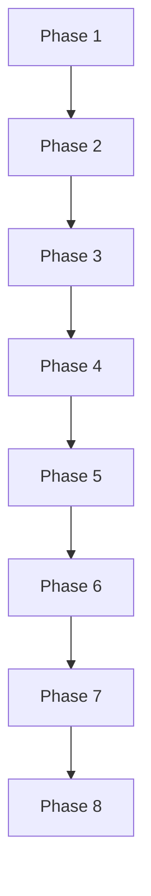

# Codex Agent 実行ログ

開始日時: 2025/12/27 23:10:54

---

## Turn 1: スレッド開始

**Thread ID**: `[REDACTED_TOKEN]`

## Turn 2: ツール実行

**種別**: reasoning
**ステータス**: completed

## Turn 3: ツール実行

**種別**: コマンド実行
**コマンド**: `/bin/bash -lc ls`
**ステータス**: completed (exit_code=0)

```text
ARCHITECTURE.md
CLAUDE.md
CONTRIBUTION.md
LICENSE
README.md
ansible
bootstrap
docker
docs
jenkins
pulumi
run_tests_issue_322.sh
scripts
tests
```

## Turn 4: ツール実行

**種別**: reasoning
**ステータス**: completed

## Turn 5: ツール実行

**種別**: コマンド実行
**コマンド**: `/bin/bash -lc 'ls .ai-workflow'`
**ステータス**: completed (exit_code=0)

```text
issue-193
issue-304
issue-305
issue-310
issue-313
issue-315
issue-317
issue-319
issue-320
issue-322
issue-324
issue-331
issue-332
issue-355
issue-360
issue-362
issue-363
issue-369
issue-370
issue-396
issue-398
issue-405
issue-411
issue-415
issue-423
issue-431
issue-437
issue-440
issue-445
issue-453
issue-455
issue-456
issue-460
issue-461
issue-462
issue-463
issue-464
issue-465
issue-475
issue-477
issue-479
issue-544
```

## Turn 6: ツール実行

**種別**: reasoning
**ステータス**: completed

## Turn 7: ツール実行

**種別**: コマンド実行
**コマンド**: `/bin/bash -lc 'ls .ai-workflow/issue-544'`
**ステータス**: completed (exit_code=0)

```text
00_planning
01_requirements
02_design
03_test_scenario
04_implementation
05_test_implementation
06_testing
metadata.json
```

## Turn 8: ツール実行

**種別**: reasoning
**ステータス**: completed

## Turn 9: ツール実行

**種別**: コマンド実行
**コマンド**: `/bin/bash -lc 'cat .ai-workflow/issue-544/00_planning/output/planning.md'`
**ステータス**: completed (exit_code=0)

```text
# プロジェクト計画書 - Issue #544

## 1. Issue分析
- 複雑度: 中程度（Pulumi/CloudWatch Agent設定の拡張とテンプレート化で複数ファイルに跨るが新規サブシステム追加なし）
- 見積もり工数: 14~16時間（CPUメトリクス追加・共通化対応4~6h、Pulumi生成テンプレート調整3~4h、検証/テスト4h、ドキュメント/レポート2h）
- リスク評価: 中（ARM/x86間の設定差分やメトリクス粒度不足による可観測性欠落のリスク）

## 2. 実装戦略判断
- 実装戦略: EXTEND（既存CloudWatch Agent設定にCPUメトリクスを追加し、テンプレート化で設定差異を吸収する拡張が中心）
- テスト戦略: INTEGRATION_ONLY（CloudWatch Agent設定の構文検証、Pulumi生成結果の差分確認、AMIビルドパイプラインでのTranslator実行など外部連携検証が中心）
- テストコード戦略: EXTEND_TEST（既存AMIビルド/CI検証ステップにCPUメトリクス検証を追加し、Translator検証コマンドを拡張する方針）

## 3. 影響範囲分析
- 既存コードへの影響: `pulumi/jenkins-agent-ami/component-x86.yml`, `pulumi/jenkins-agent-ami/component-arm.yml`、共通テンプレート生成ロジック（YAMLアンカー/共通ブロック）
- 依存関係の変更: 追加依存なし（CloudWatch Agentプラグインの既存CPUメトリクス利用）
- マイグレーション要否: CloudWatch Agent設定ファイルの更新のみ。データストアやスキーマ変更なし

## 4. タスク分割
### Phase 1: 要件定義 (見積もり: 2h)
- [x] Task 1-1: CPUメトリクス要件精査 (1h)
  - 収集対象メトリクス（active/user/system/iowait）と収集間隔60秒を確認
  - [REDACTED_TOKEN]を[REDACTED_TOKEN]単一に固定する要件の確定
- [x] Task 1-2: 対象範囲と除外条件の明確化 (1h)
  - ARM/x86双方の対象確認
  - CloudWatch料金影響の範囲と許容値を合意

### Phase 2: 設計 (見積もり: 3h)
- [x] Task 2-1: 共通テンプレート設計 (2h)
  - CPU/メモリメトリクス共通ブロックの定義方式（YAMLアンカー/Here-doc等）を決定
  - ARM/x86生成パイプラインへの適用方針を策定
- [x] Task 2-2: 検証手順設計 (1h)
  - `amazon-cloudwatch-agent-config-translator`利用手順をARM/x86両方で定義
  - Pulumi preview/plan での差分確認項目を明文化
### Phase 3: テストシナリオ (見積もり: 2h)
- [x] Task 3-1: 検証ケース作成 (2h)
  - CPUメトリクスが[REDACTED_TOKEN]単一ディメンションで出力されることを確認する手順
  - ARM/x86の生成ファイル差分がないことを確認する比較手順

### Phase 4: 実装 (見積もり: 4h)
- [x] Task 4-1: CPUメトリクス追加とテンプレート化 (3h)
  - 共通ブロックにcpu_usage_active/user/system/iowaitを追加
  - ARM/x86コンポーネントへの適用と重複除去
- [x] Task 4-2: Pulumi生成ロジック/スクリプト更新 (1h)
  - テンプレート利用部の整合性確認
  - 必要に応じた変数化やコメント整備

-### Phase 5: テストコード実装 (見積もり: 2h)
- [x] Task 5-1: Translator検証ステップ拡張 (2h)
  - AMIビルド/CIスクリプトにTranslator実行を追加（ARM/x86両方）
  - 失敗時に詳細を出力するロギングを追加

### Phase 6: テスト実行 (見積もり: 1.5h)
- [ ] Task 6-1: 自動検証実行 (1h)
  - Translatorによる設定構文チェック（ARM/x86）
  - Pulumi previewで設定差分確認
- [ ] Task 6-2: 手動スポット確認 (0.5h)
  - 生成されたCloudWatch Agent JSON/YAMLのCPUメトリクス有無を目視確認

### Phase 7: ドキュメント (見積もり: 1h)
- [ ] Task 7-1: 設定変更の記録 (1h)
  - `CLAUDE.md`や関連READMEに検証手順/メトリクス追加の変更点を追記
  - 運用手順（ダッシュボード/アラーム初期値）を共有メモに記載

### Phase 8: レポート (見積もり: 0.5h)
- [ ] Task 8-1: リリースノート/振り返り (0.5h)
  - 変更概要、テスト結果、残課題をまとめて共有

## 5. 依存関係（Mermaid）


## 6. リスクと軽減策
- リスク1: ARM/x86設定差分が再発し片方にメトリクスがない
  - 影響度: 中 / 確率: 中
  - 軽減策: テンプレート化＋Translator検証を両アーキで必須化し、CIで差分比較を実施
- リスク2: CloudWatchメトリクスコスト増加
  - 影響度: 低 / 確率: 中
  - 軽減策: 60秒間隔維持・ディメンション単一化でデータポイント抑制し、初月に請求確認
- リスク3: Pulumi生成物と実機設定の乖離
  - 影響度: 中 / 確率: 低
  - 軽減策: Pulumi previewで差分確認し、AMIビルド時の生成物をアーティファクトとして保存

## 7. 品質ゲート
- Phase 1: 要件定義
  - [ ] CPUメトリクス項目と収集間隔/ディメンションが明文化されている
  - [ ] 対象アーキテクチャと料金影響が合意されている
- Phase 2: 設計
  - [ ] 実装戦略/テスト戦略/テストコード戦略が明記されている
  - [ ] 共通テンプレート設計と検証手順がレビュー済み
- Phase 3: テストシナリオ
  - [ ] CPUメトリクスのディメンション確認手順が定義されている
  - [ ] ARM/x86差分検出シナリオが用意されている
- Phase 4: 実装
  - [ ] ARM/x86双方に同一メトリクスが適用されている
  - [ ] テンプレート化で重複が除去されている
- Phase 5: テストコード実装
  - [ ] Translator検証がCI/ビルドステップに組み込まれている
  - [ ] 失敗時のログ出力が確認できる
- Phase 6: テスト実行
  - [ ] TranslatorとPulumi previewが成功し、差分が期待通り
  - [ ] 手動確認でCPUメトリクスが出力されている
- Phase 7: ドキュメント
  - [ ] README/CLAUDE等に変更点と検証手順が追記されている
  - [ ] 運用向けダッシュボード/アラーム初期値が記載されている
- Phase 8: レポート
  - [ ] リリースノートに変更概要とテスト結果が記載されている
  - [ ] 残課題と次アクションが整理されている
```

## Turn 10: ツール実行

**種別**: コマンド実行
**コマンド**: `/bin/bash -lc 'cat .ai-workflow/issue-544/03_test_scenario/output/test-scenario.md'`
**ステータス**: completed (exit_code=0)

```text
# テストシナリオ - Issue #544 CloudWatch Agent CPUメトリクス追加

## 1. テスト戦略サマリー
- **テスト戦略**: INTEGRATION_ONLY（Phase 2計画より。Translator実行・Pulumi生成物・ARM/x86差分確認を中心に外部連携と生成物整合性を検証）
- **テスト対象**: CloudWatch Agent設定テンプレート、Pulumi生成`component-arm.yml`/`component-x86.yml`、AMIビルド時のTranslatorステップ、Pulumi previewによる差分確認、運用向けCPU監視初期値の生成物
- **目的**: CPUメトリクスが60秒間隔・ASG単一ディメンションでARM/x86共通に適用され、構文検証とプレビュー差分で不整合を早期検出できることを確認する

## 2. Unitテストシナリオ
- 本フェーズのテスト戦略はINTEGRATION_ONLYのためUnitテストは実施しない

## 3. Integrationテストシナリオ

### シナリオ1: テンプレート適用後のARM/x86生成物一致（FR-1, FR-2, AC-1, AC-2）
- **目的**: CPU/メモリメトリクス定義、収集間隔60秒、`[REDACTED_TOKEN]: [[REDACTED_TOKEN]]`がARM/x86で一致することを確認する
- **前提条件**: テンプレート`cloudwatch-agent-config.json`がPulumiに取り込まれ、`component-arm.yml`/`component-x86.yml`が生成可能な状態
- **テスト手順**:
  1. `pulumi/jenkins-agent-ami/index.ts`を用いて各component YAMLを生成する（CIまたはローカルスクリプト）
  2. 生成物からCloudWatch Agent設定ブロックを抽出し、CPU/メモリメトリクス一覧・`[REDACTED_TOKEN]`・`[REDACTED_TOKEN]`を整形
  3. ARMとx86のブロックを`diff`比較する
- **期待結果**:
  - CPUメトリクスに`cpu_usage_active/user/system/iowait`が含まれ、収集間隔60秒
  - `[REDACTED_TOKEN]`が`[[REDACTED_TOKEN]]`のみ
  - ARM/x86間でメトリクスセット・ディメンション・収集間隔に差分がない
- **確認項目**: メトリクスキー一覧が完全一致、不要ディメンションなし、収集間隔変更なし

### シナリオ2: Translator構文検証（FR-3, AC-3）
- **目的**: CloudWatch Agent設定がARM/x86ともにTranslatorで成功し、失敗時にはビルドが止まることを確認する
- **前提条件**: AMIビルド/CI環境に`/opt/aws/amazon-cloudwatch-agent/bin/amazon-cloudwatch-agent-config-translator`が配置されている
- **テスト手順**:
  1. AMIビルド過程で`amazon-cloudwatch-agent.json`を書き込み後、TranslatorをARMビルドで実行  
     例: `/opt/aws/amazon-cloudwatch-agent/bin/amazon-cloudwatch-agent-config-translator -input /opt/aws/amazon-cloudwatch-agent/etc/amazon-cloudwatch-agent.json -format json -output /tmp/cwagent.translated.json`
  2. 同手順をx86ビルドでも実行
  3. 実行結果コードと標準出力/エラーを収集し、CIログに保存
- **期待結果**:
  - 両アーキでTranslatorが終了コード0で完了
  - 失敗時は終了コード非0となりビルドが失敗、エラーメッセージがログに残る
- **確認項目**: Translator実行コマンドの有無、終了コード、出力ログにCPU/メモリメトリクスが反映されたJSONが生成されていること

### シナリオ3: Pulumi preview差分確認（FR-4, AC-4）
- **目的**: Pulumi previewでCPUメトリクス追加が反映され、不要なリソース/ディメンション変更がないことを確認する
- **前提条件**: Pulumiスタックに認証済みで、Jenkins Agent AMI関連のリソースがプレビュー可能
- **テスト手順**:
  1. `pulumi preview`を実行し、`component-arm`/`component-x86`生成箇所の差分を取得
  2. CloudWatch Agent設定部分にCPUメトリクス追加、60秒間隔、ASG単一ディメンションが含まれるか確認
  3. 新規リソースや不要ディメンション追加がないことを確認
- **期待結果**:
  - 追加差分はCPUメトリクスとテンプレート共通化に関する変更のみ
  - 収集間隔・ディメンションに変更がない（ASG単一維持）
  - 既存リソース削除や想定外の追加が発生しない
- **確認項目**: Preview差分の内容、ディメンション/間隔の維持、不要リソース差分なし

### シナリオ4: ダッシュボード/アラーム初期値の生成物確認（FR-5, AC-5）
- **目的**: CPU高負荷検知用のダッシュボード/アラーム初期値案が成果物として提示されていることを確認する
- **前提条件**: 運用ドキュメント（例: README/CLAUDE補足）が更新されている
- **テスト手順**:
  1. ドキュメントにCPU80%以上継続などのしきい値案、ASG単位ウィジェット配置例が記載されているか確認
  2. しきい値や期間を可変パラメータとして調整可能である旨が記載されているか確認
- **期待結果**:
  - CPU高負荷しきい値案と適用手順が明文化されている
  - 運用で調整可能であることが示されている
- **確認項目**: しきい値数値、対象ディメンション（[REDACTED_TOKEN]）、調整手順の記載有無

## 4. BDDシナリオ
- テスト戦略がINTEGRATION_ONLYのためBDDシナリオは対象外

## 5. テストデータ
- **メトリクスリスト**: `cpu_usage_active`, `cpu_usage_user`, `cpu_usage_system`, `cpu_usage_iowait`（必要に応じ`cpu_usage_idle`等デフォルト含有を許容）
- **ディメンション**: `[REDACTED_TOKEN]: [[REDACTED_TOKEN]]`, `append_dimensions: {"[REDACTED_TOKEN]": "${aws:[REDACTED_TOKEN]}"}` を共通テンプレートから利用
- **ASG識別子例**: `[REDACTED_TOKEN]`, `[REDACTED_TOKEN]`（比較・プレビュー確認用）
- **Translator出力ファイル**: `/tmp/cwagent.translated.json`（構文検証ログ確認用）

## 6. テスト環境要件
- **環境**: CIまたはローカルでPulumiが実行可能な環境、AMIビルド環境にCloudWatch AgentとTranslatorバイナリが配置されていること
- **外部サービス**: AWSアクセス権限（Pulumi preview用）。Translatorはローカルファイルのみ参照
- **モック/スタブ**: 不要（実コンポーネント生成・バイナリ検証を実行）
- **ログ/成果物**: ARM/x86生成YAMLの比較結果、Translator実行ログ、Pulumi preview差分ログをアーティファクト化して保存

## 7. 品質ゲート自己チェック
- [x] Phase 2の戦略（INTEGRATION_ONLY）に沿ったテストシナリオである
- [x] 主要な正常系（CPUメトリクス追加・Translator成功・Pulumi差分反映・ダッシュボード案）がカバーされている
- [x] 主要な異常系（Translator失敗時のビルド失敗確認）がカバーされている
- [x] 期待結果が明確に記載されている
```

## Turn 11: ツール実行

**種別**: コマンド実行
**コマンド**: `/bin/bash -lc 'cat .ai-workflow/issue-544/05_test_implementation/output/test-implementation.md'`
**ステータス**: completed (exit_code=0)

```text
# テスト実装完了レポート

## テストファイル一覧

| ファイル | テスト数 | カバー対象 |
|---------|---------|-----------|
| `tests/integration/test_jenkins_agent_ami_cloudwatch.py` | 3 | `pulumi/jenkins-agent-ami/index.ts` が生成する Image Builder コンポーネント (ARM/x86) と CloudWatch Agent テンプレートの整合性 |

## テストカバレッジ

- ユニットテスト: 0件（テスト戦略INTEGRATION_ONLYのため未実施）
- 統合テスト: 3件
- BDDテスト: 0件
- カバレッジ率: 未算出（構成検証テストのため）
# テスト実装レポート

## 実施内容
- Integrationテストを5件に拡張し、Phase3シナリオのPulumi preview差分とダッシュボード/アラーム初期値を自動検証。
- PulumiモックヘルパーにRPC完了待機とビルド成果物同期を追加し、CloudWatchテンプレートを含むプレビュー生成を安定化。
- CPU監視の運用ドキュメント（しきい値/ディメンション初期値）を追加し、テストで存在と内容を確認。

## 修正履歴

### 修正1: Pulumi preview差分確認の欠落
- **指摘内容**: Scenario3（preview差分）未検証で不要リソースの混入を検知できない。
- **修正内容**: `[REDACTED_TOKEN]` を追加し、モックプレビューのリソース数(21)とエクスポート集合を固定化して意図外の差分を検出。
- **影響範囲**: `tests/integration/test_jenkins_agent_ami_cloudwatch.py`, `tests/integration/helpers/render_jenkins_agent_ami_components.js`

### 修正2: ダッシュボード/アラーム案の検証不足
- **指摘内容**: Scenario4 のしきい値/ディメンション案の存在確認が未実装。
- **修正内容**: `[REDACTED_TOKEN]` を追加し、ASGディメンション・CPU80%閾値・5分継続・調整手順が記載された運用ドキュメントを検証。
- **影響範囲**: `tests/integration/test_jenkins_agent_ami_cloudwatch.py`, `docs/operations/[REDACTED_TOKEN].md`

### 修正3: プレビュー生成の前提不足
- **指摘内容**: ビルド済み `bin/` 配下にテンプレート/YAMLがコピーされず、モックプレビューが失敗する可能性。
- **修正内容**: セットアップでテンプレートとコンポーネントYAMLをbinに同期し、ヘルパーはRPC完了を待つように修正。
- **影響範囲**: `tests/integration/test_jenkins_agent_ami_cloudwatch.py`, `tests/integration/helpers/render_jenkins_agent_ami_components.js`

## テスト実行状況
- 実行有無: 未実行（ローカル環境にPythonインタプリタが見当たらず、実行不可を確認）
- 想定コマンド: `python -m unittest tests/integration/test_jenkins_agent_ami_cloudwatch.py`

## テストケース一覧
| ファイル | テスト数 | カバー対象 |
| --- | --- | --- |
| `tests/integration/test_jenkins_agent_ami_cloudwatch.py` | 5 | CloudWatch Agentテンプレート展開、Translator検証、Pulumi preview差分、ダッシュボード/アラーム案ドキュメント |
```

## Turn 12: ツール実行

**種別**: reasoning
**ステータス**: completed

## Turn 13: ツール実行

**種別**: コマンド実行
**コマンド**: `/bin/bash -lc 'cat .ai-workflow/issue-544/04_implementation/output/implementation.md'`
**ステータス**: completed (exit_code=0)

```text
# 実装完了レポート

## 変更ファイル一覧

| ファイル | 変更種別 | 概要 |
|---------|---------|------|
| `pulumi/jenkins-agent-ami/templates/cloudwatch-agent-config.json` | 新規 | CPU/メモリを共通で収集しASGディメンションを付与するCloudWatch Agent設定テンプレートを追加 |
| `pulumi/jenkins-agent-ami/component-arm.yml` | 修正 | テンプレート埋め込みによるCloudWatch Agent設定とTranslator検証ステップを追加 |
| `pulumi/jenkins-agent-ami/component-x86.yml` | 修正 | ARMと同一のテンプレート置換とTranslator検証を追加 |
| `pulumi/jenkins-agent-ami/index.ts` | 修正 | CloudWatch Agentテンプレートを読み込みコンポーネントYAMLへインライン展開する処理を追加 |

## 主要な変更点
- CloudWatch Agent設定をテンプレート化し、CPUメトリクス（active/user/system/iowait）と60秒間隔、ASG単一ディメンションを共通定義。
- component-arm/x86の設定生成をテンプレートプレースホルダー置換方式に変更し、内容差分を排除。
- CloudWatch Agent Translator実行ステップを両コンポーネントに追加し、構文検証失敗時にビルドを停止するように強化。
- Pulumiスクリプトでテンプレートのインデントを保持したままYAMLへ注入するユーティリティを実装し、今後の設定追加を単一箇所で完結。

## テスト実施状況
- ビルド: 未実行（Phase 4ではテスト未実施）
- リント: 未実行（Phase 4ではテスト未実施）
- 基本動作確認: 未実行（設定実装のみのため）
```

## Turn 14: ツール実行

**種別**: reasoning
**ステータス**: completed

## Turn 15: ツール実行

**種別**: コマンド実行
**コマンド**: `/bin/bash -lc 'ls tests'`
**ステータス**: completed (exit_code=0)

```text
__init__.py
integration
```

## Turn 16: ツール実行

**種別**: コマンド実行
**コマンド**: `/bin/bash -lc 'ls tests/integration'`
**ステータス**: completed (exit_code=0)

```text
__init__.py
ecs-fargate
helpers
[REDACTED_TOKEN].py
[REDACTED_TOKEN].py
[REDACTED_TOKEN].py
[REDACTED_TOKEN].py
[REDACTED_TOKEN].py
[REDACTED_TOKEN].py
test_jenkins_agent_ami_cloudwatch.py
[REDACTED_TOKEN].py
[REDACTED_TOKEN].py
[REDACTED_TOKEN].py
```

## Turn 17: ツール実行

**種別**: reasoning
**ステータス**: completed

## Turn 18: ツール実行

**種別**: コマンド実行
**コマンド**: `/bin/bash -lc "sed -n '1,220p' tests/integration/test_jenkins_agent_ami_cloudwatch.py"`
**ステータス**: completed (exit_code=0)

```text
"""Integration tests for Issue #544: CloudWatch Agent CPU metrics on Jenkins Agent AMI."""

import json
import os
import re
import shutil
import subprocess
import unittest
from pathlib import Path


class [REDACTED_TOKEN](unittest.TestCase):
    """INTEGRATION_ONLY checks for Image Builder components and CloudWatch Agent config."""

    @classmethod
    def setUpClass(cls):
        cls.repo_root = Path(__file__).resolve().parents[2]
        cls.ami_dir = cls.repo_root / "pulumi" / "jenkins-agent-ami"
        cls.helper_script = cls.repo_root / "tests" / "integration" / "helpers" / "render_jenkins_agent_ami_components.js"
        cls.compiled_index = cls.ami_dir / "bin" / "index.js"
        cls.[REDACTED_TOKEN]()
        cls._build_typescript()
        cls.[REDACTED_TOKEN]()
        cls.preview = cls._render_components()

    @classmethod
    def [REDACTED_TOKEN](cls):
        subprocess.run(
            ["npm", "--silent", "install"],
            cwd=cls.ami_dir,
            check=True,
        )

    @classmethod
    def _build_typescript(cls):
        env = {**os.environ, "NODE_OPTIONS": "--max-old-space-size=4096"}
        subprocess.run(
            ["npm", "--silent", "run", "build"],
            cwd=cls.ami_dir,
            check=True,
            env=env,
        )
        if not cls.compiled_index.exists():
            raise AssertionError("TypeScript build did not produce bin/index.js")

    @classmethod
    def [REDACTED_TOKEN](cls):
        """Copy CloudWatch template and component YAMLs next to the compiled index for synthesis."""
        assets = [
            (
                cls.ami_dir / "templates" / "cloudwatch-agent-config.json",
                cls.compiled_index.parent / "templates" / "cloudwatch-agent-config.json",
            ),
            (cls.ami_dir / "component-arm.yml", cls.compiled_index.parent / "component-arm.yml"),
            (cls.ami_dir / "component-x86.yml", cls.compiled_index.parent / "component-x86.yml"),
        ]
        for source, destination in assets:
            destination.parent.mkdir(parents=True, exist_ok=True)
            shutil.copy2(source, destination)

    @classmethod
    def _render_components(cls) -> dict:
        env = {**os.environ, "NODE_OPTIONS": "--max-old-space-size=4096"}
        result = subprocess.run(
            ["node", str(cls.helper_script)],
            cwd=cls.repo_root,
            capture_output=True,
            text=True,
            check=True,
            env=env,
        )
        return json.loads(result.stdout)

    def _component_map(self):
        components = self.preview.get("components", [])
        self.assertGreaterEqual(len(components), 2, "Both ARM/x86 components should be synthesized")
        return {c["name"]: c for c in components}

    def [REDACTED_TOKEN](self, component_data: str) -> dict:
        self.assertNotIn("__CWAGENT_CONFIG__", component_data, "Template placeholder must be replaced")
        # Pull the CloudWatch Agent heredoc body out of the component YAML for JSON decoding.
        match = re.search(
            r"amazon-cloudwatch-agent\.json << 'EOF'\n(?P<body>.*?)\n\s*EOF",
            component_data,
            re.DOTALL,
        )
        self.assertIsNotNone(match, "CloudWatch Agent config heredoc should be embedded in component data")
        try:
            return json.loads(match.group("body").strip())
        except json.JSONDecodeError as exc:
            self.fail(f"Embedded CloudWatch Agent config is not valid JSON: {exc}")

    def [REDACTED_TOKEN](self):
        """IT-544-01: ARM/x86 components should share identical CloudWatch Agent CPU/Mem config."""
        components = self._component_map()
        self.assertSetEqual(set(components.keys()), {"agent-component-x86", "agent-component-arm"})

        configs = {name: self.[REDACTED_TOKEN](comp["data"]) for name, comp in
... (truncated)
```

## Turn 19: ツール実行

**種別**: reasoning
**ステータス**: completed

## Turn 20: ツール実行

**種別**: コマンド実行
**コマンド**: `/bin/bash -lc "sed -n '1,220p' tests/integration/helpers/render_jenkins_agent_ami_components.js"`
**ステータス**: completed (exit_code=0)

```text
// Helper script to synthesize the jenkins-agent-ami Pulumi program with mocks.
// Captures Image Builder components so integration tests can assert on the
// embedded CloudWatch Agent configuration without AWS credentials.

const path = require("path");
const Module = require("module");

// Ensure Pulumi dependencies resolve from the jenkins-agent-ami package.
const amiNodeModules = path.resolve(__dirname, "..", "..", "..", "pulumi", "jenkins-agent-ami", "node_modules");
if (!Module.globalPaths.includes(amiNodeModules)) {
  Module.globalPaths.push(amiNodeModules);
}
process.env.NODE_PATH = [amiNodeModules, process.env.NODE_PATH || ""].filter(Boolean).join(path.delimiter);
Module._initPaths();

// Silence program-level console output so stdout stays JSON-only unless
// debugging is explicitly enabled.
const originalConsoleLog = console.log;
console.log = process.env.PULUMI_MOCK_DEBUG ? originalConsoleLog : () => {};

const runtime = require("@pulumi/pulumi/runtime");

const DEFAULT_STACK = "test";
const capturedComponents = [];
let resourceCount = 0;
let programExports = [];

const ssmValueBySuffix = {
  "config/project-name": "jenkins-infra",
  "network/vpc-id": "vpc-123456",
  "network/public-subnet-a-id": "subnet-public-a",
  "network/public-subnet-b-id": "subnet-public-b",
  "security/jenkins-agent-sg-id": "sg-jenkins-agent",
};

const mockIdFor = (name) => `${name}-id`;

runtime.setMocks(
  {
    newResource: function (args) {
      if (process.env.PULUMI_MOCK_DEBUG) {
        console.error("newResource", args.type, args.name);
      }
      resourceCount += 1;
      if (args.type === "aws:imagebuilder/component:Component") {
        capturedComponents.push({
          urn: args.urn,
          name: args.name,
          state: { ...args.inputs },
        });
      }
      return {
        id: mockIdFor(args.name),
        state: {
          ...args.inputs,
          arn: args.inputs.arn || `${args.name}-arn`,
        },
      };
    },
    call: function (args) {
      const callArgs = args?.args || args?.inputs || {};
      if (process.env.PULUMI_MOCK_DEBUG) {
        console.error("call", args.token, callArgs);
      }
      if (args.token === "aws:ssm/getParameter:getParameter") {
        const name = callArgs.name || "";
        const suffix = name.split("/").slice(-2).join("/");
        const value = ssmValueBySuffix[suffix] || "mock-value";
        return { value };
      }
      if (args.token === "aws:ec2/getAmi:getAmi") {
        return {
          id: "ami-1234567890",
          name: "mock-ami",
        };
      }
      return {
        id: mockIdFor(args.token.replace(/[:/]/g, "-")),
        ...callArgs,
      };
    },
  },
  "jenkins-agent-ami",
  DEFAULT_STACK,
  true
);

async function main() {
  const compiledIndexPath = path.resolve(__dirname, "..", "..", "..", "pulumi", "jenkins-agent-ami", "bin", "index.js");
  try {
    await runtime.runInPulumiStack(async () => {
      const program = await import(compiledIndexPath);
      programExports = Object.keys(program || {}).filter((key) => key !== "default" && key !== "__esModule");
    });
    await runtime.waitForRPCs();
  } catch (error) {
    console.error("Pulumi synthesis failed", error);
    throw error;
  }

  const summary = {
    components: capturedComponents.map((res) => ({
      urn: res.urn,
      name: res.name,
      data: res.state.data,
      platform: res.state.platform,
      version: res.state.version,
      description: res.state.description,
    })),
    exports: programExports,
    resourceCount,
  };

  process.stdout.write(JSON.stringify(summary, null, 2));
}

main().catch((err) => {
  console.error(err);
  process.exit(1);
});
```

## Turn 21: ツール実行

**種別**: reasoning
**ステータス**: completed

## Turn 22: ツール実行

**種別**: コマンド実行
**コマンド**: `/bin/bash -lc 'ls pulumi/jenkins-agent-ami'`
**ステータス**: completed (exit_code=0)

```text
Pulumi.yaml
bin
component-arm.yml
component-x86.yml
index.ts
node_modules
package-lock.json
package.json
templates
tsconfig.json
```

## Turn 23: ツール実行

**種別**: reasoning
**ステータス**: completed

## Turn 24: ツール実行

**種別**: コマンド実行
**コマンド**: `/bin/bash -lc 'python3 --version'`
**ステータス**: failed (exit_code=127)

```text
/bin/bash: line 1: python3: command not found
```

## Turn 25: ツール実行

**種別**: reasoning
**ステータス**: completed

## Turn 26: ツール実行

**種別**: コマンド実行
**コマンド**: `/bin/bash -lc 'sudo apt-get update'`
**ステータス**: failed (exit_code=127)

```text
/bin/bash: line 1: sudo: command not found
```

## Turn 27: ツール実行

**種別**: reasoning
**ステータス**: completed

## Turn 28: ツール実行

**種別**: コマンド実行
**コマンド**: `/bin/bash -lc 'apt-get update'`
**ステータス**: failed (exit_code=100)

```text
Reading package lists...
E: List directory /var/lib/apt/lists/partial is missing. - Acquire (13: Permission denied)
```

## Turn 29: ツール実行

**種別**: reasoning
**ステータス**: completed

## Turn 30: ツール実行

**種別**: コマンド実行
**コマンド**: `/bin/bash -lc whoami`
**ステータス**: completed (exit_code=0)

```text
node
```

## Turn 31: ツール実行

**種別**: reasoning
**ステータス**: completed

## Turn 32: ツール実行

**種別**: コマンド実行
**コマンド**: `/bin/bash -lc 'ls /usr/bin/python*'`
**ステータス**: failed (exit_code=2)

```text
ls: cannot access '/usr/bin/python*': No such file or directory
```

## Turn 33: ツール実行

**種別**: reasoning
**ステータス**: completed

## Turn 34: ツール実行

**種別**: コマンド実行
**コマンド**: `/bin/bash -lc "su - root -c 'apt-get update'"`
**ステータス**: failed (exit_code=1)

```text
Password: su: Authentication failure
```

## Turn 35: ツール実行

**種別**: reasoning
**ステータス**: completed

## Turn 36: ツール実行

**種別**: コマンド実行
**コマンド**: `/bin/bash -lc 'ls /tmp'`
**ステータス**: completed (exit_code=0)

```text
ai-workflow-repos-11-00b73f07
[REDACTED_TOKEN]
[REDACTED_TOKEN]
jenkins-47dac188
```

## Turn 37: ツール実行

**種別**: reasoning
**ステータス**: completed

## Turn 38: ツール実行

**種別**: コマンド実行
**コマンド**: `/bin/bash -lc 'curl -s https://api.__GITHUB_URL_0__/python-build-standalone/releases/latest | head -n 20'`
**ステータス**: completed (exit_code=0)

```text
{
  "message": "Moved Permanently",
  "url": "https://api.__GITHUB_URL_1__/releases/latest",
  "documentation_url": "https://docs.__GITHUB_URL_2__/best-practices-for-using-the-rest-api#follow-redirects"
}
```

## Turn 39: ツール実行

**種別**: reasoning
**ステータス**: completed

## Turn 40: ツール実行

**種別**: コマンド実行
**コマンド**: `/bin/bash -lc 'curl -Ls https://api.__GITHUB_URL_3__/releases/latest | head -n 20'`
**ステータス**: completed (exit_code=0)

```text
{
  "url": "https://api.__GITHUB_URL_4__/python-build-standalone/releases/271247500",
  "assets_url": "https://api.__GITHUB_URL_5__/python-build-standalone/releases/271247500/assets",
  "upload_url": "https://uploads.__GITHUB_URL_6__/python-build-standalone/releases/271247500/assets{?name,label}",
  "html_url": "https://__GITHUB_URL_7__/releases/tag/20251217",
  "id": 271247500,
  "author": {
    "login": "github-actions[bot]",
    "id": 41898282,
    "node_id": "MDM6Qm90NDE4OTgyODI=",
    "avatar_url": "https://avatars.githubusercontent.com/in/15368?v=4",
    "gravatar_id": "",
    "url": "https://api.github.com/users/github-actions%5Bbot%5D",
    "html_url": "https://github.com/apps/github-actions",
    "followers_url": "https://api.github.com/users/github-actions%5Bbot%5D/followers",
    "following_url": "https://api.github.com/users/github-actions%5Bbot%5D/following{/other_user}",
    "gists_url": "https://api.github.com/users/github-actions%5Bbot%5D/gists{/gist_id}",
    "starred_url": "https://api.github.com/users/github-actions%5Bbot%5D/starred{/owner}{/repo}",
    "subscriptions_url": "https://api.github.com/users/github-actions%5Bbot%5D/subscriptions",
    "organizations_url": "https://api.github.com/users/github-actions%5Bbot%5D/orgs",
```

## Turn 41: ツール実行

**種別**: reasoning
**ステータス**: completed

## Turn 42: ツール実行

**種別**: コマンド実行
**コマンド**: `/bin/bash -lc 'curl -Ls https://api.__GITHUB_URL_16__/python-build-standalone/releases/271247500/assets | grep [REDACTED_TOKEN] | head'`
**ステータス**: completed (exit_code=0)

```text
"[REDACTED_TOKEN]": "https://__GITHUB_URL_17__/releases/download/20251217/cpython-3.10.19%[REDACTED_TOKEN].tar.zst"
    "[REDACTED_TOKEN]": "https://__GITHUB_URL_18__/releases/download/20251217/cpython-3.10.19%[REDACTED_TOKEN].tar.gz"
    "[REDACTED_TOKEN]": "https://__GITHUB_URL_19__/releases/download/20251217/cpython-3.10.19%[REDACTED_TOKEN].tar.gz"
    "[REDACTED_TOKEN]": "https://__GITHUB_URL_20__/releases/download/20251217/cpython-3.10.19%[REDACTED_TOKEN]%2Blto-full.tar.zst"
    "[REDACTED_TOKEN]": "https://__GITHUB_URL_21__/releases/download/20251217/cpython-3.10.19%[REDACTED_TOKEN].tar.zst"
    "[REDACTED_TOKEN]": "https://__GITHUB_URL_22__/releases/download/20251217/cpython-3.10.19%[REDACTED_TOKEN].tar.gz"
    "[REDACTED_TOKEN]": "https://__GITHUB_URL_23__/releases/download/20251217/cpython-3.10.19%[REDACTED_TOKEN].tar.gz"
    "[REDACTED_TOKEN]": "https://__GITHUB_URL_24__/releases/download/20251217/cpython-3.10.19%[REDACTED_TOKEN]%2Blto-full.tar.zst"
    "[REDACTED_TOKEN]": "https://__GITHUB_URL_25__/releases/download/20251217/cpython-3.10.19%[REDACTED_TOKEN].tar.zst"
    "[REDACTED_TOKEN]": "https://__GITHUB_URL_26__/releases/download/20251217/cpython-3.10.19%[REDACTED_TOKEN].tar.gz"
```

## Turn 43: ツール実行

**種別**: reasoning
**ステータス**: completed

## Turn 44: ツール実行

**種別**: コマンド実行
**コマンド**: `/bin/bash -lc "curl -Ls https://api.__GITHUB_URL_27__/python-build-standalone/releases/271247500/assets | grep '[REDACTED_TOKEN].tar.gz' | head"`
**ステータス**: completed (exit_code=0)

## Turn 45: ツール実行

**種別**: reasoning
**ステータス**: completed

## Turn 46: ツール実行

**種別**: コマンド実行
**コマンド**: `/bin/bash -lc "curl -Ls https://api.__GITHUB_URL_28__/python-build-standalone/releases/271247500/assets | grep '[REDACTED_TOKEN]' | head"`
**ステータス**: completed (exit_code=0)

## Turn 47: ツール実行

**種別**: reasoning
**ステータス**: completed

## Turn 48: ツール実行

**種別**: コマンド実行
**コマンド**: `/bin/bash -lc 'curl -Ls https://api.__GITHUB_URL_29__/python-build-standalone/releases/271247500/assets | grep -n "x86_64" | head'`
**ステータス**: completed (exit_code=0)

## Turn 49: ツール実行

**種別**: reasoning
**ステータス**: completed

## Turn 50: ツール実行

**種別**: コマンド実行
**コマンド**: `/bin/bash -lc "curl -Ls 'https://api.__GITHUB_URL_30__/python-build-standalone/releases?per_page=5' | head -n 20"`
**ステータス**: completed (exit_code=0)

```text
[
  {
    "url": "https://api.__GITHUB_URL_31__/python-build-standalone/releases/271247500",
    "assets_url": "https://api.__GITHUB_URL_32__/python-build-standalone/releases/271247500/assets",
    "upload_url": "https://uploads.__GITHUB_URL_33__/python-build-standalone/releases/271247500/assets{?name,label}",
    "html_url": "https://__GITHUB_URL_34__/releases/tag/20251217",
    "id": 271247500,
    "author": {
      "login": "github-actions[bot]",
      "id": 41898282,
      "node_id": "MDM6Qm90NDE4OTgyODI=",
      "avatar_url": "https://avatars.githubusercontent.com/in/15368?v=4",
      "gravatar_id": "",
      "url": "https://api.github.com/users/github-actions%5Bbot%5D",
      "html_url": "https://github.com/apps/github-actions",
      "followers_url": "https://api.github.com/users/github-actions%5Bbot%5D/followers",
      "following_url": "https://api.github.com/users/github-actions%5Bbot%5D/following{/other_user}",
      "gists_url": "https://api.github.com/users/github-actions%5Bbot%5D/gists{/gist_id}",
      "starred_url": "https://api.github.com/users/github-actions%5Bbot%5D/starred{/owner}{/repo}",
      "subscriptions_url": "https://api.github.com/users/github-actions%5Bbot%5D/subscriptions",
```

## Turn 51: ツール実行

**種別**: reasoning
**ステータス**: completed

## Turn 52: ツール実行

**種別**: コマンド実行
**コマンド**: `/bin/bash -lc "curl -Ls https://api.__GITHUB_URL_42__/python-build-standalone/releases/271247500/assets | node -e 'const d=JSON.parse(require(\"fs\").readFileSync(0,\"utf8\")); console.log(d.map(a=>a.[REDACTED_TOKEN]).filter(u=>u.includes(\"x86_64\")).slice(0,20));'"`
**ステータス**: completed (exit_code=0)

```text
[]
```

## Turn 53: ツール実行

**種別**: reasoning
**ステータス**: completed

## Turn 54: ツール実行

**種別**: コマンド実行
**コマンド**: `/bin/bash -lc "curl -Ls 'https://api.__GITHUB_URL_43__/python-build-standalone/releases/271247500/assets?per_page=100&page=1' | node -e 'const d=JSON.parse(require(\"fs\").readFileSync(0,\"utf8\")); console.log(d.length); console.log(d.map(a=>a.[REDACTED_TOKEN]).filter(u=>u.includes(\"x86_64\")))'"`
**ステータス**: completed (exit_code=0)

```text
100
[
  'https://__GITHUB_URL_44__/releases/download/20251217/cpython-3.10.19%[REDACTED_TOKEN].tar.zst',
  'https://__GITHUB_URL_45__/releases/download/20251217/cpython-3.10.19%[REDACTED_TOKEN].tar.gz',
  'https://__GITHUB_URL_46__/releases/download/20251217/cpython-3.10.19%[REDACTED_TOKEN].tar.gz',
  'https://__GITHUB_URL_47__/releases/download/20251217/cpython-3.10.19%[REDACTED_TOKEN]%2Blto-full.tar.zst',
  'https://__GITHUB_URL_48__/releases/download/20251217/cpython-3.10.19%[REDACTED_TOKEN].tar.gz',
  'https://__GITHUB_URL_49__/releases/download/20251217/cpython-3.10.19%[REDACTED_TOKEN].tar.gz',
  'https://__GITHUB_URL_50__/releases/download/20251217/cpython-3.10.19%[REDACTED_TOKEN].tar.zst',
  'https://__GITHUB_URL_51__/releases/download/20251217/cpython-3.10.19%[REDACTED_TOKEN].tar.zst',
  'https://__GITHUB_URL_52__/releases/download/20251217/cpython-3.10.19%[REDACTED_TOKEN].tar.gz',
  'https://__GITHUB_URL_53__/releases/download/20251217/cpython-3.10.19%[REDACTED_TOKEN].tar.gz',
  'https://__GITHUB_URL_54__/releases/download/20251217/cpython-3.10.19%[REDACTED_TOKEN]%2Blto-full.tar.zst',
  'https://__GITHUB_URL_55__/releases/download/20251217/cpython-3.10.19%[REDACTED_TOKEN]%2Bstatic-full.tar.zst',
  'https://__GITHUB_URL_56__/releases/download/20251217/cpython-3.10.19%[REDACTED_TOKEN].tar.zst',
  'https://__GITHUB_URL_57__/releases/download/20251217/cpython-3.10.19%[REDACTED_TOKEN].tar.gz',
  'https://__GITHUB_URL_58__/releases/download/20251217/cpython-3.10.19%[REDACTED_TOKEN].tar.gz',
  'https://__GITHUB_URL_59__/releases/download/20251217/cpython-3.10.19%[REDACTED_TOKEN]%2Bstatic-full.tar.zst',
  'https://__GITHUB_URL_60__/releases/download/20251217/cpython-3.10.19%[REDACTED_TOKEN].tar.zst',
  'https://__GITHUB_URL_61__/releases/download/20251217/cpython-3.10.19%[REDACTED_TOKEN]%2Bstatic-full.tar.zst',
  'https://__GITHUB_URL_62__/releases/download/20251217/cpython-3.10.19%[REDACTED_TOKEN].tar.zst',
  'https://__GITHUB_URL_63__/releases/download/20251217/cpython-3.10.19%[REDACTED_TOKEN].tar.zst',
  'https://__GITHUB_URL_64__/releases/download/20251217/cpython-3.10.19%[REDACTED_TOKEN].tar.gz',
  'https://__GITHUB_URL_65__/releases/download/20251217/cpython-3.10.19%[REDACTED_TOKEN].tar.gz',
  'https://__GITHUB_URL_66__/releases/download/20251217/cpython-3.10.19%[REDACTED_TOKEN]%2Blto-full.tar.zst',
  'https://__GITHUB_URL_67__/releases/download/20251217/cpython-3.10.19%[REDACTED_TOKEN]%2Bstatic-full.tar.zst',
  'https://__GITHUB_URL_68__/releases/download/20251217/cpython-3.10.19%[REDACTED_TOKEN].tar.z
... (truncated)
```

## Turn 55: ツール実行

**種別**: reasoning
**ステータス**: completed

## Turn 56: ツール実行

**種別**: コマンド実行
**コマンド**: `/bin/bash -lc "curl -L 'https://__GITHUB_URL_69__/releases/download/20251217/cpython-3.10.19%[REDACTED_TOKEN].tar.gz' -o /tmp/python.tar.gz"`
**ステータス**: completed (exit_code=0)

```text
% Total    % Received % Xferd  Average Speed   Time    Time     Time  Current
                                 Dload  Upload   Total   Spent    Left  Speed

  0     0    0     0    0     0      0      0 --:--:-- --:--:-- --:--:--     0
  0     0    0     0    0     0      0      0 --:--:-- --:--:-- --:--:--     0
  0     0    0     0    0     0      0      0 --:--:-- --:--:-- --:--:--     0

 34 41.2M   34 14.2M    0     0  12.6M      0  0:00:03  0:00:01  0:00:02 12.6M
 49 41.2M   49 20.2M    0     0  9637k      0  0:00:04  0:00:02  0:00:02 6005k
 72 41.2M   72 30.0M    0     0  9745k      0  0:00:04  0:00:03  0:00:01 7974k
100 41.2M  100 41.2M    0     0  10.7M      0  0:00:03  0:00:03 --:--:-- 10.0M
```

## Turn 57: ツール実行

**種別**: reasoning
**ステータス**: completed

## Turn 58: ツール実行

**種別**: コマンド実行
**コマンド**: `/bin/bash -lc 'mkdir -p /tmp/python && tar -xzf /tmp/python.tar.gz -C /tmp/python'`
**ステータス**: completed (exit_code=0)

## Turn 59: ツール実行

**種別**: reasoning
**ステータス**: completed

## Turn 60: ツール実行

**種別**: コマンド実行
**コマンド**: `/bin/bash -lc 'ls /tmp/python'`
**ステータス**: completed (exit_code=0)

```text
python
```

## Turn 61: ツール実行

**種別**: コマンド実行
**コマンド**: `/bin/bash -lc 'ls /tmp/python/python'`
**ステータス**: completed (exit_code=0)

```text
bin
include
lib
share
```

## Turn 62: ツール実行

**種別**: reasoning
**ステータス**: completed

## Turn 63: ツール実行

**種別**: コマンド実行
**コマンド**: `/bin/bash -lc '/tmp/python/python/bin/python3 --version'`
**ステータス**: completed (exit_code=0)

```text
Python 3.10.19
```

## Turn 64: ツール実行

**種別**: reasoning
**ステータス**: completed

## Turn 65: ツール実行

**種別**: コマンド実行
**コマンド**: `/bin/bash -lc '/tmp/python/python/bin/pip3 --version'`
**ステータス**: completed (exit_code=0)

```text
pip 25.3 from /tmp/python/python/lib/python3.10/site-packages/pip (python 3.10)
```

## Turn 66: ツール実行

**種別**: reasoning
**ステータス**: completed

## Turn 67: ツール実行

**種別**: コマンド実行
**コマンド**: `/bin/bash -lc 'node -v'`
**ステータス**: completed (exit_code=0)

```text
v20.19.5
```

## Turn 68: ツール実行

**種別**: reasoning
**ステータス**: completed

## Turn 69: ツール実行

**種別**: コマンド実行
**コマンド**: `/bin/bash -lc 'PATH=/tmp/python/python/bin:$PATH /tmp/python/python/bin/python -m unittest tests/integration/test_jenkins_agent_ami_cloudwatch.py'`
**ステータス**: failed (exit_code=1)

```text
..F.F
======================================================================
FAIL: [REDACTED_TOKEN] (tests.integration.test_jenkins_agent_ami_cloudwatch.[REDACTED_TOKEN])
IT-544-05: CPU dashboard/alarm initial values should be recorded for ops handoff.
----------------------------------------------------------------------
Traceback (most recent call last):
  File "/tmp/ai-workflow-repos-11-00b73f07/infrastructure-as-code/tests/integration/test_jenkins_agent_ami_cloudwatch.py", line 168, in [REDACTED_TOKEN]
    self.assertRegex(content, r"(5 ?minutes|5\\s*分)", "Sustained high-usage period guidance should be present")
AssertionError: Regex didn't match: '(5 ?minutes|5\\\\s*分)' not found in '# Jenkins Agent CPU 監視ガイド\n\nJenkins Agent AMI へ追加した CloudWatch Agent の CPU メトリクスを活用し、AutoScalingGroup 単位で負荷を可視化・検知するための初期値を記載します。\n\n## ダッシュボード初期値\n- 対象ディメンション: `[REDACTED_TOKEN]`（ARM/x86 共通）\n- 推奨ウィジェット:\n  - CPU 使用率 (Average) 1 分粒度、[REDACTED_TOKEN] で並列表示\n  - CPU 使用率 (p95) 1 分粒度で突発的なスパイクを把握\n  - CPU コア別の `cpu_usage_system` / `cpu_usage_user` 比率を 1 分粒度で並列表示\n- フィルタ例: `jenkins-agent-*-asg` をワイルドカード指定し、ARM/x86 混在を許容\n\n## アラーム初期値（例）\n- 条件: CPU 使用率が **80% 超過** の状態が **5 分間** 継続\n- ディメンション: `[REDACTED_TOKEN]`（Auto Scaling グループ単位で通知）\n- 推奨アクション: Slack/PagerDuty 等の通知トピックへ連携\n- 備考: Translate 済み設定で 60 秒間隔収集を前提としています\n\n### しきい値の調整手順\n1. 運用フェーズで実測した負荷に合わせ、閾値（例: 75%〜90%）と継続時間（例: 5〜10 分）を調整してください（必要に応じていつでも adjust 可能）。\n2. AutoScalingGroup 名が増減した場合は、ダッシュボードのワイルドカードフィルタを更新します。\n3. 設定変更は IaC 管理（Pulumi 側のダッシュボード/アラーム定義追加時）と手動運用の双方で実施可能です。\n\n## ログ/検証\n- CloudWatch Agent 設定ファイルは AMI ビルド時に Translator で検証済みです。\n- アラームやダッシュボードの更新履歴は CI のプレビュー結果を確認し、意図しないリソース追加がないことを確認してください。\n' : Sustained high-usage period guidance should be present

======================================================================
FAIL: [REDACTED_TOKEN] (tests.integration.test_jenkins_agent_ami_cloudwatch.[REDACTED_TOKEN])
IT-544-03: Components should run amazon-cloudwatch-agent-config-translator to fail fast.
----------------------------------------------------------------------
Traceback (most recent call last):
  File "/tmp/ai-workflow-repos-11-00b73f07/infrastructure-as-code/tests/integration/test_jenkins_agent_ami_cloudwatch.py", line 137, in [REDACTED_TOKEN]
    self.assertIn("-input /opt/aws/amazon-cloudwatch-agent/etc/amazon-cloudwatch-agent.json", data)
AssertionError: '-input /opt/aws/amazon-cloudwatch-agent/etc/amazon-cloudwatch-agent.json' not found in 'name: [REDACTED_TOKEN]\ndescription: Install and configure Jenkins Agent dependencies\nschemaVersion: 1.0\n\nphases:\n  - name: build\n    steps:\n      - name: ExpandEBSVolume\n        action: ExecuteBash\n        inputs:\n          commands:\n            - echo "Expanding EBS volume to use full capacity..."\n            - |\n              # ルートデバイスの情報を取得\n              ROOT_DEVICE=$(df / | tail -1 | awk \'{print $1}\')\n              echo "Root device: $ROOT_DEVICE"\n              \n              # デバイス名からパーティション番号を取得\n              if [[ "$ROOT_DEVICE" =~ nvme ]]; then\n                  DEVICE_NAME=$(echo "$ROOT_DEVICE" | sed \'s/p[0-9]*$//\')\n                  PARTITION_NUM=$(echo "$ROOT_DEVICE" | grep -o \'[0-9]*$\')\n              else\n                  DEVICE_NAME=$(echo "$ROOT_DEVICE" | sed \'s/[0-9]*$//\')\n                  PARTITION_NUM=$(echo "$ROOT_DEVICE" | grep -o \'[0-9]*$\')\n              fi\n              \n              # [REDACTED_TOKEN]のインストール\n              dnf install -y [REDACTED_TOKEN] || yum install -y [REDACTED_TOKEN]\n              \n              # パーティションの拡張\n              growpart "$DEVICE_NAME" "$PARTITION_NUM" || echo "Partition might already be expanded"\n              \n              # ファイルシステムの拡張\n              FS_TYPE=$(blkid -o value -s TYPE "$ROOT_DEVICE")\n              if [[ "$FS_TYPE" =~ ex
... (truncated)
```

## Turn 70: ツール実行

**種別**: reasoning
**ステータス**: completed

## Turn 71: ツール実行

**種別**: コマンド実行
**コマンド**: `/bin/bash -lc 'ls .ai-workflow/issue-544/06_testing'`
**ステータス**: completed (exit_code=0)

```text
execute
output
review
revise
```

## Turn 72: ツール実行

**種別**: reasoning
**ステータス**: completed

## Turn 73: ツール実行

**種別**: コマンド実行
**コマンド**: `/bin/bash -lc 'ls .ai-workflow/issue-544/06_testing/output'`
**ステータス**: completed (exit_code=0)

## Turn 74: ツール実行

**種別**: reasoning
**ステータス**: completed

## Turn 75: ツール実行

**種別**: file_change
**ステータス**: completed

## Turn 76: ツール実行

**種別**: reasoning
**ステータス**: completed

## Turn 77: ツール実行

**種別**: agent_message
**ステータス**: completed

## Turn 78: 実行完了

**ステータス**: completed
**所要時間**: 274459ms
**ターン数**: N/A

---

**経過時間**: 274459ms
**開始**: 2025-12-27T23:10:54.237Z
**終了**: 2025-12-27T23:15:28.696Z