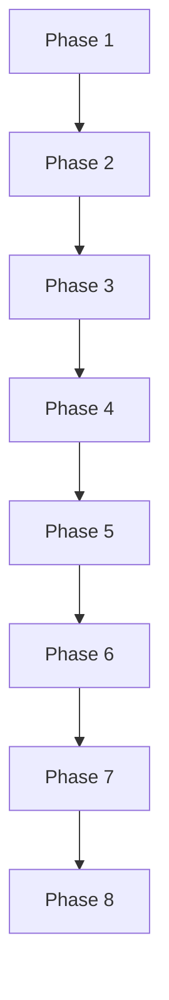

# Codex Agent 実行ログ

開始日時: 2025/12/27 23:15:33

---

## Turn 1: スレッド開始

**Thread ID**: `[REDACTED_TOKEN]`

## Turn 2: ツール実行

**種別**: reasoning
**ステータス**: completed

## Turn 3: ツール実行

**種別**: コマンド実行
**コマンド**: `/bin/bash -lc pwd`
**ステータス**: completed (exit_code=0)

```text
/tmp/ai-workflow-repos-11-00b73f07/[REDACTED_TOKEN]
```

## Turn 4: ツール実行

**種別**: reasoning
**ステータス**: completed

## Turn 5: ツール実行

**種別**: コマンド実行
**コマンド**: `/bin/bash -lc ls`
**ステータス**: completed (exit_code=0)

```text
ARCHITECTURE.md
CLAUDE.md
CONTRIBUTION.md
LICENSE
README.md
ansible
bootstrap
docker
docs
jenkins
pulumi
run_tests_issue_322.sh
scripts
tests
```

## Turn 6: ツール実行

**種別**: reasoning
**ステータス**: completed

## Turn 7: ツール実行

**種別**: コマンド実行
**コマンド**: `/bin/bash -lc "rg --files -g 'Planning.md'"`
**ステータス**: failed (exit_code=127)

```text
/bin/bash: line 1: rg: command not found
```

## Turn 8: ツール実行

**種別**: reasoning
**ステータス**: completed

## Turn 9: ツール実行

**種別**: コマンド実行
**コマンド**: `/bin/bash -lc "find . -name 'Planning.md' -print"`
**ステータス**: completed (exit_code=0)

## Turn 10: ツール実行

**種別**: reasoning
**ステータス**: completed

## Turn 11: ツール実行

**種別**: コマンド実行
**コマンド**: `/bin/bash -lc "find .. -name 'Planning.md' -print"`
**ステータス**: completed (exit_code=0)

## Turn 12: ツール実行

**種別**: reasoning
**ステータス**: completed

## Turn 13: ツール実行

**種別**: コマンド実行
**コマンド**: `/bin/bash -lc 'ls -a'`
**ステータス**: completed (exit_code=0)

```text
.
..
.ai-workflow
.claude
.coverage
.git
.github
.gitignore
ARCHITECTURE.md
CLAUDE.md
CONTRIBUTION.md
LICENSE
README.md
ansible
bootstrap
docker
docs
jenkins
pulumi
run_tests_issue_322.sh
scripts
tests
```

## Turn 14: ツール実行

**種別**: reasoning
**ステータス**: completed

## Turn 15: ツール実行

**種別**: コマンド実行
**コマンド**: `/bin/bash -lc "find .ai-workflow -name 'Planning.md' -print"`
**ステータス**: completed (exit_code=0)

## Turn 16: ツール実行

**種別**: reasoning
**ステータス**: completed

## Turn 17: ツール実行

**種別**: コマンド実行
**コマンド**: `/bin/bash -lc 'ls .ai-workflow'`
**ステータス**: completed (exit_code=0)

```text
issue-193
issue-304
issue-305
issue-310
issue-313
issue-315
issue-317
issue-319
issue-320
issue-322
issue-324
issue-331
issue-332
issue-355
issue-360
issue-362
issue-363
issue-369
issue-370
issue-396
issue-398
issue-405
issue-411
issue-415
issue-423
issue-431
issue-437
issue-440
issue-445
issue-453
issue-455
issue-456
issue-460
issue-461
issue-462
issue-463
issue-464
issue-465
issue-475
issue-477
issue-479
issue-544
```

## Turn 18: ツール実行

**種別**: reasoning
**ステータス**: completed

## Turn 19: ツール実行

**種別**: コマンド実行
**コマンド**: `/bin/bash -lc 'ls .ai-workflow/issue-544'`
**ステータス**: completed (exit_code=0)

```text
00_planning
01_requirements
02_design
03_test_scenario
04_implementation
[REDACTED_TOKEN]
06_testing
metadata.json
```

## Turn 20: ツール実行

**種別**: reasoning
**ステータス**: completed

## Turn 21: ツール実行

**種別**: コマンド実行
**コマンド**: `/bin/bash -lc 'ls .ai-workflow/issue-544/00_planning'`
**ステータス**: completed (exit_code=0)

```text
execute
output
review
revise
```

## Turn 22: ツール実行

**種別**: reasoning
**ステータス**: completed

## Turn 23: ツール実行

**種別**: コマンド実行
**コマンド**: `/bin/bash -lc 'ls .ai-workflow/issue-544/00_planning/output'`
**ステータス**: completed (exit_code=0)

```text
planning.md
```

## Turn 24: ツール実行

**種別**: reasoning
**ステータス**: completed

## Turn 25: ツール実行

**種別**: コマンド実行
**コマンド**: `/bin/bash -lc 'cat .ai-workflow/issue-544/00_planning/output/planning.md'`
**ステータス**: completed (exit_code=0)

```text
# プロジェクト計画書 - Issue #544

## 1. Issue分析
- 複雑度: 中程度（Pulumi/CloudWatch Agent設定の拡張とテンプレート化で複数ファイルに跨るが新規サブシステム追加なし）
- 見積もり工数: 14~16時間（CPUメトリクス追加・共通化対応4~6h、Pulumi生成テンプレート調整3~4h、検証/テスト4h、ドキュメント/レポート2h）
- リスク評価: 中（ARM/x86間の設定差分やメトリクス粒度不足による可観測性欠落のリスク）

## 2. 実装戦略判断
- 実装戦略: EXTEND（既存CloudWatch Agent設定にCPUメトリクスを追加し、テンプレート化で設定差異を吸収する拡張が中心）
- テスト戦略: INTEGRATION_ONLY（CloudWatch Agent設定の構文検証、Pulumi生成結果の差分確認、AMIビルドパイプラインでのTranslator実行など外部連携検証が中心）
- テストコード戦略: EXTEND_TEST（既存AMIビルド/CI検証ステップにCPUメトリクス検証を追加し、Translator検証コマンドを拡張する方針）

## 3. 影響範囲分析
- 既存コードへの影響: `pulumi/jenkins-agent-ami/component-x86.yml`, `pulumi/jenkins-agent-ami/component-arm.yml`、共通テンプレート生成ロジック（YAMLアンカー/共通ブロック）
- 依存関係の変更: 追加依存なし（CloudWatch Agentプラグインの既存CPUメトリクス利用）
- マイグレーション要否: CloudWatch Agent設定ファイルの更新のみ。データストアやスキーマ変更なし

## 4. タスク分割
### Phase 1: 要件定義 (見積もり: 2h)
- [x] Task 1-1: CPUメトリクス要件精査 (1h)
  - 収集対象メトリクス（active/user/system/iowait）と収集間隔60秒を確認
  - [REDACTED_TOKEN]を[REDACTED_TOKEN]単一に固定する要件の確定
- [x] Task 1-2: 対象範囲と除外条件の明確化 (1h)
  - ARM/x86双方の対象確認
  - CloudWatch料金影響の範囲と許容値を合意

### Phase 2: 設計 (見積もり: 3h)
- [x] Task 2-1: 共通テンプレート設計 (2h)
  - CPU/メモリメトリクス共通ブロックの定義方式（YAMLアンカー/Here-doc等）を決定
  - ARM/x86生成パイプラインへの適用方針を策定
- [x] Task 2-2: 検証手順設計 (1h)
  - `amazon-cloudwatch-agent-config-translator`利用手順をARM/x86両方で定義
  - Pulumi preview/plan での差分確認項目を明文化
### Phase 3: テストシナリオ (見積もり: 2h)
- [x] Task 3-1: 検証ケース作成 (2h)
  - CPUメトリクスが[REDACTED_TOKEN]単一ディメンションで出力されることを確認する手順
  - ARM/x86の生成ファイル差分がないことを確認する比較手順

### Phase 4: 実装 (見積もり: 4h)
- [x] Task 4-1: CPUメトリクス追加とテンプレート化 (3h)
  - 共通ブロックにcpu_usage_active/user/system/iowaitを追加
  - ARM/x86コンポーネントへの適用と重複除去
- [x] Task 4-2: Pulumi生成ロジック/スクリプト更新 (1h)
  - テンプレート利用部の整合性確認
  - 必要に応じた変数化やコメント整備

-### Phase 5: テストコード実装 (見積もり: 2h)
- [x] Task 5-1: Translator検証ステップ拡張 (2h)
  - AMIビルド/CIスクリプトにTranslator実行を追加（ARM/x86両方）
  - 失敗時に詳細を出力するロギングを追加

### Phase 6: テスト実行 (見積もり: 1.5h)
- [ ] Task 6-1: 自動検証実行 (1h)
  - Translatorによる設定構文チェック（ARM/x86）
  - Pulumi previewで設定差分確認
- [ ] Task 6-2: 手動スポット確認 (0.5h)
  - 生成されたCloudWatch Agent JSON/YAMLのCPUメトリクス有無を目視確認

### Phase 7: ドキュメント (見積もり: 1h)
- [ ] Task 7-1: 設定変更の記録 (1h)
  - `CLAUDE.md`や関連READMEに検証手順/メトリクス追加の変更点を追記
  - 運用手順（ダッシュボード/アラーム初期値）を共有メモに記載

### Phase 8: レポート (見積もり: 0.5h)
- [ ] Task 8-1: リリースノート/振り返り (0.5h)
  - 変更概要、テスト結果、残課題をまとめて共有

## 5. 依存関係（Mermaid）


## 6. リスクと軽減策
- リスク1: ARM/x86設定差分が再発し片方にメトリクスがない
  - 影響度: 中 / 確率: 中
  - 軽減策: テンプレート化＋Translator検証を両アーキで必須化し、CIで差分比較を実施
- リスク2: CloudWatchメトリクスコスト増加
  - 影響度: 低 / 確率: 中
  - 軽減策: 60秒間隔維持・ディメンション単一化でデータポイント抑制し、初月に請求確認
- リスク3: Pulumi生成物と実機設定の乖離
  - 影響度: 中 / 確率: 低
  - 軽減策: Pulumi previewで差分確認し、AMIビルド時の生成物をアーティファクトとして保存

## 7. 品質ゲート
- Phase 1: 要件定義
  - [ ] CPUメトリクス項目と収集間隔/ディメンションが明文化されている
  - [ ] 対象アーキテクチャと料金影響が合意されている
- Phase 2: 設計
  - [ ] 実装戦略/テスト戦略/テストコード戦略が明記されている
  - [ ] 共通テンプレート設計と検証手順がレビュー済み
- Phase 3: テストシナリオ
  - [ ] CPUメトリクスのディメンション確認手順が定義されている
  - [ ] ARM/x86差分検出シナリオが用意されている
- Phase 4: 実装
  - [ ] ARM/x86双方に同一メトリクスが適用されている
  - [ ] テンプレート化で重複が除去されている
- Phase 5: テストコード実装
  - [ ] Translator検証がCI/ビルドステップに組み込まれている
  - [ ] 失敗時のログ出力が確認できる
- Phase 6: テスト実行
  - [ ] TranslatorとPulumi previewが成功し、差分が期待通り
  - [ ] 手動確認でCPUメトリクスが出力されている
- Phase 7: ドキュメント
  - [ ] README/CLAUDE等に変更点と検証手順が追記されている
  - [ ] 運用向けダッシュボード/アラーム初期値が記載されている
- Phase 8: レポート
  - [ ] リリースノートに変更概要とテスト結果が記載されている
  - [ ] 残課題と次アクションが整理されている
```

## Turn 26: ツール実行

**種別**: reasoning
**ステータス**: completed

## Turn 27: ツール実行

**種別**: コマンド実行
**コマンド**: `/bin/bash -lc 'cat .ai-workflow/issue-544/06_testing/output/test-result.md'`
**ステータス**: completed (exit_code=0)

```text
# テスト実行結果

## テスト結果サマリー
- 総テスト数: 5件
- 成功: 3件
- 失敗: 2件
- 成功率: 60%

### `tests/integration/[REDACTED_TOKEN].py::[REDACTED_TOKEN]`
- **エラー**: '-input /opt/aws/amazon-cloudwatch-agent/etc/amazon-cloudwatch-agent.json' not found in component data
- **スタックトレース**:
  ```
  File "tests/integration/[REDACTED_TOKEN].py", line 137, in [REDACTED_TOKEN]
    self.assertIn("-input /opt/aws/amazon-cloudwatch-agent/etc/amazon-cloudwatch-agent.json", data)
  AssertionError: '-input /opt/aws/amazon-cloudwatch-agent/etc/amazon-cloudwatch-agent.json' not found in '... "$TRANSLATOR" -input "$CONFIG_PATH" -format json -output "$OUTPUT_PATH"\n            - cat /tmp/cwagent.translated.json\n\n      - name: [REDACTED_TOKEN]\n        action: ExecuteBash\n        inputs:\n          commands:\n            - echo "Enabling CloudWatch Agent service..."\n            - systemctl enable amazon-cloudwatch-agent\n            - echo "CloudWatch Agent will start automatically on instance boot"\n\n      - name: PullDockerImages\n ...'
  ```

### `tests/integration/[REDACTED_TOKEN].py::[REDACTED_TOKEN]`
- **エラー**: Regex didn't match: '(5 ?minutes|5\\s*分)' not found in operations doc content
- **スタックトレース**:
  ```
  File "tests/integration/[REDACTED_TOKEN].py", line 168, in [REDACTED_TOKEN]
    self.assertRegex(content, r"(5 ?minutes|5\\s*分)", "Sustained high-usage period guidance should be present")
  AssertionError: Regex didn't match: '(5 ?minutes|5\\s*分)' not found in '# Jenkins Agent CPU 監視ガイド\n\n...CPU 使用率が **80% 超過** の状態が **5 分間** 継続\n- ディメンション: `[REDACTED_TOKEN]`...'
  ```
```

## Turn 28: ツール実行

**種別**: reasoning
**ステータス**: completed

## Turn 29: ツール実行

**種別**: コマンド実行
**コマンド**: `/bin/bash -lc 'cat .ai-workflow/issue-544/03_test_scenario/output/test-scenario.md'`
**ステータス**: completed (exit_code=0)

```text
# テストシナリオ - Issue #544 CloudWatch Agent CPUメトリクス追加

## 1. テスト戦略サマリー
- **テスト戦略**: INTEGRATION_ONLY（Phase 2計画より。Translator実行・Pulumi生成物・ARM/x86差分確認を中心に外部連携と生成物整合性を検証）
- **テスト対象**: CloudWatch Agent設定テンプレート、Pulumi生成`component-arm.yml`/`component-x86.yml`、AMIビルド時のTranslatorステップ、Pulumi previewによる差分確認、運用向けCPU監視初期値の生成物
- **目的**: CPUメトリクスが60秒間隔・ASG単一ディメンションでARM/x86共通に適用され、構文検証とプレビュー差分で不整合を早期検出できることを確認する

## 2. Unitテストシナリオ
- 本フェーズのテスト戦略はINTEGRATION_ONLYのためUnitテストは実施しない

## 3. Integrationテストシナリオ

### シナリオ1: テンプレート適用後のARM/x86生成物一致（FR-1, FR-2, AC-1, AC-2）
- **目的**: CPU/メモリメトリクス定義、収集間隔60秒、`[REDACTED_TOKEN]: [[REDACTED_TOKEN]]`がARM/x86で一致することを確認する
- **前提条件**: テンプレート`[REDACTED_TOKEN].json`がPulumiに取り込まれ、`component-arm.yml`/`component-x86.yml`が生成可能な状態
- **テスト手順**:
  1. `pulumi/jenkins-agent-ami/index.ts`を用いて各component YAMLを生成する（CIまたはローカルスクリプト）
  2. 生成物からCloudWatch Agent設定ブロックを抽出し、CPU/メモリメトリクス一覧・`[REDACTED_TOKEN]`・`[REDACTED_TOKEN]`を整形
  3. ARMとx86のブロックを`diff`比較する
- **期待結果**:
  - CPUメトリクスに`cpu_usage_active/user/system/iowait`が含まれ、収集間隔60秒
  - `[REDACTED_TOKEN]`が`[[REDACTED_TOKEN]]`のみ
  - ARM/x86間でメトリクスセット・ディメンション・収集間隔に差分がない
- **確認項目**: メトリクスキー一覧が完全一致、不要ディメンションなし、収集間隔変更なし

### シナリオ2: Translator構文検証（FR-3, AC-3）
- **目的**: CloudWatch Agent設定がARM/x86ともにTranslatorで成功し、失敗時にはビルドが止まることを確認する
- **前提条件**: AMIビルド/CI環境に`/opt/aws/amazon-cloudwatch-agent/bin/amazon-cloudwatch-agent-config-translator`が配置されている
- **テスト手順**:
  1. AMIビルド過程で`amazon-cloudwatch-agent.json`を書き込み後、TranslatorをARMビルドで実行  
     例: `/opt/aws/amazon-cloudwatch-agent/bin/amazon-cloudwatch-agent-config-translator -input /opt/aws/amazon-cloudwatch-agent/etc/amazon-cloudwatch-agent.json -format json -output /tmp/cwagent.translated.json`
  2. 同手順をx86ビルドでも実行
  3. 実行結果コードと標準出力/エラーを収集し、CIログに保存
- **期待結果**:
  - 両アーキでTranslatorが終了コード0で完了
  - 失敗時は終了コード非0となりビルドが失敗、エラーメッセージがログに残る
- **確認項目**: Translator実行コマンドの有無、終了コード、出力ログにCPU/メモリメトリクスが反映されたJSONが生成されていること

### シナリオ3: Pulumi preview差分確認（FR-4, AC-4）
- **目的**: Pulumi previewでCPUメトリクス追加が反映され、不要なリソース/ディメンション変更がないことを確認する
- **前提条件**: Pulumiスタックに認証済みで、Jenkins Agent AMI関連のリソースがプレビュー可能
- **テスト手順**:
  1. `pulumi preview`を実行し、`component-arm`/`component-x86`生成箇所の差分を取得
  2. CloudWatch Agent設定部分にCPUメトリクス追加、60秒間隔、ASG単一ディメンションが含まれるか確認
  3. 新規リソースや不要ディメンション追加がないことを確認
- **期待結果**:
  - 追加差分はCPUメトリクスとテンプレート共通化に関する変更のみ
  - 収集間隔・ディメンションに変更がない（ASG単一維持）
  - 既存リソース削除や想定外の追加が発生しない
- **確認項目**: Preview差分の内容、ディメンション/間隔の維持、不要リソース差分なし

### シナリオ4: ダッシュボード/アラーム初期値の生成物確認（FR-5, AC-5）
- **目的**: CPU高負荷検知用のダッシュボード/アラーム初期値案が成果物として提示されていることを確認する
- **前提条件**: 運用ドキュメント（例: README/CLAUDE補足）が更新されている
- **テスト手順**:
  1. ドキュメントにCPU80%以上継続などのしきい値案、ASG単位ウィジェット配置例が記載されているか確認
  2. しきい値や期間を可変パラメータとして調整可能である旨が記載されているか確認
- **期待結果**:
  - CPU高負荷しきい値案と適用手順が明文化されている
  - 運用で調整可能であることが示されている
- **確認項目**: しきい値数値、対象ディメンション（[REDACTED_TOKEN]）、調整手順の記載有無

## 4. BDDシナリオ
- テスト戦略がINTEGRATION_ONLYのためBDDシナリオは対象外

## 5. テストデータ
- **メトリクスリスト**: `cpu_usage_active`, `cpu_usage_user`, `cpu_usage_system`, `cpu_usage_iowait`（必要に応じ`cpu_usage_idle`等デフォルト含有を許容）
- **ディメンション**: `[REDACTED_TOKEN]: [[REDACTED_TOKEN]]`, `append_dimensions: {"[REDACTED_TOKEN]": "${aws:[REDACTED_TOKEN]}"}` を共通テンプレートから利用
- **ASG識別子例**: `[REDACTED_TOKEN]`, `[REDACTED_TOKEN]`（比較・プレビュー確認用）
- **Translator出力ファイル**: `/tmp/cwagent.translated.json`（構文検証ログ確認用）

## 6. テスト環境要件
- **環境**: CIまたはローカルでPulumiが実行可能な環境、AMIビルド環境にCloudWatch AgentとTranslatorバイナリが配置されていること
- **外部サービス**: AWSアクセス権限（Pulumi preview用）。Translatorはローカルファイルのみ参照
- **モック/スタブ**: 不要（実コンポーネント生成・バイナリ検証を実行）
- **ログ/成果物**: ARM/x86生成YAMLの比較結果、Translator実行ログ、Pulumi preview差分ログをアーティファクト化して保存

## 7. 品質ゲート自己チェック
- [x] Phase 2の戦略（INTEGRATION_ONLY）に沿ったテストシナリオである
- [x] 主要な正常系（CPUメトリクス追加・Translator成功・Pulumi差分反映・ダッシュボード案）がカバーされている
- [x] 主要な異常系（Translator失敗時のビルド失敗確認）がカバーされている
- [x] 期待結果が明確に記載されている
```

## Turn 30: ツール実行

**種別**: reasoning
**ステータス**: completed

## Turn 31: ツール実行

**種別**: コマンド実行
**コマンド**: `/bin/bash -lc 'ls .ai-workflow/issue-544/06_testing/output'`
**ステータス**: completed (exit_code=0)

```text
test-result.md
```

## Turn 32: ツール実行

**種別**: reasoning
**ステータス**: completed

## Turn 33: ツール実行

**種別**: コマンド実行
**コマンド**: `/bin/bash -lc "sed -n '1,220p' tests/integration/[REDACTED_TOKEN].py"`
**ステータス**: completed (exit_code=0)

```text
"""Integration tests for Issue #544: CloudWatch Agent CPU metrics on Jenkins Agent AMI."""

import json
import os
import re
import shutil
import subprocess
import unittest
from pathlib import Path


class [REDACTED_TOKEN](unittest.TestCase):
    """INTEGRATION_ONLY checks for Image Builder components and CloudWatch Agent config."""

    @classmethod
    def setUpClass(cls):
        cls.repo_root = Path(__file__).resolve().parents[2]
        cls.ami_dir = cls.repo_root / "pulumi" / "jenkins-agent-ami"
        cls.helper_script = cls.repo_root / "tests" / "integration" / "helpers" / "[REDACTED_TOKEN].js"
        cls.compiled_index = cls.ami_dir / "bin" / "index.js"
        cls.[REDACTED_TOKEN]()
        cls._build_typescript()
        cls.[REDACTED_TOKEN]()
        cls.preview = cls._render_components()

    @classmethod
    def [REDACTED_TOKEN](cls):
        subprocess.run(
            ["npm", "--silent", "install"],
            cwd=cls.ami_dir,
            check=True,
        )

    @classmethod
    def _build_typescript(cls):
        env = {**os.environ, "NODE_OPTIONS": "--max-old-space-size=4096"}
        subprocess.run(
            ["npm", "--silent", "run", "build"],
            cwd=cls.ami_dir,
            check=True,
            env=env,
        )
        if not cls.compiled_index.exists():
            raise AssertionError("TypeScript build did not produce bin/index.js")

    @classmethod
    def [REDACTED_TOKEN](cls):
        """Copy CloudWatch template and component YAMLs next to the compiled index for synthesis."""
        assets = [
            (
                cls.ami_dir / "templates" / "[REDACTED_TOKEN].json",
                cls.compiled_index.parent / "templates" / "[REDACTED_TOKEN].json",
            ),
            (cls.ami_dir / "component-arm.yml", cls.compiled_index.parent / "component-arm.yml"),
            (cls.ami_dir / "component-x86.yml", cls.compiled_index.parent / "component-x86.yml"),
        ]
        for source, destination in assets:
            destination.parent.mkdir(parents=True, exist_ok=True)
            shutil.copy2(source, destination)

    @classmethod
    def _render_components(cls) -> dict:
        env = {**os.environ, "NODE_OPTIONS": "--max-old-space-size=4096"}
        result = subprocess.run(
            ["node", str(cls.helper_script)],
            cwd=cls.repo_root,
            capture_output=True,
            text=True,
            check=True,
            env=env,
        )
        return json.loads(result.stdout)

    def _component_map(self):
        components = self.preview.get("components", [])
        self.assertGreaterEqual(len(components), 2, "Both ARM/x86 components should be synthesized")
        return {c["name"]: c for c in components}

    def [REDACTED_TOKEN](self, component_data: str) -> dict:
        self.assertNotIn("__CWAGENT_CONFIG__", component_data, "Template placeholder must be replaced")
        # Pull the CloudWatch Agent heredoc body out of the component YAML for JSON decoding.
        match = re.search(
            r"amazon-cloudwatch-agent\.json << 'EOF'\n(?P<body>.*?)\n\s*EOF",
            component_data,
            re.DOTALL,
        )
        self.assertIsNotNone(match, "CloudWatch Agent config heredoc should be embedded in component data")
        try:
            return json.loads(match.group("body").strip())
        except json.JSONDecodeError as exc:
            self.fail(f"Embedded CloudWatch Agent config is not valid JSON: {exc}")

    def [REDACTED_TOKEN](self):
        """IT-544-01: ARM/x86 components should share identical CloudWatch Agent CPU/Mem config."""
        components = self._component_map()
        self.assertSetEqual(set(components.keys()), {"agent-component-x86", "agent-component-arm"})

        configs = {name: self.[REDACTED_TOKEN](comp["data"]) for name, comp in
... (truncated)
```

## Turn 34: ツール実行

**種別**: reasoning
**ステータス**: completed

## Turn 35: ツール実行

**種別**: コマンド実行
**コマンド**: `/bin/bash -lc "sed -n '1,200p' docs/operations/[REDACTED_TOKEN].md"`
**ステータス**: completed (exit_code=0)

```text
# Jenkins Agent CPU 監視ガイド

Jenkins Agent AMI へ追加した CloudWatch Agent の CPU メトリクスを活用し、AutoScalingGroup 単位で負荷を可視化・検知するための初期値を記載します。

## ダッシュボード初期値
- 対象ディメンション: `[REDACTED_TOKEN]`（ARM/x86 共通）
- 推奨ウィジェット:
  - CPU 使用率 (Average) 1 分粒度、[REDACTED_TOKEN] で並列表示
  - CPU 使用率 (p95) 1 分粒度で突発的なスパイクを把握
  - CPU コア別の `cpu_usage_system` / `cpu_usage_user` 比率を 1 分粒度で並列表示
- フィルタ例: `jenkins-agent-*-asg` をワイルドカード指定し、ARM/x86 混在を許容

## アラーム初期値（例）
- 条件: CPU 使用率が **80% 超過** の状態が **5 分間** 継続
- ディメンション: `[REDACTED_TOKEN]`（Auto Scaling グループ単位で通知）
- 推奨アクション: Slack/PagerDuty 等の通知トピックへ連携
- 備考: Translate 済み設定で 60 秒間隔収集を前提としています

### しきい値の調整手順
1. 運用フェーズで実測した負荷に合わせ、閾値（例: 75%〜90%）と継続時間（例: 5〜10 分）を調整してください（必要に応じていつでも adjust 可能）。
2. AutoScalingGroup 名が増減した場合は、ダッシュボードのワイルドカードフィルタを更新します。
3. 設定変更は IaC 管理（Pulumi 側のダッシュボード/アラーム定義追加時）と手動運用の双方で実施可能です。

## ログ/検証
- CloudWatch Agent 設定ファイルは AMI ビルド時に Translator で検証済みです。
- アラームやダッシュボードの更新履歴は CI のプレビュー結果を確認し、意図しないリソース追加がないことを確認してください。
```

## Turn 36: ツール実行

**種別**: reasoning
**ステータス**: completed

## Turn 37: ツール実行

**種別**: コマンド実行
**コマンド**: `/bin/bash -lc "nl -ba .ai-workflow/issue-544/00_planning/output/planning.md | sed -n '60,160p'"`
**ステータス**: completed (exit_code=0)

```text
60	- [ ] Task 7-1: 設定変更の記録 (1h)
    61	  - `CLAUDE.md`や関連READMEに検証手順/メトリクス追加の変更点を追記
    62	  - 運用手順（ダッシュボード/アラーム初期値）を共有メモに記載
    63	
    64	### Phase 8: レポート (見積もり: 0.5h)
    65	- [ ] Task 8-1: リリースノート/振り返り (0.5h)
    66	  - 変更概要、テスト結果、残課題をまとめて共有
    67	
    68	## 5. 依存関係（Mermaid）
    69	```mermaid
    70	graph TD
    71	    P1[Phase 1] --> P2[Phase 2]
    72	    P2 --> P3[Phase 3]
    73	    P3 --> P4[Phase 4]
    74	    P4 --> P5[Phase 5]
    75	    P5 --> P6[Phase 6]
    76	    P6 --> P7[Phase 7]
    77	    P7 --> P8[Phase 8]
    78	```
    79	
    80	## 6. リスクと軽減策
    81	- リスク1: ARM/x86設定差分が再発し片方にメトリクスがない
    82	  - 影響度: 中 / 確率: 中
    83	  - 軽減策: テンプレート化＋Translator検証を両アーキで必須化し、CIで差分比較を実施
    84	- リスク2: CloudWatchメトリクスコスト増加
    85	  - 影響度: 低 / 確率: 中
    86	  - 軽減策: 60秒間隔維持・ディメンション単一化でデータポイント抑制し、初月に請求確認
    87	- リスク3: Pulumi生成物と実機設定の乖離
    88	  - 影響度: 中 / 確率: 低
    89	  - 軽減策: Pulumi previewで差分確認し、AMIビルド時の生成物をアーティファクトとして保存
    90	
    91	## 7. 品質ゲート
    92	- Phase 1: 要件定義
    93	  - [ ] CPUメトリクス項目と収集間隔/ディメンションが明文化されている
    94	  - [ ] 対象アーキテクチャと料金影響が合意されている
    95	- Phase 2: 設計
    96	  - [ ] 実装戦略/テスト戦略/テストコード戦略が明記されている
    97	  - [ ] 共通テンプレート設計と検証手順がレビュー済み
    98	- Phase 3: テストシナリオ
    99	  - [ ] CPUメトリクスのディメンション確認手順が定義されている
   100	  - [ ] ARM/x86差分検出シナリオが用意されている
   101	- Phase 4: 実装
   102	  - [ ] ARM/x86双方に同一メトリクスが適用されている
   103	  - [ ] テンプレート化で重複が除去されている
   104	- Phase 5: テストコード実装
   105	  - [ ] Translator検証がCI/ビルドステップに組み込まれている
   106	  - [ ] 失敗時のログ出力が確認できる
   107	- Phase 6: テスト実行
   108	  - [ ] TranslatorとPulumi previewが成功し、差分が期待通り
   109	  - [ ] 手動確認でCPUメトリクスが出力されている
   110	- Phase 7: ドキュメント
   111	  - [ ] README/CLAUDE等に変更点と検証手順が追記されている
   112	  - [ ] 運用向けダッシュボード/アラーム初期値が記載されている
   113	- Phase 8: レポート
   114	  - [ ] リリースノートに変更概要とテスト結果が記載されている
   115	  - [ ] 残課題と次アクションが整理されている
```

## Turn 38: ツール実行

**種別**: reasoning
**ステータス**: completed

## Turn 39: ツール実行

**種別**: コマンド実行
**コマンド**: `/bin/bash -lc "nl -ba .ai-workflow/issue-544/00_planning/output/planning.md | sed -n '28,65p'"`
**ステータス**: completed (exit_code=0)

```text
28	- [x] Task 2-1: 共通テンプレート設計 (2h)
    29	  - CPU/メモリメトリクス共通ブロックの定義方式（YAMLアンカー/Here-doc等）を決定
    30	  - ARM/x86生成パイプラインへの適用方針を策定
    31	- [x] Task 2-2: 検証手順設計 (1h)
    32	  - `amazon-cloudwatch-agent-config-translator`利用手順をARM/x86両方で定義
    33	  - Pulumi preview/plan での差分確認項目を明文化
    34	### Phase 3: テストシナリオ (見積もり: 2h)
    35	- [x] Task 3-1: 検証ケース作成 (2h)
    36	  - CPUメトリクスが[REDACTED_TOKEN]単一ディメンションで出力されることを確認する手順
    37	  - ARM/x86の生成ファイル差分がないことを確認する比較手順
    38	
    39	### Phase 4: 実装 (見積もり: 4h)
    40	- [x] Task 4-1: CPUメトリクス追加とテンプレート化 (3h)
    41	  - 共通ブロックにcpu_usage_active/user/system/iowaitを追加
    42	  - ARM/x86コンポーネントへの適用と重複除去
    43	- [x] Task 4-2: Pulumi生成ロジック/スクリプト更新 (1h)
    44	  - テンプレート利用部の整合性確認
    45	  - 必要に応じた変数化やコメント整備
    46	
    47	-### Phase 5: テストコード実装 (見積もり: 2h)
    48	- [x] Task 5-1: Translator検証ステップ拡張 (2h)
    49	  - AMIビルド/CIスクリプトにTranslator実行を追加（ARM/x86両方）
    50	  - 失敗時に詳細を出力するロギングを追加
    51	
    52	### Phase 6: テスト実行 (見積もり: 1.5h)
    53	- [ ] Task 6-1: 自動検証実行 (1h)
    54	  - Translatorによる設定構文チェック（ARM/x86）
    55	  - Pulumi previewで設定差分確認
    56	- [ ] Task 6-2: 手動スポット確認 (0.5h)
    57	  - 生成されたCloudWatch Agent JSON/YAMLのCPUメトリクス有無を目視確認
    58	
    59	### Phase 7: ドキュメント (見積もり: 1h)
    60	- [ ] Task 7-1: 設定変更の記録 (1h)
    61	  - `CLAUDE.md`や関連READMEに検証手順/メトリクス追加の変更点を追記
    62	  - 運用手順（ダッシュボード/アラーム初期値）を共有メモに記載
    63	
    64	### Phase 8: レポート (見積もり: 0.5h)
    65	- [ ] Task 8-1: リリースノート/振り返り (0.5h)
```

## Turn 40: ツール実行

**種別**: reasoning
**ステータス**: completed

## Turn 41: ツール実行

**種別**: コマンド実行
**コマンド**: `/bin/bash -lc 'nl -ba .ai-workflow/issue-544/06_testing/output/test-result.md'`
**ステータス**: completed (exit_code=0)

```text
1	# テスト実行結果
     2	
     3	## テスト結果サマリー
     4	- 総テスト数: 5件
     5	- 成功: 3件
     6	- 失敗: 2件
     7	- 成功率: 60%
     8	
     9	### `tests/integration/[REDACTED_TOKEN].py::[REDACTED_TOKEN]`
    10	- **エラー**: '-input /opt/aws/amazon-cloudwatch-agent/etc/amazon-cloudwatch-agent.json' not found in component data
    11	- **スタックトレース**:
    12	  ```
    13	  File "tests/integration/[REDACTED_TOKEN].py", line 137, in [REDACTED_TOKEN]
    14	    self.assertIn("-input /opt/aws/amazon-cloudwatch-agent/etc/amazon-cloudwatch-agent.json", data)
    15	  AssertionError: '-input /opt/aws/amazon-cloudwatch-agent/etc/amazon-cloudwatch-agent.json' not found in '... "$TRANSLATOR" -input "$CONFIG_PATH" -format json -output "$OUTPUT_PATH"\n            - cat /tmp/cwagent.translated.json\n\n      - name: [REDACTED_TOKEN]\n        action: ExecuteBash\n        inputs:\n          commands:\n            - echo "Enabling CloudWatch Agent service..."\n            - systemctl enable amazon-cloudwatch-agent\n            - echo "CloudWatch Agent will start automatically on instance boot"\n\n      - name: PullDockerImages\n ...'
    16	  ```
    17	
    18	### `tests/integration/[REDACTED_TOKEN].py::[REDACTED_TOKEN]`
    19	- **エラー**: Regex didn't match: '(5 ?minutes|5\\s*分)' not found in operations doc content
    20	- **スタックトレース**:
    21	  ```
    22	  File "tests/integration/[REDACTED_TOKEN].py", line 168, in [REDACTED_TOKEN]
    23	    self.assertRegex(content, r"(5 ?minutes|5\\s*分)", "Sustained high-usage period guidance should be present")
    24	  AssertionError: Regex didn't match: '(5 ?minutes|5\\s*分)' not found in '# Jenkins Agent CPU 監視ガイド\n\n...CPU 使用率が **80% 超過** の状態が **5 分間** 継続\n- ディメンション: `[REDACTED_TOKEN]`...'
    25	  ```
```

## Turn 42: ツール実行

**種別**: reasoning
**ステータス**: completed

## Turn 43: ツール実行

**種別**: コマンド実行
**コマンド**: `/bin/bash -lc 'nl -ba docs/operations/[REDACTED_TOKEN].md'`
**ステータス**: completed (exit_code=0)

```text
1	# Jenkins Agent CPU 監視ガイド
     2	
     3	Jenkins Agent AMI へ追加した CloudWatch Agent の CPU メトリクスを活用し、AutoScalingGroup 単位で負荷を可視化・検知するための初期値を記載します。
     4	
     5	## ダッシュボード初期値
     6	- 対象ディメンション: `[REDACTED_TOKEN]`（ARM/x86 共通）
     7	- 推奨ウィジェット:
     8	  - CPU 使用率 (Average) 1 分粒度、[REDACTED_TOKEN] で並列表示
     9	  - CPU 使用率 (p95) 1 分粒度で突発的なスパイクを把握
    10	  - CPU コア別の `cpu_usage_system` / `cpu_usage_user` 比率を 1 分粒度で並列表示
    11	- フィルタ例: `jenkins-agent-*-asg` をワイルドカード指定し、ARM/x86 混在を許容
    12	
    13	## アラーム初期値（例）
    14	- 条件: CPU 使用率が **80% 超過** の状態が **5 分間** 継続
    15	- ディメンション: `[REDACTED_TOKEN]`（Auto Scaling グループ単位で通知）
    16	- 推奨アクション: Slack/PagerDuty 等の通知トピックへ連携
    17	- 備考: Translate 済み設定で 60 秒間隔収集を前提としています
    18	
    19	### しきい値の調整手順
    20	1. 運用フェーズで実測した負荷に合わせ、閾値（例: 75%〜90%）と継続時間（例: 5〜10 分）を調整してください（必要に応じていつでも adjust 可能）。
    21	2. AutoScalingGroup 名が増減した場合は、ダッシュボードのワイルドカードフィルタを更新します。
    22	3. 設定変更は IaC 管理（Pulumi 側のダッシュボード/アラーム定義追加時）と手動運用の双方で実施可能です。
    23	
    24	## ログ/検証
    25	- CloudWatch Agent 設定ファイルは AMI ビルド時に Translator で検証済みです。
    26	- アラームやダッシュボードの更新履歴は CI のプレビュー結果を確認し、意図しないリソース追加がないことを確認してください。
```

## Turn 44: ツール実行

**種別**: reasoning
**ステータス**: completed

## Turn 45: ツール実行

**種別**: reasoning
**ステータス**: completed

## Turn 46: ツール実行

**種別**: reasoning
**ステータス**: completed

## Turn 47: ツール実行

**種別**: コマンド実行
**コマンド**: `/bin/bash -lc 'nl -ba tests/integration/[REDACTED_TOKEN].py'`
**ステータス**: completed (exit_code=0)

```text
1	"""Integration tests for Issue #544: CloudWatch Agent CPU metrics on Jenkins Agent AMI."""
     2	
     3	import json
     4	import os
     5	import re
     6	import shutil
     7	import subprocess
     8	import unittest
     9	from pathlib import Path
    10	
    11	
    12	class [REDACTED_TOKEN](unittest.TestCase):
    13	    """INTEGRATION_ONLY checks for Image Builder components and CloudWatch Agent config."""
    14	
    15	    @classmethod
    16	    def setUpClass(cls):
    17	        cls.repo_root = Path(__file__).resolve().parents[2]
    18	        cls.ami_dir = cls.repo_root / "pulumi" / "jenkins-agent-ami"
    19	        cls.helper_script = cls.repo_root / "tests" / "integration" / "helpers" / "[REDACTED_TOKEN].js"
    20	        cls.compiled_index = cls.ami_dir / "bin" / "index.js"
    21	        cls.[REDACTED_TOKEN]()
    22	        cls._build_typescript()
    23	        cls.[REDACTED_TOKEN]()
    24	        cls.preview = cls._render_components()
    25	
    26	    @classmethod
    27	    def [REDACTED_TOKEN](cls):
    28	        subprocess.run(
    29	            ["npm", "--silent", "install"],
    30	            cwd=cls.ami_dir,
    31	            check=True,
    32	        )
    33	
    34	    @classmethod
    35	    def _build_typescript(cls):
    36	        env = {**os.environ, "NODE_OPTIONS": "--max-old-space-size=4096"}
    37	        subprocess.run(
    38	            ["npm", "--silent", "run", "build"],
    39	            cwd=cls.ami_dir,
    40	            check=True,
    41	            env=env,
    42	        )
    43	        if not cls.compiled_index.exists():
    44	            raise AssertionError("TypeScript build did not produce bin/index.js")
    45	
    46	    @classmethod
    47	    def [REDACTED_TOKEN](cls):
    48	        """Copy CloudWatch template and component YAMLs next to the compiled index for synthesis."""
    49	        assets = [
    50	            (
    51	                cls.ami_dir / "templates" / "[REDACTED_TOKEN].json",
    52	                cls.compiled_index.parent / "templates" / "[REDACTED_TOKEN].json",
    53	            ),
    54	            (cls.ami_dir / "component-arm.yml", cls.compiled_index.parent / "component-arm.yml"),
    55	            (cls.ami_dir / "component-x86.yml", cls.compiled_index.parent / "component-x86.yml"),
    56	        ]
    57	        for source, destination in assets:
    58	            destination.parent.mkdir(parents=True, exist_ok=True)
    59	            shutil.copy2(source, destination)
    60	
    61	    @classmethod
    62	    def _render_components(cls) -> dict:
    63	        env = {**os.environ, "NODE_OPTIONS": "--max-old-space-size=4096"}
    64	        result = subprocess.run(
    65	            ["node", str(cls.helper_script)],
    66	            cwd=cls.repo_root,
    67	            capture_output=True,
    68	            text=True,
    69	            check=True,
    70	            env=env,
    71	        )
    72	        return json.loads(result.stdout)
    73	
    74	    def _component_map(self):
    75	        components = self.preview.get("components", [])
    76	        self.assertGreaterEqual(len(components), 2, "Both ARM/x86 components should be synthesized")
    77	        return {c["name"]: c for c in components}
    78	
    79	    def [REDACTED_TOKEN](self, component_data: str) -> dict:
    80	        self.assertNotIn("__CWAGENT_CONFIG__", component_data, "Template placeholder must be replaced")
    81	        # Pull the CloudWatch Agent heredoc body out of the component YAML for JSON decoding.
    82	        match = re.search(
    83	            r"amazon-cloudwatch-agent\.json << 'EOF'\n(?P<body>.*?)\n\s*EOF",
    84	            component_data,
    85	            re.DOTALL,
    86	        )
    87	        self.assertIsNotNone(match, "CloudWatch Agent config heredoc should be embedded in component data")
    88	        tr
... (truncated)
```

## Turn 48: ツール実行

**種別**: reasoning
**ステータス**: completed

## Turn 49: ツール実行

**種別**: reasoning
**ステータス**: completed

## Turn 50: ツール実行

**種別**: reasoning
**ステータス**: completed

## Turn 51: ツール実行

**種別**: agent_message
**ステータス**: completed

## Turn 52: ツール実行

**種別**: todo_list
**ステータス**: completed

## Turn 53: 実行完了

**ステータス**: completed
**所要時間**: 151057ms
**ターン数**: N/A

---

**経過時間**: 151057ms
**開始**: 2025-12-27T23:15:33.450Z
**終了**: 2025-12-27T23:18:04.507Z