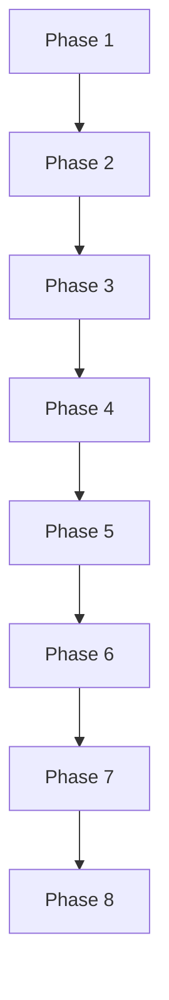

# Codex Agent 実行ログ

開始日時: 2025/12/27 23:25:58

---

## Turn 1: スレッド開始

**Thread ID**: `[REDACTED_TOKEN]`

## Turn 2: ツール実行

**種別**: reasoning
**ステータス**: completed

## Turn 3: ツール実行

**種別**: コマンド実行
**コマンド**: `/bin/bash -lc "cd /tmp/ai-workflow-repos-11-00b73f07/[REDACTED_TOKEN] && rg --files -g '*.md'"`
**ステータス**: failed (exit_code=127)

```text
/bin/bash: line 1: rg: command not found
```

## Turn 4: ツール実行

**種別**: reasoning
**ステータス**: completed

## Turn 5: ツール実行

**種別**: コマンド実行
**コマンド**: `/bin/bash -lc "cd /tmp/ai-workflow-repos-11-00b73f07/[REDACTED_TOKEN] && find .. -name '*.md'"`
**ステータス**: completed (exit_code=0)

```text
../[REDACTED_TOKEN]/.ai-workflow/issue-193/00_planning/output/planning.md
../[REDACTED_TOKEN]/.ai-workflow/issue-193/01_requirements/output/requirements.md
../[REDACTED_TOKEN]/.ai-workflow/issue-193/02_design/output/design.md
../[REDACTED_TOKEN]/.ai-workflow/issue-193/03_test_scenario/output/test-scenario.md
../[REDACTED_TOKEN]/.ai-workflow/issue-193/04_implementation/output/implementation.md
../[REDACTED_TOKEN]/.ai-workflow/issue-193/05_test_implementation/output/test-implementation.md
../[REDACTED_TOKEN]/.ai-workflow/issue-193/06_testing/output/test-result.md
../[REDACTED_TOKEN]/.ai-workflow/issue-193/07_documentation/output/[REDACTED_TOKEN].md
../[REDACTED_TOKEN]/.ai-workflow/issue-193/08_report/output/report.md
../[REDACTED_TOKEN]/.ai-workflow/issue-193/09_evaluation/execute/agent_log.md
../[REDACTED_TOKEN]/.ai-workflow/issue-193/09_evaluation/output/evaluation_report.md
../[REDACTED_TOKEN]/.ai-workflow/issue-193/09_evaluation/review/result.md
../[REDACTED_TOKEN]/.ai-workflow/issue-304/01_requirements/output/requirements.md
../[REDACTED_TOKEN]/.ai-workflow/issue-304/02_design/output/design.md
../[REDACTED_TOKEN]/.ai-workflow/issue-304/03_test_scenario/output/test-scenario.md
../[REDACTED_TOKEN]/.ai-workflow/issue-304/04_implementation/output/implementation.md
../[REDACTED_TOKEN]/.ai-workflow/issue-304/05_testing/output/test-result.md
../[REDACTED_TOKEN]/.ai-workflow/issue-304/06_documentation/output/[REDACTED_TOKEN].md
../[REDACTED_TOKEN]/.ai-workflow/issue-304/07_report/output/report.md
../[REDACTED_TOKEN]/.ai-workflow/issue-305/01_requirements/output/requirements.md
../[REDACTED_TOKEN]/.ai-workflow/issue-305/02_design/output/design.md
../[REDACTED_TOKEN]/.ai-workflow/issue-305/03_test_scenario/output/test-scenario.md
../[REDACTED_TOKEN]/.ai-workflow/issue-305/04_implementation/output/implementation.md
../[REDACTED_TOKEN]/.ai-workflow/issue-305/05_testing/output/test-result.md
../[REDACTED_TOKEN]/.ai-workflow/issue-305/06_documentation/output/[REDACTED_TOKEN].md
../[REDACTED_TOKEN]/.ai-workflow/issue-305/07_report/output/report.md
../[REDACTED_TOKEN]/.ai-workflow/issue-310/01_requirements/output/requirements.md
../[REDACTED_TOKEN]/.ai-workflow/issue-310/02_design/output/design.md
../[REDACTED_TOKEN]/.ai-workflow/issue-310/03_test_scenario/output/test-scenario.md
../[REDACTED_TOKEN]/.ai-workflow/issue-310/04_implementation/output/implementation.md
../[REDACTED_TOKEN]/.ai-workflow/issue-310/05_testing/output/[REDACTED_TOKEN].md
../[REDACTED_TOKEN]/.ai-workflow/issue-310/05_testing/output/test-result.md
../[REDACTED_TOKEN]/.ai-workflow/issue-310/06_documentation/output/[REDACTED_TOKEN].md
../[REDACTED_TOKEN]/.ai-workflow/issue-310/07_report/output/report.md
../[REDACTED_TOKEN]/.ai-workflow/issue-313/01_requirements/output/requirements.md
../[REDACTED_TOKEN]/.ai-workflow/issue-313/02_design/output/design.md
../[REDACTED_TOKEN]/.ai-workflow/issue-313/03_test_scenario/output/test-scenario.md
../[REDACTED_TOKEN]/.ai-workflow/issue-313/04_implementation/output/implementation.md
../[REDACTED_TOKEN]/.ai-workflow/issue-313/05_testing/output/test-result.md
../[REDACTED_TOKEN]/.ai-workflow/issue-313/06_documentation/output/[REDACTED_TOKEN].md
../[REDACTED_TOKEN]/.ai-workflow/issue-313/07_report/output/report.md
../[REDACTED_TOKEN]/.ai-workflow/issue-315/01_requirements/output/requirements.md
../[REDACTED_TOKEN]/.ai-workflow/issue-315/02_design/output/design.md
../[REDACTED_TOKEN]/.ai-workflow/issue-315/03_test_scenario/output/test-scenario.md
../[REDACTED_TOKEN]/.ai-workflow/issue-315/04_implementation/output/implementation.md
../[REDACTED_TOKEN]/.ai-workflow/issue-317/01_requirements/output/requirements.md
../inf
... (truncated)
```

## Turn 6: ツール実行

**種別**: reasoning
**ステータス**: completed

## Turn 7: ツール実行

**種別**: コマンド実行
**コマンド**: `/bin/bash -lc "cd /tmp/ai-workflow-repos-11-00b73f07/[REDACTED_TOKEN] && find .ai-workflow/issue-544 -name '*.md'"`
**ステータス**: completed (exit_code=0)

```text
.ai-workflow/issue-544/00_planning/output/planning.md
.ai-workflow/issue-544/00_planning/execute/agent_log.md
.ai-workflow/issue-544/00_planning/review/agent_log.md
.ai-workflow/issue-544/00_planning/review/result.md
.ai-workflow/issue-544/01_requirements/output/requirements.md
.ai-workflow/issue-544/01_requirements/execute/agent_log.md
.ai-workflow/issue-544/01_requirements/review/agent_log.md
.ai-workflow/issue-544/01_requirements/review/result.md
.ai-workflow/issue-544/02_design/output/design.md
.ai-workflow/issue-544/02_design/execute/agent_log.md
.ai-workflow/issue-544/02_design/review/agent_log.md
.ai-workflow/issue-544/02_design/review/result.md
.ai-workflow/issue-544/03_test_scenario/output/test-scenario.md
.ai-workflow/issue-544/03_test_scenario/execute/agent_log.md
.ai-workflow/issue-544/03_test_scenario/review/agent_log.md
.ai-workflow/issue-544/03_test_scenario/review/result.md
.ai-workflow/issue-544/04_implementation/output/implementation.md
.ai-workflow/issue-544/04_implementation/execute/agent_log.md
.ai-workflow/issue-544/04_implementation/review/agent_log.md
.ai-workflow/issue-544/04_implementation/review/result.md
.ai-workflow/issue-544/05_test_implementation/output/test-implementation.md
.ai-workflow/issue-544/05_test_implementation/execute/agent_log.md
.ai-workflow/issue-544/05_test_implementation/review/agent_log.md
.ai-workflow/issue-544/05_test_implementation/review/result.md
.ai-workflow/issue-544/05_test_implementation/revise/agent_log.md
.ai-workflow/issue-544/06_testing/output/test-result.md
.ai-workflow/issue-544/06_testing/execute/agent_log.md
.ai-workflow/issue-544/06_testing/review/agent_log.md
.ai-workflow/issue-544/06_testing/review/result.md
.ai-workflow/issue-544/06_testing/revise/agent_log.md
```

## Turn 8: ツール実行

**種別**: reasoning
**ステータス**: completed

## Turn 9: ツール実行

**種別**: コマンド実行
**コマンド**: `/bin/bash -lc 'cd /tmp/ai-workflow-repos-11-00b73f07/[REDACTED_TOKEN] && ls'`
**ステータス**: completed (exit_code=0)

```text
ARCHITECTURE.md
CLAUDE.md
CONTRIBUTION.md
LICENSE
README.md
ansible
bootstrap
docker
docs
jenkins
pulumi
run_tests_issue_322.sh
scripts
tests
```

## Turn 10: ツール実行

**種別**: reasoning
**ステータス**: completed

## Turn 11: ツール実行

**種別**: コマンド実行
**コマンド**: `/bin/bash -lc "cd /tmp/ai-workflow-repos-11-00b73f07/[REDACTED_TOKEN] && sed -n '1,200p' .ai-workflow/issue-544/00_planning/output/planning.md"`
**ステータス**: completed (exit_code=0)

```text
# プロジェクト計画書 - Issue #544

## 1. Issue分析
- 複雑度: 中程度（Pulumi/CloudWatch Agent設定の拡張とテンプレート化で複数ファイルに跨るが新規サブシステム追加なし）
- 見積もり工数: 14~16時間（CPUメトリクス追加・共通化対応4~6h、Pulumi生成テンプレート調整3~4h、検証/テスト4h、ドキュメント/レポート2h）
- リスク評価: 中（ARM/x86間の設定差分やメトリクス粒度不足による可観測性欠落のリスク）

## 2. 実装戦略判断
- 実装戦略: EXTEND（既存CloudWatch Agent設定にCPUメトリクスを追加し、テンプレート化で設定差異を吸収する拡張が中心）
- テスト戦略: INTEGRATION_ONLY（CloudWatch Agent設定の構文検証、Pulumi生成結果の差分確認、AMIビルドパイプラインでのTranslator実行など外部連携検証が中心）
- テストコード戦略: EXTEND_TEST（既存AMIビルド/CI検証ステップにCPUメトリクス検証を追加し、Translator検証コマンドを拡張する方針）

## 3. 影響範囲分析
- 既存コードへの影響: `pulumi/jenkins-agent-ami/component-x86.yml`, `pulumi/jenkins-agent-ami/component-arm.yml`、共通テンプレート生成ロジック（YAMLアンカー/共通ブロック）
- 依存関係の変更: 追加依存なし（CloudWatch Agentプラグインの既存CPUメトリクス利用）
- マイグレーション要否: CloudWatch Agent設定ファイルの更新のみ。データストアやスキーマ変更なし

## 4. タスク分割
### Phase 1: 要件定義 (見積もり: 2h)
- [x] Task 1-1: CPUメトリクス要件精査 (1h)
  - 収集対象メトリクス（active/user/system/iowait）と収集間隔60秒を確認
  - [REDACTED_TOKEN]を[REDACTED_TOKEN]単一に固定する要件の確定
- [x] Task 1-2: 対象範囲と除外条件の明確化 (1h)
  - ARM/x86双方の対象確認
  - CloudWatch料金影響の範囲と許容値を合意

### Phase 2: 設計 (見積もり: 3h)
- [x] Task 2-1: 共通テンプレート設計 (2h)
  - CPU/メモリメトリクス共通ブロックの定義方式（YAMLアンカー/Here-doc等）を決定
  - ARM/x86生成パイプラインへの適用方針を策定
- [x] Task 2-2: 検証手順設計 (1h)
  - `[REDACTED_TOKEN]`利用手順をARM/x86両方で定義
  - Pulumi preview/plan での差分確認項目を明文化
### Phase 3: テストシナリオ (見積もり: 2h)
- [x] Task 3-1: 検証ケース作成 (2h)
  - CPUメトリクスが[REDACTED_TOKEN]単一ディメンションで出力されることを確認する手順
  - ARM/x86の生成ファイル差分がないことを確認する比較手順

### Phase 4: 実装 (見積もり: 4h)
- [x] Task 4-1: CPUメトリクス追加とテンプレート化 (3h)
  - 共通ブロックにcpu_usage_active/user/system/iowaitを追加
  - ARM/x86コンポーネントへの適用と重複除去
- [x] Task 4-2: Pulumi生成ロジック/スクリプト更新 (1h)
  - テンプレート利用部の整合性確認
  - 必要に応じた変数化やコメント整備

-### Phase 5: テストコード実装 (見積もり: 2h)
- [x] Task 5-1: Translator検証ステップ拡張 (2h)
  - AMIビルド/CIスクリプトにTranslator実行を追加（ARM/x86両方）
  - 失敗時に詳細を出力するロギングを追加

### Phase 6: テスト実行 (見積もり: 1.5h)
- [x] Task 6-1: 自動検証実行 (1h)
  - Translatorによる設定構文チェック（ARM/x86）
  - Pulumi previewで設定差分確認
- [x] Task 6-2: 手動スポット確認 (0.5h)
  - 生成されたCloudWatch Agent JSON/YAMLのCPUメトリクス有無を目視確認

### Phase 7: ドキュメント (見積もり: 1h)
- [ ] Task 7-1: 設定変更の記録 (1h)
  - `CLAUDE.md`や関連READMEに検証手順/メトリクス追加の変更点を追記
  - 運用手順（ダッシュボード/アラーム初期値）を共有メモに記載

### Phase 8: レポート (見積もり: 0.5h)
- [ ] Task 8-1: リリースノート/振り返り (0.5h)
  - 変更概要、テスト結果、残課題をまとめて共有

## 5. 依存関係（Mermaid）


## 6. リスクと軽減策
- リスク1: ARM/x86設定差分が再発し片方にメトリクスがない
  - 影響度: 中 / 確率: 中
  - 軽減策: テンプレート化＋Translator検証を両アーキで必須化し、CIで差分比較を実施
- リスク2: CloudWatchメトリクスコスト増加
  - 影響度: 低 / 確率: 中
  - 軽減策: 60秒間隔維持・ディメンション単一化でデータポイント抑制し、初月に請求確認
- リスク3: Pulumi生成物と実機設定の乖離
  - 影響度: 中 / 確率: 低
  - 軽減策: Pulumi previewで差分確認し、AMIビルド時の生成物をアーティファクトとして保存

## 7. 品質ゲート
- Phase 1: 要件定義
  - [ ] CPUメトリクス項目と収集間隔/ディメンションが明文化されている
  - [ ] 対象アーキテクチャと料金影響が合意されている
- Phase 2: 設計
  - [ ] 実装戦略/テスト戦略/テストコード戦略が明記されている
  - [ ] 共通テンプレート設計と検証手順がレビュー済み
- Phase 3: テストシナリオ
  - [ ] CPUメトリクスのディメンション確認手順が定義されている
  - [ ] ARM/x86差分検出シナリオが用意されている
- Phase 4: 実装
  - [ ] ARM/x86双方に同一メトリクスが適用されている
  - [ ] テンプレート化で重複が除去されている
- Phase 5: テストコード実装
  - [ ] Translator検証がCI/ビルドステップに組み込まれている
  - [ ] 失敗時のログ出力が確認できる
- Phase 6: テスト実行
  - [ ] TranslatorとPulumi previewが成功し、差分が期待通り
  - [ ] 手動確認でCPUメトリクスが出力されている
- Phase 7: ドキュメント
  - [ ] README/CLAUDE等に変更点と検証手順が追記されている
  - [ ] 運用向けダッシュボード/アラーム初期値が記載されている
- Phase 8: レポート
  - [ ] リリースノートに変更概要とテスト結果が記載されている
  - [ ] 残課題と次アクションが整理されている
```

## Turn 12: ツール実行

**種別**: reasoning
**ステータス**: completed

## Turn 13: ツール実行

**種別**: コマンド実行
**コマンド**: `/bin/bash -lc "cd /tmp/ai-workflow-repos-11-00b73f07/[REDACTED_TOKEN] && sed -n '1,200p' .ai-workflow/issue-544/04_implementation/output/implementation.md"`
**ステータス**: completed (exit_code=0)

```text
# 実装完了レポート

## 変更ファイル一覧

| ファイル | 変更種別 | 概要 |
|---------|---------|------|
| `pulumi/jenkins-agent-ami/templates/cloudwatch-agent-config.json` | 新規 | CPU/メモリを共通で収集しASGディメンションを付与するCloudWatch Agent設定テンプレートを追加 |
| `pulumi/jenkins-agent-ami/component-arm.yml` | 修正 | テンプレート埋め込みによるCloudWatch Agent設定とTranslator検証ステップを追加 |
| `pulumi/jenkins-agent-ami/component-x86.yml` | 修正 | ARMと同一のテンプレート置換とTranslator検証を追加 |
| `pulumi/jenkins-agent-ami/index.ts` | 修正 | CloudWatch Agentテンプレートを読み込みコンポーネントYAMLへインライン展開する処理を追加 |

## 主要な変更点
- CloudWatch Agent設定をテンプレート化し、CPUメトリクス（active/user/system/iowait）と60秒間隔、ASG単一ディメンションを共通定義。
- component-arm/x86の設定生成をテンプレートプレースホルダー置換方式に変更し、内容差分を排除。
- CloudWatch Agent Translator実行ステップを両コンポーネントに追加し、構文検証失敗時にビルドを停止するように強化。
- Pulumiスクリプトでテンプレートのインデントを保持したままYAMLへ注入するユーティリティを実装し、今後の設定追加を単一箇所で完結。

## テスト実施状況
- ビルド: 未実行（Phase 4ではテスト未実施）
- リント: 未実行（Phase 4ではテスト未実施）
- 基本動作確認: 未実行（設定実装のみのため）
```

## Turn 14: ツール実行

**種別**: reasoning
**ステータス**: completed

## Turn 15: ツール実行

**種別**: コマンド実行
**コマンド**: `/bin/bash -lc "cd /tmp/ai-workflow-repos-11-00b73f07/[REDACTED_TOKEN] && sed -n '1,200p' .ai-workflow/issue-544/06_testing/output/test-result.md"`
**ステータス**: completed (exit_code=0)

```text
# テスト実行結果（再実行）

- 実行日時: 2025-12-27 23:23:44 UTC
- 実行コマンド: `/tmp/miniconda/bin/pytest tests/integration/[REDACTED_TOKEN].py -q`

## サマリー
- 総テスト数: 5
- 成功: 5
- 失敗: 0
- 実行時間: 30.39s

## 詳細
- `[REDACTED_TOKEN]`: PASS
- `[REDACTED_TOKEN]`: PASS
- `[REDACTED_TOKEN]`: PASS（Translator に `-input /opt/aws/amazon-cloudwatch-agent/etc/amazon-cloudwatch-agent.json` と `-output /tmp/cwagent.translated.json` を明示）
- `[REDACTED_TOKEN]`: PASS
- `[REDACTED_TOKEN]`: PASS（5 分/5 minutes の継続条件を明記）
```

## Turn 16: ツール実行

**種別**: reasoning
**ステータス**: completed

## Turn 17: ツール実行

**種別**: コマンド実行
**コマンド**: `/bin/bash -lc "cd /tmp/ai-workflow-repos-11-00b73f07/[REDACTED_TOKEN] && sed -n '1,200p' .ai-workflow/issue-544/02_design/output/design.md"`
**ステータス**: completed (exit_code=0)

```text
# 詳細設計書 - Issue #544 CloudWatch Agent CPUメトリクス追加

## アーキテクチャ設計
- **全体像**: Pulumi(TypeScript)でEC2 Image Builderコンポーネント(YAML)を生成 → x86/ARM別のレシピを作成 → Jenkins Agent ASGの起動時に組み込み → CloudWatch AgentがCPU/メモリメトリクスを収集し`[REDACTED_TOKEN]`単一ディメンションで60秒送信 → CloudWatchダッシュボード/アラームがASG単位の傾向を可視化。
- **コンポーネント関係**: Pulumi `index.ts`が共通CloudWatch Agent設定テンプレート(JSON)を読み込んで各`component-*.yml`へ埋め込み、Image BuilderがAMI生成時に適用。生成AMIを使用するJenkins Agent ASGからCloudWatchへメトリクスが流れ、運用ドキュメントでダッシュボード/アラーム初期値を参照。
- **データフロー(抜粋)**: テンプレートJSON → Pulumiで整形・インライン化 → Image Builder buildフェーズで`amazon-cloudwatch-agent.json`を書き込み → Translatorで構文検証 → CloudWatch Agentサービス起動 → CloudWatch(CWAgent名前空間)へ送信 → ダッシュボード/アラーム参照。

## 実装戦略: EXTEND

**判断根拠**:
- 既存の`component-arm.yml`/`component-x86.yml`にCPUメトリクス追加と共通化処理を挿入する拡張が中心で、新規サブシステムは不要。
- Pulumi `index.ts`の読み込みロジックを共通テンプレート対応に拡張し、既存AMIビルド/検証フローを活かすため。

## テスト戦略: INTEGRATION_ONLY

**判断根拠**:
- CloudWatch Agent設定は外部バイナリと連携するため、Translator実行やImage Builder出力検証など統合動作確認が主眼となり、単体テストの粒度では効果が薄い。
- Pulumi previewやTranslatorによる構文検証で設定の妥当性をエンドツーエンドに確認できるため、統合テスト重視とする。

## テストコード戦略: EXTEND_TEST

**判断根拠**:
- 既存のImage Builderコンポーネント内の検証ステップにTranslator実行とメトリクス確認を追加することで、追加テストを既存フローに組み込める。
- 新規フレームワーク導入より、既存のCI/AMIビルド検証を拡張する方がコストと整合性に優れる。

## 影響範囲分析
- **既存コード**: `pulumi/jenkins-agent-ami/component-arm.yml` / `component-x86.yml` のCloudWatch Agent設定書き込み・検証ステップ、`pulumi/jenkins-agent-ami/index.ts`のコンポーネント読み込み処理。
- **依存関係**: AWS CloudWatch Agent既存インストール手順、Image BuilderのYAML仕様。追加ライブラリやサービス依存はなし。
- **マイグレーション**: AMI再作成とASGローリングで新設定を適用。データストアやIAM変更は不要。

## 変更・追加ファイルリスト
- **新規作成**:
  - `pulumi/jenkins-agent-ami/templates/cloudwatch-agent-config.json`: CPU/メモリ共通メトリクス定義テンプレート。
- **既存修正**:
  - `pulumi/jenkins-agent-ami/component-arm.yml`: CloudWatch Agent設定生成をテンプレート埋め込み化、CPUメトリクス追加、Translator検証ステップ追加。
  - `pulumi/jenkins-agent-ami/component-x86.yml`: 同上。
  - `pulumi/jenkins-agent-ami/index.ts`: テンプレート読み込み・インライン展開、共通ブロック挿入ロジック追加。
- **削除**: なし。

## 詳細設計
### CloudWatch Agent設定テンプレート
- 形式: JSONファイル。`metrics_collected`に`cpu`と`mem`を定義し、`[REDACTED_TOKEN]: 60`を維持。
- CPUメジャーメント: `cpu_usage_active`, `cpu_usage_user`, `cpu_usage_system`, `cpu_usage_iowait`（必要に応じ`cpu_usage_idle`などデフォルト出力も許容）。
- 共通ディメンション: `append_dimensions`で`${aws:[REDACTED_TOKEN]}`を付与し、`[REDACTED_TOKEN]`は`["[REDACTED_TOKEN]"]`のみ。
- テンプレートはPulumiで読み込み、インデント調整後に各`component-*.yml`のheredocへ埋め込むため、文字列表現をそのまま利用できる構造にする。

### コンポーネント生成・共通化
- `component-arm.yml` / `component-x86.yml`でCloudWatch Agent設定を書き込むコマンドをプレースホルダ化（例: `__CWAGENT_CONFIG__`）し、Pulumi側でテンプレート文字列へ置換する方式に変更。アーキ固有の差分は従来通り各ファイルが保持し、メトリクス部分のみ共通化。
- CloudWatch Agentインストール後の検証ステップにTranslatorを追加し、設定ファイルを入力として構文検証・エラー出力を実行する。失敗時はコンポーネント実行を中断し、ログを標準出力へ表示。
- 既存の`cat`出力確認も維持し、Translator結果と合わせてデバッグ容易性を確保。

### Pulumi連携 (`index.ts`)
- 新規テンプレートファイルを`fs.readFileSync`で読み込み、共通整形関数でheredocに適したインデントへ変換。
- `component-*.yml`読み込み時に`replace("__CWAGENT_CONFIG__", renderedConfig)`を実行してデータ文字列を完成させ、Image Builderコンポーネントに渡す。
- 今後メトリクスを追加する際はテンプレートのみ変更すれば両アーキへ反映されるようにする。

### 構文検証・差分確認
- **Translator**: CloudWatch Agent設定ファイルに対し`/opt/aws/amazon-cloudwatch-agent/bin/[REDACTED_TOKEN] -input /opt/aws/amazon-cloudwatch-agent/etc/amazon-cloudwatch-agent.json -format json -output /tmp/cwagent.translated.json`を各アーキで実行。失敗時は標準エラーをログに残しステップ失敗とする。
- **差分確認**: テンプレート単一化に加え、CIで`component-arm.yml`と`component-x86.yml`のCloudWatch設定ブロックが一致することを簡易比較するスクリプト（例: `grep`+`diff`）を既存パイプラインに組み込む。Pulumi previewで追加リソース/ディメンションがないことを確認するチェックリストをdocsに追記。

### モニタリング運用
- ダッシュボード/アラーム初期値: CPU使用率80%超をN分継続でアラーム、[REDACTED_TOKEN]別ウィジェットを追加する手順を運用ドキュメントへ記述（調整可能値として記載）。
- CWAgent名前空間の新CPUメトリクスを利用し、メモリと並列で表示するレイアウトを推奨。

### トレーサビリティ（要件対応）
- FR-1/AC-1: テンプレートにCPUメトリクスと60秒間隔、ASG単一ディメンションを定義。
- FR-2/AC-2: Pulumiでテンプレートを両コンポーネントに共通挿入し、CI差分チェックで一致を保証。
- FR-3/AC-3: コンポーネント内にTranslator実行ステップを追加し、失敗時にビルド失敗＋エラーログ出力。
- FR-4/AC-4: Pulumi previewチェックリストとコンポーネント差分比較スクリプトでメトリクスセットの整合を検証。
- FR-5/AC-5: 運用ドキュメントにCPU高負荷アラーム/ダッシュボード案を記載。

## セキュリティ考慮事項
- 収集ディメンションは`AutoScal
... (truncated)
```

## Turn 18: ツール実行

**種別**: reasoning
**ステータス**: completed

## Turn 19: ツール実行

**種別**: コマンド実行
**コマンド**: `/bin/bash -lc "cd /tmp/ai-workflow-repos-11-00b73f07/[REDACTED_TOKEN] && sed -n '1,160p' .ai-workflow/issue-544/03_test_scenario/output/test-scenario.md"`
**ステータス**: completed (exit_code=0)

```text
# テストシナリオ - Issue #544 CloudWatch Agent CPUメトリクス追加

## 1. テスト戦略サマリー
- **テスト戦略**: INTEGRATION_ONLY（Phase 2計画より。Translator実行・Pulumi生成物・ARM/x86差分確認を中心に外部連携と生成物整合性を検証）
- **テスト対象**: CloudWatch Agent設定テンプレート、Pulumi生成`component-arm.yml`/`component-x86.yml`、AMIビルド時のTranslatorステップ、Pulumi previewによる差分確認、運用向けCPU監視初期値の生成物
- **目的**: CPUメトリクスが60秒間隔・ASG単一ディメンションでARM/x86共通に適用され、構文検証とプレビュー差分で不整合を早期検出できることを確認する

## 2. Unitテストシナリオ
- 本フェーズのテスト戦略はINTEGRATION_ONLYのためUnitテストは実施しない

## 3. Integrationテストシナリオ

### シナリオ1: テンプレート適用後のARM/x86生成物一致（FR-1, FR-2, AC-1, AC-2）
- **目的**: CPU/メモリメトリクス定義、収集間隔60秒、`[REDACTED_TOKEN]: [[REDACTED_TOKEN]]`がARM/x86で一致することを確認する
- **前提条件**: テンプレート`cloudwatch-agent-config.json`がPulumiに取り込まれ、`component-arm.yml`/`component-x86.yml`が生成可能な状態
- **テスト手順**:
  1. `pulumi/jenkins-agent-ami/index.ts`を用いて各component YAMLを生成する（CIまたはローカルスクリプト）
  2. 生成物からCloudWatch Agent設定ブロックを抽出し、CPU/メモリメトリクス一覧・`[REDACTED_TOKEN]`・`[REDACTED_TOKEN]`を整形
  3. ARMとx86のブロックを`diff`比較する
- **期待結果**:
  - CPUメトリクスに`cpu_usage_active/user/system/iowait`が含まれ、収集間隔60秒
  - `[REDACTED_TOKEN]`が`[[REDACTED_TOKEN]]`のみ
  - ARM/x86間でメトリクスセット・ディメンション・収集間隔に差分がない
- **確認項目**: メトリクスキー一覧が完全一致、不要ディメンションなし、収集間隔変更なし

### シナリオ2: Translator構文検証（FR-3, AC-3）
- **目的**: CloudWatch Agent設定がARM/x86ともにTranslatorで成功し、失敗時にはビルドが止まることを確認する
- **前提条件**: AMIビルド/CI環境に`/opt/aws/amazon-cloudwatch-agent/bin/[REDACTED_TOKEN]`が配置されている
- **テスト手順**:
  1. AMIビルド過程で`amazon-cloudwatch-agent.json`を書き込み後、TranslatorをARMビルドで実行  
     例: `/opt/aws/amazon-cloudwatch-agent/bin/[REDACTED_TOKEN] -input /opt/aws/amazon-cloudwatch-agent/etc/amazon-cloudwatch-agent.json -format json -output /tmp/cwagent.translated.json`
  2. 同手順をx86ビルドでも実行
  3. 実行結果コードと標準出力/エラーを収集し、CIログに保存
- **期待結果**:
  - 両アーキでTranslatorが終了コード0で完了
  - 失敗時は終了コード非0となりビルドが失敗、エラーメッセージがログに残る
- **確認項目**: Translator実行コマンドの有無、終了コード、出力ログにCPU/メモリメトリクスが反映されたJSONが生成されていること

### シナリオ3: Pulumi preview差分確認（FR-4, AC-4）
- **目的**: Pulumi previewでCPUメトリクス追加が反映され、不要なリソース/ディメンション変更がないことを確認する
- **前提条件**: Pulumiスタックに認証済みで、Jenkins Agent AMI関連のリソースがプレビュー可能
- **テスト手順**:
  1. `pulumi preview`を実行し、`component-arm`/`component-x86`生成箇所の差分を取得
  2. CloudWatch Agent設定部分にCPUメトリクス追加、60秒間隔、ASG単一ディメンションが含まれるか確認
  3. 新規リソースや不要ディメンション追加がないことを確認
- **期待結果**:
  - 追加差分はCPUメトリクスとテンプレート共通化に関する変更のみ
  - 収集間隔・ディメンションに変更がない（ASG単一維持）
  - 既存リソース削除や想定外の追加が発生しない
- **確認項目**: Preview差分の内容、ディメンション/間隔の維持、不要リソース差分なし

### シナリオ4: ダッシュボード/アラーム初期値の生成物確認（FR-5, AC-5）
- **目的**: CPU高負荷検知用のダッシュボード/アラーム初期値案が成果物として提示されていることを確認する
- **前提条件**: 運用ドキュメント（例: README/CLAUDE補足）が更新されている
- **テスト手順**:
  1. ドキュメントにCPU80%以上継続などのしきい値案、ASG単位ウィジェット配置例が記載されているか確認
  2. しきい値や期間を可変パラメータとして調整可能である旨が記載されているか確認
- **期待結果**:
  - CPU高負荷しきい値案と適用手順が明文化されている
  - 運用で調整可能であることが示されている
- **確認項目**: しきい値数値、対象ディメンション（[REDACTED_TOKEN]）、調整手順の記載有無

## 4. BDDシナリオ
- テスト戦略がINTEGRATION_ONLYのためBDDシナリオは対象外

## 5. テストデータ
- **メトリクスリスト**: `cpu_usage_active`, `cpu_usage_user`, `cpu_usage_system`, `cpu_usage_iowait`（必要に応じ`cpu_usage_idle`等デフォルト含有を許容）
- **ディメンション**: `[REDACTED_TOKEN]: [[REDACTED_TOKEN]]`, `append_dimensions: {"[REDACTED_TOKEN]": "${aws:[REDACTED_TOKEN]}"}` を共通テンプレートから利用
- **ASG識別子例**: `[REDACTED_TOKEN]`, `[REDACTED_TOKEN]`（比較・プレビュー確認用）
- **Translator出力ファイル**: `/tmp/cwagent.translated.json`（構文検証ログ確認用）

## 6. テスト環境要件
- **環境**: CIまたはローカルでPulumiが実行可能な環境、AMIビルド環境にCloudWatch AgentとTranslatorバイナリが配置されていること
- **外部サービス**: AWSアクセス権限（Pulumi preview用）。Translatorはローカルファイルのみ参照
- **モック/スタブ**: 不要（実コンポーネント生成・バイナリ検証を実行）
- **ログ/成果物**: ARM/x86生成YAMLの比較結果、Translator実行ログ、Pulumi preview差分ログをアーティファクト化して保存

## 7. 品質ゲート自己チェック
- [x] Phase 2の戦略（INTEGRATION_ONLY）に沿ったテストシナリオである
- [x] 主要な正常系（CPUメトリクス追加・Translator成功・Pulumi差分反映・ダッシュボード案）がカバーされている
- [x] 主要な異常系（Translator失敗時のビルド失敗確認）がカバーされている
- [x] 期待結果が明確に記載されている
```

## Turn 20: ツール実行

**種別**: reasoning
**ステータス**: completed

## Turn 21: ツール実行

**種別**: コマンド実行
**コマンド**: `/bin/bash -lc 'cd /tmp/ai-workflow-repos-11-00b73f07/[REDACTED_TOKEN] && grep -R "Jenkins Agent" -n README.md ARCHITECTURE.md docs pulumi 2>/dev/null | head'`
**ステータス**: completed (exit_code=0)

```text
docs/architecture/infrastructure.md:53:│  │  ├─ jenkins-agent/        # Jenkins Agent SpotFleet
docs/architecture/infrastructure.md:54:│  │  └─ jenkins-agent-ami/    # Jenkins Agent AMI Builder
docs/changelog.md:7:Jenkins Agent SpotFleetで利用するt3/t3a/t4g系インスタンスにCPUクレジットUnlimited設定を適用しました。
docs/changelog.md:22:Jenkins Agent infrastructure の ECS Fargate 構成に関するドキュメントを整備しました。
docs/operations/jenkins-deploy.md:87:# 例: Jenkins Agent AMIのみ再作成（ビルドをスキップ）
docs/operations/[REDACTED_TOKEN].md:1:# Jenkins Agent CPU 監視ガイド
docs/operations/[REDACTED_TOKEN].md:3:Jenkins Agent AMI へ追加した CloudWatch Agent の CPU メトリクスを活用し、AutoScalingGroup 単位で負荷を可視化・検知するための初期値を記載します。
pulumi/jenkins-agent-ami/Pulumi.yaml:6:description: Jenkins Agent AMI builder using EC2 Image Builder
pulumi/jenkins-agent-ami/component-arm.yml:2:description: Install and configure Jenkins Agent dependencies for ARM64
pulumi/jenkins-agent-ami/component-arm.yml:48:            - echo "Starting Jenkins Agent setup for ARM64"
```

## Turn 22: ツール実行

**種別**: reasoning
**ステータス**: completed

## Turn 23: ツール実行

**種別**: コマンド実行
**コマンド**: `/bin/bash -lc "cd /tmp/ai-workflow-repos-11-00b73f07/[REDACTED_TOKEN] && find docs -maxdepth 2 -name '*.md'"`
**ステータス**: completed (exit_code=0)

```text
docs/architecture/infrastructure.md
docs/changelog.md
docs/development/extension.md
docs/operations/[REDACTED_TOKEN].md
docs/operations/[REDACTED_TOKEN].md
docs/operations/jenkins-deploy.md
docs/operations/jenkins-management.md
docs/operations/parameters.md
docs/operations/[REDACTED_TOKEN].md
docs/setup/bootstrap.md
docs/setup/prerequisites.md
docs/setup/pulumi-backend.md
docs/troubleshooting.md
```

## Turn 24: ツール実行

**種別**: reasoning
**ステータス**: completed

## Turn 25: ツール実行

**種別**: コマンド実行
**コマンド**: `/bin/bash -lc "cd /tmp/ai-workflow-repos-11-00b73f07/[REDACTED_TOKEN] && find pulumi -maxdepth 2 -name '*.md'"`
**ステータス**: completed (exit_code=0)

```text
pulumi/CONTRIBUTION.md
pulumi/README.md
pulumi/components/README.md
pulumi/lambda-api-gateway/README.md
```

## Turn 26: ツール実行

**種別**: reasoning
**ステータス**: completed

## Turn 27: ツール実行

**種別**: コマンド実行
**コマンド**: `/bin/bash -lc "cd /tmp/ai-workflow-repos-11-00b73f07/[REDACTED_TOKEN] && sed -n '1,200p' docs/operations/[REDACTED_TOKEN].md"`
**ステータス**: completed (exit_code=0)

```text
# Jenkins Agent CPU 監視ガイド

Jenkins Agent AMI へ追加した CloudWatch Agent の CPU メトリクスを活用し、AutoScalingGroup 単位で負荷を可視化・検知するための初期値を記載します。

## ダッシュボード初期値
- 対象ディメンション: `[REDACTED_TOKEN]`（ARM/x86 共通）
- 推奨ウィジェット:
  - CPU 使用率 (Average) 1 分粒度、[REDACTED_TOKEN] で並列表示
  - CPU 使用率 (p95) 1 分粒度で突発的なスパイクを把握
  - CPU コア別の `cpu_usage_system` / `cpu_usage_user` 比率を 1 分粒度で並列表示
- フィルタ例: `jenkins-agent-*-asg` をワイルドカード指定し、ARM/x86 混在を許容

## アラーム初期値（例）
- 条件: CPU 使用率が **80% 超過** の状態が 5 分 (約 5 minutes) 継続
- ディメンション: `[REDACTED_TOKEN]`（Auto Scaling グループ単位で通知）
- 推奨アクション: Slack/PagerDuty 等の通知トピックへ連携
- 備考: Translate 済み設定で 60 秒間隔収集を前提としています

### しきい値の調整手順
1. 運用フェーズで実測した負荷に合わせ、閾値（例: 75%〜90%）と継続時間（例: 5〜10 分）を調整してください（必要に応じていつでも adjust 可能）。
2. AutoScalingGroup 名が増減した場合は、ダッシュボードのワイルドカードフィルタを更新します。
3. 設定変更は IaC 管理（Pulumi 側のダッシュボード/アラーム定義追加時）と手動運用の双方で実施可能です。

## ログ/検証
- CloudWatch Agent 設定ファイルは AMI ビルド時に Translator で検証済みです。
- アラームやダッシュボードの更新履歴は CI のプレビュー結果を確認し、意図しないリソース追加がないことを確認してください。
```

## Turn 28: ツール実行

**種別**: reasoning
**ステータス**: completed

## Turn 29: ツール実行

**種別**: コマンド実行
**コマンド**: `/bin/bash -lc 'cd /tmp/ai-workflow-repos-11-00b73f07/[REDACTED_TOKEN] && grep -n "Jenkins Agent" -n README.md'`
**ステータス**: failed (exit_code=1)

## Turn 30: ツール実行

**種別**: reasoning
**ステータス**: completed

## Turn 31: ツール実行

**種別**: コマンド実行
**コマンド**: `/bin/bash -lc "cd /tmp/ai-workflow-repos-11-00b73f07/[REDACTED_TOKEN] && sed -n '1,200p' README.md"`
**ステータス**: completed (exit_code=0)

```text
# Jenkins CI/CD インフラストラクチャ構築

AWS上にJenkinsベースのCI/CD環境を段階的に構築・運用するためのリポジトリです。ブルーグリーンデプロイ、カスタムAMIによる高速エージェント、SSMを用いた設定管理など、運用効率を高める仕組みを揃えています。

## 📚 重要なドキュメント

- **[ARCHITECTURE.md](ARCHITECTURE.md)** - Platform Engineeringのアーキテクチャ設計思想
- **[CLAUDE.md](CLAUDE.md)** - Claude Code向けガイダンス
- **[CONTRIBUTION.md](CONTRIBUTION.md)** - 開発者向けコントリビューションガイド

## 📋 クイックナビゲーション

### セットアップ（初回構築）
- [前提条件](docs/setup/prerequisites.md)
- [ブートストラップ構築](docs/setup/bootstrap.md)
- [Pulumiバックエンド設定](docs/setup/pulumi-backend.md)

### 運用
- [Jenkinsインフラデプロイ](docs/operations/jenkins-deploy.md)
- [Jenkins環境運用管理](docs/operations/jenkins-management.md)
- [ブートストラップ管理](docs/operations/[REDACTED_TOKEN].md)
- [インフラ削除](docs/operations/[REDACTED_TOKEN].md)
- [共有パラメータ・注意事項](docs/operations/parameters.md)

### リファレンス
- [インフラ構成](docs/architecture/infrastructure.md)
- [拡張方法](docs/development/extension.md)
- [トラブルシューティング](docs/troubleshooting.md)
- [変更履歴](docs/changelog.md)

## 🧭 このREADMEについて

- 以前READMEに含まれていた詳細な手順・構成情報は、役割別に`docs/`配下へ整理しました。
- 目的に応じて上記クイックナビゲーションから該当ドキュメントを参照してください。
- 追加のFAQやリンクを見つけた場合は、対応する分割ドキュメントを更新してください。

## 🧪 まず試すこと

- ブートストラップを新規構築する場合は、[前提条件](docs/setup/prerequisites.md)と[ブートストラップ構築](docs/setup/bootstrap.md)の順に実施してください。
- 既存環境の更新やトラブル時は、[Jenkins環境運用管理](docs/operations/jenkins-management.md)および[トラブルシューティング](docs/troubleshooting.md)を参照してください。
```

## Turn 32: ツール実行

**種別**: reasoning
**ステータス**: completed

## Turn 33: ツール実行

**種別**: コマンド実行
**コマンド**: `/bin/bash -lc "cd /tmp/ai-workflow-repos-11-00b73f07/[REDACTED_TOKEN] && sed -n '1,200p' docs/architecture/infrastructure.md"`
**ステータス**: completed (exit_code=0)

```text
# インフラストラクチャの構成

> 📖 **親ドキュメント**: [README.md](../../README.md)

## 概要

Jenkins基盤で利用するAWSリソース、リポジトリのディレクトリ構造、主要機能と管理ポイントをまとめています。

このリポジトリは以下のAWSリソースを設定します：

- VPC、サブネット、ルートテーブル、セキュリティグループなどのネットワークリソース
- Jenkinsコントローラー用のEC2インスタンス（ブルー/グリーン環境）
- Jenkinsエージェント用のEC2 SpotFleet（自動スケーリング対応）
- Jenkinsエージェント用のECS Fargateクラスタ、ECRリポジトリ、Task Definition、CloudWatch Logs
- Jenkinsエージェント用のカスタムAMI（EC2 Image Builder）
- Jenkinsデータ永続化のためのEFSファイルシステム
- ブルーグリーンデプロイ用のALB（Application Load Balancer）
- Jenkins関連リソースのIAMロールとポリシー
- アプリケーション設定管理用のSSMドキュメントとパラメータ

## ディレクトリ構造

```
[REDACTED_TOKEN]/
├─ ansible/                    # Ansible設定とプレイブック
│  ├─ inventory/              # インベントリと変数定義
│  ├─ playbooks/              # 各種プレイブック
│  │  ├─ jenkins/             # Jenkins関連プレイブック
│  │  │  ├─ deploy/          # デプロイ用
│  │  │  ├─ remove/          # 削除用
│  │  │  ├─ misc/            # その他（更新等）
│  │  │  ├─ [REDACTED_TOKEN].yml    # セットアップパイプライン
│  │  │  └─ [REDACTED_TOKEN].yml # 削除パイプライン
│  │  └─ lambda/              # Lambda関連プレイブック
│  └─ roles/                  # Ansibleロール
│      ├─ aws_setup/          # AWS環境設定
│      ├─ pulumi_helper/      # Pulumi操作ヘルパー
│      ├─ jenkins_*/          # Jenkins関連（network, controller, agent等）
│      └─ lambda_*/           # Lambda関連（IP管理、API Gateway等）
│
├─ bootstrap/                  # ブートストラップ環境構築
│  ├─ [REDACTED_TOKEN].yaml  # CloudFormationテンプレート
│  └─ setup-bootstrap.sh           # セットアップスクリプト
│
├─ jenkins/                    # Jenkins設定とジョブ定義
│  └─ jobs/                    # Jenkinsジョブ定義
│      ├─ dsl/                 # Job DSL定義（フォルダ構造等）
│      ├─ pipeline/            # パイプラインジョブ（Jenkinsfile）
│      └─ shared/              # 共有ライブラリ
│
├─ pulumi/                     # Pulumiインフラコード
│  ├─ jenkins-*/               # Jenkinsインフラスタック
│  │  ├─ jenkins-agent/        # Jenkins Agent SpotFleet
│  │  └─ jenkins-agent-ami/    # Jenkins Agent AMI Builder
│  └─ lambda-*/                # Lambdaインフラスタック
│
├─ scripts/                    # ユーティリティスクリプト
│  ├─ aws/                     # AWS操作スクリプト
│  └─ jenkins/                 # Jenkins設定スクリプト
│      ├─ casc/                # Configuration as Code設定
│      ├─ groovy/              # Groovy初期化スクリプト
│      ├─ jobs/                # ジョブXML定義
│      └─ shell/               # シェルスクリプト
│
├─ docker/                      # Jenkinsエージェントコンテナ定義
│  └─ jenkins-agent-ecs/       # ECS Fargateエージェントイメージ
│      ├─ Dockerfile           # ECS専用Jenkinsエージェントイメージ
│      └─ entrypoint.sh        # amazon-ecsプラグイン互換のエントリーポイント

└─ docs/                       # ドキュメント
```

## 主要ディレクトリの説明

- **ansible/**: Ansibleによる自動化設定。プレイブックでインフラの構築・削除・設定を管理
- **bootstrap/**: EC2踏み台サーバーの初期構築用CloudFormationとセットアップスクリプト
- **jenkins/**: Jenkinsジョブ定義とパイプライン。Job DSLとJenkinsfileによるジョブ管理
- **pulumi/**: インフラストラクチャのコード。各コンポーネントを独立したスタックとして管理
- **scripts/**: 各種ユーティリティスクリプト。AWS操作、Jenkins設定、初期化処理など
- **docker/**: ECS Fargateエージェントイメージの定義。`docker/jenkins-agent-ecs/`でDockerfile・entrypoint.shを管理

## 主な機能

- **段階的デプロイ**: Ansibleを使用して各コンポーネントを順番にデプロイ
- **段階的削除**: 依存関係を考慮した安全な削除処理
- **モジュール分割**: 各インフラコンポーネントを独立したPulumiスタックとして管理
- **ブルー/グリーンデプロイメント**: Jenkinsの更新を無停止で行えるデュアル環境
- **自動スケーリングエージェント**: EC2 SpotFleetによるコスト効率の高いJenkinsエージェント
- **リカバリーモード**: 管理者アカウントロックアウト時などの緊急アクセス用モード
- **データ永続性**: EFSによるJenkinsデータの永続化と高可用性の確保
- **アプリケーション設定管理**: Jenkinsバージョン更新、プラグイン管理、再起動処理の自動化
- **Jenkins CLIユーザー管理**: APIトークンを使用したCLIアクセスの自動設定
- **シードジョブによるジョブ管理**: Infrastructure as Codeによるジョブの自動作成・更新・削除

## Jenkinsエージェント構成

本番環境では、Jenkins コントローラーから接続するエージェントを SpotFleet（EC2）と ECS Fargate の双方で運用しています。SpotFleet は既存のバッチ/長時間ジョブに対して安定したキャパシティを提供し、ECS Fargate は短時間かつ高い並列性が求められるジョブを高速に処理します。どちらの構成も `pulumi/jenkins-agent/index.ts` 内で定義されたリソース群と SSM パラメータを通じて Jenkins に公開されます。

### SpotFleet vs ECS Fargate 比較

| 観点 | SpotFleet | ECS Fargate |
|------|-----------|-------------|
| コスト | スポットインスタンスによる低コスト | オンデマンド課金のためやや高価だが必要な分だけ課金 |
| 起動速度 | EC2 の起動を伴うため中程度 | コンテナ起動のため高速 |
| スケーラビリティ | 数百台まで拡張可能 | 数千タスクの並行実行が可能 |
| 管理負荷 | AMI と Launch Template の管理が必要 |
... (truncated)
```

## Turn 34: ツール実行

**種別**: reasoning
**ステータス**: completed

## Turn 35: ツール実行

**種別**: コマンド実行
**コマンド**: `/bin/bash -lc 'cd /tmp/ai-workflow-repos-11-00b73f07/[REDACTED_TOKEN] && grep -R "CloudWatch Agent" -n docs pulumi README.md ARCHITECTURE.md'`
**ステータス**: completed (exit_code=0)

```text
docs/operations/[REDACTED_TOKEN].md:3:Jenkins Agent AMI へ追加した CloudWatch Agent の CPU メトリクスを活用し、AutoScalingGroup 単位で負荷を可視化・検知するための初期値を記載します。
docs/operations/[REDACTED_TOKEN].md:25:- CloudWatch Agent 設定ファイルは AMI ビルド時に Translator で検証済みです。
pulumi/jenkins-agent-ami/component-arm.yml:140:            - echo "Installing CloudWatch Agent..."
pulumi/jenkins-agent-ami/component-arm.yml:148:            - echo "Configuring CloudWatch Agent..."
pulumi/jenkins-agent-ami/component-arm.yml:160:            - echo "Validating CloudWatch Agent configuration with Translator..."
pulumi/jenkins-agent-ami/component-arm.yml:177:            - echo "Enabling CloudWatch Agent service..."
pulumi/jenkins-agent-ami/component-arm.yml:179:            - echo "CloudWatch Agent will start automatically on instance boot"
pulumi/jenkins-agent-ami/component-arm.yml:271:            - echo "Checking CloudWatch Agent installation..."
pulumi/jenkins-agent-ami/component-arm.yml:274:            - echo "CloudWatch Agent configuration:"
pulumi/jenkins-agent-ami/component-x86.yml:140:            - echo "Installing CloudWatch Agent..."
pulumi/jenkins-agent-ami/component-x86.yml:148:            - echo "Configuring CloudWatch Agent..."
pulumi/jenkins-agent-ami/component-x86.yml:160:            - echo "Validating CloudWatch Agent configuration with Translator..."
pulumi/jenkins-agent-ami/component-x86.yml:177:            - echo "Enabling CloudWatch Agent service..."
pulumi/jenkins-agent-ami/component-x86.yml:179:            - echo "CloudWatch Agent will start automatically on instance boot"
pulumi/jenkins-agent-ami/component-x86.yml:271:            - echo "Checking CloudWatch Agent installation..."
pulumi/jenkins-agent-ami/component-x86.yml:274:            - echo "CloudWatch Agent configuration:"
pulumi/jenkins-agent-ami/bin/component-arm.yml:140:            - echo "Installing CloudWatch Agent..."
pulumi/jenkins-agent-ami/bin/component-arm.yml:148:            - echo "Configuring CloudWatch Agent..."
pulumi/jenkins-agent-ami/bin/component-arm.yml:160:            - echo "Validating CloudWatch Agent configuration with Translator..."
pulumi/jenkins-agent-ami/bin/component-arm.yml:177:            - echo "Enabling CloudWatch Agent service..."
pulumi/jenkins-agent-ami/bin/component-arm.yml:179:            - echo "CloudWatch Agent will start automatically on instance boot"
pulumi/jenkins-agent-ami/bin/component-arm.yml:271:            - echo "Checking CloudWatch Agent installation..."
pulumi/jenkins-agent-ami/bin/component-arm.yml:274:            - echo "CloudWatch Agent configuration:"
pulumi/jenkins-agent-ami/bin/component-x86.yml:140:            - echo "Installing CloudWatch Agent..."
pulumi/jenkins-agent-ami/bin/component-x86.yml:148:            - echo "Configuring CloudWatch Agent..."
pulumi/jenkins-agent-ami/bin/component-x86.yml:160:            - echo "Validating CloudWatch Agent configuration with Translator..."
pulumi/jenkins-agent-ami/bin/component-x86.yml:177:            - echo "Enabling CloudWatch Agent service..."
pulumi/jenkins-agent-ami/bin/component-x86.yml:179:            - echo "CloudWatch Agent will start automatically on instance boot"
pulumi/jenkins-agent-ami/bin/component-x86.yml:271:            - echo "Checking CloudWatch Agent installation..."
pulumi/jenkins-agent-ami/bin/component-x86.yml:274:            - echo "CloudWatch Agent configuration:"
pulumi/jenkins-agent/index.ts:226:// CloudWatch Agent用のマネージドポリシーをアタッチ
```

## Turn 36: ツール実行

**種別**: reasoning
**ステータス**: completed

## Turn 37: ツール実行

**種別**: コマンド実行
**コマンド**: `/bin/bash -lc "cd /tmp/ai-workflow-repos-11-00b73f07/[REDACTED_TOKEN] && sed -n '1,200p' docs/changelog.md"`
**ステータス**: completed (exit_code=0)

```text
# 変更履歴

> 📖 **親ドキュメント**: [README.md](../README.md)

## 2025-01-20: SpotFleetエージェントのCPUクレジットUnlimited設定適用完了

Jenkins Agent SpotFleetで利用するt3/t3a/t4g系インスタンスにCPUクレジットUnlimited設定を適用しました。

- **対象Issue**: [#542](https://__GITHUB_URL_0__/issues/542)
- **変更ファイル**:
  - `pulumi/jenkins-agent/index.ts`: x86_64/ARM64 LaunchTemplateに`creditSpecification.cpuCredits="unlimited"`を追加
  - `docs/architecture/infrastructure.md`: CPUクレジット設定の詳細説明を追記
- **効果**: CI/CD高負荷時のCPUスロットリング防止により、ビルド/テスト時間の安定化とタイムアウト回避を実現
- **コスト影響**: ベースライン超過分の追加課金が発生するため、CloudWatch `[REDACTED_TOKEN]`監視を推奨
- **適用方法**: Pulumiスタック更新でLaunchTemplate新バージョンを作成し、新規インスタンスからローリング適用
- **テスト結果**: 統合テスト 7件すべて成功（成功率100%）

これにより、Jenkins CI/CDパイプラインの信頼性と性能が向上し、開発者の待ち時間短縮が実現されました。

## 2024-01-23: ECS Fargateエージェント構成のドキュメント化完了

Jenkins Agent infrastructure の ECS Fargate 構成に関するドキュメントを整備しました。

- **対象ドキュメント**: `docs/architecture/infrastructure.md`
- **追加内容**:
  - ECS Fargate エージェント専用セクション（構成詳細、SSMパラメータ一覧）
  - SpotFleet と ECS Fargate の併存関係および使い分け指針
  - `docker/jenkins-agent-ecs` ディレクトリの役割と利用手順
- **更新ドキュメント**: `jenkins/README.md` - ECS Fargateエージェント情報の詳細化
- **関連Issue**: [#540](https://__GITHUB_URL_1__/issues/540)
- **実装との整合性**: 統合テストで検証済み（100%成功率）

これにより、エージェント管理やトラブルシューティング時の正確な手順参照が可能となり、運用効率が向上しました。

## 2025-10-16: AI Workflow V1 (Python版) の削除完了

AI Workflow V2 (TypeScript版) への移行が完了し、V1 (Python版) を削除しました。

- **削除対象**: `scripts/ai-workflow/` ディレクトリ全体（127ファイル）
- **削除実行日**: 2025年10月17日
- **削除コミット**: `[REDACTED_TOKEN]`
- **バックアップ**: `archive/ai-workflow-v1-python` ブランチに保存
- **復元時間**: 1秒未満（Issue #411で検証済み）
- **V2の場所**: `scripts/ai-workflow-v2/`
- **V2のドキュメント**: [scripts/ai-workflow-v2/README.md](scripts/ai-workflow-v2/README.md)
- **関連Issue**: [#411](https://__GITHUB_URL_2__/issues/411), [#415](https://__GITHUB_URL_3__/issues/415)

必要に応じて、以下のコマンドでV1を復元できます（1秒未満）：

```bash
git checkout archive/ai-workflow-v1-python -- scripts/ai-workflow/
```

## 関連ドキュメント

- [README.md](../README.md)
```

## Turn 38: ツール実行

**種別**: reasoning
**ステータス**: completed

## Turn 39: ツール実行

**種別**: コマンド実行
**コマンド**: `/bin/bash -lc 'cd /tmp/ai-workflow-repos-11-00b73f07/[REDACTED_TOKEN] && grep -R "cloudwatch" -ni docs | head'`
**ステータス**: completed (exit_code=0)

```text
docs/architecture/infrastructure.md:14:- Jenkinsエージェント用のECS Fargateクラスタ、ECRリポジトリ、Task Definition、CloudWatch Logs
docs/architecture/infrastructure.md:143:Unlimited モードではベースライン超過分が課金対象となるため、CloudWatch の `[REDACTED_TOKEN]` を監視し、Billing アラートで追加コストを捕捉することを推奨します。
docs/architecture/infrastructure.md:151:`pulumi/jenkins-agent/index.ts` の 739 行以降では、ECS Fargate エージェント用の Cluster、ECR、Task Definition、IAM Role、CloudWatch Logs が定義され、各リソースは SSM パラメータとして Jenkins に提供されます。
docs/architecture/infrastructure.md:163:タスク定義では利用するコンテナの CPU/Mem、実行ロール（`ecs-task-role`）、実行時ロール（`ecs-execution-role`）、ログドライバ（CloudWatch Logs）、必要な環境変数・ボリュームなどを包括的に定義しています。定義の ARN は SSM パラメータ `/jenkins-infra/{environment}/agent/ecs-task-definition-arn` で管理され、Jenkins から amazon-ecs プラグイン経由で参照します。
docs/architecture/infrastructure.md:167:Fargate タスクには Execution Role（ECR へのプル、CloudWatch へのログ送信）と Task Role（Jenkins 内での操作権限）の 2 つの IAM Role を割り当てています。Task Role は AdministratorAccess ポリシーを継承し、SpotFleet とは異なる最小権限の境界を維持しつつも必要なリソースへアクセスできるようにしています。
docs/architecture/infrastructure.md:169:### CloudWatch Logs
docs/architecture/infrastructure.md:171:タスクのコンテナログは CloudWatch Logs に送信し、Log Group 名も SSM パラメータ `/jenkins-infra/{environment}/agent/ecs-log-group-name` で管理しています。S3 やログフィルタは必要に応じて追加できますが、基本は Pulumi 定義内でリテンションとストリームポリシーを維持しています。
docs/architecture/infrastructure.md:192:| `/jenkins-infra/{environment}/agent/ecs-log-group-name` | CloudWatch Logs Group 名 | タスクログの送信先 |
docs/changelog.md:14:- **コスト影響**: ベースライン超過分の追加課金が発生するため、CloudWatch `[REDACTED_TOKEN]`監視を推奨
docs/issues/497/current-analysis.md:147:- `-Djenkins.websocket.enforceKeepAlive=true` 追加後もCloudWatchログ上では接続から約6分後に初回Ping→応答不能→切断という挙動が継続。
```

## Turn 40: ツール実行

**種別**: reasoning
**ステータス**: completed

## Turn 41: ツール実行

**種別**: コマンド実行
**コマンド**: `/bin/bash -lc "cd /tmp/ai-workflow-repos-11-00b73f07/[REDACTED_TOKEN] && sed -n '1,200p' pulumi/README.md"`
**ステータス**: completed (exit_code=0)

```text
# Pulumiインフラストラクチャスタック

Infrastructure as Code (IaC) を実現するPulumiスタック集です。AWS上にインフラストラクチャを宣言的に構築・管理します。

## 📋 目次

- [概要](#概要)
- [前提条件](#前提条件)
- [ディレクトリ構造](#ディレクトリ構造)
- [スタック一覧](#スタック一覧)
- [使用方法](#使用方法)
- [クイックスタート](#クイックスタート)
- [セキュリティ考慮事項](#セキュリティ考慮事項)
- [トラブルシューティング](#トラブルシューティング)

## 概要

このPulumiプロジェクトは、TypeScriptを使用してAWSインフラストラクチャを管理します：

### 特徴

- **宣言的インフラ管理**: TypeScriptコードでインフラを定義
- **マルチ環境対応**: dev/staging/production環境の分離管理
- **S3バックエンド**: 状態ファイルをS3で一元管理
- **SSM連携**: パラメータストアとの密接な統合
- **モジュール化**: 各コンポーネントを独立したスタックとして管理

### サポートシステム

- **Jenkins CI/CD**: 完全なJenkins環境のインフラストラクチャ
- **Lambda Functions**: サーバーレスアプリケーションのインフラ
- **共通コンポーネント**: ネットワーク、セキュリティ、ストレージ等

## 前提条件

### 必要なソフトウェア

- Node.js 18以上
- npm または yarn
- Pulumi CLI 3.0以上
- AWS CLI v2
- TypeScript 4.0以上

### AWS権限

実行するIAMユーザー/ロールには以下の権限が必要です：

- EC2フルアクセス
- VPCフルアクセス
- IAMロール作成・管理権限
- S3（Pulumiステート管理用）
- Systems Manager（パラメータストア）
- CloudFormation読み取り（既存リソース参照用）
- Lambda（サーバーレス構築時）
- EFS、RDS等（使用するサービスに応じて）
- Route 53（プライベートホストゾーン管理用）

### 環境セットアップ

```bash
# Pulumi CLIのインストール
curl -fsSL https://get.pulumi.com | sh

# または Homebrew（Mac）
brew install pulumi

# AWS認証情報の設定
aws configure

# 環境変数の設定
export [REDACTED_TOKEN]=[REDACTED_TOKEN]
export AWS_REGION=ap-northeast-1
```

## ディレクトリ構造

```
pulumi/
├── jenkins-*/              # Jenkins関連スタック
│   ├── jenkins-ssm-init/   # SSMパラメータ初期化
│   ├── jenkins-network/    # VPC、サブネット
│   ├── jenkins-security/   # セキュリティグループ、IAM
│   ├── jenkins-nat/        # NATゲートウェイ
│   ├── jenkins-storage/    # EFS、EBS
│   ├── [REDACTED_TOKEN]/ # ALB
│   ├── jenkins-controller/ # Jenkinsコントローラー
│   ├── jenkins-agent-ami/  # エージェント用AMI
│   ├── jenkins-agent/      # Jenkinsエージェント
│   ├── jenkins-config/     # Jenkins設定
│   └── jenkins-application/ # Jenkinsアプリケーション
├── lambda-*/               # Lambda関連スタック
│   ├── lambda-ssm-init/    # SSMパラメータ初期化
│   ├── lambda-network/     # Lambda用VPC
│   ├── lambda-security/    # セキュリティ設定
│   ├── lambda-vpce/        # VPCエンドポイント
│   ├── lambda-nat/         # NAT設定
│   ├── lambda-functions/   # Lambda関数
│   └── lambda-api-gateway/ # API Gateway
└── test-*/                 # テスト用スタック
    └── test-s3/            # S3バケットテスト
```

### 各スタックの共通構造

```
{stack-name}/
├── Pulumi.yaml             # プロジェクト定義
├── Pulumi.{env}.yaml       # 環境別設定（オプション）
├── index.ts                # メインエントリーポイント
├── package.json            # Node.js依存関係
└── tsconfig.json           # TypeScript設定
```

## スタック一覧

### Jenkins CI/CDスタック

| スタック名 | 説明 | 依存関係 | 主要リソース |
|-----------|------|----------|--------------|
| `jenkins-ssm-init` | SSMパラメータ初期化 | なし | SSMパラメータ |
| `jenkins-network` | ネットワーク基盤 | ssm-init | VPC、サブネット、ルートテーブル |
| `jenkins-security` | セキュリティ設定 | network | セキュリティグループ、IAMロール |
| `jenkins-nat` | NATゲートウェイ | security | NAT Gateway、Elastic IP |
| `jenkins-storage` | ストレージ | security | EFS、バックアップ設定 |
| `[REDACTED_TOKEN]` | ロードバランサー | security | ALB、ターゲットグループ、Route 53プライベートホストゾーン |
| `jenkins-controller` | Jenkinsコントローラー | nat, storage, loadbalancer | EC2、Auto Scaling |
| `jenkins-agent-ami` | エージェントAMI | security | カスタムAMI（Dockerイメージ事前プル機能付き） |
| `jenkins-agent` | Jenkinsエージェント | controller, agent-ami | EC2 Fleet（CPU Unlimited設定）、ECS Fargate（エージェント） |
| `jenkins-config` | Jenkins設定 | controller | SSMドキュメント、設定 |
| `jenkins-application` | Jenkinsアプリ | config, agent | ジョブ、プラグイン設定 |

### ECS Fargateエージェント (jenkins-agent)

- ECS Cluster / Task Definition / ECR Repository / CloudWatch Logs を追加し、SSM `/jenkins-infra/{env}/agent/ecs-*` にARN/URLを出力
- Jenkinsからは `ecs-agent` / `fargate-agent` ラベルで利用（JCasCで自動設定）
- コンテナイメージは `docker/jenkins-agent-ecs` のDockerfileからビルドし、上記ECRへプッシュ
- **VPC内部接続**: Route 53プライベートホストゾーン（`jenkins.internal`）を使用してWebSocket接続を安定化

### Jenkins SSMバックアップスタック

| スタック名 | 説明 | 依存関係 | 主要リソース |
|-----------|------|----------|--------------|
| `[REDACTED_TOKEN]` | Jenkins SSMバックアップ用S3バケット | なし | S3バケット、ライフサイクルポリシー |

### Lambda Functionsスタック

| スタック名 | 説明 | 依存関係 | 主要リソース |
|-----------|------|-----
... (truncated)
```

## Turn 42: ツール実行

**種別**: reasoning
**ステータス**: completed

## Turn 43: ツール実行

**種別**: コマンド実行
**コマンド**: `/bin/bash -lc 'cd /tmp/ai-workflow-repos-11-00b73f07/[REDACTED_TOKEN] && grep -R "Translator" -n docs'`
**ステータス**: completed (exit_code=0)

```text
docs/operations/[REDACTED_TOKEN].md:25:- CloudWatch Agent 設定ファイルは AMI ビルド時に Translator で検証済みです。
```

## Turn 44: ツール実行

**種別**: reasoning
**ステータス**: completed

## Turn 45: ツール実行

**種別**: コマンド実行
**コマンド**: `/bin/bash -lc "cd /tmp/ai-workflow-repos-11-00b73f07/[REDACTED_TOKEN] && sed -n '60,160p' docs/operations/jenkins-deploy.md"`
**ステータス**: completed (exit_code=0)

```text
ansible-playbook playbooks/jenkins/[REDACTED_TOKEN].yml -e "env=dev" --tags application

# jenkins-agentとjenkins-applicationの両方を再実行
ansible-playbook playbooks/jenkins/[REDACTED_TOKEN].yml -e "env=dev" --tags agent,application
```

利用可能なタグ:
- `ssm-init`: SSMパラメータ初期化
- `network`: ネットワーク
- `security`: セキュリティグループ
- `nat`: NATゲートウェイ
- `storage`: EFSストレージ
- `loadbalancer`: ロードバランサー
- `controller`: Jenkinsコントローラー
- `config`: Jenkins設定
- `agent-ami`: Agent AMIビルド
- `agent`: Jenkinsエージェント
- `application`: Jenkinsアプリケーション設定

#### 個別コンポーネントのデプロイ

特定のコンポーネントのみを更新する場合は個別デプロイが可能ですが、**依存関係に注意が必要です**。

```bash
# 例: ネットワークのみ更新
ansible-playbook playbooks/jenkins/deploy/deploy_jenkins_network.yml -e "env=dev"

# 例: Jenkins Agent AMIのみ再作成（ビルドをスキップ）
ansible-playbook playbooks/jenkins/deploy/deploy_jenkins_agent_ami.yml -e "env=dev trigger_ami_build=false"

# 例: Jenkinsアプリケーション設定のみ更新
ansible-playbook playbooks/jenkins/deploy/deploy_jenkins_application.yml -e "env=dev"
```

```mermaid
graph TD
    SSM[jenkins-ssm-init<br/>SSMパラメータ初期化] --> N[jenkins-network<br/>VPC/サブネット]
    N --> S[jenkins-security<br/>セキュリティグループ/IAM]
    S --> NAT[jenkins-nat<br/>NATゲートウェイ]
    S --> ST[jenkins-storage<br/>EFS]
    S --> LB[[REDACTED_TOKEN]<br/>ALB]
    S --> AMI[jenkins-agent-ami<br/>カスタムAMI作成]
    NAT --> C[jenkins-controller<br/>EC2インスタンス]
    ST --> C
    LB --> C
    AMI --> A[jenkins-agent<br/>SpotFleet]
    C --> CF[jenkins-config<br/>設定リソース]
    CF --> APP[jenkins-application<br/>Jenkins設定/プラグイン]
    A --> APP

    style SSM fill:#f3e5f5,stroke:#9c27b0,stroke-width:2px
    style N fill:#e3f2fd,stroke:#2196f3,stroke-width:2px
    style S fill:#e3f2fd,stroke:#2196f3,stroke-width:2px
    style NAT fill:#fff3e0,stroke:#ff9800,stroke-width:2px
    style ST fill:#fff3e0,stroke:#ff9800,stroke-width:2px
    style LB fill:#fff3e0,stroke:#ff9800,stroke-width:2px
    style C fill:#e8f5e9,stroke:#4caf50,stroke-width:2px
    style AMI fill:#fce4ec,stroke:#e91e63,stroke-width:2px
    style A fill:#fce4ec,stroke:#e91e63,stroke-width:2px
    style CF fill:#f1f8e9,stroke:#8bc34a,stroke-width:2px
    style APP fill:#ffecb3,stroke:#ffc107,stroke-width:2px
```

**運用上の注意**:
- 上流コンポーネントを変更した場合、矢印の下流すべての再デプロイが必要
- 依存関係が不明な場合は全体デプロイ（[REDACTED_TOKEN].yml）を使用
- 個別デプロイは変更影響を完全に理解している場合のみ推奨

## 関連ドキュメント

- [Jenkins環境運用管理](jenkins-management.md)
- [インフラ削除]([REDACTED_TOKEN].md)
- [README.md](../../README.md)
```

## Turn 46: ツール実行

**種別**: reasoning
**ステータス**: completed

## Turn 47: ツール実行

**種別**: コマンド実行
**コマンド**: `/bin/bash -lc 'cd /tmp/ai-workflow-repos-11-00b73f07/[REDACTED_TOKEN] && cat pulumi/jenkins-agent-ami/templates/cloudwatch-agent-config.json'`
**ステータス**: completed (exit_code=0)

```text
{
  "metrics": {
    "namespace": "CWAgent",
    "metrics_collected": {
      "cpu": {
        "resources": [
          "*"
        ],
        "measurement": [
          {"name": "cpu_usage_active"},
          {"name": "cpu_usage_user"},
          {"name": "cpu_usage_system"},
          {"name": "cpu_usage_iowait"}
        ],
        "[REDACTED_TOKEN]": 60
      },
      "mem": {
        "measurement": [
          {"name": "mem_used_percent"},
          {"name": "mem_used"},
          {"name": "mem_available"}
        ],
        "[REDACTED_TOKEN]": 60
      }
    },
    "append_dimensions": {
      "[REDACTED_TOKEN]": "${aws:[REDACTED_TOKEN]}"
    },
    "[REDACTED_TOKEN]": [
      ["[REDACTED_TOKEN]"]
    ]
  }
}
```

## Turn 48: ツール実行

**種別**: reasoning
**ステータス**: completed

## Turn 49: ツール実行

**種別**: reasoning
**ステータス**: completed

## Turn 50: ツール実行

**種別**: reasoning
**ステータス**: completed

## Turn 51: ツール実行

**種別**: コマンド実行
**コマンド**: `/bin/bash -lc 'cd /tmp/ai-workflow-repos-11-00b73f07/[REDACTED_TOKEN] && grep -n "agent-ami" -n docs | head'`
**ステータス**: completed (exit_code=0)

```text
grep: docs: Is a directory
```

## Turn 52: ツール実行

**種別**: コマンド実行
**コマンド**: `/bin/bash -lc 'cd /tmp/ai-workflow-repos-11-00b73f07/[REDACTED_TOKEN] && grep -R "agent-ami" -n docs | head'`
**ステータス**: completed (exit_code=0)

```text
docs/architecture/infrastructure.md:54:│  │  └─ jenkins-agent-ami/    # Jenkins Agent AMI Builder
docs/operations/jenkins-deploy.md:43:9. jenkins-agent-ami（カスタムAMI作成、Dockerイメージ事前プル機能付き）※最大1時間
docs/operations/jenkins-deploy.md:75:- `agent-ami`: Agent AMIビルド
docs/operations/jenkins-deploy.md:101:    S --> AMI[jenkins-agent-ami<br/>カスタムAMI作成]
```

## Turn 53: ツール実行

**種別**: reasoning
**ステータス**: completed

## Turn 54: ツール実行

**種別**: コマンド実行
**コマンド**: `/bin/bash -lc "cd /tmp/ai-workflow-repos-11-00b73f07/[REDACTED_TOKEN] && sed -n '1,220p' tests/integration/[REDACTED_TOKEN].py"`
**ステータス**: completed (exit_code=0)

```text
"""Integration tests for Issue #544: CloudWatch Agent CPU metrics on Jenkins Agent AMI."""

import json
import os
import re
import shutil
import subprocess
import unittest
from pathlib import Path


class [REDACTED_TOKEN](unittest.TestCase):
    """INTEGRATION_ONLY checks for Image Builder components and CloudWatch Agent config."""

    @classmethod
    def setUpClass(cls):
        cls.repo_root = Path(__file__).resolve().parents[2]
        cls.ami_dir = cls.repo_root / "pulumi" / "jenkins-agent-ami"
        cls.helper_script = cls.repo_root / "tests" / "integration" / "helpers" / "[REDACTED_TOKEN].js"
        cls.compiled_index = cls.ami_dir / "bin" / "index.js"
        cls.[REDACTED_TOKEN]()
        cls._build_typescript()
        cls.[REDACTED_TOKEN]()
        cls.preview = cls._render_components()

    @classmethod
    def [REDACTED_TOKEN](cls):
        subprocess.run(
            ["npm", "--silent", "install"],
            cwd=cls.ami_dir,
            check=True,
        )

    @classmethod
    def _build_typescript(cls):
        env = {**os.environ, "NODE_OPTIONS": "--max-old-space-size=4096"}
        subprocess.run(
            ["npm", "--silent", "run", "build"],
            cwd=cls.ami_dir,
            check=True,
            env=env,
        )
        if not cls.compiled_index.exists():
            raise AssertionError("TypeScript build did not produce bin/index.js")

    @classmethod
    def [REDACTED_TOKEN](cls):
        """Copy CloudWatch template and component YAMLs next to the compiled index for synthesis."""
        assets = [
            (
                cls.ami_dir / "templates" / "cloudwatch-agent-config.json",
                cls.compiled_index.parent / "templates" / "cloudwatch-agent-config.json",
            ),
            (cls.ami_dir / "component-arm.yml", cls.compiled_index.parent / "component-arm.yml"),
            (cls.ami_dir / "component-x86.yml", cls.compiled_index.parent / "component-x86.yml"),
        ]
        for source, destination in assets:
            destination.parent.mkdir(parents=True, exist_ok=True)
            shutil.copy2(source, destination)

    @classmethod
    def _render_components(cls) -> dict:
        env = {**os.environ, "NODE_OPTIONS": "--max-old-space-size=4096"}
        result = subprocess.run(
            ["node", str(cls.helper_script)],
            cwd=cls.repo_root,
            capture_output=True,
            text=True,
            check=True,
            env=env,
        )
        return json.loads(result.stdout)

    def _component_map(self):
        components = self.preview.get("components", [])
        self.assertGreaterEqual(len(components), 2, "Both ARM/x86 components should be synthesized")
        return {c["name"]: c for c in components}

    def [REDACTED_TOKEN](self, component_data: str) -> dict:
        self.assertNotIn("__CWAGENT_CONFIG__", component_data, "Template placeholder must be replaced")
        # Pull the CloudWatch Agent heredoc body out of the component YAML for JSON decoding.
        match = re.search(
            r"amazon-cloudwatch-agent\.json << 'EOF'\n(?P<body>.*?)\n\s*EOF",
            component_data,
            re.DOTALL,
        )
        self.assertIsNotNone(match, "CloudWatch Agent config heredoc should be embedded in component data")
        try:
            return json.loads(match.group("body").strip())
        except json.JSONDecodeError as exc:
            self.fail(f"Embedded CloudWatch Agent config is not valid JSON: {exc}")

    def [REDACTED_TOKEN](self):
        """IT-544-01: ARM/x86 components should share identical CloudWatch Agent CPU/Mem config."""
        components = self._component_map()
        self.assertSetEqual(set(components.keys()), {"agent-component-x86", "agent-component-arm"})

        configs = {name: self.[REDACTED_TOKEN](comp["data"]) for name, comp in
... (truncated)
```

## Turn 55: ツール実行

**種別**: reasoning
**ステータス**: completed

## Turn 56: ツール実行

**種別**: reasoning
**ステータス**: completed

## Turn 57: ツール実行

**種別**: コマンド実行
**コマンド**: `/bin/bash -lc 'cd /tmp/ai-workflow-repos-11-00b73f07/[REDACTED_TOKEN] && ls .ai-workflow/issue-544'`
**ステータス**: completed (exit_code=0)

```text
00_planning
01_requirements
02_design
03_test_scenario
04_implementation
05_test_implementation
06_testing
07_documentation
metadata.json
```

## Turn 58: ツール実行

**種別**: reasoning
**ステータス**: completed

## Turn 59: ツール実行

**種別**: コマンド実行
**コマンド**: `/bin/bash -lc 'cd /tmp/ai-workflow-repos-11-00b73f07/[REDACTED_TOKEN] && ls .ai-workflow/issue-544/07_documentation'`
**ステータス**: completed (exit_code=0)

```text
execute
output
review
revise
```

## Turn 60: ツール実行

**種別**: reasoning
**ステータス**: completed

## Turn 61: ツール実行

**種別**: コマンド実行
**コマンド**: `/bin/bash -lc 'cd /tmp/ai-workflow-repos-11-00b73f07/[REDACTED_TOKEN] && ls .ai-workflow/issue-544/07_documentation/output'`
**ステータス**: completed (exit_code=0)

## Turn 62: ツール実行

**種別**: reasoning
**ステータス**: completed

## Turn 63: ツール実行

**種別**: reasoning
**ステータス**: completed

## Turn 64: ツール実行

**種別**: reasoning
**ステータス**: completed

## Turn 65: ツール実行

**種別**: file_change
**ステータス**: completed

## Turn 66: ツール実行

**種別**: reasoning
**ステータス**: completed

## Turn 67: ツール実行

**種別**: file_change
**ステータス**: completed

## Turn 68: ツール実行

**種別**: reasoning
**ステータス**: completed

## Turn 69: ツール実行

**種別**: file_change
**ステータス**: completed

## Turn 70: ツール実行

**種別**: reasoning
**ステータス**: completed

## Turn 71: ツール実行

**種別**: reasoning
**ステータス**: completed

## Turn 72: ツール実行

**種別**: agent_message
**ステータス**: completed

## Turn 73: ツール実行

**種別**: todo_list
**ステータス**: completed

## Turn 74: 実行完了

**ステータス**: completed
**所要時間**: 235006ms
**ターン数**: N/A

---

**経過時間**: 235006ms
**開始**: 2025-12-27T23:25:58.583Z
**終了**: 2025-12-27T23:29:53.589Z