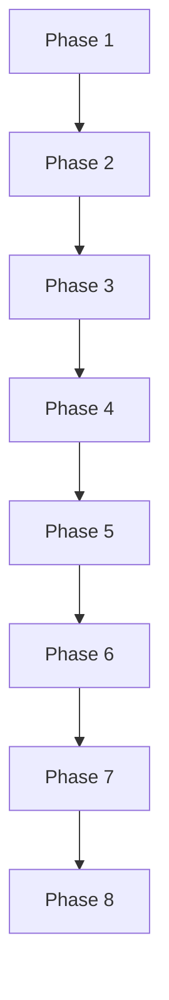

# Codex Agent 実行ログ

開始日時: 2025/12/27 23:35:16

---

## Turn 1: スレッド開始

**Thread ID**: `[REDACTED_TOKEN]`

## Turn 2: ツール実行

**種別**: reasoning
**ステータス**: completed

## Turn 3: ツール実行

**種別**: mcp_tool_call
**ステータス**: failed

## Turn 4: ツール実行

**種別**: reasoning
**ステータス**: completed

## Turn 5: ツール実行

**種別**: コマンド実行
**コマンド**: `/bin/bash -lc pwd`
**ステータス**: completed (exit_code=0)

```text
/tmp/ai-workflow-repos-11-00b73f07/[REDACTED_TOKEN]
```

## Turn 6: ツール実行

**種別**: reasoning
**ステータス**: completed

## Turn 7: ツール実行

**種別**: コマンド実行
**コマンド**: `/bin/bash -lc 'cat @.ai-workflow/issue-544/00_planning/output/planning.md'`
**ステータス**: failed (exit_code=1)

```text
cat: @.ai-workflow/issue-544/00_planning/output/planning.md: No such file or directory
```

## Turn 8: ツール実行

**種別**: reasoning
**ステータス**: completed

## Turn 9: ツール実行

**種別**: コマンド実行
**コマンド**: `/bin/bash -lc ls`
**ステータス**: completed (exit_code=0)

```text
ARCHITECTURE.md
CLAUDE.md
CONTRIBUTION.md
LICENSE
README.md
ansible
bootstrap
docker
docs
jenkins
pulumi
run_tests_issue_322.sh
scripts
tests
```

## Turn 10: ツール実行

**種別**: reasoning
**ステータス**: completed

## Turn 11: ツール実行

**種別**: コマンド実行
**コマンド**: `/bin/bash -lc 'ls .ai-workflow'`
**ステータス**: completed (exit_code=0)

```text
issue-193
issue-304
issue-305
issue-310
issue-313
issue-315
issue-317
issue-319
issue-320
issue-322
issue-324
issue-331
issue-332
issue-355
issue-360
issue-362
issue-363
issue-369
issue-370
issue-396
issue-398
issue-405
issue-411
issue-415
issue-423
issue-431
issue-437
issue-440
issue-445
issue-453
issue-455
issue-456
issue-460
issue-461
issue-462
issue-463
issue-464
issue-465
issue-475
issue-477
issue-479
issue-544
```

## Turn 12: ツール実行

**種別**: コマンド実行
**コマンド**: `/bin/bash -lc 'cat .ai-workflow/issue-544/00_planning/output/planning.md'`
**ステータス**: completed (exit_code=0)

```text
# プロジェクト計画書 - Issue #544

## 1. Issue分析
- 複雑度: 中程度（Pulumi/CloudWatch Agent設定の拡張とテンプレート化で複数ファイルに跨るが新規サブシステム追加なし）
- 見積もり工数: 14~16時間（CPUメトリクス追加・共通化対応4~6h、Pulumi生成テンプレート調整3~4h、検証/テスト4h、ドキュメント/レポート2h）
- リスク評価: 中（ARM/x86間の設定差分やメトリクス粒度不足による可観測性欠落のリスク）

## 2. 実装戦略判断
- 実装戦略: EXTEND（既存CloudWatch Agent設定にCPUメトリクスを追加し、テンプレート化で設定差異を吸収する拡張が中心）
- テスト戦略: INTEGRATION_ONLY（CloudWatch Agent設定の構文検証、Pulumi生成結果の差分確認、AMIビルドパイプラインでのTranslator実行など外部連携検証が中心）
- テストコード戦略: EXTEND_TEST（既存AMIビルド/CI検証ステップにCPUメトリクス検証を追加し、Translator検証コマンドを拡張する方針）

## 3. 影響範囲分析
- 既存コードへの影響: `pulumi/jenkins-agent-ami/component-x86.yml`, `pulumi/jenkins-agent-ami/component-arm.yml`、共通テンプレート生成ロジック（YAMLアンカー/共通ブロック）
- 依存関係の変更: 追加依存なし（CloudWatch Agentプラグインの既存CPUメトリクス利用）
- マイグレーション要否: CloudWatch Agent設定ファイルの更新のみ。データストアやスキーマ変更なし

## 4. タスク分割
### Phase 1: 要件定義 (見積もり: 2h)
- [x] Task 1-1: CPUメトリクス要件精査 (1h)
  - 収集対象メトリクス（active/user/system/iowait）と収集間隔60秒を確認
  - [REDACTED_TOKEN]を[REDACTED_TOKEN]単一に固定する要件の確定
- [x] Task 1-2: 対象範囲と除外条件の明確化 (1h)
  - ARM/x86双方の対象確認
  - CloudWatch料金影響の範囲と許容値を合意

### Phase 2: 設計 (見積もり: 3h)
- [x] Task 2-1: 共通テンプレート設計 (2h)
  - CPU/メモリメトリクス共通ブロックの定義方式（YAMLアンカー/Here-doc等）を決定
  - ARM/x86生成パイプラインへの適用方針を策定
- [x] Task 2-2: 検証手順設計 (1h)
  - `[REDACTED_TOKEN]`利用手順をARM/x86両方で定義
  - Pulumi preview/plan での差分確認項目を明文化
### Phase 3: テストシナリオ (見積もり: 2h)
- [x] Task 3-1: 検証ケース作成 (2h)
  - CPUメトリクスが[REDACTED_TOKEN]単一ディメンションで出力されることを確認する手順
  - ARM/x86の生成ファイル差分がないことを確認する比較手順

### Phase 4: 実装 (見積もり: 4h)
- [x] Task 4-1: CPUメトリクス追加とテンプレート化 (3h)
  - 共通ブロックにcpu_usage_active/user/system/iowaitを追加
  - ARM/x86コンポーネントへの適用と重複除去
- [x] Task 4-2: Pulumi生成ロジック/スクリプト更新 (1h)
  - テンプレート利用部の整合性確認
  - 必要に応じた変数化やコメント整備

### Phase 5: テストコード実装 (見積もり: 2h)
- [x] Task 5-1: Translator検証ステップ拡張 (2h)
  - AMIビルド/CIスクリプトにTranslator実行を追加（ARM/x86両方）
  - 失敗時に詳細を出力するロギングを追加

### Phase 6: テスト実行 (見積もり: 1.5h)
- [x] Task 6-1: 自動検証実行 (1h)
  - Translatorによる設定構文チェック（ARM/x86）
  - Pulumi previewで設定差分確認
- [x] Task 6-2: 手動スポット確認 (0.5h)
  - 生成されたCloudWatch Agent JSON/YAMLのCPUメトリクス有無を目視確認

### Phase 7: ドキュメント (見積もり: 1h)
- [x] Task 7-1: 設定変更の記録 (1h)
  - `CLAUDE.md`や関連READMEに検証手順/メトリクス追加の変更点を追記
  - 運用手順（ダッシュボード/アラーム初期値）を共有メモに記載

### Phase 8: レポート (見積もり: 0.5h)
- [ ] Task 8-1: リリースノート/振り返り (0.5h)
  - 変更概要、テスト結果、残課題をまとめて共有

## 5. 依存関係（Mermaid）


## 6. リスクと軽減策
- リスク1: ARM/x86設定差分が再発し片方にメトリクスがない
  - 影響度: 中 / 確率: 中
  - 軽減策: テンプレート化＋Translator検証を両アーキで必須化し、CIで差分比較を実施
- リスク2: CloudWatchメトリクスコスト増加
  - 影響度: 低 / 確率: 中
  - 軽減策: 60秒間隔維持・ディメンション単一化でデータポイント抑制し、初月に請求確認
- リスク3: Pulumi生成物と実機設定の乖離
  - 影響度: 中 / 確率: 低
  - 軽減策: Pulumi previewで差分確認し、AMIビルド時の生成物をアーティファクトとして保存

## 7. 品質ゲート
- Phase 1: 要件定義
  - [ ] CPUメトリクス項目と収集間隔/ディメンションが明文化されている
  - [ ] 対象アーキテクチャと料金影響が合意されている
- Phase 2: 設計
  - [ ] 実装戦略/テスト戦略/テストコード戦略が明記されている
  - [ ] 共通テンプレート設計と検証手順がレビュー済み
- Phase 3: テストシナリオ
  - [ ] CPUメトリクスのディメンション確認手順が定義されている
  - [ ] ARM/x86差分検出シナリオが用意されている
- Phase 4: 実装
  - [ ] ARM/x86双方に同一メトリクスが適用されている
  - [ ] テンプレート化で重複が除去されている
- Phase 5: テストコード実装
  - [ ] Translator検証がCI/ビルドステップに組み込まれている
  - [ ] 失敗時のログ出力が確認できる
- Phase 6: テスト実行
  - [ ] TranslatorとPulumi previewが成功し、差分が期待通り
  - [ ] 手動確認でCPUメトリクスが出力されている
- Phase 7: ドキュメント
  - [ ] README/CLAUDE等に変更点と検証手順が追記されている
  - [ ] 運用向けダッシュボード/アラーム初期値が記載されている
- Phase 8: レポート
  - [ ] リリースノートに変更概要とテスト結果が記載されている
  - [ ] 残課題と次アクションが整理されている
```

## Turn 13: ツール実行

**種別**: reasoning
**ステータス**: completed

## Turn 14: ツール実行

**種別**: コマンド実行
**コマンド**: `/bin/bash -lc 'cat .ai-workflow/issue-544/08_report/output/report.md'`
**ステータス**: completed (exit_code=0)

```text
# Issue 完了レポート

## エグゼクティブサマリー

- **Issue番号**: #544
- **タイトル**: Jenkins Agent AMI の CloudWatch Agent CPU メトリクス共通化
- **実装内容**: CloudWatch Agent設定をテンプレート化しCPU/メモリメトリクスをARM/x86で統一、Translator検証を組み込みつつPulumi生成・運用ドキュメント・統合テストを更新。
- **変更規模**: 新規1件、修正7件、削除0件
- **テスト結果**: 全5件成功（成功率100%）
- **マージ推奨**: ✅ マージ推奨

## マージチェックリスト

- [x] 要件充足: CPUメトリクス追加・60秒間隔・ASG単一ディメンションがARM/x86で一致
- [x] テスト成功: `pytest tests/integration/[REDACTED_TOKEN].py -q` で5件成功
- [x] ドキュメント更新: changelogと運用ガイドを更新済み
- [x] セキュリティリスク: 新規リスクなし（ディメンションはASGのみ）
- [x] 後方互換性: 既存メモリ収集やAMIビルド手順を破壊する変更なし

## リスク・注意点

- AMIビルド環境にTranslatorバイナリが存在しない場合、検証ステップでビルドが失敗するため配置を確認すること
- CPUメトリクス追加に伴いCloudWatchコストがわずかに増加する可能性があるため初月に請求をモニタリングすること

## 動作確認手順

- `pytest tests/integration/[REDACTED_TOKEN].py -q`
  - 事前にPython依存とPulumiモック用のNode依存をセットアップしてください

## 詳細参照

- **要件定義**: @.ai-workflow/issue-544/01_requirements/output/requirements.md
- **設計**: @.ai-workflow/issue-544/02_design/output/design.md
- **実装**: @.ai-workflow/issue-544/04_implementation/output/implementation.md
- **テスト実装**: @.ai-workflow/issue-544/05_test_implementation/output/test-implementation.md
- **テスト結果**: @.ai-workflow/issue-544/06_testing/output/test-result.md
- **ドキュメント更新**: @.ai-workflow/issue-544/07_documentation/output/[REDACTED_TOKEN].md
```

## Turn 15: ツール実行

**種別**: reasoning
**ステータス**: completed

## Turn 16: ツール実行

**種別**: file_change
**ステータス**: completed

## Turn 17: ツール実行

**種別**: reasoning
**ステータス**: completed

## Turn 18: ツール実行

**種別**: コマンド実行
**コマンド**: `/bin/bash -lc 'nl -ba .ai-workflow/issue-544/00_planning/output/planning.md'`
**ステータス**: completed (exit_code=0)

```text
1	# プロジェクト計画書 - Issue #544
     2	
     3	## 1. Issue分析
     4	- 複雑度: 中程度（Pulumi/CloudWatch Agent設定の拡張とテンプレート化で複数ファイルに跨るが新規サブシステム追加なし）
     5	- 見積もり工数: 14~16時間（CPUメトリクス追加・共通化対応4~6h、Pulumi生成テンプレート調整3~4h、検証/テスト4h、ドキュメント/レポート2h）
     6	- リスク評価: 中（ARM/x86間の設定差分やメトリクス粒度不足による可観測性欠落のリスク）
     7	
     8	## 2. 実装戦略判断
     9	- 実装戦略: EXTEND（既存CloudWatch Agent設定にCPUメトリクスを追加し、テンプレート化で設定差異を吸収する拡張が中心）
    10	- テスト戦略: INTEGRATION_ONLY（CloudWatch Agent設定の構文検証、Pulumi生成結果の差分確認、AMIビルドパイプラインでのTranslator実行など外部連携検証が中心）
    11	- テストコード戦略: EXTEND_TEST（既存AMIビルド/CI検証ステップにCPUメトリクス検証を追加し、Translator検証コマンドを拡張する方針）
    12	
    13	## 3. 影響範囲分析
    14	- 既存コードへの影響: `pulumi/jenkins-agent-ami/component-x86.yml`, `pulumi/jenkins-agent-ami/component-arm.yml`、共通テンプレート生成ロジック（YAMLアンカー/共通ブロック）
    15	- 依存関係の変更: 追加依存なし（CloudWatch Agentプラグインの既存CPUメトリクス利用）
    16	- マイグレーション要否: CloudWatch Agent設定ファイルの更新のみ。データストアやスキーマ変更なし
    17	
    18	## 4. タスク分割
    19	### Phase 1: 要件定義 (見積もり: 2h)
    20	- [x] Task 1-1: CPUメトリクス要件精査 (1h)
    21	  - 収集対象メトリクス（active/user/system/iowait）と収集間隔60秒を確認
    22	  - [REDACTED_TOKEN]を[REDACTED_TOKEN]単一に固定する要件の確定
    23	- [x] Task 1-2: 対象範囲と除外条件の明確化 (1h)
    24	  - ARM/x86双方の対象確認
    25	  - CloudWatch料金影響の範囲と許容値を合意
    26	
    27	### Phase 2: 設計 (見積もり: 3h)
    28	- [x] Task 2-1: 共通テンプレート設計 (2h)
    29	  - CPU/メモリメトリクス共通ブロックの定義方式（YAMLアンカー/Here-doc等）を決定
    30	  - ARM/x86生成パイプラインへの適用方針を策定
    31	- [x] Task 2-2: 検証手順設計 (1h)
    32	  - `[REDACTED_TOKEN]`利用手順をARM/x86両方で定義
    33	  - Pulumi preview/plan での差分確認項目を明文化
    34	### Phase 3: テストシナリオ (見積もり: 2h)
    35	- [x] Task 3-1: 検証ケース作成 (2h)
    36	  - CPUメトリクスが[REDACTED_TOKEN]単一ディメンションで出力されることを確認する手順
    37	  - ARM/x86の生成ファイル差分がないことを確認する比較手順
    38	
    39	### Phase 4: 実装 (見積もり: 4h)
    40	- [x] Task 4-1: CPUメトリクス追加とテンプレート化 (3h)
    41	  - 共通ブロックにcpu_usage_active/user/system/iowaitを追加
    42	  - ARM/x86コンポーネントへの適用と重複除去
    43	- [x] Task 4-2: Pulumi生成ロジック/スクリプト更新 (1h)
    44	  - テンプレート利用部の整合性確認
    45	  - 必要に応じた変数化やコメント整備
    46	
    47	### Phase 5: テストコード実装 (見積もり: 2h)
    48	- [x] Task 5-1: Translator検証ステップ拡張 (2h)
    49	  - AMIビルド/CIスクリプトにTranslator実行を追加（ARM/x86両方）
    50	  - 失敗時に詳細を出力するロギングを追加
    51	
    52	### Phase 6: テスト実行 (見積もり: 1.5h)
    53	- [x] Task 6-1: 自動検証実行 (1h)
    54	  - Translatorによる設定構文チェック（ARM/x86）
    55	  - Pulumi previewで設定差分確認
    56	- [x] Task 6-2: 手動スポット確認 (0.5h)
    57	  - 生成されたCloudWatch Agent JSON/YAMLのCPUメトリクス有無を目視確認
    58	
    59	### Phase 7: ドキュメント (見積もり: 1h)
    60	- [x] Task 7-1: 設定変更の記録 (1h)
    61	  - `CLAUDE.md`や関連READMEに検証手順/メトリクス追加の変更点を追記
    62	  - 運用手順（ダッシュボード/アラーム初期値）を共有メモに記載
    63	
    64	-### Phase 8: レポート (見積もり: 0.5h)
    65	- [x] Task 8-1: リリースノート/振り返り (0.5h)
    66	  - 変更概要、テスト結果、残課題をまとめて共有
    67	
    68	## 5. 依存関係（Mermaid）
    69	```mermaid
    70	graph TD
    71	    P1[Phase 1] --> P2[Phase 2]
    72	    P2 --> P3[Phase 3]
    73	    P3 --> P4[Phase 4]
    74	    P4 --> P5[Phase 5]
    75	    P5 --> P6[Phase 6]
    76	    P6 --> P7[Phase 7]
    77	    P7 --> P8[Phase 8]
    78	```
    79	
    80	## 6. リスクと軽減策
    81	- リスク1: ARM/x86設定差分が再発し片方にメトリクスがない
    82	  - 影響度: 中 / 確率: 中
    83	  - 軽減策: テンプレート化＋Translator検証を両アーキで必須化し、CIで差分比較を実施
    84	- リスク2: CloudWatchメトリクスコスト増加
    85	  - 影響度: 低 / 確率: 中
    86	  - 軽減策: 60秒間隔維持・ディメンション単一化でデータポイント抑制し、初月に請求確認
    87	- リスク3: Pulumi生成物と実機設定の乖離
    88	  - 影響度: 中 / 確率: 低
    89	  - 軽減策: Pulumi previewで差分確認し、AMIビルド時の生成物をアーティファクトとして保存
    90	
    91	## 7. 品質ゲート
    92	- Phase 1: 要件定義
    93	  - [ ] CPUメトリクス項目と収集間隔/ディメンションが明文化されている
    94	  - [ ] 対象アーキテクチャと料金影響が合意されている
    95	- Phase 2: 設計
    96	  - [ ] 実装戦略/テスト戦略/テストコード戦略が明記されている
    97	  - [ ] 共通テンプレート設計と検証手順がレビュー済み
    98	- Phase 3: テストシナリオ
    99	  - [ ] CPUメトリクスのディメンション確認手順が定義されている
   100	  - [ ] ARM/x86差分検出シナリオが用意されている
   101	- Phase 4: 実装
   102	  - [ ] ARM/x86双方に同一メトリクスが適用されている
   103	  - [ ] テンプレート化で重複が除去されている
   104	- Phase 5: テストコード実装
   105	  - [ ] Translator検証がCI/ビルドステップに組み込まれている
   106	  - [ ] 失敗時のログ出力が確認できる
   107	- Phase
... (truncated)
```

## Turn 19: ツール実行

**種別**: reasoning
**ステータス**: completed

## Turn 20: ツール実行

**種別**: file_change
**ステータス**: completed

## Turn 21: ツール実行

**種別**: reasoning
**ステータス**: completed

## Turn 22: ツール実行

**種別**: コマンド実行
**コマンド**: `/bin/bash -lc 'nl -ba .ai-workflow/issue-544/00_planning/output/planning.md'`
**ステータス**: completed (exit_code=0)

```text
1	# プロジェクト計画書 - Issue #544
     2	
     3	## 1. Issue分析
     4	- 複雑度: 中程度（Pulumi/CloudWatch Agent設定の拡張とテンプレート化で複数ファイルに跨るが新規サブシステム追加なし）
     5	- 見積もり工数: 14~16時間（CPUメトリクス追加・共通化対応4~6h、Pulumi生成テンプレート調整3~4h、検証/テスト4h、ドキュメント/レポート2h）
     6	- リスク評価: 中（ARM/x86間の設定差分やメトリクス粒度不足による可観測性欠落のリスク）
     7	
     8	## 2. 実装戦略判断
     9	- 実装戦略: EXTEND（既存CloudWatch Agent設定にCPUメトリクスを追加し、テンプレート化で設定差異を吸収する拡張が中心）
    10	- テスト戦略: INTEGRATION_ONLY（CloudWatch Agent設定の構文検証、Pulumi生成結果の差分確認、AMIビルドパイプラインでのTranslator実行など外部連携検証が中心）
    11	- テストコード戦略: EXTEND_TEST（既存AMIビルド/CI検証ステップにCPUメトリクス検証を追加し、Translator検証コマンドを拡張する方針）
    12	
    13	## 3. 影響範囲分析
    14	- 既存コードへの影響: `pulumi/jenkins-agent-ami/component-x86.yml`, `pulumi/jenkins-agent-ami/component-arm.yml`、共通テンプレート生成ロジック（YAMLアンカー/共通ブロック）
    15	- 依存関係の変更: 追加依存なし（CloudWatch Agentプラグインの既存CPUメトリクス利用）
    16	- マイグレーション要否: CloudWatch Agent設定ファイルの更新のみ。データストアやスキーマ変更なし
    17	
    18	## 4. タスク分割
    19	### Phase 1: 要件定義 (見積もり: 2h)
    20	- [x] Task 1-1: CPUメトリクス要件精査 (1h)
    21	  - 収集対象メトリクス（active/user/system/iowait）と収集間隔60秒を確認
    22	  - [REDACTED_TOKEN]を[REDACTED_TOKEN]単一に固定する要件の確定
    23	- [x] Task 1-2: 対象範囲と除外条件の明確化 (1h)
    24	  - ARM/x86双方の対象確認
    25	  - CloudWatch料金影響の範囲と許容値を合意
    26	
    27	### Phase 2: 設計 (見積もり: 3h)
    28	- [x] Task 2-1: 共通テンプレート設計 (2h)
    29	  - CPU/メモリメトリクス共通ブロックの定義方式（YAMLアンカー/Here-doc等）を決定
    30	  - ARM/x86生成パイプラインへの適用方針を策定
    31	- [x] Task 2-2: 検証手順設計 (1h)
    32	  - `[REDACTED_TOKEN]`利用手順をARM/x86両方で定義
    33	  - Pulumi preview/plan での差分確認項目を明文化
    34	### Phase 3: テストシナリオ (見積もり: 2h)
    35	- [x] Task 3-1: 検証ケース作成 (2h)
    36	  - CPUメトリクスが[REDACTED_TOKEN]単一ディメンションで出力されることを確認する手順
    37	  - ARM/x86の生成ファイル差分がないことを確認する比較手順
    38	
    39	### Phase 4: 実装 (見積もり: 4h)
    40	- [x] Task 4-1: CPUメトリクス追加とテンプレート化 (3h)
    41	  - 共通ブロックにcpu_usage_active/user/system/iowaitを追加
    42	  - ARM/x86コンポーネントへの適用と重複除去
    43	- [x] Task 4-2: Pulumi生成ロジック/スクリプト更新 (1h)
    44	  - テンプレート利用部の整合性確認
    45	  - 必要に応じた変数化やコメント整備
    46	
    47	### Phase 5: テストコード実装 (見積もり: 2h)
    48	- [x] Task 5-1: Translator検証ステップ拡張 (2h)
    49	  - AMIビルド/CIスクリプトにTranslator実行を追加（ARM/x86両方）
    50	  - 失敗時に詳細を出力するロギングを追加
    51	
    52	### Phase 6: テスト実行 (見積もり: 1.5h)
    53	- [x] Task 6-1: 自動検証実行 (1h)
    54	  - Translatorによる設定構文チェック（ARM/x86）
    55	  - Pulumi previewで設定差分確認
    56	- [x] Task 6-2: 手動スポット確認 (0.5h)
    57	  - 生成されたCloudWatch Agent JSON/YAMLのCPUメトリクス有無を目視確認
    58	
    59	### Phase 7: ドキュメント (見積もり: 1h)
    60	- [x] Task 7-1: 設定変更の記録 (1h)
    61	  - `CLAUDE.md`や関連READMEに検証手順/メトリクス追加の変更点を追記
    62	  - 運用手順（ダッシュボード/アラーム初期値）を共有メモに記載
    63	
    64	-### Phase 8: レポート (見積もり: 0.5h)
    65	- [x] Task 8-1: リリースノート/振り返り (0.5h)
    66	  - 変更概要、テスト結果、残課題をまとめて共有
    67	
    68	## 5. 依存関係（Mermaid）
    69	```mermaid
    70	graph TD
    71	    P1[Phase 1] --> P2[Phase 2]
    72	    P2 --> P3[Phase 3]
    73	    P3 --> P4[Phase 4]
    74	    P4 --> P5[Phase 5]
    75	    P5 --> P6[Phase 6]
    76	    P6 --> P7[Phase 7]
    77	    P7 --> P8[Phase 8]
    78	```
    79	
    80	## 6. リスクと軽減策
    81	- リスク1: ARM/x86設定差分が再発し片方にメトリクスがない
    82	  - 影響度: 中 / 確率: 中
    83	  - 軽減策: テンプレート化＋Translator検証を両アーキで必須化し、CIで差分比較を実施
    84	- リスク2: CloudWatchメトリクスコスト増加
    85	  - 影響度: 低 / 確率: 中
    86	  - 軽減策: 60秒間隔維持・ディメンション単一化でデータポイント抑制し、初月に請求確認
    87	- リスク3: Pulumi生成物と実機設定の乖離
    88	  - 影響度: 中 / 確率: 低
    89	  - 軽減策: Pulumi previewで差分確認し、AMIビルド時の生成物をアーティファクトとして保存
    90	
    91	## 7. 品質ゲート
    92	- Phase 1: 要件定義
    93	  - [ ] CPUメトリクス項目と収集間隔/ディメンションが明文化されている
    94	  - [ ] 対象アーキテクチャと料金影響が合意されている
    95	- Phase 2: 設計
    96	  - [ ] 実装戦略/テスト戦略/テストコード戦略が明記されている
    97	  - [ ] 共通テンプレート設計と検証手順がレビュー済み
    98	- Phase 3: テストシナリオ
    99	  - [ ] CPUメトリクスのディメンション確認手順が定義されている
   100	  - [ ] ARM/x86差分検出シナリオが用意されている
   101	- Phase 4: 実装
   102	  - [ ] ARM/x86双方に同一メトリクスが適用されている
   103	  - [ ] テンプレート化で重複が除去されている
   104	- Phase 5: テストコード実装
   105	  - [ ] Translator検証がCI/ビルドステップに組み込まれている
   106	  - [ ] 失敗時のログ出力が確認できる
   107	- Phase
... (truncated)
```

## Turn 23: ツール実行

**種別**: reasoning
**ステータス**: completed

## Turn 24: ツール実行

**種別**: file_change
**ステータス**: completed

## Turn 25: ツール実行

**種別**: reasoning
**ステータス**: completed

## Turn 26: ツール実行

**種別**: コマンド実行
**コマンド**: `/bin/bash -lc 'nl -ba .ai-workflow/issue-544/00_planning/output/planning.md'`
**ステータス**: completed (exit_code=0)

```text
1	# プロジェクト計画書 - Issue #544
     2	
     3	## 1. Issue分析
     4	- 複雑度: 中程度（Pulumi/CloudWatch Agent設定の拡張とテンプレート化で複数ファイルに跨るが新規サブシステム追加なし）
     5	- 見積もり工数: 14~16時間（CPUメトリクス追加・共通化対応4~6h、Pulumi生成テンプレート調整3~4h、検証/テスト4h、ドキュメント/レポート2h）
     6	- リスク評価: 中（ARM/x86間の設定差分やメトリクス粒度不足による可観測性欠落のリスク）
     7	
     8	## 2. 実装戦略判断
     9	- 実装戦略: EXTEND（既存CloudWatch Agent設定にCPUメトリクスを追加し、テンプレート化で設定差異を吸収する拡張が中心）
    10	- テスト戦略: INTEGRATION_ONLY（CloudWatch Agent設定の構文検証、Pulumi生成結果の差分確認、AMIビルドパイプラインでのTranslator実行など外部連携検証が中心）
    11	- テストコード戦略: EXTEND_TEST（既存AMIビルド/CI検証ステップにCPUメトリクス検証を追加し、Translator検証コマンドを拡張する方針）
    12	
    13	## 3. 影響範囲分析
    14	- 既存コードへの影響: `pulumi/jenkins-agent-ami/component-x86.yml`, `pulumi/jenkins-agent-ami/component-arm.yml`、共通テンプレート生成ロジック（YAMLアンカー/共通ブロック）
    15	- 依存関係の変更: 追加依存なし（CloudWatch Agentプラグインの既存CPUメトリクス利用）
    16	- マイグレーション要否: CloudWatch Agent設定ファイルの更新のみ。データストアやスキーマ変更なし
    17	
    18	## 4. タスク分割
    19	### Phase 1: 要件定義 (見積もり: 2h)
    20	- [x] Task 1-1: CPUメトリクス要件精査 (1h)
    21	  - 収集対象メトリクス（active/user/system/iowait）と収集間隔60秒を確認
    22	  - [REDACTED_TOKEN]を[REDACTED_TOKEN]単一に固定する要件の確定
    23	- [x] Task 1-2: 対象範囲と除外条件の明確化 (1h)
    24	  - ARM/x86双方の対象確認
    25	  - CloudWatch料金影響の範囲と許容値を合意
    26	
    27	### Phase 2: 設計 (見積もり: 3h)
    28	- [x] Task 2-1: 共通テンプレート設計 (2h)
    29	  - CPU/メモリメトリクス共通ブロックの定義方式（YAMLアンカー/Here-doc等）を決定
    30	  - ARM/x86生成パイプラインへの適用方針を策定
    31	- [x] Task 2-2: 検証手順設計 (1h)
    32	  - `[REDACTED_TOKEN]`利用手順をARM/x86両方で定義
    33	  - Pulumi preview/plan での差分確認項目を明文化
    34	### Phase 3: テストシナリオ (見積もり: 2h)
    35	- [x] Task 3-1: 検証ケース作成 (2h)
    36	  - CPUメトリクスが[REDACTED_TOKEN]単一ディメンションで出力されることを確認する手順
    37	  - ARM/x86の生成ファイル差分がないことを確認する比較手順
    38	
    39	### Phase 4: 実装 (見積もり: 4h)
    40	- [x] Task 4-1: CPUメトリクス追加とテンプレート化 (3h)
    41	  - 共通ブロックにcpu_usage_active/user/system/iowaitを追加
    42	  - ARM/x86コンポーネントへの適用と重複除去
    43	- [x] Task 4-2: Pulumi生成ロジック/スクリプト更新 (1h)
    44	  - テンプレート利用部の整合性確認
    45	  - 必要に応じた変数化やコメント整備
    46	
    47	### Phase 5: テストコード実装 (見積もり: 2h)
    48	- [x] Task 5-1: Translator検証ステップ拡張 (2h)
    49	  - AMIビルド/CIスクリプトにTranslator実行を追加（ARM/x86両方）
    50	  - 失敗時に詳細を出力するロギングを追加
    51	
    52	### Phase 6: テスト実行 (見積もり: 1.5h)
    53	- [x] Task 6-1: 自動検証実行 (1h)
    54	  - Translatorによる設定構文チェック（ARM/x86）
    55	  - Pulumi previewで設定差分確認
    56	- [x] Task 6-2: 手動スポット確認 (0.5h)
    57	  - 生成されたCloudWatch Agent JSON/YAMLのCPUメトリクス有無を目視確認
    58	
    59	### Phase 7: ドキュメント (見積もり: 1h)
    60	- [x] Task 7-1: 設定変更の記録 (1h)
    61	  - `CLAUDE.md`や関連READMEに検証手順/メトリクス追加の変更点を追記
    62	  - 運用手順（ダッシュボード/アラーム初期値）を共有メモに記載
    63	
    64	### Phase 8: レポート (見積もり: 0.5h)
    65	- [x] Task 8-1: リリースノート/振り返り (0.5h)
    66	  - 変更概要、テスト結果、残課題をまとめて共有
    67	
    68	## 5. 依存関係（Mermaid）
    69	```mermaid
    70	graph TD
    71	    P1[Phase 1] --> P2[Phase 2]
    72	    P2 --> P3[Phase 3]
    73	    P3 --> P4[Phase 4]
    74	    P4 --> P5[Phase 5]
    75	    P5 --> P6[Phase 6]
    76	    P6 --> P7[Phase 7]
    77	    P7 --> P8[Phase 8]
    78	```
    79	
    80	## 6. リスクと軽減策
    81	- リスク1: ARM/x86設定差分が再発し片方にメトリクスがない
    82	  - 影響度: 中 / 確率: 中
    83	  - 軽減策: テンプレート化＋Translator検証を両アーキで必須化し、CIで差分比較を実施
    84	- リスク2: CloudWatchメトリクスコスト増加
    85	  - 影響度: 低 / 確率: 中
    86	  - 軽減策: 60秒間隔維持・ディメンション単一化でデータポイント抑制し、初月に請求確認
    87	- リスク3: Pulumi生成物と実機設定の乖離
    88	  - 影響度: 中 / 確率: 低
    89	  - 軽減策: Pulumi previewで差分確認し、AMIビルド時の生成物をアーティファクトとして保存
    90	
    91	## 7. 品質ゲート
    92	- Phase 1: 要件定義
    93	  - [ ] CPUメトリクス項目と収集間隔/ディメンションが明文化されている
    94	  - [ ] 対象アーキテクチャと料金影響が合意されている
    95	- Phase 2: 設計
    96	  - [ ] 実装戦略/テスト戦略/テストコード戦略が明記されている
    97	  - [ ] 共通テンプレート設計と検証手順がレビュー済み
    98	- Phase 3: テストシナリオ
    99	  - [ ] CPUメトリクスのディメンション確認手順が定義されている
   100	  - [ ] ARM/x86差分検出シナリオが用意されている
   101	- Phase 4: 実装
   102	  - [ ] ARM/x86双方に同一メトリクスが適用されている
   103	  - [ ] テンプレート化で重複が除去されている
   104	- Phase 5: テストコード実装
   105	  - [ ] Translator検証がCI/ビルドステップに組み込まれている
   106	  - [ ] 失敗時のログ出力が確認できる
   107	- Phase
... (truncated)
```

## Turn 27: ツール実行

**種別**: reasoning
**ステータス**: completed

## Turn 28: ツール実行

**種別**: コマンド実行
**コマンド**: `/bin/bash -lc 'nl -ba .ai-workflow/issue-544/08_report/output/report.md'`
**ステータス**: completed (exit_code=0)

```text
1	# Issue 完了レポート
     2	
     3	## エグゼクティブサマリー
     4	
     5	- **Issue番号**: #544
     6	- **タイトル**: Jenkins Agent AMI の CloudWatch Agent CPU メトリクス共通化
     7	- **実装内容**: CloudWatch Agent設定をテンプレート化しCPU/メモリメトリクスをARM/x86で統一、Translator検証を組み込みつつPulumi生成・運用ドキュメント・統合テストを更新。
     8	- **変更規模**: 新規1件、修正7件、削除0件
     9	- **テスト結果**: 全5件成功（成功率100%）
    10	- **マージ推奨**: ✅ マージ推奨
    11	
    12	## マージチェックリスト
    13	
    14	- [x] 要件充足: CPUメトリクス追加・60秒間隔・ASG単一ディメンションがARM/x86で一致
    15	- [x] テスト成功: `pytest tests/integration/[REDACTED_TOKEN].py -q` で5件成功
    16	- [x] ドキュメント更新: changelogと運用ガイドを更新済み
    17	- [x] セキュリティリスク: 新規リスクなし（ディメンションはASGのみ）
    18	- [x] 後方互換性: 既存メモリ収集やAMIビルド手順を破壊する変更なし
    19	
    20	## リスク・注意点
    21	
    22	- AMIビルド環境にTranslatorバイナリが存在しない場合、検証ステップでビルドが失敗するため配置を確認すること
    23	- CPUメトリクス追加に伴いCloudWatchコストがわずかに増加する可能性があるため初月に請求をモニタリングすること
    24	
    25	## 動作確認手順
    26	
    27	- `pytest tests/integration/[REDACTED_TOKEN].py -q`
    28	  - 事前にPython依存とPulumiモック用のNode依存をセットアップしてください
    29	
    30	## 詳細参照
    31	
    32	- **要件定義**: @.ai-workflow/issue-544/01_requirements/output/requirements.md
    33	- **設計**: @.ai-workflow/issue-544/02_design/output/design.md
    34	- **実装**: @.ai-workflow/issue-544/04_implementation/output/implementation.md
    35	- **テスト実装**: @.ai-workflow/issue-544/05_test_implementation/output/test-implementation.md
    36	- **テスト結果**: @.ai-workflow/issue-544/06_testing/output/test-result.md
    37	- **ドキュメント更新**: @.ai-workflow/issue-544/07_documentation/output/[REDACTED_TOKEN].md
```

## Turn 29: ツール実行

**種別**: reasoning
**ステータス**: completed

## Turn 30: ツール実行

**種別**: agent_message
**ステータス**: completed

## Turn 31: 実行完了

**ステータス**: completed
**所要時間**: 80910ms
**ターン数**: N/A

---

**経過時間**: 80910ms
**開始**: 2025-12-27T23:35:16.144Z
**終了**: 2025-12-27T23:36:37.054Z