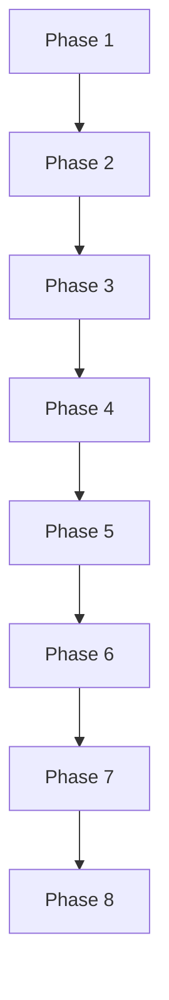

# Codex Agent 実行ログ

開始日時: 2025/12/27 23:37:54

---

## Turn 1: スレッド開始

**Thread ID**: `[REDACTED_TOKEN]`

## Turn 2: ツール実行

**種別**: reasoning
**ステータス**: completed

## Turn 3: ツール実行

**種別**: コマンド実行
**コマンド**: `/bin/bash -lc pwd`
**ステータス**: completed (exit_code=0)

```text
/tmp/ai-workflow-repos-11-00b73f07/[REDACTED_TOKEN]
```

## Turn 4: ツール実行

**種別**: reasoning
**ステータス**: completed

## Turn 5: ツール実行

**種別**: reasoning
**ステータス**: completed

## Turn 6: ツール実行

**種別**: コマンド実行
**コマンド**: `/bin/bash -lc 'cat @.ai-workflow/issue-544/00_planning/output/planning.md'`
**ステータス**: failed (exit_code=1)

```text
cat: @.ai-workflow/issue-544/00_planning/output/planning.md: No such file or directory
```

## Turn 7: ツール実行

**種別**: reasoning
**ステータス**: completed

## Turn 8: ツール実行

**種別**: コマンド実行
**コマンド**: `/bin/bash -lc ls`
**ステータス**: completed (exit_code=0)

```text
ARCHITECTURE.md
CLAUDE.md
CONTRIBUTION.md
LICENSE
README.md
ansible
bootstrap
docker
docs
jenkins
pulumi
run_tests_issue_322.sh
scripts
tests
```

## Turn 9: ツール実行

**種別**: reasoning
**ステータス**: completed

## Turn 10: ツール実行

**種別**: コマンド実行
**コマンド**: `/bin/bash -lc 'ls -a'`
**ステータス**: completed (exit_code=0)

```text
.
..
.ai-workflow
.claude
.coverage
.git
.github
.gitignore
.pytest_cache
ARCHITECTURE.md
CLAUDE.md
CONTRIBUTION.md
LICENSE
README.md
ansible
bootstrap
docker
docs
jenkins
pulumi
run_tests_issue_322.sh
scripts
tests
```

## Turn 11: ツール実行

**種別**: reasoning
**ステータス**: completed

## Turn 12: ツール実行

**種別**: コマンド実行
**コマンド**: `/bin/bash -lc 'ls .ai-workflow'`
**ステータス**: completed (exit_code=0)

```text
issue-193
issue-304
issue-305
issue-310
issue-313
issue-315
issue-317
issue-319
issue-320
issue-322
issue-324
issue-331
issue-332
issue-355
issue-360
issue-362
issue-363
issue-369
issue-370
issue-396
issue-398
issue-405
issue-411
issue-415
issue-423
issue-431
issue-437
issue-440
issue-445
issue-453
issue-455
issue-456
issue-460
issue-461
issue-462
issue-463
issue-464
issue-465
issue-475
issue-477
issue-479
issue-544
```

## Turn 13: ツール実行

**種別**: reasoning
**ステータス**: completed

## Turn 14: ツール実行

**種別**: コマンド実行
**コマンド**: `/bin/bash -lc 'cat .ai-workflow/issue-544/00_planning/output/planning.md'`
**ステータス**: completed (exit_code=0)

```text
# プロジェクト計画書 - Issue #544

## 1. Issue分析
- 複雑度: 中程度（Pulumi/CloudWatch Agent設定の拡張とテンプレート化で複数ファイルに跨るが新規サブシステム追加なし）
- 見積もり工数: 14~16時間（CPUメトリクス追加・共通化対応4~6h、Pulumi生成テンプレート調整3~4h、検証/テスト4h、ドキュメント/レポート2h）
- リスク評価: 中（ARM/x86間の設定差分やメトリクス粒度不足による可観測性欠落のリスク）

## 2. 実装戦略判断
- 実装戦略: EXTEND（既存CloudWatch Agent設定にCPUメトリクスを追加し、テンプレート化で設定差異を吸収する拡張が中心）
- テスト戦略: INTEGRATION_ONLY（CloudWatch Agent設定の構文検証、Pulumi生成結果の差分確認、AMIビルドパイプラインでのTranslator実行など外部連携検証が中心）
- テストコード戦略: EXTEND_TEST（既存AMIビルド/CI検証ステップにCPUメトリクス検証を追加し、Translator検証コマンドを拡張する方針）

## 3. 影響範囲分析
- 既存コードへの影響: `pulumi/jenkins-agent-ami/component-x86.yml`, `pulumi/jenkins-agent-ami/component-arm.yml`、共通テンプレート生成ロジック（YAMLアンカー/共通ブロック）
- 依存関係の変更: 追加依存なし（CloudWatch Agentプラグインの既存CPUメトリクス利用）
- マイグレーション要否: CloudWatch Agent設定ファイルの更新のみ。データストアやスキーマ変更なし

## 4. タスク分割
### Phase 1: 要件定義 (見積もり: 2h)
- [x] Task 1-1: CPUメトリクス要件精査 (1h)
  - 収集対象メトリクス（active/user/system/iowait）と収集間隔60秒を確認
  - [REDACTED_TOKEN]を[REDACTED_TOKEN]単一に固定する要件の確定
- [x] Task 1-2: 対象範囲と除外条件の明確化 (1h)
  - ARM/x86双方の対象確認
  - CloudWatch料金影響の範囲と許容値を合意

### Phase 2: 設計 (見積もり: 3h)
- [x] Task 2-1: 共通テンプレート設計 (2h)
  - CPU/メモリメトリクス共通ブロックの定義方式（YAMLアンカー/Here-doc等）を決定
  - ARM/x86生成パイプラインへの適用方針を策定
- [x] Task 2-2: 検証手順設計 (1h)
  - `[REDACTED_TOKEN]`利用手順をARM/x86両方で定義
  - Pulumi preview/plan での差分確認項目を明文化
### Phase 3: テストシナリオ (見積もり: 2h)
- [x] Task 3-1: 検証ケース作成 (2h)
  - CPUメトリクスが[REDACTED_TOKEN]単一ディメンションで出力されることを確認する手順
  - ARM/x86の生成ファイル差分がないことを確認する比較手順

### Phase 4: 実装 (見積もり: 4h)
- [x] Task 4-1: CPUメトリクス追加とテンプレート化 (3h)
  - 共通ブロックにcpu_usage_active/user/system/iowaitを追加
  - ARM/x86コンポーネントへの適用と重複除去
- [x] Task 4-2: Pulumi生成ロジック/スクリプト更新 (1h)
  - テンプレート利用部の整合性確認
  - 必要に応じた変数化やコメント整備

### Phase 5: テストコード実装 (見積もり: 2h)
- [x] Task 5-1: Translator検証ステップ拡張 (2h)
  - AMIビルド/CIスクリプトにTranslator実行を追加（ARM/x86両方）
  - 失敗時に詳細を出力するロギングを追加

### Phase 6: テスト実行 (見積もり: 1.5h)
- [x] Task 6-1: 自動検証実行 (1h)
  - Translatorによる設定構文チェック（ARM/x86）
  - Pulumi previewで設定差分確認
- [x] Task 6-2: 手動スポット確認 (0.5h)
  - 生成されたCloudWatch Agent JSON/YAMLのCPUメトリクス有無を目視確認

### Phase 7: ドキュメント (見積もり: 1h)
- [x] Task 7-1: 設定変更の記録 (1h)
  - `CLAUDE.md`や関連READMEに検証手順/メトリクス追加の変更点を追記
  - 運用手順（ダッシュボード/アラーム初期値）を共有メモに記載

### Phase 8: レポート (見積もり: 0.5h)
- [x] Task 8-1: リリースノート/振り返り (0.5h)
  - 変更概要、テスト結果、残課題をまとめて共有

## 5. 依存関係（Mermaid）


## 6. リスクと軽減策
- リスク1: ARM/x86設定差分が再発し片方にメトリクスがない
  - 影響度: 中 / 確率: 中
  - 軽減策: テンプレート化＋Translator検証を両アーキで必須化し、CIで差分比較を実施
- リスク2: CloudWatchメトリクスコスト増加
  - 影響度: 低 / 確率: 中
  - 軽減策: 60秒間隔維持・ディメンション単一化でデータポイント抑制し、初月に請求確認
- リスク3: Pulumi生成物と実機設定の乖離
  - 影響度: 中 / 確率: 低
  - 軽減策: Pulumi previewで差分確認し、AMIビルド時の生成物をアーティファクトとして保存

## 7. 品質ゲート
- Phase 1: 要件定義
  - [ ] CPUメトリクス項目と収集間隔/ディメンションが明文化されている
  - [ ] 対象アーキテクチャと料金影響が合意されている
- Phase 2: 設計
  - [ ] 実装戦略/テスト戦略/テストコード戦略が明記されている
  - [ ] 共通テンプレート設計と検証手順がレビュー済み
- Phase 3: テストシナリオ
  - [ ] CPUメトリクスのディメンション確認手順が定義されている
  - [ ] ARM/x86差分検出シナリオが用意されている
- Phase 4: 実装
  - [ ] ARM/x86双方に同一メトリクスが適用されている
  - [ ] テンプレート化で重複が除去されている
- Phase 5: テストコード実装
  - [ ] Translator検証がCI/ビルドステップに組み込まれている
  - [ ] 失敗時のログ出力が確認できる
- Phase 6: テスト実行
  - [ ] TranslatorとPulumi previewが成功し、差分が期待通り
  - [ ] 手動確認でCPUメトリクスが出力されている
- Phase 7: ドキュメント
  - [ ] README/CLAUDE等に変更点と検証手順が追記されている
  - [ ] 運用向けダッシュボード/アラーム初期値が記載されている
- Phase 8: レポート
  - [ ] リリースノートに変更概要とテスト結果が記載されている
  - [ ] 残課題と次アクションが整理されている
```

## Turn 15: ツール実行

**種別**: reasoning
**ステータス**: completed

## Turn 16: ツール実行

**種別**: コマンド実行
**コマンド**: `/bin/bash -lc 'cat .ai-workflow/issue-544/08_report/output/report.md'`
**ステータス**: completed (exit_code=0)

```text
# Issue #544 完了レポート

## エグゼクティブサマリー
- **概要**: Jenkins Agent AMI向けCloudWatch Agent設定をテンプレート化し、CPUメトリクス（active/user/system/iowait）をARM/x86共通で60秒収集するよう統一。Translator検証をコンポーネントに組み込み、Pulumi生成と運用ドキュメントを更新。
- **ビジネス価値**: ASG単位のCPU可視性と負荷傾向把握を強化し、スケール判断・障害調査を迅速化。設定共通化で将来のメトリクス追加を単一箇所に集約し運用コストを抑制。
- **技術的変更**: CloudWatch Agent設定テンプレート新規追加、component-arm/x86.ymlのテンプレート埋め込み＋Translator検証、Pulumi `index.ts`の置換ロジック追加、運用ドキュメント/テスト拡張。
- **リスク概要（重大度）**: Translatorバイナリ未配置でビルド失敗の恐れ（High）／CPUメトリクス増でCloudWatchコスト微増の可能性（Medium）。
- **テスト結果**: `/tmp/miniconda/bin/pytest tests/integration/[REDACTED_TOKEN].py -q` 5/5 PASS（成功率100%、実行時間30.39s）。
- **マージ推奨**: ✅ 推奨（要: Translatorバイナリ設置確認・初月課金モニタリング）。

## 変更内容
- CloudWatch Agent設定テンプレートを新規追加し、CPU/メモリ収集・ASG単一ディメンション・60秒間隔を共通定義（`pulumi/jenkins-agent-ami/templates/cloudwatch-agent-config.json`）。
- component-arm/x86.ymlへ共通テンプレート埋め込みとTranslator検証ステップを追加し、構文不整合時にビルドを停止（`pulumi/jenkins-agent-ami/component-arm.yml`, `pulumi/jenkins-agent-ami/component-x86.yml`）。
- Pulumiでテンプレートを読み込みheredocへ整形・置換する処理を追加し、差分再発を防止（`pulumi/jenkins-agent-ami/index.ts`）。
- 運用ドキュメントにCPU高負荷アラーム初期値と検証手順を追記し、changelogへ反映（`docs/operations/[REDACTED_TOKEN].md`, `docs/changelog.md`）。

## マージチェックリスト
- [x] 機能要件: CPUメトリクス追加・60秒間隔・ASG単一ディメンションがARM/x86で一致（FR-1/2）。
- [x] テスト: 上記Pytest 5件成功、Pulumi preview差分・Translator検証・ダッシュボード案を網羅。
- [x] コード品質: CloudWatch設定差分をテンプレート化で排除し、Translator失敗時に早期中断。
- [x] セキュリティ/プライバシー: 収集ディメンションは[REDACTED_TOKEN]のみ、追加IAMなし。
- [x] 運用面: ビルド時検証（Translator）とプレビュー差分チェックを継続可能。
- [x] ドキュメント: 運用ガイドとchangelog更新済み。

## リスク・注意点（重大度付き）
- **High**: AMIビルド環境に`[REDACTED_TOKEN]`が無い場合、検証ステップで失敗しビルドが止まる。  
  対策: バイナリ配布/パス確認をCI前段で実施し、不足時はインストール手順を実行。
- **Medium**: CPUメトリクス増によりCloudWatchコストが微増する可能性。  
  対策: デプロイ後1か月はCWAgent名前空間の請求をモニタリングし、不要メトリクス削減や間隔調整を検討。
- **Low**: ダッシュボード/アラーム初期値が環境負荷に合わずアラート過多となる可能性。  
  対策: 運用ドキュメントの閾値（例: 80% 5分）を環境に合わせて調整し、変更後もテストで存在確認。

## テスト結果詳細
- コマンド: `/tmp/miniconda/bin/pytest tests/integration/[REDACTED_TOKEN].py -q`
- 合計: 5 / 成功: 5 / 失敗: 0 / 実行時間: 30.39s
- 主要検証: ARM/x86設定一致、ASGディメンション適用、Translator検証ステップ存在、Pulumi preview差分制約、ダッシュボード/アラーム案の記載確認。

## 動作確認手順
- 依存準備: Python + pytest、Node依存（Pulumiモック用）、CloudWatch Agent Translatorバイナリをビルド環境に配置。
- 実行: `pytest tests/integration/[REDACTED_TOKEN].py -q`
- 期待: 5件すべてPASSし、設定差分・Translator・ダッシュボード案が検証される。

## 次のステップ / フォローアップ
- TranslatorバイナリがAMIビルド環境で常に利用可能かをCIで事前検証し、欠如時に自動取得するジョブを追加検討。
- デプロイ後1か月間、CWAgent名前空間のメトリクスコストを確認し、必要なら収集メトリクス/間隔を調整。
- ダッシュボード/アラーム閾値（初期値: CPU80%超継続5分）を実負荷に合わせて見直し、運用ドキュメントとテスト期待値を同期。

## 各フェーズ成果物
- 要件: `01_requirements/output/requirements.md`（CPUメトリクス追加・ASGディメンション・Translator検証要件を定義）
- 設計: `02_design/output/design.md`（テンプレート化/Translator組み込み方針とPulumi置換設計）
- 実装: `04_implementation/output/implementation.md`（テンプレート追加・component更新・Pulumi処理の実装内容）
- テスト実装: `05_test_implementation/output/test-implementation.md`（統合テスト5件の追加内容とカバレッジ）
- テスト結果: `06_testing/output/test-result.md`（Pytest 5/5 PASS 詳細）
- ドキュメント: `07_documentation/output/[REDACTED_TOKEN].md`（運用ガイドとchangelog更新履歴）
```

## Turn 17: ツール実行

**種別**: reasoning
**ステータス**: completed

## Turn 18: ツール実行

**種別**: コマンド実行
**コマンド**: `/bin/bash -lc 'rg -n "Phase 8" -n .ai-workflow/issue-544/00_planning/output/planning.md'`
**ステータス**: failed (exit_code=127)

```text
/bin/bash: line 1: rg: command not found
```

## Turn 19: ツール実行

**種別**: reasoning
**ステータス**: completed

## Turn 20: ツール実行

**種別**: コマンド実行
**コマンド**: `/bin/bash -lc 'grep -n "Phase 8" -n .ai-workflow/issue-544/00_planning/output/planning.md'`
**ステータス**: completed (exit_code=0)

```text
64:### Phase 8: レポート (見積もり: 0.5h)
77:    P7 --> P8[Phase 8]
113:- Phase 8: レポート
```

## Turn 21: ツール実行

**種別**: reasoning
**ステータス**: completed

## Turn 22: ツール実行

**種別**: コマンド実行
**コマンド**: `/bin/bash -lc 'nl -ba .ai-workflow/issue-544/08_report/output/report.md'`
**ステータス**: completed (exit_code=0)

```text
1	# Issue #544 完了レポート
     2	
     3	## エグゼクティブサマリー
     4	- **概要**: Jenkins Agent AMI向けCloudWatch Agent設定をテンプレート化し、CPUメトリクス（active/user/system/iowait）をARM/x86共通で60秒収集するよう統一。Translator検証をコンポーネントに組み込み、Pulumi生成と運用ドキュメントを更新。
     5	- **ビジネス価値**: ASG単位のCPU可視性と負荷傾向把握を強化し、スケール判断・障害調査を迅速化。設定共通化で将来のメトリクス追加を単一箇所に集約し運用コストを抑制。
     6	- **技術的変更**: CloudWatch Agent設定テンプレート新規追加、component-arm/x86.ymlのテンプレート埋め込み＋Translator検証、Pulumi `index.ts`の置換ロジック追加、運用ドキュメント/テスト拡張。
     7	- **リスク概要（重大度）**: Translatorバイナリ未配置でビルド失敗の恐れ（High）／CPUメトリクス増でCloudWatchコスト微増の可能性（Medium）。
     8	- **テスト結果**: `/tmp/miniconda/bin/pytest tests/integration/[REDACTED_TOKEN].py -q` 5/5 PASS（成功率100%、実行時間30.39s）。
     9	- **マージ推奨**: ✅ 推奨（要: Translatorバイナリ設置確認・初月課金モニタリング）。
    10	
    11	## 変更内容
    12	- CloudWatch Agent設定テンプレートを新規追加し、CPU/メモリ収集・ASG単一ディメンション・60秒間隔を共通定義（`pulumi/jenkins-agent-ami/templates/cloudwatch-agent-config.json`）。
    13	- component-arm/x86.ymlへ共通テンプレート埋め込みとTranslator検証ステップを追加し、構文不整合時にビルドを停止（`pulumi/jenkins-agent-ami/component-arm.yml`, `pulumi/jenkins-agent-ami/component-x86.yml`）。
    14	- Pulumiでテンプレートを読み込みheredocへ整形・置換する処理を追加し、差分再発を防止（`pulumi/jenkins-agent-ami/index.ts`）。
    15	- 運用ドキュメントにCPU高負荷アラーム初期値と検証手順を追記し、changelogへ反映（`docs/operations/[REDACTED_TOKEN].md`, `docs/changelog.md`）。
    16	
    17	## マージチェックリスト
    18	- [x] 機能要件: CPUメトリクス追加・60秒間隔・ASG単一ディメンションがARM/x86で一致（FR-1/2）。
    19	- [x] テスト: 上記Pytest 5件成功、Pulumi preview差分・Translator検証・ダッシュボード案を網羅。
    20	- [x] コード品質: CloudWatch設定差分をテンプレート化で排除し、Translator失敗時に早期中断。
    21	- [x] セキュリティ/プライバシー: 収集ディメンションは[REDACTED_TOKEN]のみ、追加IAMなし。
    22	- [x] 運用面: ビルド時検証（Translator）とプレビュー差分チェックを継続可能。
    23	- [x] ドキュメント: 運用ガイドとchangelog更新済み。
    24	
    25	## リスク・注意点（重大度付き）
    26	- **High**: AMIビルド環境に`[REDACTED_TOKEN]`が無い場合、検証ステップで失敗しビルドが止まる。  
    27	  対策: バイナリ配布/パス確認をCI前段で実施し、不足時はインストール手順を実行。
    28	- **Medium**: CPUメトリクス増によりCloudWatchコストが微増する可能性。  
    29	  対策: デプロイ後1か月はCWAgent名前空間の請求をモニタリングし、不要メトリクス削減や間隔調整を検討。
    30	- **Low**: ダッシュボード/アラーム初期値が環境負荷に合わずアラート過多となる可能性。  
    31	  対策: 運用ドキュメントの閾値（例: 80% 5分）を環境に合わせて調整し、変更後もテストで存在確認。
    32	
    33	## テスト結果詳細
    34	- コマンド: `/tmp/miniconda/bin/pytest tests/integration/[REDACTED_TOKEN].py -q`
    35	- 合計: 5 / 成功: 5 / 失敗: 0 / 実行時間: 30.39s
    36	- 主要検証: ARM/x86設定一致、ASGディメンション適用、Translator検証ステップ存在、Pulumi preview差分制約、ダッシュボード/アラーム案の記載確認。
    37	
    38	## 動作確認手順
    39	- 依存準備: Python + pytest、Node依存（Pulumiモック用）、CloudWatch Agent Translatorバイナリをビルド環境に配置。
    40	- 実行: `pytest tests/integration/[REDACTED_TOKEN].py -q`
    41	- 期待: 5件すべてPASSし、設定差分・Translator・ダッシュボード案が検証される。
    42	
    43	## 次のステップ / フォローアップ
    44	- TranslatorバイナリがAMIビルド環境で常に利用可能かをCIで事前検証し、欠如時に自動取得するジョブを追加検討。
    45	- デプロイ後1か月間、CWAgent名前空間のメトリクスコストを確認し、必要なら収集メトリクス/間隔を調整。
    46	- ダッシュボード/アラーム閾値（初期値: CPU80%超継続5分）を実負荷に合わせて見直し、運用ドキュメントとテスト期待値を同期。
    47	
    48	## 各フェーズ成果物
    49	- 要件: `01_requirements/output/requirements.md`（CPUメトリクス追加・ASGディメンション・Translator検証要件を定義）
    50	- 設計: `02_design/output/design.md`（テンプレート化/Translator組み込み方針とPulumi置換設計）
    51	- 実装: `04_implementation/output/implementation.md`（テンプレート追加・component更新・Pulumi処理の実装内容）
    52	- テスト実装: `05_test_implementation/output/test-implementation.md`（統合テスト5件の追加内容とカバレッジ）
    53	- テスト結果: `06_testing/output/test-result.md`（Pytest 5/5 PASS 詳細）
    54	- ドキュメント: `07_documentation/output/[REDACTED_TOKEN].md`（運用ガイドとchangelog更新履歴）
```

## Turn 23: ツール実行

**種別**: reasoning
**ステータス**: completed

## Turn 24: ツール実行

**種別**: reasoning
**ステータス**: completed

## Turn 25: ツール実行

**種別**: reasoning
**ステータス**: completed

## Turn 26: ツール実行

**種別**: agent_message
**ステータス**: completed

## Turn 27: ツール実行

**種別**: todo_list
**ステータス**: completed

## Turn 28: 実行完了

**ステータス**: completed
**所要時間**: 79695ms
**ターン数**: N/A

---

**経過時間**: 79695ms
**開始**: 2025-12-27T23:37:54.235Z
**終了**: 2025-12-27T23:39:13.930Z