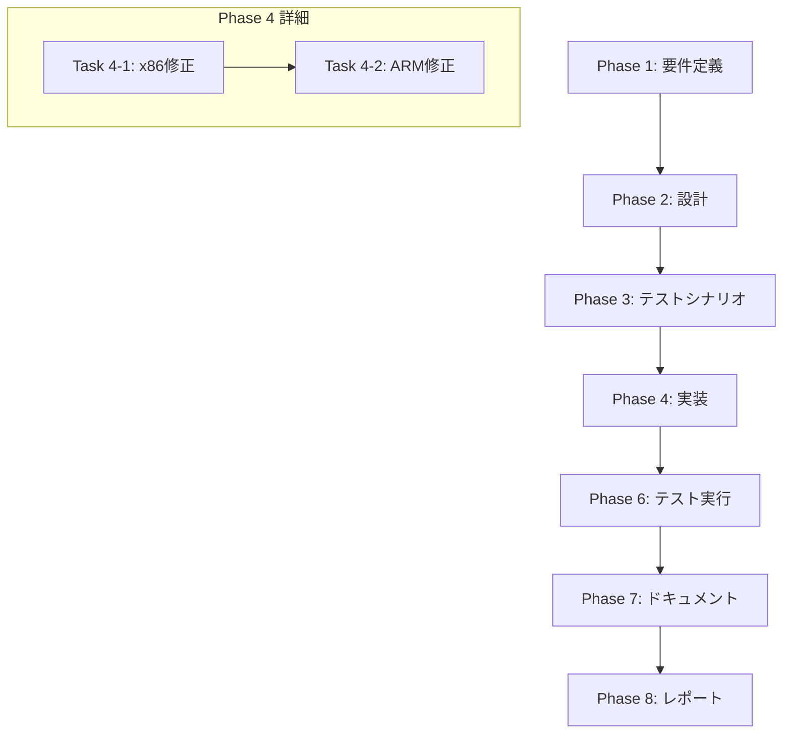

# プロジェクト計画書: Issue #547

## Jenkins Agent AMI ビルド失敗: CloudWatch Agent Translator が見つからない

---

## 1. Issue分析

### 問題の概要

Jenkins Agent AMIのイメージビルダーが、CloudWatch Agentの設定検証ステップ（`ValidateCloudWatchAgentConfig`）で失敗しています。Amazon Linux 2023 (AL2023) 環境において、CloudWatch Agentのtranslatorバイナリ（`amazon-cloudwatch-agent-config-translator`）が期待されるパス（`/opt/aws/amazon-cloudwatch-agent/bin/`）に存在しないことが原因です。

### 複雑度評価

**複雑度: 簡単**

- 単一コンポーネント（jenkins-agent-ami）内の2つのYAMLファイルの修正
- 既存の検証ロジックの置き換え/簡略化
- アーキテクチャ変更なし
- 新規依存関係の追加なし

### 見積もり工数

**合計: 約4時間**

| フェーズ | 見積もり | 根拠 |
|---------|---------|------|
| Phase 1: 要件定義 | 0.5h | Issue内容が明確、対応方法も複数提示済み |
| Phase 2: 設計 | 0.5h | 既存構造への軽微な変更のみ |
| Phase 3: テストシナリオ | 0.5h | 検証方法が限定的（AMIビルド実行） |
| Phase 4: 実装 | 1h | YAMLファイル2つの修正 |
| Phase 5: テストコード実装 | N/A | インフラコード（YAMLテンプレート）のため単体テスト不要 |
| Phase 6: テスト実行 | 0.5h | YAMLシンタックスチェック |
| Phase 7: ドキュメント | 0.5h | READMEへの注意事項追記 |
| Phase 8: レポート | 0.5h | 変更内容のサマリー作成 |

### リスク評価

**リスク: 低**

- 変更範囲が限定的
- 既存機能への影響が最小限
- ロールバックが容易（Git revert）

---

## 2. 実装戦略判断

### 実装戦略: EXTEND

**判断根拠:**
- 既存の`component-x86.yml`と`component-arm.yml`内の`ValidateCloudWatchAgentConfig`ステップを修正
- 新規ファイル・クラス・モジュールの作成は不要
- 既存のCloudWatch Agent設定・インストール処理は維持し、検証方法のみを変更
- EC2 Image Builderのコンポーネント定義という既存構造を拡張

### テスト戦略: INTEGRATION_ONLY

**判断根拠:**
- 対象がEC2 Image BuilderのコンポーネントYAMLファイル（インフラ定義）
- ユニットテスト対象のTypeScript/プログラムコードではない
- テストはAMIビルドパイプラインの実行（インテグレーションテスト）で確認
- BDDテストは不要（ユーザーストーリーベースの機能ではない）
- YAMLシンタックスチェックは静的解析で対応

### テストコード戦略: N/A（テストコード不要）

**判断根拠:**
- 修正対象がYAMLファイル（EC2 Image Builderコンポーネント定義）
- TypeScript/プログラムコードの変更なし
- テストは手動でのAMIビルド実行で検証
- 静的解析（YAMLシンタックスチェック）のみ実施

---

## 3. 影響範囲分析

### 既存コードへの影響

| ファイル | 変更内容 | 影響度 |
|---------|---------|--------|
| `pulumi/jenkins-agent-ami/component-x86.yml` | `ValidateCloudWatchAgentConfig`ステップの修正 | 中 |
| `pulumi/jenkins-agent-ami/component-arm.yml` | `ValidateCloudWatchAgentConfig`ステップの修正 | 中 |
| `pulumi/jenkins-agent-ami/index.ts` | 変更なし | なし |
| `pulumi/README.md` or `pulumi/CONTRIBUTION.md` | 注意事項追記（オプション） | 低 |

### 依存関係の変更

- **新規依存の追加**: なし
- **既存依存の変更**: なし
- EC2 Image Builderのコンポーネント定義のみ変更

### マイグレーション要否

- **データベーススキーマ変更**: 不要
- **設定ファイル変更**: YAMLファイルの修正のみ（ビルド時に自動適用）
- **SSMパラメータ変更**: 不要
- **既存AMIへの影響**: なし（新規ビルドから適用）

---

## 4. タスク分割

### Phase 1: 要件定義 (見積もり: 0.5h)

- [ ] Task 1-1: 問題の再現確認と分析 (0.25h)
  - Issueで報告されたエラーメッセージの確認
  - `ValidateCloudWatchAgentConfig`ステップの現状コード確認
  - AL2023でのCloudWatch Agentパッケージ構造の調査

- [ ] Task 1-2: 対応方法の決定 (0.25h)
  - 方法1（translator検索）、方法2（JSONシンタックスチェック）、方法3（CloudWatch Agent CLI）、方法4（スキップ可能化）の比較検討
  - 推奨対応方法の決定と理由の文書化

### Phase 2: 設計 (見積もり: 0.5h)

- [ ] Task 2-1: 修正設計 (0.5h)
  - 新しい`ValidateCloudWatchAgentConfig`ステップの設計
  - x86/ARM両アーキテクチャでの動作確認ポイントの整理
  - 既存ステップ（ConfigureCloudWatchAgent, EnableCloudWatchAgent）との整合性確認

### Phase 3: テストシナリオ (見積もり: 0.5h)

- [ ] Task 3-1: 検証シナリオの定義 (0.5h)
  - YAMLシンタックスチェックの実施方法
  - AMIビルド成功の確認方法
  - CloudWatch Agent設定が正しく動作することの確認方法

### Phase 4: 実装 (見積もり: 1h)

- [ ] Task 4-1: component-x86.ymlの修正 (0.5h)
  - `ValidateCloudWatchAgentConfig`ステップの修正（156-172行目）
  - translator依存を削除し、代替の検証方法を実装

- [ ] Task 4-2: component-arm.ymlの修正 (0.5h)
  - `ValidateCloudWatchAgentConfig`ステップの修正（156-172行目）
  - x86版と同一の修正を適用

### Phase 5: テストコード実装 (見積もり: N/A)

- このフェーズはスキップ
  - 理由: YAMLファイルの修正のため、プログラムコードのテストは不要

### Phase 6: テスト実行 (見積もり: 0.5h)

- [ ] Task 6-1: 静的解析 (0.25h)
  - YAMLシンタックスチェック（yamllint等）
  - 修正前後の差分確認

- [ ] Task 6-2: 動作確認方法の文書化 (0.25h)
  - AMIビルドパイプライン実行手順の確認
  - 成功判定基準の明確化

### Phase 7: ドキュメント (見積もり: 0.5h)

- [ ] Task 7-1: ドキュメント更新 (0.5h)
  - 修正内容のコード内コメント追加
  - pulumi/README.mdまたはCONTRIBUTION.mdへの注意事項追記（必要に応じて）
  - AL2023でのCloudWatch Agent検証に関する注意点の記載

### Phase 8: レポート (見積もり: 0.5h)

- [ ] Task 8-1: 完了レポート作成 (0.5h)
  - 変更内容のサマリー
  - テスト結果の記録
  - 今後の推奨事項

---

## 5. 依存関係



**注記**: Phase 5（テストコード実装）はYAMLファイル修正のためスキップ

---

## 6. リスクと軽減策

### リスク1: AL2023でのCloudWatch Agent CLI動作の不確実性

- **影響度**: 中
- **確率**: 低
- **説明**: 代替手段として検討している`amazon-cloudwatch-agent-ctl`コマンドがAL2023で想定通り動作しない可能性
- **軽減策**:
  - 事前にAL2023環境でコマンドの存在と動作を確認
  - 最悪の場合、JSONシンタックスチェック（jq）のみに簡略化

### リスク2: 検証ステップ削除による設定ミスの見逃し

- **影響度**: 中
- **確率**: 低
- **説明**: 検証を簡略化することで、CloudWatch Agent設定の問題を検出できなくなる可能性
- **軽減策**:
  - 最低限JSONシンタックスチェックは維持
  - validateフェーズでの設定ファイル存在確認は既存で実施済み
  - CloudWatch Agentサービス起動時のエラー検出で補完

### リスク3: ARM版とx86版の実装差異

- **影響度**: 低
- **確率**: 低
- **説明**: 修正をx86とARMで同一に適用できない可能性
- **軽減策**:
  - 両ファイルの該当箇所が同一であることを確認済み
  - 同一の修正を適用することで一貫性を保証

### リスク4: AMIビルド時間の長さによるテスト遅延

- **影響度**: 低
- **確率**: 高
- **説明**: AMIビルドには20-40分程度かかるため、テスト結果の確認に時間がかかる
- **軽減策**:
  - 静的解析（YAMLシンタックスチェック）で事前に問題を検出
  - 段階的に確認（まずx86、成功後ARM）

---

## 7. 品質ゲート

### Phase 1: 要件定義

- [x] 問題の根本原因が特定されている
- [x] 対応方法の候補が洗い出されている
- [ ] 採用する対応方法が決定され、理由が文書化されている

### Phase 2: 設計

- [ ] 修正箇所が明確に特定されている
- [ ] 既存機能（CloudWatch Agentインストール・設定・有効化）への影響がないことが確認されている
- [ ] x86/ARM両アーキテクチャでの一貫した設計になっている

### Phase 3: テストシナリオ

- [ ] YAMLシンタックスチェックの実施方法が定義されている
- [ ] AMIビルド成功の判定基準が明確化されている
- [ ] CloudWatch Agent動作確認の方法が定義されている

### Phase 4: 実装

- [ ] component-x86.ymlの`ValidateCloudWatchAgentConfig`ステップが修正されている
- [ ] component-arm.ymlの`ValidateCloudWatchAgentConfig`ステップが修正されている
- [ ] 修正内容がコーディング規約（日本語コメント）に準拠している

### Phase 5: テストコード実装

- N/A（YAMLファイル修正のためスキップ）

### Phase 6: テスト実行

- [ ] YAMLシンタックスチェックがエラーなしで完了している
- [ ] 修正前後の差分が意図した変更のみであることが確認されている

### Phase 7: ドキュメント

- [ ] 必要に応じてpulumi/README.mdまたはCONTRIBUTION.mdが更新されている
- [ ] コード内のコメントが適切に追加されている

### Phase 8: レポート

- [ ] 変更内容のサマリーが作成されている
- [ ] 今後の推奨事項（恒久対応等）が記載されている

---

## 8. 推奨する対応方法

Issueで提案されている4つの方法を検討した結果、以下を推奨します：

### 即時対応: 方法2（JSONシンタックスチェック）+ 方法3の一部

**理由:**
1. `jq`コマンドはInstallBasicPackagesステップで既にインストール済み
2. translatorバイナリへの依存を完全に排除できる
3. 設定ファイルの構文エラーは検出可能
4. CloudWatch Agent CLIの`fetch-config`は設定適用を伴うため、ビルド時の検証には適さない

**推奨する新しいValidateCloudWatchAgentConfigステップ:**

```yaml
- name: ValidateCloudWatchAgentConfig
  action: ExecuteBash
  inputs:
    commands:
      - echo "Validating CloudWatch Agent configuration..."
      - |
        set -e
        CONFIG_PATH="/opt/aws/amazon-cloudwatch-agent/etc/amazon-cloudwatch-agent.json"

        # 設定ファイルの存在確認
        if [ ! -f "$CONFIG_PATH" ]; then
          echo "ERROR: Configuration file not found at $CONFIG_PATH"
          exit 1
        fi

        # JSONシンタックスチェック（jqを使用）
        echo "Checking JSON syntax..."
        if ! jq empty "$CONFIG_PATH" 2>/dev/null; then
          echo "ERROR: Invalid JSON syntax in $CONFIG_PATH"
          jq . "$CONFIG_PATH" 2>&1 || true
          exit 1
        fi

        # 基本的な構造チェック（metricsセクションの存在確認）
        if ! jq -e '.metrics' "$CONFIG_PATH" >/dev/null 2>&1; then
          echo "WARNING: 'metrics' section not found in configuration"
        fi

        echo "CloudWatch Agent configuration validation passed."
      - cat /opt/aws/amazon-cloudwatch-agent/etc/amazon-cloudwatch-agent.json
```

---

## 9. 参考情報

### 関連ファイル

- `pulumi/jenkins-agent-ami/component-x86.yml:156-172` - x86版の問題箇所
- `pulumi/jenkins-agent-ami/component-arm.yml:156-172` - ARM版の問題箇所
- `pulumi/jenkins-agent-ami/index.ts` - Pulumiスタック定義（変更不要）
- `pulumi/jenkins-agent-ami/templates/cloudwatch-agent-config.json` - CloudWatch Agent設定テンプレート

### CloudWatch Agentインストールフロー（現状）

1. **InstallCloudWatchAgent** (136-142行目): `dnf install -y amazon-cloudwatch-agent`
2. **ConfigureCloudWatchAgent** (144-154行目): 設定ファイルの配置
3. **ValidateCloudWatchAgentConfig** (156-172行目): ❌ **問題箇所**
4. **EnableCloudWatchAgent** (173-179行目): サービス有効化

### 参考ドキュメント

- [AWS CloudWatch Agent ドキュメント](https://docs.aws.amazon.com/AmazonCloudWatch/latest/monitoring/CloudWatch-Agent.html)
- [EC2 Image Builder コンポーネントドキュメント](https://docs.aws.amazon.com/imagebuilder/latest/userguide/component-manager.html)
- プロジェクト内: `pulumi/CONTRIBUTION.md`, `CLAUDE.md`
