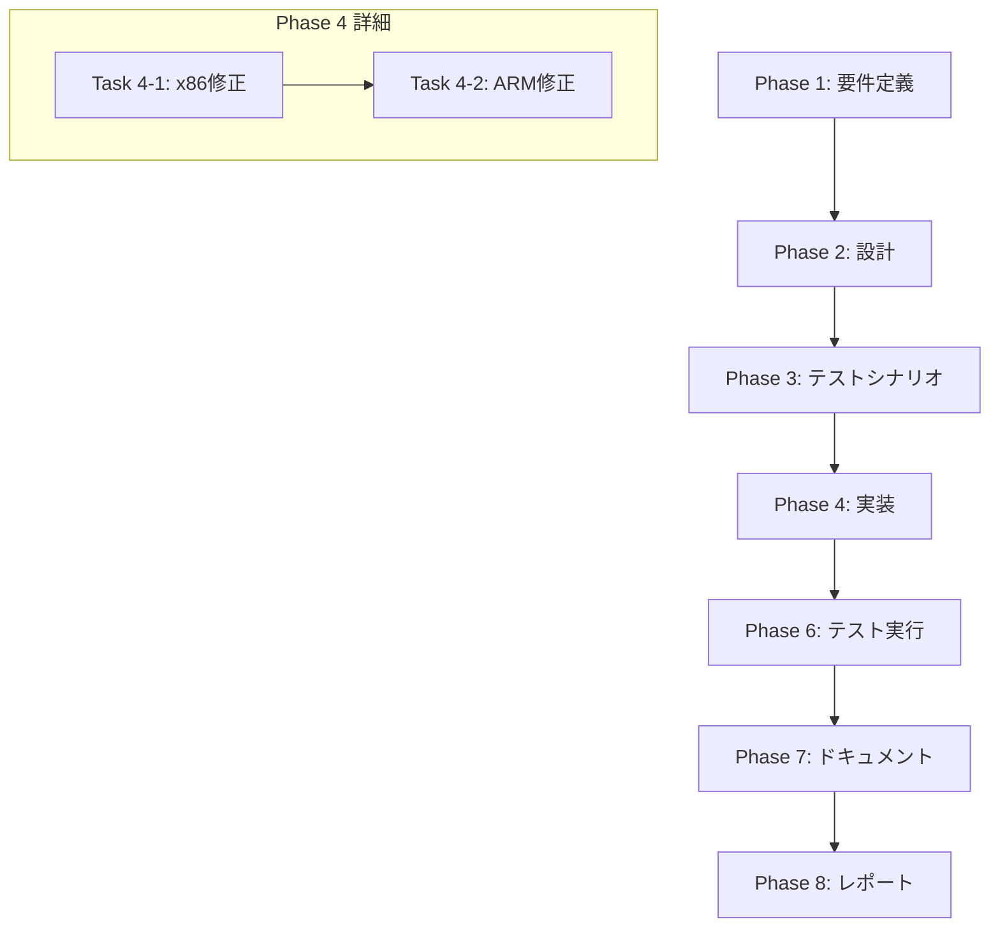

# Codex Agent 実行ログ

開始日時: 2025/12/29 8:59:30

---

## Turn 1: スレッド開始

**Thread ID**: `[REDACTED_TOKEN]`

## Turn 2: ツール実行

**種別**: reasoning
**ステータス**: completed

## Turn 3: ツール実行

**種別**: コマンド実行
**コマンド**: `/bin/bash -lc pwd`
**ステータス**: completed (exit_code=0)

```text
/tmp/ai-workflow-repos-11-9efb979b/[REDACTED_TOKEN]
```

## Turn 4: ツール実行

**種別**: reasoning
**ステータス**: completed

## Turn 5: ツール実行

**種別**: コマンド実行
**コマンド**: `/bin/bash -lc 'rg --files | grep -i planning.md'`
**ステータス**: failed (exit_code=1)

```text
/bin/bash: line 1: rg: command not found
```

## Turn 6: ツール実行

**種別**: reasoning
**ステータス**: completed

## Turn 7: ツール実行

**種別**: コマンド実行
**コマンド**: `/bin/bash -lc "find . -name 'Planning.md'"`
**ステータス**: completed (exit_code=0)

## Turn 8: ツール実行

**種別**: reasoning
**ステータス**: completed

## Turn 9: ツール実行

**種別**: コマンド実行
**コマンド**: `/bin/bash -lc ls`
**ステータス**: completed (exit_code=0)

```text
ARCHITECTURE.md
CLAUDE.md
CONTRIBUTION.md
LICENSE
README.md
ansible
bootstrap
docker
docs
jenkins
pulumi
run_tests_issue_322.sh
scripts
tests
```

## Turn 10: ツール実行

**種別**: reasoning
**ステータス**: completed

## Turn 11: ツール実行

**種別**: コマンド実行
**コマンド**: `/bin/bash -lc 'ls docs'`
**ステータス**: completed (exit_code=0)

```text
architecture
changelog.md
development
issues
operations
setup
troubleshooting.md
```

## Turn 12: ツール実行

**種別**: reasoning
**ステータス**: completed

## Turn 13: ツール実行

**種別**: コマンド実行
**コマンド**: `/bin/bash -lc 'grep -R "Planning" -n'`
**ステータス**: failed (exit_code=124)

```text
grep: .git/objects/pack/pack-8b54feca1f2ca93029cd06f1bfcd895fc0ed4912.pack: binary file matches
.ai-workflow/issue-193/01_requirements/output/requirements.md:6:**Planning Document**: @planning.md を参照
.ai-workflow/issue-193/01_requirements/output/requirements.md:10:## 0. Planning Documentの確認
.ai-workflow/issue-193/01_requirements/output/requirements.md:14:Planning Documentで策定された主要な方針：
.ai-workflow/issue-193/01_requirements/output/requirements.md:33:Planning Documentで特定された実装済みロジック（`ansible/playbooks/lambda/lambda_teardown_pipeline.yml` 66-69行目）:
.ai-workflow/issue-193/01_requirements/output/requirements.md:155:- **作業時間**: 2~3時間以内に完了させる（Planning Documentの見積もり）
.ai-workflow/issue-193/01_requirements/output/requirements.md:253:   - Planning Documentのテスト戦略（UNIT_ONLY）に従う
.ai-workflow/issue-193/01_requirements/output/requirements.md:279:- [x] **論理的な矛盾がない**: Planning Documentの戦略（EXTEND、UNIT_ONLY）と整合性あり
.ai-workflow/issue-193/01_requirements/output/requirements.md:326:- [ ] Planning Documentの戦略（EXTEND、UNIT_ONLY）に沿っているか
.ai-workflow/issue-193/02_design/output/design.md:7:**Planning Document**: @planning.md を参照
.ai-workflow/issue-193/02_design/output/design.md:11:## 0. Planning Documentおよび要件定義書の確認
.ai-workflow/issue-193/02_design/output/design.md:13:### Planning Documentの主要方針
.ai-workflow/issue-193/02_design/output/design.md:456:### 12.1. Planning Documentとの整合性確認
.ai-workflow/issue-193/02_design/output/design.md:458:| Planning項目 | 設計書での対応 | 状態 |
.ai-workflow/issue-193/02_design/output/design.md:504:この設計書は、以下の点でPlanning DocumentとRequirements Documentの方針に沿っています：
.ai-workflow/issue-193/02_design/output/design.md:517:- [x] Planning Documentの戦略（EXTEND、UNIT_ONLY、EXTEND_TEST）に沿っているか
.ai-workflow/issue-193/03_test_scenario/output/test-scenario.md:6:**Planning Document**: @planning.md を参照
.ai-workflow/issue-193/03_test_scenario/output/test-scenario.md:12:## 0. Planning Document・要件定義書・設計書の確認
.ai-workflow/issue-193/03_test_scenario/output/test-scenario.md:14:### Planning Documentの主要方針
.ai-workflow/issue-193/03_test_scenario/output/test-scenario.md:567:### 8.1. Planning Documentとの整合性確認
.ai-workflow/issue-193/03_test_scenario/output/test-scenario.md:569:| Planning項目 | テストシナリオでの対応 | 状態 |
.ai-workflow/issue-193/03_test_scenario/output/test-scenario.md:610:5. **品質ゲート準拠**: Planning DocumentとRequirements Documentの方針に完全準拠
.ai-workflow/issue-193/05_test_implementation/output/test-implementation.md:15:Planning Document（Phase 3）で明記：
.ai-workflow/issue-193/05_test_implementation/output/test-implementation.md:37:Planning Document（Phase 5）で明記：
.ai-workflow/issue-193/05_test_implementation/output/test-implementation.md:109:## Planning Documentとの整合性確認
.ai-workflow/issue-193/05_test_implementation/output/test-implementation.md:111:| Planning項目 | 判定結果 | 状態 |
.ai-workflow/issue-193/06_testing/output/test-result.md:24:### Planning Documentの方針
.ai-workflow/issue-193/06_testing/output/test-result.md:549:### Planning Documentとの整合性確認
.ai-workflow/issue-193/06_testing/output/test-result.md:551:| Planning項目 | テスト実施結果 | 状態 |
.ai-workflow/issue-193/06_testing/output/test-result.md:586:- Planning Documentの方針に完全準拠
.ai-workflow/issue-193/08_report/output/report.md:515:6. ✅ Planning Documentの方針に完全準拠
.ai-workflow/issue-193/09_evaluation/execute/agent_log.md:65:- Planning document estimates accurate (2-3 hours)
.ai-workflow/issue-193/09_evaluation/execute/agent_log_raw.txt:2:{"type":"assistant","message":{"model":"[REDACTED_TOKEN]","id":"[REDACTED_TOKEN]","type":"message","role":"assistant","content":[{"type":"text","text":"I'll conduct a thorough evaluation of all phases for Issue #193. Let me analyze each phase's deliverables against the evaluation criteria.\n\n## Phase Analysis\n\nAfter reviewing all phase documents, I can see this is a well-executed documentation-only task with excellent quality control throughout. Let me evaluate against each criterion:\n\n### 1. Requirements Completeness ✅\n- All requirements (FR-001 to FR-004) clearly defined and address
... (truncated)
```

## Turn 14: ツール実行

**種別**: reasoning
**ステータス**: completed

## Turn 15: ツール実行

**種別**: コマンド実行
**コマンド**: `/bin/bash -lc 'ls .ai-workflow'`
**ステータス**: completed (exit_code=0)

```text
issue-193
issue-304
issue-305
issue-310
issue-313
issue-315
issue-317
issue-319
issue-320
issue-322
issue-324
issue-331
issue-332
issue-355
issue-360
issue-362
issue-363
issue-369
issue-370
issue-396
issue-398
issue-405
issue-411
issue-415
issue-423
issue-431
issue-437
issue-440
issue-445
issue-453
issue-455
issue-456
issue-460
issue-461
issue-462
issue-463
issue-464
issue-465
issue-475
issue-477
issue-479
issue-547
```

## Turn 16: ツール実行

**種別**: reasoning
**ステータス**: completed

## Turn 17: ツール実行

**種別**: コマンド実行
**コマンド**: `/bin/bash -lc 'grep -n "Phase 6" .ai-workflow/issue-547/00_planning/output/planning.md'`
**ステータス**: completed (exit_code=0)

```text
33:| Phase 6: テスト実行 | 0.5h | YAMLシンタックスチェック |
155:### Phase 6: テスト実行 (見積もり: 0.5h)
188:    P4 --> P6[Phase 6: テスト実行]
273:### Phase 6: テスト実行
```

## Turn 18: ツール実行

**種別**: reasoning
**ステータス**: completed

## Turn 19: ツール実行

**種別**: コマンド実行
**コマンド**: `/bin/bash -lc "sed -n '150,230p' .ai-workflow/issue-547/00_planning/output/planning.md"`
**ステータス**: completed (exit_code=0)

```text
### Phase 5: テストコード実装 (見積もり: N/A)

- このフェーズはスキップ
  - 理由: YAMLファイルの修正のため、プログラムコードのテストは不要

### Phase 6: テスト実行 (見積もり: 0.5h)

- [ ] Task 6-1: 静的解析 (0.25h)
  - YAMLシンタックスチェック（yamllint等）
  - 修正前後の差分確認

- [ ] Task 6-2: 動作確認方法の文書化 (0.25h)
  - AMIビルドパイプライン実行手順の確認
  - 成功判定基準の明確化

### Phase 7: ドキュメント (見積もり: 0.5h)

- [ ] Task 7-1: ドキュメント更新 (0.5h)
  - 修正内容のコード内コメント追加
  - pulumi/README.mdまたはCONTRIBUTION.mdへの注意事項追記（必要に応じて）
  - AL2023でのCloudWatch Agent検証に関する注意点の記載

### Phase 8: レポート (見積もり: 0.5h)

- [ ] Task 8-1: 完了レポート作成 (0.5h)
  - 変更内容のサマリー
  - テスト結果の記録
  - 今後の推奨事項

---

## 5. 依存関係



**注記**: Phase 5（テストコード実装）はYAMLファイル修正のためスキップ

---

## 6. リスクと軽減策

### リスク1: AL2023でのCloudWatch Agent CLI動作の不確実性

- **影響度**: 中
- **確率**: 低
- **説明**: 代替手段として検討している`amazon-cloudwatch-agent-ctl`コマンドがAL2023で想定通り動作しない可能性
- **軽減策**:
  - 事前にAL2023環境でコマンドの存在と動作を確認
  - 最悪の場合、JSONシンタックスチェック（jq）のみに簡略化

### リスク2: 検証ステップ削除による設定ミスの見逃し

- **影響度**: 中
- **確率**: 低
- **説明**: 検証を簡略化することで、CloudWatch Agent設定の問題を検出できなくなる可能性
- **軽減策**:
  - 最低限JSONシンタックスチェックは維持
  - validateフェーズでの設定ファイル存在確認は既存で実施済み
  - CloudWatch Agentサービス起動時のエラー検出で補完

### リスク3: ARM版とx86版の実装差異

- **影響度**: 低
- **確率**: 低
- **説明**: 修正をx86とARMで同一に適用できない可能性
- **軽減策**:
  - 両ファイルの該当箇所が同一であることを確認済み
  - 同一の修正を適用することで一貫性を保証
```

## Turn 20: ツール実行

**種別**: reasoning
**ステータス**: completed

## Turn 21: ツール実行

**種別**: コマンド実行
**コマンド**: `/bin/bash -lc "sed -n '1,200p' .ai-workflow/issue-547/06_testing/output/test-result.md"`
**ステータス**: completed (exit_code=0)

```text
# テスト実行結果

## テスト結果サマリー
- 総テスト数: 10件
- 成功: 10件
- 失敗: 0件
- 成功率: 100%

## 条件分岐
✅ 全てのテストが成功しました。

## 実行詳細
- 実行コマンド: `PATH="/tmp/miniforge/bin:$PATH" python3 -m pytest tests/integration/[REDACTED_TOKEN].py -q`
- 対象テスト: `tests/integration/[REDACTED_TOKEN].py`
- 実行時間: 35.18s
```

## Turn 22: ツール実行

**種別**: reasoning
**ステータス**: completed

## Turn 23: ツール実行

**種別**: コマンド実行
**コマンド**: `/bin/bash -lc "sed -n '200,400p' .ai-workflow/issue-547/06_testing/output/test-result.md"`
**ステータス**: completed (exit_code=0)

## Turn 24: ツール実行

**種別**: reasoning
**ステータス**: completed

## Turn 25: ツール実行

**種別**: コマンド実行
**コマンド**: `/bin/bash -lc "sed -n '1,200p' tests/integration/[REDACTED_TOKEN].py"`
**ステータス**: completed (exit_code=0)

```text
"""Integration tests for Issue #547: CloudWatch Agent validation on Jenkins Agent AMI."""

import json
import os
import re
import shutil
import subprocess
import tempfile
import textwrap
import unittest
from pathlib import Path


class [REDACTED_TOKEN](unittest.TestCase):
    """INTEGRATION_ONLY checks for Image Builder components and CloudWatch Agent config."""

    @classmethod
    def setUpClass(cls):
        cls.repo_root = Path(__file__).resolve().parents[2]
        cls.ami_dir = cls.repo_root / "pulumi" / "jenkins-agent-ami"
        cls.helper_script = cls.repo_root / "tests" / "integration" / "helpers" / "[REDACTED_TOKEN].js"
        cls.compiled_index = cls.ami_dir / "bin" / "index.js"
        cls.[REDACTED_TOKEN]()
        cls._build_typescript()
        cls.[REDACTED_TOKEN]()
        cls.preview = cls._render_components()

    @classmethod
    def [REDACTED_TOKEN](cls):
        subprocess.run(
            ["npm", "--silent", "install"],
            cwd=cls.ami_dir,
            check=True,
        )

    @classmethod
    def _build_typescript(cls):
        env = {**os.environ, "NODE_OPTIONS": "--max-old-space-size=4096"}
        subprocess.run(
            ["npm", "--silent", "run", "build"],
            cwd=cls.ami_dir,
            check=True,
            env=env,
        )
        if not cls.compiled_index.exists():
            raise AssertionError("TypeScript build did not produce bin/index.js")

    @classmethod
    def [REDACTED_TOKEN](cls):
        """Copy CloudWatch template and component YAMLs next to the compiled index for synthesis."""
        assets = [
            (
                cls.ami_dir / "templates" / "[REDACTED_TOKEN].json",
                cls.compiled_index.parent / "templates" / "[REDACTED_TOKEN].json",
            ),
            (cls.ami_dir / "component-arm.yml", cls.compiled_index.parent / "component-arm.yml"),
            (cls.ami_dir / "component-x86.yml", cls.compiled_index.parent / "component-x86.yml"),
        ]
        for source, destination in assets:
            destination.parent.mkdir(parents=True, exist_ok=True)
            shutil.copy2(source, destination)

    @classmethod
    def _render_components(cls) -> dict:
        env = {**os.environ, "NODE_OPTIONS": "--max-old-space-size=4096"}
        result = subprocess.run(
            ["node", str(cls.helper_script)],
            cwd=cls.repo_root,
            capture_output=True,
            text=True,
            check=True,
            env=env,
        )
        return json.loads(result.stdout)

    def _component_map(self):
        components = self.preview.get("components", [])
        self.assertGreaterEqual(len(components), 2, "Both ARM/x86 components should be synthesized")
        return {c["name"]: c for c in components}

    def [REDACTED_TOKEN](self, component_data: str, component_name: str) -> dict:
        self.assertNotIn("__CWAGENT_CONFIG__", component_data, "Template placeholder must be replaced")
        # Pull the CloudWatch Agent heredoc body out of the component YAML for JSON decoding.
        match = re.search(
            r"amazon-cloudwatch-agent\.json << 'EOF'\n(?P<body>.*?)\n\s*EOF",
            component_data,
            re.DOTALL,
        )
        self.assertIsNotNone(
            match, f"CloudWatch Agent config heredoc should be embedded in component data ({component_name})"
        )
        try:
            return json.loads(match.group("body").strip())
        except json.JSONDecodeError as exc:
            self.fail(f"[{component_name}] Embedded CloudWatch Agent config is not valid JSON: {exc}")

    def [REDACTED_TOKEN](self, component_data: str, config_path: Path) -> str:
        match = re.search(
            r"- name: [REDACTED_TOKEN][\s\S]*?- \|\n(?P<body>[\s\S]*?)\n\s*- cat /opt/aws/amazon-cloudwatch-agent/etc/amazon-cloudwatch-agent.json",
            component_data,
... (truncated)
```

## Turn 26: ツール実行

**種別**: reasoning
**ステータス**: completed

## Turn 27: ツール実行

**種別**: コマンド実行
**コマンド**: `/bin/bash -lc 'wc -l tests/integration/[REDACTED_TOKEN].py'`
**ステータス**: completed (exit_code=0)

```text
284 tests/integration/[REDACTED_TOKEN].py
```

## Turn 28: ツール実行

**種別**: reasoning
**ステータス**: completed

## Turn 29: ツール実行

**種別**: コマンド実行
**コマンド**: `/bin/bash -lc 'grep -R "yamllint" -n tests'`
**ステータス**: failed (exit_code=1)

## Turn 30: ツール実行

**種別**: reasoning
**ステータス**: completed

## Turn 31: ツール実行

**種別**: コマンド実行
**コマンド**: `/bin/bash -lc "sed -n '1,200p' .ai-workflow/issue-547/04_implementation/output/implementation.md"`
**ステータス**: completed (exit_code=0)

```text
# 実装完了レポート

## 変更ファイル一覧

| ファイル | 変更種別 | 概要 |
|---------|---------|------|
| `pulumi/jenkins-agent-ami/component-x86.yml` | 修正 | CloudWatch Agent設定検証をtranslator依存からjqによるJSON構文チェックへ変更 |
| `pulumi/jenkins-agent-ami/component-arm.yml` | 修正 | x86版と同様に設定検証をjqベースへ置換し構造警告を追加 |

## 主要な変更点
- CloudWatch Agent設定検証ステップで設定ファイルの存在確認とJSON構文チェックを実施し、異常時は明示的に失敗させるように変更
- metricsセクションの有無を警告レベルで確認し、translatorバイナリへの依存を排除してAL2023環境でのビルド失敗を防止
- 検証結果出力後に設定内容を表示する既存のデバッグ出力を維持してトラブルシューティング性を確保

## テスト実施状況
- ビルド: 未実施（YAML修正のみのため）
- リント: 未実施（指示なしのため）
- 基本動作確認: 手元での静的チェック・実行テストは未実施。AMIビルドパイプラインでの検証を想定。
```

## Turn 32: ツール実行

**種別**: reasoning
**ステータス**: completed

## Turn 33: ツール実行

**種別**: コマンド実行
**コマンド**: `/bin/bash -lc 'rg -n "AMIビルド" -n'`
**ステータス**: failed (exit_code=127)

```text
/bin/bash: line 1: rg: command not found
```

## Turn 34: ツール実行

**種別**: reasoning
**ステータス**: completed

## Turn 35: ツール実行

**種別**: コマンド実行
**コマンド**: `/bin/bash -lc 'grep -R "AMIビルド" -n'`
**ステータス**: failed (exit_code=124)

```text
.ai-workflow/issue-437/00_planning/output/planning.md:46:2. **AMI作成プロセスへの影響**: Jenkins Agent AMIビルドプロセス（AWS Image Builder）への影響
.ai-workflow/issue-437/00_planning/output/planning.md:72:- 既存のAMIビルドプロセスに統合可能
.ai-workflow/issue-437/00_planning/output/planning.md:85:1. AMIビルド成功確認
.ai-workflow/issue-437/00_planning/output/planning.md:158:- 影響: 新規AMIビルド（30~45分）が必要
.ai-workflow/issue-437/00_planning/output/planning.md:192:  - AMIビルドプロセスへの統合方法の設計
.ai-workflow/issue-437/00_planning/output/planning.md:197:  - AMIビルド成功確認シナリオ
.ai-workflow/issue-437/00_planning/output/planning.md:247:  - AMIビルド完了確認（30~45分）
.ai-workflow/issue-437/00_planning/output/planning.md:331:  - AMIビルド失敗時のロールバック手順を事前確認
.ai-workflow/issue-437/00_planning/output/planning.md:332:  - dev環境で複数回のAMIビルドテストを実施
.ai-workflow/issue-437/00_planning/output/planning.md:383:- [ ] AMIビルドプロセスへの統合方法が設計されている
.ai-workflow/issue-437/00_planning/output/planning.md:389:  - AMIビルド成功
.ai-workflow/issue-437/00_planning/output/planning.md:406:- [ ] dev環境でAMIビルドが成功している
.ai-workflow/issue-437/00_planning/output/planning.md:459:### AMIビルドプロセスとの統合
.ai-workflow/issue-437/00_planning/output/planning.md:468:- AMIビルド時にCloudWatch Agentをプリインストール
.ai-workflow/issue-437/01_requirements/output/requirements.md:22:  - AMIビルド成功確認
.ai-workflow/issue-437/01_requirements/output/requirements.md:171:**説明**: CloudWatch Agentのセットアップを既存のAMIビルドプロセスに統合する。
.ai-workflow/issue-437/01_requirements/output/requirements.md:176:- AMIビルド（AWS Image Builder）が成功することを確認
.ai-workflow/issue-437/01_requirements/output/requirements.md:177:- 既存のAMIビルドプロセスに影響を与えない
.ai-workflow/issue-437/01_requirements/output/requirements.md:271:- **C-3**: AMIビルドプロセスはAWS Image Builderを使用すること（既存プロセスとの整合性）
.ai-workflow/issue-437/01_requirements/output/requirements.md:278:- **C-7**: AMIビルド時間は30~45分以内（既存のビルド時間を超えない）
.ai-workflow/issue-437/01_requirements/output/requirements.md:336:**Given**: AMIビルドプロセスが実行される
.ai-workflow/issue-437/01_requirements/output/requirements.md:377:- AMIビルドが成功する（AWS Image Builder パイプライン実行成功）
.ai-workflow/issue-437/01_requirements/output/requirements.md:378:- AMIビルド時間が既存プロセスと同等（30~45分以内）
.ai-workflow/issue-437/01_requirements/output/requirements.md:414:- AMIビルドが成功する
.ai-workflow/issue-437/02_design/output/design.md:22:  - AMIビルド成功確認
.ai-workflow/issue-437/02_design/output/design.md:135:- 既存のAMIビルドプロセスに統合可能
.ai-workflow/issue-437/02_design/output/design.md:148:  1. AMIビルド成功確認
.ai-workflow/issue-437/02_design/output/design.md:156:1. AMIビルド成功確認（AWS Image Builderパイプライン実行成功）
.ai-workflow/issue-437/02_design/output/design.md:240:- 影響: 新規AMIビルド（30~45分）が必要
.ai-workflow/issue-437/02_design/output/design.md:870:    D --> E[5. Pulumiデプロイ<br/>AMIビルド実行]
.ai-workflow/issue-437/02_design/output/design.md:933:#### ステップ5: Pulumiデプロイ（AMIビルド実行）
.ai-workflow/issue-437/02_design/output/design.md:942:**注意**: AMIビルドには30~45分かかります。tmuxの使用を推奨します。
.ai-workflow/issue-437/02_design/output/design.md:995:| 5 | AMIビルド失敗 | AWS Image Builder実行ログを確認、コンポーネント定義のYAML構文を確認
... (truncated)
```

## Turn 36: ツール実行

**種別**: reasoning
**ステータス**: completed

## Turn 37: ツール実行

**種別**: コマンド実行
**コマンド**: `/bin/bash -lc 'nl -ba .ai-workflow/issue-547/06_testing/output/test-result.md'`
**ステータス**: completed (exit_code=0)

```text
1	# テスト実行結果
     2	
     3	## テスト結果サマリー
     4	- 総テスト数: 10件
     5	- 成功: 10件
     6	- 失敗: 0件
     7	- 成功率: 100%
     8	
     9	## 条件分岐
    10	✅ 全てのテストが成功しました。
    11	
    12	## 実行詳細
    13	- 実行コマンド: `PATH="/tmp/miniforge/bin:$PATH" python3 -m pytest tests/integration/[REDACTED_TOKEN].py -q`
    14	- 対象テスト: `tests/integration/[REDACTED_TOKEN].py`
    15	- 実行時間: 35.18s
```

## Turn 38: ツール実行

**種別**: reasoning
**ステータス**: completed

## Turn 39: ツール実行

**種別**: コマンド実行
**コマンド**: `/bin/bash -lc "nl -ba .ai-workflow/issue-547/00_planning/output/planning.md | sed -n '150,220p'"`
**ステータス**: completed (exit_code=0)

```text
150	### Phase 5: テストコード実装 (見積もり: N/A)
   151	
   152	- このフェーズはスキップ
   153	  - 理由: YAMLファイルの修正のため、プログラムコードのテストは不要
   154	
   155	### Phase 6: テスト実行 (見積もり: 0.5h)
   156	
   157	- [ ] Task 6-1: 静的解析 (0.25h)
   158	  - YAMLシンタックスチェック（yamllint等）
   159	  - 修正前後の差分確認
   160	
   161	- [ ] Task 6-2: 動作確認方法の文書化 (0.25h)
   162	  - AMIビルドパイプライン実行手順の確認
   163	  - 成功判定基準の明確化
   164	
   165	### Phase 7: ドキュメント (見積もり: 0.5h)
   166	
   167	- [ ] Task 7-1: ドキュメント更新 (0.5h)
   168	  - 修正内容のコード内コメント追加
   169	  - pulumi/README.mdまたはCONTRIBUTION.mdへの注意事項追記（必要に応じて）
   170	  - AL2023でのCloudWatch Agent検証に関する注意点の記載
   171	
   172	### Phase 8: レポート (見積もり: 0.5h)
   173	
   174	- [ ] Task 8-1: 完了レポート作成 (0.5h)
   175	  - 変更内容のサマリー
   176	  - テスト結果の記録
   177	  - 今後の推奨事項
   178	
   179	---
   180	
   181	## 5. 依存関係
   182	
   183	```mermaid
   184	graph TD
   185	    P1[Phase 1: 要件定義] --> P2[Phase 2: 設計]
   186	    P2 --> P3[Phase 3: テストシナリオ]
   187	    P3 --> P4[Phase 4: 実装]
   188	    P4 --> P6[Phase 6: テスト実行]
   189	    P6 --> P7[Phase 7: ドキュメント]
   190	    P7 --> P8[Phase 8: レポート]
   191	
   192	    subgraph Phase 4 詳細
   193	        T4_1[Task 4-1: x86修正] --> T4_2[Task 4-2: ARM修正]
   194	    end
   195	```
   196	
   197	**注記**: Phase 5（テストコード実装）はYAMLファイル修正のためスキップ
   198	
   199	---
   200	
   201	## 6. リスクと軽減策
   202	
   203	### リスク1: AL2023でのCloudWatch Agent CLI動作の不確実性
   204	
   205	- **影響度**: 中
   206	- **確率**: 低
   207	- **説明**: 代替手段として検討している`amazon-cloudwatch-agent-ctl`コマンドがAL2023で想定通り動作しない可能性
   208	- **軽減策**:
   209	  - 事前にAL2023環境でコマンドの存在と動作を確認
   210	  - 最悪の場合、JSONシンタックスチェック（jq）のみに簡略化
   211	
   212	### リスク2: 検証ステップ削除による設定ミスの見逃し
   213	
   214	- **影響度**: 中
   215	- **確率**: 低
   216	- **説明**: 検証を簡略化することで、CloudWatch Agent設定の問題を検出できなくなる可能性
   217	- **軽減策**:
   218	  - 最低限JSONシンタックスチェックは維持
   219	  - validateフェーズでの設定ファイル存在確認は既存で実施済み
   220	  - CloudWatch Agentサービス起動時のエラー検出で補完
```

## Turn 40: ツール実行

**種別**: reasoning
**ステータス**: completed

## Turn 41: ツール実行

**種別**: コマンド実行
**コマンド**: `/bin/bash -lc "nl -ba tests/integration/[REDACTED_TOKEN].py | sed -n '1,220p'"`
**ステータス**: completed (exit_code=0)

```text
1	"""Integration tests for Issue #547: CloudWatch Agent validation on Jenkins Agent AMI."""
     2	
     3	import json
     4	import os
     5	import re
     6	import shutil
     7	import subprocess
     8	import tempfile
     9	import textwrap
    10	import unittest
    11	from pathlib import Path
    12	
    13	
    14	class [REDACTED_TOKEN](unittest.TestCase):
    15	    """INTEGRATION_ONLY checks for Image Builder components and CloudWatch Agent config."""
    16	
    17	    @classmethod
    18	    def setUpClass(cls):
    19	        cls.repo_root = Path(__file__).resolve().parents[2]
    20	        cls.ami_dir = cls.repo_root / "pulumi" / "jenkins-agent-ami"
    21	        cls.helper_script = cls.repo_root / "tests" / "integration" / "helpers" / "[REDACTED_TOKEN].js"
    22	        cls.compiled_index = cls.ami_dir / "bin" / "index.js"
    23	        cls.[REDACTED_TOKEN]()
    24	        cls._build_typescript()
    25	        cls.[REDACTED_TOKEN]()
    26	        cls.preview = cls._render_components()
    27	
    28	    @classmethod
    29	    def [REDACTED_TOKEN](cls):
    30	        subprocess.run(
    31	            ["npm", "--silent", "install"],
    32	            cwd=cls.ami_dir,
    33	            check=True,
    34	        )
    35	
    36	    @classmethod
    37	    def _build_typescript(cls):
    38	        env = {**os.environ, "NODE_OPTIONS": "--max-old-space-size=4096"}
    39	        subprocess.run(
    40	            ["npm", "--silent", "run", "build"],
    41	            cwd=cls.ami_dir,
    42	            check=True,
    43	            env=env,
    44	        )
    45	        if not cls.compiled_index.exists():
    46	            raise AssertionError("TypeScript build did not produce bin/index.js")
    47	
    48	    @classmethod
    49	    def [REDACTED_TOKEN](cls):
    50	        """Copy CloudWatch template and component YAMLs next to the compiled index for synthesis."""
    51	        assets = [
    52	            (
    53	                cls.ami_dir / "templates" / "[REDACTED_TOKEN].json",
    54	                cls.compiled_index.parent / "templates" / "[REDACTED_TOKEN].json",
    55	            ),
    56	            (cls.ami_dir / "component-arm.yml", cls.compiled_index.parent / "component-arm.yml"),
    57	            (cls.ami_dir / "component-x86.yml", cls.compiled_index.parent / "component-x86.yml"),
    58	        ]
    59	        for source, destination in assets:
    60	            destination.parent.mkdir(parents=True, exist_ok=True)
    61	            shutil.copy2(source, destination)
    62	
    63	    @classmethod
    64	    def _render_components(cls) -> dict:
    65	        env = {**os.environ, "NODE_OPTIONS": "--max-old-space-size=4096"}
    66	        result = subprocess.run(
    67	            ["node", str(cls.helper_script)],
    68	            cwd=cls.repo_root,
    69	            capture_output=True,
    70	            text=True,
    71	            check=True,
    72	            env=env,
    73	        )
    74	        return json.loads(result.stdout)
    75	
    76	    def _component_map(self):
    77	        components = self.preview.get("components", [])
    78	        self.assertGreaterEqual(len(components), 2, "Both ARM/x86 components should be synthesized")
    79	        return {c["name"]: c for c in components}
    80	
    81	    def [REDACTED_TOKEN](self, component_data: str, component_name: str) -> dict:
    82	        self.assertNotIn("__CWAGENT_CONFIG__", component_data, "Template placeholder must be replaced")
    83	        # Pull the CloudWatch Agent heredoc body out of the component YAML for JSON decoding.
    84	        match = re.search(
    85	            r"amazon-cloudwatch-agent\.json << 'EOF'\n(?P<body>.*?)\n\s*EOF",
    86	            component_data,
    87	            re.DOTALL,
    88	        )
    89	        self.assertIsNotNone(
    90	            match, f"C
... (truncated)
```

## Turn 42: ツール実行

**種別**: reasoning
**ステータス**: completed

## Turn 43: ツール実行

**種別**: コマンド実行
**コマンド**: `/bin/bash -lc "nl -ba tests/integration/[REDACTED_TOKEN].py | sed -n '220,440p'"`
**ステータス**: completed (exit_code=0)

```text
220	    def [REDACTED_TOKEN](self):
   221	        """IT-547-07: Missing CloudWatch Agent config should fail validation with an error."""
   222	        code, output = self.[REDACTED_TOKEN](config_body=None)
   223	        self.assertNotEqual(0, code, "Validation must fail when the config file is absent")
   224	        self.assertIn("Configuration file not found", output)
   225	        self.assertNotIn("CloudWatch Agent configuration validation passed.", output)
   226	
   227	    def [REDACTED_TOKEN](self):
   228	        """IT-547-08: Invalid JSON should raise a fatal error during validation."""
   229	        invalid_config = '{"metrics": {"namespace": "CWAgent", "metrics_collected": {"cpu": {"resources": ["*"]}}'
   230	        code, output = self.[REDACTED_TOKEN](config_body=invalid_config)
   231	        self.assertNotEqual(0, code, "Validation must fail on malformed JSON")
   232	        self.assertIn("Invalid JSON syntax", output)
   233	        self.assertRegex(output, r"parse error|Invalid JSON", "jq should report parsing failure details")
   234	
   235	    def [REDACTED_TOKEN](self):
   236	        """IT-547-09: Missing metrics section should emit warning but continue."""
   237	        no_metrics_config = json.dumps({"logs": {"logs_collected": {"files": {"collect_list": []}}}})
   238	        code, output = self.[REDACTED_TOKEN](config_body=no_metrics_config)
   239	        self.assertEqual(0, code, "Validation should succeed even when metrics are absent")
   240	        self.assertIn("WARNING: 'metrics' section not found in configuration", output)
   241	        self.assertIn("CloudWatch Agent configuration validation passed.", output)
   242	
   243	    def [REDACTED_TOKEN](self):
   244	        """IT-547-10: [REDACTED_TOKEN] should trigger service enablement when validation passes."""
   245	        for component_name in ("agent-component-x86", "agent-component-arm"):
   246	            code, output = self._run_enable_step(component_name=component_name)
   247	            self.assertEqual(0, code, f"{component_name} enable step should succeed with stub systemctl")
   248	            self.assertIn("Enabling CloudWatch Agent service...", output)
   249	            self.assertIn("systemctl enable amazon-cloudwatch-agent", output)
   250	            self.assertIn("CloudWatch Agent will start automatically on instance boot", output)
   251	
   252	    def [REDACTED_TOKEN](self):
   253	        """IT-544-04: Pulumi preview (mocked) should surface only expected resources/exports."""
   254	        expected_exports = {
   255	            "imagePipelineX86Arn",
   256	            "imagePipelineArmArn",
   257	            "imageBuilderRoleArn",
   258	            "[REDACTED_TOKEN]",
   259	            "[REDACTED_TOKEN]",
   260	            "[REDACTED_TOKEN]",
   261	            "[REDACTED_TOKEN]",
   262	            "[REDACTED_TOKEN]",
   263	            "[REDACTED_TOKEN]",
   264	        }
   265	        self.assertEqual(
   266	            21,
   267	            self.preview.get("resourceCount"),
   268	            "Preview should only synthesize the known Image Builder resources after CPU metric addition",
   269	        )
   270	        self.assertSetEqual(expected_exports, set(self.preview.get("exports", [])))
   271	
   272	    def [REDACTED_TOKEN](self):
   273	        """IT-544-05: CPU dashboard/alarm initial values should be recorded for ops handoff."""
   274	        doc_path = self.repo_root / "docs" / "operations" / "[REDACTED_TOKEN].md"
   275	        self.assertTrue(doc_path.exists(), "Operations doc for CPU dashboards/alarms must exist")
   276	        content = doc_path.read_text(encoding="utf-8")
   277	        self.assertIn("[REDACTED_TOKEN]", cont
... (truncated)
```

## Turn 44: ツール実行

**種別**: reasoning
**ステータス**: completed

## Turn 45: ツール実行

**種別**: agent_message
**ステータス**: completed

## Turn 46: 実行完了

**ステータス**: completed
**所要時間**: 163464ms
**ターン数**: N/A

---

**経過時間**: 163464ms
**開始**: 2025-12-29T08:59:30.557Z
**終了**: 2025-12-29T09:02:14.021Z