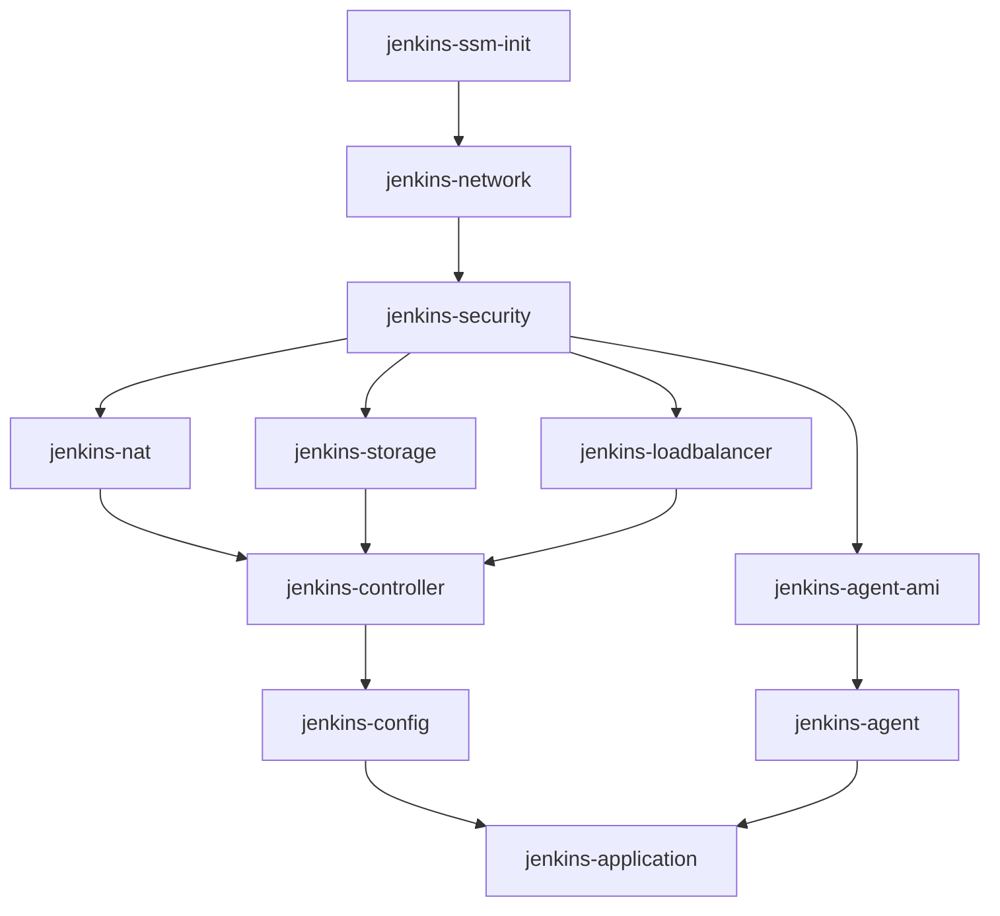

# CLAUDE.md

このファイルは、このリポジトリでコードを扱う際のClaude Code (claude.ai/code) へのガイダンスを提供します。

## プロジェクト概要

包括的なJenkins CI/CDインフラ自動化プロジェクトで、ブートストラップにCloudFormation、インフラプロビジョニングにPulumi (TypeScript)、オーケストレーションにAnsibleを使用しています。ブルーグリーンデプロイメント機能、自動スケーリングエージェント、高可用性機能を備えた本番環境対応のJenkins環境をAWS上にデプロイします。

## コーディングガイドライン

### 基本原則
- **思考**: 英語で論理的に考える (Think in English for logical reasoning)
- **対話**: 日本語で対話 (Dialogue in Japanese with users)
- **ドキュメント**: 日本語で記述 (Documentation in Japanese)
- **コメント**: ソースコード内のコメントは日本語
- **README/ドキュメント**: すべて日本語で記述

### 重要な注意事項
- **Bootstrap修正時**: `bootstrap/` ディレクトリ内のファイルを修正した場合、必ずREADME.mdの更新が必要かチェックすること
- **依存関係の順序**: コンポーネント間の依存関係を常に意識し、デプロイ/削除順序を守ること
- **環境分離**: dev/staging/production環境を明確に分離すること

## Pulumiベストプラクティス

### プロジェクト構造
```
pulumi/{component-name}/
├── Pulumi.yaml           # プロジェクト定義
├── Pulumi.{env}.yaml     # 環境別設定（必要に応じて）
├── index.ts              # メインエントリーポイント
├── package.json          # Node.js依存関係
└── tsconfig.json         # TypeScript設定
```

### コーディング規約

#### 1. SSMパラメータの活用
```typescript
// ✅ 良い例：SSMから設定を取得
const environment = pulumi.getStack();
const ssmPrefix = `/jenkins-infra/${environment}`;
const projectNameParam = aws.ssm.getParameter({
    name: `${ssmPrefix}/config/project-name`,
});

// ❌ 悪い例：ハードコーディング
const projectName = "jenkins-project";
```

#### 2. リソースタグの統一
```typescript
// すべてのリソースに共通タグを設定
tags: {
    Name: pulumi.interpolate`${projectName}-${resourceType}-${environment}`,
    Environment: environment,
    ManagedBy: "pulumi",
    Project: projectName,
}
```

#### 3. スタック間の参照
```typescript
// 他スタックの出力を参照
const networkStack = new pulumi.StackReference(`organization/jenkins-network/${environment}`);
const vpcId = networkStack.getOutput("vpcId");
```

### エラーハンドリング
- すべての非同期操作に`.apply()`を使用
- 適切なエラーメッセージとログ出力を実装
- リソース削除時の依存関係を`dependsOn`で明示

## Jenkinsベストプラクティス

### ジョブ管理

#### 1. Job DSLによる管理
```groovy
// jenkins/jobs/dsl/folders.groovy
folder('Admin_Jobs') {
    displayName('管理ジョブ')
    description('システム管理用のジョブ群')
}
```

#### 2. Jenkinsfileの構造
```groovy
pipeline {
    agent { label 'ec2-fleet' }
    
    environment {
        // 環境変数は大文字スネークケース
        AWS_REGION = 'ap-northeast-1'
    }
    
    stages {
        stage('準備') {
            steps {
                // 日本語でステージ名を記述
            }
        }
    }
    
    post {
        always {
            // クリーンアップ処理
        }
    }
}
```

#### 3. Shared Library活用
```groovy
// vars/gitUtils.groovy
def deployKeys(Map config) {
    // 共通処理をライブラリ化
}
```

### 設定管理

#### Configuration as Code (JCasC)
```yaml
# scripts/jenkins/casc/jenkins.yaml.template
jenkins:
  systemMessage: "Jenkins ${JENKINS_VERSION} - 管理者: ${ADMIN_EMAIL}"
  numExecutors: 2
  mode: NORMAL
```

#### Groovy初期化スクリプト
- `basic-settings.groovy`: 基本設定
- `install-plugins.groovy`: プラグイン管理
- `setup-users.groovy`: ユーザー管理
- `recovery-mode.groovy`: リカバリーモード

### セキュリティ考慮事項
- クレデンシャルはJenkins Credentials Storeで管理
- APIトークンは自動生成してSSMに保存
- 管理者パスワードはSSM SecureStringで暗号化

## Ansibleベストプラクティス

### プレイブック構造

#### ファイル構成規約
```
ansible/playbooks/
├── jenkins/          # Jenkinsメインプレイブック
│   ├── deploy/      # デプロイ用
│   ├── remove/      # 削除用
│   └── misc/        # その他ユーティリティ
├── test/            # テストプレイブック
│   └── test-*.yml   # テスト用ファイル
└── *.yml            # その他のプレイブック
```

#### テストプレイブックの記述規約
```yaml
---
# ファイルの説明
#
# 実行例
# ======
#
# 基本実行:
#   ansible-playbook playbooks/test/test-example.yml
#
# パラメータ指定:
#   ansible-playbook playbooks/test/test-example.yml -e param=value
#
# デバッグモード:
#   ansible-playbook playbooks/test/test-example.yml -vvv
#
- name: プレイブック名
  hosts: localhost
  # ... 実装
```

**重要**: 
- 実行例は必ずファイル先頭にコメントとして記載
- 実行パスは`ansible/`ディレクトリ基準で記載（`playbooks/test/`を含む）
- テスト用プレイブックは`test/`サブディレクトリに配置

#### 1. 役割の明確化
```yaml
# ✅ 良い例：単一責任の原則
- name: Jenkinsネットワークをデプロイ
  include_role:
    name: jenkins_network
    tasks_from: deploy

# ❌ 悪い例：複数の責任を混在
- name: すべてをデプロイ
  shell: pulumi up -y
```

#### 2. 冪等性の確保
```yaml
# 常にchanged_whenで状態を管理
- name: Pulumiスタックをデプロイ
  command: pulumi up -y
  changed_when: pulumi_result.stdout is search('Resources:.*created|updated|deleted')
```

#### 3. エラーハンドリング
```yaml
- name: リソースをデプロイ
  block:
    - include_role:
        name: pulumi_helper
        tasks_from: deploy
  rescue:
    - name: エラー情報を表示
      debug:
        msg: "デプロイ失敗: {{ ansible_failed_result.msg }}"
    - fail:
        msg: "デプロイを中止します"
```

### 変数管理

#### グループ変数 (group_vars/all.yml)
```yaml
# 環境共通設定
project_name: jenkins-infra
aws_region: ap-northeast-1

# 環境別設定は実行時に指定
# ansible-playbook playbook.yml -e "env=dev"
```

#### ロール変数
```yaml
# roles/{role_name}/defaults/main.yml
jenkins_version: "{{ lookup('env', 'JENKINS_VERSION') | default('2.426.1') }}"
```

### 必須コマンド

#### Jenkins完全デプロイメント
```bash
cd ansible
ansible-playbook playbooks/jenkins/jenkins_setup_pipeline.yml -e "env=dev"
```

#### インフラストラクチャ削除
```bash
cd ansible
ansible-playbook playbooks/jenkins/jenkins_teardown_pipeline.yml -e "env=dev confirm=true"
```

### ヘルパーロールの活用

#### pulumi_helper
- S3バックエンド対応
- 自動的なスタック初期化
- 出力値の取得と参照

#### ssm_parameter_store
- パラメータの一括管理
- 暗号化対応
- 環境変数へのエクスポート

#### aws_cli_helper
- リトライ機能付きAWS CLI実行
- JSON解析とエラーハンドリング

## デプロイメントアーキテクチャ

### コンポーネント依存関係


### デプロイ順序
1. **初期化**: jenkins-ssm-init（パラメータ準備）
2. **基盤**: jenkins-network → jenkins-security
3. **ネットワーク**: jenkins-nat
4. **ストレージ**: jenkins-storage
5. **ロードバランサー**: jenkins-loadbalancer
6. **コンピュート**: jenkins-controller → jenkins-agent-ami → jenkins-agent
7. **アプリケーション**: jenkins-config → jenkins-application

### 削除順序（デプロイの逆順）
1. jenkins-application
2. jenkins-config
3. jenkins-agent
4. jenkins-agent-ami
5. jenkins-controller
6. jenkins-loadbalancer
7. jenkins-storage
8. jenkins-nat
9. jenkins-security
10. jenkins-network
11. jenkins-ssm-init

## 開発ワークフロー

### 1. 新機能追加時
```bash
# 1. Pulumiスタック作成
cd pulumi
mkdir jenkins-{new-component}
cd jenkins-{new-component}
pulumi new aws-typescript

# 2. Ansibleロール作成
cd ansible/roles
ansible-galaxy init jenkins_{new_component}

# 3. デプロイプレイブック追加
# ansible/playbooks/jenkins/deploy/deploy_jenkins_{new_component}.yml

# 4. 削除プレイブック追加
# ansible/playbooks/jenkins/remove/remove_jenkins_{new_component}.yml
```

### 2. 既存コンポーネント修正時
```bash
# 1. 変更の影響範囲を確認
cd pulumi/{component}
npm run preview

# 2. 個別デプロイでテスト
cd ansible
ansible-playbook playbooks/jenkins/deploy/deploy_jenkins_{component}.yml -e "env=dev"

# 3. 依存コンポーネントも更新
# 依存関係図を参照して下流コンポーネントを特定
```

### 3. Bootstrap環境の更新時
```bash
# 1. CloudFormationテンプレート更新
vi bootstrap/cfn-bootstrap-template.yaml

# 2. セットアップスクリプト更新
vi bootstrap/setup-bootstrap.sh

# 3. README.md更新確認 ⚠️ 重要
# - 新しいパラメータの説明追加
# - 手順の変更を反映
# - トラブルシューティング情報の更新
vi README.md

# 4. スタック更新（AWSコンソール）
# InstanceVersionパラメータを変更して再作成
```

## トラブルシューティングガイド

### Pulumi関連
```bash
# スタック状態確認
pulumi stack --show-ids

# 強制リフレッシュ
pulumi refresh -y

# スタックエクスポート（バックアップ）
pulumi stack export > stack-backup.json
```

### Ansible関連
```bash
# デバッグモード実行
ansible-playbook playbook.yml -vvv

# チェックモード（ドライラン）
ansible-playbook playbook.yml --check

# 特定タスクのみ実行
ansible-playbook playbook.yml --tags "deploy"
```

### Jenkins関連
```bash
# ログ確認
sudo tail -f /var/log/jenkins/jenkins.log

# 設定バックアップ
tar -czf jenkins-backup.tar.gz /var/lib/jenkins

# プラグイン一覧取得
java -jar jenkins-cli.jar -s http://localhost:8080 list-plugins
```

## コミットメッセージ規約

```
[Component] Action: 詳細な説明

Component: pulumi|ansible|jenkins|bootstrap|docs
Action: add|update|fix|remove|refactor

例:
[pulumi] add: Lambda関数用の新しいスタックを追加
[ansible] fix: jenkins_controllerロールのエラー処理を修正
[bootstrap] update: Node.js v20へアップグレード（README更新含む）
```

## セキュリティチェックリスト

- [ ] クレデンシャルのハードコーディングなし
- [ ] SSMパラメータはSecureString使用
- [ ] IAMロールは最小権限の原則
- [ ] セキュリティグループは必要最小限のポート開放
- [ ] ログに機密情報を出力しない
- [ ] APIキーは環境変数またはSSMで管理

## パフォーマンス最適化

### Pulumi
- 大規模スタックは分割して管理
- 不要なリフレッシュを避ける
- 並列実行可能な操作は並列化

### Ansible
- 不要なfact収集を無効化: `gather_facts: no`
- 並列実行数を調整: `ansible.cfg`の`forks`設定
- ローカル接続を活用: `connection: local`

### Jenkins
- エージェント数の適切な設定
- ビルドアーティファクトの定期削除
- プラグインは必要最小限に

## リソース命名規則

```
{project-name}-{component}-{resource-type}-{environment}

例:
jenkins-infra-vpc-dev
jenkins-infra-controller-ec2-prod
jenkins-infra-efs-staging
```

## 環境変数一覧

### 必須
```bash
PULUMI_CONFIG_PASSPHRASE  # Pulumi暗号化パスフレーズ
AWS_REGION                 # AWSリージョン（デフォルト: ap-northeast-1）
```

### オプション
```bash
JENKINS_VERSION           # Jenkinsバージョン
PULUMI_STATE_BUCKET_NAME  # S3バケット名（自動検出可能）
DEPLOY_ENV               # デプロイ環境（dev/staging/prod）
```

## CI/CDパイプライン統合

現在は手動デプロイメントですが、将来的なCI/CD統合のために以下を推奨：

1. **GitHub Actions統合準備**
   - ワークフローファイルのテンプレート準備
   - シークレット管理の設計

2. **自動テスト準備**
   - Pulumiプレビューの自動実行
   - Ansibleシンタックスチェック
   - Jenkins設定の検証

3. **モニタリング準備**
   - CloudWatchダッシュボード設定
   - アラート設定の自動化

## 更新履歴管理

重要な変更は以下のドキュメントを更新：
1. **README.md**: ユーザー向け手順
2. **CLAUDE.md**: 開発者向けガイド（このファイル）
3. **CONTRIBUTION.md**: コントリビューションガイド