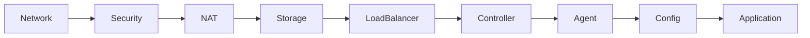

# CONTRIBUTION.md - Infrastructure as Code 開発ガイドライン

このドキュメントは、Infrastructure as Codeプロジェクトへの貢献方法と開発規約をまとめたものです。

## 目次

1. [プロジェクト概要](#1-プロジェクト概要)
2. [開発環境セットアップ](#2-開発環境セットアップ)
3. [Pulumi開発規約](#3-pulumi開発規約)
4. [Ansible開発規約](#4-ansible開発規約)
5. [Jenkins開発規約](#5-jenkins開発規約)
6. [コーディング規約](#6-コーディング規約)
7. [デプロイメントワークフロー](#7-デプロイメントワークフロー)
8. [テストとバリデーション](#8-テストとバリデーション)
9. [セキュリティガイドライン](#9-セキュリティガイドライン)
10. [コントリビューション手順](#10-コントリビューション手順)

---

## 1. プロジェクト概要

### ディレクトリ構造

```
infrastructure-as-code/
├── ansible/              # オーケストレーション層
│   ├── inventory/        # インベントリと変数定義
│   ├── playbooks/        # 実行可能なプレイブック
│   └── roles/           # 再利用可能なロール
├── bootstrap/           # 初期セットアップ（CloudFormation）
├── jenkins/             # Jenkins設定とジョブ定義
│   ├── config/          # Jenkins設定ファイル
│   └── jobs/           # ジョブ定義（DSL/Pipeline）
├── lambda/              # Lambda関数実装
├── pulumi/              # インフラストラクチャ定義
│   ├── jenkins-*/       # Jenkinsコンポーネント
│   └── lambda-*/        # Lambdaコンポーネント
└── scripts/             # ヘルパースクリプト
    ├── aws/            # AWS関連スクリプト
    └── jenkins/        # Jenkins関連スクリプト
```

### 技術スタック

- **インフラ定義**: Pulumi (TypeScript)
- **オーケストレーション**: Ansible
- **CI/CD**: Jenkins (DSL/Pipeline as Code)
- **クラウドプロバイダー**: AWS
- **言語**: TypeScript, Python, Groovy, Bash

---

## 2. 開発環境セットアップ

### 必要なツール

```bash
# Node.js/npm
node --version  # v16以上
npm --version   # v8以上

# Python/pip
python3 --version  # 3.8以上
pip3 --version

# Ansible
ansible --version  # 2.9以上

# Pulumi
pulumi version  # 3.0以上

# AWS CLI
aws --version  # 2.0以上
```

### 初期設定

```bash
# リポジトリクローン
git clone <repository-url>
cd infrastructure-as-code

# AWS認証設定
aws configure

# Pulumi設定
pulumi login

# Ansible設定
export ANSIBLE_HOST_KEY_CHECKING=False
```

---

## 3. Pulumi開発規約

### 3.1 プロジェクト構造

#### ディレクトリ構成
```
pulumi/{component-name}/
├── Pulumi.yaml          # プロジェクト定義
├── Pulumi.dev.yaml      # 開発環境設定（オプション）
├── package.json         # Node.js依存関係
├── tsconfig.json        # TypeScript設定
├── index.ts            # メインコード
├── bin/                # コンパイル出力ディレクトリ
└── README.md           # スタック説明
```

#### 必須ファイル設定

**package.json**
```json
{
  "name": "@project/component-name",
  "main": "bin/index.js",
  "scripts": {
    "build": "tsc",
    "preview": "pulumi preview",
    "deploy": "pulumi up -y",
    "destroy": "pulumi destroy -y",
    "refresh": "pulumi refresh -y"
  },
  "devDependencies": {
    "@types/node": "^16.0.0",
    "typescript": "^4.0.0"
  },
  "dependencies": {
    "@pulumi/pulumi": "^3.0.0",
    "@pulumi/aws": "^6.0.0"
  }
}
```

**tsconfig.json**
```json
{
  "compilerOptions": {
    "strict": true,
    "outDir": "bin",
    "target": "es2016",
    "module": "commonjs",
    "moduleResolution": "node",
    "sourceMap": true,
    "experimentalDecorators": true,
    "pretty": true,
    "noFallthroughCasesInSwitch": true,
    "noImplicitReturns": true,
    "forceConsistentCasingInFileNames": true
  },
  "files": ["index.ts"]
}
```

### 3.2 命名規則

#### スタック名
```
{system}-{component}
例: jenkins-network, lambda-api-gateway
```

#### リソース名
```typescript
// パターン: {projectName}-{resourceType}-{environment}
const vpc = new aws.ec2.Vpc(`${projectName}-vpc`, {
    cidrBlock: "10.0.0.0/16",
    // ...
});

// 複数リソースの場合：サフィックスを追加
const publicSubnetA = new aws.ec2.Subnet(`${projectName}-public-subnet-a`, {
    // ...
});
```

#### タグ付け標準
```typescript
// 必須タグ
tags: {
    Name: `${projectName}-{resource}-${environment}`,
    Environment: environment,
    ManagedBy: "pulumi",
    Project: projectName,
}

// オプションタグ
tags: {
    // ... 必須タグ
    Owner: "DevOps",
    CostCenter: "Engineering",
    CreatedAt: new Date().toISOString(),
}
```

### 3.3 コード構成パターン

#### 標準ファイル構成
```typescript
/**
 * pulumi/{component-name}/index.ts
 * 
 * 目的: {component}のインフラストラクチャ定義
 * 依存: {dependencies}
 */
import * as pulumi from "@pulumi/pulumi";
import * as aws from "@pulumi/aws";

// ========================================
// 設定取得
// ========================================
const config = new pulumi.Config();
const projectName = config.get("projectName") || "default-project";
const environment = pulumi.getStack();

// ========================================
// スタック参照（依存関係）
// ========================================
const networkStackName = config.get("networkStackName") || "network-stack";
const networkStack = new pulumi.StackReference(
    `${pulumi.getOrganization()}/${networkStackName}/${environment}`
);

// 依存リソースの取得
const vpcId = networkStack.requireOutput("vpcId");

// ========================================
// リソース定義
// ========================================
// リソース定義は論理的なグループごとにセクション分け

// ========================================
// エクスポート
// ========================================
export const outputName = resourceValue;
```

### 3.4 設定管理

#### 設定の取得パターン
```typescript
// Configオブジェクトの初期化
const config = new pulumi.Config();

// 必須設定（デフォルト値付き）
const projectName = config.get("projectName") || "jenkins-infra";
const environment = pulumi.getStack();

// オプション設定
const instanceType = config.get("instanceType") || "t3.medium";
const enableMonitoring = config.getBoolean("enableMonitoring") || false;

// 数値設定
const maxInstances = config.getNumber("maxInstances") || 5;

// シークレット設定（暗号化）
const dbPassword = config.requireSecret("dbPassword");
```

#### スタック参照パターン
```typescript
// スタック名の取得（設定可能）
const networkStackName = config.get("networkStackName") || "jenkins-network";
const securityStackName = config.get("securityStackName") || "jenkins-security";

// スタック参照の作成
const networkStack = new pulumi.StackReference(
    `${pulumi.getOrganization()}/${networkStackName}/${environment}`
);

// 出力値の取得
const vpcId = networkStack.requireOutput("vpcId");           // 必須（エラーあり）
const vpcCidr = networkStack.getOutput("vpcCidr");           // オプション（undefined可）

// 複数出力の同時取得
const [subnetIds, securityGroupId] = pulumi.all([
    networkStack.requireOutput("privateSubnetIds"),
    securityStack.requireOutput("appSecurityGroupId")
]);
```

### 3.5 エクスポート規約

#### 基本エクスポート
```typescript
// 単一値のエクスポート
export const vpcId = vpc.id;
export const vpcArn = vpc.arn;

// 配列のエクスポート
export const publicSubnetIds = [publicSubnetA.id, publicSubnetB.id];
export const privateSubnetIds = privateSubnets.map(s => s.id);

// 計算値のエクスポート
export const dnsName = pulumi.interpolate`${loadBalancer.dnsName}`;
export const jdbcUrl = pulumi.interpolate`jdbc:mysql://${db.endpoint}/mydb`;
```

#### エクスポートのガイドライン
- **必ずエクスポートすべきもの**
  - リソースID（vpc.id, subnet.id, securityGroup.id）
  - ARN（role.arn, bucket.arn）
  - エンドポイントURL（alb.dnsName, rds.endpoint）
  - 他スタックが依存する設定値

- **エクスポート不要なもの**
  - 内部的な中間リソース
  - 一時的な設定値
  - 機密情報（パスワード、キー）

### 3.6 Pulumiプログラミングパターン

#### Output値の扱い
```typescript
// Output<T>値の変換
const upperCaseName = resourceName.apply(name => name.toUpperCase());

// 複数Output値の結合
const connectionString = pulumi.all([host, port, database]).apply(
    ([h, p, d]) => `postgresql://${h}:${p}/${d}`
);

// 文字列補間
const url = pulumi.interpolate`https://${domain}:${port}/path`;

// 条件分岐
const instanceType = pulumi.output(environment).apply(
    env => env === "prod" ? "t3.large" : "t3.small"
);
```

#### リソース依存関係の管理
```typescript
// 明示的な依存関係
const instance = new aws.ec2.Instance("app", {
    // ...
}, { dependsOn: [database] });

// カスタムリソースオプション
const resource = new aws.s3.Bucket("files", {
    // ...
}, {
    protect: true,                    // 削除保護
    ignoreChanges: ["tags"],         // 変更無視
    deleteBeforeReplace: true,        // 置換時の削除優先
    replaceOnChanges: ["bucketPrefix"], // 特定プロパティ変更時に置換
});
```

#### バージョニングパターン
```typescript
// セマンティックバージョン生成（X.Y.Z形式）
// AWS Image Builder等で必要
const now = new Date();
const dateStr = `${String(now.getFullYear()).slice(-2)}${String(now.getMonth() + 1).padStart(2, '0')}${String(now.getDate()).padStart(2, '0')}`;
const secondsOfDay = now.getHours() * 3600 + now.getMinutes() * 60 + now.getSeconds();
const version = config.get("version") || `1.${dateStr}.${secondsOfDay}`;
// 例: 1.250809.41809 (1.日付.秒数)
```

### 3.7 エラーハンドリングとベストプラクティス

#### エラーハンドリング
```typescript
// try-catchでのエラー処理
try {
    const resource = new aws.ec2.Instance("app", {
        // ...
    });
} catch (error) {
    console.error(`Failed to create instance: ${error}`);
    throw error;
}

// Output値のエラーハンドリング
const subnetId = networkStack.getOutput("subnetId").apply(id => {
    if (!id) {
        throw new Error("Subnet ID not found in network stack");
    }
    return id;
});
```

#### パフォーマンス最適化
```typescript
// リソースのバッチ作成
const subnets = ["a", "b", "c"].map(az => 
    new aws.ec2.Subnet(`subnet-${az}`, {
        // ...
    })
);

// 不要なリソース参照の回避
const vpcId = config.get("useExistingVpc") 
    ? config.require("vpcId") 
    : vpc.id;

// 条件付きリソース作成
if (config.getBoolean("enableMonitoring")) {
    new aws.cloudwatch.Dashboard("monitoring", {
        // ...
    });
}
```

#### テストと検証
```typescript
// リソースプロパティの検証
const vpc = new aws.ec2.Vpc("main", {
    cidrBlock: "10.0.0.0/16",
    enableDnsHostnames: true,
    enableDnsSupport: true,
});

// 出力値の検証
export const vpcCidr = vpc.cidrBlock.apply(cidr => {
    if (!cidr.startsWith("10.")) {
        console.warn("VPC CIDR is not in 10.x.x.x range");
    }
    return cidr;
});

// Pulumiポリシーによる検証（別ファイル）
new pulumi.PolicyPack("aws-policies", {
    policies: [{
        name: "required-tags",
        description: "Ensure required tags are present",
        enforcementLevel: "mandatory",
        validateResource: (args, reportViolation) => {
            if (!args.props.tags?.Environment) {
                reportViolation("Missing required Environment tag");
            }
        },
    }],
});
```

---

## 4. Ansible開発規約

### 4.1 ロール構造

```
roles/{role-name}/
├── README.md            # ロールの説明とAPI
├── defaults/
│   └── main.yml        # デフォルト変数
├── meta/
│   └── main.yml        # 依存関係
├── tasks/
│   ├── main.yml        # エントリーポイント
│   ├── deploy.yml      # デプロイタスク
│   └── destroy.yml     # 削除タスク
├── templates/          # Jinja2テンプレート
└── vars/
    └── main.yml        # 内部変数
```

### 4.1.1 ヘルパーロールの活用

既存のヘルパーロールを積極的に活用してください：

#### aws_cli_helper
AWS CLIコマンドの実行を標準化するロール：

```yaml
- name: Execute AWS CLI command
  ansible.builtin.include_role:
    name: aws_cli_helper
    tasks_from: execute
  vars:
    aws_command: "aws ec2 describe-instances"
    operation_name: "List EC2 instances"
    parse_output: true  # JSON自動パース

# リトライ付き実行
- name: Execute with retry
  ansible.builtin.include_role:
    name: aws_cli_helper
    tasks_from: execute_with_retry
  vars:
    aws_command: "aws s3 ls"
    operation_name: "List S3 buckets"
    max_retries: 5
    retry_delay: 10
```

#### ssm_parameter_store
SSMパラメータストアの操作を抽象化するロール：

```yaml
# パラメータの取得
- name: Get parameter from SSM
  ansible.builtin.include_role:
    name: ssm_parameter_store
    tasks_from: get_parameter
  vars:
    parameter_name: "/myapp/dev/database/password"
    decrypt: true
    store_as: "db_password"

# パラメータの設定
- name: Set parameter in SSM
  ansible.builtin.include_role:
    name: ssm_parameter_store
    tasks_from: set_parameter
  vars:
    parameter_name: "/myapp/dev/api/version"
    parameter_value: "{{ app_version }}"
    parameter_type: "String"
    description: "Application version"
```

#### pulumi_helper
Pulumiスタック操作の標準化：

```yaml
- name: Deploy Pulumi stack
  ansible.builtin.include_role:
    name: pulumi_helper
    tasks_from: deploy
  vars:
    stack_name: "jenkins-network"
    pulumi_dir: "{{ pulumi_path }}/jenkins-network"
```

### 4.2 プレイブック命名規則

```
{action}_{component}_{target}.yml

例:
- deploy_jenkins_network.yml
- test_aws_connectivity.yml
- jenkins_setup_pipeline.yml
```

### 4.3 変数管理階層

1. **グローバル設定**: `inventory/group_vars/all.yml`
2. **環境別設定**: `inventory/group_vars/{env}.yml`
3. **ロールデフォルト**: `roles/{role}/defaults/main.yml`
4. **プレイブック変数**: `vars:` セクション
5. **コマンドライン**: `-e` オプション

### 4.4 タスク記述規約

```yaml
- name: Descriptive task name  # 明確なタスク名
  ansible.builtin.module_name:  # FQCNを使用
    parameter: value
  register: result_var          # 結果を保存
  when: condition | bool        # 条件は明示的にbool化
  changed_when: false          # 変更判定を制御
  no_log: true                 # 機密情報は非表示
```

### 4.5 エラーハンドリング

```yaml
- name: Operation with error handling
  block:
    - name: Main task
      ansible.builtin.shell: command
  rescue:
    - name: Handle error
      ansible.builtin.debug:
        msg: "Error occurred: {{ ansible_failed_result.msg }}"
    - name: Cleanup
      ansible.builtin.file:
        path: /tmp/temp_file
        state: absent
  always:
    - name: Final task
      ansible.builtin.set_fact:
        operation_complete: true
```

---

## 5. Jenkins開発規約

### 5.1 ジョブ管理体系

```
jenkins/jobs/
├── dsl/                 # Job DSL定義
│   ├── admin/          # 管理ジョブ
│   ├── build/          # ビルドジョブ
│   └── deploy/         # デプロイジョブ
├── pipeline/           # Jenkinsfile
│   └── {project}/
│       └── Jenkinsfile
└── shared/             # 共有ライブラリ
    ├── src/
    └── vars/
```

### 5.2 Job DSL規約

```groovy
// ジョブ名規約: {Category}_{Component}_{Action}_Job
job('admin_backup_config_job') {
    description '''
        Purpose: Configuration backup
        Schedule: Daily at 2:00 AM
        Owner: DevOps Team
    '''
    
    // パラメータ定義
    parameters {
        stringParam('ENVIRONMENT', 'dev', 'Target environment')
    }
    
    // トリガー設定
    triggers {
        cron('0 2 * * *')
    }
    
    // ステップ定義
    steps {
        shell('backup-script.sh')
    }
}
```

### 5.3 Pipeline規約

```groovy
pipeline {
    agent any
    
    // 環境変数
    environment {
        PROJECT_NAME = 'jenkins-infra'
        AWS_REGION = 'ap-northeast-1'
    }
    
    // パラメータ
    parameters {
        choice(name: 'ENVIRONMENT', 
               choices: ['dev', 'staging', 'prod'],
               description: 'Deployment environment')
    }
    
    stages {
        stage('Validate') {
            steps {
                // バリデーション処理
            }
        }
        
        stage('Deploy') {
            when {
                expression { params.ENVIRONMENT != 'prod' }
            }
            steps {
                // デプロイ処理
            }
        }
    }
    
    post {
        success {
            // 成功時処理
        }
        failure {
            // 失敗時処理
        }
    }
}
```

### 5.4 共有ライブラリ構造

```groovy
// vars/deploymentUtils.groovy
def deployToEnvironment(String env) {
    echo "Deploying to ${env}"
    // デプロイロジック
}

// src/jp/co/company/Utils.groovy
package jp.co.company

class Utils {
    static String formatMessage(String msg) {
        return "[${new Date()}] ${msg}"
    }
}
```

---

## 6. コーディング規約

### 6.1 命名規則

| 種別 | 規約 | 例 |
|------|------|-----|
| ファイル名（YAML） | kebab-case | `jenkins-network.yml` |
| ファイル名（TypeScript） | camelCase | `index.ts`, `utils.ts` |
| 変数名（YAML） | snake_case | `project_name`, `aws_region` |
| 変数名（TypeScript） | camelCase | `projectName`, `awsRegion` |
| リソース名（AWS） | kebab-case | `jenkins-vpc-dev` |
| 環境変数 | UPPER_SNAKE | `AWS_REGION`, `PROJECT_NAME` |

### 6.2 コメント規約

#### TypeScript/JavaScript
```typescript
/**
 * pulumi/jenkins-network/index.ts
 * 
 * Jenkins用ネットワークインフラストラクチャの定義
 * VPC、サブネット、ルーティングテーブルを作成
 */

// 設定値の取得
const config = new pulumi.Config();

// VPCの作成（10.0.0.0/16）
const vpc = new aws.ec2.Vpc(...);
```

#### YAML
```yaml
---
# プレイブック名: deploy_jenkins_network.yml
# 目的: Jenkinsネットワークインフラのデプロイ
# 作成者: DevOps Team
# 更新日: 2024-01-01

- name: Deploy Jenkins Network
  hosts: localhost
  vars:
    # 環境名（dev/staging/prod）
    env_name: "{{ env | default('dev') }}"
```

### 6.3 ファイルヘッダー

すべてのソースファイルには以下の情報を含むヘッダーを記載：

```
ファイルパス
目的・機能の説明
主要な依存関係
作成日・更新日（オプション）
```

---

## 7. デプロイメントワークフロー

### 7.1 環境管理

```
dev     → 開発環境（コスト最適化設定）
staging → ステージング環境（本番相当設定）
prod    → 本番環境（高可用性設定）
```

### 7.2 デプロイ順序



### 7.3 デプロイコマンド

```bash
# 完全デプロイ
ansible-playbook playbooks/jenkins_setup_pipeline.yml -e "env=dev"

# 個別コンポーネント
ansible-playbook playbooks/deploy_jenkins_network.yml -e "env=dev"

# 削除（確認付き）
ansible-playbook playbooks/jenkins_teardown_pipeline.yml -e "env=dev confirm=true"
```

---

## 8. テストとバリデーション

### 8.1 テストレベル

1. **Unit Test**: 個別コンポーネントの動作確認
2. **Integration Test**: コンポーネント間連携確認
3. **E2E Test**: エンドツーエンドシナリオテスト
4. **Smoke Test**: 基本機能の簡易確認

### 8.2 バリデーションチェックリスト

```yaml
validation_checks:
  - aws_connectivity      # AWS接続確認
  - iam_permissions       # IAM権限確認
  - network_connectivity  # ネットワーク疎通確認
  - resource_limits      # リソース制限確認
  - cost_estimation      # コスト見積もり
```

### 8.3 テストプレイブック実行

```bash
# 接続テスト
ansible-playbook test-aws-connectivity.yml

# リソーステスト
ansible-playbook test-resource-creation.yml -e "env=dev"

# クリーンアップ
ansible-playbook test-cleanup.yml -e "env=dev"
```

---

## 9. セキュリティガイドライン

### 9.1 シークレット管理

#### 自動検出キーワード
```yaml
secure_keywords:
  - password
  - secret
  - key
  - token
  - credential
  - api_key
  - access_key
```

#### SSMパラメータ命名
```
/{project}/{environment}/{component}/{parameter}
例: /jenkins-infra/dev/jenkins/admin-password
```

### 9.2 IAMポリシー

- 最小権限の原則を適用
- 環境別にロールを分離
- MFAを本番環境で必須化

### 9.3 ネットワークセキュリティ

```yaml
security_rules:
  - プライベートサブネットの利用
  - セキュリティグループの最小化
  - NACLによる追加制御
  - VPCフローログの有効化
```

### 9.4 ログとモニタリング

```yaml
logging:
  - CloudWatch Logs
  - VPC Flow Logs
  - AWS CloudTrail
  - Application Logs
```

---

## 10. コントリビューション手順

### 10.1 ブランチ戦略

```
main           → 安定版（保護ブランチ）
develop        → 開発版
feature/*      → 機能開発
bugfix/*       → バグ修正
hotfix/*       → 緊急修正
```

### 10.2 コミットメッセージ

```
<type>(<scope>): <subject>

<body>

<footer>

例:
feat(jenkins): Add auto-scaling for agents
fix(network): Correct subnet CIDR calculation
docs(readme): Update deployment instructions
```

#### Type
- `feat`: 新機能
- `fix`: バグ修正
- `docs`: ドキュメント
- `style`: フォーマット
- `refactor`: リファクタリング
- `test`: テスト
- `chore`: その他

### 10.3 プルリクエスト

#### テンプレート
```markdown
## 概要
変更の概要を記載

## 主な変更内容
### 機能追加/修正
- [ ] 変更点1
- [ ] 変更点2

### 技術的な改善
- [ ] パフォーマンス改善
- [ ] コードの一貫性向上

## テスト
- [ ] ローカルテスト実施
- [ ] dev環境デプロイ確認
- [ ] 既存機能への影響確認

## ヘルパーロール使用確認
- [ ] aws_cli_helper使用（AWS CLI実行箇所）
- [ ] ssm_parameter_store使用（SSM操作箇所）
- [ ] pulumi_helper使用（Pulumi操作箇所）

## レビューポイント
レビュー時に特に確認してほしい点

## 関連Issue
#123
```

### 10.4 レビュープロセス

1. セルフレビュー実施
2. プルリクエスト作成
3. CI/CDパイプライン通過確認
4. コードレビュー（最低1名）
5. 承認後マージ

### 10.5 リリースプロセス

```bash
# バージョンタグ作成
git tag -a v1.0.0 -m "Release version 1.0.0"
git push origin v1.0.0

# リリースノート作成
# - 新機能
# - バグ修正
# - 破壊的変更
# - 既知の問題
```

---

## 付録

### A. よくある質問（FAQ）

**Q: 新しいコンポーネントを追加する場合の手順は？**
A: Pulumiスタック作成 → Ansibleロール作成 → プレイブック統合

**Q: 環境変数の優先順位は？**
A: コマンドライン > プレイブック > ロール > all.yml

**Q: デバッグ方法は？**
A: `ansible-playbook -vvv` でverboseモード、`pulumi preview` で事前確認

### B. トラブルシューティング

| エラー | 原因 | 解決方法 |
|--------|------|----------|
| Stack not found | スタック未作成 | 依存スタックを先にデプロイ |
| Permission denied | IAM権限不足 | 必要な権限を追加 |
| Resource limit | クォータ上限 | AWSサポートに上限緩和申請 |
| Invalid semantic version | バージョン形式エラー | X.Y.Z形式で指定（各部は整数） |
| IncludeRole retries error | include_roleでuntil使用 | shellモジュールでuntil/retries使用 |

### C. 参考リンク

- [Pulumi Documentation](https://www.pulumi.com/docs/)
- [Ansible Documentation](https://docs.ansible.com/)
- [Jenkins Documentation](https://www.jenkins.io/doc/)
- [AWS Documentation](https://docs.aws.amazon.com/)

---

このガイドラインに従って開発を行うことで、一貫性があり保守性の高いインフラストラクチャコードを維持できます。
