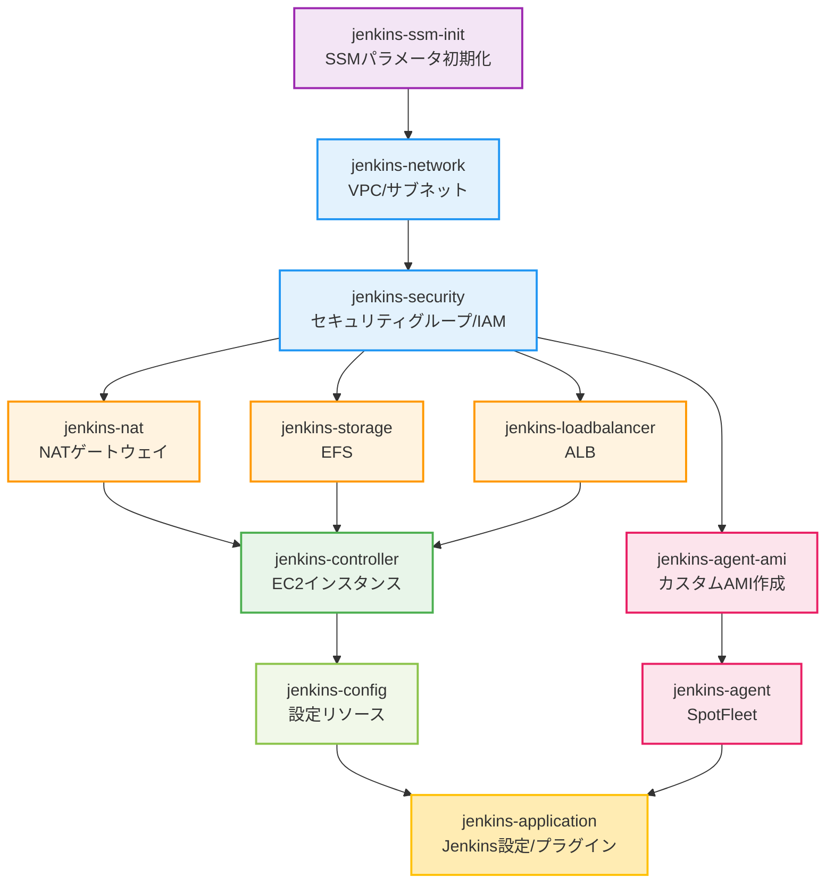

# Jenkins CI/CD インフラストラクチャ構築

このリポジトリは、AWSクラウド上にJenkinsベースのCI/CD環境をAnsibleとPulumiを組み合わせて段階的に構築するためのコードを管理します。ブルーグリーンデプロイに対応したJenkinsコントローラー環境を実現し、効率的なCI/CDパイプラインを提供します。

## 📚 重要なドキュメント

- **[ARCHITECTURE.md](ARCHITECTURE.md)** - Platform Engineeringのアーキテクチャ設計思想
- **[CLAUDE.md](CLAUDE.md)** - Claude Code向けガイダンス
- **[CONTRIBUTION.md](CONTRIBUTION.md)** - 開発者向けコントリビューションガイド

## 📝 変更履歴

### 2025-10-16: AI Workflow V1 (Python版) の削除完了

AI Workflow V2 (TypeScript版) への移行が完了し、V1 (Python版) を削除しました。

- **削除対象**: `scripts/ai-workflow/` ディレクトリ全体
- **バックアップ**: `archive/ai-workflow-v1-python` ブランチに保存
- **V2の場所**: `scripts/ai-workflow-v2/`
- **V2のドキュメント**: [scripts/ai-workflow-v2/README.md](scripts/ai-workflow-v2/README.md)
- **関連Issue**: [#411](https://github.com/tielec/infrastructure-as-code/issues/411)

必要に応じて、以下のコマンドでV1を復元できます（5分以内）：
```bash
git checkout archive/ai-workflow-v1-python -- scripts/ai-workflow/
```

## 前提条件

- AWSアカウント
- 有効なEC2キーペア  
- CloudFormationスタックをデプロイする権限

## セットアップ手順

### 1. EC2キーペアの作成

踏み台サーバーにSSH接続するためのEC2キーペアを作成します。

1. AWSコンソールにログイン
2. EC2ダッシュボードに移動
3. 左側のメニューから「キーペア」を選択
4. 「キーペアの作成」ボタンをクリック
5. 以下の情報を入力：
    - 名前（例：`bootstrap-environment-key`）
    - キーペアタイプ：RSA
    - プライベートキー形式：.pem（OpenSSH）
6. 「キーペアの作成」ボタンをクリック
7. プライベートキー（.pemファイル）が自動的にダウンロードされます
8. ダウンロードしたキーファイルを安全に保管し、適切な権限を設定：
   ```bash
   chmod 400 bootstrap-environment-key.pem
   ```

**重要**: このプライベートキーはダウンロード時にのみ取得できます。安全に保管してください。

### 2. ブートストラップ環境の構築

基本的なツールをプリインストールしたEC2踏み台サーバーをCloudFormationで構築します。

1. AWSコンソールのCloudFormationから以下のテンプレートをアップロード：
    - `bootstrap/cfn-bootstrap-template.yaml`

   **このテンプレートが作成するリソース**:
   - EC2インスタンス（t4g.small、ARM64）
   - VPC、サブネット、セキュリティグループ
   - Pulumi用S3バケット（状態管理用）
   - SSMパラメータストア（設定保存用）
   - 自動停止用Maintenance Window（毎日0:00 AM JST）

2. スタック作成時に以下のスタック名とパラメータを指定：
    - スタック名: bootstrap-iac-environment
    - パラメータ
        - `KeyName`: 先ほど作成したEC2キーペア名（例：`bootstrap-environment-key`）
        - `InstanceType`: インスタンスタイプ（デフォルト: t4g.small）
        - `AllowedIP`: SSHアクセスを許可するIPアドレス範囲（セキュリティのため自分のIPアドレスに制限することを推奨）

3. スタックが作成完了したら、出力タブから以下の情報を確認：
    - `BootstrapPublicIP`: 踏み台サーバーのパブリックIPアドレス
    - `PulumiStateBucketName`: Pulumiのステート管理用S3バケット名
    - `ManualStartCommand`: インスタンス手動起動コマンド

#### インスタンスの自動停止機能

ブートストラップインスタンスは、コスト削減のため毎日日本時間午前0時（UTC 15:00）に自動停止されます。この機能はSSM Maintenance Windowを使用して実装されています。

- **自動停止時刻**: 毎日 0:00 AM JST
- **手動起動方法**: CloudFormation出力の`ManualStartCommand`に表示されるコマンドを使用
  ```bash
  aws ec2 start-instances --instance-ids <instance-id> --region ap-northeast-1
  ```
- **自動停止の無効化**: 必要に応じてCloudFormationスタックを更新して、Maintenance Windowを無効化できます

### 3. 踏み台サーバーへの接続とセットアップ

1. 以下のコマンドで踏み台サーバーにSSH接続します：
   ```bash
   ssh -i bootstrap-environment-key.pem ec2-user@<BootstrapPublicIP>
   ```

2. 接続後、まずuser dataの実行が完了していることを確認します：
   ```bash
   # ログをリアルタイムで確認
   sudo less +F /var/log/cloud-init-output.log
   ```
   
   以下のメッセージが表示されていれば、初期セットアップが完了しています：
   ```
   Bootstrap setup complete!
   ```
   
   ※ `Ctrl+C`でリアルタイム表示を終了し、`q`でlessを終了します

   **プリインストールされているツール**:
   - git、python3、python3-pip、jq、tmux
   - Ansible、boto3、botocore（userspace）
   - リポジトリは既にクローン済み: `~/infrastructure-as-code`

3. セットアップが完了していたら、以下のコマンドでブートストラップセットアップを実行します：

   ```bash
   # ブートストラップセットアップスクリプトを実行
   ./infrastructure-as-code/bootstrap/setup-bootstrap.sh
   ```

   このスクリプトは以下の順序で処理を実行します：
   
   ※ `setup-bootstrap.sh`はモジュラー設計により、`bootstrap/lib/`ディレクトリ内のライブラリ関数を使用します

   **前提条件チェック（軽量処理）**
   1. OS情報の表示（Amazon Linux 2023の確認）
   2. Python環境の確認（Python3とpip3の存在確認）
   3. スクリプト実行権限の修正（リポジトリ内の全.shファイル）
   4. Docker状態の確認（インストールとデーモン状態の確認）

   **AWS関連設定（ネットワーク処理）**
   5. AWS認証情報の確認（IAMロールまたは認証情報の設定）
   6. GitHub SSHキーの設定（SSMパラメータストアと連携）
   7. OpenAI APIキーの設定（対話形式またはSSMから復元）
   8. GitHub App認証の設定（App IDと組織名の入力、秘密鍵は手動設定）
   9. Pulumi設定（S3バックエンド、パスフレーズ管理）

   **重い処理（インストールと実行）**
   10. Ansibleのインストール確認と必要に応じたインストール
   11. Ansible環境の準備（collections パスの設定とクリーンアップ）
   12. Ansibleプレイブック実行（Node.js 20、Java 21、AWS CLI v2、Docker等のインストール）
   13. systemdサービスの設定（EC2パブリックIP自動更新）

#### 手動設定が必要な項目

セットアップスクリプト（`setup-bootstrap.sh`）は対話形式で進行し、以下の設定を順番に行います。各項目はSSMパラメータストアで永続化され、インスタンス再作成時に自動復元されます。

##### 1. GitHub SSHキーの設定（手順6で実行）

**初回実行時**:
- SSHキーペアを自動生成
- GitHubメールアドレスの入力を求められる
- SSMパラメータストアに自動保存

**必要な手動作業**:
```bash
# 生成された公開鍵を表示
cat ~/.ssh/id_rsa.pub

# GitHubの Settings > SSH and GPG keys > New SSH key で上記の公開鍵を登録
```

**2回目以降の実行時**:
- SSMから自動復元（ユーザー入力不要）

**SSMパラメータ**:
- `/bootstrap/github/email` - メールアドレス
- `/bootstrap/github/ssh-private-key` - 秘密鍵（SecureString）
- `/bootstrap/github/ssh-public-key` - 公開鍵

##### 2. OpenAI APIキーの設定（手順7で実行・オプション）

**初回実行時**:
- APIキーの入力を求められる（スキップ可能）
- 入力した場合はSSMに暗号化保存

**事前準備**:
- [OpenAI Platform](https://platform.openai.com/api-keys)でAPIキーを生成
- `sk-`で始まる形式のキーを用意

**SSMパラメータ**:
- `/bootstrap/openai/api-key` - APIキー（SecureString）

##### 3. GitHub App認証の設定（手順8で実行・オプション）

**対話形式の入力**:
- App IDの入力（スキップ可能）
- 組織名/ユーザー名の入力（オプション）

**必要な手動作業**:
1. [GitHub Apps](https://github.com/settings/apps)でAppを作成
2. App IDをメモ
3. Private Keyを生成してダウンロード
4. 秘密鍵をPKCS#8形式に変換してSSMに手動登録:

```bash
# PKCS#8形式に変換（Jenkinsで必要）
# GitHubからダウンロードした鍵はPKCS#1形式（BEGIN RSA PRIVATE KEY）
# JenkinsにはPKCS#8形式（BEGIN PRIVATE KEY）が必要
openssl pkcs8 -topk8 -inform PEM -outform PEM -nocrypt \
  -in github-app-key.pem \
  -out github-app-key-pkcs8.pem

# SSMパラメータストアに登録
aws ssm put-parameter \
  --name "/bootstrap/github/app-private-key" \
  --value file://github-app-key-pkcs8.pem \
  --type SecureString \
  --overwrite \
  --region ap-northeast-1
```

**SSMパラメータ**:
- `/bootstrap/github/app-id` - App ID
- `/bootstrap/github/app-private-key` - 秘密鍵（要手動登録）
- `/bootstrap/github/app-owner` - 組織名（オプション）

##### 4. Pulumiパスフレーズの設定（手順9で実行）

**初回実行時**:
- 自動生成または手動入力を選択
- SSMパラメータストアに暗号化保存

**重要な注意事項**:
- **一度設定したパスフレーズは変更不可**（既存スタックへのアクセスが失われる）
- バックアップを強く推奨

**バックアップ方法**:
```bash
# パスフレーズを取得して安全な場所に保存
aws ssm get-parameter \
  --name "/bootstrap/pulumi/config-passphrase" \
  --with-decryption \
  --query 'Parameter.Value' \
  --output text
```

**SSMパラメータ**:
- `/bootstrap/pulumi/config-passphrase` - パスフレーズ（SecureString）

##### 設定値の永続性

すべての設定はSSMパラメータストアに保存されるため：
- EC2インスタンスを再作成しても設定が保持される
- 2回目以降の実行では自動的に復元される
- 手動作業が必要なのは初回のみ（GitHub公開鍵登録、GitHub App秘密鍵登録）

### 4. Pulumiバックエンドの設定

本プロジェクトはデフォルトでS3バックエンドを使用してPulumiの状態を管理します。

#### S3バックエンドの設定（推奨）

S3バックエンドはCloudFormationブートストラップで作成されたS3バケットを使用します。パスフレーズは`setup-bootstrap.sh`実行時に対話形式で設定され、SSM Parameter Storeに安全に保存されます。

##### 初回セットアップ

`setup-bootstrap.sh`を実行すると、以下の処理が自動的に行われます：

1. **S3バケットの確認**: CloudFormationで作成されたバケットを自動検出
2. **パスフレーズの設定**: 対話形式で設定（自動生成または手動入力を選択可能）
3. **SSM Parameter Storeへの保存**: SecureStringタイプで暗号化して保存

##### Ansible実行時の自動設定

**重要**: Ansibleは自動的にSSM Parameter Storeからパスフレーズを取得するため、通常は環境変数の設定は不要です。

```bash
# Ansibleを実行（パスフレーズは自動的にSSMから取得）
cd ansible
ansible-playbook playbooks/jenkins/jenkins_setup_pipeline.yml -e "env=dev"
```

##### 手動での環境変数設定（オプション）

環境変数を優先したい場合や、SSMへのアクセスを避けたい場合：

```bash
# SSMからパスフレーズを取得して環境変数に設定
export PULUMI_CONFIG_PASSPHRASE=$(aws ssm get-parameter \
  --name "/bootstrap/pulumi/config-passphrase" \
  --with-decryption \
  --query 'Parameter.Value' \
  --output text)

# S3バケット名はSSMパラメータストアから自動取得されるため、手動設定は不要
```

**パスフレーズの優先順位**:
1. 環境変数 `PULUMI_CONFIG_PASSPHRASE`（設定されている場合）
2. SSM Parameter Store `/bootstrap/pulumi/config-passphrase`（自動取得）
3. エラー（どちらも利用できない場合）

##### パスフレーズの管理

- **確認**: `aws ssm get-parameter --name "/bootstrap/pulumi/config-passphrase" --with-decryption --query 'Parameter.Value' --output text`
- **変更**: SSMコンソールまたはCLIで直接更新（既存のPulumiスタックがある場合は注意）
- **セキュリティ**: SSM Parameter StoreでKMS暗号化されているため安全

**重要**: パスフレーズは一度設定したら変更しないでください。変更すると既存のPulumiスタックにアクセスできなくなります。

### 5. Jenkinsインフラのデプロイ

#### 全体デプロイ（推奨）

Jenkins環境の初期構築には`jenkins_setup_pipeline.yml`を使用します。**実行時間が1時間以上かかる可能性があるため、tmuxの使用を強く推奨します**。

```bash
# tmuxセッションを作成してバックグラウンドで実行
tmux new-session -d -s jenkins-deploy

# コマンドを送信
tmux send-keys -t jenkins-deploy "cd ~/infrastructure-as-code/ansible" C-m
tmux send-keys -t jenkins-deploy "ansible-playbook playbooks/jenkins/jenkins_setup_pipeline.yml -e 'env=dev'" C-m

# 進捗を確認
tmux attach -t jenkins-deploy

# tmux操作方法
# デタッチ（バックグラウンドに戻す）: Ctrl+b, d
# 再アタッチ: tmux attach -t jenkins-deploy
# セッション一覧: tmux ls
```

**注意**: tmux内でPulumiが実行される際、進捗表示のエスケープシーケンス（`^[[A`、`^[[B`など）が文字として表示される場合があります。これは表示上の問題で、デプロイ処理には影響しません。

**デプロイ順序**（jenkins_setup_pipeline.ymlが自動的に実行）:
1. jenkins-ssm-init（SSMパラメータ初期化、パスワード生成）
2. jenkins-network（VPC、サブネット）
3. jenkins-security（セキュリティグループ、IAMロール）
4. jenkins-nat（NATゲートウェイ/インスタンス）
5. jenkins-storage（EFSファイルシステム）
6. jenkins-loadbalancer（ALB）
7. jenkins-controller（Jenkinsコントローラー）
8. jenkins-config（設定リソース）
9. jenkins-agent-ami（カスタムAMI作成）※最大1時間
10. jenkins-agent（SpotFleet）
11. jenkins-application（Jenkins設定、プラグイン）

**実行時間の目安**:
- 基本インフラ: 約30-45分
- Agent AMI作成: 追加で最大1時間
- 合計: 1.5〜2時間

**トラブルシューティング**:
全体デプロイメント中にエラーが発生した場合、タグを使用して特定のコンポーネントのみを再実行できます：

```bash
# jenkins-agentのみ再実行
ansible-playbook playbooks/jenkins/jenkins_setup_pipeline.yml -e "env=dev" --tags agent

# jenkins-applicationのみ再実行
ansible-playbook playbooks/jenkins/jenkins_setup_pipeline.yml -e "env=dev" --tags application

# jenkins-agentとjenkins-applicationの両方を再実行
ansible-playbook playbooks/jenkins/jenkins_setup_pipeline.yml -e "env=dev" --tags agent,application
```

利用可能なタグ:
- `ssm-init`: SSMパラメータ初期化
- `network`: ネットワーク
- `security`: セキュリティグループ
- `nat`: NATゲートウェイ
- `storage`: EFSストレージ
- `loadbalancer`: ロードバランサー
- `controller`: Jenkinsコントローラー
- `config`: Jenkins設定
- `agent-ami`: Agent AMIビルド
- `agent`: Jenkinsエージェント
- `application`: Jenkinsアプリケーション設定

#### 個別コンポーネントのデプロイ

特定のコンポーネントのみを更新する場合は個別デプロイが可能ですが、**依存関係に注意が必要です**。

```bash
# 例: ネットワークのみ更新
ansible-playbook playbooks/jenkins/deploy/deploy_jenkins_network.yml -e "env=dev"

# 例: Jenkins Agent AMIのみ再作成（ビルドをスキップ）
ansible-playbook playbooks/jenkins/deploy/deploy_jenkins_agent_ami.yml -e "env=dev trigger_ami_build=false"

# 例: Jenkinsアプリケーション設定のみ更新
ansible-playbook playbooks/jenkins/deploy/deploy_jenkins_application.yml -e "env=dev"
```



**運用上の注意**:
- 上流コンポーネントを変更した場合、矢印の下流すべての再デプロイが必要
- 依存関係が不明な場合は全体デプロイ（jenkins_setup_pipeline.yml）を使用
- 個別デプロイは変更影響を完全に理解している場合のみ推奨

### 6. Jenkins環境の運用管理

#### Jenkinsアプリケーション設定の更新

構築済みのJenkins環境に対して、以下の管理タスクを実行できます：

```bash
# すべての設定を更新（バージョン更新、プラグイン、ユーザー、ジョブ）
ansible-playbook playbooks/jenkins/deploy/deploy_jenkins_application.yml -e "env=dev"

# Jenkinsバージョンのみ更新
ansible-playbook playbooks/jenkins/deploy/deploy_jenkins_application.yml \
  -e "env=dev version=2.426.1 plugins=false setup_cli_user=false setup_seed_job=false"

# プラグインのみ更新
ansible-playbook playbooks/jenkins/deploy/deploy_jenkins_application.yml \
  -e "env=dev jenkins_version=latest setup_cli_user=false setup_seed_job=false"

# シードジョブのみ更新
ansible-playbook playbooks/jenkins/deploy/deploy_jenkins_application.yml \
  -e "env=dev jenkins_version=latest install_plugins=false setup_cli_user=false"
```

#### シードジョブによるジョブ管理

シードジョブはGitリポジトリからJob DSL/Jenkinsfileを読み込み、Jenkinsジョブを自動管理します：

```bash
# デフォルトのシードジョブ作成
ansible-playbook playbooks/jenkins/deploy/deploy_jenkins_application.yml \
  -e "env=dev" \
  -e "jenkins_version=latest install_plugins=false setup_cli_user=false"

# カスタムリポジトリを使用
ansible-playbook playbooks/jenkins/deploy/deploy_jenkins_application.yml \
  -e "env=dev" \
  -e "jenkins_jobs_repo=https://github.com/myorg/jenkins-jobs.git" \
  -e "jenkins_jobs_branch=main" \
  -e "jenkins_jobs_jenkinsfile=seed-job/Jenkinsfile"
```

#### 管理タスクの実行頻度

| タスク | 推奨頻度 | 実行時間 |
|--------|----------|----------|
| Jenkinsバージョン更新 | 月1回 | 5-10分 |
| プラグイン更新 | 週1回 | 3-5分 |
| シードジョブ実行 | ジョブ定義変更時 | 1-3分 |
| 全体再デプロイ | 大規模変更時のみ | 1-2時間 |

## ブートストラップ環境の管理

### インスタンスの再作成（AWSコンソール操作）

ブートストラップインスタンスを再作成する場合：

1. **AWSコンソールにログイン**
2. **CloudFormationサービスに移動**
3. **スタック一覧から`bootstrap-iac-environment`を選択**
4. **「更新」ボタンをクリック**
5. **「既存のテンプレートを使用」を選択して「次へ」**
6. **パラメータ画面で`InstanceVersion`の値を変更**（例：v1 → v2、または現在時刻）
7. **他のパラメータはそのままで「次へ」**
8. **スタックオプションはデフォルトのまま「次へ」**
9. **確認画面で「スタックの更新」をクリック**

再作成後も以下の情報は保持されます：
- Pulumi S3バケットとその内容
- SSMパラメータストア内の設定（GitHub SSHキー、Pulumiパスフレーズなど）
- VPCやセキュリティグループなどのネットワーク設定

### ブートストラップ環境の完全削除（AWSコンソール操作）

ブートストラップ環境を完全に削除する場合：

1. **CloudFormationサービスに移動**
2. **スタック一覧から`bootstrap-iac-environment`を選択**
3. **「削除」ボタンをクリック**
4. **確認ダイアログで「削除」を確認**

**警告**: スタック削除により以下がすべて削除されます：
- EC2インスタンス
- VPCとネットワーク関連リソース
- Pulumi S3バケット（**状態データも含む**）
- SSMパラメータ（保存された設定）
- IAMロールとポリシー

削除前に必要なデータのバックアップを取ることを強く推奨します。

## インフラストラクチャの削除

構築したJenkinsインフラストラクチャを削除する場合は、以下のコマンドを使用します：

### 全体の削除

```bash
# 削除の確認（ドライラン）
ansible-playbook playbooks/jenkins/jenkins_teardown_pipeline.yml -e "env=dev"

# 実際に削除を実行
ansible-playbook playbooks/jenkins/jenkins_teardown_pipeline.yml -e "env=dev confirm=true"

# Pulumiスタックも含めて完全に削除
ansible-playbook playbooks/jenkins/jenkins_teardown_pipeline.yml -e "env=dev confirm=true remove_stacks=true"
```

### 特定コンポーネントの削除

個別のコンポーネントを削除する場合は、専用のremoveプレイブックを使用します：

```bash
# 例: Jenkinsアプリケーション設定のみ削除
ansible-playbook playbooks/jenkins/remove/remove_jenkins_application.yml -e "env=dev confirm=true"

# 例: エージェントのみ削除
ansible-playbook playbooks/jenkins/remove/remove_jenkins_agent.yml -e "env=dev confirm=true"

# 例: コントローラーのみ削除
ansible-playbook playbooks/jenkins/remove/remove_jenkins_controller.yml -e "env=dev confirm=true"

# 例: 設定リソースのみ削除
ansible-playbook playbooks/jenkins/remove/remove_jenkins_config.yml -e "env=dev confirm=true"
```

**削除順序の注意事項**:
- 依存関係の逆順で削除する必要があります
- 例: applicationを削除してからagent、その後controller
- ネットワークやセキュリティグループは最後に削除

**注意**: 削除操作は破壊的な操作です。以下の点に注意してください：
- 必ず `confirm=true` の指定が必要です
- 環境名 (`env`) を正しく指定してください
- EFSに保存されているJenkinsデータも削除されます
- 削除前に重要なデータのバックアップを取ることを推奨します

## インフラストラクチャの構成

このリポジトリは以下のAWSリソースを設定します：

- VPC、サブネット、ルートテーブル、セキュリティグループなどのネットワークリソース
- Jenkinsコントローラー用のEC2インスタンス（ブルー/グリーン環境）
- Jenkinsエージェント用のEC2 SpotFleet（自動スケーリング対応）
- Jenkinsデータ永続化のためのEFSファイルシステム
- ブルーグリーンデプロイ用のALB（Application Load Balancer）
- Jenkins関連リソースのIAMロールとポリシー
- アプリケーション設定管理用のSSMドキュメントとパラメータ

### ディレクトリ構造

```
infrastructure-as-code/
├─ ansible/                    # Ansible設定とプレイブック
│  ├─ inventory/              # インベントリと変数定義
│  ├─ playbooks/              # 各種プレイブック
│  │  ├─ jenkins/             # Jenkins関連プレイブック
│  │  │  ├─ deploy/          # デプロイ用
│  │  │  ├─ remove/          # 削除用
│  │  │  ├─ misc/            # その他（更新等）
│  │  │  ├─ jenkins_setup_pipeline.yml    # セットアップパイプライン
│  │  │  └─ jenkins_teardown_pipeline.yml # 削除パイプライン
│  │  └─ lambda/              # Lambda関連プレイブック
│  └─ roles/                  # Ansibleロール
│      ├─ aws_setup/          # AWS環境設定
│      ├─ pulumi_helper/      # Pulumi操作ヘルパー
│      ├─ jenkins_*/          # Jenkins関連（network, controller, agent等）
│      └─ lambda_*/           # Lambda関連（IP管理、API Gateway等）
│
├─ bootstrap/                  # ブートストラップ環境構築
│  ├─ cfn-bootstrap-template.yaml  # CloudFormationテンプレート
│  └─ setup-bootstrap.sh           # セットアップスクリプト
│
├─ jenkins/                    # Jenkins設定とジョブ定義
│  └─ jobs/                    # Jenkinsジョブ定義
│      ├─ dsl/                 # Job DSL定義（フォルダ構造等）
│      ├─ pipeline/            # パイプラインジョブ（Jenkinsfile）
│      └─ shared/              # 共有ライブラリ
│
├─ pulumi/                     # Pulumiインフラコード
│  ├─ jenkins-*/               # Jenkinsインフラスタック
│  └─ lambda-*/                # Lambdaインフラスタック
│
├─ scripts/                    # ユーティリティスクリプト
│  ├─ aws/                     # AWS操作スクリプト
│  └─ jenkins/                 # Jenkins設定スクリプト
│      ├─ casc/                # Configuration as Code設定
│      ├─ groovy/              # Groovy初期化スクリプト
│      ├─ jobs/                # ジョブXML定義
│      └─ shell/               # シェルスクリプト
│
└─ docs/                       # ドキュメント
```

### 主要ディレクトリの説明

- **ansible/**: Ansibleによる自動化設定。プレイブックでインフラの構築・削除・設定を管理
- **bootstrap/**: EC2踏み台サーバーの初期構築用CloudFormationとセットアップスクリプト
- **jenkins/**: Jenkinsジョブ定義とパイプライン。Job DSLとJenkinsfileによるジョブ管理
- **pulumi/**: インフラストラクチャのコード。各コンポーネントを独立したスタックとして管理
- **scripts/**: 各種ユーティリティスクリプト。AWS操作、Jenkins設定、初期化処理など

### 主な機能

- **段階的デプロイ**: Ansibleを使用して各コンポーネントを順番にデプロイ
- **段階的削除**: 依存関係を考慮した安全な削除処理
- **モジュール分割**: 各インフラコンポーネントを独立したPulumiスタックとして管理
- **ブルー/グリーンデプロイメント**: Jenkinsの更新を無停止で行えるデュアル環境
- **自動スケーリングエージェント**: EC2 SpotFleetによるコスト効率の高いJenkinsエージェント
- **リカバリーモード**: 管理者アカウントロックアウト時などの緊急アクセス用モード
- **データ永続性**: EFSによるJenkinsデータの永続化と高可用性の確保
- **アプリケーション設定管理**: Jenkinsバージョン更新、プラグイン管理、再起動処理の自動化
- **Jenkins CLIユーザー管理**: APIトークンを使用したCLIアクセスの自動設定
- **シードジョブによるジョブ管理**: Infrastructure as Codeによるジョブの自動作成・更新・削除

### Jenkins環境構築後の管理機能

`deploy_jenkins_application.yml` プレイブックを使用して、以下の管理タスクを実行できます：

1. **Jenkinsバージョン更新**
   - 最新バージョンまたは特定バージョンへの安全なアップグレード
   - 自動バックアップとロールバック機能

2. **プラグイン管理**
   - `install-plugins.groovy`スクリプトによる一括インストール・更新
   - プラグイン依存関係の自動解決

3. **CLIユーザーとクレデンシャル管理**
   - `cli-user`の自動作成
   - APIトークンの生成とJenkinsクレデンシャルストアへの保存
   - クレデンシャルID: `cli-user-token`として利用可能

4. **シードジョブ管理**
   - Gitリポジトリからジョブ定義を取得するパイプラインジョブの作成
   - Job DSLを使用したジョブのライフサイクル管理
   - ジョブ定義の変更を検知して自動的に反映

5. **サービス管理**
   - Jenkinsの安全な再起動
   - 起動確認とヘルスチェック

## トラブルシューティング

- **EC2インスタンス起動後の初期化エラー**: 
  - `sudo less +F /var/log/cloud-init-output.log`でuser data実行ログを確認
  - `Bootstrap setup complete!`が表示されていない場合は、エラー内容を確認
  - よくあるエラー：インターネット接続不可、IAMロール権限不足
- **Pulumiデプロイエラー**: `pulumi logs`でエラー詳細を確認
- **Ansibleエラー**: `-vvv`オプションを追加して詳細なログを確認（例: `ansible-playbook -vvv playbooks/jenkins_setup_pipeline.yml`）
- **AWS認証エラー**: `source scripts/aws/setup-aws-credentials.sh`を実行して認証情報を更新
- **Pulumiバックエンドエラー**: 
  - S3バックエンド使用時: 環境変数`PULUMI_CONFIG_PASSPHRASE`が設定されているか確認
    ```bash
    # パスフレーズが設定されているか確認
    echo $PULUMI_CONFIG_PASSPHRASE
    
    # 再設定が必要な場合
    export PULUMI_CONFIG_PASSPHRASE="your-secure-passphrase"
    
    # S3バケットの存在確認
    aws s3 ls | grep pulumi-state
    ```
- **Jenkinsへのアクセス問題**: セキュリティグループの設定を確認
- **EFSマウント問題**: マウントターゲットの可用性を確認
- **削除時のリソース依存関係エラー**: 削除順序が正しいか確認（ネットワークは最後に削除）
- **Jenkinsバージョン更新失敗**: `/var/log/jenkins-update-version.log`を確認
- **プラグインインストール失敗**: Jenkins管理画面のシステムログを確認
- **CLIユーザー作成失敗**: `/var/log/jenkins/jenkins.log`でGroovyスクリプトの実行ログを確認
- **シードジョブ作成失敗**: 
  - Pipeline pluginがインストールされているか確認
  - `/var/log/jenkins/jenkins.log`でエラーを確認
  - Gitリポジトリへのアクセス権限を確認

## 共有パラメータの確認と修正

共有パラメータファイル（`all.yml`）が適切に設定されていることを確認してください。パラメータを変更する場合は以下の手順で行います：

```bash
# パラメータファイルを編集
vi ansible/inventory/group_vars/all.yml

# エディタで必要な変更を行った後、構文をチェック
ansible-playbook playbooks/jenkins/jenkins_setup_pipeline.yml -e "env=dev" --syntax-check

# 変更を適用（コミットする前にチェックモードで実行）
ansible-playbook playbooks/jenkins/jenkins_setup_pipeline.yml -e "env=dev" --check
```

## 注意事項

- 本番環境では適切なセキュリティ設定を行ってください
- AdministratorAccess権限は開発段階のみに使用し、本番環境では最小権限原則に従ってください
- バックアップ戦略の実装を忘れずに行ってください
- AWS認証情報は定期的に更新が必要です。セッションが切れた場合は`source scripts/aws/setup-aws-credentials.sh`を実行してください
- Pulumiパスフレーズは安全に管理してください。SSMパラメータストアから取得した値は他のユーザーに見えないように注意してください
- **削除操作は取り消せません**。本番環境での削除操作は特に注意して実行してください
- Jenkinsバージョン更新前には必ずバックアップを取得してください
- シードジョブで管理されるジョブは、手動で変更しても次回シードジョブ実行時に上書きされます

## 拡張方法

リポジトリ構造は以下のように拡張可能です：

1. 新しいコンポーネントの追加:
```
pulumi/
  ├─jenkins-network/          # 既存のネットワークスタック
  ├─jenkins-security/         # 既存のセキュリティスタック
  ├─jenkins-application/      # 既存のアプリケーション設定スタック
  ├─monitoring/               # 新しいモニタリングスタック
  └─database/                 # 新しいデータベーススタック
```

2. 新しいAnsibleプレイブックの追加:
```
ansible/playbooks/jenkins/
  ├─jenkins_setup_pipeline.yml      # 既存のメインパイプライン
  ├─jenkins_teardown_pipeline.yml   # 既存の削除パイプライン
  ├─deploy/
  │  ├─deploy_jenkins_network.yml      # 既存のネットワークデプロイ
  │  ├─deploy_jenkins_application.yml  # 既存のアプリケーション設定
  │  └─deploy_monitoring.yml           # 新しいモニタリングデプロイ
  └─remove/
     ├─remove_jenkins_network.yml      # ネットワーク削除
     └─remove_monitoring.yml           # モニタリング削除
```

3. 新しいロールの追加時は、必ず`deploy.yml`と`destroy.yml`の両方を実装してください
